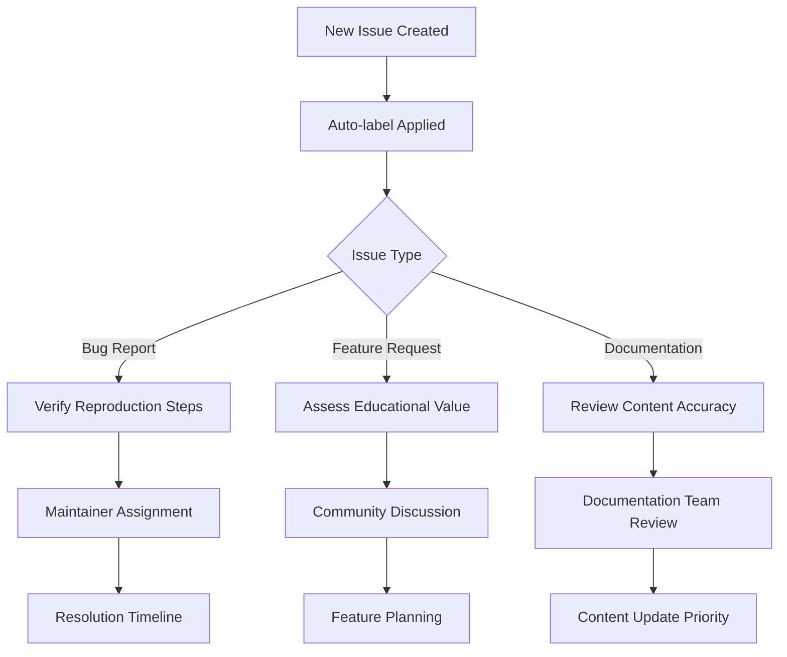
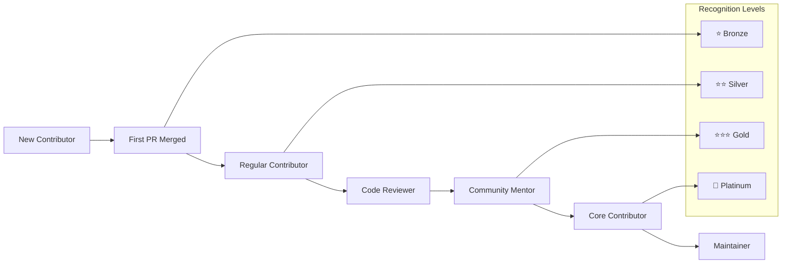

# Contributing to the Hello World Tutorial Repository

[](https://nodejs.org/)
[](https://expressjs.com/)
[](CONTRIBUTING.md)
[](CODE_OF_CONDUCT.md)

## Guidelines for Educational Contributions and Collaborative Development

Thank you for your interest in contributing to this repository's tutorials!
The [**Node.js Hello World Tutorial**](src/nodejs-tutorial/README.md) now
lives in this repository, at `src/nodejs-tutorial`, where it serves
`GET /hello` on Node.js v24.21.0 LTS with Express.js v5.2.1
[src/nodejs-tutorial/package.json:9,18]. Its Python
sibling, the Flask tutorial at `src/backend`, answers the same path with a JSON
envelope [src/backend/app.py:367-411]. This guide covers contributing to either
one, and every instruction below names the tutorial it applies to.

### Our Educational Mission

Our mission is to provide an accessible, high-quality learning environment
where developers of all skill levels can contribute to and learn from
real-world HTTP services while building professional development skills. We
believe that the best way to learn is through collaborative contribution,
mentoring, and hands-on experience with modern web development technologies.

**Community Values:**
- **Educational excellence and learning-focused development** - Every
  contribution should deepen understanding of the runtime, framework and HTTP
  concepts taught by the tutorial it touches
- **Inclusive collaboration and patient guidance for all skill levels** - We welcome contributors from beginners to experts
- **Quality code with comprehensive testing and documentation** - Professional standards with educational clarity
- **Professional development practices and industry standards** - Real-world experience with modern development workflows
- **Open source collaboration and knowledge sharing** - Building skills while contributing to the community

---

## Table of Contents

- [🎯 Contribution Overview](#-contribution-overview)
- [🚀 Development Setup](#-development-setup)
- [📋 Code Standards](#-code-standards)
- [🧪 Testing Guidelines](#-testing-guidelines)
- [🔄 Pull Request Process](#-pull-request-process)
- [📚 Documentation Standards](#-documentation-standards)
- [🐛 Issue Reporting](#-issue-reporting)
- [🔒 Security Guidelines](#-security-guidelines)
- [🏆 Recognition Program](#-recognition-program)

---

## 🎯 Contribution Overview

### Types of Contributions

We welcome various types of contributions that enhance the educational value
of the tutorials in this repository:

#### **Code Contributions**
- **Bug fixes** - Resolve issues and improve reliability
- **Feature enhancements** - Add educational value while maintaining simplicity
- **Performance improvements** - Optimize server response times and resource usage
- **Educational code examples** - Improve clarity and learning value
- **Express.js v5 modernization** - Leverage latest framework features

#### **Documentation Contributions**
- **Tutorial improvements** - Enhance learning clarity and progression
- **Code commenting** - Add educational explanations for complex concepts
- **Setup instructions** - Improve development environment guidance
- **Troubleshooting guides** - Help learners overcome common obstacles
- **Educational context** - Explain the "why" behind implementation decisions

#### **Testing Contributions**
- **Test coverage improvements** - Achieve and maintain 100% coverage target
- **Educational test examples** - Demonstrate testing best practices
- **Performance testing** - Validate response time and resource requirements
- **Integration testing** - Ensure end-to-end functionality
- **Test documentation** - Explain testing strategies and patterns

#### **Community Support**
- **Issue triage** - Help organize and prioritize community issues
- **Beginner mentoring** - Guide new contributors through their first contributions
- **Code reviews** - Provide constructive, educational feedback
- **Educational discussions** - Share knowledge and learning resources

### Educational Focus

This project maintains a strong educational focus throughout the contribution process:

- **Learning-oriented development** - All contributions should enhance educational value
- **Progressive skill building** - Support contributors in developing professional skills
- **Real-world practices** - Demonstrate industry-standard development workflows
- **Collaborative learning** - Learn from each other through code reviews and discussions
- **Professional growth** - Build skills in the stack you contribute to,
  testing, and collaboration

---

## 🚀 Development Setup

**Scope: the Node.js tutorial at `src/nodejs-tutorial`.** Every step in this
section - the runtime install, the dependency install, the verification run
and the troubleshooting entries - sets up that tutorial. Setting up the Flask
tutorial is documented with it, in `src/backend/README.md`, and needs none of
these commands.

### System Requirements

**Scope: the Node.js tutorial at `src/nodejs-tutorial`.** The Flask tutorial
documents its own Python requirements alongside it, in `src/backend/README.md`.

| Component | Minimum Version | Recommended | Purpose |
| --- | --- | --- | --- |
| **Node.js** | v24.21.0 LTS | Latest LTS | JavaScript runtime environment |
| **npm** | v11.19.0 | Latest | Package manager (bundled with Node.js) |
| **Git** | v2.30.0 | Latest | Version control and collaboration |
| **curl** | Any release | Latest | HTTP client the verification steps use |
| **gpg** | v2.2.0 | Latest | Signature check in the nvm install route only |
| **Memory** | 200MB RAM | 500MB | Development environment requirements |
| **Disk Space** | 500MB | 1GB | Dependencies and development tools |

`curl` is an external prerequisite: it is **not** bundled with Node.js, and it
is the client every verification request in this guide is sent with. Check it
with `curl --version`; if that prints nothing, install it from your platform's
package manager, or skip it entirely — every `curl` command here requests one
URL, so opening `http://127.0.0.1:3000/hello` in a browser reaches the same
endpoint and shows the same body.

`gpg` is an external prerequisite too, and it is needed by **one** route
only: Option B below, which installs `nvm` from a GPG-signed release tag.
Check it with `gpg --version`. On Linux install the `gnupg` package from your
distribution; on macOS use GPG Suite or `brew install gnupg`; on Windows use
Gpg4win, or nothing at all — Git for Windows already ships a `gpg`
executable. Skip it entirely if you install Node.js by Option A, by a
distribution package or from the official tarball, because none of those
verifies a signature with it.

The version is pinned in two places, and neither is a hard gate. `.nvmrc`
holds the exact string `24.21.0`, which a version manager reads to *select* a
runtime, while the manifest declares `engines.node` as `>=24.21.0 <25`
[src/nodejs-tutorial/package.json:9] — a compatibility range npm only *warns*
about on a mismatch. The `node --version` check in the next step is the one to
rely on.

### Step-by-Step Setup

#### 1. **Install Node.js v24.21.0 LTS**

**Option A: Official Installer (Recommended for beginners)**
```bash
# Visit https://nodejs.org/ and download Node.js v24.21.0 LTS
# Install using the official installer for your operating system
# This provides the most stable and compatible installation

# Verify installation
node --version  # Outputs: v24.21.0
npm --version   # Outputs: 11.19.0 (bundled with Node.js)
```

Those two outputs are exact rather than floors: every transcript in this
guide was captured on Node.js 24.21.0 and the npm 11.19.0 bundled inside it.
Broader compatibility is a separate question, and the manifest answers it —
`engines.node` is declared as `>=24.21.0 <25`
[src/nodejs-tutorial/package.json:9]. A 24.x release above 24.21.0 satisfies
that floor and stays under the ceiling, so it remains inside the declared
range; Node.js 25 does **not**, because `<25` excludes it. Install 24.21.0 to
reproduce the outputs shown here.

**Option B: Node Version Manager (Advanced users)**

**This route executes no fetched script at all.** `nvm` publishes an
`install.sh`, and the usual instruction is to pipe it from the network into a
shell — but nvm publishes no checksum for that file, so there is no vendor
value to compare a download against, and a pipe leaves you no copy to inspect
and no moment to inspect it in: whatever the server returns runs immediately
with your account's privileges. The four steps below install `nvm` by
**cloning its repository at a GPG-signed release tag** and verifying that
signature, which replaces the installer entirely.

Pin `v0.40.7` or later, and not an older release: CVE-2026-1665 affects every
nvm release before 0.40.4, which is the release that fixes it, and
CVE-2026-10796 affects every release through 0.40.4 and is fixed in 0.40.5.
`v0.40.7` is the current release and carries both fixes.

This route needs `gpg` in addition to `git` and `curl`; the System
Requirements table above says how to obtain it on each platform. Step 3
clones into `$HOME/.nvm`, so that path must be absent or empty - if you
already have an `nvm` installed there, check it with `nvm --version` instead
of cloning over it.

```bash
# 1. Import the nvm maintainer's signing key over TLS from GitHub
curl -fsSL https://github.com/ljharb.gpg | gpg --import

# 2. Confirm the fingerprint before you trust it. It must print exactly:
#    951E 2402 099D DEBA 3E02  27AF 9F6A 681E 35EF 8B56
gpg --fingerprint 9F6A681E35EF8B56

# 3. Clone nvm at the signed release tag. No installer is involved: the
#    working tree at that tag IS the installation
git clone --depth 1 --branch v0.40.7 https://github.com/nvm-sh/nvm.git \
  "$HOME/.nvm"

# 4. Verify the tag signature
git -C "$HOME/.nvm" tag -v v0.40.7
```

Step 4 prints, among the tag message and the commit it covers, these four
lines:

```text
gpg:                using RSA key 951E2402099DDEBA3E0227AF9F6A681E35EF8B56
gpg: Good signature from "Jordan Harband <ljharb@gmail.com>" [unknown]
gpg: WARNING: This key is not certified with a trusted signature!
gpg:          There is no indication that the signature belongs to the owner.
```

The `[unknown]` marker and the "not certified" warning are **expected** for a
key you imported yourself and have not signed - they say your keyring holds
no chain of trust to the owner, not that anything is wrong with the
signature. What matters is both halves together: the signature is **good**,
and the RSA key it was made with matches the fingerprint you confirmed in
step 2. If the signature is not good, or the fingerprint differs from the
value above, **stop**: delete the clone and do not use it.

Then activate it, and add the same two lines to your shell profile
(`~/.bashrc`, `~/.zshrc` or `~/.profile`) so the activation persists across
terminals:

```bash
export NVM_DIR="$HOME/.nvm"
[ -s "$NVM_DIR/nvm.sh" ] && \. "$NVM_DIR/nvm.sh"
nvm --version   # 0.40.7
```

With `nvm` on the path, install and select the runtime:

```bash
# Install and use Node.js v24.21.0 LTS
nvm install 24.21.0
nvm use 24.21.0
nvm alias default 24.21.0

# Verify installation
node --version  # Should output: v24.21.0

# From the tutorial root, a bare `nvm use` reads the committed .nvmrc instead
cd src/nodejs-tutorial && nvm use
# Found <checkout>/src/nodejs-tutorial/.nvmrc with version <24.21.0>
# Now using node v24.21.0 (npm v11.19.0)
```

The clone in step 3 is shallow and pinned to one tag, which is what makes the
verification meaningful - so moving to a later `nvm` is not a `git pull`, it
is repeating steps 3 and 4 at the new tag.

If you would rather not manage keys at all, two routes need none: `nvm`'s own
README documents its supported installation methods
(<https://github.com/nvm-sh/nvm>), and the official Node.js downloads page
offers installers and tarballs directly
(<https://nodejs.org/en/download>). The tutorial asserts a post-condition,
not a route: `node --version` must report `v24.21.0`, and the official
installer, `nvm`, a distribution package and the release tarball are all
acceptable ways to get there, none of them a dependency of the tutorial
[src/nodejs-tutorial/README.md]. Option A stays the recommended route
precisely because it needs neither a keyring nor a clone.

#### 2. **Repository Setup and Forking**

Both tutorials live in this one repository, so there is nothing else to clone:
the Node.js tutorial is the `src/nodejs-tutorial` directory of this checkout,
not a separate project.

Both remotes below are driven from URLs you have in front of you, not from
the project metadata. The metadata does declare a repository URL
[pyproject.toml:142-147], but that URL does not resolve to a public
repository, so it must not be used as a remote: `git remote add` accepts any
string, and the failure would surface later, on the first `git fetch
upstream`. The two URLs you need are the clone URL GitHub shows on your fork
after you create it, and the clone URL of the repository you forked from —
written `<YOUR-FORK-URL>` and `<UPSTREAM-URL>` below.

```bash
# 1. Fork this repository on GitHub (the "Fork" button). GitHub then shows
#    your fork's clone URL: that is <YOUR-FORK-URL>

# 2. Clone your fork, then change into the directory git creates
git clone <YOUR-FORK-URL>
cd <directory the clone created>

# 3. Add the repository you forked from as the upstream remote. Its clone URL
#    is <UPSTREAM-URL>, shown on that repository's own page and linked from
#    your fork's "forked from" line
git remote add upstream <UPSTREAM-URL>

# 4. Confirm the result: two remotes, each listed for fetch and for push.
#    The placeholders stand for your own two URLs - git prints those, not
#    these names
git remote -v
# origin    <YOUR-FORK-URL> (fetch)
# origin    <YOUR-FORK-URL> (push)
# upstream  <UPSTREAM-URL> (fetch)
# upstream  <UPSTREAM-URL> (push)
```

#### 3. **Dependency Installation**

Every npm command in this guide runs from the Node.js tutorial root. The Flask
tutorial has no npm dependencies at all — its Python requirements are installed
from `requirements.txt` as `src/backend/README.md` describes.

```bash
# Navigate to the Node.js tutorial root
cd src/nodejs-tutorial

# Install the exact locked dependency tree (npm ci, because the lockfile is
# committed: it installs that tree exactly instead of resolving a new one)
npm ci
# added 88 packages, and audited 89 packages in 401ms  (elapsed time varies)
# found 0 vulnerabilities

# Verify the two declared dependencies are installed
npm list express    # Should show express@5.2.1
npm list supertest  # Should show supertest@7.2.2

# Run security audit
npm audit
# found 0 vulnerabilities
```

Two packages, both declared at exact versions
[src/nodejs-tutorial/package.json:17-22]: `express` 5.2.1 at runtime and
`supertest` 7.2.2 for the tests. There is deliberately no third-party test
framework, no file watcher, no dotenv loader and no assertion library — the
Testing Guidelines section below names the Node built-in that replaces each
one.

#### 4. **Development Environment Verification**

`npm start` runs `node src/server.js` [src/nodejs-tutorial/package.json:12].
It is a foreground process that never returns on its own, so verify from a
second terminal and stop it with `Ctrl-C`.

```bash
# Start the development server
npm start

# Expected output. npm first echoes the two-line script banner - the package
# name and the command - which is elided here; then the application's own
# startup line:
#
# Listening on http://127.0.0.1:3000 (GET /hello)
```

That line is the only line the application writes to stdout **while it is
serving**: there is no second startup line and no per-request logging. It is
interpolated from the host and port actually bound — the listen callback
builds it from what `server.address()` reports rather than from the values
it was handed [src/nodejs-tutorial/src/server.js:243-268], the banner itself
at [:267] — so it stays truthful when either is overridden. `npm run dev` is
the watch-mode alternative and prints the same line.

Stopping the server writes one more line, so the serving claim above is not a
whole-process claim. `Ctrl-C` in the server terminal sends `SIGINT`, and the
shutdown handler logs the signal it received before closing:

```text
SIGINT received: closing server
```

A signalled stop — `kill "$SERVER_PID"` — sends `SIGTERM` and logs
`SIGTERM received: closing server` instead. From either signal the handler
calls `close()` once: that stops accepting, and on this runtime it reaps the
idle keep-alive sockets itself, so nothing has to drop them first. In-flight
requests then drain inside a ten-second grace period; the connections still
open are cut only when that period expires, or when a second signal arrives
and escalates rather than leaving you waiting
[src/nodejs-tutorial/src/server.js:304-390]. It calls no `process.exit` —
it sets the exit status and lets the drained event loop end the process —
and that status is `0` only for a drain that finished on its own inside the
grace period with no bind failure recorded earlier in the run; a forced
close or an earlier failure leaves `1`. The two signal registrations that
reach the handler are at [src/nodejs-tutorial/src/server.js:395-396].

**Test the endpoint in a new terminal:**

Both commands below need `curl`. Without it, open
`http://127.0.0.1:3000/hello` in a browser instead: it sends the same `GET`
request to the same URL, and the browser shows the response body.

```bash
# Test the /hello endpoint
curl http://127.0.0.1:3000/hello

# Test with headers - the status line and every response header
curl -i http://127.0.0.1:3000/hello

# Stop the server: Ctrl-C in the server terminal sends SIGINT, which logs the
# signal and closes the server - close() reaps the idle keep-alive sockets
# itself, in-flight requests drain inside a ten-second grace period, and the
# handler calls no process.exit: it sets the status and lets the drained event
# loop end the process, leaving 0 for a drain that finished inside that period
# with no bind failure recorded, per the shutdown handler
# [src/nodejs-tutorial/src/server.js:304-390]; the signal reaches that handler
# through the two registrations at [src/nodejs-tutorial/src/server.js:395-396]
```

What those two commands should return is documented in full — the status, the
body, the media type and every response header, each one explained — in
[the tutorial's API reference](src/nodejs-tutorial/docs/api-reference.md).
Compare your output against that reference rather than against this guide:
the reference is the single authority for the contract, and this guide
publishes the commands only.

#### 5. **Run Test Suite**

Neither test command needs a server started: each test drives the application
object `createApp()` returns rather than a running server, and `supertest`
manages the transport itself, opening its own ephemeral loopback listener per
request. So no **fixed** port is bound, and nothing has to be running before
you type the command
[src/nodejs-tutorial/test/hello.test.js:28-31,37-102].

```bash
# Execute complete test suite
npm test

# Expected output, with npm's two-line script banner elided and durations
# omitted because they vary between runs: four ✔ lines, one per test, each
# named for the property it proves - they are quoted from the test file
# itself in the Testing Guidelines section below - and then the counts,
# which are what you actually assert:
#
# ℹ tests 4
# ℹ suites 0
# ℹ pass 4
# ℹ fail 0

# Run tests with coverage
npm run test:coverage

# Expected: the same four tests, then 100.00 line, branch and function
# coverage for src/app.js and src/routes/hello.js. src/server.js is absent
# from the table by design - the suite never loads the module that binds the
# socket. The --experimental-test-coverage flag behind this script is marked
# experimental by Node, so treat its output as informative.
```

Assert the counts, not the exit status: `node --test` exits `0` on an empty
suite, so a run that silently discovered nothing still looks green. `tests 4`
and `pass 4` are the lines that prove the suite ran.

### IDE and Editor Setup

#### **Visual Studio Code (Recommended)**

There is nothing you must install. This repository ships **no linter and no
formatter configuration for JavaScript** — no ESLint dependency, no ESLint
config file, no Prettier config — so no extension is needed to match a
project standard, and JSON editing needs none either: VS Code has that
support built in.

One extension is worth naming as an **optional personal preference**, with
the caveat that the repository configures nothing for it, so it applies its
own defaults rather than a project style:

```bash
# Optional, personal preference - nothing in this repository configures it
code --install-extension esbenp.prettier-vscode
```

**VS Code settings.json** — also personal preference, for the same reason.
Format-on-save applies whatever your editor or the extension above decides,
not a repository rule; the quote style matches the single quotes the
tutorial's own source uses [src/nodejs-tutorial/src/server.js:33]:

```json
{
  "editor.formatOnSave": true,
  "javascript.preferences.quoteStyle": "single",
  "typescript.preferences.quoteStyle": "single"
}
```

No test-runner extension or editor setting is listed, and none is needed: the
tests run on Node's built-in runner, which has no configuration file and no
editor integration to install. Run them with `npm test` from
`src/nodejs-tutorial/`, in the editor's terminal or any other.

#### **Alternative Editors**

- **WebStorm**: Excellent built-in Node.js support and debugging
- **Sublime Text**: Fast and customizable
- **Vim/Neovim**: For advanced users with terminal preferences

Atom is no longer among them: GitHub sunset it on 15 December 2022 and
archived its repositories, so it is recorded here as historical rather than
recommended.

### Troubleshooting Common Setup Issues

#### **Port 3000 Already in Use**

The first collision to rule out is inside this repository: the Flask
development container publishes host port 3000
[infrastructure/docker/docker-compose.yml:86], so running it and the Node.js
tutorial at the same time contends for one port.

**Move your own server, rather than removing someone else's.** Overriding the
port is the remedy: it needs no privileges, breaks nothing that is already
running, and is the documented escape.

```bash
# Primary remedy - PORT=<n> npm start is the documented override
PORT=3001 npm start
# Listening on http://127.0.0.1:3001 (GET /hello)

# Second fallback, because the Flask production container publishes host
# port 3001 [infrastructure/docker/docker-compose.yml:231]
PORT=3100 npm start
```

If you do need port 3000 back, reclaim it in two steps, and never in one:
first **look at what is holding it**, then signal that single process only
once you have confirmed it is one you started. Piping a list of PIDs into
`kill` signals every process on the port, including one belonging to another
user or to a service you did not start.

```bash
# Step 1 (macOS/Linux): display the holder - command, PID and user
lsof -nP -iTCP:3000 -sTCP:LISTEN

# Step 2: only if that line is a process you started, signal that one PID,
# substituting the number you just read. Never a piped list of PIDs
kill <PID>
```

```bash
# Step 1 (Windows): display the holder - the PID is the last column
netstat -ano | findstr :3000

# Step 2: identify that PID before touching it
tasklist /FI "PID eq <pid>"

# Step 3: only if it is a process you started, end that one PID
taskkill /PID <pid>
```

#### **Node.js Version Issues**

An engine mismatch does not fail the install — npm prints an `EBADENGINE`
warning and carries on — so check the version explicitly.

```bash
# Check current version
node --version

# Update to v24.21.0 LTS if needed
# Download from https://nodejs.org/
# Or use nvm: nvm install 24.21.0 && nvm use 24.21.0
```

#### **Permission Issues**

Generic npm tooling advice: it is about your machine's npm installation, not
about either tutorial in this repository.

```bash
# Fix npm permissions on macOS/Linux
sudo chown -R $(whoami) ~/.npm

# Or configure npm to use a different directory
mkdir ~/.npm-global
npm config set prefix '~/.npm-global'
echo 'export PATH=~/.npm-global/bin:$PATH' >> ~/.bashrc
source ~/.bashrc
```

---

## 📋 Code Standards

**Scope: the Node.js tutorial at `src/nodejs-tutorial`.** Every JavaScript
example in this section is either quoted from that tutorial's source or
explicitly marked as an illustrative pattern it does not contain. The Flask
tutorial's Python standards are governed by the tooling already configured for
it, `.flake8` and `pyproject.toml`.

### JavaScript ES6+ Conventions

#### **Modern Syntax Requirements**

```javascript
// ✅ GOOD: Use const/let instead of var
const express = require('express');
const app = express();
let serverInstance;

// ❌ AVOID: var declarations
var express = require('express');
```

```javascript
// ✅ GOOD: Arrow functions for callbacks - quoted from the tutorial's two
// signal registrations [src/nodejs-tutorial/src/server.js:395-396]
process.on('SIGINT', () => shutdown('SIGINT'));
process.on('SIGTERM', () => shutdown('SIGTERM'));

// ✅ GOOD: Template literals for the strings a callback builds - quoted
// from the readiness line [src/nodejs-tutorial/src/server.js:266-267],
// which interpolates the authority the listener itself reports rather than
// the values that were requested
const authority = formatAuthority(server.address());
console.log(`Listening on http://${authority} (GET /hello)`);

// ✅ GOOD: Destructuring assignment, used the way the tutorial uses it - on
// a module's exports [src/nodejs-tutorial/src/server.js:26]
const { createApp } = require('./app');

// ✅ GOOD: Defaults named once as constants instead of being spelled inline
// at the point of use - quoted from [src/nodejs-tutorial/src/server.js:33]
// and [:43]. The host default is the loopback address 127.0.0.1, spelled
// that way in every command, transcript and URL this repository publishes
const DEFAULT_HOST = '127.0.0.1';
const DEFAULT_PORT = 3000;

// ✅ GOOD: How the environment is actually read - the opening line of
// resolvePort(), quoted [src/nodejs-tutorial/src/server.js:123]; the host
// resolver opens the same way at [:153]. `??` with a trim treats an
// exported-but-empty value the same as an unexported one, and the checks
// that follow it decide whether the default above applies
const raw = (process.env.PORT ?? '').trim();

// ✅ GOOD: The one listener, created only once both values have validated -
// quoted [src/nodejs-tutorial/src/server.js:274-277]. Its callback is a
// named function rather than an arrow, because it carries a docblock and
// two exits, and the name is what a reader sees at the call site
const server =
  HOST === null || PORT === null
    ? null
    : createApp().listen(PORT, HOST, announceListening);
```

The route handler is deliberately not reproduced in this syntax section, and
it is not reproduced anywhere else in this guide either. The two habits it
demonstrates — an arrow callback, and the value it sends produced in exactly
one place — are worth copying, and **Modern Routing Patterns** below shows
both on an illustrative endpoint instead. The real module is
[src/nodejs-tutorial/src/routes/hello.js], which is where the endpoint's own
values belong.

Why a trim and an explicit blank test rather than a destructuring default? A
default inside a destructuring pattern applies **only** when the property is
`undefined`. An exported-but-empty `PORT=` is not `undefined`, so a
destructuring default would leave the empty string in place and hand it to
`listen()` instead of the constant. Empty-string handling is exactly why the
shipped resolvers trim what they read and then test for blank explicitly
[src/nodejs-tutorial/src/server.js:127-129] and [:157-159]: a blank value
takes the default, and anything else is validated before it reaches the
listener rather than being decided by a falsy test. The snippet below is an
**illustration this tutorial does not contain**, kept only for that
contrast:

```javascript
// ❌ NOT IN THIS TUTORIAL: destructuring defaults, shown only to contrast
// with the resolver line quoted above. They apply to `undefined` alone, so
// an exported-but-empty PORT= would survive as the empty string
const { PORT = 3000, HOST = '127.0.0.1' } = process.env;
```

#### **Educational Code Commenting**

Comments should explain the decision, not restate the syntax. The factory
below is **illustrative only; it is not this repository's source.** It makes
the same three decisions the tutorial's own factory makes - one application
per call, hardening before routing, terminal handler last
[src/nodejs-tutorial/src/app.js:31-58] - but it answers with a body of its
own, so no value of the published contract appears in this guide. That
contract is specified in
[the tutorial's API reference](src/nodejs-tutorial/docs/api-reference.md),
section `#the-get-hello-contract`. Like the real factory, this one writes
nothing per request, because a request logger would put noise in front of
the one lesson.

```javascript
/**
 * Build a fresh Express.js v5.2.1 application with educational focus.
 * Demonstrates HTTP server assembly: hardening, one route, one fallback.
 *
 * This is a factory, not a shared singleton: every call returns a new
 * application, which is what lets each test construct its own and drive it
 * through supertest with no pre-started server and no fixed port.
 *
 * @returns {express.Application} Configured Express app instance
 */
function createApp() {
  const app = express();

  // Disable X-Powered-By header for security awareness
  // Express.js v5 security enhancement - prevents framework fingerprinting
  app.disable('x-powered-by');

  // Mounted at the application root, because the route module declares the
  // full path itself - mounting under a prefix would nest that path twice
  app.use(router);

  // Registered last, so a request reaches it only when no route matched
  app.use((req, res) => {
    res.status(404).json({ error: 'route_not_found' });
  });

  return app;
}
```

### Node.js v24.21.0 LTS Best Practices

#### **Module Organization**

Three modules, each with one job: the route declares the endpoint, the
application assembles it, and the server binds it. The sketch below is
**illustrative only; it is not this repository's source** - it mounts a
router for an endpoint the tutorial does not serve, precisely so that the
structure can be shown without restating a contract value. The real modules
are [src/nodejs-tutorial/src/routes/hello.js],
[src/nodejs-tutorial/src/app.js] and [src/nodejs-tutorial/src/server.js];
what the real endpoint answers is specified in
[the tutorial's API reference](src/nodejs-tutorial/docs/api-reference.md).

```javascript
// ✅ GOOD: Clear module structure
// File: src/app.js (illustrative, not this repository's source)
const express = require('express');
const { router } = require('./routes/uptime');

/**
 * Creates and configures the Express.js application
 * Educational focus: Demonstrates modular application structure
 */
function createApp() {
  const app = express();

  // Core middleware setup
  app.disable('x-powered-by');  // Security: Remove framework fingerprinting

  // Route configuration: the router declares the full path, so mount at root
  app.use(router);

  // Terminal not-found handler (must be last, after the route mount)
  app.use((req, res) => {
    res.status(404).json({ error: 'route_not_found' });
  });

  return app;
}

module.exports = { createApp };
```

The factory is the module's whole public interface — `module.exports =
{ createApp }` — and in the tutorial that is what `src/server.js` requires
[src/nodejs-tutorial/src/server.js:26] and what `test/hello.test.js` drives
[src/nodejs-tutorial/test/hello.test.js:31].

#### **Error Handling Patterns**

**Illustrative pattern, not tutorial code.** The tutorial registers no error
middleware at all: its only fallback is the terminal not-found handler in its
own application module [src/nodejs-tutorial/src/app.js:50-55] - the
illustrative factories above show where such a handler sits, not what the
tutorial's answers with - and an unhandled rejection therefore reaches
Express's own default handler, which answers `500` with an HTML body. The
handler below is the shape a contribution that *adds* error handling should
follow.

Three rules decide whether such a handler is safe, and the third is the one
that actually bounds what a log can leak.

1. **Untrusted text is never interpolated into a log message.** It is
   sanitised and placed in a structured record, so a crafted path carrying
   `CR`/`LF` cannot forge a second log line (CWE-117).
2. **Only allowlisted fields are logged.** No header, no cookie, no client
   IP and no `User-Agent` reaches the record at all (CWE-532).
3. **In production the record carries safe metadata only** - a stable error
   code, a category, an allowlisted method and the route pattern the
   application itself declared - and never the error's own message or the
   path the client chose.

Redaction is what makes the development record survivable, not what makes
the production one safe. It rewrites the secret shapes its patterns
recognise - a bearer token, a `password=` or `api_key=` assignment, a
JWT-shaped string, a long hexadecimal run, an email address - and it is
**not a guarantee**: a secret in a shape no pattern matches is still in the
value. That residue is what rule 3 exists for. Truncation is not a control
either; it shortens a record, and a shortened secret is still a secret.

```javascript
// ✅ GOOD: Error handling whose logging is safe to trust

// Hard cap applied to an untrusted value BEFORE the redaction patterns run,
// so no pattern is ever handed an unbounded string
const LOG_INPUT_MAX = 2048;

// Characters kept in the finished record, after redaction
const LOG_FIELD_MAX = 120;

// Methods that may be logged verbatim. Anything else is a value the client
// chose, so it collapses to one constant rather than reaching the log
const LOG_METHODS = new Set([
  'GET', 'HEAD', 'POST', 'PUT', 'PATCH', 'DELETE', 'OPTIONS'
]);

/**
 * Redaction patterns, applied in order.
 *
 * Every one of them is linear: each quantifier runs over a character class
 * that excludes the delimiter following it, so no group is nested inside a
 * quantifier and none of them can backtrack catastrophically (ReDoS). The
 * marker is deliberately visible, so a reader can tell redaction happened
 * rather than wondering whether the value was empty.
 */
const LOG_REDACTIONS = [
  // Authorization: Bearer <token>, wherever it appears in the text
  [/\bbearer\s+[A-Za-z0-9._~+/=-]{8,}/gi, 'bearer [redacted]'],
  // key=value and key: value assignments for the secret-bearing names
  [/\b(api[_-]?key|apikey|token|password|secret)(\s*[:=]\s*)[^\s,;&)"']+/gi,
    '$1$2[redacted]'],
  // JWT-shaped three-segment strings: <base64url>.<base64url>.<base64url>
  [/\b[A-Za-z0-9_-]{8,}\.[A-Za-z0-9_-]{8,}\.[A-Za-z0-9_-]{8,}/g,
    '[redacted-jwt]'],
  // Long hexadecimal runs: digests, session identifiers, raw keys
  [/\b[0-9a-f]{32,}\b/gi, '[redacted-hex]'],
  // Email addresses. The domain half is matched loosely on purpose: this
  // errs towards redacting something that is not an address
  [/\b[A-Za-z0-9._%+-]{1,64}@[A-Za-z0-9.-]{1,253}/g, '[redacted-email]']
];

/**
 * Make one untrusted value safe to log.
 *
 * The four steps run in this order, and the order is the whole point:
 *
 * 1. Strip every C0 and C1 control character. CR and LF are what a
 *    log-forging payload needs to open a second record (CWE-117), so they
 *    go first, before any later step can be fooled by an embedded newline.
 * 2. Slice to LOG_INPUT_MAX. The patterns are linear, but a hard input cap
 *    means none of them is ever handed unbounded input, so this function's
 *    cost has a ceiling that does not depend on the patterns at all.
 * 3. Redact. Each pattern replaces the secret material it recognises with a
 *    visible marker (CWE-532).
 * 4. Truncate to the display cap. Truncation is LAST because truncating
 *    first can cut a secret in half and leave the half that remains
 *    unmatched by every pattern.
 *
 * @param {unknown} value Untrusted value of any type
 * @param {number} [max=LOG_FIELD_MAX] Characters to keep. Raise it only for
 *   a field that is legitimately long, such as a development stack trace
 * @returns {string} Single-line, redacted, length-capped text safe to log
 */
function forLog(value, max = LOG_FIELD_MAX) {
  let text = String(value)
    .replace(/[\u0000-\u001F\u007F-\u009F]/g, '')
    .slice(0, LOG_INPUT_MAX);

  for (const [pattern, marker] of LOG_REDACTIONS) {
    text = text.replace(pattern, marker);
  }

  return text.slice(0, max);
}

/**
 * A stable identifier for the failure, safe to log and safe to keep in a
 * dashboard: either this codebase's own error code, or one derived from the
 * status. An `err.code` that is not a plain uppercase token is discarded
 * rather than logged, because a code can carry text an attacker supplied.
 *
 * @param {Error & {code?: unknown}} err The error being handled
 * @param {number} statusCode Status the response will carry
 * @returns {string} Stable code, safe to log
 */
function errorCode(err, statusCode) {
  const code = typeof err.code === 'string' ? err.code : '';
  return /^[A-Z][A-Z0-9_]{0,39}$/.test(code) ? code : `HTTP_${statusCode}`;
}

/**
 * The route pattern the request matched, read from the application's own
 * route table - a string this codebase wrote, not one the client sent, and
 * therefore the safe stand-in for the raw path. A request that matched
 * nothing has no pattern to report, so it reports one constant.
 *
 * @param {express.Request} req Express request object
 * @returns {string} Route pattern, or 'unmatched'
 */
function loggableRoute(req) {
  const pattern = req.route && req.route.path;
  return typeof pattern === 'string' ? pattern : 'unmatched';
}

function createErrorHandler() {
  // Four parameters: the arity is what marks this as error middleware in
  // Express, so `next` stays in the signature even when unused
  return (err, req, res, next) => {
    const statusCode = err.statusCode || 500;
    const isProduction = process.env.NODE_ENV === 'production';

    // One structured record instead of an interpolated message, and in
    // production these seven fields are the whole of it: a stable code, a
    // category, an allowlisted method and the matched route pattern. No
    // raw message, no request path, no header, no cookie, no client IP
    const record = {
      event: 'request_error',
      status: statusCode,
      code: errorCode(err, statusCode),
      category: statusCode >= 500 ? 'server_error' : 'client_error',
      method: LOG_METHODS.has(req.method) ? req.method : 'other',
      route: loggableRoute(req),
      timestamp: new Date().toISOString()
    };

    // Outside production the three diagnostic fields are added, each one
    // through forLog(). A stack maps the server's internals, so it never
    // appears in a production record at any length
    if (!isProduction) {
      record.message = forLog(err.message);
      record.path = forLog(req.path);
      record.stack = forLog(err.stack, 2000);
    }

    console.error(record);

    // In production the detail stays server-side and the client gets a
    // generic message; in development the redacted message is returned for
    // learning. The request path is never echoed back
    res.status(statusCode).json({
      status: statusCode,
      message: isProduction
        ? 'Internal Server Error'
        : forLog(err.message),
      timestamp: new Date().toISOString()
    });
  };
}
```

### Express.js v5.2.1 Patterns

#### **Security Features Utilization**

Of the measures below, only `app.disable('x-powered-by')` is in the tutorial
[src/nodejs-tutorial/src/app.js:37]; the extra response headers are an
illustrative pattern, and a route with an `await` in it is illustrative too —
the tutorial's single handler is synchronous.

```javascript
// ✅ GOOD: Leverage Express.js v5 security enhancements
const express = require('express');

function setupSecurityMiddleware(app) {
  // Express.js v5 automatically handles promise rejections
  // No need for manual .catch() on async route handlers
  
  // ReDoS protection: path-to-regexp@8.x automatically prevents
  // regular expression denial of service attacks
  app.get('/hello', async (req, res) => {
    // This promise rejection is automatically forwarded to error middleware
    const result = await processHelloRequest();
    res.send(result);
  });
  
  // Framework fingerprinting prevention
  app.disable('x-powered-by');
  
  // Basic security headers for educational awareness
  app.use((req, res, next) => {
    res.setHeader('X-Content-Type-Options', 'nosniff');
    res.setHeader('X-Frame-Options', 'SAMEORIGIN');
    next();
  });
}
```

#### **Modern Routing Patterns**

The route module below is **illustrative only; it is not this repository's
source.** It declares an endpoint the tutorial does not serve, so the three
decisions a learner should copy can be shown without restating a published
contract value: the router declares the **full** path, so the application
mounts it at the root; the response body is produced in exactly one place;
and the response is one status-type-send chain, passing a short media-type
form rather than a full header value. The real route module is
[src/nodejs-tutorial/src/routes/hello.js], and everything its endpoint
answers - status, body, byte count, media type and every response header -
is specified in
[the tutorial's API reference](src/nodejs-tutorial/docs/api-reference.md),
section `#the-get-hello-contract`, not here.

```javascript
// ✅ GOOD: Express.js v5 routing with educational clarity
// File: src/routes/uptime.js (illustrative, not this repository's source)
const express = require('express');

const router = express.Router();

/**
 * Illustrative uptime endpoint demonstrating Express.js v5 routing
 * Educational focus: Basic HTTP GET handling and response generation
 *
 * @route GET /uptime
 * @returns {void} Sends a body computed per request, so nothing is fixed
 */
router.get('/uptime', (req, res) => {
  // One status-type-send chain. The body is computed rather than written as
  // a literal, so this example pins no byte count and no response string.
  // No timing instrumentation either: an endpoint that publishes no
  // performance target gains nothing from measuring one here
  const body = JSON.stringify({ uptimeSeconds: process.uptime() });
  res.status(200).type('application/json').send(body);
});

module.exports = { router };
```

### Naming Conventions

#### **Functions and Variables**

```javascript
// ✅ GOOD: Descriptive, educational naming
const expressApp = createExpressApplication();
const serverInstance = startHttpServer(expressApp);
const helloRouteHandler = createHelloEndpoint();

// Function names should describe educational purpose
function validateNodejsCompatibility() { /* ... */ }
function demonstrateMiddlewareChaining() { /* ... */ }
function showcaseErrorHandling() { /* ... */ }

// ❌ AVOID: Unclear, non-educational naming
const app = create();
const server = start(app);
const handler = endpoint();
```

#### **File and Module Naming**

The Node.js tutorial is eleven files, and this is all of them. There is no
health route, no middleware directory and no utility module: a single-endpoint
service that needed either would be teaching the wrong lesson.

```text
src/nodejs-tutorial/
├── README.md                 # Install, run, verify, test, stop
├── package.json              # engines.node, four scripts, two exact deps
├── package-lock.json         # lockfileVersion 3, the tree npm ci installs
├── .nvmrc                    # 24.21.0, the version a manager selects
├── .env.example              # PORT and HOST, each annotated with its default
├── src/
│   ├── server.js             # HTTP server initialization and signals
│   ├── app.js                # Express application factory
│   └── routes/
│       └── hello.js          # Hello endpoint route handler
├── test/
│   └── hello.test.js         # Four tests against the contract
└── docs/
    ├── api-reference.md      # The endpoint contract, in full
    └── walkthrough.md        # Annotated tour of the code above
```

A contribution that adds a module adds it here, and updates this tree in the
same change.

---

## 🧪 Testing Guidelines

### Test Runner Configuration

**Scope: the Node.js tutorial at `src/nodejs-tutorial`.** The Flask tutorial
is tested with pytest, under `src/backend/tests/`.

#### **`node --test` setup - there is no configuration file**

The tutorial uses Node's built-in test runner. It is stable in the supported
runtime, ships with it, and needs no config file, no reporter and no
transform, which is why the manifest declares four scripts and no runner
settings at all [src/nodejs-tutorial/package.json:11-16].

```json
{
  "scripts": {
    "test": "node --test",
    "test:coverage": "node --test --experimental-test-coverage"
  }
}
```

Three properties of the runner are worth knowing before you change anything:

- **Discovery.** When it meets a directory named `test`, it treats every
  `.js`, `.cjs` and `.mjs` file inside it as a test file, whether or not the
  filename matches a test-naming convention. That is what makes bare
  `node --test` find `test/hello.test.js`.
- **The test script takes no path argument, deliberately.** Adding one that
  points at a directory breaks the runner: both `node --test test/` and
  `node --test test` fail, because the directory is resolved as an entry
  module. The output is
  `Error: Cannot find module '<checkout>/src/nodejs-tutorial/test'` with
  `code: 'MODULE_NOT_FOUND'`, a `✖ test` line, `fail 1`, and exit status `1`.
  Bare `node --test` works, and so does an explicit file path such as
  `node --test test/hello.test.js`. Do not "tidy" the script by adding the
  directory.
- **An empty suite exits `0`.** A run that discovers nothing reports
  `tests 0` and succeeds, and the coverage table then prints `100.00` over
  nothing at all. Assert `tests 4` and `pass 4`, never just the exit status.

#### **Test Organization Structure**

One test file, holding four flat `test()` declarations - four tests, and
eight assertion calls between them
[src/nodejs-tutorial/test/hello.test.js:42,56,61,73,85,93,97,101]. No suite
nesting, no fixtures directory and no custom matchers: a contract this small
needs none of them.

```text
src/nodejs-tutorial/
└── test/
    └── hello.test.js   # Four tests against the published contract
```

### Supertest HTTP Testing

`supertest` 7.2.2 is the one devDependency
[src/nodejs-tutorial/package.json:20-22]. It is handed the application object
the factory returns, never a base URL, so the suite needs no pre-started
server and no fixed port of its own — `supertest` starts a transient listener
on an ephemeral loopback port for each request.

#### **Endpoint Testing Patterns**

The suite below is **illustrative only; it is not this repository's source.**
It exercises the illustrative endpoint from the routing section above, so it
restates no published contract value, and it shows the four mechanics every
test in this tutorial uses: a flat `test()` declaration, a fresh application
built by the factory inside each test, `supertest` handed that application
object rather than a URL, and `node:assert/strict` for the comparison.

```javascript
// Illustrative: test/uptime.test.js, not this repository's source
const { test } = require('node:test');
const assert = require('node:assert/strict');
const request = require('supertest');
const { createApp } = require('../src/app');

test('GET /uptime is reachable', async () => {
  // A fresh application per test, so no state is shared between them
  const res = await request(createApp()).get('/uptime');

  // Proves the router is mounted and the path is reachable, without
  // pinning a status this guide is not the authority for
  assert.ok(res.status >= 200 && res.status < 300);
});

test('GET /uptime answers with a JSON media type', async () => {
  const res = await request(createApp()).get('/uptime');

  // A prefix comparison, because a charset parameter may follow the type
  assert.ok(res.headers['content-type'].startsWith('application/json'));
});

test('GET /uptime reports a numeric uptime', async () => {
  const res = await request(createApp()).get('/uptime');

  // The shape is asserted, not a literal: the value changes every run.
  // A JSON body arrives parsed in res.body; res.text holds it unparsed
  assert.equal(typeof res.body.uptimeSeconds, 'number');
});

test('an undeclared path reaches the terminal handler', async () => {
  const res = await request(createApp()).get('/no-such-path');

  // Proves the terminal handler is registered last and answers
  assert.equal(res.body.error, 'route_not_found');
});
```

The tutorial's own suite at [src/nodejs-tutorial/test/hello.test.js:37-102]
holds four tests, one for each behaviour the canonical reference documents,
with eight assertion calls between them
[src/nodejs-tutorial/test/hello.test.js:42,56,61,73,85,93,97,101]; the
runner reports `tests 4` and `suites 0`. Read it beside
[the tutorial's API reference](src/nodejs-tutorial/docs/api-reference.md),
which is where the values it asserts are published.

Between them the four prove exactly four properties: that the route exists,
that the body is byte-exact, that the media type carries its charset
parameter, and that an unmatched path answers 404. They are not a proof of the
whole published contract, which is wider than they are - the `HEAD`,
`OPTIONS`, `POST` and conditional-`304` behaviours and every header value rest
on the captured transcripts in the API reference, and the binding and
shutdown behaviour rests on the source, since the suite never loads
`src/server.js`. `Date`, `Connection` and `Keep-Alive` are transport-dependent
and nothing pins them at all
[src/nodejs-tutorial/docs/api-reference.md].

#### **Translating matcher-style test idioms**

Test code carried over from the matcher-style framework this tutorial replaced
with the built-in runner needs four mechanical substitutions, and no others.

| Matcher-style idiom | Replacement |
| --- | --- |
| nested `describe()` / `it()` | flat `test()` from `node:test` |
| `expect(a).toBe(b)` | `assert.strictEqual(a, b)` |
| `expect(h).not.toHaveProperty('x')` | `assert.strictEqual(h['x'], undefined)` |
| `.expect(200)` chained on the request | `assert.strictEqual(res.status, 200)` |

### Coverage Requirements and Quality Metrics

#### **Coverage Targets**

`node --test --experimental-test-coverage` reports three metrics per file, so
those are the three tracked here; there is no separate statement column.

| Coverage Type | Target | Minimum Acceptable | Rationale |
| --- | --- | --- | --- |
| **Line Coverage** | 100% | 95% | Complete code execution validation |
| **Function Coverage** | 100% | 100% | All functions must be tested |
| **Branch Coverage** | 100% | 95% | All code paths validated |

The tutorial reports `100.00` on all three for `src/app.js` and
`src/routes/hello.js`. `src/server.js` is **absent** from that table rather
than uncovered: the suite drives the application object and never loads the
module that binds the socket.

#### **Test-Driven Development Process**

**Illustrative only.** The Node.js tutorial serves exactly one endpoint and a
second one is outside its scope; this is the shape a contribution proposing
one would start from, written with the runner the tutorial uses.

```javascript
// Example: TDD process for a new feature
test('health endpoint reports server status (TDD example)', async () => {
  // 1. Write the failing test first (Red)
  const res = await request(createApp()).get('/health');

  // 2. Define the expected response contract
  assert.strictEqual(res.status, 200);
  assert.match(res.headers['content-type'], /^application\/json/);
  assert.strictEqual(res.body.status, 'OK');
  assert.strictEqual(typeof res.body.uptime, 'number');

  // 3. Implement the feature to make the test pass (Green)
  // 4. Refactor for educational clarity (Refactor)
});
```

#### **Educational Testing Practices**

**Illustrative only**, and deliberately built on a throwaway application
rather than the tutorial's: what it demonstrates is a framework behaviour, not
a contract the tutorial publishes.

```javascript
// Educational test with comprehensive learning comments
// Express.js v5 forwards a rejected promise to the error handling chain with
// no manual .catch() block anywhere
test('Express.js v5 forwards a rejected promise automatically', async () => {
  const scratch = express();

  scratch.get('/test-promise-rejection', async () => {
    throw new Error('Educational example: Automatic promise handling');
  });

  const res = await request(scratch).get('/test-promise-rejection');

  // With no error middleware registered, Express's own default handler answers
  // 500 with an HTML body and logs the stack server-side. Assert the status
  // and media type only: the default handler's markup is not a contract
  assert.strictEqual(res.status, 500);
  assert.match(res.headers['content-type'], /^text\/html/);
});
```

Note what this does **not** assert: a JSON error envelope with a `message`
field. The tutorial registers no error middleware, so there is none to assert
[src/nodejs-tutorial/src/app.js:50-55]. A contribution that adds one adds its
assertions with it.

### Performance Testing Requirements with pytest-benchmark (Flask tutorial)

**Scope: the Python Flask tutorial at `src/backend`, not the Node.js
tutorial.** Everything in this subsection is pytest and Flask code: `client`
is a Flask test client, and the `/hello` it calls is the Flask endpoint, which
answers with a JSON envelope [src/backend/app.py:367-411] and not with the
response the Node.js tutorial serves
[src/nodejs-tutorial/docs/api-reference.md]. Neither response is described by
value here; each project's own documentation is its authority. It sits in
this document because
performance testing is a repository-wide topic; it is retained and labelled
rather than removed, so the guidance is not lost, but do not read it as
applying to the Node.js tutorial.

**The Node.js tutorial publishes no performance target and no benchmark
suite.** Its tests are the four contract tests listed above, and a
contribution that wants to add a timing claim to it must first capture the
measurement that backs the claim.

#### **Response Time Validation using pytest-benchmark**

```python
# Performance testing for educational awareness
import pytest
import psutil
from flask import Flask

class TestPerformanceRequirements:
    """Performance testing using pytest-benchmark for statistical accuracy."""
    
    @pytest.mark.performance
    def test_hello_endpoint_response_time_benchmark(self, benchmark, client):
        """
        Educational performance test using pytest-benchmark.
        Provides statistical analysis with multiple iterations.
        """
        def make_hello_request():
            response = client.get('/hello')
            # A "not an error" guard rather than a status literal: what this
            # endpoint answers with is published by the Flask tutorial, in
            # src/backend/README.md, and is not restated in this guide
            assert response.status_code < 400
            return response
        
        # pytest-benchmark automatically handles iterations and statistical analysis
        result = benchmark(make_hello_request)
        
        # Educational performance analysis from benchmark stats
        stats = benchmark.stats
        print(f"📊 Performance Results:")
        print(f"   Average: {stats.mean * 1000:.2f}ms")
        print(f"   Median: {stats.median * 1000:.2f}ms")
        print(f"   Standard Deviation: {stats.stddev * 1000:.2f}ms")
        print(f"   Target: <100ms")
        
        # Performance assertions
        assert stats.mean < 0.100  # 100ms target
        assert stats.median < 0.050  # 50ms warm request target
    
    @pytest.mark.performance
    def test_memory_usage_monitoring(self, client):
        """Educational memory usage testing with psutil."""
        import psutil
        
        # Baseline memory measurement
        process = psutil.Process()
        baseline_memory = process.memory_info().rss / 1024 / 1024  # MB
        
        # Execute requests to test memory growth
        for _ in range(50):
            response = client.get('/hello')
            # Same "not an error" guard as above, for the same reason
            assert response.status_code < 400
        
        # Measure memory after requests
        current_memory = process.memory_info().rss / 1024 / 1024  # MB
        memory_growth = current_memory - baseline_memory
        
        print(f"📊 Memory Usage Results:")
        print(f"   Baseline: {baseline_memory:.2f}MB")
        print(f"   Current: {current_memory:.2f}MB")
        print(f"   Growth: {memory_growth:.2f}MB")
        print(f"   Target: <75MB total, <5MB growth")
        
        # Memory assertions
        assert current_memory < 75  # 75MB total limit
        assert memory_growth < 5    # 5MB growth limit
    
    @pytest.mark.benchmark
    def test_concurrent_request_performance(self, benchmark, client):
        """Educational concurrent request testing with pytest-benchmark."""
        import threading
        import queue
        
        def concurrent_requests():
            results = queue.Queue()
            
            def make_request():
                response = client.get('/hello')
                # Same "not an error" guard as above, for the same reason
                results.put(response.status_code < 400)
            
            # Create 10 concurrent threads
            threads = [threading.Thread(target=make_request) for _ in range(10)]
            
            # Start all threads
            for thread in threads:
                thread.start()
            
            # Wait for completion
            for thread in threads:
                thread.join()
            
            # Collect results
            success_results = [results.get() for _ in range(10)]
            return all(success_results)
        
        # Benchmark concurrent performance
        result = benchmark(concurrent_requests)
        assert result is True  # All requests succeeded
        
        # Validate performance under load
        assert benchmark.stats.mean < 0.2  # a fifth of a second under load
```

---

## 🔄 Pull Request Process

**Scope: the repository as a whole.** The branch strategy, commit format,
template and review process below apply to a change in either tutorial, or in
the shared documentation. Where a step runs a command, the command names the
tutorial it belongs to.

### Branch Management Strategy

#### **Git Workflow**

```bash
# 1. Sync with upstream before starting new work
git checkout main
git pull upstream main
git push origin main

# 2. Create feature branch with descriptive name
git checkout -b feature/add-health-check-endpoint
# or: fix/resolve-port-binding-error
# or: docs/improve-setup-instructions  
# or: test/add-performance-testing

# 3. Make changes and commit with clear messages
git add .
git commit -m "Add: health check endpoint for monitoring server status

- Implement /health route returning server uptime and status
- Add comprehensive test coverage for health endpoint  
- Include educational comments explaining monitoring concepts
- Update documentation with health check usage examples"

# 4. Push feature branch to your fork
git push origin feature/add-health-check-endpoint

# 5. Create pull request via GitHub interface
```

### Conventional Commit Message Format

#### **Commit Message Structure**

```bash
# Format: Type(scope): Brief description
# 
# Detailed explanation (optional)
# 
# Educational impact (optional)
# Breaking changes (if any)

# Examples:
git commit -m "Add: health check endpoint for server monitoring

Implements GET /health endpoint returning:
- Server uptime in seconds
- Current timestamp  
- Application version
- Memory usage statistics

Educational value:
- Demonstrates monitoring concepts
- Shows JSON response formatting
- Illustrates performance measurement

Closes #23"

git commit -m "Fix: resolve port binding error on Windows systems

- Update port configuration to handle Windows-specific binding
- Add error handling for EADDRINUSE scenarios  
- Include troubleshooting documentation
- Add cross-platform compatibility tests

Testing:
- Verified on Windows 11, macOS 14, Ubuntu 22.04
- Added automated tests for port conflict scenarios"

git commit -m "Docs: improve development setup instructions

- Add Node.js version verification steps
- Include troubleshooting for common setup issues
- Add IDE configuration recommendations
- Update dependency installation process

Educational improvements:
- Clearer step-by-step instructions for beginners
- Added video tutorial links
- Included common error solutions"
```

#### **Commit Types**

| Type | Description | Examples |
|------|-------------|----------|
| **Add** | New features or capabilities | `Add: rate limiting middleware`, `Add: logging system` |
| **Fix** | Bug fixes and corrections | `Fix: memory leak in request handling`, `Fix: Windows path issues` |
| **Update** | Improvements to existing features | `Update: Express.js to v5.2.1`, `Update: error messages` |
| **Docs** | Documentation changes only | `Docs: API documentation update`, `Docs: setup guide` |
| **Test** | Testing additions or modifications | `Test: integration test coverage`, `Test: performance benchmarks` |
| **Refactor** | Code restructuring without functionality changes | `Refactor: extract error handling`, `Refactor: modularize routes` |
| **Security** | Security-related improvements | `Security: update dependencies`, `Security: add input validation` |

### Pull Request Template and Standards

#### **Comprehensive PR Template**

When creating a pull request, please use the template below. It is written
for the repository as a whole: one tier of items applies to every change, and
two conditional tiers apply only to a change under `src/nodejs-tutorial` or
under `src/backend`. Complete the common tier and whichever conditional tier
matches the directories you touched; delete the other.

A word on the checked-in template, because "adapt it" is not honest advice.
`.github/PULL_REQUEST_TEMPLATE.md` is written for the Node.js tutorial from
beginning to end, not only in its opening: it runs to 508 lines, it is titled
for that tutorial [.github/PULL_REQUEST_TEMPLATE.md:2], its purpose line
carries the runtime and framework pins of the predecessor project this
repository migrated from [:4], and thirty-six of its lines mention Node.js,
Express or npm. GitHub pre-fills your description with it whichever project
you changed.

So do not edit it section by section. **Clear the pre-filled body and paste
the template below**, which is written for the repository as a whole. Its
version pins are not worth trusting either way: check `engines.node`
[src/nodejs-tutorial/package.json:9] for the Node.js tutorial, and
`src/backend/requirements.txt` for the Flask one. `.github/**` is
deliberately not modified by this guide, which is why the neutral template
lives here rather than replacing that file.

```markdown
## Summary

Brief description of the changes in this pull request.

### Which project does this change touch?
- [ ] `src/nodejs-tutorial` - the Node.js tutorial
- [ ] `src/backend` - the Flask tutorial
- [ ] Shared documentation or repository configuration

### Type of Change
- [ ] Bug fix (non-breaking change which fixes an issue)
- [ ] New feature (non-breaking change which adds functionality)  
- [ ] Breaking change (fix or feature that would cause existing functionality to not work as expected)
- [ ] Documentation update
- [ ] Testing improvement
- [ ] Educational enhancement

## Educational Alignment

### Learning Objectives Supported
- [ ] HTTP server fundamentals
- [ ] Framework concepts: Express.js, or Flask
- [ ] Runtime understanding: Node.js, or Python
- [ ] Testing best practices
- [ ] Professional development skills

### Educational Impact
Describe how this change enhances the learning experience for tutorial users.

### Skill Level Considerations  
Explain how this change affects learners at different skill levels (beginner, intermediate, advanced).

## Technical Implementation

### Changes Made
Detailed list of modifications to code, documentation, or configuration.

### Design Decisions
Explanation of technical choices and their rationale.

## Every Change: Quality Assurance Checklist

These items apply whichever directories you touched.

### Code Quality
- [ ] Educational comments explain concepts for learners
- [ ] Function, variable and file names are descriptive and educational
- [ ] Code complexity is appropriate for educational context

### Testing
- [ ] Unit tests written for new/modified functionality
- [ ] Integration tests updated for endpoint changes
- [ ] The full suite of the project you changed passes, run with that
      project's own runner (the conditional tiers below name it)
- [ ] Test outcomes asserted on reported results, not on exit status alone
- [ ] Educational test examples demonstrate best practices

### Security and Best Practices
- [ ] Input validation implemented where necessary
- [ ] Error responses don't expose sensitive information
- [ ] Dependencies are up-to-date and secure, and any new one is declared in
      the manifest of the project that uses it

### Documentation Quality
- [ ] README.md updated for functional changes - the README of the project
      you changed
- [ ] Code comments explain educational concepts
- [ ] API documentation updated for endpoint changes
- [ ] Educational context maintained throughout
- [ ] Examples are clear and functional
- [ ] No documented command or transcript left inaccurate by the change

### Performance Validation
- [ ] Any performance claim added is backed by a captured measurement
- [ ] Startup and response behaviour unchanged, or the change documented

### Educational Standards
- [ ] Changes enhance learning objectives
- [ ] Educational progression is maintained
- [ ] Content is accessible to target skill levels
- [ ] Learning resources are improved or maintained
- [ ] Community values are upheld

## Conditional: a change under `src/nodejs-tutorial`

Complete this tier only if you touched that directory; delete it otherwise.

### Runtime and Framework
- [ ] Stays inside the declared `engines.node` range `>=24.21.0 <25`
- [ ] Uses modern JavaScript ES6+ features appropriately
- [ ] Follows Express.js v5 patterns: automatic promise rejection handling,
      and the ReDoS protection path-to-regexp@8.x applies with no
      configuration
- [ ] Code follows JavaScript ES6+ standards and Node.js best practices

### Testing Framework Usage
- [ ] `node --test` patterns followed: flat `test()`, no runner config file
- [ ] `node:assert/strict` used for assertions
- [ ] Supertest v7.2.2 used for HTTP endpoint testing against `createApp()`
- [ ] Reported counts asserted (`tests N` / `pass N`), not just exit status
- [ ] All tests pass: `npm test`
- [ ] Coverage read: `npm run test:coverage`, targeting 100% and treating
      95% as the minimum - the runner reports coverage and does not fail a
      run for missing it, so this one is checked by reading
- [ ] No new advisories: `npm audit`
- [ ] No documented transcript left stale: a change outside a `.md` file
      means re-running `npm ci && npm test && npm run test:coverage` and
      replacing every transcript whose output moved

## Conditional: a change under `src/backend`

Complete this tier only if you touched that directory; delete it otherwise.
Every tool named here is one this repository actually configures.

### Runtime and Framework
- [ ] Flask application-factory structure preserved in `src/backend/app.py`
- [ ] Request handling stays stateless
- [ ] Dependencies declared in `src/backend/requirements.txt`, in the pin
      style already used there

### Testing and Tooling
- [ ] pytest run over the configured test path `tests`
      [src/backend/pytest.ini:8]
- [ ] The configured coverage gate honoured: `--cov-fail-under=100`
      [src/backend/pytest.ini:20]
- [ ] flake8 clean against the checked-in configuration, 88-character lines
      [.flake8:19]
- [ ] Formatting, import order, typing and security scanning follow
      `pyproject.toml`: `[tool.black]` at 88 columns [pyproject.toml:286],
      `[tool.mypy]` [pyproject.toml:318], `[tool.isort]`
      [pyproject.toml:358] and `[tool.bandit]` [pyproject.toml:378]

## CI/CD Integration

### Automated Checks
- [ ] GitHub Actions CI pipeline passes (Python jobs only - the workflows
      contain no Node or npm step, so a Node.js change is verified locally)
- [ ] All automated tests execute successfully
- [ ] Code coverage thresholds are met
- [ ] Security scanning shows no critical issues
- [ ] Linting passes without errors

### Quality Gates
- [ ] 100% test pass rate achieved, asserted on the reported results
- [ ] Coverage checked the way the project you changed reports it: read from
      `npm run test:coverage` for `src/nodejs-tutorial`, where the runner
      reports coverage and does not fail a run for missing a threshold, and
      enforced by the configured `--cov-fail-under=100` for `src/backend`
      [src/backend/pytest.ini:20]
- [ ] No critical or high severity vulnerabilities
- [ ] No documented command or transcript left inaccurate by the change
- [ ] Documentation completeness validated

### Deployment Readiness
- [ ] Changes are backward compatible
- [ ] No breaking changes to educational examples
- [ ] Tutorial progression remains intact
- [ ] Setup instructions still accurate
```

### Code Review Standards and Process

#### **Review Criteria Weights**

| Criteria | Weight | Description | Key Checkpoints |
|----------|--------|-------------|-----------------|
| **Educational Value** | 40% | Learning enhancement and educational impact | Does this improve understanding of the stack it teaches - Node.js with Express.js v5, or Python with Flask? Is progression maintained? |
| **Technical Quality** | 30% | Code quality, performance, and technical excellence | Express.js v5 patterns, or Flask patterns with the configured Python tooling? Error handling? Measured claims? |
| **Testing Completeness** | 20% | Testing coverage and quality validation | `node --test` with Supertest, or pytest? Coverage checked as that project reports it? Edge cases tested? |
| **Documentation Quality** | 10% | Documentation clarity and educational standards | Educational comments? Documentation updated? Examples clear? Accessibility addressed? |

#### **Review Process Timeline**

| Phase | Timeline | Requirements | Focus |
|-------|----------|-------------|-------|
| **Initial Review** | 24-48 hours | Minimum one maintainer response | Educational alignment and technical quality assessment |
| **Comprehensive Review** | 5 business days | All review criteria addressed | Testing, documentation, and educational impact validation |
| **Approval** | 1 maintainer approval + automated checks | All quality gates passed | Educational value confirmed, no blocking issues |

#### **Review Communication Standards**

The template below applies to **the repository as a whole** - a review of
either tutorial uses it. The filled-in example text happens to describe a
Node.js change; substitute the equivalent for a Flask one.

```markdown
## Review Feedback Template

### Educational Assessment ⭐⭐⭐⭐⭐
**Learning Value**: Excellent - clearly demonstrates Express.js v5 error handling patterns
**Skill Level Appropriateness**: Good for intermediate learners, might need beginner explanation
**Educational Progression**: Maintains learning flow and builds on previous concepts

### Technical Quality ✅
**Code Standards**: Follows Node.js v24 best practices and ES6+ conventions
**Performance**: No documented transcript invalidated; any timing claim is
backed by a captured run
**Security**: Utilizes Express.js v5 security features appropriately

### Suggested Improvements
1. **Add Educational Comments**: Include explanation of middleware execution order
2. **Test Enhancement**: Add performance test for concurrent requests
3. **Documentation**: Update README with new error handling examples

### Questions for Author
- Could you explain the choice of error message format for beginners?
- Have you considered adding a code example in the documentation?
```

### Merge Requirements

#### **Automated Quality Gates**

The checks below are the jobs the workflow in this repository actually
defines. It is a **Python-only pipeline** - `.github/workflows/ci.yml` and
`cd.yml` contain no `node` or `npm` step anywhere - so there is no Node status
check to require, and a change to the Node.js tutorial is verified with the
local commands in the Testing Guidelines section above.

```yaml
# All PRs must pass these automated checks:
required_status_checks:
  # Python matrix [.github/workflows/ci.yml:46-47]
  - "Test Suite (3.12)"
  # Python matrix [.github/workflows/ci.yml:46-47]
  - "Test Suite (3.11)"
  # Python matrix [.github/workflows/ci.yml:46-47]
  - "Test Suite (3.10)"
  # Dependency scan [.github/workflows/ci.yml:126-127]
  - "Security Scan"
  # Coverage gate [.github/workflows/ci.yml:208-209]
  - "Quality Gate"

# Branch protection rules
enforce_admins: false
required_pull_request_reviews:
  required_approving_review_count: 1
  dismiss_stale_reviews: true
  require_code_owner_reviews: false
  
restrictions:
  push: []  # No direct pushes to main branch
```

Each name above is a **job display name**, taken from the workflow file and
nothing else. GitHub matches a required status check against the exact
reported check-run name, and that name is the job's display name - not the
workflow name, and not the two joined by a separator, which is a string the
workflow file never defines. The jobs are `Test Suite`
[.github/workflows/ci.yml:39-40], `Security Scan`
[.github/workflows/ci.yml:126-127] and `Quality Gate`
[.github/workflows/ci.yml:208-209]. The `(3.12)`, `(3.11)` and `(3.10)`
suffixes come from the Python version matrix
[.github/workflows/ci.yml:46-47], which is what makes the test job report one
check per version. The workflow itself is named `CI Pipeline`
[.github/workflows/ci.yml:1]; that name groups the run in GitHub's interface
and forms no part of a check's context.

**None of these strings has been confirmed against a live run**, because this
guide cannot observe one. Because the match is exact, read the real context
before you rely on it: open a pull request, expand its checks list, copy each
name from there, and enter those copies into branch protection. If a matrix
dimension, a job name or a matrix value changes, the reported names change
with it and the branch-protection entries must be re-copied.

#### **Pre-merge Validation**

The first three commands are the Node.js tutorial's, and run from
`src/nodejs-tutorial`; each resolves to one of its four scripts or to an npm
built-in. A Flask-only change is validated with pytest instead, as
`src/backend/README.md` describes.

```bash
# Maintainer pre-merge checklist, from src/nodejs-tutorial:
# 1. All automated checks passing
npm test && echo "✅ Tests passed"

# 2. Coverage threshold met
npm run test:coverage && echo "✅ Coverage acceptable"

# 3. Security audit clean
npm audit && echo "✅ No security issues"

# 4. Educational value confirmed
echo "✅ Educational objectives enhanced"

# 5. Documentation updated
echo "✅ Documentation reflects changes"
```

---

## 📚 Documentation Standards

**Scope: the repository as a whole**, with one caveat stated where it matters:
the JavaScript examples are the Node.js tutorial's own modules, and the
endpoint-documentation rule below points at that tutorial's API reference as
the single authority for its contract.

### Code Comment Guidelines

The JavaScript examples in this section show the comment style the Node.js
tutorial's own modules follow, over an endpoint the tutorial does not serve:
they are **illustrative only; they are not this repository's source**, which
is what keeps every contract value in the one document that owns it. Python
docstring conventions for the Flask tutorial are governed by the tooling
configured for it.

#### **Educational Comment Style**

Illustrative only; not this repository's source. The real factory is
[src/nodejs-tutorial/src/app.js:31-58].

```javascript
/**
 * Creates the Express.js application with educational middleware configuration
 *
 * Educational Focus: Demonstrates Express.js v5.2.1 application setup patterns
 * including framework hardening, route mounting, and the terminal handler.
 *
 * Key Learning Concepts:
 * - Express application factory pattern, returning a new app per call
 * - Middleware execution order and chaining
 * - Security best practices (X-Powered-By removal)
 * - Terminal not-found handler placement, after the route mount
 *
 * @returns {express.Application} Configured Express application instance
 * @example
 * const app = createApp();
 * const server = app.listen(3000, '127.0.0.1', () => {
 *   console.log('Listening on http://127.0.0.1:3000 (GET /uptime)');
 * });
 */
function createApp() {
  const app = express();

  // Security Enhancement: Remove Express.js framework fingerprinting
  // Educational Note: This prevents attackers from knowing we use Express.js
  // Express.js v5 feature: Configurable X-Powered-By header removal
  app.disable('x-powered-by');

  // Route configuration: the router declares the full path, so it is mounted
  // at the application root rather than under a prefix
  app.use(router);

  // Terminal handler, registered last: a request reaches it only when no
  // route above it matched. Express 5 falls through to here for an
  // unsupported method on a matched path too, so it answers both cases
  app.use((req, res) => {
    res.status(404).json({ error: 'route_not_found' });
  });

  return app;
}
```

Two comment habits are worth copying from the real modules: every comment
explains a decision rather than restating the call beneath it, and the
absences are commented too - the reason there is no per-request logging
[src/nodejs-tutorial/src/server.js:259-262], and the reason there is no `405`
[src/nodejs-tutorial/src/app.js:43-49], are each written down where a reader
looks for them.

#### **Function Documentation Standards**

Illustrative only; not this repository's source. The handler documented below
serves an endpoint the tutorial does not have, so the standard can be shown
without restating a contract value. The tutorial's own handler and its
docblock are at [src/nodejs-tutorial/src/routes/hello.js:21-37], and what it
answers is specified in
[the tutorial's API reference](src/nodejs-tutorial/docs/api-reference.md).

```javascript
/**
 * Handles HTTP GET requests to the illustrative /uptime endpoint
 *
 * Educational Purpose: Demonstrates basic Express.js route handler pattern
 * and HTTP response generation with proper status codes and content types.
 *
 * Learning Objectives:
 * - Understanding HTTP request/response cycle
 * - Express.js route handler signature (req, res)
 * - HTTP status codes and Content-Type headers
 * - Why a body computed per request needs no literal in its docblock
 *
 * @param {express.Request} req - Express request object with client data
 * @param {express.Response} res - Express response object for the reply
 *
 * @returns {void} Sends HTTP response directly, no return value
 *
 * @example
 * // Usage in the route module
 * router.get('/uptime', uptimeHandler);
 *
 * // Client request: a GET for that path, carrying no request body and no
 * // header beyond the ones the client sends by default
 * //
 * // Server response: the JSON object assembled below. For the endpoint
 * // this repository really serves, see docs/api-reference.md, which
 * // specifies its contract in full
 */
function uptimeHandler(req, res) {
  // HTTP Response: Send with appropriate status and content type.
  // Computing the body rather than writing a literal is what lets the
  // docblock above document the shape without pinning a byte count
  const body = JSON.stringify({ uptimeSeconds: process.uptime() });
  res.status(200).type('application/json').send(body);
}
```

Three habits that docblock demonstrates. It documents only the parameters the
handler takes - there is no `next` in the signature, because nothing here
forwards an error. Its `@example` describes the **request** and then points at
the contract's authority for the response: there is no response sketch in it
at all, not even a request line, because a second copy of the status, headers
and body is exactly what drifts. And it explains what the media-type short
form does rather than repeating the call, which is the difference between a
comment that earns its line and one that does not.

### README.md Maintenance Standards

#### **Update Requirements for Changes**

| Change Type | Documentation Update Required | Sections to Update |
|-------------|------------------------------|-------------------|
| **New Endpoint** | Yes | API Documentation, Usage Examples, Testing |
| **Dependency Update** | Yes | Installation, Prerequisites, Technology Stack |
| **Configuration Change** | Yes | Environment Setup, Troubleshooting |
| **Performance Improvement** | Yes | Performance Targets, Benchmarks |
| **Security Enhancement** | Yes | Security Features, Best Practices |

#### **API Documentation Format**

The **response contract** of `GET /hello` is specified in exactly one place:
[the Node.js tutorial's API reference](src/nodejs-tutorial/docs/api-reference.md).
It is the single authority for the status, the body and its byte count, the
media type, every response header, and the not-found, `HEAD`, `OPTIONS` and
conditional-request behaviours - and every value in it was captured from a
running server rather than written from expectation.

**This guide carries no contract value at all, in any form.** Not in its
prose, not in a transcript, not in an example, and not in a quotation of the
tutorial's own source or test - a value quoted here is still a second copy of
that value, free to drift from the reference that owns it, so the code
examples in this guide are built on an endpoint this repository does not
serve and are each labelled as illustrative. What it does publish is
everything that is not a contract value: the request commands a reader runs,
client-call examples, the constructs those illustrative examples teach, and
`[path:locator]` citations into the real files
[src/nodejs-tutorial/src/routes/hello.js]
[src/nodejs-tutorial/test/hello.test.js] for a reader who wants to read them
in place. No value of that contract - no status, no media type, no header
value, no byte count, no expected-body line - appears anywhere in this
document.

Two things it does state are deliberately not contract values. Counts
*about* the test suite - four tests, eight assertion calls - are facts about
the test file. And the effect of `app.disable('x-powered-by')`, that no
response carries an `X-Powered-By` header
[src/nodejs-tutorial/src/app.js:37], is the consequence of a security call
this guide teaches, stated where the call is explained rather than copied
from the reference.

This section used to carry a second copy of that contract. It is now a link,
deliberately: two documents describing one endpoint is how a single path came
to be documented in this repository with four different ports and three
different response bodies. **Document an endpoint by pointing at the
authority, not by restating it:**

```markdown
### GET /hello

The one endpoint this tutorial serves. Its purpose is to demonstrate basic
HTTP server behaviour end to end; what it returns is specified in the
reference linked below, not here.

**Educational Focus**: Demonstrates Express.js route handling, HTTP status
codes, and response formatting.

**Contract**: see [the API reference](docs/api-reference.md) - status, body,
media type, every response header, and the behaviour of every other method
and path, in full. Nothing about the contract is repeated here.

#### Learning Concepts

- HTTP GET method handling
- Express.js routing and the status-type-send chain
- Response status code usage
- Content-Type header configuration
```

Learning concepts are that section's own content, so they stay in it.
Performance characteristics are not: the three claims this section used to
publish - a response-time target, a per-request memory ceiling and a
concurrency figure - were never measured against this service, correspond to
nothing in a four-test suite, and are gone rather than carried forward. A
performance number belongs in documentation only alongside the captured run
that produced it.

**Client examples may stay**, because they show a reader how to call an
endpoint rather than restating what it answers. Write the host as `127.0.0.1`,
the spelling the tutorial uses everywhere:

```bash
# Basic request
curl http://127.0.0.1:3000/hello

# Include response headers
curl -i http://127.0.0.1:3000/hello

# Measure response time - a measurement, not a published target
curl -w "Response time: %{time_total}s\n" http://127.0.0.1:3000/hello
```

```javascript
// Modern browser fetch API. response.text() is the reader a plain-text body
// needs; the Flask sibling's JSON envelope would need response.json()
fetch('http://127.0.0.1:3000/hello')
  .then(response => response.text())
  // data is the response body as text - see docs/api-reference.md for what
  // that body is
  .then(data => console.log(data))
  .catch(error => console.error('Error:', error));
```

### Educational Content Standards

#### **Learning Objective Alignment**

Every documentation update must include:

```markdown
## Learning Objectives Supported

### Primary Objectives
- **HTTP Server Fundamentals**: Understanding request/response cycles and HTTP protocol
- **Express.js Framework Mastery**: Learning middleware, routing, and application structure
- **Node.js Runtime Concepts**: Understanding event loop, modules, and performance
- **Testing Best Practices**: Implementing comprehensive test coverage with Node's built-in test runner and Supertest
- **Professional Development Skills**: Git workflow, code review, and collaborative development

### Secondary Objectives  
- **Security Awareness**: Understanding common web security practices and Express.js v5 features
- **Performance Optimization**: Learning to measure and improve response times and resource usage
- **Error Handling**: Implementing robust error management and user-friendly error responses
- **Documentation Skills**: Writing clear technical documentation and educational content

### Skill Level Progression
- **Beginner**: Clear step-by-step instructions with explanatory context
- **Intermediate**: Best practices and alternative implementation approaches  
- **Advanced**: Performance optimization and architectural considerations
```

#### **Accessibility Considerations**

```markdown
## Accessibility Guidelines

### Language and Communication
- **Clear, Simple Language**: Avoid jargon without explanation
- **Step-by-Step Instructions**: Break complex processes into manageable steps
- **Multiple Learning Styles**: Include visual, textual, and hands-on examples
- **Non-Native Speaker Support**: Define technical terms and provide context

### Technical Accessibility
- **Cross-Platform Instructions**: Cover Windows, macOS, and Linux
- **Alternative Methods**: Provide multiple ways to accomplish tasks
- **Troubleshooting Support**: Address common issues and error scenarios
- **Version Compatibility**: Clear version requirements and compatibility matrices

### Content Structure
- **Consistent Formatting**: Use standard markdown formatting throughout
- **Logical Progression**: Information flows in educational sequence
- **Quick Reference**: Include summary sections for experienced users
- **Search Optimization**: Use descriptive headings and keywords
```

---

## 🐛 Issue Reporting

**Scope: the repository as a whole.** Every timeline and triage rule below
applies to an issue about either tutorial; say which one an issue concerns,
because the two answer `/hello` differently. The two **checked-in** templates
are each written for one project from beginning to end, which is measured and
stated where each is referenced. Neither is neutral, and neither is worth
adapting: for the project a template was not written for, this guide supplies
a complete replacement form to paste into a blank issue.

### Issue Types and Categories

#### **Bug Reports**

Use the checked-in bug report template for an issue about the Flask
tutorial, and the form further down this section for one about the Node.js
tutorial.

**Required Information:**

- **Environment details**: which tutorial, the OS, and the versions that
  apply to it - Node.js and Express.js for `src/nodejs-tutorial`, Python and
  Flask for `src/backend`
- **Detailed reproduction steps** from fresh installation
- **Expected vs. actual behavior** with specific examples
- **Error logs and console output** with stack traces
- **Impact assessment** on educational objectives

**Template Reference:** See [.github/ISSUE_TEMPLATE/bug_report.md](.github/ISSUE_TEMPLATE/bug_report.md)

**That template is written for the Flask tutorial from beginning to end, not
merely in its environment block.** It runs to 492 lines, 131 of which mention
Flask, Python, pytest, Gunicorn or pip, and those mentions are spread through
every section: Bug Summary [.github/ISSUE_TEMPLATE/bug_report.md:13],
Environment Information [:26], Steps to Reproduce [:49], Expected Behavior
[:92], Actual Behavior [:102], Error Logs and Output [:116], Configuration
Details [:154], Testing Information [:179], Issue Isolation [:217],
Additional Context [:245], Educational Impact [:264], the Pre-submission
Checklist [:278], Development Setup Guidelines [:297] and Bug Categories
Reference [:364]. It closes with a section titled "Flask-Specific
Troubleshooting" [:381]. Its front matter and its heading each name the
project it serves [:3], [:9], and its environment block asks for Python, pip,
Flask, pytest and Gunicorn versions [:31-36]. Use it exactly as it stands for
an issue about `src/backend`.

For an issue about the **Node.js tutorial**, do not adapt it. Adapting it
means rewriting fourteen sections and deleting a fifteenth, and what survives
still asks the wrong questions. Instead, pick **"Open a blank issue"** - the
link GitHub shows underneath the template list in its issue chooser - and
paste the form below, which is complete on its own and needs nothing from the
checked-in template. `.github/**` is deliberately not modified by this guide,
so that template stays as it is and this form is the neutral route.

```markdown
## Bug Report - Node.js tutorial (src/nodejs-tutorial)

### Summary

One or two sentences: what you did, and what went wrong.

### Environment

Run each of these from `src/nodejs-tutorial` and paste the output:

- `node --version`
- `npm --version`
- `npm list express supertest`
- Your operating system and its version

### Reproduction, from a clean clone

1. `cd src/nodejs-tutorial`
2. `npm ci`
3. `npm start`
4. The request you sent, written exactly as you sent it
5. What you saw

### Expected behaviour

What you expected, and where you expected it from. For anything the endpoint
returns, cite `src/nodejs-tutorial/docs/api-reference.md` rather than
restating values here. If your expectation came from somewhere else, say
where - a document that promised the wrong thing is itself a bug.

### Actual behaviour

What happened instead, described as you observed it rather than as you
explain it.

### Logs and output

- The line the server printed on startup, if it started at all
- Any error output, in full rather than summarised
- **Redact before pasting.** Strip tokens, passwords, keys, addresses and
  anything personal: a log line is public the moment it is in an issue.

### Configuration

- Any `PORT` or `HOST` override you set, and its value
- Whether you applied `.env.example`, and how - `node --env-file=<file>`,
  or exporting the variables in your shell

### Test output

Paste the tail of `npm test`, including the reported test count and the
pass and fail counts.

### Isolation

- [ ] Reproduces on a clean clone after `npm ci`
- [ ] Reproduces on the default port, with no override set
- [ ] Reproduces on the Node.js version `.nvmrc` selects
- [ ] Reproduces with no local edit to the tutorial's files

### Impact

Who is blocked, and at which step of the tutorial.
```

#### **Feature Requests**

```markdown
---
name: Feature Request
about: Suggest educational enhancements for a tutorial in this repository
title: '[FEATURE] Brief description of enhancement'
labels: ['enhancement', 'educational-value']
---

## Educational Enhancement Proposal

### Which project is this for?
`src/nodejs-tutorial` (Node.js with Express.js), `src/backend` (Python with
Flask), or the shared documentation.

### Learning Objective
Which concept of that project's stack would this feature help teach - a
Node.js or Express.js concept for the Node.js tutorial, a Python or Flask
concept for the Flask tutorial?

### Feature Description
Clear description of the proposed educational enhancement.

### Educational Value Assessment
- **Skill Level Target**: Beginner / Intermediate / Advanced
- **Learning Concepts**: List specific concepts this would teach
- **Tutorial Integration**: How it fits with existing educational flow
- **Implementation Complexity**: Simple / Moderate / Complex

### Implementation Ideas
Suggested approach to implementing this educational feature.

### Educational Examples
Provide examples of how this would enhance the learning experience.
```

The form above is the runtime-neutral one, and it is the right form when a
proposal could belong to either project.

**The checked-in feature template is written for the Node.js tutorial from
beginning to end.** It runs to 389 lines; its front matter names the project
it serves [.github/ISSUE_TEMPLATE/feature_request.md:3]; its worked example
is a Node endpoint [:15]; its learning-objective and audience checkboxes name
Node.js and Express.js [:75-76], [:86]; its implementation section pins an
Express 5.1 line and a Node 22 line that this repository no longer uses
[:105-126]; and it closes with a "Compatibility Declaration" restating those
same superseded runtime, framework and test-tool pins [:349-358]. Use it as
it stands for a `src/nodejs-tutorial` request.

For a **Flask** feature request, do not adapt it - its runtime and framework
questions are not confined to one section, and answering them for Python
means rewriting most of the form. Pick **"Open a blank issue"** from the
template chooser and paste the form below instead; it is complete on its own.
`.github/**` is deliberately not modified by this guide, so that template
stays as it is.

```markdown
## Feature Request - Flask tutorial (src/backend)

### Summary

One or two sentences: the educational enhancement you are proposing.

### Problem statement

What a learner cannot do today, or learns wrongly, without this change.
Name the tutorial step where the gap shows.

### Proposed change

Scoped to `src/backend/**`. Name the modules you expect to change, and say
so explicitly if shared documentation would change with them.

### Educational alignment

Which Flask concept this teaches, and where it belongs in that tutorial's
existing sequence. A feature that teaches nothing the Flask tutorial is
about belongs in a different project.

### Implementation sketch

- Python 3.12 or later
- Flask 3.1.1 or later, which is the declared pin
  [src/backend/requirements.txt:11]
- The routes, blueprints or configuration you expect to add or change
- Any new dependency, with the reason the standard library or Flask itself
  does not already serve

### Alternatives considered

At least one, and why you rejected it. "None" is an answer only if you say
why the problem admits no other approach.

### Acceptance criteria

- [ ] The Flask tutorial's pytest suite passes
- [ ] Coverage stays at the configured gate, `--cov-fail-under=100`
      [src/backend/pytest.ini:20]
- [ ] The Flask tutorial's own documentation is updated in the same change
- [ ] No behaviour of the Node.js tutorial changes

### Compatibility

- [ ] Python 3.12 or later
- [ ] No Node.js, npm or Express dependency introduced
- [ ] No change required under `src/nodejs-tutorial`

### Priority

Blocking a learner, valuable, or nice to have - and why.

### Willingness to contribute

- [ ] I would like to implement this myself
- [ ] I would like help implementing it
- [ ] I am proposing it for someone else to implement
```

#### **Documentation Improvements**

```markdown
---
name: Documentation Improvement
about: Suggest improvements to educational documentation
title: '[DOCS] Brief description of improvement'
labels: ['documentation', 'educational-enhancement']
---

## Documentation Enhancement

### Section to Improve
Specific README section, code comments, or educational content.

### Current Issues
What makes the current documentation unclear or insufficient?

### Suggested Improvements
Specific recommendations for enhancing educational clarity.

### Skill Level Considerations
How this improvement helps learners at different levels.

### Additional Context
Any additional educational resources or examples to include.
```

### Community Discussion Guidelines

#### **GitHub Discussions Usage**

| Discussion Category | Purpose | Examples |
|-------------------|---------|----------|
| **Learning Support** | Help with tutorial completion | "Unable to start server", "Test failures" |
| **Educational Ideas** | Suggestions for learning improvements | "Additional endpoints to teach", "Better error examples" |
| **Show and Tell** | Share learning achievements | "My first Node.js project", "Extended tutorial implementations" |
| **Q&A** | Technical questions and answers | "Express.js v5 features", "`node --test` patterns" |

#### **Issue Triage Process**

Generic to the repository: the same flow runs whichever tutorial an issue is
about.


```mermaid
flowchart TD
    A[New Issue Created] --> B[Auto-label Applied]
    B --> C{Issue Type}
    C -->|Bug Report| D[Verify Reproduction Steps]
    C -->|Feature Request| E[Assess Educational Value]  
    C -->|Documentation| F[Review Content Accuracy]
    D --> G[Maintainer Assignment]
    E --> H[Community Discussion]
    F --> I[Documentation Team Review]
    G --> J[Resolution Timeline]
    H --> K[Feature Planning]
    I --> L[Content Update Priority]
```

### Response Time Expectations

#### **Community Support Standards**

| Issue Type | First Response | Resolution Target | Responsible Team |
|------------|---------------|------------------|------------------|
| **Critical Bugs** | 24 hours | 3-5 days | Core maintainers |
| **General Bugs** | 48 hours | 1-2 weeks | Community + maintainers |
| **Feature Requests** | 1 week | 4-6 weeks | Community discussion |
| **Documentation** | 48 hours | 1 week | Documentation team |
| **Learning Support** | 24 hours | 3 days | Community mentors |

#### **Escalation Process**

```markdown
## Issue Escalation Guidelines

### When to Escalate
- No response within expected timeframe
- Issue blocks tutorial completion
- Security vulnerability discovered
- Educational value significantly impacted

### Escalation Contacts
- **Technical Issues**: @core-maintainers
- **Educational Content**: @documentation-team  
- **Community Support**: @community-mentors
- **Security Concerns**: this repository publishes no security mailbox, so
  use these three tiers in order and stop at the first that works. Details
  never go into a public issue at any tier.
  1. *Primary* - the repository's Security tab, "Report a vulnerability".
     You can tell it is available by looking: the button is on that tab.
  2. *Fallback, always available* - if that button is absent, reach a
     maintainer privately using the contact details they publish on their
     own GitHub profile; find maintainers through the commit history or the
     contributors list. If none publishes one, open a public issue that asks
     for a private channel and carries no vulnerability details at all - no
     reproduction, no affected component, no proof of concept - then send
     the details through the channel a maintainer opens.
  3. *Escalation* - if no maintainer responds, raise it with GitHub Support
     (support.github.com). Escalation only; not the reporting channel.
  The Security Guidelines section states this chain in full, and notes that
  enabling private vulnerability reporting is a maintainer action.

### Escalation Process
1. Add comment with @maintainers mention
2. Include original issue timeline and impact
3. Specify assistance needed
4. Wait 48 hours for maintainer response
```

---

## 🔒 Security Guidelines

**Scope: the repository as a whole** for reporting and disclosure; the
framework-specific subsections below say which tutorial they describe.

### Vulnerability Reporting

#### **Responsible Disclosure Process**

**This repository publishes no dedicated security mailbox.** There is no
address to write to, and inventing one here would leave you writing into a
void - so what follows is a chain of three tiers instead. Work down it in
order and stop at the first tier that works. **Vulnerability details never go
into a public issue at any tier.**

1. **Primary - the repository's Security tab, "Report a vulnerability".**
   You can tell it is available by looking: the button is present on that
   tab. Filing through it opens a private advisory that only repository
   maintainers can read, and it is the only channel here that is private by
   construction. GitHub documents the reporter's side of it in
   [privately reporting a security vulnerability][pvr-report].
2. **Fallback, always available - reach a maintainer privately.** If that
   button is absent, find the maintainers through the repository's commit
   history or its contributors list, and use whatever contact details they
   publish on their own GitHub profile. If no maintainer publishes one,
   **open a public issue that asks for a private channel and carries no
   vulnerability details at all** - no reproduction, no affected component,
   no proof of concept, no version range - then wait for a maintainer to
   open a private channel and send the details there. An issue that asks
   "how do I report this privately?" is safe to file; one that shows the
   flaw is a disclosure.
3. **Escalation - GitHub Support.** If no maintainer responds through either
   tier above, raise it with [GitHub Support][gh-support]. This is the
   escalation route when the repository's own maintainers are unreachable,
   not the reporting channel: try tiers 1 and 2 first.

Enabling private vulnerability reporting is an action **a repository
maintainer** must take, not something a reporter can do: it is a switch under
Settings → Advanced Security → Private vulnerability reporting, documented in
[configuring private vulnerability reporting][pvr-configure]. A maintainer
reading this with the switch off should turn it on; that is what makes tier 1
work for everyone who comes next.

[pvr-report]: https://docs.github.com/en/code-security/security-advisories/guidance-on-reporting-and-writing-information-about-vulnerabilities/privately-reporting-a-security-vulnerability
[gh-support]: https://support.github.com/
[pvr-configure]: https://docs.github.com/en/code-security/security-advisories/working-with-repository-security-advisories/configuring-private-vulnerability-reporting-for-a-repository

Fill the template below **inside the private channel** that tier 1 or tier 2
opened for you. It asks for a proof of concept and an attack vector, which is
exactly the material tier 2's public issue must not carry - so it belongs in
the private advisory or the private reply, never in an issue.

```markdown
## Security Vulnerability Report Template

### Vulnerability Summary
Brief description of the security issue discovered.

### Affected Components
- Which tutorial: src/nodejs-tutorial or src/backend
- Runtime version impact (Node.js, or Python)
- Framework components affected (Express.js, or Flask)
- Dependencies involved, and the tutorial sections impacted

### Vulnerability Details
- Attack vector description
- Potential impact assessment  
- Proof of concept (if safe to share)
- Affected versions

### Educational Context
How this vulnerability affects learners and educational objectives.

### Suggested Mitigation
Recommended fixes or workarounds.

### Timeline
- Discovery date
- Planned disclosure timeline
- Coordination requirements
```

#### **Security Response Timeline**

Every interval below is a **target the maintainers aim at, not a commitment
this repository can keep**: it is maintained by volunteers, no rota is
funded, and nothing here is a service level. A report that goes unanswered
past its target is not a broken promise, it is the escalation condition in
tier 3 above.

| Phase | Timeline | Actions | Communication |
|-------|----------|---------|---------------|
| **Acknowledgment** | 24 hours | Confirm receipt, assign security team | Private response to reporter |
| **Investigation** | 3-5 days | Assess impact, verify reproduction | Private updates to reporter |
| **Resolution** | 1-2 weeks | Develop fix, test thoroughly | Timeline updates |
| **Disclosure** | Coordinated | Public advisory, patch release | Community notification |

### Express.js v5 Security Features

**Scope: the Node.js tutorial at `src/nodejs-tutorial`.** Of the measures
below, the one it actually applies is `app.disable('x-powered-by')`
[src/nodejs-tutorial/src/app.js:37], which is why `X-Powered-By` is absent
from every response on every path and method. The rest - the extra response
headers, the async route, the per-request logging - are the pattern a
contribution that adds them should follow, not a description of what the
tutorial does today.

#### **Framework Security Utilization**

```javascript
// Security best practices using Express.js v5 features
function setupSecurityMiddleware(app) {
  // Express.js v5 Security Enhancement: Framework fingerprinting prevention
  // Educational Context: Prevents attackers from identifying Express.js usage
  app.disable('x-powered-by');
  
  // Express.js v5 Security Enhancement: ReDoS protection
  // Educational Context: path-to-regexp@8.x prevents regex denial of service
  // No configuration needed - automatically applied to all routes
  
  // Express.js v5 Security Enhancement: Automatic promise rejection handling
  // Educational Context: Rejected promises automatically forwarded to error middleware
  app.get('/secure-endpoint', async (req, res) => {
    // Any rejected promise here is automatically caught
    const result = await secureAsyncOperation();
    res.json(result);
  });
  
  // Basic security headers for educational awareness
  app.use((req, res, next) => {
    // Prevent MIME type sniffing attacks
    res.setHeader('X-Content-Type-Options', 'nosniff');
    
    // Prevent clickjacking attacks
    res.setHeader('X-Frame-Options', 'SAMEORIGIN');
    
    // Educational logging: Show security headers applied
    console.log('🔒 Security headers applied to request');
    next();
  });
}
```

### Dependency Security Management

#### **npm Audit Integration**

**Scope: the Node.js tutorial at `src/nodejs-tutorial`**, whose two declared
packages are the only npm dependencies in this repository. The Flask
tutorial's Python dependencies are audited with the tooling configured for it.

```bash
# Every command below runs from the Node.js tutorial root
cd src/nodejs-tutorial

# Regular security auditing workflow
# Run before every contribution
npm audit
# found 0 vulnerabilities

# Fix automatically resolvable vulnerabilities
npm audit fix

# Review manual fixes needed
npm audit fix --force  # Use cautiously, may break functionality

# Generate audit report for documentation
npm audit --json > security-audit.json
```

#### **Dependency Update Strategy**

`npm audit`, `npm outdated` and `npm update` are npm built-ins and need no
script to wrap them, which is why the tutorial's manifest declares only four:
`start`, `dev`, `test` and `test:coverage`
[src/nodejs-tutorial/package.json:11-16]. The block below is therefore **a
suggestion for a project of your own**, not a description of scripts this
repository provides — running `npm run security-check` here fails with a
missing-script error.

```json
{
  "scripts": {
    "security-check": "npm audit && npm outdated",
    "update-dependencies": "npm update && npm audit",
    "security-fix": "npm audit fix && npm test"
  }
}
```

### Educational Security Awareness

#### **Security Learning Objectives**

```markdown
## Security Education Goals

### Beginner Security Awareness
- Understanding why security headers matter
- Recognition of common vulnerability types
- Basic secure coding practices in Node.js
- Importance of dependency management

### Intermediate Security Practices  
- Express.js v5 security feature utilization
- Input validation and sanitization
- Error handling without information disclosure
- Secure configuration management

### Advanced Security Concepts
- Security testing and vulnerability assessment
- Secure deployment practices
- Security monitoring and incident response
- Security code review practices
```

#### **Security Documentation Standards**

**Illustrative pattern.** The Node.js tutorial registers no error middleware,
so the handler below is not in it [src/nodejs-tutorial/src/app.js:50-55]; it
is the documentation standard a contribution that adds one should meet.

It meets the same three rules as the handler in the Error Handling Patterns
section above, and reuses that section's helpers rather than repeating them.
Untrusted values are sanitised into a structured record rather than
interpolated into a message (CWE-117); the record is an explicit field
allowlist, so no header, cookie, client IP or `User-Agent` is logged
(CWE-532); and in production the record carries a stable error code, a
category, an allowlisted method and the declared route pattern, never the
error's own message and never the path the client chose. The redaction
patterns reduce the chance that a secret or an email address survives into a
development record for the shapes they know, and they are not a guarantee -
the production code-only rule above is what bounds the exposure of anything
they miss.

```javascript
/**
 * Secure error handling middleware with educational context
 *
 * Security Focus: Prevents information disclosure through error messages
 * while maintaining educational value for learning environments.
 *
 * Security Features:
 * - Generic error messages in production
 * - Detailed errors in development for learning
 * - No stack trace exposure to clients, and none logged in production
 * - One structured log record per error, not an interpolated message
 * - Untrusted values run through forLog(): control characters stripped,
 *   input capped, secret-shaped material redacted, then truncated
 * - A production record of safe metadata only: a stable code, a category,
 *   an allowlisted method and the matched route pattern. No raw message,
 *   no request path, no header, no cookie, no client IP, no User-Agent
 *
 * forLog(), LOG_METHODS, errorCode() and loggableRoute() are the helpers
 * defined in the Error Handling Patterns section above; this handler adds
 * no normalisation of its own, so there is one pipeline to review.
 *
 * @param {Error} err - Error object containing failure details
 * @param {express.Request} req - Express request object
 * @param {express.Response} res - Express response object
 * @param {express.NextFunction} next - Express next function
 */
function secureErrorHandler(err, req, res, next) {
  const isProduction = process.env.NODE_ENV === 'production';
  const statusCode = err.statusCode || 500;

  // Security: one structured record, logged server-side only. In production
  // these seven fields are the whole of it, and every one of them is a
  // value this codebase produced rather than one the client supplied
  const record = {
    event: 'security_relevant_error',
    status: statusCode,
    code: errorCode(err, statusCode),
    category: statusCode >= 500 ? 'server_error' : 'client_error',
    method: LOG_METHODS.has(req.method) ? req.method : 'other',
    route: loggableRoute(req),
    timestamp: new Date().toISOString()
  };

  // Security: the error's own message and the path the client chose are
  // diagnostic fields, not safe ones - a redaction pattern catches the
  // secret shapes it knows and nothing else - so they are added outside
  // production only, redacted. A stack maps the server's internals, so it
  // is emitted in development only, with a larger cap because it is long
  if (!isProduction) {
    record.message = forLog(err.message);
    record.path = forLog(req.path);
    record.stack = forLog(err.stack, 2000);
  }

  console.error(record);

  // Security: generic message in production, redacted detail in development
  // for learning. The stack and the request path reach neither response
  const response = {
    status: statusCode,
    message: isProduction ? 'Internal Server Error' : forLog(err.message),
    timestamp: new Date().toISOString(),
    ...(isProduction
      ? {}
      : { hint: 'Check the server log for the full record' })
  };

  res.status(response.status).json(response);
}
```

---

## 🏆 Recognition Program

**Scope: the repository as a whole.** Recognition is not tied to a tutorial: a
contribution to `src/nodejs-tutorial`, to `src/backend`, or to the shared
documentation counts the same. The contributor names and milestones below are
illustrative examples of the format, not a record of real people.

### Contributor Acknowledgment

#### **Recognition Criteria**

| Contribution Type | Recognition Level | Criteria | Acknowledgment Method |
|------------------|------------------|----------|----------------------|
| **Code Quality** | ⭐ Bronze | 1-3 merged PRs with quality code | Contributors list in README |
| **Educational Excellence** | ⭐⭐ Silver | 5+ PRs enhancing learning value | Featured contributor spotlight |
| **Community Leadership** | ⭐⭐⭐ Gold | Mentoring, review leadership, guidance | Core contributor status |
| **Innovation** | 🚀 Platinum | Significant educational innovations | Special recognition section |

#### **Contribution Tracking**

```markdown
## Contributors

### 🌟 Core Contributors
- **@contributor1** - Lead maintainer, Express.js v5 migration
- **@contributor2** - Testing framework architect, educational testing patterns
- **@contributor3** - Documentation lead, learning experience design

### ⭐⭐⭐ Gold Contributors  
- **@contributor4** - Community mentor, beginner guidance specialist
- **@contributor5** - Performance optimization, Node.js v24 features

### ⭐⭐ Silver Contributors
- **@contributor6** - Security enhancements, Express.js v5 features
- **@contributor7** - CI/CD pipeline, automated quality assurance
- **@contributor8** - Cross-platform testing, compatibility validation

### ⭐ Bronze Contributors
- **@contributor9** - Bug fixes, error handling improvements
- **@contributor10** - Documentation updates, setup instructions
- **@contributor11** - Test coverage, educational examples
```

### Community Support Recognition

#### **Mentoring and Support Awards**

```markdown
## Community Support Awards

### 🎓 Outstanding Mentorship
**@mentor1** - Exceptional guidance helping 20+ beginners complete their first contributions
- Patient explanations of Node.js concepts
- Comprehensive code review feedback
- Active participation in learning discussions

### 🤝 Collaborative Excellence  
**@collaborator1** - Outstanding collaborative development and peer support
- Constructive pull request reviews
- Knowledge sharing in community discussions
- Support for inclusive participation

### 📚 Educational Innovation
**@educator1** - Creative educational enhancements and learning improvements
- Interactive learning examples
- Accessibility improvements
- Progressive skill development resources
```

#### **Monthly Recognition Process**

```markdown
## Monthly Contributor Recognition

### Selection Process
1. **Community Nominations** - Open nomination process each month
2. **Maintainer Review** - Assessment of contributions and impact
3. **Peer Feedback** - Community input on collaborative excellence
4. **Educational Impact** - Evaluation of learning value enhancement

### Recognition Benefits
- **GitHub Profile Highlighting** - Featured in repository README
- **Learning Resources** - Access to advanced Node.js learning materials  
- **Mentorship Opportunities** - Invitation to mentor new contributors
- **Community Leadership** - Participation in project direction discussions

### Nomination Template
```markdown
## Contributor Nomination

**Nominee**: @contributor-username
**Nomination Category**: [Code Quality / Educational Excellence / Community Support]

### Contribution Summary
Description of specific contributions and their impact.

### Educational Value
How their contributions enhanced learning experience.

### Community Impact  
Evidence of positive community interaction and support.

### Specific Examples
- Pull Request #123: Exceptional educational comments
- Issue #456: Outstanding beginner support
- Discussion #789: Valuable learning insights
```
```

### Learning Milestone Celebrations

#### **Skill Development Recognition**

```markdown
## Learning Achievement Recognition

### 🎯 First Contribution Awards
Celebrating successful first-time contributors to encourage continued participation:

- **First Successful PR**: Welcome package with learning resources
- **First Code Review**: Recognition for constructive feedback
- **First Issue Report**: Acknowledgment for community participation  
- **First Mentoring**: Celebration of knowledge sharing

### 📈 Skill Progression Recognition
Acknowledging growth and skill development:

- **Node.js Mastery**: Advanced Node.js v24 LTS feature utilization
- **Express.js Expertise**: Professional Express.js v5 implementation
- **Testing Excellence**: Comprehensive `node --test` and Supertest usage
- **Documentation Mastery**: Outstanding educational writing

### 🌟 Community Building Recognition
Honoring contributors who strengthen our learning community:

- **Inclusive Participation**: Supporting diverse contributor inclusion
- **Learning Environment**: Creating positive educational atmosphere
- **Knowledge Sharing**: Active participation in educational discussions
- **Collaborative Development**: Outstanding teamwork and cooperation
```

### Long-term Contributor Growth

#### **Contributor Development Path**


```mermaid
flowchart LR
    A[New Contributor] --> B[First PR Merged]
    B --> C[Regular Contributor]
    C --> D[Code Reviewer]
    D --> E[Community Mentor]
    E --> F[Core Contributor]
    F --> G[Maintainer]
    
    subgraph "Recognition Levels"
        H[⭐ Bronze]
        I[⭐⭐ Silver] 
        J[⭐⭐⭐ Gold]
        K[🚀 Platinum]
    end
    
    B --> H
    C --> I
    E --> J
    F --> K
```

#### **Maintainer Development Program**

```markdown
## Path to Maintainership

### Requirements for Core Contributor Status
- **6+ months** of consistent, quality contributions
- **20+ merged pull requests** with educational value
- **Active code review participation** with constructive feedback
- **Community mentoring experience** supporting new contributors
- **Technical expertise** in the stack of the tutorial you maintain: Node.js
  v24 LTS with Express.js v5, or Python with Flask
- **Educational leadership** in learning experience improvement

### Maintainer Responsibilities
- **Code Quality Oversight**: Ensure all contributions meet educational standards
- **Community Leadership**: Guide project direction and community growth
- **Educational Vision**: Maintain focus on learning objectives and outcomes
- **Mentor Development**: Support contributor growth and skill development
- **Technical Architecture**: Oversee technical decisions and framework updates

### Recognition and Benefits
- **GitHub Repository Permissions**: Merge access and administrative capabilities
- **Technical Decision Making**: Input on framework updates and educational direction
- **Conference Opportunities**: Speaking opportunities at Node.js and educational events
- **Professional Development**: Advanced training and certification support
- **Leadership Experience**: Real-world open source project leadership
```

---

**🎓 Thank you for contributing to the Hello World Tutorial Repository!**

Your contributions help create an exceptional learning environment where
developers of all skill levels can master HTTP server fundamentals — with
Node.js v24.21.0 LTS and Express.js v5.2.1 in `src/nodejs-tutorial`, or Python
and Flask in `src/backend` — through hands-on collaborative development.
Together, we're building more than just a tutorial – we're fostering a
community of learners, mentors, and professional developers committed to
educational excellence and inclusive collaboration.

**Happy coding and learning!** 🚀
