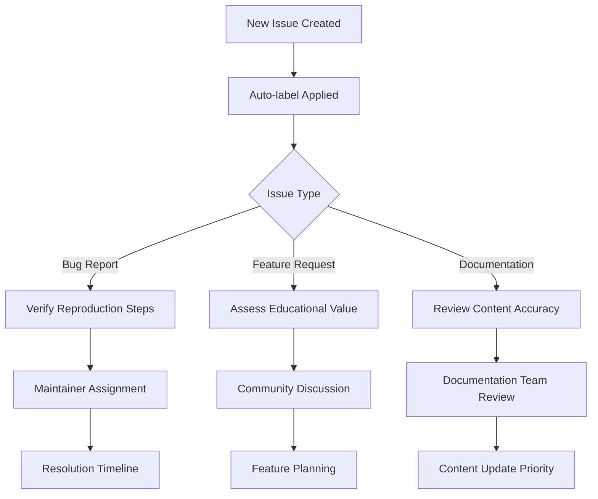
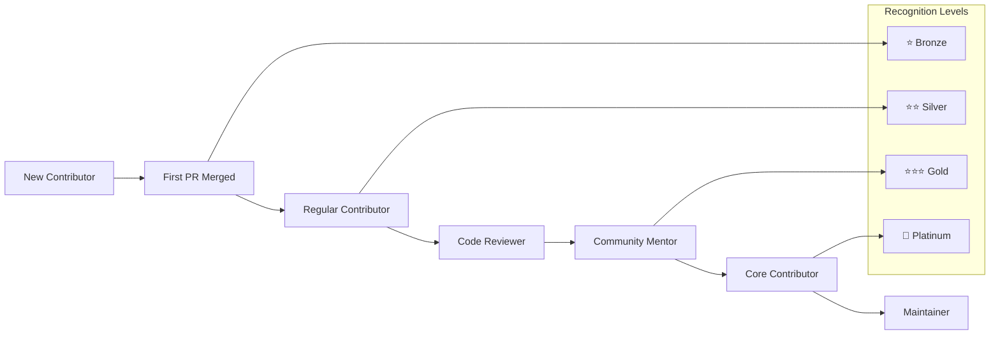

# Contributing to the Hello World Tutorial Repository

[](https://nodejs.org/)
[](https://expressjs.com/)
[](CONTRIBUTING.md)
[](CODE_OF_CONDUCT.md)

## Guidelines for Educational Contributions and Collaborative Development

Thank you for your interest in contributing to this repository's tutorials!
The [**Node.js Hello World Tutorial**](src/nodejs-tutorial/README.md) now
lives in this repository, at `src/nodejs-tutorial`, where it serves
`GET /hello` on Node.js v24.21.0 LTS with Express.js v5.2.1
[src/nodejs-tutorial/package.json:9,18]. Its Python
sibling, the Flask tutorial at `src/backend`, answers the same path with a JSON
envelope [src/backend/app.py:367-411]. This guide covers contributing to either
one, and every instruction below names the tutorial it applies to.

### Our Educational Mission

Our mission is to provide an accessible, high-quality learning environment
where developers of all skill levels can contribute to and learn from
real-world HTTP services while building professional development skills. We
believe that the best way to learn is through collaborative contribution,
mentoring, and hands-on experience with modern web development technologies.

**Community Values:**
- **Educational excellence and learning-focused development** - Every
  contribution should deepen understanding of the runtime, framework and HTTP
  concepts taught by the tutorial it touches
- **Inclusive collaboration and patient guidance for all skill levels** - We welcome contributors from beginners to experts
- **Quality code with comprehensive testing and documentation** - Professional standards with educational clarity
- **Professional development practices and industry standards** - Real-world experience with modern development workflows
- **Open source collaboration and knowledge sharing** - Building skills while contributing to the community

---

## Table of Contents

- [🎯 Contribution Overview](#-contribution-overview)
- [🚀 Development Setup](#-development-setup)
- [📋 Code Standards](#-code-standards)
- [🧪 Testing Guidelines](#-testing-guidelines)
- [🔄 Pull Request Process](#-pull-request-process)
- [📚 Documentation Standards](#-documentation-standards)
- [🐛 Issue Reporting](#-issue-reporting)
- [🔒 Security Guidelines](#-security-guidelines)
- [🏆 Recognition Program](#-recognition-program)

---

## 🎯 Contribution Overview

### Types of Contributions

We welcome various types of contributions that enhance the educational value
of the tutorials in this repository:

#### **Code Contributions**
- **Bug fixes** - Resolve issues and improve reliability
- **Feature enhancements** - Add educational value while maintaining simplicity
- **Performance improvements** - Optimize server response times and resource usage
- **Educational code examples** - Improve clarity and learning value
- **Express.js v5 modernization** - Leverage latest framework features

#### **Documentation Contributions**
- **Tutorial improvements** - Enhance learning clarity and progression
- **Code commenting** - Add educational explanations for complex concepts
- **Setup instructions** - Improve development environment guidance
- **Troubleshooting guides** - Help learners overcome common obstacles
- **Educational context** - Explain the "why" behind implementation decisions

#### **Testing Contributions**
- **Test coverage improvements** - Achieve and maintain 100% coverage target
- **Educational test examples** - Demonstrate testing best practices
- **Performance testing** - Validate response time and resource requirements
- **Integration testing** - Ensure end-to-end functionality
- **Test documentation** - Explain testing strategies and patterns

#### **Community Support**
- **Issue triage** - Help organize and prioritize community issues
- **Beginner mentoring** - Guide new contributors through their first contributions
- **Code reviews** - Provide constructive, educational feedback
- **Educational discussions** - Share knowledge and learning resources

### Educational Focus

This project maintains a strong educational focus throughout the contribution process:

- **Learning-oriented development** - All contributions should enhance educational value
- **Progressive skill building** - Support contributors in developing professional skills
- **Real-world practices** - Demonstrate industry-standard development workflows
- **Collaborative learning** - Learn from each other through code reviews and discussions
- **Professional growth** - Build skills in the stack you contribute to,
  testing, and collaboration

---

## 🚀 Development Setup

**Scope: the Node.js tutorial at `src/nodejs-tutorial`.** Every step in this
section - the runtime install, the dependency install, the verification run
and the troubleshooting entries - sets up that tutorial. Setting up the Flask
tutorial is documented with it, in `src/backend/README.md`, and needs none of
these commands.

### System Requirements

**Scope: the Node.js tutorial at `src/nodejs-tutorial`.** The Flask tutorial
documents its own Python requirements alongside it, in `src/backend/README.md`.

| Component | Minimum Version | Recommended | Purpose |
| --- | --- | --- | --- |
| **Node.js** | v24.21.0 LTS | Latest LTS | JavaScript runtime environment |
| **npm** | v11.19.0 | Latest | Package manager (bundled with Node.js) |
| **Git** | v2.30.0 | Latest | Version control and collaboration |
| **Memory** | 200MB RAM | 500MB | Development environment requirements |
| **Disk Space** | 500MB | 1GB | Dependencies and development tools |

The version is pinned in two places, and neither is a hard gate. `.nvmrc`
holds the exact string `24.21.0`, which a version manager reads to *select* a
runtime, while the manifest declares `engines.node` as `>=24.21.0 <25`
[src/nodejs-tutorial/package.json:9] — a compatibility range npm only *warns*
about on a mismatch. The `node --version` check in the next step is the one to
rely on.

### Step-by-Step Setup

#### 1. **Install Node.js v24.21.0 LTS**

**Option A: Official Installer (Recommended for beginners)**
```bash
# Visit https://nodejs.org/ and download Node.js v24.21.0 LTS
# Install using the official installer for your operating system
# This provides the most stable and compatible installation

# Verify installation
node --version  # Should output: v24.21.0 (or higher)
npm --version   # Should output: 11.19.0 (or higher, bundled with Node.js)
```

**Option B: Node Version Manager (Advanced users)**
```bash
# Install nvm (Node Version Manager)
curl -o- https://raw.githubusercontent.com/nvm-sh/nvm/v0.40.3/install.sh | bash

# Restart terminal or source profile
source ~/.bashrc  # or ~/.zshrc

# Install and use Node.js v24.21.0 LTS
nvm install 24.21.0
nvm use 24.21.0
nvm alias default 24.21.0

# Verify installation
node --version  # Should output: v24.21.0

# From the tutorial root, a bare `nvm use` reads the committed .nvmrc instead
cd src/nodejs-tutorial && nvm use
# Found <checkout>/src/nodejs-tutorial/.nvmrc with version <24.21.0>
# Now using node v24.21.0 (npm v11.19.0)
```

The post-condition is what matters, not the route: `node --version` must report
`v24.21.0`. The official installer, `nvm`, a distribution package and the
release tarball are all acceptable ways to get there, and none of them is a
dependency of the tutorial [src/nodejs-tutorial/README.md].

#### 2. **Repository Setup and Forking**

Both tutorials live in this one repository, so there is nothing else to clone:
the Node.js tutorial is the `src/nodejs-tutorial` directory of this checkout,
not a separate project. The upstream URL below is the repository declared in
the project metadata [pyproject.toml:145].

```bash
# Fork this repository on GitHub (click "Fork" button)
# Clone your fork locally
git clone https://github.com/YOUR-USERNAME/flask-hello-world.git
cd flask-hello-world

# Add upstream remote for staying updated
git remote add upstream https://github.com/flask-migration-tutorial/flask-hello-world.git

# Verify remotes
git remote -v
# origin    https://github.com/YOUR-USERNAME/flask-hello-world.git (fetch)
# origin    https://github.com/YOUR-USERNAME/flask-hello-world.git (push)
# upstream  https://github.com/flask-migration-tutorial/flask-hello-world.git (fetch)
# upstream  https://github.com/flask-migration-tutorial/flask-hello-world.git (push)
```

#### 3. **Dependency Installation**

Every npm command in this guide runs from the Node.js tutorial root. The Flask
tutorial has no npm dependencies at all — its Python requirements are installed
from `requirements.txt` as `src/backend/README.md` describes.

```bash
# Navigate to the Node.js tutorial root
cd src/nodejs-tutorial

# Install the exact locked dependency tree (npm ci, because the lockfile is
# committed: it installs that tree exactly instead of resolving a new one)
npm ci
# added 88 packages, and audited 89 packages in 401ms  (elapsed time varies)
# found 0 vulnerabilities

# Verify the two declared dependencies are installed
npm list express    # Should show express@5.2.1
npm list supertest  # Should show supertest@7.2.2

# Run security audit
npm audit
# found 0 vulnerabilities
```

Two packages, both declared at exact versions
[src/nodejs-tutorial/package.json:17-22]: `express` 5.2.1 at runtime and
`supertest` 7.2.2 for the tests. There is deliberately no third-party test
framework, no file watcher, no dotenv loader and no assertion library — the
Testing Guidelines section below names the Node built-in that replaces each
one.

#### 4. **Development Environment Verification**

`npm start` runs `node src/server.js` [src/nodejs-tutorial/package.json:12].
It is a foreground process that never returns on its own, so verify from a
second terminal and stop it with `Ctrl-C`.

```bash
# Start the development server
npm start

# Expected output. npm first echoes the two-line script banner - the package
# name and the command - which is elided here; then the application's own
# single line of output:
#
# Listening on http://127.0.0.1:3000 (GET /hello)
```

That line is the only line the application ever writes to stdout, and it
is interpolated from the host and port actually bound
[src/nodejs-tutorial/src/server.js:36-41], so it stays truthful when either is
overridden. `npm run dev` is the watch-mode alternative and prints the same
line.

**Test the endpoint in a new terminal:**
```bash
# Test the /hello endpoint
curl http://127.0.0.1:3000/hello
# Expected response: Hello world

# Test with headers
curl -i http://127.0.0.1:3000/hello
# Expected: HTTP/1.1 200 OK
#           Content-Type: text/plain; charset=utf-8
#           Content-Length: 11
#           (blank line)
#           Hello world

# Stop the server: Ctrl-C in the server terminal sends SIGINT, which closes
# the server cleanly and exits 0 [src/nodejs-tutorial/src/server.js:64-65]
```

The contract those two commands verify is documented in full, with every
header explained, in
[the tutorial's API reference](src/nodejs-tutorial/docs/api-reference.md).

#### 5. **Run Test Suite**

Neither test command needs a running server: the suite drives the application
object returned by `createApp()` through `supertest`, so nothing binds a port
[src/nodejs-tutorial/test/hello.test.js:30-31].

```bash
# Execute complete test suite
npm test

# Expected output, with npm's two-line script banner elided and durations
# omitted because they vary between runs:
#
# ✔ GET /hello responds 200
# ✔ GET /hello body is exactly "Hello world"
# ✔ GET /hello Content-Type is text/plain; charset=utf-8
# ✔ unknown path responds 404
# ℹ tests 4
# ℹ suites 0
# ℹ pass 4
# ℹ fail 0

# Run tests with coverage
npm run test:coverage

# Expected: the same four tests, then 100.00 line, branch and function
# coverage for src/app.js and src/routes/hello.js. src/server.js is absent
# from the table by design - the suite never loads the module that binds the
# socket. The --experimental-test-coverage flag behind this script is marked
# experimental by Node, so treat its output as informative.
```

Assert the counts, not the exit status: `node --test` exits `0` on an empty
suite, so a run that silently discovered nothing still looks green. `tests 4`
and `pass 4` are the lines that prove the suite ran.

### IDE and Editor Setup

#### **Visual Studio Code (Recommended)**

Install recommended extensions for optimal development experience:

```bash
# Install VS Code extensions
code --install-extension ms-vscode.vscode-json
code --install-extension esbenp.prettier-vscode
code --install-extension ms-vscode.vscode-eslint
```

**VS Code settings.json:**
```json
{
  "editor.formatOnSave": true,
  "editor.codeActionsOnSave": {
    "source.fixAll.eslint": true
  },
  "javascript.preferences.quoteStyle": "single",
  "typescript.preferences.quoteStyle": "single"
}
```

No test-runner extension or editor setting is listed, and none is needed: the
tests run on Node's built-in runner, which has no configuration file and no
editor integration to install. Run them with `npm test` from
`src/nodejs-tutorial/`, in the editor's terminal or any other.

#### **Alternative Editors**

- **WebStorm**: Excellent built-in Node.js support and debugging
- **Atom**: Lightweight with good package ecosystem
- **Sublime Text**: Fast and customizable
- **Vim/Neovim**: For advanced users with terminal preferences

### Troubleshooting Common Setup Issues

#### **Port 3000 Already in Use**

The first collision to rule out is inside this repository: the Flask
development container publishes host port 3000
[infrastructure/docker/docker-compose.yml:86], so running it and the Node.js
tutorial at the same time contends for one port.

```bash
# Find process using port 3000
lsof -ti:3000 | xargs kill  # macOS/Linux
netstat -ano | findstr :3000  # Windows

# Or use a different port - PORT=<n> npm start is the documented override
PORT=3001 npm start
# Listening on http://127.0.0.1:3001 (GET /hello)

# Second fallback, because the Flask production container publishes host
# port 3001 [infrastructure/docker/docker-compose.yml:231]
PORT=3100 npm start
```

#### **Node.js Version Issues**

An engine mismatch does not fail the install — npm prints an `EBADENGINE`
warning and carries on — so check the version explicitly.

```bash
# Check current version
node --version

# Update to v24.21.0 LTS if needed
# Download from https://nodejs.org/
# Or use nvm: nvm install 24.21.0 && nvm use 24.21.0
```

#### **Permission Issues**

Generic npm tooling advice: it is about your machine's npm installation, not
about either tutorial in this repository.

```bash
# Fix npm permissions on macOS/Linux
sudo chown -R $(whoami) ~/.npm

# Or configure npm to use a different directory
mkdir ~/.npm-global
npm config set prefix '~/.npm-global'
echo 'export PATH=~/.npm-global/bin:$PATH' >> ~/.bashrc
source ~/.bashrc
```

---

## 📋 Code Standards

**Scope: the Node.js tutorial at `src/nodejs-tutorial`.** Every JavaScript
example in this section is either quoted from that tutorial's source or
explicitly marked as an illustrative pattern it does not contain. The Flask
tutorial's Python standards are governed by the tooling already configured for
it, `.flake8` and `pyproject.toml`.

### JavaScript ES6+ Conventions

#### **Modern Syntax Requirements**

```javascript
// ✅ GOOD: Use const/let instead of var
const express = require('express');
const app = express();
let serverInstance;

// ❌ AVOID: var declarations
var express = require('express');
```

```javascript
// ✅ GOOD: Arrow functions for callbacks, with the body in a named constant
const HELLO_BODY = 'Hello world';

app.get('/hello', (req, res) => {
  res.status(200).type('text/plain').send(HELLO_BODY);
});

// ✅ GOOD: Template literals for strings
console.log(`Listening on http://${HOST}:${PORT} (GET /hello)`);

// ✅ GOOD: Destructuring assignment. The tutorial's host default is the
// loopback address 127.0.0.1, spelled that way in every command, transcript
// and URL it publishes [src/nodejs-tutorial/src/server.js:24]
const { PORT = 3000, HOST = '127.0.0.1' } = process.env;
```

#### **Educational Code Commenting**

Comments should explain the decision, not restate the syntax. The factory
below is the shape the tutorial actually ships
[src/nodejs-tutorial/src/app.js:31-58]; it writes nothing per request, because
a request logger would put noise in front of the one lesson.

```javascript
/**
 * Build a fresh Express.js v5.2.1 application with educational focus.
 * Demonstrates HTTP server assembly: hardening, one route, one fallback.
 *
 * This is a factory, not a shared singleton: every call returns a new
 * application, which is what lets each test construct its own and drive it
 * through supertest without binding a port.
 *
 * @returns {express.Application} Configured Express app instance
 */
function createApp() {
  const app = express();

  // Disable X-Powered-By header for security awareness
  // Express.js v5 security enhancement - prevents framework fingerprinting
  app.disable('x-powered-by');

  // Mounted at the application root, because the route module declares the
  // full path itself - mounting under a prefix would nest that path twice
  app.use(router);

  // Registered last, so a request reaches it only when no route matched
  app.use((req, res) => {
    res.status(404).type('text/plain').send(NOT_FOUND_BODY);
  });

  return app;
}
```

### Node.js v24.21.0 LTS Best Practices

#### **Module Organization**

Three modules, each with one job: the route declares the endpoint, the
application assembles it, and the server binds it. This is the real
`src/nodejs-tutorial/src/app.js`, quoted with its comments condensed.

```javascript
// ✅ GOOD: Clear module structure
// File: src/nodejs-tutorial/src/app.js
const express = require('express');
const { router } = require('./routes/hello');

// Body of the terminal not-found response, named once
const NOT_FOUND_BODY = 'Not Found';

/**
 * Creates and configures the Express.js application
 * Educational focus: Demonstrates modular application structure
 */
function createApp() {
  const app = express();

  // Core middleware setup
  app.disable('x-powered-by');  // Security: Remove framework fingerprinting

  // Route configuration: the router declares the full path, so mount at root
  app.use(router);

  // Terminal not-found handler (must be last, after the route mount)
  app.use((req, res) => {
    res.status(404).type('text/plain').send(NOT_FOUND_BODY);
  });

  return app;
}

module.exports = { createApp };
```

The factory is the module's whole public interface — `module.exports =
{ createApp }` — and it is what `src/server.js` requires
[src/nodejs-tutorial/src/server.js:17] and what `test/hello.test.js` drives
[src/nodejs-tutorial/test/hello.test.js:31].

#### **Error Handling Patterns**

**Illustrative pattern, not tutorial code.** The tutorial registers no error
middleware at all: its only fallback is the terminal not-found handler shown
above [src/nodejs-tutorial/src/app.js:50-55], and an unhandled rejection
therefore reaches Express's own default handler, which answers `500` with an
HTML body. The handler below is the shape a contribution that *adds* error
handling should follow.

```javascript
// ✅ GOOD: Comprehensive error handling with educational context
function createErrorHandler() {
  return (err, req, res, next) => {
    // Educational logging: Show error context for learning
    console.error(`🚨 Error in ${req.method} ${req.path}:`, err.message);
    
    // Express.js v5 feature: Automatic promise rejection handling
    // This middleware catches both sync and async errors
    const statusCode = err.statusCode || 500;
    const message = process.env.NODE_ENV === 'production' 
      ? 'Internal Server Error'  // Security: Generic message in production
      : err.message;             // Development: Detailed message for learning
    
    res.status(statusCode).json({
      status: statusCode,
      message,
      timestamp: new Date().toISOString(),
      path: req.path
    });
  };
}
```

### Express.js v5.2.1 Patterns

#### **Security Features Utilization**

Of the measures below, only `app.disable('x-powered-by')` is in the tutorial
[src/nodejs-tutorial/src/app.js:37]; the extra response headers are an
illustrative pattern, and a route with an `await` in it is illustrative too —
the tutorial's single handler is synchronous.

```javascript
// ✅ GOOD: Leverage Express.js v5 security enhancements
const express = require('express');

function setupSecurityMiddleware(app) {
  // Express.js v5 automatically handles promise rejections
  // No need for manual .catch() on async route handlers
  
  // ReDoS protection: path-to-regexp@8.x automatically prevents
  // regular expression denial of service attacks
  app.get('/hello', async (req, res) => {
    // This promise rejection is automatically forwarded to error middleware
    const result = await processHelloRequest();
    res.send(result);
  });
  
  // Framework fingerprinting prevention
  app.disable('x-powered-by');
  
  // Basic security headers for educational awareness
  app.use((req, res, next) => {
    res.setHeader('X-Content-Type-Options', 'nosniff');
    res.setHeader('X-Frame-Options', 'SAMEORIGIN');
    next();
  });
}
```

#### **Modern Routing Patterns**

This is the real `src/nodejs-tutorial/src/routes/hello.js`. Note three
decisions a learner should copy: the router declares the **full** path, so the
application mounts it at the root; the body is a named constant with exactly
one definition in the codebase; and the response is one
status-type-send chain, where the short form `'text/plain'` is what makes
Express emit `Content-Type: text/plain; charset=utf-8` and derive
`Content-Length` from the body.

```javascript
// ✅ GOOD: Express.js v5 routing with educational clarity
// File: src/nodejs-tutorial/src/routes/hello.js
const express = require('express');

const router = express.Router();

// The single definition of the response body: 11 bytes, one interior space
// and no trailing newline
const HELLO_BODY = 'Hello world';

/**
 * Hello world endpoint demonstrating Express.js v5 routing
 * Educational focus: Basic HTTP GET handling and response generation
 *
 * @route GET /hello
 * @returns {string} Plain text "Hello world" response
 */
router.get('/hello', (req, res) => {
  // HTTP response with proper status and Content-Type. No timing
  // instrumentation: the endpoint publishes no performance target, so
  // measuring one here would be noise
  res.status(200).type('text/plain').send(HELLO_BODY);
});

module.exports = { router, HELLO_BODY };
```

### Naming Conventions

#### **Functions and Variables**

```javascript
// ✅ GOOD: Descriptive, educational naming
const expressApp = createExpressApplication();
const serverInstance = startHttpServer(expressApp);
const helloRouteHandler = createHelloEndpoint();

// Function names should describe educational purpose
function validateNodejsCompatibility() { /* ... */ }
function demonstrateMiddlewareChaining() { /* ... */ }
function showcaseErrorHandling() { /* ... */ }

// ❌ AVOID: Unclear, non-educational naming
const app = create();
const server = start(app);
const handler = endpoint();
```

#### **File and Module Naming**

The Node.js tutorial is eleven files, and this is all of them. There is no
health route, no middleware directory and no utility module: a single-endpoint
service that needed either would be teaching the wrong lesson.

```text
src/nodejs-tutorial/
├── README.md                 # Install, run, verify, test, stop
├── package.json              # engines.node, four scripts, two exact deps
├── package-lock.json         # lockfileVersion 3, the tree npm ci installs
├── .nvmrc                    # 24.21.0, the version a manager selects
├── .env.example              # PORT and HOST, each annotated with its default
├── src/
│   ├── server.js             # HTTP server initialization and signals
│   ├── app.js                # Express application factory
│   └── routes/
│       └── hello.js          # Hello endpoint route handler
├── test/
│   └── hello.test.js         # Four assertions against the contract
└── docs/
    ├── api-reference.md      # The endpoint contract, in full
    └── walkthrough.md        # Annotated tour of the code above
```

A contribution that adds a module adds it here, and updates this tree in the
same change.

---

## 🧪 Testing Guidelines

### Test Runner Configuration

**Scope: the Node.js tutorial at `src/nodejs-tutorial`.** The Flask tutorial
is tested with pytest, under `src/backend/tests/`.

#### **`node --test` setup - there is no configuration file**

The tutorial uses Node's built-in test runner. It is stable in the supported
runtime, ships with it, and needs no config file, no reporter and no
transform, which is why the manifest declares four scripts and no runner
settings at all [src/nodejs-tutorial/package.json:11-16].

```json
{
  "scripts": {
    "test": "node --test",
    "test:coverage": "node --test --experimental-test-coverage"
  }
}
```

Three properties of the runner are worth knowing before you change anything:

- **Discovery.** When it meets a directory named `test`, it treats every
  `.js`, `.cjs` and `.mjs` file inside it as a test file, whether or not the
  filename matches a test-naming convention. That is what makes bare
  `node --test` find `test/hello.test.js`.
- **The test script takes no path argument, deliberately.** Adding one that
  points at a directory breaks the runner: both `node --test test/` and
  `node --test test` fail, because the directory is resolved as an entry
  module. The output is
  `Error: Cannot find module '<checkout>/src/nodejs-tutorial/test'` with
  `code: 'MODULE_NOT_FOUND'`, a `✖ test` line, `fail 1`, and exit status `1`.
  Bare `node --test` works, and so does an explicit file path such as
  `node --test test/hello.test.js`. Do not "tidy" the script by adding the
  directory.
- **An empty suite exits `0`.** A run that discovers nothing reports
  `tests 0` and succeeds, and the coverage table then prints `100.00` over
  nothing at all. Assert `tests 4` and `pass 4`, never just the exit status.

#### **Test Organization Structure**

One test file, holding four flat `test()` declarations - no suite nesting, no
fixtures directory and no custom matchers, because a four-assertion contract
needs none of them.

```text
src/nodejs-tutorial/
└── test/
    └── hello.test.js   # Four assertions against the published contract
```

### Supertest HTTP Testing

`supertest` 7.2.2 is the one devDependency
[src/nodejs-tutorial/package.json:20-22]. It is handed the application object
the factory returns, never a base URL, so the suite binds no fixed port and
needs no server running.

#### **Endpoint Testing Patterns**

This is the real `src/nodejs-tutorial/test/hello.test.js`, quoted with its
comments condensed. Four flat `test()` declarations, one concern each - the
runner reports `tests 4` and `suites 0`.

```javascript
// src/nodejs-tutorial/test/hello.test.js
const { test } = require('node:test');
const assert = require('node:assert/strict');
const request = require('supertest');
const { createApp } = require('../src/app');

test('GET /hello responds 200', async () => {
  // A fresh application per test, so no state is shared between them
  const res = await request(createApp()).get('/hello');

  // Proves the router is mounted and the path is reachable
  assert.strictEqual(res.status, 200);
});

test('GET /hello body is exactly "Hello world"', async () => {
  const res = await request(createApp()).get('/hello');

  // Compared against the literal rather than against the route module's own
  // constant, so a typo introduced there fails here instead of matching
  // itself. Plain text arrives in res.text; res.body is empty for non-JSON
  assert.strictEqual(res.text, 'Hello world');

  // 11 bytes means one interior space and no trailing newline. Measured on
  // the body itself, so it proves the bytes rather than the header's claim
  assert.strictEqual(Buffer.byteLength(res.text), 11);
});

test('GET /hello Content-Type is text/plain; charset=utf-8', async () => {
  const res = await request(createApp()).get('/hello');

  // Compared in full, so a dropped charset parameter fails
  assert.strictEqual(res.headers['content-type'], 'text/plain; charset=utf-8');
});

test('unknown path responds 404', async () => {
  const res = await request(createApp()).get('/unknown');

  // Proves the terminal handler in ../src/app is reached and answers
  assert.strictEqual(res.status, 404);
});
```

Between them the four prove the whole published contract: that the route
exists, that the body is byte-exact, that the media type carries its charset
parameter, and that an unmatched path reaches the terminal handler. Note what
they do **not** assert - `Date`, `Connection` and `Keep-Alive` are
transport-dependent, so no test pins them
[src/nodejs-tutorial/docs/api-reference.md].

#### **Translating matcher-style test idioms**

Test code carried over from the matcher-style framework this tutorial replaced
with the built-in runner needs four mechanical substitutions, and no others.

| Matcher-style idiom | Replacement |
| --- | --- |
| nested `describe()` / `it()` | flat `test()` from `node:test` |
| `expect(a).toBe(b)` | `assert.strictEqual(a, b)` |
| `expect(h).not.toHaveProperty('x')` | `assert.strictEqual(h['x'], undefined)` |
| `.expect(200)` chained on the request | `assert.strictEqual(res.status, 200)` |

### Coverage Requirements and Quality Metrics

#### **Coverage Targets**

`node --test --experimental-test-coverage` reports three metrics per file, so
those are the three tracked here; there is no separate statement column.

| Coverage Type | Target | Minimum Acceptable | Rationale |
| --- | --- | --- | --- |
| **Line Coverage** | 100% | 95% | Complete code execution validation |
| **Function Coverage** | 100% | 100% | All functions must be tested |
| **Branch Coverage** | 100% | 95% | All code paths validated |

The tutorial reports `100.00` on all three for `src/app.js` and
`src/routes/hello.js`. `src/server.js` is **absent** from that table rather
than uncovered: the suite drives the application object and never loads the
module that binds the socket.

#### **Test-Driven Development Process**

**Illustrative only.** The Node.js tutorial serves exactly one endpoint and a
second one is outside its scope; this is the shape a contribution proposing
one would start from, written with the runner the tutorial uses.

```javascript
// Example: TDD process for a new feature
test('health endpoint reports server status (TDD example)', async () => {
  // 1. Write the failing test first (Red)
  const res = await request(createApp()).get('/health');

  // 2. Define the expected response contract
  assert.strictEqual(res.status, 200);
  assert.match(res.headers['content-type'], /^application\/json/);
  assert.strictEqual(res.body.status, 'OK');
  assert.strictEqual(typeof res.body.uptime, 'number');

  // 3. Implement the feature to make the test pass (Green)
  // 4. Refactor for educational clarity (Refactor)
});
```

#### **Educational Testing Practices**

**Illustrative only**, and deliberately built on a throwaway application
rather than the tutorial's: what it demonstrates is a framework behaviour, not
a contract the tutorial publishes.

```javascript
// Educational test with comprehensive learning comments
// Express.js v5 forwards a rejected promise to the error handling chain with
// no manual .catch() block anywhere
test('Express.js v5 forwards a rejected promise automatically', async () => {
  const scratch = express();

  scratch.get('/test-promise-rejection', async () => {
    throw new Error('Educational example: Automatic promise handling');
  });

  const res = await request(scratch).get('/test-promise-rejection');

  // With no error middleware registered, Express's own default handler answers
  // 500 with an HTML body and logs the stack server-side. Assert the status
  // and media type only: the default handler's markup is not a contract
  assert.strictEqual(res.status, 500);
  assert.match(res.headers['content-type'], /^text\/html/);
});
```

Note what this does **not** assert: a JSON error envelope with a `message`
field. The tutorial registers no error middleware, so there is none to assert
[src/nodejs-tutorial/src/app.js:50-55]. A contribution that adds one adds its
assertions with it.

### Performance Testing Requirements with pytest-benchmark (Flask tutorial)

**Scope: the Python Flask tutorial at `src/backend`, not the Node.js
tutorial.** Everything in this subsection is pytest and Flask code: `client`
is a Flask test client, and the `/hello` it calls is the Flask endpoint, which
answers with an 86-byte JSON envelope [src/backend/app.py:367-411] rather than
the 11-byte plain-text body the Node.js tutorial serves
[src/nodejs-tutorial/docs/api-reference.md]. It sits in this document because
performance testing is a repository-wide topic; it is retained and labelled
rather than removed, so the guidance is not lost, but do not read it as
applying to the Node.js tutorial.

**The Node.js tutorial publishes no performance target and no benchmark
suite.** Its tests are the four contract assertions listed above, and a
contribution that wants to add a timing claim to it must first capture the
measurement that backs the claim.

#### **Response Time Validation using pytest-benchmark**

```python
# Performance testing for educational awareness
import pytest
import psutil
from flask import Flask

class TestPerformanceRequirements:
    """Performance testing using pytest-benchmark for statistical accuracy."""
    
    @pytest.mark.performance
    def test_hello_endpoint_response_time_benchmark(self, benchmark, client):
        """
        Educational performance test using pytest-benchmark.
        Provides statistical analysis with multiple iterations.
        """
        def make_hello_request():
            response = client.get('/hello')
            assert response.status_code == 200
            return response
        
        # pytest-benchmark automatically handles iterations and statistical analysis
        result = benchmark(make_hello_request)
        
        # Educational performance analysis from benchmark stats
        stats = benchmark.stats
        print(f"📊 Performance Results:")
        print(f"   Average: {stats.mean * 1000:.2f}ms")
        print(f"   Median: {stats.median * 1000:.2f}ms")
        print(f"   Standard Deviation: {stats.stddev * 1000:.2f}ms")
        print(f"   Target: <100ms")
        
        # Performance assertions
        assert stats.mean < 0.100  # 100ms target
        assert stats.median < 0.050  # 50ms warm request target
    
    @pytest.mark.performance
    def test_memory_usage_monitoring(self, client):
        """Educational memory usage testing with psutil."""
        import psutil
        
        # Baseline memory measurement
        process = psutil.Process()
        baseline_memory = process.memory_info().rss / 1024 / 1024  # MB
        
        # Execute requests to test memory growth
        for _ in range(50):
            response = client.get('/hello')
            assert response.status_code == 200
        
        # Measure memory after requests
        current_memory = process.memory_info().rss / 1024 / 1024  # MB
        memory_growth = current_memory - baseline_memory
        
        print(f"📊 Memory Usage Results:")
        print(f"   Baseline: {baseline_memory:.2f}MB")
        print(f"   Current: {current_memory:.2f}MB")
        print(f"   Growth: {memory_growth:.2f}MB")
        print(f"   Target: <75MB total, <5MB growth")
        
        # Memory assertions
        assert current_memory < 75  # 75MB total limit
        assert memory_growth < 5    # 5MB growth limit
    
    @pytest.mark.benchmark
    def test_concurrent_request_performance(self, benchmark, client):
        """Educational concurrent request testing with pytest-benchmark."""
        import threading
        import queue
        
        def concurrent_requests():
            results = queue.Queue()
            
            def make_request():
                response = client.get('/hello')
                results.put(response.status_code == 200)
            
            # Create 10 concurrent threads
            threads = [threading.Thread(target=make_request) for _ in range(10)]
            
            # Start all threads
            for thread in threads:
                thread.start()
            
            # Wait for completion
            for thread in threads:
                thread.join()
            
            # Collect results
            success_results = [results.get() for _ in range(10)]
            return all(success_results)
        
        # Benchmark concurrent performance
        result = benchmark(concurrent_requests)
        assert result is True  # All requests succeeded
        
        # Validate performance under load
        assert benchmark.stats.mean < 0.200  # 200ms for concurrent requests
```

---

## 🔄 Pull Request Process

**Scope: the repository as a whole.** The branch strategy, commit format,
template and review process below apply to a change in either tutorial, or in
the shared documentation. Where a step runs a command, the command names the
tutorial it belongs to.

### Branch Management Strategy

#### **Git Workflow**

```bash
# 1. Sync with upstream before starting new work
git checkout main
git pull upstream main
git push origin main

# 2. Create feature branch with descriptive name
git checkout -b feature/add-health-check-endpoint
# or: fix/resolve-port-binding-error
# or: docs/improve-setup-instructions  
# or: test/add-performance-testing

# 3. Make changes and commit with clear messages
git add .
git commit -m "Add: health check endpoint for monitoring server status

- Implement /health route returning server uptime and status
- Add comprehensive test coverage for health endpoint  
- Include educational comments explaining monitoring concepts
- Update documentation with health check usage examples"

# 4. Push feature branch to your fork
git push origin feature/add-health-check-endpoint

# 5. Create pull request via GitHub interface
```

### Conventional Commit Message Format

#### **Commit Message Structure**

```bash
# Format: Type(scope): Brief description
# 
# Detailed explanation (optional)
# 
# Educational impact (optional)
# Breaking changes (if any)

# Examples:
git commit -m "Add: health check endpoint for server monitoring

Implements GET /health endpoint returning:
- Server uptime in seconds
- Current timestamp  
- Application version
- Memory usage statistics

Educational value:
- Demonstrates monitoring concepts
- Shows JSON response formatting
- Illustrates performance measurement

Closes #23"

git commit -m "Fix: resolve port binding error on Windows systems

- Update port configuration to handle Windows-specific binding
- Add error handling for EADDRINUSE scenarios  
- Include troubleshooting documentation
- Add cross-platform compatibility tests

Testing:
- Verified on Windows 11, macOS 14, Ubuntu 22.04
- Added automated tests for port conflict scenarios"

git commit -m "Docs: improve development setup instructions

- Add Node.js version verification steps
- Include troubleshooting for common setup issues
- Add IDE configuration recommendations
- Update dependency installation process

Educational improvements:
- Clearer step-by-step instructions for beginners
- Added video tutorial links
- Included common error solutions"
```

#### **Commit Types**

| Type | Description | Examples |
|------|-------------|----------|
| **Add** | New features or capabilities | `Add: rate limiting middleware`, `Add: logging system` |
| **Fix** | Bug fixes and corrections | `Fix: memory leak in request handling`, `Fix: Windows path issues` |
| **Update** | Improvements to existing features | `Update: Express.js to v5.2.1`, `Update: error messages` |
| **Docs** | Documentation changes only | `Docs: API documentation update`, `Docs: setup guide` |
| **Test** | Testing additions or modifications | `Test: integration test coverage`, `Test: performance benchmarks` |
| **Refactor** | Code restructuring without functionality changes | `Refactor: extract error handling`, `Refactor: modularize routes` |
| **Security** | Security-related improvements | `Security: update dependencies`, `Security: add input validation` |

### Pull Request Template and Standards

#### **Comprehensive PR Template**

When creating a pull request, please use this comprehensive template:

```markdown
## Summary

Brief description of the changes in this pull request.

### Type of Change
- [ ] Bug fix (non-breaking change which fixes an issue)
- [ ] New feature (non-breaking change which adds functionality)  
- [ ] Breaking change (fix or feature that would cause existing functionality to not work as expected)
- [ ] Documentation update
- [ ] Testing improvement
- [ ] Educational enhancement

## Educational Alignment

### Learning Objectives Supported
- [ ] HTTP server fundamentals
- [ ] Express.js framework concepts
- [ ] Node.js runtime understanding  
- [ ] Testing best practices
- [ ] Professional development skills

### Educational Impact
Describe how this change enhances the learning experience for tutorial users.

### Skill Level Considerations  
Explain how this change affects learners at different skill levels (beginner, intermediate, advanced).

## Technical Implementation

### Changes Made
Detailed list of modifications to code, documentation, or configuration.

### Design Decisions
Explanation of technical choices and their rationale.

### Node.js v24.21.0 LTS Compatibility
- [ ] Verified compatibility with Node.js v24.21.0 LTS
- [ ] Uses modern JavaScript ES6+ features appropriately
- [ ] Stays inside the declared `engines.node` range `>=24.21.0 <25`

### Express.js v5.2.1 Integration
- [ ] Utilizes Express.js v5 security features (ReDoS protection)
- [ ] Implements automatic promise rejection handling
- [ ] Follows Express.js v5 best practices and patterns

## Testing and Quality Assurance

### Test Coverage
- [ ] Unit tests written for new/modified functionality
- [ ] Integration tests updated for endpoint changes
- [ ] All tests pass: `npm test`
- [ ] Coverage meets minimum 95% requirement: `npm run test:coverage`
- [ ] Target 100% coverage achieved where possible

### Testing Framework Usage
- [ ] `node --test` patterns followed: flat `test()`, no runner config file
- [ ] `node:assert/strict` used for assertions
- [ ] Supertest v7.2.2 used for HTTP endpoint testing against `createApp()`
- [ ] Reported counts asserted (`tests N` / `pass N`), not just exit status
- [ ] Educational test examples demonstrate best practices

### Performance Validation
- [ ] Any performance claim added is backed by a captured measurement
- [ ] No documented transcript left stale: a change under
      `src/nodejs-tutorial/` outside a `.md` file means re-running
      `npm ci && npm test && npm run test:coverage` and replacing every
      transcript whose output moved
- [ ] Startup and response behaviour unchanged, or the change documented

## Quality Assurance Checklist

### Code Quality
- [ ] Code follows JavaScript ES6+ standards and Node.js best practices
- [ ] Educational comments explain concepts for learners
- [ ] Function and variable names are descriptive and educational
- [ ] Code complexity is appropriate for educational context
- [ ] Error handling follows Express.js v5 patterns

### Documentation Quality
- [ ] README.md updated for functional changes
- [ ] Code comments explain educational concepts
- [ ] API documentation updated for endpoint changes
- [ ] Educational context maintained throughout
- [ ] Examples are clear and functional

### Security and Best Practices
- [ ] No security vulnerabilities introduced: `npm audit`
- [ ] Express.js v5 security features utilized appropriately
- [ ] Input validation implemented where necessary
- [ ] Error responses don't expose sensitive information
- [ ] Dependencies are up-to-date and secure

### Educational Standards
- [ ] Changes enhance learning objectives
- [ ] Educational progression is maintained
- [ ] Content is accessible to target skill levels
- [ ] Learning resources are improved or maintained
- [ ] Community values are upheld

## CI/CD Integration

### Automated Checks
- [ ] GitHub Actions CI pipeline passes (Python jobs only - the workflows
      contain no Node or npm step, so a Node.js change is verified locally)
- [ ] All automated tests execute successfully
- [ ] Code coverage thresholds are met
- [ ] Security scanning shows no critical issues
- [ ] Linting passes without errors

### Quality Gates
- [ ] 100% test pass rate achieved, asserted on the reported counts
- [ ] Coverage minimum threshold (95%) met - the runner reports coverage, it
      does not fail a run for missing it, so this one is checked by reading
- [ ] No critical or high severity vulnerabilities
- [ ] No documented command or transcript left inaccurate by the change
- [ ] Documentation completeness validated

### Deployment Readiness
- [ ] Changes are backward compatible
- [ ] No breaking changes to educational examples
- [ ] Tutorial progression remains intact
- [ ] Setup instructions still accurate
```

### Code Review Standards and Process

#### **Review Criteria Weights**

| Criteria | Weight | Description | Key Checkpoints |
|----------|--------|-------------|-----------------|
| **Educational Value** | 40% | Learning enhancement and educational impact | Does this improve Node.js concept understanding? Are Express.js v5 patterns clear? Is educational progression maintained? |
| **Technical Quality** | 30% | Code quality, performance, and technical excellence | Node.js v24 best practices? Express.js v5 patterns? Error handling? Measured claims? |
| **Testing Completeness** | 20% | Testing coverage and quality validation | `node --test` patterns followed? Supertest used correctly? 95% coverage met? Edge cases tested? |
| **Documentation Quality** | 10% | Documentation clarity and educational standards | Educational comments? Documentation updated? Examples clear? Accessibility addressed? |

#### **Review Process Timeline**

| Phase | Timeline | Requirements | Focus |
|-------|----------|-------------|-------|
| **Initial Review** | 24-48 hours | Minimum one maintainer response | Educational alignment and technical quality assessment |
| **Comprehensive Review** | 5 business days | All review criteria addressed | Testing, documentation, and educational impact validation |
| **Approval** | 1 maintainer approval + automated checks | All quality gates passed | Educational value confirmed, no blocking issues |

#### **Review Communication Standards**

The template below applies to **the repository as a whole** - a review of
either tutorial uses it. The filled-in example text happens to describe a
Node.js change; substitute the equivalent for a Flask one.

```markdown
## Review Feedback Template

### Educational Assessment ⭐⭐⭐⭐⭐
**Learning Value**: Excellent - clearly demonstrates Express.js v5 error handling patterns
**Skill Level Appropriateness**: Good for intermediate learners, might need beginner explanation
**Educational Progression**: Maintains learning flow and builds on previous concepts

### Technical Quality ✅
**Code Standards**: Follows Node.js v24 best practices and ES6+ conventions
**Performance**: No documented transcript invalidated; any timing claim is
backed by a captured run
**Security**: Utilizes Express.js v5 security features appropriately

### Suggested Improvements
1. **Add Educational Comments**: Include explanation of middleware execution order
2. **Test Enhancement**: Add performance test for concurrent requests
3. **Documentation**: Update README with new error handling examples

### Questions for Author
- Could you explain the choice of error message format for beginners?
- Have you considered adding a code example in the documentation?
```

### Merge Requirements

#### **Automated Quality Gates**

The checks below are the jobs the workflow in this repository actually
defines. It is a **Python-only pipeline** - `.github/workflows/ci.yml` and
`cd.yml` contain no `node` or `npm` step anywhere - so there is no Node status
check to require, and a change to the Node.js tutorial is verified with the
local commands in the Testing Guidelines section above.

```yaml
# All PRs must pass these automated checks:
required_status_checks:
  - "CI Pipeline / Test Suite (3.12)"       # Python matrix [ci.yml:40-47]
  - "CI Pipeline / Test Suite (3.11)"       # Python matrix [ci.yml:40-47]
  - "CI Pipeline / Test Suite (3.10)"       # Python matrix [ci.yml:40-47]
  - "CI Pipeline / Security Scan"           # Dependency scan [ci.yml:127]
  - "CI Pipeline / Quality Gate"            # Coverage gate [ci.yml:209]

# Branch protection rules
enforce_admins: false
required_pull_request_reviews:
  required_approving_review_count: 1
  dismiss_stale_reviews: true
  require_code_owner_reviews: false
  
restrictions:
  push: []  # No direct pushes to main branch
```

#### **Pre-merge Validation**

The first three commands are the Node.js tutorial's, and run from
`src/nodejs-tutorial`; each resolves to one of its four scripts or to an npm
built-in. A Flask-only change is validated with pytest instead, as
`src/backend/README.md` describes.

```bash
# Maintainer pre-merge checklist, from src/nodejs-tutorial:
# 1. All automated checks passing
npm test && echo "✅ Tests passed"

# 2. Coverage threshold met
npm run test:coverage && echo "✅ Coverage acceptable"

# 3. Security audit clean
npm audit && echo "✅ No security issues"

# 4. Educational value confirmed
echo "✅ Educational objectives enhanced"

# 5. Documentation updated
echo "✅ Documentation reflects changes"
```

---

## 📚 Documentation Standards

**Scope: the repository as a whole**, with one caveat stated where it matters:
the JavaScript examples are the Node.js tutorial's own modules, and the
endpoint-documentation rule below points at that tutorial's API reference as
the single authority for its contract.

### Code Comment Guidelines

The JavaScript examples in this section are the Node.js tutorial's own
modules; Python docstring conventions for the Flask tutorial are governed by
the tooling configured for it.

#### **Educational Comment Style**

```javascript
/**
 * Creates the Express.js application with educational middleware configuration
 *
 * Educational Focus: Demonstrates Express.js v5.2.1 application setup patterns
 * including framework hardening, route mounting, and the terminal handler.
 *
 * Key Learning Concepts:
 * - Express application factory pattern, returning a new app per call
 * - Middleware execution order and chaining
 * - Security best practices (X-Powered-By removal)
 * - Terminal not-found handler placement, after the route mount
 *
 * @returns {express.Application} Configured Express application instance
 * @example
 * const app = createApp();
 * const server = app.listen(3000, '127.0.0.1', () => {
 *   console.log('Listening on http://127.0.0.1:3000 (GET /hello)');
 * });
 */
function createApp() {
  const app = express();

  // Security Enhancement: Remove Express.js framework fingerprinting
  // Educational Note: This prevents attackers from knowing we use Express.js
  // Express.js v5 feature: Configurable X-Powered-By header removal
  app.disable('x-powered-by');

  // Route configuration: the router declares the full path, so it is mounted
  // at the application root rather than under a prefix
  app.use(router);

  // Terminal handler, registered last: a request reaches it only when no
  // route above it matched. Express 5 falls through to here for an
  // unsupported method on a matched path too, so it answers both cases
  app.use((req, res) => {
    res.status(404).type('text/plain').send(NOT_FOUND_BODY);
  });

  return app;
}
```

Two comment habits are worth copying from that module: every comment explains
a decision rather than restating the call beneath it, and the absences are
commented too - the reason there is no request logger, and the reason there is
no `405`, are both written down where a reader looks for them
[src/nodejs-tutorial/src/app.js:50-55].

#### **Function Documentation Standards**

```javascript
/**
 * Handles HTTP GET requests to the /hello endpoint
 *
 * Educational Purpose: Demonstrates basic Express.js route handler pattern
 * and HTTP response generation with proper status codes and content types.
 *
 * Learning Objectives:
 * - Understanding HTTP request/response cycle
 * - Express.js route handler signature (req, res)
 * - HTTP status codes and Content-Type headers
 * - Why the response body is a named constant, defined once
 *
 * @param {express.Request} req - Express request object containing client request data
 * @param {express.Response} res - Express response object for sending data back to client
 *
 * @returns {void} Sends HTTP response directly, no return value
 *
 * @example
 * // Usage in the route module
 * router.get('/hello', helloHandler);
 *
 * // Client request:
 * // GET /hello HTTP/1.1
 * // Host: 127.0.0.1:3000
 * //
 * // Server response: see docs/api-reference.md for the full contract
 * // HTTP/1.1 200 OK
 * // Content-Type: text/plain; charset=utf-8
 * // Content-Length: 11
 * //
 * // Hello world
 */
function helloHandler(req, res) {
  // HTTP Response: Send with appropriate status and content type
  // Status 200: OK - Request succeeded
  // Content-Type: the short form 'text/plain' is what makes Express emit
  // text/plain; charset=utf-8 and derive Content-Length from the body
  res.status(200).type('text/plain').send(HELLO_BODY);
}
```

Three habits that docblock demonstrates. It documents only the parameters the
handler takes - there is no `next` in the signature, because nothing here
forwards an error. It points at the contract's authority instead of copying
it, keeping the one-line `@example` response sketch and no more. And it
explains the effect of `type('text/plain')` rather than repeating the call,
which is the difference between a comment that earns its line and one that
does not.

### README.md Maintenance Standards

#### **Update Requirements for Changes**

| Change Type | Documentation Update Required | Sections to Update |
|-------------|------------------------------|-------------------|
| **New Endpoint** | Yes | API Documentation, Usage Examples, Testing |
| **Dependency Update** | Yes | Installation, Prerequisites, Technology Stack |
| **Configuration Change** | Yes | Environment Setup, Troubleshooting |
| **Performance Improvement** | Yes | Performance Targets, Benchmarks |
| **Security Enhancement** | Yes | Security Features, Best Practices |

#### **API Documentation Format**

The `GET /hello` contract lives in exactly one place:
[the Node.js tutorial's API reference](src/nodejs-tutorial/docs/api-reference.md).
It is the single authority for the status, the body and its byte count, the
media type, every response header, and the not-found, `HEAD`, `OPTIONS` and
conditional-request behaviours - and every value in it was captured from a
running server rather than written from expectation.

This section used to carry a second copy of that contract. It is now a link,
deliberately: two documents describing one endpoint is how a single path came
to be documented in this repository with four different ports and three
different response bodies. **Document an endpoint by pointing at the
authority, not by restating it:**

```markdown
### GET /hello

Returns a simple 'Hello world' greeting demonstrating basic HTTP server
functionality.

**Educational Focus**: Demonstrates Express.js route handling, HTTP status
codes, and response formatting.

**Contract**: see [the API reference](docs/api-reference.md) - status, body,
media type, every response header, and the behaviour of every other method
and path, in full. Nothing about the contract is repeated here.

#### Learning Concepts

- HTTP GET method handling
- Express.js routing and the status-type-send chain
- Response status code usage (200 OK)
- Content-Type header configuration, charset parameter included
```

Learning concepts are that section's own content, so they stay in it.
Performance characteristics are not: the three claims this section used to
publish - a response-time target, a per-request memory ceiling and a
concurrency figure - were never measured against this service, correspond to
nothing in a four-assertion suite, and are gone rather than carried forward. A
performance number belongs in documentation only alongside the captured run
that produced it.

**Client examples may stay**, because they show a reader how to call an
endpoint rather than restating what it answers. Write the host as `127.0.0.1`,
the spelling the tutorial uses everywhere:

```bash
# Basic request
curl http://127.0.0.1:3000/hello

# Include response headers
curl -i http://127.0.0.1:3000/hello

# Measure response time - a measurement, not a published target
curl -w "Response time: %{time_total}s\n" http://127.0.0.1:3000/hello
```

```javascript
// Modern browser fetch API. response.text() is the reader a text/plain body
// needs; the Flask sibling's JSON envelope would need response.json()
fetch('http://127.0.0.1:3000/hello')
  .then(response => response.text())
  .then(data => console.log(data)) // "Hello world"
  .catch(error => console.error('Error:', error));
```

### Educational Content Standards

#### **Learning Objective Alignment**

Every documentation update must include:

```markdown
## Learning Objectives Supported

### Primary Objectives
- **HTTP Server Fundamentals**: Understanding request/response cycles and HTTP protocol
- **Express.js Framework Mastery**: Learning middleware, routing, and application structure
- **Node.js Runtime Concepts**: Understanding event loop, modules, and performance
- **Testing Best Practices**: Implementing comprehensive test coverage with Node's built-in test runner and Supertest
- **Professional Development Skills**: Git workflow, code review, and collaborative development

### Secondary Objectives  
- **Security Awareness**: Understanding common web security practices and Express.js v5 features
- **Performance Optimization**: Learning to measure and improve response times and resource usage
- **Error Handling**: Implementing robust error management and user-friendly error responses
- **Documentation Skills**: Writing clear technical documentation and educational content

### Skill Level Progression
- **Beginner**: Clear step-by-step instructions with explanatory context
- **Intermediate**: Best practices and alternative implementation approaches  
- **Advanced**: Performance optimization and architectural considerations
```

#### **Accessibility Considerations**

```markdown
## Accessibility Guidelines

### Language and Communication
- **Clear, Simple Language**: Avoid jargon without explanation
- **Step-by-Step Instructions**: Break complex processes into manageable steps
- **Multiple Learning Styles**: Include visual, textual, and hands-on examples
- **Non-Native Speaker Support**: Define technical terms and provide context

### Technical Accessibility
- **Cross-Platform Instructions**: Cover Windows, macOS, and Linux
- **Alternative Methods**: Provide multiple ways to accomplish tasks
- **Troubleshooting Support**: Address common issues and error scenarios
- **Version Compatibility**: Clear version requirements and compatibility matrices

### Content Structure
- **Consistent Formatting**: Use standard markdown formatting throughout
- **Logical Progression**: Information flows in educational sequence
- **Quick Reference**: Include summary sections for experienced users
- **Search Optimization**: Use descriptive headings and keywords
```

---

## 🐛 Issue Reporting

**Scope: the repository as a whole.** Every template, timeline and triage rule
below applies to an issue about either tutorial; say which one an issue
concerns, because the two answer `/hello` differently.

### Issue Types and Categories

#### **Bug Reports**

Use our comprehensive bug report template for all bug submissions:

**Required Information:**
- **Environment details**: which tutorial, the OS, and the versions that
  apply to it - Node.js and Express.js for `src/nodejs-tutorial`, Python and
  Flask for `src/backend`
- **Detailed reproduction steps** from fresh installation
- **Expected vs. actual behavior** with specific examples
- **Error logs and console output** with stack traces
- **Impact assessment** on educational objectives

**Template Reference:** See [.github/ISSUE_TEMPLATE/bug_report.md](.github/ISSUE_TEMPLATE/bug_report.md)

#### **Feature Requests**

```markdown
---
name: Feature Request
about: Suggest educational enhancements for a tutorial in this repository
title: '[FEATURE] Brief description of enhancement'
labels: ['enhancement', 'educational-value']
---

## Educational Enhancement Proposal

### Learning Objective
What Node.js or Express.js concept would this feature help teach?

### Feature Description
Clear description of the proposed educational enhancement.

### Educational Value Assessment
- **Skill Level Target**: Beginner / Intermediate / Advanced
- **Learning Concepts**: List specific concepts this would teach
- **Tutorial Integration**: How it fits with existing educational flow
- **Implementation Complexity**: Simple / Moderate / Complex

### Implementation Ideas
Suggested approach to implementing this educational feature.

### Educational Examples
Provide examples of how this would enhance the learning experience.
```

#### **Documentation Improvements**

```markdown
---
name: Documentation Improvement
about: Suggest improvements to educational documentation
title: '[DOCS] Brief description of improvement'
labels: ['documentation', 'educational-enhancement']
---

## Documentation Enhancement

### Section to Improve
Specific README section, code comments, or educational content.

### Current Issues
What makes the current documentation unclear or insufficient?

### Suggested Improvements
Specific recommendations for enhancing educational clarity.

### Skill Level Considerations
How this improvement helps learners at different levels.

### Additional Context
Any additional educational resources or examples to include.
```

### Community Discussion Guidelines

#### **GitHub Discussions Usage**

| Discussion Category | Purpose | Examples |
|-------------------|---------|----------|
| **Learning Support** | Help with tutorial completion | "Unable to start server", "Test failures" |
| **Educational Ideas** | Suggestions for learning improvements | "Additional endpoints to teach", "Better error examples" |
| **Show and Tell** | Share learning achievements | "My first Node.js project", "Extended tutorial implementations" |
| **Q&A** | Technical questions and answers | "Express.js v5 features", "`node --test` patterns" |

#### **Issue Triage Process**

Generic to the repository: the same flow runs whichever tutorial an issue is
about.


```mermaid
flowchart TD
    A[New Issue Created] --> B[Auto-label Applied]
    B --> C{Issue Type}
    C -->|Bug Report| D[Verify Reproduction Steps]
    C -->|Feature Request| E[Assess Educational Value]  
    C -->|Documentation| F[Review Content Accuracy]
    D --> G[Maintainer Assignment]
    E --> H[Community Discussion]
    F --> I[Documentation Team Review]
    G --> J[Resolution Timeline]
    H --> K[Feature Planning]
    I --> L[Content Update Priority]
```

### Response Time Expectations

#### **Community Support Standards**

| Issue Type | First Response | Resolution Target | Responsible Team |
|------------|---------------|------------------|------------------|
| **Critical Bugs** | 24 hours | 3-5 days | Core maintainers |
| **General Bugs** | 48 hours | 1-2 weeks | Community + maintainers |
| **Feature Requests** | 1 week | 4-6 weeks | Community discussion |
| **Documentation** | 48 hours | 1 week | Documentation team |
| **Learning Support** | 24 hours | 3 days | Community mentors |

#### **Escalation Process**

```markdown
## Issue Escalation Guidelines

### When to Escalate
- No response within expected timeframe
- Issue blocks tutorial completion
- Security vulnerability discovered
- Educational value significantly impacted

### Escalation Contacts
- **Technical Issues**: @core-maintainers
- **Educational Content**: @documentation-team  
- **Community Support**: @community-mentors
- **Security Concerns**: security@example.com

### Escalation Process
1. Add comment with @maintainers mention
2. Include original issue timeline and impact
3. Specify assistance needed
4. Wait 48 hours for maintainer response
```

---

## 🔒 Security Guidelines

**Scope: the repository as a whole** for reporting and disclosure; the
framework-specific subsections below say which tutorial they describe.

### Vulnerability Reporting

#### **Responsible Disclosure Process**

**Security Contact**: security@example.com

```markdown
## Security Vulnerability Report Template

### Vulnerability Summary
Brief description of the security issue discovered.

### Affected Components
- Which tutorial: src/nodejs-tutorial or src/backend
- Runtime version impact (Node.js, or Python)
- Framework components affected (Express.js, or Flask)
- Dependencies involved, and the tutorial sections impacted

### Vulnerability Details
- Attack vector description
- Potential impact assessment  
- Proof of concept (if safe to share)
- Affected versions

### Educational Context
How this vulnerability affects learners and educational objectives.

### Suggested Mitigation
Recommended fixes or workarounds.

### Timeline
- Discovery date
- Planned disclosure timeline
- Coordination requirements
```

#### **Security Response Timeline**

| Phase | Timeline | Actions | Communication |
|-------|----------|---------|---------------|
| **Acknowledgment** | 24 hours | Confirm receipt, assign security team | Private response to reporter |
| **Investigation** | 3-5 days | Assess impact, verify reproduction | Private updates to reporter |
| **Resolution** | 1-2 weeks | Develop fix, test thoroughly | Timeline updates |
| **Disclosure** | Coordinated | Public advisory, patch release | Community notification |

### Express.js v5 Security Features

**Scope: the Node.js tutorial at `src/nodejs-tutorial`.** Of the measures
below, the one it actually applies is `app.disable('x-powered-by')`
[src/nodejs-tutorial/src/app.js:37], which is why `X-Powered-By` is absent
from every response on every path and method. The rest - the extra response
headers, the async route, the per-request logging - are the pattern a
contribution that adds them should follow, not a description of what the
tutorial does today.

#### **Framework Security Utilization**

```javascript
// Security best practices using Express.js v5 features
function setupSecurityMiddleware(app) {
  // Express.js v5 Security Enhancement: Framework fingerprinting prevention
  // Educational Context: Prevents attackers from identifying Express.js usage
  app.disable('x-powered-by');
  
  // Express.js v5 Security Enhancement: ReDoS protection
  // Educational Context: path-to-regexp@8.x prevents regex denial of service
  // No configuration needed - automatically applied to all routes
  
  // Express.js v5 Security Enhancement: Automatic promise rejection handling
  // Educational Context: Rejected promises automatically forwarded to error middleware
  app.get('/secure-endpoint', async (req, res) => {
    // Any rejected promise here is automatically caught
    const result = await secureAsyncOperation();
    res.json(result);
  });
  
  // Basic security headers for educational awareness
  app.use((req, res, next) => {
    // Prevent MIME type sniffing attacks
    res.setHeader('X-Content-Type-Options', 'nosniff');
    
    // Prevent clickjacking attacks
    res.setHeader('X-Frame-Options', 'SAMEORIGIN');
    
    // Educational logging: Show security headers applied
    console.log('🔒 Security headers applied to request');
    next();
  });
}
```

### Dependency Security Management

#### **npm Audit Integration**

**Scope: the Node.js tutorial at `src/nodejs-tutorial`**, whose two declared
packages are the only npm dependencies in this repository. The Flask
tutorial's Python dependencies are audited with the tooling configured for it.

```bash
# Every command below runs from the Node.js tutorial root
cd src/nodejs-tutorial

# Regular security auditing workflow
# Run before every contribution
npm audit
# found 0 vulnerabilities

# Fix automatically resolvable vulnerabilities
npm audit fix

# Review manual fixes needed
npm audit fix --force  # Use cautiously, may break functionality

# Generate audit report for documentation
npm audit --json > security-audit.json
```

#### **Dependency Update Strategy**

`npm audit`, `npm outdated` and `npm update` are npm built-ins and need no
script to wrap them, which is why the tutorial's manifest declares only four:
`start`, `dev`, `test` and `test:coverage`
[src/nodejs-tutorial/package.json:11-16]. The block below is therefore **a
suggestion for a project of your own**, not a description of scripts this
repository provides — running `npm run security-check` here fails with a
missing-script error.

```json
{
  "scripts": {
    "security-check": "npm audit && npm outdated",
    "update-dependencies": "npm update && npm audit",
    "security-fix": "npm audit fix && npm test"
  }
}
```

### Educational Security Awareness

#### **Security Learning Objectives**

```markdown
## Security Education Goals

### Beginner Security Awareness
- Understanding why security headers matter
- Recognition of common vulnerability types
- Basic secure coding practices in Node.js
- Importance of dependency management

### Intermediate Security Practices  
- Express.js v5 security feature utilization
- Input validation and sanitization
- Error handling without information disclosure
- Secure configuration management

### Advanced Security Concepts
- Security testing and vulnerability assessment
- Secure deployment practices
- Security monitoring and incident response
- Security code review practices
```

#### **Security Documentation Standards**

**Illustrative pattern.** The Node.js tutorial registers no error middleware,
so the handler below is not in it [src/nodejs-tutorial/src/app.js:50-55]; it
is the documentation standard a contribution that adds one should meet.

```javascript
/**
 * Secure error handling middleware with educational context
 * 
 * Security Focus: Prevents information disclosure through error messages
 * while maintaining educational value for learning environments.
 * 
 * Security Features:
 * - Generic error messages in production
 * - Detailed errors in development for learning
 * - No stack trace exposure to clients
 * - Request logging for security monitoring
 * 
 * @param {Error} err - Error object containing failure details
 * @param {express.Request} req - Express request object
 * @param {express.Response} res - Express response object  
 * @param {express.NextFunction} next - Express next function
 */
function secureErrorHandler(err, req, res, next) {
  // Security: Log error details server-side only
  console.error(`🚨 Security-relevant error in ${req.method} ${req.path}:`, {
    message: err.message,
    stack: err.stack,
    timestamp: new Date().toISOString(),
    ip: req.ip,
    userAgent: req.get('User-Agent')
  });
  
  // Security: Determine safe error message based on environment
  const isProduction = process.env.NODE_ENV === 'production';
  const safeMessage = isProduction 
    ? 'Internal Server Error'  // Generic message prevents information disclosure
    : err.message;             // Detailed message for educational development
  
  // Educational Context: Show security consideration in response
  const response = {
    status: err.statusCode || 500,
    message: safeMessage,
    timestamp: new Date().toISOString(),
    // Security: Never include stack traces in responses
    ...(isProduction ? {} : { hint: 'Check server logs for detailed error information' })
  };
  
  res.status(response.status).json(response);
}
```

---

## 🏆 Recognition Program

**Scope: the repository as a whole.** Recognition is not tied to a tutorial: a
contribution to `src/nodejs-tutorial`, to `src/backend`, or to the shared
documentation counts the same. The contributor names and milestones below are
illustrative examples of the format, not a record of real people.

### Contributor Acknowledgment

#### **Recognition Criteria**

| Contribution Type | Recognition Level | Criteria | Acknowledgment Method |
|------------------|------------------|----------|----------------------|
| **Code Quality** | ⭐ Bronze | 1-3 merged PRs with quality code | Contributors list in README |
| **Educational Excellence** | ⭐⭐ Silver | 5+ PRs enhancing learning value | Featured contributor spotlight |
| **Community Leadership** | ⭐⭐⭐ Gold | Mentoring, review leadership, guidance | Core contributor status |
| **Innovation** | 🚀 Platinum | Significant educational innovations | Special recognition section |

#### **Contribution Tracking**

```markdown
## Contributors

### 🌟 Core Contributors
- **@contributor1** - Lead maintainer, Express.js v5 migration
- **@contributor2** - Testing framework architect, educational testing patterns
- **@contributor3** - Documentation lead, learning experience design

### ⭐⭐⭐ Gold Contributors  
- **@contributor4** - Community mentor, beginner guidance specialist
- **@contributor5** - Performance optimization, Node.js v24 features

### ⭐⭐ Silver Contributors
- **@contributor6** - Security enhancements, Express.js v5 features
- **@contributor7** - CI/CD pipeline, automated quality assurance
- **@contributor8** - Cross-platform testing, compatibility validation

### ⭐ Bronze Contributors
- **@contributor9** - Bug fixes, error handling improvements
- **@contributor10** - Documentation updates, setup instructions
- **@contributor11** - Test coverage, educational examples
```

### Community Support Recognition

#### **Mentoring and Support Awards**

```markdown
## Community Support Awards

### 🎓 Outstanding Mentorship
**@mentor1** - Exceptional guidance helping 20+ beginners complete their first contributions
- Patient explanations of Node.js concepts
- Comprehensive code review feedback
- Active participation in learning discussions

### 🤝 Collaborative Excellence  
**@collaborator1** - Outstanding collaborative development and peer support
- Constructive pull request reviews
- Knowledge sharing in community discussions
- Support for inclusive participation

### 📚 Educational Innovation
**@educator1** - Creative educational enhancements and learning improvements
- Interactive learning examples
- Accessibility improvements
- Progressive skill development resources
```

#### **Monthly Recognition Process**

```markdown
## Monthly Contributor Recognition

### Selection Process
1. **Community Nominations** - Open nomination process each month
2. **Maintainer Review** - Assessment of contributions and impact
3. **Peer Feedback** - Community input on collaborative excellence
4. **Educational Impact** - Evaluation of learning value enhancement

### Recognition Benefits
- **GitHub Profile Highlighting** - Featured in repository README
- **Learning Resources** - Access to advanced Node.js learning materials  
- **Mentorship Opportunities** - Invitation to mentor new contributors
- **Community Leadership** - Participation in project direction discussions

### Nomination Template
```markdown
## Contributor Nomination

**Nominee**: @contributor-username
**Nomination Category**: [Code Quality / Educational Excellence / Community Support]

### Contribution Summary
Description of specific contributions and their impact.

### Educational Value
How their contributions enhanced learning experience.

### Community Impact  
Evidence of positive community interaction and support.

### Specific Examples
- Pull Request #123: Exceptional educational comments
- Issue #456: Outstanding beginner support
- Discussion #789: Valuable learning insights
```
```

### Learning Milestone Celebrations

#### **Skill Development Recognition**

```markdown
## Learning Achievement Recognition

### 🎯 First Contribution Awards
Celebrating successful first-time contributors to encourage continued participation:

- **First Successful PR**: Welcome package with learning resources
- **First Code Review**: Recognition for constructive feedback
- **First Issue Report**: Acknowledgment for community participation  
- **First Mentoring**: Celebration of knowledge sharing

### 📈 Skill Progression Recognition
Acknowledging growth and skill development:

- **Node.js Mastery**: Advanced Node.js v24 LTS feature utilization
- **Express.js Expertise**: Professional Express.js v5 implementation
- **Testing Excellence**: Comprehensive `node --test` and Supertest usage
- **Documentation Mastery**: Outstanding educational writing

### 🌟 Community Building Recognition
Honoring contributors who strengthen our learning community:

- **Inclusive Participation**: Supporting diverse contributor inclusion
- **Learning Environment**: Creating positive educational atmosphere
- **Knowledge Sharing**: Active participation in educational discussions
- **Collaborative Development**: Outstanding teamwork and cooperation
```

### Long-term Contributor Growth

#### **Contributor Development Path**


```mermaid
flowchart LR
    A[New Contributor] --> B[First PR Merged]
    B --> C[Regular Contributor]
    C --> D[Code Reviewer]
    D --> E[Community Mentor]
    E --> F[Core Contributor]
    F --> G[Maintainer]
    
    subgraph "Recognition Levels"
        H[⭐ Bronze]
        I[⭐⭐ Silver] 
        J[⭐⭐⭐ Gold]
        K[🚀 Platinum]
    end
    
    B --> H
    C --> I
    E --> J
    F --> K
```

#### **Maintainer Development Program**

```markdown
## Path to Maintainership

### Requirements for Core Contributor Status
- **6+ months** of consistent, quality contributions
- **20+ merged pull requests** with educational value
- **Active code review participation** with constructive feedback
- **Community mentoring experience** supporting new contributors
- **Technical expertise** in the stack of the tutorial you maintain: Node.js
  v24 LTS with Express.js v5, or Python with Flask
- **Educational leadership** in learning experience improvement

### Maintainer Responsibilities
- **Code Quality Oversight**: Ensure all contributions meet educational standards
- **Community Leadership**: Guide project direction and community growth
- **Educational Vision**: Maintain focus on learning objectives and outcomes
- **Mentor Development**: Support contributor growth and skill development
- **Technical Architecture**: Oversee technical decisions and framework updates

### Recognition and Benefits
- **GitHub Repository Permissions**: Merge access and administrative capabilities
- **Technical Decision Making**: Input on framework updates and educational direction
- **Conference Opportunities**: Speaking opportunities at Node.js and educational events
- **Professional Development**: Advanced training and certification support
- **Leadership Experience**: Real-world open source project leadership
```

---

**🎓 Thank you for contributing to the Hello World Tutorial Repository!**

Your contributions help create an exceptional learning environment where
developers of all skill levels can master HTTP server fundamentals — with
Node.js v24.21.0 LTS and Express.js v5.2.1 in `src/nodejs-tutorial`, or Python
and Flask in `src/backend` — through hands-on collaborative development.
Together, we're building more than just a tutorial – we're fostering a
community of learners, mentors, and professional developers committed to
educational excellence and inclusive collaboration.

**Happy coding and learning!** 🚀
