# Contributing to Node.js Hello World Tutorial

[](https://nodejs.org/)
[](https://expressjs.com/)
[](CONTRIBUTING.md)
[](CODE_OF_CONDUCT.md)

## Guidelines for Educational Contributions and Collaborative Development

Thank you for your interest in contributing to our **Node.js Hello World Tutorial** application! This project serves as an educational resource for learning Node.js v22.16.0 LTS and Express.js v5.1.0 fundamentals through hands-on development experience.

### Our Educational Mission

Our mission is to provide an accessible, high-quality learning environment where developers of all skill levels can contribute to and learn from a real-world Node.js application while building professional development skills. We believe that the best way to learn is through collaborative contribution, mentoring, and hands-on experience with modern web development technologies.

**Community Values:**
- **Educational excellence and learning-focused development** - Every contribution should enhance understanding of Node.js and Express.js concepts
- **Inclusive collaboration and patient guidance for all skill levels** - We welcome contributors from beginners to experts
- **Quality code with comprehensive testing and documentation** - Professional standards with educational clarity
- **Professional development practices and industry standards** - Real-world experience with modern development workflows
- **Open source collaboration and knowledge sharing** - Building skills while contributing to the community

---

## Table of Contents

- [🎯 Contribution Overview](#-contribution-overview)
- [🚀 Development Setup](#-development-setup)
- [📋 Code Standards](#-code-standards)
- [🧪 Testing Guidelines](#-testing-guidelines)
- [🔄 Pull Request Process](#-pull-request-process)
- [📚 Documentation Standards](#-documentation-standards)
- [🐛 Issue Reporting](#-issue-reporting)
- [🔒 Security Guidelines](#-security-guidelines)
- [🏆 Recognition Program](#-recognition-program)

---

## 🎯 Contribution Overview

### Types of Contributions

We welcome various types of contributions that enhance the educational value of this Node.js tutorial application:

#### **Code Contributions**
- **Bug fixes** - Resolve issues and improve reliability
- **Feature enhancements** - Add educational value while maintaining simplicity
- **Performance improvements** - Optimize server response times and resource usage
- **Educational code examples** - Improve clarity and learning value
- **Express.js v5 modernization** - Leverage latest framework features

#### **Documentation Contributions**
- **Tutorial improvements** - Enhance learning clarity and progression
- **Code commenting** - Add educational explanations for complex concepts
- **Setup instructions** - Improve development environment guidance
- **Troubleshooting guides** - Help learners overcome common obstacles
- **Educational context** - Explain the "why" behind implementation decisions

#### **Testing Contributions**
- **Test coverage improvements** - Achieve and maintain 100% coverage target
- **Educational test examples** - Demonstrate testing best practices
- **Performance testing** - Validate response time and resource requirements
- **Integration testing** - Ensure end-to-end functionality
- **Test documentation** - Explain testing strategies and patterns

#### **Community Support**
- **Issue triage** - Help organize and prioritize community issues
- **Beginner mentoring** - Guide new contributors through their first contributions
- **Code reviews** - Provide constructive, educational feedback
- **Educational discussions** - Share knowledge and learning resources

### Educational Focus

This project maintains a strong educational focus throughout the contribution process:

- **Learning-oriented development** - All contributions should enhance educational value
- **Progressive skill building** - Support contributors in developing professional skills
- **Real-world practices** - Demonstrate industry-standard development workflows
- **Collaborative learning** - Learn from each other through code reviews and discussions
- **Professional growth** - Build skills in Node.js, Express.js, testing, and collaboration

---

## 🚀 Development Setup

### System Requirements

| Component | Minimum Version | Recommended | Purpose |
|-----------|----------------|-------------|---------|
| **Node.js** | v22.16.0 LTS | Latest LTS | JavaScript runtime environment |
| **npm** | v11.4.1 | Latest | Package manager (bundled with Node.js) |
| **Git** | v2.30.0 | Latest | Version control and collaboration |
| **Memory** | 200MB RAM | 500MB | Development environment requirements |
| **Disk Space** | 500MB | 1GB | Dependencies and development tools |

### Step-by-Step Setup

#### 1. **Install Node.js v22.16.0 LTS**

**Option A: Official Installer (Recommended for beginners)**
```bash
# Visit https://nodejs.org/ and download Node.js v22.16.0 LTS
# Install using the official installer for your operating system
# This provides the most stable and compatible installation

# Verify installation
node --version  # Should output: v22.16.0 (or higher)
npm --version   # Should output: v11.4.1 (or higher)
```

**Option B: Node Version Manager (Advanced users)**
```bash
# Install nvm (Node Version Manager)
curl -o- https://raw.githubusercontent.com/nvm-sh/nvm/v0.39.0/install.sh | bash

# Restart terminal or source profile
source ~/.bashrc  # or ~/.zshrc

# Install and use Node.js v22.16.0 LTS
nvm install 22.16.0
nvm use 22.16.0
nvm alias default 22.16.0

# Verify installation
node --version  # Should output: v22.16.0
```

#### 2. **Repository Setup and Forking**

```bash
# Fork the repository on GitHub (click "Fork" button)
# Clone your fork locally
git clone https://github.com/YOUR-USERNAME/nodejs-hello-tutorial.git
cd nodejs-hello-tutorial

# Add upstream remote for staying updated
git remote add upstream https://github.com/tutorial/nodejs-hello-tutorial.git

# Verify remotes
git remote -v
# origin    https://github.com/YOUR-USERNAME/nodejs-hello-tutorial.git (fetch)
# origin    https://github.com/YOUR-USERNAME/nodejs-hello-tutorial.git (push) 
# upstream  https://github.com/tutorial/nodejs-hello-tutorial.git (fetch)
# upstream  https://github.com/tutorial/nodejs-hello-tutorial.git (push)
```

#### 3. **Dependency Installation**

```bash
# Navigate to backend source directory
cd src/backend

# Install exact dependencies using npm ci (faster, more reliable for CI/CD)
npm ci

# Verify critical dependencies are installed
npm list express  # Should show express@^5.1.0
npm list jest     # Should show jest@^29.7.0
npm list supertest # Should show supertest@^7.1.1

# Run security audit
npm audit
```

#### 4. **Development Environment Verification**

```bash
# Start the development server
npm start

# Expected output:
# 🚀 Server Successfully Started!
# ============================================================
# ⏰ Startup time: 2024-01-15T10:30:00.000Z
# 🌐 Server listening on: http://localhost:3000
# 📡 Host: localhost
# 🔌 Port: 3000
```

**Test the endpoint in a new terminal:**
```bash
# Test the /hello endpoint
curl http://localhost:3000/hello
# Expected response: Hello world

# Test with headers
curl -i http://localhost:3000/hello
# Expected: HTTP/1.1 200 OK with "Hello world" body

# Stop the server (Ctrl+C in the server terminal)
```

#### 5. **Run Test Suite**

```bash
# Execute complete test suite
npm test

# Expected output:
# PASS test/unit/server.test.js
# PASS test/integration/hello-endpoint.test.js
# 
# Test Suites: 2 passed, 2 total
# Tests:       8 passed, 8 total
# Snapshots:   0 total
# Time:        2.5s

# Run tests with coverage
npm run test:coverage

# Expected coverage: 100% across all metrics
# Lines: 100% | Functions: 100% | Branches: 100% | Statements: 100%
```

### IDE and Editor Setup

#### **Visual Studio Code (Recommended)**

Install recommended extensions for optimal development experience:

```bash
# Install VS Code extensions
code --install-extension ms-vscode.vscode-json
code --install-extension bradlc.vscode-tailwindcss
code --install-extension esbenp.prettier-vscode
code --install-extension ms-vscode.vscode-eslint
code --install-extension orta.vscode-jest
```

**VS Code settings.json:**
```json
{
  "editor.formatOnSave": true,
  "editor.codeActionsOnSave": {
    "source.fixAll.eslint": true
  },
  "javascript.preferences.quoteStyle": "single",
  "typescript.preferences.quoteStyle": "single",
  "jest.autoRun": "watch"
}
```

#### **Alternative Editors**

- **WebStorm**: Excellent built-in Node.js support and debugging
- **Atom**: Lightweight with good package ecosystem
- **Sublime Text**: Fast and customizable
- **Vim/Neovim**: For advanced users with terminal preferences

### Troubleshooting Common Setup Issues

#### **Port 3000 Already in Use**
```bash
# Find process using port 3000
lsof -ti:3000 | xargs kill  # macOS/Linux
netstat -ano | findstr :3000  # Windows

# Or use a different port
PORT=8080 npm start
```

#### **Node.js Version Issues**
```bash
# Check current version
node --version

# Update to v22.16.0 LTS if needed
# Download from https://nodejs.org/
# Or use nvm: nvm install 22.16.0 && nvm use 22.16.0
```

#### **Permission Issues**
```bash
# Fix npm permissions on macOS/Linux
sudo chown -R $(whoami) ~/.npm

# Or configure npm to use a different directory
mkdir ~/.npm-global
npm config set prefix '~/.npm-global'
echo 'export PATH=~/.npm-global/bin:$PATH' >> ~/.bashrc
source ~/.bashrc
```

---

## 📋 Code Standards

### JavaScript ES6+ Conventions

#### **Modern Syntax Requirements**

```javascript
// ✅ GOOD: Use const/let instead of var
const express = require('express');
const app = express();
let serverInstance;

// ❌ AVOID: var declarations
var express = require('express');
```

```javascript
// ✅ GOOD: Arrow functions for callbacks
app.get('/hello', (req, res) => {
  res.status(200).type('text/plain').send('Hello world');
});

// ✅ GOOD: Template literals for strings
console.log(`Server listening on port ${PORT}`);

// ✅ GOOD: Destructuring assignment
const { PORT = 3000, HOST = 'localhost' } = process.env;
```

#### **Educational Code Commenting**

```javascript
/**
 * Initialize Express.js v5.1.0 application with educational focus
 * Demonstrates basic HTTP server setup and middleware configuration
 * 
 * @returns {express.Application} Configured Express app instance
 */
function createApp() {
  const app = express();
  
  // Disable X-Powered-By header for security awareness
  // Express.js v5 security enhancement - prevents framework fingerprinting
  app.disable('x-powered-by');
  
  // Educational middleware: Log all incoming requests for learning visibility
  app.use((req, res, next) => {
    console.log(`📥 ${req.method} ${req.path} - ${new Date().toISOString()}`);
    next();
  });
  
  return app;
}
```

### Node.js v22.16.0 LTS Best Practices

#### **Module Organization**

```javascript
// ✅ GOOD: Clear module structure
// File: src/backend/app.js
const express = require('express');
const { createErrorHandler, createNotFoundHandler } = require('./middleware/errors');
const { helloRoute } = require('./routes/hello');

/**
 * Creates and configures Express.js application
 * Educational focus: Demonstrates modular application structure
 */
function createApp() {
  const app = express();
  
  // Core middleware setup
  app.disable('x-powered-by');  // Security: Remove framework fingerprinting
  
  // Route configuration
  app.use('/hello', helloRoute);
  
  // Error handling (must be last)
  app.use(createNotFoundHandler());
  app.use(createErrorHandler());
  
  return app;
}

module.exports = { createApp };
```

#### **Error Handling Patterns**

```javascript
// ✅ GOOD: Comprehensive error handling with educational context
function createErrorHandler() {
  return (err, req, res, next) => {
    // Educational logging: Show error context for learning
    console.error(`🚨 Error in ${req.method} ${req.path}:`, err.message);
    
    // Express.js v5 feature: Automatic promise rejection handling
    // This middleware catches both sync and async errors
    const statusCode = err.statusCode || 500;
    const message = process.env.NODE_ENV === 'production' 
      ? 'Internal Server Error'  // Security: Generic message in production
      : err.message;             // Development: Detailed message for learning
    
    res.status(statusCode).json({
      status: statusCode,
      message,
      timestamp: new Date().toISOString(),
      path: req.path
    });
  };
}
```

### Express.js v5.1.0 Patterns

#### **Security Features Utilization**

```javascript
// ✅ GOOD: Leverage Express.js v5 security enhancements
const express = require('express');

function setupSecurityMiddleware(app) {
  // Express.js v5 automatically handles promise rejections
  // No need for manual .catch() on async route handlers
  
  // ReDoS protection: path-to-regexp@8.x automatically prevents
  // regular expression denial of service attacks
  app.get('/hello', async (req, res) => {
    // This promise rejection is automatically forwarded to error middleware
    const result = await processHelloRequest();
    res.send(result);
  });
  
  // Framework fingerprinting prevention
  app.disable('x-powered-by');
  
  // Basic security headers for educational awareness
  app.use((req, res, next) => {
    res.setHeader('X-Content-Type-Options', 'nosniff');
    res.setHeader('X-Frame-Options', 'SAMEORIGIN');
    next();
  });
}
```

#### **Modern Routing Patterns**

```javascript
// ✅ GOOD: Express.js v5 routing with educational clarity
const express = require('express');
const router = express.Router();

/**
 * Hello world endpoint demonstrating Express.js v5 routing
 * Educational focus: Basic HTTP GET handling and response generation
 * 
 * @route GET /hello
 * @returns {string} Plain text "Hello world" response
 */
router.get('/', (req, res) => {
  // Educational timing: Measure response generation time
  const startTime = process.hrtime.bigint();
  
  // Core functionality: Generate hello world response
  const message = 'Hello world';
  
  // Educational metrics: Calculate response time
  const endTime = process.hrtime.bigint();
  const responseTime = Number(endTime - startTime) / 1000000; // Convert to milliseconds
  
  // Educational logging: Show response metrics
  console.log(`📤 Response generated in ${responseTime.toFixed(2)}ms`);
  
  // HTTP response with proper Content-Type
  res.status(200).type('text/plain').send(message);
});

module.exports = { helloRoute: router };
```

### Naming Conventions

#### **Functions and Variables**

```javascript
// ✅ GOOD: Descriptive, educational naming
const expressApp = createExpressApplication();
const serverInstance = startHttpServer(expressApp);
const helloRouteHandler = createHelloEndpoint();

// Function names should describe educational purpose
function validateNodejsCompatibility() { /* ... */ }
function demonstrateMiddlewareChaining() { /* ... */ }
function showcaseErrorHandling() { /* ... */ }

// ❌ AVOID: Unclear, non-educational naming
const app = create();
const server = start(app);
const handler = endpoint();
```

#### **File and Module Naming**

```
src/backend/
├── app.js                    # Main Express application factory
├── server.js                 # HTTP server initialization
├── routes/
│   ├── hello.js             # Hello endpoint route handler
│   └── health.js            # Health check endpoint (future)
├── middleware/
│   ├── errors.js            # Error handling middleware
│   ├── logging.js           # Request logging middleware
│   └── security.js          # Security headers middleware
└── utils/
    ├── config.js            # Configuration management
    └── validation.js        # Input validation helpers
```

---

## 🧪 Testing Guidelines

### Jest Framework Configuration

#### **Jest v29.7.0 Setup**

```javascript
// jest.config.js - Educational testing configuration
module.exports = {
  // Node.js testing environment for server-side code
  testEnvironment: 'node',
  
  // Coverage collection configuration for educational transparency
  collectCoverageFrom: [
    'src/**/*.js',
    '!src/**/*.test.js',
    '!src/**/node_modules/**'
  ],
  
  // Educational coverage thresholds - aim for 100%, minimum 95%
  coverageThreshold: {
    global: {
      branches: 95,
      functions: 100,
      lines: 95,
      statements: 95
    }
  },
  
  // Test file patterns for clear organization
  testMatch: [
    '**/test/**/*.test.js',
    '**/test/**/*.spec.js'
  ],
  
  // Educational test reporting for learning visibility
  verbose: true,
  collectCoverage: true,
  coverageReporters: ['text', 'lcov', 'html']
};
```

#### **Test Organization Structure**

```
test/
├── unit/                    # Unit tests for individual functions
│   ├── app.test.js         # Express app configuration tests
│   ├── server.test.js      # HTTP server lifecycle tests
│   └── routes/
│       └── hello.test.js   # Hello endpoint unit tests
├── integration/            # Integration tests for complete workflows  
│   ├── hello-endpoint.spec.js  # End-to-end endpoint testing
│   └── error-handling.spec.js  # Error response testing
├── fixtures/               # Test data and mock objects
│   ├── responses.js        # Expected response fixtures
│   └── requests.js         # Sample request data
└── helpers/                # Test utility functions
    ├── setup.js           # Test environment setup
    └── assertions.js      # Custom Jest matchers
```

### Supertest HTTP Testing

#### **Endpoint Testing Patterns**

```javascript
// test/integration/hello-endpoint.spec.js
const request = require('supertest');
const { createApp } = require('../../src/backend/app');

describe('Hello Endpoint Integration Tests', () => {
  let app;
  
  beforeAll(() => {
    // Educational setup: Create fresh app instance for testing
    app = createApp();
  });
  
  describe('GET /hello', () => {
    it('should return "Hello world" with correct headers and status', async () => {
      // Educational test: Comprehensive endpoint validation
      const response = await request(app)
        .get('/hello')
        .expect(200)                           // Status code assertion
        .expect('Content-Type', /text\/plain/); // Content-Type validation
      
      // Response body validation with educational context
      expect(response.text).toBe('Hello world');
      expect(response.text).toHaveLength(11);
      
      // Educational assertions: Response timing and headers
      expect(response.headers).toHaveProperty('content-length', '11');
      expect(response.headers).not.toHaveProperty('x-powered-by');
    });
    
    it('should respond within performance target (<100ms)', async () => {
      // Educational performance testing
      const startTime = Date.now();
      
      await request(app)
        .get('/hello')
        .expect(200);
      
      const responseTime = Date.now() - startTime;
      
      // Educational assertion: Performance awareness
      expect(responseTime).toBeLessThan(100);
      console.log(`📊 Response time: ${responseTime}ms (target: <100ms)`);
    });
  });
  
  describe('Error Handling', () => {
    it('should return 404 for undefined routes with educational error format', async () => {
      const response = await request(app)
        .get('/nonexistent')
        .expect(404)
        .expect('Content-Type', /application\/json/);
      
      // Educational error response validation
      expect(response.body).toMatchObject({
        status: 404,
        message: 'Not Found',
        path: '/nonexistent'
      });
      expect(response.body).toHaveProperty('timestamp');
    });
  });
});
```

### Coverage Requirements and Quality Metrics

#### **Coverage Targets**

| Coverage Type | Target | Minimum Acceptable | Rationale |
|---------------|--------|-------------------|-----------|
| **Line Coverage** | 100% | 95% | Complete code execution validation |
| **Function Coverage** | 100% | 100% | All functions must be tested |
| **Branch Coverage** | 100% | 95% | All code paths validated |
| **Statement Coverage** | 100% | 95% | Complete statement execution |

#### **Test-Driven Development Process**

```javascript
// Example: TDD process for new feature
describe('Health Check Endpoint (TDD Example)', () => {
  it('should return server status information', async () => {
    // 1. Write failing test first (Red)
    const response = await request(app)
      .get('/health')
      .expect(200)
      .expect('Content-Type', /application\/json/);
    
    // 2. Define expected response structure
    expect(response.body).toMatchObject({
      status: 'OK',
      uptime: expect.any(Number),
      timestamp: expect.any(String),
      version: '1.0.0'
    });
    
    // 3. Implement feature to make test pass (Green)
    // 4. Refactor for educational clarity (Refactor)
  });
});
```

#### **Educational Testing Practices**

```javascript
// Educational test with comprehensive learning comments
describe('Express.js v5 Features Demonstration', () => {
  it('should demonstrate automatic promise rejection handling', async () => {
    // Educational context: Express.js v5 automatically forwards rejected promises
    // to error handling middleware without manual .catch() blocks
    
    // Create route that returns rejected promise
    app.get('/test-promise-rejection', async (req, res) => {
      // This rejected promise is automatically caught by Express.js v5
      throw new Error('Educational example: Automatic promise handling');
    });
    
    const response = await request(app)
      .get('/test-promise-rejection')
      .expect(500);
    
    // Educational assertion: Error was handled by middleware
    expect(response.body.message).toContain('Educational example');
    console.log('✅ Express.js v5 automatic promise handling working correctly');
  });
});
```

### Performance Testing Requirements with pytest-benchmark

#### **Response Time Validation using pytest-benchmark**

```python
# Performance testing for educational awareness
import pytest
import psutil
from flask import Flask

class TestPerformanceRequirements:
    """Performance testing using pytest-benchmark for statistical accuracy."""
    
    @pytest.mark.performance
    def test_hello_endpoint_response_time_benchmark(self, benchmark, client):
        """
        Educational performance test using pytest-benchmark.
        Provides statistical analysis with multiple iterations.
        """
        def make_hello_request():
            response = client.get('/hello')
            assert response.status_code == 200
            return response
        
        # pytest-benchmark automatically handles iterations and statistical analysis
        result = benchmark(make_hello_request)
        
        # Educational performance analysis from benchmark stats
        stats = benchmark.stats
        print(f"📊 Performance Results:")
        print(f"   Average: {stats.mean * 1000:.2f}ms")
        print(f"   Median: {stats.median * 1000:.2f}ms")
        print(f"   Standard Deviation: {stats.stddev * 1000:.2f}ms")
        print(f"   Target: <100ms")
        
        # Performance assertions
        assert stats.mean < 0.100  # 100ms target
        assert stats.median < 0.050  # 50ms warm request target
    
    @pytest.mark.performance
    def test_memory_usage_monitoring(self, client):
        """Educational memory usage testing with psutil."""
        import psutil
        
        # Baseline memory measurement
        process = psutil.Process()
        baseline_memory = process.memory_info().rss / 1024 / 1024  # MB
        
        # Execute requests to test memory growth
        for _ in range(50):
            response = client.get('/hello')
            assert response.status_code == 200
        
        # Measure memory after requests
        current_memory = process.memory_info().rss / 1024 / 1024  # MB
        memory_growth = current_memory - baseline_memory
        
        print(f"📊 Memory Usage Results:")
        print(f"   Baseline: {baseline_memory:.2f}MB")
        print(f"   Current: {current_memory:.2f}MB")
        print(f"   Growth: {memory_growth:.2f}MB")
        print(f"   Target: <75MB total, <5MB growth")
        
        # Memory assertions
        assert current_memory < 75  # 75MB total limit
        assert memory_growth < 5    # 5MB growth limit
    
    @pytest.mark.benchmark
    def test_concurrent_request_performance(self, benchmark, client):
        """Educational concurrent request testing with pytest-benchmark."""
        import threading
        import queue
        
        def concurrent_requests():
            results = queue.Queue()
            
            def make_request():
                response = client.get('/hello')
                results.put(response.status_code == 200)
            
            # Create 10 concurrent threads
            threads = [threading.Thread(target=make_request) for _ in range(10)]
            
            # Start all threads
            for thread in threads:
                thread.start()
            
            # Wait for completion
            for thread in threads:
                thread.join()
            
            # Collect results
            success_results = [results.get() for _ in range(10)]
            return all(success_results)
        
        # Benchmark concurrent performance
        result = benchmark(concurrent_requests)
        assert result is True  # All requests succeeded
        
        # Validate performance under load
        assert benchmark.stats.mean < 0.200  # 200ms for concurrent requests
```

---

## 🔄 Pull Request Process

### Branch Management Strategy

#### **Git Workflow**

```bash
# 1. Sync with upstream before starting new work
git checkout main
git pull upstream main
git push origin main

# 2. Create feature branch with descriptive name
git checkout -b feature/add-health-check-endpoint
# or: fix/resolve-port-binding-error
# or: docs/improve-setup-instructions  
# or: test/add-performance-testing

# 3. Make changes and commit with clear messages
git add .
git commit -m "Add: health check endpoint for monitoring server status

- Implement /health route returning server uptime and status
- Add comprehensive test coverage for health endpoint  
- Include educational comments explaining monitoring concepts
- Update documentation with health check usage examples"

# 4. Push feature branch to your fork
git push origin feature/add-health-check-endpoint

# 5. Create pull request via GitHub interface
```

### Conventional Commit Message Format

#### **Commit Message Structure**

```bash
# Format: Type(scope): Brief description
# 
# Detailed explanation (optional)
# 
# Educational impact (optional)
# Breaking changes (if any)

# Examples:
git commit -m "Add: health check endpoint for server monitoring

Implements GET /health endpoint returning:
- Server uptime in seconds
- Current timestamp  
- Application version
- Memory usage statistics

Educational value:
- Demonstrates monitoring concepts
- Shows JSON response formatting
- Illustrates performance measurement

Closes #23"

git commit -m "Fix: resolve port binding error on Windows systems

- Update port configuration to handle Windows-specific binding
- Add error handling for EADDRINUSE scenarios  
- Include troubleshooting documentation
- Add cross-platform compatibility tests

Testing:
- Verified on Windows 11, macOS 14, Ubuntu 22.04
- Added automated tests for port conflict scenarios"

git commit -m "Docs: improve development setup instructions

- Add Node.js version verification steps
- Include troubleshooting for common setup issues
- Add IDE configuration recommendations
- Update dependency installation process

Educational improvements:
- Clearer step-by-step instructions for beginners
- Added video tutorial links
- Included common error solutions"
```

#### **Commit Types**

| Type | Description | Examples |
|------|-------------|----------|
| **Add** | New features or capabilities | `Add: rate limiting middleware`, `Add: logging system` |
| **Fix** | Bug fixes and corrections | `Fix: memory leak in request handling`, `Fix: Windows path issues` |
| **Update** | Improvements to existing features | `Update: Express.js to v5.1.0`, `Update: error messages` |
| **Docs** | Documentation changes only | `Docs: API documentation update`, `Docs: setup guide` |
| **Test** | Testing additions or modifications | `Test: integration test coverage`, `Test: performance benchmarks` |
| **Refactor** | Code restructuring without functionality changes | `Refactor: extract error handling`, `Refactor: modularize routes` |
| **Security** | Security-related improvements | `Security: update dependencies`, `Security: add input validation` |

### Pull Request Template and Standards

#### **Comprehensive PR Template**

When creating a pull request, please use this comprehensive template:

```markdown
## Summary

Brief description of the changes in this pull request.

### Type of Change
- [ ] Bug fix (non-breaking change which fixes an issue)
- [ ] New feature (non-breaking change which adds functionality)  
- [ ] Breaking change (fix or feature that would cause existing functionality to not work as expected)
- [ ] Documentation update
- [ ] Testing improvement
- [ ] Educational enhancement

## Educational Alignment

### Learning Objectives Supported
- [ ] HTTP server fundamentals
- [ ] Express.js framework concepts
- [ ] Node.js runtime understanding  
- [ ] Testing best practices
- [ ] Professional development skills

### Educational Impact
Describe how this change enhances the learning experience for tutorial users.

### Skill Level Considerations  
Explain how this change affects learners at different skill levels (beginner, intermediate, advanced).

## Technical Implementation

### Changes Made
Detailed list of modifications to code, documentation, or configuration.

### Design Decisions
Explanation of technical choices and their rationale.

### Node.js v22.16.0 LTS Compatibility
- [ ] Verified compatibility with Node.js v22.16.0 LTS
- [ ] Uses modern JavaScript ES6+ features appropriately  
- [ ] Leverages Node.js v22 performance improvements where applicable

### Express.js v5.1.0 Integration
- [ ] Utilizes Express.js v5 security features (ReDoS protection)
- [ ] Implements automatic promise rejection handling
- [ ] Follows Express.js v5 best practices and patterns

## Testing and Quality Assurance

### Test Coverage
- [ ] Unit tests written for new/modified functionality
- [ ] Integration tests updated for endpoint changes
- [ ] All tests pass: `npm test`
- [ ] Coverage meets minimum 95% requirement: `npm run test:coverage`
- [ ] Target 100% coverage achieved where possible

### Testing Framework Usage
- [ ] Jest v29.7.0 testing patterns followed
- [ ] Supertest v7.1.1 used for HTTP endpoint testing
- [ ] Test organization follows established conventions
- [ ] Educational test examples demonstrate best practices

### Performance Validation
- [ ] Response time targets maintained (<100ms for /hello endpoint)
- [ ] Memory usage within educational constraints (<50MB)
- [ ] Server startup time acceptable (<5 seconds)
- [ ] Concurrent request handling tested appropriately

## Quality Assurance Checklist

### Code Quality
- [ ] Code follows JavaScript ES6+ standards and Node.js best practices
- [ ] Educational comments explain concepts for learners
- [ ] Function and variable names are descriptive and educational
- [ ] Code complexity is appropriate for educational context
- [ ] Error handling follows Express.js v5 patterns

### Documentation Quality
- [ ] README.md updated for functional changes
- [ ] Code comments explain educational concepts
- [ ] API documentation updated for endpoint changes
- [ ] Educational context maintained throughout
- [ ] Examples are clear and functional

### Security and Best Practices
- [ ] No security vulnerabilities introduced: `npm audit`
- [ ] Express.js v5 security features utilized appropriately
- [ ] Input validation implemented where necessary
- [ ] Error responses don't expose sensitive information
- [ ] Dependencies are up-to-date and secure

### Educational Standards
- [ ] Changes enhance learning objectives
- [ ] Educational progression is maintained
- [ ] Content is accessible to target skill levels
- [ ] Learning resources are improved or maintained
- [ ] Community values are upheld

## CI/CD Integration

### Automated Checks
- [ ] GitHub Actions CI pipeline passes
- [ ] All automated tests execute successfully
- [ ] Code coverage thresholds are met
- [ ] Security scanning shows no critical issues
- [ ] Linting passes without errors

### Quality Gates
- [ ] 100% test pass rate achieved
- [ ] Coverage minimum threshold (95%) enforced  
- [ ] No critical or high severity vulnerabilities
- [ ] Performance requirements maintained
- [ ] Documentation completeness validated

### Deployment Readiness
- [ ] Changes are backward compatible
- [ ] No breaking changes to educational examples
- [ ] Tutorial progression remains intact
- [ ] Setup instructions still accurate
```

### Code Review Standards and Process

#### **Review Criteria Weights**

| Criteria | Weight | Description | Key Checkpoints |
|----------|--------|-------------|-----------------|
| **Educational Value** | 40% | Learning enhancement and educational impact | Does this improve Node.js concept understanding? Are Express.js v5 patterns clear? Is educational progression maintained? |
| **Technical Quality** | 30% | Code quality, performance, and technical excellence | Node.js v22 best practices? Express.js v5 patterns? Error handling? Performance targets? |
| **Testing Completeness** | 20% | Testing coverage and quality validation | Jest patterns followed? Supertest used correctly? 95% coverage met? Edge cases tested? |
| **Documentation Quality** | 10% | Documentation clarity and educational standards | Educational comments? Documentation updated? Examples clear? Accessibility addressed? |

#### **Review Process Timeline**

| Phase | Timeline | Requirements | Focus |
|-------|----------|-------------|-------|
| **Initial Review** | 24-48 hours | Minimum one maintainer response | Educational alignment and technical quality assessment |
| **Comprehensive Review** | 5 business days | All review criteria addressed | Testing, documentation, and educational impact validation |
| **Approval** | 1 maintainer approval + automated checks | All quality gates passed | Educational value confirmed, no blocking issues |

#### **Review Communication Standards**

```markdown
## Review Feedback Template

### Educational Assessment ⭐⭐⭐⭐⭐
**Learning Value**: Excellent - clearly demonstrates Express.js v5 error handling patterns
**Skill Level Appropriateness**: Good for intermediate learners, might need beginner explanation
**Educational Progression**: Maintains learning flow and builds on previous concepts

### Technical Quality ✅
**Code Standards**: Follows Node.js v22 best practices and ES6+ conventions
**Performance**: Response time within targets (<100ms measured)
**Security**: Utilizes Express.js v5 security features appropriately

### Suggested Improvements
1. **Add Educational Comments**: Include explanation of middleware execution order
2. **Test Enhancement**: Add performance test for concurrent requests
3. **Documentation**: Update README with new error handling examples

### Questions for Author
- Could you explain the choice of error message format for beginners?
- Have you considered adding a code example in the documentation?
```

### Merge Requirements

#### **Automated Quality Gates**

```yaml
# All PRs must pass these automated checks:
required_status_checks:
  - "CI Pipeline / Test Suite (22.16.0)"    # Node.js v22.16.0 LTS testing
  - "CI Pipeline / Test Suite (22.x)"       # Latest v22.x compatibility  
  - "CI Pipeline / Security Scan"           # Dependency vulnerability scan
  - "CI Pipeline / Quality Gate"            # Coverage and performance validation

# Branch protection rules
enforce_admins: false
required_pull_request_reviews:
  required_approving_review_count: 1
  dismiss_stale_reviews: true
  require_code_owner_reviews: false
  
restrictions:
  push: []  # No direct pushes to main branch
```

#### **Pre-merge Validation**

```bash
# Maintainer pre-merge checklist:
# 1. All automated checks passing
npm run test:ci && echo "✅ Tests passed"

# 2. Coverage threshold met
npm run test:coverage && echo "✅ Coverage acceptable"

# 3. Security audit clean
npm audit && echo "✅ No security issues"

# 4. Educational value confirmed
echo "✅ Educational objectives enhanced"

# 5. Documentation updated
echo "✅ Documentation reflects changes"
```

---

## 📚 Documentation Standards

### Code Comment Guidelines

#### **Educational Comment Style**

```javascript
/**
 * Creates Express.js application with educational middleware configuration
 * 
 * Educational Focus: Demonstrates Express.js v5.1.0 application setup patterns
 * including security middleware, request logging, and error handling chain.
 * 
 * Key Learning Concepts:
 * - Express application factory pattern
 * - Middleware execution order and chaining  
 * - Security best practices (X-Powered-By removal)
 * - Error handling middleware placement
 * 
 * @returns {express.Application} Configured Express application instance
 * @example
 * const app = createApp();
 * const server = app.listen(3000, () => {
 *   console.log('Server listening on port 3000');
 * });
 */
function createApp() {
  const app = express();
  
  // Security Enhancement: Remove Express.js framework fingerprinting
  // Educational Note: This prevents attackers from knowing we use Express.js
  // Express.js v5 feature: Configurable X-Powered-By header removal
  app.disable('x-powered-by');
  
  // Educational Middleware: Request logging for development learning
  // Demonstrates middleware concept and request lifecycle visibility
  app.use((req, res, next) => {
    const timestamp = new Date().toISOString();
    console.log(`📥 ${req.method} ${req.path} - ${timestamp}`);
    // Always call next() to continue to the next middleware
    next();
  });
  
  return app;
}
```

#### **Function Documentation Standards**

```javascript
/**
 * Handles HTTP GET requests to /hello endpoint
 * 
 * Educational Purpose: Demonstrates basic Express.js route handler pattern
 * and HTTP response generation with proper status codes and content types.
 * 
 * Learning Objectives:
 * - Understanding HTTP request/response cycle
 * - Express.js route handler signature (req, res, next)
 * - HTTP status codes and Content-Type headers
 * - Response timing and performance measurement
 * 
 * @param {express.Request} req - Express request object containing client request data
 * @param {express.Response} res - Express response object for sending data back to client
 * @param {express.NextFunction} next - Express next function for error handling
 * 
 * @returns {void} Sends HTTP response directly, no return value
 * 
 * @example
 * // Usage in Express router
 * app.get('/hello', helloHandler);
 * 
 * // Client request:
 * // GET /hello HTTP/1.1
 * // Host: localhost:3000
 * 
 * // Server response:
 * // HTTP/1.1 200 OK
 * // Content-Type: text/plain; charset=utf-8
 * // Content-Length: 11
 * // 
 * // Hello world
 */
function helloHandler(req, res, next) {
  try {
    // Educational Timing: Measure response generation performance
    const startTime = process.hrtime.bigint();
    
    // Core Business Logic: Generate hello world response
    const message = 'Hello world';
    
    // Performance Measurement: Calculate processing time
    const endTime = process.hrtime.bigint();
    const processingTime = Number(endTime - startTime) / 1000000; // Convert to milliseconds
    
    // Educational Logging: Show performance metrics for learning
    console.log(`📤 Response generated in ${processingTime.toFixed(2)}ms`);
    
    // HTTP Response: Send with appropriate status and content type
    // Status 200: OK - Request succeeded
    // Content-Type: text/plain - Simple text response
    res.status(200).type('text/plain').send(message);
    
  } catch (error) {
    // Error Handling: Forward to Express.js v5 error middleware
    // Express.js v5 automatically handles promise rejections
    next(error);
  }
}
```

### README.md Maintenance Standards

#### **Update Requirements for Changes**

| Change Type | Documentation Update Required | Sections to Update |
|-------------|------------------------------|-------------------|
| **New Endpoint** | Yes | API Documentation, Usage Examples, Testing |
| **Dependency Update** | Yes | Installation, Prerequisites, Technology Stack |
| **Configuration Change** | Yes | Environment Setup, Troubleshooting |
| **Performance Improvement** | Yes | Performance Targets, Benchmarks |
| **Security Enhancement** | Yes | Security Features, Best Practices |

#### **API Documentation Format**

```markdown
### GET /hello

Returns a simple 'Hello world' greeting demonstrating basic HTTP server functionality.

**Educational Focus**: Demonstrates Express.js route handling, HTTP status codes, and response formatting.

#### Request
```http
GET /hello HTTP/1.1
Host: localhost:3000
Accept: text/plain
```

#### Response
```http
HTTP/1.1 200 OK
Content-Type: text/plain; charset=utf-8
Content-Length: 11

Hello world
```

#### Response Headers
- `Content-Type`: `text/plain; charset=utf-8` - Indicates plain text response
- `Content-Length`: `11` - Response body length in bytes
- `X-Powered-By`: *Disabled* - Security feature prevents framework fingerprinting

#### Performance Characteristics
- **Target Response Time**: < 100ms
- **Memory Usage**: < 1MB per request
- **Concurrent Requests**: Supports up to 100 simultaneous requests

#### Learning Concepts
- HTTP GET method handling
- Express.js route parameter processing
- Response status code usage (200 OK)
- Content-Type header configuration
- Performance measurement and monitoring

#### cURL Examples
```bash
# Basic request
curl http://localhost:3000/hello

# Include response headers
curl -i http://localhost:3000/hello

# Measure response time
curl -w "Response time: %{time_total}s\n" http://localhost:3000/hello
```

#### JavaScript Fetch Example
```javascript
// Modern browser fetch API
fetch('http://localhost:3000/hello')
  .then(response => response.text())
  .then(data => console.log(data)) // "Hello world"
  .catch(error => console.error('Error:', error));
```
```

### Educational Content Standards

#### **Learning Objective Alignment**

Every documentation update must include:

```markdown
## Learning Objectives Supported

### Primary Objectives
- **HTTP Server Fundamentals**: Understanding request/response cycles and HTTP protocol
- **Express.js Framework Mastery**: Learning middleware, routing, and application structure
- **Node.js Runtime Concepts**: Understanding event loop, modules, and performance
- **Testing Best Practices**: Implementing comprehensive test coverage with Jest and Supertest
- **Professional Development Skills**: Git workflow, code review, and collaborative development

### Secondary Objectives  
- **Security Awareness**: Understanding common web security practices and Express.js v5 features
- **Performance Optimization**: Learning to measure and improve response times and resource usage
- **Error Handling**: Implementing robust error management and user-friendly error responses
- **Documentation Skills**: Writing clear technical documentation and educational content

### Skill Level Progression
- **Beginner**: Clear step-by-step instructions with explanatory context
- **Intermediate**: Best practices and alternative implementation approaches  
- **Advanced**: Performance optimization and architectural considerations
```

#### **Accessibility Considerations**

```markdown
## Accessibility Guidelines

### Language and Communication
- **Clear, Simple Language**: Avoid jargon without explanation
- **Step-by-Step Instructions**: Break complex processes into manageable steps
- **Multiple Learning Styles**: Include visual, textual, and hands-on examples
- **Non-Native Speaker Support**: Define technical terms and provide context

### Technical Accessibility
- **Cross-Platform Instructions**: Cover Windows, macOS, and Linux
- **Alternative Methods**: Provide multiple ways to accomplish tasks
- **Troubleshooting Support**: Address common issues and error scenarios
- **Version Compatibility**: Clear version requirements and compatibility matrices

### Content Structure
- **Consistent Formatting**: Use standard markdown formatting throughout
- **Logical Progression**: Information flows in educational sequence
- **Quick Reference**: Include summary sections for experienced users
- **Search Optimization**: Use descriptive headings and keywords
```

---

## 🐛 Issue Reporting

### Issue Types and Categories

#### **Bug Reports**

Use our comprehensive bug report template for all bug submissions:

**Required Information:**
- **Environment details** (Node.js version, OS, Express.js version)
- **Detailed reproduction steps** from fresh installation
- **Expected vs. actual behavior** with specific examples
- **Error logs and console output** with stack traces
- **Impact assessment** on educational objectives

**Template Reference:** See [.github/ISSUE_TEMPLATE/bug_report.md](.github/ISSUE_TEMPLATE/bug_report.md)

#### **Feature Requests**

```markdown
---
name: Feature Request
about: Suggest educational enhancements for the Node.js tutorial
title: '[FEATURE] Brief description of enhancement'
labels: ['enhancement', 'educational-value']
---

## Educational Enhancement Proposal

### Learning Objective
What Node.js or Express.js concept would this feature help teach?

### Feature Description
Clear description of the proposed educational enhancement.

### Educational Value Assessment
- **Skill Level Target**: Beginner / Intermediate / Advanced
- **Learning Concepts**: List specific concepts this would teach
- **Tutorial Integration**: How it fits with existing educational flow
- **Implementation Complexity**: Simple / Moderate / Complex

### Implementation Ideas
Suggested approach to implementing this educational feature.

### Educational Examples
Provide examples of how this would enhance the learning experience.
```

#### **Documentation Improvements**

```markdown
---
name: Documentation Improvement
about: Suggest improvements to educational documentation
title: '[DOCS] Brief description of improvement'
labels: ['documentation', 'educational-enhancement']
---

## Documentation Enhancement

### Section to Improve
Specific README section, code comments, or educational content.

### Current Issues
What makes the current documentation unclear or insufficient?

### Suggested Improvements
Specific recommendations for enhancing educational clarity.

### Skill Level Considerations
How this improvement helps learners at different levels.

### Additional Context
Any additional educational resources or examples to include.
```

### Community Discussion Guidelines

#### **GitHub Discussions Usage**

| Discussion Category | Purpose | Examples |
|-------------------|---------|----------|
| **Learning Support** | Help with tutorial completion | "Unable to start server", "Test failures" |
| **Educational Ideas** | Suggestions for learning improvements | "Additional endpoints to teach", "Better error examples" |
| **Show and Tell** | Share learning achievements | "My first Node.js project", "Extended tutorial implementations" |
| **Q&A** | Technical questions and answers | "Express.js v5 features", "Jest testing patterns" |

#### **Issue Triage Process**


### Response Time Expectations

#### **Community Support Standards**

| Issue Type | First Response | Resolution Target | Responsible Team |
|------------|---------------|------------------|------------------|
| **Critical Bugs** | 24 hours | 3-5 days | Core maintainers |
| **General Bugs** | 48 hours | 1-2 weeks | Community + maintainers |
| **Feature Requests** | 1 week | 4-6 weeks | Community discussion |
| **Documentation** | 48 hours | 1 week | Documentation team |
| **Learning Support** | 24 hours | 3 days | Community mentors |

#### **Escalation Process**

```markdown
## Issue Escalation Guidelines

### When to Escalate
- No response within expected timeframe
- Issue blocks tutorial completion
- Security vulnerability discovered
- Educational value significantly impacted

### Escalation Contacts
- **Technical Issues**: @core-maintainers
- **Educational Content**: @documentation-team  
- **Community Support**: @community-mentors
- **Security Concerns**: security@nodejs-tutorial.example.com

### Escalation Process
1. Add comment with @maintainers mention
2. Include original issue timeline and impact
3. Specify assistance needed
4. Wait 48 hours for maintainer response
```

---

## 🔒 Security Guidelines

### Vulnerability Reporting

#### **Responsible Disclosure Process**

**Security Contact**: security@nodejs-tutorial.example.com

```markdown
## Security Vulnerability Report Template

### Vulnerability Summary
Brief description of the security issue discovered.

### Affected Components
- Node.js version impact
- Express.js components affected
- Dependencies involved
- Tutorial sections impacted

### Vulnerability Details
- Attack vector description
- Potential impact assessment  
- Proof of concept (if safe to share)
- Affected versions

### Educational Context
How this vulnerability affects learners and educational objectives.

### Suggested Mitigation
Recommended fixes or workarounds.

### Timeline
- Discovery date
- Planned disclosure timeline
- Coordination requirements
```

#### **Security Response Timeline**

| Phase | Timeline | Actions | Communication |
|-------|----------|---------|---------------|
| **Acknowledgment** | 24 hours | Confirm receipt, assign security team | Private response to reporter |
| **Investigation** | 3-5 days | Assess impact, verify reproduction | Private updates to reporter |
| **Resolution** | 1-2 weeks | Develop fix, test thoroughly | Timeline updates |
| **Disclosure** | Coordinated | Public advisory, patch release | Community notification |

### Express.js v5 Security Features

#### **Framework Security Utilization**

```javascript
// Security best practices using Express.js v5 features
function setupSecurityMiddleware(app) {
  // Express.js v5 Security Enhancement: Framework fingerprinting prevention
  // Educational Context: Prevents attackers from identifying Express.js usage
  app.disable('x-powered-by');
  
  // Express.js v5 Security Enhancement: ReDoS protection
  // Educational Context: path-to-regexp@8.x prevents regex denial of service
  // No configuration needed - automatically applied to all routes
  
  // Express.js v5 Security Enhancement: Automatic promise rejection handling
  // Educational Context: Rejected promises automatically forwarded to error middleware
  app.get('/secure-endpoint', async (req, res) => {
    // Any rejected promise here is automatically caught
    const result = await secureAsyncOperation();
    res.json(result);
  });
  
  // Basic security headers for educational awareness
  app.use((req, res, next) => {
    // Prevent MIME type sniffing attacks
    res.setHeader('X-Content-Type-Options', 'nosniff');
    
    // Prevent clickjacking attacks
    res.setHeader('X-Frame-Options', 'SAMEORIGIN');
    
    // Educational logging: Show security headers applied
    console.log('🔒 Security headers applied to request');
    next();
  });
}
```

### Dependency Security Management

#### **npm Audit Integration**

```bash
# Regular security auditing workflow
# Run before every contribution
npm audit

# Fix automatically resolvable vulnerabilities
npm audit fix

# Review manual fixes needed
npm audit fix --force  # Use cautiously, may break functionality

# Generate audit report for documentation
npm audit --json > security-audit.json
```

#### **Dependency Update Strategy**

```json
{
  "scripts": {
    "security-check": "npm audit && npm outdated",
    "update-dependencies": "npm update && npm audit",
    "security-fix": "npm audit fix && npm test"
  }
}
```

### Educational Security Awareness

#### **Security Learning Objectives**

```markdown
## Security Education Goals

### Beginner Security Awareness
- Understanding why security headers matter
- Recognition of common vulnerability types
- Basic secure coding practices in Node.js
- Importance of dependency management

### Intermediate Security Practices  
- Express.js v5 security feature utilization
- Input validation and sanitization
- Error handling without information disclosure
- Secure configuration management

### Advanced Security Concepts
- Security testing and vulnerability assessment
- Secure deployment practices
- Security monitoring and incident response
- Security code review practices
```

#### **Security Documentation Standards**

```javascript
/**
 * Secure error handling middleware with educational context
 * 
 * Security Focus: Prevents information disclosure through error messages
 * while maintaining educational value for learning environments.
 * 
 * Security Features:
 * - Generic error messages in production
 * - Detailed errors in development for learning
 * - No stack trace exposure to clients
 * - Request logging for security monitoring
 * 
 * @param {Error} err - Error object containing failure details
 * @param {express.Request} req - Express request object
 * @param {express.Response} res - Express response object  
 * @param {express.NextFunction} next - Express next function
 */
function secureErrorHandler(err, req, res, next) {
  // Security: Log error details server-side only
  console.error(`🚨 Security-relevant error in ${req.method} ${req.path}:`, {
    message: err.message,
    stack: err.stack,
    timestamp: new Date().toISOString(),
    ip: req.ip,
    userAgent: req.get('User-Agent')
  });
  
  // Security: Determine safe error message based on environment
  const isProduction = process.env.NODE_ENV === 'production';
  const safeMessage = isProduction 
    ? 'Internal Server Error'  // Generic message prevents information disclosure
    : err.message;             // Detailed message for educational development
  
  // Educational Context: Show security consideration in response
  const response = {
    status: err.statusCode || 500,
    message: safeMessage,
    timestamp: new Date().toISOString(),
    // Security: Never include stack traces in responses
    ...(isProduction ? {} : { hint: 'Check server logs for detailed error information' })
  };
  
  res.status(response.status).json(response);
}
```

---

## 🏆 Recognition Program

### Contributor Acknowledgment

#### **Recognition Criteria**

| Contribution Type | Recognition Level | Criteria | Acknowledgment Method |
|------------------|------------------|----------|----------------------|
| **Code Quality** | ⭐ Bronze | 1-3 merged PRs with quality code | Contributors list in README |
| **Educational Excellence** | ⭐⭐ Silver | 5+ PRs enhancing learning value | Featured contributor spotlight |
| **Community Leadership** | ⭐⭐⭐ Gold | Mentoring, review leadership, guidance | Core contributor status |
| **Innovation** | 🚀 Platinum | Significant educational innovations | Special recognition section |

#### **Contribution Tracking**

```markdown
## Contributors

### 🌟 Core Contributors
- **@contributor1** - Lead maintainer, Express.js v5 migration
- **@contributor2** - Testing framework architect, educational testing patterns
- **@contributor3** - Documentation lead, learning experience design

### ⭐⭐⭐ Gold Contributors  
- **@contributor4** - Community mentor, beginner guidance specialist
- **@contributor5** - Performance optimization, Node.js v22 features

### ⭐⭐ Silver Contributors
- **@contributor6** - Security enhancements, Express.js v5 features
- **@contributor7** - CI/CD pipeline, automated quality assurance
- **@contributor8** - Cross-platform testing, compatibility validation

### ⭐ Bronze Contributors
- **@contributor9** - Bug fixes, error handling improvements
- **@contributor10** - Documentation updates, setup instructions
- **@contributor11** - Test coverage, educational examples
```

### Community Support Recognition

#### **Mentoring and Support Awards**

```markdown
## Community Support Awards

### 🎓 Outstanding Mentorship
**@mentor1** - Exceptional guidance helping 20+ beginners complete their first contributions
- Patient explanations of Node.js concepts
- Comprehensive code review feedback
- Active participation in learning discussions

### 🤝 Collaborative Excellence  
**@collaborator1** - Outstanding collaborative development and peer support
- Constructive pull request reviews
- Knowledge sharing in community discussions
- Support for inclusive participation

### 📚 Educational Innovation
**@educator1** - Creative educational enhancements and learning improvements
- Interactive learning examples
- Accessibility improvements
- Progressive skill development resources
```

#### **Monthly Recognition Process**

```markdown
## Monthly Contributor Recognition

### Selection Process
1. **Community Nominations** - Open nomination process each month
2. **Maintainer Review** - Assessment of contributions and impact
3. **Peer Feedback** - Community input on collaborative excellence
4. **Educational Impact** - Evaluation of learning value enhancement

### Recognition Benefits
- **GitHub Profile Highlighting** - Featured in repository README
- **Learning Resources** - Access to advanced Node.js learning materials  
- **Mentorship Opportunities** - Invitation to mentor new contributors
- **Community Leadership** - Participation in project direction discussions

### Nomination Template
```markdown
## Contributor Nomination

**Nominee**: @contributor-username
**Nomination Category**: [Code Quality / Educational Excellence / Community Support]

### Contribution Summary
Description of specific contributions and their impact.

### Educational Value
How their contributions enhanced learning experience.

### Community Impact  
Evidence of positive community interaction and support.

### Specific Examples
- Pull Request #123: Exceptional educational comments
- Issue #456: Outstanding beginner support
- Discussion #789: Valuable learning insights
```
```

### Learning Milestone Celebrations

#### **Skill Development Recognition**

```markdown
## Learning Achievement Recognition

### 🎯 First Contribution Awards
Celebrating successful first-time contributors to encourage continued participation:

- **First Successful PR**: Welcome package with learning resources
- **First Code Review**: Recognition for constructive feedback
- **First Issue Report**: Acknowledgment for community participation  
- **First Mentoring**: Celebration of knowledge sharing

### 📈 Skill Progression Recognition
Acknowledging growth and skill development:

- **Node.js Mastery**: Advanced Node.js v22 LTS feature utilization
- **Express.js Expertise**: Professional Express.js v5 implementation
- **Testing Excellence**: Comprehensive Jest and Supertest usage
- **Documentation Mastery**: Outstanding educational writing

### 🌟 Community Building Recognition
Honoring contributors who strengthen our learning community:

- **Inclusive Participation**: Supporting diverse contributor inclusion
- **Learning Environment**: Creating positive educational atmosphere
- **Knowledge Sharing**: Active participation in educational discussions
- **Collaborative Development**: Outstanding teamwork and cooperation
```

### Long-term Contributor Growth

#### **Contributor Development Path**

```mermaid
flowchart LR
    A[New Contributor] --> B[First PR Merged]
    B --> C[Regular Contributor]
    C --> D[Code Reviewer]
    D --> E[Community Mentor]
    E --> F[Core Contributor]
    F --> G[Maintainer]
    
    subgraph "Recognition Levels"
        H[⭐ Bronze]
        I[⭐⭐ Silver] 
        J[⭐⭐⭐ Gold]
        K[🚀 Platinum]
    end
    
    B --> H
    C --> I
    E --> J
    F --> K
```



#### **Maintainer Development Program**

```markdown
## Path to Maintainership

### Requirements for Core Contributor Status
- **6+ months** of consistent, quality contributions
- **20+ merged pull requests** with educational value
- **Active code review participation** with constructive feedback
- **Community mentoring experience** supporting new contributors
- **Technical expertise** in Node.js v22 LTS and Express.js v5
- **Educational leadership** in learning experience improvement

### Maintainer Responsibilities
- **Code Quality Oversight**: Ensure all contributions meet educational standards
- **Community Leadership**: Guide project direction and community growth
- **Educational Vision**: Maintain focus on learning objectives and outcomes
- **Mentor Development**: Support contributor growth and skill development
- **Technical Architecture**: Oversee technical decisions and framework updates

### Recognition and Benefits
- **GitHub Repository Permissions**: Merge access and administrative capabilities
- **Technical Decision Making**: Input on framework updates and educational direction
- **Conference Opportunities**: Speaking opportunities at Node.js and educational events
- **Professional Development**: Advanced training and certification support
- **Leadership Experience**: Real-world open source project leadership
```

---

**🎓 Thank you for contributing to the Node.js Hello World Tutorial!** 

Your contributions help create an exceptional learning environment where developers of all skill levels can master Node.js v22.16.0 LTS and Express.js v5.1.0 fundamentals through hands-on collaborative development. Together, we're building more than just a tutorial – we're fostering a community of learners, mentors, and professional developers committed to educational excellence and inclusive collaboration.

**Happy coding and learning!** 🚀