# Contributing to Python Flask Tutorial

[](https://python.org/)
[](https://flask.palletsprojects.com/)
[](CONTRIBUTING.md)
[](CODE_OF_CONDUCT.md)

## Guidelines for Educational Contributions and Collaborative Development

Thank you for your interest in contributing to our **Python Flask Tutorial** application! This project serves as an educational resource for learning Python 3.12+ and Flask v3.1.1 fundamentals through hands-on development experience.

### Our Educational Mission

Our mission is to provide an accessible, high-quality learning environment where developers of all skill levels can contribute to and learn from a real-world Python application while building professional development skills. We believe that the best way to learn is through collaborative contribution, mentoring, and hands-on experience with modern web development technologies.

**Community Values:**
- **Educational excellence and learning-focused development** - Every contribution should enhance understanding of Python and Flask concepts
- **Inclusive collaboration and patient guidance for all skill levels** - We welcome contributors from beginners to experts
- **Quality code with comprehensive testing and documentation** - Professional standards with educational clarity
- **Professional development practices and industry standards** - Real-world experience with modern development workflows
- **Open source collaboration and knowledge sharing** - Building skills while contributing to the community

---

## Table of Contents

- [🎯 Contribution Overview](#-contribution-overview)
- [🚀 Development Setup](#-development-setup)
- [📋 Code Standards](#-code-standards)
- [🧪 Testing Guidelines](#-testing-guidelines)
- [🔄 Pull Request Process](#-pull-request-process)
- [📚 Documentation Standards](#-documentation-standards)
- [🐛 Issue Reporting](#-issue-reporting)
- [🔒 Security Guidelines](#-security-guidelines)
- [🏆 Recognition Program](#-recognition-program)

---

## 🎯 Contribution Overview

### Types of Contributions

We welcome various types of contributions that enhance the educational value of this Python Flask tutorial application:

#### **Code Contributions**
- **Bug fixes** - Resolve issues and improve reliability
- **Feature enhancements** - Add educational value while maintaining simplicity
- **Performance improvements** - Optimize server response times and resource usage
- **Educational code examples** - Improve clarity and learning value
- **Flask v3 modernization** - Leverage latest framework features

#### **Documentation Contributions**
- **Tutorial improvements** - Enhance learning clarity and progression
- **Code commenting** - Add educational explanations for complex concepts
- **Setup instructions** - Improve development environment guidance
- **Troubleshooting guides** - Help learners overcome common obstacles
- **Educational context** - Explain the "why" behind implementation decisions

#### **Testing Contributions**
- **Test coverage improvements** - Achieve and maintain 100% coverage target
- **Educational test examples** - Demonstrate testing best practices
- **Performance testing** - Validate response time and resource requirements
- **Integration testing** - Ensure end-to-end functionality
- **Test documentation** - Explain testing strategies and patterns

#### **Community Support**
- **Issue triage** - Help organize and prioritize community issues
- **Beginner mentoring** - Guide new contributors through their first contributions
- **Code reviews** - Provide constructive, educational feedback
- **Educational discussions** - Share knowledge and learning resources

### Educational Focus

This project maintains a strong educational focus throughout the contribution process:

- **Learning-oriented development** - All contributions should enhance educational value
- **Progressive skill building** - Support contributors in developing professional skills
- **Real-world practices** - Demonstrate industry-standard development workflows
- **Collaborative learning** - Learn from each other through code reviews and discussions
- **Professional growth** - Build skills in Python, Flask, testing, and collaboration

---

## 🚀 Development Setup

### System Requirements

| Component | Minimum Version | Recommended | Purpose |
|-----------|----------------|-------------|---------|
| **Python** | v3.12+ | Latest | Python runtime environment |
| **pip** | v23.0+ | Latest | Package manager (bundled with Python) |
| **Git** | v2.30.0 | Latest | Version control and collaboration |
| **Memory** | 200MB RAM | 500MB | Development environment requirements |
| **Disk Space** | 500MB | 1GB | Dependencies and development tools |

### Step-by-Step Setup

#### 1. **Install Python 3.12+**

**Option A: Official Installer (Recommended for beginners)**
```bash
# Visit https://python.org/ and download Python 3.12+ 
# Install using the official installer for your operating system
# This provides the most stable and compatible installation

# Verify installation
python --version  # Should output: Python 3.12.x (or higher)
pip --version     # Should output: pip 23.x.x (or higher)
```

**Option B: pyenv (Advanced users)**
```bash
# Install pyenv (Python Version Manager)
curl https://pyenv.run | bash

# Restart terminal or source profile
source ~/.bashrc  # or ~/.zshrc

# Install and use Python 3.12+
pyenv install 3.12.7
pyenv global 3.12.7
pyenv local 3.12.7

# Verify installation
python --version  # Should output: Python 3.12.7
```

#### 2. **Repository Setup and Forking**

```bash
# Fork the repository on GitHub (click "Fork" button)
# Clone your fork locally
git clone https://github.com/YOUR-USERNAME/python-flask-tutorial.git
cd python-flask-tutorial

# Add upstream remote for staying updated
git remote add upstream https://github.com/tutorial/python-flask-tutorial.git

# Verify remotes
git remote -v
# origin    https://github.com/YOUR-USERNAME/python-flask-tutorial.git (fetch)
# origin    https://github.com/YOUR-USERNAME/python-flask-tutorial.git (push) 
# upstream  https://github.com/tutorial/python-flask-tutorial.git (fetch)
# upstream  https://github.com/tutorial/python-flask-tutorial.git (push)
```

#### 3. **Virtual Environment Setup**

```bash
# Create Python virtual environment
python -m venv venv

# Activate virtual environment
# On Windows:
venv\Scripts\activate
# On macOS/Linux:
source venv/bin/activate

# Verify virtual environment is active
which python  # Should show path to venv/bin/python
pip list       # Should show minimal package list
```

#### 4. **Dependency Installation**

```bash
# Navigate to backend source directory
cd src/backend

# Install production dependencies
pip install -r requirements.txt

# Install development dependencies
pip install -r requirements-dev.txt

# Verify critical dependencies are installed
pip show flask         # Should show Flask 3.1.1
pip show pytest        # Should show pytest 8.4.0
pip show pytest-flask  # Should show pytest-flask 1.3.0

# Run security audit
pip-audit
```

#### 5. **Development Environment Verification**

```bash
# Start the Flask development server
flask run
# Or alternatively:
python -m flask run

# Expected output:
# * Running on http://127.0.0.1:5000
# * Debug mode: on
# * Environment: development
# * Restarting with stat
```

**Test the endpoint in a new terminal:**
```bash
# Test the /hello endpoint
curl http://localhost:5000/hello
# Expected response: {"message": "Hello world", "timestamp": "2024-01-15T10:30:00.000Z"}

# Test with headers
curl -i http://localhost:5000/hello
# Expected: HTTP/1.1 200 OK with JSON response

# Stop the server (Ctrl+C in the server terminal)
```

#### 6. **Run Test Suite**

```bash
# Execute complete test suite with pytest
pytest

# Expected output:
# ========================= test session starts =========================
# collected 8 items
# 
# tests/test_app.py ........                                    [100%]
# 
# ========================= 8 passed in 2.5s =========================

# Run tests with coverage
pytest --cov=src --cov-report=html --cov-report=term

# Expected coverage: 100% across all metrics
# Lines: 100% | Functions: 100% | Branches: 100% | Statements: 100%
```

### IDE and Editor Setup

#### **Visual Studio Code (Recommended)**

Install recommended extensions for optimal Python development experience:

```bash
# Install VS Code extensions
code --install-extension ms-python.python
code --install-extension ms-python.flake8
code --install-extension ms-python.black-formatter
code --install-extension ms-python.mypy-type-checker
code --install-extension ms-python.pytest
```

**VS Code settings.json:**
```json
{
  "editor.formatOnSave": true,
  "editor.codeActionsOnSave": {
    "source.organizeImports": true
  },
  "python.defaultInterpreterPath": "./venv/bin/python",
  "python.linting.enabled": true,
  "python.linting.flake8Enabled": true,
  "python.formatting.provider": "black",
  "python.testing.pytestEnabled": true,
  "python.testing.pytestArgs": ["tests/"],
  "files.associations": {
    "*.py": "python"
  }
}
```

#### **Alternative Editors**

- **PyCharm**: Professional Python IDE with excellent Flask support
- **Vim/Neovim**: Lightweight with python-mode and ale plugins
- **Sublime Text**: Fast with Python packages and Flask snippets
- **Atom**: Extensible with Python-specific packages

### Troubleshooting Common Setup Issues

#### **Port 5000 Already in Use**
```bash
# Find process using port 5000
lsof -ti:5000 | xargs kill  # macOS/Linux
netstat -ano | findstr :5000  # Windows

# Or use a different port
flask run --port 8080
# Or set environment variable
export FLASK_RUN_PORT=8080
```

#### **Python Version Issues**
```bash
# Check current version
python --version

# Update to Python 3.12+ if needed
# Download from https://python.org/
# Or use pyenv: pyenv install 3.12.7 && pyenv global 3.12.7
```

#### **Virtual Environment Issues**
```bash
# Recreate virtual environment if corrupted
rm -rf venv
python -m venv venv
source venv/bin/activate  # or venv\Scripts\activate on Windows
pip install -r requirements.txt
pip install -r requirements-dev.txt
```

#### **Permission Issues**
```bash
# Fix pip permissions on macOS/Linux
python -m pip install --user --upgrade pip

# Use virtual environment to avoid system conflicts
python -m venv venv
source venv/bin/activate
```

---

## 📋 Code Standards

### Python PEP 8 Conventions

#### **Modern Python Syntax Requirements**

```python
# ✅ GOOD: Use type hints for clarity
from flask import Flask, jsonify
from typing import Dict, Any
import time

def create_app() -> Flask:
    """Create and configure Flask application instance."""
    app = Flask(__name__)
    return app
```

```python
# ✅ GOOD: Use f-strings for string formatting
def log_request(method: str, path: str) -> None:
    timestamp = time.strftime('%Y-%m-%d %H:%M:%S')
    print(f"📥 {method} {path} - {timestamp}")

# ✅ GOOD: List comprehensions and generators
active_routes = [rule.rule for rule in app.url_map.iter_rules() 
                 if rule.endpoint != 'static']
```

#### **Educational Code Commenting**

```python
"""
Flask Application Factory Pattern Implementation

Educational Focus: Demonstrates Flask v3.1.1 application setup patterns
including security middleware, request logging, and error handling chain.

Key Learning Concepts:
- Application factory pattern for configuration management
- Flask request lifecycle and context management
- Security best practices (CORS, headers)
- Error handling with custom error pages

Returns:
    Flask: Configured Flask application instance

Example:
    app = create_app()
    app.run(debug=True, host='localhost', port=5000)
"""
def create_app() -> Flask:
    app = Flask(__name__)
    
    # Security Enhancement: Configure CORS for cross-origin requests
    # Educational Note: CORS headers allow frontend applications to access our API
    # Flask-CORS handles preflight requests and origin validation
    from flask_cors import CORS
    CORS(app, origins=['http://localhost:3000'])
    
    # Educational Middleware: Request logging for development learning
    # Demonstrates Flask before_request hook and request lifecycle visibility
    @app.before_request
    def log_request():
        """Log incoming requests for educational transparency."""
        import time
        timestamp = time.strftime('%Y-%m-%d %H:%M:%S')
        print(f"📥 {request.method} {request.path} - {timestamp}")
    
    return app
```

### Flask v3.1.1 Best Practices

#### **Application Factory Pattern**

```python
# ✅ GOOD: Clear application factory structure
# File: src/backend/app.py
from flask import Flask, jsonify, request
from flask_cors import CORS
import os
import time
from typing import Dict, Any

def create_app(config_name: str = None) -> Flask:
    """
    Creates and configures Flask application using factory pattern.
    
    Educational focus: Demonstrates scalable application structure
    and configuration management for different environments.
    
    Args:
        config_name: Configuration environment ('development', 'testing', 'production')
        
    Returns:
        Flask: Configured application instance
    """
    app = Flask(__name__)
    
    # Configuration loading
    config_name = config_name or os.getenv('FLASK_ENV', 'development')
    app.config.from_object(f'config.{config_name.title()}Config')
    
    # Initialize extensions
    CORS(app)
    
    # Register blueprints
    from .routes import hello_bp
    app.register_blueprint(hello_bp)
    
    # Register error handlers
    register_error_handlers(app)
    
    return app

def register_error_handlers(app: Flask) -> None:
    """Register custom error handlers for educational clarity."""
    
    @app.errorhandler(404)
    def not_found(error) -> tuple[Dict[str, Any], int]:
        """Handle 404 errors with educational JSON response."""
        return jsonify({
            'error': 'Not Found',
            'message': 'The requested resource was not found',
            'status': 404,
            'timestamp': time.time()
        }), 404
    
    @app.errorhandler(500)
    def internal_error(error) -> tuple[Dict[str, Any], int]:
        """Handle 500 errors with secure error response."""
        return jsonify({
            'error': 'Internal Server Error',
            'message': 'An unexpected error occurred',
            'status': 500,
            'timestamp': time.time()
        }), 500
```

#### **Route Handler Patterns**

```python
# ✅ GOOD: Flask v3.1.1 routing with educational clarity
from flask import Blueprint, jsonify, request
from typing import Dict, Any
import time

hello_bp = Blueprint('hello', __name__)

@hello_bp.route('/hello', methods=['GET'])
def hello_world() -> Dict[str, Any]:
    """
    Hello world endpoint demonstrating Flask v3.1.1 routing.
    
    Educational focus: Basic HTTP GET handling and JSON response generation
    with performance monitoring and request context management.
    
    Returns:
        dict: JSON response with message and metadata
        
    Performance Target: <50ms response time
    """
    # Educational timing: Measure response generation time
    start_time = time.perf_counter()
    
    # Core functionality: Generate hello world response
    response_data = {
        'message': 'Hello world',
        'timestamp': time.time(),
        'version': '1.0.0'
    }
    
    # Educational metrics: Calculate response time
    end_time = time.perf_counter()
    response_time_ms = (end_time - start_time) * 1000
    
    # Educational logging: Show response metrics
    print(f"📤 Response generated in {response_time_ms:.2f}ms")
    
    # Flask automatic JSON serialization
    return jsonify(response_data)

@hello_bp.route('/health', methods=['GET'])
def health_check() -> Dict[str, Any]:
    """
    Health check endpoint for monitoring and deployment verification.
    
    Educational focus: Application monitoring patterns and health validation
    demonstrating production-ready health check implementation.
    
    Returns:
        dict: Health status with system metrics
    """
    import psutil
    import os
    
    health_data = {
        'status': 'healthy',
        'timestamp': time.time(),
        'uptime': time.time() - os.getenv('APP_START_TIME', time.time()),
        'memory_usage_mb': psutil.Process().memory_info().rss / 1024 / 1024,
        'python_version': os.sys.version.split()[0]
    }
    
    return jsonify(health_data)
```

### Naming Conventions

#### **Functions and Variables**

```python
# ✅ GOOD: Descriptive, educational naming
flask_application = create_flask_application()
wsgi_server_instance = start_wsgi_server(flask_application)
hello_route_handler = create_hello_endpoint()

# Function names should describe educational purpose
def validate_python_compatibility() -> bool:
    """Validate Python version compatibility."""
    pass

def demonstrate_flask_middleware() -> None:
    """Showcase Flask middleware implementation."""
    pass

def showcase_error_handling() -> None:
    """Demonstrate comprehensive error management."""
    pass

# ❌ AVOID: Unclear, non-educational naming
app = create()
server = start(app)
handler = endpoint()
```

#### **File and Module Organization**

```
src/backend/
├── app.py                    # Main Flask application factory
├── wsgi.py                   # WSGI server entry point
├── routes/
│   ├── __init__.py          # Blueprint registration
│   ├── hello.py             # Hello endpoint blueprint
│   └── health.py            # Health check blueprint
├── middleware/
│   ├── __init__.py          # Middleware initialization
│   ├── logging.py           # Request logging middleware
│   └── security.py          # Security headers middleware
├── utils/
│   ├── __init__.py          # Utility initialization
│   ├── config.py            # Configuration management
│   └── validation.py        # Input validation helpers
└── tests/
    ├── conftest.py          # pytest fixtures and configuration
    ├── test_app.py          # Application factory tests
    ├── test_routes.py       # Route handler tests
    └── test_middleware.py   # Middleware tests
```

---

## 🧪 Testing Guidelines

### pytest Framework Configuration

#### **pytest v8.4.0 Setup**

```python
# pytest.ini - Educational testing configuration
[tool:pytest]
# Python testing environment for server-side code
testpaths = tests
python_files = test_*.py
python_classes = Test*
python_functions = test_*

# Educational coverage configuration with 100% target
addopts = 
    --cov=src
    --cov-branch
    --cov-fail-under=100
    --cov-report=term-missing
    --cov-report=html:htmlcov
    --cov-report=xml:coverage.xml
    -v
    --tb=short

# pytest markers for test organization
markers =
    unit: Unit tests for individual functions
    integration: Integration tests for complete workflows
    performance: Performance and benchmark tests
    security: Security validation tests

# Minimum Python version for educational consistency
minversion = 8.0
```

#### **Test Organization Structure**

```
tests/
├── conftest.py                # pytest fixtures and configuration
├── unit/                      # Unit tests for individual functions
│   ├── test_app_factory.py   # Application factory unit tests
│   ├── test_routes.py         # Route handler unit tests
│   └── test_utils.py          # Utility function tests
├── integration/               # Integration tests for complete workflows  
│   ├── test_hello_endpoint.py    # End-to-end endpoint testing
│   ├── test_health_check.py      # Health endpoint integration
│   └── test_error_handling.py    # Error response testing
├── performance/               # Performance and benchmark tests
│   ├── test_response_times.py    # Response time validation
│   └── test_memory_usage.py      # Memory usage benchmarks
└── fixtures/                  # Test data and mock objects
    ├── app_fixtures.py        # Flask application fixtures
    └── request_fixtures.py    # HTTP request fixtures
```

### pytest-flask HTTP Testing

#### **Endpoint Testing Patterns**

```python
# tests/integration/test_hello_endpoint.py
import pytest
import json
import time
from flask import Flask

class TestHelloEndpointIntegration:
    """Comprehensive hello endpoint integration tests using pytest-flask."""
    
    def test_hello_endpoint_success_response(self, client):
        """Test successful hello endpoint response with pytest-flask client."""
        # Educational test: Comprehensive endpoint validation
        response = client.get('/hello')
        
        # Status code validation
        assert response.status_code == 200
        
        # Content-Type validation
        assert response.content_type == 'application/json'
        
        # Response body validation with educational context
        data = response.get_json()
        assert 'message' in data
        assert data['message'] == 'Hello world'
        assert 'timestamp' in data
        assert 'version' in data
        
        # Educational assertions: Response structure and timing
        assert isinstance(data['timestamp'], (int, float))
        assert data['version'] == '1.0.0'
        
        # Educational validation: Response headers
        assert 'Content-Length' in response.headers
        assert 'Date' in response.headers
    
    def test_hello_endpoint_performance(self, client):
        """Test hello endpoint performance within SLA requirements."""
        # Educational performance testing with timing measurement
        start_time = time.perf_counter()
        
        response = client.get('/hello')
        
        end_time = time.perf_counter()
        response_time_ms = (end_time - start_time) * 1000
        
        # Performance assertions
        assert response.status_code == 200
        assert response_time_ms < 50  # 50ms SLA
        
        # Educational logging: Performance feedback
        print(f"📊 Response time: {response_time_ms:.2f}ms (target: <50ms)")
    
    def test_hello_endpoint_concurrent_requests(self, client):
        """Test hello endpoint under concurrent load."""
        import concurrent.futures
        import threading
        
        def make_request():
            return client.get('/hello')
        
        # Educational concurrency testing: Simulate multiple clients
        with concurrent.futures.ThreadPoolExecutor(max_workers=10) as executor:
            futures = [executor.submit(make_request) for _ in range(50)]
            responses = [future.result() for future in futures]
        
        # Validate all requests succeeded
        success_count = sum(1 for r in responses if r.status_code == 200)
        assert success_count == 50, f"Only {success_count}/50 requests succeeded"
        
        print(f"✅ Concurrent test: {success_count}/50 requests successful")

class TestErrorHandlingIntegration:
    """Test Flask error handling integration with pytest-flask."""
    
    def test_404_error_handling(self, client):
        """Test 404 error handling with educational error format."""
        response = client.get('/nonexistent-endpoint')
        
        assert response.status_code == 404
        assert response.content_type == 'application/json'
        
        # Educational error response validation
        error_data = response.get_json()
        assert error_data['error'] == 'Not Found'
        assert error_data['status'] == 404
        assert 'timestamp' in error_data
        assert 'message' in error_data
    
    def test_405_method_not_allowed(self, client):
        """Test unsupported HTTP method handling."""
        response = client.post('/hello')  # POST to GET-only endpoint
        
        assert response.status_code == 405
        assert response.content_type == 'application/json'
        
        error_data = response.get_json()
        assert error_data['error'] == 'Method Not Allowed'
        assert error_data['status'] == 405
```

### Coverage Requirements and Quality Metrics

#### **Coverage Targets with pytest-cov**

| Coverage Type | Target | Minimum Acceptable | Rationale |
|---------------|--------|-------------------|-----------|
| **Line Coverage** | 100% | 100% | Complete code execution validation |
| **Function Coverage** | 100% | 100% | All functions must be tested |
| **Branch Coverage** | 100% | 100% | All code paths validated |
| **Statement Coverage** | 100% | 100% | Complete statement execution |

#### **pytest-cov Integration**

```python
# conftest.py - pytest fixtures and configuration
import pytest
import os
import psutil
import time
from flask import Flask

@pytest.fixture(scope='session')
def app():
    """Create Flask application for testing session."""
    # Set testing environment
    os.environ['FLASK_ENV'] = 'testing'
    os.environ['TESTING'] = '1'
    
    # Import and create application
    from src.backend.app import create_app
    app = create_app('testing')
    
    # Application context for testing
    with app.app_context():
        yield app

@pytest.fixture
def client(app):
    """Create Flask test client with application context."""
    return app.test_client()

@pytest.fixture
def memory_monitor():
    """Monitor memory usage during tests."""
    process = psutil.Process()
    baseline_memory = process.memory_info().rss / 1024 / 1024  # MB
    
    yield baseline_memory
    
    # Validate memory usage after test
    current_memory = process.memory_info().rss / 1024 / 1024
    memory_growth = current_memory - baseline_memory
    
    # Educational assertion: Memory leak detection
    assert memory_growth < 5, f"Memory leak detected: {memory_growth:.2f}MB growth"
    assert current_memory < 75, f"Memory usage {current_memory:.2f}MB exceeds 75MB limit"

@pytest.fixture
def performance_timer():
    """Time test execution for performance monitoring."""
    start_time = time.perf_counter()
    yield start_time
    end_time = time.perf_counter()
    duration = end_time - start_time
    print(f"⏱️  Test completed in {duration:.3f}s")
```

### Performance Testing with pytest-benchmark

#### **Response Time Validation**

```python
# tests/performance/test_response_times.py
import pytest
import psutil
from concurrent.futures import ThreadPoolExecutor

class TestFlaskPerformanceBenchmarks:
    """Performance testing with pytest-benchmark integration."""
    
    def test_hello_endpoint_benchmark(self, benchmark, client):
        """Benchmark hello endpoint response time with statistical analysis."""
        def make_hello_request():
            response = client.get('/hello')
            assert response.status_code == 200
            return response
        
        # pytest-benchmark with statistical accuracy
        result = benchmark.pedantic(make_hello_request, iterations=10, rounds=5)
        
        # Educational performance validation
        assert benchmark.stats.mean < 0.050, f"Mean response time {benchmark.stats.mean*1000:.2f}ms exceeds 50ms target"
        assert benchmark.stats.max < 0.100, f"Max response time {benchmark.stats.max*1000:.2f}ms exceeds 100ms limit"
        
        print(f"📊 Benchmark Results:")
        print(f"   Mean: {benchmark.stats.mean*1000:.2f}ms")
        print(f"   Min:  {benchmark.stats.min*1000:.2f}ms") 
        print(f"   Max:  {benchmark.stats.max*1000:.2f}ms")
    
    def test_memory_usage_benchmark(self, benchmark, client, memory_monitor):
        """Benchmark memory usage during request processing."""
        baseline_memory = memory_monitor
        
        def memory_intensive_requests():
            # Make multiple requests to test memory behavior
            responses = []
            for _ in range(20):
                response = client.get('/hello')
                responses.append(response)
            return len([r for r in responses if r.status_code == 200])
        
        # Memory usage benchmarking
        result = benchmark(memory_intensive_requests)
        assert result == 20, "Not all requests completed successfully"
        
        # Memory usage validation
        current_memory = psutil.Process().memory_info().rss / 1024 / 1024
        memory_growth = current_memory - baseline_memory
        
        assert memory_growth < 10, f"Memory growth {memory_growth:.2f}MB exceeds 10MB limit"
        assert current_memory < 75, f"Total memory {current_memory:.2f}MB exceeds 75MB limit"
    
    def test_concurrent_load_benchmark(self, benchmark, client):
        """Benchmark concurrent request handling capacity."""
        def concurrent_load_test():
            def single_request():
                response = client.get('/hello')
                return response.status_code == 200
            
            # Simulate 100 concurrent requests
            with ThreadPoolExecutor(max_workers=20) as executor:
                futures = [executor.submit(single_request) for _ in range(100)]
                results = [future.result() for future in futures]
            
            return sum(results)  # Count successful requests
        
        # Concurrent load benchmarking
        result = benchmark.pedantic(concurrent_load_test, iterations=3, rounds=1)
        
        assert result == 100, f"Only {result}/100 concurrent requests succeeded"
        assert benchmark.stats.mean < 1.0, f"Concurrent load test took {benchmark.stats.mean:.2f}s, exceeds 1s limit"
```

---

## 🔄 Pull Request Process

### Branch Management Strategy

#### **Git Workflow for Python Flask Development**

```bash
# 1. Sync with upstream before starting new work
git checkout main
git pull upstream main
git push origin main

# 2. Create feature branch with descriptive name
git checkout -b feature/add-health-check-endpoint
# or: fix/resolve-flask-port-binding-error
# or: docs/improve-python-setup-instructions  
# or: test/add-pytest-performance-testing

# 3. Make changes and commit with clear messages
git add .
git commit -m "Add: Flask health check endpoint for monitoring server status

- Implement /health route returning server uptime and memory usage
- Add comprehensive pytest test coverage for health endpoint  
- Include educational comments explaining monitoring concepts
- Update documentation with health check usage examples
- Integrate psutil for system resource monitoring"

# 4. Push feature branch to your fork
git push origin feature/add-health-check-endpoint

# 5. Create pull request via GitHub interface
```

### Conventional Commit Message Format

#### **Commit Message Structure for Python Flask**

```bash
# Format: Type(scope): Brief description
# 
# Detailed explanation (optional)
# 
# Educational impact (optional)
# Breaking changes (if any)

# Examples:
git commit -m "Add: health check endpoint for Flask server monitoring

Implements GET /health endpoint returning:
- Server uptime in seconds
- Current timestamp  
- Application version
- Memory usage via psutil monitoring

Educational value:
- Demonstrates Flask blueprint organization
- Shows JSON response formatting with jsonify()
- Illustrates system monitoring with psutil
- Provides production-ready health check pattern

Testing:
- Added pytest integration tests with pytest-flask client
- Implemented performance benchmarks with pytest-benchmark
- Validated memory usage with psutil monitoring fixtures

Closes #23"

git commit -m "Fix: resolve Flask port binding error on Windows systems

- Update port configuration to handle Windows-specific binding
- Add error handling for EADDRINUSE scenarios using try/except  
- Include troubleshooting documentation for cross-platform setup
- Add pytest tests for port conflict scenarios

Testing:
- Verified on Windows 11, macOS 14, Ubuntu 22.04
- Added automated tests for port conflict handling
- Implemented pytest fixtures for dynamic port allocation

Educational improvements:
- Added comments explaining Flask development server behavior
- Documented Windows-specific Flask configuration requirements"

git commit -m "Docs: improve Python development setup instructions

- Add Python 3.12+ version verification steps
- Include virtual environment creation and activation
- Add troubleshooting for common pip installation issues
- Update IDE configuration recommendations for VS Code Python extension

Educational improvements:
- Clearer step-by-step instructions for Python beginners
- Added Flask debugging configuration examples
- Included pytest execution examples with coverage reporting
- Enhanced virtual environment explanation and benefits"
```

#### **Commit Types for Python Flask Development**

| Type | Description | Examples |
|------|-------------|----------|
| **Add** | New features or capabilities | `Add: rate limiting with Flask-Limiter`, `Add: logging with Python logging module` |
| **Fix** | Bug fixes and corrections | `Fix: memory leak in Flask request handling`, `Fix: Windows Python path issues` |
| **Update** | Improvements to existing features | `Update: Flask to v3.1.1`, `Update: pytest to v8.4.0` |
| **Docs** | Documentation changes only | `Docs: Flask API documentation update`, `Docs: pytest setup guide` |
| **Test** | Testing additions or modifications | `Test: pytest integration test coverage`, `Test: pytest-benchmark performance tests` |
| **Refactor** | Code restructuring without functionality changes | `Refactor: extract Flask error handling`, `Refactor: modularize Flask blueprints` |
| **Security** | Security-related improvements | `Security: update Python dependencies`, `Security: add Flask input validation` |

### Pull Request Template and Standards

#### **Comprehensive PR Template for Python Flask**

When creating a pull request, please use this comprehensive template:

```markdown
## Summary

Brief description of the changes in this pull request.

### Type of Change
- [ ] Bug fix (non-breaking change which fixes an issue)
- [ ] New feature (non-breaking change which adds functionality)  
- [ ] Breaking change (fix or feature that would cause existing functionality to not work as expected)
- [ ] Documentation update
- [ ] Testing improvement
- [ ] Educational enhancement

## Educational Alignment

### Learning Objectives Supported
- [ ] Python programming fundamentals
- [ ] Flask framework concepts
- [ ] HTTP server understanding  
- [ ] pytest testing best practices
- [ ] Professional development skills

### Educational Impact
Describe how this change enhances the learning experience for tutorial users.

### Skill Level Considerations  
Explain how this change affects learners at different skill levels (beginner, intermediate, advanced).

## Technical Implementation

### Changes Made
Detailed list of modifications to code, documentation, or configuration.

### Design Decisions
Explanation of technical choices and their rationale.

### Python 3.12+ Compatibility
- [ ] Verified compatibility with Python 3.12+
- [ ] Uses modern Python features appropriately (type hints, f-strings, etc.)
- [ ] Leverages Python 3.12 performance improvements where applicable

### Flask v3.1.1 Integration
- [ ] Utilizes Flask v3.1.1 features and best practices
- [ ] Implements proper Flask application factory pattern
- [ ] Follows Flask blueprint organization conventions

## Testing and Quality Assurance

### Test Coverage
- [ ] pytest unit tests written for new/modified functionality
- [ ] Integration tests updated for endpoint changes using pytest-flask
- [ ] All tests pass: `pytest`
- [ ] Coverage meets 100% requirement: `pytest --cov=src --cov-fail-under=100`

### Testing Framework Usage
- [ ] pytest v8.4.0 testing patterns followed
- [ ] pytest-flask used for HTTP endpoint testing
- [ ] Test organization follows established conventions
- [ ] Educational test examples demonstrate best practices

### Performance Validation
- [ ] Response time targets maintained (<50ms for /hello endpoint)
- [ ] Memory usage within educational constraints (<75MB)
- [ ] Flask server startup time acceptable (<5 seconds)
- [ ] Concurrent request handling tested with pytest-benchmark

## Quality Assurance Checklist

### Code Quality
- [ ] Code follows PEP 8 Python standards and Flask best practices
- [ ] Educational comments explain concepts for learners
- [ ] Function and variable names are descriptive and educational
- [ ] Code complexity is appropriate for educational context
- [ ] Error handling follows Flask exception handling patterns

### Documentation Quality
- [ ] README.md updated for functional changes
- [ ] Code comments explain educational concepts
- [ ] API documentation updated for endpoint changes
- [ ] Educational context maintained throughout
- [ ] Examples are clear and functional

### Security and Best Practices
- [ ] No security vulnerabilities introduced: `bandit src/`
- [ ] Flask security features utilized appropriately
- [ ] Input validation implemented where necessary
- [ ] Error responses don't expose sensitive information
- [ ] Dependencies are up-to-date and secure: `pip-audit`

### Educational Standards
- [ ] Changes enhance learning objectives
- [ ] Educational progression is maintained
- [ ] Content is accessible to target skill levels
- [ ] Learning resources are improved or maintained
- [ ] Community values are upheld

## CI/CD Integration

### Automated Checks
- [ ] GitHub Actions CI pipeline passes
- [ ] All pytest tests execute successfully
- [ ] Code coverage thresholds are met
- [ ] Security scanning shows no critical issues (bandit, pip-audit)
- [ ] Python code quality checks pass (flake8, black)

### Quality Gates
- [ ] 100% test pass rate achieved
- [ ] Coverage 100% threshold enforced  
- [ ] No critical or high severity vulnerabilities
- [ ] Performance requirements maintained
- [ ] Documentation completeness validated

### Deployment Readiness
- [ ] Changes are backward compatible
- [ ] No breaking changes to educational examples
- [ ] Tutorial progression remains intact
- [ ] Setup instructions still accurate
```

### Code Review Standards and Process

#### **Review Criteria Weights for Python Flask**

| Criteria | Weight | Description | Key Checkpoints |
|----------|--------|-------------|-----------------|
| **Educational Value** | 40% | Learning enhancement and educational impact | Does this improve Python/Flask concept understanding? Are Flask patterns clear? Is educational progression maintained? |
| **Technical Quality** | 30% | Code quality, performance, and technical excellence | Python 3.12+ best practices? Flask v3.1.1 patterns? Error handling? Performance targets? |
| **Testing Completeness** | 20% | Testing coverage and quality validation | pytest patterns followed? pytest-flask used correctly? 100% coverage met? Edge cases tested? |
| **Documentation Quality** | 10% | Documentation clarity and educational standards | Educational comments? Documentation updated? Examples clear? Accessibility addressed? |

#### **Review Process Timeline**

| Phase | Timeline | Requirements | Focus |
|-------|----------|-------------|-------|
| **Initial Review** | 24-48 hours | Minimum one maintainer response | Educational alignment and technical quality assessment |
| **Comprehensive Review** | 5 business days | All review criteria addressed | Testing, documentation, and educational impact validation |
| **Approval** | 1 maintainer approval + automated checks | All quality gates passed | Educational value confirmed, no blocking issues |

#### **Review Communication Standards**

```markdown
## Review Feedback Template

### Educational Assessment ⭐⭐⭐⭐⭐
**Learning Value**: Excellent - clearly demonstrates Flask v3.1.1 error handling patterns
**Skill Level Appropriateness**: Good for intermediate learners, might need beginner explanation
**Educational Progression**: Maintains learning flow and builds on previous concepts

### Technical Quality ✅
**Code Standards**: Follows PEP 8 and Flask best practices
**Performance**: Response time within targets (<50ms measured)
**Security**: Utilizes Flask security features appropriately

### Suggested Improvements
1. **Add Educational Comments**: Include explanation of Flask request lifecycle
2. **Test Enhancement**: Add pytest performance test for concurrent requests
3. **Documentation**: Update README with new Flask error handling examples

### Questions for Author
- Could you explain the choice of Flask error handler format for beginners?
- Have you considered adding a pytest fixture example in the documentation?
```

### Merge Requirements

#### **Automated Quality Gates for Python Flask**

```yaml
# All PRs must pass these automated checks:
required_status_checks:
  - "CI Pipeline / pytest Tests (3.12)"       # Python 3.12 testing
  - "CI Pipeline / pytest Tests (3.13)"       # Python 3.13 compatibility  
  - "CI Pipeline / Security Scan"             # bandit + pip-audit scanning
  - "CI Pipeline / Quality Gate"              # Coverage and performance validation

# Branch protection rules
enforce_admins: false
required_pull_request_reviews:
  required_approving_review_count: 1
  dismiss_stale_reviews: true
  require_code_owner_reviews: false
  
restrictions:
  push: []  # No direct pushes to main branch
```

#### **Pre-merge Validation**

```bash
# Maintainer pre-merge checklist:
# 1. All automated checks passing
pytest && echo "✅ Tests passed"

# 2. Coverage threshold met
pytest --cov=src --cov-fail-under=100 && echo "✅ Coverage acceptable"

# 3. Security audit clean
bandit -r src/ && pip-audit && echo "✅ No security issues"

# 4. Code quality validation
flake8 src/ && black --check src/ && echo "✅ Code quality standards met"

# 5. Educational value confirmed
echo "✅ Educational objectives enhanced"

# 6. Documentation updated
echo "✅ Documentation reflects changes"
```

---

## 📚 Documentation Standards

### Code Comment Guidelines

#### **Educational Comment Style for Python Flask**

```python
"""
Creates Flask application with educational middleware configuration.

Educational Focus: Demonstrates Flask v3.1.1 application setup patterns
including security middleware, request logging, and error handling chain.

Key Learning Concepts:
- Flask application factory pattern
- Blueprint registration and organization  
- WSGI server integration for production deployment
- Flask request lifecycle and context management

Args:
    config_name (str, optional): Configuration environment name.
        Defaults to 'development'. Options: 'development', 'testing', 'production'

Returns:
    Flask: Configured Flask application instance ready for WSGI deployment

Example:
    >>> app = create_app('development')
    >>> app.run(debug=True, host='localhost', port=5000)
    
    >>> # Production deployment with WSGI server
    >>> app = create_app('production')
    >>> # Deploy with Gunicorn: gunicorn -w 4 wsgi:app
"""
def create_app(config_name: str = 'development') -> Flask:
    app = Flask(__name__)
    
    # Security Enhancement: CORS configuration for cross-origin requests
    # Educational Note: This allows frontend applications (React, Vue) to access our API
    # Flask-CORS handles preflight OPTIONS requests automatically
    from flask_cors import CORS
    CORS(app, origins=['http://localhost:3000', 'http://localhost:5173'])
    
    # Educational Middleware: Request logging for development learning
    # Demonstrates Flask before_request hook and request lifecycle visibility
    @app.before_request
    def log_request_info():
        """Log incoming requests for educational transparency."""
        import time
        timestamp = time.strftime('%Y-%m-%d %H:%M:%S')
        print(f"📥 {request.method} {request.path} - {timestamp}")
        # Flask automatically continues to route handler after this function
    
    return app
```

#### **Function Documentation Standards for Flask**

```python
"""
Handles HTTP GET requests to /hello endpoint using Flask routing.

Educational Purpose: Demonstrates basic Flask route handler pattern
and HTTP response generation with proper status codes and JSON formatting.

Learning Objectives:
- Understanding HTTP request/response cycle
- Flask route handler signature and decorators
- JSON response formatting with jsonify()
- Response timing and performance measurement with Python time module
- Flask request context and thread-local variables

Args:
    No direct arguments - Flask provides request context through thread-local variables

Returns:
    flask.Response: Flask response object with JSON content-type and 200 status

Raises:
    No expected exceptions - Flask handles all errors through error handlers

Example:
    @app.route('/hello', methods=['GET'])
    def hello_world():
        return hello_handler()
    
    # Client request:
    # GET /hello HTTP/1.1
    # Host: localhost:5000
    # Accept: application/json
    
    # Server response:
    # HTTP/1.1 200 OK
    # Content-Type: application/json
    # Content-Length: 67
    # 
    # {"message": "Hello world", "timestamp": 1705316400.123, "version": "1.0.0"}

Performance Targets:
    - Response time: <50ms for warm requests
    - Memory usage: <1MB per request
    - Concurrent capacity: 100 simultaneous requests
"""
def hello_handler() -> Dict[str, Any]:
    try:
        # Educational Timing: Measure response generation performance
        start_time = time.perf_counter()
        
        # Core Business Logic: Generate hello world response
        response_data = {
            'message': 'Hello world',
            'timestamp': time.time(),
            'version': '1.0.0'
        }
        
        # Performance Measurement: Calculate processing time
        end_time = time.perf_counter()
        processing_time_ms = (end_time - start_time) * 1000
        
        # Educational Logging: Show performance metrics for learning
        print(f"📤 Response generated in {processing_time_ms:.2f}ms")
        
        # Flask Response: Use jsonify() for automatic JSON serialization
        # jsonify() sets Content-Type to application/json automatically
        # Returns Flask Response object with proper headers
        return jsonify(response_data)
        
    except Exception as error:
        # Error Handling: Flask automatically forwards exceptions to error handlers
        # Educational Note: Flask v3.1.1 has improved error handling for async operations
        print(f"🚨 Error in hello_handler: {error}")
        raise  # Re-raise to let Flask error handlers manage the response
```

### README.md Maintenance Standards

#### **Update Requirements for Flask Changes**

| Change Type | Documentation Update Required | Sections to Update |
|-------------|------------------------------|-------------------|
| **New Flask Endpoint** | Yes | API Documentation, Usage Examples, pytest Testing |
| **Python Dependency Update** | Yes | Installation, Prerequisites, Requirements Files |
| **Flask Configuration Change** | Yes | Environment Setup, Configuration, Troubleshooting |
| **Performance Improvement** | Yes | Performance Targets, Benchmarks, pytest-benchmark |
| **Security Enhancement** | Yes | Security Features, Best Practices, bandit Scanning |

#### **API Documentation Format for Flask**

```markdown
### GET /hello

Returns a simple 'Hello world' greeting demonstrating basic Flask HTTP server functionality.

**Educational Focus**: Demonstrates Flask route handling, HTTP status codes, and JSON response formatting with jsonify().

#### Request
```http
GET /hello HTTP/1.1
Host: localhost:5000
Accept: application/json
```

#### Response
```http
HTTP/1.1 200 OK
Content-Type: application/json
Content-Length: 67

{
  "message": "Hello world",
  "timestamp": 1705316400.123,
  "version": "1.0.0"
}
```

#### Response Headers
- `Content-Type`: `application/json` - Indicates JSON response format
- `Content-Length`: `67` - Response body length in bytes
- `Date`: Server response timestamp

#### Performance Characteristics
- **Target Response Time**: < 50ms
- **Memory Usage**: < 1MB per request
- **Concurrent Requests**: Supports up to 100 simultaneous requests

#### Learning Concepts
- Flask GET method handling with @app.route() decorator
- Flask request context and thread-local variables
- JSON response generation with jsonify()
- HTTP status code usage (200 OK)
- Performance measurement with Python time module

#### cURL Examples
```bash
# Basic request
curl http://localhost:5000/hello

# Include response headers
curl -i http://localhost:5000/hello

# Measure response time
curl -w "Response time: %{time_total}s\n" http://localhost:5000/hello
```

#### Python requests Example
```python
# Modern Python HTTP client
import requests
import time

start_time = time.time()
response = requests.get('http://localhost:5000/hello')
end_time = time.time()

print(f"Status: {response.status_code}")
print(f"Response: {response.json()}")
print(f"Time: {(end_time - start_time)*1000:.2f}ms")
```

#### pytest Testing Example
```python
# pytest-flask integration testing
def test_hello_endpoint(client):
    """Test hello endpoint with pytest-flask client."""
    response = client.get('/hello')
    
    assert response.status_code == 200
    assert response.content_type == 'application/json'
    
    data = response.get_json()
    assert data['message'] == 'Hello world'
    assert 'timestamp' in data
    assert 'version' in data
```
```

### Educational Content Standards

#### **Learning Objective Alignment for Python Flask**

Every documentation update must include:

```markdown
## Learning Objectives Supported

### Primary Objectives
- **Python Programming Fundamentals**: Understanding Python syntax, modules, and virtual environments
- **Flask Framework Mastery**: Learning routing, templates, blueprints, and application structure
- **HTTP Server Concepts**: Understanding request/response cycles and REST API principles
- **pytest Testing Best Practices**: Implementing comprehensive test coverage with pytest and pytest-flask
- **Professional Development Skills**: Git workflow, code review, and collaborative development

### Secondary Objectives  
- **Security Awareness**: Understanding Flask security features and Python security best practices
- **Performance Optimization**: Learning to measure and improve response times with pytest-benchmark
- **Error Handling**: Implementing robust error management with Flask error handlers
- **Documentation Skills**: Writing clear technical documentation and educational content

### Skill Level Progression
- **Beginner**: Clear step-by-step instructions with Python virtual environment setup
- **Intermediate**: Flask blueprints, middleware, and pytest fixture patterns  
- **Advanced**: Performance optimization, security hardening, and production deployment
```

#### **Accessibility Considerations for Python Learning**

```markdown
## Accessibility Guidelines

### Language and Communication
- **Clear, Simple Language**: Avoid Python jargon without explanation
- **Step-by-Step Instructions**: Break complex Flask concepts into manageable steps
- **Multiple Learning Styles**: Include visual, textual, and hands-on examples
- **Non-Native Speaker Support**: Define technical terms and provide context

### Technical Accessibility
- **Cross-Platform Instructions**: Cover Windows, macOS, and Linux Python setup
- **Alternative Methods**: Provide multiple ways to install Python and Flask
- **Troubleshooting Support**: Address common Python virtual environment issues
- **Version Compatibility**: Clear Python 3.12+ requirements and compatibility

### Content Structure
- **Consistent Formatting**: Use standard markdown formatting throughout
- **Logical Progression**: Information flows from Python basics to Flask advanced topics
- **Quick Reference**: Include summary sections for experienced Python developers
- **Search Optimization**: Use descriptive headings and Python/Flask keywords
```

---

## 🐛 Issue Reporting

### Issue Types and Categories

#### **Bug Reports for Python Flask**

Use our comprehensive bug report template for all bug submissions:

**Required Information:**
- **Environment details** (Python version, OS, Flask version, virtual environment)
- **Detailed reproduction steps** from fresh Python installation
- **Expected vs. actual behavior** with specific examples
- **Error logs and stack traces** with Python traceback
- **Impact assessment** on educational objectives

**Template Reference:** See [.github/ISSUE_TEMPLATE/bug_report.md](.github/ISSUE_TEMPLATE/bug_report.md)

#### **Feature Requests for Flask Development**

```markdown
---
name: Feature Request
about: Suggest educational enhancements for the Python Flask tutorial
title: '[FEATURE] Brief description of enhancement'
labels: ['enhancement', 'educational-value']
---

## Educational Enhancement Proposal

### Learning Objective
What Python or Flask concept would this feature help teach?

### Feature Description
Clear description of the proposed educational enhancement.

### Educational Value Assessment
- **Skill Level Target**: Beginner / Intermediate / Advanced
- **Learning Concepts**: List specific Python/Flask concepts this would teach
- **Tutorial Integration**: How it fits with existing educational flow
- **Implementation Complexity**: Simple / Moderate / Complex

### Implementation Ideas
Suggested approach to implementing this educational feature using Flask and pytest.

### Educational Examples
Provide examples of how this would enhance the Python learning experience.
```

#### **Documentation Improvements for Python/Flask**

```markdown
---
name: Documentation Improvement
about: Suggest improvements to educational documentation
title: '[DOCS] Brief description of improvement'
labels: ['documentation', 'educational-enhancement']
---

## Documentation Enhancement

### Section to Improve
Specific README section, code comments, or educational content.

### Current Issues
What makes the current Python/Flask documentation unclear or insufficient?

### Suggested Improvements
Specific recommendations for enhancing educational clarity.

### Skill Level Considerations
How this improvement helps Python learners at different levels.

### Additional Context
Any additional Flask resources or pytest examples to include.
```

### Community Discussion Guidelines

#### **GitHub Discussions Usage for Python Flask**

| Discussion Category | Purpose | Examples |
|-------------------|---------|----------|
| **Learning Support** | Help with tutorial completion | "Unable to start Flask server", "pytest failures" |
| **Educational Ideas** | Suggestions for learning improvements | "Additional Flask endpoints to teach", "Better pytest examples" |
| **Show and Tell** | Share learning achievements | "My first Flask project", "Extended tutorial implementations" |
| **Q&A** | Technical questions and answers | "Flask v3.1.1 features", "pytest-flask testing patterns" |

#### **Issue Triage Process for Python Flask**


### Response Time Expectations

#### **Community Support Standards for Python Flask**

| Issue Type | First Response | Resolution Target | Responsible Team |
|------------|---------------|------------------|------------------|
| **Critical Python/Flask Bugs** | 24 hours | 3-5 days | Core maintainers |
| **General Bugs** | 48 hours | 1-2 weeks | Community + maintainers |
| **Feature Requests** | 1 week | 4-6 weeks | Community discussion |
| **Documentation** | 48 hours | 1 week | Documentation team |
| **Learning Support** | 24 hours | 3 days | Community mentors |

#### **Escalation Process**

```markdown
## Issue Escalation Guidelines

### When to Escalate
- No response within expected timeframe
- Issue blocks Flask tutorial completion
- Python security vulnerability discovered
- Educational value significantly impacted

### Escalation Contacts
- **Technical Issues**: @core-maintainers
- **Educational Content**: @documentation-team  
- **Community Support**: @community-mentors
- **Security Concerns**: security@python-flask-tutorial.example.com

### Escalation Process
1. Add comment with @maintainers mention
2. Include original issue timeline and impact
3. Specify assistance needed
4. Wait 48 hours for maintainer response
```

---

## 🔒 Security Guidelines

### Vulnerability Reporting

#### **Responsible Disclosure Process for Python Flask**

**Security Contact**: security@python-flask-tutorial.example.com

```markdown
## Security Vulnerability Report Template

### Vulnerability Summary
Brief description of the security issue discovered.

### Affected Components
- Python version impact
- Flask components affected
- Dependencies involved (pip packages)
- Tutorial sections impacted

### Vulnerability Details
- Attack vector description
- Potential impact assessment  
- Proof of concept (if safe to share)
- Affected versions

### Educational Context
How this vulnerability affects learners and educational objectives.

### Suggested Mitigation
Recommended fixes or workarounds using Flask security features.

### Timeline
- Discovery date
- Planned disclosure timeline
- Coordination requirements
```

#### **Security Response Timeline**

| Phase | Timeline | Actions | Communication |
|-------|----------|---------|---------------|
| **Acknowledgment** | 24 hours | Confirm receipt, assign security team | Private response to reporter |
| **Investigation** | 3-5 days | Assess impact, verify reproduction | Private updates to reporter |
| **Resolution** | 1-2 weeks | Develop fix, test thoroughly | Timeline updates |
| **Disclosure** | Coordinated | Public advisory, patch release | Community notification |

### Flask Security Features

#### **Framework Security Utilization**

```python
# Security best practices using Flask v3.1.1 features
def setup_security_middleware(app: Flask) -> None:
    """Configure Flask security middleware with educational context."""
    
    # Flask Security Enhancement: Configure secure headers
    # Educational Context: Prevents common web vulnerabilities
    @app.after_request
    def set_security_headers(response):
        """Set security headers for all responses."""
        # Prevent MIME type sniffing attacks
        response.headers['X-Content-Type-Options'] = 'nosniff'
        
        # Prevent clickjacking attacks
        response.headers['X-Frame-Options'] = 'DENY'
        
        # Enable XSS protection
        response.headers['X-XSS-Protection'] = '1; mode=block'
        
        # Enforce HTTPS in production
        if app.config.get('ENV') == 'production':
            response.headers['Strict-Transport-Security'] = 'max-age=31536000; includeSubDomains'
        
        # Educational logging: Show security headers applied
        print('🔒 Security headers applied to response')
        return response
    
    # Flask Security Enhancement: Input validation and sanitization
    # Educational Context: Demonstrates secure input handling
    from flask import request
    import bleach
    
    @app.before_request
    def validate_and_sanitize_input():
        """Validate and sanitize all incoming request data."""
        if request.method in ['POST', 'PUT', 'PATCH']:
            # Educational Note: Always validate and sanitize user input
            if request.is_json:
                data = request.get_json()
                if data:
                    # Example: Sanitize string values
                    for key, value in data.items():
                        if isinstance(value, str):
                            data[key] = bleach.clean(value)
    
    # Flask Security Enhancement: Rate limiting (with Flask-Limiter)
    # Educational Context: Prevent abuse and DoS attacks
    try:
        from flask_limiter import Limiter
        from flask_limiter.util import get_remote_address
        
        limiter = Limiter(
            app,
            key_func=get_remote_address,
            default_limits=["200 per day", "50 per hour"]
        )
        
        # Apply rate limiting to specific routes
        @app.route('/hello')
        @limiter.limit("10 per minute")
        def hello_with_rate_limiting():
            return jsonify({'message': 'Hello world', 'timestamp': time.time()})
            
    except ImportError:
        # Educational Note: Flask-Limiter is optional for basic tutorial
        print("⚠️  Flask-Limiter not installed - rate limiting disabled")
```

### Dependency Security Management

#### **pip-audit Integration**

```bash
# Regular security auditing workflow for Python packages
# Run before every contribution
pip-audit

# Generate audit report for documentation
pip-audit --format=json --output=security-audit.json

# Check specific requirements file
pip-audit --requirement requirements.txt

# Fix known vulnerabilities (manual review required)
pip-audit --fix
```

#### **bandit Static Analysis**

```bash
# Python security linting workflow
# Scan source code for security issues
bandit -r src/

# Generate detailed report
bandit -r src/ -f json -o bandit-report.json

# Exclude specific test files
bandit -r src/ --exclude src/tests/

# Check specific security issue types
bandit -r src/ --tests B101,B102,B103
```

#### **Dependency Update Strategy**

```json
// package.json equivalent for Python security automation
{
  "scripts": {
    "security-check": "pip-audit && bandit -r src/",
    "update-dependencies": "pip-compile --upgrade requirements.in && pip-audit",
    "security-fix": "pip-audit --fix && pytest"
  }
}
```

### Educational Security Awareness

#### **Security Learning Objectives for Python Flask**

```markdown
## Security Education Goals

### Beginner Security Awareness
- Understanding why security headers matter in Flask applications
- Recognition of common vulnerability types (XSS, CSRF, injection)
- Basic secure coding practices in Python and Flask
- Importance of dependency management with pip-audit

### Intermediate Security Practices  
- Flask security feature utilization (Talisman, Flask-WTF)
- Input validation and sanitization with bleach
- Error handling without information disclosure
- Secure configuration management with python-dotenv

### Advanced Security Concepts
- Security testing with bandit and automated scanning
- Secure deployment practices with WSGI servers
- Security monitoring and incident response
- Security code review practices for Python
```

#### **Security Documentation Standards for Flask**

```python
"""
Secure error handling middleware with educational context for Flask applications.

Security Focus: Prevents information disclosure through error messages
while maintaining educational value for learning environments.

Security Features:
- Generic error messages in production environment
- Detailed errors in development for learning purposes
- No stack trace exposure to clients
- Request logging for security monitoring

Args:
    error (Exception): Error object containing failure details
    
Returns:
    flask.Response: Secure JSON error response

Security Considerations:
    - Production: Generic messages prevent information leakage
    - Development: Detailed messages enhance learning experience
    - Logging: Server-side only for security monitoring
"""
def secure_error_handler(error: Exception) -> tuple[Dict[str, Any], int]:
    # Security: Log error details server-side only
    import logging
    logging.error(f"🚨 Security-relevant error in {request.method} {request.path}: {error}", 
                 extra={
                     'ip': request.remote_addr,
                     'user_agent': request.headers.get('User-Agent'),
                     'timestamp': time.time()
                 })
    
    # Security: Determine safe error message based on environment
    is_development = app.config.get('ENV') == 'development'
    safe_message = str(error) if is_development else 'Internal Server Error'
    
    # Educational Context: Show security consideration in response
    response_data = {
        'error': 'Internal Server Error',
        'message': safe_message,
        'status': 500,
        'timestamp': time.time(),
        # Security: Never include stack traces in responses
        **(({'hint': 'Check server logs for detailed error information'} if is_development else {}))
    }
    
    return jsonify(response_data), 500
```

---

## 🏆 Recognition Program

### Contributor Acknowledgment

#### **Recognition Criteria for Python Flask Development**

| Contribution Type | Recognition Level | Criteria | Acknowledgment Method |
|------------------|------------------|----------|----------------------|
| **Code Quality** | ⭐ Bronze | 1-3 merged PRs with quality Python/Flask code | Contributors list in README |
| **Educational Excellence** | ⭐⭐ Silver | 5+ PRs enhancing Python learning value | Featured contributor spotlight |
| **Community Leadership** | ⭐⭐⭐ Gold | Mentoring, review leadership, Flask guidance | Core contributor status |
| **Innovation** | 🚀 Platinum | Significant Flask educational innovations | Special recognition section |

#### **Contribution Tracking for Python Flask**

```markdown
## Contributors

### 🌟 Core Contributors
- **@contributor1** - Lead maintainer, Flask v3.1.1 migration architect
- **@contributor2** - pytest testing framework architect, educational testing patterns
- **@contributor3** - Documentation lead, Python learning experience design

### ⭐⭐⭐ Gold Contributors  
- **@contributor4** - Community mentor, Python beginner guidance specialist
- **@contributor5** - Performance optimization, Flask production deployment

### ⭐⭐ Silver Contributors
- **@contributor6** - Security enhancements, Flask security features expert
- **@contributor7** - CI/CD pipeline, automated quality assurance with GitHub Actions
- **@contributor8** - Cross-platform testing, Python environment compatibility

### ⭐ Bronze Contributors
- **@contributor9** - Bug fixes, Flask error handling improvements
- **@contributor10** - Documentation updates, Python setup instructions
- **@contributor11** - Test coverage, pytest educational examples
```

### Community Support Recognition

#### **Mentoring and Support Awards**

```markdown
## Community Support Awards

### 🎓 Outstanding Mentorship
**@mentor1** - Exceptional guidance helping 20+ beginners complete their first Python contributions
- Patient explanations of Flask concepts and Python best practices
- Comprehensive code review feedback with educational context
- Active participation in Python learning discussions

### 🤝 Collaborative Excellence  
**@collaborator1** - Outstanding collaborative development and peer support in Python ecosystem
- Constructive pull request reviews for Flask applications
- Knowledge sharing in community discussions about pytest
- Support for inclusive participation in Python learning

### 📚 Educational Innovation
**@educator1** - Creative educational enhancements and Python learning improvements
- Interactive Flask learning examples with pytest integration
- Accessibility improvements for Python development
- Progressive skill development resources for Flask framework
```

#### **Monthly Recognition Process**

```markdown
## Monthly Contributor Recognition

### Selection Process
1. **Community Nominations** - Open nomination process each month
2. **Maintainer Review** - Assessment of Python/Flask contributions and impact
3. **Peer Feedback** - Community input on collaborative excellence
4. **Educational Impact** - Evaluation of Python learning value enhancement

### Recognition Benefits
- **GitHub Profile Highlighting** - Featured in repository README
- **Learning Resources** - Access to advanced Python and Flask learning materials  
- **Mentorship Opportunities** - Invitation to mentor new Python contributors
- **Community Leadership** - Participation in Flask project direction discussions

### Nomination Template
```markdown
## Contributor Nomination

**Nominee**: @contributor-username
**Nomination Category**: [Code Quality / Educational Excellence / Community Support]

### Contribution Summary
Description of specific Python/Flask contributions and their impact.

### Educational Value
How their contributions enhanced the Python learning experience.

### Community Impact  
Evidence of positive community interaction and Flask support.

### Specific Examples
- Pull Request #123: Exceptional Flask educational comments
- Issue #456: Outstanding Python beginner support
- Discussion #789: Valuable Flask learning insights
```
```

### Learning Milestone Celebrations

#### **Skill Development Recognition for Python Flask**

```markdown
## Learning Achievement Recognition

### 🎯 First Contribution Awards
Celebrating successful first-time Python contributors to encourage continued participation:

- **First Successful PR**: Welcome package with Flask learning resources
- **First Code Review**: Recognition for constructive Python feedback
- **First Issue Report**: Acknowledgment for community participation  
- **First Mentoring**: Celebration of Python knowledge sharing

### 📈 Skill Progression Recognition
Acknowledging growth and skill development in Python ecosystem:

- **Python Mastery**: Advanced Python 3.12+ feature utilization
- **Flask Expertise**: Professional Flask v3.1.1 implementation
- **Testing Excellence**: Comprehensive pytest and pytest-flask usage
- **Documentation Mastery**: Outstanding educational writing for Python learners

### 🌟 Community Building Recognition
Honoring contributors who strengthen our Python learning community:

- **Inclusive Participation**: Supporting diverse contributor inclusion in Python development
- **Learning Environment**: Creating positive educational atmosphere for Flask learning
- **Knowledge Sharing**: Active participation in Python/Flask educational discussions
- **Collaborative Development**: Outstanding teamwork and cooperation in Python projects
```

### Long-term Contributor Growth

#### **Contributor Development Path for Python Flask**

```mermaid
flowchart LR
    A[New Python Contributor] --> B[First Flask PR Merged]
    B --> C[Regular Contributor]
    C --> D[Code Reviewer]
    D --> E[Community Mentor]
    E --> F[Core Contributor]
    F --> G[Maintainer]
    
    subgraph "Recognition Levels"
        H[⭐ Bronze]
        I[⭐⭐ Silver] 
        J[⭐⭐⭐ Gold]
        K[🚀 Platinum]
    end
    
    B --> H
    C --> I
    E --> J
    F --> K
```



#### **Maintainer Development Program**

```markdown
## Path to Maintainership

### Requirements for Core Contributor Status
- **6+ months** of consistent, quality Python/Flask contributions
- **20+ merged pull requests** with educational value
- **Active code review participation** with constructive Flask feedback
- **Community mentoring experience** supporting new Python contributors
- **Technical expertise** in Python 3.12+ and Flask v3.1.1
- **Educational leadership** in Python learning experience improvement

### Maintainer Responsibilities
- **Code Quality Oversight**: Ensure all contributions meet Python educational standards
- **Community Leadership**: Guide Flask project direction and community growth
- **Educational Vision**: Maintain focus on Python learning objectives and outcomes
- **Mentor Development**: Support contributor growth and Flask skill development
- **Technical Architecture**: Oversee technical decisions and Flask framework updates

### Recognition and Benefits
- **GitHub Repository Permissions**: Merge access and administrative capabilities
- **Technical Decision Making**: Input on Flask updates and Python educational direction
- **Conference Opportunities**: Speaking opportunities at Python and Flask educational events
- **Professional Development**: Advanced training and Flask certification support
- **Leadership Experience**: Real-world open source project leadership in Python ecosystem
```

---

**🎓 Thank you for contributing to the Python Flask Tutorial!** 

Your contributions help create an exceptional learning environment where developers of all skill levels can master Python 3.12+ and Flask v3.1.1 fundamentals through hands-on collaborative development. Together, we're building more than just a tutorial – we're fostering a community of learners, mentors, and professional developers committed to educational excellence and inclusive collaboration in the Python ecosystem.

**Happy coding and learning!** 🚀