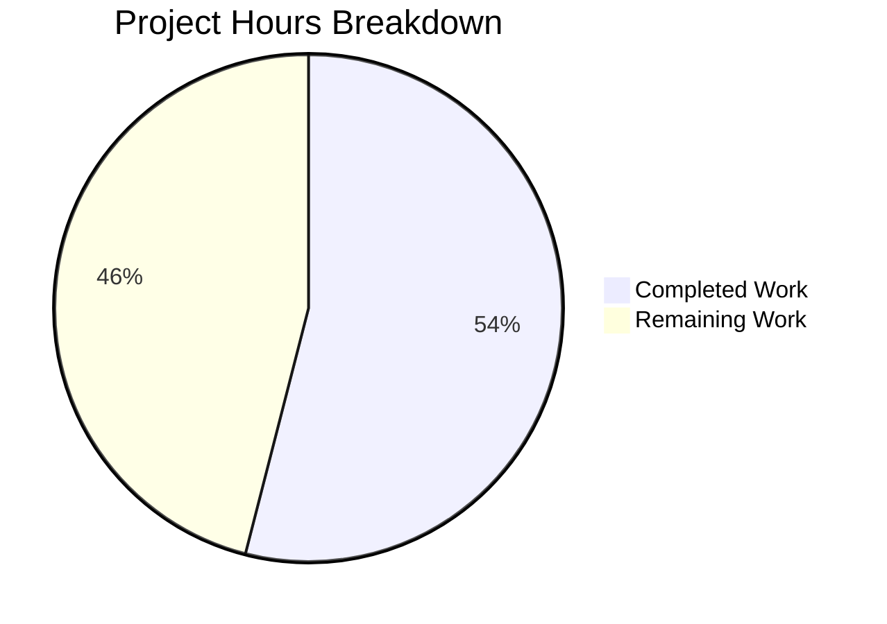
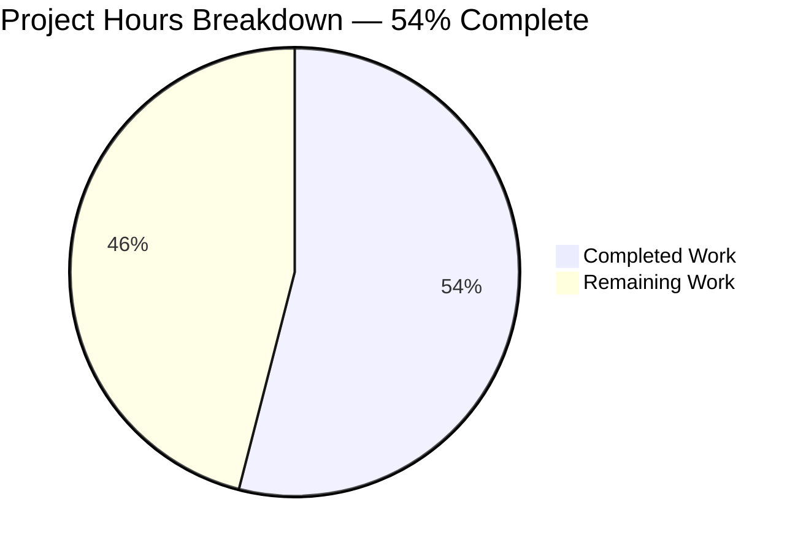
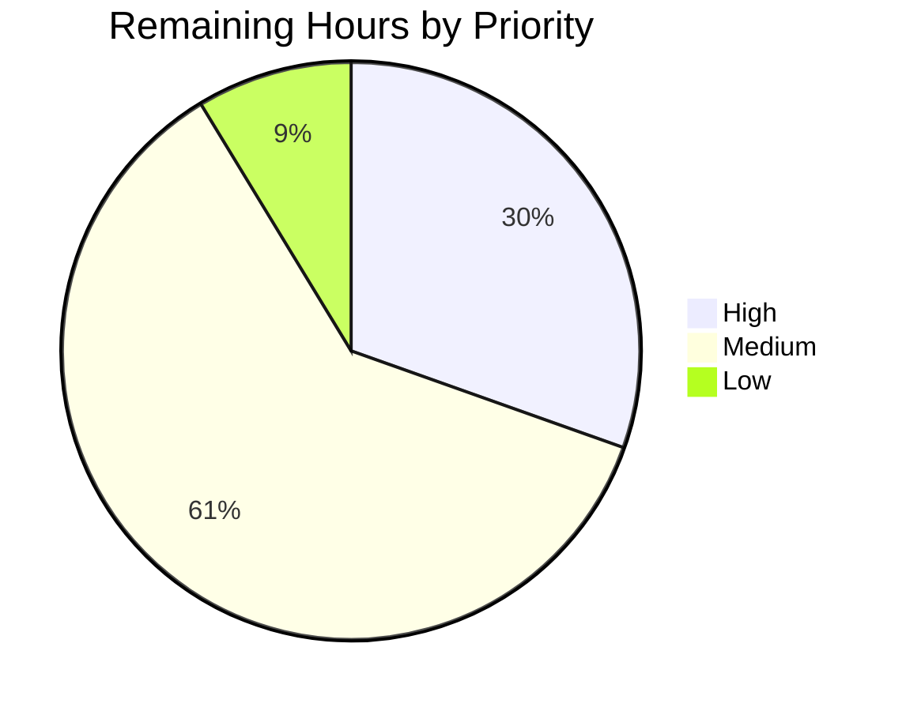
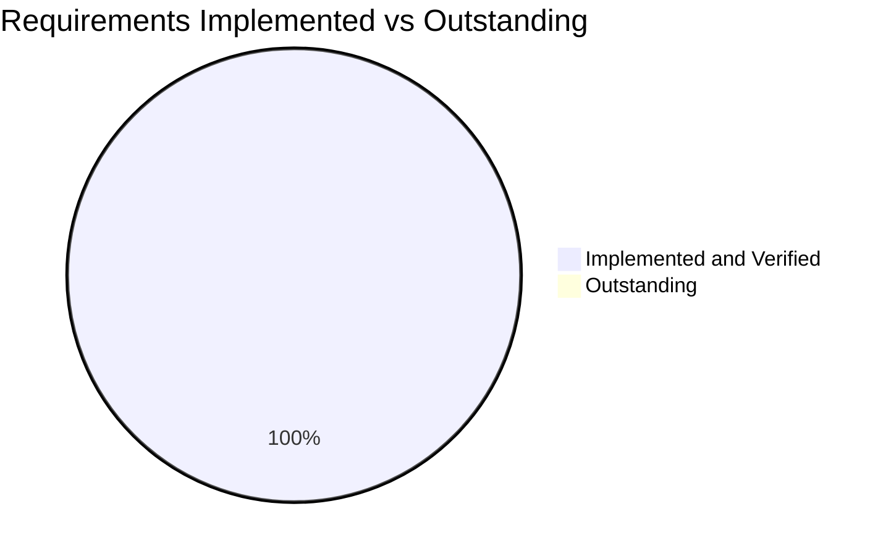

# 1. Executive Summary

## 1.1 Project Overview

This project adds one read-only greeting endpoint to an existing single-service Flask application: `GET /good-evening` returns `{"message": "Good evening", "status": "success", "timestamp": "<ISO-8601>"}` beside the service's existing `GET /hello`, and a new pytest module covers its contract. The endpoint is public, stateless and unauthenticated, inheriting the application's headers, instrumentation and CORS policy rather than re-implementing them. The existing endpoints, hooks, error handlers, server initialisation and configuration files were left as they were.

## 1.2 Completion Status



Completed work is dark blue (#5B39F3); remaining work is white (#FFFFFF). The centre figure is **54% complete**.

| Metric | Hours | Notes |
|---|---|---|
| Total Hours | 50 | 27 completed + 23 remaining |
| Completed Hours (AI + Manual) | 27 | The endpoint, its test module, and the verification that proved both |
| Remaining Hours | 23 | Path-to-production work: container and serving configuration, pipeline repair, and two low-severity hygiene items |

**Calculation:** 27 ÷ (27 + 23) = 27 ÷ 50 = **54%**. All 26 scoped requirements are implemented and verified; the 23 remaining hours are deployment and pipeline work, not unfinished feature work.

## 1.3 Key Accomplishments

- ✅ `GET /good-evening` registered inside the existing route-registration function and live on the first request after a cold boot
- ✅ Handler returns the 200 JSON envelope with a fresh per-request timestamp, `Content-Type: application/json` and `X-API-Version: 1.0`
- ✅ GET-only: other methods reach the application-wide 405 handler with the shared JSON body and an `Allow` header carrying `GET`, never `POST`
- ✅ Six hardening headers, `X-Response-Time`, `X-Request-ID` and the configured CORS policy inherit onto the new path with no hook change
- ✅ Contract verified identical on both serving paths — development server and Gunicorn/WSGI
- ✅ `GET /hello` and `GET /health` verified unchanged against the pre-change baseline
- ✅ New module `src/backend/tests/test_good_evening.py` green (3 of 3), asserting the body, both handler headers, all six inherited security headers and the 405 method list
- ✅ Insertion-only: 49 added lines, 0 deletions, no new dependency, middleware, port or configuration

## 1.4 Critical Unresolved Issues

No scoped requirement is unresolved: **0 of 26** are open. Seven items outside that scope remain outstanding before release, all pre-existing repository or deployment conditions whose fix sites were explicitly out of bounds.

| # | Issue | Impact | Owner | ETA |
|---|---|---|---|---|
| 1 | The container's declared start command names an attribute the WSGI module does not publish (`wsgi:app` versus `application`) | A container built from this repository fails at startup | Platform / container owner | Before production |
| 2 | The development entry point serves a PIN-locked interactive debugger console at `/console`; both serving paths disclose the serving product and version in `Server` | Code-execution surface and version disclosure if the development server is ever reachable off loopback | Platform / security owner | Before production |
| 3 | The repository's declared gate configuration cannot run as shipped (both `pytest.ini` files unparseable, CI lint config path unresolvable, CI coverage source resolving to nothing) | No automated quality gate protects the branch | Build / tooling owner | Next sprint |
| 4 | The declared 100% line-and-branch coverage floor cannot be evaluated as shipped; measured whole-package coverage is 62.23% | The threshold cannot be met or meaningfully enforced | Build / tooling owner | Next sprint |
| 5 | Pre-existing WSGI lifecycle, signal, port and performance tests fail on timing-bound hosts, and one module skips at import | A whole-tree run is red, masking the green new module | Test / platform owner | Next sprint |
| 6 | `SIGTERM` to the Gunicorn master does not stop the process (the WSGI module's handler logs graceful shutdown without exiting) | Container termination waits out the grace period; readiness is not withdrawn | Backend owner | Next sprint |
| 7 | CORS responses attach the first configured origin when no `Origin` was sent and omit `Vary: Origin` on refused origins; `/health` reports `uptime` in epoch seconds and discloses `debug`/`environment` | Cache hygiene and header-coherence issues; no bypass or data exposure | Backend owner | Backlog |

## 1.5 Access Issues

No access issues identified.

## 1.6 Recommended Next Steps

1. **[High]** Correct the container start command, boot the container and smoke-test `GET /good-evening`.
2. **[High]** Disable the interactive debugger outside loopback and strip the transport-layer `Server` header at the proxy or server.
3. **[Medium]** Repair the declared pytest, flake8 and coverage configuration so `pytest` and the CI steps run as written.
4. **[Medium]** Repair the pre-existing WSGI tests and the module that skips at import, so the suite can gate a pipeline.
5. **[Low]** Tighten CORS response hygiene and correct the health endpoint's `uptime` value.

# 2. Project Hours Breakdown

## 2.1 Completed Work Detail

| Component | Hours | Description |
|---|---|---|
| Greeting endpoint: route registration and handler | 7.0 | `@app.route('/good-evening', methods=['GET'])` and `good_evening_route_handler()` inserted inside `register_route_handlers` (`src/backend/app.py:426-473`). Builds `{'message': 'Good evening', 'timestamp': datetime.now().isoformat(), 'status': 'success'}`, serialises with `jsonify`, sets status 200 plus `Content-Type: application/json` and `X-API-Version: 1.0`, logs one entry and one success record through the module logger, and mirrors the neighbouring handler's `try`/`except` shape. A dedicated handler in the existing registration site, with no new file, helper or dependency. |
| Test module `src/backend/tests/test_good_evening.py` | 7.0 | A 192-line pytest module mirroring the repository's existing greeting tests: one class, three tests, module-local `app`/`client` fixtures, guarded imports with a module-level skip, and exact-value assertions on the body, both handler headers, all six inherited security headers, the two instrumentation headers, the in-process suppression of `Server`/`X-Powered-By`, and the 405 `allowed_methods`/`Allow` membership. Includes the assertion-strengthening pass and the comment recording the transport-layer boundary. |
| Response contract, inherited hardening and error contracts | 4.0 | Verification of the wire contract: 200 with `message`/`status`/`timestamp` in the sorted key order, the six hardening header values exactly as specified, `X-Response-Time` and `X-Request-ID`, the CORS header for both configured origins and none for unlisted or `null` origins, and the shared JSON 404/405 envelopes with their `Allow`/`allowed_methods` membership. |
| End-to-end and regression verification on both serving paths | 5.0 | The endpoint driven on the development server (cold boot, sequential, concurrent) and under Gunicorn/WSGI, with framing integrity checked against declared `Content-Length`; `GET /hello` verified against all seven pre-change baseline values; `GET /health` and `POST /hello` verified unchanged; the sanctioned startup log lines read back as written. |
| Static gates and scope discipline | 3.5 | Insertion-only diff verification (49 added lines, 0 deletions, one hunk, two files), confirmation that no dependency, middleware, port or configuration changed, flake8 at 88 columns (138 findings on the application module unchanged, 0 in the new module and 0 inside the inserted lines), and review of the security-scan delta. |
| UI and design-system determination | 0.5 | Confirmation that the deliverable is a JSON HTTP endpoint: no template, static asset or browser client exists, `/` returns a JSON 404 on both serving paths, and every JSON page renders with zero application DOM elements and no client-side script. |
| **Total Completed** | **27.0** | |

## 2.2 Remaining Work Detail

| Category | Hours | Priority |
|---|---|---|
| Container deployment: correct the declared start command to the WSGI object the module publishes, then build and boot the container and smoke-test the endpoint | 4.0 | High |
| Production serving configuration: run with the interactive debugger disabled outside loopback and strip the transport-layer `Server` header at the server or edge proxy | 3.0 | High |
| Repository gate configuration repair so the declared test, lint and coverage steps run as written | 6.0 | Medium |
| Suite repair: the pre-existing WSGI lifecycle, signal, port and performance tests, and the module that skips on a non-existent import, so a whole-tree run can be green | 8.0 | Medium |
| CORS response hygiene (per-request origin echo or unconditional `Vary: Origin`) and coverage of the CORS response headers | 2.0 | Low |
| **Total Remaining** | **23.0** | |

## 2.3 Effort Distribution and Confidence

| Measure | Value | Basis |
|---|---|---|
| Completed hours | 27.0 | Endpoint and tests read back in the tree; contract, headers, error paths and regression verified at runtime on both serving paths |
| Remaining hours | 23.0 | Six grouped path-to-production items, each traced to a named file or command in the repository |
| Total project hours | 50.0 | 27.0 + 23.0 |
| AAP-scoped completion | 54% | 27.0 ÷ 50.0 |
| Requirements implemented and verified | 26 of 26 | One verdict per requirement; 0 open |

Confidence is **high** for the completed hours and for the four High and Medium remaining items, each of which cites the exact file or invocation that must change (the container start command, the serving configuration, the two pytest configuration files, the CI lint and coverage steps, and the existing WSGI test module). Confidence is **medium** for the suite-repair estimate: the existing WSGI tests fail on readiness and timing budgets that depend on host load, so the effort to make them deterministic may fall on either side of the eight hours quoted.

# 3. Test Results

| Area / Category | Framework | Tests | Passed | Failed | Coverage | What This Proves |
|---|---|---|---|---|---|---|
| New endpoint contract, headers and method guard | pytest 9.1.1 + pytest-flask 1.3.0 (`src/backend/tests/test_good_evening.py`) | 3 | 3 | 0 | The handler's success path and its full response contract | `GET /good-evening` returns the specified 200 JSON envelope, sets `Content-Type` and `X-API-Version`, carries the six inherited hardening headers and the two instrumentation headers, and refuses non-GET methods with the shared 405 body whose method list contains `GET` and not `POST` |
| Whole-package suite run (all three modules) | pytest with pytest-cov 7.1.0 (`src/backend/tests`) | 14 collected | 3 | 11, plus 11 teardown errors on those same tests | 62.23% of 416 statements (application module 66.53%, WSGI module 57.41%) | The package imports and the application builds cleanly; the only failures sit in the existing WSGI lifecycle, signal, port and performance module, and the single skip is a pre-existing module-level import guard |
| Lint gate | flake8 7.4.1, 88 columns, `E,W,F,C` (static scan) | n/a | — | — | 712 findings package-wide; 0 in the new module; 138 on the application module, unchanged | The new code introduces no new lint finding and stays within the repository's column limit |
| Security scan | bandit 1.9.4 (static scan) | n/a | — | — | 239 issues (233 Low, 4 Medium, 2 High) over 2488 lines | No new class of security finding; the delta over the pre-change baseline is the test module's own pytest assert statements and its test-only key literal |

**Not Covered**

- **The greeting handler's error path.** The handler's `except` branch and its JSON 500 response cannot be reached by any request the application exposes — the handler reads no request state and its only operations are constants, a clock reading and `jsonify`. It mirrors the neighbouring handler's shape exactly, and the model handler's branch is likewise unexercised. A human should confirm that a deliberately injected failure inside the handler returns the 500 envelope before release if that path is considered security-relevant.
- **CORS response headers.** No test asserts them, because reaching them requires sending an `Origin` header, which the mirrored test set does not do. They were exercised at runtime (both configured origins echo; unlisted and `null` origins receive no CORS header at all), but they are not regression-protected by the suite.
- **The transport-layer `Server` header.** The module asserts that the application's own suppression works, which it does in-process; the value a real client receives is re-added by whichever server is running, so the wire behaviour cannot be covered from inside the test client. A human should verify the header's absence on the deployed response after the edge configuration change.
- **The existing WSGI test module.** Eleven of its tests fail on this host and on any timing-bound host, so they currently provide no signal; until they are repaired they neither pass nor meaningfully assert anything.

# 4. Runtime Validation & UI Verification

## 4.1 Runtime Validation Results

Every line below was driven against the running service, on the development server and on the Gunicorn/WSGI entry point.

- ✅ **`GET /good-evening` (development server)** — 200, `application/json`, body `{"message": "Good evening", "status": "success", "timestamp": "…"}`, timestamp fresh on every call and served correctly on the first request after a cold boot
- ✅ **`GET /good-evening` (Gunicorn/WSGI)** — same contract and same header set as the development path, with the compact production body (87 bytes versus 100 bytes when debug pretty-printing is on)
- ✅ **`GET /hello`** — 200 with `"Hello world"`, matching every pre-change baseline value; header set identical to the new route's, with no header unique to either
- ✅ **`GET /health`** — 200 with its six documented keys, still the only route setting `Cache-Control: no-cache, no-store, must-revalidate`
- ✅ **Non-GET methods on the new route** — `POST`, `PUT`, `PATCH`, `DELETE`, `TRACE`, `CONNECT` and unknown methods all return the shared 405 JSON body with `path` and `method` echoed and `Allow` carrying `GET`, never `POST`; an oversized body is refused by the same guard before any body handling
- ✅ **Unknown path** — JSON 404 with the shared error envelope and the full inherited header set; no stack trace, internal path or version string
- ✅ **CORS** — `Access-Control-Allow-Origin` echoed exactly for each configured origin; no CORS header at all for unlisted, `null` or malformed origins; the preflight echoes only the configured methods and headers, with no credentials and no wildcard
- ✅ **Browser render of the JSON endpoints** — each route renders as raw JSON with zero application DOM elements, no client-side script, no console error and no overflow at a 375-pixel viewport
- ✅ **Concurrency and framing** — repeated sequential and concurrent requests return consistent bodies with distinct per-request timestamps, and the declared `Content-Length` matches the bytes received on both serving paths

## 4.2 UI Verification and Runtime Coverage Gaps

No user interface exists and none was changed: the service renders no HTML, ships no browser client and serves no static assets, and `/` returns a JSON 404 on both serving paths. Browser-based verification was therefore limited to confirming that each endpoint renders as JSON with no application DOM, no script error and no layout overflow, which it does.

Never exercised at runtime:

- The handler's `except`/500 branch — unreachable by any request the application exposes.
- The application's own `Server`/`X-Powered-By` suppression as a client would observe it — it holds in-process, but the transport layer re-adds its own `Server` value on every wire response.
- The deployed container — the container's declared start command names an attribute the WSGI module does not publish, so the container image has not been booted as shipped.
- Any consuming client application: none exists in this repository, so the endpoint has been exercised only over raw HTTP.

# 5. Compliance & Quality Review

## 5.1 Compliance Matrix

| Deliverable (as specified) | Verified Status | Progress | How It Was Confirmed |
|---|---|---|---|
| Route registered at `/good-evening`, method list `['GET']`, inside the existing registration function, immediately after the neighbouring greeting handler | ✅ PASS | 100% | One decorator and one handler inserted inside `register_route_handlers`; the routing table holds exactly one such rule; first request after a cold boot served the full contract |
| Dedicated handler returning the JSON envelope with status 200 and the two handler headers | ✅ PASS | 100% | Handler read back at `src/backend/app.py:426-473`; live responses on both serving paths carry the three-key body, `Content-Type: application/json` and `X-API-Version: 1.0` |
| Greeting carried in the JSON `message` field; every response body JSON | ✅ PASS | 100% | `message` is the literal `"Good evening"`; the 200, 404 and 405 bodies are all JSON |
| GET-only, so non-GET methods reach the application-wide 405 handler with the shared body and an `Allow` list containing `GET` and never `POST` | ✅ PASS | 100% | Seven methods probed, all 405 with the shared envelope; membership asserted, never rendered order |
| Registration inside the factory, before the first request, with no initialisation change | ✅ PASS | 100% | First request after two independent cold boots returned the full contract; no initialisation line appears in the diff |
| Inheritance of the app-wide security headers, request instrumentation, logging and CORS, with no hook or middleware change | ✅ PASS | 100% | Six hardening headers with exact values on success and error responses; `X-Response-Time` and `X-Request-ID` present; header set identical to the existing greeting route |
| Stateless, identity-free handler touching no store or shared state | ✅ PASS | 100% | Handler reads no request state; ten sequential and twenty concurrent requests returned byte-identical bodies apart from the timestamp; no cookie or session created |
| No new dependency, port, configuration, middleware or test tooling | ✅ PASS | 100% | Two-file diff, no manifest or configuration change, no new import, no new registration call |
| Minimal-change constraints: add only the route and handler, refactor nothing, isolate the code in a dedicated handler, match existing style | ✅ PASS | 100% | 49 added lines and 0 deletions; no existing handler, hook or signature altered; the handler follows the neighbouring pattern statement for statement |
| Existing greeting and health endpoints unchanged, verified against the pre-change baseline | ✅ PASS | 100% | Both re-verified value-for-value and header-for-header on both serving paths; `POST /hello` still returns the identical 405 envelope |
| Declared out-of-scope surfaces untouched (existing handlers and registrations, initialisation, hooks, CORS, error handlers, ports, environment, container and pipeline files, manifests and test tooling, existing test modules) | ✅ PASS | 100% | Working tree clean at every step; the diff names only the two in-scope files |
| Lint gate: flake8 at 88 columns introducing no new finding | ✅ PASS | 100% | Zero findings in the new module, zero inside the inserted lines, and 138 findings on the application module before and after |
| No user interface and no design system: the deliverable is a JSON HTTP endpoint | ✅ PASS | 100% | No template, static asset or client; every path returns JSON; browser verification found zero application DOM elements |

## 5.2 AAP & Rule Divergences and Gaps

**No divergences from the Agent Action Plan or user rules were identified.**

Basis for that conclusion. Every requirement recorded against this work is met as written, and the delivery stayed inside the boundary the plan and the user's instructions drew: one file modified by insertion only and one file created, with the existing greeting and health endpoints, the initialisation code, the middleware hooks, the CORS configuration, the error handlers, every port and environment setting, the container and pipeline files, all dependency manifests and test-tooling configuration, and the pre-existing test modules left untouched.

Every condition in the repository that differs from ideal — the transport-layer `Server` disclosure, the interactive debugger console on the development entry point, the CORS response-header hygiene, the health endpoint's `uptime` value, the unrunnable gate configuration, the unevaluable coverage floor, the failing existing WSGI tests and the module that skips on a non-existent import — is a pre-existing, application-wide or tooling condition, not a departure from the plan. Each has its only fix site inside the boundary the plan and the user's constraints explicitly excluded (server initialisation, the WSGI entry point and port handling, the middleware hooks and CORS configuration, the error handlers, the container and pipeline definitions, the dependency manifests and test tooling, and the existing test modules), and the user's instructions froze the same surfaces in the same direction — add only the route and handler, change no existing variable name or signature, add no error handling beyond the existing endpoint's, introduce no dependency or middleware, and modify server initialisation only if route registration required it. A higher-priority source therefore sanctions each of them, so none is recorded as a divergence; they appear instead as the remaining path-to-production work in Sections 2.2 and 6 and as the outstanding items in Section 1.4.

Two behaviours the plan itself fixes could be mistaken for departures and are not. The handler's `except` branch is unreachable by any request and its 500 response is therefore untested — this is the mandated, statement-for-statement mirror of the neighbouring handler, whose branch is unexercised for the same reason, and the plan records the uncovered branch as expected rather than as a gap. The startup log line and the development-server banner still advertise only the two pre-existing routes; they are deliberate constants the plan requires to stay as written.

# 6. Risk Assessment

| Risk | Category | Severity | Probability | Mitigation | Status |
|---|---|---|---|---|---|
| The development entry point serves a PIN-locked interactive debugger console at `/console` to anyone who can reach the port | Security | High | Medium | Serve production through the WSGI entry point, where the same path returns the application's JSON 404, and keep the development server on loopback only; do not treat the PIN as a boundary | Open |
| Both serving paths advertise the exact serving product and version in the `Server` header, beneath the application's own suppression | Security | Low | High (present today) | Strip the header in the reverse proxy or server configuration; the application cannot remove a header its transport layer adds after the hooks run | Open |
| The container's declared start command names an attribute the WSGI module does not publish, so the image fails to boot | Integration / Operational | High | High | Point the command at the published WSGI object and verify a container boot serving the endpoint | Open |
| The repository's declared gates cannot run as shipped, so no automated quality gate protects the branch | Operational | High | High (certain today) | Repair the two test-configuration files, the CI lint configuration path and the CI coverage source, and set an achievable coverage floor | Open |
| The declared 100% line-and-branch coverage floor is unevaluable as shipped; measured whole-package coverage is 62.23% | Operational | Medium | High | Repair the coverage configuration and set a threshold the repository can reach; the new handler's success path and contract are covered, its unreachable error branch is not | Open |
| Pre-existing WSGI lifecycle, signal, port and performance tests fail on timing-bound hosts, leaving a whole-tree run red | Operational | Medium | High | Repair or bound the readiness and performance budgets, or isolate those tests from the default run; one module also skips at import | Open |
| `SIGTERM` to the Gunicorn master does not stop the process, so container termination waits out the grace period and readiness is not withdrawn | Operational | Medium | Medium | Make the WSGI signal handler exit; termination currently requires `SIGKILL` | Open |
| CORS responses attach the first configured origin when no `Origin` was sent and omit `Vary: Origin` on refused origins, and `/health` reports `uptime` in epoch seconds while disclosing `debug`/`environment` | Integration / Maintainability | Low | Low | Express the CORS policy as a per-request origin echo or emit `Vary` unconditionally; return elapsed uptime and gate the debug fields outside development | Open |

# 7. Visual Project Status

## 7.1 Hours Breakdown



Completed work is dark blue (#5B39F3); remaining work is white (#FFFFFF).

## 7.2 Remaining Work by Priority



| Priority | Hours | Categories |
|---|---|---|
| High | 7.0 | Container deployment (4.0) and production serving configuration (3.0) |
| Medium | 14.0 | Repository gate configuration repair (6.0) and pre-existing suite repair (8.0) |
| Low | 2.0 | CORS response hygiene and its test coverage |
| **Total** | **23.0** | Matches the Remaining Hours in Section 1.2 and the total of Section 2.2 |

## 7.3 Requirements Status



All 26 requirements the work was scoped against are implemented and verified; the remaining hours in Section 2.2 are path-to-production work outside that scope.

# 8. Summary & Recommendations

The feature this project set out to add is delivered and verified. `GET /good-evening` occupies a single dedicated handler inside the application's existing route-registration function, returns the specified 200 JSON envelope with a fresh per-request timestamp, and inherits the application's hardening headers, request instrumentation and CORS policy without a single change to any hook, middleware, error handler or configuration file. The change is a 49-line insertion into `src/backend/app.py` and a 192-line pytest module, with nothing deleted, renamed or restyled — a two-file delta any reviewer can read end to end.

Verification matched the delivery's ambition. The contract was checked value by value on both serving paths — the development server and the Gunicorn/WSGI entry point — including the first request after a cold boot, repeated sequential calls and concurrent bursts. Every non-GET method was refused by the application-wide handler with the shared JSON body and an `Allow` list containing `GET` and never `POST`. The existing greeting and health endpoints were re-verified against their pre-change baseline, header-for-header and value-for-value, so the change is known to have moved nothing else. The new module is green at three of three, with exact-value assertions on the body, both handler headers, all six inherited security headers and the method list, and it discriminates a wrong implementation rather than merely executing the route. The package compiles, the new module introduces no lint finding, and the application's own `Server` and `X-Powered-By` suppression holds where the application controls the response.

Completion stands at **54%** (27 of 50 hours). That figure reflects the accounting the work was scoped against: every one of the 26 requirements is complete and verified, and the 23 remaining hours are path-to-production work — correcting the container's start command, disabling the interactive debugger outside a developer's loopback session and removing the transport-layer `Server` header, repairing the repository's declared test, lint and coverage configuration so the pipeline can run as written, repairing the pre-existing WSGI lifecycle and performance tests so a whole-tree run can be green, and tightening CORS response hygiene with coverage for it. None of these is unfinished feature work, and none touches the endpoint's behaviour.

The critical path to production is short and specific. First, the container command must name the WSGI object the module actually publishes — today the declared command points at an attribute that does not exist, so the image cannot boot. Second, the serving configuration must run without the interactive debugger and strip the `Server` header at the edge. Third, the repository's declared gates must be made runnable so the pipeline protects the branch rather than failing on its own configuration. Until that third step is done, the green result on this feature rests on commands run by hand with explicit overrides.

Production readiness is therefore split. The endpoint itself is production-ready: correct contract, correct method guard, stateless, hardened, tested, and verified identically on the production serving path. The service as a whole is not yet release-ready as shipped, because its container does not boot as declared, its pipeline cannot run as declared, and its development entry point exposes an interactive console to anyone who can reach that port. A reader adopting this codebase should treat those three items as the release gate and everything in Section 6 as the watch list that follows.

# 9. Development Guide

## System Prerequisites

| Requirement | Value |
|---|---|
| Python | 3.12 or 3.13 (`pyproject.toml` requires `>=3.12`; the verified environment is Python 3.13.7) |
| pip | 25.x, bootstrapped in the virtual environment |
| Other software | Git; a POSIX shell. No database, cache, message broker, external service or credential is required anywhere in this project |
| Hardware | Any developer workstation or small container; the service is a single-process Flask application |

## Environment Setup

Create and activate a virtual environment inside the backend component. It is ignored by `src/backend/.gitignore`, so it stays out of the tree.

```bash
cd src/backend
python3.13 -m venv .venv
source .venv/bin/activate
```

Activate before running anything: the integration suite starts `python -m gunicorn` as a subprocess, so `python` must resolve to the virtual environment's interpreter rather than the system one.

If environment creation fails with an `ensurepip` error, restore the bundled installer wheel and retry:

```bash
python3.13 -m pip download pip==25.2 --no-deps -d .pip-download
mkdir -p /usr/lib/python3.13/ensurepip/_bundled
cp .pip-download/pip-25.2-py3-none-any.whl /usr/lib/python3.13/ensurepip/_bundled/
```

## Dependency Installation

Install all three manifests. Two declared names do not exist on PyPI and will abort a plain install — `flake8-security>=1.7.1` (`src/backend/requirements.txt:102`, `requirements-dev.txt:59`) and `pytest-tmp-path>=1.0.0` (`requirements-dev.txt:225`) — so install from copies of the manifests with those two lines removed.

```bash
source src/backend/.venv/bin/activate
grep -v -e 'flake8-security' -e 'pytest-tmp-path' requirements.txt > requirements.install.txt
grep -v -e 'flake8-security' -e 'pytest-tmp-path' requirements-dev.txt > requirements-dev.install.txt
grep -v -e 'flake8-security' -e 'pytest-tmp-path' src/backend/requirements.txt > src/backend/requirements.install.txt
python -m pip install -r requirements.install.txt -r requirements-dev.install.txt -r src/backend/requirements.install.txt
```

The verified environment resolves to **177 installed distributions**, including flask 3.1.3, Flask-Cors 6.0.5, Werkzeug 3.1.9, gunicorn 26.2.0, pytest 9.1.1, pytest-flask 1.3.0, pytest-cov 7.1.0, flake8 7.4.1 and bandit 1.9.4. Install `flake8-bandit` only if flake8's `S` codes are wanted. Do not downgrade `pytest-benchmark` below 4.0.0 — 3.x cannot run under pytest 9.

## Application Startup

Check the tree compiles (Python has no separate build step):

```bash
python -m compileall -q src/backend      # exit 0
```

Start the development server detached, then stop it by the pid it prints. `PORT` and `HOST` default to `localhost:8000` when unset (`src/backend/app.py:770-771`):

```bash
cd src/backend
PORT=3000 HOST=127.0.0.1 nohup .venv/bin/python app.py > app.log 2>&1 & echo $!
curl -s -i http://127.0.0.1:3000/good-evening
```

The development server runs with `debug=True` and `use_reloader=False`, so it stays in that one process — and it also serves an interactive debugger console at `/console`. Keep it on loopback only.

Serve the same application through the production path (`wsgi.py` publishes `application`, not `app`):

```bash
cd <repository-root>
PYTHONPATH="$PWD:$PWD/src/backend" gunicorn --bind 127.0.0.1:3001 src.backend.wsgi:application
```

Both paths were verified serving `GET /good-evening`, `GET /hello` and `GET /health` with 200 and the same header set; under the WSGI path `/console` returns the application's JSON 404.

## Verification Steps

Export `PYTHONPATH` before any test run. Both the repository root and `src/backend` are required: the WSGI module does a bare `from app import create_app` and exits if it cannot find it, while the tests import the package qualified.

```bash
export PYTHONPATH="$PWD:$PWD/src/backend"
```

The new endpoint's tests:

```bash
python -m pytest -c pyproject.toml -o addopts="" -p no:cacheprovider -q src/backend/tests/test_good_evening.py -rs
# 3 passed, 0 skipped, exit 0
```

The whole package with coverage (the run exits non-zero only because of the repository's own configured 100% floor):

```bash
python -m pytest -c pyproject.toml -o addopts="" -p no:cacheprovider \
  --cov=src/backend --cov-branch --cov-report=term-missing -q src/backend/tests
# 3 passed, 11 failed, 1 skipped, 11 teardown errors; coverage 62.23% over 416 statements
```

Lint and security gates:

```bash
python -m flake8 --isolated --max-line-length=88 --select=E,W,F,C --extend-exclude=.venv src/backend
# 712 findings package-wide; 138 in app.py; 0 in the new test module

python -m bandit -r src/backend -x src/backend/.venv -q
# 239 issues (233 Low, 4 Medium, 2 High) over 2488 lines of code
```

Expected outcomes to compare against: the new module is green and unskipped; `app.py` carries exactly 138 flake8 findings; the coverage figures above are the current baseline; the eleven failures are all in `src/backend/tests/test_wsgi.py` and one module skips at import. Never run a scan without excluding `src/backend/.venv`, and do not add `--cov-fail-under` to a run that is meant to pass.

## Example Usage

```bash
# The new endpoint
curl -s http://127.0.0.1:3000/good-evening
# {"message":"Good evening","status":"success","timestamp":"2026-10-10T01:35:44.596200"}

# The existing endpoint, unchanged
curl -s http://127.0.0.1:3000/hello
# {"message":"Hello world","status":"success","timestamp":"..."}

# Readiness
curl -s -o /dev/null -w '%{http_code}\n' http://127.0.0.1:3000/health     # 200

# A refused method: 405 with the shared JSON body and Allow: GET, OPTIONS, HEAD
curl -s -i -X POST http://127.0.0.1:3000/good-evening

# An unknown path: JSON 404
curl -s http://127.0.0.1:3000/no-such-route

# A configured cross-origin request echoes its origin
curl -s -i -H 'Origin: http://localhost:3000' http://127.0.0.1:3000/good-evening | grep -i access-control-allow-origin
```

## Troubleshooting

| Symptom | Cause | Resolution |
|---|---|---|
| `INTERNALERROR … SystemExit: 1` before any test runs, exit code 3 | `PYTHONPATH` is missing `src/backend`, so the WSGI module's bare import exits during collection | `export PYTHONPATH="$PWD:$PWD/src/backend"` |
| `ModuleNotFoundError: No module named 'flask'` | The virtual environment is not activated, so the system interpreter is used | `source src/backend/.venv/bin/activate` |
| `pytest -c pytest.ini` fails with `unexpected line: ']'` | A pre-existing defect in both checked-in pytest configuration files | Use the documented override `-c pyproject.toml -o addopts="" -p no:cacheprovider`; do not edit the configuration files |
| `ERROR: Unknown config option: benchmark` | The `pyproject.toml` pytest table carries a non-standard benchmark section rejected by strict configuration | Same override as above |
| `The specified config file does not exist: .flake8` | CI runs flake8 from `src/backend`, where the repository-root `.flake8` is not present | Run flake8 as shown above, or from the repository root with `--config=.flake8` |
| `Port 3000 is in use by another program` | Another process holds the port | Choose another port with `PORT=<n>`; on a shared host use one port block per checkout |
| Coverage run fails with "Required test coverage of 100.0% not reached" | The repository's declared floor, unevaluable as shipped (62.23% measured) | Expected today; do not add `--cov-fail-under` to a run that must pass |
| `SIGTERM` does not stop the Gunicorn master | The WSGI module's signal handler logs graceful shutdown without exiting | Use `SIGKILL` on the master pid, or apply the fix tracked in Section 2.2 |
| The container exits immediately with `Failed to find attribute 'app' in 'wsgi'` | The declared start command names an attribute the WSGI module does not publish | Point the command at `src.backend.wsgi:application` |

# 10. Appendices

## Appendix A — Command Reference

| Purpose | Command (run from the repository root unless noted) |
|---|---|
| Create the virtual environment | `cd src/backend && python3.13 -m venv .venv` |
| Activate it | `source src/backend/.venv/bin/activate` |
| Install dependencies (filtered for the two PyPI-absent names) | `python -m pip install -r requirements.install.txt -r requirements-dev.install.txt -r src/backend/requirements.install.txt` |
| Compile-check the package | `python -m compileall -q src/backend` |
| Start the development server | `cd src/backend && PORT=3000 HOST=127.0.0.1 nohup .venv/bin/python app.py > app.log 2>&1 & echo $!` |
| Start the production path | `PYTHONPATH="$PWD:$PWD/src/backend" gunicorn --bind 127.0.0.1:3001 src.backend.wsgi:application` |
| Test the new endpoint | `PYTHONPATH="$PWD:$PWD/src/backend" python -m pytest -c pyproject.toml -o addopts="" -p no:cacheprovider -q src/backend/tests/test_good_evening.py -rs` |
| Whole-package gate with coverage | `PYTHONPATH="$PWD:$PWD/src/backend" python -m pytest -c pyproject.toml -o addopts="" -p no:cacheprovider --cov=src/backend --cov-branch --cov-report=term-missing -q src/backend/tests` |
| Lint the backend | `python -m flake8 --isolated --max-line-length=88 --select=E,W,F,C --extend-exclude=.venv src/backend` |
| Security scan | `python -m bandit -r src/backend -x src/backend/.venv -q` |
| Inspect the change against its base | `git diff --stat <base-branch>...HEAD` — expect two files, 49 and 191 added lines, 0 deletions |
| Confirm nothing else moved | `git status --porcelain` — expect no modified tracked file |

## Appendix B — Port Reference

| Port | Purpose |
|---|---|
| 8000 | Application default when `PORT` is unset (`src/backend/app.py:770-771`); the WSGI entry point uses the same fallback |
| 3000 | Port the project's own examples use; `src/backend/.env.example` sets it |
| 3000, 3001 | Ports the container composition publishes (development and production respectively) |
| 5678 | Debugger port published by the container composition |
| Free choice | The application binds a single configurable HTTP port; on a shared host give each checkout its own block (for example 3000 + 10 × *n*) |

## Appendix C — Key File Locations

| Path | Role |
|---|---|
| `src/backend/app.py` | Application factory, configuration helpers, hooks, error handlers, route registrations — including the new `GET /good-evening` handler at lines 426-473 |
| `src/backend/tests/test_good_evening.py` | The new endpoint's test module (three tests, module-local fixtures) |
| `src/backend/tests/test_app.py` | Pre-existing route tests; skips at module level on a non-existent import |
| `src/backend/tests/test_wsgi.py` | Pre-existing WSGI lifecycle, signal, port and performance suite |
| `src/backend/wsgi.py` | Production WSGI entry point; publishes `application` |
| `src/backend/.env.example` | Reference for environment variable names (a `.env` file is not required) |
| `pyproject.toml`, `pytest.ini`, `src/backend/pytest.ini`, `.flake8` | Declared tooling configuration, currently not runnable as shipped |
| `infrastructure/docker/Dockerfile`, `infrastructure/docker/docker-compose.yml` | Container definitions and published ports |
| `.github/workflows/ci.yml`, `.github/workflows/cd.yml` | Pipeline definitions |

## Appendix D — Technology Versions

| Component | Version |
|---|---|
| Python | 3.13.7 (project supports 3.12 and 3.13) |
| Flask | 3.1.3 |
| Flask-Cors | 6.0.5 |
| Werkzeug | 3.1.9 |
| gunicorn | 26.2.0 |
| pytest / pytest-flask / pytest-cov / pytest-benchmark | 9.1.1 / 1.3.0 / 7.1.0 / 5.3.0 |
| flake8 | 7.4.1 |
| bandit | 1.9.4 |
| Installed distributions | 177 |

## Appendix E — Environment Variable Reference

| Variable | Default | Purpose |
|---|---|---|
| `PORT` | `8000` | HTTP port the application binds |
| `HOST` | `localhost` | Interface the application binds |
| `PYTHONPATH` | unset | Must include the repository root and `src/backend` for tests and for running the WSGI module directly |
| `FLASK_ENV`, `SECRET_KEY` and the other names in `src/backend/.env.example` | unset | Optional; the application runs entirely on its built-in defaults, and no environment variable or secret is required |
| Database, cache, queue or SMTP variables | none | Not used anywhere in this project |

## Appendix F — Developer Tools Guide

| Task | Tool and invocation |
|---|---|
| Run one test by name | `python -m pytest -c pyproject.toml -o addopts="" -p no:cacheprovider -q "src/backend/tests/test_good_evening.py::TestGoodEveningRouteHandler::test_good_evening_endpoint_returns_200_with_json_response"` |
| Run the suite with verbose collection | Add `-v -rs` to see the skip reason for the module that skips at import |
| Inspect response headers live | `curl -s -i http://127.0.0.1:3000/good-evening` |
| Compare the existing endpoint against its baseline | `curl -s -i http://127.0.0.1:3000/hello` and compare status, body and header set |
| Check the routing table without a server | Build the testing application in a REPL and print `app.url_map` |
| Confirm the change is insertion-only | `git diff --numstat <base-branch>...HEAD` — expect `49 0` and `191 0` |
| Scan for stale patterns | `grep -nE "TODO\|FIXME\|HACK\|NotImplemented" src/backend/app.py src/backend/tests/test_good_evening.py` — expect no matches |

## Appendix G — Glossary

| Term | Meaning |
|---|---|
| Envelope | The JSON response shape used by the greeting endpoints: `message`, `status`, `timestamp` |
| Hardening headers | The six response headers applied application-wide (`X-Content-Type-Options`, `X-Frame-Options`, `X-XSS-Protection`, `Referrer-Policy`, `Content-Security-Policy`, `X-Permitted-Cross-Domain-Policies`) |
| Instrumentation headers | `X-Response-Time` and `X-Request-ID`, added by the response hook to every response |
| Method guard | The application-wide 405 handler that answers any method a route does not declare |
| Path-to-production work | Deployment, serving configuration and pipeline work required before the service can be released, outside the feature's own scope |
| WSGI entry point | `src/backend/wsgi.py`, which publishes the `application` object a production server loads |
