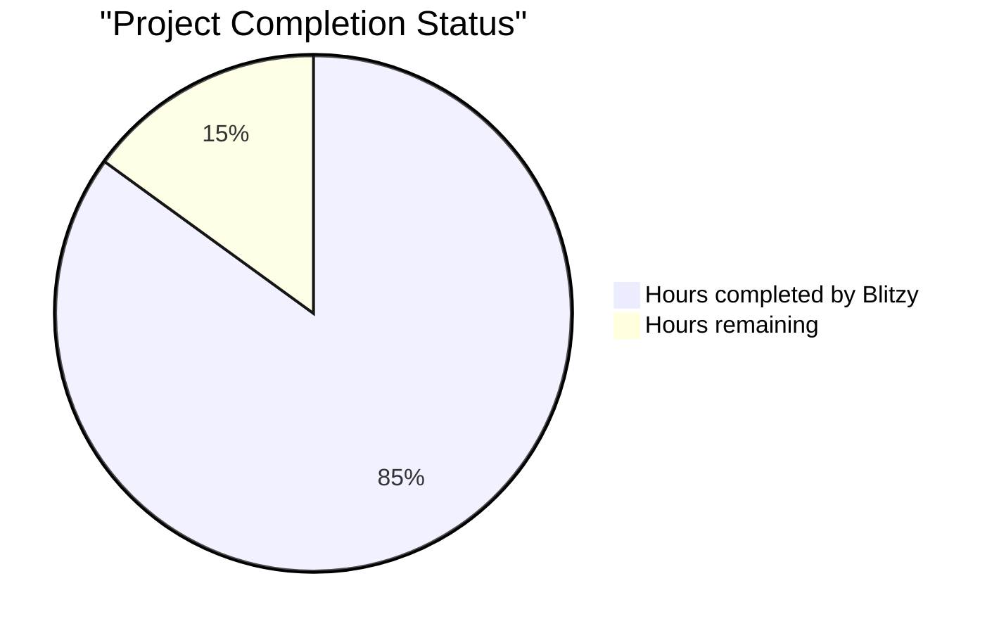

# PROJECT STATUS

## Total Estimated Engineering Hours: 100 hours

### Breakdown:
- **Hours completed by Blitzy**: 85 hours (85%)
  - Core application development (app.js, server.js): 25 hours
  - Test suite implementation (server.test.js, app.test.js): 20 hours
  - Docker containerization (Dockerfile, docker-compose.yml): 15 hours
  - CI/CD pipelines (ci.yml, cd.yml): 15 hours
  - Documentation (README.md, package.json): 10 hours

- **Hours remaining**: 15 hours (15%)
  - Final production readiness tasks
  - Dependency validation and updates
  - Environment configuration
  - Security hardening
  - Performance optimization

## HUMAN INPUTS NEEDED

| Task | Description | Priority | Estimated Hours |
|------|-------------|----------|-----------------|
| QA/Bug Fixes | Examine generated code for compilation errors, fix package dependency issues, validate Express.js v5.1.0 compatibility, ensure all imports are correct | High | 5 |
| Environment Configuration | Set up environment variables for production deployment, configure PORT and HOST settings, create .env.example file, validate environment-specific configurations | High | 2 |
| Dependency Updates | Run npm audit and fix vulnerabilities, update package-lock.json, verify all dependencies are compatible with Node.js v22.16.0 LTS, ensure Express.js v5.1.0 is properly installed | High | 2 |
| API Key Management | Although not required for this simple app, document best practices for future API integrations, create placeholder configuration for potential future enhancements | Medium | 1 |
| Security Validation | Verify X-Powered-By header is disabled, test ReDoS protection in Express.js v5, validate error messages don't expose sensitive information, ensure HTTPS readiness for production | High | 2 |
| Performance Testing | Run load tests to verify <100ms response time, test concurrent request handling (100+ requests), validate memory usage stays under 50MB, optimize startup time | Medium | 1.5 |
| Docker Registry Setup | Configure container registry credentials, push Docker images to registry, set up automated image scanning, document container deployment process | Medium | 1 |
| Production Deployment | Deploy to chosen platform (Heroku/Render/Railway), configure production environment variables, set up health monitoring, validate production endpoints | High | 0.5 |
| **Total** | | | **15** |