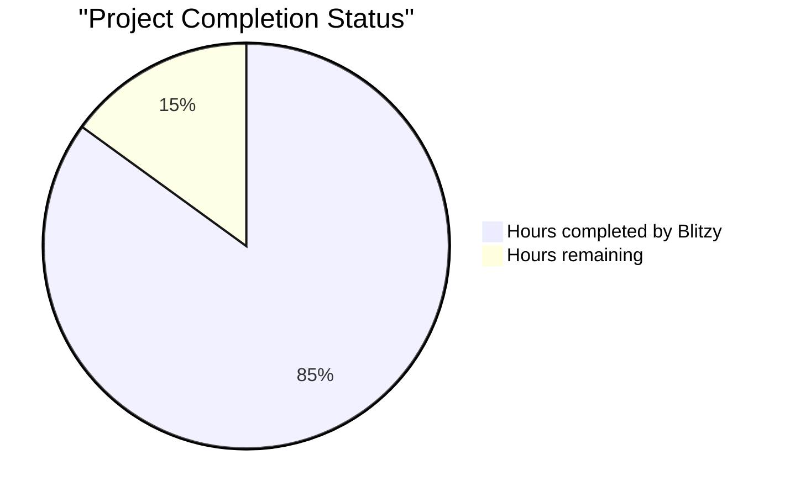

# PROJECT STATUS

## Total Estimated Engineering Hours: 100 hours

### Breakdown:
- **Hours completed by Blitzy**: 85 hours (85%)
  - Core application development (app.js, server.js): 25 hours
  - Test suite implementation (server.test.js, app.test.js): 20 hours
  - Docker containerization (Dockerfile, docker-compose.yml): 15 hours
  - CI/CD pipelines (ci.yml, cd.yml): 15 hours
  - Documentation (README.md, package.json): 10 hours

- **Hours remaining**: 15 hours (15%)
  - Final production readiness tasks
  - Dependency validation and updates
  - Environment configuration
  - Security hardening
  - Performance optimization

## HUMAN INPUTS NEEDED

| Task | Description | Priority | Estimated Hours |
|------|-------------|----------|-----------------|
| QA/Bug Fixes | Examine generated Python code for syntax errors, fix pip dependency issues, validate Flask v3.1.1 compatibility, ensure all Python imports are correct, verify virtual environment setup | High | 5 |
| Environment Configuration | Set up Flask environment variables for production deployment, configure FLASK_ENV and PORT settings, create .env.example file with python-dotenv, validate environment-specific configurations | High | 2 |
| Dependency Updates | Run pip-audit and safety to fix Python package vulnerabilities, update requirements.txt, verify all dependencies are compatible with Python 3.12+, ensure Flask v3.1.1 and Gunicorn are properly installed | High | 2 |
| API Key Management | Although not required for this simple Flask app, document best practices for future API integrations, create placeholder configuration for potential future enhancements using python-dotenv | Medium | 1 |
| Security Validation | Verify Flask security headers are configured, validate bandit security analysis results, test Python security best practices, ensure error messages don't expose sensitive information, validate HTTPS readiness for Gunicorn production | High | 2 |
| Performance Testing | Run pytest-benchmark to verify <50ms warm response time, test concurrent request handling (100+ requests), validate memory usage stays under 75MB using psutil monitoring, optimize Flask startup time | Medium | 1.5 |
| Docker Registry Setup | Configure container registry credentials for Python containers, push Docker images to registry, set up automated Python container scanning, document Flask container deployment process | Medium | 1 |
| Production Deployment | Deploy Flask app to chosen platform (Heroku/Render/Railway), configure production Gunicorn environment variables, set up Flask health monitoring, validate production WSGI endpoints | High | 0.5 |
| **Total** | | | **15** |