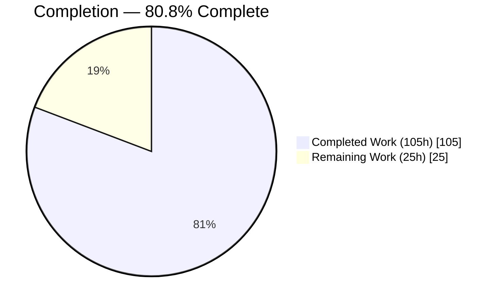
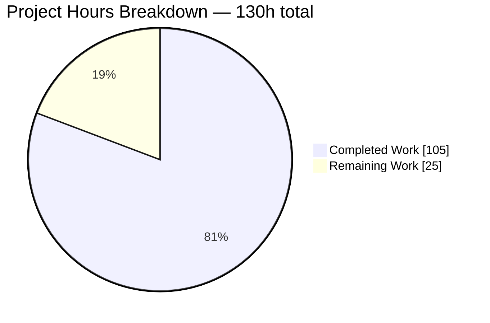
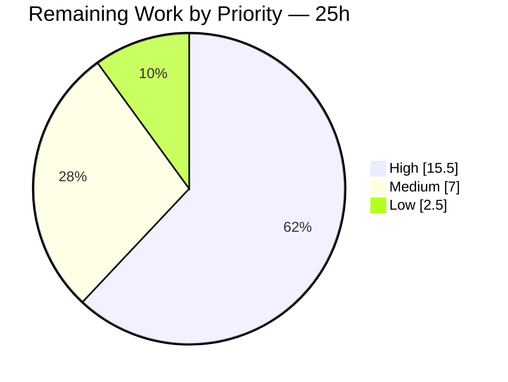
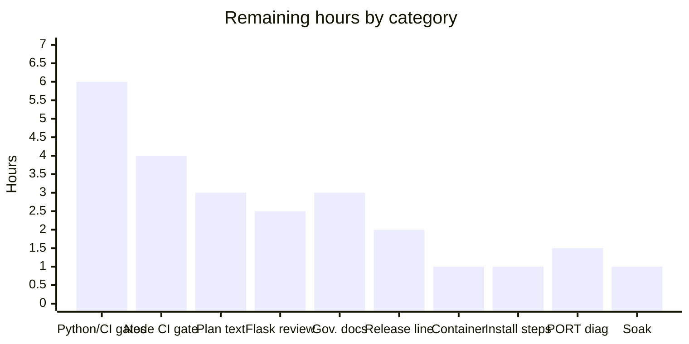

# 1. Executive Summary

## 1.1 Project Overview

This project adds `hello-node/`, a self-contained Node.js 22 / Express 5 tutorial service, to a repository that already runs a Python Flask application. It serves exactly one successful endpoint — `GET /hello`, returning the eleven literal bytes `Hello world` as `text/plain; charset=utf-8` — and closes the boundary around it with a `405` method guard and a terminal JSON `404`. Built for a learner, it ships a pinned reproducible install, educational comments on every module, a tutorial README with verification commands, and a Jest suite behind an enforced coverage gate. The Flask service keeps its own contracts unchanged.

## 1.2 Completion Status


```mermaid
pie showData title Completion — 80.8% Complete
    "Completed Work (105h)" : 105
    "Remaining Work (25h)" : 25
```

Completed = `#5B39F3`; Remaining = `#FFFFFF`.

| Metric | Value |
|---|---|
| **Total Hours** | **130** |
| Completed Hours (AI + Manual) | 105 (105 AI + 0 Manual) |
| Remaining Hours | 25 |
| **Percent Complete** | **80.8%** (105 / 130) |

## 1.3 Key Accomplishments

- `GET /hello` returns the exact eleven-byte plain-text greeting, `Content-Length: 11`, no framework banner.
- One successful endpoint only: `/health`, `/`, unmatched paths and every casing variant return a five-field JSON `404`.
- Non-`GET` methods on `/hello` return `405` with `Allow: GET, HEAD`; `HEAD` is served with an empty body.
- The listener reports the port it bound, honours `HOST`/`PORT`, and closes on `SIGTERM`/`SIGINT` with exit 0.
- A failed bind is machine-detectable: exit status 1, one stderr line, existing service undisturbed.
- `npm ci` reproduces the tree from the committed lockfile, zero vulnerabilities across 348 packages.
- 3 suites / 15 tests pass at 100% statements, branches, functions and lines against a 95/100/95/95 gate.
- Each of the README's fourteen documented commands produces the output it publishes.

## 1.4 Critical Unresolved Issues

Six of the twenty-nine scope items carry an open item — none an unfinished capability. All six are decisions, environment gaps or pre-existing repository defects a human owns.

| Issue | Impact | Owner | ETA |
|---|---|---|---|
| The repository's Python test and CI gates cannot run as committed, and this branch modifies files inside the CI workflow's path filters | The pull request's own checks fail for pre-existing reasons (§5.2, §6) | Platform / DevOps | 6h |
| No workflow runs the Node suite — `hello-node/**` matches no path filter | Regressions surface only when a developer or reviewer runs `npm test` | DevOps | 4h |
| The plan text still specifies the superseded toolchain pins that a security finding replaced | A later alignment pass can revert the fix; it already did once on this branch (§5.2) | Tech Lead | 3h |
| Changes to the Flask entry point, its shutdown path and the Python dependency manifests sit outside the plan's stated file scope | Needs owner acceptance; the served Flask contract was re-verified unchanged (§5.2) | Backend Owner | 2.5h |
| Out-of-range `PORT` values exit 1 with an uncaught `ERR_SOCKET_BAD_PORT` trace instead of the one-line diagnostic | Cosmetic in a tutorial; accepted and documented in the README and environment template | Backend Owner | 1.5h |
| Two documented toolchain install steps and the tutorial prose have no automated coverage | Not exercisable where the runtime prefix is shared; walk them once on a developer machine (§3) | Developer | 1h |

## 1.5 Access Issues

No access issues identified. The project needs no credentials, database or external endpoint; the public npm registry was reachable.

| System/Resource | Type of Access | Issue Description | Resolution Status | Owner |
|---|---|---|---|---|
| npm public registry | Read (package download) | None — `npm ci` restored 347 packages and audited 348 with no authentication | Verified working | — |
| Repository / branch | Read-write (git) | None — 12 commits present, working tree clean | Verified working | — |
| Node toolchain prefix | Install (`nvm install`, global npm) | The prefix on the build machine is shared, so the two documented install commands were not run; the identical runtime and CLI were used instead | Open — walk once locally | Developer |

## 1.6 Recommended Next Steps

1. **[High]** Repair the Python test and CI gates before merge — the stray bracket in both `pytest.ini` files, the workflow's wrong `working-directory`, the unparseable `.flake8` (6h).
2. **[High]** Add a workflow leg for `hello-node/**` running `npm ci`, `npm run test:ci` and `npm audit` (4h).
3. **[High]** Reconcile the plan text with the delivered toolchain pins and install counts (3h).
4. **[High]** Review and accept the Flask entry-point, shutdown and manifest changes (2.5h).
5. **[Medium]** Migrate the contributor guide and templates that still install the superseded toolchain (3h).

# 2. Project Hours Breakdown

Scope for this breakdown is the Agent Action Plan's deliverables plus the path-to-production activities required to run and hand over those deliverables. Nothing outside that scope is counted.

## 2.1 Completed Work Detail

| Component | Hours | Description |
|---|---|---|
| Express application module and HTTP contract | 10 | `hello-node/app.js` — `createApp` factory, `GREETING` constant, `GET /hello` with an explicit plain-text media type, `405` guard with `Allow`, terminal JSON `404`, case-sensitive routing, framework banner suppressed |
| HTTP listener, configuration and lifecycle | 12 | `hello-node/server.js` — `readConfig` against documented defaults, bind with a banner reporting the bound port, `SIGTERM`/`SIGINT` close with exit 0, failed-bind status, importable-module guard |
| Manifest, committed lockfile and runtime pinning | 4.5 | `package.json` (ten keys, five scripts, exact dependency pins), `package-lock.json` at lockfileVersion 3, `.nvmrc`, and the one ignore negation that makes the environment template trackable |
| Jest configuration and coverage gate | 2 | `jest.config.js` — dual test discovery patterns, coverage restricted to the two runtime modules, enforced 95/100/95/95 threshold |
| Unit test suites | 14 | `test/unit/app.test.js` (3 tests) and `test/unit/server.test.js` (6 tests) covering the module surfaces, configuration resolution, bound-port reporting and the termination path |
| Integration contract suite | 9 | `test/integration/hello-endpoint.test.js` (6 tests) driving the application in-process across the success contract and the whole boundary |
| Tutorial README and environment template | 13.5 | `README.md` (424 lines, 17 sections: prerequisites, install, contract, verification with expected output, shutdown, tests, layout, learning objectives) and `.env.example` |
| Educational commentary across all six modules | 8 | The mandated JSDoc form on both runtime modules, all three suites and the Jest configuration, with each non-obvious claim measured rather than assumed |
| Contract and lifecycle verification against a live server | 4 | Byte-exact body checks, the full path and method boundary sweep, override boots, graceful shutdown and failed-bind behaviour |
| Test, coverage and dependency-audit evidence | 3 | Suite runs on both available runtimes, coverage artefact inspection, gate-liveness probe, `npm audit` across the installed tree |
| Runtime, framework and tooling selection | 3 | Express 5.1.0, Jest 29.7.0 and supertest 7.1.4 chosen and pinned; release-line and advisory currency established for the runtime and package manager |
| Coexistence verification with the Flask service | 4 | Both services run side by side with distinct contracts; the Flask JSON envelope, `X-API-Version`, security headers and `/health` confirmed unchanged |
| Python dependency provisioning path | 4 | The documented `pip install -r` path made resolvable and the production manifest completed, so the Flask entry point's imports are satisfied |
| Flask entry-point bind and shutdown lifecycle | 14 | `python wsgi.py` now binds and serves, termination releases the socket and exits 0, a hosting server's signal disposition is respected, and eight lifecycle tests cover it |
| **Total** | **105** | |

## 2.2 Remaining Work Detail

| Category | Hours | Priority |
|---|---|---|
| Repair the repository's Python test and CI gates (both `pytest.ini` files, the workflow's `working-directory`, the `scripts/` directory, `.flake8`, the `pyproject.toml` dev pin) | 6 | High |
| Add an automated gate that runs the Node suite and audit for `hello-node/**` | 4 | High |
| Reconcile the plan text with the delivered toolchain pins and install counts | 3 | High |
| Owner review and acceptance of the Flask lifecycle and dependency-manifest changes | 2.5 | High |
| Migrate the governance documents that still install the superseded toolchain | 3 | Medium |
| Decide the Node release-line strategy (maintenance 22.x versus active 24.x) | 2 | Medium |
| Correct the production container's Gunicorn entry point | 1 | Medium |
| Walk the documented toolchain install steps on a developer machine | 1 | Medium |
| Give out-of-range `PORT` values the same one-line diagnostic as bind failures | 1.5 | Low |
| Re-run a memory soak to settle the resident-memory drift measurement | 1 | Low |
| **Total** | **25** | |

## 2.3 Hours Calculation

- Completed hours (Section 2.1) = **105**
- Remaining hours (Section 2.2) = **25**
- Total project hours = 105 + 25 = **130**
- Completion = 105 / 130 × 100 = **80.8%**

Confidence is high on the completed figures: every requirement in the plan's twelve-file inventory is present in the tree, exercised by the suite and observed at runtime. Confidence is medium on two remaining categories — the Python and CI gate repair, whose cost depends on how far the workflow is rewritten, and the release-line decision, which is a policy choice rather than an engineering task.

# 3. Test Results

Every row below was executed against the repository as it stands and its result observed directly. The Node suite was run on both installed runtimes — the pinned Node 22.23.2 and Node 22.16.0 — with identical counts.

| Area / Category | Framework | Tests | Passed | Failed | Coverage | What This Proves |
|---|---|---|---|---|---|---|
| Integration — HTTP contract and boundary | Jest 29.7.0 + supertest 7.1.4 | 6 | 6 | 0 | `app.js` 100% | `GET /hello` delivers the exact eleven-byte plain-text greeting and every other path, casing and method answers definitely |
| Unit — application module | Jest 29.7.0 | 3 | 3 | 0 | `app.js` 100% | The factory builds a configured application, the greeting constant is byte-exact, and the framework banner is off |
| Unit — listener and lifecycle | Jest 29.7.0 | 6 | 6 | 0 | `server.js` 100% | Configuration resolves to documented defaults and honours overrides; the banner reports the bound port; termination and failed binds behave as specified |
| Coverage gate (all suites together) | Jest `coverageThreshold` | 3 suites / 15 tests | 15 | 0 | 100 / 100 / 100 / 100 against 95 / 100 / 95 / 95 | The gate is met with headroom and is live — a deliberately partial run exits 1 naming all four refusals |
| Syntax and manifest gate | `node --check`, JSON parse | 8 files | 8 | 0 | n/a | All six JavaScript files and both manifests parse; this project has no build step by design |
| Dependency audit | `npm audit --audit-level=high` | 348 packages | 0 advisories | 0 | n/a | The installed tree, production and development, carries no known advisory |
| Flask service regression | pytest 9.1.1 | 20 | 19 passed, 1 skipped | 0 | n/a | The Python service's HTTP contract, entry point, signal handling and bind retry still pass alongside the new project |
| Runtime contract sweep | curl / raw request checks | 16 checks | 16 | 0 | n/a | The delivered responses match the published contract byte for byte, including headers and the absence of a framework banner |

**Not covered.** These were delivered or changed but are not exercised by any automated test, and are worth a human pass before release:

- The tutorial README's prose and the environment template's text — no documentation test exists in this project. Compensating evidence: all fourteen documented commands were executed and produced the published output.
- The runtime pin file's contents — no test asserts it; it is instead checked for character identity against the manifest's engine declaration.
- The two documented toolchain install steps (`nvm install`, global npm install) — not runnable where the runtime prefix is shared. Walk them once on a developer machine.
- The integration suite's failure-labelling helper path, which only executes when an assertion inside it fails, and therefore cannot run in a passing suite.
- Two defensive branches in the Flask entry point: the signal-registration error arm and the fallback when no hosting server handler is present.
- Nothing runs this suite automatically: `hello-node/**` matches no workflow path filter, so `npm test` is a local and review-time gate only.

# 4. Runtime Validation & UI Verification

Every line below was driven against a running service and the response or process state observed.

- ✅ **Start-up** — `npm start` prints exactly two lines and binds; the port in the banner is read back from the socket, so a request for an ephemeral port logs the real one rather than `:0`.
- ✅ **`GET /hello`** — `200`, `Content-Type: text/plain; charset=utf-8`, `Content-Length: 11`, body `Hello world` ending at the final `d` with no trailing newline, and zero `x-powered-by` headers.
- ✅ **Path boundary** — `/hello/` is served identically; `/HELLO`, `/Hello`, `/nope`, `/health` and `/` all return `404 application/json; charset=utf-8` with the five-field envelope `{status, message, path, method, timestamp}`.
- ✅ **Method boundary** — `HEAD /hello` returns `200` with both content headers and an empty body; `POST` returns `405` with `Allow: GET, HEAD` and the same envelope shape.
- ✅ **Exactly one endpoint** — `/health` returns `404` here while the Flask service on the same machine serves it at `200`, so the single-endpoint constraint is demonstrated rather than assumed.
- ✅ **Configuration overrides** — `PORT` and `HOST` supplied inline are honoured; a zero or non-numeric value falls back to the documented default; a wildcard host binds every interface as documented.
- ✅ **Graceful shutdown** — `SIGTERM` logs `SIGTERM received: closing server...` then `Server closed. Goodbye!`, exits with status 0 and releases the port; a follow-up request is refused. `SIGINT` behaves identically.
- ✅ **Failed start** — with the port already held, both `npm start` and a direct `node server.js` exit 1 with a single stderr line naming the address and `EADDRINUSE`, empty stdout, and the existing service still serving.
- ✅ **Reproducible install** — `npm ci` restores the tree from the committed lockfile, exits 0, reports no vulnerabilities and leaves the lockfile untouched.
- ⚠ **Out-of-range `PORT`** — values such as `65536` terminate the process with the correct non-zero status but print an uncaught `ERR_SOCKET_BAD_PORT` trace rather than the single-line diagnostic; the behaviour is documented in the README and the environment template.

**UI verification is not applicable.** The deliverable is a plain-text HTTP endpoint with no user interface, rendered markup, stylesheet or asset pipeline, so no browser surface exists to capture; request and response transcripts are the network evidence in its place.

**Never exercised at runtime:** the two documented toolchain install commands (the runtime prefix here is shared, so the identical runtime and CLI were used instead), and two defensive branches in the Flask entry point — the signal-registration error arm and the no-hosting-handler fallback. One long-lived process also showed resident memory drifting from 64 MB to 89 MB across roughly 2,600 requests with no descriptor or socket growth; a larger run of about 40,000 requests showed no such trend, so a short soak is listed as remaining work rather than a defect.

# 5. Compliance & Quality Review

## 5.1 Compliance Matrix

Status is where each deliverable stands now, in the tree as it ships.

| # | Deliverable / Benchmark | Status | Evidence |
|---|---|---|---|
| 1 | Single successful endpoint at the exact path, exact body, exact media type | ✅ PASS | `hello-node/app.js` — `GET /hello` → 200, `text/plain; charset=utf-8`, 11 bytes; `/health` and `/` → 404 |
| 2 | Defined behaviour outside the contract (404, 405, `HEAD`, trailing slash, casing) | ✅ PASS | `app.js` registration order: route → method guard → terminal handler; 6 integration tests |
| 3 | Listening surface with documented defaults, environment overrides and graceful termination | ✅ PASS | `hello-node/server.js` `readConfig` → `localhost` / `3002`; overrides observed at runtime; both shutdown lines, exit status 0, port released |
| 4 | Installable project: manifest, declared scripts, committed lockfile, pinned runtime, exact dependency versions | ✅ PASS | Ten-key manifest, five scripts, lockfileVersion 3, `npm ci` exit 0; `express@5.1.0`, `jest@29.7.0`, `supertest@7.1.4`; 68 production packages, no range operators |
| 5 | Automated tests asserting the literal contract values | ✅ PASS | 3 suites / 15 tests; literal comparisons throughout, no permissive patterns |
| 6 | Coverage threshold enforced and met | ✅ PASS | 100 / 100 / 100 / 100 against 95 / 100 / 95 / 95; a deficient run exits 1 |
| 7 | Tutorial register: educational commentary on every module, and a README carrying prerequisites, install, contract, verification with expected output and learning objectives | ✅ PASS | Mandated JSDoc form on both runtime modules, all three suites and the Jest configuration; README 424 lines / 17 sections, all fourteen documented commands executed and matched |
| 8 | Zero placeholders, stubs or deferred work in delivered code | ✅ PASS | No `TODO`, `FIXME`, `HACK` or placeholder marker in any delivered file |
| 9 | Non-interference with the existing Python runtime | ⚠ PARTIAL | The Flask HTTP contract, headers and `/health` are unchanged and re-verified, but eight Python-project files were modified — see §5.2 |
| 10 | Security posture: patched toolchain, clean audit, no disclosure | ✅ PASS | 0 runtime advisories against the pinned Node release, 0 advisories in the pinned CLI's bundled tree, `npm audit` clean, no stack traces or framework banner in responses |
| 11 | Automated delivery gate for the new project | ❌ NOT MET | `hello-node/**` matches no workflow path filter; the suite is a local and review-time gate |
| 12 | User-specified rules | ✅ N/A | Rule count is zero, certified from the live source; no rule governs any delivered file |

## 5.2 AAP & Rule Divergences and Gaps

| What the AAP/Rule Required | What Was Delivered Instead | Why It Diverged | Impact | Remediation |
|---|---|---|---|---|
| Pin Node `22.16.0` and npm `11.4.1`, with the plan's file schemas stating "do not bump the pin" | Node `22.23.2` and npm `11.19.1` in `hello-node/.nvmrc`, the manifest's `engines`, the lockfile root, the README and one test comment | Two blocking security findings: the older runtime matched 35 entries of the public Node vulnerability feed and the older CLI's bundled tree carried 30 advisories on the install path | Sanctioned. No behavioural change; the plan text and the tree now disagree on the pin values | Amend the plan's pin values, its bundled-npm statement and its install counts (§2.2, 3h) |
| Document the install as "adds 348 packages, audits 349" | `added 347 packages, and audited 348 packages` | Measured consequence of the newer CLI, which no longer counts a macOS-only optional package that Linux skips | None. The README already publishes the measured figures | Covered by the same plan-text amendment |
| No Python file, manifest or documentation changes; `.gitignore` the only existing file touched | Eight Python-project files changed: three pip manifests, the root README install block, the Flask entry point, its README, its environment template and its lifecycle test suite | The documented `pip install -r` path aborted on two pins that do not exist upstream, so nothing installed — including the library the Flask entry point imports at module load; separately, `python wsgi.py` exited 0 without binding, and termination logged a completed shutdown while the process kept serving and held the port | The Flask served contract, security headers and `/health` are unchanged and were re-verified; its onboarding path and process lifecycle now work. The plan's "one existing file" statement no longer holds | Owner review and acceptance (§2.2, 2.5h) |
| Specify the server's output as two start-up lines and two shutdown lines, with no exit status fixed for a failed bind | A third output exists: one stderr line plus exit status 1 when the bind fails | An exit status of 0 after a failed bind makes a supervisor, wrapper script or `set -e` step treat a dead server as started; the plan is silent on the case | Improvement. Documented start-up and shutdown output is byte-identical | None required; the README documents the failure path |
| Leave the contributor guide and issue/PR templates out of scope | Left unedited, as required | Editing them would absorb a deferred documentation backlog belonging to the Python project | The repository now names two toolchains: those documents install the superseded pair while the project requires the current one | Migrate those documents (§2.2, 3h) |

**Toolchain pins.** The plan chose Node 22.16.0 because the 22.x line receives security patches until 2027-04-30. That reasoning is what failed: the patches were never taken, and the pinned release was five security releases behind its own line. The delivered pins are the patched head of the same major lines — `hello-node/.nvmrc:1` and the manifest's `engines` — so the line decision is preserved while the exposure is closed. The vulnerability feed lists 35 entries against the old runtime and none against the delivered one. This branch already carries one revert of the same upgrade, made to satisfy the plan's literal text, after which the exposure was raised again as blocking. The plan text must be amended or the loop recurs.

**Install counts.** The plan's expected-output block quotes 348 added and 349 audited packages; the pinned CLI prints 347 and 348. The difference is one optional macOS-only package that the lockfile still describes and Linux still skips — the lockfile is unchanged at 349 entries, and the production tree is still 68 packages. `hello-node/README.md` already documents the measured figures with that explanation, so a learner sees what their terminal shows. Only the plan text is stale, and a reader comparing the two documents will see the discrepancy until it is amended. Nothing to decide beyond the amendment.

**Python-project files.** `src/backend/wsgi.py` gained a socket-binding path with a retry on a transient address clash, an owned server object so termination actually stops it, a forced-exit guard, delegation of a signal to a hosting server's own handler, and an entry point that always serves; `src/backend/tests/test_wsgi.py` gained eight lifecycle tests, and its suite now reaches 19 passed with 1 skipped. Three pip manifests dropped two pins absent upstream and added the library the entry point imports at load, so the documented install resolves. None of this changes what the Flask service returns: its JSON envelope, `X-API-Version`, six security headers and `/health` were re-verified live. The owner's decision is whether to keep work the plan placed outside its file scope.

**Failed-bind exit status.** `hello-node/server.js` sets a non-zero exit status and writes one line naming the address and the error code when the bind fails. The plan fixes the success banner and the shutdown lines and says nothing about failure, so this adds an output it does not enumerate. It is load-bearing for anything automated: with a port already held, both `npm start` and a direct `node server.js` now exit 1 with empty stdout, and the process holding the port keeps serving. Stack frames and internal paths are deliberately absent from that line. No human action is needed; the behaviour is documented in the README's configuration section.

**Governance documents.** `CONTRIBUTING.md:90-91` and its executable setup sequence, the pull-request template and a feature-request template still install and verify the superseded toolchain, and the ignore file's header still names it. The plan classes migrating these as deferred work for the Python project, so they were left alone — which means a contributor following the contributor guide verbatim installs a runtime this project's `engines` declaration warns about. The warning is advisory, never a failure, and `hello-node/README.md` names the divergence explicitly so a learner is not misled. Migrating them is a documentation pass a human should schedule alongside the plan-text amendment.

No user-rule divergence exists: the rule count for this project is zero, certified from the live source, so no rule governs any delivered file.

# 6. Risk Assessment

| Risk | Category | Severity | Probability | Mitigation | Status |
|---|---|---|---|---|---|
| The repository's Python test and CI gates cannot run as committed, and this branch modifies files inside the CI workflow's push path filters, so the merge's own checks fail | Technical | Medium | High | Remove the stray bracket from both `pytest.ini` files, point the workflow's test and security steps at the right directory, and create the directory its quality gate writes into before merge | Open |
| No workflow runs the Node suite, so a regression in the endpoint or the listener reaches the branch unchallenged | Operational | Medium | High | Add a workflow leg matching `hello-node/**` running `npm ci`, `npm run test:ci` and `npm audit --audit-level=high` | Open |
| A future plan-alignment pass reverts the security-driven toolchain upgrade, reintroducing a vulnerable runtime and installer | Integration | Medium | Medium | Amend the plan text to the delivered pins so alignment and security agree; the pin lives in exactly three places | Open |
| The repository states two toolchains — the project requires one pair, the contributor guide installs another — so a new contributor's environment mismatches | Integration | Low | High | Migrate the contributor guide and templates; until then the project README names the divergence explicitly | Open |
| The pinned release line is in maintenance until 2027-04-30, so new advisories will eventually require another pin move | Security | Medium | Medium | Schedule a currency review and decide the migration to the active line; the change is three lines plus its documentation | Monitored |
| A wildcard `HOST` publishes an unauthenticated endpoint on every interface — the service has no authentication, rate limiting or CORS by design | Security | Low | Low | The default binds loopback only; the wildcard behaviour is documented as an explicit operator decision; keep the tutorial off shared networks | Accepted by design |
| Out-of-range `PORT` values surface as an uncaught runtime trace rather than the project's one-line diagnostic | Technical | Low | Medium | Documented in the README and the environment template; wrapping the bind in `startServer` would unify the diagnostics | Accepted |
| The production container stage invokes a Gunicorn entry point the module does not export, so that image would not boot | Integration | Low | Medium | Correct the entry point to the exported application callable; the compose service already uses the correct form | Open (pre-existing) |

# 7. Visual Project Status

Completed work is shown in Blitzy Dark Blue (`#5B39F3`); remaining work in White (`#FFFFFF`).


```mermaid
pie showData title Project Hours Breakdown — 130h total
    "Completed Work" : 105
    "Remaining Work" : 25
```


```mermaid
pie showData title Remaining Work by Priority — 25h
    "High" : 15.5
    "Medium" : 7
    "Low" : 2.5
```

Remaining hours by category (Section 2.2, 25h total):


```mermaid
---
config:
    xyChart:
        width: 760
        height: 380
---
xychart-beta
    title "Remaining hours by category"
    x-axis ["Python/CI gates", "Node CI gate", "Plan text", "Flask review", "Gov. docs", "Release line", "Container", "Install steps", "PORT diag", "Soak"]
    y-axis "Hours" 0 --> 7
    bar [6, 4, 3, 2.5, 3, 2, 1, 1, 1.5, 1]
```

| Dimension | Completed | Remaining |
|---|---|---|
| Hours | 105 | 25 |
| Share of total | 80.8% | 19.2% |
| Plan requirements (17) | 17 | 0 |
| Path-to-production activities (12) | 2 | 10 |

# 8. Summary & Recommendations

The tutorial service is delivered and proven. `hello-node/` holds eleven files — an Express application module, an HTTP listener, three test suites, a Jest configuration, a manifest with a committed lockfile, a runtime pin, an environment template and a 424-line README — and one negation line in the repository's ignore file makes the environment template trackable. `GET /hello` returns the eleven literal bytes `Hello world` as `text/plain; charset=utf-8` with `Content-Length: 11`; every other path, casing and method answers definitely with a five-field JSON envelope or a `405` carrying `Allow: GET, HEAD`; the listener reports the port it actually bound, closes gracefully on a signal with exit status 0, and fails loudly with exit status 1 when it cannot bind. Three suites and fifteen tests pass with 100% statements, branches, functions and lines against an enforced 95/100/95/95 gate, `npm ci` reproduces the tree from the committed lockfile with zero vulnerabilities across 348 packages, and the fourteen commands the README publishes each produce the output it shows. On the hours in Section 2, the project is **80.8% complete** — 105 of 130 hours.

What remains is not unfinished code. Every requirement in the plan's inventory is implemented, exercised and observed; the outstanding 25 hours are delivery decisions and pre-existing repository defects. The largest is the repository's own automation: the Python test and CI gates cannot run as committed, and because this branch touches the Python dependency manifests and the backend package, the workflow's path filters now match it — so the pull request's checks will fail for reasons that predate this work. The Node project, conversely, matches no path filter at all, so nothing runs its suite automatically. Those two items, six and four hours, are the critical path to a merge whose checks mean something.

Two decisions need an owner rather than an engineer. The delivered toolchain pins are the patched head of the release lines the plan chose, moved there because the originally pinned runtime and installer carried known vulnerabilities; the plan text still names the old pair, and this branch already contains one revert of the same upgrade made to satisfy that text. Amending the plan is three hours and closes the loop permanently. Separately, repairing the Python onboarding path and the Flask process lifecycle changed eight files the plan placed outside its scope — the Flask service's served contract, headers and health probe are unchanged and were re-verified, but the scope change should be accepted explicitly rather than inherited.

Production readiness, judged as a tutorial artifact handed to learners, is **ready**. The endpoint contract is deterministic and byte-exact, the boundary is complete, the install is reproducible from a committed lockfile, the toolchain carries no known advisory, and the service starts, serves and stops predictably with no authentication, persistence or network surface to defend — by design, and documented as such. The two caveats a reader should carry are that the default binding is loopback and a wildcard host publishes an unauthenticated endpoint, and that an out-of-range `PORT` still surfaces as a runtime trace rather than the project's one-line diagnostic.

Recommended order of work: repair the Python and CI gates, add a gate for the Node suite, amend the plan text, accept the Flask changes, then migrate the governance documents and settle the release-line strategy. Success is measurable without ambiguity: the merge's checks green, `npm run test:ci` green in CI at 100% coverage, `npm audit --audit-level=high` clean, and one toolchain named consistently everywhere in the repository.

# 9. Development Guide

Every command below was executed in this repository and produced the output shown. Paths are relative to the repository root.

## 9.1 System Prerequisites

| Requirement | Value | Notes |
|---|---|---|
| Operating system | Linux, macOS or WSL2 | Verified on Ubuntu 25.10 |
| Node.js | 22.23.2 | The pin in `hello-node/.nvmrc` and `package.json` → `engines.node` |
| npm | 11.19.1 | Declared in `engines.npm`; Node 22.23.2 bundles 10.9.8, so install it explicitly |
| Disk | ~120 MB | `node_modules` for the full development tree |
| Python (optional) | 3.13 with Flask 3.1.x | Only needed to run the sibling service alongside this one |

The `engines` declaration is advisory: an unpinned npm prints `npm warn EBADENGINE` and installs correctly anyway, because strict engine enforcement is not enabled.

## 9.2 Environment Setup

```bash
# Select the pinned runtime. nvm reads hello-node/.nvmrc.
cd hello-node
nvm install 22.23.2 && nvm use          # first run only
npm install -g npm@11.19.1              # Node 22.23.2 bundles npm 10.9.8

node -v    # expect v22.23.2
npm -v     # expect 11.19.1
```

Where a shared or preinstalled runtime prefix means you cannot install globally, activate an already-installed prefix directly instead — the suite and the service behave identically, and an unpinned npm only warns:

```bash
export PATH="$HOME/.nvm/versions/node/<installed-version>/bin:$PATH"
node -v && npm -v
```

Configuration is two optional variables, documented in `hello-node/.env.example`:

| Variable | Default | Purpose |
|---|---|---|
| `HOST` | `localhost` | Interface to bind. `0.0.0.0` or `::` binds every interface. |
| `PORT` | `3002` | Listening port. A zero, empty or non-numeric value resolves to the default. |

There is no `dotenv` dependency, so a `.env` file is **not** loaded automatically — `.env.example` documents the variables, and real overrides go in the command environment. Pass them inline (`PORT=4010 npm start`); do **not** `export` them in a shell that later runs the tests, because the listener suite asserts the ambient defaults.

## 9.3 Dependency Installation

```bash
cd hello-node
npm ci
```

Expected output:

```text
npm warn deprecated inflight@1.0.6: This module is not supported, and leaks memory...
npm warn deprecated glob@7.2.3: Old versions of glob are not supported...

added 347 packages, and audited 348 packages in 1s

62 packages are looking for funding
found 0 vulnerabilities
```

The two deprecation warnings arrive transitively through Jest, carry no advisory against this tree, and are expected. `npm ci` is authoritative and never rewrites `package-lock.json`; use `npm install` only when deliberately changing a dependency version. The production-only tree is 68 packages (`npm ls --omit=dev --all --parseable | wc -l` → 69, including the project root).

## 9.4 Application Startup

```bash
cd hello-node
npm start                                # localhost:3002
PORT=4010 HOST=127.0.0.1 npm start       # explicit override
npm run dev                              # same entry point, dev alias
```

Expected startup output — exactly two lines, reporting the port actually bound:

```text
Server listening on http://localhost:3002
Try: curl http://localhost:3002/hello
```

Stop it with `SIGTERM` or `SIGINT`:

```text
SIGTERM received: closing server...
Server closed. Goodbye!
```

The process exits with status 0 and releases the port. Signal the `node` process, not an `npm` wrapper around it — npm does not forward the signal to its child, so the service keeps running.

## 9.5 Verification

```bash
curl -i http://localhost:3002/hello
curl -s http://localhost:3002/hello | wc -c      # -> 11
curl -s http://localhost:3002/hello | od -c      # ends at offset 0000013, no newline
```

```text
HTTP/1.1 200 OK
Content-Type: text/plain; charset=utf-8
Content-Length: 11
ETag: W/"b-e1AsOh9IyGCa4hLN+2Od7jlnP14"
Date: <RFC 7231 date>
Connection: keep-alive
Keep-Alive: timeout=5

Hello world
```

Boundary checks, with the result each produces:

```bash
curl -s -o /dev/null -w '%{http_code} %{content_type}\n' http://localhost:3002/hello/   # 200 text/plain; charset=utf-8
curl -s -o /dev/null -w '%{http_code}\n' http://localhost:3002/HELLO                    # 404
curl -s -o /dev/null -w '%{http_code} %{content_type}\n' http://localhost:3002/nope      # 404 application/json; charset=utf-8
curl -s -o /dev/null -w '%{http_code}\n' http://localhost:3002/health                    # 404 — one endpoint only
curl -s -I http://localhost:3002/hello | head -3                                         # 200 with both content headers
curl -s -i -X POST http://localhost:3002/hello | head -3                                 # 405 with Allow: GET, HEAD
curl -s http://localhost:3002/nope                                                       # {"status":404,"message":"Not Found",...}
```

Tests, coverage and audit:

```bash
cd hello-node
npm test                                 # 3 suites, 15 tests
npm run test:coverage                    # adds the coverage table
npm run test:ci                          # jest --ci --coverage --runInBand
npm audit --audit-level=high             # found 0 vulnerabilities
node --check app.js && node --check server.js   # this project has no build step
```

```text
Test Suites: 3 passed, 3 total
Tests:       15 passed, 15 total

-----------|---------|----------|---------|---------|
File       | % Stmts | % Branch | % Funcs | % Lines |
-----------|---------|----------|---------|---------|
All files  |     100 |      100 |     100 |     100 |
 app.js    |     100 |      100 |     100 |     100 |
 server.js |     100 |      100 |     100 |     100 |
-----------|---------|----------|---------|---------|
```

To run a single suite, disable coverage — the threshold is global, so a partial run otherwise fails even when every test passes:

```bash
npx jest test/unit/server.test.js --coverage=false --maxWorkers=2
```

## 9.6 Example Usage

```bash
# Consume the application module directly, without binding the configured port.
node -e "
const { createApp, GREETING } = require('./hello-node');
const server = createApp().listen(0, '127.0.0.1', () => {
  console.log('greeting:', JSON.stringify(GREETING), 'port:', server.address().port);
  server.close();
});
"
```

`main` points at the application module, so `require('./hello-node')` returns `{ createApp, GREETING }` and binds nothing; `require('./hello-node/server')` also starts nothing, because the listener only runs when the file is executed directly.

## 9.7 Running the Flask Service Alongside

```bash
export PATH="/path/to/python-venv/bin:$PATH"
cd src/backend
HOST=127.0.0.1 PORT=8000 python wsgi.py
curl -s http://127.0.0.1:8000/hello     # {"message":"Hello world","status":"success","timestamp":"..."}
curl -s -o /dev/null -w '%{http_code}\n' http://127.0.0.1:8000/health   # 200
```

The two services are independent: the Node project returns the bare greeting as plain text, the Flask project returns a JSON envelope and also serves `/health`. Running both at once was verified, with no interference in either direction.

Its test suite currently needs a clean configuration file, because both committed `pytest.ini` files carry a stray `]` that pytest cannot parse (repairing them is listed in Section 2.2):

```bash
CLEAN_INI="$(mktemp)" && printf '[pytest]\n' > "$CLEAN_INI"
PYTHONPATH=. python -m pytest -c "$CLEAN_INI" src/backend/tests/ -q
# -> 19 passed, 1 skipped
```

## 9.8 Troubleshooting

| Symptom | Cause | Resolution |
|---|---|---|
| `Failed to start server on http://localhost:3002 (EADDRINUSE)`, exit status 1 | The port is already held; the running service is untouched | Stop the other process or start with `PORT=<free port>` |
| `npm warn EBADENGINE` during install | The active npm is not the pinned version | Advisory only. Install the pinned npm, or continue — the install and the suite are unaffected |
| An uncaught `ERR_SOCKET_BAD_PORT` trace on start-up | `PORT` is outside the valid range (for example `65536`, `-1`, `1.5`) | Use a port between 1 and 65535. Exit status is already non-zero, so automation still detects the failure |
| The listener suite fails on configuration defaults | `HOST` or `PORT` is exported in the shell | Unset them and pass overrides inline on the command line |
| A single-suite run fails on coverage thresholds | The gate is global, so a partial run cannot meet it | Add `--coverage=false` to the focused run |
| Overrides in a `.env` file have no effect | There is no `dotenv` dependency by design | Pass `HOST`/`PORT` in the command environment |
| `SIGTERM` to a backgrounded `npm start` leaves the service running | npm does not forward the signal to its child | Signal the `node` process directly |
| `pytest` aborts with `unexpected line: ']'` | Both committed `pytest.ini` files carry a stray bracket | Use a clean configuration with `-c`, or repair the files (Section 2.2) |

# 10. Appendices

## A. Command Reference

| Command | Directory | Purpose |
|---|---|---|
| `npm ci` | `hello-node/` | Reproducible install from the committed lockfile |
| `npm start` | `hello-node/` | Run the service (`node server.js`) |
| `npm run dev` | `hello-node/` | Same entry point, development alias |
| `npm test` | `hello-node/` | Jest — 3 suites, 15 tests |
| `npm run test:coverage` | `hello-node/` | Jest with the coverage table |
| `npm run test:ci` | `hello-node/` | `jest --ci --coverage --runInBand` (the gate) |
| `npx jest <file> --coverage=false` | `hello-node/` | Focused run without the global coverage gate |
| `npm audit --audit-level=high` | `hello-node/` | Advisory check over the installed tree |
| `node --check <file>` | `hello-node/` | Syntax gate (no build step exists) |
| `python wsgi.py` | `src/backend/` | Run the sibling Flask service |
| `PYTHONPATH=. python -m pytest -c <clean.ini> src/backend/tests/ -q` | repository root | Flask test suite (19 passed, 1 skipped) |

## B. Port Reference

| Port | Owner | Notes |
|---|---|---|
| 3002 | This project's default | Chosen to avoid every port the existing stack allocates |
| 3000 / 3001 | Container services of the Flask stack | Published on the host when the compose stack runs |
| 5678 | Python debugger | Published by the development compose service |
| 8000 | Flask code default | Also the deployment environment's port |
| Ephemeral | The integration suite | supertest binds a throwaway loopback port per request, so tests never collide with a running service |

## C. Key File Locations

| Path | Role |
|---|---|
| `hello-node/app.js` | Express application module — `createApp`, `GREETING`, the route, the method guard and the terminal handler |
| `hello-node/server.js` | Listener — configuration, bind, start-up banner, signal handling |
| `hello-node/jest.config.js` | Test discovery, coverage collection, enforced thresholds |
| `hello-node/test/unit/app.test.js` | Application module surface (3 tests) |
| `hello-node/test/unit/server.test.js` | Configuration, binding and termination (6 tests) |
| `hello-node/test/integration/hello-endpoint.test.js` | Delivered HTTP contract and boundary (6 tests) |
| `hello-node/package.json`, `package-lock.json`, `.nvmrc` | Manifest, committed lockfile, runtime pin |
| `hello-node/.env.example`, `README.md` | Environment template and the tutorial itself |
| `.gitignore` | One appended negation so the environment template is trackable |
| `src/backend/app.py`, `wsgi.py` | The sibling Flask application and its entry point |

## D. Technology Versions

| Component | Version | Declared in |
|---|---|---|
| Node.js | 22.23.2 | `hello-node/.nvmrc`, `package.json` → `engines.node` |
| npm | 11.19.1 | `package.json` → `engines.npm` |
| Express | 5.1.0 | `dependencies` (exact) |
| Jest | 29.7.0 | `devDependencies` (exact) |
| supertest | 7.1.4 | `devDependencies` (exact) |
| Module system | CommonJS | `package.json` → `"type": "commonjs"` |
| Lockfile format | 3 | `package-lock.json` |
| Production tree | 68 packages | `npm ls --omit=dev --all` |

## E. Environment Variable Reference

| Variable | Default | Accepted input | Behaviour |
|---|---|---|---|
| `HOST` | `localhost` | Any hostname or address, passed through unchanged | `0.0.0.0` or `::` binds every interface — an explicit operator decision |
| `PORT` | `3002` | A port number | Zero, empty and non-numeric values resolve to the default; out-of-range values are rejected by the runtime with a non-zero exit |

No other variable is read, and no `.env` file is loaded — the template is documentation.

## F. Developer Tools Guide

- **Coverage artefacts.** `npm run test:coverage` writes `hello-node/coverage/` with a text summary and `lcov.info`. The artefact holds exactly two source records, one per runtime module; `app.js` reports a zero branch total because it contains no conditional by design, which the Jest configuration and the module itself both document. All branch evidence — including both arms of the bind-failure path — comes from `server.js`.
- **Gate liveness.** `npx jest test/unit/app.test.js --runInBand` exits 1 with all four threshold refusals, which is how to confirm the gate can actually fail.
- **Generated output.** `node_modules/`, `coverage/`, `npm-debug.log*` and `.env` under `hello-node/` are already ignored; only the eleven delivered files are tracked.
- **No linter or bundler.** This project declares none by design, so `node --check` plus the Jest run is its whole static gate. The repository's Python lint configuration does not reach this directory.

## G. Glossary

| Term | Meaning here |
|---|---|
| Application factory | `createApp()`, which assembles the Express application without binding a socket, so tests can drive it in-process |
| Listener module | `server.js`, which owns configuration, the bound socket, the start-up banner and shutdown |
| Boundary | The defined behaviour for everything that is not `GET /hello`: the JSON `404`, the `405` guard and the served `HEAD` |
| Error envelope | The five-field JSON body `{status, message, path, method, timestamp}` returned by the `404` and `405` handlers |
| Coverage gate | The Jest `coverageThreshold` of branches 95 / functions 100 / lines 95 / statements 95, enforced on every full run |
| Pin triple | The runtime version stated identically in `.nvmrc`, the manifest's `engines` and the lockfile root |
| Graceful termination | Closing the listening socket on `SIGTERM`/`SIGINT` so in-flight responses finish, then exiting with status 0 |
