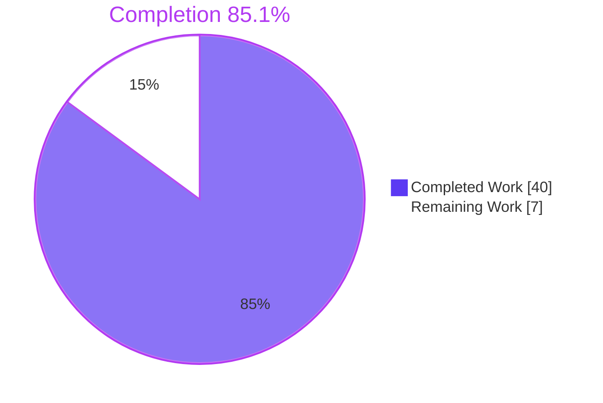
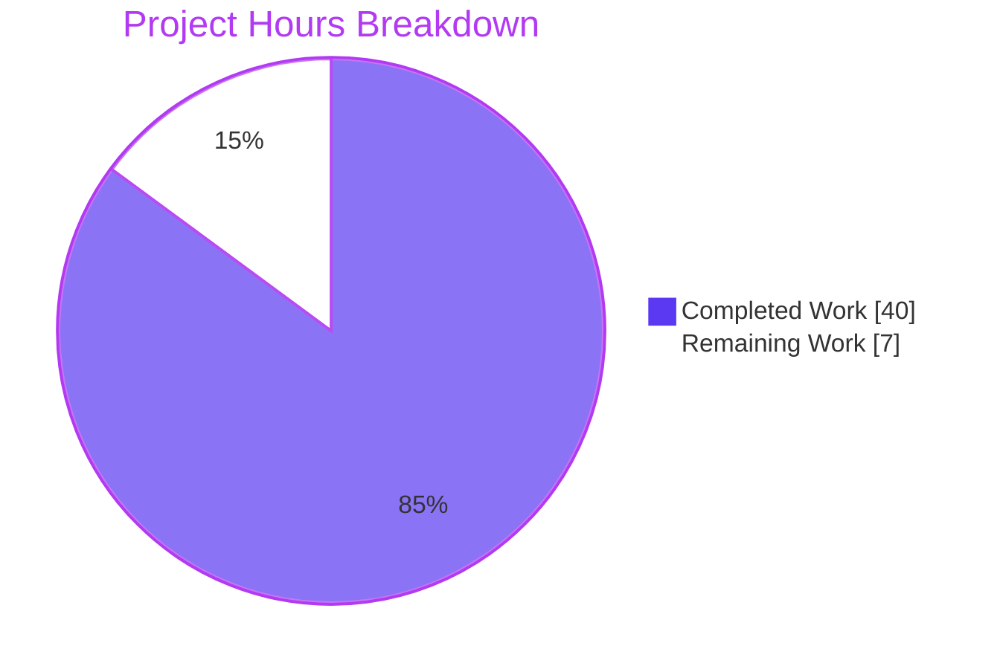
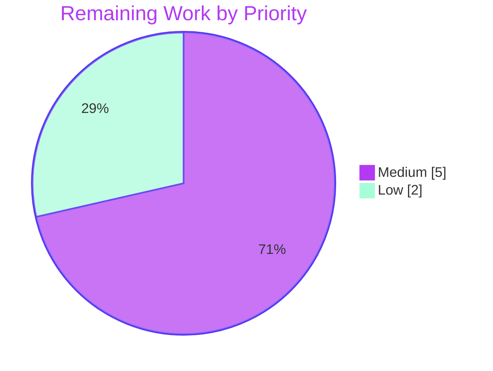

# 1. Executive Summary

## 1.1 Project Overview

This project replaces the repository's former Flask tutorial with a zero-dependency Node.js 24 tutorial: an HTTP server whose single endpoint, `/hello`, returns `Hello world` to any HTTP client. It is aimed at developers new to server-side Node.js and HTTP. The scope covers an application factory (`src/app.js`), a configurable entry point (`src/server.js`), six contract tests on the built-in runner, a pinned runtime, a committed lockfile and a README walkthrough. The server runs locally through `npm start`, and nothing is deployed.

## 1.2 Completion Status


```mermaid
%%{init: {"theme": "base", "themeVariables": {"pie1": "#5B39F3", "pie2": "#FFFFFF", "pieStrokeColor": "#B23AF2", "pieOuterStrokeColor": "#B23AF2", "pieTitleTextColor": "#B23AF2"}}}%%
pie showData title Completion 85.1%
    "Completed Work" : 40
    "Remaining Work" : 7
```

| Metric | Value |
|---|---|
| Total Hours | 47 |
| Completed Hours (AI + Manual) | 40 (AI 40, Manual 0) |
| Remaining Hours | 7 |
| Percent Complete | 85.1% |

40 hours completed out of 47 total hours = 85.1% complete (40 ÷ 47 × 100). Every AAP deliverable is complete, and the remaining hours are verification and owner decisions.

## 1.3 Key Accomplishments

- ✅ `/hello` contract (200, HEAD, 404, 405) matches byte for byte under curl and `fetch`, and renders in Chrome
- ✅ `PORT`/`HOST` handling, with a loopback default and exact single-line startup failures (exit 1)
- ✅ 6 of 6 contract tests pass, with 100% line, branch and function coverage of `src/app.js`
- ✅ Zero dependencies: `npm ls --all` prints `(empty)`, there are 0 vulnerabilities, and `npm ci` works
- ✅ The clean-checkout run (AV-15) succeeds from a fresh clone
- ✅ The README follows the planned 10-section outline, and its commands print the outputs it shows
- ✅ The superseded Flask project is removed (24 files), with no Python, Docker or CI residue
- ✅ Resistant to parser abuse, request reflection and terminal-control injection

## 1.4 Critical Unresolved Issues

None of the 15 acceptance checks (AV-1 to AV-15) fails, and none of the 8 deliverable files has an open defect. 2 items remain open, and neither is a code defect:

| Issue | Impact | Owner | ETA |
|---|---|---|---|
| Native Windows and macOS have never been exercised, including Windows PowerShell 5.1 with `curl.exe` | The AAP's cross-platform claim is proven on Linux only (bash, dash, PowerShell 7.6.6) | Maintainer with Windows and macOS hosts | 3 h |
| Three pre-existing documents in `blitzy/documentation/` keep the tree at 11 tracked files against the planned 8 (Section 5.2) | Learners may find stale Flask/Express documentation | Repository owner | 1 h |

## 1.5 Access Issues

No access issues identified. The project needs no credentials, secrets or external services, and install, test and run all succeeded with local permissions.

## 1.6 Recommended Next Steps

1. [Medium] Run AV-1 to AV-15 on Windows 11 (PowerShell 5.1 and 7) and on macOS.
2. [Medium] Review and merge the branch, signing off the divergences in Section 5.2.
3. [Low] Decide whether to keep or remove `blitzy/documentation/`.
4. [Low] Re-run the gate on the next Node.js 24.x patch, since the line enters maintenance on 2026-10-20.

# 2. Project Hours Breakdown

## 2.1 Completed Work Detail

| Component | Hours | Description |
|---|---|---|
| Package foundation (AAP 0.5.2, 0.3.1) | 2 | `package.json` with the exact AAP field set and the `start`/`test` scripts, `package-lock.json` (lockfileVersion 3, root entry only), `.nvmrc` pinned to `24`, `.gitignore` reduced to `node_modules/` and `npm-debug.log*` |
| Removal of the superseded Flask project (AAP 0.5.1, 0.6.2) | 2 | 24 files deleted: `src/backend/`, `.github/`, `infrastructure/`, Python manifests and lint/test configs, `CONTRIBUTING.md`, `CODE_OF_CONDUCT.md`, with a reference sweep of the remaining tree |
| Application factory and request handler, `src/app.js` (AAP 0.4.1 A, 0.4.3) | 4 | `createApp()`, path-then-method routing, a single `send()` writer with byte-accurate `Content-Length`, 200/HEAD/404/405 contract, required comments and JSDoc |
| Entry point, `src/server.js` (AAP 0.4.1 B, 0.4.3) | 6 | `PORT`/`HOST` trimming, defaults and validation, IPv6-bracketed startup line from `server.address()`, EADDRINUSE and generic listen-error messages, complete one-line stderr output before exit 1, escaping of non-printable characters, startup-only error handling |
| Contract test suite, `test/hello.test.js` (AAP 0.8.2) | 4 | Six named tests over real HTTP on port 0, with a `before`/`after` lifecycle, a listen wrapper that fails fast, and negative-route assertions |
| Tutorial, `README.md` (AAP 0.7.3) | 10 | 717-line walkthrough: prerequisites, install, run, call, port/host, tests, per-file "How it works" excerpts, project tree, 10-row troubleshooting table, POSIX and PowerShell forms |
| Acceptance verification AV-1 to AV-15 (AAP 0.8) | 6 | Byte-level comparison of every transcript, browser view, PowerShell 7.6.6 forms, literal ports 3000/4000, clean-clone run, mutation checks of the suite |
| Security verification and hardening (AAP 0.3.2, 0.12.2) | 4 | Loopback bind, no-reflection probes, HTTP/1.1 smuggling and malformed-header probes, Node.js 24 advisory and deprecation review, terminal-control escaping |
| Performance and robustness checks (AAP 0.1.1 NFR) | 2 | Concurrency (3,100 requests), fuzzing (4,600 requests), keep-alive and large-body behaviour |
| **Total** | **40** | |

## 2.2 Remaining Work Detail

| Category | Hours | Priority |
|---|---|---|
| Native platform verification: AV-1 to AV-15 and README commands on Windows 11 (Windows PowerShell 5.1 with `curl.exe`, PowerShell 7, `netstat` troubleshooting row) and macOS (AAP 0.1.1 portability NFR) | 3 | Medium |
| Maintainer code review, sign-off of the divergences in Section 5.2 (legacy deletions, stderr drain, escaping, post-listen rethrow, extra assertions) and merge | 2 | Medium |
| Decision on the three retained `blitzy/documentation/` files and the untracked `blitzy/screenshots/` artefact (AAP 0.5.1 eight-file tree) | 1 | Low |
| Node.js 24 maintenance-line re-verification: re-run the gate on the next 24.x patch and review bundled-npm advisories (AAP 0.1.3) | 1 | Low |
| **Total** | **7** | |

# 3. Test Results

All runs below used Node.js v24.21.0 with npm 11.19.0 at commit `ce5e793`.

| Area / Category | Framework | Tests | Passed | Failed | Coverage | What This Proves |
|---|---|---|---|---|---|---|
| `/hello` success path (GET, HEAD, query string) | `node:test` + `node:assert/strict` + global `fetch` | 3 | 3 | 0 | `src/app.js` 100% line / branch / function | GET and HEAD return 200 with exactly the 11-byte `Hello world` and matching headers, and the query string never affects routing |
| Fallback responses (trailing slash, `GET /`, `POST /`, `GET /HELLO`, `POST /hello`) | `node:test` + `fetch` | 3 | 3 | 0 | `src/app.js` 100% | Unknown paths are 404 whatever the method or letter case, and other methods on `/hello` get 405 with `Allow: GET, HEAD` |
| Coverage gate, AV-14 (`node --test --experimental-test-coverage`) | `node:test` built-in coverage | 6 | 6 | 0 | `app.js` 100.00 / 100.00 / 100.00 | Every branch of the request handler is exercised |
| Clean-checkout suite, AV-15 (`npm ci` then `npm test` in a fresh `git clone`) | npm + `node:test` | 6 | 6 | 0 | — | The committed manifest and lockfile are enough on a machine with only Node.js 24 and npm |
| Suite isolation (`npm test` while `npm start` serves) | `node:test` | 6 | 6 | 0 | — | The suite binds port 0 and never collides with a running server |
| Package integrity (`npm install`, `npm ls --all`, `npm audit --audit-level=low`) | npm 11.19.0 | 3 checks | 3 | 0 | — | Zero dependencies (`└── (empty)`), lockfile unchanged, 0 vulnerabilities |

The six tests carry the exact AAP 0.8.2 names (`test/hello.test.js`). The summary reads `ℹ tests 6`, `ℹ suites 0`, `ℹ pass 6`, `ℹ fail 0`, in about 0.15 s.

**Not Covered** (no automated test exercises these):

- `src/server.js` as a whole. By design, the suite never imports it (AAP 0.8.2) and coverage reports only `src/app.js`. Startup, `PORT`/`HOST` validation and every startup failure are verified at runtime only (Section 4). Before release, repeat AV-4 and AV-11 to AV-13 on each target platform.
- The post-listen error path (`src/server.js:50`). It has no natural trigger and was exercised only by injecting an `accept ENOBUFS` fault.
- The `EACCES` privileged-port message and the IPv6 success line (`http://[::1]:3000`). Both were reproduced only inside an isolated network namespace, because this host has no IPv6 and no privileged-port restriction.
- Native Windows and macOS, and Windows PowerShell 5.1. Test these before release.
- The publish refusal from `"private": true`. It was not exercised, because a real publish attempt is unsafe.

# 4. Runtime Validation & UI Verification

The server has no authentication or login (AAP 0.4.3) and no UI beyond the browser's plain-text view (AAP 0.4.4).

- ✅ **Startup (AV-4).** `npm start` prints npm's banner and then `Server listening on http://127.0.0.1:<port>`. `ss` shows the socket bound to 127.0.0.1 only, and a non-loopback request is refused.
- ✅ **`GET /hello` (AV-5, AV-6).** `HTTP/1.1 200 OK` with `Content-Type: text/plain; charset=utf-8` and `Content-Length: 11`. The byte check prints `11 48656c6c6f20776f726c64`, with no trailing newline.
- ✅ **HEAD, query string, 405 and 404 (AV-7 to AV-10).** Responses are byte-identical to the contract, with headers in the order `Content-Type`, `Content-Length`, `Allow`. `/HELLO`, `//hello`, `/%68ello`, `OPTIONS *` and `//[` all return 404, and the server stays up.
- ✅ **Startup failures (AV-11, AV-12, other listen errors).** Each prints the exact AAP message (port in use, `Invalid PORT "abc"…`, `Server failed to start: getaddrinfo ENOTFOUND …`) on stderr and exits 1 with no stack trace. The message stays complete through slow pipes of up to 400 KB, and control, format and separator characters are shown escaped.
- ✅ **Port and host overrides (AV-13, `HOST=0.0.0.0`, `PORT=0`).** The startup line shows the address chosen. `PORT=0` reports the port the OS assigned, and an IPv6 literal is printed in brackets.
- ✅ **Browser.** In Chrome, `http://localhost:3000/hello` renders the plain text `Hello world` (`text/plain`, status 200), and the query string is not echoed.
- ✅ **PowerShell forms (PowerShell 7.6.6 on Linux).** AV-11 to AV-13 and the `HOST` form behave as documented, with `$env:`, `Remove-Item Env:` and `$LASTEXITCODE`.
- ✅ **Protocol robustness.** CONNECT is closed without a reply. Malformed requests get 400, a 20 KB header gets 431, and request-smuggling shapes are rejected. 3,100 concurrent and 4,600 fuzzed requests caused no crash.
- ✅ **Shutdown.** Ctrl+C (SIGINT) stops the server and frees the port, and the test run leaves no process behind.
- ⚠ **Native Windows and macOS.** Never exercised, including Windows PowerShell 5.1 (`curl.exe`) and the Windows `netstat` troubleshooting row.

Never exercised at runtime: execution on native Windows or macOS, a real `npm publish` refusal, and a naturally occurring post-listen server error.

# 5. Compliance & Quality Review

## 5.1 Compliance Matrix

| # | AAP Deliverable | Benchmark | Status | Progress |
|---|---|---|---|---|
| 1 | Manifests and pins: `package.json`, `.nvmrc`, `.gitignore` | Exact field set, `engines >=24`, `24\n`, two ignore patterns (0.5.2) | ✅ PASS | ██████████ 100% |
| 2 | Lockfile and zero dependencies | lockfileVersion 3 root-only, `npm ci` works, `npm ls --all` `(empty)` (0.3.1, AV-1, AV-2) | ✅ PASS | ██████████ 100% |
| 3 | Repository structure | Eight-file tree (0.5.1) | ⚠ PASS WITH DIVERGENCE | █████████░ 8 of 8 present; 3 extra tracked docs |
| 4 | `src/app.js` factory and handler | Single export, private `send`/`handleRequest`, `node:http` only, contract 0.4.3 | ✅ PASS | ██████████ 100% |
| 5 | `src/server.js` entry point | Defaults, validation, startup line and messages, exit 1 (0.4.3) | ✅ PASS (additions in 5.2) | ██████████ 100% |
| 6 | `test/hello.test.js` | Six exact names, port 0 lifecycle, never imports `src/server.js` (0.8.2) | ✅ PASS (additions in 5.2) | ██████████ 100% |
| 7 | Coverage target | 100% line, branch and function coverage of `src/app.js` (0.12.2, AV-14) | ✅ PASS | ██████████ 100% |
| 8 | `README.md` tutorial | 10 sections in outline order, transcripts from AV-n, 10-row troubleshooting (0.7.3) | ✅ PASS | ██████████ 100% |
| 9 | Comment standard and code style | Header comments, JSDoc `@returns`, why-comments, no TODO, lines under 100 columns, two logging points (0.7.4, 0.12.1) | ✅ PASS | ██████████ 100% |
| 10 | Security baseline | Loopback default, no reflection, zero deps, no secrets, `private: true` (0.12.2) | ✅ PASS | ██████████ 100% |
| 11 | Acceptance checks AV-1 to AV-15 | Definition of done (0.12.2) | ✅ PASS on Linux | ██████████ 15 of 15 |
| 12 | Portability | Identical behaviour on Linux, macOS and Windows (0.1.1) | ⚠ PARTIAL | ██████░░░░ Linux shells and PowerShell 7 only |

## 5.2 AAP & Rule Divergences and Gaps

The project has no user rules (AAP 0.10), so every divergence below is a departure from the AAP. None was explicitly requested by a human, so none is marked Sanctioned.

| # | What the AAP/Rule Required | What Was Delivered Instead | Why It Diverged | Impact | Remediation |
|---|---|---|---|---|---|
| 1 | An empty working directory, with every file CREATE and nothing to update or delete (0.1.1, 0.9.1) | `README.md` and `.gitignore` rewritten; 24 Flask-project files deleted | The repository held a Flask tutorial that the eight-file tree (0.5.1) and the exclusions in 0.6.2 could not coexist with | Flask code survives only in git history | Confirm no consumer needs it |
| 2 | "Eight files in two directories, and nothing else" (0.5.1) | 11 tracked files: the 8 deliverables plus 3 pre-existing `blitzy/documentation/` files | Pre-existing files outside the planned change set were left as found | Stale documentation about the old stack | Owner keeps or removes them |
| 3 | Component B depends on `createApp`, `process.env`, `process.exit`, `console` (0.4.1) | `fail()` also calls `process.stderr.write('', cb)` before exiting | Calling `process.exit` straight after `console.error` would truncate piped stderr beyond 64 KiB | None; still two logging points | Accept |
| 4 | Diagnostics echo `<value>` and `<error message>` as given (0.4.3) | Non-printable characters (Unicode Cc, Cf, Zl, Zp) printed as visible escapes | Protection against terminal-control, bidi and separator injection through `PORT`/`HOST` | Printable output unchanged | Accept |
| 5 | The 0.4.3 startup failures are the complete error set (0.12.1) | Errors after listening are rethrown to Node.js's default handler | Without this, a post-start fault would be reported as "Server failed to start" | Rare stack trace with absolute paths | Accept or add a runtime message |
| 6 | Four assertions in `GET / is 404 Not Found`; `before()` awaits `listen` (0.8.2) | Four more assertions (`POST /`, `GET /HELLO`); the listen wrapper rejects on `error` | The six prescribed tests alone would not catch two plausible regressions, and a failed bind would hang | Stronger suite; AV-3 unchanged | Accept |

**1 — Legacy project removal.** AAP 0.1.1 states "The working directory is empty", and 0.9.1 says the project "has no existing files to update, delete or reference". In fact the repository held a Python Flask tutorial, with CI workflows, Docker files and Python manifests. Commits `fc9c58d`, `8bd588c`, `8d15160` and `b455e08` delete 24 files, and `b59a492` and `79fbec6` rewrite `.gitignore` and `README.md`. Without these removals, the eight-file tree (0.5.1) and the exclusions of `Dockerfile`, `.github/workflows/` and `requirements.txt` (0.6.2) could not hold. The Flask code remains in history at `origin/main` (`d78b068`). The owner should confirm that nothing downstream depends on it. No code change is needed.

**2 — Retained platform documents.** AAP 0.5.1 fixes the project at "eight files in two directories, and nothing else is created". `git ls-files` lists 11 files. The extra three are `blitzy/documentation/Input Prompt.md`, `Project Guide.md` and `Technical Specifications_b3815ee7-12a2-46a4-a950-4b8e72ef8030.md`, all present unchanged on `origin/main`. They were outside the planned file changes and were left as found, so nothing new was created. They have no runtime effect, but the 190 KB specification describes the superseded Flask/Express project and could mislead a learner. The owner should either run `git rm -r blitzy/documentation` or keep the files deliberately, and should leave the untracked `blitzy/screenshots/` uncommitted (Section 2.2).

**3 — stderr drain before exit.** AAP 0.4.1 lists Component B's dependencies as `createApp`, `process.env`, `process.exit` and `console`. `fail()` in `src/server.js:28` also calls `process.stderr.write('', () => process.exit(1))`. On a pipe, stderr is asynchronous, so calling `process.exit(1)` straight after `console.error` would drop everything beyond the 64 KiB buffer, which can cut off a long `PORT` value mid-message. The callback on the empty write runs only after the earlier writes are flushed. That is the only way to meet both the complete-message contract and the 0.12.1 requirement to call `process.exit(1)`. Nothing is added to the output, and there are still exactly two `console.*` calls. Accept as delivered.

**4 — Escaping in startup diagnostics.** AAP 0.4.3 prints `Invalid PORT "<value>"` and `Server failed to start: <error message>` with the values as given. `fail()` (`src/server.js:18-25`) replaces characters in the Unicode categories Cc, Cf, Zl and Zp with visible escapes: `\r`, `\n`, `\xNN`, `\uNNNN` or `\u{…}`. A `PORT` or `HOST` containing ESC sequences, C1 controls, bidi overrides (U+202E) or line separators could otherwise clear the terminal, hide the diagnostic or reverse it. Printable values print byte for byte as before, so AV-11 and AV-12 are unchanged, and all 237 affected code points were checked. The owner should accept this hardening or revert to the literal AAP behaviour.

**5 — Errors after listening.** AAP 0.12.1 calls the 0.4.3 startup failures "the complete set" and specifies nothing for errors raised once the server is listening. The listener in `src/server.js:50` starts with `if (server.listening) throw error;`, so a later fault takes Node.js's default uncaught-exception path: a stack trace with absolute paths, then exit 1. Without this guard, a runtime fault such as `accept ENOBUFS` would appear as "Server failed to start" after the startup line. A `syscall !== 'listen'` check was not used, because an unresolvable `HOST` fails with syscall `getaddrinfo` and must still produce the startup message. The path is reachable only through rare kernel faults. The owner should accept this or add a friendly runtime message.

**6 — Extra test assertions.** AAP 0.8.2 lists four assertions for `GET / is 404 Not Found`, and says `before()` "awaits `server.listen(0, '127.0.0.1')`". `test/hello.test.js:78-101` adds `POST /` and `GET /HELLO` requests with four assertions that carry explanatory messages, giving 27 `assert.equal` calls against the AAP's 23. Lines 18-27 make the listen promise reject on the server's `error` event. Without the extra assertions, two plausible regressions would pass all six tests: checking the method before the path, and case-insensitive matching. Without the rejection, a failed bind would hang the suite without a message. The test names, the test count and the AV-3 output are unchanged. Accept as delivered.

# 6. Risk Assessment

| Risk | Category | Severity | Probability | Mitigation | Status |
|---|---|---|---|---|---|
| Behaviour on native Windows and macOS has never been exercised, including Windows PowerShell 5.1 (`curl.exe`) and the `netstat` troubleshooting row | Integration | Medium | Low | npm scripts carry no shell syntax, and PowerShell 7 forms pass on Linux. Run AV-1 to AV-15 on both platforms (Section 2.2) | Open |
| `HOST=0.0.0.0`, `HOST=0` or `HOST=::` exposes the server on every interface, with no authentication or TLS (both excluded by AAP 0.6.2) | Security | Medium | Low | Loopback is the default, and the README warns about `0.0.0.0`. Keep it a local learning server and never deploy it publicly | Mitigated |
| Node.js 24 enters maintenance on 2026-10-20 (end of life 2028-04-30), and parser limits (400/408/431 thresholds) can change between lines | Operational | Medium | Medium | Re-run the whole-package gate on each 24.x patch, and plan a pin review before end of life | Monitor |
| npm 11.19.0, bundled with Node.js 24.21.0, ships internal packages (tar, undici 6.27.0 and others) with 21 registry advisories | Security | Low | Low | Zero dependencies, and the project's npm commands make no network request. Move to the next 24.x release that bundles a patched npm | Accepted |
| A fault after the server is listening prints Node.js's stack trace with absolute paths (`src/server.js:50`) | Operational | Low | Low | Rare kernel-level faults only. Replace with a friendly runtime message if disclosure matters | Accepted |
| Permissive `PORT` spellings (`0x10`, `1e3`, `+80`, `-0`) are accepted, and a blank `PORT=` silently uses 3000, as AAP 0.4.3 `Number(value)` specifies | Technical | Low | Low | Documented behaviour. Tighten to decimal-only only if the AAP contract changes | Accepted |
| Test-environment sensitivity: `NODE_USE_ENV_PROXY=1` without `NO_PROXY=127.0.0.1` fails all six tests, and `node --test` exits 0 when it discovers no tests | Technical | Low | Low | Set `NO_PROXY=127.0.0.1` when using a proxy, and always check `ℹ tests 6`, not only the exit code | Accepted |
| Node.js's parser accepts version-less request lines and holds slow-header sockets until `headersTimeout` (60 s), which matters only behind a reverse proxy or on an exposed interface | Security | Low | Low | Node.js defaults are kept on purpose (AAP 0.4.3). Revisit before any proxied or shared deployment | Accepted |

# 7. Visual Project Status


```mermaid
%%{init: {"theme": "base", "themeVariables": {"pie1": "#5B39F3", "pie2": "#FFFFFF", "pieStrokeColor": "#B23AF2", "pieOuterStrokeColor": "#B23AF2", "pieTitleTextColor": "#B23AF2"}}}%%
pie showData title Project Hours Breakdown
    "Completed Work" : 40
    "Remaining Work" : 7
```

**Remaining hours by priority (7 h total)**


```mermaid
%%{init: {"theme": "base", "themeVariables": {"pie1": "#B23AF2", "pie2": "#A8FDD9", "pieStrokeColor": "#5B39F3", "pieOuterStrokeColor": "#5B39F3", "pieTitleTextColor": "#B23AF2"}}}%%
pie showData title Remaining Work by Priority
    "Medium" : 5
    "Low" : 2
```

| Remaining Category (Section 2.2) | Hours | Priority |
|---|---|---|
| Native Windows and macOS verification | 3 | Medium |
| Code review, divergence sign-off and merge | 2 | Medium |
| Decision on `blitzy/documentation/` | 1 | Low |
| Node.js 24 maintenance re-verification | 1 | Low |
| **Total** | **7** | |

# 8. Summary & Recommendations

The branch delivers the full AAP scope: a zero-dependency Node.js 24 tutorial whose one endpoint, `/hello`, returns the exact 11 bytes `Hello world`. It also defines 404 and 405 fallbacks, configurable `PORT` and `HOST`, single-line startup diagnostics and a README walkthrough. The project stands at **85.1% complete**, with 40 of 47 hours done. Every AAP deliverable is built and verified on Linux, and the remaining 7 hours are path-to-production verification and owner decisions, not unbuilt features. The superseded Flask project has been removed, and the tracked tree is the eight planned files plus three pre-existing platform documents.

The evidence for this is strong. The six contract tests pass 6 of 6 with 100% line, branch and function coverage of `src/app.js`. The same suite passes from a fresh clone after `npm ci`, and also while a development server is running. The dependency tree is empty, and `npm audit` reports 0 vulnerabilities. At runtime, every acceptance transcript from AV-1 to AV-15 matches the contract byte for byte. The browser renders the plain-text response, the PowerShell 7 forms behave as documented, and the server survived parser-abuse probes, fuzzing and 3,100 concurrent requests.

Two gaps remain open. First, the AAP's cross-platform claim has been proven on Linux shells only: native Windows, including Windows PowerShell 5.1 with `curl.exe`, and macOS have not been run. Second, the repository still tracks `blitzy/documentation/`, which describes the old stack. Section 5.2 records six departures from the AAP's literal wording. Four are deliberate hardening or robustness choices in `src/server.js` and `test/hello.test.js` that leave every specified output unchanged, and two are tree-shape consequences of the repository not being empty. All six need a maintainer's sign-off, but none needs rework.

The critical path to release is three steps. First, run the acceptance checks on Windows 11 and macOS (3 h). Second, review and merge with sign-off on the Section 5.2 decisions (2 h). Third, settle the platform documents (1 h). Success means AV-1 to AV-15 hold on all three operating systems, `npm test` reports `ℹ tests 6` and `ℹ pass 6`, coverage of `app.js` stays at 100%, and `npm ls --all` stays `(empty)`.

**Production-readiness assessment:** ready for release as a local tutorial once native Windows and macOS verification is complete. The product is not designed for hosted operation: it has no TLS, authentication, rate limiting or monitoring, all excluded by AAP 0.6.2, and it should stay on loopback.

| Metric | Value |
|---|---|
| Completion | 85.1% (40 of 47 h) |
| Tests | 6 of 6 passing |
| `src/app.js` coverage | 100% line / branch / function |
| Dependencies / vulnerabilities | 0 / 0 |
| Acceptance checks on Linux | 15 of 15 |

# 9. Development Guide

Run every command from the repository root. There is no build step: the sources are plain ES modules (`"type": "module"`), with no TypeScript, bundler or linter.

## 9.1 System Prerequisites

- **Node.js 24 LTS**, the line `.nvmrc` selects (verified on v24.21.0), with its bundled **npm 11.x** (verified on 11.19.0).
- **curl**, for manual calls (verified on 8.14.1). In Windows PowerShell 5.1, type `curl.exe`.
- **git**, to fetch the code.
- Optional: **nvm** or **fnm**, which read `.nvmrc`. With nvm-windows, run `nvm install 24` and then `nvm use 24`.
- No database, cache, container, secret or external service is needed. Any machine that runs Node.js 24 is enough.

## 9.2 Environment Setup

Optionally, select the pinned line through a version manager (it reads `.nvmrc`, which says `24`), then confirm the runtime. The outputs in this guide were verified on these versions:

```bash
nvm install
nvm use
node --version   # v24.21.0 (any v24.x)
npm --version    # 11.19.0 (any 11.x)
```

If a shell resolves an older Node.js first, put Node.js 24 at the front of `PATH`. With nvm, for example, run `export PATH="$HOME/.nvm/versions/node/v24.21.0/bin:$PATH"`. The project reads only two optional environment variables:

| Variable | Default | Rule |
|---|---|---|
| `PORT` | `3000` | Trimmed first, and blank means 3000. Otherwise it must be an integer from 0 to 65535, where 0 lets the OS choose a port |
| `HOST` | `127.0.0.1` | Trimmed first, and blank means loopback. Any other value is passed to `listen`. `0.0.0.0` exposes the server to the network |

## 9.3 Dependency Installation

```bash
npm install      # or, on a clean checkout: npm ci
npm ls --all
```

Expected output: `up to date, audited 1 package in <time>`, then `found 0 vulnerabilities`, then `node-hello-tutorial@1.0.0 <project path>` and `└── (empty)`. No `node_modules/` directory is created, and `package-lock.json` is left unchanged.

## 9.4 Application Startup

```bash
npm start
```

Expected output, after npm's banner (`> node-hello-tutorial@1.0.0 start` / `> node src/server.js`):

```text
Server listening on http://127.0.0.1:3000
```

The server holds the terminal until you press Ctrl+C. To change the port, use `PORT=4000 npm start` in POSIX shells, or `$env:PORT = '4000'; npm start` in PowerShell, followed by `Remove-Item Env:PORT` once stopped.

For scripted or background runs, stop the server through the owner of its port. Sending SIGINT to the npm pid without a TTY does not stop Node.js.

```bash
PORT=20128 nohup npm start > server.log 2>&1 &
sleep 1 && cat server.log                       # Server listening on http://127.0.0.1:20128
kill -INT "$(lsof -ti :20128)"                  # stops node; the npm wrapper exits with it
```

## 9.5 Verification Steps

The whole-package gate covers install, the dependency tree, the tests, coverage and the audit:

```bash
npm install && npm ls --all && npm test && node --test --experimental-test-coverage && npm audit --audit-level=low
```

Expected output:

- `npm test`: six `✔` lines, then `ℹ tests 6`, `ℹ suites 0`, `ℹ pass 6` and `ℹ fail 0`, in about 0.15 s.
- The coverage table shows `app.js | 100.00 | 100.00 | 100.00`. `src/server.js` is absent by design.
- `npm audit` ends with `found 0 vulnerabilities`.

For a quick per-file check, run `node --check src/app.js && node --check src/server.js && node --check test/hello.test.js`.

## 9.6 Example Usage

Run these in a second terminal while `npm start` is running:

```bash
curl -i http://127.0.0.1:3000/hello                  # 200 OK, Content-Length: 11, body Hello world
curl -I http://127.0.0.1:3000/hello                  # same status and headers, no body
curl -s "http://127.0.0.1:3000/hello?name=learner"   # Hello world (query string ignored)
curl -i -X POST http://127.0.0.1:3000/hello          # 405 Method Not Allowed, Allow: GET, HEAD
curl -i http://127.0.0.1:3000/hello/                 # 404 Not Found, Content-Length: 9
```

The byte check prints `11 48656c6c6f20776f726c64`: 11 bytes, with no trailing newline.

```bash
node -e "fetch('http://127.0.0.1:3000/hello').then((r) => r.arrayBuffer()).then((b) => console.log(b.byteLength, Buffer.from(b).toString('hex')))"
```

Expected `curl -i` response for `/hello`:

```text
HTTP/1.1 200 OK
Content-Type: text/plain; charset=utf-8
Content-Length: 11
Date: <date>
Connection: keep-alive
Keep-Alive: timeout=5

Hello world
```

## 9.7 Troubleshooting

| Symptom | Cause | Resolution |
|---|---|---|
| `npm warn EBADENGINE Unsupported engine … required: { node: '>=24' }`, or test output in TAP form (`# tests 6`) | An older Node.js (such as 22.x) is first on `PATH` | Run `nvm use`, or put Node.js 24 first on `PATH`, then confirm with `node --version` |
| `npm test` exits 0 but prints `ℹ tests 0` | No test file was discovered | Confirm `test/hello.test.js` exists. Always check the test count, not only the exit code |
| `Cannot find module '<repo>/test'` | A directory was passed to `node --test` | Use plain `npm test` / `node --test`, or pass a file path |
| `Port 3000 is already in use. …`, exit 1 | Another process holds the port | Find it with `lsof -ti :3000` (macOS/Linux) or `netstat -ano \| findstr :3000` (Windows), or set `PORT` |
| `Invalid PORT "<value>": use a whole number from 0 to 65535.` | `PORT` is not an integer from 0 to 65535 | Set a valid value, or unset it to use 3000 |
| `Server failed to start: getaddrinfo ENOTFOUND <host>` | `HOST` does not resolve | Unset `HOST`, or use `127.0.0.1` / `0.0.0.0` |
| All six tests fail with connection errors while a proxy is configured | `NODE_USE_ENV_PROXY=1` routes loopback `fetch` through the proxy | Run `export NO_PROXY=127.0.0.1` and run the tests again |
| A backgrounded `npm start` keeps running after `kill -INT <npm pid>` | Without a TTY, the signal does not reach the Node.js child | Signal the port owner with `kill -INT "$(lsof -ti :<port>)"`, or use Ctrl+C in a terminal |

# 10. Appendices

## A. Command Reference

| Command | Purpose |
|---|---|
| `npm install` / `npm ci` | Confirm the empty dependency set against the committed lockfile (AV-1) |
| `npm ls --all` | Show the dependency tree, expected `└── (empty)` (AV-2) |
| `npm test` | Run the six contract tests through `node --test` (AV-3) |
| `node --test --experimental-test-coverage` | Coverage report, with `app.js` at 100% (AV-14) |
| `npm audit --audit-level=low` | Vulnerability audit, expected 0 |
| `npm start` | Start `src/server.js` (AV-4) |
| `PORT=4000 npm start` | Start on another port (AV-13); PowerShell: `$env:PORT = '4000'; npm start` |
| `HOST=0.0.0.0 npm start` | Listen on all IPv4 interfaces (trusted networks only) |
| `node --check <file.js>` | Syntax check without running |
| `kill -INT "$(lsof -ti :<port>)"` | Stop a backgrounded server through its port owner |

## B. Port Reference

| Port | Use |
|---|---|
| 3000 | Default `PORT` used in the README transcripts |
| 4000 | Override example in the README (AV-13) |
| 0 | Asks the OS for a free port; the test suite always listens on port 0 at 127.0.0.1 |

## C. Key File Locations

| Path | Role |
|---|---|
| `src/app.js` | `createApp()`, `handleRequest`, `send`: the `/hello` contract |
| `src/server.js` | Entry point: `PORT`/`HOST` resolution, `listen`, startup line, `fail()` diagnostics |
| `test/hello.test.js` | Six contract tests over real HTTP |
| `README.md` | The tutorial (10 sections) |
| `package.json` | Metadata, `"type": "module"`, `engines`, `start`/`test` scripts |
| `package-lock.json` | lockfileVersion 3, root entry only |
| `.nvmrc` | Node.js line `24` |
| `.gitignore` | `node_modules/`, `npm-debug.log*` |
| `blitzy/documentation/` | Three pre-existing platform documents, outside the tutorial (Section 5.2) |

## D. Technology Versions

| Technology | Version |
|---|---|
| Node.js | 24 LTS "Krypton", verified on v24.21.0 (`engines: >=24`) |
| npm | 11.19.0 (bundled) |
| Test runner | `node:test` + `node:assert/strict` (built in) |
| HTTP | `node:http` (built in); global `fetch` in the tests |
| Third-party packages | None |
| PowerShell (verified forms) | 7.6.6 |

## E. Environment Variable Reference

| Variable | Default | Effect |
|---|---|---|
| `PORT` | `3000` | Listening port, trimmed and then required to be an integer from 0 to 65535. An invalid value gives `Invalid PORT "<value>"…` and exit 1 |
| `HOST` | `127.0.0.1` | Listening address, trimmed and then passed to `listen`. IPv6 literals are given without brackets and printed with them |
| `NO_PROXY` | unset | Set to `127.0.0.1` when `NODE_USE_ENV_PROXY=1` is in use, so the tests reach the local server |

## F. Developer Tools Guide

- **Version manager:** run `nvm install` and then `nvm use` to read `.nvmrc`.
- **Raw HTTP inspection:** use `curl -i` for the status line, headers and body, and `curl -I` for HEAD.
- **Exact bytes:** the AV-6 `node -e "fetch(…)"` one-liner prints the byte count and hex.
- **Listener lookup:** use `ss -ltnp | grep :<port>` or `lsof -ti :<port>`. Node.js 24 appears as `MainThread` in process lists.
- **Coverage:** run `node --test --experimental-test-coverage`. No coverage package is needed.

## G. Glossary

| Term | Meaning |
|---|---|
| AV-n | An acceptance check from AAP 0.8.3 / 0.8.4 (AV-1 to AV-15) |
| Application factory | `createApp()`, which returns an HTTP server that is not yet listening |
| Loopback | 127.0.0.1, reachable only from the same machine |
| HEAD | An HTTP method that returns GET's headers without the body |
| 405 / `Allow` | Method Not Allowed, with the methods the target supports |
| EADDRINUSE | The OS error when a port is already bound |
| Cc / Cf / Zl / Zp | Unicode control, format, line-separator and paragraph-separator categories, escaped in startup diagnostics |
