# Technical Specification

# 1. Introduction

## 1.1 Executive Summary

#### Brief Overview of the Project

The repository delivers the **Python Flask Hello World Tutorial** (`README.md:1`), an educational HTTP service that demonstrates fundamental Python WSGI web-server concepts with Flask 3.1.1 on Python 3.12+. It is packaged as `flask-migration-tutorial` (`pyproject.toml:40-41`) and positioned as the second generation of an earlier Node.js/Express.js tutorial: the README records "v2.0.0 - Migration to Python 3.12+ and Flask 3.1.1 from Node.js/Express.js" (`README.md:997`), and the originating requirement asks for "a Python Flask tutorial project that features one endpoint '/hello' that returns 'Hello world' to the calling HTTP client" (`blitzy/documentation/Input Prompt.md:1`).

The working system is deliberately small and production-shaped: a Flask application factory with environment-specific configuration, two JSON endpoints (`GET /hello`, `GET /health`), CORS and security headers, JSON error handlers for 404/405/500, a WSGI entry point consumable by Gunicorn, a pytest suite with 100% coverage enforcement, multi-stage Alpine container images, Docker Compose orchestration, and GitHub Actions pipelines that build, scan, and deploy the image.

A note on scope of truth for this document: the implementation in `src/backend/` is the authoritative system, while several repository documents still describe the Node.js/Express.js predecessor (for example `CONTRIBUTING.md:1`, `CODE_OF_CONDUCT.md:2`, and the whole of `blitzy/documentation/Technical Specifications_b3815ee7-12a2-46a4-a950-4b8e72ef8030.md`, whose §1.1 describes Node.js v22.16.01 with Express.js v5.1.0). Where documents and code disagree, this specification reports both and identifies the code as the system of record.

#### Core Business Problem Being Solved

The project addresses a learning gap rather than a commercial one: developers need a complete, runnable, hands-on example of how a modern Python HTTP service is assembled end to end. The README enumerates the intended learning outcomes as WSGI fundamentals, Flask routing, RESTful endpoint implementation, the request-response cycle, error-handling patterns, and pytest-based testing (`README.md:28-35`); the requirement adds that the work "Illustrates migration patterns from Express.js to Flask with equivalent functionality" and "Showcases production-ready Python practices including WSGI deployment and testing methodologies" (`blitzy/documentation/Input Prompt.md:45-49`).

Three specific problems follow from that:

| Problem | How the System Addresses It | Primary Evidence |
|---|---|---|
| Framework knowledge is taught in isolation from deployment | Ships the same application through Flask's development server and through Gunicorn behind a WSGI contract | `src/backend/app.py:705-750`, `src/backend/wsgi.py:513` |
| Tutorials rarely demonstrate production hygiene | Enforces 100% branch coverage, Flake8/Black standards, Bandit/Safety/pip-audit scanning, and non-root hardened containers | `pytest.ini`, `.flake8`, `.github/workflows/ci.yml:126-206`, `infrastructure/docker/Dockerfile:184-220` |
| Migration equivalence is asserted, not verified | Maps each Express.js construct (`app.get`, `res.json`, error middleware, `process.env`, `module.exports`) to a named Flask counterpart in code comments | `src/backend/app.py:66,92,104,112,116,154,390,473,694` |

#### Key Stakeholders and Users

| Stakeholder Category | Description | Primary Interest | Evidence |
|---|---|---|---|
| Learners and application developers | Python developers studying WSGI, Flask routing, and testing | A runnable example with per-concept guidance and troubleshooting | `README.md:28-35`, `README.md:666-836`, `pyproject.toml:67` |
| Educators and curriculum designers | Training organisations and bootcamps adopting the material | Clear progression, documented objectives, stable dependency baseline | `pyproject.toml:67,74`, `CONTRIBUTING.md:12` |
| Mentors and contributors | Senior developers reviewing and extending the tutorial | Code quality, educational clarity, 100% coverage, Python 3.12+ compatibility | `CONTRIBUTING.md:41-81`, `CONTRIBUTING.md:920-932` |
| Platform and deployment engineers | Engineers exercising the container and CI/CD path | WSGI/Gunicorn operation, health probing, image scanning, staged promotion | `src/backend/wsgi.py:78-127`, `.github/workflows/cd.yml:1-15` |

The user community is explicitly an open, learning-oriented one with published behavioural expectations and contribution routes: a code of conduct describes "community spaces" including GitHub and devotes sections to supporting learners, skill-level inclusivity, and accessibility (`CODE_OF_CONDUCT.md:82,167,199`), while `CONTRIBUTING.md:41-71` welcomes code, documentation, testing, and community-support contributions through the issue and pull-request templates in `.github/`.

End consumers of the running service are unauthenticated HTTP clients: cURL, browsers, `requests`, and `fetch` are all presented as callers (`README.md:311-330`). There is no user account, role, or tenant concept anywhere in the codebase.

#### Expected Business Impact and Value Proposition

The value is educational and reusable rather than transactional. The system is intended to be copied, read, and deployed by learners, and its artefacts are structured so that each production concern is separately examinable:

- **A complete, minimally-sized reference service.** Two endpoints, one factory, and 1,280 lines of Python across `app.py` and `wsgi.py` show routing, middleware, configuration, error handling, and graceful shutdown without incidental business logic.
- **A migration crosswalk.** Every Express.js idiom the project replaced is annotated with its Flask equivalent in the source, making the Node-to-Python transition the documentation itself.
- **A hardened delivery skeleton.** Multi-stage `python:3.12-alpine` builds, a non-root `python` user, `dumb-init` as PID 1, read-only application files (`chmod -R 444 *.py`), a container health check on `/hello`, and digest-pinned Azure Web App deployments give the learner a deployable pattern.
- **Measured quality claims in place of adjectives.** Response-time, memory, coverage, and security targets are asserted by executable tests and CI gates rather than stated in prose alone.

Against the project's own accounting, the work is 85% complete: `blitzy/documentation/Project Guide.md:9-24` estimates 100 engineering hours with 15 remaining, and the residual items are production-readiness tasks — QA and dependency validation, environment configuration, security hardening, performance verification, registry setup, and final deployment — several of which are prerequisites for the quality claims in this introduction to hold in a given environment.

Conflicting version identifiers are recorded here rather than resolved, because downstream sections depend on the distinction: the package metadata and the `/health` payload both report **1.0.0** (`pyproject.toml:41`, `src/backend/app.py:441`), whereas the README's version history and the Docker Compose service labels report **2.0.0** (`README.md:997`, `infrastructure/docker/docker-compose.yml:145`).

## 1.2 System Overview

### 1.2.1 Project Context

#### Business Context and Market Positioning

The system occupies the education and developer-enablement niche rather than a commercial product market. Its stated purpose is "hand-on experience with fundamental Python web development and Flask concepts" (`README.md:28`), and its metadata classifies it as `Intended Audience :: Developers`, `Intended Audience :: Education`, and `Topic :: Education` with `Development Status :: 5 - Production/Stable` (`pyproject.toml:62-80`). The package is published-ready under the name `flask-migration-tutorial` with a documented MIT licence (`pyproject.toml:40-44`).

Its positioning has two axes. The first is technology currency: the project pins itself to "Python 3.12+ 'Latest'" and "Flask v3.1.1 - Latest WSGI web framework with enhanced type hint support, security defaults, and modern Python 3.12+ compatibility for production-ready applications" (`README.md:39-43`). The second is migration storytelling: the requirement set explicitly frames the deliverable as showing "migration patterns from Express.js to Flask with equivalent functionality" (`blitzy/documentation/Input Prompt.md:48`), and every replacement is annotated in the source, for example `# Replaces Express.js express() with Flask(__name__)` (`src/backend/app.py:92`) and `# Replaces Express.js res.json() with Flask JSON response helper` (`src/backend/app.py:390`).

Distribution is modelled for public reach across several channels, not the least of which is a documented set of hosting paths: Heroku, Azure Web Apps, Railway, and DigitalOcean App Platform (`README.md:571-638`), plus GitHub Actions pipelines and a GitHub Container Registry image target (`.github/workflows/cd.yml:1-15`). Repository metadata advertises a homepage, ReadTheDocs documentation site, bug tracker, and CI pipeline (`pyproject.toml:142-148`); the README badges instead point at `github.com/tutorial/python-flask-tutorial` (`README.md:3-7`). The two identities coexist in the checkout and upstream locations for both were not verified from this repository.

#### Current System Limitations

Two distinct sets of limitations apply, and only the second belongs to the system as delivered.

**Limitations of the superseded system.** The project explicitly replaces a Node.js/Express.js tutorial (`README.md:997`). The requirements describe the memory budget as "increased from Node.js requirements" (`blitzy/documentation/Input Prompt.md:36`), and the residual Express-era engineering notes in `blitzy/documentation/Project Guide.md:12-17` count the completed hours against `app.js`/`server.js` and Jest while listing Jest-to-pytest conversion, pip dependency repair, Flask compatibility validation, and import correctness as outstanding QA. The predecessor's own specification recorded a 50MB memory ceiling and an HTTP-only, single-process, non-production posture (`blitzy/documentation/Technical Specifications_b3815ee7-12a2-46a4-a950-4b8e72ef8030.md:9,122-127`).

**Limitations of the system as delivered.** These are observed in the checkout and are stated here because they bound what the introduction can claim:

| Limitation | Observed Effect | Evidence |
|---|---|---|
| Node.js documentation remnants | Contributor and community guides describe a stack that no longer exists | `CONTRIBUTING.md:1,96-208`, `CODE_OF_CONDUCT.md:2`, `.github/ISSUE_TEMPLATE/feature_request.md:2` |
| Divergent test configuration | Three configurations disagree on test paths, markers, and coverage source | root `pytest.ini`, `pyproject.toml:156-197`, `src/backend/pytest.ini` |
| Test suite import path mismatch | Tests import `from src.app import ...`, but the module is `src/backend/app.py` and no `src/__init__.py` exists, so collection skips rather than executes | `src/backend/tests/test_app.py:57-58` |
| Inconsistent runtime ports | Defaults of 5000, 3000, and 8000 are documented or coded in different artefacts | `README.md:163`, `src/backend/.env.example:20-29`, `src/backend/wsgi.py:106`, `src/backend/app.py:722` |
| Divergent version identity | `1.0.0` in package metadata and the health payload versus `2.0.0` in README history and Compose labels | `pyproject.toml:41`, `src/backend/app.py:441`, `README.md:997`, `infrastructure/docker/docker-compose.yml:145` |
| Referenced files absent | `LICENSE`, `Procfile`, `runtime.txt`, `gunicorn.conf.py`, and a root `Dockerfile` are cited by the README but not present | `README.md:491,592-594,975`, repository root |

The unapplied build-context exclusion is the subtlest of these: `infrastructure/docker/.dockerignore` carries 762 lines of exclusion patterns, but Docker reads that file only at the build-context root, and both Compose builds use the repository root as context (`infrastructure/docker/docker-compose.yml:41-42,182-183`) with no root `.dockerignore` present.

#### Integration with Existing Enterprise Landscape

The service is deliberately standalone, yet it speaks only standard interfaces, which is what makes it insertable into an existing estate:

- **WSGI contract.** `src/backend/wsgi.py:531` exports a module-level `application` object, the interface consumed by Gunicorn, uWSGI, or any WSGI-compliant server. Nothing proprietary is required to host it.
- **Twelve-factor configuration.** All environment-specific behaviour is read from environment variables through python-dotenv (`src/backend/app.py:52,155-156`, `src/backend/wsgi.py:104-106`), with `.env.example` documenting each variable, its validation rules, and platform presets for Heroku, Render, Railway, Azure, and Docker (`src/backend/.env.example:20-231`).
- **Container orchestration.** Compose declares development and production services with health checks and named caching volumes (`infrastructure/docker/docker-compose.yml:34,175,346`), and the production image runs `dumb-init` as PID 1 for correct signal propagation to Gunicorn (`infrastructure/docker/Dockerfile:220`).
- **Health and lifecycle integration.** `GET /health` returns status, timestamp, uptime, version, environment, and debug state with caching disabled (`src/backend/app.py:437-449`), which is what the container health checks and the deployment-stage verification steps probe (`.github/workflows/cd.yml:504,537`).
- **Supply-chain integration.** CI publishes SARIF output from Bandit and pip-audit to GitHub code scanning and uploads an OSSF Scorecard result (`.github/workflows/ci.yml:166-206`), while CD builds multi-platform images into GitHub Container Registry with OCI metadata labels and deploys them by digest (`infrastructure/docker/Dockerfile`, `.github/workflows/cd.yml:103-218`).
- **Target enterprise runtime.** Deployment is automated to Azure Web Apps using Python 3.12 runtimes across staging and production app services (`.github/workflows/cd.yml:438-504,625-720`).

### 1.2.2 High-Level Description

#### Primary System Capabilities

| Capability | Behaviour | Evidence |
|---|---|---|
| Hello endpoint | `GET /hello` returns `{"message": "Hello world", "timestamp": ..., "status": "success"}` with `X-API-Version: 1.0` | `src/backend/app.py:367-410` |
| Health endpoint | `GET /health` returns `status`, `timestamp`, `uptime`, `version`, `environment`, `debug`, with `Cache-Control: no-cache, no-store, must-revalidate` | `src/backend/app.py:426-463` |
| Consistent JSON errors | 404, 405, 500, and any unhandled exception yield JSON with status, message, path, method, and timestamp; 500 responses expose no stack trace | `src/backend/app.py:479-632` |
| Environment-based configuration | Production, development, and testing profiles set debug, testing, HTTPS preference, cookie flags, and session lifetime | `src/backend/app.py:144-212,641-657` |
| Response hardening | Every response carries six security headers and has the `Server` header removed; CORS is limited to two local development origins with credentials disabled | `src/backend/app.py:215-288` |
| Request instrumentation | Per-request timing emitted as `X-Response-Time`, a generated `X-Request-ID`, and structured lifecycle logging | `src/backend/app.py:291-352` |
| Graceful operation lifecycle | Signal handlers, uncaught-exception handling, port validation, memory reporting, and logged shutdown | `src/backend/wsgi.py:192,258,299,432` |
| Verified behaviour | 25 in-process application tests and 11 WSGI/integration tests assert status codes, headers, error shapes, timing, memory, and concurrency | `src/backend/tests/test_app.py`, `src/backend/tests/test_wsgi.py` |
| Reproducible delivery | Multi-stage container images for development and production, Compose orchestration, and CI/CD pipelines with security gates | `infrastructure/docker/`, `.github/workflows/` |

#### Major System Components

| Component | Location | Responsibility |
|---|---|---|
| Flask application factory | `src/backend/app.py:63-142` | Builds the app and orchestrates configuration, security, CORS, hooks, routes, and error handlers |
| WSGI entry point | `src/backend/wsgi.py:78-127,515-531` | Exports the `application` object, validates ports, configures signals and shutdown |
| Test suite | `src/backend/tests/` | Validates endpoints, errors, security, middleware, performance, memory, concurrency, and WSGI lifecycle |
| Container definitions | `infrastructure/docker/` | Multi-stage Alpine builds, Compose services, networks, and cache volumes |
| CI/CD pipelines | `.github/workflows/ci.yml`, `.github/workflows/cd.yml` | Test and security gates, image build and scan, staged Azure deployment |
| Configuration manifests | `pyproject.toml`, `requirements.txt`, `requirements-dev.txt`, `pytest.ini`, `.flake8`, `src/backend/.env.example` | Package identity, dependency sets, and quality-gate settings |
| Instructional documentation | `README.md`, `src/backend/README.md`, `CONTRIBUTING.md`, `CODE_OF_CONDUCT.md` | Learning objectives, setup, API reference, troubleshooting, and contribution process |

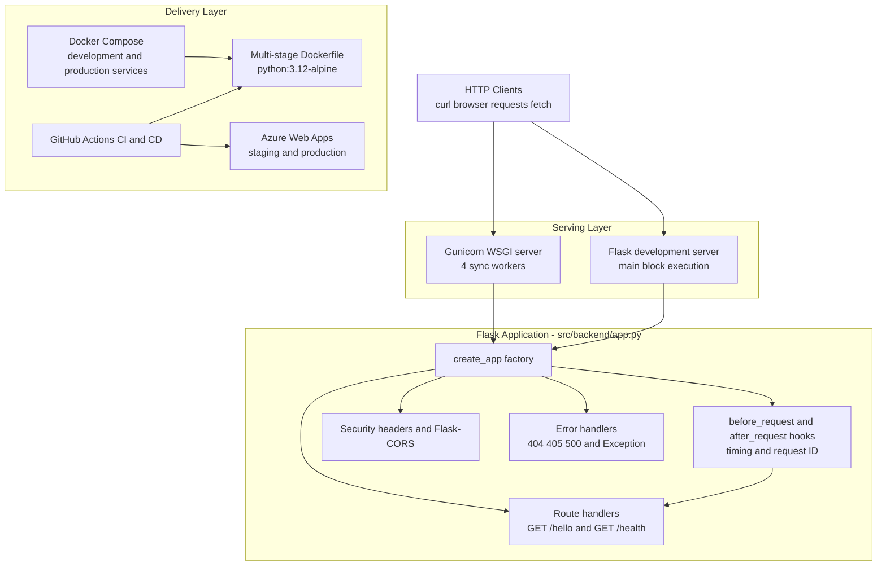
```mermaid
flowchart TD
    Client[HTTP Clients<br/>curl browser requests fetch]

    subgraph Serving["Serving Layer"]
        Gunicorn[Gunicorn WSGI server<br/>4 sync workers]
        DevServer[Flask development server<br/>main block execution]
    end

    subgraph Application["Flask Application - src/backend/app.py"]
        Factory[create_app factory]
        Hooks[before_request and after_request hooks<br/>timing and request ID]
        Security[Security headers and Flask-CORS]
        Routes[Route handlers<br/>GET /hello and GET /health]
        Errors[Error handlers<br/>404 405 500 and Exception]
    end

    subgraph Delivery["Delivery Layer"]
        Docker[Multi-stage Dockerfile<br/>python:3.12-alpine]
        Compose[Docker Compose<br/>development and production services]
        Pipelines[GitHub Actions CI and CD]
        Azure[Azure Web Apps<br/>staging and production]
    end

    Client --> Gunicorn
    Client --> DevServer
    Gunicorn --> Factory
    DevServer --> Factory
    Factory --> Hooks
    Factory --> Security
    Factory --> Routes
    Factory --> Errors
    Hooks --> Routes
    Compose --> Docker
    Pipelines --> Docker
    Pipelines --> Azure
```

#### Core Technical Approach

The architecture is a single stateless WSGI application produced by a factory and wrapped in progressively stronger environments:

1. **Factory over module-level app.** `create_app(config_name='production')` (`src/backend/app.py:63`) composes the application from six named configuration functions, and three convenience factories (`create_production_app`, `create_development_app`, `create_testing_app`) expose the same app to deployment, development, and test contexts (`src/backend/app.py:660-690`). The default is production, chosen, as the code comments state, "for secure deployment practices" (`src/backend/app.py:75`).
2. **Configuration as data with environment overrides.** A base configuration dictionary (JSON key ordering, 16 MiB maximum request size, application root) is merged with one of three environment profiles, and `FLASK_ENV`/`FLASK_DEBUG` environment variables take precedence (`src/backend/app.py:155-207`).
3. **Cross-cutting behaviour through Flask hooks rather than decorators on routes.** Security headers and CORS are installed once at the application level, so every endpoint, including error responses, inherits them (`src/backend/app.py:223,279`).
4. **Errors as a single contract.** Route handlers catch their own exceptions and return explicit payloads, while registered handlers normalise framework-level failures, and a catch-all `@app.errorhandler(Exception)` prevents HTML error leakage (`src/backend/app.py:412-424,454-463,602-632`).
5. **Deployment through the WSGI boundary.** Production serving is external: `wsgi.py` never launches Gunicorn itself but logs the launch guidance, defaulting to `production`, `0.0.0.0`, and port 8000 (`src/backend/wsgi.py:104-106,510-513`), while the container's production target invokes Gunicorn with four sync workers, request recycling, and preloading (`infrastructure/docker/Dockerfile:216-220`).
6. **Quality enforced mechanically.** Flake8 runs with the security and import-order plugins selected in `.flake8`; pytest collects with `--cov-branch --cov-fail-under=100` and a 300-second thread timeout; CI adds Bandit at medium severity or above, Safety, pip-audit, and OSSF Scorecard (`src/backend/pytest.ini:15-24,62`, `.github/workflows/ci.yml:82-206`).

### 1.2.3 Success Criteria

#### Measurable Objectives

| Objective | Success Metric | Target Value |
|---|---|---|
| Endpoint correctness | `GET /hello` status, body, and headers | HTTP 200 with JSON greeting and `X-API-Version: 1.0` |
| Warm response latency | Mean response time for `/hello` | Below 50ms, asserted in tests |
| Latency under concurrency | Mean and maximum response time under load | Mean below 50ms, maximum below 100ms |
| Memory footprint | Resident memory during operation | Below 75MB, with under 5-10MB growth per test |
| Coverage | Branch coverage enforced by the test run | 100%, with the run failing below the threshold |
| Security posture | Static, dependency, and image scanning | No medium-or-higher Bandit findings; clean Safety and pip-audit gates in CI |

Source values are the asserted thresholds in `src/backend/tests/test_app.py:184,426-427,454-455` and `src/backend/tests/test_wsgi.py:148,168,189,768`, the coverage gates in `src/backend/pytest.ini:15-24` and `.github/workflows/ci.yml:94`, and the scan configuration in `.github/workflows/ci.yml:159-183`. The requirement document expresses the same latency and memory budget as "<100ms cold start, <50ms warm response times" and "<75MB memory footprint for Python runtime" (`blitzy/documentation/Input Prompt.md:35-36`).

Startup time is stated inconsistently and both statements are recorded: the README targets "Startup Time: < 5 seconds for Flask development server" (`README.md:836`), while `.env.example` budgets "Startup Time: < 0.2 seconds for environment variable processing" only (`src/backend/.env.example:277-280`).

#### Critical Success Factors

- The Flask application must be constructible in all three environments, since the same factory serves development, CI, and production (`src/backend/app.py:641-690`).
- `GET /hello` must remain the canonical demonstration endpoint and must respond without authentication or session state, as the stateless-operation tests require (`src/backend/tests/test_app.py:476-521`).
- The WSGI contract must hold: any WSGI server must be able to import `application` from `wsgi.py` without side effects beyond handler installation (`src/backend/wsgi.py:515-531`).
- Dependencies must resolve on Python 3.12+, which is the lower bound declared in package metadata (`pyproject.toml:81`).
- The test suite must import and execute the application for the 100% coverage gate to mean anything; today that link is broken by the `src.app` import path in the tests.
- Security defaults must remain enabled in production: debug off, exception propagation on, HTTPS preferred, and secure, HTTP-only, `Lax` session cookies (`src/backend/app.py:169-179`).

#### Key Performance Indicators

| KPI | Unit | Target |
|---|---|---|
| `/hello` warm response time | Milliseconds | Below 50 |
| Peak response time under concurrent load | Milliseconds | Below 100 |
| Application resident memory | Megabytes | Below 75 |
| Test coverage, branches included | Percent | 100 |
| Critical or high security vulnerabilities | Count | Zero |
| Container start to healthy probe | Seconds | Within the 15-second health-check start period |

KPI targets derive from the test assertions and gates cited above plus the production health-check parameters in `infrastructure/docker/Dockerfile:209-210`. The predecessor specification carried stricter-looking but superseded values of under 5 seconds startup, under 50MB memory, zero critical vulnerabilities, and 100% coverage (`blitzy/documentation/Technical Specifications_b3815ee7-12a2-46a4-a950-4b8e72ef8030.md:83-88`); the Flask system raises the memory budget to 75MB by design.

## 1.3 Scope

### 1.3.1 In-Scope

#### Core Features and Functionalities

**Must-have capabilities**, all present in the delivered code:

| Capability | Delivered Behaviour | Evidence |
|---|---|---|
| Application factory | `create_app` with production, development, and testing profiles plus three convenience factories | `src/backend/app.py:63-142,660-690` |
| Hello endpoint | `GET /hello` returns a JSON greeting with timestamp, status, and `X-API-Version` | `src/backend/app.py:367-410` |
| Health endpoint | `GET /health` reports status, uptime, version, environment, and debug state without caching | `src/backend/app.py:426-463` |
| Error handling | JSON handlers for 404, 405, 500, and any unhandled exception, with `Allow` on 405 | `src/backend/app.py:470-632` |
| Security and CORS | Six response security headers, `Server` header removal, origin-restricted CORS | `src/backend/app.py:215-288` |
| Request instrumentation | `X-Response-Time`, `X-Request-ID`, and structured lifecycle logging | `src/backend/app.py:291-352` |
| WSGI entry point | Exported `application`, port validation, signal handling, graceful shutdown | `src/backend/wsgi.py:78-144,192-297,515-531` |
| Automated verification | 36 test methods across two suites, with coverage and performance assertions | `src/backend/tests/test_app.py`, `src/backend/tests/test_wsgi.py` |
| Containerisation | Development and production image targets, Compose services, health checks | `infrastructure/docker/Dockerfile`, `infrastructure/docker/docker-compose.yml` |
| Pipelines | CI test/security/quality gates and CD build/scan/stage/promote flow | `.github/workflows/ci.yml`, `.github/workflows/cd.yml` |

**Primary user workflows** in scope, as documented and exercised:

1. Install and run locally — clone, create a virtual environment, install `requirements.txt`, start via `python -m flask run` or `python wsgi.py` (`README.md:96-209`, `src/backend/app.py:705-750`).
2. Call the greeting endpoint — browser, cURL, Python `requests`, or JavaScript `fetch` (`README.md:211-330`).
3. Observe error contracts — request an unknown path for 404 JSON, or `POST /hello` for 405 JSON with an `Allow` header (`README.md:332-374`, `src/backend/app.py:518-554`).
4. Probe service health — orchestrators and pipelines hit `/health` and the container health check hits `/hello` (`src/backend/app.py:426`, `infrastructure/docker/Dockerfile:124,209`).
5. Serve under production conditions — `gunicorn wsgi:app` locally, or the production container which runs Gunicorn with four sync workers (`README.md:485`, `infrastructure/docker/Dockerfile:220`).
6. Exercise delivery — push or pull request triggers CI; a successful CI run on `main`, a published release, or a manual dispatch triggers CD through staging to production (`.github/workflows/ci.yml:3-25`, `.github/workflows/cd.yml:23-56`).
7. Contribute — fork, branch, format with Black, lint with Flake8 and isort, test with pytest, and submit a pull request against the documented criteria (`README.md:838-932`, `CONTRIBUTING.md:920-932`).

**Essential integrations** in scope:

| Integration | Interface Used | Evidence |
|---|---|---|
| Gunicorn / any WSGI server | Module-level `application` object in `wsgi.py` | `src/backend/wsgi.py:515-531` |
| Flask extensions | Flask-CORS for cross-origin policy, python-dotenv for configuration | `src/backend/app.py:40-42,259-288` |
| GitHub Container Registry | Multi-platform image build and digest-pinned deploys | `.github/workflows/cd.yml:103-218` |
| Azure Web Apps | Staging and production app services on Python 3.12 | `.github/workflows/cd.yml:438-504,625-720` |
| GitHub code scanning | Bandit and pip-audit SARIF uploads, OSSF Scorecard | `.github/workflows/ci.yml:166-206` |
| Codecov | Coverage report upload keyed by Python version | `.github/workflows/ci.yml:96-103` |

**Key technical requirements** in scope:

- Python 3.12 or later, declared as the package's `requires-python` bound (`pyproject.toml:81`).
- Flask 3.1.1 or later as the WSGI framework, with python-dotenv, Flask-CORS, and Gunicorn as runtime dependencies (`src/backend/requirements.txt`).
- The application factory pattern, decorator-based routing, `jsonify()` responses, and `@app.errorhandler` registrations, as the requirement set prescribes (`blitzy/documentation/Input Prompt.md:8-15`).
- Type hints, docstrings, and PEP 8 conformance, enforced by an 88-character Flake8 configuration selecting the E, W, F, C, S, N, and I rule families (`.flake8`).
- A 16 MiB maximum request body, configured centrally (`src/backend/app.py:164`).
- Development and production dependency manifests maintained separately (`requirements.txt`, `requirements-dev.txt`).
- Multi-stage containers built from `python:3.12-alpine` with a non-root user (`infrastructure/docker/Dockerfile:9,59,184`).

#### Implementation Boundaries

**System boundaries.** The system is a stateless, single-purpose HTTP application. Each container or process serves one Flask application instance per worker, with no database, no session store, no message broker, and no outbound calls to other services; a repository-wide search for ORM, driver, cache, queue, and authentication libraries returns no matches in code or manifests. Production HTTP traffic terminates upstream of the application: the application itself prefers HTTPS (`PREFERRED_URL_SCHEME = 'https'`, `src/backend/app.py:174`) but performs no TLS termination. Request handling is bounded by the 16 MiB body limit and the container health-check timeouts (10 seconds per probe, 3 retries).

**User groups covered.** Learners and practicing developers, educators and curriculum designers, mentors and contributors, and platform engineers who deploy or operate the service. The runtime audience is broader and unauthenticated: any HTTP client may call both endpoints. No role, tenant, or account model exists, so no user group is differentiated at runtime.

**Geographic and market coverage.** Coverage is unrestricted and platform-neutral. Package metadata declares `Operating System :: OS Independent` (`pyproject.toml:69`) and the README documents Windows, macOS, and Linux setup paths (`README.md:111-125`, `README.md:666-757`). Deployment guidance spans global cloud providers, and the CD pipeline targets Azure app services in staging and production. No regional processing, data-residency, or localisation behaviour is implemented.

**Data domains included.** Only ephemeral, in-flight data is handled: HTTP request metadata (method, path, content type, request ID), HTTP response data and headers, environment and configuration parameters, application logs, and timing and memory metrics. One persistent-ish artefact class exists in the response payloads — ISO-8601 timestamps and a process `uptime` value (`src/backend/app.py:393,439-441`) — and it is derived per request, not stored.

### 1.3.2 Out-of-Scope

#### Explicitly Excluded Features and Capabilities

The following capabilities are absent from the delivered system and are excluded from this specification's scope. Their absence is verified by code inspection rather than assumed: no dependency or source reference to an ORM, database driver, cache client, task queue, authentication library, template engine, or real-time transport exists anywhere in `src/`, `requirements.txt`, `requirements-dev.txt`, `pyproject.toml`, or the workflow definitions.

- Database integration, ORM mapping, migrations, and any form of data persistence.
- User authentication, authorisation, registration, and password or token management.
- HTTPS/SSL certificate provisioning and termination within the application.
- HTML templating, server-rendered pages, and any browser UI beyond consuming JSON.
- File upload and download endpoints, including static file serving.
- WebSocket, server-sent events, and other real-time transports.
- Caching layers, CDN configuration, and message-queue or broker integration.
- Background jobs, schedulers, and asynchronous task execution.
- Multi-tenancy, tenant isolation, and per-tenant configuration.
- Application-level clustering, external load balancing, and horizontal autoscaling rules.
- API versioning strategy, content negotiation, and request pagination.
- Compliance, regulatory, and audit features.

Two boundary cases deserve precision. First, CORS is configured for `GET`, `POST`, `PUT`, `DELETE`, and `OPTIONS` (`src/backend/app.py:272`) and the request hook inspects JSON content on `POST`/`PUT` (`src/backend/app.py:319-321`), but no non-`GET` route exists, so no write path is in scope. Second, rate limiting, request throttling, and abuse protection are not implemented; the only inbound limit is the 16 MiB body size.

#### Future Phase Considerations

Future work is signalled explicitly in the codebase and the planning artefacts, which is what distinguishes it from permanently excluded functionality:

| Future Capability | Where Signalled |
|---|---|
| Database connection cleanup and persistence | Comment placeholders in the shutdown path, database variables templated but commented out | `src/backend/wsgi.py:277-281`, `src/backend/.env.example:173-175` |
| Cache invalidation and Redis integration | Commented `REDIS_URL`, `REDIS_PASSWORD`, `REDIS_DB` entries | `src/backend/wsgi.py:279`, `src/backend/.env.example:191-194` |
| Background task termination and Celery | Commented `CELERY_BROKER_URL` entry | `src/backend/wsgi.py:280`, `src/backend/.env.example:194` |
| Authentication and sessions | Commented JWT and session variables; CSRF flag reserved in testing config | `src/backend/.env.example:179-181`, `src/backend/app.py:199` |
| External API consumption | Commented `API_BASE_URL`, `API_KEY`, `API_TIMEOUT` entries | `src/backend/.env.example:185-187` |
| Production readiness and hardening | Remaining engineering estimate of 15 of 100 hours | `blitzy/documentation/Project Guide.md:9-24` |
| Deeper learning tracks | Recommended follow-on paths for databases, auth, REST APIs, deployment, extensions | `src/backend/README.md` (learning-path section) |

The recommended learning paths documented in `src/backend/README.md` mark a deliberate boundary: those topics are taught as next steps rather than implemented here.

#### Integration Points Not Covered

- External or third-party APIs, and any service-to-service dependency beyond the WSGI server that hosts the app.
- Database, cache, and broker servers, including their connectivity, retry, and failover behaviour.
- Identity providers, SSO, and OAuth or OIDC flows.
- Monitoring and alerting platforms such as APM agents or metrics collectors; the system exposes `/health` and structured logs, and no exporter forwards them.
- Email, SMS, and notification delivery.
- Secret managers and vault integrations; configuration arrives through environment variables only.
- Enterprise network integration beyond the Docker bridge network declared in Compose (`infrastructure/docker/docker-compose.yml:368-394`).

#### Unsupported Use Cases

- High-traffic or internet-scale production workloads: the README itself warns that "Development server is not suitable for production deployment" (`src/backend/app.py:712`) and the default single process is capped by the container's four Gunicorn workers.
- Multi-tenant or multi-customer deployments, since no isolation model exists.
- Complex business logic and domain workflows; the delivered surface is two read-only endpoints.
- Advanced routing patterns such as blueprints, nested resources, URL converters, and versioned route trees.
- Microservice architectures, service discovery, and inter-service contracts.
- Enterprise security requirements such as SSO, RBAC, audit trails, and regulatory compliance.
- Stateful session flows, shopping-cart or workflow persistence, and anything requiring durable storage.
- Offline or air-gapped operation of the CD pipeline, which depends on GitHub Actions, GitHub Container Registry, and Azure app services.

Two scope notes complete the picture. The requirement set asks for one endpoint, yet the delivered system also exposes `/health`; that endpoint is itself mandated by the same requirement document for "monitoring and deployment verification" (`blitzy/documentation/Input Prompt.md:32`) and by the container health checks, so it is in scope. Conversely, the documented `/hello` contract in the root README does not match the implementation: `README.md:236-242` and `README.md:298-304` describe a `text/plain` body of `Hello world` with `Content-Length: 11`, whereas the code and the tests require an `application/json` payload (`src/backend/app.py:391-404`, `src/backend/tests/test_app.py:111-165`). The implementation and tests define the in-scope contract; the README text is documentation debt.

## 1.4 References

- `README.md` - project identity, learning objectives, technology stack, feature list, prerequisites, installation, usage, API and error-contract documentation, security features, testing and coverage targets, deployment channels, environment variables, troubleshooting, performance targets, contribution workflow, licence text, and version history
- `src/backend/README.md` - backend instructional guide: learning goals, setup and startup paths, the implemented JSON contracts for `/hello` and `/health`, error-response examples, test categories and coverage targets, project-tree responsibilities, and recommended follow-on learning paths
- `CONTRIBUTING.md` - community mission, four contribution types, development setup and tooling, code-review criteria, and the Node.js-era instructions that remain in the guide
- `CODE_OF_CONDUCT.md` - community standards, enforcement scope, and educational-environment, skill-inclusivity, and accessibility expectations
- `pyproject.toml` - package identity and version, author and maintainer metadata, licence, classifiers, runtime dependencies, optional `dev`/`security`/`docs`/`performance` extras, project URLs, and the pytest, coverage, Black, and mypy configuration tables
- `requirements.txt` - runtime dependency set (Flask, python-dotenv, Flask-CORS, Gunicorn, wheel) with the Express-to-Flask rationale for each
- `requirements-dev.txt` - development dependency groups spanning testing, coverage, code quality, security scanning, HTTP tooling, documentation, and profiling
- `pytest.ini` - root-level test discovery paths, marker catalogue, coverage enforcement, timeouts, and reporting options
- `.flake8` - effective Flake8 configuration: 88-character limit, selected rule families, plugin requirements, and per-file ignores
- `src/backend/app.py` - application factory, environment configuration, security headers, CORS policy, request hooks, `/hello` and `/health` handlers, error handlers, convenience factories, and the development-server entry block
- `src/backend/wsgi.py` - `application` export, WSGI application creation, port validation, signal and exception handling, graceful shutdown with future-work placeholders, and deployment logging
- `src/backend/.env.example` - documented configuration template, active development values, validation rules, platform presets, and commented future integration settings
- `src/backend/pytest.ini` - backend test configuration, coverage gates, markers, and testing environment variables
- `src/backend/requirements.txt` - backend dependency manifest with grouped dependencies and tooling notes
- `src/backend/tests/` - the two-suite pytest implementation (`test_app.py`, 25 methods across eight classes; `test_wsgi.py`, 11 methods across five classes) and the source of every asserted latency, memory, and coverage threshold in this section
- `infrastructure/docker/Dockerfile` - multi-stage Alpine build stages, non-root user, exposed ports, health checks, and the development and production startup commands
- `infrastructure/docker/docker-compose.yml` - development, production, and network-setup services, port mappings, health checks, cache volumes, network definition, and metadata labels
- `infrastructure/docker/.dockerignore` - 762 lines of intended build-context exclusions, observed to be unused because the build context root is the repository root
- `.github/workflows/ci.yml` - CI triggers, Python version matrix, Flake8 step, pytest coverage invocation, Bandit/Safety/pip-audit/Scorecard security job, artifact uploads, and the quality gate
- `.github/workflows/cd.yml` - CD triggers, multi-platform image build and registry push, image security scanning, staging and production Azure deployments, and the deployment notification summary
- `.github/ISSUE_TEMPLATE/` and `.github/PULL_REQUEST_TEMPLATE.md` - the contribution surface for bug reports, feature requests, and pull requests
- `blitzy/documentation/Input Prompt.md` - the authoritative requirement set: framework and runtime, API implementation, testing and quality, dependency management, containerisation, performance targets, CI/CD, and educational value
- `blitzy/documentation/Project Guide.md` - project completion accounting (85 of 100 hours), the remaining 15 hours of production-readiness work, and the human-input backlog table
- `blitzy/documentation/Technical Specifications_b3815ee7-12a2-46a4-a950-4b8e72ef8030.md` - the predecessor Express.js specification whose §1.1-§1.3 structure and superseded targets this section mirrors and corrects

No external web sources were consulted for this section; every statement rests on the repository files listed above.

# 2. Product Requirements

## 2.1 Feature Catalog

The catalog below enumerates the discrete, testable features of the delivered system. Every entry is derived from the implementation in `src/backend/` and from the delivery artefacts that carry it, not from aspiration; where a repository document disagrees with the implementation, the discrepancy is recorded in the feature's Technical Context and resolved in favour of the code. Feature identifiers continue the `F-XXX` scheme of the predecessor specification, so `F-001` (HTTP server initialisation) now names the Flask application factory, `F-002` (hello endpoint) the JSON greeting endpoint, and `F-003` the health endpoint that superseded the predecessor's generic error-handling entry, which is carried here as `F-004`.

| ID | Feature Name | Category | Priority Level |
|---|---|---|---|
| F-001 | Application Factory and Environment Profiles | Core Infrastructure | Critical |
| F-002 | Hello World Endpoint (`GET /hello`) | API Endpoint | Critical |
| F-003 | Health Check Endpoint (`GET /health`) | Observability | High |
| F-004 | Uniform JSON Error Contract | Error Handling | High |
| F-005 | Response Security Hardening | Security | High |
| F-006 | Cross-Origin Resource Sharing Policy | Integration | Medium |
| F-007 | Request Instrumentation and Lifecycle Logging | Observability | Medium |
| F-008 | Environment Configuration Management | Configuration | High |
| F-009 | WSGI Serving and Graceful Shutdown | Runtime and Deployment | Critical |
| F-010 | Automated Verification Suite and Coverage Gates | Quality Assurance | High |
| F-011 | Containerized Delivery | Deployment | High |
| F-012 | CI/CD Pipeline with Security Gates | Delivery Automation | Medium |

Status values are **Completed** where the feature is implemented and its behaviour is asserted by executable tests or executable configuration, and **In Development** where the artefact exists but an observed inconsistency prevents it from being exercised reliably as delivered.

| ID | Status | Basis for Status |
|---|---|---|
| F-001 – F-009 | Completed | Implemented in `src/backend/app.py` and `src/backend/wsgi.py`, with behaviour asserted across `src/backend/tests/test_app.py` and `src/backend/tests/test_wsgi.py` |
| F-010 | In Development | `test_app.py` imports `src.app`, which does not exist, so that suite skips at collection; three divergent pytest configurations disagree on test paths and coverage source |
| F-011 | In Development | Production image command `gunicorn wsgi:app` (`infrastructure/docker/Dockerfile:220`) contradicts the `application` export in `src/backend/wsgi.py:531`, although Compose overrides the command with `wsgi:application` (`infrastructure/docker/docker-compose.yml:263`) |
| F-012 | In Development | CI tests Python 3.10–3.12 (`.github/workflows/ci.yml:47`) against a package that declares `requires-python = ">=3.12"` (`pyproject.toml:81`), and its bare `pytest` invocation does not guarantee the repository root is importable |

### 2.1.1 Application Factory and Environment Profiles

| Feature Metadata | Details |
|---|---|
| Unique ID | F-001 |
| Feature Name | Application Factory and Environment Profiles |
| Feature Category | Core Infrastructure |
| Priority Level | Critical |
| Status | Completed |

#### Description

**Overview**
`create_app(config_name='production')` (`src/backend/app.py:63-142`) constructs the Flask instance and composes the application from six named configuration steps: `configure_flask_settings`, `configure_security_settings`, `configure_cors_middleware`, `register_middleware_hooks`, `register_route_handlers`, and `register_error_handlers`. Three convenience factories — `create_production_app`, `create_development_app`, `create_testing_app` — and an explicit `__all__` export list expose the same construct to deployment, development, and test code (`src/backend/app.py:660-700`).

**Business Value**
One constructible application serves development, automated verification, and production, which is what allows the container entry point, the test suites, and the CI pipelines to share a single code path instead of forking behaviour.

**User Benefits**
Learners observe one composition point instead of a module-global app; operators select environment behaviour with a single name; developers get an application they can instantiate repeatedly inside tests.

**Technical Context**
A base configuration is merged with one environment profile and then applied to `app.config` (`src/backend/app.py:159-207`). Base values are `JSON_SORT_KEYS: False`, `JSONIFY_PRETTYPRINT_REGULAR: True`, `MAX_CONTENT_LENGTH: 16 * 1024 * 1024`, and `APPLICATION_ROOT: '/'`. The `FLASK_ENV` environment variable overrides the argument for `ENV`, and `FLASK_DEBUG` drives the development profile's `DEBUG` flag (`src/backend/app.py:155-156`). Profile values are:

| Profile | DEBUG | TESTING | Session and URL Settings |
|---|---|---|---|
| production | `False` | `False` | `PROPAGATE_EXCEPTIONS True`, `PREFERRED_URL_SCHEME https`, cookies secure/HTTP-only/`Lax`, lifetime 3600s |
| development | from `FLASK_DEBUG` | `False` | `EXPLAIN_TEMPLATE_LOADING True`, cookie secure `False`, HTTP-only `True`, lifetime 86400s |
| testing | `False` | `True` | `WTF_CSRF_ENABLED False`, cookie secure `False`, HTTP-only `False` |

An unrecognised environment name receives the base configuration alone, with no profile applied. A separate `FLASK_CONFIGS` mapping with `LOG_LEVEL` values exists at `src/backend/app.py:641-657` but is not referenced by `create_app`, so it does not influence runtime logging.

#### Dependencies

| Dependency Type | Requirements |
|---|---|
| System Dependencies | Python 3.12+ and Flask 3.1.1+ (`pyproject.toml:81-88`); Flask-CORS and python-dotenv are imported at application import time (`src/backend/app.py:39-48`) |
| External Dependencies | `Flask`, `Flask-CORS`, `python-dotenv` resolved from PyPI (`requirements.txt`) |
| Integration Requirements | The WSGI entry point consumes the factory (`src/backend/wsgi.py:110`); both test suites instantiate it (`src/backend/tests/test_app.py:71`, `src/backend/tests/test_wsgi.py:249`) |

### 2.1.2 Hello World Endpoint (`GET /hello`)

| Feature Metadata | Details |
|---|---|
| Unique ID | F-002 |
| Feature Name | Hello World Endpoint (`GET /hello`) |
| Feature Category | API Endpoint |
| Priority Level | Critical |
| Status | Completed |

#### Description

**Overview**
`hello_route_handler` is registered as `@app.route('/hello', methods=['GET'])` and responds with `jsonify({'message': 'Hello world', 'timestamp': <ISO-8601>, 'status': 'success'})`, HTTP 200, `Content-Type: application/json`, and `X-API-Version: 1.0` (`src/backend/app.py:367-410`). Its own exception branch returns HTTP 500 with `{'status': 'error', 'message': 'Internal server error in hello endpoint', 'timestamp': ...}` (`src/backend/app.py:412-424`).

**Business Value**
Delivers the single endpoint the requirement set asks for — "one endpoint '/hello' that returns 'Hello world' to the calling HTTP client" (`blitzy/documentation/Input Prompt.md:1`) — and serves as the canonical demonstration of routing, response generation, and the request/response cycle.

**User Benefits**
A caller can verify a working deployment in one command (`curl http://localhost:3000/hello`), and a learner can read the complete handler in under thirty lines.

**Technical Context**
The endpoint is stateless: no session, no persistence, and a timestamp regenerated on each call (`src/backend/app.py:393`). It is the endpoint both container health checks probe (`infrastructure/docker/Dockerfile:124`, `infrastructure/docker/docker-compose.yml:135`). Two documentation conflicts are recorded here because they touch this contract: the root README documents `Content-Type: text/plain; charset=utf-8`, `Content-Length: 11`, a `Server: Werkzeug/3.x.x` header, and a bare `Hello world` body (`README.md:298-309`) along with a test snippet asserting `response.data == b'Hello world'` (`README.md:450-456`), whereas the implementation returns JSON and removes the `Server` header (`src/backend/app.py:237,403`); and `src/backend/README.md:300-314` documents the body as `{"message": "Hello world"}` with a length of 27, omitting the `timestamp` and `status` keys the handler returns.

#### Dependencies

| Dependency Type | Requirements |
|---|---|
| Prerequisite Features | F-001 (the route is registered only through `create_app`) |
| System Dependencies | Flask 3.1.1+ `jsonify`; system clock for the ISO timestamp |
| Integration Requirements | F-004 supplies the 405 response for non-`GET` methods; F-005, F-006, and F-007 attach headers to the response |

### 2.1.3 Health Check Endpoint (`GET /health`)

| Feature Metadata | Details |
|---|---|
| Unique ID | F-003 |
| Feature Name | Health Check Endpoint (`GET /health`) |
| Feature Category | Observability |
| Priority Level | High |
| Status | Completed |

#### Description

**Overview**
`health_check_handler` responds to `@app.route('/health', methods=['GET'])` with `{'status': 'healthy', 'timestamp': <ISO-8601>, 'uptime': time.time(), 'version': '1.0.0', 'environment': app.config['ENV'], 'debug': app.config['DEBUG']}` and sets `Cache-Control: no-cache, no-store, must-revalidate` on the successful response (`src/backend/app.py:426-452`). Its exception branch returns HTTP 503 with `{'status': 'unhealthy', 'error': <message>, 'timestamp': ...}` (`src/backend/app.py:454-463`).

**Business Value**
Provides the machine-readable liveness signal that monitoring jobs, deployment verification, and the WSGI test suite consume in place of inspecting application logs.

**User Benefits**
Operations staff obtain one URL that reports process state; learners see how a health contract is shaped and why caching must be disabled.

**Technical Context**
`uptime` is the raw epoch value of `time.time()` (`src/backend/app.py:440`), not elapsed seconds since start, and `version` is a hard-coded `'1.0.0'` that matches the package version (`pyproject.toml:41`) but not the Compose service label `tutorial.version=2.0.0` (`infrastructure/docker/docker-compose.yml:145`). The documented contract differs from the implementation in two ways: `src/backend/README.md:325-332` shows a `service` field that the handler never returns and omits `uptime`, `environment`, and `debug`, and the same document lists `Cache-Control` on `/hello` rather than on `/health` (`src/backend/README.md:305-308`). The WSGI suite polls this endpoint to detect readiness and asserts on its `status` key (`src/backend/tests/test_wsgi.py:1345,1412`).

#### Dependencies

| Dependency Type | Requirements |
|---|---|
| Prerequisite Features | F-001 (environment and debug values come from `app.config`) |
| System Dependencies | Flask 3.1.1+ `jsonify`; system clock |
| Integration Requirements | Container and orchestration health probes in `infrastructure/docker/` target `/hello`; readiness polling in the WSGI test suite targets `/health` |

### 2.1.4 Uniform JSON Error Contract

| Feature Metadata | Details |
|---|---|
| Unique ID | F-004 |
| Feature Name | Uniform JSON Error Contract |
| Feature Category | Error Handling |
| Priority Level | High |
| Status | Completed |

#### Description

**Overview**
Four registered handlers replace the framework's HTML error pages with JSON: `@app.errorhandler(404)` for unmatched routes, `@app.errorhandler(405)` for unsupported methods, `@app.errorhandler(500)` for internal errors, and a catch-all `@app.errorhandler(Exception)` for anything unhandled (`src/backend/app.py:470-636`). The 405 handler additionally emits an `Allow` header built from the error's `valid_methods` (`src/backend/app.py:550-552`).

**Business Value**
Guarantees that every failure path returns a parseable body of the same shape, which is what makes client-side error handling and the 404/405/500 requirements of the requirement set testable rather than incidental (`blitzy/documentation/Input Prompt.md:14`).

**User Benefits**
Integrators receive machine-readable failures instead of HTML; learners see defence-in-depth patterns such as generic 500 messages that avoid stack-trace disclosure.

**Technical Context**
The 404 payload carries `status`, `error`, `message`, `path`, `method`, and `timestamp`; the 405 payload adds `allowed_methods`; the 500 payload carries `status`, `error`, `message`, `timestamp`, and `request_id` read from the middleware-assigned `request.id`, with the traceback logged only when `app.config['DEBUG']` is true (`src/backend/app.py:580-592`); the catch-all returns `{'status': 500, 'error': 'Unexpected Error', 'message': 'An unexpected error occurred', 'timestamp': ...}` (`src/backend/app.py:623-631`). Error payloads use a numeric `status` field while the success payload of F-002 uses the string `'success'`, so `status` is not type-stable across outcomes. The root README's error examples omit the `error` and `timestamp` keys entirely (`README.md:344-353,365-373`).

#### Dependencies

| Dependency Type | Requirements |
|---|---|
| Prerequisite Features | F-001 (handlers are registered during factory composition) |
| System Dependencies | Flask 3.1.1+ `@app.errorhandler`, which must also normalise the framework's own `HTTPException` types |
| Integration Requirements | F-007 supplies `request.id` used in 500 payloads; F-005 and F-007 headers are applied to error responses as well, because both are registered at application level |

### 2.1.5 Response Security Hardening

| Feature Metadata | Details |
|---|---|
| Unique ID | F-005 |
| Feature Name | Response Security Hardening |
| Feature Category | Security |
| Priority Level | High |
| Status | Completed |

#### Description

**Overview**
An application-level `@app.after_request` hook removes the `Server` header and sets six security headers on every response: `X-Content-Type-Options: nosniff`, `X-Frame-Options: DENY`, `X-XSS-Protection: 1; mode=block`, `Referrer-Policy: strict-origin-when-cross-origin`, `Content-Security-Policy: default-src 'self'`, and `X-Permitted-Cross-Domain-Policies: none` (`src/backend/app.py:215-256`).

**Business Value**
Answers the requirement for "production-ready security configurations" by hardening responses centrally, so that no route can accidentally omit them.

**User Benefits**
Learners see the header set a hardened HTTP service is expected to send, and operators inherit browser-side protections without per-route work.

**Technical Context**
Because the hook is registered during factory composition, it also applies to the JSON error responses of F-004 and to CORS preflight responses. The configuration asserts the removal of server-identification headers, checked in `src/backend/tests/test_app.py:369-379`. The root README claims configurable server identification and a documented `Server` header instead (`README.md:309,379`), which the implementation directly contradicts.

#### Dependencies

| Dependency Type | Requirements |
|---|---|
| Prerequisite Features | F-001 (the hook is installed by `configure_security_settings`) |
| System Dependencies | Flask 3.1.1+ response object and header mapping |
| Integration Requirements | Shares the `after_request` chain with F-007; both modify the same response object before it is returned |

### 2.1.6 Cross-Origin Resource Sharing Policy

| Feature Metadata | Details |
|---|---|
| Unique ID | F-006 |
| Feature Name | Cross-Origin Resource Sharing Policy |
| Feature Category | Integration |
| Priority Level | Medium |
| Status | Completed |

#### Description

**Overview**
Flask-CORS is initialised with an explicit, closed allow-list: `origins: ['http://localhost:3000', 'http://localhost:8000']`, `methods: ['GET', 'POST', 'PUT', 'DELETE', 'OPTIONS']`, `allow_headers: ['Content-Type', 'Authorization', 'X-Requested-With']`, `supports_credentials: False`, and `max_age: 86400` (`src/backend/app.py:259-288`). Configuration failure raises `RuntimeError('CORS configuration failed: ...')` rather than continuing without a policy.

**Business Value**
Satisfies the requirement for "CORS support via Flask-CORS extension for cross-origin resource sharing" (`blitzy/documentation/Input Prompt.md:15`) while keeping the default posture closed: only the two local development origins are permitted and credentials are disabled for a stateless API.

**User Benefits**
Browser-based learners can call the API from a local development page without weakening production posture; integrators can see exactly which methods and headers are permitted.

**Technical Context**
The permitted methods exceed the routes that exist, since only `GET /hello` and `GET /health` are registered and no write path exists; the request hook warns on non-JSON `POST`/`PUT` bodies (`src/backend/app.py:319-321`) but nothing consumes them. Verification covers a simple request with `Origin: http://localhost:3000` and an `OPTIONS` preflight declaring `Access-Control-Request-Method: GET` and `Access-Control-Request-Headers: Content-Type`, both expecting HTTP 200 (`src/backend/tests/test_app.py:381-398`).

#### Dependencies

| Dependency Type | Requirements |
|---|---|
| Prerequisite Features | F-001 (CORS is initialised inside the factory) |
| External Dependencies | `Flask-CORS>=4.0.0` (`requirements.txt:18`, `pyproject.toml:87`) |
| Integration Requirements | Applies to the endpoints of F-002 and F-003 and to preflight requests that never reach a route handler |

### 2.1.7 Request Instrumentation and Lifecycle Logging

| Feature Metadata | Details |
|---|---|
| Unique ID | F-007 |
| Feature Name | Request Instrumentation and Lifecycle Logging |
| Feature Category | Observability |
| Priority Level | Medium |
| Status | Completed |

#### Description

**Overview**
A `before_request` hook records `request.start_time`, logs the incoming request, assigns `request.id = f"req_{int(time.time() * 1000)}"`, and warns when a `POST`/`PUT` body is not JSON; a paired `after_request` hook computes the elapsed time, sets `X-Response-Time` as a millisecond string, logs the completion with status code and duration, and sets `X-Request-ID` (`src/backend/app.py:291-355`).

**Business Value**
Turns "educational logging and monitoring patterns" (`README.md:60`) into a measurable contract: every response carries its own timing and correlation identifier, which is the raw material for latency tracking and request tracing.

**User Benefits**
Learners can observe the full request lifecycle in the console and read latency directly from response headers; operators can correlate a client-visible failure with a server log line.

**Technical Context**
Logging is configured once at import with `logging.basicConfig(level=logging.INFO, format='%(asctime)s - %(name)s - %(levelname)s - %(message)s')` (`src/backend/app.py:56-59`), so the log level is fixed at `INFO` and the documented `LOG_LEVEL` variable is never applied. The request identifier is derived from epoch milliseconds, which is not collision-free under concurrency; the test asserts only the `req_` prefix and a length greater than ten (`src/backend/tests/test_app.py:562-574`). Both hooks are verified: log lines containing `Incoming request` and `Request completed`, an `X-Response-Time` value ending in `ms` and below 1000 (`src/backend/tests/test_app.py:528-560`).

#### Dependencies

| Dependency Type | Requirements |
|---|---|
| Prerequisite Features | F-001 (hooks are registered by `register_middleware_hooks`) |
| System Dependencies | Python `logging` and `time` standard-library modules |
| Integration Requirements | F-004 reads `request.id` for its 500 payload; F-005 shares the same `after_request` chain |

### 2.1.8 Environment Configuration Management

| Feature Metadata | Details |
|---|---|
| Unique ID | F-008 |
| Feature Name | Environment Configuration Management |
| Feature Category | Configuration |
| Priority Level | High |
| Status | Completed |

#### Description

**Overview**
`load_dotenv()` runs at import in both modules (`src/backend/app.py:52`, `src/backend/wsgi.py:58`), and configuration is read from environment variables through `os.getenv`: `FLASK_ENV`, `FLASK_DEBUG`, and `SECRET_KEY` for the application (`src/backend/app.py:155-161`), and `FLASK_ENV`, `HOST`, and `PORT` for the WSGI entry point (`src/backend/wsgi.py:104-106`). `.env.example` documents each supported variable, its default, its validation rule, and per-platform presets (`src/backend/.env.example:38-231`).

**Business Value**
Implements the twelve-factor configuration story the requirement set asks for ("Environment Configuration Management … replacing Node.js process.env patterns", `requirements.txt:10-13`) so that the same artefact runs locally, in CI, and in a container without code changes.

**User Benefits**
Learners copy `.env.example` to `.env` and change behaviour without editing code; operators set variables in the platform and get validated startup.

**Technical Context**
Active template values are `PORT=3000`, `HOST=localhost`, `FLASK_ENV=development`, `FLASK_DEBUG=true`, `LOG_LEVEL=info`, `WORKERS=1`, and a development-only `SECRET_KEY` (`src/backend/.env.example:38-162`). Ports are validated to the inclusive range 1–65535 by `validate_port_number`, which warns when a port below 1024 is chosen (`src/backend/wsgi.py:299-331`). Two variables are documented but never consumed by application code: `LOG_LEVEL` (logging is hard-coded to `INFO`) and `WORKERS` (worker count comes from Gunicorn command arguments, `infrastructure/docker/Dockerfile:216`). Defaults also disagree across artefacts and are recorded rather than resolved: `wsgi.py` defaults to `production`, `0.0.0.0`, and port `8000`; `app.py`'s direct-execution block defaults to `localhost` and port `8000` (`src/backend/app.py:721-722`); `.env.example` uses port `3000` and `localhost`; and the README table and sample code state port `5000` (`README.md:646,661`). The `SECRET_KEY` fallback in code is the string `dev-key-change-in-production` (`src/backend/app.py:161`).

#### Dependencies

| Dependency Type | Requirements |
|---|---|
| Prerequisite Features | F-001 (the profiles consume `FLASK_ENV` and `FLASK_DEBUG`); F-009 (host and port validation occur during WSGI application creation) |
| External Dependencies | `python-dotenv>=1.0.1` (`requirements.txt:13`, `pyproject.toml:86`) |
| Integration Requirements | Compose passes `FLASK_ENV`, `FLASK_DEBUG`, `PORT`, `HOST`, `LOG_LEVEL`, and Gunicorn variables to the container (`infrastructure/docker/docker-compose.yml:55-82,196-227`) |

### 2.1.9 WSGI Serving and Graceful Shutdown

| Feature Metadata | Details |
|---|---|
| Unique ID | F-009 |
| Feature Name | WSGI Serving and Graceful Shutdown |
| Feature Category | Runtime and Deployment |
| Priority Level | Critical |
| Status | Completed |

#### Description

**Overview**
`src/backend/wsgi.py` exports a module-level `application` object for any WSGI server (`src/backend/wsgi.py:515-531`) and provides `create_wsgi_application`, which resolves `FLASK_ENV` (default `production`), `HOST` (default `0.0.0.0`), and a validated `PORT` (default `8000`), then applies WSGI settings on top of the factory (`src/backend/wsgi.py:78-189`). Signal handlers for `SIGTERM`, `SIGINT`, `SIGUSR1`, and `SIGUSR2` log the signal, set a shutdown event, report memory, and run `perform_graceful_shutdown` (`src/backend/wsgi.py:192-296`).

**Business Value**
Provides the WSGI contract and lifecycle behaviour that make the service deployable behind Gunicorn or another WSGI server, satisfying "WSGI-compliant application using Gunicorn/uWSGI for production deployment" (`blitzy/documentation/Input Prompt.md:7`).

**User Benefits**
Operators get container-friendly termination behaviour and startup diagnostics; learners see the boundary between application code and server process management.

**Technical Context**
Production WSGI settings add `ENV: 'production'`, `DEBUG: False`, `TESTING: False`, `EXPLAIN_TEMPLATE_LOADING: False`, and `SEND_FILE_MAX_AGE_DEFAULT: 31536000`, alongside shared `PROPAGATE_EXCEPTIONS: True`, `PREFERRED_URL_SCHEME: 'https'`, `APPLICATION_ROOT: '/'`, and `SERVER_NAME: None` (`src/backend/wsgi.py:147-189`). Shutdown currently logs and reports; the cleanup steps it names — database connections, cache invalidation, background tasks, file handles — are comment placeholders, not implemented operations (`src/backend/wsgi.py:277-281`). `handle_uncaught_exceptions` installs a `sys.excepthook` that logs the failure, reports memory, prints the traceback only when `FLASK_ENV=development`, and then shuts down gracefully while letting `KeyboardInterrupt` pass through (`src/backend/wsgi.py:432-474`). Direct execution starts Flask only in development; in production it logs Gunicorn launch guidance instead of starting a server (`src/backend/wsgi.py:495-513`). The production container's command `gunicorn wsgi:app` (`infrastructure/docker/Dockerfile:220`) does not match the `application` export, whereas the Compose command correctly uses `wsgi:application` (`infrastructure/docker/docker-compose.yml:263`).

#### Dependencies

| Dependency Type | Requirements |
|---|---|
| Prerequisite Features | F-001 (the WSGI application is built by the same factory); F-008 (host, port, and environment resolution) |
| System Dependencies | Python `signal`, `threading`, and `sys` standard library; `psutil>=5.9.0` for memory reporting (`src/backend/wsgi.py:38`) |
| External Dependencies | `gunicorn>=21.2.0` as the production server (`requirements.txt:23`) |
| Integration Requirements | Container `CMD`/`command` and orchestration stop signals deliver `SIGTERM`; the WSGI suite launches `gunicorn` against `src.backend.wsgi:application` (`src/backend/tests/test_wsgi.py:390`) |

### 2.1.10 Automated Verification Suite and Coverage Gates

| Feature Metadata | Details |
|---|---|
| Unique ID | F-010 |
| Feature Name | Automated Verification Suite and Coverage Gates |
| Feature Category | Quality Assurance |
| Priority Level | High |
| Status | In Development |

#### Description

**Overview**
Two pytest modules verify the system. `src/backend/tests/test_app.py` exercises the application in process — 25 methods across eight classes covering factories, endpoints, error handlers, security headers, CORS, middleware, statelessness, memory, and concurrency. `src/backend/tests/test_wsgi.py` exercises the deployed shape — 11 methods across five classes that launch Gunicorn as a subprocess on a dynamically allocated port and assert lifecycle, signal handling, port binding, benchmarks, memory, concurrency, environment loading, and a four-phase end-to-end deployment.

**Business Value**
Turns the project's quality claims into executable assertions: response-time, memory, coverage, and security targets are gated rather than described, matching "100% code coverage" and "complete test suite" in the requirement set (`blitzy/documentation/Input Prompt.md:17-21`, `README.md:61`).

**User Benefits**
Contributors receive immediate feedback and objective thresholds; learners study a worked example of performance and lifecycle testing that most tutorials omit.

**Technical Context**
Asserted thresholds include warm `/hello` response under 50 ms, maximum under 100 ms across 50 concurrent requests, resident memory under 75 MB with growth under 5 MB per in-process test and under 20 MB across 50 WSGI requests, mean WSGI benchmark latency under 50 ms, at least 95% success across 100 concurrent requests, `SIGTERM` shutdown with exit code 0 inside 10 seconds, and a total four-phase lifecycle under 60 seconds (`src/backend/tests/test_app.py:184,426-427,454-455`, `src/backend/tests/test_wsgi.py:148,168,189,510-511,768,843,954,960,1309`). Coverage is gated at 100% with branch measurement through `--cov-fail-under=100` (`pytest.ini:40-54`, `src/backend/pytest.ini:15-24`). Status is **In Development** because three configurations disagree — root `pytest.ini` targets `src/backend/tests` with `--cov=src/backend`, `src/backend/pytest.ini` targets `tests` with `--cov=src`, and `pyproject.toml:156-197` declares its own marker set and environment block — and because `test_app.py:54` imports `from src.app import ...`, a module that does not exist, causing that module to skip at collection in a repository that contains no `conftest.py` and no `__init__.py` files.

#### Dependencies

| Dependency Type | Requirements |
|---|---|
| Prerequisite Features | F-001 – F-009 (every asserted behaviour belongs to a feature above) |
| External Dependencies | `pytest>=8.4.0`, `pytest-flask>=1.3.0`, `pytest-cov>=5.0.0`, `pytest-benchmark>=4.0.0`, `pytest-xdist>=3.5.0`, `pytest-html>=4.1.0`, `psutil>=5.9.0`, `requests>=2.31.0` (`src/backend/requirements.txt:35-64,125,133`) |
| Integration Requirements | `gunicorn` must be installed for the WSGI suite; F-012 runs these suites in CI as its primary gate |

### 2.1.11 Containerized Delivery

| Feature Metadata | Details |
|---|---|
| Unique ID | F-011 |
| Feature Name | Containerized Delivery |
| Feature Category | Deployment |
| Priority Level | High |
| Status | In Development |

#### Description

**Overview**
`infrastructure/docker/Dockerfile` defines a multi-stage build on `python:3.12-alpine` with `base`, `dependencies`, `application`, and target stages `development` and `production`; `infrastructure/docker/docker-compose.yml` orchestrates development, production, and network-setup services. The requirement set asks for exactly this shape: "Multi-stage Docker builds using python:3.12-alpine base image", "Production WSGI server (Gunicorn) configuration within containers", and "Docker Compose orchestration for development and production environments" (`blitzy/documentation/Input Prompt.md:28-32`).

**Business Value**
Gives learners a runnable, hardened deployment pattern — non-root execution, read-only application files, PID-1 signal handling — and gives platform engineers a repeatable local environment that mirrors production topology.

**User Benefits**
`docker compose up` yields a working service with a health check and an attached debugger in development; production runs Gunicorn with resource limits and security hardening.

**Technical Context**
The image creates a non-root `python` user with ID 1000 and runs subsequent layers as that user (`infrastructure/docker/Dockerfile:41,59`), copies only `src/backend/app.py` and `src/backend/wsgi.py` into `/usr/src/app` (`:108-109`), exposes port 3000, and health-checks `/hello` (`:120-124`). The development target adds debugpy and watchdog, exposes 5678, and runs with `--debug --reload` under `dumb-init` (`:137-179`). The production target makes Python files read-only (`:213`), sets `GUNICORN_CMD_ARGS` for four synchronous workers with request recycling, preload, timeouts, and stdout/stderr logging (`:216`), and starts `gunicorn wsgi:app` (`:220`) — a module-attribute reference that does not match the `application` export, which is why the feature is **In Development**; Compose compensates with `exec gunicorn wsgi:application` (`infrastructure/docker/docker-compose.yml:263`). Compose publishes `3000:3000` and `5678:5678` for development with a bind-mounted source tree and named virtual-environment and pip-cache volumes (`:85-105`), and `3001:3000` for production with read-only cache volumes, a read-only root filesystem with `/tmp` and `/var/tmp` tmpfs mounts, `cap_drop: ALL` with `SETGID`/`SETUID` restored, memory limits of 128 MB against 75 MB reservations and 0.5 against 0.25 CPU, single-replica rollback-based updates, and `restart: always` (`:230-335`).

#### Dependencies

| Dependency Type | Requirements |
|---|---|
| Prerequisite Features | F-009 (the container serves the WSGI `application` object); F-008 (runtime configuration arrives through environment variables) |
| System Dependencies | Docker with BuildKit; `python:3.12-alpine` and `alpine:3.19` base images; `dumb-init`, `curl`, `build-base`, `libffi-dev`, `openssl-dev` from Alpine packages |
| Integration Requirements | Build context is the repository root, so `requirements.txt`, `requirements-dev.txt`, and `src/backend/` must remain at those paths (`infrastructure/docker/docker-compose.yml:41,182`); F-012 builds the same Dockerfile target |

### 2.1.12 CI/CD Pipeline with Security Gates

| Feature Metadata | Details |
|---|---|
| Unique ID | F-012 |
| Feature Name | CI/CD Pipeline with Security Gates |
| Feature Category | Delivery Automation |
| Priority Level | Medium |
| Status | In Development |

#### Description

**Overview**
`.github/workflows/ci.yml` defines a `test` job, a `security` job, and a dependent `quality-gate` job. `.github/workflows/cd.yml` builds and pushes a multi-platform image to GitHub Container Registry, scans it, and deploys through staging and production environments. This answers "GitHub Actions workflows adapted for Python environments", "Multi-version Python testing matrix", and "Integration with pytest coverage reporting and security scanning tools" (`blitzy/documentation/Input Prompt.md:40-43`).

**Business Value**
Automates the quality and security claims the tutorial teaches, so a learner sees linting, coverage enforcement, static analysis, dependency auditing, and image scanning configured as code rather than described in prose.

**User Benefits**
Contributors receive an automated verdict on every push and pull request; operators inherit a staged, rollback-capable deployment path with published security evidence.

**Technical Context**
CI triggers on qualifying pushes to `main`/`develop`, pull requests to `main`, a weekly schedule, and manual dispatch, running a `['3.12', '3.11', '3.10']` matrix that it installs both requirements files into, lints with `flake8`, and tests with `pytest --cov=src --cov-fail-under=100 --junit-xml --html` (`.github/workflows/ci.yml:46-94`), uploading coverage to Codecov and as build artefacts. The `security` job runs Bandit at medium severity, Safety, pip-audit, and OSSF Scorecard, publishing SARIF to code scanning (`.github/workflows/ci.yml:155-206`). The `quality-gate` job parses the coverage XML against `COVERAGE_THRESHOLD=100` for both line and branch rates and fails on any high-severity Bandit finding or any Safety vulnerability (`.github/workflows/ci.yml:242-332`). CD runs after a successful CI pipeline on `main`, on a published release, or on manual dispatch with an environment input, builds `amd64`/`arm64` images from the production target with Buildx and provenance/SBOM generation, scans with Bandit, Safety, and Trivy, and deploys to Azure staging and production app services. Status is **In Development** because the tested Python versions extend below the package's declared floor of 3.12 (`pyproject.toml:81`) and because the pipeline's gate depends on the test-collection issues recorded under F-010.

#### Dependencies

| Dependency Type | Requirements |
|---|---|
| Prerequisite Features | F-010 (the coverage and test gates consume its suites); F-011 (CD builds the production image target) |
| External Dependencies | GitHub Actions runners, GitHub Container Registry, Codecov, OSSF Scorecard, Trivy, and Azure Web Apps |
| Integration Requirements | CI is configured to run from the repository root against `requirements.txt` and `requirements-dev.txt`; CD derives the Flask version from `requirements.txt` |

## 2.2 Functional Requirements Table

Requirements are identified as `<Feature ID>-RQ-<sequence>`, so `F-002-RQ-001` is the first requirement of the Hello World Endpoint feature. Each requirement states its acceptance criteria, priority (Must-Have, Should-Have, Could-Have), complexity, technical specifications, and validation rules. Acceptance criteria are anchored to executable assertions wherever a test asserts the behaviour, and to observed handler and configuration code otherwise; requirement priority expresses necessity for the delivered product, while complexity expresses implementation effort, not importance.

### 2.2.1 Application Factory and Environment Profiles (F-001)

#### F-001-RQ-001 — Single factory producing environment-specific applications

| Requirement Details | Specifications |
|---|---|
| Requirement ID | F-001-RQ-001 |
| Description | `create_app(config_name)` must build and return a configured Flask application for the `production`, `development`, and `testing` profiles |
| Acceptance Criteria | `create_app('production')` returns a `Flask` instance with `ENV=production`, `DEBUG False`, `TESTING False`; `create_app('testing')` returns `TESTING True` and `WTF_CSRF_ENABLED False`; `create_app('development')` sets `ENV=development` and exposes a `DEBUG` key; the production profile sets `SESSION_COOKIE_SECURE` and `SESSION_COOKIE_HTTPONLY` to `True` |
| Priority | Must-Have |
| Complexity | Low |

| Technical Specifications | Details |
|---|---|
| Input Parameters | `config_name: str`, default `'production'`; environment variables `FLASK_ENV`, `FLASK_DEBUG`, `SECRET_KEY` |
| Output/Response | A `Flask` application instance with the base and profile configuration applied to `app.config` |
| Performance Criteria | Construction is pure in-process work; it is exercised dozens of times per test session with no stated latency budget |
| Data Requirements | Base configuration (`JSON_SORT_KEYS`, `JSONIFY_PRETTYPRINT_REGULAR`, `MAX_CONTENT_LENGTH` of 16 MiB, `APPLICATION_ROOT`) merged with one profile dictionary |

| Validation Rules | Requirements |
|---|---|
| Business Rules | One application per call; the six composition steps must run in order so hooks, routes, and handlers are registered before the instance is returned |
| Data Validation | An unrecognised environment name applies the base configuration only; `FLASK_ENV` takes precedence over the argument for `ENV` |
| Security Requirements | The production profile must keep `DEBUG` disabled, `PROPAGATE_EXCEPTIONS` enabled, and session cookies secure, HTTP-only, and `Lax` |
| Compliance Requirements | Twelve-factor configuration: no environment-specific value is hard-coded for production use |

#### F-001-RQ-002 — Convenience factories, stable exports, and fail-loud composition

| Requirement Details | Specifications |
|---|---|
| Requirement ID | F-001-RQ-002 |
| Description | The module must expose `create_app`, `create_production_app`, `create_development_app`, and `create_testing_app`, and must convert any composition failure into a raised error with diagnostic logging |
| Acceptance Criteria | `create_testing_app()` returns a `Flask` instance with `TESTING True`; `__all__` lists the four factory names; an exception raised during composition surfaces as `RuntimeError` whose message begins `Flask application factory failed:` and is logged with troubleshooting guidance |
| Priority | Should-Have |
| Complexity | Low |

| Technical Specifications | Details |
|---|---|
| Input Parameters | None (the convenience factories take no arguments) |
| Output/Response | A `Flask` instance, or a raised `RuntimeError` chained from the original exception |
| Performance Criteria | No stated budget; the exception path must not leave a partially configured application reachable |
| Data Requirements | Factory names are the public API surface published through `__all__` |

| Validation Rules | Requirements |
|---|---|
| Business Rules | A failed factory must never return a half-configured application |
| Data Validation | Profile names are the only accepted inputs and are matched case-sensitively |
| Security Requirements | Failure logs must carry troubleshooting guidance and must not print secret values |
| Compliance Requirements | Import of the module must not create an application as a side effect |

### 2.2.2 Hello World Endpoint (F-002)

#### F-002-RQ-001 — Greeting contract

| Requirement Details | Specifications |
|---|---|
| Requirement ID | F-002-RQ-001 |
| Description | `GET /hello` must return HTTP 200 with a JSON object carrying the greeting `Hello world`, an ISO-8601 timestamp, and a success indicator |
| Acceptance Criteria | Status is 200; the body is JSON with `application/json` content type; `message` equals `Hello world`; `status` equals `success`; `timestamp` parses as an ISO-8601 datetime |
| Priority | Must-Have |
| Complexity | Low |

| Technical Specifications | Details |
|---|---|
| Input Parameters | An HTTP `GET` request to `/hello`; documented as requiring no authentication and no parameters |
| Output/Response | `jsonify` payload `{"message": "Hello world", "timestamp": "<ISO-8601>", "status": "success"}` with HTTP 200 |
| Performance Criteria | Warm response under 50 ms, asserted in process and over the network as a benchmark mean below 50 ms |
| Data Requirements | No stored data; the timestamp is generated per request and the message is a constant |

| Validation Rules | Requirements |
|---|---|
| Business Rules | The endpoint is read-only and idempotent, and must not require or create session state |
| Data Validation | No request body, query parameter, or header is consumed, so no client input is validated |
| Security Requirements | No user input is processed or echoed, and the response inherits the security headers of F-005 |
| Compliance Requirements | HTTP/1.1 semantics for a successful `GET`, with a JSON media type |

#### F-002-RQ-002 — Response headers

| Requirement Details | Specifications |
|---|---|
| Requirement ID | F-002-RQ-002 |
| Description | The greeting response must declare an explicit JSON content type and an API version, in addition to the application-wide headers |
| Acceptance Criteria | `Content-Type` equals `application/json`; `X-API-Version` equals `1.0`; `X-Response-Time` and `X-Request-ID` are present; no `Server` or `X-Powered-By` header is present |
| Priority | Should-Have |
| Complexity | Low |

| Technical Specifications | Details |
|---|---|
| Input Parameters | None |
| Output/Response | Response headers: `Content-Type`, `X-API-Version: 1.0`, plus `X-Response-Time` and `X-Request-ID` added by F-007 |
| Performance Criteria | Header assembly has no measurable cost; response time remains under the 50 ms warm budget including header processing |
| Data Requirements | A static version string `1.0` |

| Validation Rules | Requirements |
|---|---|
| Business Rules | Every successful greeting response carries the same header set |
| Data Validation | The version string is a literal, not derived from request input |
| Security Requirements | The `Server` header must remain absent because F-005 removes it on every response |
| Compliance Requirements | Media-type declaration must match the serialised body |

#### F-002-RQ-003 — Stateless and concurrent operation

| Requirement Details | Specifications |
|---|---|
| Requirement ID | F-002-RQ-003 |
| Description | Repeated and concurrent calls must be independent, produce unique timestamps, and never set a session cookie |
| Acceptance Criteria | Five sequential calls return five distinct timestamps and the same message with no `Set-Cookie` session cookie; 50 concurrent calls across 10 worker threads all return 200 with a mean under 50 ms and a maximum under 100 ms |
| Priority | Must-Have |
| Complexity | Low |

| Technical Specifications | Details |
|---|---|
| Input Parameters | N concurrent `GET /hello` requests issued from a thread pool |
| Output/Response | N independent 200 responses, each with its own timestamp |
| Performance Criteria | Mean under 50 ms and maximum under 100 ms across 50 concurrent in-process requests; 100 concurrent requests against Gunicorn must achieve at least 95% success with a mean under 50 ms |
| Data Requirements | No cross-request state; the single per-request value is the generated `request.id` |

| Validation Rules | Requirements |
|---|---|
| Business Rules | The handler must not mutate shared state, so any worker process can serve any request |
| Data Validation | Uniqueness of the timestamp is the observable proxy for request independence |
| Security Requirements | No session or cookie is created, so no server-side session store is required |
| Compliance Requirements | Stateless REST semantics; safe operation under multiple Gunicorn workers and `--preload` |

### 2.2.3 Health Check Endpoint (F-003)

#### F-003-RQ-001 — Health status payload

| Requirement Details | Specifications |
|---|---|
| Requirement ID | F-003-RQ-001 |
| Description | `GET /health` must report current process health with the values monitoring and deployment verification need |
| Acceptance Criteria | Status is 200 with a JSON body containing `status` equal to `healthy`, plus `timestamp`, `uptime`, `version`, `environment`, and `debug`; `version` equals `1.0.0` |
| Priority | Must-Have |
| Complexity | Low |

| Technical Specifications | Details |
|---|---|
| Input Parameters | An HTTP `GET` request to `/health` with no required headers or parameters |
| Output/Response | `{"status": "healthy", "timestamp": "<ISO-8601>", "uptime": <epoch seconds>, "version": "1.0.0", "environment": "<ENV>", "debug": <bool>}` |
| Performance Criteria | Must answer within the container probe timeout of 10 seconds and inside the WSGI readiness poll's one-second request timeout |
| Data Requirements | Values are read from `app.config` and the system clock; nothing is persisted |

| Validation Rules | Requirements |
|---|---|
| Business Rules | The endpoint must remain reachable without authentication so orchestrators can probe it |
| Data Validation | `environment` must be one of `development`, `testing`, or `production`, as asserted by the WSGI suite |
| Security Requirements | The payload must expose no secret, credential, or stack trace |
| Compliance Requirements | Monitoring-probe semantics: a single request answers with an unambiguous liveness status |

#### F-003-RQ-002 — Uncached success and explicit failure signal

| Requirement Details | Specifications |
|---|---|
| Requirement ID | F-003-RQ-002 |
| Description | Successful health responses must disable caching, and a failure inside the handler must report an unhealthy status rather than propagating |
| Acceptance Criteria | The success response carries `Cache-Control: no-cache, no-store, must-revalidate`; an internal failure returns HTTP 503 with `status` equal to `unhealthy`, an `error` message, and a timestamp |
| Priority | Must-Have |
| Complexity | Low |

| Technical Specifications | Details |
|---|---|
| Input Parameters | None, or an injected failure inside the handler's payload construction |
| Output/Response | HTTP 200 with cache-prevention headers, or HTTP 503 with `{"status": "unhealthy", "error": "<message>", "timestamp": "<ISO-8601>"}` |
| Performance Criteria | Failure reporting must not raise out of the handler, so probes always receive a status code |
| Data Requirements | `error` carries the exception message; no traceback is returned to the client |

| Validation Rules | Requirements |
|---|---|
| Business Rules | Health results must never be served from a cache, because a stale `healthy` value defeats the purpose of the probe |
| Data Validation | The response body is always JSON, on both the success and failure paths |
| Security Requirements | The failure message must be generic enough to avoid disclosing internals; the code returns the raw exception message, which is recorded here as the observed behaviour |
| Compliance Requirements | HTTP caching directives must be explicit (`no-store`) rather than relying on client defaults |

### 2.2.4 Uniform JSON Error Contract (F-004)

#### F-004-RQ-001 — Not-found responses

| Requirement Details | Specifications |
|---|---|
| Requirement ID | F-004-RQ-001 |
| Description | Requests to undefined routes must return a JSON 404 identifying the requested path and method |
| Acceptance Criteria | Status is 404; JSON contains `status` `404`, `error` `Not Found`, a `message` containing `not found`, the echoed `path` and `method`, and a `timestamp`; a warning line is logged |
| Priority | Must-Have |
| Complexity | Low |

| Technical Specifications | Details |
|---|---|
| Input Parameters | Any HTTP request to a path with no registered route |
| Output/Response | `{"status": 404, "error": "Not Found", "message": "...", "path": "<path>", "method": "<method>", "timestamp": "<ISO-8601>"}` |
| Performance Criteria | Error handling stays inside the 50 ms warm budget observed by the concurrency tests |
| Data Requirements | Echoed request metadata only; no persistent data |

| Validation Rules | Requirements |
|---|---|
| Business Rules | The same error shape is returned regardless of the requested path or method |
| Data Validation | `path` and `method` are echoed from the request without further interpretation |
| Security Requirements | The message must not disclose the application's route table or filesystem layout |
| Compliance Requirements | HTTP 404 semantics with a JSON representation |

#### F-004-RQ-002 — Method-not-allowed responses

| Requirement Details | Specifications |
|---|---|
| Requirement ID | F-004-RQ-002 |
| Description | A supported route called with an unsupported method must return a JSON 405 that advertises the permitted methods |
| Acceptance Criteria | `POST /hello` returns 405 with `status` `405`, `error` `Method Not Allowed`, the echoed `path` and `method`, and an `Allow` header containing `GET` and not `POST`; the body also carries `allowed_methods` |
| Priority | Must-Have |
| Complexity | Low |

| Technical Specifications | Details |
|---|---|
| Input Parameters | An HTTP request using a method the matched route does not permit |
| Output/Response | HTTP 405 JSON payload plus an `Allow` header built from the framework error's `valid_methods` |
| Performance Criteria | No stated budget beyond the general response budgets |
| Data Requirements | The permitted-method list originates from Flask's routing table |

| Validation Rules | Requirements |
|---|---|
| Business Rules | Only `GET` is exposed on both registered routes, so every non-`GET` method produces this response |
| Data Validation | `allowed_methods` is derived from framework metadata rather than a hard-coded list |
| Security Requirements | The response must not reveal internal handler names |
| Compliance Requirements | RFC-compliant 405 with a correct `Allow` header |

#### F-004-RQ-003 — Internal-error containment

| Requirement Details | Specifications |
|---|---|
| Requirement ID | F-004-RQ-003 |
| Description | Internal errors and unhandled exceptions must return a generic JSON 500 that exposes no stack trace |
| Acceptance Criteria | The 500 handler returns `status` `500`, `error` `Internal Server Error`, a generic `message`, a `timestamp`, and the `request_id`; the catch-all handler returns `status` `500` with `error` `Unexpected Error`; a full traceback is logged only when `DEBUG` is enabled |
| Priority | Must-Have |
| Complexity | Medium |

| Technical Specifications | Details |
|---|---|
| Input Parameters | An exception raised inside a request handler, or any otherwise unhandled exception |
| Output/Response | HTTP 500 JSON; server-side logs carry the exception type, message, path, method, and — in debug — the traceback |
| Performance Criteria | The handler must complete quickly enough that clients receive a status rather than a connection reset |
| Data Requirements | `request_id` from the F-007 middleware, defaulting to `unknown` when absent |

| Validation Rules | Requirements |
|---|---|
| Business Rules | The process must keep serving after a handled error; the catch-all handler must cover framework and application exceptions alike |
| Data Validation | Exception text is logged but not returned to the client |
| Security Requirements | No stack trace, module path, or configuration value may appear in a client-visible response |
| Compliance Requirements | HTTP 500 semantics with machine-readable content; error logging retained for audit |

### 2.2.5 Response Security Hardening (F-005)

#### F-005-RQ-001 — Application-wide security headers

| Requirement Details | Specifications |
|---|---|
| Requirement ID | F-005-RQ-001 |
| Description | Every response must carry six hardening headers with fixed values |
| Acceptance Criteria | `X-Content-Type-Options: nosniff`, `X-Frame-Options: DENY`, `X-XSS-Protection: 1; mode=block`, `Referrer-Policy: strict-origin-when-cross-origin`, `Content-Security-Policy: default-src 'self'`, and `X-Permitted-Cross-Domain-Policies: none` are present with exactly these values on `/hello` responses, and by construction on error and preflight responses too |
| Priority | Must-Have |
| Complexity | Low |

| Technical Specifications | Details |
|---|---|
| Input Parameters | None; the hook inspects only the outgoing response object |
| Output/Response | The same response object with six headers added |
| Performance Criteria | Negligible; header assignment runs once per response inside the measured request time |
| Data Requirements | The header set is a constant dictionary in the application configuration module |

| Validation Rules | Requirements |
|---|---|
| Business Rules | Headers are applied centrally so no route can omit them |
| Data Validation | Values are literals and are compared exactly by the tests |
| Security Requirements | `X-Frame-Options: DENY` and a self-only content security policy prevent framing and third-party script loading |
| Compliance Requirements | Defensive-header expectations for public HTTP services |

#### F-005-RQ-002 — Server fingerprint removal

| Requirement Details | Specifications |
|---|---|
| Requirement ID | F-005-RQ-002 |
| Description | Responses must not advertise the server implementation |
| Acceptance Criteria | The `Server` header is absent from every response and `X-Powered-By` is never present |
| Priority | Should-Have |
| Complexity | Low |

| Technical Specifications | Details |
|---|---|
| Input Parameters | None |
| Output/Response | Response object with `Server` removed before it leaves the application |
| Performance Criteria | A single dictionary removal per response |
| Data Requirements | None |

| Validation Rules | Requirements |
|---|---|
| Business Rules | Removal happens after every handler, on both success and error paths |
| Data Validation | Absence is asserted directly rather than inferred |
| Security Requirements | Prevents version disclosure that would otherwise let a client target known flaws in a specific server build |
| Compliance Requirements | Information-disclosure minimisation |

### 2.2.6 Cross-Origin Resource Sharing Policy (F-006)

#### F-006-RQ-001 — Closed origin allow-list

| Requirement Details | Specifications |
|---|---|
| Requirement ID | F-006-RQ-001 |
| Description | CORS must be configured with an explicit origin, method, and header allow-list and with credentials disabled |
| Acceptance Criteria | Only `http://localhost:3000` and `http://localhost:8000` are permitted origins; permitted methods are `GET`, `POST`, `PUT`, `DELETE`, `OPTIONS`; permitted headers are `Content-Type`, `Authorization`, `X-Requested-With`; `supports_credentials` is `False`; preflight results cache for 86400 seconds; a configuration failure raises `RuntimeError` |
| Priority | Should-Have |
| Complexity | Low |

| Technical Specifications | Details |
|---|---|
| Input Parameters | The Flask application instance passed to `configure_cors_middleware` |
| Output/Response | Responses to permitted origins gain the corresponding `Access-Control-Allow-*` headers |
| Performance Criteria | Preflight caching for 24 hours keeps repeated preflights off the request path |
| Data Requirements | The policy is a constant dictionary; no runtime discovery of origins |

| Validation Rules | Requirements |
|---|---|
| Business Rules | Unlisted origins receive no permissive CORS headers, so browsers block cross-origin reads |
| Data Validation | Origins are absolute URLs with explicit scheme, host, and port |
| Security Requirements | Credentials are disabled because the API is stateless and session-based access is not offered |
| Compliance Requirements | The CORS response must remain consistent with the 405/`Allow` contract for preflight requests |

#### F-006-RQ-002 — Simple and preflight request handling

| Requirement Details | Specifications |
|---|---|
| Requirement ID | F-006-RQ-002 |
| Description | Cross-origin simple requests and preflight requests from a permitted origin must succeed |
| Acceptance Criteria | `GET /hello` with `Origin: http://localhost:3000` returns 200; `OPTIONS /hello` with `Origin`, `Access-Control-Request-Method: GET`, and `Access-Control-Request-Headers: Content-Type` returns 200 |
| Priority | Should-Have |
| Complexity | Low |

| Technical Specifications | Details |
|---|---|
| Input Parameters | `Origin` and, for preflight, `Access-Control-Request-Method` and `Access-Control-Request-Headers` headers |
| Output/Response | HTTP 200 with the applicable CORS headers, plus the application's security headers |
| Performance Criteria | Preflight responses must not engage route handlers or business logic |
| Data Requirements | None |

| Validation Rules | Requirements |
|---|---|
| Business Rules | Preflight must be answered regardless of whether a route accepts `OPTIONS` |
| Data Validation | Only the declared methods and headers are echoed in the allow headers |
| Security Requirements | Preflight must not widen the policy beyond the configured allow-list |
| Compliance Requirements | Browser CORS preflight semantics |

### 2.2.7 Request Instrumentation and Lifecycle Logging (F-007)

#### F-007-RQ-001 — Response timing

| Requirement Details | Specifications |
|---|---|
| Requirement ID | F-007-RQ-001 |
| Description | Each response must report its own processing time, and completion must be logged with method, path, status, and duration |
| Acceptance Criteria | `X-Response-Time` is present, formatted as a decimal millisecond value suffixed `ms`, and lies between 0 and 1000; a log record containing `Request completed` is emitted with the status code and duration |
| Priority | Should-Have |
| Complexity | Low |

| Technical Specifications | Details |
|---|---|
| Input Parameters | Request start time recorded by the `before_request` hook |
| Output/Response | Response header `X-Response-Time: <float>ms` and an informational log line |
| Performance Criteria | Measured against the same 50 ms warm-response budget the tests assert |
| Data Requirements | The timer is per-request state held on the request object |

| Validation Rules | Requirements |
|---|---|
| Business Rules | Timing is computed only when the start marker exists, so responses produced without the hook are not mislabelled |
| Data Validation | The header is parsed as a float by the tests, so the format must remain machine-readable |
| Security Requirements | Log lines must contain no request bodies or credentials |
| Compliance Requirements | Latency instrumentation suitable for external monitoring consumption |

#### F-007-RQ-002 — Request correlation and input-type warning

| Requirement Details | Specifications |
|---|---|
| Requirement ID | F-007-RQ-002 |
| Description | Each request must receive an identifier that is echoed on the response, incoming requests must be logged, and non-JSON `POST`/`PUT` bodies must raise a warning |
| Acceptance Criteria | `X-Request-ID` is present, starts with `req_`, and is longer than ten characters; a log record containing `Incoming request` is emitted; a `POST`/`PUT` with a body that is not JSON produces a warning line |
| Priority | Should-Have |
| Complexity | Low |

| Technical Specifications | Details |
|---|---|
| Input Parameters | Request method, path, `content_length`, and `content_type` |
| Output/Response | Response header `X-Request-ID: req_<epoch-milliseconds>`; log records for arrival and for non-JSON bodies |
| Performance Criteria | Identifier generation and logging add no measurable latency |
| Data Requirements | The identifier is derived from the clock and is not guaranteed unique under concurrency |

| Validation Rules | Requirements |
|---|---|
| Business Rules | The identifier must be attached before handlers run so error handlers can reference it |
| Data Validation | The identifier format is asserted by prefix and length rather than by a strict pattern |
| Security Requirements | Identifiers are opaque and carry no user data |
| Compliance Requirements | Correlation identifiers for log aggregation, kept in application logs rather than a dedicated tracing system |

### 2.2.8 Environment Configuration Management (F-008)

#### F-008-RQ-001 — Dotenv-based configuration with environment precedence

| Requirement Details | Specifications |
|---|---|
| Requirement ID | F-008-RQ-001 |
| Description | Configuration must load from a `.env` file when present and from the process environment otherwise, with environment variables taking precedence |
| Acceptance Criteria | Importing the application loads dotenv settings; `FLASK_ENV` determines the profile's `ENV`; `FLASK_DEBUG=true` enables development debug; `SECRET_KEY` is taken from the environment when set; a `FLASK_ENV` change followed by a new factory call yields the corresponding configuration |
| Priority | Must-Have |
| Complexity | Low |

| Technical Specifications | Details |
|---|---|
| Input Parameters | Environment variables `FLASK_ENV`, `FLASK_DEBUG`, `SECRET_KEY`, `HOST`, `PORT` |
| Output/Response | Populated `app.config` values and resolved host and port for the WSGI entry point |
| Performance Criteria | Environment loading is documented as completing in under 0.2 seconds with negligible memory overhead (`src/backend/.env.example:276-279`) |
| Data Requirements | A `.env` file is optional; `.env.example` is the documented template and is never a credential store |

| Validation Rules | Requirements |
|---|---|
| Business Rules | Absence of a `.env` file must not prevent startup, because deployments supply variables directly |
| Data Validation | `FLASK_DEBUG` is interpreted by comparing the lower-cased value to `true`, so `True`, `TRUE`, and `1` are not all equivalent — recorded as the observed behaviour |
| Security Requirements | The fallback `SECRET_KEY` is a development placeholder and the template warns against using it in production |
| Compliance Requirements | Twelve-factor configuration with no environment-specific values committed |

#### F-008-RQ-002 — Port and host validation

| Requirement Details | Specifications |
|---|---|
| Requirement ID | F-008-RQ-002 |
| Description | The configured port must be validated before use, and invalid values must fail startup explicitly |
| Acceptance Criteria | A port between 1 and 65535 inclusive is accepted and returned as an integer; a value outside the range, or a non-numeric value, raises `ValueError` with the message prefixed `Invalid port configuration:`; a port below 1024 produces a privileged-range warning; `HOST` defaults to `0.0.0.0` for the WSGI entry point |
| Priority | Must-Have |
| Complexity | Low |

| Technical Specifications | Details |
|---|---|
| Input Parameters | `PORT` as a string, defaulting to `'8000'`; `HOST` defaulting to `'0.0.0.0'` |
| Output/Response | A validated integer port and the resolved host string, both logged at startup |
| Performance Criteria | Validation is instantaneous and occurs once per process start |
| Data Requirements | Bound values are 1 and 65535, with 1024 treated as the privileged-range boundary |

| Validation Rules | Requirements |
|---|---|
| Business Rules | The process must refuse to start on an invalid port rather than binding unpredictably |
| Data Validation | Non-integer input raises rather than falling back to a default |
| Security Requirements | Binding to privileged ports is discouraged with an explicit warning |
| Compliance Requirements | Container and platform conventions where the port arrives as an environment variable |

#### F-008-RQ-003 — Documented configuration template

| Requirement Details | Specifications |
|---|---|
| Requirement ID | F-008-RQ-003 |
| Description | A template must document every supported variable, its default, its validation rule, and the settings that remain out of scope |
| Acceptance Criteria | `.env.example` sets `PORT=3000`, `HOST=localhost`, `FLASK_ENV=development`, `FLASK_DEBUG=true`, `LOG_LEVEL=info`, `WORKERS=1`, and a development `SECRET_KEY`; each is annotated with purpose, default, validation, and deployment notes; commented examples cover database, JWT, external API, and Redis/Celery settings; per-platform port presets are given for Heroku, Render, Railway, Azure, and Docker |
| Priority | Should-Have |
| Complexity | Low |

| Technical Specifications | Details |
|---|---|
| Input Parameters | None (the file is documentation consumed by copying it to `.env`) |
| Output/Response | A commented configuration template with no real credentials |
| Performance Criteria | Not applicable |
| Data Requirements | Seven active values and four families of commented future-integration values |

| Validation Rules | Requirements |
|---|---|
| Business Rules | Committed configuration must never contain live secrets |
| Data Validation | Documented ranges must agree with code validation — the file states 1024–65535 for `PORT` while `validate_port_number` accepts 1–65535, both recorded |
| Security Requirements | Explicit warnings against committing `.env`, enabling debug in production, and reusing the example secret |
| Compliance Requirements | Configuration documented for reproducibility across environments |

### 2.2.9 WSGI Serving and Graceful Shutdown (F-009)

#### F-009-RQ-001 — WSGI application object

| Requirement Details | Specifications |
|---|---|
| Requirement ID | F-009-RQ-001 |
| Description | The WSGI module must expose a module-level `application` object that any WSGI server can import |
| Acceptance Criteria | `from wsgi import application` yields a configured Flask application whether the module is imported by a server or executed directly; `__all__` contains `application`; importing the module does not start a listening server unless it is executed directly in development |
| Priority | Must-Have |
| Complexity | Low |

| Technical Specifications | Details |
|---|---|
| Input Parameters | `FLASK_ENV`, `HOST`, `PORT` environment variables |
| Output/Response | A Flask application instance bound to the module attribute `application` |
| Performance Criteria | Readiness must be reached within the container health-check start period of 15 seconds (`infrastructure/docker/Dockerfile:209`) |
| Data Requirements | WSGI-level settings (`PROPAGATE_EXCEPTIONS`, `PREFERRED_URL_SCHEME`, `APPLICATION_ROOT`, `SERVER_NAME`) merged onto the factory configuration |

| Validation Rules | Requirements |
|---|---|
| Business Rules | The exported attribute name is the contract with Gunicorn and other WSGI servers; the production container currently references `wsgi:app`, which does not exist, recorded as the defect behind F-011's status |
| Data Validation | Factory failure raises `RuntimeError` prefixed `WSGI application initialization failed:`, preventing a server from starting against a broken application |
| Security Requirements | Production defaults must be conservative: debug disabled, HTTPS preferred |
| Compliance Requirements | PEP 3333 WSGI callable exposure |

#### F-009-RQ-002 — Signal handling, graceful shutdown, and memory reporting

| Requirement Details | Specifications |
|---|---|
| Requirement ID | F-009-RQ-002 |
| Description | Termination signals must trigger a logged, clean shutdown that exits successfully within ten seconds, and memory usage must be reported around the lifecycle |
| Acceptance Criteria | After `SIGTERM`, the Gunicorn process exits with code 0 in under 10 seconds and the port stops answering; signal reception, shutdown start, memory usage, and shutdown completion are logged; resident memory above 75 MB produces a warning rather than a failure |
| Priority | Must-Have |
| Complexity | Medium |

| Technical Specifications | Details |
|---|---|
| Input Parameters | `SIGTERM`, `SIGINT`, `SIGUSR1`, `SIGUSR2`; process metrics from `psutil` |
| Output/Response | Log lines naming the signal and shutdown phase; RSS and VMS values in megabytes plus memory percentage and process ID |
| Performance Criteria | Shutdown completes within 10 seconds; startup and shutdown each emit one memory report |
| Data Requirements | No persistent state is written; cleanup steps for databases, caches, background tasks, and file handles are placeholders only |

| Validation Rules | Requirements |
|---|---|
| Business Rules | Signal handling must be registered before the server begins accepting traffic so container stop signals are never missed |
| Data Validation | Signal names are mapped to readable labels, with unknown numbers rendered as `Signal-<n>` |
| Security Requirements | Shutdown logs must contain no credentials or user data |
| Compliance Requirements | Container orchestration expectation that `SIGTERM` leads to a zero exit code |

#### F-009-RQ-003 — Uncaught exception handling

| Requirement Details | Specifications |
|---|---|
| Requirement ID | F-009-RQ-003 |
| Description | Unexpected exceptions outside the request cycle must be logged and must lead to a controlled shutdown rather than a silent death |
| Acceptance Criteria | A `sys.excepthook` replacement logs the exception type and message; tracebacks are printed only when `FLASK_ENV=development`; `KeyboardInterrupt` is delegated to the default handler and does not trigger application shutdown logic; other exceptions report memory and initiate graceful shutdown |
| Priority | Should-Have |
| Complexity | Medium |

| Technical Specifications | Details |
|---|---|
| Input Parameters | Exception type, value, and traceback delivered by the interpreter |
| Output/Response | Structured error logs followed by the graceful-shutdown sequence |
| Performance Criteria | Not applicable; the path executes only on fatal errors |
| Data Requirements | None persisted |

| Validation Rules | Requirements |
|---|---|
| Business Rules | Interactive interruption must remain interruptible, so `KeyboardInterrupt` is excluded from the custom path |
| Data Validation | Traceback visibility is bound to the environment rather than to a command-line flag |
| Security Requirements | Tracebacks must not be emitted in production logging configurations |
| Compliance Requirements | Process-supervisor expectation of clean exit status on unhandled failure |

### 2.2.10 Automated Verification Suite and Coverage Gates (F-010)

#### F-010-RQ-001 — In-process application verification

| Requirement Details | Specifications |
|---|---|
| Requirement ID | F-010-RQ-001 |
| Description | A pytest suite must verify application construction, both endpoints, all error handlers, security headers, CORS, middleware, statelessness, memory, and concurrency without launching a server |
| Acceptance Criteria | The suite contains 25 methods across eight classes covering factory creation and profiles, `/hello` status/headers/body/timing, `/health` payload and cache headers, 404/405/500 payload shapes, the six security headers and fingerprint removal, CORS simple and preflight requests, memory under 75 MB with growth under 5 MB, 50 concurrent requests with all successes, benchmark iterations, unique timestamps without session cookies, lifecycle logging, timing and request-ID headers, and configuration management |
| Priority | Must-Have |
| Complexity | Medium |

| Technical Specifications | Details |
|---|---|
| Input Parameters | Fixtures for a testing-configured application, a Flask test client, a CLI runner, an autouse environment setup, and a memory monitor |
| Output/Response | Pass/fail assertions, plus log capture assertions on middleware behaviour |
| Performance Criteria | The suite enforces per-test memory-growth limits and warns when a test exceeds one second by calling `pytest.warn`, which is not a current pytest API — recorded as an observed defect |
| Data Requirements | Testing configuration sets `TESTING True`, disables CSRF, and sets `SECRET_KEY` to `test-secret-key` |

| Validation Rules | Requirements |
|---|---|
| Business Rules | The suite must import the real application rather than a stub; as delivered it imports `src.app`, a module that does not exist, so the module skips at collection |
| Data Validation | Assertions compare exact header values and JSON keys rather than substring matches |
| Security Requirements | Tests assert the absence of server-identification headers and the presence of hardening headers |
| Compliance Requirements | Markers `unit` and `flask` categorise the module for selective execution |

#### F-010-RQ-002 — WSGI lifecycle and performance verification

| Requirement Details | Specifications |
|---|---|
| Requirement ID | F-010-RQ-002 |
| Description | A pytest suite must launch the real Gunicorn server and verify startup, readiness, signal shutdown, port binding, endpoint contracts, performance, memory, and an end-to-end deployment lifecycle |
| Acceptance Criteria | The suite contains 11 methods across five classes; it starts Gunicorn on a dynamically allocated port with readiness detected by polling `/health`; it asserts `SIGTERM` produces exit code 0 within 10 seconds with the port unreachable afterwards; the `/hello` benchmark mean is under 50 ms; memory growth across 50 requests stays under 20 MB with absolute usage under 75 MB; 100 concurrent requests achieve at least 95% success with a mean under 50 ms; and the four-phase startup, validation, load, and shutdown lifecycle completes within 60 seconds |
| Priority | Should-Have |
| Complexity | High |

| Technical Specifications | Details |
|---|---|
| Input Parameters | A dynamically allocated localhost port, the `FLASK_RUN_PORT`/`WSGI_PORT` variables it sets, and environment configuration from `.env.testing` when present |
| Output/Response | Pass/fail assertions, subprocess lifecycle control, and logged performance statistics |
| Performance Criteria | Thresholds enforced: cold start 100 ms, warm request 50 ms, concurrent average 50 ms, memory 75 MB, plus the lifecycle budget of 60 seconds |
| Data Requirements | Suite state is held in fixtures (memory monitor, dynamic port, Flask and WSGI applications, performance baseline); nothing is persisted |

| Validation Rules | Requirements |
|---|---|
| Business Rules | Server processes must be terminated in `finally` blocks so a failing test cannot leak a listener |
| Data Validation | Response validation checks status, JSON media type, and required keys; environment loading is asserted through `os.getenv` and `app.config` |
| Security Requirements | Test configuration disables CSRF and debug while asserting production security defaults in the in-process suite |
| Compliance Requirements | Markers `wsgi`, `integration`, and `performance` categorise the module; `pytest_benchmark` and `pytest_flask` are declared as required plugins |

#### F-010-RQ-003 — Coverage gate and report generation

| Requirement Details | Specifications |
|---|---|
| Requirement ID | F-010-RQ-003 |
| Description | Test execution must measure branch coverage and fail when coverage falls below the configured threshold, while publishing machine- and human-readable reports |
| Acceptance Criteria | `--cov-branch --cov-fail-under=100` is configured, with terminal, HTML, XML, and JSON reports plus JUnit XML and a self-contained HTML test report; the run exits non-zero when coverage is below 100%; a 300-second thread-based timeout prevents hung tests |
| Priority | Must-Have |
| Complexity | Medium |

| Technical Specifications | Details |
|---|---|
| Input Parameters | Coverage settings from the pytest configuration, plus `COVERAGE_THRESHOLD=100` in CI |
| Output/Response | `htmlcov/`, `coverage.xml`, `coverage.json`, `junit.xml`, `pytest_report.html`, and console reports |
| Performance Criteria | Whole-suite timeout of 300 seconds; discovery restricted to the test directory |
| Data Requirements | Coverage source paths and marker definitions differ between the three configuration files, so the effective gate depends on which file pytest resolves |

| Validation Rules | Requirements |
|---|---|
| Business Rules | A failing suite must not silently pass the gate: `--no-cov-on-fail` and the strict-marker/strict-config options are enabled in the root configuration |
| Data Validation | Report paths must be writable in the execution environment, since CI uploads them as artefacts |
| Security Requirements | Coverage artefacts must not embed environment secrets; the CI gate reads only rates from the XML |
| Compliance Requirements | Coverage evidence published for review, with the threshold enforced identically locally and in CI |

### 2.2.11 Containerized Delivery (F-011)

#### F-011-RQ-001 — Multi-stage, non-root image build

| Requirement Details | Specifications |
|---|---|
| Requirement ID | F-011-RQ-001 |
| Description | The image must build in stages on an Alpine Python base, run as a non-root user, and expose separate development and production targets |
| Acceptance Criteria | Stages `base`, `dependencies`, `application`, `development`, and `production` exist; the base image is `python:3.12-alpine`; group and user `python` are created with ID 1000 and later layers run as that user; runtime requirements are installed into `/usr/src/app/.venv` and Flask and Gunicorn imports are verified at build time; the application stage contains only `app.py` and `wsgi.py` |
| Priority | Must-Have |
| Complexity | Medium |

| Technical Specifications | Details |
|---|---|
| Input Parameters | Build context at the repository root, `requirements.txt`, `requirements-dev.txt`, `src/backend/app.py`, `src/backend/wsgi.py`, and the target selection |
| Output/Response | A runnable image per target, exposing port 3000 with a `/hello` health check |
| Performance Criteria | Layer ordering places dependency manifests before source copies so dependency layers cache across source changes; the requirement set asks for an "optimized container image size with Alpine Linux foundation" |
| Data Requirements | Build artefacts are the virtual environment and the two copied modules |

| Validation Rules | Requirements |
|---|---|
| Business Rules | Application files must be copied individually so development tooling and test sources stay out of the production image |
| Data Validation | Build-time import checks fail the build if Flask or Gunicorn is missing |
| Security Requirements | Non-root execution and read-only source files (`chmod -R 444 *.py`) are mandatory |
| Compliance Requirements | Container build hygiene: caches removed, temporary directories cleaned in the production target |

#### F-011-RQ-002 — Production serving under Gunicorn

| Requirement Details | Specifications |
|---|---|
| Requirement ID | F-011-RQ-002 |
| Description | The production target must serve the WSGI application through Gunicorn, managed by an init process that forwards signals |
| Acceptance Criteria | The production command activates the virtual environment and starts Gunicorn under `dumb-init`; Gunicorn runs four synchronous workers with request recycling (`--max-requests 1000`, jitter 100), a 30-second timeout, keepalive of 2 seconds, and preload enabled; access and error logs go to stdout/stderr at info level; the container health check probes `http://localhost:3000/hello` every 30 seconds with a 15-second start period and three retries |
| Priority | Must-Have |
| Complexity | Medium |

| Technical Specifications | Details |
|---|---|
| Input Parameters | `GUNICORN_CMD_ARGS` and the explicit command line in the production stage; `PORT`/`HOST` environment values |
| Output/Response | A listening WSGI server on port 3000 with container health status |
| Performance Criteria | Four workers with preload target the concurrency expectations asserted by the WSGI suite; the 30-second worker timeout bounds hung requests |
| Data Requirements | No persistent state; the health probe depends on the `/hello` contract of F-002 |

| Validation Rules | Requirements |
|---|---|
| Business Rules | The container command must reference the module attribute the WSGI module actually exports; the image currently names `wsgi:app` while the export is `application`, which Compose corrects at runtime |
| Data Validation | The health check must fail on a non-200 response, so a misconfigured server is reported unhealthy rather than ready |
| Security Requirements | Running `dumb-init` as PID 1 ensures stop signals reach Gunicorn workers for orderly termination |
| Compliance Requirements | Twelve-factor process model with logs on standard streams |

#### F-011-RQ-003 — Orchestrated development and production environments

| Requirement Details | Specifications |
|---|---|
| Requirement ID | F-011-RQ-003 |
| Description | Compose must define development, production, and network-preparation services on a private bridge network with health checks and named cache volumes |
| Acceptance Criteria | `flask-tutorial-dev` builds the development target, publishes 3000 and 5678, bind-mounts the backend source, and mounts development virtual-environment and pip-cache volumes; `flask-tutorial-prod` builds the production target, maps host 3001 to container 3000, mounts cache volumes read-only, runs a read-only root filesystem with `/tmp` and `/var/tmp` tmpfs, drops all capabilities except `SETGID` and `SETUID`, applies `no-new-privileges`, and enforces 128 MB/0.5 CPU limits with 75 MB/0.25 CPU reservations and rollback-based updates; both services health-check `/hello`; five named volumes and a `flask-tutorial-network` bridge are declared |
| Priority | Should-Have |
| Complexity | Medium |

| Technical Specifications | Details |
|---|---|
| Input Parameters | Compose variables `BUILD_DATE`, `VCS_REF`, and the environment blocks of each service |
| Output/Response | Running containers with declared health status, resource ceilings, and volume-backed caches |
| Performance Criteria | Resource reservations align with the 75 MB memory target enforced by the test suite; a single replica with rollback updates bounds deployment risk |
| Data Requirements | Cache volumes persist virtual environments and pip caches; `flask_shared_data` binds to `${PWD}/data` |

| Validation Rules | Requirements |
|---|---|
| Business Rules | Development must be optimised for iteration (source bind mount, hot reload, debugger port) and production for immutability (no source mount, read-only filesystem) |
| Data Validation | Service metadata labels declare framework, runtime, and WSGI server; the label version `2.0.0` disagrees with the package version `1.0.0` and is recorded as an inconsistency |
| Security Requirements | Capability dropping, read-only root filesystem, non-root user, and disabled privilege escalation are mandatory in production |
| Compliance Requirements | Health checks and restart policies expressed in orchestration configuration rather than operational runbooks |

### 2.2.12 CI/CD Pipeline with Security Gates (F-012)

#### F-012-RQ-001 — Continuous integration of tests and linting

| Requirement Details | Specifications |
|---|---|
| Requirement ID | F-012-RQ-001 |
| Description | CI must run linting and the full test suite with coverage on qualifying pushes, pull requests, a schedule, and manual dispatch |
| Acceptance Criteria | Triggers cover pushes to `main`/`develop` restricted by changed paths, pull requests to `main`, a weekly cron schedule, and manual dispatch, with in-progress runs cancelled per ref; the test job runs on Ubuntu with a 15-minute timeout across a Python `3.12`/`3.11`/`3.10` matrix, installs both requirements files, runs `flake8`, then runs pytest with coverage, JUnit XML, and HTML reporting while failing below 100%; coverage is uploaded to Codecov and both coverage and test results are retained as artefacts |
| Priority | Must-Have |
| Complexity | Medium |

| Technical Specifications | Details |
|---|---|
| Input Parameters | Repository events, the Python version matrix, pip caches keyed by OS, Python version, and requirement-file hashes, and `COVERAGE_THRESHOLD=100` |
| Output/Response | Job status, coverage uploads, and downloadable report artefacts with 30-day retention |
| Performance Criteria | Test job bounded at 15 minutes; artefact upload runs even when tests fail so failures remain diagnosable |
| Data Requirements | Build state is limited to pip caches and generated reports |

| Validation Rules | Requirements |
|---|---|
| Business Rules | The workflow must be triggered by changes to source, tests, manifests, or pytest configuration |
| Data Validation | Coverage parsing requires an XML report at a known path; the gate job reads it from the uploaded artefact |
| Security Requirements | Pip caching must not persist secrets; the checkout uses a full-history fetch for provenance tooling |
| Compliance Requirements | Tested Python versions must remain inside the range the package declares, which is currently violated by the 3.10 and 3.11 matrix entries |

#### F-012-RQ-002 — Security scanning and evidence publication

| Requirement Details | Specifications |
|---|---|
| Requirement ID | F-012-RQ-002 |
| Description | CI must scan source code, dependencies, and the supply chain, and publish the findings as machine-readable evidence |
| Acceptance Criteria | The security job runs Bandit over `src/` with a medium-severity gate, `safety check` for known dependency vulnerabilities, `pip-audit` for comprehensive dependency auditing, and the OSSF Scorecard action; Bandit, pip-audit, and Scorecard SARIF results are uploaded to GitHub code scanning; JSON and SARIF reports are retained for 90 days |
| Priority | Should-Have |
| Complexity | Medium |

| Technical Specifications | Details |
|---|---|
| Input Parameters | Source tree, installed dependency set, `bandit[toml]`, `safety`, and `pip-audit` installed from PyPI |
| Output/Response | Scanner reports plus uploaded SARIF results, with the job bounded at 10 minutes |
| Performance Criteria | Long-running scanners are reported before gating commands so that artefacts exist even when a gate fails |
| Data Requirements | Reports are written under the backend path and uploaded as one artefact set |

| Validation Rules | Requirements |
|---|---|
| Business Rules | Reporting commands are allowed to continue on failure; the final gate is what fails the build |
| Data Validation | Findings are classified by severity, with HIGH treated as blocking downstream |
| Security Requirements | Every finding must be traceable through uploaded SARIF and retained reports |
| Compliance Requirements | Supply-chain posture recorded through OSSF Scorecard |

#### F-012-RQ-003 — Quality gate and staged deployment

| Requirement Details | Specifications |
|---|---|
| Requirement ID | F-012-RQ-003 |
| Description | A gate must fail the pipeline on insufficient coverage or unresolved security findings, and delivery must build, scan, and promote the container image through environments |
| Acceptance Criteria | The `quality-gate` job depends on both the test and security jobs, downloads coverage and security artefacts, parses `coverage.xml` line and branch rates against a 100% threshold, fails on any rate below it, fails on any HIGH-severity Bandit finding or any Safety vulnerability, and warns rather than fails when a report is absent; the CD pipeline triggers after a successful CI run on `main`, on a published release, or on manual dispatch with an environment input, builds `amd64`/`arm64` images from the production target with provenance and SBOM generation, pushes to GitHub Container Registry, scans the image with Bandit, Safety, and Trivy, and deploys to Azure staging and production app services with rollback support |
| Priority | Must-Have |
| Complexity | High |

| Technical Specifications | Details |
|---|---|
| Input Parameters | Coverage XML and security JSON artefacts, `COVERAGE_THRESHOLD`, the deployment environment input, and an optional image tag |
| Output/Response | Pass/fail gate status with a printed summary; a published image digest and environment deployment results |
| Performance Criteria | The gate job is bounded at 10 minutes and the build job at 20 minutes; single-replica rollback updates bound production risk |
| Data Requirements | Coverage and security reports are the gate's only inputs; deployment metadata (digest, tags, labels, version) is exported from the build job |

| Validation Rules | Requirements |
|---|---|
| Business Rules | Deployment must not proceed when the gate fails; staging precedes production |
| Data Validation | Coverage parsing must treat missing reports as an error, and security parsing must treat absent reports as a skipped check with a warning |
| Security Requirements | Images are scanned before deployment; critical findings and dependency vulnerabilities block promotion |
| Compliance Requirements | Auditable promotion history through workflow run records and published SARIF evidence |

## 2.3 Feature Relationships

Every relationship below is taken from the delivered code and configuration: dependency edges follow factory composition, hook registration, environment reads, and pipeline `needs`/`depends_on` declarations. Relationships that are not expressed in code or configuration are not claimed. The request-handling and deployment flows these relationships produce are diagrammed in this specification's process-flowchart section.

### 2.3.1 Feature Dependency Map

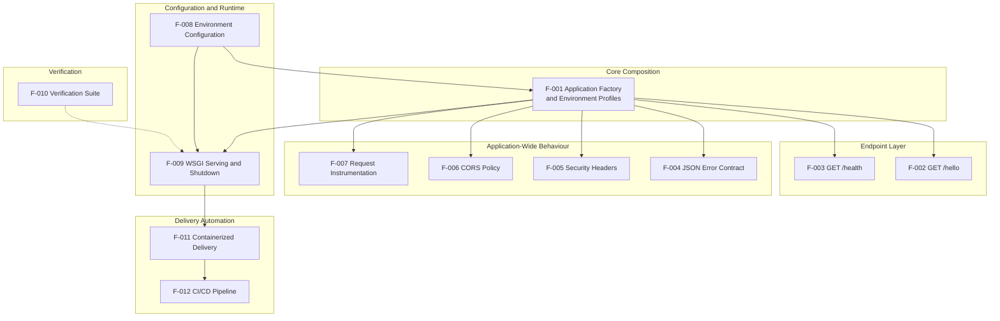
```mermaid
flowchart TD
    subgraph CoreComposition["Core Composition"]
        F001["F-001 Application Factory<br/>and Environment Profiles"]
    end

    subgraph EndpointLayer["Endpoint Layer"]
        F002["F-002 GET /hello"]
        F003["F-003 GET /health"]
    end

    subgraph AppBehaviour["Application-Wide Behaviour"]
        F004["F-004 JSON Error Contract"]
        F005["F-005 Security Headers"]
        F006["F-006 CORS Policy"]
        F007["F-007 Request Instrumentation"]
    end

    subgraph RuntimeConfig["Configuration and Runtime"]
        F008["F-008 Environment Configuration"]
        F009["F-009 WSGI Serving and Shutdown"]
    end

    subgraph DeliveryChain["Delivery Automation"]
        F011["F-011 Containerized Delivery"]
        F012["F-012 CI/CD Pipeline"]
    end

    subgraph VerificationLayer["Verification"]
        F010["F-010 Verification Suite"]
    end

    F001 --> F002
    F001 --> F003
    F001 --> F004
    F001 --> F005
    F001 --> F006
    F001 --> F007
    F008 --> F001
    F008 --> F009
    F001 --> F009
    F009 --> F011
    F011 --> F012
    F010 -.-> F009
```

| Feature | Depends On | Nature of the Dependency |
|---|---|---|
| F-002, F-003 | F-001 | Route handlers are registered only inside `create_app` by `register_route_handlers` |
| F-004 | F-001 | Error handlers are registered by `register_error_handlers`; the 500 payload reads `request.id` produced by F-007 |
| F-005 | F-001 | The security header hook is installed by `configure_security_settings` before routes exist |
| F-006 | F-001 | The CORS extension is initialised inside the factory and wraps the whole application |
| F-007 | F-001 | Both lifecycle hooks are registered by `register_middleware_hooks` |
| F-001 | F-008 | `FLASK_ENV`, `FLASK_DEBUG`, and `SECRET_KEY` are read from the environment during configuration |
| F-009 | F-001, F-008 | The WSGI application is built by `create_app` from `FLASK_ENV`, and `HOST` and `PORT` are resolved and validated |
| F-011 | F-009 | The image copies `app.py` and `wsgi.py` and serves the exported WSGI `application` |
| F-012 | F-011 | The CD pipeline builds the production target of the same Dockerfile, then pushes and deploys the resulting image |
| F-010 | F-001 to F-009 | The suites exercise every other feature; the dashed edge marks that F-009's lifecycle assertions require the WSGI export to exist and behave |

### 2.3.2 Integration Points

| Integration Point | Features Involved | Interface or Artefact |
|---|---|---|
| WSGI server to application | F-009, F-011 | Module-level `application` in `src/backend/wsgi.py`; consumed by `gunicorn wsgi:application` in Compose and by `src.backend.wsgi:application` in the WSGI test suite |
| Orchestrator to application | F-002, F-003, F-011 | Container and Compose health checks probe `curl -f http://localhost:3000/hello`; the WSGI test suite polls `GET /health` for readiness |
| Environment to configuration | F-008, F-001, F-009 | python-dotenv plus `os.getenv` for `FLASK_ENV`, `FLASK_DEBUG`, `SECRET_KEY`, `HOST`, and `PORT`, supplied by `.env`, the shell, or the container environment block |
| Browser to API | F-006, F-002, F-003 | CORS preflight for the two permitted localhost origins precedes cross-origin reads of the JSON endpoints |
| Middleware to error contract | F-007, F-004 | `request.id` assigned in `before_request` is echoed as `request_id` in the 500 payload and as `X-Request-ID` on every response |
| Response pipeline | F-005, F-007, F-002, F-003, F-004 | Two `after_request` functions mutate the same response object: the timing and identifier hook registered second, then the security header hook registered first |
| Test tooling to application | F-010, F-001 to F-009 | pytest fixtures construct applications, drive a test client, launch Gunicorn subprocesses, and read process memory through psutil |
| CI to test tooling | F-012, F-010 | CI invokes pytest with coverage flags and consumes `coverage.xml`; the quality gate re-parses that XML against `COVERAGE_THRESHOLD=100` |
| CI/CD to registry and platform | F-012, F-011 | Buildx publishes a multi-platform image to GitHub Container Registry; Azure Web Apps consume the digest-pinned image with staging and production slots |

### 2.3.3 Shared Components

| Component | Defined In | Used By |
|---|---|---|
| `create_app` factory | `src/backend/app.py:63-142` | All features; invoked by the WSGI entry point, both test suites, and the container entry point |
| Flask application instance | Created per factory call | Routes (F-002, F-003), error handlers (F-004), hook chains (F-005, F-007), CORS (F-006), and health reporting of environment and debug state (F-003) |
| `after_request` chain | `src/backend/app.py:223` and `:326` | Security headers (F-005) and response timing/identifier injection (F-007), both applied to success and error responses |
| `before_request` chain | `src/backend/app.py:299` | Request timing, logging, identifier assignment, and content-type inspection, consumed by F-004 and F-007 |
| Flask-CORS extension | `src/backend/app.py:279` | Applies to F-002, F-003, and preflight requests that never reach a handler |
| Environment access layer | `src/backend/app.py:52,155-161` and `src/backend/wsgi.py:58,104-106` | F-001, F-008, and F-009 |
| Module logger | `src/backend/app.py:60` and `src/backend/wsgi.py:70` | Every feature that logs: factory lifecycle, request lifecycle, error handlers, memory reports, and signals |
| Package manifests | `requirements.txt`, `requirements-dev.txt`, `pyproject.toml` | Application runtime (F-001 to F-009), test and quality tooling (F-010), image build (F-011), and CI jobs (F-012) |

### 2.3.4 Common Services

| Service | Evidence | Consumed By |
|---|---|---|
| Structured application logging | `logging.basicConfig` with a timestamp/name/level/message format in both modules | Request lifecycle (F-007), error handlers (F-004), factory and WSGI lifecycle (F-001, F-009) |
| JSON serialisation | Flask `jsonify` in every handler and error handler | F-002, F-003, F-004 |
| Process metrics | `psutil.Process()` memory sampling with a 75 MB warning threshold | F-009 lifecycle reporting; F-010 test fixtures enforce the same 75 MB ceiling |
| Port allocation | `socket` binding to port 0 in the WSGI test fixtures; `validate_port_number` in the runtime | F-010 test isolation; F-008 and F-009 runtime binding |
| Test fixtures | Application, test client, CLI runner, memory monitor, dynamic port, and performance baseline fixtures | F-010, shared by both suites and referenced by the coverage gate |
| Report and evidence generation | HTML, XML, and JSON coverage reports, JUnit XML, HTML test report, Bandit/Safety/pip-audit/SARIF and Trivy output | F-010 report configuration; F-012 artefact upload and gate parsing |

## 2.4 Implementation Considerations

### 2.4.1 Technical Constraints, Performance, and Scalability

| Feature | Technical Constraints | Performance Requirements |
|---|---|---|
| F-001 | Requires Python 3.12+ and Flask 3.1.1+; the three profiles share one base configuration, so a value common to all environments cannot differ per environment without changing the code; an unknown environment name silently receives the base configuration only | Construction is re-entrant and cheap enough to run repeatedly in tests; the 16 MiB `MAX_CONTENT_LENGTH` bounds inbound payload work for every route |
| F-002 | Route is `GET`-only and returns a constant message with a per-request timestamp; no client input is accepted, so no content negotiation or parameter validation exists | Warm response under 50 ms in process and as a benchmark mean; mean under 50 ms and maximum under 100 ms across 50 concurrent in-process requests; at least 95% success with a mean under 50 ms across 100 concurrent server requests |
| F-003 | `version` is a hard-coded string and `uptime` is an epoch value rather than elapsed time, so the payload is informative but not a duration metric; the failure path returns the raw exception message | Must answer within the container probe timeout of 10 seconds and the readiness poll's one-second request timeout |
| F-004 | Handler-level `try`/`except` blocks in the route handlers duplicate the generic `500` handler's role, so two paths can produce a 500 with different shapes; error payloads use a numeric `status` while the greeting response uses the string `success` | Error paths must stay inside the same latency envelope as successful responses, since they traverse the same hook chain |
| F-005 | Headers are fixed literals, so no per-route or per-environment variation exists; the content security policy is applied to JSON responses, where it has no practical effect | One dictionary insertion per header per response; no measurable contribution to response time |
| F-006 | Permitted methods include `POST`, `PUT`, and `DELETE` although no write route exists; origins are hard-coded to two localhost addresses, so a deployed browser client on another origin is not permitted without a code change | Preflight results cache for 86400 seconds, removing repeated preflight cost for the permitted origins |
| F-007 | The request identifier derives from epoch milliseconds and is not collision-safe under concurrency; the log level is fixed at `INFO` because `logging.basicConfig` runs at import and `LOG_LEVEL` is never read | Timing computation and two header writes per response; asserted to remain under 1000 ms and inside the 50 ms warm budget |
| F-008 | `WORKERS` and `LOG_LEVEL` are documented but unread by application code; `FLASK_DEBUG` is compared to the exact lower-cased string `true`; defaults differ between `wsgi.py`, the direct-execution block of `app.py`, `.env.example`, and the README | Environment loading is budgeted under 0.2 seconds with under 2 KB overhead (`src/backend/.env.example:276-279`); port validation is instantaneous |
| F-009 | Production serving is external — the module logs Gunicorn guidance rather than launching it; shutdown cleanup of databases, caches, tasks, and file handles is a placeholder, so shutdown is a logging and reporting sequence | Startup and shutdown must each complete an RSS/VMS sample; `SIGTERM` shutdown must finish inside 10 seconds with exit code 0, and readiness must be reached inside the 15-second container start period |
| F-010 | Two suites declare different import roots, three configuration files declare different test paths and coverage sources, and `test_app.py` imports a module that does not exist; the WSGI suite requires a resolvable `gunicorn` binary and a free local port | Thresholds enforced by assertion: warm under 50 ms, concurrent maximum under 100 ms, mean benchmark under 50 ms, memory under 75 MB with growth under 5 MB in process and under 20 MB over 50 server requests, 95% success at 100 concurrent requests, and a four-phase lifecycle under 60 seconds |
| F-011 | Image copies only `app.py` and `wsgi.py`, so any added module must be copied explicitly; the production command names a module attribute the code does not export; ports differ across artefacts (`wsgi.py` 8000, image and Compose 3000, Compose host mapping 3001, README 5000) | Four synchronous workers with preloading target the concurrency expectations of F-002 and F-010; request recycling at 1000 requests with jitter bounds per-worker memory growth; memory limit 128 MB against a 75 MB reservation |
| F-012 | CI tests Python 3.10–3.12 while the package declares 3.12 or later; CI's coverage source is `src` while the root configuration uses `src/backend`; the coverage gate depends on an artefact path that only exists when the test job produces it | Test job bounded at 15 minutes, security job at 10 minutes, gate at 10 minutes, build job at 20 minutes; the gate fails fast on any line or branch rate below 100% |

Scalability for the delivered system is a function of worker count rather than of application design: both endpoints are stateless and hold no cross-request data, so additional Gunicorn workers or container replicas add capacity linearly, while the container's single replica and four-worker configuration define the shipped baseline (`infrastructure/docker/docker-compose.yml:289`, `infrastructure/docker/Dockerfile:216`). No caching, queueing, or database tier exists to become a bottleneck, and equally none exists to relieve a saturated process.

### 2.4.2 Security Implications and Maintenance Requirements

| Feature | Security Implications | Maintenance Requirements |
|---|---|---|
| F-001 | The production profile supplies the secure defaults — debug off, exception propagation on, HTTPS preferred, cookies secure, HTTP-only, and `Lax`; the `SECRET_KEY` falls back to a well-known development string, so a deployment that forgets to set it is insecure by default | Adding a profile requires updating `configure_flask_settings` plus the convenience factories; the unused `FLASK_CONFIGS` mapping should be reconciled or removed to avoid misleading readers |
| F-002 | No user input is processed, so the endpoint has no injection surface; the response inherits the application's hardening headers | Message, header, and payload shape are asserted by tests, so any contract change requires updating both the suite and the two README files that describe the endpoint differently |
| F-003 | The payload exposes environment name and debug state, which are low-sensitivity but still a disclosure; the failure path returns a raw exception message | The hard-coded version string must be kept in step with package metadata, and the documented contract in `src/backend/README.md` needs correction to match the implemented keys |
| F-004 | Generic 500 messages, traceback logging restricted to debug mode, and no stack traces in responses are the core protections; distinguishing 404 from 405 discloses route existence, which is an accepted trade-off for a public tutorial API | Any new route or method must be reflected in the 405 `Allow` header expectations, which are derived from framework metadata and therefore self-maintaining |
| F-005 | Central application of headers removes per-route omissions; `X-Frame-Options: DENY` and a self-only content security policy reduce framing and third-party script risk; removing `Server` reduces fingerprinting | Adding a header is a one-line change in a single dictionary, but the exact-value assertions in the test suite must be updated in step |
| F-006 | A closed origin allow-list with credentials disabled is the fail-safe posture; the risk is stale configuration, since deployed origins must be added in code | Origins are literals, so environment-specific origins require either code changes or an extension of the configuration layer |
| F-007 | Identifiers carry no user data and headers leak only timing; the main operational risk is log volume, because every request logs twice at `INFO` | Changing the log level requires code changes in three places (two modules plus the container `LOG_LEVEL` values), and the unused `LOG_LEVEL` variable should be wired up or withdrawn |
| F-008 | The template warns against committing `.env`, enabling debug in production, and reusing the example secret; the residual risk is that the documented `WORKERS` and `LOG_LEVEL` variables have no effect, so operators may believe they have changed behaviour they have not | Documentation must be re-verified against code whenever a variable is added; today `.env.example`, the README table, and the code disagree on port defaults |
| F-009 | Signal handling and non-root container execution protect orderly termination; the placeholder cleanup means no resource is released beyond the process itself, which is acceptable only because the application holds no external resources | The cleanup placeholders are the extension points for persistence work; the Dockerfile command must be corrected to reference `application` so the image does not depend on Compose to override it |
| F-010 | Tests assert the absence of fingerprint headers and the presence of hardening headers, so a regression in F-005 fails the build; test fixtures set a non-production secret | The suites must be kept consistent with one another and with the resolved pytest configuration; fixing the `src.app` import path is the prerequisite for the 100% coverage gate to mean anything |
| F-011 | Non-root user, read-only application files, dropped capabilities, read-only root filesystem, and `no-new-privileges` collectively implement the hardening the requirement set expects; `apparmor:unconfined` in production Compose is the notable exception and is annotated in the file as educational | Base-image and Alpine package updates flow through the build; the `dumb-init` entrypoint and health checks must be preserved when the command is corrected |
| F-012 | Static analysis, dependency auditing, image scanning, and SARIF publication provide continuous security evidence; the residual gap is that the tested Python versions fall outside the declared support range, so a green pipeline does not prove support for the declared floor | Matrix versions, dependency minimums, and the coverage threshold must be reviewed together; the pipeline's gates should be re-pointed at whichever pytest configuration the project settles on |

## 2.5 Traceability Matrix

Each requirement traces to the assertion or gate that verifies it and to the objective it serves. Test references name real methods and classes in `src/backend/tests/`; gate references name the configuration that enforces the requirement. Where a requirement is verified by construction rather than by a dedicated assertion, the cell says so explicitly rather than implying a test exists.

| Requirement ID | Feature | Verifying Test or Gate |
|---|---|---|
| F-001-RQ-001 | Application factory and profiles | `TestFlaskApplication.test_flask_application_factory_creation`, `test_flask_application_configuration_environments`, `TestFlaskConfigurationManagement.test_testing_environment_configuration` |
| F-001-RQ-002 | Convenience factories and fail-loud composition | `create_testing_app` used by the shared `app` fixture; `__all__` and the `RuntimeError` path verified by inspection of `src/backend/app.py:126-141,695-700` |
| F-002-RQ-001 | Greeting contract | `TestFlaskRouteHandlers.test_hello_endpoint_returns_200_with_json_response`, `test_valid_endpoints_parametric_testing`, `TestFlaskWSGIIntegration.test_flask_application_factory_wsgi_integration` |
| F-002-RQ-002 | Response headers | `TestFlaskRouteHandlers.test_hello_endpoint_response_headers` |
| F-002-RQ-003 | Stateless and concurrent operation | `TestFlaskStatelessOperation.test_stateless_operation_multiple_requests`, `test_no_session_persistence`, `TestFlaskPerformanceCharacteristics.test_concurrent_request_handling`, `TestWSGIPerformance.test_wsgi_server_concurrent_load_testing` |
| F-003-RQ-001 | Health status payload | `TestFlaskRouteHandlers.test_health_check_endpoint_functionality`, `TestWSGIEnvironmentConfiguration.test_wsgi_configuration_validation`, `TestWSGIServerLifecycle.test_wsgi_server_startup_lifecycle` |
| F-003-RQ-002 | Uncached success and failure signal | `TestFlaskRouteHandlers.test_health_check_endpoint_functionality` (cache header); the 503 path verified by inspection of `src/backend/app.py:454-463` |
| F-004-RQ-001 | Not-found responses | `TestFlaskErrorHandlers.test_nonexistent_route_returns_404_with_json_error`, `test_error_handlers_parametric_validation`, `TestFlaskWSGIIntegration.test_flask_wsgi_error_handling` |
| F-004-RQ-002 | Method-not-allowed responses | `TestFlaskErrorHandlers.test_unsupported_method_returns_405_with_json_error` (including the `Allow` header assertion) |
| F-004-RQ-003 | Internal-error containment | `TestFlaskErrorHandlers.test_internal_server_error_handling` (handler invoked directly); traceback-suppression behaviour verified by inspection of `src/backend/app.py:580-582,618-620` |
| F-005-RQ-001 | Security headers | `TestFlaskSecurityConfiguration.test_security_headers_configuration` |
| F-005-RQ-002 | Server fingerprint removal | `TestFlaskSecurityConfiguration.test_server_identification_removal`, `TestFlaskRouteHandlers.test_hello_endpoint_response_headers` |
| F-006-RQ-001 | Closed origin allow-list | `TestFlaskSecurityConfiguration.test_cors_configuration` (simple request); the policy literal verified in `src/backend/app.py:270-276` |
| F-006-RQ-002 | Simple and preflight requests | `TestFlaskSecurityConfiguration.test_cors_configuration` (OPTIONS preflight with requested method and headers) |
| F-007-RQ-001 | Response timing | `TestFlaskMiddlewareIntegration.test_response_time_header_injection`, `test_request_lifecycle_middleware`, `TestFlaskRouteHandlers.test_hello_endpoint_performance_timing` |
| F-007-RQ-002 | Request correlation and input warning | `TestFlaskMiddlewareIntegration.test_request_id_tracking`; the non-JSON warning verified by inspection of `src/backend/app.py:319-321` |
| F-008-RQ-001 | Dotenv configuration and precedence | `TestFlaskConfigurationManagement.test_environment_variable_integration`, `TestWSGIEnvironmentConfiguration.test_python_dotenv_environment_loading`, `configure_wsgi_test_environment` session fixture |
| F-008-RQ-002 | Port and host validation | `TestWSGIServerLifecycle.test_wsgi_server_port_binding_validation`; range rejection and privileged-port warning verified by inspection of `src/backend/wsgi.py:313-331` |
| F-008-RQ-003 | Documented configuration template | Verified by inspection of `src/backend/.env.example:38-231`; no test asserts template contents |
| F-009-RQ-001 | WSGI application object | `TestFlaskWSGIIntegration.test_flask_application_factory_wsgi_integration`, plus every `TestWSGI*` class that launches `src.backend.wsgi:application` |
| F-009-RQ-002 | Signals, shutdown, and memory reporting | `TestWSGIServerLifecycle.test_wsgi_server_signal_handling`, `TestWSGIEndToEndIntegration.test_complete_wsgi_deployment_lifecycle` (phases 1 and 4), `memory_monitor` fixture |
| F-009-RQ-003 | Uncaught exception handling | Verified by inspection of `src/backend/wsgi.py:432-474`; no test injects an uncaught interpreter-level exception |
| F-010-RQ-001 | In-process verification suite | The module itself (`src/backend/tests/test_app.py`, 25 methods); coverage gate `--cov-fail-under=100` in `pytest.ini:40-54` |
| F-010-RQ-002 | WSGI lifecycle and performance verification | The module itself (`src/backend/tests/test_wsgi.py`, 11 methods) with `performance_baseline` thresholds and `wait_for_server_readiness` |
| F-010-RQ-003 | Coverage gate and reporting | `pytest.ini:40-54`, `src/backend/pytest.ini:15-24`, and the `quality-gate` job's `validate_coverage.py` step (`.github/workflows/ci.yml:242-293`) |
| F-011-RQ-001 | Multi-stage non-root build | Verified by inspection of `infrastructure/docker/Dockerfile:9-132`; the build fails on missing Flask or Gunicorn because of the in-image import checks |
| F-011-RQ-002 | Production serving under Gunicorn | Verified by inspection of `infrastructure/docker/Dockerfile:184-220` and the Compose production command (`infrastructure/docker/docker-compose.yml:263`), which the WSGI suite exercises equivalently through its own Gunicorn launch |
| F-011-RQ-003 | Orchestrated environments | Verified by inspection of `infrastructure/docker/docker-compose.yml:34-345`; health-check behaviour depends on F-002 |
| F-012-RQ-001 | Continuous integration of tests and linting | `.github/workflows/ci.yml:40-125` |
| F-012-RQ-002 | Security scanning and evidence publication | `.github/workflows/ci.yml:127-206` |
| F-012-RQ-003 | Quality gate and staged deployment | `.github/workflows/ci.yml:209-332` and `.github/workflows/cd.yml` |

| Requirement ID | Business Objective |
|---|---|
| F-001-RQ-001, F-001-RQ-002 | Educational foundation: one readable composition point that also supports repeated programmatic construction |
| F-002-RQ-001 – F-002-RQ-003 | Core delivered functionality: the single greeting endpoint the requirement set specifies, demonstrably stateless |
| F-003-RQ-001, F-003-RQ-002 | Operational visibility: a probe contract that monitoring and deployment verification can rely on |
| F-004-RQ-001 – F-004-RQ-003 | Reliability and integration: failures remain machine-readable and never leak internals |
| F-005-RQ-001, F-005-RQ-002 | Security posture: hardening applied centrally, with no fingerprinting |
| F-006-RQ-001, F-006-RQ-002 | Integration enablement: controlled browser access from local development origins |
| F-007-RQ-001, F-007-RQ-002 | Observability: per-response latency and correlation data for client-visible diagnostics |
| F-008-RQ-001 – F-008-RQ-003 | Configuration portability: the same artefact runs locally, in CI, and in a container, with documented variables |
| F-009-RQ-001 – F-009-RQ-003 | Deployment readiness: a standard WSGI contract with container-friendly lifecycle behaviour |
| F-010-RQ-001 – F-010-RQ-003 | Quality assurance: every quality claim is asserted and gated rather than asserted in prose |
| F-011-RQ-001 – F-011-RQ-003 | Reproducible delivery: one build produces development and production environments with declared resource and security boundaries |
| F-012-RQ-001 – F-012-RQ-003 | Delivery automation: linting, testing, coverage, and security evidence gate promotion of the image |

## 2.6 References

Requirement baseline: feature identifiers `F-001` to `F-012` and requirement identifiers of the form `F-XXX-RQ-YYY` continue the scheme of the predecessor Express.js specification, so `F-001` now names the Flask application factory, `F-002` the greeting endpoint, and `F-003` the health endpoint, while the predecessor's error-handling feature is carried as `F-004`. This matrix describes the delivered system as observed in the repository at the version recorded in `pyproject.toml:41`; because every acceptance criterion cites its verifying assertion or gate, a change to any cited file is the trigger for re-validating the corresponding requirement. Requirements whose verification rests on inspection rather than a test — F-001-RQ-002, F-003-RQ-002 (failure path), F-004-RQ-003 (traceback suppression), F-007-RQ-002 (non-JSON warning), F-008-RQ-002 and RQ-003, F-009-RQ-003, and F-011-RQ-001 to RQ-003 — are the assumptions most in need of executable coverage.

- `src/backend/app.py` - the entire application surface: factory composition `create_app` (63-142), environment profiles and shared configuration (144-212), security header hook with `Server` removal (215-256), CORS allow-list (259-288), request lifecycle hooks assigning `X-Response-Time` and `X-Request-ID` (291-355), the `/hello` handler (367-424), the `/health` handler (426-463), the 404/405/500 and catch-all error handlers (470-636), the unused `FLASK_CONFIGS` mapping (641-657), convenience factories and exports (660-700), and the direct-execution development server (705-751)
- `src/backend/wsgi.py` - WSGI integration and lifecycle: guarded imports (35-54), environment and port resolution (104-106), WSGI settings per environment (147-189), signal registration (192-255), graceful shutdown with future-cleanup placeholders (258-296), port validation (299-331), memory reporting with the 75 MB warning threshold (334-373), deployment logging (376-429), uncaught-exception handling (432-474), direct-execution and import paths producing `application` (479-531)
- `src/backend/.env.example` - the documented configuration template: seven active values (38-162), commented database, JWT, external-API, and Redis/Celery examples (172-194), platform port presets (200-231), validation guidelines (234-270), and performance and version notes (273-330)
- `src/backend/tests/test_app.py` - in-process verification: 25 methods across eight classes, the shared application/client/runner fixtures (620-650), autouse environment setup (653-672), the memory-monitor fixture (675-690), and the unit/flask markers (694-697)
- `src/backend/tests/test_wsgi.py` - deployed-shape verification: session environment fixture (85-124), memory monitor with the 75 MB ceiling (127-191), dynamic port allocation (194-230), application fixtures (233-291), performance thresholds (294-346), the 11 lifecycle, integration, performance, configuration, and end-to-end methods (353-1320), and the readiness and response-validation utilities (1327-1382)
- `src/backend/tests/` - the two-suite test implementation and the source of every asserted latency, memory, concurrency, and lifecycle threshold in this section
- `infrastructure/docker/Dockerfile` - multi-stage Alpine build: non-root user (41-59), dependency verification (64-96), application stage with port 3000 and the `/hello` health check (101-132), development stage with debugpy and reload (137-179), and the production stage with read-only source files, Gunicorn tuning, and the `wsgi:app` command (184-220)
- `infrastructure/docker/docker-compose.yml` - orchestrated environments: development service with ports, volumes, and health check (34-167), production service with resource limits, hardening, and the `wsgi:application` command (175-339), network-setup service (346-367), and the declared network and named volumes (368-439)
- `pytest.ini` - root test configuration: discovery path `src/backend/tests`, coverage flags and the 100% branch gate (40-54), plugin requirements (63-69), timeout (71-73), and the 18-marker catalogue (93-111)
- `src/backend/pytest.ini` - backend test configuration: discovery path `tests`, coverage source `src`, JUnit and HTML reports (15-30), the 10-marker catalogue (35-45), and the testing environment block (84-88)
- `pyproject.toml` - package identity and version (40-41), Python floor (81), runtime dependencies (84-89), the dev/security/docs/performance extras (93-138), project URLs (142-148), and the alternative pytest, coverage, Black, and mypy tables (156-340)
- `requirements.txt` - the five runtime dependencies with their Express-to-Flask rationale, including Flask-CORS and Gunicorn
- `requirements-dev.txt` - development dependencies grouped by workflow, including the coverage, pytest-plugin, formatting, and security-scanning tools the gates rely on
- `src/backend/requirements.txt` - the 41-entry backend manifest, including psutil for the memory thresholds and requests for the WSGI suite
- `.github/workflows/ci.yml` - CI triggers (3-25), the Python 3.10-3.12 test matrix and pytest invocation (40-125), the security job with Bandit at medium severity, Safety, pip-audit, and OSSF Scorecard (127-206), and the quality gate that parses coverage and security artefacts (209-340)
- `.github/workflows/cd.yml` - CD triggers, multi-platform image build to GitHub Container Registry, image scanning, and staged Azure deployment
- `README.md` - project identity, technology stack (37-53), the feature list (55-62), the `/hello` and error documentation that conflicts with the implemented JSON contract (283-373), the 100% coverage targets (384-443), deployment channels (474-638), and the environment-variable table with its port-5000 default (640-664)
- `src/backend/README.md` - learner-facing endpoint specification: the `/hello` contract (274-314), the `/health` payload including a `service` key the implementation does not return (316-332), and the error-response examples (334-379)
- `blitzy/documentation/Input Prompt.md` - the authoritative requirement set this section formalises: framework and runtime, API implementation, testing and quality, containerisation, performance targets, and CI/CD expectations
- `blitzy/documentation/Project Guide.md` - completion accounting (85 of 100 hours) and the residual production-readiness backlog that bounds current feature status
- `blitzy/documentation/Technical Specifications_b3815ee7-12a2-46a4-a950-4b8e72ef8030.md` - the predecessor Express.js specification whose §2 supplied the `F-XXX` / `F-XXX-RQ-YYY` identifier scheme, the three-table requirement shape, and the superseded targets this section replaces
- `blitzy/documentation/` - the planning corpus whose requirements and status statements were reconciled against the implementation before any feature status was assigned

Related sections of this specification: §1.2 System Overview for the capability table, component map, and success criteria these features implement; §1.3 Scope for the in-scope capability list, implementation boundaries, and explicit exclusions; §1.4 References for the repository-wide evidence inventory. The process-flowchart section of this specification carries the request-handling, startup, shutdown, and deployment flows whose steps correspond to the requirements above.

No external web sources were consulted for this section; every statement rests on the repository files listed above.

# 3. Technology Stack

## 3.1 Programming Languages

The delivered system is implemented in a single programming language: Python. Everything around it — container entrypoints, orchestration, pipeline definitions and configuration files — uses POSIX shell or declarative formats. There is no JavaScript, TypeScript, native mobile, desktop or infrastructure-as-code source anywhere in the 28-file checkout.

| Platform / component | Language | Version floor | Evidence |
|---|---|---|---|
| Application: Flask factory, WSGI entry point, test suites | Python | >= 3.12 | `pyproject.toml:81` (`requires-python = ">=3.12"`); `src/backend/app.py`, `src/backend/wsgi.py`, `src/backend/tests/test_app.py`, `src/backend/tests/test_wsgi.py` |
| Container runtime | Python 3.12 on Alpine Linux (musl libc) | 3.12 | `infrastructure/docker/Dockerfile:9` (`FROM python:3.12-alpine`), `:49` (`PYTHON_VERSION=3.12`) |
| Build, entrypoint and health-check commands | POSIX shell (`sh`, BusyBox) | Alpine 3.19 | `infrastructure/docker/Dockerfile:132, :179, :220` (`dumb-init sh -c ...`); `docker-compose.yml` service commands and `curl` health checks |
| Container orchestration | YAML, Docker Compose schema | Compose `3.8` | `infrastructure/docker/docker-compose.yml:18` |
| CI/CD pipelines | YAML, GitHub Actions workflow schema | — | `.github/workflows/ci.yml`, `.github/workflows/cd.yml` |
| Package, build and tool configuration | TOML (PEP 518 / PEP 621) | — | `pyproject.toml:25-31` (build system), `:39-139` (project metadata and dependencies) |
| Test, lint and type-checking configuration | INI | — | `pytest.ini`, `src/backend/pytest.ini`, `.flake8` |
| Documentation | Markdown | — | `README.md`, `src/backend/README.md`, `CONTRIBUTING.md`, `CODE_OF_CONDUCT.md`, `.github/PULL_REQUEST_TEMPLATE.md`, `.github/ISSUE_TEMPLATE/`, `blitzy/documentation/` |

No `.js`, `.ts`, `.tsx`, `.jsx`, `.swift`, `.kt`, `.m`, `.tf`, `.sql`, `.html` or `.css` file exists in the repository. The Node.js v22.16.0 LTS, Express.js 5.1.0, Jest 29.7.0, Supertest 7.1.1 and npm references that remain in `CONTRIBUTING.md:1-4,90-91,511`, `CODE_OF_CONDUCT.md:2`, `.github/PULL_REQUEST_TEMPLATE.md:2-4,124-153`, `.github/ISSUE_TEMPLATE/feature_request.md`, the root `.gitignore:3-5,47-53` and the `blitzy/documentation/` planning set describe the superseded predecessor project, not the delivered technology.

### 3.1.1 Selection Criteria and Justification

**The language choice is a migration target, not a greenfield preference.** The requirement set frames the deliverable as demonstrating "migration patterns from Express.js to Flask with equivalent functionality" (`blitzy/documentation/Input Prompt.md:48`). Every runtime dependency carries that mapping in its own manifest comment: Flask replaces "Express.js v5.1.0" (`requirements.txt:6`), python-dotenv replaces "Node.js `process.env` patterns" (`requirements.txt:11-13`), Gunicorn replaces "Node.js built-in HTTP server" (`requirements.txt:20-23`), and pytest replaces "Jest v29.7.0" (`requirements-dev.txt:9-11`). Source-level comments repeat the mapping, for example "# Replaces Express.js `app.js`" (`src/backend/app.py:2`) and "# Replaces Node.js `server.js`" (`src/backend/wsgi.py:2`).

**The version floor is stated three times and consistently above 3.10.** Package metadata requires 3.12 or later (`pyproject.toml:81`), the classifiers advertise Python 3.12 and 3.13 plus `Typing :: Typed` (`pyproject.toml:72-79`), the learner-facing guides specify "Python 3.12+ 'Latest'" (`README.md:40`) and "Python 3.12+" (`src/backend/README.md:16`), and the container base image is `python:3.12-alpine` (`infrastructure/docker/Dockerfile:9`).

**Language features actually exercised.** Both modules use full type annotations (`typing` imports at `src/backend/app.py:35` and `src/backend/wsgi.py:31`), decorator-based route, hook and error-handler registration, `functools.wraps`, `datetime` timestamps and f-strings; `wsgi.py` uses `signal`, `threading` and `sys` for lifecycle management; the tests add `contextlib.contextmanager`, `concurrent.futures.ThreadPoolExecutor` and `unittest.mock`. Tool configuration targets the same language level: Black `target-version = ["py312", "py313"]` (`pyproject.toml:288`) and mypy `python_version = "3.12"` (`pyproject.toml:319`).

### 3.1.2 Constraints and Dependencies

| Constraint | Observed behaviour | Evidence |
|---|---|---|
| Declared floor differs from the tested floor | Metadata requires >= 3.12 while CI executes the suite on 3.12, 3.11 and 3.10, so the declared minimum is never the version under test | `pyproject.toml:81`; `.github/workflows/ci.yml:47` |
| Static typing is configured but not enforced | mypy permits untyped definitions, ignores missing imports and relaxes test modules; the manifests describe mypy as optional | `pyproject.toml:318-351`; `src/backend/requirements.txt:95-98` |
| Synchronous concurrency model only | Gunicorn runs `--worker-class=sync` with 4 workers; no `async`/`await` appears in application code; concurrency is exercised with threads, not an event loop | `infrastructure/docker/Dockerfile:194-198, :216`; `src/backend/tests/test_app.py:40` |
| Runtime monitoring dependency requires a C toolchain | `psutil` supplies the RSS/VMS telemetry `wsgi.py` logs; containers that install the development manifest add `build-base`, `libffi-dev` and `openssl-dev` to compile it | `src/backend/wsgi.py:20, :38, :334-373`; `infrastructure/docker/Dockerfile:26-31, :146-147` |
| The WSGI entry point treats `psutil` as a critical import, but the production image does not install it | `wsgi.py` prints guidance and calls `sys.exit(1)` when `psutil` is absent; the image's dependency stage installs only the 5-package root manifest, which omits `psutil`, and then verifies `import wsgi` | `src/backend/wsgi.py:35-44`; `requirements.txt:1-28`; `infrastructure/docker/Dockerfile:71-72, :88-89, :112-116` |
| Missing-dependency behaviour is inconsistent between entry points | `app.py` raises a chained `ImportError`; `wsgi.py` terminates the interpreter with status 1 | `src/backend/app.py:39-48`; `src/backend/wsgi.py:35-54` |
| The two test modules assume different import roots | `test_app.py` imports `src.app` (no such module exists); `test_wsgi.py` imports `src.backend.app`/`src.backend.wsgi`, which resolve only when the repository root is on `sys.path`; no `src/__init__.py` or `conftest.py` exists | `src/backend/tests/test_app.py:54`; `src/backend/tests/test_wsgi.py:63-64` |
| An asynchronous test mode is declared for code that has none | `src/backend/pytest.ini` sets `asyncio_mode = auto` while the application contains no coroutines | `src/backend/pytest.ini:122` |


## 3.2 Frameworks & Libraries

The application framework is Flask, and it is the only framework in the delivered system. Three runtime libraries complete the serving path (Flask-CORS, python-dotenv, Gunicorn), one supports operational telemetry (psutil), and the remaining declared libraries serve testing, quality assurance and security scanning. No frontend, AI/agent, authentication, ORM, queue or serialization framework appears in any manifest or source file.

All versions below are the lower bounds declared in the repository; no exact pin or lock file exists (see 3.3).

| Framework / library | Declared floor | Role in this system | Evidence |
|---|---|---|---|
| Flask | >= 3.1.1 | WSGI web framework: application factory, routing, `jsonify` responses, error handlers, `before_request`/`after_request` hooks, configuration object | `pyproject.toml:85`, `requirements.txt:8`, `src/backend/app.py:40, :63` |
| Flask-CORS | >= 4.0.0 | Single application-level cross-origin policy for the two local development origins | `pyproject.toml:87`, `requirements.txt:18`, `src/backend/app.py:41, :259-288` |
| python-dotenv | >= 1.0.1 | Loads `.env` into `os.environ` at import time in both entry points and in the WSGI test module | `pyproject.toml:86`, `requirements.txt:13`, `src/backend/app.py:42, :52`, `src/backend/wsgi.py:37, :58` |
| Gunicorn | >= 21.2.0 | Production WSGI HTTP server; synchronous worker class only | `pyproject.toml:88`, `requirements.txt:23`, `infrastructure/docker/Dockerfile:194-198, :216, :220` |
| Werkzeug | >= 3.0.1 | Flask's WSGI toolkit, supplying the development server used by `flask run` in the container application and development targets | `src/backend/requirements.txt:157`, `infrastructure/docker/Dockerfile:132, :179` |
| Jinja2 | >= 3.1.2 | Flask's templating engine; no template directory or render call exists, so it is a transitive runtime requirement only | `src/backend/requirements.txt:158` |
| MarkupSafe | >= 2.1.3 | Jinja2 dependency for safe string handling | `src/backend/requirements.txt:159` |
| itsdangerous | >= 2.1.2 | Cryptographic signing behind Flask session/cookie handling and the `SECRET_KEY` setting | `src/backend/requirements.txt:160`, `src/backend/app.py:161, :169-179` |
| click | >= 8.1.7 | Flask's CLI layer | `src/backend/requirements.txt:161` |
| psutil | >= 5.9.0 | Process memory telemetry (RSS, VMS, percent, PID) logged by the WSGI module and asserted by the test suites | `src/backend/requirements.txt:64`, `src/backend/wsgi.py:38, :334-373`, `src/backend/tests/test_app.py:35` |
| requests | >= 2.31.0 | HTTP client used by the WSGI integration and load tests against a live Gunicorn process | `src/backend/requirements.txt:133`, `src/backend/tests/test_wsgi.py:50` |
| jsonschema | >= 4.20.0 | Declared for JSON response and configuration validation in tests | `src/backend/requirements.txt:137` |
| Faker | >= 22.0.0 | Declared for test data generation | `src/backend/requirements.txt:69` |
| orjson | >= 3.9.0 | Declared for faster JSON handling; imported neither by the application nor by the tests | `requirements-dev.txt:189` |

Supporting library layer for verification and quality:

| Group | Libraries and floors | Evidence |
|---|---|---|
| Test runner and Flask integration | pytest >= 8.4.0, pytest-flask >= 1.3.0, pytest-mock >= 3.12.0 | `pyproject.toml:96-97, :102`, `src/backend/pytest.ini:77-80` |
| Coverage enforcement | coverage[toml] >= 7.6.0, pytest-cov >= 5.0.0 | `pyproject.toml:98-99`, `requirements-dev.txt:43` |
| Reporting and parallel execution | pytest-html >= 4.1.1, pytest-xdist >= 3.5.0, pytest-benchmark >= 4.0.0 | `pyproject.toml:100-101, :105`, `pytest.ini:64-69` |
| Formatting, linting, typing | black >= 24.0.0, flake8 >= 7.0.0, flake8-security >= 1.7.1, isort >= 5.13.2, mypy >= 1.8.0, pydocstyle >= 6.3.0, pylint >= 3.0.0 | `pyproject.toml:109-113`, `requirements-dev.txt:51-77` |
| Security scanning | bandit >= 1.7.5 (>= 1.8.3 in `requirements-dev.txt`), safety >= 3.0.0, pip-audit >= 2.6.0 | `pyproject.toml:116-117, :124-128`, `requirements-dev.txt:85-93` |
| Documentation | sphinx >= 7.2.6, sphinx-rtd-theme >= 1.3.0 | `pyproject.toml:130-133`, `requirements-dev.txt:141` |

### 3.2.1 Compatibility Requirements

- **Python floor governs every library.** Package metadata requires Python 3.12 or later for the project itself (`pyproject.toml:81`), and the dependency comments state the same constraint, for example "Constraints are compatible with Python 3.12+ runtime requirements and Flask v3.1.1 ecosystem integration patterns" (`requirements-dev.txt:235-236`).
- **Flask and its dependency family move together.** The repository's self-described "PINNED VERSIONS FOR SECURITY AND REPRODUCIBILITY" section lists `Werkzeug>=3.0.1`, `Jinja2>=3.1.2`, `MarkupSafe>=2.1.3`, `itsdangerous>=2.1.2` and `click>=8.1.7` as the security-relevant companions of Flask (`src/backend/requirements.txt:152-161`).
- **The synchronous worker model is enforced by absence, not configuration alone.** Gunicorn is configured with `--worker-class=sync` (`infrastructure/docker/Dockerfile:216`), and no `gevent`, `eventlet` or async server library is declared in any manifest, so no other concurrency model is available.
- **The same library is declared at different floors in different manifests.** `pytest-cov` (>= 5.0.0 in `pyproject.toml:99` and the root `pytest.ini:66`, but >= 6.1.0 in `src/backend/pytest.ini:79`), `pytest-html` (>= 4.1.1 in `pytest.ini:69` vs >= 4.1.0 in `src/backend/pytest.ini:80`), `isort` (>= 5.13.2 vs >= 5.13.0), `Faker` (>= 22.0.0 vs >= 20.0.0), `bandit` (>= 1.7.5 vs >= 1.8.3), `safety` (>= 3.0.0 vs >= 3.0.1), `pip-audit` (>= 2.6.0 vs >= 2.6.1) and `psutil` (>= 5.9.0 vs >= 5.9.6) all disagree between `src/backend/requirements.txt`, `requirements-dev.txt` and `pyproject.toml`. Installation therefore depends on which manifest is used.
- **Flake8's selected plugin checks depend on packages that are never installed.** `.flake8` selects the `S` (security), `C` (complexity), `N` (naming) and `I` (import order) code families (`:.flake8:100-118, :186-189`) and its comments attribute them to `flake8-security` and `flake8-import-order` (`.flake8:111, :118`), but neither those plugins nor a naming plugin is declared in any dependency manifest; only `flake8-security` appears (`pyproject.toml:111`, `requirements-dev.txt:59`). The remaining selected families are silently inactive.
- **Pytest plugins and files the configuration references are not all declared.** The root `pytest.ini` sets `env = ...` (`pytest.ini:118-123`, supplied by `pytest-env`), a 300-second `timeout` with `timeout_method` (`pytest.ini:72-73`, supplied by `pytest-timeout`), and passes `--cov-config=.coveragerc` (`pytest.ini:54`) although no `.coveragerc` exists in the repository; `src/backend/pytest.ini` additionally declares `flask_app = src.app:create_app` (`:130`) against a module that does not exist. None of `pytest-env`, `pytest-timeout` or `pytest-asyncio` appears in the requirements manifests.

### 3.2.2 Justification for Each Major Choice

| Choice | Stated or demonstrated justification |
|---|---|
| Flask as the web framework | Selected as the migration counterpart of Express.js v5.1.0, chosen for "enhanced type hints, security defaults, and Python 3.12+ compatibility" (`requirements.txt:6-8`); the requirement set asks for the application factory pattern it provides (`blitzy/documentation/Input Prompt.md:8`, implemented at `src/backend/app.py:63`) |
| Flask-CORS as the CORS mechanism | "Flask extension providing secure cross-origin request handling" replacing the CORS capability built into Express.js (`requirements.txt:16-18`) |
| python-dotenv for configuration | Enables "12-factor app configuration patterns with `.env` file support" in place of Node.js `process.env` (`requirements.txt:11-13`) |
| Gunicorn as the production server | "Production-grade WSGI HTTP server with multi-worker process management", replacing the Node.js built-in HTTP server (`requirements.txt:20-23`); it is the only server invoked by the Dockerfile, Compose and the CD workflow, and `wsgi.py` logs Gunicorn launch guidance rather than starting any server itself (`src/backend/wsgi.py:376-429, :510-513`). uWSGI and Waitress appear only as future learning options in `src/backend/README.md:916`, and uWSGI is offered as an alternative in the requirement text (`blitzy/documentation/Input Prompt.md:7`) |
| psutil for resource measurement | Chosen to enforce the memory budget: "System monitoring library for <75MB memory usage enforcement and resource consumption validation" (`src/backend/requirements.txt:63-64, :194-195`) |
| pytest and its plugin ecosystem | Replaces Jest v29.7.0 with "fixture management, parametric testing, and assertion introspection" (`requirements-dev.txt:9-11`) and supplies Flask-specific fixtures for endpoint testing (`README.md:46-47`) |
| Black, Flake8, isort, mypy, Bandit, Safety | The quality toolchain named in the requirement set and mapped to its Node.js predecessors in the manifests ("replacing ESLint" for Black, `requirements-dev.txt:49-51`; "replacing Jest coverage thresholds" for pytest-cov, `pytest.ini:227`) |

### 3.2.3 Integration Requirements Between Components

| Integration | Requirement |
|---|---|
| Flask application → WSGI server | The server must resolve the module-level `application` object exported by `src/backend/wsgi.py:531`. The production image's own command names `gunicorn wsgi:app` (`infrastructure/docker/Dockerfile:220`), an attribute the module does not export, so the image depends on the Compose command override `gunicorn wsgi:application` (`infrastructure/docker/docker-compose.yml:263`) to start; `README.md:182, :280, :485` repeats the `wsgi:app` form while `src/backend/README.md:190` and `.github/ISSUE_TEMPLATE/bug_report.md:66` use `wsgi:application` |
| Gunicorn process configuration | Four synchronised workers, preload enabled, `--worker-connections=1000`, `--max-requests=1000` with jitter 100, `--timeout=30`, `--keepalive=2`, access and error logs to stdout/stderr (`infrastructure/docker/Dockerfile:194-198, :216`) |
| Development serving | Flask's development server via `python -m flask run`, with `--debug --reload` in the development target and an optional `debugpy` listener on port 5678 that waits for a client before starting (`infrastructure/docker/Dockerfile:132, :179`) |
| Process supervision and shutdown | `dumb-init` runs as PID 1 so container termination signals reach the interpreter, where `wsgi.py` registers handlers for SIGTERM, SIGINT and, when available, SIGUSR1/SIGUSR2 and reports graceful shutdown (`infrastructure/docker/Dockerfile:132, :179, :220`; `src/backend/wsgi.py:192-296`) |
| CORS extension wiring | `CORS(...)` is applied once inside the factory with `origins=['http://localhost:3000', 'http://localhost:8000']`, methods `GET/POST/PUT/DELETE/OPTIONS`, headers `Content-Type`, `Authorization`, `X-Requested-With`, `supports_credentials=False`, `max_age=86400`; a failure to apply it raises `RuntimeError` (`src/backend/app.py:259-288`) |
| Configuration precedence | `create_app` reads `FLASK_ENV`, `FLASK_DEBUG` and `SECRET_KEY` from the environment with a `FLASK_ENV`-derived argument override; `wsgi.py` reads `FLASK_ENV`, `HOST` and a validated `PORT`; `.env` is loaded at import by both modules (`src/backend/app.py:155-160`, `src/backend/wsgi.py:104-106, :299-331`, `src/backend/.env.example:38-162`) |
| Framework capabilities deliberately unused | No ORM, migration, authentication, session-store, caching, serialization, rate-limiting, API-documentation, WebSocket or task-queue library is declared, matching the stateless two-endpoint design |


## 3.3 Open Source Dependencies

Every third-party component in this system is an open-source package installed from a public registry. Python packages come from PyPI through pip, the container base images from Docker Hub, the Alpine system packages from the Alpine repositories, build and runtime actions from the GitHub Actions Marketplace, and the built application image from the GitHub Container Registry. There is no vendored code, private package index or artifact repository in the repository.

### 3.3.1 Package Dependencies and Registries

| Manifest | Declared entries | Scope | Consumed by |
|---|---|---|---|
| `requirements.txt` | 5 | Runtime only: Flask, python-dotenv, Flask-CORS, gunicorn, wheel | The container dependency stage copies and installs this file (`infrastructure/docker/Dockerfile:71, :89`) |
| `src/backend/requirements.txt` | 41 | Runtime, testing/QA, code quality and security, development utilities, container utilities, plus a lower-bound block headed "PINNED VERSIONS FOR SECURITY AND REPRODUCIBILITY" | CI's install step, because it runs with `working-directory: src/backend` (`github/workflows/ci.yml:74-80`) |
| `requirements-dev.txt` | 43 | Development, testing, quality, security, profiling, documentation and container tooling, grouped under commented headers | CI's second install line and local setup guidance (`README.md:133`) |
| `pyproject.toml` | 5 runtime entries plus four optional extras (`dev`, `security`, `docs`, `performance`) and 3 build-system entries | Package metadata and the alternative dependency path for `pip install -e .[dev]` | Documented usage only; neither CI nor the container installs the package (`pyproject.toml:25-31, :84-139`) |

| Registry | Contents retrieved | Evidence |
|---|---|---|
| PyPI (pip) | All Python packages; pip itself is upgraded to `>= 24.0` inside the image | `infrastructure/docker/Dockerfile:82, :88-89`; `.github/workflows/ci.yml:78-80` |
| Docker Hub | `python:3.12-alpine` base image; `alpine:3.19` network-helper image | `infrastructure/docker/Dockerfile:9`; `infrastructure/docker/docker-compose.yml:347` |
| Alpine repositories (`apk`) | `curl=8.*`, `dumb-init=1.*`, `build-base=0.*`, `libffi-dev=3.*`, `openssl-dev=3.*` | `infrastructure/docker/Dockerfile:24-31` |
| GitHub Actions Marketplace | `actions/checkout@v4`, `actions/setup-python@v4` (CI) and `@v5` (CD), `actions/cache@v3`, `actions/upload-artifact@v3`, `actions/download-artifact@v3`, `codecov/codecov-action@v3`, `ossf/scorecard-action@v2`, `github/codeql-action/upload-sarif@v2`, `docker/setup-buildx-action@v3`, `docker/login-action@v3`, `docker/metadata-action@v5`, `docker/build-push-action@v5`, `aquasecurity/trivy-action@master`, `azure/webapps-deploy@v2` | `.github/workflows/ci.yml:51, :57, :66, :97, :106, :117, :179, :186`; `.github/workflows/cd.yml:124, :149, :157, :167, :176, :215, :288, :348, :413, :421, :477, :689` |
| GitHub Container Registry (`ghcr.io`) | The published production image, tagged by branch, SHA, semver and `latest-python` with OCI labels | `.github/workflows/cd.yml:76, :166-171, :179-210` |
| GitHub artifact store | Coverage and test reports retained 30 days; security reports retained 90 days | `.github/workflows/ci.yml:114, :206` |

### 3.3.2 Version Constraint Policy

Every dependency declaration in the repository uses a lower bound (`>=`). There are no exact pins, no upper bounds, and no lock or constraints file:

- The block headed "PINNED VERSIONS FOR SECURITY AND REPRODUCIBILITY" (`src/backend/requirements.txt:152-176`) contains only `>=` declarations, and the file's closing notes confirm the policy: "All version specifications use `>=` constraints to allow compatible minor and patch updates" (`src/backend/requirements.txt:201-203`). The same statement appears in `requirements-dev.txt:231-233`.
- `pip-tools` is declared as a development dependency (`requirements-dev.txt:149`) and configured to generate hashes (`pyproject.toml:445-448`), but no compiled lock output, hash-pinned manifest or constraints file exists in the checkout.
- `wheel>=0.42.0` is declared as a runtime dependency in both `pyproject.toml:89` and `requirements.txt:28`; it is a build-format installer rather than an application dependency.
- Dependency currency is a manual activity: no `dependabot.yml` or equivalent automation file exists, the only automated currency check is the weekly CI schedule (`.github/workflows/ci.yml:16-18`), and "Dependency Updates" is listed as an outstanding high-priority task in `blitzy/documentation/Project Guide.md`.

Consequence: the container image, the CI environment and a developer machine can each resolve different versions of the same package on the same day, and the security scans in CI evaluate whatever resolved at scan time rather than a reviewed set.

### 3.3.3 Conflicting Version Declarations

The same package is declared at different floors in different manifests; installation outcome depends on which file is used.

| Package | `pyproject.toml` | `src/backend/requirements.txt` | `requirements-dev.txt` / other |
|---|---|---|---|
| pytest-cov | >= 5.0.0 (`:99`) | >= 5.0.0 (`:49`) | >= 5.0.0 (`requirements-dev.txt:19`); root `pytest.ini:66` >= 5.0.0; `src/backend/pytest.ini:79` requires >= 6.1.0 |
| pytest-html | >= 4.1.1 (`:101`) | >= 4.1.0 (`:125`) | — ; root `pytest.ini:69` >= 4.1.1 |
| psutil | >= 5.9.6 (`:106`) | >= 5.9.0 (`:64`) | >= 5.9.0 (`requirements-dev.txt:105`) |
| isort | >= 5.13.2 (`:113`) | — | >= 5.13.0 (`requirements-dev.txt:63`) |
| Faker | — | >= 22.0.0 (`:69`) | >= 20.0.0 as `faker` (`requirements-dev.txt:109`) |
| bandit | >= 1.7.5 (`:116`) | >= 1.7.5 (`:88`) | >= 1.8.3 (`requirements-dev.txt:85`) |
| safety | >= 3.0.1 (`:117`) | >= 3.0.0 (`:93`) | >= 3.0.0 (`requirements-dev.txt:89`) |
| pip-audit | >= 2.6.1 (`:127`) | — | >= 2.6.0 (`requirements-dev.txt:93`) |

The runtime sets themselves differ: the root manifest carries 5 runtime packages while the backend manifest carries 41 entries of mixed purpose, so a container built by the Dockerfile and an environment prepared from the backend manifest do not contain the same software.

Two manifest references in CI cannot resolve as written: the install step runs in `src/backend` and requests `requirements-dev.txt` (`working-directory: src/backend`, `.github/workflows/ci.yml:74-80`), but that file exists only at the repository root, and the lint step in the same directory passes `--config=.flake8` (`.github/workflows/ci.yml:82-86`) for a file that also exists only at the repository root.

### 3.3.4 Licensing

The project declares the MIT licence in package metadata and documentation (`pyproject.toml:44`, `README.md:936-973`), but no `LICENSE` file is present in the checkout even though `README.md:975` points to one. No dependency licence inventory, notice file or licence-checking tool is declared, so the licence position of the transitive dependency set is not recorded anywhere in the repository.


## 3.4 Third-Party Services

Third-party services appear only in the build, verification and delivery chain. The running application calls no external service: it exposes two endpoints, holds no session store, and makes no outbound network request except to itself during the tests.

| Service | Purpose in this system | Configuration and credentials | Evidence |
|---|---|---|---|
| GitHub Actions (hosted runners) | Executes both pipelines on `ubuntu-latest` | Workflow definitions; `secrets.GITHUB_TOKEN` for registry and code-scanning access | `.github/workflows/ci.yml:41, :128, :210`; `.github/workflows/cd.yml:104, :127, :171` |
| GitHub Container Registry (`ghcr.io`) | Stores the published production image | `REGISTRY: ghcr.io`, `IMAGE_NAME: ${{ github.repository }}`; login as `github.actor` with `secrets.GITHUB_TOKEN`; downstream jobs deploy by image digest | `.github/workflows/cd.yml:76-77, :166-171, :481, :693` |
| GitHub code scanning (Security tab) | Ingests SARIF findings from Bandit, pip-audit, OSSF Scorecard and Trivy | `github/codeql-action/upload-sarif@v2`, Trivy results published under the `container-security` category | `.github/workflows/ci.yml:185-192`; `.github/workflows/cd.yml:412-417` |
| Codecov | Uploads coverage XML per Python version with an `unittests` flag | `codecov/codecov-action@v3`; `fail_ci_if_error: false`, so a Codecov outage cannot block the build | `.github/workflows/ci.yml:96-103` |
| OSSF Scorecard | Supply-chain security assessment with published results | `ossf/scorecard-action@v2`, `publish_results: true`, SARIF output | `.github/workflows/ci.yml:178-183` |
| Trivy | Scans the published container image for vulnerabilities | `aquasecurity/trivy-action@master`; severity set `CRITICAL,HIGH,MEDIUM,LOW`; scan step uses `exit-code: 0` and a later step fails on any critical finding | `.github/workflows/cd.yml:346-357, :363-405` |
| Azure Web Apps | Hosting target for the automated deployment stages | `azure/webapps-deploy@v2` with `secrets.AZURE_WEBAPP_PUBLISH_PROFILE_STAGING` and `..._PRODUCTION`; app services `flask-tutorial-staging` and `flask-tutorial-production`; platform environment `PORT: 8000` | `.github/workflows/cd.yml:444-490, :636-705` |
| Heroku, Render, Railway, DigitalOcean | Documented deployment alternatives only; no buildpack, application manifest or pipeline step exists for them, and the `Procfile`/`runtime.txt` the guide requires are absent from the checkout | Manual instructions and per-platform port presets | `README.md:571-638`; `src/backend/.env.example:200-231` |

### 3.4.1 Authentication Services

No external identity or authentication service is integrated. Auth0, Okta, OIDC and social-login providers are absent from every manifest and source file; the only occurrence of "Auth0" is a comparison-table entry in the superseded Node.js specification (`blitzy/documentation/Technical Specifications_b3815ee7-12a2-46a4-a950-4b8e72ef8030.md:2709`).

What exists instead is Flask's own signed-cookie mechanism, which is process-local rather than a service: `SECRET_KEY` supplies the signing key (`src/backend/app.py:161`, fallback `'dev-key-change-in-production'`), production enables secure, HTTP-only, `SameSite=Lax` cookies with a one-hour lifetime (`src/backend/app.py:169-179`), and no route reads or writes session state — the test suite asserts that `/hello` returns no session cookie and remains stateless. The learning guide lists JWT, Flask-Login, OAuth 2.0, Flask-Security, Flask-JWT-Extended and Authlib as future topics, explicitly framed as "Next Steps" (`src/backend/README.md:874-889`).

### 3.4.2 Monitoring and Observability Services

No APM or SaaS monitoring product is configured — no New Relic, Datadog or Application Insights instrumentation exists in the code or pipelines. Observability is delivered by three mechanisms that are part of the system itself:

| Mechanism | Behaviour | Evidence |
|---|---|---|
| In-process memory telemetry | psutil reports RSS, VMS, memory percentage and PID at WSGI start-up, on signal receipt, during graceful shutdown and on uncaught exception, warning when RSS exceeds the 75 MB target | `src/backend/wsgi.py:334-373, :192-296, :432-474` |
| Health endpoint | `GET /health` returns status, timestamp, uptime, version, environment and debug state, and disables caching | `src/backend/app.py:426-463` |
| Container and pipeline probes | `HEALTHCHECK` curls `/hello` every 30 s in the application and production targets and every 15 s in development with a 5 s start period; the CD pipeline polls `/hello` for 6 minutes at 30 s intervals and fails the deployment when the failure rate exceeds 20 % | `infrastructure/docker/Dockerfile:124, :174, :209`; `.github/workflows/cd.yml:824-862` |

### 3.4.3 Cloud Services

**Azure Web Apps is the only cloud compute service wired into automation.** Staging deploys on a successful build and security scan, production deploys on a published release or an explicit manual dispatch (`environment: production`), and each deploy pushes the image by digest into the named app service before running health checks and smoke tests (`.github/workflows/cd.yml:437-490, :624-705`).

The remaining default-stack cloud and infrastructure items are not part of this system:

| Item | Status | Evidence |
|---|---|---|
| AWS | Not used. It appears only as a generic build-context exclusion pattern, in a learner "next steps" list, and in the superseded Node.js specification | `infrastructure/docker/.dockerignore:424`; `README.md:914`; `blitzy/documentation/Technical Specifications_b3815ee7-12a2-46a4-a950-4b8e72ef8030.md:4871` |
| Terraform / infrastructure as code | Not used. `.terraform/`, `*.tfstate`, `*.tfstate.*` and `.terraform.lock.hcl` are exclusion patterns for files that do not exist; no `.tf` file is present | `infrastructure/docker/.dockerignore:395-404` |
| Google Cloud, Kubernetes | Not used; both appear only as exclusion patterns or future learning options | `infrastructure/docker/.dockerignore:417-426`; `src/backend/README.md:914-916` |
| LangChain or any AI/agent service | Absent; the string appears nowhere in the repository | full-text search of all 28 files |
| Serverless, CDN, managed queue or managed cache service | Absent; no such resource is declared in any workflow or configuration | `.github/workflows/`, `infrastructure/` |

### 3.4.4 Integration Requirements

| Requirement | Detail |
|---|---|
| Credentials are held outside the repository | Azure publish profiles and the registry token come from GitHub secrets; no credential value exists in the checkout, and the environment template carries only placeholder values with explicit warnings against committing `.env`, enabling debug in production, or reusing the example secret (`src/backend/.env.example:14-15, :162`) |
| Platform endpoints are literals | Deployment URLs and app names are hard-coded in the workflow environment blocks and in the smoke-test scripts, so retargeting a different subscription requires editing the workflow (`cd.yml:446, :479, :638, :691, :504, :720`) |
| Environment contract with the platform | Azure deployment sets `FLASK_ENV=production`, `FLASK_DEBUG=false`, `PORT=8000`, `LOG_LEVEL=info`, `GUNICORN_WORKERS=2` (staging) or `4` (production), `GUNICORN_TIMEOUT=30`, `GUNICORN_KEEPALIVE=2`, `GUNICORN_MAX_REQUESTS=1000` and jitter 100. Port 8000 matches the WSGI module's default but not the container's exposed port 3000, so container and platform port expectations diverge (`cd.yml:482-490, :694-705`; `src/backend/wsgi.py:104-106`; `infrastructure/docker/Dockerfile:120`) |
| Deployment artefacts are digest-pinned | Every environment deploy references the build job's `image_digest` output rather than a floating tag, giving reproducible roll-back targets (`cd.yml:481, :693`) |
| No run-time external dependency | The service makes no outbound call at run time; `requests` is used only by tests, and the commented API base-URL/key examples are documented as unused (`src/backend/requirements.txt:131-133`, `src/backend/.env.example:184-188`) |
| Secrets the pipeline expects but the repository cannot verify | `AZURE_WEBAPP_PUBLISH_PROFILE_STAGING` and `AZURE_WEBAPP_PUBLISH_PROFILE_PRODUCTION` must exist for deployment to proceed; nothing in the checkout proves they are configured |


## 3.5 Databases & Storage

The system has no database, no cache server and no object storage. It is deliberately stateless: no data store is declared in any manifest, imported by any module, or configured by any workflow, and the running process holds nothing that must outlive it. What remains under "storage" is configuration carried in environment variables, the container filesystem and Docker-managed volumes, and the artifact and image stores owned by the delivery pipelines.

### 3.5.1 Data Store Inventory

| Store category | Status in this system | Evidence |
|---|---|---|
| Relational database (PostgreSQL, MySQL, SQLite) | Absent. No driver, connection string, schema or migration tool is declared; SQLAlchemy appears only in commented configuration examples and in the learning guide | `src/backend/.env.example:172-176`; `src/backend/README.md:854-871` |
| Document database (MongoDB / PyMongo) | Absent from delivered code. It appears only in the superseded Node.js specification and as a future learning step | `blitzy/documentation/Technical Specifications_b3815ee7-12a2-46a4-a950-4b8e72ef8030.md:2456, :2708`; `src/backend/README.md:856` |
| ORM, migration framework (SQLAlchemy, Flask-SQLAlchemy, Alembic) | Absent; no `migrations/` directory exists. `.flake8:156-157` reserves lint exclusions for migration paths that are not present | `.flake8:58-64, :156-157` |
| Cache server (Redis, Memcached) | Absent; Redis appears only as a commented example and a future topic | `src/backend/.env.example:190-194`; `src/backend/README.md:857` |
| Task queue or broker (Celery, RabbitMQ) | Absent; `CELERY_BROKER_URL` is a commented example only | `src/backend/.env.example:194` |
| Session store | Absent; no route touches the session, and the test suite asserts that repeated `/hello` calls set no session cookie and produce unique timestamps | `src/backend/tests/test_app.py` (stateless-operation tests) |
| Search, time-series, graph or vector store | Absent from every file in the repository | full-text search of all 28 files |

The absence is explicit rather than accidental. `wsgi.py`'s graceful-shutdown routine lists "Database connection cleanup", "Cache invalidation", "Background task termination" and "File handle closure" as additive future steps and currently performs none of them, which is consistent with a process that holds no external resource (`src/backend/wsgi.py:258-296`).

### 3.5.2 Data Persistence Strategies

| Strategy | What is persisted | Evidence |
|---|---|---|
| Environment-variable configuration (twelve-factor) | The entire configurable surface: `PORT`, `HOST`, `FLASK_ENV`, `FLASK_DEBUG`, `LOG_LEVEL`, `WORKERS` and `SECRET_KEY`, loaded from `.env` by `python-dotenv` at import time in both entry points | `src/backend/.env.example:38-162`; `src/backend/app.py:52`; `src/backend/wsgi.py:58` |
| Secret exclusion from version control | `.env` files, keys, certificates and credential patterns are ignored by both ignore files; only the placeholder template is committed | `.gitignore:15-45`; `src/backend/.gitignore:19-25, :100-104`; `src/backend/.env.example:14-15` |
| In-process state only | Uptime is a `time.time()` value rather than elapsed time, request identifiers derive from epoch milliseconds, and the CORS preflight cache is memory-resident for 86400 s. Nothing survives a restart | `src/backend/app.py:426-463, :270-288`; `src/backend/wsgi.py:104-144` |
| No application file I/O | No module opens a file, writes a log to disk besides the configured `logging` stream handlers, or creates a data directory; the production image additionally makes `.py` files read-only and runs with a read-only root filesystem | `src/backend/wsgi.py:62-69`; `infrastructure/docker/Dockerfile:213`; `infrastructure/docker/docker-compose.yml:289-345` |

### 3.5.3 Container and Volume Storage

| Volume | Mounted data | Evidence |
|---|---|---|
| `flask-tutorial-venv-dev-cache`, `flask-tutorial-venv-prod-cache` | The virtual environment, so a rebuild or restart reuses installed dependencies | `infrastructure/docker/docker-compose.yml:403-420` |
| `flask-tutorial-pip-dev-cache`, `flask-tutorial-pip-prod-cache` | pip download caches | `infrastructure/docker/docker-compose.yml:422-438` |
| `flask-tutorial-shared` | Bind volume over `${PWD}/data`, described as persistent shared data; no application code reads or writes this path | `infrastructure/docker/docker-compose.yml:439-441` |

The production service mounts its virtual-environment and pip-cache volumes read-only, uses a read-only root filesystem, and provides writable `tmpfs` mounts only at `/tmp` and `/var/tmp` (`infrastructure/docker/docker-compose.yml:175-345`). The container therefore has no writable persistent path beyond those ephemeral mounts.

### 3.5.4 Caching Solutions

There is no cache tier. The caching that exists is confined to build and transport layers and to one in-memory policy:

| Cache | Purpose | Evidence |
|---|---|---|
| Docker layer cache and Buildx `type=gha` cache | Reuse image layers between builds | `infrastructure/docker/Dockerfile:222-235`; `.github/workflows/cd.yml:225-227` |
| GitHub Actions pip cache | Keyed by OS, Python version and the hashes of both requirement manifests | `.github/workflows/ci.yml:65-72` |
| pip download caches in named volumes | Avoid re-downloading wheels on container restarts | `infrastructure/docker/docker-compose.yml:422-438` |
| CORS preflight cache | `max_age=86400` seconds for the two permitted origins | `src/backend/app.py:270-288` |
| HTTP cache header | `Cache-Control: no-cache, no-store, must-revalidate` on successful `/health` responses, so platform and client caching cannot mask health state | `src/backend/app.py:426-463` |

### 3.5.5 Storage Services

| Service | Stored content | Retention | Evidence |
|---|---|---|---|
| GitHub Container Registry | The `production` image per commit, tagged by branch, SHA, semver and `latest-python`, with OCI labels and provenance/SBOM attestations | Until overwritten or deleted | `.github/workflows/cd.yml:179-238` |
| GitHub Actions artefacts | Coverage reports, JUnit XML and HTML test reports | 30 days | `.github/workflows/ci.yml:105-124` |
| GitHub Actions artefacts | Bandit, Safety, pip-audit, Trivy and Scorecard reports | 90 days | `.github/workflows/ci.yml:194-206` |
| GitHub Actions artefacts | Deployment report for each pipeline run | 90 days | `.github/workflows/cd.yml:996-1002` |
| GitHub code scanning | SARIF findings from the scanners, retained in the repository security view | Per GitHub retention policy | `.github/workflows/ci.yml:185-192`; `.github/workflows/cd.yml:412-417` |

Because no persistent data store exists, no backup, replication, retention or recovery strategy is defined for application data — there is none to protect. The only recoverable artefacts are the pipeline's own reports and published images.


## 3.6 Development & Deployment

Development in this repository is centred on pytest, Flake8 and Black as the enforced gate, with a static typing and security toolchain alongside them. Delivery is container-first: a five-stage Alpine image built for two targets, orchestrated locally by Compose, gated in GitHub Actions, published to the GitHub Container Registry, and deployed by digest to Azure Web Apps.

### 3.6.1 Development Tools and Quality Gates

| Category | Tools and declared floors | Evidence |
|---|---|---|
| Test runner and fixtures | pytest >= 8.4.0, pytest-flask >= 1.3.0, pytest-mock >= 3.12.0; parallel runs via pytest-xdist >= 3.5.0; benchmarks via pytest-benchmark >= 4.0.0; configuration also relies on the `env` option (pytest-env) and the `timeout` option (pytest-timeout), neither of which is declared | `pyproject.toml:96-105`; `pytest.ini:64-73, :118-123` |
| Coverage enforcement | coverage[toml] >= 7.6.0 driven by pytest-cov >= 5.0.0, branch coverage on, `--cov-fail-under=100`, terminal/HTML/XML/JSON reports, JUnit XML for CI | `pytest.ini:40-54`; `pyproject.toml:239-279` |
| Formatting and linting | black >= 24.0.0 at 88 columns targeting py312/py313; Flake8 >= 7.0.0 with `.flake8` as the effective configuration (88-column limit, complexity ceilings of 10/4/7/12, per-file ignores for tests, entry points and scripts); isort >= 5.13.2 on the Black profile; pydocstyle >= 6.3.0; pylint >= 3.0.0 | `pyproject.toml:286-311, :358-371`; `.flake8:19, :126-161` |
| Static typing | mypy >= 1.8.0 configured for Python 3.12 with permissive defaults and module overrides for `flask`, `pytest`, `coverage`, `psutil` and `gunicorn` | `pyproject.toml:318-351` |
| Security scanning | bandit >= 1.7.5 (>= 1.8.3 in `requirements-dev.txt`), safety >= 3.0.0, pip-audit >= 2.6.0 | `requirements-dev.txt:85-93`; `pyproject.toml:116-117, :124-128` |
| Debugging and live reload | debugpy >= 1.8.0 and watchdog >= 3.0.0 installed into the development image; IPython, ipdb, ptpython and Flask-DebugToolbar declared for interactive work | `infrastructure/docker/Dockerfile:162-163`; `requirements-dev.txt:113-117, :199-205` |
| Profiling and resource measurement | memory-profiler >= 0.61.0, line-profiler >= 4.1.0, psutil >= 5.9.0; benchmark thresholds in `[tool.pytest.ini_options.benchmark]` and `[tool.pytest-benchmark]`; a `[tool.memory-monitor]` table records the 75 MB limit | `requirements-dev.txt:155-161`; `pyproject.toml:224-232, :451-465` |
| Documentation build | sphinx (>= 7.2.6 in the `docs` extra, >= 7.2.0 in `requirements-dev.txt`) with sphinx-rtd-theme >= 1.3.0 | `pyproject.toml:130-133`; `requirements-dev.txt:141` |
| Packaging and dependency workflow | build >= 1.0.0, pip-tools >= 7.3.0 (configured with `generate-hashes = true` but never compiled), wheel >= 0.42.0, setuptools >= 68.0, setuptools-scm >= 8.0, packaging >= 23.0 | `pyproject.toml:25-31, :445-448`; `src/backend/requirements.txt:146-150` |
| Container and Git tooling | Docker SDK for Python (docker >= 7.0.0), pre-commit >= 3.6.0 (declared without a `.pre-commit-config.yaml`), gitpython >= 3.1.40 | `requirements-dev.txt:169, :177, :181` |

The gates that actually fail a build are coverage below 100 %, any Flake8 finding under the selected rule families, any Bandit finding at medium severity or above in CI's security job, any high-severity Bandit finding or any Safety vulnerability in the quality gate, and any critical Trivy finding or Safety vulnerability in the CD security scan.

### 3.6.2 Build System

| Aspect | Detail | Evidence |
|---|---|---|
| Standard | PEP 518 / PEP 621 `pyproject.toml` | `pyproject.toml:1-31, :39-148` |
| Build backend | `setuptools.build_meta` with `setuptools>=68.0`, `wheel>=0.42.0`, `setuptools-scm>=8.0` | `pyproject.toml:25-31` |
| Package identity | `flask-migration-tutorial` version `1.0.0`, MIT, requires Python >= 3.12 | `pyproject.toml:40-44, :81` |
| Layout | `src` layout: `package-dir = {"" = "src"}`, package discovery under `src` excluding `tests*` | `pyproject.toml:420-431` |
| Versioning | setuptools-scm with `python-simplified-semver`, writing `src/_version.py`; that file is generated, not committed | `pyproject.toml:434-437` |
| Entry points | No console scripts are declared; the application is started by `flask run`, `python app.py`, `python wsgi.py` or Gunicorn | `pyproject.toml:39-148`; `src/backend/app.py:705-750`; `src/backend/wsgi.py:479-531` |
| Task runner | None: no Makefile, tox, nox or npm scripts exist; the documented loop is direct tool invocation (`pytest`, `black .`, `flake8`, `mypy src/`, `bandit -r src/`, `python -m build`) | `pyproject.toml:509-515`; repository file inventory |
| Relationship to delivery | The package build path is auxiliary: both CI and the container install requirement files instead of the package, so the declared metadata and the delivered artefact can diverge | `.github/workflows/ci.yml:74-80`; `infrastructure/docker/Dockerfile:71-93` |

### 3.6.3 Containerization

The image is a single multi-stage Dockerfile on `python:3.12-alpine` with five stages (`infrastructure/docker/Dockerfile`):

| Stage | Purpose and notable content |
|---|---|
| `base` | Alpine package updates plus `curl`, `dumb-init`, `build-base`, `libffi-dev`, `openssl-dev`; working directory `/usr/src/app`; non-root user and group `python` with UID/GID 1000; Python and pip environment flags; default `FLASK_ENV=production`, `FLASK_APP=app.py`, `PORT=3000`, `HOST=0.0.0.0` (`:9-59`) |
| `dependencies` | Copies both requirement manifests, creates `/usr/src/app/.venv`, upgrades pip to >= 24.0, installs `wheel>=0.42.0` and the production requirements, then verifies that Flask and Gunicorn import (`:64-96`) |
| `application` | Copies only `src/backend/app.py` and `src/backend/wsgi.py`, verifies both import, exposes port 3000, and declares a `curl` health check on `/hello` at a 30 s interval with a 10 s start period; entrypoint starts Flask on `0.0.0.0:3000` under `dumb-init` (`:101-132`) |
| `development` | Adds development requirements, copies the backend and the test suite, installs `debugpy` and `watchdog`, exposes port 5678, uses a 15 s health-check interval with a 5 s start period, and starts `debugpy --listen 0.0.0.0:5678 --wait-for-client` plus `flask run --debug --reload` (`:137-179`) |
| `production` | Sets `FLASK_ENV=production`, `WORKERS=4` and Gunicorn limits, removes temporary directories, makes Python files read-only (`chmod -R 444`), and starts `gunicorn` under `dumb-init` with `--bind=0.0.0.0:3000 --workers=4 --worker-class=sync --worker-connections=1000 --max-requests=1000 --max-requests-jitter=100 --timeout=30 --keepalive=2 --preload` and stdout/stderr logging (`:184-220`) |

Compose (`infrastructure/docker/docker-compose.yml`, schema `3.8`) provides three services and one bridge network:

| Element | Configuration |
|---|---|
| `flask-tutorial-dev` | Builds the `development` target, publishes 3000 and 5678, bind-mounts `../../src/backend` into `/usr/src/app`, mounts development virtual-environment and pip-cache volumes, runs as UID/GID 1000, sets `no-new-privileges`, restarts `unless-stopped`, and health-checks `/hello` every 15 s (`:34-174`) |
| `flask-tutorial-prod` | Builds the `production` target, maps host 3001 to container 3000, mounts virtual-environment and pip-cache volumes read-only, runs `gunicorn wsgi:application` with four workers, and declares one replica, limits of 128 MB / 0.5 CPU, reservations of 75 MB / 0.25 CPU, a rollback update configuration, a read-only root filesystem with `/tmp` and `/var/tmp` tmpfs, `no-new-privileges`, `apparmor:unconfined`, and all capabilities dropped except `SETGID` and `SETUID` (`:175-345`) |
| `flask-network-setup` | An `alpine:3.19` utility container that joins the custom bridge network and reports connectivity (`:346-367`) |
| Network | `flask-tutorial-network` on the bridge driver, named `flask-br0`, with masquerading, inter-container communication and IPAM subnet `172.21.0.0/16`, gateway `172.21.0.1`, range `172.21.240.0/20` (`:368-399`) |
| Volumes | Five local volumes: development and production virtual-environment caches, development and production pip caches, and `flask-tutorial-shared` bound to `${PWD}/data` (`:401-441`) |

Two image-size figures appear in Dockerfile comments — roughly 200–250 MB for development and 100–120 MB for production (`:231-234`). They are stated as estimates in comments and are not measured by any pipeline step.

### 3.6.4 Delivery Chain

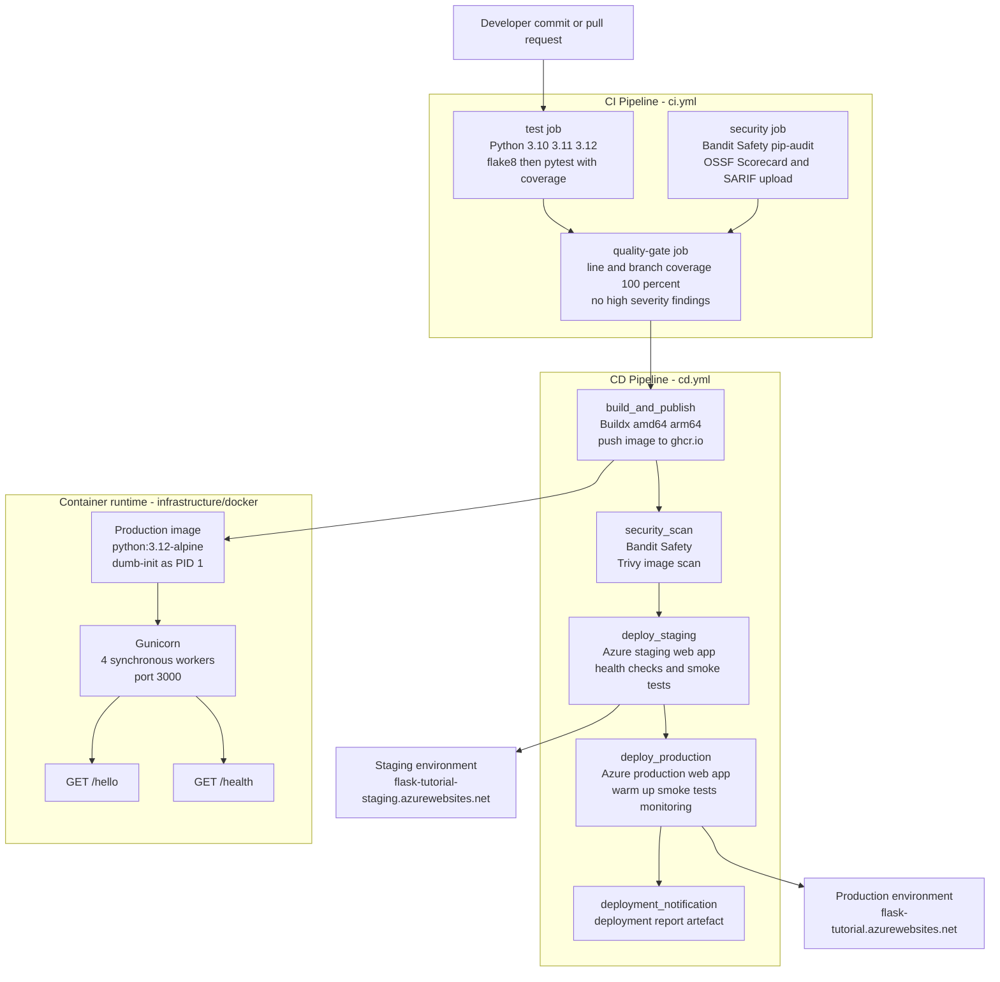
```mermaid
flowchart TD
    Dev["Developer commit or pull request"] --> CITest

    subgraph CIPipe["CI Pipeline - ci.yml"]
        CITest["test job<br/>Python 3.10 3.11 3.12<br/>flake8 then pytest with coverage"]
        CISec["security job<br/>Bandit Safety pip-audit<br/>OSSF Scorecard and SARIF upload"]
        CIGate["quality-gate job<br/>line and branch coverage 100 percent<br/>no high severity findings"]
        CITest --> CIGate
        CISec --> CIGate
    end

    subgraph CDPipe["CD Pipeline - cd.yml"]
        CDBuild["build_and_publish<br/>Buildx amd64 arm64<br/>push image to ghcr.io"]
        CDScan["security_scan<br/>Bandit Safety<br/>Trivy image scan"]
        CDStage["deploy_staging<br/>Azure staging web app<br/>health checks and smoke tests"]
        CDProd["deploy_production<br/>Azure production web app<br/>warm up smoke tests monitoring"]
        CDReport["deployment_notification<br/>deployment report artefact"]
        CDBuild --> CDScan
        CDScan --> CDStage
        CDStage --> CDProd
        CDProd --> CDReport
    end

    CIGate --> CDBuild

    subgraph Runtime["Container runtime - infrastructure/docker"]
        Image["Production image<br/>python:3.12-alpine<br/>dumb-init as PID 1"]
        Gunicorn["Gunicorn<br/>4 synchronous workers<br/>port 3000"]
        Hello["GET /hello"]
        Health["GET /health"]
        Image --> Gunicorn
        Gunicorn --> Hello
        Gunicorn --> Health
    end

    CDBuild --> Image
    CDStage --> AzureStage["Staging environment<br/>flask-tutorial-staging.azurewebsites.net"]
    CDProd --> AzureProd["Production environment<br/>flask-tutorial.azurewebsites.net"]
```

### 3.6.5 CI/CD Requirements

**CI Pipeline** (`.github/workflows/ci.yml`) runs on pushes to `main` or `develop` that touch the backend, tests or configuration files, on pull requests into `main`, on a weekly Monday 02:00 UTC schedule, and on manual dispatch, with per-ref concurrency that cancels superseded runs. Shared environment values pin `FLASK_ENV=testing`, `CI=true`, `COVERAGE_THRESHOLD=100`, unbuffered output, no bytecode, `PIP_NO_CACHE_DIR=false`, `PIP_UPGRADE_STRATEGY=eager` and forced colour (`:28-36`).

| Job | Timeout | Requirements and gates |
|---|---|---|
| `test` | 15 min | Ubuntu, matrix Python 3.12 / 3.11 / 3.10; full-history checkout; pip cache keyed by OS, Python version and both requirement hashes; installs pip, wheel, setuptools and both manifests; runs `flake8 . --config=.flake8 --statistics --count`; runs pytest with `--cov=src --cov-fail-under=100`, HTML/XML/terminal coverage, JUnit XML and self-contained HTML; uploads to Codecov with `fail_ci_if_error: false`; uploads coverage and test-result artefacts (30 days) (`:38-124`) |
| `security` | 10 min | Ubuntu, Python 3.12; installs `bandit[toml]`, `safety`, `pip-audit`; produces JSON and SARIF reports (continue-on-failure) before the gating runs `bandit -r src/ --severity-level medium`, `safety check --short-report` and `pip-audit`; runs OSSF Scorecard with published results; uploads SARIF to code scanning and security artefacts (90 days) (`:126-206`) |
| `quality-gate` | 10 min | Requires `test` and `security`; Python 3.12; downloads the coverage and security artefacts; installs `coverage[toml]` and `lxml`; writes and executes `scripts/validate_coverage.py`, which parses `../coverage/coverage.xml`, compares line-rate and branch-rate against `COVERAGE_THRESHOLD` (default 100) and exits non-zero below it; then fails on any high-severity Bandit finding or any Safety vulnerability, warning instead when a report is missing (`:208-341`) |

**CD Pipeline** (`.github/workflows/cd.yml`) runs after a successful CI run on `main`, on published releases, or on manual dispatch with `environment` (staging or production), `image_tag` and `skip_tests` inputs; concurrency is grouped per ref without cancelling in-progress deployments. Global values set `REGISTRY: ghcr.io`, an image name derived from the repository, `DOCKER_BUILDKIT=1`, `FLASK_ENV=production` and `FLASK_DEBUG=false` (`:26-89`).

| Job | Timeout | Requirements and gates |
|---|---|---|
| `build_and_publish` | 20 min | Full-history checkout; extracts the Flask version from `requirements.txt` with `3.1.1` as fallback; Python 3.12 plus Docker Buildx for `linux/amd64` and `linux/arm64`; authenticates to GHCR with `secrets.GITHUB_TOKEN`; derives branch, SHA, semver and `latest-python` tags with OCI and tutorial labels; builds the `production` target from `infrastructure/docker/Dockerfile` with `type=gha` layer caching, provenance and SBOM generation; emits image digest, tags, labels, registry URL and deployment version as outputs (`:102-256`) |
| `security_scan` | 15 min | Skipped when dispatched with `skip_tests=true`; installs Bandit and Safety, scans `src/backend/` and the dependency set, and scans the published image digest with Trivy at `CRITICAL,HIGH,MEDIUM,LOW` using `exit-code: 0`; the gate fails the pipeline on any critical Trivy finding or any Safety vulnerability and raises a warning when high findings exceed five or Bandit issues exceed three; uploads Trivy SARIF and 30-day artefacts (`:264-429`) |
| `deploy_staging` | 12 min | GitHub `staging` environment bound to `https://flask-tutorial-staging.azurewebsites.net`; deploys the image by digest with `azure/webapps-deploy@v2` using the staging publish profile; sets `FLASK_ENV`, `FLASK_DEBUG`, `PORT=8000`, `LOG_LEVEL`, `GUNICORN_WORKERS=2` and `GUNICORN_TIMEOUT=30`; waits 45 s, then polls `/hello` up to 12 times with a 15 s request timeout and 20 s spacing; runs six smoke tests covering body content, status code, content type, response time, `/health` and 404 handling (`:437-616`) |
| `deploy_production` | 18 min | Gated on a published release on `main` or a manual dispatch targeting production; validates that staging succeeded and the security scan did not fail; deploys by digest with the production publish profile into the `production` environment; sets `GUNICORN_WORKERS=4` and the keepalive/max-request values; waits 75 s, polls `/hello` up to 18 times, runs five smoke tests including a 15-request background burst, then monitors `/hello` for 6 minutes at 30 s intervals and marks `rollback_required=true` once the failure rate exceeds 20 % (`:624-884`) |
| `deployment_notification` | 5 min | Runs with `if: always()`; generates `deployment-report.md` with job statuses, the image digest, runtime, platforms, environment URLs, security counts and learning points; uploads it as a 90-day artefact (`:892-1028`) |

Required secrets and permissions: `GITHUB_TOKEN` (registry login, SARIF publication), `AZURE_WEBAPP_PUBLISH_PROFILE_STAGING` and `AZURE_WEBAPP_PUBLISH_PROFILE_PRODUCTION` (deployment). No secret value is stored in the repository.

### 3.6.6 Deployment Targets

| Environment | Target and serving model | Evidence |
|---|---|---|
| Local development | Flask development server, from `python app.py`, `flask run` or a Compose session that bind-mounts the source | `src/backend/app.py:705-750`; `README.md:169-187` |
| Container development | Dockerfile `development` target with debugpy on 5678, reload enabled, ports published 3000 and 5678 | `infrastructure/docker/Dockerfile:137-179`; `docker-compose.yml:34-174` |
| Local production rehearsal | Gunicorn serving `wsgi:application` on port 3000 with four synchronous workers | `docker-compose.yml:263`; `src/backend/README.md:190` |
| Azure staging | `flask-tutorial-staging.azurewebsites.net`, image deployed by digest, two Gunicorn workers, `PORT=8000` | `.github/workflows/cd.yml:437-490` |
| Azure production | `flask-tutorial.azurewebsites.net`, image deployed by digest, four Gunicorn workers with request recycling, `PORT=8000` | `.github/workflows/cd.yml:624-705` |
| Other documented platforms | Heroku, Azure CLI, Railway and DigitalOcean App Platform instructions, with `web: gunicorn wsgi:app` as the expected start command; the `Procfile` and `runtime.txt` those instructions require are absent from the checkout | `README.md:571-638` |

### 3.6.7 Constraints and Known Gaps

| Constraint | Detail | Evidence |
|---|---|---|
| CI install and lint paths cannot resolve as written | The install and lint steps run with `working-directory: src/backend`, but `requirements-dev.txt` and `.flake8` exist only at the repository root, so the second install command and the `--config=.flake8` argument have no file to resolve | `.github/workflows/ci.yml:74-86` |
| CI coverage target does not match the layout | `--cov=src` is resolved from `src/backend`, where no `src` package exists; the quality gate then requires 100 % coverage from the produced `coverage.xml` | `.github/workflows/ci.yml:88-94, :242-293` |
| Tested Python versions sit below the declared floor | CI tests 3.12, 3.11 and 3.10 while the package requires >= 3.12, so the declared minimum is never the version under test | `.github/workflows/ci.yml:47`; `pyproject.toml:81` |
| Three pytest configurations disagree | test paths (`src/backend/tests`, `tests`), coverage sources (`src/backend`, `src`), marker sets (18, 10, 10), required plugin floors and `minversion` (8.0 vs 7.0) differ across the root `pytest.ini`, `pyproject.toml` and `src/backend/pytest.ini`; the backend configuration also references `flask_app = src.app:create_app` and `--cov-config=.coveragerc`, neither of which exists | `pytest.ini`; `pyproject.toml:156-197`; `src/backend/pytest.ini:54, :130` |
| The image's start command names a non-existent attribute | The production CMD runs `gunicorn wsgi:app` while the module exports `application`; the Compose service overrides it with `wsgi:application`, so a plain `docker run` of the image would fail to start | `infrastructure/docker/Dockerfile:220`; `src/backend/wsgi.py:531`; `docker-compose.yml:263` |
| The production image omits a dependency its WSGI module treats as critical | The dependency stage installs the 5-package root manifest, which has no `psutil`, yet `wsgi.py` exits with status 1 when `psutil` is missing — and the same stage then verifies `import wsgi` | `infrastructure/docker/Dockerfile:71-72, :88-89, :112-116`; `requirements.txt:1-28`; `src/backend/wsgi.py:35-44` |
| The build-context ignore file is never applied | The 763-line `.dockerignore` sits in `infrastructure/docker`, while both Compose builds and the README build command use the repository root as context, and no root `.dockerignore` exists, so packaging and credential patterns in the ignore file do not filter the context | `infrastructure/docker/.dockerignore:1-20`; `docker-compose.yml:41-42, :182-183`; `README.md:524-527` |
| A documented build target does not exist | The README instructs `docker build --target production -t flask-tutorial:prod .` from the repository root, where there is no Dockerfile | `README.md:524-528`; repository file inventory |
| Port expectations diverge across artefacts | Container and Compose use 3000 (host 3001 for production), `wsgi.py` and `app.py` default to 8000, `.env.example` sets 3000, the README documents 5000, and the Azure deployment sets `PORT=8000` against an image that exposes 3000 | `infrastructure/docker/Dockerfile:120`; `docker-compose.yml:231`; `src/backend/wsgi.py:106`; `src/backend/app.py:722`; `src/backend/.env.example:38`; `README.md:163, :646`; `.github/workflows/cd.yml:486` |
| No reproducible dependency resolution | Every manifest uses `>=` and no lock or constraints file exists, so image contents vary over time; pip-tools is configured but never compiled | `pyproject.toml:445-448`; all three manifests |
| Declared tooling without configuration artefacts | pre-commit is a dependency but no `.pre-commit-config.yaml` exists; `docker-compose.yml` at the repository root (referenced by the README) and `gunicorn.conf.py` (referenced at `README.md:491`) are absent | `requirements-dev.txt:177`; repository file inventory |
| No infrastructure as code | Deployment targets, app names and URLs are literals in the workflow; there is no Terraform, Bicep or ARM template | `.github/workflows/cd.yml:444-490, :636-705` |
| Container hardening is uneven between targets | Production Compose applies read-only root filesystem, dropped capabilities and `no-new-privileges` but also sets `apparmor:unconfined`, annotated in the file as an educational simplification; the image's own `application` target runs Flask's development server rather than Gunicorn | `docker-compose.yml:289-345`; `infrastructure/docker/Dockerfile:132, :184-220` |
| Documentation describes a stack that no longer exists | `CONTRIBUTING.md`, `CODE_OF_CONDUCT.md`, the pull-request template, the feature-request form, the root `.gitignore` and the `blitzy/documentation/` set describe Node.js v22.16.0 LTS, Express.js 5.1.0, Jest 29.7.0 and npm workflows for a superseded project | `CONTRIBUTING.md:1-4, :90-91`; `CODE_OF_CONDUCT.md:2`; `.github/PULL_REQUEST_TEMPLATE.md:2-4, :124-153`; `.github/ISSUE_TEMPLATE/feature_request.md`; `.gitignore:3-5, :47-53`; `blitzy/documentation/Technical Specifications_b3815ee7-12a2-46a4-a950-4b8e72ef8030.md:9` |


## 3.7 References

No external web source was consulted; every fact in this section derives from the repository. No `.blitzyignore` file exists, so no path was excluded from inspection.

**Configuration and dependency manifests**

- `pyproject.toml` - package identity, runtime dependencies and the `dev`/`security`/`docs`/`performance` extras, PEP 518 build-system requirements, and the Black, mypy, isort, Bandit, coverage, pytest, pip-tools and quality-gate tables
- `requirements.txt` - the five-package runtime manifest and the Node.js-to-Python replacement rationale for each entry
- `requirements-dev.txt` - the 43-entry development, quality and security dependency set and the stated `>=` constraint policy
- `pytest.ini` - root pytest configuration: test paths, coverage options and 100 % gate, eighteen markers, required plugin floors, and the `--cov-config=.coveragerc` reference
- `.flake8` - the effective Flake8 configuration: 88-character limit, selected rule families, complexity ceilings, per-file ignores and integration notes
- `.gitignore` - secret-exclusion patterns alongside Node.js-era ignore rules
- `src/backend/requirements.txt` - the 41-entry backend manifest, its lower-bound "pinned" block and per-dependency justification comments
- `src/backend/pytest.ini` - backend test paths, coverage source, plugin floors, `asyncio_mode`, and the `flask_app = src.app:create_app` reference
- `src/backend/.env.example` - the seven active environment variables, validation rules, commented database/cache/authentication/API examples, and platform port presets
- `src/backend/.gitignore` - Python-oriented environment, bytecode, coverage and credential exclusions

**Application and test source**

- `src/backend/app.py` - third-party imports and import guards, logging setup, `create_app` and the three environment profiles, CORS and security-header configuration, middleware hooks, the `/hello` and `/health` handlers, error handlers, and the direct-execution defaults
- `src/backend/wsgi.py` - the `application` export, `psutil` as a critical import, environment-variable defaults and port validation, WSGI settings, signal handlers, memory telemetry, deployment guidance and graceful-shutdown placeholders
- `src/backend/tests/` (folder) - the two test modules that assert response contracts, security headers, timing, memory ceilings, concurrency and WSGI lifecycle behaviour
- `src/backend/tests/test_app.py` - in-process assertions on JSON responses, error shapes, statelessness, memory growth and the `src.app` import
- `src/backend/tests/test_wsgi.py` - Gunicorn lifecycle, benchmark, memory and load assertions, dynamic-port handling, and the `src.backend.*` imports

**Container and delivery configuration**

- `infrastructure/` (folder) - the container build, orchestration and ignore configuration
- `infrastructure/docker/Dockerfile` - the five stages on `python:3.12-alpine`, non-root user, virtual environment, health checks, Gunicorn arguments and production hardening
- `infrastructure/docker/docker-compose.yml` - the Compose `3.8` schema, the three services, resource limits and reservations, hardening options, the custom bridge network and the five named volumes
- `infrastructure/docker/.dockerignore` - the 763-line build-context exclusion policy, including the Terraform, AWS, GCP, Azure and Kubernetes patterns that have no counterpart in the repository
- `.github/workflows/ci.yml` - CI triggers, environment values, the test matrix, install and lint steps, coverage and Codecov upload, the three security scanners, OSSF Scorecard, and the quality-gate coverage and vulnerability scripts
- `.github/workflows/cd.yml` - CD triggers, GHCR build and publish with Buildx, the container security scan and gate thresholds, the staging and production Azure deployments, health and smoke checks, monitoring with the rollback trigger, and the deployment report

**Documentation and repository process material**

- `README.md` - the documented technology stack, prerequisites and versions, container build and run commands, cloud deployment instructions, environment-variable table and the root Dockerfile reference
- `src/backend/README.md` - the Python/Flask guide, Gunicorn start command, API descriptions, and the future learning paths that introduce databases, authentication and orchestration topics
- `CONTRIBUTING.md` - Node.js v22.16.0 LTS, Express.js 5.1.0, npm and Jest contribution guidance that no longer matches the delivered stack
- `CODE_OF_CONDUCT.md` - community standards still framed for the Node.js predecessor application
- `.github/PULL_REQUEST_TEMPLATE.md` - Node.js/Express and Jest checklists alongside Flask-specific review prompts
- `.github/ISSUE_TEMPLATE/bug_report.md` - Python/Flask defect reporting, environment versions and the `gunicorn wsgi:application` command
- `.github/ISSUE_TEMPLATE/feature_request.md` - Node.js/Express compatibility questions in the feature form
- `blitzy/documentation/Input Prompt.md` - the requirement set that fixes Python 3.12+/Flask 3.1.1, Gunicorn/uWSGI serving, multi-stage `python:3.12-alpine` containers, the test and security toolchain, and Azure deployment
- `blitzy/documentation/Project Guide.md` - the outstanding dependency-update, environment-configuration, security-validation and deployment tasks
- `blitzy/documentation/Technical Specifications_b3815ee7-12a2-46a4-a950-4b8e72ef8030.md` - the superseded Node.js/Express specification, and the sole source of the Auth0, MongoDB and AWS comparison entries referenced in 3.4


# 4. Process Flowchart

## 4.1 System Workflows

The delivered system is a single stateless WSGI application with exactly two registered routes — `GET /hello` and `GET /health` (`src/backend/app.py:367`, `src/backend/app.py:426`) — so its operational workflows reduce to three families: the **request lifecycle** that every HTTP call traverses, the **process lifecycle** that starts, monitors, and stops a serving instance, and the **delivery pipeline** that builds and promotes the image. Every step below is grounded in the delivered source; where the source and the documentation disagree, both are reported.

The system holds no database, cache, session store, queue, or background worker. `src/backend/app.py` and `src/backend/wsgi.py` import only Flask, Flask-CORS, python-dotenv, psutil, and the Python standard library, and neither module performs an outbound network call. Consequently there is no asynchronous event flow, no batch sequence, and no cross-system data replication in the runtime path; the commented database, JWT, external-API, Redis, and Celery blocks in `src/backend/.env.example:172-194` are explicit future-scope placeholders rather than wired integrations.

### 4.1.1 Core Business Processes

| Process | Trigger | Actor | Terminal states | Evidence |
|---|---|---|---|---|
| Application bootstrap | Process start (`create_app` call) | WSGI server, developer, or test harness | Configured app returned, or `RuntimeError` raised | `src/backend/app.py:63-141` |
| Greeting request | `GET /hello` | External HTTP client | `200` JSON greeting | `src/backend/app.py:367-424` |
| Health probe | `GET /health`, or the container health check's `curl` to `/hello` | Orchestrator, load balancer, test harness | `200` healthy payload, or `503` unhealthy payload | `src/backend/app.py:426-463`, `infrastructure/docker/Dockerfile:124-125` |
| Route rejection | Any request to an unregistered path | External HTTP client | `404` JSON body | `src/backend/app.py:479-516` |
| Method rejection | Registered path with a method other than `GET` | External HTTP client | `405` JSON body plus `Allow` header | `src/backend/app.py:518-554` |
| Failure containment | Exception inside a request | Any request | `500` JSON body, or `503` for `/health` | `src/backend/app.py:412-424`, `:454-463`, `:556-632` |
| Graceful shutdown | `SIGTERM`, `SIGINT`, `SIGUSR1`, `SIGUSR2`, or an uncaught exception | Container runtime, operator, interpreter | Exit code `0` within 10 s | `src/backend/wsgi.py:192-296`, `src/backend/wsgi.py:432-474` |
| Continuous delivery | Push, pull request, schedule, release, or manual dispatch | CI/CD pipelines | Published image digest and Azure deployment | `.github/workflows/ci.yml`, `.github/workflows/cd.yml` |

#### End-to-End Journey A — Greeting request

1. **Reach the listener.** The client targets the port the serving process bound: `3000` inside the development and production containers (`infrastructure/docker/Dockerfile:120`, `:132`), host port `3001` mapped to container `3000` in the production Compose service (`infrastructure/docker/docker-compose.yml:230-231`), or `0.0.0.0:8000` in the WSGI entry point's own fallback when no `PORT`/`HOST` is supplied (`src/backend/wsgi.py:105-106`).
2. **Dispatch to the WSGI callable.** Gunicorn resolves the module attribute named on its command line and calls it per request. Compose uses `wsgi:application` (`infrastructure/docker/docker-compose.yml:263`), matching the module-level `application` exported at `src/backend/wsgi.py:523`; the Dockerfile production command instead names `wsgi:app` (`infrastructure/docker/Dockerfile:220`), an attribute the module never defines — the conflict is recorded in 4.3.2.
3. **Enter the Flask request context and run preprocessing.** `before_request_middleware` (`src/backend/app.py:299-324`) records `request.start_time`, emits the `📥 Incoming request: GET /hello` log line, and assigns the correlation identifier `request.id = f"req_{int(time.time() * 1000)}"`. For `GET` calls the content-type check is not entered, because it is gated on `request.method in ['POST', 'PUT']` with a body (`src/backend/app.py:319`). The hook returns `None`, which continues processing rather than short-circuiting.
4. **Match the route.** Werkzeug's routing table matches `/hello` and confirms `GET` is permitted (`methods=['GET']`, `src/backend/app.py:367`). A miss diverts to the `404` handler and a method mismatch to the `405` handler (Journey D).
5. **Execute the handler.** `hello_route_handler` (`src/backend/app.py:381-410`) logs `🌍 Processing GET /hello request`, builds `{'message': 'Hello world', 'timestamp': datetime.now().isoformat(), 'status': 'success'}`, calls `jsonify()`, sets `status_code = 200`, and appends `Content-Type: application/json` and `X-API-Version: 1.0`. The handler wraps its whole body in `try`/`except` and returns its own `500` payload if anything raises (Journey E).
6. **Post-process the response.** Flask invokes `after_request` handlers in reverse order of registration, so `after_request_middleware` (`src/backend/app.py:326-352`) runs before `add_security_headers` (`src/backend/app.py:223-253`). The lifecycle hook computes the elapsed time, writes `X-Response-Time: <float>ms`, writes `X-Request-ID`, and logs `📤 Request completed: GET /hello - 200 - <float>ms`. The security hook then removes `Server` and sets the six hardening headers.
7. **Serialize and return.** The WSGI server writes the status line, headers, and JSON body.

The observable contract of this journey is fixed and asserted by `src/backend/tests/test_app.py:111-189`:

| Element | Value | Evidence |
|---|---|---|
| Status | `200` | `src/backend/app.py:400` |
| Body keys | `message`, `timestamp`, `status` | `src/backend/app.py:391-395` |
| `message` | literal `Hello world` | `src/backend/app.py:387` |
| `timestamp` | ISO-8601 from `datetime.now()` | `src/backend/app.py:393` |
| `status` | literal `success` | `src/backend/app.py:394` |
| `Content-Type` | `application/json` | `src/backend/app.py:403` |
| `X-API-Version` | `1.0` | `src/backend/app.py:404` |
| `X-Response-Time` | decimal milliseconds suffixed `ms` | `src/backend/app.py:342` |
| `X-Request-ID` | `req_<epoch milliseconds>` | `src/backend/app.py:316`, `:350` |
| `Server`, `X-Powered-By` | absent | `src/backend/app.py:237` |
| Session cookie | never set | asserted at `src/backend/tests/test_app.py:507-519` |

#### End-to-End Journey B — Health probe and readiness determination

The health path is the only workflow with an orchestrator as the primary actor, and two distinct probes exist:

- **Liveness / container health check.** Docker and Compose both probe `GET /hello` with `curl -f` and treat any non-2xx response as unhealthy (`infrastructure/docker/Dockerfile:124-125`, `:174-175`, `:209-210`; `infrastructure/docker/docker-compose.yml:131-139`, `:268-276`). Readiness therefore depends on the greeting endpoint, not on the health endpoint.
- **Application health endpoint.** `GET /health` (`src/backend/app.py:426-463`) returns `status`, `timestamp`, `uptime`, `version`, `environment`, and `debug`, always as JSON.

`wsgi.py` and the WSGI integration tests poll `/health` until it answers `200` (`src/backend/tests/test_wsgi.py:405-420`, `:1327-1354`), and the CD pipeline polls `/hello` after each deployment (`.github/workflows/cd.yml`, staging and production deploy jobs). The `/health` handler wraps payload construction in `try`/`except` and returns `503` with `{'status': 'unhealthy', 'error': <message>, 'timestamp': ...}` on failure (`src/backend/app.py:454-463`), so a probe always receives a decision rather than a dropped connection.

Two properties of this payload are worth recording precisely because they are read as operational signals. First, `uptime` is `time.time()` — an absolute POSIX epoch value, not an elapsed-since-start duration (`src/backend/app.py:440`) — so a probe cannot derive process age from it. Second, `version` is the literal string `1.0.0` (`src/backend/app.py:441`), which matches `pyproject.toml`'s package version but not the `tutorial.version=2.0.0` label on both Compose services (`infrastructure/docker/docker-compose.yml:145`, `:305`).

#### End-to-End Journey C — Application bootstrap

`create_app(config_name='production')` composes the application in a fixed order, and the ordering matters because hooks, routes, and handlers must all be registered before the instance is returned (`src/backend/app.py:85-124`; cross-referenced as F-001 in 2.2):

| Step | Call | Effect |
|---|---|---|
| 1 | `Flask(__name__)` | Application instance created |
| 2 | `configure_flask_settings(app, config_name)` | Base configuration merged with the `production`, `development`, or `testing` profile, with `FLASK_ENV` and `FLASK_DEBUG` taking precedence |
| 3 | `configure_security_settings(app)` | Registers the `after_request` security-header hook |
| 4 | `configure_cors_middleware(app)` | Installs Flask-CORS with the fixed origin/method/header allow-list |
| 5 | `register_middleware_hooks(app)` | Registers `before_request` and `after_request` lifecycle hooks |
| 6 | `register_route_handlers(app)` | Registers `/hello` and `/health` |
| 7 | `register_error_handlers(app)` | Registers `404`, `405`, `500`, and `Exception` handlers |

Any exception across those steps is logged with its type, message, and troubleshooting guidance and re-raised as `RuntimeError("Flask application factory failed: …")` (`src/backend/app.py:126-141`), so a partially configured application never becomes reachable.

The WSGI entry point layers a second bootstrap on top: `create_wsgi_application()` reads `FLASK_ENV` (default `production`), `HOST` (default `0.0.0.0`), and `PORT` (default `8000`, passed through `validate_port_number`), calls `create_app`, then applies the WSGI settings — including `PROPAGATE_EXCEPTIONS: True`, `PREFERRED_URL_SCHEME: 'https'`, `SERVER_NAME: None`, and, for production, `SEND_FILE_MAX_AGE_DEFAULT: 31536000` (`src/backend/wsgi.py:78-189`). Failures here become `RuntimeError("WSGI application initialization failed: …")` (`src/backend/wsgi.py:144`), which prevents a server from binding against a broken application.

Environment loading happens at import time, before either factory runs: `load_dotenv()` is called at module scope in both modules (`src/backend/app.py:52`, `src/backend/wsgi.py:58`). The practical consequence is that a copied `.env.example` — whose active values are `PORT=3000` and `HOST=localhost` (`src/backend/.env.example:38`, `:52`) — overrides the WSGI fallbacks of `8000` and `0.0.0.0`.

#### End-to-End Journey D — Rejected requests

| Decision at routing | Handler | Response | Evidence |
|---|---|---|---|
| No route matches the path | `not_found_handler` | `404`, JSON `{status: 404, error: 'Not Found', message, path, method, timestamp}`; warning logged with method and path | `src/backend/app.py:479-516` |
| Route matches, method not permitted (for example `POST /hello`) | `method_not_allowed_handler` | `405`, JSON `{status: 405, error: 'Method Not Allowed', message, path, method, allowed_methods, timestamp}`, plus `Allow` built from the framework error's `valid_methods` | `src/backend/app.py:518-554` |

Because both registered routes declare `methods=['GET']`, every non-`GET` method on `/hello` or `/health` lands in the `405` handler, and the `Allow` header lists only `GET` (`src/backend/tests/test_app.py:289-293`). `OPTIONS` is not in either route's method list, yet the CORS preflight test asserts a `200` for `OPTIONS /hello` with an `Origin` header (`src/backend/tests/test_app.py:391-398`), which is the Flask-CORS extension answering the preflight before routing rejects it.

#### End-to-End Journey E — Failure containment

Three layers contain failure, and they produce two different `500` payload shapes:

| Layer | Trigger | Produces | Evidence |
|---|---|---|---|
| Route handler | Exception inside `hello_route_handler` or `health_check_handler` | `/hello`: `500` with `{status: 'error', message: 'Internal server error in hello endpoint', timestamp}`. `/health`: `503` with `{status: 'unhealthy', error, timestamp}` | `src/backend/app.py:412-424`, `:454-463` |
| Registered `500` handler | An error Flask routes to the `500` handler | `500` with `{status: 500, error: 'Internal Server Error', message, timestamp, request_id}`; logs type, message, path, method, and (only when `DEBUG`) the traceback via `exc_info=True` | `src/backend/app.py:556-600` |
| Catch-all `Exception` handler | Any otherwise unhandled exception | `500` with `{status: 500, error: 'Unexpected Error', message, timestamp}` — no `request_id` field | `src/backend/app.py:602-632` |

Because the catch-all handler is registered on `Exception`, framework-level and application-level exceptions alike are converted to JSON, and the client never receives an HTML error page or a stack trace. The `request_id` that the `500` handler echoes comes from the `before_request` hook via `getattr(request, 'id', 'unknown')` (`src/backend/app.py:591`), which is why correlation survives into the error path.

Outside the request cycle, a second containment layer sits in `wsgi.py`: a replacement `sys.excepthook` logs the exception type and message, prints the traceback only when `FLASK_ENV=development`, delegates `KeyboardInterrupt` to the default handler so interactive interruption still works, and otherwise initiates the graceful-shutdown sequence (`src/backend/wsgi.py:432-474`).

#### Decision points inventory

| Decision point | Condition | `True` branch | `False` branch | Evidence |
|---|---|---|---|---|
| Environment profile | `config_name`/`FLASK_ENV` value | One of three configuration dictionaries is merged | Base configuration only | `src/backend/app.py:169-207` |
| Debug mode | `os.getenv('FLASK_DEBUG', 'false').lower() == 'true'` | Development profile enables `DEBUG` | `DEBUG` stays `False` | `src/backend/app.py:156`, `:185` |
| Factory succeeded | Exception raised during composition | Log and raise `RuntimeError` | Return the app | `src/backend/app.py:126-141` |
| Route matched | Werkzeug routing table lookup | Handler executes | `404` handler | `src/backend/app.py:479-516` |
| Method permitted | Route's declared `methods` | Handler executes | `405` handler plus `Allow` | `src/backend/app.py:518-554` |
| Body is JSON | `method in ['POST','PUT']` **and** `request.content_length` **and** not JSON | Warning logged; request still proceeds | No log | `src/backend/app.py:319-321` |
| Handler raised | Inside the route handler's `try` | Handler-local error payload | Normal payload | `src/backend/app.py:412`, `:454` |
| Log traceback | `app.config.get('DEBUG')` | `exc_info=True` | Type and message only | `src/backend/app.py:581-582` |
| Origin permitted | Flask-CORS allow-list match | `Access-Control-Allow-*` headers added | No permissive CORS headers | `src/backend/app.py:270-276` |
| Port valid | `1 <= int(PORT) <= 65535` | Bind proceeds | `ValueError` aborts startup | `src/backend/wsgi.py:313-331` |
| Port privileged | `int(PORT) < 1024` | Warning logged | No warning | `src/backend/wsgi.py:321-323` |
| Memory within target | `rss_mb > 75` | Warning logged | Info line logged | `src/backend/wsgi.py:362-366` |
| Exported server mode | `__name__ == "__main__"` | Direct execution path: excepthook, signals, optional dev server | Imported-server path: signals then `application` | `src/backend/wsgi.py:479-527` |
| Development server start | `FLASK_ENV == 'development'` in direct execution | `application.run(...)` starts Flask | Guidance logged, process exits without serving | `src/backend/wsgi.py:495-513` |

#### User touchpoints

The system has no interactive UI and no authenticated surface. The complete set of touchpoints is: the two JSON endpoints, the CORS allow-list that decides which browser origins may read them, the `X-Request-ID` and `X-Response-Time` headers that give a caller correlation and latency feedback, the six security headers that constrain how a browser may embed or frame a response, and the two README files that document the contract. `src/backend/README.md:282` states that `/hello` requires no authentication, and no authentication, authorisation, or identity code exists in `src/backend/app.py` or `src/backend/wsgi.py`.

### 4.1.2 Integration Workflows

| Integration | Direction | Protocol / mechanism | Data exchanged | Evidence |
|---|---|---|---|---|
| Client ↔ service | Synchronous request/response | HTTP over WSGI | `GET` request; JSON body plus headers | `src/backend/app.py:367-463` |
| Orchestrator → service | Poll | `curl -f` on `/hello`; `requests.get` on `/health` | HTTP status only | `infrastructure/docker/Dockerfile:124`, `src/backend/tests/test_wsgi.py:1327-1354` |
| Runtime → service | Push at start, then signal | Environment variables; then `SIGTERM`/`SIGINT` | `FLASK_ENV`, `FLASK_DEBUG`, `PORT`, `HOST`, `LOG_LEVEL`, `SECRET_KEY`, Gunicorn settings | `infrastructure/docker/docker-compose.yml:55-82`, `:196-227`; `src/backend/wsgi.py:239-246` |
| WSGI server ↔ service | In-process call | Python import of the `application` attribute | WSGI `environ` in, status/headers/body out | `src/backend/wsgi.py:515-530` |
| Service ↔ dotenv file | Read once at import | `load_dotenv()` | All documented variables | `src/backend/app.py:52`, `src/backend/wsgi.py:58` |
| Service → monitoring | Push to log stream | Python `logging` to stdout/stderr | Lifecycle, request, error, signal, and memory lines | `src/backend/wsgi.py:62-69`, `src/backend/app.py:56-60` |
| Service → OS | Pull | `psutil` process metrics | RSS, VMS, memory percentage, PID | `src/backend/wsgi.py:342-358` |
| Browser → service | Preflight then simple request | CORS via Flask-CORS | `Origin`, `Access-Control-Request-Method`, `Access-Control-Request-Headers` | `src/backend/app.py:259-288`; `src/backend/tests/test_app.py:381-398` |
| GitHub Actions → registry → Azure | Pipeline | Buildx build and push, then `azure/webapps-deploy` | Image digest, tags, OCI labels, app settings | `.github/workflows/cd.yml:102-256`, `:437-490`, `:624-705` |

#### API interactions

Only two API operations exist, both idempotent and read-only, and neither consumes request input:

| Operation | Inputs consumed | Outputs | Side effects |
|---|---|---|---|
| `GET /hello` | None. No query string, body, or header is read; the handler has no parameters | `200` JSON greeting with `X-API-Version`, `X-Response-Time`, `X-Request-ID` | Two log lines per request; one mutated attribute on the request object |
| `GET /health` | None | `200` JSON health payload with `Cache-Control: no-cache, no-store, must-revalidate` | One log line on success, one on failure |

No API-versioning scheme beyond the static `X-API-Version: 1.0` response header exists, no content negotiation is implemented, and no pagination, filtering, or request-body schema is present.

#### Data flow between systems

The runtime data flow is entirely in-memory and per-request. Configuration flows inward from the environment and the optional `.env` file into `app.config`; the greeting flows outward from a constant literal plus a clock read; the health payload is assembled from `app.config` values and a clock read. Nothing is written to disk, no message is published, and no remote service is called. Persistence in the deployment sense exists only as: container logs on stdout/stderr, the Compose cache volumes (`venv_cache_dev`, `pip_cache_dev`, `venv_cache_prod`, `pip_cache_prod`) that hold installed packages, and the `flask_shared_data` volume bound to `${PWD}/data` (`infrastructure/docker/docker-compose.yml:401-441`), which no code path in `src/backend/` reads or writes.

#### Event processing flows

None exist in the runtime. There is no message broker, no producer or consumer, no scheduled job, and no webhook receiver in `src/backend/`; the `CELERY_BROKER_URL` and `REDIS_URL` entries in `src/backend/.env.example:190-194` are commented out and no task module exists. The nearest behaviours to event processing are infrastructure-level: Gunicorn recycles workers after 1,000 requests with a jitter of 100 (`infrastructure/docker/Dockerfile:216`), and the container runtime restarts services according to `restart: unless-stopped` (development) or `restart: always` with a bounded restart policy (production) (`infrastructure/docker/docker-compose.yml:112`, `:252`, `:295-299`).

#### Batch processing sequences

No batch job, cron, or queue-drain sequence runs inside the service. Two batch-style sequences exist outside it and are documented here because they gate the runtime:

- **Compose startup ordering.** `flask-network-setup` joins and reports the bridge network, sleeps two seconds, then the two application services start, because both declare `depends_on: flask-network-setup` (`infrastructure/docker/docker-compose.yml:166-167`, `:337-339`, `:346-356`). The development service additionally installs `requirements-dev.txt` before starting the server (`:121-126`).
- **CI/CD gating.** The `test` job (Python 3.12/3.11/3.10 matrix, lint then pytest with coverage) and the `security` job (Bandit, Safety, pip-audit, OSSF Scorecard) both feed the `quality-gate` job, which parses `coverage.xml` and the security reports and fails the pipeline (`*.github/workflows/ci.yml:39-341*`). CD then builds and pushes the image, scans it with Bandit, Safety, and Trivy, deploys to Azure staging, and only then promotes to production (`.github/workflows/cd.yml:102-884`).


## 4.2 Flowchart Requirements

This sub-section fixes the notation every diagram in 4.4 uses, states the validation gates that must appear inside the flows, and records the timing budgets the flows are required to respect.

### 4.2.1 Flowchart Elements, Boundaries, and Touchpoints

Each diagram in 4.4 is required to carry the following elements, rendered with the stated notation so the flows can be read consistently across the section:

| Required element | Notation | Meaning in this system |
|---|---|---|
| Start point | Rounded or stadium node, labelled `Start` or the triggering actor | The HTTP request arriving at the listener, the process being created, or a pipeline being triggered |
| End point | Rounded or stadium node, labelled `End` | A response written to the client, a process exit with a status code, or a deployed artefact |
| Process step | Rectangular node, one verb phrase | A distinct call, hook, handler body, shell command, or pipeline step |
| Decision point | Diamond node ending in `?` with exactly two labelled exits | A boolean or two-way branch taken from the decision-point inventory in 4.1.1 |
| System boundary | Mermaid `subgraph` with a label naming the actor, process, or tier | The swim lanes: client, container runtime, WSGI server, Flask application, Python module/configuration, pipeline |
| User touchpoint | Rectangle annotated `[touchpoint]` | Response payload and headers returned to the caller; the container health probe's result |
| Error state | Rectangle with the failing status code or exception class in the label | `404`, `405`, `500`, `503`, `ValueError`, `RuntimeError`, uncaught exception, non-zero exit |
| Recovery path | Dotted or explicitly labelled return edge | Handler-local fallback payload, catch-all handler conversion, graceful shutdown, container restart, pipeline rollback |
| Timing annotation | Edge label carrying the constraint | Readiness poll window, worker timeout, health-check interval, response-time budget |

**System boundaries in scope.** The flows cross six observable boundaries, and each boundary is a place where the flow can terminate abnormally:

| Boundary | What it separates | Crossing mechanism | Failure mode at the boundary |
|---|---|---|---|
| HTTP / network | External client from the listening socket | TCP to container `3000` (host `3001` in production Compose), or `8000` by default in the WSGI entry point | Connection refused; request never reaches Flask |
| Container | Host from containerised process | `EXPOSE 3000`, port mapping, Compose service definition | Port collision; container starts but is unreachable |
| Init / process | Container runtime from the serving processes | `dumb-init` as PID 1 forwarding signals to Gunicorn (`infrastructure/docker/Dockerfile:132`, `:179`, `:220`) | Signal not delivered; shutdown hangs |
| WSGI server | Gunicorn master and workers from the Flask application | Import of the module-level `application` attribute (`src/backend/wsgi.py:523`) | Missing attribute (`wsgi:app`) or missing dependency (`psutil`) prevents binding |
| Flask application | Routing and hooks from handler logic | Request context, `before_request`/`after_request` hooks, `@app.errorhandler` decorators | Unhandled exception escaping to the catch-all handler |
| Python module / configuration | Module import `app.py`/`wsgi.py` from `app.config` | `load_dotenv()`, `os.getenv`, `configure_flask_settings` | Invalid `PORT` raises `ValueError`; missing import exits with status `1` |

**User touchpoints.** The service exposes no HTML surface, so the diagrams mark only these touchpoints: the JSON body and header set of `/hello`; the JSON body of `/health`; the `Allow` header on a `405`; the six security headers and the absence of `Server` on every response; the preflight response to a permitted `Origin`; and the container health-probe verdict derived from `/hello`.

**Error states and recovery paths that every applicable diagram must show.** Route-level failure recovers to a handler-local `500` payload (`src/backend/app.py:412-424`); framework-level failure recovers through the registered `500` and catch-all `Exception` handlers (`src/backend/app.py:556-632`); health-handler failure recovers to `503` rather than propagating (`src/backend/app.py:454-463`); startup failure recovers to a raised `RuntimeError` that prevents binding (`src/backend/wsgi.py:144`); signal-triggered termination recovers through `perform_graceful_shutdown` (`src/backend/wsgi.py:258-296`); and container-level failure recovers through the restart and rollback policies (`infrastructure/docker/docker-compose.yml:252`, `:290-299`).

### 4.2.2 Validation Rules

**Business rules at each step.** Every gate below is enforced by delivered code, and each is asserted by at least one test or verified by a pipeline gate.

| Workflow step | Business rule enforced | Enforcing code | Verified by |
|---|---|---|---|
| Environment selection | Profile name is matched against `production`, `development`, `testing`; an unrecognised name applies the base configuration only | `src/backend/app.py:169-207` | `src/backend/tests/test_app.py:83-102` |
| Debug resolution | `FLASK_DEBUG` enables debug only when the lower-cased value equals `true`; `True`, `TRUE`, and `1` do not enable it | `src/backend/app.py:156` | — (recorded observed behaviour) |
| Composition | A failure in any of the six composition steps must not yield a reachable application | `src/backend/app.py:126-141` | `src/backend/tests/test_app.py:65-81` |
| Request preprocessing | A request identifier is attached before handlers run, so error handlers can reference it | `src/backend/app.py:316`, `:591` | `src/backend/tests/test_app.py:562-574` |
| Body type advisory | A `POST`/`PUT` with a declared body that is not JSON is logged as a warning; the request is **not** rejected | `src/backend/app.py:319-321` | — (no rejection path exists) |
| Routing | Only `/hello` and `/health` are registered, and only `GET` is permitted on each | `src/backend/app.py:367`, `:426` | `src/backend/tests/test_app.py:217-228`, `:267-293` |
| Greeting contract | The message is the literal `Hello world`, the timestamp is ISO-8601, and `status` is `success` | `src/backend/app.py:387-395` | `src/backend/tests/test_app.py:127-141` |
| Health contract | `status` is `healthy` on success and `unhealthy` with `503` on internal failure; caching is disabled on success | `src/backend/app.py:437-463` | `src/backend/tests/test_app.py:191-215` |
| Error contract | Every error path returns JSON with `status`, `error`, a `message`, and a `timestamp`; `500` responses expose no stack trace | `src/backend/app.py:501-508`, `:535-543`, `:586-592`, `:623-628` | `src/backend/tests/test_app.py:237-340`, `src/backend/tests/test_wsgi.py:660-700` |
| Traceback visibility | Full tracebacks are logged only when `DEBUG` is enabled in the app, and only when `FLASK_ENV=development` in the WSGI exception hook | `src/backend/app.py:581-582`, `src/backend/wsgi.py:462-463` | — |
| Port range | `1 <= PORT <= 65535`; anything else raises `ValueError` and aborts startup; ports below `1024` are accepted with a privileged-range warning | `src/backend/wsgi.py:313-331` | `src/backend/tests/test_wsgi.py:530-596` |
| Host binding | `HOST` defaults to `0.0.0.0` for the WSGI entry point and to `localhost` in direct execution | `src/backend/wsgi.py:105`, `:502` | `src/backend/tests/test_wsgi.py:1062-1115` |

**Data validation requirements.** The service validates three inputs and consumes nothing else. `PORT` is parsed with `int()` and range-checked (`src/backend/wsgi.py:314-318`). `FLASK_DEBUG` is compared after lower-casing and no other coercion is applied (`src/backend/app.py:156`). The `Origin` header is compared against the two-entry allow-list `http://localhost:3000` and `http://localhost:8000`, and the permitted methods and headers are matched against declared lists (`src/backend/app.py:270-276`). No request body, query parameter, path parameter, or JSON schema is validated anywhere, and `jsonschema` — present in the development toolchain — is not used by the runtime.

Two documented validation rules disagree with the code and both must be shown in the diagrams as *documented* rather than *enforced*: `src/backend/.env.example:237-240` states the port must be between `1024` and `65535`, while `validate_port_number` accepts `1`; and `src/backend/.env.example:26` labels the port's default as `3000` while the WSGI entry point defaults to `8000`.

**Authorization checkpoints.** There are none. No authentication, authorisation, token validation, API-key check, session establishment, tenant check, or IP allow-list exists in `src/backend/app.py` or `src/backend/wsgi.py`, and `src/backend/README.md:282` documents `/hello` as requiring no authentication. The only access-control mechanism in the delivered system is the CORS origin allow-list, which constrains browser reads rather than authorising requests — any HTTP client that reaches the socket receives a `200`, and `supports_credentials=False` means no credentialed cross-origin access is offered. Session management is configured but unused: the production profile sets secure, HTTP-only, `Samesite=Lax` session cookies and a one-hour session lifetime (`src/backend/app.py:175-178`), while the statelessness tests assert that no session cookie is ever set (`src/backend/tests/test_app.py:507-519`). Consequently no diagram may show an authorisation diamond.

**Regulatory compliance checks.** The service processes no personal, financial, or health data and persists nothing, so it exposes no regulated data store and no data-subject workflow. The compliance-relevant controls that *are* implemented, and therefore belong in the diagrams as checkpoints, are: minimisation of information disclosure — the `Server` header is removed and no stack trace, module path, or configuration value appears in a client-visible error body (`src/backend/app.py:237`, `:586-592`); a fixed CSP of `default-src 'self'` plus `X-Frame-Options: DENY` (`src/backend/app.py:242`, `:245`); an explicit non-caching directive on health responses, because a stale `healthy` verdict defeats a liveness probe (`src/backend/app.py:449`); secret hygiene, enforced by documentation rather than code — `.env.example` carries only a placeholder secret and warns against committing `.env`, enabling debug in production, and reusing the example key (`src/backend/.env.example:14-15`, `:95`, `:162`); and supply-chain evidence, produced by the Bandit/Safety/pip-audit/Trivy scans and their SARIF and artefact uploads (`.github/workflows/ci.yml:126-206`, `.github/workflows/cd.yml:264-429`).

**Verification is itself a validation layer, and it does not currently execute.** The two pytest modules encode the contract as executable assertions, and `src/backend/pytest.ini:15-24` turns coverage into a hard gate with `--cov-branch --cov-fail-under=100` plus a 300-second thread timeout. As delivered, however, `src/backend/tests/test_app.py:53-56` imports `from src.app import create_app, create_testing_app`, a module path that does not exist in this layout, so the module calls `pytest.skip(..., allow_module_level=True)` at collection instead of executing; the WSGI module uses the correct `src.backend.wsgi:application` target and does launch real Gunicorn subprocesses (`src/backend/tests/test_wsgi.py:390`, `:481`, `:557`, `:886`, `:1157`). The three pytest configurations also disagree on test paths, coverage sources, and marker sets, so which gate is applied depends on which file pytest resolves. Any diagram that shows the quality gate must therefore show it as gating the pipeline while the in-process assertion set may be skipped.

### 4.2.3 Timing Constraints and SLA Considerations

The timing budgets below are asserted by tests or enforced by configuration; the value in the "Source of truth" column determines whether the constraint can fail a build.

| Constraint | Budget | Enforced by | Source of truth |
|---|---|---|---|
| Cold start | < 100 ms | `performance_baseline` threshold `cold_start_ms` | `src/backend/tests/test_wsgi.py:308` |
| Warm `/hello` response, in process | < 50 ms | Assertion on measured time and on the `X-Response-Time` header | `src/backend/tests/test_app.py:184`, `:189` |
| Warm `/hello` response, over the network | Mean < 50 ms | Benchmark mean across 10 iterations × 3 rounds | `src/backend/tests/test_app.py:457-473`; `src/backend/tests/test_wsgi.py:707-787` |
| Concurrent mean response | < 50 ms | 50 in-process requests over 10 threads; 100 requests against Gunicorn | `src/backend/tests/test_app.py:454`; `src/backend/tests/test_wsgi.py:960` |
| Concurrent peak response | < 100 ms | Assertion on the maximum observed in-process response time | `src/backend/tests/test_app.py:455` |
| Load-test success rate | ≥ 95 % | 10 s sustained run at 10 req/s; 100 concurrent requests | `src/backend/tests/test_wsgi.py:1258`, `:954` |
| End-to-end lifecycle, all four phases | < 60 s | Sum of startup, validation, load, and shutdown durations | `src/backend/tests/test_wsgi.py:1309` |
| Graceful shutdown after `SIGTERM` | Exit code `0` within 10 s, port unreachable afterwards | Subprocess wait with timeout, then an unreachability probe | `src/backend/tests/test_wsgi.py:506-515` |
| Server readiness after start | 10 s in the lifecycle test, 15 s in the end-to-end test, 30 s for the helper | Sequential `/health` polls at 1 s or 0.5 s intervals | `src/backend/tests/test_wsgi.py:406`, `:1168`, `:1327` |
| Resident memory | < 75 MB, with growth < 5 MB per in-process test, < 10 MB per WSGI module, < 20 MB across 50 requests | `psutil` RSS assertions and a warning above 75 MB in `wsgi.py` | `src/backend/tests/test_app.py:426-427`; `src/backend/tests/test_wsgi.py:188-189`, `:788-864`; `src/backend/wsgi.py:362-366` |
| Whole-suite timeout | 300 s, thread method | pytest-timeout configuration | `src/backend/pytest.ini:62-63` |
| Gunicorn worker timeout | 30 s | `--timeout=30` in both the Dockerfile and Compose production commands | `infrastructure/docker/Dockerfile:216`, `:220`; `infrastructure/docker/docker-compose.yml:263` |
| Gunicorn keep-alive | 2 s | `--keepalive=2` | `infrastructure/docker/Dockerfile:216` |
| Worker recycling | 1,000 requests with jitter 100 | `--max-requests` / `--max-requests-jitter` | `infrastructure/docker/Dockerfile:216` |
| Worker connections | 1,000 | `--worker-connections=1000` | `infrastructure/docker/Dockerfile:216` |
| Container health check, application stage | 30 s interval, 10 s timeout, 10 s start period, 3 retries | Dockerfile `HEALTHCHECK` | `infrastructure/docker/Dockerfile:124-125` |
| Container health check, development stage | 15 s interval, 5 s timeout, 5 s start period, 2 retries | Dockerfile `HEALTHCHECK` | `infrastructure/docker/Dockerfile:174-175` |
| Container health check, production stage | 30 s interval, 10 s timeout, 15 s start period, 3 retries | Dockerfile `HEALTHCHECK` | `infrastructure/docker/Dockerfile:209-210` |
| Compose health check, development | 15 s interval, 5 s timeout, 3 retries, 10 s start period | Compose `healthcheck` | `infrastructure/docker/docker-compose.yml:136-139` |
| Compose health check, production | 30 s interval, 10 s timeout, 3 retries, 15 s start period | Compose `healthcheck` | `infrastructure/docker/docker-compose.yml:273-276` |
| Restart policy, production | 5 s delay, 3 attempts, 120 s window, condition `any` | Compose `restart_policy` | `infrastructure/docker/docker-compose.yml:295-299` |
| Rolling update | One replica at a time, 10 s delay, monitor 60 s, rollback on failure | Compose `update_config` | `infrastructure/docker/docker-compose.yml:290-294` |
| Deployment readiness probe, staging | 45 s initial wait, up to 12 polls, 15 s request timeout, 20 s spacing | CD `deploy_staging` job | `.github/workflows/cd.yml:437-616` |
| Deployment readiness probe, production | 75 s initial wait, up to 18 polls, then 6 minutes of monitoring at 30 s intervals | CD `deploy_production` job | `.github/workflows/cd.yml:624-884` |
| Rollback trigger | Failure rate above 20 % during the post-deployment monitor | CD `deploy_production` job | `.github/workflows/cd.yml:624-884` |
| Pipeline job ceilings | Test 15 min, security 10 min, quality gate 10 min, build 20 min, image scan 15 min, staging 12 min, production 18 min, notification 5 min | GitHub Actions `timeout-minutes` | `.github/workflows/ci.yml`, `.github/workflows/cd.yml` |

Two documented startup figures exist and neither is machine-enforced: the repository README targets "Startup Time: < 5 seconds for Flask development server" and `src/backend/.env.example:276-280` budgets only "< 0.2 seconds for environment variable processing". Neither appears in a test assertion, so both belong in the diagrams as advisory annotations.

**SLA-relevant behaviour that no budget covers.** The `500` and `503` error paths are required to complete quickly enough that a client receives a status rather than a reset, but no numeric assertion exists for them; the container health probe targets `/hello` rather than `/health`, so a failure isolated to the health handler would leave the container reported healthy; and the production Compose service reserves 75 MB of memory against a 128 MB limit (`infrastructure/docker/docker-compose.yml:282-286`), which aligns the orchestration reservation with the 75 MB test threshold but leaves only 53 MB of headroom before the limit is reached.


## 4.3 Technical Implementation

This sub-section records where state actually lives across the flows, which state transitions are observable, what the persistence and caching boundaries are, and how failure is detected, reported, and recovered from.

### 4.3.1 State Management

#### State inventory

| State | Scope | Lifetime | Written by | Read by | Evidence |
|---|---|---|---|---|---|
| `request.start_time` | Per request, attribute on Flask's `request` proxy | One request, discarded with the request context | `before_request_middleware` | `after_request_middleware` | `src/backend/app.py:310`, `:340-342` |
| `request.id` | Per request, attribute on the `request` proxy | One request | `before_request_middleware` | `after_request_middleware`, the `500` handler | `src/backend/app.py:316`, `:350`, `:591` |
| `app.config` | Per application instance | Process lifetime | `configure_flask_settings`, `configure_wsgi_settings` | Handlers, hooks, error handlers | `src/backend/app.py:207`, `src/backend/wsgi.py:186` |
| `flask_app` (module global) | Per process | Process lifetime | `create_wsgi_application` | `perform_graceful_shutdown` | `src/backend/wsgi.py:74`, `:95`, `:273` |
| `shutdown_event` (`threading.Event`) | Per process | Process lifetime | The signal handler | Nothing in the delivered code — it is set but never awaited | `src/backend/wsgi.py:75`, `:228` |
| `signal_received` (bool) | Per process | Process lifetime | The signal handler | Nothing in the delivered code — it is assigned but never read | `src/backend/wsgi.py:76`, `:212` |
| `FLASK_CONFIGS` (module dict) | Module scope | Process lifetime | Module import | Nothing — defined but never referenced by any function | `src/backend/app.py:641-657` |
| Environment-derived values (`FLASK_ENV`, `FLASK_DEBUG`, `HOST`, `PORT`, `SECRET_KEY`) | Process, resolved into `app.config` or local variables at import/factory time | Process lifetime | `load_dotenv()` and `os.getenv` | Factories and startup logging | `src/backend/app.py:52`, `:155-156`; `src/backend/wsgi.py:58`, `:104-106` |

There is no user state, no session store, and no persisted domain state. The configuration that *would* support sessions — production session cookies, a `SECRET_KEY`, and a one-hour `PERMANENT_SESSION_LIFETIME` — is applied to `app.config`, but no code path writes to Flask's `session` object, and the statelessness tests assert that no session cookie is ever set (`src/backend/app.py:161`, `:175-178`; `src/backend/tests/test_app.py:507-519`). Configuration state is therefore the only durable per-instance state, and it is fixed at factory time.

Two configuration reads silently have no effect, which matters when reading a flow that claims to honour them. `LOG_LEVEL` is documented in `.env.example` and set by both Compose services (`src/backend/.env.example:116`, `infrastructure/docker/docker-compose.yml:70`, `:211`), but both modules hard-code `logging.basicConfig(level=logging.INFO)` and never read the variable (`src/backend/app.py:56-59`, `src/backend/wsgi.py:62-69`). `WORKERS` is likewise documented and set as an environment value but the worker count is fixed by the Gunicorn command line — 4 workers in the production image and Compose service, 1 in the default Compose development service (`src/backend/.env.example:141`; `infrastructure/docker/Dockerfile:216`; `infrastructure/docker/docker-compose.yml:263`).

#### State transitions

Two state machines are observable.

**Application configuration state.** The factory moves an instance through one transition only, at construction: `created` → `configured`, where the target configuration is `production`, `development`, or `testing` (`src/backend/app.py:169-207`). Because `create_app` returns a fresh instance per call and the profiles differ in `DEBUG`, `TESTING`, `SESSION_COOKIE_SECURE`, `SESSION_COOKIE_HTTPONLY`, `SESSION_COOKIE_SAMESITE`, `PERMANENT_SESSION_LIFETIME`, `EXPLAIN_TEMPLATE_LOADING`, `WTF_CSRF_ENABLED`, and `PREFERRED_URL_SCHEME`, the transition target is the only variation. The WSGI layer then applies a second, additive transition — `configured` → `wsgi-configured` — which sets `PROPAGATE_EXCEPTIONS`, `PREFERRED_URL_SCHEME`, `APPLICATION_ROOT`, `SERVER_NAME`, and in production `SEND_FILE_MAX_AGE_DEFAULT = 31536000` (`src/backend/wsgi.py:157-186`). Notably, when `FLASK_ENV` is unset the WSGI layer passes `production` to the factory (`src/backend/wsgi.py:104`), while a copied `.env.example` sets `FLASK_ENV=development` (`src/backend/.env.example:75`), so the same code reaches a development configuration in one environment and a production one in the other.

**Process state.** The serving process moves through `starting` → `ready` → `draining` → `stopped`, and each transition is logged and, for the last, asserted by test:

| Transition | Trigger | Observable effect | Evidence |
|---|---|---|---|
| `starting` → `ready` | WSGI server imports the module and the socket binds | `WSGI Application Ready for Production Deployment` block with host, port, PID, and platform; readiness confirmed by a `200` from `/health` | `src/backend/wsgi.py:388-429`; `src/backend/tests/test_wsgi.py:405-420` |
| `ready` → `draining` | `SIGTERM`, `SIGINT`, `SIGUSR1`, `SIGUSR2`, or an uncaught exception | Signal name logged, `shutdown_event` set, memory reported, `Graceful shutdown initiated by <signal>` | `src/backend/wsgi.py:224-234`, `:466-467` |
| `draining` → `stopped` | `perform_graceful_shutdown` returns | `Graceful shutdown procedures completed successfully`, then process exit; asserted as exit code `0` within 10 s with the port unreachable | `src/backend/wsgi.py:289-291`; `src/backend/tests/test_wsgi.py:506-515` |

The transitions must be installed before traffic arrives: `setup_signal_handlers()` is called before `create_wsgi_application()` on the imported-server path (`src/backend/wsgi.py:520-523`), so a container stop signal cannot be missed during startup. Signal registration tolerates platforms where a signal is unavailable, logging a warning instead of failing (`src/backend/wsgi.py:252-255`).

#### Data persistence points

| Point | What persists | Where | Evidence |
|---|---|---|---|
| Application logs | Every lifecycle, request, error, signal, and memory line | stdout and stderr of the process | `src/backend/app.py:56-59`; `src/backend/wsgi.py:62-69` |
| Container logs | Gunicorn access and error logs at info level | stdout/stderr via `--access-logfile=- --error-logfile=-` | `infrastructure/docker/Dockerfile:216` |
| Virtual-environment cache volumes | Installed Python packages | `venv_cache_dev`, `venv_cache_prod` | `infrastructure/docker/docker-compose.yml:98-100`, `:236-239` |
| pip cache volumes | Downloaded wheels | `pip_cache_dev`, `pip_cache_prod` | `infrastructure/docker/docker-compose.yml:103-105`, `:242-245` |
| Shared data volume | Nothing — `flask_shared_data` binds `${PWD}/data`, and no code in `src/backend/` reads or writes it | `flask_shared_data` | `infrastructure/docker/docker-compose.yml:401-441` |
| Deployment artefacts | Coverage HTML/XML/JSON, JUnit XML, pytest HTML, security JSON/SARIF, deployment report | GitHub Actions artefacts (30- and 90-day retention) | `.github/workflows/ci.yml:105-124`, `:194-206`; `.github/workflows/cd.yml:892-1028` |

The production container is deliberately non-persistent: the root filesystem is read-only with only `/tmp` and `/var/tmp` as writable tmpfs mounts of 10 MB each (`infrastructure/docker/docker-compose.yml:325-328`), and Python source files are made read-only at build time (`chmod -R 444 *.py`, `infrastructure/docker/Dockerfile:213`). Nothing in the request path writes to disk.

#### Caching requirements

| Cache | Scope | Purpose and constraint | Evidence |
|---|---|---|---|
| CORS preflight cache | Browser, 86,400 s | Preflight results are cached for 24 hours so repeated preflights stay off the request path | `src/backend/app.py:275` |
| Health response | Must never be cached | `Cache-Control: no-cache, no-store, must-revalidate` is set on the success payload only | `src/backend/app.py:449` |
| Static-file max age | 31,536,000 s in the production WSGI profile | Applied through `SEND_FILE_MAX_AGE_DEFAULT`; no static folder or file route exists in the application, so the setting is latent | `src/backend/wsgi.py:171` |
| Gunicorn preload | Application state shared into forked workers | `--preload` loads the application once in the master before workers fork, so workers share the pre-fork configuration | `infrastructure/docker/Dockerfile:216`, `:220` |
| Docker layer cache | Build-time | `cache_from: python:3.12-alpine` and `flask-tutorial:dev-cache` / `flask-tutorial:prod-cache`; requirement manifests are copied ahead of source so dependency layers survive source edits | `infrastructure/docker/docker-compose.yml:50-52`, `:191-193`; `infrastructure/docker/Dockerfile:71-72`, `:108-109` |
| BuildKit layer cache | CI build | `type=gha` cache to accelerate repeat production builds | `.github/workflows/cd.yml:213-256` |
| pip cache | CI and container builds | Keyed by OS, Python version, and both requirement-file hashes in CI; disabled in the production image by `PIP_NO_CACHE_DIR=1` | `.github/workflows/ci.yml:65-73`; `infrastructure/docker/docker-compose.yml:212` |

No application-level response cache, in-memory memoisation, or CDN layer exists, and because responses carry a per-request `timestamp` and a per-request `X-Request-ID`, no response is safely cacheable except as explicitly directed.

#### Transaction boundaries

There is no database, so there are no database transactions. The atomic units are:

- **One HTTP request** for the application. All per-request state is created in `before_request`, consumed in the handler and `after_request` hooks, and discarded with the request context, so a failed request leaves nothing partially written behind. The unit commits when the WSGI server writes the response, and the only side effect that survives it is the log record.
- **One container image build** for delivery. The production target's stages run in order and the resulting image is the artefact; the build-time verification that Flask and Gunicorn import (and that `app` and `wsgi` import) is what makes the artefact valid or abort the build (`infrastructure/docker/Dockerfile:88-96`, `:112-116`, `:201-202`).
- **One deployment** for promotion. The CD pipeline deploys by image digest rather than a mutable tag, and the update configuration allows one replica at a time with rollback on failure, which is the closest analogue to a transactional cutover (`infrastructure/docker/docker-compose.yml:290-294`; `.github/workflows/cd.yml:102-256`).

### 4.3.2 Error Handling and Recovery

#### Error taxonomy

| Error class | Where it arises | Detection | Client-visible outcome | Evidence |
|---|---|---|---|---|
| Missing dependency at import | `flask`, `flask_cors`, or `dotenv` unavailable in `app.py`; `flask`, `dotenv`, or `psutil` unavailable in `wsgi.py` | `ImportError` caught, guidance printed | Process does not start; `wsgi.py` exits with status `1` | `src/backend/app.py:39-48`; `src/backend/wsgi.py:35-54` |
| Factory composition failure | Any exception inside the seven composition steps | `except Exception` in `create_app` | `RuntimeError("Flask application factory failed: …")`, chained from the original exception | `src/backend/app.py:126-141` |
| WSGI initialisation failure | Any exception while building or configuring the WSGI application | `except Exception` in `create_wsgi_application` | `RuntimeError("WSGI application initialization failed: …")`; no server binds | `src/backend/wsgi.py:129-144` |
| Invalid port | `PORT` non-numeric or outside `1-65535` | `int()` and range check | `ValueError("Invalid port configuration: …")`; startup aborts | `src/backend/wsgi.py:313-331` |
| Unmatched route | Any path not in the routing table | Werkzeug `NotFound` | `404` JSON with path and method echoed | `src/backend/app.py:479-516` |
| Unsupported method | Registered path, method other than `GET` | Werkzeug `MethodNotAllowed` | `405` JSON plus `Allow` header | `src/backend/app.py:518-554` |
| Handler exception | Anything raised inside a route handler's `try` | Handler-local `except Exception` | `/hello`: `500` `{status: 'error', …}`; `/health`: `503` `{status: 'unhealthy', …}` | `src/backend/app.py:412-424`, `:454-463` |
| Application or framework exception | Error Flask routes to the `500` handler | Registered `@app.errorhandler(500)` | `500` JSON including `request_id` | `src/backend/app.py:556-600` |
| Any other unhandled exception | Anything reaching the catch-all | Registered `@app.errorhandler(Exception)` | `500` JSON `{status: 500, error: 'Unexpected Error', …}` | `src/backend/app.py:602-632` |
| Non-JSON body on `POST`/`PUT` | Declared body whose content type is not JSON | Advisory check in `before_request` | Warning logged only; the request proceeds and the route's own `405` applies | `src/backend/app.py:319-321` |
| Uncaught exception outside the request cycle | Interpreter-level failure | Replacement `sys.excepthook` | Logged; traceback only when `FLASK_ENV=development`; graceful shutdown initiated | `src/backend/wsgi.py:432-474` |
| Termination signal | `SIGTERM`, `SIGINT`, `SIGUSR1`, `SIGUSR2` | Python `signal.signal` handlers | Logged shutdown sequence, exit code `0` | `src/backend/wsgi.py:192-296` |
| Memory above target | RSS above 75 MB during a lifecycle event | `psutil` measurement in `log_memory_usage` | Warning log only; never a failure | `src/backend/wsgi.py:362-366` |
| Port below 1024 | Valid but privileged port | Range check in `validate_port_number` | Warning log; startup continues | `src/backend/wsgi.py:321-323` |
| Health-check failure | Container probe receives a non-2xx from `/hello` | `curl -f … || exit 1` | Container reported unhealthy to the orchestrator | `infrastructure/docker/Dockerfile:124`, `infrastructure/docker/docker-compose.yml:131-139` |

#### Fallback processes

Fallbacks are value-level and handler-level rather than service-level:

| Fallback | Default substituted | Evidence |
|---|---|---|
| Secret key | `'dev-key-change-in-production'` when `SECRET_KEY` is unset — note that neither Compose service supplies `SECRET_KEY`, so the literal default is what runs in both containers | `src/backend/app.py:161`; `infrastructure/docker/docker-compose.yml:55-82`, `:196-227` |
| Host and port | `HOST` defaults to `0.0.0.0` and `PORT` to `8000` in the WSGI factory; `localhost`/`8000` in direct execution | `src/backend/wsgi.py:105-106`, `:502-503` |
| Environment label | `app.config.get('ENV', 'unknown')` in the health payload | `src/backend/app.py:442` |
| Debug flag | `app.config.get('DEBUG', False)` in the health payload | `src/backend/app.py:443` |
| Allowed methods | `getattr(error, 'valid_methods', [])` when the framework error exposes no method list; the `Allow` header is emitted only when the attribute exists and is non-empty | `src/backend/app.py:541`, `:551-552` |
| Request identifier | `getattr(request, 'id', 'unknown')` in the `500` payload when no `before_request` ran | `src/backend/app.py:591` |
| `Server` header removal | `response.headers.pop('Server', None)` tolerates an absent header | `src/backend/app.py:237` |
| Signal registration | An `OSError` while registering a signal downgrades to a warning | `src/backend/wsgi.py:252-255` |
| Memory monitoring | Any exception inside `log_memory_usage` downgrades to a warning, so monitoring can never break a lifecycle transition | `src/backend/wsgi.py:370-373` |
| Shutdown errors | Any exception inside `perform_graceful_shutdown` is logged and swallowed | `src/backend/wsgi.py:293-296` |
| `KeyboardInterrupt` | Delegated to `sys.__excepthook__`, so interactive interruption does not trigger application shutdown logic | `src/backend/wsgi.py:448-450` |
| Optional dotenv file | `load_dotenv()` succeeds when no `.env` exists, leaving process variables authoritative | `src/backend/app.py:52`; `src/backend/wsgi.py:58` |
| `.env.testing` in the WSGI tests | Loaded and restored when present, skipped otherwise | `src/backend/tests/test_wsgi.py:1059-1061` |

#### Error notification flows

Notification is log-based; there is no alerting integration, no error-tracking SDK, no metric emitter, and no health-endpoint alerting in the delivered code.

- **Request errors.** `404` and `405` produce `logger.warning` lines naming the method and path (`src/backend/app.py:496-497`, `:531-532`). Handler, framework, and catch-all failures produce `logger.error` lines carrying the exception type and message, the request path and method, and — only under `DEBUG` for the `500` handler and only under `FLASK_ENV=development` for the WSGI hook — the traceback (`src/backend/app.py:573-582`, `src/backend/wsgi.py:453-463`).
- **Lifecycle notifications.** Startup logs a deployment block with host, port, Python version, PID, platform, the two endpoint URLs, `curl` test commands, and container guidance including `docker stop <container-id>  # Triggers SIGTERM` (`src/backend/wsgi.py:388-429`). Shutdown logs the initiating signal, the cleanup step, a memory report, and completion.
- **Log destination.** All of it goes to stdout and stderr, which is what a container platform collects. In `wsgi.py` the root logger is configured with two `StreamHandler`s — one on stdout and one on stderr (`src/backend/wsgi.py:65-68`) — so each record is emitted twice, once on each stream. Also note that the `logging.basicConfig(level=logging.DEBUG)` inside `app.py`'s `__main__` block (`src/backend/app.py:707`) is a no-op when the root logger is already configured, as it is whenever the module is imported first.
- **Operational notification.** The orchestrator is informed through container health status, which the Compose and Docker health checks derive from `/hello`, and through the CD pipeline's post-deployment monitoring window, which marks `rollback_required=true` once the observed failure rate exceeds 20 % (`.github/workflows/cd.yml:624-884`).

Because the health probe targets `/hello` and `curl -f` fails on any non-2xx response, an application-level failure in the greeting handler is reported to the orchestrator as an unhealthy container even though the process is alive and `/health` would answer. The delivered Compose configuration does not restart a container for an unhealthy status alone — restarts follow process exit under `restart: always` for production and `restart: unless-stopped` for development, bounded by a 5-second delay, three attempts, and a 120-second window (`infrastructure/docker/docker-compose.yml:112`, `:252`, `:295-299`).

#### Retry mechanisms

The application implements no retries. There is no retry loop, backoff, circuit breaker, idempotency key, dead-letter path, or request replay in `src/backend/app.py` or `src/backend/wsgi.py`, and since the service makes no outbound calls there is nothing for it to retry. What exists is retry at the surrounding layers:

| Layer | Retry behaviour | Evidence |
|---|---|---|
| Container health check | Repeats at the configured interval up to the configured retry count before reporting unhealthy (3 retries in the application, development, and production targets; 3 in both Compose services) | `infrastructure/docker/Dockerfile:124`, `:174`, `:209`; `infrastructure/docker/docker-compose.yml:138`, `:275` |
| Container restart | Up to 3 attempts per 120-second window with a 5-second delay in production | `infrastructure/docker/docker-compose.yml:295-299` |
| Deployment promotion | Staging polls `/hello` up to 12 times at 20-second spacing after a 45-second wait; production polls up to 18 times after a 75-second wait, then monitors for 6 minutes | `.github/workflows/cd.yml:437-616`, `:624-884` |
| WSGI test harness | Readiness polled once per second for up to 10 or 15 attempts; the WSGI suite's configured integration retry count is 3 | `src/backend/tests/test_wsgi.py:406`, `:1168`; `src/backend/pytest.ini:223-225` |
| CI test job | No retry: a failing run fails the job, and artefact upload is guarded to run even on failure | `.github/workflows/ci.yml:88-124` |

#### Recovery procedures

| Failure | Recovery procedure | Evidence |
|---|---|---|
| Exception inside a request | The handler or registered error handler returns JSON with a status code; the process keeps serving subsequent requests, because no handler terminates the worker | `src/backend/app.py:412-632` |
| Uncaught exception outside a request | Log, report memory, run the graceful-shutdown sequence, and let the supervisor restart the process | `src/backend/wsgi.py:465-467` |
| Container stop | `dumb-init` as PID 1 forwards the signal to Gunicorn, whose workers drain; the WSGI handler logs the sequence and the process exits `0` | `infrastructure/docker/Dockerfile:132`, `:220`; `src/backend/wsgi.py:202-234` |
| Unhealthy container | Health status is reported to the orchestrator; the process is restarted only on exit, under the declared restart policy | `infrastructure/docker/docker-compose.yml:252`, `:267-276`, `:295-299` |
| Failed deployment | `deploy.update_config` rolls back on failure for a Compose swarm-style update, and the CD job sets `rollback_required=true` when the post-deployment failure rate exceeds 20 % | `infrastructure/docker/docker-compose.yml:290-294`; `.github/workflows/cd.yml:624-884` |
| Regression in quality or security | The `quality-gate` job fails the pipeline when coverage or a security report breaches its threshold, blocking promotion; the CD `security_scan` job fails on any critical Trivy finding or Safety vulnerability | `.github/workflows/ci.yml:208-341`; `.github/workflows/cd.yml:264-429` |
| Test failure that leaks a server process | Every WSGI test terminates its subprocess in a `finally` block, escalating to `kill()` on a shutdown timeout, and the end-to-end test kills any surviving process before re-raising | `src/backend/tests/test_wsgi.py:435-448`, `:1300-1305` |

Two recovery paths that a reader of the flows would expect are absent and are recorded here so the diagrams do not imply them. First, the cleanup performed during graceful shutdown is a log line plus commented placeholders — database connection cleanup, cache invalidation, background-task termination, and file-handle closure are listed as comments in `perform_graceful_shutdown` and are not implemented (`src/backend/wsgi.py:277-283`), which is consistent with a service that holds no such resources. Second, neither startup failure mode has a fallback: the production image's command names `wsgi:app` while the module exports `application`, and while Compose overrides the command with `wsgi:application`, a plain `docker run` of that image cannot resolve the attribute and starts nothing (`infrastructure/docker/Dockerfile:220`; `src/backend/wsgi.py:523`; `infrastructure/docker/docker-compose.yml:263`). Similarly, the deployment stage installs `requirements.txt`, which contains five packages and no `psutil`, yet `wsgi.py` prints guidance and exits with status `1` when `psutil` is missing — and the same stage then verifies `import wsgi` (`infrastructure/docker/Dockerfile:71-72`, `:88-96`, `:112-116`; `requirements.txt:1-28`; `src/backend/wsgi.py:35-44`).


## 4.4 Required Diagrams

The five diagrams below render every workflow described in 4.1. They use the notation fixed in 4.2.1: rectangles are process steps, diamonds are binary decisions from the inventory in 4.1.1, `subgraph` blocks are swim lanes for the actor or tier that owns the step, stadium entry and exit nodes are start and end points, and edge labels carry the branch condition or the timing constraint.

### 4.4.1 High-Level System Workflow

This diagram spans all six boundaries: the external caller and the orchestrator, the container and network edge, the WSGI serving process, the Flask application with its request context, and the logging side channel.

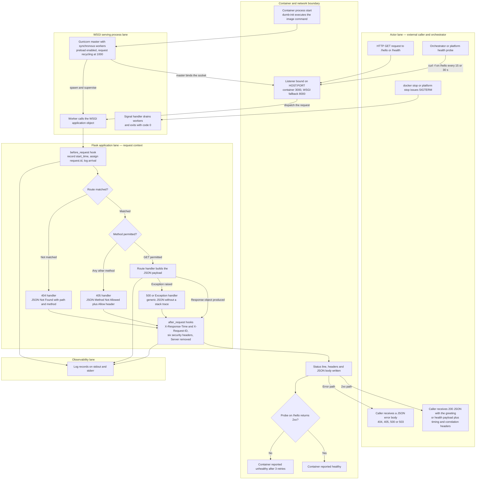
```mermaid
flowchart TD
    subgraph ActorLane["Actor lane — external caller and orchestrator"]
        ClientReq["HTTP GET request to /hello or /health"]
        Orchestrator["Orchestrator or platform health probe"]
        StopSignal["docker stop or platform stop issues SIGTERM"]
        ClientDone["Caller receives 200 JSON with the greeting<br/>or health payload plus timing and correlation headers"]
        ClientFail["Caller receives a JSON error body<br/>404, 405, 500 or 503"]
    end

    subgraph EdgeLane["Container and network boundary"]
        StartProc["Container process start<br/>dumb-init executes the image command"]
        Bind["Listener bound on HOST:PORT<br/>container 3000, WSGI fallback 8000"]
        Response["Status line, headers and JSON body written"]
        HealthDiamond{"Probe on /hello returns 2xx?"}
        Healthy["Container reported healthy"]
        Unhealthy["Container reported unhealthy after 3 retries"]
    end

    subgraph ServeLane["WSGI serving process lane"]
        Gunicorn["Gunicorn master with synchronous workers<br/>preload enabled, request recycling at 1000"]
        Worker["Worker calls the WSGI application object"]
        Drain["Signal handler drains workers<br/>and exits with code 0"]
    end

    subgraph AppLane["Flask application lane — request context"]
        Before["before_request hook<br/>record start_time, assign request.id, log arrival"]
        RouteDiamond{"Route matched?"}
        MethodDiamond{"Method permitted?"}
        Handler["Route handler builds the JSON payload"]
        After["after_request hooks<br/>X-Response-Time and X-Request-ID,<br/>six security headers, Server removed"]
        Err404["404 handler<br/>JSON Not Found with path and method"]
        Err405["405 handler<br/>JSON Method Not Allowed plus Allow header"]
        Err500["500 or Exception handler<br/>generic JSON without a stack trace"]
    end

    subgraph ObsLane["Observability lane"]
        LogSink["Log records on stdout and stderr"]
    end

    ClientReq --> Bind
    Orchestrator -->|"curl -f on /hello every 15 or 30 s"| Bind
    StartProc --> Gunicorn
    Gunicorn -->|"master binds the socket"| Bind
    Bind -->|"dispatch the request"| Worker
    Gunicorn -->|"spawn and supervise"| Worker
    Worker --> Before
    Before --> RouteDiamond
    RouteDiamond -->|"Matched"| MethodDiamond
    RouteDiamond -->|"Not matched"| Err404
    MethodDiamond -->|"GET permitted"| Handler
    MethodDiamond -->|"Any other method"| Err405
    Handler -->|"Response object produced"| After
    Handler -->|"Exception raised"| Err500
    Err404 --> After
    Err405 --> After
    Err500 --> After
    After --> Response
    Response -->|"2xx path"| ClientDone
    Response -->|"Error path"| ClientFail
    Response --> HealthDiamond
    HealthDiamond -->|"Yes"| Healthy
    HealthDiamond -->|"No"| Unhealthy
    Before --> LogSink
    Handler --> LogSink
    After --> LogSink
    StopSignal --> Drain
```

Two properties of this flow are worth stating explicitly. First, every path — success, `404`, `405`, `500`, `503` — passes through the `after_request` hooks, so the six security headers and the `Server`-removal step apply to error responses as well; this follows from registering those hooks at application level rather than on individual routes (`src/backend/app.py:223`, `:326`). Second, the health verdict on the orchestrator's lane is derived from `/hello`, not from `/health`, so the liveness signal reflects the greeting handler and not the dedicated health endpoint (`infrastructure/docker/Dockerfile:124-125`, `:209-210`).

### 4.4.2 Detailed Process Flows for Core Features

#### `/hello` greeting flow

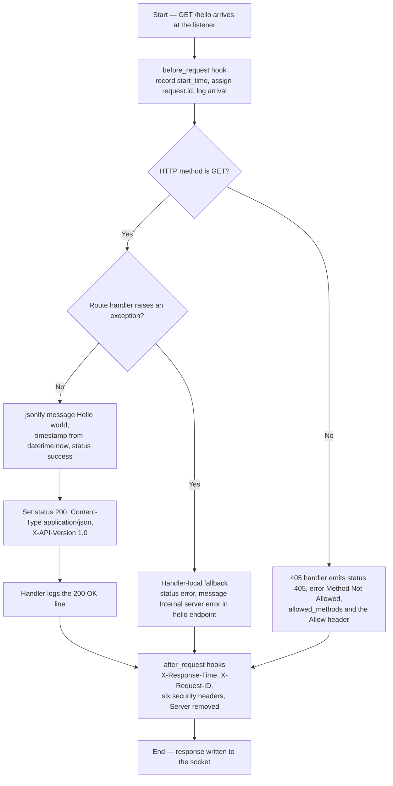
```mermaid
flowchart TD
    H0["Start — GET /hello arrives at the listener"]
    H1["before_request hook<br/>record start_time, assign request.id, log arrival"]
    H2{"HTTP method is GET?"}
    H3["405 handler emits status 405, error Method Not Allowed,<br/>allowed_methods and the Allow header"]
    H4{"Route handler raises an exception?"}
    H5["Handler-local fallback<br/>status error, message Internal server error in hello endpoint"]
    H6["jsonify message Hello world,<br/>timestamp from datetime.now, status success"]
    H7["Set status 200, Content-Type application/json,<br/>X-API-Version 1.0"]
    H8["Handler logs the 200 OK line"]
    H9["after_request hooks<br/>X-Response-Time, X-Request-ID,<br/>six security headers, Server removed"]
    H10["End — response written to the socket"]

    H0 --> H1
    H1 --> H2
    H2 -->|"No"| H3
    H2 -->|"Yes"| H4
    H4 -->|"Yes"| H5
    H4 -->|"No"| H6
    H6 --> H7
    H7 --> H8
    H8 --> H9
    H5 --> H9
    H3 --> H9
    H9 --> H10
```

The decision on the method is taken by the framework's routing before the handler runs, because both routes declare `methods=['GET']` (`src/backend/app.py:367`); the decision on the exception is taken inside the handler, which wraps its entire body in `try`/`except` (`src/backend/app.py:381-424`).

#### `/health` probe flow

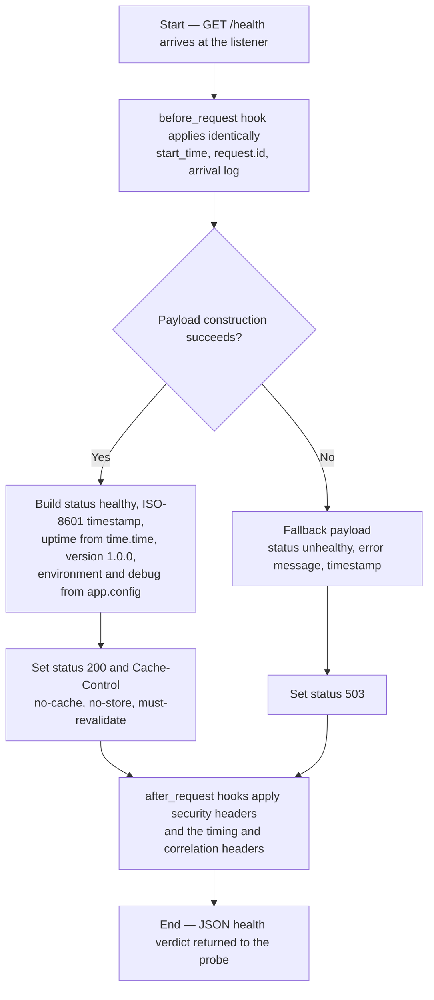
```mermaid
flowchart TD
    H20["Start — GET /health arrives at the listener"]
    H21["before_request hook applies identically<br/>start_time, request.id, arrival log"]
    H22{"Payload construction succeeds?"}
    H23["Build status healthy, ISO-8601 timestamp,<br/>uptime from time.time, version 1.0.0,<br/>environment and debug from app.config"]
    H24["Set status 200 and Cache-Control<br/>no-cache, no-store, must-revalidate"]
    H25["Fallback payload<br/>status unhealthy, error message, timestamp"]
    H26["Set status 503"]
    H27["after_request hooks apply security headers<br/>and the timing and correlation headers"]
    H28["End — JSON health verdict returned to the probe"]

    H20 --> H21
    H21 --> H22
    H22 -->|"Yes"| H23
    H22 -->|"No"| H25
    H23 --> H24
    H25 --> H26
    H24 --> H27
    H26 --> H27
    H27 --> H28
```

The failure branch is the reason a probe always receives a decision rather than a dropped connection: the handler catches its own exception and answers `503` instead of letting the exception escape (`src/backend/app.py:454-463`). Note that the cache-prevention header is set on the success branch only, so a `503` carries no caching directive.

#### Application bootstrap flow

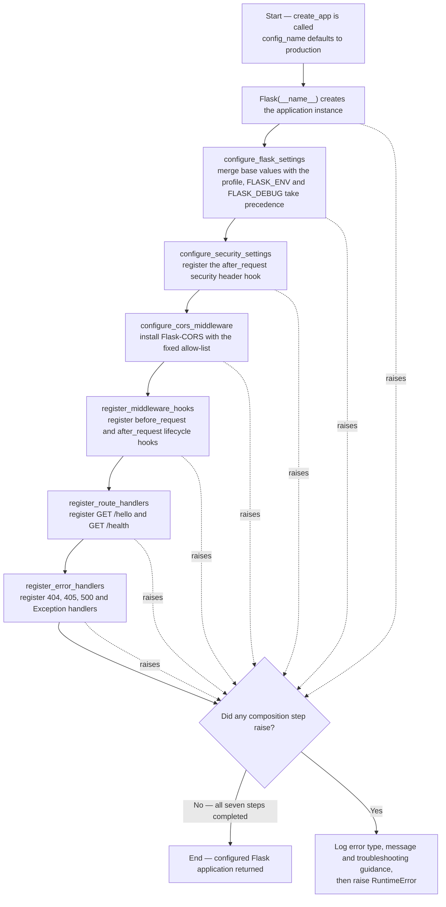
```mermaid
flowchart TD
    B0["Start — create_app is called<br/>config_name defaults to production"]
    B1["Flask(__name__) creates the application instance"]
    B2["configure_flask_settings<br/>merge base values with the profile, FLASK_ENV and FLASK_DEBUG take precedence"]
    B3["configure_security_settings<br/>register the after_request security header hook"]
    B4["configure_cors_middleware<br/>install Flask-CORS with the fixed allow-list"]
    B5["register_middleware_hooks<br/>register before_request and after_request lifecycle hooks"]
    B6["register_route_handlers<br/>register GET /hello and GET /health"]
    B7["register_error_handlers<br/>register 404, 405, 500 and Exception handlers"]
    B8{"Did any composition step raise?"}
    B9["Log error type, message and troubleshooting guidance,<br/>then raise RuntimeError"]
    B10["End — configured Flask application returned"]

    B0 --> B1
    B1 --> B2
    B2 --> B3
    B3 --> B4
    B4 --> B5
    B5 --> B6
    B6 --> B7
    B7 --> B8
    B8 -->|"No — all seven steps completed"| B10
    B8 -->|"Yes"| B9
    B1 -.->|"raises"| B8
    B2 -.->|"raises"| B8
    B3 -.->|"raises"| B8
    B4 -.->|"raises"| B8
    B5 -.->|"raises"| B8
    B6 -.->|"raises"| B8
    B7 -.->|"raises"| B8
```

The dotted edges show that any step may fail; the whole sequence sits inside one `try` block, so a failure anywhere reaches the same handler and converts to `RuntimeError("Flask application factory failed: …")` (`src/backend/app.py:85-141`). The WSGI entry point then repeats this shape around its own work — reading the environment, validating the port, creating the app, applying WSGI settings, logging, and measuring memory — and converts any failure to `RuntimeError("WSGI application initialization failed: …")` (`src/backend/wsgi.py:97-144`).

#### Production serving flow with timing annotations

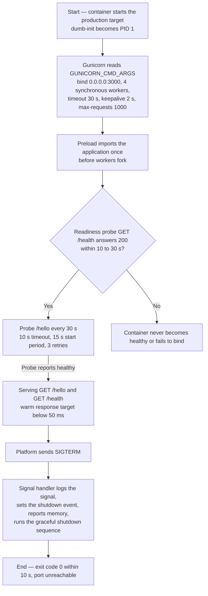
```mermaid
flowchart TD
    P0["Start — container starts the production target<br/>dumb-init becomes PID 1"]
    P1["Gunicorn reads GUNICORN_CMD_ARGS<br/>bind 0.0.0.0:3000, 4 synchronous workers,<br/>timeout 30 s, keepalive 2 s, max-requests 1000"]
    P2["Preload imports the application once<br/>before workers fork"]
    P3{"Readiness probe GET /health answers 200<br/>within 10 to 30 s?"}
    P4["Probe /hello every 30 s<br/>10 s timeout, 15 s start period, 3 retries"]
    P5["Container never becomes healthy or fails to bind"]
    P6["Serving GET /hello and GET /health<br/>warm response target below 50 ms"]
    P7["Platform sends SIGTERM"]
    P8["Signal handler logs the signal,<br/>sets the shutdown event, reports memory,<br/>runs the graceful shutdown sequence"]
    P9["End — exit code 0 within 10 s, port unreachable"]

    P0 --> P1
    P1 --> P2
    P2 --> P3
    P3 -->|"Yes"| P4
    P3 -->|"No"| P5
    P4 -->|"Probe reports healthy"| P6
    P6 --> P7
    P7 --> P8
    P8 --> P9
```

The readiness window is wider in the container than in the tests: the production health check allows a 15-second start period before counting failures (`infrastructure/docker/Dockerfile:209-210`), while the WSGI test harness allows 10 seconds in its lifecycle test and 15 seconds in the end-to-end test (`src/backend/tests/test_wsgi.py:406`, `:1168`). The 30-second worker timeout bounds any single hung request, and 40 workers' worth of recycling churn is bounded by `max-requests 1000` with jitter 100.

### 4.4.3 Error Handling Flowchart

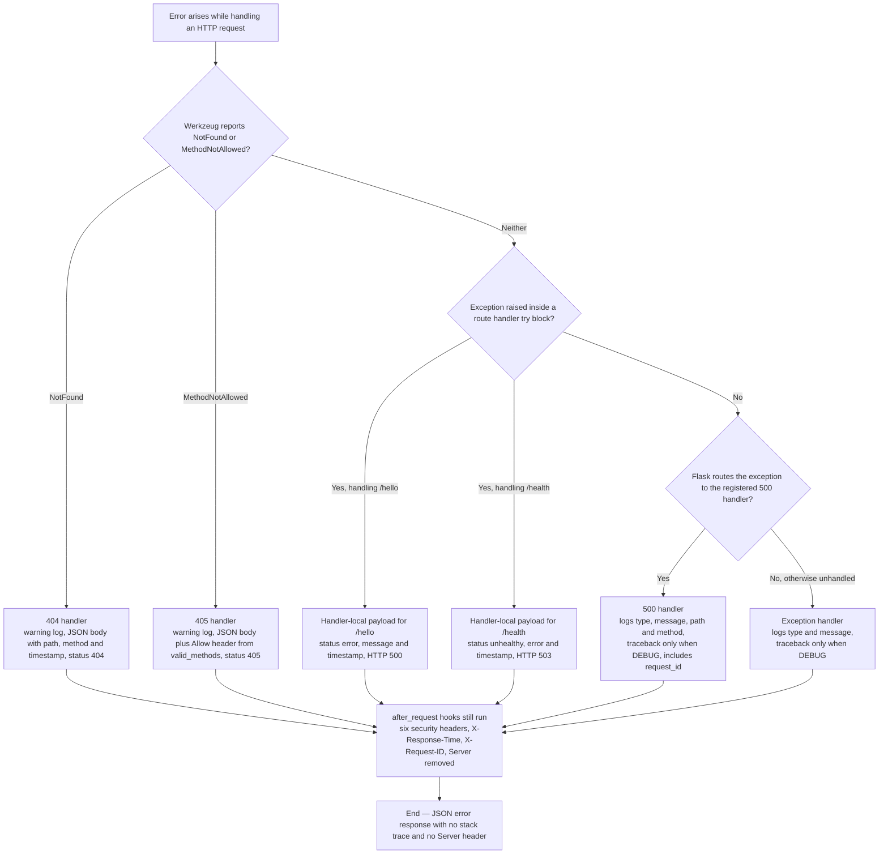
```mermaid
flowchart TD
    SR["Error arises while handling an HTTP request"]
    D1{"Werkzeug reports NotFound or MethodNotAllowed?"}
    H404["404 handler<br/>warning log, JSON body with path, method and timestamp, status 404"]
    H405["405 handler<br/>warning log, JSON body plus Allow header from valid_methods, status 405"]
    D2{"Exception raised inside a route handler try block?"}
    HL1["Handler-local payload for /hello<br/>status error, message and timestamp, HTTP 500"]
    HL2["Handler-local payload for /health<br/>status unhealthy, error and timestamp, HTTP 503"]
    D3{"Flask routes the exception to the registered 500 handler?"}
    H500["500 handler<br/>logs type, message, path and method,<br/>traceback only when DEBUG, includes request_id"]
    HGEN["Exception handler<br/>logs type and message,<br/>traceback only when DEBUG"]
    POST["after_request hooks still run<br/>six security headers, X-Response-Time, X-Request-ID, Server removed"]
    E1["End — JSON error response with no stack trace and no Server header"]

    SR --> D1
    D1 -->|"NotFound"| H404
    D1 -->|"MethodNotAllowed"| H405
    D1 -->|"Neither"| D2
    D2 -->|"Yes, handling /hello"| HL1
    D2 -->|"Yes, handling /health"| HL2
    D2 -->|"No"| D3
    D3 -->|"Yes"| H500
    D3 -->|"No, otherwise unhandled"| HGEN
    H404 --> POST
    H405 --> POST
    HL1 --> POST
    HL2 --> POST
    H500 --> POST
    HGEN --> POST
    POST --> E1
```

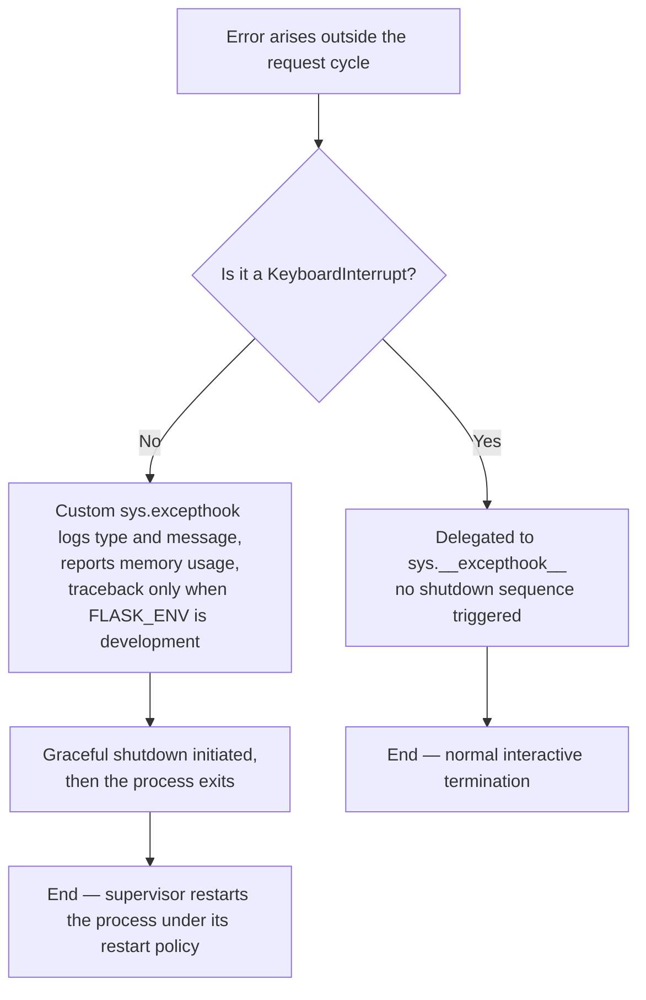
```mermaid
flowchart TD
    SP["Error arises outside the request cycle"]
    D4{"Is it a KeyboardInterrupt?"}
    DEF["Delegated to sys.__excepthook__<br/>no shutdown sequence triggered"]
    HOOK["Custom sys.excepthook logs type and message,<br/>reports memory usage,<br/>traceback only when FLASK_ENV is development"]
    GS["Graceful shutdown initiated,<br/>then the process exits"]
    E2["End — normal interactive termination"]
    E3["End — supervisor restarts the process under its restart policy"]

    SP --> D4
    D4 -->|"Yes"| DEF
    D4 -->|"No"| HOOK
    DEF --> E2
    HOOK --> GS
    GS --> E3
```

Two asymmetries in the request-level flow deserve attention when reading it as an operational runbook. The four `500` shapes are not identical: the `405` body carries `allowed_methods`, the registered `500` body carries `request_id`, and the catch-all body carries neither (`src/backend/app.py:535-543`, `:586-592`, `:623-628`). And because the handler-local fallbacks are reached before Flask's error dispatch, an exception in `/health` returns the `503` shape recorded in 2.2 as F-003-RQ-002 rather than the generic `500`.

### 4.4.4 Integration Sequence Diagrams

#### Request-level interaction

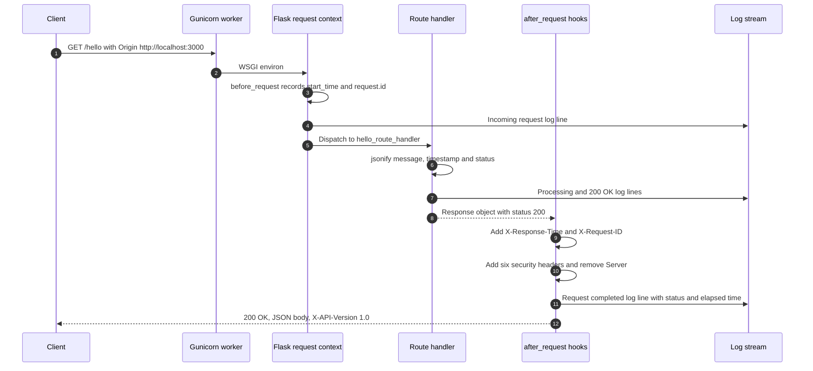
```mermaid
sequenceDiagram
    autonumber
    participant C as Client
    participant W as Gunicorn worker
    participant F as Flask request context
    participant H as Route handler
    participant R as after_request hooks
    participant L as Log stream

    C->>W: GET /hello with Origin http://localhost:3000
    W->>F: WSGI environ
    F->>F: before_request records start_time and request.id
    F->>L: Incoming request log line
    F->>H: Dispatch to hello_route_handler
    H->>H: jsonify message, timestamp and status
    H->>L: Processing and 200 OK log lines
    H-->>R: Response object with status 200
    R->>R: Add X-Response-Time and X-Request-ID
    R->>R: Add six security headers and remove Server
    R->>L: Request completed log line with status and elapsed time
    R-->>C: 200 OK, JSON body, X-API-Version 1.0
```

The order of the two `after_request` interactions is fixed: Flask invokes `after_request` handlers in reverse order of registration, so the lifecycle hook that writes the timing and correlation headers runs before the security hook. The log stream receives three lines for a successful call — arrival, handler processing, and completion — all on stdout and stderr (`src/backend/wsgi.py:65-68`).

#### Container startup interaction across Compose services

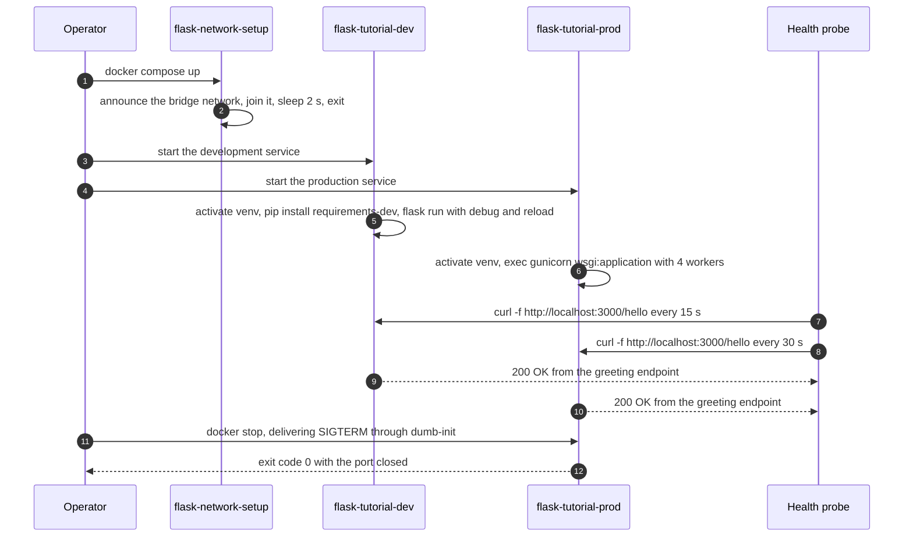
```mermaid
sequenceDiagram
    autonumber
    participant Op as Operator
    participant Net as flask-network-setup
    participant Dev as flask-tutorial-dev
    participant Prod as flask-tutorial-prod
    participant HC as Health probe

    Op->>Net: docker compose up
    Net->>Net: announce the bridge network, join it, sleep 2 s, exit
    Op->>Dev: start the development service
    Op->>Prod: start the production service
    Dev->>Dev: activate venv, pip install requirements-dev, flask run with debug and reload
    Prod->>Prod: activate venv, exec gunicorn wsgi:application with 4 workers
    HC->>Dev: curl -f http://localhost:3000/hello every 15 s
    HC->>Prod: curl -f http://localhost:3000/hello every 30 s
    Dev-->>HC: 200 OK from the greeting endpoint
    Prod-->>HC: 200 OK from the greeting endpoint
    Op->>Prod: docker stop, delivering SIGTERM through dumb-init
    Prod-->>Op: exit code 0 with the port closed
```

`depends_on` orders container start, not readiness, so the two-second sleep in `flask-network-setup` is a courtesy delay rather than a readiness gate; the actual readiness signal is the health probe's first successful `/hello` (`infrastructure/docker/docker-compose.yml:166-167`, `:337-339`, `:346-356`).

#### Delivery pipeline interaction

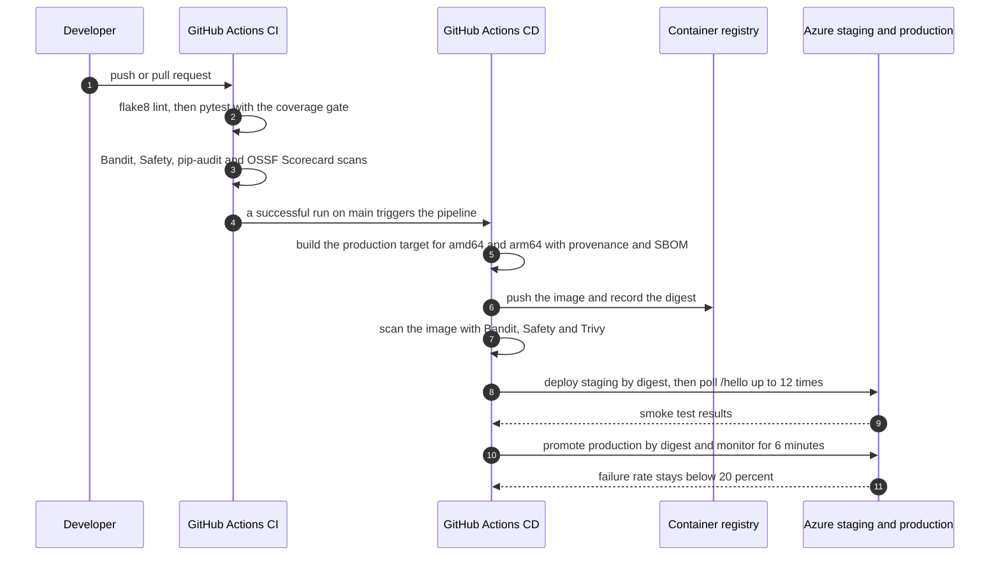
```mermaid
sequenceDiagram
    autonumber
    participant Dev as Developer
    participant CI as GitHub Actions CI
    participant CD as GitHub Actions CD
    participant Reg as Container registry
    participant Az as Azure staging and production

    Dev->>CI: push or pull request
    CI->>CI: flake8 lint, then pytest with the coverage gate
    CI->>CI: Bandit, Safety, pip-audit and OSSF Scorecard scans
    CI->>CD: a successful run on main triggers the pipeline
    CD->>CD: build the production target for amd64 and arm64 with provenance and SBOM
    CD->>Reg: push the image and record the digest
    CD->>CD: scan the image with Bandit, Safety and Trivy
    CD->>Az: deploy staging by digest, then poll /hello up to 12 times
    Az-->>CD: smoke test results
    CD->>Az: promote production by digest and monitor for 6 minutes
    Az-->>CD: failure rate stays below 20 percent
```

The quality gate sits between the two pipelines: the `quality-gate` job depends on both the `test` and `security` jobs and fails the run when coverage or a security threshold is breached, and the production deployment job validates that staging succeeded and the security scan did not fail before promoting the same digest (`.github/workflows/ci.yml:208-341`, `.github/workflows/cd.yml:624-705`).

### 4.4.5 State Transition Diagrams

#### Application configuration state

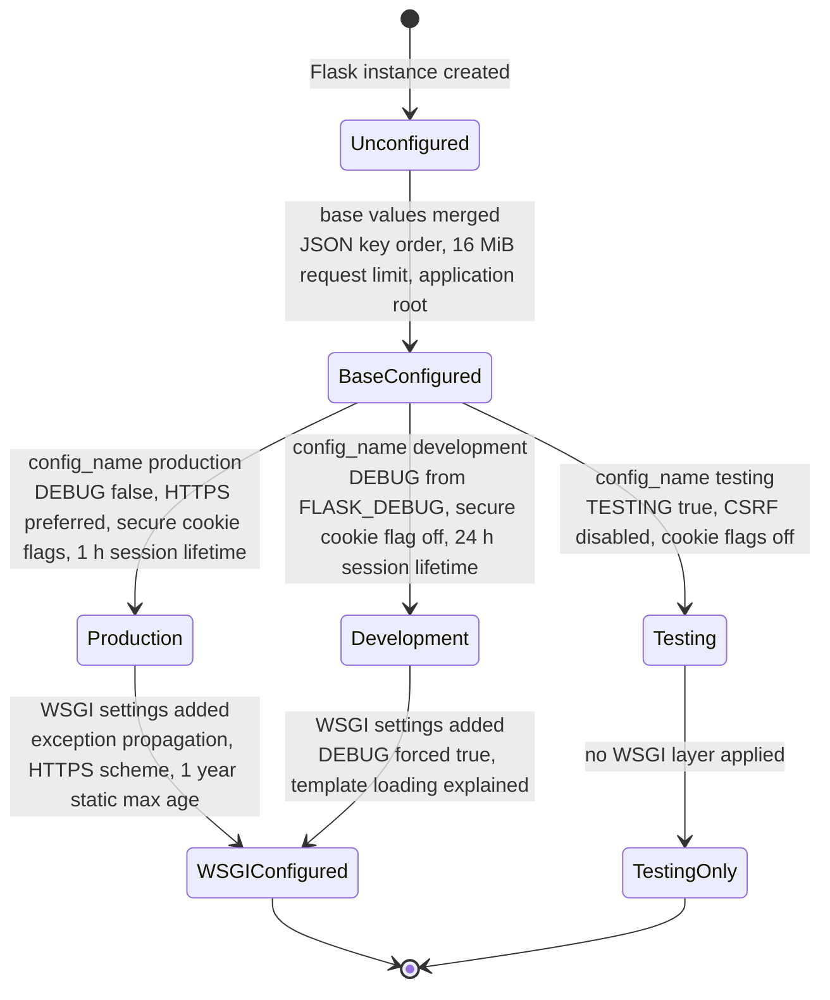
```mermaid
stateDiagram-v2
    [*] --> Unconfigured: Flask instance created
    Unconfigured --> BaseConfigured: base values merged<br/>JSON key order, 16 MiB request limit, application root
    BaseConfigured --> Production: config_name production<br/>DEBUG false, HTTPS preferred, secure cookie flags, 1 h session lifetime
    BaseConfigured --> Development: config_name development<br/>DEBUG from FLASK_DEBUG, secure cookie flag off, 24 h session lifetime
    BaseConfigured --> Testing: config_name testing<br/>TESTING true, CSRF disabled, cookie flags off
    Production --> WSGIConfigured: WSGI settings added<br/>exception propagation, HTTPS scheme, 1 year static max age
    Development --> WSGIConfigured: WSGI settings added<br/>DEBUG forced true, template loading explained
    Testing --> TestingOnly: no WSGI layer applied
    WSGIConfigured --> [*]
    TestingOnly --> [*]
```

The transition target is chosen once per instance and never changed afterwards; `FLASK_ENV` overrides the `config_name` argument for the `ENV` value, and `FLASK_DEBUG` overrides the debug setting in the development profile alone (`src/backend/app.py:155`, `:183-193`). The testing profile carries no WSGI overlay because `configure_wsgi_settings` handles only `production` and `development` (`src/backend/wsgi.py:165-183`).

#### Process lifecycle state

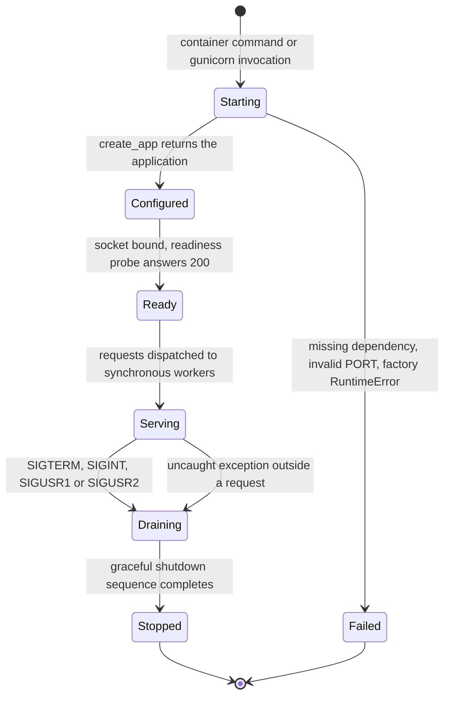
```mermaid
stateDiagram-v2
    [*] --> Starting: container command or gunicorn invocation
    Starting --> Configured: create_app returns the application
    Configured --> Ready: socket bound, readiness probe answers 200
    Ready --> Serving: requests dispatched to synchronous workers
    Serving --> Draining: SIGTERM, SIGINT, SIGUSR1 or SIGUSR2
    Serving --> Draining: uncaught exception outside a request
    Draining --> Stopped: graceful shutdown sequence completes
    Stopped --> [*]
    Starting --> Failed: missing dependency, invalid PORT, factory RuntimeError
    Failed --> [*]
```

`Failed` is a terminal state with no automatic recovery inside the process: a missing dependency exits with status `1` before any handler is installed, an invalid port raises `ValueError`, and a factory failure raises `RuntimeError`, all of which leave the supervisor to restart the container (`src/backend/wsgi.py:44`, `:331`, `:144`).

#### Container health state

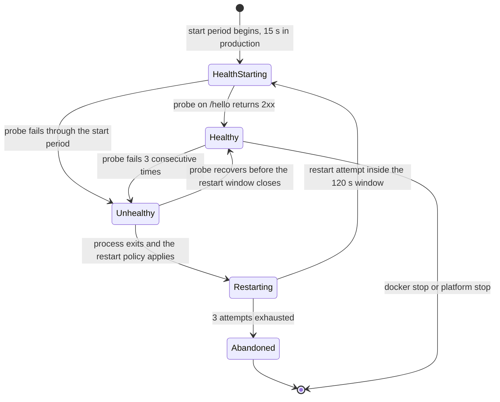
```mermaid
stateDiagram-v2
    [*] --> HealthStarting: start period begins, 15 s in production
    HealthStarting --> Healthy: probe on /hello returns 2xx
    HealthStarting --> Unhealthy: probe fails through the start period
    Healthy --> Unhealthy: probe fails 3 consecutive times
    Unhealthy --> Healthy: probe recovers before the restart window closes
    Unhealthy --> Restarting: process exits and the restart policy applies
    Restarting --> HealthStarting: restart attempt inside the 120 s window
    Restarting --> Abandoned: 3 attempts exhausted
    Abandoned --> [*]
    Healthy --> [*]: docker stop or platform stop
```

An unhealthy status is reported to the orchestrator but does not by itself restart the container in the delivered configuration; restarts follow process exit, bounded to three attempts per 120 seconds with a 5-second delay (`infrastructure/docker/docker-compose.yml:295-299`). A `500` from `/hello` therefore produces an unhealthy verdict while `/health` would still answer `200`, which is the operational consequence of probing the greeting endpoint rather than the health endpoint.


## 4.5 References

Every statement in this section rests on the repository artefacts listed below.

**Application source**
- `src/backend/app.py` — the application factory `create_app` and its seven ordered composition steps (63-141); the base and three profile configuration dictionaries, including `MAX_CONTENT_LENGTH` of 16 MiB and the cookie and session settings (144-212); the `after_request` security-header hook and `Server` removal (215-256); the Flask-CORS allow-list and preflight cache (259-288); the `before_request` and `after_request` lifecycle hooks that produce `request.start_time`, `request.id`, `X-Response-Time`, and `X-Request-ID` (291-355); the `GET /hello` and `GET /health` handler contracts and their local error payloads (358-467); the `404`, `405`, `500`, and catch-all `Exception` handlers and their distinct JSON shapes (470-636); the unused `FLASK_CONFIGS` mapping (641-657); the three convenience factories and `__all__` (660-700); and the direct-execution development path with its `HOST`/`PORT` fallbacks (705-750).
- `src/backend/wsgi.py` — the WSGI entry point with its import-time dependency checks and `sys.exit(1)` paths (35-54); the module globals `flask_app`, `shutdown_event`, and `signal_received` (74-76); `create_wsgi_application` and its `RuntimeError` on failure (78-144); `configure_wsgi_settings` including the production static-file max age (147-189); signal registration for `SIGTERM`, `SIGINT`, `SIGUSR1`, and `SIGUSR2` with `OSError` tolerance (192-255); `perform_graceful_shutdown` and its unimplemented cleanup placeholders (258-296); `validate_port_number` range checking (299-331); `log_memory_usage` and the 75 MB warning threshold (334-373); the deployment-information log block (376-429); the replacement `sys.excepthook` (432-474); the two module execution paths (479-527); and the exported `application` object (515-530).
- `src/backend/.env.example` — the seven active configuration values (38, 52, 75, 96, 116, 141, 162), the commented future-scope integration blocks (172-194), the per-platform port presets (200-231), and the validation guidelines that disagree with the code on the port floor and the port default (237-250, 26).

**Tests and test configuration**
- `src/backend/tests/test_app.py` — the collection-time `src.app` import that skips the module (45-56); factory and profile assertions (59-102); the `/hello` contract, header, and 50 ms SLA assertions (105-189); the `/health` payload and cache-header assertions (191-215); the `404` and `405` assertions including the `Allow` header (237-293); the placeholder `500` test (295-316); the security-header, fingerprint-removal, and CORS assertions (342-398); the memory, concurrency, and benchmark thresholds (401-473); the statelessness and session-cookie assertions (476-519); and the middleware, timing-header, and request-ID assertions (522-574).
- `src/backend/tests/test_wsgi.py` — the memory monitor thresholds (164-191); the dynamic-port fixture (194-230); the Flask, WSGI, and performance-baseline fixtures with the cold-start, warm-request, concurrent, and memory thresholds (233-346); the Gunicorn startup lifecycle (362-456); the SIGTERM handling assertions (458-528); the port-binding test (530-596); the WSGI-context error assertions (660-700); the concurrent load test (865-993); the helper functions and module markers (1327-1405); and the four-phase end-to-end deployment lifecycle with its readiness, load, shutdown, and 60-second assertions (1125-1320).
- `src/backend/pytest.ini` — the coverage gate `--cov-branch --cov-fail-under=100` and report set (15-24); the ten marker definitions (35-45); the 300-second thread timeout (62-63); `filterwarnings = error` (69-70); and the integration retry settings (223-225).

**Manifests and documentation**
- `src/backend/requirements.txt` — the five-package root manifest that omits `psutil`.
- `src/backend/README.md` — the documented port, `gunicorn wsgi:application` command, and API examples (140, 187-190, 218-270) and the documented response bodies and error messages that differ from the implementation (228-233, 316-379).
- `README.md` — the conflicting documented contract: port 5000, plain-text `Hello world` bodies, `response.data == b'Hello world'`, and `gunicorn wsgi:app` (158-163, 182, 241, 303, 455, 485-505).
- `pyproject.toml` — the package version `1.0.0` that the health payload mirrors and the Python `>=3.12` floor.

**Container and orchestration**
- `infrastructure/docker/Dockerfile` — the `base`, `dependencies`, `application`, `development`, and `production` stages; the build-time Flask and Gunicorn verification (88-96); the `application` stage's copy-and-verify step, port exposure, health check, and Flask CMD (101-132); the development stage's debugpy and reload CMD and faster health check (137-179); and the production stage's environment, cleanup, read-only sources, `GUNICORN_CMD_ARGS`, and `gunicorn wsgi:app` CMD (184-220).
- `infrastructure/docker/docker-compose.yml` — the development service's environment, ports, bind mount, cache volumes, startup command, health check, and restart policy (40-167); the production service's environment, port mapping, read-only cache volumes, `gunicorn wsgi:application` command, health check, resource limits, rollback update configuration, and hardening (172-339); and the `flask-network-setup` service, bridge network, and named volumes (345-441).

**Pipelines**
- `.github/workflows/ci.yml` — the Python `3.12`/`3.11`/`3.10` matrix, lint and coverage steps, artefact uploads (39-124), the Bandit, Safety, pip-audit, and OSSF Scorecard security job (126-206), and the `quality-gate` job that depends on both and validates coverage and security reports (208-341).
- `.github/workflows/cd.yml` — the build-and-publish job that builds the production target for `amd64` and `arm64` and pushes to the registry (102-256), the image security scan with Bandit, Safety, and Trivy (264-429), the staging and production deployment jobs with their readiness probes and smoke tests (437-616, 624-884), and the always-run deployment report (892-1028).

**Folders inspected**
- `src/backend/` — the Flask implementation, WSGI entry point, configuration template, pytest configuration, dependency manifest, instructional guide, and test suite.
- `src/backend/tests/` — the two pytest modules that encode the verification contract and its thresholds.
- `infrastructure/docker/` — the multi-stage build, Compose orchestration, and build-context exclusion policy.
- `.github/workflows/` — the CI and CD pipeline definitions that gate and promote the artefact.
- `blitzy/documentation/` — the planning, specification, and project-guide documents that describe the superseded Node.js/Express plan alongside the Flask targets.

No external web sources were used for this section; all facts derive from the artefacts listed above.


# 5. System Architecture

## 5.1 High-Level Architecture

### 5.1.1 System Overview

**Architectural style.** The system is a stateless, single-service request/response monolith delivered across a WSGI boundary inside a container image. One Flask application object serves two read-only JSON endpoints, and every environment-specific behaviour is selected from configuration rather than from a separate build or code branch. Three layers are distinguishable in the delivered code.

| Layer | Responsibility | Location |
|---|---|---|
| Configuration and composition | Select the environment profile, construct the application object, install extensions, hooks, routes and error handlers | `src/backend/app.py:63-141` |
| Request-scoped pipeline | Preprocess the request, route it, serve it, post-process the response, and normalise every failure into JSON | `src/backend/app.py:215-636` |
| Process and deployment | Validate runtime input, export the WSGI callable, manage signals and shutdown, package and orchestrate the container | `src/backend/wsgi.py:78-531`, `infrastructure/docker/` |

**Rationale.** The architecture follows directly from the migration framing that governs the repository: a Node.js/Express tutorial was reimplemented in Python, and each Express construct is mapped to its Flask equivalent in the source, for example `# Replaces Express.js express() with Flask(__name__)` (`src/backend/app.py:92`) and `# Replaces Express.js middleware stack with Flask request lifecycle management` (`src/backend/app.py:108, :294`). Four forces shaped the result:

- **A single artefact must serve three contexts.** Automated tests, local development and production all instantiate the same factory with a different profile — `create_testing_app`, `create_development_app` and `create_production_app` are thin wrappers over `create_app` (`src/backend/app.py:660-690`) — so no environment needs its own build or its own source variant.
- **Production serving belongs outside the application.** The WSGI module never starts Gunicorn itself; when executed directly in production mode it logs the launch command and exits (`src/backend/wsgi.py:510-513`), leaving process management to the container command (`infrastructure/docker/Dockerfile:220`, `infrastructure/docker/docker-compose.yml:263`) or to the hosting platform.
- **The service is deliberately incapable of holding state.** There is no database, cache server, queue or session store anywhere in the code, the dependencies or the workflows, and no route reads or writes session state; the test suite asserts that repeated `/hello` calls return unique timestamps and set no session cookie (`src/backend/tests/test_app.py:482-519`).
- **Operational behaviour is part of the artefact.** Health reporting, graceful shutdown, port validation and memory telemetry live in the application and its WSGI entry point rather than in external tooling (`src/backend/app.py:426-463`, `src/backend/wsgi.py:192-373`).

**Architectural principles.** Each principle below is stated as the code enforces it.

- *One artefact, profile-selected behaviour.* A shared base configuration dictionary is merged with one of three profile dictionaries inside the factory (`src/backend/app.py:159-207`), and the `FLASK_ENV` variable takes precedence over the value passed to the factory (`src/backend/app.py:155`).
- *Configuration as data, not as logic.* Every configurable value arrives through environment variables read by `python-dotenv` at import time in both entry modules (`src/backend/app.py:52`, `src/backend/wsgi.py:58`), and the template documents each variable with its default, validation rule and platform guidance (`src/backend/.env.example:38-162`).
- *Cross-cutting behaviour is installed once, at application level.* Security headers, CORS, timing, request identifiers and logging are registered as application-wide extensions and hooks, so they apply to error responses as well as successful ones (`src/backend/app.py:223, :279, :299, :326`).
- *One response contract for both outcomes.* Success and failure both return JSON with an ISO-8601 timestamp; a catch-all `@app.errorhandler(Exception)` guarantees that no HTML error page or stack trace escapes to a client (`src/backend/app.py:602-632`).
- *Statelessness by construction.* Request-scoped values live only as transient attributes on the Flask request object (`request.start_time`, `request.id`, `src/backend/app.py:310-316`), and nothing survives the process.
- *Explicit process lifecycle.* Port numbers are validated against the 1–65535 range before use, `SIGTERM`/`SIGINT`/`SIGUSR1`/`SIGUSR2` are trapped for orderly termination, and uncaught exceptions are routed through `sys.excepthook` before shutdown begins (`src/backend/wsgi.py:192-255, :299-331, :432-474`).
- *Defence in depth at the container boundary.* The production image runs as a non-root user (`infrastructure/docker/Dockerfile:41-59`), starts under `dumb-init` as PID 1 so signals reach the worker processes (`infrastructure/docker/Dockerfile:220`), makes application files read-only (`infrastructure/docker/Dockerfile:213`), and the Compose service adds a read-only root filesystem, dropped capabilities and `no-new-privileges` (`infrastructure/docker/docker-compose.yml:314-335`).
- *Quality is enforced mechanically, not by convention.* Flake8, a 100% branch-coverage gate and dependency/static security scanners run as pipeline gates rather than as optional local steps (`.flake8:19`, `pytest.ini:43`, `.github/workflows/ci.yml:94, :161-176`).

**System boundaries.** The distinction matters because a large part of this system is supplied by its environment rather than by its code.

| Boundary | Inside the system | Supplied by the environment |
|---|---|---|
| HTTP edge | Resource contract: two `GET` routes, JSON bodies, security headers, CORS policy (`src/backend/app.py:367, :426`) | Clients: `curl`, browsers, container health checks, pipeline smoke tests |
| Serving process | The WSGI callable, its settings and its lifecycle handlers (`src/backend/wsgi.py:78-189, :518-531`) | The WSGI server itself: Gunicorn with four synchronous workers in production (`infrastructure/docker/Dockerfile:216`) |
| Configuration | Defaults, validation and profile semantics (`src/backend/app.py:155-166`, `src/backend/wsgi.py:104-106`) | The variable values: host, port, environment name, secret, worker count |
| Persistence | Nothing; no store is declared or imported (`src/backend/.env.example:172-194` documents only commented future examples) | Container volumes for virtual-environment and pip caches, host filesystem for the unused `${PWD}/data` bind (`infrastructure/docker/docker-compose.yml:403-449`) |
| Delivery | Image definition, health check and start command (`infrastructure/docker/Dockerfile`) | Build agent, registry, cloud platform and secrets (`.github/workflows/ci.yml`, `.github/workflows/cd.yml`) |

**Major interfaces.**

| Interface | Direction | Contract | Evidence |
|---|---|---|---|
| Public HTTP API | Inbound, synchronous | `GET /hello` → JSON greeting with timestamp, status and `X-API-Version: 1.0`; `GET /health` → JSON health report with caching disabled | `src/backend/app.py:367-410, :426-449` |
| WSGI application callable | Inbound, in-process | Module attribute `application` in `wsgi.py`, resolved as `wsgi:application` or `src.backend.wsgi:application` | `src/backend/wsgi.py:523, :531`; `infrastructure/docker/docker-compose.yml:263` |
| Operating-system signals | Inbound, process level | `SIGTERM`, `SIGINT`, `SIGUSR1`, `SIGUSR2` trigger memory reporting and graceful shutdown; registration failures are tolerated | `src/backend/wsgi.py:236-255` |
| Environment variables | Inbound, start-up | `FLASK_ENV`, `HOST`, `PORT`, `FLASK_DEBUG`, `LOG_LEVEL`, `WORKERS`, `SECRET_KEY` | `src/backend/app.py:155-161, :722`; `src/backend/wsgi.py:104-106`; `src/backend/.env.example:38-162` |
| Container contract | Outbound to runtime | Port 3000 exposed, `curl -f http://localhost:3000/hello` health probe, Gunicorn command, read-only Python files | `infrastructure/docker/Dockerfile:120-132, :209-220` |
| Supply-chain interfaces | Outbound to pipelines | Gated CI job results and image digest published to the registry, then deployed to the hosting platform by digest | `.github/workflows/ci.yml:88-124`; `.github/workflows/cd.yml:213-256, :481` |

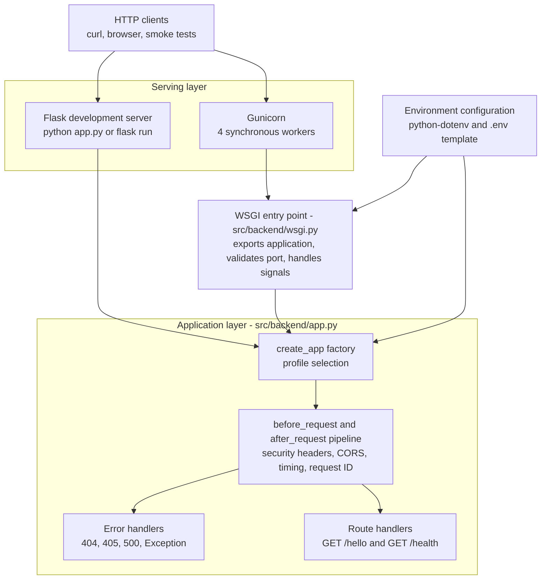
```mermaid
flowchart TB
    Clients[HTTP clients<br/>curl, browser, smoke tests]

    subgraph ServingLayer["Serving layer"]
        GunicornServer[Gunicorn<br/>4 synchronous workers]
        FlaskDevServer[Flask development server<br/>python app.py or flask run]
    end

    subgraph ApplicationLayer["Application layer - src/backend/app.py"]
        Factory[create_app factory<br/>profile selection]
        Pipeline[before_request and after_request pipeline<br/>security headers, CORS, timing, request ID]
        RouteHandlers[Route handlers<br/>GET /hello and GET /health]
        ErrorHandlers[Error handlers<br/>404, 405, 500, Exception]
    end

    ConfigSource[Environment configuration<br/>python-dotenv and .env template]
    WsgiModule[WSGI entry point - src/backend/wsgi.py<br/>exports application, validates port, handles signals]

    Clients --> GunicornServer
    Clients --> FlaskDevServer
    GunicornServer --> WsgiModule
    WsgiModule --> Factory
    FlaskDevServer --> Factory
    Factory --> Pipeline
    Pipeline --> RouteHandlers
    Pipeline --> ErrorHandlers
    ConfigSource --> Factory
    ConfigSource --> WsgiModule
```

**Known architectural constraints and inconsistencies.** These are properties of the delivered system, not aspirations, and they bound what the architecture currently guarantees.

- The production image's start command names an attribute the WSGI module does not export: `gunicorn wsgi:app` (`infrastructure/docker/Dockerfile:220`) against `__all__ = ['application']` (`src/backend/wsgi.py:531`). Compose overrides the command with `gunicorn wsgi:application` (`infrastructure/docker/docker-compose.yml:263`), so the Compose path works while a plain `docker run` of the same image does not.
- The image installs only the five-package root manifest, which omits `psutil`, while `wsgi.py` exits with status 1 when `psutil` is absent (`infrastructure/docker/Dockerfile:88-93, :112-116`; `requirements.txt`; `src/backend/wsgi.py:35-44`). The WSGI entry point's import verification therefore depends on a package the image never installs.
- Runtime ports are inconsistent across artefacts: 5000 in the root guide (`README.md:158, :201, :505`), 3000 in the environment template (`src/backend/.env.example:38`), 8000 as the code fallback (`src/backend/wsgi.py:106`, `src/backend/app.py:722`), 3000 exposed by the image (`infrastructure/docker/Dockerfile:120`), host 3001 mapped to container 3000 by Compose (`infrastructure/docker/docker-compose.yml:231`), and `PORT=8000` set by the Azure deployment (`.github/workflows/cd.yml:486`).
- The response contract documented in the root guide (plain text, `Content-Length: 11`) differs from the implemented JSON payload (`README.md:238-241` versus `src/backend/app.py:387-404`); the backend guide documents JSON but omits the `timestamp` and `status` fields and attributes a `service` field to `/health` (`src/backend/README.md:237, :329`).
- The verification harness cannot execute as delivered: the in-process suite imports a module path that does not exist, three pytest configurations disagree on discovery and coverage sources, and the CI job lints and installs files from a working directory that does not contain them (`src/backend/tests/test_app.py:54`; `pytest.ini:32`; `src/backend/pytest.ini:8`; `pyproject.toml:158`; `.github/workflows/ci.yml:74-94`).

### 5.1.2 Core Components Table

| Component Name | Primary Responsibility | Key Dependencies | Integration Points | Critical Considerations |
|---|---|---|---|---|
| Application factory (`create_app`) | Compose the application from six ordered configuration functions and return a ready Flask instance; wrap any failure in `RuntimeError` | Flask 3.1.1, `python-dotenv`, Flask-CORS | Called by the WSGI entry point, by the three convenience factories, and directly by tests | Defaults to the `production` profile; failure aborts start-up rather than degrading (`src/backend/app.py:63-141`) |
| Environment profile layer (`configure_flask_settings`) | Merge the profile dictionary (production, development, testing) onto a shared base configuration with `FLASK_ENV` override | Environment variables | Factory step 1; consumed by every later layer through `app.config` | Unknown profile names receive base configuration only; session lifetime and cookie flags differ per profile (`src/backend/app.py:144-212`) |
| Response hardening filter (`configure_security_settings`) | Remove the `Server` header and add six security headers to every response | Flask `after_request` | Registered as a second `after_request` function; applies to error responses too | Runs after the lifecycle hook because Flask applies `after_request` functions in reverse registration order (`src/backend/app.py:215-256, :326`) |
| CORS policy (`configure_cors_middleware`) | Permit cross-origin calls from two local development origins with a fixed method and header set | Flask-CORS 4.x | Wraps the whole application; answers `OPTIONS` preflight | Credentials are disabled; failure to configure raises `RuntimeError` and aborts start-up (`src/backend/app.py:259-288`) |
| Request instrumentation pipeline (`register_middleware_hooks`) | Stamp each request with a start time and identifier, warn on non-JSON bodies, emit `X-Response-Time` and `X-Request-ID` | Flask hooks, `time`, `logging` | Encloses every route and error handler | Request identifiers derive from epoch milliseconds and are therefore not unique under load (`src/backend/app.py:291-355`) |
| Endpoint handlers (`/hello`, `/health`) | Produce the greeting payload and the operational health report; each catches its own exceptions | `jsonify`, `datetime`, `time` | Reached through the Flask URL map; probe target of container health checks and pipelines | `/health` reports `uptime` as a raw epoch value rather than elapsed time and returns 503 on internal error (`src/backend/app.py:367-467`) |
| Error contract handlers | Render 404, 405, 500 and any unhandled exception as JSON of one shape, suppressing stack traces outside debug | Flask error handlers | Wrap all routes; the 405 handler also emits an `Allow` header | The catch-all `Exception` handler is what prevents HTML error pages escaping (`src/backend/app.py:479-632`) |
| WSGI entry point and lifecycle supervisor | Read and validate runtime settings, build the app, install signal and exception handlers, export `application` | `psutil`, Flask, `python-dotenv`, `signal`, `threading` | Entry point for Gunicorn and for `python wsgi.py`; source of start-up telemetry | Exits with status 1 if `psutil` or the factory is unavailable; shutdown performs logging only, with database, cache, task and file cleanup left as comments (`src/backend/wsgi.py:35-54, :258-296`) |
| Port validation function | Convert the `PORT` variable to an integer and enforce the 1–65535 range | Standard library only | Called during WSGI start-up on both execution paths | Warns for privileged ports below 1024; raises `ValueError` for out-of-range values (`src/backend/wsgi.py:299-331`) |
| Memory telemetry function | Report RSS, VMS, memory percentage and PID at start-up, on signal, during shutdown and on uncaught exception | `psutil` | Called by the WSGI supervisor | Warns above the 75 MB target; missing `psutil` is fatal at import time, so the module's own `try` around the call is never reached (`src/backend/wsgi.py:334-373`) |
| Image build definition | Produce development and production containers from five stages on `python:3.12-alpine` with health checks | Docker, Alpine packages, both requirement manifests | Consumed by Compose and by the CD pipeline's Buildx step | The dependencies stage installs only the root manifest, and the production command targets `wsgi:app` (`infrastructure/docker/Dockerfile:64-93, :220`) |
| Container orchestration definition | Run development, production and network-setup services with a private bridge network, cache volumes and resource limits | Docker Compose 3.8 | Local execution path for both profiles; overrides the image command for production | Production hardening is extensive but sets `apparmor:unconfined` (`infrastructure/docker/docker-compose.yml:314-316`) |
| Verification harness | Assert status codes, payload shape, headers, error contracts, memory, concurrency and WSGI lifecycle against a live Gunicorn process | pytest, pytest-flask, `requests`, `psutil`, subprocess | Started from the pipelines; imports the application under test | In-process tests skip at collection because the import path does not resolve; WSGI tests require the repository root on `sys.path` (`src/backend/tests/test_app.py:54`; `src/backend/tests/test_wsgi.py:381-397`) |
| Quality gate configuration | Enforce style, complexity, branch coverage and report formats | Flake8 with security, complexity, naming and import-order plugins; pytest-cov; Black | Read by the CI jobs and by developers | Three pytest configurations disagree, and the Flake8 block inside `pyproject.toml` is inert because Flake8 does not read that file (`.flake8:19`; `pytest.ini:32`; `src/backend/pytest.ini:8`; `pyproject.toml:158`) |
| Delivery pipelines | Lint, test, scan, build a multi-platform image, publish it to the registry, and deploy to staging then production | GitHub Actions, Buildx, Trivy, OSSF Scorecard, Azure Web Apps | Triggered by commits, pull requests, a weekly schedule, releases and manual dispatch | Deployment targets and URLs are literals in the workflow; there is no infrastructure-as-code layer (`.github/workflows/cd.yml:444-490`) |

### 5.1.3 Data Flow Description

**Primary request flow.** A client request traverses five stages, all inside a single worker process:

1. **Serving.** A Gunicorn synchronous worker accepts the connection and invokes the WSGI callable created when `wsgi.py` was imported (`src/backend/wsgi.py:518-527`).
2. **Preprocessing.** `before_request` records `time.time()` on the request object, generates `req_<epoch-milliseconds>` as `request.id`, logs the method and path, and — for `POST` or `PUT` with a body — logs a warning when the content type is not JSON. It never rejects a request; it returns `None` and processing continues (`src/backend/app.py:299-324`).
3. **Dispatch.** Flask matches the URL against the two registered rules. `GET /hello` builds `{message, timestamp, status}` and sets `X-API-Version: 1.0`; `GET /health` builds `{status, timestamp, uptime, version, environment, debug}` and sets `Cache-Control: no-cache, no-store, must-revalidate` (`src/backend/app.py:367-410, :426-449`). Unmatched paths and methods fall to the error handlers instead.
4. **Postprocessing.** The lifecycle `after_request` function computes elapsed milliseconds, writes `X-Response-Time` and copies `request.id` into `X-Request-ID`, then the security `after_request` function removes the `Server` header and applies the six hardening headers. Flask applies these in reverse registration order, so the timing and identifier headers are written before the hardening pass (`src/backend/app.py:223-253, :326-352`).
5. **Emission and telemetry.** The response returns through the WSGI server to the client, and the same information is logged to stdout for `docker logs`, Azure log streaming and pipeline output (`src/backend/wsgi.py:62-69`).


```mermaid
flowchart LR
    HttpCaller[HTTP caller<br/>curl, browser, health probe]

    subgraph ServingStage["Serving"]
        Worker[Gunicorn synchronous worker]
        EntryModule[wsgi.py import branch<br/>application exported at import time]
    end

    subgraph PipelineStage["Request pipeline"]
        BeforeRequest[before_request hook<br/>start time, request id, content-type warning]
        UrlMap[Flask URL map<br/>GET /hello and GET /health]
        RouteBody[Route handler<br/>jsonify payload and headers]
        ErrorRoute[Error handler<br/>404, 405, 500, Exception]
        LifecycleAfter[after_request lifecycle hook<br/>X-Response-Time, X-Request-ID]
        SecurityAfter[after_request security hook<br/>Server removal, six headers]
    end

    subgraph OutputStage["Output and telemetry"]
        LogStream[Python logging<br/>stdout and stderr]
        ClientResponse[HTTP response<br/>JSON body, headers, status code]
    end

    HttpCaller --> Worker
    Worker --> EntryModule
    EntryModule --> BeforeRequest
    BeforeRequest --> UrlMap
    UrlMap --> RouteBody
    UrlMap --> ErrorRoute
    RouteBody --> LifecycleAfter
    ErrorRoute --> LifecycleAfter
    LifecycleAfter --> SecurityAfter
    SecurityAfter --> ClientResponse
    SecurityAfter --> LogStream
    ClientResponse --> HttpCaller
```

**Start-up and lifecycle flow.** Environment variables are read twice — once at module import by `load_dotenv()` in each entry module (`src/backend/app.py:52`, `src/backend/wsgi.py:58`) — and then again per value through `os.getenv` when the factory and the WSGI builder run. The WSGI builder resolves `FLASK_ENV` (default `production`), `HOST` (default `0.0.0.0`) and `PORT` (default `8000`, validated), creates the application, applies WSGI-specific settings such as `PROPAGATE_EXCEPTIONS` and a one-year static-file cache age in production, registers signal handlers, prints the deployment report and records a baseline memory measurement (`src/backend/wsgi.py:78-189, :376-429`). On `SIGTERM` — which is what `docker stop` sends — the handler sets a `threading.Event`, records memory, and logs the cleanup sequence; the same path is used for an uncaught exception after the exception hook logs the traceback in development only (`src/backend/wsgi.py:202-296, :432-474`).

**Health and readiness flow.** Three independent probes exercise the same endpoint: the image's `HEALTHCHECK` curls `/hello` every 30 seconds in the application and production targets and every 15 seconds in development (`infrastructure/docker/Dockerfile:124-125, :174-175, :209-210`); Compose repeats the probe with its own intervals and start periods (`infrastructure/docker/docker-compose.yml:130-139, :267-276`); and the CD pipeline polls the deployed endpoint after release, with smoke tests that additionally call `/health` (`README.md`-documented contract) and assert a 404 path (`.github/workflows/cd.yml:501-616`). Because `/health` disables caching, a platform or client cache cannot mask a degraded state.

**Delivery flow.** A commit touching backend, test or configuration paths triggers CI, which installs dependencies, lints with Flake8, runs pytest with a 100% coverage threshold, and runs Bandit, Safety, pip-audit and OSSF Scorecard with SARIF publication (`.github/workflows/ci.yml:6-12, :74-94, :155-206`). A successful CI run on `main`, a published release, or a manual dispatch then builds the production target for `linux/amd64` and `linux/arm64`, publishes it to `ghcr.io` with OCI labels and provenance, scans the resulting digest with Trivy, deploys to Azure staging, and finally to production with a six-minute post-release monitor that flags rollback once the observed failure rate exceeds 20% (`.github/workflows/cd.yml:102-256, :264-429, :437-616, :624-884`).

**Verification flow.** The WSGI suite starts a real Gunicorn process against the module path `src.backend.wsgi:application`, waits for readiness by polling `/health`, drives it with the `requests` client from a thread pool, measures latency and memory growth, sends `SIGTERM`, and asserts the process exits with code 0 and that the port is afterwards unreachable (`src/backend/tests/test_wsgi.py:381-397, :476-528, :881-993, :1149-1161`).

**Data transformation points.** Serialisation order is fixed because `JSON_SORT_KEYS` is disabled, so payload keys appear in insertion order (`src/backend/app.py:162`). Timestamps are produced by `datetime.now().isoformat()` at response time and are therefore different for every request, which is what the statelessness test asserts (`src/backend/app.py:393`, `src/backend/tests/test_app.py:501`). Latency is converted from seconds to a two-decimal millisecond string for the response header (`src/backend/app.py:341-342`). Error dictionaries are rendered through `jsonify` with explicit status codes and an `Allow` header for method mismatches (`src/backend/app.py:546-552`). Request bodies are neither parsed nor validated beyond the content-type warning, and the 16 MiB `MAX_CONTENT_LENGTH` bound is enforced by Flask before any handler runs (`src/backend/app.py:164`).

**Data stores and caches.** The application owns no store. What exists is transient or build-time only:

| Store or cache | Content | Lifetime |
|---|---|---|
| Flask request context attributes | `start_time`, `id` | Single request (`src/backend/app.py:310-316`) |
| CORS preflight decision | Allowed origins, methods and headers for 86400 s | Client-side response cache (`src/backend/app.py:270-276`) |
| HTTP cache directives | `no-cache, no-store, must-revalidate` on successful `/health` responses | Per response (`src/backend/app.py:449`) |
| Docker volumes | Virtual environment and pip download caches, mounted read-only in production | Container lifetime (`infrastructure/docker/docker-compose.yml:234-245, :401-438`) |
| Registry and pipeline artefacts | Published image by digest; coverage, security and deployment reports | Until overwritten; 30 or 90 days (`infrastructure/docker/docker-compose.yml:401-449`, `.github/workflows/ci.yml:105-124, :194-206`) |

### 5.1.4 External Integration Points

No formal service-level agreement exists in the repository. Where numeric expectations are stated they come from test assertions, health-check parameters and pipeline timeouts, and they are cited as such below.

| System Name | Integration Type | Data Exchange Pattern | Protocol/Format | SLA Requirements |
|---|---|---|---|---|
| HTTP clients (browser, `curl`, pipeline smoke tests) | Synchronous API consumer | Request → JSON response per call; no sessions, no cookies issued by `/hello` | HTTP over TCP, JSON bodies, custom headers | Warm response below 50 ms asserted in process and against live Gunicorn; below 100 ms maximum under concurrent load (`src/backend/tests/test_app.py:184, :454-455`; `src/backend/tests/test_wsgi.py:768`) |
| Gunicorn WSGI server | Hosting boundary | In-process WSGI callable invocation per request, one call per connection | PEP 3333 WSGI; module path `wsgi:application` or `src.backend.wsgi:application` | Four synchronous workers, 1000 connections per worker, 1000 requests per worker recycled with jitter 100, 30 s timeout, keepalive 2, preload enabled (`infrastructure/docker/Dockerfile:216`; `infrastructure/docker/docker-compose.yml:263`) |
| Container runtime (Docker or containerd) | Packaging and supervision | Image execution plus HTTP health probe and POSIX signal delivery | OCI image, `curl` probe, `SIGTERM` for stop, `dumb-init` as PID 1 | Probe interval 30 s, timeout 10 s, start period 15 s, 3 retries in production (`infrastructure/docker/Dockerfile:209-210, :220`) |
| Docker Compose | Local orchestration | Declarative service graph with health-check gating, resource limits and volume mounts | Compose 3.8 YAML, bridge network `flask-br0` on 172.21.0.0/16 | 1 replica, limits 128 MB and 0.5 CPU, reservations 75 MB and 0.25 CPU, rollback update policy, restart limit 3 attempts in 120 s (`infrastructure/docker/docker-compose.yml:279-299, :368-394`) |
| GitHub Actions CI | Verification automation | Checkout → install → lint → test with coverage → security scan → artefact publication | Workflow YAML, JUnit XML, HTML, coverage XML, SARIF | Job timeouts 15 min (test), 10 min (security), 10 min (quality gate); gate fails below 100% line or branch coverage and on any high-severity or dependency finding (`.github/workflows/ci.yml:42, :129, :211, :276-280, :305-311`) |
| GitHub Container Registry | Artefact store | Push of the built image, then pull by digest in later jobs | OCI registry API over HTTPS with `GITHUB_TOKEN` | Build and push within a 20 min job; multi-platform `linux/amd64` and `linux/arm64` (`.github/workflows/cd.yml:104, :162, :220`) |
| Azure Web Apps | Production and staging hosting | Container image deployed by digest; platform injects environment variables and probes the endpoint | `azure/webapps-deploy@v2` with publish-profile secrets; platform port 8000 | Staging waits 45 s then polls `/hello` up to 12 times with a 15 s request timeout; production waits 75 s and polls up to 18 times, then monitors for 6 min and flags rollback above a 20% failure rate (`.github/workflows/cd.yml:486-501, :694-705, :824-862`) |
| PyPI | Dependency source | `pip install` of lower-bounded requirements at image build and CI time | HTTPS, pip resolver, `>=` constraints only | No lock file or hash pinning, so resolution varies over time (`requirements.txt`; `pyproject.toml:445-448`) |
| GitHub code scanning | Findings sink | SARIF documents uploaded from Bandit, pip-audit, OSSF Scorecard and Trivy | SARIF via `github/codeql-action/upload-sarif@v2` | Uploaded with `if: always()` so findings publish even when a gate fails (`.github/workflows/ci.yml:185-192`) |
| Codecov | Coverage reporting | Coverage XML uploaded per Python version with an `unittests` flag | HTTP upload of `coverage.xml` | Non-blocking: `fail_ci_if_error: false`, so an outage cannot fail the build (`.github/workflows/ci.yml:96-103`) |
| OSSF Scorecard | Supply-chain assessment | Repository scored and results published as SARIF | SARIF publication | Runs inside the 10 min security job with `publish_results: true` (`.github/workflows/ci.yml:178-183`) |
| Environment variable source (`.env` or platform settings) | Configuration supply | Values read at import and at factory time | dotenv file format or platform variable injection | Template documents defaults and validation; the file is excluded from version control and no secret value is committed (`src/backend/.env.example:14-15, :38-162`) |


## 5.2 Component Details

### 5.2.1 Flask Application Factory and Environment Profiles

**Purpose and responsibilities.** The factory is the single construction path for the application. `create_app(config_name='production')` creates the Flask instance and then calls, in fixed order, the profile configuration, response hardening, CORS, request-hook, route and error-handler registration functions, logging a progress line before each stage and returning only a fully configured application (`src/backend/app.py:63-141`). Any exception raised inside composition is logged with its type and message, followed by four troubleshooting hints, and re-raised as `RuntimeError` so that a misconfigured start-up fails loudly instead of serving a partially configured application (`src/backend/app.py:126-141`). Three convenience factories — `create_production_app`, `create_development_app` and `create_testing_app` — are the interface used by deployment, development and test contexts respectively, and all four functions are exported through `__all__` (`src/backend/app.py:660-700`).

**Technologies and frameworks used.** Flask 3.1.1 with a `>=` lower bound in every manifest (`requirements.txt`, `pyproject.toml` runtime dependencies), `python-dotenv` for environment loading (`src/backend/app.py:42, :52`), and the standard library `os`, `logging` and `datetime`. No configuration framework, dependency-injection container or settings library is used; configuration is a plain dictionary merged in code and pushed into `app.config` (`src/backend/app.py:159-207`).

**Key interfaces and APIs.** The factory takes one argument, the profile name, and the profile can be overridden at runtime by `FLASK_ENV`. Debug mode for the development profile comes from `FLASK_DEBUG`, and only the literal lowercase value `true` enables it (`src/backend/app.py:155-156`). The resulting configuration surface is small and fully enumerable:

| Configuration key | Value and scope | Purpose |
|---|---|---|
| `ENV`, `DEBUG`, `TESTING` | Profile-dependent: production `production`/`False`/`False`; development `development`/from `FLASK_DEBUG`/`False`; testing `testing`/`False`/`True` | Drives Flask's own behaviour and is echoed by `/health` (`src/backend/app.py:169-203, :442-443`) |
| `SECRET_KEY` | `SECRET_KEY` variable, falling back to the literal `dev-key-change-in-production` | Signs session cookies for a service that never uses them (`src/backend/app.py:161`) |
| `JSON_SORT_KEYS`, `JSONIFY_PRETTYPRINT_REGULAR` | `False`, `True` | Preserves payload key order; pretty-prints in development (`src/backend/app.py:162-163`) |
| `MAX_CONTENT_LENGTH`, `APPLICATION_ROOT` | 16 MiB (`16 * 1024 * 1024`), `/` | Bounds request bodies before any handler runs and fixes the URL root (`src/backend/app.py:164-165`) |
| `PROPAGATE_EXCEPTIONS`, `PREFERRED_URL_SCHEME` | Production `True`, `https` | Keeps exceptions visible to the WSGI server and advertises HTTPS (`src/backend/app.py:173-174`) |
| `SESSION_COOKIE_SECURE`, `SESSION_COOKIE_HTTPONLY`, `SESSION_COOKIE_SAMESITE`, `PERMANENT_SESSION_LIFETIME` | Production `True`/`True`/`Lax`/3600 s; development `False`/`True`/inherited/86400 s | Hardens cookie transport even though no route sets a cookie (`src/backend/app.py:175-178, :188-190`) |
| `EXPLAIN_TEMPLATE_LOADING`, `WTF_CSRF_ENABLED` | Development `True`; testing `False` | Templating diagnostics with no templates present; CSRF disabled for isolated tests (`src/backend/app.py:187, :199`) |

An unrecognised profile name receives the base configuration and no profile block, because the configuration function branches only on the three known names (`src/backend/app.py:169-205`). A separate `FLASK_CONFIGS` mapping of debug, testing and log-level values exists at module scope but is never read by the factory (`src/backend/app.py:641-657`).

**Data persistence requirements.** None. The factory writes no file and opens no connection. Its only persistent effects are the configuration values it publishes into `app.config` and the log records it emits. `SECRET_KEY` is required for cookie signing but no code path creates or reads a session, so the value has no storage consequence (`src/backend/app.py:161`; `src/backend/tests/test_app.py:507-519`).

**Scaling considerations.** The factory is invoked once per worker process, so worker count multiplies configuration objects rather than shared state — the property that makes the service horizontally scalable by replication. Because configuration is read per process, any change to environment variables requires a restart rather than a reload. The profile default of `production` means an operator who forgets to set `FLASK_ENV` gets the hardened configuration rather than the debug one (`src/backend/app.py:63, :75`). The 16 MiB request bound is a per-process memory ceiling that must be multiplied by the worker count when sizing a container; the Compose limits of 128 MB with a 75 MB reservation are the corresponding budget (`infrastructure/docker/docker-compose.yml:282-286`).

### 5.2.2 Request Lifecycle Middleware and Security Layer

**Purpose and responsibilities.** This layer applies behaviour to every request and every response regardless of which route ran, which is what makes the security and observability posture uniform. It comprises three registered units: an `after_request` function that rewrites response headers for hardening (`src/backend/app.py:223-253`), a `before_request` function that stamps and logs the request (`src/backend/app.py:299-324`), and a second `after_request` function that reports timing and echoes the request identifier (`src/backend/app.py:326-352`). CORS is installed as an extension over the whole application rather than as a route decorator (`src/backend/app.py:279`).

**Technologies and frameworks used.** Flask's `before_request`/`after_request` hook chain, flask-cors 4.x, `time` for monotonic elapsed measurement, and the `logging` module. No WSGI middleware package is used and no ASGI or socket-level interception occurs, so the layer operates strictly inside the Flask request context.

**Key interfaces and APIs.** The layer's contract is expressed entirely as request attributes and response headers, which makes it observable from any client.

| Surface | Behaviour |
|---|---|
| Request attributes | `request.start_time` records the epoch time at entry; `request.id` records `req_<epoch-milliseconds>` and is also exposed to error handlers (`src/backend/app.py:310-316, :591`) |
| Response headers added | `X-Response-Time` as a two-decimal millisecond string and `X-Request-ID` copied from the request (`src/backend/app.py:342, :350`) |
| Response headers added (hardening) | `X-Content-Type-Options: nosniff`, `X-Frame-Options: DENY`, `X-XSS-Protection: 1; mode=block`, `Referrer-Policy: strict-origin-when-cross-origin`, `Content-Security-Policy: default-src 'self'`, `X-Permitted-Cross-Domain-Policies: none` (`src/backend/app.py:240-247`) |
| Response header removed | `Server`, via `response.headers.pop('Server', None)` (`src/backend/app.py:237`) |
| CORS contract | Origins `http://localhost:3000` and `http://localhost:8000` only; methods `GET`, `POST`, `PUT`, `DELETE`, `OPTIONS`; headers `Content-Type`, `Authorization`, `X-Requested-With`; credentials disabled; preflight cached for 86400 s (`src/backend/app.py:270-276`) |
| Content-type policy | For `POST` and `PUT` with a body, a non-JSON content type is logged as a warning and the request proceeds; bodies are never parsed (`src/backend/app.py:318-321`) |

Ordering is part of the contract and is not obvious from the source order: Flask applies `after_request` functions in reverse registration order, so the lifecycle hook registered after the hardening hook executes first, writing timing and identifier headers before the hardening pass removes `Server` and sets its six headers (`src/backend/app.py:223, :326`). Both functions run for error responses as well as successful ones, which is why a 404 carries the full header set — a property the test suite asserts (`src/backend/tests/test_app.py:143-164, :348-379`).

**Data persistence requirements.** None. The layer holds no cache and no counters; the CORS preflight decision is cached by the client, not by the server. Request identifiers derive from the clock rather than from a stored sequence, so two requests issued within the same millisecond share an identifier — acceptable for demonstration logging, insufficient for strict distributed tracing (`src/backend/app.py:316`).

**Scaling considerations.** Every unit in the layer is constant-time and stateless, so it adds a fixed per-request cost that does not grow with load, and it imposes no cross-worker coordination. Two consequences follow: the layer scales linearly with worker count, and tracing information cannot be correlated across workers because no shared identifier store or clock synchronisation exists. The hardening headers are applied in the worker rather than at an edge proxy, so a deployment behind a CDN or ingress that rewrites headers must be reconciled with this layer rather than assumed to supersede it.

### 5.2.3 Route Handlers and Uniform JSON Error Contract

**Purpose and responsibilities.** Two handlers constitute the entire public surface. `hello_route_handler` produces the demonstration greeting and is the target of every health probe that uses `/hello`; `health_check_handler` produces the operational report used by monitors and deployment verification (`src/backend/app.py:367-410, :426-463`). Each handler contains its own `try/except` and returns an explicit failure payload rather than letting an exception reach the framework: `/hello` returns 500 with a distinct message and `/health` returns 503 with `status: unhealthy` (`src/backend/app.py:412-424, :454-463`). Behind the handlers, four error handlers convert framework-level failures into the same JSON shape: 404 for unmatched paths, 405 for unsupported methods with an `Allow` header, 500 for internal errors including the request identifier, and a catch-all `Exception` handler for everything else (`src/backend/app.py:479-632`).

**Technologies and frameworks used.** Flask's decorator-based routing (`@app.route('/hello', methods=['GET'])`), `jsonify` for serialisation, `datetime.now().isoformat()` for timestamps, and `time.time()` for the health payload's `uptime` value. The 405 handler reads `error.valid_methods`, a Werkzeug-supplied attribute, to populate both the response body and the `Allow` header (`src/backend/app.py:541, :551-552`).

**Key interfaces and APIs.**

| Endpoint | Success response | Failure response |
|---|---|---|
| `GET /hello` | 200, `application/json`, `X-API-Version: 1.0`, body `{"message": "Hello world", "timestamp": "<ISO-8601>", "status": "success"}` | 500, body `{"status": "error", "message": "Internal server error in hello endpoint", "timestamp": "<ISO-8601>"}` (`src/backend/app.py:391-424`) |
| `GET /health` | 200, `Cache-Control: no-cache, no-store, must-revalidate`, body `{"status": "healthy", "timestamp": "<ISO-8601>", "uptime": <epoch seconds>, "version": "1.0.0", "environment": <profile>, "debug": <bool>}` | 503, body `{"status": "unhealthy", "error": "<exception text>", "timestamp": "<ISO-8601>"}` (`src/backend/app.py:437-463`) |
| Any unmatched path (404) | — | 404, body `{"status": 404, "error": "Not Found", "message": "The requested resource was not found on this server", "path": ..., "method": ..., "timestamp": ...}` (`src/backend/app.py:501-516`) |
| Wrong method (405) | — | 405, body adds `allowed_methods` and an `Allow` header; the message names the rejected method (`src/backend/app.py:535-554`) |
| Internal error (500) | — | 500, body `{"status": 500, "error": "Internal Server Error", "message": "An unexpected error occurred while processing your request", "timestamp": ..., "request_id": ...}`; the stack trace is logged only when debug is on (`src/backend/app.py:573-600`) |
| Any other exception | — | 500, body `{"status": 500, "error": "Unexpected Error", "message": "An unexpected error occurred", "timestamp": ...}` (`src/backend/app.py:614-632`) |

Three details distinguish the contract. The `X-API-Version` header is set on `/hello` but on no other response, so versioning is currently per endpoint rather than per service (`src/backend/app.py:404`). The health payload's `uptime` is a raw `time.time()` value rather than elapsed seconds since start-up, which makes it a timestamp that duplicates `timestamp` rather than a duration (`src/backend/app.py:440`). The version reported by `/health` is the literal `1.0.0`, matching package metadata but not the `2.0.0` labels in the container definitions or the guide's version history (`src/backend/app.py:441`; `pyproject.toml:41`; `infrastructure/docker/docker-compose.yml:145`; `README.md:997`).

**Data persistence requirements.** None. Handlers read only the request, the clock and `app.config`; they write no state and issue no outbound call. The statelessness is asserted rather than assumed: five sequential requests must yield five distinct timestamps with a constant message and no `Set-Cookie` header (`src/backend/tests/test_app.py:482-519`).

**Scaling considerations.** The handlers are pure functions of the request and the clock, so they scale by replication with no coordination and no cache coherency concern. The 16 MiB body bound already caps per-request memory before dispatch, and the `Cache-Control` directive on `/health` prevents edge caches from answering probes with stale state, which is a prerequisite for correct load-balanced health checking. Because every probe of `/hello` writes a log record, probe frequency directly drives log volume — the production Compose health check at 30-second intervals and the pipeline probes are the dominant per-container log producers in an idle deployment (`src/backend/app.py:383, :407`; `infrastructure/docker/docker-compose.yml:267-276`).

### 5.2.4 WSGI Entry Point and Process Lifecycle

**Purpose and responsibilities.** `wsgi.py` is the process boundary. It reads and validates runtime settings, builds the application through the factory, applies WSGI-specific configuration, installs lifecycle handlers and exports the module attribute that the WSGI server resolves (`src/backend/wsgi.py:78-189, :518-531`). Two module paths exist and they differ materially: when the module is imported (the path a WSGI server takes) the `else` branch installs signal handlers and creates `application`; when the module is executed directly, the `__main__` branch additionally installs the exception hook and, only in development mode, starts Flask's development server (`src/backend/wsgi.py:479-527`). In production the direct-execution path deliberately does not start a server: it logs the Gunicorn command and returns (`src/backend/wsgi.py:510-513`).

**Technologies and frameworks used.** Python's `signal`, `threading`, `sys` and `logging` modules; `psutil` for process memory measurement; Flask for the application object; `python-dotenv` for environment loading. `psutil` is treated as a hard dependency at import time — a missing module prints guidance and exits with status 1, which means the module cannot be imported in an environment that omits it (`src/backend/wsgi.py:35-44`).

**Key interfaces and APIs.**

| Interface | Contract |
|---|---|
| `application` module attribute | The WSGI callable consumed by Gunicorn and declared in `__all__` (`src/backend/wsgi.py:523, :531`) |
| `create_wsgi_application()` | Returns a configured Flask instance; reads `FLASK_ENV` (default `production`), `HOST` (default `0.0.0.0`) and `PORT` (default `8000`); raises `RuntimeError` on failure (`src/backend/wsgi.py:78-144`) |
| `validate_port_number(port)` | Converts to integer, enforces 1–65535, warns below 1024, raises `ValueError` otherwise (`src/backend/wsgi.py:299-331`) |
| `setup_signal_handlers()` | Traps `SIGTERM`, `SIGINT` and, when available, `SIGUSR1` and `SIGUSR2`; tolerates `OSError` on platforms that lack a signal (`src/backend/wsgi.py:192-255`) |
| `perform_graceful_shutdown(signal_name)` | Sets the shutdown event, logs application-context cleanup, records memory, and logs completion; exceptions are caught and logged rather than propagated (`src/backend/wsgi.py:258-296`) |
| `handle_uncaught_exceptions()` | Replaces `sys.excepthook`; delegates `KeyboardInterrupt`, logs the traceback only when `FLASK_ENV` is `development`, then starts shutdown (`src/backend/wsgi.py:432-474`) |
| `log_memory_usage(context)` | Reports RSS, VMS, memory percentage and PID; warns above 75 MB; monitoring failures are non-fatal (`src/backend/wsgi.py:334-373`) |
| Logged deployment report | Start-up timestamp, Python version, resolved host and port, PID, platform, the three documented start commands, the two endpoints, and `docker stop` guidance (`src/backend/wsgi.py:376-429`) |

The graceful-shutdown routine currently performs logging only. Database connection cleanup, cache invalidation, background-task termination and file-handle closure are present as explanatory comments, not as operations, which matches a service that holds no such resources (`src/backend/wsgi.py:273-283`).

**Data persistence requirements.** None beyond the process itself. Global module state is limited to `flask_app`, a `threading.Event` and a boolean signal flag (`src/backend/wsgi.py:74-76`). Because nothing is persisted, the process is disposable: a terminated worker loses no committed work, and `uptime` restarts from the current clock value rather than from a stored start time.

**Scaling considerations.** The worker model is delegated to the WSGI server, and the production configuration fixes it at four synchronous workers with request recycling every 1000 requests, jitter 100, a 30-second timeout, keepalive 2, 1000 connections per worker and preloading enabled (`infrastructure/docker/Dockerfile:216`). Preloading builds the application once before forking, which shortens cold start and makes copy-on-write memory sharing possible, at the cost of masking import-time errors until the master starts. A synchronous worker serves one request at a time, so concurrency is the product of worker count and process concurrency — the property the load tests exercise with 100 concurrent requests across two workers and a 95% success threshold (`src/backend/tests/test_wsgi.py:881-960`). Memory is the binding constraint: the 75 MB resident-memory target is asserted after startup, after 50 requests and at shutdown, with growth ceilings of 5–20 MB depending on the test (`src/backend/wsgi.py:362`; `src/backend/tests/test_wsgi.py:148, :188-189, :843`). Two operational caveats are architectural rather than incidental: shutdown is triggerable only by process signals, since no HTTP shutdown endpoint exists; and because the module resolves Gunicorn's target name to `application` while the image's command asks for `wsgi:app`, the same image starts successfully under Compose and fails under a bare `docker run` (`infrastructure/docker/Dockerfile:220`; `infrastructure/docker/docker-compose.yml:263`).

### 5.2.5 Container and Orchestration Layer

**Purpose and responsibilities.** The container layer turns the application into a reproducible artefact and gives it a supervised runtime. A single multi-stage Dockerfile defines five stages — `base`, `dependencies`, `application`, `development` and `production` — where `development` and `production` are the deployable targets and `production` builds on `application` (`infrastructure/docker/Dockerfile:9, :64, :101, :137, :184`). Compose then expresses two runnable services plus a network-initialisation utility, each with its own health check, environment block and hardening profile (`infrastructure/docker/docker-compose.yml:34, :175, :346`).

**Technologies and frameworks used.** `python:3.12-alpine` as the base image; Alpine packages `curl` for probes, `dumb-init` for PID 1 signal handling, and `build-base`, `libffi-dev` and `openssl-dev` for native extension compilation (`infrastructure/docker/Dockerfile:24-31`); a virtual environment at `/usr/src/app/.venv` for dependency isolation (`infrastructure/docker/Dockerfile:78`); Gunicorn as the production server; `debugpy` and `watchdog` for the development target (`infrastructure/docker/Dockerfile:162-163`); and Docker Compose schema 3.8 with a user-defined bridge network (`infrastructure/docker/docker-compose.yml:18, :369-394`).

**Key interfaces and APIs.**

| Interface | Contract |
|---|---|
| Image contract | Working directory `/usr/src/app`, non-root user and group `python` at UID/GID 1000, port 3000 exposed, `PYTHONPATH=/usr/src/app` (`infrastructure/docker/Dockerfile:37-59, :120, :128`) |
| Container start commands | Application stage runs Flask's development server on `0.0.0.0:3000`; development stage runs `debugpy --listen 0.0.0.0:5678 --wait-for-client` with `flask run --debug --reload`; production stage runs `gunicorn wsgi:app` with the Gunicorn argument set (`infrastructure/docker/Dockerfile:132, :179, :216-220`) |
| Health probes | `curl -f http://localhost:3000/hello` — application and production targets on 30 s interval, 10 s timeout, 15 s start period, 3 retries; development on 15 s interval, 5 s timeout and start period, 2 retries (`infrastructure/docker/Dockerfile:124-125, :174-175, :209-210`) |
| Compose service contract | `flask-tutorial-dev` publishes 3000 and 5678, bind-mounts `../../src/backend`, installs development requirements at start and runs Flask with reload; `flask-tutorial-prod` publishes host 3001 to container 3000 and runs `gunicorn wsgi:application` with four workers (`infrastructure/docker/docker-compose.yml:85-127, :230-264`) |
| Network contract | Bridge network `flask-tutorial-network` with bridge name `flask-br0`, IP masquerading and inter-container communication enabled, subnet 172.21.0.0/16, gateway 172.21.0.1, allocation range 172.21.240.0/20 (`infrastructure/docker/docker-compose.yml:368-394`) |
| Deployment policy | Production: one replica, 128 MB and 0.5 CPU limits, 75 MB and 0.25 CPU reservations, one-at-a-time rolling update with rollback on failure and a 60 s monitor window, restart limited to three attempts within 120 s (`infrastructure/docker/docker-compose.yml:279-299`) |
| Hardening contract | Production: `no-new-privileges`, read-only root filesystem with 10 MB writable `tmpfs` at `/tmp` and `/var/tmp`, all capabilities dropped then `SETGID` and `SETUID` re-added, execution as UID/GID 1000, read-only Python files in the image (`infrastructure/docker/docker-compose.yml:314-335`; `infrastructure/docker/Dockerfile:213`) |

**Data persistence requirements.** The container persists nothing the application writes. Five named volumes exist — development and production virtual-environment caches and pip caches, all mounted read-only in production, plus `flask-tutorial-shared` bound to `${PWD}/data` and described as educational persistence with no code path reading or writing it (`infrastructure/docker/docker-compose.yml:234-245, :401-449`). The read-only root filesystem means no path in the container is writable except the two ephemeral `tmpfs` mounts, so any future feature requiring disk writes must first add a writable volume.

**Scaling considerations.** Scale-out is by replica count, which the service currently fixes at one; nothing in the application prevents more, since there is no shared state to coordinate (`infrastructure/docker/docker-compose.yml:289`). Because workers are synchronous, vertical scaling within a container is bounded by worker count times per-worker memory, and the 75 MB reservation with a 128 MB limit leaves limited headroom above four workers. Image size is a deployment-cost consideration: the Dockerfile comments estimate 200–250 MB for development and 100–120 MB for production and state that neither figure is measured by any pipeline step (`infrastructure/docker/Dockerfile:232-233`). Port mapping is the most fragile aspect of the current configuration: the image exposes 3000, Compose maps host 3001 to 3000, the code falls back to 8000, and the Azure deployment sets `PORT=8000`, so any scaling or re-platforming change must reconcile all four (`infrastructure/docker/Dockerfile:120`; `infrastructure/docker/docker-compose.yml:231`; `src/backend/wsgi.py:106`; `.github/workflows/cd.yml:486`).

### 5.2.6 Verification Harness and Quality Gates

**Purpose and responsibilities.** The harness is the mechanism by which the architecture's claims are checked. `test_app.py` exercises the application in process — factory behaviour and profile settings, route status and payload, headers and hardening, error contracts, CORS, middleware output, memory, concurrency, statelessness and benchmarks — across eight classes and 25 methods (`src/backend/tests/test_app.py`). `test_wsgi.py` exercises the deployment shape by launching a real Gunicorn process against `src.backend.wsgi:application` and testing start-up latency, readiness, port binding, `SIGTERM` shutdown, in-process endpoint behaviour, benchmarks, memory growth under 50 requests, 100-request concurrent load and a four-phase end-to-end lifecycle across five classes and 11 methods (`src/backend/tests/test_wsgi.py:381-397, :476-528, :1149-1161`). Around these sit the quality gates that make the checks binding: Flake8 with security, complexity, naming and import-order checks at an 88-character limit (`.flake8:19, :126-161`), and a 100% branch-coverage threshold in the pytest configuration and in the CI quality gate (`pytest.ini:43`; `.github/workflows/ci.yml:94, :276-280`).

**Technologies and frameworks used.** pytest 8.4 or later with pytest-flask, pytest-cov, pytest-benchmark, pytest-xdist and pytest-html declared as required plugins (`pytest.ini:64-73`); `requests` as the HTTP client for live-server tests; `psutil` for memory assertions; `subprocess` and `socket` for process lifecycle and dynamic port allocation; and Flake8, coverage.py, Bandit, Safety, pip-audit, Black, isort and optional mypy as the surrounding toolchain (`src/backend/requirements.txt`; `pyproject.toml` extras).

**Key interfaces and APIs.** The harness's public contract is the set of thresholds it refuses to accept, which is how the architecture's performance envelope is defined in executable form.

| Asserted threshold | Where asserted |
|---|---|
| Warm `/hello` response below 50 ms in process and below 50 ms mean against live Gunicorn; maximum below 100 ms under 50 concurrent requests | `src/backend/tests/test_app.py:184, :454-455`; `src/backend/tests/test_wsgi.py:768` |
| Resident memory below 75 MB at start-up, after requests and at shutdown; growth below 5 MB per in-process test, 10 MB per WSGI test, 20 MB over 50 requests | `src/backend/tests/test_app.py:426-427, :690`; `src/backend/tests/test_wsgi.py:148, :188-189, :843` |
| Dynamic port allocation within 1024–65535; `SIGTERM` shutdown within 10 s with exit code 0 and the port unreachable afterwards; total four-phase lifecycle under 60 s | `src/backend/tests/test_wsgi.py:215, :511, :1309` |
| 100 concurrent requests across two workers with at least a 95% success rate and an average below 50 ms; a 10-second load phase with at least 95% success and an average below 100 ms | `src/backend/tests/test_wsgi.py:954-960, :1258-1262` |
| 100% line and branch coverage; no Flake8 findings under the selected rule families; no medium-or-higher Bandit finding; any Safety vulnerability fails the gate | `pytest.ini:43`; `.flake8:19`; `.github/workflows/ci.yml:161, :276-280, :305-326` |

**Data persistence requirements.** The harness persists reports rather than data: HTML, XML, JSON and JUnit coverage and test outputs locally (`src/backend/pytest.ini` report options) and as GitHub Actions artefacts retained for 30 days for test results and 90 days for security reports (`.github/workflows/ci.yml:105-124, :194-206`). A log file target is configured for pytest runs (`src/backend/pytest.ini` logging section).

**Scaling considerations.** Suite parallelism is available through pytest-xdist and is not enabled in the configured `addopts`, so the current CI path runs serially; a threaded 300-second per-test timeout bounds hangs (`pytest.ini:75-77`; `src/backend/pytest.ini:62-63`). The live-server tests allocate a dynamic port, sleep for readiness and terminate their Gunicorn process, so they are the suite's cost centre and cannot safely be run in parallel on a shared port budget without the fixture's cleanup holding. Three configuration files disagree on what to collect and what to measure — the root `pytest.ini` targets `src/backend/tests` with `--cov=src/backend` and a missing `.coveragerc`, the backend configuration targets `tests` with `--cov=src`, and `pyproject.toml` targets `tests` with `--cov=src` — and the in-process module imports `src.app`, which does not exist in the layout, so that module skips at collection and the 100% gate cannot be satisfied by the suite as delivered (`pytest.ini:32, :50`; `src/backend/pytest.ini:8, :15`; `pyproject.toml:158, :169`; `src/backend/tests/test_app.py:54`).

### 5.2.7 Required Diagrams

**Component interaction.** The diagram below shows how the factory composes the application, how the WSGI entry point drives it, and where each hook or registry attaches.

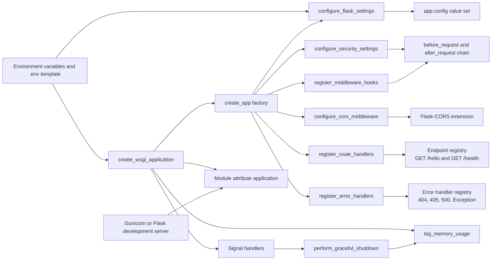
```mermaid
flowchart LR
    EnvSource[Environment variables and .env template]
    CreateApp[create_app factory]
    Settings[configure_flask_settings]
    Security[configure_security_settings]
    CorsConfig[configure_cors_middleware]
    HookConfig[register_middleware_hooks]
    RouteConfig[register_route_handlers]
    ErrorConfig[register_error_handlers]
    AppConfig[app.config value set]
    HookChain[before_request and after_request chain]
    CorsExtension[Flask-CORS extension]
    EndpointRegistry[Endpoint registry<br/>GET /hello and GET /health]
    ErrorRegistry[Error handler registry<br/>404, 405, 500, Exception]
    WsgiBuilder[create_wsgi_application]
    SignalHandlers[Signal handlers]
    ShutdownRoutine[perform_graceful_shutdown]
    MemoryTelemetry[log_memory_usage]
    ApplicationObject[Module attribute application]
    WsgiServer[Gunicorn or Flask development server]

    EnvSource --> Settings
    EnvSource --> WsgiBuilder
    CreateApp --> Settings
    CreateApp --> Security
    CreateApp --> CorsConfig
    CreateApp --> HookConfig
    CreateApp --> RouteConfig
    CreateApp --> ErrorConfig
    Settings --> AppConfig
    Security --> HookChain
    HookConfig --> HookChain
    CorsConfig --> CorsExtension
    RouteConfig --> EndpointRegistry
    ErrorConfig --> ErrorRegistry
    WsgiBuilder --> CreateApp
    WsgiBuilder --> SignalHandlers
    WsgiBuilder --> MemoryTelemetry
    SignalHandlers --> ShutdownRoutine
    ShutdownRoutine --> MemoryTelemetry
    WsgiBuilder --> ApplicationObject
    WsgiServer --> ApplicationObject
```

**Process state transitions.** The application has three configurations but one lifecycle; the states below apply to a single worker process, and request handling adds no state of its own. `Serving` is the only state in which requests are answered, and both terminal transitions pass through the shutdown routine so that memory is reported before exit.

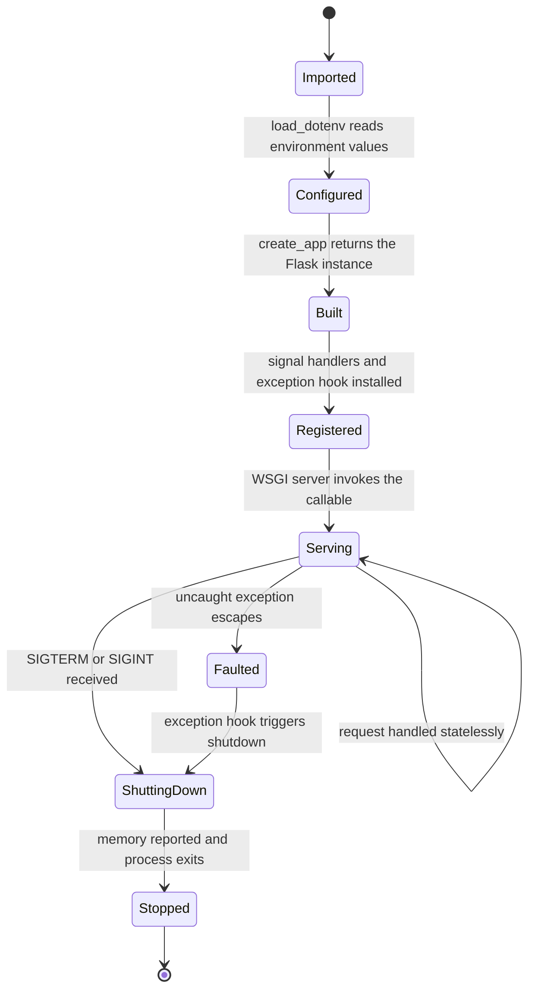
```mermaid
stateDiagram-v2
    [*] --> Imported
    Imported --> Configured : load_dotenv reads environment values
    Configured --> Built : create_app returns the Flask instance
    Built --> Registered : signal handlers and exception hook installed
    Registered --> Serving : WSGI server invokes the callable
    Serving --> Serving : request handled statelessly
    Serving --> ShuttingDown : SIGTERM or SIGINT received
    Serving --> Faulted : uncaught exception escapes
    Faulted --> ShuttingDown : exception hook triggers shutdown
    ShuttingDown --> Stopped : memory reported and process exits
    Stopped --> [*]
```

**Sequence of a successful request.** The numbered sequence shows the hook order, including the reverse-registration ordering of the two `after_request` functions.

```mermaid
sequenceDiagram
    autonumber
    participant Client as HTTP client
    participant Server as Gunicorn worker
    participant WsgiApp as WSGI application object
    participant Hooks as Request hook chain
    participant Handler as hello_route_handler
    Client->>Server: GET /hello
    Server->>WsgiApp: WSGI environ and start_response
    WsgiApp->>Hooks: before_request_middleware
    Hooks->>Hooks: record start time and request id
    Hooks->>Handler: dispatch matched route
    Handler->>Handler: build JSON payload and X-API-Version
    Handler-->>Hooks: 200 response
    Hooks->>Hooks: set X-Response-Time and X-Request-ID
    Hooks->>Hooks: remove Server and apply six security headers
    Hooks-->>Server: final response
    Server-->>Client: 200 application/json
```

**Sequence of a method-not-allowed failure.** This flow shows the error contract in operation, including the `Allow` header populated from the Werkzeug error object.

```mermaid
sequenceDiagram
    autonumber
    participant Client as HTTP client
    participant Server as Gunicorn worker
    participant FlaskApp as Flask application
    participant ErrorHandler as method_not_allowed_handler
    Client->>Server: POST /hello
    Server->>FlaskApp: dispatch request
    FlaskApp->>FlaskApp: URL matched, method rejected
    FlaskApp->>ErrorHandler: invoke 405 handler with error object
    ErrorHandler->>ErrorHandler: log warning and build JSON body
    ErrorHandler->>ErrorHandler: read valid_methods for Allow header
    ErrorHandler-->>Client: 405 application/json with Allow
```

**Sequence of graceful shutdown.** The flow below is what `docker stop`, a Kubernetes termination, or a deployment replacement triggers.

```mermaid
sequenceDiagram
    autonumber
    participant Runtime as Container runtime
    participant Init as dumb-init as PID 1
    participant SignalHandler as Signal handler
    participant Shutdown as perform_graceful_shutdown
    participant Telemetry as log_memory_usage
    Runtime->>Init: send SIGTERM on stop
    Init->>SignalHandler: forward SIGTERM to worker
    SignalHandler->>SignalHandler: set shutdown event and flag
    SignalHandler->>Telemetry: report memory at signal time
    SignalHandler->>Shutdown: perform shutdown for SIGTERM
    Shutdown->>Shutdown: log application context cleanup
    Shutdown->>Telemetry: report memory during shutdown
    Shutdown-->>Runtime: process exits after logging completion
```


## 5.3 Technical Decisions

### 5.3.1 Architecture Style Decisions and Tradeoffs

The dominant decision is to keep the system a stateless single-service application and to spend the architecture's complexity budget on operability — lifecycle handling, hardening, verification and delivery — rather than on distribution. The table records each decision with the alternative that was available and the cost that was accepted.

| Decision area | Choice made | Alternative not taken | Tradeoff accepted |
|---|---|---|---|
| Decomposition | One Flask application serving two `GET` endpoints, composed by a factory (`src/backend/app.py:63-141`) | Splitting routes, health reporting and configuration into separate services or packages | Simpler reasoning and a single deployable, but no independent scaling or versioning of the greeting and health surfaces |
| State posture | Fully stateless; no store of any kind is declared or imported (`src/backend/.env.example:172-194` holds only commented examples) | A session store, cache or database for a service that already has no mutable data | Free horizontal scalability and disposable processes, but no persisted telemetry, no request history, and `uptime` that resets on every restart (`src/backend/app.py:440`) |
| Composition | Application factory with three profiles and three convenience wrappers (`src/backend/app.py:63, :660-690`) | A module-level `app = Flask(__name__)` object | Testability and configuration isolation per process, at the cost of an extra indirection every consumer must follow |
| Process model | External WSGI server; the module exports a callable and never starts a server in production (`src/backend/wsgi.py:510-513, :531`) | Flask's built-in server, or a self-managing process that spawns Gunicorn | Production-grade concurrency and supervision are inherited from the platform, but the application cannot be started with a single command and the target attribute must match the module export exactly |
| Concurrency model | Four synchronous Gunicorn workers with request recycling (`infrastructure/docker/Dockerfile:216`) | Threaded or asynchronous workers, or a higher worker count | Predictable per-request memory and simple reasoning, at the cost of one in-flight request per worker and a hard relationship between worker count and memory ceiling |
| Cross-cutting concerns | Installed once at application level as hooks and an extension (`src/backend/app.py:223, :279, :299, :326`) | Per-route decorators or a chain of custom WSGI middleware classes | Uniform application to every route and error response, but ordering depends on registration order rather than on an explicit pipeline (`src/backend/app.py:223, :326`) |
| API style | Read-only JSON over `GET`, with a single response contract for success and failure (`src/backend/app.py:367-632`) | HTML templates, content negotiation, or write endpoints | Uniform machine-readable responses and no templating dependency, but no human-facing page and no demonstrated write path, since the JSON content-type check is dead code without `POST` or `PUT` routes (`src/backend/app.py:318-321`) |
| Error handling | Explicit per-handler payloads plus framework error handlers, ending in a catch-all `Exception` handler (`src/backend/app.py:412-424, :602-632`) | Flask's default HTML error pages, or letting exceptions propagate to the server | No information leakage through stack traces and one predictable error shape, at the cost of duplicated payload construction in five places |
| Packaging | Container-first: a five-stage image with separate development and production targets (`infrastructure/docker/Dockerfile:9-220`) | Host installation from `requirements.txt`, or a single-stage image | Reproducible, hardened runtime and a debug-capable development target, but a larger artefact and a build pipeline that must be maintained (comment-estimated 200–250 MB development, 100–120 MB production) |
| Quality enforcement | Thresholds asserted in tests and enforced by pipeline gates rather than monitored in production (`src/backend/tests/test_wsgi.py:308-311`; `.github/workflows/ci.yml:94, :161`) | Runtime SLO monitoring with alerting | Failures are caught before release and the envelope is explicit, but the enforced numbers reflect test conditions rather than observed production behaviour |
| Dependency policy | Lower bounds only, with no lock or constraints file (`requirements.txt`; `pyproject.toml:445-448`) | Pinned versions or a compiled lock file with hashes | Faster updates and simpler manifests, at the cost of non-reproducible builds and a moving supply-chain surface |

### 5.3.2 Communication Pattern Choices

All runtime communication is **synchronous request/reply over HTTP**, and every other interaction is a control-plane message rather than a data exchange. Four patterns are in use, and one conspicuous pattern is absent.

| Pattern | Where it appears | Why it fits |
|---|---|---|
| Request/reply over HTTP with JSON bodies | Clients to `/hello` and `/health` (`src/backend/app.py:367, :426`) | Two read-only resources with no shared state require no streaming, no push channel and no session affinity, so the simplest protocol is sufficient |
| In-process callable invocation across a WSGI boundary | Gunicorn to `application` (`src/backend/wsgi.py:523, :531`) | The WSGI contract decouples the application from the server choice; the same callable is also driven in process by the test client and by the live-server tests |
| Signal-driven control messaging | `SIGTERM`, `SIGINT`, `SIGUSR1`, `SIGUSR2` to the worker (`src/backend/wsgi.py:236-246`) | Container runtimes and orchestrators signal termination rather than calling an API, and `dumb-init` as PID 1 guarantees the signal reaches the worker (`infrastructure/docker/Dockerfile:220`) |
| Pull-based health probing | Container `HEALTHCHECK`, Compose health checks and platform probes against `/hello` (`infrastructure/docker/Dockerfile:124-125`; `infrastructure/docker/docker-compose.yml:130-139, :267-276`) | A passive probe requires no exporter or agent, and `/health` disables caching so a proxy cannot return a stale verdict (`src/backend/app.py:449`) |
| Deliberately absent: asynchronous messaging, callbacks, queues and outbound calls | No broker, task queue, webhook or external request exists in the code (`src/backend/.env.example:190-194` documents Redis and Celery only as commented examples) | Nothing in the system produces deferred work, so adding a broker would introduce a failure domain with no compensating capability |

Two consequences deserve to be stated as architecture rather than as configuration. First, because the application never initiates communication, it needs no retry policy, circuit breaker, timeout budget or idempotency key — the absence of these is a property of the design, not an oversight. Second, because liveness is established by probing a business endpoint (`/hello`) rather than a dedicated readiness route, a probe failure and a business-logic failure are indistinguishable from the platform's perspective; `/health` exists and carries richer content but is not the probe target in the image or Compose definitions.

### 5.3.3 Data Storage Solution Rationale

**No data store was selected, and that is the decision.** The service owns a single immutable string constant plus server-generated timestamps, so there is nothing to persist, index, query or migrate. The repository confirms the choice by omission: no database driver, connection string, ORM, migration framework or schema appears in any manifest or module, and the only related lines in the environment template are commented examples marked "not used in tutorial" (`src/backend/.env.example:172-194`). The shutdown routine's cleanup list — database connections, cache invalidation, background tasks and file handles — is a comment describing where those steps would go, and it currently executes none of them (`src/backend/wsgi.py:273-283`).

The rationale rests on four points:

- **The data model is a constant.** `Hello world` is a literal in the handler, so persistence would add failure modes without adding capability (`src/backend/app.py:387`).
- **Statelessness is what makes replication safe.** With no shared store, replicas cannot diverge, and no session affinity is required — which is exactly what the load test's two-worker configuration assumes (`src/backend/tests/test_wsgi.py:881-960`).
- **Configuration is the only state, and it lives outside the process.** The seven active variables in the template carry everything that varies between environments (`src/backend/.env.example:38-162`), read at import time rather than stored in the application.
- **Storage that does exist is infrastructure, not application data.** Five Docker volumes hold virtual environments and pip caches; the container registry holds images by digest; GitHub Actions holds coverage, security and deployment reports for 30 or 90 days (`infrastructure/docker/docker-compose.yml:401-449`; `.github/workflows/ci.yml:105-124, :194-206`).

The costs are explicit. There is no operational history to query, so incident reconstruction depends entirely on whatever the container runtime retained from stdout. There is no schema or migration path, so introducing persistence later means adding a driver, a connection lifecycle, and the shutdown cleanup that is currently only commented. And there is no application data to back up, replicate or restore, which is why no backup or recovery policy exists anywhere in the repository.

### 5.3.4 Caching Strategy Justification

**No application-level cache tier exists, by design rather than by omission.** Both endpoints compute their responses from the clock and a literal, so a cache would hold values that are already unique per request: `/hello` returns a fresh ISO timestamp and `/health` returns a live memory-free status derived from configuration. Adding a shared cache would also reintroduce the coordination that statelessness removes, and the 16 MiB request bound means no response is expensive enough to warrant memoisation (`src/backend/app.py:387-404, :437-449`).

Caching does exist, but only where the content is genuinely reusable or where correctness requires an explicit directive:

| Cache | Purpose and setting | Evidence |
|---|---|---|
| CORS preflight cache | Reuse of the preflight decision for 86400 s, which removes repeated `OPTIONS` round trips for the two permitted origins | `src/backend/app.py:276` |
| Health-response cache suppression | `Cache-Control: no-cache, no-store, must-revalidate` on successful `/health` responses, so neither a platform cache nor an intermediary can answer a probe from cache | `src/backend/app.py:449` |
| Static-file cache age | `SEND_FILE_MAX_AGE_DEFAULT` of one year, applied on the production WSGI path for a service that serves no static files | `src/backend/wsgi.py:171` |
| Docker layer cache with Buildx `type=gha` | Reuse of image layers between CI builds, ordered so that system packages and requirements change least often | `infrastructure/docker/Dockerfile:225-229`; `.github/workflows/cd.yml:225-227` |
| pip caches in named volumes and in Actions | Avoidance of repeated wheel downloads on container restarts and CI runs; the Actions cache is keyed by OS, Python version and both manifest hashes | `infrastructure/docker/docker-compose.yml:401-438`; `.github/workflows/ci.yml:65-72` |

The tradeoff is deliberate and asymmetric: the system accepts recomputation on every request in exchange for having no cache coherency problem, no invalidation path, and no cache to warm. The one place where suppression instead of caching is mandatory is health, because a cached healthy verdict would defeat the purpose of the probe.

### 5.3.5 Security Mechanism Selection

Security is layered at four boundaries, and each layer addresses a specific threat rather than a general one.

| Boundary | Mechanisms selected | Threat addressed | Evidence |
|---|---|---|---|
| Response content | Six hardening headers including `nosniff`, frame denial, a restrictive `Content-Security-Policy` of `default-src 'self'`, and removal of the `Server` header | Content-type sniffing, clickjacking, cross-site scripting and version fingerprinting | `src/backend/app.py:237-247` |
| Cross-origin access | Explicit origin allow-list of two local origins, fixed method and header sets, credentials disabled, preflight cached for a day | Unintended third-party origins reading responses and credential-bearing cross-site requests | `src/backend/app.py:270-276` |
| Session and transport intent | Production sets `PREFERRED_URL_SCHEME=https`, `SESSION_COOKIE_SECURE`, `SESSION_COOKIE_HTTPONLY` and `SameSite=Lax` with a one-hour lifetime | Cookie interception and cross-site request forgery, even though no route currently sets a cookie | `src/backend/app.py:173-178`; `src/backend/wsgi.py:159` |
| Process and container | Non-root UID/GID 1000, `dumb-init` as PID 1, read-only Python files, read-only root filesystem with two 10 MB writable `tmpfs` mounts, all capabilities dropped except `SETGID` and `SETUID`, `no-new-privileges` | Privilege escalation, filesystem tampering and orphaned or unreaped processes | `infrastructure/docker/Dockerfile:41-59, :213, :220`; `infrastructure/docker/docker-compose.yml:314-335` |
| Supply chain | Flake8 with security checks, Bandit at medium severity, Safety, pip-audit, OSSF Scorecard, Trivy against the published image, and SARIF publication to code scanning | Vulnerable dependencies and image layers, and insecure code patterns reaching release | `.flake8:19`; `.github/workflows/ci.yml:155-206`; `.github/workflows/cd.yml:346-405` |

The selection also has deliberate gaps, and they should be read as architectural scope rather than as defects to be discovered later.

- **No authentication or authorisation mechanism exists.** There is no identity provider, token validation, API key check or role model; both endpoints are open, which the requirements justify by the absence of user-specific data. `SECRET_KEY` configures signed-session capability that no route exercises (`src/backend/app.py:161`; `src/backend/tests/test_app.py:507-519`).
- **No secret is supplied at runtime by either orchestration path.** Neither Compose service sets `SECRET_KEY`, so the literal development default `dev-key-change-in-production` is in effect unless the platform injects one (`infrastructure/docker/docker-compose.yml:196-227`; `src/backend/app.py:161`).
- **TLS is not terminated by this component.** The application states a preference for HTTPS but configures no certificate; termination is the platform's responsibility (`.github/workflows/cd.yml:475-490`).
- **Request input is barely validated.** A non-JSON body is logged and accepted, and there is no schema validation, rate limit or body-size check below the 16 MiB Flask bound (`src/backend/app.py:164, :318-321`).
- **One hardening directive is deliberately weakened.** The production Compose service sets `apparmor:unconfined`, annotated in the file as an educational simplification, which removes one of the confinement layers the rest of the configuration works to establish (`infrastructure/docker/docker-compose.yml:316`).

### 5.3.6 Architecture Decision Records

Each record below follows the same shape: the decision as it stands in the code, the alternatives that were available, and the consequences that are observable in the repository.

| ADR | Decision and alternatives | Status | Consequences in the code |
|---|---|---|---|
| ADR-001 | **Application factory over a module-level application object.** Alternatives: a global `app`, a class-based application, or multiple independent Flask instances. | Accepted and implemented | Every consumer builds its own instance; three convenience factories exist; a factory failure raises `RuntimeError` instead of yielding a partially configured application (`src/backend/app.py:63-141, :660-690`) |
| ADR-002 | **Serve production through an external WSGI server.** Alternatives: Flask's development server, a bundled process manager, or an ASGI stack. | Accepted and implemented | `wsgi.py` exports only a callable and logs launch guidance in production; the container supplies Gunicorn with four synchronous workers (`src/backend/wsgi.py:510-513, :531`; `infrastructure/docker/Dockerfile:216`) |
| ADR-003 | **Stateless service with no persistence.** Alternatives: a database for request history, a cache tier, or a session store. | Accepted and implemented | No driver or schema exists; shutdown cleanup is a comment; the statelessness tests assert unique timestamps and no session cookie (`src/backend/wsgi.py:273-283`; `src/backend/tests/test_app.py:482-519`) |
| ADR-004 | **One JSON contract for every outcome, with a catch-all handler.** Alternatives: framework default HTML error pages, or letting the WSGI server render failures. | Accepted and implemented | Five payload shapes are hand-built; the generic handler suppresses stack traces outside debug (`src/backend/app.py:412-424, :454-463, :602-632`) |
| ADR-005 | **Cross-cutting behaviour as application-level hooks and extensions.** Alternatives: per-route decorators, or custom WSGI middleware classes outside Flask. | Accepted and implemented | Hardening, CORS, timing and identifiers apply to error responses too; execution order follows reverse registration order (`src/backend/app.py:223, :279, :299, :326`) |
| ADR-006 | **Configuration entirely from environment variables with three profile presets.** Alternatives: configuration files per environment, a settings library, or build-time environment baking. | Accepted and implemented | `python-dotenv` loads values at import in both entry points; one template documents defaults, validation and platform presets; the shared base dictionary is merged per profile (`src/backend/.env.example:38-162`; `src/backend/app.py:52, :159-207`; `src/backend/wsgi.py:58`) |
| ADR-007 | **Explicit process lifecycle inside the application.** Alternatives: relying solely on the container runtime, or adding a shutdown HTTP endpoint. | Accepted and implemented for termination, incomplete for cleanup | Signals, port validation, memory telemetry and an exception hook are implemented; resource cleanup remains unimplemented and is documented as future work (`src/backend/wsgi.py:192-296, :299-331, :432-474`) |
| ADR-008 | **Container-first delivery with separate development and production targets.** Alternatives: host deployment from requirements, a single-stage image, or a platform buildpack. | Accepted and implemented | Five image stages; production runs non-root under `dumb-init` with read-only Python files; development adds a debugger and reload (`infrastructure/docker/Dockerfile:9-220`) |
| ADR-009 | **CORS restricted to two local development origins with credentials disabled.** Alternatives: a wildcard origin, an environment-driven allow-list, or no CORS support at all. | Accepted and implemented, with scope limits | The origin list is hard-coded in the source, so a deployed front end on any other origin is not permitted until the code changes (`src/backend/app.py:270-276`) |
| ADR-010 | **Quality enforced by pipeline gates rather than by convention.** Alternatives: advisory linting, coverage as a report only, or manual review alone. | Accepted and implemented, currently not satisfiable as configured | Flake8, a 100% branch-coverage gate, Bandit, Safety, pip-audit, OSSF Scorecard and Trivy all gate the pipeline; three divergent pytest configurations and an unresolvable test import path prevent the gate from being met by the suite as delivered (`pytest.ini:32`; `src/backend/pytest.ini:8`; `pyproject.toml:158`; `src/backend/tests/test_app.py:54`; `.github/workflows/ci.yml:74-94, :276-326`) |
| ADR-011 | **Image deployed by digest rather than by mutable tag.** Alternatives: deploy `latest`, or rebuild on the target host. | Accepted and implemented | Every environment deploy references the build job's digest output, giving reproducible rollback targets, while the tag set is retained for human selection (`.github/workflows/cd.yml:213-256, :481, :693`) |

### 5.3.7 Architecture Decision Tree

The tree below encodes the decision sequence the codebase actually implements: how the process starts, which profile is selected, and which serving path results. Reading it downward answers the operational question "what will run if I start this system this way?"

```mermaid
flowchart TD
    StartQ{How is the process started?}
    StartQ -->|python app.py| DevEntry[Build development application<br/>Flask server, debug on, reloader off]
    StartQ -->|python wsgi.py| DirectEntry[Install exception hook and signal handlers<br/>then build the application]
    StartQ -->|gunicorn wsgi:application| ImportEntry[Imported module branch<br/>install signal handlers, then build the application]

    DirectEntry --> EnvQ{Which FLASK_ENV value?}
    ImportEntry --> EnvQ
    EnvQ -->|production or unset| ProdProfile[Production profile<br/>debug off, HTTPS preferred, secure cookies]
    EnvQ -->|development| DevProfile[Development profile<br/>debug from FLASK_DEBUG, 24 hour session lifetime]
    EnvQ -->|testing| TestProfile[Testing profile<br/>TESTING true, CSRF disabled]

    DirectEntry --> ServeQ{Is the value development?}
    ServeQ -->|yes| SelfServe[Start the Flask development server]
    ServeQ -->|no| GuideOnly[Log the Gunicorn command and return]

    ProdProfile --> WorkerQ{Where does it run?}
    WorkerQ -->|Compose production service| ComposeServe[gunicorn wsgi:application<br/>container 3000, host 3001]
    WorkerQ -->|Azure Web App| AzureServe[Image digest deploy<br/>platform port 8000, 2 or 4 workers]
    WorkerQ -->|bare docker run| ImageCommand[gunicorn wsgi:app<br/>attribute not exported by the module]
```

Two paths in the tree are notable because they are the ones an operator is most likely to take. Starting `python wsgi.py` with `FLASK_ENV=production` produces a process that logs its deployment report and exits without serving, which is intentional: the module refuses to be the production server. Starting the bare image without Compose invokes a target attribute the module does not export, so the container exits at startup — the Compose override, not the image command, is what makes the published artefact runnable today (`infrastructure/docker/Dockerfile:220`; `infrastructure/docker/docker-compose.yml:263`; `src/backend/wsgi.py:531`).


## 5.4 Cross-Cutting Concerns

### 5.4.1 Monitoring and Observability

Observability is delivered entirely by mechanisms that ship inside the artefact: a health endpoint, in-process memory telemetry written to the log stream, and the probes that the container runtime and delivery pipelines already run. No metrics endpoint, no APM agent and no external monitoring service is configured anywhere in the repository.

| Signal | Mechanism | Threshold or interval | Evidence |
|---|---|---|---|
| Liveness | `curl -f http://localhost:3000/hello` from the image's `HEALTHCHECK`; Compose repeats the probe with its own timing | 30 s interval, 10 s timeout, 15 s start period, 3 retries in production; 15 s interval and 5 s start period in development | `infrastructure/docker/Dockerfile:124-125, :174-175, :209-210`; `infrastructure/docker/docker-compose.yml:130-139, :267-276` |
| Service detail | `GET /health` returns status, timestamp, `uptime`, version, environment and debug flag, with caching suppressed on success | Returned per call; 503 with `status: unhealthy` if the handler raises | `src/backend/app.py:426-463` |
| Resident memory | `psutil` reports RSS, VMS, memory percentage and PID at start-up, on every trapped signal, during shutdown and on uncaught exception | Warns above the 75 MB target | `src/backend/wsgi.py:334-373, :192-296, :432-474` |
| Request-level latency | `X-Response-Time` header plus a completion log line carrying method, path, status and milliseconds | Not alerted on; visible in logs and responses | `src/backend/app.py:341-346` |
| Release health | CD staging and production pipelines poll the deployed endpoint, run smoke tests, then monitor `GET /hello` for six minutes at 30 s intervals | Production marks `rollback_required` once the observed failure rate exceeds 20% | `.github/workflows/cd.yml:501-616, :824-862` |
| Security posture | Bandit, Safety, pip-audit, OSSF Scorecard and Trivy results published as SARIF to GitHub code scanning, with artefacts retained 90 days | Gate fails on any critical Trivy finding or any Safety vulnerability; medium-and-above Bandit findings fail CI | `.github/workflows/ci.yml:155-206`; `.github/workflows/cd.yml:346-405` |
| Test and coverage evidence | JUnit XML, HTML and coverage reports uploaded per Python version and retained 30 days, with coverage sent to Codecov | Non-blocking on Codecov failure | `.github/workflows/ci.yml:96-124` |

What the architecture therefore cannot do is worth stating plainly. There is no time-series store, so no metric can be graphed or alerted on and no trend over time exists. There is no p95 or p99 latency measurement; the assertions in the suite are means, maxima over a 50-request burst, and benchmark means. There is no readiness endpoint distinct from the business route, and the container probes `/hello` rather than `/health`, so the richer payload is available to operators but is not what the runtime acts on. `/health` reports configuration echo and a `time.time()` value rather than a genuine elapsed uptime, so it cannot be used to detect an unexpected restart. Finally, because memory telemetry writes to the log rather than to a metric, an operator learns of a 75 MB breach only by reading container logs or by observing a platform-level memory alert.

### 5.4.2 Logging and Tracing Strategy

**Logging.** Both entry modules call `logging.basicConfig` at import time with the same format — `%(asctime)s - %(name)s - %(levelname)s - %(message)s` — and a fixed level of `INFO` (`src/backend/app.py:56-60`; `src/backend/wsgi.py:62-70`). `wsgi.py` additionally attaches two `StreamHandler`s, one to stdout and one to stderr, so in the WSGI entry path every record is written to both streams and appears twice in a combined container log view. Structured records are not used; each line is a formatted human-readable string with an emoji prefix marking its stage.

| Log stream | Content | Emitted from |
|---|---|---|
| Factory and configuration | Start-up banner, profile selected, debug flag, completion or failure with troubleshooting hints | `src/backend/app.py:87-139, :181-212` |
| Registration | Confirmation that hardening, CORS, hooks, routes and error handlers are registered, with the endpoint list | `src/backend/app.py:255, :281-283, :354, :465-467, :634-636` |
| Request lifecycle | `Incoming request: <method> <path>` at entry and `Request completed: <method> <path> - <status> - <ms>` at exit, plus a warning for non-JSON bodies | `src/backend/app.py:313, :321, :345` |
| Handler activity | Processing and completion lines for `/hello` and a completion line for `/health` | `src/backend/app.py:383, :407, :451` |
| Error reporting | Warning-level lines for 404 and 405, error-level lines with type, message, path and method for 500, and a generic unhandled-exception line; full tracebacks only when debug is enabled | `src/backend/app.py:496-497, :531-532, :573-582, :615-620` |
| Process lifecycle | Deployment report at start-up (Python version, host and port, PID, platform, start commands, endpoints), memory reports, signal receipt, and shutdown completion | `src/backend/wsgi.py:376-429, :224-234, :268-291, :453-467` |
| Server access and error logs | Gunicorn writes access and error logs to stdout and stderr at `info` level in the production image | `infrastructure/docker/Dockerfile:216` |
| Test-run logging | pytest CLI logging at INFO plus a debug-level log file, configured separately by each pytest configuration | `pytest.ini:70-77`; `src/backend/pytest.ini:44-60` |

Two configuration weaknesses are observable rather than hypothetical. The log level is hard-coded to `INFO` in both modules, so the `LOG_LEVEL` variable documented in the environment template is never read, and the same is true of the `LOG_LEVEL` values in the unused `FLASK_CONFIGS` mapping and of the `LOG_LEVEL` environment values set by both Compose services (`src/backend/.env.example:98-116`; `src/backend/app.py:641-657`; `infrastructure/docker/docker-compose.yml:70, :211`). The `WORKERS` variable is likewise documented and set but read by no code (`src/backend/.env.example:122-141`; `infrastructure/docker/dockerfile`-referenced Gunicorn arguments supply the real worker count).

**Tracing.** Tracing is limited to one identifier: `before_request` sets `request.id` to `req_<epoch-milliseconds>`, `after_request` copies it into the `X-Request-ID` response header, and the 500 error handler includes it in the response body (`src/backend/app.py:316, :350, :591`). Three limits follow. The identifier is derived from a clock rather than from a counter or UUID, so concurrent requests within the same millisecond share an identifier. It is not injected into any log record, so a response header cannot be correlated to a log line without matching on timestamp and path. And nothing propagates it downstream, because the service makes no outbound call. There is therefore no distributed trace, no span, and no correlation across the four Gunicorn workers. The practical tracing workflow in this system is the request's own `X-Request-ID` plus the completion log line's method, path, status and millisecond count, correlated by time.

### 5.4.3 Error Handling Patterns

Error handling is layered by scope, and each layer has a defined owner and a defined output. Failures that occur while composing the application are treated as fatal; failures that occur while serving a request are always converted to JSON.

| Layer | Condition | Handler and output | Server-side logging |
|---|---|---|---|
| Configuration composition | Any exception inside `create_app` | Re-raised as `RuntimeError`; startup aborts | Error level with exception type, message and four troubleshooting hints (`src/backend/app.py:126-141`) |
| Extension setup | Flask-CORS initialisation failure | Re-raised as `RuntimeError`; startup aborts | Error level with the underlying exception (`src/backend/app.py:285-288`) |
| Handler scope | Exception inside `/hello` | Handler returns 500 JSON with `status: error` and an endpoint-specific message | Error level with the exception (`src/backend/app.py:412-424`) |
| Handler scope | Exception inside `/health` | Handler returns 503 JSON with `status: unhealthy` and the exception text | Error level with the exception (`src/backend/app.py:454-463`) |
| Framework scope | Unknown path | 404 handler returns JSON echoing path, method and timestamp | Warning level (`src/backend/app.py:479-516`) |
| Framework scope | Unsupported method on a known path | 405 handler returns JSON with `allowed_methods` and an `Allow` header | Warning level (`src/backend/app.py:518-554`) |
| Framework scope | HTTP 500 | 500 handler returns a generic JSON body with `request_id`; the stack trace is logged only when debug is on | Error level, with `exc_info` in debug (`src/backend/app.py:556-600`) |
| Framework scope | Any other exception | Catch-all `Exception` handler returns a 500 JSON body with a generic message | Error level, with `exc_info` in debug (`src/backend/app.py:602-632`) |
| Process scope | Exception escaping the request scope | `sys.excepthook` replacement logs type and message, records memory, and triggers graceful shutdown; `KeyboardInterrupt` is delegated to the default hook | Error level; traceback only when `FLASK_ENV` is `development` (`src/backend/wsgi.py:432-474`) |
| Input bound | Body larger than 16 MiB | Flask rejects before dispatch using `MAX_CONTENT_LENGTH` | Not explicitly handled, so it surfaces through the framework handler path (`src/backend/app.py:164`) |

The patterns deliberately absent are as informative as the ones present. There is no retry, no circuit breaker, no bulkhead, no fallback response and no dead-letter mechanism, because the application has no downstream dependency to protect itself from. There is no idempotency handling, which is safe for two `GET` endpoints but would be required before any write endpoint is added. There is no rate limiting or request throttling, leaving the 16 MiB body bound and the platform's own protections as the only abuse controls. And there is no compensation or rollback at the application level; reconciliation is handled at the delivery layer by redeploying a previous image digest.

One inconsistency in the contract is worth recording because it affects error-path hygiene: the 503 body returned when the health handler raises echoes the raw exception text to the client (`error: str(e)`), whereas the 500 handlers are explicitly written to avoid disclosing internal detail — so exception messages that would be suppressed on `/hello` are exposed on `/health` (`src/backend/app.py:454-463` versus `:584-592`).

### 5.4.4 Authentication and Authorization

**No authentication or authorization mechanism exists in this system.** Both endpoints are public and anonymous, which is consistent with their content: `/hello` returns a constant and a timestamp, and `/health` returns configuration echo and process metadata, neither of which is user-specific. The evidence is the absence itself — no authentication dependency appears in any manifest, no route or hook inspects a credential, and there is no token, key, role or permission model, no login route and no session read or write anywhere in the code.

What exists adjacent to authentication is capability that is configured but unused, and boundary controls that are not authorization:

| Element | What it is | What it is not |
|---|---|---|
| `SECRET_KEY` with production secure-cookie flags | Flask's signed-cookie capability, configured in every profile and required by the factory to start | An authentication mechanism; no route creates or reads a session, and the tests assert `/hello` sets no cookie (`src/backend/app.py:161, :173-178`; `src/backend/tests/test_app.py:507-519`) |
| CORS origin allow-list | A browser-side control limiting which origins may read responses | An access control; it constrains browser behaviour only, and any non-browser client is unaffected (`src/backend/app.py:270-276`) |
| Container and network isolation | Non-root execution, dropped capabilities, a private Compose bridge network, and only the mapped port reachable | Authorization; anything that can reach the port can call both endpoints (`infrastructure/docker/docker-compose.yml:314-335, :368-394`) |
| Pipeline credentials | `GITHUB_TOKEN`, plus Azure staging and production publish profiles held in GitHub secrets | Application authentication; these authorize deployment, not request handling (`.github/workflows/cd.yml:166-171, :477-481`) |

Three consequences should be treated as architecture to be extended rather than defects to be fixed. Any client that can reach the service can call every endpoint, so a future write or user-specific endpoint requires an identity layer before it is exposed. There are no authorization checkpoints, so there is nothing in the codebase currently enforcing who may read health metadata, which can disclose environment name, version and debug state. And the environment template already reserves the variable names a JWT- or session-based scheme would need, alongside a learning-guide list covering Flask-Login and OAuth 2.0 as future topics, so the intended extension path is documented even though no part of it is implemented (`src/backend/.env.example:178-182`; `src/backend/README.md`).

### 5.4.5 Performance Requirements and SLAs

There is no contractual SLA in this repository. What exists is a set of numeric targets asserted by the test suite, enforced by the pipeline, and supported by container resource policy — which is a stronger guarantee than documentation but a weaker one than a monitored service-level objective, because it describes test conditions rather than observed production behaviour.

| Requirement | Target | Where enforced or asserted |
|---|---|---|
| Cold start to ready | Below 100 ms | WSGI startup assertion with a live Gunicorn process (`src/backend/tests/test_wsgi.py:308, :454`) |
| Warm `/hello` response | Below 50 ms mean | In-process assertion and live-server benchmark mean (`src/backend/tests/test_app.py:184`; `src/backend/tests/test_wsgi.py:768`) |
| Latency under concurrency | Below 50 ms average and below 100 ms maximum across 50 concurrent in-process requests; below 50 ms average for 100 concurrent requests across two live workers | `src/backend/tests/test_app.py:454-455`; `src/backend/tests/test_wsgi.py:960` |
| Request success rate under load | At least 95% | 100-request concurrent test and the 10-second pipeline load phase (`src/backend/tests/test_wsgi.py:954, :1258`) |
| Resident memory | Below 75 MB, with growth ceilings of 5 MB per in-process test, 10 MB per WSGI test and 20 MB over 50 requests | `src/backend/tests/test_app.py:426-427, :690`; `src/backend/tests/test_wsgi.py:148, :188-189, :843` |
| Branch coverage | 100%, run fails below the threshold | `pytest.ini:43`; `.github/workflows/ci.yml:94, :276-280` |
| Full deployment lifecycle | Startup, validation, load and shutdown inside 60 s, with shutdown within 10 s | `src/backend/tests/test_wsgi.py:511, :1309` |
| Container resources | 128 MB and 0.5 CPU limits with 75 MB and 0.25 CPU reservations | `infrastructure/docker/docker-compose.yml:282-286` |
| Probe tolerance at start-up | 15 s start period in the production image; 45 s staging and 75 s production warm-up before pipeline polling | `infrastructure/docker/Dockerfile:209`; `.github/workflows/cd.yml:493-501` |

The capacity model behind these numbers is simple and worth stating explicitly: four synchronous workers, each handling one request at a time, each recycling after 1000 requests with a jitter of 100, behind a 30-second worker timeout and 1000 connections per worker (`infrastructure/docker/Dockerfile:216`). Since both endpoints are constant-time and touch no external resource, the practical limit is worker count rather than work per request, and memory is the binding constraint on that count — the 75 MB target and the 128 MB container limit leave headroom for roughly one additional worker at the reservation figure, not several.

Startup expectations are stated inconsistently and both statements are recorded: the root guide targets "Startup Time: < 5 seconds for Flask development server" (`README.md:836`), while the environment template budgets under 0.2 s for environment-variable processing alone (`src/backend/.env.example:277-280`). Neither is enforced by a gate; only the 100 ms WSGI cold-start assertion is. Two further limitations bound how much these numbers prove: no percentile latency is measured anywhere, so tail behaviour is uncharacterised, and the longest sustained load in the suite is a ten-second phase at roughly ten requests per second, which is far below the concurrency the container configuration would permit.

### 5.4.6 Disaster Recovery and Availability

**Recovery scope is limited by the stateless design.** Because the service holds no application data, there is nothing to back up, restore, replicate or point-in-time recover, and no backup job, replica or restore procedure exists anywhere in the repository. The assets that must survive a loss are therefore the code, the image and the configuration, and each has its own continuity mechanism.

| Asset | Loss mode | Recovery mechanism present |
|---|---|---|
| Application source | Working tree loss or bad merge | Version control history; CI runs against `main` and `develop` and gates merges (`.github/workflows/ci.yml:3-14`) |
| Container image | Local image loss or platform redeploy | Registry copy in `ghcr.io` published per commit with branch, SHA, semver and `latest-python` tags, and every deploy pinned to a digest (`.github/workflows/cd.yml:174-238, :481`) |
| Runtime configuration | Container recreation | Environment variables supplied by Compose or the platform rather than baked into the image (`infrastructure/docker/docker-compose.yml:196-227`; `.github/workflows/cd.yml:486-490`) |
| Dependency caches | Volume removal | Disposable; rebuilt by pip on the next start, costing build time only (`infrastructure/docker/docker-compose.yml:401-438`) |
| Pipeline credentials | Secret rotation | Held in GitHub secrets, not in the checkout (`.github/workflows/cd.yml:477-481`) |

Availability is likewise established by the platform rather than by redundancy in this system: one production replica, a restart policy limited to three attempts within a 120-second window, a one-at-a-time rolling update with rollback on failure, and a `dumb-init` entrypoint that makes `SIGTERM`-based termination reliable (`infrastructure/docker/docker-compose.yml:252, :279-299`; `infrastructure/docker/Dockerfile:220`).

| Failure mode | Detection | Response available today |
|---|---|---|
| Worker process exits | Container runtime notices the exit and applies the restart policy | Restart, up to three attempts in 120 s; beyond that the container stays down (`infrastructure/docker/docker-compose.yml:295-299`) |
| Container becomes unresponsive but alive | `HEALTHCHECK` fails three consecutive probes | Marked unhealthy; remediation is the orchestrator's responsibility (`infrastructure/docker/Dockerfile:209-210`) |
| Faulty release reaches staging | Staging wait-and-poll cycle plus six smoke tests | Pipeline stops before production (`.github/workflows/cd.yml:501-616`) |
| Faulty release reaches production | 75 s warm-up, 18 polling attempts, five smoke tests, then six minutes of monitoring | `rollback_required` is set once the failure rate exceeds 20%, leaving re-deployment of the previous digest as the recovery action (`.github/workflows/cd.yml:694-705, :824-862`) |
| Coverage-reporting service unavailable | Upload step fails | Non-blocking by explicit configuration (`fail_ci_if_error: false`), so delivery continues (`.github/workflows/ci.yml:96-103`) |
| Registry or build unavailable | Build job fails | No deployment occurs; the previously deployed digest keeps serving (`.github/workflows/cd.yml:102-256`) |
| Memory growth or leak | In-process telemetry warns above 75 MB, and request recycling caps per-worker growth | Worker recycling after 1000 requests with jitter 100 (`src/backend/wsgi.py:362`; `infrastructure/docker/Dockerfile:216`) |

The gaps in recovery posture are material and are recorded as such. No recovery time objective or recovery point objective is defined anywhere, so recovery is bounded only by the platform's restart behaviour and the pipeline's monitor window. There is no automated rollback: the pipeline flags that rollback is required, and a human must dispatch a deployment of the previous digest. There is no documented runbook, escalation path or on-call procedure in the repository. Because the production service runs a single replica, a container outage during the restart window is a full outage rather than a degradation. And because environment configuration lives in platform settings that the repository cannot verify, restoring a lost environment requires knowledge that exists only outside the codebase.

### 5.4.7 Error Handling Flow

The diagram traces every failure class through the layer that owns it, ending at the response the client receives or, for a failure that escapes the request scope, at the exception hook that begins an orderly process shutdown.

```mermaid
flowchart TD
    Request[Request enters the WSGI worker]
    Match{Route matches path and method?}
    Handler[Route handler executes]
    Raised{Handler raises an exception?}
    HandlerError[Handler returns its own JSON error<br/>500 for hello, 503 for health]
    NotFound[404 handler returns JSON<br/>path, method and timestamp]
    MethodRejected[405 handler returns JSON<br/>allowed_methods plus Allow header]
    Escaped{Exception reaches Flask unhandled?}
    GenericError[Generic handler returns 500 JSON<br/>generic message, no stack trace]
    Emitted[after_request chain adds timing,<br/>request id and security headers]
    Delivered[Client receives the JSON response]
    ProcessScope{Exception escapes the request scope?}
    Excepthook[Exception hook logs type and message,<br/>reports memory, then graceful shutdown]

    Request --> Match
    Match -->|unknown path| NotFound
    Match -->|unsupported method| MethodRejected
    Match -->|matched| Handler
    Handler --> Raised
    Raised -->|yes| HandlerError
    Raised -->|no| Emitted
    HandlerError --> Emitted
    NotFound --> Emitted
    MethodRejected --> Emitted
    Handler --> Escaped
    Escaped -->|yes| GenericError
    GenericError --> Emitted
    Escaped -->|no| ProcessScope
    ProcessScope -->|yes| Excepthook
    Emitted --> Delivered
```


## 5.5 References

### 5.5.1 Repository Sources

- `src/backend/app.py` — application factory and its six composition functions, the three environment profiles and their configuration keys, the security-header filter, the CORS policy, the request lifecycle hooks and their headers, both route handlers and their payloads, the four error handlers, the unused `FLASK_CONFIGS` mapping, the convenience factories and the direct-development-server block.
- `src/backend/wsgi.py` — WSGI callable and `__all__`, dual module execution paths, environment resolution and port validation, WSGI-specific settings, signal handling for `SIGTERM`/`SIGINT`/`SIGUSR1`/`SIGUSR2`, graceful shutdown with its commented future cleanup steps, memory telemetry and the 75 MB warning, the logged deployment report, and the `sys.excepthook` replacement.
- `src/backend/tests/test_app.py` — in-process assertions for factory and profile behaviour, route payloads and headers, error contracts, hardening headers, CORS, middleware output, memory ceilings and growth limits, the 50-request concurrent burst with its latency bounds, benchmarks, statelessness and the absence of session cookies.
- `src/backend/tests/test_wsgi.py` — live Gunicorn integration assertions for startup readiness, cold-start timing, dynamic port binding, `SIGTERM` shutdown within 10 s with exit code 0, in-process endpoint behaviour, benchmark means, memory growth over 50 requests, 100-request concurrent load with a 95% success threshold, and the four-phase end-to-end lifecycle under 60 s.
- `src/backend/.env.example` — the seven active configuration variables with their defaults and validation rules, the commented future integration examples for database, JWT/session, external API and Redis/Celery, platform port presets, and the documented start-up performance expectations.
- `src/backend/pytest.ini` — backend test discovery path, coverage source and threshold, ten test markers, timeout and logging configuration, and required plugin floors.
- `src/backend/requirements.txt` — backend dependency groups, including `psutil`, and the lower-bound version policy.
- `src/backend/README.md` — the backend guide's endpoint contract, its JSON `/hello` documentation, the `service` field attributed to `/health`, and the documented Gunicorn launch command.
- `infrastructure/docker/Dockerfile` — the five build stages, base-image and package selection, non-root user creation, environment defaults, virtual environment layout, health-check parameters for each target, development debugger and reload command, production Gunicorn command and argument set, read-only Python files, hardening notes and the comment-estimated image sizes.
- `infrastructure/docker/docker-compose.yml` — development, production and network-setup services with their build targets, environment blocks, port mappings, volume mounts, commands, health checks, labels, security options, resource limits and deployment policy, plus the custom bridge network and the five named volumes.
- `requirements.txt` — the five-package runtime manifest installed by the image and the absence of `psutil` from it.
- `pytest.ini` — root test discovery and coverage settings, including `--cov=src/backend` and the absent `.coveragerc` reference, required plugin floors, the 300-second threaded timeout and the 100% fail-under threshold.
- `pyproject.toml` — package identity and version, the `>=3.12` Python floor, pytest discovery and coverage sources that differ from the other two configurations, and the dependency declaration policy without a lock file.
- `.flake8` — the effective lint configuration: 88-character limit, selected rule families including security and import order, and complexity ceilings.
- `.github/workflows/ci.yml` — CI triggers, the Python version matrix, the working directory and install steps, the Flake8 invocation, the pytest coverage invocation and its gate, Codecov and artefact uploads, the security job's scanner configuration and SARIF publication, and the quality gate's coverage and security validation logic.
- `.github/workflows/cd.yml` — the registry and image identity, Buildx platforms and metadata, digest outputs, Trivy scanning and gates, staging and production deployment steps with their environment variables, health-check and smoke-test sequences, the production monitoring window with its rollback flag, and the deployment report job.
- `README.md` — the root guide's plain-text `/hello` contract with its documented content type and length, its port-5000 configuration examples, its `wsgi:app` launch commands, its test snippets asserting a text response, and its startup-time target.

### 5.5.2 Repository Folders

- `src/backend/` — the Flask implementation, WSGI entry point, environment template, dependency and test configuration, test suite, and backend guide that together form the application and process layers documented in 5.2.
- `src/backend/tests/` — the two pytest modules that constitute the verification harness described in 5.2.6.
- `infrastructure/docker/` — the image build definition, orchestration description and build-context exclusion policy that constitute the container layer described in 5.2.5.
- `.github/workflows/` — the CI and CD pipelines that verify, publish and deploy the artefact described in 5.1.3 and 5.1.4.

### 5.5.3 External Sources

No external source was consulted. Every architectural claim in this section derives from the repository files listed above; numeric targets are quoted from test assertions, health-check parameters, container resource policy and pipeline timeouts rather than from vendor documentation or published benchmarks.


# 6. SYSTEM COMPONENTS DESIGN

## 6.1 Core Services Architecture

### 6.1.1 Applicability Statement and Architectural Model

**Determination: Core Services Architecture is not applicable for this system.** No microservice, distributed or multi-service architecture exists in this repository. The delivered system is one stateless Flask application that serves two read-only JSON endpoints, packaged as one container image and run as one process tree per instance (`src/backend/app.py:63-141`, `src/backend/wsgi.py:78-144`, `infrastructure/docker/Dockerfile:101-132`). It owns no database, cache, message broker or session store, makes no outbound call to any other system, and is deployed as a single digest-pinned image to one hosting target at a time (`requirements.txt`, `.github/workflows/cd.yml:213-256, :693-705`). Sections 5.1.1 and 5.3.1 reach the same conclusion about the architectural style; this section documents the service-shaped parts of that design — its single service boundary, its process and worker model, its scaling envelope and its resilience mechanisms — and records explicitly where each requested distributed-systems area is absent rather than implemented.

**Why the distributed patterns do not apply.** Service-oriented mechanisms exist to manage relationships between independently deployed components. This system has one component, so the mechanisms have no subject:

- **Inter-service communication and service discovery** require a second service to call or to locate.
- **Circuit breakers, retries and fallbacks** protect a caller from a failing downstream dependency; the application has no downstream dependency, as section 5.3.2 records.
- **Load balancing across service instances** requires more than one running instance; the production Compose service fixes `replicas: 1` (`infrastructure/docker/docker-compose.yml:289`).
- **Horizontal auto-scaling** requires a metrics-driven controller; no autoscaler, scaling rule or replica controller is defined in the image, the Compose file or the deployment workflow.

**What does exist, and is documented below.** One service boundary with a defined public contract; a multi-process concurrency model inside the instance; resource-bounded scaling between environments; and resilience that lives in the WSGI server, the container runtime and the delivery pipeline. The single Compose "service" that is not an application service — `flask-network-setup`, an `alpine:3.19` container that joins the bridge network and exits (`infrastructure/docker/docker-compose.yml:346-367`) — is a one-shot initialisation utility, not a runtime service component.

**Deployment units and serving processes.** Every runtime form of the system is the same application artefact under a different serving process, which is the frame for the sections that follow.

| Environment | Serving process and concurrency | Endpoint exposure |
|---|---|---|
| Local development | Flask development server, single process, reloader disabled (`src/backend/app.py:737-742`) | `http://localhost:8000` by default (`src/backend/app.py:721-722`) |
| Container development (Compose) | `debugpy` on 5678 plus `flask run --debug --reload`, one process (`infrastructure/docker/Dockerfile:171-179`) | Host ports 3000 and 5678 published (`infrastructure/docker/docker-compose.yml:85-89`) |
| Container production rehearsal (Compose) | Gunicorn, four synchronous workers with request recycling (`infrastructure/docker/docker-compose.yml:263`) | Host port 3001 mapped to container port 3000 (`infrastructure/docker/docker-compose.yml:230-231`) |
| Azure staging | Platform-hosted container image, `GUNICORN_WORKERS: 2`, `PORT: 8000` (`.github/workflows/cd.yml:484-490`) | `https://flask-tutorial-staging.azurewebsites.net` (`.github/workflows/cd.yml:445-446`) |
| Azure production | Platform-hosted container image, `GUNICORN_WORKERS: 4`, `PORT: 8000` (`.github/workflows/cd.yml:699-705`) | `https://flask-tutorial.azurewebsites.net` (`.github/workflows/cd.yml:637-638`) |

**Scope boundaries of this section.** The application's internal composition — the factory, middleware hooks, route handlers, error handlers and their interfaces — is documented in section 5.2. The communication patterns and the decision to remain a single service are documented in section 5.3. Observability, performance targets and recovery posture are treated in section 5.4. This section concentrates on the service boundary and its responsibilities, the concurrency and scaling envelope around that boundary, and the mechanisms that keep a single-instance service available.


### 6.1.2 Service Components

**Service inventory.** The repository defines exactly one application service and two supporting runtime units. All three are expressed in `infrastructure/docker/docker-compose.yml`.

| Service or unit | Role | Runtime form | Evidence |
|---|---|---|---|
| `flask-tutorial-prod` | The application service under documentation: serves the public HTTP contract in production shape | Gunicorn `wsgi:application`, four synchronous workers, container port 3000, host port 3001 | `infrastructure/docker/docker-compose.yml:175-264` |
| `flask-tutorial-dev` | Development instance of the same application service with a debugger and reload enabled | `debugpy` on 5678 plus `flask run --debug --reload`, ports 3000 and 5678 | `infrastructure/docker/docker-compose.yml:34-174` |
| `flask-network-setup` | One-shot network initialisation utility; starts, joins the bridge network and exits | `alpine:3.19` container | `infrastructure/docker/docker-compose.yml:346-367` |

**Boundaries and responsibilities.** The service boundary is the process boundary of one Flask application object; everything the service owes its consumers and operators is expressed either as an HTTP contract or as process behaviour.

| Responsibility | What it covers | Where it is implemented |
|---|---|---|
| Public HTTP contract | Two `GET` routes with JSON bodies and per-endpoint headers; unmatched paths and methods answered with the same JSON shape | `src/backend/app.py:358-467, :470-636` |
| Cross-cutting response policy | Security headers, `Server` header removal, CORS policy, request timing and request identifiers applied to every response including errors | `src/backend/app.py:215-355` |
| Startup configuration and validation | Profile selection from `FLASK_ENV`, base and per-environment settings, environment loading, port range validation; misconfiguration aborts startup rather than degrading | `src/backend/app.py:144-212`, `src/backend/wsgi.py:78-144, :299-331` |
| Process lifecycle | WSGI callable export, signal trapping for `SIGTERM`/`SIGINT`/`SIGUSR1`/`SIGUSR2`, memory telemetry, exception hook, graceful-shutdown routine | `src/backend/wsgi.py:192-296, :432-474, :518-531` |
| Packaging and supervision | Image stages, health-check declaration, start command, non-root execution, `dumb-init` as PID 1, read-only application files | `infrastructure/docker/Dockerfile:101-220` |
| Release verification | Lint, test with a coverage gate, dependency and static security scans, image build by digest, staging gate, production smoke tests and post-release monitoring | `.github/workflows/ci.yml:38-341`, `.github/workflows/cd.yml:102-1028` |

**Inter-service communication patterns.** There is no service-to-service communication of any kind: the application code contains no outbound HTTP client, no broker producer or consumer, and no queue or RPC dependency, and `requests` appears only as a test-client dependency (`src/backend/requirements.txt`). What the service participates in is three forms of external control interaction, all synchronous.

| Interaction | Direction | Pattern |
|---|---|---|
| Public API calls | Inbound from HTTP clients | Synchronous request/reply over HTTP with a JSON body; stateless, no session affinity and no cookies issued (`src/backend/app.py:367-463`) |
| Termination | Inbound from the container runtime | POSIX signals `SIGTERM`, `SIGINT` and, where available, `SIGUSR1`/`SIGUSR2`; `dumb-init` as PID 1 guarantees delivery to the worker (`infrastructure/docker/Dockerfile:220`, `src/backend/wsgi.py:236-246`) |
| Liveness and readiness probing | Inbound pull from the runtime and pipeline | HTTP `GET /hello` from the image `HEALTHCHECK`, the Compose health check and the deployment workflows; `GET /health` carries richer state but is not what the probes call (`infrastructure/docker/Dockerfile:124-125, :209-210`, `infrastructure/docker/docker-compose.yml:267-276`, `.github/workflows/cd.yml:501-531`) |
| Artefact and configuration transport | Outbound from the pipeline to registry and platform | Image pushed to `ghcr.io` and pulled by digest; runtime configuration injected as environment variables rather than baked into the image (`.github/workflows/cd.yml:166-256, :477-490`) |

**Service discovery mechanisms.** None exist. Addressing is entirely static and supplied from outside the application: Gunicorn binds `0.0.0.0:3000` from the image environment (`infrastructure/docker/Dockerfile:216`), Compose publishes host 3001 to that port (`infrastructure/docker/docker-compose.yml:230-231`), and the deployment workflow contains literal application names and hostnames — `flask-tutorial-staging` and `flask-tutorial-production` (`azure/webapps-deploy@v2`, `.github/workflows/cd.yml:477-481, :689-693`) and their `*.azurewebsites.net` URLs (`.github/workflows/cd.yml:446, :638`). The only name resolution in the repository is Docker Compose's own: the custom bridge network `flask-tutorial-network` (bridge name `flask-br0`, subnet `172.21.0.0/16`, gateway `172.21.0.1`, range `172.21.240.0/20`) gives each service a DNS name derived from its `container_name` and `hostname` (`infrastructure/docker/docker-compose.yml:368-394`). There is no service registry, no Kubernetes Service or Endpoint object, no sidecar or proxy, and no environment-driven endpoint lookup, and the one `depends_on` edge (`flask-tutorial-prod` on `flask-network-setup`) orders startup rather than resolving an address (`infrastructure/docker/docker-compose.yml:338-339`).

**Load balancing strategy.** No load balancer is defined or referenced anywhere in the repository — an inventory of the checkout returns no nginx, HAProxy, Traefik or Kubernetes manifest, and the only orchestration file is the Compose definition. Connection distribution therefore happens at two levels, neither of them a load-balancing tier. Inside the instance, the four synchronous Gunicorn workers accept from a shared listening socket, so the kernel distributes connections across them, and `--preload` builds the application once before forking so the workers share memory copy-on-write (`infrastructure/docker/Dockerfile:216`). Between instances, there is nothing to balance: the Compose service declares one replica (`infrastructure/docker/docker-compose.yml:289`), and any balancing in front of the Azure Web App is platform-supplied and not configured in this repository. Because every worker serves one request at a time and each is stateless, adding workers or replicas requires no coordination and no session stickiness — the property the concurrency tests rely on when they drive 100 concurrent requests across two workers (`src/backend/tests/test_wsgi.py:881-960`).

**Circuit breaker patterns.** None are implemented, and the application has no downstream dependency that would justify one. The repository contains no circuit-breaker library, no failure-threshold or half-open state tracking, and no bulkhead or timeout budget for outbound calls; section 5.4.3 records this as a deliberate property of the design. The nearest thing to a failure-rate threshold in the system is the release monitor in the deployment pipeline, which flags `rollback_required` when the observed failure rate against `GET /hello` exceeds 20% over a six-minute window (`.github/workflows/cd.yml:825-862`) — a release-gate control, not a runtime circuit breaker.

**Retry and fallback mechanisms.** Retries exist only outside the request path, and fallback responses do not exist at all.

| Layer | Retry or fallback behaviour | Evidence |
|---|---|---|
| Application request handling | No retry and no fallback body; each handler catches its own exception and returns a fixed error payload — 500 for `/hello`, 503 with `status: unhealthy` for `/health` — and a catch-all `Exception` handler covers everything else | `src/backend/app.py:412-424, :454-463, :602-632` |
| Startup | Fail fast instead of retry: factory, CORS and port-validation failures raise (`RuntimeError`, `ValueError`) and terminate the process rather than serving a partially configured application | `src/backend/app.py:126-141, :285-288`, `src/backend/wsgi.py:313-331` |
| Worker process | No request replay. The worker is recycled after 1000 requests with a jitter of 100 and replaced on exit by the Gunicorn master, which bounds long-run memory growth rather than recovering an in-flight request | `infrastructure/docker/Dockerfile:216, :220` |
| Container health probe | Three consecutive probe failures mark the container unhealthy; retries are probe-level only (`--retries=3` with a 30-second interval and 15-second start period in production) | `infrastructure/docker/Dockerfile:209-210`, `infrastructure/docker/docker-compose.yml:267-276` |
| Release verification | Polling loops with bounded attempts: 12 attempts at 20-second spacing in staging, 18 attempts at 25-second spacing in production, followed by smoke tests and six minutes of monitoring | `.github/workflows/cd.yml:501-531, :717-757, :825-862` |

**Service interaction diagram.** The diagram shows the service boundary and every interaction that crosses it. There is no intermediary tier between clients and the serving process, which is the structural reason no load balancing, discovery or circuit-breaking component appears.

```mermaid
flowchart TB
    Client[HTTP clients<br/>curl, browser, smoke tests]
    Probe[Runtime health probe<br/>curl -f /hello]
    Platform[Hosting platform<br/>Azure Web App or container runtime]
    Pipeline[Delivery pipeline<br/>GitHub Actions]

    subgraph Instance["Single service instance - one process tree"]
        Init[dumb-init as PID 1<br/>forwards termination signals]
        Master[Gunicorn master<br/>supervises and recycles workers]
        subgraph Workers["Synchronous worker processes"]
            W1[Worker 1<br/>one request at a time]
            W2[Worker 2<br/>one request at a time]
            W3[Worker 3<br/>one request at a time]
            W4[Worker 4<br/>one request at a time]
        end
        Callable[WSGI application object<br/>module attribute application]
        RouteSet[GET /hello and GET /health<br/>JSON contract with error handlers]
    end

    Client -->|HTTP request| Master
    Probe -->|HTTP GET /hello| Master
    Platform -->|SIGTERM or SIGINT| Init
    Pipeline -->|deploy image by digest| Platform
    Pipeline -->|post-release probes| Client
    Init --> Master
    Master --> W1
    Master --> W2
    Master --> W3
    Master --> W4
    W1 --> Callable
    W2 --> Callable
    W3 --> Callable
    W4 --> Callable
    Callable --> RouteSet
    RouteSet -->|JSON response| Client
```

**Two start-command defects inside this boundary.** Both are observable in the delivered files and both affect whether the service component starts at all. The production image start command resolves `gunicorn wsgi:app` (`infrastructure/docker/Dockerfile:220`), while the WSGI module exports only `application` (`src/backend/wsgi.py:523, :531`); Compose overrides the command with the resolvable `gunicorn wsgi:application` (`infrastructure/docker/docker-compose.yml:263`), so the Compose path starts and a bare `docker run` of the same image does not. Separately, the dependency stage installs only the five-package root manifest (`infrastructure/docker/Dockerfile:88-93`), which does not include `psutil` (`requirements.txt`), yet `wsgi.py` treats a missing `psutil` as fatal at import time (`src/backend/wsgi.py:35-44`) — so the WSGI entry point's own import verification depends on a package the image never installs. Sections 5.1.1, 5.2.5 and 5.3.7 record the same two defects from the packaging and decision perspectives.


### 6.1.3 Scalability Design

**Scaling approach in one sentence.** The service scales vertically by adding synchronous workers inside one container and would scale horizontally by adding container replicas, because it holds no state that replicas would have to share; the repository enables the first lever, leaves the second available but disabled, and defines no autoscaling controller at all.

| Lever | How it works here | Where it is set | Status in the repository |
|---|---|---|---|
| Vertical — worker count | Additional Gunicorn worker processes inside one container; each serves one request at a time | `--workers=4` in the image command and the Compose command | Enabled and fixed at four (`infrastructure/docker/Dockerfile:216, :220`, `infrastructure/docker/docker-compose.yml:263`) |
| Vertical — worker recycling | Workers are replaced after 1000 requests with a jitter of 100, bounding long-run memory growth | Gunicorn `--max-requests` and `--max-requests-jitter` | Enabled (`infrastructure/docker/Dockerfile:216`) |
| Vertical — resource envelope | Memory and CPU limits and reservations bound each instance | Compose `deploy.resources` | Enabled, production only (`infrastructure/docker/docker-compose.yml:279-286`) |
| Horizontal — replica count | Additional identical instances behind whatever the platform provides | Compose `deploy.replicas` | Held at one (`infrastructure/docker/docker-compose.yml:289`) |

**Horizontal scaling.** The design is replication-friendly by construction: the application owns no database, cache, session store or file, request-scoped values live only as transient attributes on the Flask request object, and the test suite asserts that repeated calls return unique timestamps with no session cookie set (`src/backend/app.py:310-316`, `src/backend/tests/test_app.py:482-519`). Two identical instances therefore cannot diverge, and no session affinity is required. What the repository does not supply is the replication mechanism itself: the production Compose service pins `replicas: 1` (`infrastructure/docker/docker-compose.yml:289`), the deployment workflow contains no replica or instance-count setting for the Azure Web App, and no second instance is defined anywhere. Horizontal scaling is thus an available property of the application rather than a configured capability of the deployment.

**Vertical scaling.** Worker count is the lever the delivered configuration actually uses, and it differs by environment: four workers in the image and in Compose, four in the production Azure deployment, and two declared for staging (`.github/workflows/cd.yml:489, :703`). That staging value does not reach the server through any path visible in the repository: the image start command fixes `--workers=4` explicitly, and no module, image or Compose definition reads a `GUNICORN_WORKERS` variable — the environment values set by Compose (`infrastructure/docker/docker-compose.yml:216`) and by the workflow are therefore inert as delivered, and Gunicorn's argument set is what governs concurrency (`infrastructure/docker/Dockerfile:216`). Because the worker class is synchronous, vertical scaling within an instance raises concurrency one worker at a time, and each addition costs one full copy of the interpreter plus application memory against the container's 128 MB limit.

**Auto-scaling triggers and rules.** None exist. The repository contains no horizontal pod autoscaler, no Kubernetes manifest of any kind, no Compose `scale` policy or CPU/memory trigger, and no autoscale configuration in the deployment workflow — its jobs set environment values, deploy by digest, probe the endpoint and report, but never adjust capacity (`.github/workflows/cd.yml:102-1028`). The only automatic capacity-adjacent behaviour is reactivity to failure rather than to load: `restart: always` with a restart policy of three attempts inside a 120-second window, and a rolling update that rolls back on failure (`infrastructure/docker/docker-compose.yml:252, :290-299`). Load-driven scaling, if it happens at all, is platform behaviour outside the repository.

**Resource allocation strategy.** Each runtime form receives an explicit envelope, and the numbers are consistent with the memory target the test suite enforces.

| Environment | CPU and memory envelope | Worker allocation |
|---|---|---|
| Container production rehearsal | Limit 0.5 CPU / 128 MB; reservation 0.25 CPU / 75 MB (`infrastructure/docker/docker-compose.yml:281-286`) | 4 synchronous workers (`infrastructure/docker/docker-compose.yml:263`) |
| Azure staging | Platform plan tier; no explicit limit in the workflow | 2 declared, 4 from the image command (`.github/workflows/cd.yml:489`, `infrastructure/docker/Dockerfile:216`) |
| Azure production | Platform plan tier; no explicit limit in the workflow | 4 declared and effective (`.github/workflows/cd.yml:703`, `infrastructure/docker/Dockerfile:216`) |
| Development container | No limits declared; bind-mounted source and debugger enabled (`infrastructure/docker/docker-compose.yml:85-108`) | 1 (Flask reloader process, `infrastructure/docker/Dockerfile:179`) |

The reservation of 75 MB matches the resident-memory target the WSGI telemetry warns on and the test suite asserts (`src/backend/wsgi.py:360-366`, `src/backend/tests/test_app.py:426-427`). Section 5.4.5 draws the consequence: with a 75 MB target and a 128 MB ceiling, the headroom above the reservation accommodates roughly one additional worker rather than several, so memory — not CPU — is the constraint on worker count.

**Performance optimization techniques.** Every technique below is present in the delivered configuration.

| Technique | Effect | Evidence |
|---|---|---|
| `--preload` | Builds the application once before forking so workers share pages copy-on-write and cold start shortens | `infrastructure/docker/Dockerfile:216` |
| Request recycling with jitter | Caps long-run per-worker memory growth without recycling all workers simultaneously | `infrastructure/docker/Dockerfile:216` |
| Keepalive and connection pooling | `--keepalive=2` with `--worker-connections=1000` reuses connections per worker | `infrastructure/docker/Dockerfile:216` |
| Request-size bound | `MAX_CONTENT_LENGTH` of 16 MiB rejects oversized bodies before any handler runs, bounding per-request memory | `src/backend/app.py:164` |
| Serialisation tuning | `JSON_SORT_KEYS` disabled to avoid re-sorting payload keys on every response | `src/backend/app.py:162` |
| Container size and build reuse | Alpine base, multi-stage build excluding development dependencies, dependency layer ordered before source, `type=gha` layer cache in CI | `infrastructure/docker/Dockerfile:9, :64-96, :225-229`, `.github/workflows/cd.yml:225-227` |
| Static-file cache header | `SEND_FILE_MAX_AGE_DEFAULT` of one year on the production WSGI path | `src/backend/wsgi.py:171` |
| Dependency transfer caching | pip cache volumes in Compose and an Actions cache keyed by OS, Python version and both manifest hashes | `infrastructure/docker/docker-compose.yml:401-438`, `.github/workflows/ci.yml:65-72` |

**Capacity planning guidelines.** The repository states its capacity assumptions in three places, which together form the planning basis.

| Guideline | Value stated | Source |
|---|---|---|
| Worker sizing formula | CPU-bound: workers = CPU cores; I/O-bound: workers = 2 × cores + 1; acceptable range 1–8; single-core systems 1–2; reduce for memory constraints; account for container CPU limits | `src/backend/.env.example:122-141` |
| Worker default and growth advice | Default 1 worker, with "Increase for production traffic" as the operational instruction | `README.md:644-649` |
| Enforced performance envelope | Cold start below 100 ms; warm `/hello` mean below 50 ms; below 100 ms maximum across 50 concurrent in-process requests; 100 concurrent requests across two live workers with at least 95% success | `src/backend/tests/test_wsgi.py:308, :768, :954-960`; `src/backend/tests/test_app.py:454-455` |

Four properties of these guidelines limit their predictive value and should be planned around. First, the concurrency figures come from test conditions rather than production observation: the longest sustained load anywhere in the system is a ten-second pipeline phase at roughly ten requests per second (section 5.4.5). Second, no percentile latency is measured, so tail behaviour at any load level is uncharacterised. Third, the per-request work is constant-time and touches no external resource, so capacity is determined by worker count rather than by work per request — which means the effective planning unit is "how many workers fit under the memory ceiling", not requests per second per unit of CPU. Fourth, the concurrency model assumes synchronous workers, so a single slow client occupies one worker for up to the 30-second worker timeout (`infrastructure/docker/Dockerfile:216`).

**Scalability architecture diagram.** The diagram separates the levers that are enabled inside an instance from the replica path that exists but is not switched on, and marks the absent autoscaling controller explicitly.

```mermaid
flowchart TB
    Workload[HTTP request load<br/>two constant-time GET endpoints]

    subgraph Vertical["Vertical levers - inside one instance"]
        WorkerCount[Worker count<br/>4 in image and Compose]
        Recycling[Request recycling<br/>1000 requests, jitter 100]
        Envelope[Resource envelope<br/>128 MB and 0.5 CPU limit<br/>75 MB and 0.25 CPU reservation]
    end

    subgraph Horizontal["Horizontal levers - across instances"]
        Stateless[Stateless application<br/>no store, session or shared cache]
        ReplicaCount[Replica count<br/>held at 1 by deploy replicas]
        NoController[Autoscaling controller<br/>absent from image, Compose and workflow]
    end

    Workload --> WorkerCount
    WorkerCount --> Recycling
    WorkerCount --> Envelope
    Stateless --> ReplicaCount
    ReplicaCount -.->|not enabled| NoController
    Envelope --> Capacity[Binding capacity constraint<br/>memory per worker against the container limit]
    Recycling --> Capacity
```


### 6.1.4 Resilience Patterns

**Resilience posture in one sentence.** Resilience in this system is achieved by keeping the unit of failure small — one stateless process that can be replaced without data loss — rather than by redundancy, replication or failover, none of which the repository configures.

**Fault tolerance mechanisms.** Protection is layered by scope, and each layer has one defined response.

| Scope | Mechanism | Response to failure |
|---|---|---|
| Request | Per-handler `try/except`; `/hello` returns a fixed 500 payload, `/health` returns 503 with `status: unhealthy` | Request fails; process survives (`src/backend/app.py:412-424, :454-463`) |
| Request | Framework error handlers for 404, 405, 500 and a catch-all `Exception` handler that suppresses stack traces outside debug | Every failure becomes a JSON body; no HTML error page escapes (`src/backend/app.py:479-632`) |
| Startup | Fail-fast validation: factory and CORS failures raise `RuntimeError`, an out-of-range port raises `ValueError` | Process exits instead of serving a partially configured instance (`src/backend/app.py:126-141, :285-288`, `src/backend/wsgi.py:313-331`) |
| Process | Gunicorn master supervises four synchronous workers and recycles each after 1000 requests with a jitter of 100 | A dead worker is replaced by the master; memory growth is capped (`infrastructure/docker/Dockerfile:216, :220`) |
| Process | `dumb-init` runs as PID 1 and forwards termination signals, so `docker stop` and a platform scale-down reach the worker | Termination is delivered rather than swallowed (`infrastructure/docker/Dockerfile:220`) |
| Process | Signal handler sets a shutdown event, records memory and runs the shutdown routine; an exception hook logs and then triggers the same routine | Orderly exit with telemetry (`src/backend/wsgi.py:202-296, :432-474`) |
| Instance | `HEALTHCHECK` on `/hello` and a Compose health check with the same target | Three consecutive failures mark the container unhealthy (`infrastructure/docker/Dockerfile:209-210`, `infrastructure/docker/docker-compose.yml:267-276`) |
| Release | Staging deployment with health polling and smoke tests before production | A faulty release is stopped before it reaches production (`.github/workflows/cd.yml:501-616, :652-671`) |

Three limits of this layer are observable in the code. The application's shutdown routine logs and reports memory but never waits on the shutdown event it sets, so in-flight requests are not drained by the application itself and completion is left to the WSGI server's termination behaviour (`src/backend/wsgi.py:75, :228, :258-296`). The uncaught-exception hook is installed only on the direct-execution path, not on the import path a WSGI server takes, so under Gunicorn a process-level exception is not routed through it (`src/backend/wsgi.py:479-484` versus `:518-523`). And the two start-command defects recorded in section 6.1.2 mean the image's own start command does not resolve, which turns a packaging inconsistency into a startup failure on the bare-image path.

**Disaster recovery procedures.** No disaster-recovery procedure is defined — no runbook, no recovery-time or recovery-point objective, no backup job and no restore drill appears anywhere in the repository. What the system has instead is a stateless design that makes data recovery unnecessary and a set of continuity mechanisms for its non-data assets, which section 5.4.6 documents in detail.

| Asset | Loss mode | Recovery mechanism present |
|---|---|---|
| Application source | Working-tree loss or bad merge | Version-control history; CI gates on pushes and pull requests to `main` and `develop` (`.github/workflows/ci.yml:3-14`) |
| Container image | Host or registry-tag loss | Immutable digest published per build to `ghcr.io`, with branch, SHA, semver and `latest-python` tags (`.github/workflows/cd.yml:174-238`) |
| Runtime configuration | Container recreation | Environment variables supplied by Compose or the platform rather than baked into the image (`infrastructure/docker/docker-compose.yml:196-227`, `.github/workflows/cd.yml:484-490`) |
| Cache volumes | Volume removal | Disposable; rebuilt by pip on the next start at the cost of build time (`infrastructure/docker/docker-compose.yml:401-438`) |
| Pipeline credentials | Secret rotation | Held in GitHub secrets, not in the checkout (`.github/workflows/cd.yml:477-481`) |

The recovery step a human would actually take is to redeploy a previously published digest, and that path is not wired up in the workflow: the manual-dispatch input `image_tag` is declared but consumed nowhere, and both environment deployments reference the digest produced by the current run's build job (`.github/workflows/cd.yml:38-52, :693`). Rolling back therefore requires a platform-side action, a rebuild, or a workflow change. Section 5.3 describes ADR-011's digest pinning as the mechanism that makes rollback targets available; the repository shows the targets exist in the registry but no automated consumer of them.

**Data redundancy approach.** There is no application data to replicate. The service computes both responses from a literal and the clock, opens no connection and writes no file (`src/backend/app.py:387-404, :437-449`). The persistent storage that exists is infrastructure rather than application state:

| Store | Content | Redundancy |
|---|---|---|
| Five named Compose volumes | Development and production virtual-environment caches and pip caches, mounted read-only in production; `flask-shared-data` bound to `${PWD}/data` and read by no code path | None — each is a single-host local volume, and all are reproducible or unused (`infrastructure/docker/docker-compose.yml:234-245, :401-449`) |
| Container registry | Published image, addressed by immutable digest | Registry-side replication only; the digest is the reproducible artefact |
| Workflow artefacts | Coverage, security and deployment reports | Retained 30 days for test results and 90 days for security reports (`.github/workflows/ci.yml:105-124, :194-206`) |

Because there is no application store, there is also no database replication, no read replica, no snapshot or point-in-time recovery, and no backup policy anywhere in the repository.

**Failover configurations.** No failover topology exists. The production service runs one replica with no standby and no second instance in any environment (`infrastructure/docker/docker-compose.yml:289`), so there is nothing to fail over to within the repository's definition. What exists is failover of the process and of the release:

| Level | Mechanism | Configuration |
|---|---|---|
| Worker | Master replaces a terminated worker | Four synchronous workers, recycling after 1000 requests (`infrastructure/docker/Dockerfile:216`) |
| Container | Restart on any exit condition | `restart: always`; restart policy `condition: any`, delay 5 s, `max_attempts: 3`, `window: 120s` (`infrastructure/docker/docker-compose.yml:252, :295-299`) |
| Release | Rolling replacement with automatic rollback on failure | `parallelism: 1`, delay 10 s, `failure_action: rollback`, monitor 60 s (`infrastructure/docker/docker-compose.yml:290-294`) |
| Platform | Instance replacement by the hosting platform | Not configured in the repository; the Azure deployment sets only environment values and deploys a digest (`.github/workflows/cd.yml:687-705`) |

Two consequences follow directly from the single-replica choice. A container that exits three times inside a 120-second window stays down, and because there is no second instance, that window is a total outage rather than a capacity reduction. And the Azure staging and production applications are separate targets with a release gate between them, which is a rehearsal path rather than a failover path — production does not serve from staging when it fails.

**Service degradation policies.** No degradation policy is implemented: there is no fallback response body, no feature flag, no load shedding, no rate limiting or request throttling, and no bulkhead separating request classes (`src/backend/app.py` contains no such control, and section 5.4.3 records their absence). Degradation in this system is therefore binary at the request and instance levels: a failing request returns the JSON error contract, and an unhealthy instance is either restarted or left unresponsive until a human acts. `/health` reports `status: unhealthy` with a 503 and suppresses caching so a cache cannot mask the state (`src/backend/app.py:449, :457-463`), but the runtime and the delivery pipelines probe `/hello` instead, so a degraded health signal does not change the platform's verdict on the instance (`infrastructure/docker/Dockerfile:209-210`, `infrastructure/docker/docker-compose.yml:267-276`). One hardening directive also weakens rather than strengthens the posture: the production Compose service sets `apparmor:unconfined`, annotated in the file as an educational simplification (`infrastructure/docker/docker-compose.yml:316`).

**Resilience pattern diagram.** The diagram traces the four scopes in which failure is contained, from the request through to a human-triggered rollback, and records the mechanisms that are absent at each level.

```mermaid
flowchart TB
    Request[Incoming HTTP request]

    subgraph RequestLayer["1 - Request scope"]
        HandlerGuard[Per-handler try and except<br/>500 for hello, 503 for health]
        ErrorHandlers[Framework error handlers<br/>404, 405, 500 and catch-all Exception]
    end

    subgraph ProcessLayer["2 - Process scope"]
        WorkerModel[Gunicorn master with four workers<br/>recycled after 1000 requests]
        SignalPath[dumb-init then signal handler<br/>memory report and shutdown logging]
    end

    subgraph InstanceLayer["3 - Instance scope"]
        ProbePath[Three failed probes<br/>mark the container unhealthy]
        RestartPath[restart always, three attempts<br/>inside a 120 second window]
        UpdatePath[Rolling update with parallelism 1<br/>rollback on failure]
    end

    subgraph DeliveryLayer["4 - Delivery scope"]
        StagingGate[Staging gate<br/>production requires staging success]
        MonitorPath[Six minute post-release monitor<br/>flags rollback above 20 percent failure]
        ManualRollback[Manual rollback of a previous digest<br/>no automated rollback step exists]
    end

    Gaps[Absent mechanisms<br/>no retry, no fallback body, no circuit breaker<br/>no standby replica, no RTO or RPO]

    Request --> HandlerGuard
    HandlerGuard --> ErrorHandlers
    ErrorHandlers --> WorkerModel
    WorkerModel --> SignalPath
    SignalPath --> ProbePath
    ProbePath --> RestartPath
    RestartPath --> UpdatePath
    UpdatePath --> StagingGate
    StagingGate --> MonitorPath
    MonitorPath --> ManualRollback
    Gaps -.-> ManualRollback
```


### 6.1.5 Diagram Index and Section Cross-References

Three diagrams carry this section, one per required view. Each is placed with the material it depicts so the diagram and its explanation are read together.

| Diagram | Location in this section | What it shows |
|---|---|---|
| Service interaction | Section 6.1.2 | Every interaction crossing the single service boundary: client HTTP calls, runtime probes, termination signals and pipeline deployment, with no intermediary tier |
| Scalability architecture | Section 6.1.3 | Enabled vertical levers inside one instance, the replica path held at one, and the absent autoscaling controller |
| Resilience pattern implementations | Section 6.1.4 | The four scopes that contain failure — request, process, instance and delivery — and the mechanisms absent at each |

Related sections of this specification that establish facts this section relies on:

| Section | Relationship to this section |
|---|---|
| 3.6 Development & Deployment | Container stages, Compose services, CI/CD jobs, deployment targets and the pipeline gates referenced throughout sections 6.1.2 and 6.1.4 |
| 5.1 High-Level Architecture | The single-service monolith, its boundaries, interfaces and known constraints; section 6.1.1 states the applicability conclusion this section then documents |
| 5.2 Component Details | Internal composition of the single service — factory, middleware, route and error handlers, WSGI lifecycle and container layer — which section 6.1.2 treats only at the boundary |
| 5.3 Technical Decisions | The decisions to remain one service, hold no state and initiate no outbound call, which are the reasons the distributed patterns in section 6.1.2 are inapplicable |
| 5.4 Cross-Cutting Concerns | Observability, performance envelope, and the disaster-recovery asset and failure-mode tables that section 6.1.4 summarises rather than repeats |


### 6.1.6 References

**Application source and configuration**

- `src/backend/app.py` - the single service boundary: `create_app` composition, environment profiles, security-header and CORS configuration, request-timing hooks, the `GET /hello` and `GET /health` handlers, the JSON error contract, and the development-server entry point
- `src/backend/wsgi.py` - the WSGI entry point and process lifecycle: runtime setting resolution, port validation, signal handling, memory telemetry, exception hook, the `application` export and the shutdown routine that performs logging only
- `src/backend/.env.example` - documented runtime variables (`PORT`, `HOST`, `FLASK_ENV`, `FLASK_DEBUG`, `LOG_LEVEL`, `WORKERS`, `SECRET_KEY`), the worker-sizing formula, and the commented database, Redis/Celery and external-API examples that confirm no store or outbound dependency is used
- `requirements.txt` (repository root) - the five runtime packages installed into the image, showing that `psutil` is not among them
- `src/backend/requirements.txt` - the 41-entry grouped manifest, including `requests` as a test-only HTTP client and the profiling and security tooling
- `README.md` (repository root) - the documented Gunicorn start commands, the optional Supervisor configuration, the environment-variable table with the default worker count of one, and the platform deployment options

**Verification harness**

- `src/backend/tests/test_wsgi.py` - live Gunicorn integration and performance assertions: cold start below 100 ms, warm-response mean below 50 ms, `SIGTERM` shutdown within 10 s with exit code 0, and 100 concurrent requests across two workers at 95% success
- `src/backend/tests/test_app.py` - in-process assertions on profile configuration, route and error contracts, security headers and CORS, timing and request identifiers, resident memory below 75 MB with a 5 MB growth ceiling, 50 concurrent requests, and statelessness with no session cookie
- `src/backend/tests/` - folder containing the two test modules that define the enforced scaling, memory and shutdown thresholds

**Deployment, orchestration and delivery**

- `infrastructure/docker/Dockerfile` - the five image stages, non-root execution and `dumb-init` as PID 1, the `application` and `production` health checks, the Gunicorn argument set (four synchronous workers, 1000 connections per worker, request recycling with jitter, 30-second timeout, keepalive 2, preload), read-only Python files, and the production start command that resolves `wsgi:app`
- `infrastructure/docker/docker-compose.yml` - the three services (development, production, network setup), port mappings, the custom bridge network and IPAM range, the five named volumes, health-check timings, `restart: always` with a three-attempt policy, the single replica, resource limits and reservations, the rollback-on-failure update configuration, and the hardening block including `apparmor:unconfined`
- `infrastructure/docker/` - folder holding the image definition, orchestration file and build-context exclusion policy
- `.github/workflows/ci.yml` - the CI gates referenced as release controls: Flake8, pytest with a 100% line and branch coverage threshold, Bandit, Safety, pip-audit and OSSF Scorecard, with job timeouts and artefact retention
- `.github/workflows/cd.yml` - the delivery and recovery evidence: digest-pinned multi-platform build to GHCR, Trivy image scan, staging deployment with 12 health-poll attempts, the production gate on staging success and scan result, the 75-second warm-up, 18 production poll attempts, the six-minute post-release monitor with the 20% failure-rate rollback trigger, the declared-but-unused `image_tag` input, and the literal application names, hostnames and environment values
- `.github/workflows/` - folder containing the CI and CD workflow definitions

No web sources were consulted for this section; every claim derives from the repository files listed above.


## 6.2 Database Design

### 6.2.1 Applicability Determination

**Determination: Database Design is not applicable to this system.** The repository declares, installs and imports no database, no ORM, no migration tool, no cache server and no object store, and the application creates no data that any of them would hold. Both endpoints compute their payloads from a constant and the system clock: `GET /hello` returns a message literal with the current timestamp and a status literal (`src/backend/app.py:367-424`), and `GET /health` returns in-process configuration values plus a clock reading (`src/backend/app.py:426-463`). No code path opens a connection, reads a record, writes a row or persists a file, so no schema, index, constraint, migration, replication topology or backup policy exists to document. Section 3.5 establishes the same conclusion from the storage perspective; this section addresses the database-design areas the specification enumerates and states, area by area, where each is absent and what occupies its place.

**Why no database design can exist here.** Seven independent facts, each verifiable in the delivered files, leave no subject for schema design:

- **No persistence dependency is declared.** The root runtime manifest is five packages — `Flask`, `python-dotenv`, `Flask-CORS`, `gunicorn`, `wheel` (`requirements.txt:8-28`) — and the packaging manifest declares the same five under `[project].dependencies` with `dev`, `security`, `docs` and `performance` extras that add only test, scanning, documentation and profiling tools (`pyproject.toml:46-51, :55-100`). Neither `src/backend/requirements.txt` (41 entries, including the Flask transitive block at lines 157-161) nor `requirements-dev.txt` (46 entries) names a database driver, ORM, migration framework or cache client.
- **No module imports or instantiates a store client.** `src/backend/app.py` imports only the standard library (`os`, `logging`, `time`, `datetime`, `typing`, `functools`) plus `flask`, `flask_cors.CORS` and `dotenv.load_dotenv` (`src/backend/app.py:31-42`); `src/backend/wsgi.py` imports the standard library plus `Flask`, `load_dotenv`, `psutil` and its own `create_app` (`src/backend/wsgi.py:35-54`). There is no engine, session factory, connection pool, model class, repository or query anywhere in the two application modules.
- **No schema, migration or data artefact exists.** A repository-wide search returns no `.sql`, `.db`, `.sqlite`, `.csv`, `.json` or `.parquet` file, and no `migrations/` directory. The lint configuration even reserves exclusions for migration paths that are not present (`migrations/*.py`, `alembic/*.py` in `.flake8:156-157`).
- **Database and cache configuration is present only as commented examples.** `src/backend/.env.example:172-176` shows `DATABASE_URL`, `DATABASE_MAX_CONNECTIONS`, `DATABASE_SSL_MODE` and `SQLALCHEMY_DATABASE_URI` beneath the heading "Database Configuration Example (not used in tutorial)", and `:190-194` shows `REDIS_URL`, `REDIS_PASSWORD`, `REDIS_DB` and `CELERY_BROKER_URL` beneath "Redis Configuration Example (not used in tutorial)". Every active value in that file is runtime configuration for an HTTP server.
- **The lifecycle routine treats database work as future scope.** `perform_graceful_shutdown` logs its progress and lists "Database connection cleanup", "Cache invalidation", "Background task termination" and "File handle closure" as additive steps that are not performed (`src/backend/wsgi.py:258-296`, comments at `:277-281`) — consistent with a process that holds no external resource to release.
- **The verification suite asserts the absence of stored state.** Five sequential `GET /hello` calls must produce five distinct timestamps with a constant message, which the test documents as validating "no server-side state persistence between requests", and a further test asserts that no `Set-Cookie` session cookie is issued (`src/backend/tests/test_app.py:482-505, :507-519`).
- **The only persistence-shaped infrastructure holds no application data.** The Compose file declares five named volumes for virtual-environment and pip caches plus `flask_shared_data`, a bind of `${PWD}/data` labelled `tutorial.purpose=educational-persistence` (`infrastructure/docker/docker-compose.yml:401-449`). That volume is referenced by no service's `volumes:` block — the only two such blocks mount cache volumes (`:90`, `:234`) — and no `data/` directory exists in the checkout.

**What this means for the remainder of the section.** The system has no data domain: it owns no user, account, credential or business record, and the two endpoints expose a constant, a clock value and runtime configuration. The areas below therefore document the nearest applicable facts — the response data structures that act as the system's only data contracts, the ephemeral in-process values that stand in for records, the caching that exists at the transport and build layers, and the compliance and performance properties that follow from holding no data — rather than describing a schema that does not exist. Sections 6.2.2 through 6.2.5 state each requested area explicitly as not applicable and name its substitute; section 6.2.6 supplies the diagrams, including the entity-relationship view of record, which is empty by construction.

| Requested database-design area | Status in this system | Basis |
|---|---|---|
| Relational, document, key-value or time-series store | Absent from every manifest, module and workflow | `requirements.txt:8-28`; `src/backend/app.py:31-42`; `src/backend/wsgi.py:35-54` |
| Schema, indexes, constraints, relations | None defined; no schema artefact or migration directory exists | repository-wide search for `.sql`, `.db`, `migrations/`; `.flake8:156-157` |
| Persisted application data | None created; both responses are computed per request | `src/backend/app.py:367-424, :426-463` |
| Backup, replication, archival, retention | None defined for application data; there is no data at risk | `src/backend/wsgi.py:258-296`; `infrastructure/docker/docker-compose.yml:401-449` |


### 6.2.2 Schema Design

**Determination: Schema Design is not applicable to this system.** There is no database, so there is no schema: no table, collection, document or key space; no column, field or type declaration; no primary, foreign or unique key; no constraint, index or partition; and no replication or backup topology. Section 6.2.6 carries the entity-relationship view of record for this system, which contains zero persisted entities. What follows states each requested schema area explicitly and documents the nearest applicable construct in the delivered code.

**Entity relationships.** No entity exists to relate. The system owns no data domain — no user, account, credential, order or document — and the two endpoints return a constant, a timestamp and configuration values (`src/backend/app.py:367-424, :426-463`). The only related values in the process are Flask configuration keys inside one dictionary and two attributes attached to the Flask request object for the life of a request; neither is stored, keyed or shared, and section 6.2.6 diagrams their lifetimes. Section 3.5.1 records the corresponding absence of any store.

**Data models and structures.** The system has no persisted model, but it does have two response contracts, and those are the only data structures it defines. Each is assembled per request from a literal, the clock and `app.config`; nothing is read from or written to a store.

| `GET /hello` field | Type | Source at request time |
|---|---|---|
| `message` | string | Literal `'Hello world'` in the handler (`src/backend/app.py:387-404`) |
| `timestamp` | string | `datetime.now().isoformat()`, evaluated per request |
| `status` | string | Literal `'success'` |

| `GET /health` field | Type | Source at request time |
|---|---|---|
| `status` | string | Literal `'healthy'`, or `'unhealthy'` on the error path (`src/backend/app.py:437-444, :457-463`) |
| `timestamp` | string | `datetime.now().isoformat()` |
| `uptime` | number | `time.time()` — an epoch reading, not elapsed uptime |
| `version`, `environment`, `debug` | string, string, boolean | Literals and `app.config.get('ENV')` / `app.config.get('DEBUG')` |

The error contract is the third structure the system emits: 404 and 405 return `status`, `error`, `message`, `path`, `method` and `timestamp`, 405 additionally returns `allowed_methods`, and the 500 handler adds `request_id` from the request object (`src/backend/app.py:479-632`). All three structures are serialised with `jsonify`; `JSON_SORT_KEYS` is disabled so key order is preserved rather than re-sorted (`src/backend/app.py:162`). The configuration dictionary that feeds the health payload is the only long-lived in-process structure, and its keys are enumerated in section 6.2.3.

**Indexing strategy.** Not applicable — there is no relation, collection or key space to index, and the application performs no lookup by key. The only lookups on the request path are Flask's own route map over two static rules, dictionary reads from `app.config`, and header assignment on the response object (`src/backend/app.py:291-355, :358-467`). The closest thing to a data-integrity constraint is input validation applied before any handler runs:

| Validation rule | Effect | Evidence |
|---|---|---|
| Request body ceiling of 16 MiB | Oversized requests are rejected before a handler executes | `MAX_CONTENT_LENGTH: 16 * 1024 * 1024` (`src/backend/app.py:164`) |
| Port range 1–65535 with a warning below 1024 | Invalid runtime configuration aborts startup instead of degrading | `src/backend/wsgi.py:299-331` |
| Environment name restricted to `development`, `production` or `testing` | Selects the configuration profile; an unknown value applies base configuration only | `src/backend/app.py:155-204`; `src/backend/.env.example:242-245` |
| Non-JSON body on `POST`/`PUT` | Logged as a warning only; no such route exists, so nothing is rejected | `src/backend/app.py:318-321` |

**Partitioning approach.** Not applicable — there is no data set to partition, shard or divide by key range. The only fan-out in the system partitions *requests*, not data: the production serving command runs four synchronous Gunicorn workers that accept from one listening socket, and `--preload` builds the application once before forking so workers share those pages copy-on-write (`infrastructure/docker/Dockerfile:216, :220`; `infrastructure/docker/docker-compose.yml:263`). Each worker thereafter holds private memory and shares nothing with its peers, which is the reason no partitioning, affinity or rebalancing concern arises. Section 6.1.3 documents this worker model as the system's vertical scaling lever.

**Replication configuration.** None exists, in any form. There is no primary, no read replica, no follower, no log shipping and no quorum, because there is no store whose contents could diverge. What the system does replicate is its deployable artefacts, and each has a single authoritative source rather than a replica set:

| Asset | Replication or durability mechanism | Evidence |
|---|---|---|
| Application source | Version-control history; CI gates on pushes and pull requests to `main` and `develop` | `.github/workflows/ci.yml:3-14` |
| Container image | Immutable digest published per build to GitHub Container Registry, tagged by branch, SHA, semver and `latest-python` | `.github/workflows/cd.yml:174-238` |
| Runtime configuration | Environment variables injected by Compose or the hosting platform, not baked into the image | `infrastructure/docker/docker-compose.yml:196-227`; `.github/workflows/cd.yml:484-490` |
| Test and security reports | Workflow artefacts retained for 30 days (test results) and 90 days (security reports) | `.github/workflows/ci.yml:105-124, :194-206` |

The Compose production definition fixes `replicas: 1`, so no application instance is replicated either (`infrastructure/docker/docker-compose.yml:289`); section 6.1.4 records the consequence that a second instance does not exist to fail over to.

**Backup architecture.** No backup job, snapshot schedule, restore procedure, recovery drill, recovery-time objective or recovery-point objective exists anywhere in the repository — there is no application data whose loss a backup could mitigate. Every asset that can be lost is either reproducible from source or reconstructible from the registry or the package index:

| Recoverable asset | Recovery path available today |
|---|---|
| Application source | Version-control history |
| Container image | Previously published digest in the registry, redeployed manually |
| Runtime configuration | Re-supplied as environment variables from Compose or the platform |
| Virtual-environment and pip cache volumes | Disposable; rebuilt by pip on the next container start |

The one recovery step a human would take — redeploying an earlier digest — is not wired into the pipeline: the manual-dispatch input `image_tag` is declared but consumed nowhere, and both environment deployments reference the digest produced by the current run's build job (`.github/workflows/cd.yml:38-52, :693`). Section 6.1.4 and section 5.4.6 record the same gap from the resilience and continuity perspectives; section 6.2.4 states its compliance consequences.


### 6.2.3 Data Management

**Determination: Data Management is not applicable to this system** in every area the specification enumerates. No schema is migrated, no data set is versioned, no history is archived, no record is stored or retrieved, and no cache tier serves application data. What follows names each requested area, states its status, and documents the nearest mechanism that does exist.

**Migration procedures.** None. There is no schema to migrate, no migration framework is declared (`SQLAlchemy`, `Flask-SQLAlchemy` and `Alembic` appear nowhere in any manifest), and no `migrations/` directory exists; the lint configuration's migration-path exclusions (`migrations/*.py`, `alembic/*.py`) are unused reservations (`.flake8:156-157`). The functional equivalent of a migration in this system is a configuration or image change applied at deployment:

| Change type | Mechanism | Evidence |
|---|---|---|
| Runtime configuration change | Environment variables supplied by Compose or the platform when the container is (re)created | `infrastructure/docker/docker-compose.yml:55-82, :196-227` |
| Application change | New image built from source, scanned, deployed to staging, then promoted to production on a gate | `.github/workflows/cd.yml:102-1028` |
| Rollback | Manual redeployment of an earlier published digest; no automated step exists | `.github/workflows/cd.yml:38-52, :693` |

Because there is no schema, no migration can fail halfway, no migration lock or backfill window exists, and no version-ordering hazard applies. One packaging defect does make image-change "migrations" fragile across paths: the production image starts `gunicorn wsgi:app` (`infrastructure/docker/Dockerfile:220`) while the WSGI module exports only `application` (`src/backend/wsgi.py:523, :531`), so a bare `docker run` of that image fails to resolve the callable whereas the Compose path succeeds by overriding the command with `gunicorn wsgi:application` (`infrastructure/docker/docker-compose.yml:263`). Sections 6.1.2 and 5.1.1 record the same defect from the service and architecture perspectives.

**Versioning strategy.** No data versioning exists — there is no row version, timestamp column, soft-delete flag, event log or history table, and nothing in the system can be restored to a previous state because nothing is retained. What the repository does carry is a set of contract and artefact version declarations, and they disagree with one another:

| Version declaration | Value | Location |
|---|---|---|
| API version header on `GET /hello` | `X-API-Version: 1.0` | `src/backend/app.py:387-404` |
| Application version reported by `GET /health` | `'1.0.0'` | `src/backend/app.py:441` |
| Package version and image-compose label | `1.0.0` in the package manifest; `tutorial.version=2.0.0` in Compose | `pyproject.toml:41`; `infrastructure/docker/docker-compose.yml:145, :305` |
| Documented release identity | `v2.0.0 — Migration to Python 3.12+ and Flask 3.1.1 from Node.js/Express.js` | `README.md:997` |

Two consequences follow. First, the only versioning that reaches a consumer is the `X-API-Version` response header and the `version` field of the health payload; no version is carried in the URL path, so a breaking contract change could not be served alongside an old one. Second, because the four declarations disagree, no single value can be used to correlate a running instance with a published image; the immutable image digest is the only reliable release identity (`.github/workflows/cd.yml:174-238`).

**Archival policies.** None. Nothing is retained to archive: the process keeps no history between requests, and even the health payload's `uptime` field is a raw `time.time()` epoch reading rather than elapsed time, so the system cannot report how long it has been running, let alone what it has served (`src/backend/app.py:440`). The retention rules that exist in the wider delivery system concern build artefacts rather than application data and are enumerated in section 3.5.5: test-result artefacts for 30 days, security-scan artefacts for 90 days, deployment reports for 90 days, and published images until overwritten or deleted. Container log retention is a platform concern; the application writes only to stream handlers.

**Data storage and retrieval mechanisms.** The system's complete working set is in-process and transient. No runtime path opens a file: neither application module calls `open()`, creates a `FileHandler` or writes to disk (`src/backend/app.py`, `src/backend/wsgi.py`), and the production container runs with a read-only root filesystem whose only writable paths are the `/tmp` and `/var/tmp` tmpfs mounts (`infrastructure/docker/docker-compose.yml:325-328`).

| Item | Lifetime | Written by / read by |
|---|---|---|
| `app.config` dictionary (profile flags, `SECRET_KEY`, `MAX_CONTENT_LENGTH`, cookie and session settings) | Process | Written once by the factory (`src/backend/app.py:159-207`); read by the health handler and the framework |
| `request.start_time`, `request.id` (`req_<epoch-ms>`) | One request | Written by `before_request`, read by `after_request` for the `X-Response-Time` and `X-Request-ID` headers (`src/backend/app.py:310-350`) |
| `flask_app`, `shutdown_event`, `signal_received` module globals | Process, from import until exit | Written by the WSGI module at import and by the signal handler (`src/backend/wsgi.py:74-76, :192-296`) |
| Response payloads for `/hello`, `/health` and the error contract | Serialisation and transport only | Assembled per request from literals, the clock and `app.config`; discarded with the response |
| Log records (request start and completion, exceptions, memory telemetry) | Container stdout/stderr, platform-defined | Emitted by the lifecycle hooks and the WSGI telemetry functions (`src/backend/app.py:313, :345-346`; `src/backend/wsgi.py:334-373`) |

Test tooling does write files, but they are build artefacts rather than application data: coverage output and HTML/XML/JSON reports plus `tests.log` under the root configuration (`pytest.ini:49-51, :83`) and `logs/pytest.log`, `junit.xml`, `coverage.xml` and `pytest_report.html` under `src/backend/pytest.ini:22-25, :55`.

**Caching policies.** There is no cache tier. The caching that exists operates at the transport, process and build layers, and one HTTP directive is the only per-endpoint cache policy in the application.

| Cache | Scope and lifetime | Purpose |
|---|---|---|
| CORS preflight cache, `max_age=86400` | Client-side, 24 hours, two permitted origins | Suppresses repeated preflight requests (`src/backend/app.py:270-288`) |
| `Cache-Control: no-cache, no-store, must-revalidate` on successful `/health` | Client and intermediary | Prevents a cached response from masking health state (`src/backend/app.py:449`) |
| `SEND_FILE_MAX_AGE_DEFAULT` of one year | Production WSGI configuration only | Static-asset caching setting; inert here, since the application serves no static files (`src/backend/wsgi.py:171`) |
| Gunicorn `--preload` with `--keepalive=2`, `--worker-connections=1000` | Process and connection lifetime | Shares application pages copy-on-write and reuses connections per worker (`infrastructure/docker/Dockerfile:216`) |
| pip caches, `.pytest_cache`, `.flake8_cache`, Actions pip cache | Build and test only | Reuse downloaded packages and tool state (`infrastructure/docker/docker-compose.yml:401-438`; `pytest.ini:186`; `.flake8:214`; `.github/workflows/ci.yml:65-72`) |

One asymmetry is worth recording because it is the sole retention-adjacent behaviour of the application: `/health` is explicitly non-cacheable, but successful `/hello` responses carry no `Cache-Control` directive at all (`src/backend/app.py:387-404` versus `:449`). Under HTTP semantics that leaves `GET /hello` eligible for caching by a client or an intermediary for a heuristic freshness lifetime, so a caller or proxy could serve a stale timestamp and status from cache — a harmless outcome here only because the payload holds no data of consequence, and a consideration that would need an explicit directive if the endpoint ever returned stored state.


### 6.2.4 Compliance Considerations

**Determination: the compliance requirements that database design normally carries do not apply to this system.** There is no personal data, no record retention, no data at risk from a backup failure, no database audit trail and no database access-control surface, because no store holds anything. The considerations that remain are the ones arising from the application's *absence* of storage: what it logs, what it exposes, and how its container and configuration are controlled. Section 3.5.2 records the secret-exclusion and configuration-handling practices; this sub-section states each requested compliance area explicitly.

**Data retention rules.** No application data is retained, because none is created. Both endpoints compute their payloads per request and discard them with the response (`src/backend/app.py:367-424, :426-463`), no file is written at runtime, and no session is stored — the suite asserts that repeated calls set no `Set-Cookie` header (`src/backend/tests/test_app.py:507-519`). The client-derived values that do outlive a request are log lines, and their content is narrow:

| Retained item | Content | Retention owner |
|---|---|---|
| Application lifecycle log lines | Request method and path, response status, elapsed milliseconds, exception type and message | Container stdout/stderr; retention set by the hosting platform |
| Gunicorn access and error logs | Access log lines to stdout and errors to stderr, as configured by `--access-logfile=-` and `--error-logfile=-` | Container stdout/stderr; retention set by the hosting platform |
| CI/CD artefacts | Coverage, JUnit and HTML test reports (30 days); Bandit, Safety, pip-audit, Trivy and Scorecard reports and deployment reports (90 days) | GitHub Actions artefact storage (`src/backend/.github`-referenced workflows: `.github/workflows/ci.yml:105-124, :194-206`; `.github/workflows/cd.yml:996-1002`) |

Because no retention rule is expressed in the repository for logs, the effective policy is whatever the platform applies to container output and workflow artefacts; there is no application-level purge, expiry or deletion mechanism to configure.

**Backup and fault tolerance policies.** No backup policy exists, and none is needed for application data: there is no store, so no snapshot, dump, export or restore procedure is defined, and no recovery-time or recovery-point objective is stated anywhere in the repository. Fault tolerance is confined to the request, process and instance scopes — per-handler exception handling, framework error handlers, a Gunicorn master that replaces recycled or dead workers, `restart: always` with a three-attempt policy, and a rolling update that rolls back on failure (`src/backend/app.py:412-424, :479-632`; `infrastructure/docker/Dockerfile:216, :220`; `infrastructure/docker/docker-compose.yml:252, :290-299`). Section 6.1.4 documents those mechanisms in full, together with the two limits that bound them: the application sets a shutdown event but never waits on it, so in-flight requests are not drained by the application itself, and the single replica fixed by `deploy.replicas: 1` means a container that exits three times inside a 120-second window produces a total outage rather than a capacity reduction (`src/backend/wsgi.py:75, :228, :258-296`; `infrastructure/docker/docker-compose.yml:289`).

**Privacy controls.** The application collects no personal data and has no privacy surface to control:

| Privacy property | Status in this system |
|---|---|
| Personal or sensitive data stored | None — no field, record or file holds client data; there is no user, account or identity concept in the code |
| Cookies issued to callers | None — no session is written and the suite asserts the absence of a session cookie (`src/backend/tests/test_app.py:507-519`) |
| Request bodies and headers recorded | Not logged; the lifecycle hook logs only request method and path, and no handler reads a request body (`src/backend/app.py:313, :319-321`) |
| Third-party data transmission | None — the application makes no outbound network call, and `requests` is a test-only dependency (`src/backend/requirements.txt:133`) |

Two disclosure surfaces remain and are worth naming rather than treating as privacy controls. The health payload reports `version`, `environment` and `debug`, which tells an unauthenticated caller how the instance is configured (`src/backend/app.py:441-443`); the removal of the `Server` header is the compensating measure that keeps the framework identity out of responses (`src/backend/app.py:237-247`). And the production Compose service sets `apparmor:unconfined`, annotated in the file as an educational simplification, which weakens rather than strengthens container confinement (`infrastructure/docker/docker-compose.yml:316`); section 6.1.4 records the same directive as a hardening regression.

**Audit mechanisms.** No audit trail exists in the application: there is no audit table, event log, append-only history or tamper-evident record, and nothing to audit, since no data changes state. The nearest observability surfaces, each intended for operation rather than audit, are:

| Mechanism | What it records | Evidence |
|---|---|---|
| Request lifecycle logging | Incoming request (method, path) at `INFO` and completed request (method, path, status, milliseconds) | `src/backend/app.py:313, :345-346` |
| Request correlation identifier | `X-Request-ID` of the form `req_<epoch-ms>`, echoed on every response and included in the 500 payload | `src/backend/app.py:316, :350, :556-600` |
| Exception logging | Type, message, path and method, with traceback recorded only when debug is enabled | `src/backend/app.py:556-632` |
| Release evidence | Deployment reports, Trivy/Bandit/Safety findings and SARIF uploads retained per workflow | `.github/workflows/ci.yml:185-206`; `.github/workflows/cd.yml:996-1002` |

These are stream-based and non-persistent in the application's own terms: they leave the process on stdout and stderr, are not aggregated or stored by any configuration in the repository, carry no integrity protection, and are therefore unsuitable as an audit record. The absence is a design consequence rather than a gap — with no data store, there is no data-modifying operation to attribute to a subject.

**Access controls.** There is no authentication or authorization anywhere in the system: neither endpoint checks a credential, and both are public reads. Access control in this system is therefore deployment- and transport-level only, and it is worth stating precisely what each control does and does not protect:

| Control | Effect | Evidence |
|---|---|---|
| CORS origin allow-list | Restricts browser-mediated cross-origin access to `http://localhost:3000` and `http://localhost:8000`; a non-browser client is unaffected, and CORS is not an authorization boundary | `src/backend/app.py:270-288` |
| CORS credential handling | `supports_credentials=False`, so no cookies or credentials are accepted cross-origin | `src/backend/app.py:270-288` |
| Response security headers | `X-Content-Type-Options`, `X-Frame-Options: DENY`, `X-XSS-Protection`, `Referrer-Policy`, a `default-src 'self'` policy and `X-Permitted-Cross-Domain-Policies` on every response, including errors | `src/backend/app.py:215-256` |
| Container identity and privilege | Non-root user and group with ID 1000, all capabilities dropped except `SETGID`/`SETUID`, `no-new-privileges`, read-only root filesystem with `tmpfs` for `/tmp` and `/var/tmp` | `infrastructure/docker/Dockerfile:41-59`; `infrastructure/docker/docker-compose.yml:314-335` |
| Secret handling | `SECRET_KEY` read from the environment with a literal development fallback; `.env` files are excluded from version control and the build context; only a placeholder template is committed | `src/backend/app.py:161`; `.gitignore`; `src/backend/.gitignore`; `src/backend/.env.example:14-15` |

One credential-hygiene limitation should be recorded. Neither Compose service passes `SECRET_KEY`, so the container falls back to the literal `'dev-key-change-in-production'` baked into the configuration defaults (`src/backend/app.py:161`; `infrastructure/docker/docker-compose.yml:55-82, :196-227`). The practical impact is limited — the value is used for signing sessions and no session data is created — but a default that is safe only because the feature it protects is unused is a fragile protection, and it would become a real exposure the moment session state or signed tokens were introduced. On the access-control side, the `Authorization` header is permitted by the CORS configuration (`src/backend/app.py:270-288`) while no handler reads it, so presented credentials are neither validated nor logged.


### 6.2.5 Performance Optimization

**Determination: the performance-optimization areas that database design normally addresses have no subject in this system.** There is no query to optimize, no cache tier to tune, no connection pool to size, no read/write topology to split and no batch workload to shape. Every request performs a fixed amount of work — build a small dictionary, serialise it, set a few headers — and touches no external resource, so the system's performance envelope is governed entirely by process startup, serialisation and worker count. Sections 5.4.5 and 6.1.3 document the scaling and latency envelope; this sub-section states each requested optimization area explicitly and records the tuning that does exist.

**Query optimization patterns.** Not applicable: the application issues no query and has no data source to query, so there is no execution plan, index selection, join strategy, N+1 pattern or result-set size to influence. Per-request work is constant and consists of constructing the response dictionary, serialising it and assigning headers (`src/backend/app.py:387-404, :437-449`). Two configuration decisions act as the system's only serialisation-layer tuning, and they pull in opposite directions:

| Setting | Effect on request cost | Evidence |
|---|---|---|
| `JSON_SORT_KEYS: False` | Avoids re-sorting payload keys on every response; key order follows insertion order | `src/backend/app.py:162` |
| `JSONIFY_PRETTYPRINT_REGULAR: True` | Adds indentation and newlines to every JSON body, increasing bytes written per response; annotated "Pretty-print JSON in development" yet set in the base configuration applied to all environments | `src/backend/app.py:163` |

**Caching strategy.** There is no application data cache, and none is warranted: both payloads depend on the current time, so nothing is stable enough to memoize, and no in-process response cache, `functools` memoization or shared cache client exists anywhere in the code. Section 6.2.3 enumerates every cache in the system; from a performance standpoint they divide into three groups, none of which caches application data:

| Cache group | Performance effect | Evidence |
|---|---|---|
| Transport: CORS preflight `max_age=86400`, Gunicorn `--keepalive=2` with `--worker-connections=1000` | Suppresses repeated preflight requests and reuses TCP connections per worker | `src/backend/app.py:270-288`; `infrastructure/docker/Dockerfile:216` |
| Process: Gunicorn `--preload` | Builds the application once before forking so workers share pages copy-on-write and cold start shortens | `infrastructure/docker/Dockerfile:216` |
| Build and test: pip caches, `.pytest_cache`, `.flake8_cache`, Actions pip cache | Reduces image build and pipeline time; no runtime effect | `infrastructure/docker/docker-compose.yml:401-438`; `.github/workflows/ci.yml:65-72` |

The one deliberate refusal to cache is the health endpoint's `Cache-Control: no-cache, no-store, must-revalidate`, which trades a cacheable response for the guarantee that a stale answer cannot mask instance state (`src/backend/app.py:449`). As section 6.2.3 records, `GET /hello` carries no such directive and is therefore cacheable by default under HTTP heuristics — the only performance-relevant behaviour in the system that could serve a stale timestamp.

**Connection pooling.** No database or outbound connection pool exists, because the application opens no outbound connection: it has no HTTP client, no broker client and no store client in its imports (`src/backend/app.py:31-42`; `src/backend/wsgi.py:35-54`). Connection handling is therefore inbound-only and belongs to the WSGI server:

| Layer | Mechanism | Evidence |
|---|---|---|
| Worker model | Four synchronous workers each handle one request at a time; the kernel distributes accepted connections across the shared listening socket | `infrastructure/docker/Dockerfile:216, :220` |
| Inbound connection reuse | `--keepalive=2` reuses a connection for up to two seconds; `--worker-connections=1000` bounds concurrent connections per worker | `infrastructure/docker/Dockerfile:216` |
| Client-side pools | None; the only HTTP client in the project is `requests`, declared for the test suite | `src/backend/requirements.txt:133` |

The practical consequence is that throughput scales with worker count rather than with pool size, and no pool-exhaustion failure mode exists: with synchronous workers, a slow client occupies one worker for at most the 30-second worker timeout, and Gunicorn recycles each worker after 1000 requests with a jitter of 100 to bound long-run memory growth (`infrastructure/docker/Dockerfile:216`).

**Read/write splitting.** Not applicable, for two independent reasons: there is no read path against a store to route to a replica, and there is no write path at all — the application never mutates external state. The only mutations in the process are in-memory attribute assignments on the request object (`request.start_time`, `request.id`) and the WSGI module's three globals (`src/backend/app.py:310, :316`; `src/backend/wsgi.py:74-76`). No primary/secondary relationship exists among the four workers: they are peers with private memory, none is authoritative, none coordinates with the others, and a worker restart or replacement loses nothing, which is exactly the property that lets Gunicorn recycle workers and replicas be added without coordination (`infrastructure/docker/Dockerfile:216`; section 6.1.3). Log emission is the closest analogue to a write, and it is an append to a stream handler rather than to a store (`src/backend/app.py:56-60`; `src/backend/wsgi.py:62-69`).

**Batch processing approach.** None exists. There is no batch endpoint, no scheduled job, no background worker, no queue consumer and no bulk operation: both routes handle exactly one request each, and the repository contains no scheduler, no cron-triggered application work and no Celery, RQ or APScheduler dependency. The multi-item workloads in the repository are all verification constructs rather than application features:

| Workload | Shape | Evidence |
|---|---|---|
| In-process concurrency test | 50 requests across a 10-thread pool; all must succeed with a mean below 50 ms and a maximum below 100 ms | `src/backend/tests/test_app.py:429-455` |
| Live concurrency test | 100 requests across 10 client threads against two Gunicorn workers; at least 95% success with a mean below 50 ms | `src/backend/tests/test_wsgi.py:881-960` |
| CI test matrix | Three Python versions run the suite in parallel | `.github/workflows/ci.yml:38-124` |

**Enforced performance envelope.** Because no data access sits on the request path, the system's measurable performance requirements are entirely about process and response handling, and they are asserted by the test suite rather than configured as service levels:

| Requirement | Threshold | Evidence |
|---|---|---|
| Cold start | Below 100 ms | `src/backend/tests/test_wsgi.py:307-312, :336` |
| Warm `/hello` response | Mean below 50 ms | `src/backend/tests/test_wsgi.py:768`; `src/backend/tests/test_app.py:184-189` |
| Resident memory | Below 75 MB, with growth ceilings of 5 MB (in-process) and 10 MB (WSGI) | `src/backend/tests/test_app.py:426-427, :690`; `src/backend/tests/test_wsgi.py:148, :188-189` |
| Concurrent handling | 50 concurrent in-process requests with a maximum below 100 ms; 100 concurrent live requests at 95% success | `src/backend/tests/test_app.py:447-455`; `src/backend/tests/test_wsgi.py:954-960` |

The absence of a store removes every database-shaped performance risk — no query latency budget, no index or plan regression, no pool exhaustion, no lock contention, no replica lag — and leaves two real constraints, both recorded in section 6.1.3: memory per worker against the 128 MB container limit and the 75 MB resident-memory target, which makes worker count the binding capacity lever rather than CPU.


### 6.2.6 Required Diagrams

Three diagrams carry this section, one per required view — schema, data flow and replication — each placed with the statement it illustrates. Each diagram was compiled and rendered to confirm it parses; the Mermaid source below is the validated form. Because the repository contains no schema, the schema view is presented as the entity-relationship view of record with an empty persisted layer, and the replication view is presented as the deployed data topology together with the replication mechanisms that are absent. Mermaid's dedicated `erDiagram` type is not used: it requires at least one declared entity, and this system has none, so a flowchart that labels lifetimes is the accurate representation.

**Database schema diagram — the entity-relationship view of record.** The diagram shows every store of state in the system, grouped by lifetime. All three groups are in-memory, and the persisted layer is empty: there is no table, row, document, key or file, and therefore no schema, index, constraint or relation to draw. The dashed edges express the single relationship the system does have — that no value crosses from any of these scopes into persisted storage.

```mermaid
flowchart TB
    subgraph RequestScope["Request-scoped state - life of one request"]
        StartTime[request.start_time<br/>epoch seconds, set by before_request]
        ReqId[request.id<br/>req_ plus epoch milliseconds]
        HealthUptime[GET /health uptime field<br/>raw time.time value]
    end
    subgraph ProcessScope["Process-scoped state - life of one worker process"]
        Config[app.config<br/>ENV, DEBUG, SECRET_KEY, MAX_CONTENT_LENGTH]
        ModuleGlobals[wsgi module globals<br/>flask_app, shutdown_event, signal_received]
    end
    subgraph PersistedScope["Persisted state - life beyond the process"]
        NoEntities[No table, row, document, key or file<br/>No schema, index, constraint or relation]
    end
    StartTime -.->|never written| NoEntities
    ReqId -.->|never written| NoEntities
    HealthUptime -.->|never written| NoEntities
    Config -.->|never written| NoEntities
    ModuleGlobals -.->|never written| NoEntities
```

Each node is anchored in code: `request.start_time` and `request.id` are set by `before_request` and read by `after_request` to produce the `X-Response-Time` and `X-Request-ID` headers (`src/backend/app.py:310-350`); the health payload's `uptime` is a raw `time.time()` reading taken at response time (`src/backend/app.py:440`); `app.config` is populated once by the factory and read by the health handler and the framework (`src/backend/app.py:159-207`); and the WSGI module's three globals are created at import and mutated only by the signal handler (`src/backend/wsgi.py:74-76, :192-296`).

**Data flow diagram — how a request produces a response with no persistence step.** The diagram traces one request through the pipeline. Every stage transforms values in memory; no stage reads from or writes to a store, and the request-scoped values are discarded when the response is serialised.

```mermaid
flowchart TB
    Client[HTTP client<br/>curl, browser, pipeline smoke test]
    subgraph Pipeline["Flask request pipeline - one synchronous worker"]
        Cors[CORS policy evaluation<br/>two permitted localhost origins]
        Pre[before_request hook<br/>writes request.start_time and request.id]
        Handler[Route handler<br/>message literal plus system clock]
        Serialise[jsonify serialisation<br/>JSON_SORT_KEYS disabled]
        Post[after_request hooks<br/>X-Response-Time, X-Request-ID,<br/>security headers]
    end
    Body[JSON body<br/>message, timestamp, status]
    Discard[Request-scoped values discarded with the response<br/>no read and no write against any store]

    Client -->|GET /hello or GET /health| Cors
    Cors --> Pre
    Pre --> Handler
    Handler --> Serialise
    Serialise --> Post
    Post --> Body
    Body -->|HTTP 200| Client
    Post -.->|nothing is persisted| Discard
```

The pipeline order is what `create_app` composes: CORS configuration precedes the middleware hooks, which precede route registration (`src/backend/app.py:93-117`). The handler's inputs are the message literal and the clock for `/hello`, and configuration values plus the clock for `/health` (`src/backend/app.py:387-404, :437-444`). Two `after_request` handlers run, adding the timing and request-identifier headers and then the security headers, in reverse registration order (`src/backend/app.py:215-256, :326-352`). The terminal node records the property this section has established: nothing on this path reaches a store.

**Replication architecture — the deployed data topology, and why no replication exists.** The diagram shows the two levels at which instances and workers exist, the storage that is actually declared or mounted, and the replication mechanisms that are absent. Four workers hold private memory and share nothing; they are peers rather than a primary and its replicas, and no second instance is configured.

```mermaid
flowchart TB
    subgraph Instance["One container instance - Compose replicas fixed at 1"]
        Master[Gunicorn master<br/>preload builds the application once]
        subgraph WorkerPool["Four synchronous workers - no shared state"]
            W1[Worker 1<br/>private memory]
            W2[Worker 2<br/>private memory]
            W3[Worker 3<br/>private memory]
            W4[Worker 4<br/>private memory]
        end
        NoShared[No shared store, cache, session or file<br/>nothing for a second instance to synchronise]
    end
    subgraph Storage["Storage declared or mounted"]
        CacheVols[venv and pip cache volumes<br/>reproducible, read-only in production]
        SharedVol["flask_shared_data volume bound to PWD/data<br/>declared but mounted by no service;<br/>the data directory is absent from the checkout"]
    end
    Absent[Absent replication mechanisms<br/>no database replica, read replica,<br/>log shipping, snapshot or point-in-time recovery]

    Master --> W1
    Master --> W2
    Master --> W3
    Master --> W4
    W1 -.-> NoShared
    W2 -.-> NoShared
    W3 -.-> NoShared
    W4 -.-> NoShared
    CacheVols -.->|no replication relationship exists| Absent
    SharedVol -.->|no replication relationship exists| Absent
```

The worker model is the production serving command: `--preload` builds the application once, then four synchronous workers fork and accept from one listening socket, recycling after 1000 requests with a jitter of 100 (`infrastructure/docker/Dockerfile:216, :220`; `infrastructure/docker/docker-compose.yml:263`). The replica count is fixed at one (`infrastructure/docker/docker-compose.yml:289`), so no cross-instance data relationship exists to draw. The storage group contains only infrastructure volumes: the virtual-environment and pip caches, mounted read-only in production, and the `flask_shared_data` volume bound to `${PWD}/data`, which no service mounts and which has no corresponding directory in the checkout (`infrastructure/docker/docker-compose.yml:234-245, :401-449`). The terminal node names the replication mechanisms that are absent for the reason section 6.2.2 gives: there is no store whose contents could be replicated, snapshotted or recovered.

**Diagram index and section cross-references.**

| Diagram | View it satisfies | What it establishes here |
|---|---|---|
| Entity-relationship view of record | Database schema diagram | Every store of state and its lifetime, with the persisted layer empty by construction |
| Request data flow | Data flow diagram | The full path from client to response, with no persistence step on it |
| Deployed data topology | Replication architecture | Private per-worker memory, a single replica, infrastructure-only volumes, and no replication or recovery mechanism |

| Section | Relationship to this section |
|---|---|
| 3.5 Databases & Storage | The store inventory, persistence strategies, container volumes, caching and pipeline artefact stores that section 6.2 references rather than repeats |
| 6.1 Core Services Architecture | The single-service determination, the worker and replica model, the process-, instance- and delivery-level resilience mechanisms, and the absent runbook, RTO and RPO |
| 5.1 High-Level Architecture and 5.4 Cross-Cutting Concerns | The architectural style and the disaster-recovery asset and failure-mode analysis whose data conclusions section 6.2.2 and 6.2.4 restate for the schema and compliance areas |
| 2.2 Functional Requirements Table | Requirement identifiers `F-001` through `F-012`, none of which specifies a data store or a persistence requirement |


### 6.2.7 References

**Application source and configuration**

- `src/backend/app.py` - the application factory and its composition order, the base and per-environment configuration (including `MAX_CONTENT_LENGTH`, `JSON_SORT_KEYS`, `JSONIFY_PRETTYPRINT_REGULAR`, `SECRET_KEY`, cookie and session settings), the `before_request`/`after_request` hooks that set and read `request.start_time` and `request.id`, the `GET /hello` and `GET /health` handlers with their computed payloads, the CORS and security-header configuration, and the JSON error contract used to evidence the absence of any data store
- `src/backend/wsgi.py` - the WSGI entry point and process lifecycle: the `application` export, port validation, signal handling, memory telemetry against the 75 MB target, the exception hook, and the shutdown routine whose commented "Database connection cleanup" and "Cache invalidation" steps are the repository's explicit statement that no store connection exists
- `src/backend/.env.example` - the active runtime variables and the commented "Database Configuration Example (not used in tutorial)" and "Redis Configuration Example (not used in tutorial)" blocks, plus the environment-name and port validation guidelines

**Dependency and packaging manifests**

- `requirements.txt` (repository root) - the five runtime packages installed into the image, establishing that no database, ORM, migration or cache dependency is declared
- `requirements-dev.txt` - the 46-entry development manifest, confirming that the project's tooling reaches no further than testing, linting, security scanning, documentation and profiling
- `src/backend/requirements.txt` - the 41-entry grouped manifest including the Flask transitive block, showing no persistence client among the direct or transitive declarations
- `pyproject.toml` - the package metadata, the five runtime dependencies, the `dev`/`security`/`docs`/`performance` extras, and the package version declaration that conflicts with the release identity documented in `README.md`

**Verification harness and quality configuration**

- `src/backend/tests/test_app.py` - the statelessness assertions (five sequential requests with unique timestamps and a constant message; no `Set-Cookie` session cookie), the memory and concurrency thresholds, and the route, error and security-header expectations
- `src/backend/tests/test_wsgi.py` - the live Gunicorn integration thresholds: cold start below 100 ms, warm-response mean below 50 ms, `SIGTERM` shutdown within 10 s, and 100 concurrent requests across two workers at 95% success
- `src/backend/tests/` - the folder containing the two modules that define the enforced performance and statelessness properties
- `pytest.ini` (repository root) and `src/backend/pytest.ini` - the divergent test configurations, including the report and log artefacts written to disk (`tests.log`, `logs/pytest.log`, `coverage.xml`, `coverage.json`, `junit.xml`, HTML reports) and the cache directories, which are the only files the tooling writes
- `.flake8` - the effective lint configuration, including the migration-path exclusions reserved for a `migrations/` or `alembic/` directory that does not exist, and the tool cache directory

**Container, orchestration and delivery**

- `infrastructure/docker/docker-compose.yml` - the development and production services, the Gunicorn serving command, the resource limits and reservations, the single replica, the hardening directives, the five named volumes (virtual-environment and pip caches plus the unmounted `flask_shared_data` bind of `${PWD}/data`), and the environment blocks that supply no `SECRET_KEY`
- `infrastructure/docker/Dockerfile` - the five build stages, the non-root user, the Gunicorn argument set (four synchronous workers, 1000 connections per worker, keepalive 2, request recycling, preload), the read-only Python files, and the production start command that resolves `wsgi:app` against a module exporting `application`
- `infrastructure/docker/` - the folder holding the image definition, orchestration file and build-context exclusion policy
- `.github/workflows/ci.yml` - the lint, test and coverage gates, the pip cache step, and the artefact retention windows for test and security reports
- `.github/workflows/cd.yml` - digest-pinned image publication to GitHub Container Registry, the staging gate, the production health polling and monitoring, and the declared-but-unconsumed `image_tag` input that leaves digest rollback manual
- `.github/workflows/` - the folder containing the two workflow definitions

**Repository documentation and ignore rules**

- `README.md` (repository root) - the documented start commands, environments and platform deployment options, and the release-identity statement that conflicts with the package version
- `.gitignore` and `src/backend/.gitignore` - the exclusion of environment files and credential patterns from version control
- `blitzy/documentation/` - the planning documents; consulted only to confirm that the commented database, cache and queue examples in `src/backend/.env.example` are described as unused rather than intended, and that no database requirement is carried into the delivered specification

**Web sources**

No web sources were consulted for this section. Every claim derives from the repository files listed above.


## 6.3 Integration Architecture

### 6.3.1 API Design

**Applicability.** Integration Architecture is applicable to this system, but its runtime shape is inbound-only. The application consumes nothing at run time: `src/backend/app.py` and `src/backend/wsgi.py` import only Flask, Flask-CORS, `python-dotenv`, `psutil` and the standard library, `requests` appears solely as a test dependency (`src/backend/requirements.txt:131-133`), and the database, JWT, external-API and Redis/Celery blocks in `src/backend/.env.example:172-194` are commented future-scope placeholders. Three integration surfaces exist and are documented in this section:

| Surface | Direction | What crosses the boundary | Evidence |
|---|---|---|---|
| HTTP API | Inbound, synchronous | Two `GET` operations, JSON bodies, fixed response headers, JSON error contract | `src/backend/app.py:367-463, :479-632` |
| Container and process | Inbound from runtime | Configuration by environment variable, HTTP health probes, `SIGTERM`/`SIGINT` termination | `infrastructure/docker/Dockerfile:120-132, :190-220`, `src/backend/wsgi.py:104-106, :192-255` |
| Delivery chain | Outbound from build to registry and platform | Image digest, tags, OCI labels; pipeline and platform credentials | `.github/workflows/cd.yml:102-256, :437-705` |

Section 5.1.4 records the same boundary from the architectural viewpoint and section 3.4 from the third-party-service viewpoint; this sub-section documents the contract itself. Where the repository's own documentation disagrees with the implemented contract, both values are reported below.

**Protocol specification.**

| Property | Value | Evidence |
|---|---|---|
| Application protocol | HTTP/1.1 over TCP, no HTTP/2 or gRPC surface | `infrastructure/docker/Dockerfile:216` |
| Serving interface | PEP 3333 WSGI callable exposed as the module attribute `application` and resolved as `wsgi:application` | `src/backend/wsgi.py:523, :531`, `infrastructure/docker/docker-compose.yml:263` |
| Response media type | `application/json`, set explicitly on success and error responses; UTF-8 by Flask's serializer | `src/backend/app.py:403, :514, :548, :598` |
| Serialisation order | Insertion order preserved because `JSON_SORT_KEYS` is `False` | `src/backend/app.py:162` |
| Listener | Container `0.0.0.0:3000`; module fallback `0.0.0.0:8000`; Compose publishes host 3001 → container 3000; Azure sets `PORT: 8000` | `infrastructure/docker/Dockerfile:216`, `src/backend/wsgi.py:104-106`, `infrastructure/docker/docker-compose.yml:231`, `.github/workflows/cd.yml:486, :698` |
| Content negotiation | None. `Accept` is never read and no alternative representation exists | `src/backend/app.py:367-463` |
| Request input | Neither handler declares parameters or reads query strings, headers or bodies | `src/backend/app.py:368, :427` |
| Timestamps | ISO-8601 from `datetime.now().isoformat()` at response time (naive local time, no offset) | `src/backend/app.py:393, :421, :439` |
| TLS | Not terminated by the application; `PREFERRED_URL_SCHEME=https` and `SESSION_COOKIE_SECURE=True` in production expect an HTTPS edge | `src/backend/app.py:174-175`, `src/backend/wsgi.py:159` |

Two protocol behaviours were confirmed against a live process (Gunicorn 26.2.0 serving `wsgi:application`). First, the wire response still carries `Server: gunicorn` even though the security hook removes that header from the response object (`src/backend/app.py:237`), because the WSGI server adds its own; the in-process assertion that no `Server` header is present therefore holds only for the test client, not for network clients. Second, `MAX_CONTENT_LENGTH` (16 MiB, `src/backend/app.py:164`) is unreachable in practice: with no body-consuming route, `POST /hello` is rejected by routing with `405` before any body handling occurs.

**API operation contract.** The Flask URL map contains exactly `/hello`, `/health` and the framework's automatic `/static/<path:filename>` rule.

| Operation | Request | Success response | Failure responses |
|---|---|---|---|
| `GET /hello` | No input read; `GET` only (plus automatic `HEAD` and `OPTIONS`) | `200` JSON `{message, timestamp, status}` with `status: "success"`, `X-API-Version: 1.0` | `405` for other methods; `500` from the handler-local fallback; `500` generic for unhandled errors |
| `GET /health` | No input read; `GET` only | `200` JSON `{status, timestamp, uptime, version, environment, debug}` with `Cache-Control: no-cache, no-store, must-revalidate` and no `X-API-Version` | `405` for other methods; `503` JSON `{status: "unhealthy", error, timestamp}` from the handler-local fallback |
| Unmatched path | Any method | — | `404` JSON `{status, error, message, path, method, timestamp}` |
| Unregistered method on a registered path | Any method other than `GET`/`HEAD`/`OPTIONS` | — | `405` JSON `{status, error, message, path, method, allowed_methods, timestamp}` plus `Allow: OPTIONS, GET, HEAD` |

Evidence: `src/backend/app.py:367-424` (`/hello`), `:426-463` (`/health`), `:479-516` (404), `:518-554` (405). Two payload properties carry operational risk: `uptime` is `time.time()` — an absolute POSIX epoch value, not an elapsed duration (`src/backend/app.py:440`) — and `version` is the literal `1.0.0` (`src/backend/app.py:441`), which matches `pyproject.toml:41` but not the `tutorial.version=2.0.0` labels on both Compose services (`infrastructure/docker/docker-compose.yml:145, :305`).

**Response header contract.** All headers below are applied at application level, so they reach error responses as well as successful ones.

| Header | Value or source | Applies to |
|---|---|---|
| `X-API-Version` | Literal `1.0`, set in the `/hello` handler only | `GET /hello` |
| `X-Request-ID` | `req_<epoch milliseconds>`, from `before_request` via `request.id` | Every response, including errors |
| `X-Response-Time` | Elapsed milliseconds with two decimals and an `ms` suffix | Every response |
| `Vary` | `Origin`, from the Flask-CORS default `vary_header` | Every response |
| `Access-Control-Allow-Origin` | Echoes the request origin when it matches the allow-list | Every response when the origin matches, plus preflight |
| `Cache-Control` | `no-cache, no-store, must-revalidate` | Successful `/health` only |
| Security headers | `X-Content-Type-Options: nosniff`, `X-Frame-Options: DENY`, `X-XSS-Protection`, `Referrer-Policy`, `Content-Security-Policy: default-src 'self'`, `X-Permitted-Cross-Domain-Policies: none` | Every response |

Evidence: `src/backend/app.py:223-253, :273-275, :342-350, :404, :449`, `src/backend/tests/test_app.py:152-164, :357-361`. `X-Request-ID` is not unique: it derives from epoch milliseconds (`src/backend/app.py:316`), so concurrent requests in the same millisecond share an identifier, which limits its value as a correlation key across the four synchronous workers.

**Authentication methods.** The API implements no authentication of any kind.

| Authentication concern | State in this system | Evidence |
|---|---|---|
| Credential verification | None. No verifier, middleware or dependency reads credentials | `src/backend/app.py`, `src/backend/wsgi.py` — no `Authorization`, `X-API-Key`, JWT or session read |
| Challenge responses | None. No `401`, no `WWW-Authenticate`, no `403` path is registered | `src/backend/app.py:470-636` registers `404`, `405`, `500` and `Exception` only |
| Behaviour on credentials | A request carrying `Authorization: Bearer abc` is served identically to one without it — `200` with the full greeting body and no challenge | verified against `create_app('production')` |
| Session machinery | `SECRET_KEY` and production signed-cookie flags exist, but no route reads or writes session state and no session cookie is issued | `src/backend/app.py:161, :169-179`, `src/backend/tests/test_app.py:507-519` |
| Documented intent | "Authentication: None required" for `/hello`; JWT, Flask-Login, OAuth 2.0 and Authlib appear only under future "Next Steps" | `src/backend/README.md:282, :874-889` |

The one appearance of the word `Authorization` in the application is the CORS `allow_headers` entry (`src/backend/app.py:273`), which permits a browser to send that header in a preflight — it does not cause the server to read or validate it. JWT, OAuth, session and API-key variables exist only as commented examples in `src/backend/.env.example:178-182`.

**Authorization framework.** There is no authorization framework: no roles, scopes, ownership checks or policy layer exists in either module, and both operations are public and read-only. Two mechanisms bound access, and neither is server-side authorization of the caller.

| Mechanism | Actual effect | Evidence |
|---|---|---|
| CORS origin allow-list (`http://localhost:3000`, `http://localhost:8000`) | Browsers block cross-origin reads from other origins, but the server still answers and returns the full body; only the `Access-Control-Allow-Origin` header is withheld | `src/backend/app.py:270-276`; verified: a request with `Origin: http://evil.example.com` returned `200` with the greeting and no `Access-Control-Allow-Origin` |
| Container and network topology | Host port 3001 → container 3000 published by Compose; the bridge network `flask-br0` on `172.21.0.0/16` allows inter-container communication | `infrastructure/docker/docker-compose.yml:231, :380-394` |

Three properties of the CORS configuration are worth stating precisely. `supports_credentials` is `False`, so the browser will not attach cookies or client certificates to cross-origin calls (`src/backend/app.py:274`). The advertised method set is `GET, POST, PUT, DELETE, OPTIONS` (`src/backend/app.py:272`), broader than the routes implement, so preflight advertises methods every endpoint rejects with `405`. And when no `Origin` header is present, Flask-CORS's `always_send` default causes the literal configured origin `http://localhost:3000` to be echoed as `Access-Control-Allow-Origin`, which a client can observe but cannot use to widen access. There is no API gateway, reverse proxy, WAF or identity proxy inside the repository to add an authorization tier (see 6.3.3).

**Rate limiting strategy.** No rate limiting, throttling, quota or load-shedding control exists at any layer of the application: neither module contains a limiter, counter or backpressure check, no rate-limiting package appears in `requirements.txt`, `src/backend/requirements.txt` or `pyproject.toml`, and the guide lists Flask-Limiter only as a future enhancement (`src/backend/README.md:905`). No `X-RateLimit-*`, `Retry-After` or quota header is emitted on any path.

| Nearest available control | Value as delivered | What it actually bounds |
|---|---|---|
| Gunicorn concurrency | 4 synchronous workers, `--worker-connections=1000` per worker, `--timeout=30`, `--keepalive=2` | Simultaneous connections and the duration of one request, not request rate |
| Worker recycling | `--max-requests=1000` with `--max-requests-jitter=100` | Long-run memory growth per worker, not client behaviour |
| Container envelope | 0.5 CPU and 128 MB limit, 0.25 CPU and 75 MB reservation, `replicas: 1` | Resource contention on one instance, not per-client fairness |
| CORS preflight cache | `max_age: 86400` | Browser preflight frequency only |

Evidence: `infrastructure/docker/Dockerfile:216`, `infrastructure/docker/docker-compose.yml:279-289`, `src/backend/app.py:275`. The consequence is that any reachable client can issue unbounded requests; the only limits encountered are queueing behind four synchronous workers and the 30-second worker timeout. Sections 4.1.2 and 6.1.4 record the same absence from the workflow and resilience perspectives.

**Versioning approach.** Versioning is a single static response header rather than a negotiated or addressable scheme.

| Versioning mechanism | State | Evidence |
|---|---|---|
| Response header | `X-API-Version: 1.0` on `GET /hello` only; `/health` carries no version header | `src/backend/app.py:404`; verified |
| URL path | None. No `/v1` prefix or version segment exists in the URL map | `src/backend/app.py:367, :426` |
| Content negotiation | None. No `Accept`-based media-type versioning, no version query parameter | `src/backend/app.py:367-463` |
| Deprecation policy | None. No `Sunset`, `Deprecation` or `Link` header is emitted anywhere | `src/backend/app.py` |
| Competing version identifiers | API header `1.0`; package version `1.0.0` (`pyproject.toml:41`); `/health` `version: 1.0.0` (`src/backend/app.py:441`); Dockerfile and Compose labels `2.0.0` (`infrastructure/docker/Dockerfile:15`, `infrastructure/docker/docker-compose.yml:145, :305`); CD env `TUTORIAL_VERSION: 2.0.0` (`.github/workflows/cd.yml:80`) | multiple |

Because the header is set on one endpoint only, a client cannot use it to detect contract changes on `/health`, and because nothing in the pipeline asserts the header's value, an incompatible payload change would not fail any gate. A related release gap exists in the delivery chain: the CD version-extraction step derives the image version from a `Flask==` pin (`VERSION=$(grep -E "^Flask==" requirements.txt | sed ...)`, `.github/workflows/cd.yml:134`), but the manifest declares `Flask>=3.1.1`, so the substitution yields an empty version and the OCI `org.opencontainers.image.version` label is published empty — verified by executing the same pipeline command against the repository's manifest.

**Documentation standards.** The API contract is documented in prose and worked examples; there is no machine-readable specification.

| Documentation artefact | Content | Evidence |
|---|---|---|
| Root guide | API Documentation section with HTTP request/response examples, cURL, Python `requests` and JavaScript `fetch` samples, an error catalogue and a security-feature list | `README.md:283-382` |
| Backend guide | Endpoint specifications for `/hello` and `/health`, request/response header examples, error-handling catalogue and an extension roadmap | `src/backend/README.md:272-397, :850-930` |
| In-source documentation | Module docstrings, per-function docstrings, type hints and Express-equivalence comments that name the legacy construct each block replaces | `src/backend/app.py:1-29, :63-84`, `src/backend/wsgi.py:1-23, :78-94` |
| Configuration documentation | One commented block per variable giving default, validation rule, security note and platform guidance | `src/backend/.env.example:19-270` |
| Machine-readable specification | Absent. No OpenAPI, Swagger, RAML, JSON Schema or Postman artefact exists; `jsonschema` is a test-only dependency | `src/backend/requirements.txt:136-137`; `src/backend/README.md:904` lists OpenAPI/Swagger only as a future enhancement |
| Contract verification | No schema or header assertion runs in the pipeline; the CD smoke tests substring-match `Hello world` in the body and check status and `Content-Type: application/json` | `.github/workflows/cd.yml:537-556, :730-742` |

Documented-versus-implemented divergences, reported in both directions as required when evidence conflicts:

| Documented value | Implemented behaviour |
|---|---|
| `GET /hello` returns `text/plain; charset=utf-8`, `Content-Length: 11`, body `Hello world`, on port 5000 (`README.md:287-314`) | JSON body `{message, timestamp, status}` with `Content-Type: application/json` and `X-API-Version`, on port 3000 in the container or 8000 by fallback (`src/backend/app.py:391-404`, `src/backend/wsgi.py:106`) |
| 404 body `{status, message, path, method}` and 405 body `{status, message}` (`README.md:344-374`) | 404 adds `error` and `timestamp`; 405 adds `error`, `allowed_methods` and `timestamp` (`src/backend/app.py:501-508, :535-543`) |
| `/health` returns a `service` field and omits `uptime`/`environment`/`debug` (`src/backend/README.md:325-331`) | `/health` returns `status`, `timestamp`, `uptime`, `version`, `environment`, `debug` and no `service` field (`src/backend/app.py:437-444`) |
| Production start command `gunicorn wsgi:app` (`README.md:485, :594, :601, :637`) | The module exports `application` only; `gunicorn wsgi:application` is the resolvable target used by Compose and by the tests (`src/backend/wsgi.py:531`, `infrastructure/docker/docker-compose.yml:263`, `src/backend/tests/test_wsgi.py:390`) |

The substring assertion in the deployment smoke tests passes against both the documented plain-text body and the implemented JSON body, which is why the divergence has not been caught by the release gates.

```mermaid
flowchart LR
    Caller[API consumer<br/>browser, curl, smoke test]
    subgraph Edge["Edge and protocol"]
        Port[Listener<br/>container 3000, fallback 8000]
        Wsgi[WSGI application object<br/>module attribute application]
    end
    subgraph Contract["Response contract applied at application level"]
        Cors[CORS allow-list<br/>origin, methods, headers]
        Lifecycle[before and after request hooks<br/>X-Request-ID, X-Response-Time]
        Security[Security headers and Server removal]
        Errors[JSON error contract<br/>404, 405, 500, 503]
    end
    subgraph Gaps["No control plane present"]
        NoAuth[No authentication]
        NoAuthz[No authorization or scopes]
        NoLimit[No rate limiting or quota]
        NoSpec[No OpenAPI specification]
    end
    Caller -->|HTTP/1.1 request| Port
    Port --> Wsgi
    Wsgi --> Cors
    Cors --> Lifecycle
    Lifecycle --> Security
    Security -->|JSON response plus headers| Caller
    Lifecycle --> Errors
    Errors -->|JSON error body| Caller
    Gaps -.->|documented absence| Contract
```


### 6.3.2 Message Processing

**Determination.** Four of the five requested message-processing patterns are not applicable to the runtime of this system, and the fifth — error handling — is implemented in a specific and documentable way.

| Pattern | Applicability | Reason and evidence |
|---|---|---|
| Event processing | Not applicable in the runtime | No event bus, producer, consumer, listener or subscriber exists; both modules are request-driven only (`src/backend/app.py`, `src/backend/wsgi.py`). The only event-driven code in the repository is the CI trigger set and the process-signal path |
| Message queue architecture | Not applicable | No broker client, queue, topic, dead-letter queue or retry queue exists; no Celery, Redis, RabbitMQ, Kafka or SQS package appears in `requirements.txt`, `src/backend/requirements.txt` or `pyproject.toml`, and the `REDIS_URL`/`CELERY_BROKER_URL` entries are commented placeholders (`src/backend/.env.example:190-194`) |
| Stream processing | Not applicable | No streaming endpoint, WebSocket, server-sent event or chunked response exists; both handlers return a single `jsonify` body (`src/backend/app.py:399, :447`), and the longest-lived runtime activity is one request bounded by the 30-second worker timeout (`infrastructure/docker/Dockerfile:216`) |
| Batch processing | Not applicable inside the service; present outside it | The service has no scheduled job, queue drain or bulk operation. Batch-shaped sequences do exist in the delivery chain and the container start-up path, listed below |
| Error handling strategy | Applicable and implemented | Three containment layers inside the request path plus an interpreter-level hook outside it, all documented below |

What "message processing" therefore means for this system is a synchronous, one-message-per-connection request pipeline: the HTTP request is the message, the WSGI callable is the consumer, and the JSON response is the reply. That pipeline is shown as the message flow diagram in section 6.3.4.

**Event processing patterns.** The runtime has no event processing, but two genuine event-driven patterns exist at the boundary.

| Event source | Event | Reaction | Evidence |
|---|---|---|---|
| Repository activity | Push to `main`/`develop` on matching paths, pull request to `main`, weekly schedule, manual dispatch | CI pipeline starts; a second trigger on the same ref cancels the in-progress run | `.github/workflows/ci.yml:3-26` |
| CI completion | `workflow_run` of "CI Pipeline" concluding `success` on `main`; a published release | CD build job starts and publishes an image | `.github/workflows/cd.yml:4-14, :103-108` |
| Container runtime | `SIGTERM` on `docker stop` or platform scale-down, `SIGINT`, and where available `SIGUSR1`/`SIGUSR2` | Signal handler records the signal name, sets the shutdown event, logs memory and runs the graceful-shutdown routine | `src/backend/wsgi.py:202-296` |
| Gunicorn master | Worker reaching 1000 handled requests plus up to 100 jitter | Worker is recycled, bounding long-run memory growth | `infrastructure/docker/Dockerfile:216` |
| Interpreter | Uncaught exception outside a request | Custom `sys.excepthook` logs the exception and initiates graceful shutdown | `src/backend/wsgi.py:432-474` |

No in-process event handler exists: `before_request` performs only bookkeeping and always returns `None`, so it never short-circuits or emits an event (`src/backend/app.py:299-324`), and no `after_request` hook publishes anything beyond log records (`src/backend/app.py:326-352`). There is no webhook receiver route, which is why the deployment smoke tests probe `/hello`, `/health` and a deliberately missing path rather than an inbound notification endpoint (`.github/workflows/cd.yml:537-580`).

**Message queue architecture.** No queue of any kind is defined, and there is consequently no producer, consumer, acknowledgement, visibility timeout, dead-letter queue or queue-depth metric. Three properties of the design make a queue unnecessary rather than merely absent: each operation is idempotent and read-only, computes its payload from a literal plus a clock read, and touches no external resource, so there is nothing to buffer, order or retry (`src/backend/app.py:387-404, :437-449`). Durability is not required either: the service holds no state that a lost message would strand (`src/backend/tests/test_app.py:482-519` asserts statelessness). Load buffering is instead provided by the operating system's listen backlog and by four synchronous workers, and failure isolation by worker recycling rather than by retry semantics.

**Stream processing design.** No streaming design exists. Responses are complete JSON documents with a computed `Content-Length`, produced by `jsonify` in one pass (`src/backend/app.py:399, :447`); no handler yields, flushes or chunks, and no `text/event-stream`, `Upgrade` or long-poll path is registered. The only continuous telemetry is the log stream: the application writes Python `logging` records to stdout and stderr (`src/backend/wsgi.py:62-69`), emitting three lines for a successful request — arrival in `before_request`, handler processing, and completion with status and elapsed milliseconds (`src/backend/app.py:313, :345-346`) — and these are consumed by the container log driver or the platform's log aggregation rather than by an application component.

**Batch processing flows.** Four batch-shaped sequences exist outside the request path. Each is a discrete unit that runs to completion and reports a verdict.

| Sequence | Trigger | Shape | Evidence |
|---|---|---|---|
| CI verification batch | Push, pull request, weekly schedule, manual dispatch | Three jobs: a 3-version test matrix (Python 3.12, 3.11, 3.10) running lint then pytest with a coverage gate; a security job running Bandit, Safety, pip-audit and OSSF Scorecard; and a quality gate that parses the downloaded coverage and security reports | `.github/workflows/ci.yml:38-341` |
| Image build batch | Successful CI on `main`, release, manual dispatch | Checkout, version extraction, Buildx set-up for `linux/amd64` and `linux/arm64`, registry login, metadata generation, build and push with provenance and SBOM | `.github/workflows/cd.yml:102-256` |
| Release promotion batch | Same as above, then the scan result | Trivy scan of the pushed digest, staging deployment, 45-second warm-up, up to 12 health polls, six smoke assertions, then production deployment with a 75-second warm-up, up to 18 polls, five smoke assertions and a six-minute monitoring loop | `.github/workflows/cd.yml:264-429, :437-616, :624-862` |
| Container start-up ordering batch | `docker compose up` | `flask-network-setup` announces and joins the bridge network, sleeps two seconds and exits; the development service installs `requirements-dev.txt` before starting the reload server | `infrastructure/docker/docker-compose.yml:121-126, :346-367` |

Two properties of these batches matter operationally. Their verdicts are additive, not atomic: the security job generates reports with `|| true` and only the final command in each step decides the result, so a scanner crash can silence a finding as long as no gating command fails (`.github/workflows/ci.yml:148-176`). And the release batch is resumable only by rerun, because both environment jobs reference the digest produced by the same run's build job (`.github/workflows/cd.yml:481, :693`), leaving the declared `image_tag` input unused for redeploying a previously published digest.

**Error handling strategy.** Failures are contained at four scopes, and every in-request failure produces JSON rather than an HTML error page or a stack trace.

| Scope | Trigger | Behaviour | Evidence |
|---|---|---|---|
| Handler | Exception inside a route handler's `try` block | `/hello` returns `500` with `{status: "error", message: "Internal server error in hello endpoint", timestamp}`; `/health` returns `503` with `{status: "unhealthy", error, timestamp}` | `src/backend/app.py:412-424, :454-463` |
| Registered handler | Routing errors | `404` with `{status, error, message, path, method, timestamp}`; `405` with the same shape plus `allowed_methods` and an `Allow` header | `src/backend/app.py:479-554` |
| Registered `500` handler and catch-all | Any error routed to them | `500` with `{status: 500, error: "Internal Server Error", message, timestamp, request_id}` from the `500` handler; `500` with `{status: 500, error: "Unexpected Error", message, timestamp}` from the `Exception` handler | `src/backend/app.py:556-632` |
| Process | Uncaught exception outside a request | `sys.excepthook` logs type and message, prints the traceback only when `FLASK_ENV=development`, delegates `KeyboardInterrupt`, then starts graceful shutdown | `src/backend/wsgi.py:432-474` |

Three properties of this strategy are worth recording because they shape integration behaviour. First, tracebacks are gated on `app.config['DEBUG']`, which is `False` in production and in testing, so clients and logs outside development receive no stack trace (`src/backend/app.py:581-582, :619-620`). Second, the catch-all handler registered on `Exception` also intercepts framework exceptions that have no dedicated handler: verified behaviour is that `400 Bad Request` and `413 Request Entity Too Large` are returned to the client as HTTP `500` with the `Unexpected Error` JSON body, because Flask resolves the handler lookup through the exception's class hierarchy before falling back to the framework default. The practical consequence is that the 16 MiB body bound is reported as a server fault rather than a client fault, although no route currently consumes a body (see 6.3.1). Third, error responses still pass through both `after_request` hooks, so security headers, `X-Response-Time` and `X-Request-ID` are attached to failures as well as successes (`src/backend/app.py:223-253, :326-352`).

What the strategy deliberately does not include:

| Missing mechanism | Consequence | Evidence |
|---|---|---|
| Retry | A failed request is never replayed by the application; recovery is the client's decision or the WSGI server's worker replacement | `src/backend/app.py`, `src/backend/wsgi.py` |
| Fallback body | No degraded or cached response exists; a failed handler returns an error document | `src/backend/app.py:412-424` |
| Circuit breaker or bulkhead | No failure threshold, half-open state or per-class isolation exists; section 6.1.2 records the same absence | `src/backend/app.py` |
| Dead-letter handling | Nothing is enqueued, so nothing can be dead-lettered | no queue exists |
| Request-body validation | Bodies are neither parsed nor validated; only a content-type warning is logged for `POST`/`PUT` with a body, and no such route exists | `src/backend/app.py:318-321` |
| In-flight request draining | The shutdown routine sets a `threading.Event`, logs and reports memory but never waits on it, so the application does not drain in-flight requests itself | `src/backend/wsgi.py:75, :228, :258-296` |

Failures outside the request path are handled by the runtime and the pipeline rather than by the application: a failed probe marks the container unhealthy after three consecutive failures, a container that exits three times inside a 120-second window stays down, and a release whose six-minute monitoring loop exceeds a 20% failure rate is flagged for rollback (`infrastructure/docker/Dockerfile:209-210`, `infrastructure/docker/docker-compose.yml:295-299`, `.github/workflows/cd.yml:825-862`).


### 6.3.3 External Systems

**Third-party integration patterns.** Every third-party relationship in this system belongs to the build, verification or delivery chain, or to the browser edge; none belongs to the request path. The patterns in use are five, and each has a defined failure behaviour.

| External system | Integration pattern | Failure behaviour | Evidence |
|---|---|---|---|
| PyPI | Build-time dependency pull by `pip install -r requirements.txt` during the image build; all constraints are lower bounds (`>=`) with no lock file or hash pinning, so resolution drifts between builds | The dependencies stage aborts the build; it verifies Flask and Gunicorn imports before the image is produced | `infrastructure/docker/Dockerfile:64-96`, `requirements.txt:8-30` |
| GitHub Container Registry | Outbound publish of a multi-platform image with OCI and `tutorial.*` labels, provenance and SBOM; consumed by digest, never by floating tag | A failed push fails the build job, and no deployment job runs | `.github/workflows/cd.yml:166-238, :481, :693` |
| Azure Web Apps | Outbound deployment by digest through the platform's publish-profile credential, followed by inbound health polling and smoke tests against the deployed hostname | A failed poll after 12 (staging) or 18 (production) attempts fails the job with `health_status=unhealthy` | `.github/workflows/cd.yml:477-531, :689-757` |
| Codecov, GitHub code scanning, OSSF Scorecard | Outbound publication of coverage XML and SARIF findings; Codecov is explicitly non-blocking, SARIF uploads run with `if: always()` | A Codecov outage cannot fail the build; a failed SARIF upload does not gate the run | `.github/workflows/ci.yml:96-124, :178-192` |
| Browser clients | CORS negotiation through Flask-CORS before any cross-origin read | A non-matching origin receives the response without `Access-Control-Allow-Origin`, so the browser discards it while the server still returns the full body | `src/backend/app.py:259-288` |

The integration style throughout is pull-based and declarative: configuration arrives as environment variables, the artefact identity is a digest, and no service registers itself anywhere. Discovery is static — Gunicorn binds `0.0.0.0:3000` from the image environment, the deployment workflow names its application hosts literally, and the only name resolution in the repository is Compose's own bridge network (`infrastructure/docker/Dockerfile:216`, `.github/workflows/cd.yml:446, :638`, `infrastructure/docker/docker-compose.yml:368-394`). Sections 3.4 and 6.1.2 document the inventory and the boundary respectively; the pattern column above is what this sub-section adds.

**Legacy system interfaces.** The legacy system is the Node.js/Express implementation this tutorial replaces, and the interface between the two is source-level rather than runtime.

| Legacy element | Express original | Delivered Flask equivalent | Evidence |
|---|---|---|---|
| Application object | `express()` and `createExpressApp()` | `Flask(__name__)` inside `create_app` | `src/backend/app.py:92-93` |
| Middleware stack | `app.use(...)` chains | `before_request` and two `after_request` hooks registered by the factory | `src/backend/app.py:107-109, :291-355` |
| Routing | `app.get('/hello', handler)` | `@app.route('/hello', methods=['GET'])` | `src/backend/app.py:111-113, :367` |
| Error middleware | terminal express error handler | `@app.errorhandler` registrations for `404`, `405`, `500` and `Exception` | `src/backend/app.py:115-117, :470-632` |
| Environment access | `process.env` | `os.getenv` plus `python-dotenv` `load_dotenv()` at import time | `src/backend/app.py:50-52, :153-156` |
| Server lifecycle | `server.listen()` and `process.on('SIGTERM')` | WSGI callable export plus `signal.signal` handlers and `sys.excepthook` | `src/backend/wsgi.py:1-23, :192-255, :432-474` |
| Exports | `module.exports` | `__all__` declarations and the module attribute `application` | `src/backend/app.py:693-700`, `src/backend/wsgi.py:529-531` |

No runtime interface exists between the two implementations: there is no adapter, shim, sidecar, traffic mirror or compatibility route, and the migration is a wholesale source replacement. The only thing a client sees preserved is the URL path: `/hello` and `/health` exist at the same paths Express would have served, but the response contract changed from the legacy plain-text `Hello world` body to a JSON document (`README.md:287-314` versus `src/backend/app.py:391-404`). A migrated client that still parses plain text breaks, and the legacy intent remains visible in three places that were not updated with the code:

| Location | Legacy content retained | Evidence |
|---|---|---|
| Legacy specification | Node.js v22.16.0, Express 5.1.0, a static plain-text `/hello` response, "No External Services Required", integration points explicitly not covered (external APIs, third-party services, caching), and its own integration sequence diagram set | `blitzy/documentation/Technical Specifications_b3815ee7-12a2-46a4-a950-4b8e72ef8030.md:109-175, :656-680, :1257` |
| Pull-request and feature-request templates | Node.js v22.16.0 LTS, npm, Express 5.1.0, Jest and Supertest expectations, and `npm run test:*` commands, although the same pull-request form also asks Flask-specific questions | `.github/PULL_REQUEST_TEMPLATE.md`, `.github/ISSUE_TEMPLATE/feature_request.md` |
| Root guide's platform instructions | `gunicorn wsgi:app` for Heroku (`Procfile`), Azure startup command and DigitalOcean run command, plus a `PORT` default of 5000; neither a `Procfile` nor a `runtime.txt` exists in the checkout | `README.md:485-491, :592-594, :601, :637, :646` |

The `wsgi:app` target is the one legacy-era interface detail with an operational effect: the module exports `application` only (`src/backend/wsgi.py:531`), so `gunicorn wsgi:app` fails to load the application while `gunicorn wsgi:application` — the target Compose and the test harness use — starts normally (`infrastructure/docker/docker-compose.yml:263`, `src/backend/tests/test_wsgi.py:390`). Verified against Gunicorn 26.2.0: the `wsgi:app` invocation reports `Failed to find attribute 'app' in 'wsgi'` and exits with code 4.

**API gateway configuration.** No API gateway, reverse proxy, ingress controller, service mesh, WAF or load balancer exists in the repository or in any workflow: an inventory of the checkout returns no nginx, Traefik, Caddy, HAProxy or Kubernetes manifest, and the only orchestration file is the Compose definition. Sections 6.1.2 and 5.1.4 reach the same conclusion from the service and interface perspectives.

| Gateway function | What performs it here | Consequence |
|---|---|---|
| TLS termination and public hostname | The hosting platform's front end (`https://flask-tutorial-staging.azurewebsites.net`, `https://flask-tutorial.azurewebsites.net`); the container itself serves plain HTTP on port 3000 | TLS, host routing and any platform WAF are outside the repository and not configured in it |
| Port routing and address translation | Docker port publishing: host `3001` → container `3000` in Compose; the platform sets `PORT: 8000` against a container that exposes `3000` | Two different port expectations coexist, and a mismatch surfaces as an unreachable health check rather than a configuration error |
| Edge policy (origin control) | Flask-CORS inside the application, configured at factory time | The only edge policy that exists is in-process, so it cannot be changed without a rebuild |
| Routing eligibility | The container `HEALTHCHECK` and the Compose health check polling `/hello`; the platform and pipeline gate on the same endpoint | Routing decisions follow a probe of the greeting endpoint, not of `/health` |
| Version-based routing | None | No path prefix, host header or header-based routing exists to support a future `v2` alongside `v1` |

The consequence for future integration work is that an authentication tier, rate limiting, request transformation, retry or canary routing would have to be added either at the platform or as a new component; there is no existing proxy configuration to extend, and the guides mention nginx and Supervisor only as optional or future material (`README.md:494-516`, `src/backend/README.md:908-930`).

**External service contracts.** Each external relationship has explicit terms, and each term below is read from the delivered configuration.

| External system | Contract terms | Credentials and configuration | Failure handling |
|---|---|---|---|
| Container runtime (Docker, Compose) | Probe `curl -f http://localhost:3000/hello` every 30 s (production) or 15 s (development) with a 10 s or 5 s timeout and a 15 s or 5 s start period; `SIGTERM` for stop delivered through `dumb-init`; container port 3000 with 5678 for the development debugger | Non-root user `1000:1000`, read-only root filesystem in production, dropped capabilities with `SETGID`/`SETUID` re-added, tmpfs `/tmp` and `/var/tmp` | Three consecutive probe failures mark the container unhealthy; `restart: always` with a three-attempt policy inside a 120 s window |
| WSGI server (Gunicorn) | In-process PEP 3333 callable, one request per connection per worker; four synchronous workers, 1000 connections per worker, `--timeout=30`, `--keepalive=2`, `--max-requests=1000` with jitter 100, `--preload` | Module path `wsgi:application` (Compose and tests) versus the image command's unresolvable `wsgi:app`; bind `0.0.0.0:3000`; stdout/stderr access and error logs | A dead worker is replaced by the master; a hung request is killed at the 30 s timeout; the image's own start command fails to load on the bare-image path |
| PyPI | `pip install` of lower-bounded requirements at image build and in every CI job; no lock file, no hashes, no private index | Public index over HTTPS; the dependencies stage pins `pip>=24.0` and `wheel>=0.42.0` | Build or job failure; the image build additionally asserts importable Flask and Gunicorn |
| GitHub Actions | Runs on `ubuntu-latest`; job timeouts of 15, 10 and 10 minutes in CI and 20, 15, 12, 18 and 5 minutes in CD; actions referenced by major-version tags, with Trivy pinned only to `master` | `secrets.GITHUB_TOKEN` for registry push and SARIF upload | A cancelled run supersedes an earlier in-progress CI run on the same ref; CD concurrency never cancels in progress |
| GitHub Container Registry | Image namespace `ghcr.io/<repository>`; tags for branch, pull request, short SHA, semver and `latest-python`; multi-platform `linux/amd64` and `linux/arm64` | Login as `github.actor` with the run's `GITHUB_TOKEN`; provenance and SBOM enabled | Consumers reference the digest produced by the same run, so a rollback requires a platform-side action or a workflow change |
| GitHub code scanning and Codecov | SARIF uploads from Bandit, pip-audit, OSSF Scorecard and Trivy (the last under the `container-security` category); coverage XML per Python version with the `unittests` flag | Repository secrets only; `fail_ci_if_error: false` for Codecov | Findings publish even when a gate fails; a Codecov outage cannot fail the build |
| Trivy, Bandit, Safety, pip-audit, OSSF Scorecard | Trivy scans the pushed digest across `CRITICAL,HIGH,MEDIUM,LOW` with `exit-code: 0` so a later step can apply the gate; Bandit scans `src/` with a medium-severity gate in CI and `src/backend/` in CD; Safety gates on any reported vulnerability; pip-audit gates on its own exit code | Tooling installed per job; no external vulnerability-service credential | The gate fails on any critical Trivy finding or any Safety vulnerability, warns when high Trivy findings exceed five or Bandit issues exceed three, and skips with a warning when a report is absent |
| Azure Web Apps | Image deployed by digest to `flask-tutorial-staging` and `flask-tutorial-production`; environment injected as `FLASK_ENV=production`, `FLASK_DEBUG=false`, `PORT=8000`, `LOG_LEVEL=info` and `GUNICORN_*` values (2 staging, 4 production workers); platform URLs under `azurewebsites.net` | `AZURE_WEBAPP_PUBLISH_PROFILE_STAGING` and `AZURE_WEBAPP_PUBLISH_PROFILE_PRODUCTION`; nothing in the repository proves they are configured | Staging waits 45 s then polls up to 12 times; production waits 75 s, polls up to 18 times, then monitors for six minutes and flags rollback above a 20% failure rate |
| Documented but unprovisioned platforms (Heroku, Render, Railway, DigitalOcean) and process managers (Supervisor) | Instructions only; no buildpack, manifest, `Procfile`, `runtime.txt` or config file exists in the checkout | Manual credentials and per-platform port presets documented in the guide and the environment template | Not automated; no pipeline path exists |

One platform contract value is inert rather than merely inconsistent: the `GUNICORN_WORKERS` values injected by Compose and by the Azure deployment are read by no code path, because the image's Gunicorn command fixes `--workers=4` explicitly (`infrastructure/docker/docker-compose.yml:216`, `.github/workflows/cd.yml:489`, `infrastructure/docker/Dockerfile:216`). Effective concurrency is therefore four workers in every environment, and the staging value of two has no effect.

**Declared external dependencies with integration semantics.** The packages below are the third-party components that participate in an integration boundary; the complete dependency inventory is section 3.3's scope.

| Dependency | Integration role | Where declared |
|---|---|---|
| Flask 3.1.1 | Provides the WSGI application object, routing, `jsonify` serialisation and the error-handler registry that together form the inbound HTTP contract | `requirements.txt:11`, `src/backend/requirements.txt:11`, `pyproject.toml:85` |
| Flask-CORS 4.x | Implements the only edge policy in the system: origin allow-list, method and header advertisement, preflight caching and `Vary: Origin` | `requirements.txt:21`, `src/backend/requirements.txt:21` |
| python-dotenv 1.0.1+ | Carries configuration across the process boundary from `.env` or platform-injected variables into `app.config` | `requirements.txt:16`, `src/backend/app.py:52`, `src/backend/wsgi.py:58` |
| Gunicorn 21.2.0+ | The WSGI hosting boundary between the container runtime and the application, and the source of the wire-level `Server` header | `requirements.txt:26`, `infrastructure/docker/Dockerfile:216` |
| psutil 5.9.0+ | Supplies the process-level memory telemetry reported at start-up, on signal, during shutdown and on uncaught exception; a missing `psutil` aborts the WSGI module at import time | `src/backend/requirements.txt:64`, `src/backend/wsgi.py:35-44` |
| requests 2.31.0+ | Test-only HTTP client used to drive a live Gunicorn process from the WSGI integration suite; not imported by the application | `src/backend/requirements.txt:133`, `src/backend/tests/test_wsgi.py` |
| jsonschema 4.20.0+ | Test-only payload validation helper; no runtime schema is published | `src/backend/requirements.txt:137` |
| pytest with pytest-flask, pytest-cov, pytest-benchmark, pytest-xdist, pytest-html and pytest-mock | The verification harness that asserts the API contract in process and against a live server | `src/backend/requirements.txt:35-69`, `pyproject.toml:96-106` |

Two dependency-level integration risks follow from the manifests. Every constraint is a lower bound, so the same image tag can resolve to different library versions over time, and `psutil` is declared in `src/backend/requirements.txt` but not in the five-package root manifest that the image installs (`infrastructure/docker/Dockerfile:88-93` versus `requirements.txt`), even though `wsgi.py` treats its absence as fatal.


### 6.3.4 Required Diagrams and Sequence Flows

Three diagrams carry the required integration views, and three sequence diagrams record the key flows. Section 4.4.4 already renders the request-level, container start-up and delivery-pipeline interactions; the sequence diagrams below are the API-contract views that complement them, and none of them repeats a flow shown there.

**Integration flow diagram.** Every boundary the system actually crosses, with the delivery chain separated from the request path and the absent runtime integrations marked explicitly.

```mermaid
flowchart TB
    subgraph Consumers["Inbound consumers"]
        Browser[Browser client<br/>only the two allow-listed localhost origins]
        CliClient[curl and script clients<br/>origin header not required]
        Smoke[Deployment smoke tests<br/>curl against the live hostname]
    end

    subgraph Runtime["Container runtime boundary"]
        PortMap[Port publishing<br/>host 3001 to container 3000]
        Probe[Health probe<br/>curl -f /hello every 15 or 30 s]
        Signal[SIGTERM through dumb-init]
    end

    subgraph Serving["Serving process"]
        Gunicorn[Gunicorn master<br/>four synchronous workers<br/>preload, recycle at 1000 requests]
        WsgiApp[WSGI application object<br/>resolved as wsgi:application]
    end

    subgraph App["Flask application"]
        CorsPolicy[CORS allow-list<br/>two origins, five methods, three headers]
        Pipeline[before_request and after_request hooks]
        Endpoints[GET /hello and GET /health]
        ErrorPath[JSON error contract<br/>404, 405, 500, 503]
    end

    subgraph Delivery["Delivery chain outside the request path"]
        CiPipeline[GitHub Actions CI<br/>lint, tests, coverage and security gates]
        CdBuild[CD build and publish<br/>amd64 and arm64 with SBOM]
        Registry[GitHub Container Registry<br/>image consumed by digest]
        Azure[Azure Web Apps<br/>staging then production]
        Findings[Codecov and GitHub code scanning<br/>coverage XML and SARIF findings]
    end

    subgraph Absent["Absent from the runtime path"]
        NoStore[No database, cache or session store]
        NoBroker[No message broker or queue]
        NoOutbound[No outbound API call]
        NoGateway[No API gateway or reverse proxy in the repository]
    end

    Pypi[PyPI<br/>build-time dependency pull]

    Browser -->|HTTP request with Origin| PortMap
    CliClient -->|HTTP request| PortMap
    Probe -->|HTTP GET /hello| PortMap
    Smoke -->|HTTP GET /hello and /health| Azure
    PortMap --> Gunicorn
    Gunicorn --> WsgiApp
    WsgiApp --> CorsPolicy
    CorsPolicy --> Pipeline
    Pipeline --> Endpoints
    Pipeline --> ErrorPath
    Endpoints -->|JSON response| Browser
    Endpoints -->|JSON response| CliClient
    ErrorPath -->|JSON error body| CliClient
    Signal -->|termination| Gunicorn
    CiPipeline -->|triggers on a successful run| CdBuild
    CiPipeline --> Findings
    CdBuild -->|push image| Registry
    CdBuild -->|scan the pushed digest| Findings
    CdBuild -->|deploy by digest| Azure
    Registry -->|pull by digest| Azure
    Pypi -.->|pip install during the image build| CdBuild
    NoStore -.-> Pipeline
    NoBroker -.-> Pipeline
    NoOutbound -.-> Pipeline
    NoGateway -.-> PortMap
```

Two structural facts the diagram is intended to make obvious: nothing crosses the application boundary outbound at run time, so there is no retry, timeout budget or circuit-breaker path to draw; and the delivery chain reaches the running system only through the platform deploy and, later, through probes.

**API architecture diagram.** The application-level composition that turns an HTTP request into a contract-compliant response, including the ordering that governs header production and the control plane that is absent.

```mermaid
flowchart TB
    Request[Inbound HTTP request]
    Response[JSON response with the full header set]

    subgraph Hooks["Application-level extensions and hooks"]
        CorsExt[Flask-CORS extension<br/>intercepts preflight before routing]
        BeforeHook[before_request hook<br/>start_time, request id, arrival log]
        LifecycleAfter[after_request lifecycle hook<br/>X-Response-Time and X-Request-ID]
        SecurityAfter[after_request security hook<br/>removes Server, adds six headers]
    end

    subgraph Routing["URL map"]
        Hello[GET /hello<br/>greeting JSON plus X-API-Version 1.0]
        Health[GET /health<br/>health JSON, caching disabled]
        StaticRule[Automatic /static path rule<br/>serves no files]
    end

    subgraph Failure["Error contract"]
        NotFound[404 handler<br/>path, method and timestamp]
        NotAllowed[405 handler<br/>allowed_methods plus Allow header]
        ServerError[500 handler<br/>includes request_id]
        CatchAll[Exception handler<br/>Unexpected Error shape]
    end

    subgraph ControlPlane["No control plane present"]
        NoAuth[No authentication or credential check]
        NoAuthz[No authorization, roles or scopes]
        NoLimit[No rate limiting or quota headers]
        NoSpec[No OpenAPI specification artifact]
    end

    Request --> CorsExt
    CorsExt --> BeforeHook
    BeforeHook --> Hello
    BeforeHook --> Health
    BeforeHook --> NotFound
    BeforeHook --> NotAllowed
    Hello --> LifecycleAfter
    Health --> LifecycleAfter
    NotFound --> LifecycleAfter
    NotAllowed --> LifecycleAfter
    ServerError --> LifecycleAfter
    CatchAll --> LifecycleAfter
    LifecycleAfter --> SecurityAfter
    SecurityAfter --> Response
    NoAuth -.-> Request
    NoAuthz -.-> Request
    NoLimit -.-> Request
    NoSpec -.-> Response
```

The arrow order between the two `after_request` nodes is fixed by Flask, which invokes them in reverse registration order: the factory registers the security hook first (`src/backend/app.py:99-109`), so the lifecycle hook writes `X-Response-Time` and `X-Request-ID` before the security hook removes `Server` and adds the six hardening headers (`src/backend/app.py:223-253, :326-352`). The `Server` removal is effective only for in-process clients; on the wire the WSGI server adds its own header.

**Message flow diagram.** The request-as-message pipeline, its three log records, and the message-processing patterns that are absent on one side and present outside the request path on the other.

```mermaid
flowchart LR
    HttpReq[Inbound HTTP request<br/>GET /hello or GET /health]

    subgraph Stages["Synchronous processing stages"]
        Stage1[1 Accept<br/>one connection per synchronous worker]
        Stage2[2 Preprocess<br/>bookkeeping only, never short-circuits]
        Stage3[3 Route<br/>URL match then method check]
        Stage4[4 Handle<br/>payload built from a literal and a clock read]
        Stage5[5 Postprocess<br/>timing, correlation, hardening headers]
        Stage6[6 Reply<br/>complete JSON body with Content-Length]
    end

    LogSink[Log stream on stdout and stderr<br/>three records per successful request]

    subgraph NoPatterns["Absent message-processing patterns"]
        NoQueue[No queue, broker or dead-letter queue]
        NoStream[No streaming, SSE or chunked response]
        NoRuntimeBatch[No in-service batch job or scheduler]
    end

    subgraph BatchFlows["Batch-shaped sequences outside the request path"]
        CiBatch[CI verification batch<br/>three-version matrix then quality gate]
        ReleaseBatch[Release promotion batch<br/>build, scan, staging, production]
        StartupBatch[Compose start-up ordering batch]
    end

    HttpReq --> Stage1 --> Stage2 --> Stage3 --> Stage4 --> Stage5 --> Stage6
    Stage2 --> LogSink
    Stage4 --> LogSink
    Stage5 --> LogSink
    NoQueue -.-> Stage1
    NoStream -.-> Stage6
    NoRuntimeBatch -.-> Stage4
```

**Sequence diagram — `GET /hello`.** The reference flow for the only versioned operation, showing where each response header is produced.

```mermaid
sequenceDiagram
    autonumber
    participant C as API consumer
    participant G as Gunicorn worker
    participant W as WSGI callable application
    participant F as before_request hook
    participant H as hello_route_handler
    participant A as after_request hooks

    C->>G: GET /hello with Origin http://localhost:3000
    G->>W: WSGI environ
    W->>F: invoke the application
    F->>F: record start_time and assign request id
    F->>H: continue to routing
    H->>H: jsonify message, timestamp and status
    H->>H: set 200, Content-Type application/json, X-API-Version 1.0
    H->>A: response object
    A->>A: write X-Response-Time and X-Request-ID
    A->>A: add Vary Origin, echo Access-Control-Allow-Origin, add six security headers
    A-->>C: 200 OK, JSON body, X-API-Version 1.0
    Note over G,C: Gunicorn adds Server: gunicorn to the wire response after the application writes its headers
```

Evidence: `src/backend/app.py:299-352, :367-424`; header behaviour verified against a live Gunicorn process.

**Sequence diagram — `GET /health`.** Both terminal branches, and the headers that differ between them.

```mermaid
sequenceDiagram
    autonumber
    participant P as Probe or operator
    participant G as Gunicorn worker
    participant H as health_check_handler
    participant A as after_request hooks

    P->>G: GET /health
    G->>H: dispatch through the URL map
    alt Payload construction succeeds
        H->>H: status healthy, ISO-8601 timestamp, uptime epoch value, version, environment, debug
        H->>H: set 200 and Cache-Control no-cache, no-store, must-revalidate
    else Payload construction raises
        H->>H: status unhealthy with error message and timestamp
        H->>H: set 503 with no cache directive
    end
    H->>A: response object
    A->>A: X-Response-Time, X-Request-ID and six security headers
    A-->>P: JSON health verdict with no X-API-Version header
```

Two integration consequences follow from this flow. The container `HEALTHCHECK`, the Compose health check and the deployment pipelines all probe `/hello` rather than `/health`, so a degraded health report does not change the runtime's verdict on the instance (`infrastructure/docker/Dockerfile:124-125, :209-210`, `.github/workflows/cd.yml:537-580`). And a probe always receives a decision, because the handler answers `503` instead of letting an exception escape (`src/backend/app.py:454-463`).

**Sequence diagram — CORS preflight and origin negotiation.** The only negotiation the API performs, and the only place where a client is refused anything.

```mermaid
sequenceDiagram
    autonumber
    participant B as Browser
    participant G as Gunicorn worker
    participant Cors as Flask-CORS extension
    participant H as hello_route_handler

    B->>G: OPTIONS /hello with Origin, Access-Control-Request-Method, Access-Control-Request-Headers
    G->>Cors: preflight intercepted before routing
    alt Origin matches the allow-list
        Cors->>Cors: echo the origin, advertise DELETE GET OPTIONS POST PUT, echo the matching header, max-age 86400
        Cors-->>B: 200 with an empty body, Allow OPTIONS GET HEAD and Vary Origin
        B->>G: GET /hello with the same Origin
        G->>H: dispatch to the handler
        H-->>B: 200 JSON body with Access-Control-Allow-Origin and Vary Origin
    else Origin is not on the allow-list
        Cors-->>B: 200 with no Access-Control-Allow-Origin header
        Note over B: The browser discards the response, while the server still returned the full body
    end
```

Evidence: `src/backend/app.py:259-288`; both branches verified against `create_app('production')`. The advertised method set is wider than the contract implements, so a preflight succeeds for methods every endpoint rejects with `405`.

**Diagram index.** Every required diagram in this section, with its location.

| Diagram | Location in this section | View it provides |
|---|---|---|
| Integration flow | 6.3.4, first diagram | All boundaries crossed, request path separated from the delivery chain, absent runtime integrations marked |
| API architecture | 6.3.4, second diagram | URL map, extension and hook composition, header production order, absent control plane |
| Message flow | 6.3.4, third diagram | Six request-processing stages with log sinks, absent message patterns and external batch sequences |
| Sequence: `GET /hello` | 6.3.4 | Reference flow with the origin echo, version header and wire-level `Server` behaviour |
| Sequence: `GET /health` | 6.3.4 | Success and fallback branches of the health verdict, including the headers that differ |
| Sequence: CORS preflight | 6.3.4 | The only origin negotiation, for a matching and a non-matching origin |

Related sections that establish facts this section relies on:

| Section | Relationship |
|---|---|
| 3.4 Third-Party Services | Inventory of external services, credentials and integration requirements that section 6.3.3 states as contracts |
| 5.1.4 External Integration Points | The architectural view of the same boundaries, including the port and interface inconsistencies |
| 4.4.4 Integration Sequence Diagrams | Request-level, container start-up and delivery-pipeline sequences that the sequence diagrams above extend rather than repeat |
| 6.1.2 Service Components | The service boundary, its absent distributed mechanisms, and the two start-command defects that section 6.3.3 records as a legacy-interface failure |


### 6.3.5 References

**Application source and configuration**

- `src/backend/app.py` - the entire inbound contract: factory composition order, environment profiles, the security-header hook including the `Server` removal, the Flask-CORS allow-list (`origins`, `methods`, `allow_headers`, `supports_credentials`, `max_age`), the `before_request`/`after_request` lifecycle hooks that produce `X-Request-ID` and `X-Response-Time`, the `GET /hello` and `GET /health` handlers with their payload fields and headers, and the `404`, `405`, `500` and catch-all `Exception` error handlers
- `src/backend/wsgi.py` - the WSGI hosting boundary: `application` export and `__all__`, `FLASK_ENV`/`HOST`/`PORT` resolution with the `0.0.0.0:8000` fallback, port-range validation, WSGI settings including `PROPAGATE_EXCEPTIONS` and the production static-file cache age, signal handlers for `SIGTERM`/`SIGINT`/`SIGUSR1`/`SIGUSR2`, the `sys.excepthook` replacement, memory telemetry and the logging-only shutdown routine
- `src/backend/.env.example` - the documented configuration contract: active values (`PORT=3000`, `HOST=localhost`, `FLASK_ENV`, `FLASK_DEBUG`, `LOG_LEVEL`, `WORKERS`, `SECRET_KEY`), per-variable validation and platform notes, and the commented database, JWT/session, external-API and Redis/Celery examples that establish no runtime integration
- `src/backend/requirements.txt` - the 41-entry grouped manifest, including `psutil` (not installed by the image), `requests` and `jsonschema` as test-only integration clients, and the lower-bound-only version policy
- `requirements.txt` (repository root) - the five runtime packages the image installs, and the manifest the CD version-extraction step greps for a `Flask==` pin it does not contain
- `pyproject.toml` - package version `1.0.0`, the declared runtime dependencies and extras, and the pytest and coverage configuration that the quality gate relies on

**Verification harness**

- `src/backend/tests/test_app.py` - in-process assertions on the contract this section documents: header presence and values (`X-API-Version`, security headers, absence of `Server` and `X-Powered-By`), error-handler payload shapes, the `Allow` header content, simple and preflight CORS behaviour, statelessness with no session cookie, and memory and concurrency thresholds
- `src/backend/tests/test_wsgi.py` - live-server integration assertions: the `src.backend.wsgi:application` module path Gunicorn is started with, readiness polling against `/health`, request-timing and concurrency thresholds, and `SIGTERM` shutdown behaviour
- `src/backend/tests/` - folder containing the two modules that define the enforced contract, timing and lifecycle expectations

**Packaging, orchestration and delivery**

- `infrastructure/docker/Dockerfile` - the container contract: Alpine base with `flask.version=3.1.1` labels, `EXPOSE 3000` and `5678`, three `HEALTHCHECK` definitions that probe `/hello`, `GUNICORN_CMD_ARGS` (four synchronous workers, worker connections, request recycling, timeout, keepalive, preload, log targets), the `gunicorn wsgi:app` production command that does not resolve, `dumb-init` as PID 1 and read-only Python files
- `infrastructure/docker/docker-compose.yml` - the runtime integration contract: development and production services with their port mappings (3000/5678 and 3001 to 3000), environment blocks, `exec gunicorn wsgi:application`, health-check timings, resource limits and reservations, restart and update policies, hardening flags, the `flask-network-setup` utility, the `flask-tutorial-network` bridge with its IPAM range, and the five named volumes
- `infrastructure/docker/` - folder containing the image definition, orchestration file and build-context exclusion policy
- `.github/workflows/ci.yml` - CI external integrations and gates: the Python version matrix, Flake8 and pytest invocation, the 100% coverage threshold, the coverage upload to Codecov with `fail_ci_if_error: false`, Bandit, Safety, pip-audit and OSSF Scorecard runs, the SARIF uploads, and the quality-gate job that parses coverage and security reports
- `.github/workflows/cd.yml` - delivery-chain contracts: the `workflow_run`, release and manual-dispatch triggers, GHCR login and multi-platform push with provenance and SBOM, the Trivy scan of the pushed digest and its severity gate, the Azure staging and production deployments with `PORT: 8000` and `GUNICORN_*` values, the poll loops and smoke assertions, the six-minute monitor with the 20% rollback trigger, the declared-but-unused `image_tag` input, the empty version substitution, and the final reporting job
- `.github/workflows/` - folder containing the two workflow definitions

**Legacy interfaces and documentation contracts**

- `README.md` (repository root) - the user-facing contract as documented, including the plain-text `/hello` response on port 5000, the reduced error payloads, the `gunicorn wsgi:app` deployment commands, the optional Supervisor configuration, the environment-variable table with the default of one worker, and the cloud platform instructions that have no corresponding provisioning files
- `src/backend/README.md` - the backend guide: endpoint specifications, the "Authentication: None required" statement, the correct `gunicorn wsgi:application` command, the `/health` payload as documented with its extra `service` field, and the future-enhancement lists covering authentication, OpenAPI/Swagger, rate limiting, databases, reverse proxies and APM tooling
- `blitzy/documentation/Technical Specifications_b3815ee7-12a2-46a4-a950-4b8e72ef8030.md` - the superseded Node.js/Express specification: the legacy stack and route contract, "No External Services Required", the integration points explicitly not covered, and the legacy integration flow and sequence diagram sections
- `.github/PULL_REQUEST_TEMPLATE.md` and `.github/ISSUE_TEMPLATE/feature_request.md` - repository-process interfaces that still describe Node.js/Express, Jest and Supertest expectations
- `.github/ISSUE_TEMPLATE/bug_report.md` - the Python/Flask-oriented defect form that matches the delivered implementation
- `blitzy/documentation/` - folder holding the planning, specification and progress documents whose contracts differ from the implementation

**Interactive verification performed for this section.** Because the repository's own documentation conflicts with the code on several contract points, the claims marked "verified" above were confirmed by running the delivered application: `create_app('production')` was exercised through Flask's test client (both endpoints, `HEAD`, `POST`, `DELETE`, an unmatched path, a supplied `Authorization: Bearer` header, a matching and a non-matching `Origin`, a preflight, and framework errors carrying `400` and `413`), and the delivered entry point was served by Gunicorn 26.2.0 with `wsgi:app` and `wsgi:application` to compare resolution, wire-level headers and `SIGTERM` shutdown. The pipeline version-extraction command from `.github/workflows/cd.yml:134` was also executed verbatim against `requirements.txt`. No web sources were consulted; every fact in this section derives from the repository files listed above.


## 6.4 Security Architecture

### 6.4.1 Security Architecture Overview

**Applicability.** Detailed Security Architecture is applicable to this system, but only in one half of its usual sense. The delivered service implements a defined and verifiable set of hardening, secret-hygiene, isolation and supply-chain controls across `src/backend/app.py`, `src/backend/wsgi.py`, `infrastructure/docker/` and `.github/workflows/`. It implements no identity layer at all: there is no authentication middleware, no credential store, no role or permission model, no policy engine and no security audit trail anywhere in the checkout. Sections 6.4.2 and 6.4.3 therefore document those frameworks as deliberately absent, with the evidence for that determination and the points at which they would have to attach; sections 6.4.4 to 6.4.6 document the protections that do exist.

The architectural consequence is worth stating once, plainly. Every control in this system operates on the *request* or on the *process*, never on the *caller*: responses are hardened, bodies are bounded, the process runs unprivileged on a read-only filesystem, and the artefact is scanned before release — but any client that can reach the published port is served identically whether or not it presents a credential. Section 5.4.4 records the same absence from the cross-cutting perspective and section 6.3.1 from the API-contract perspective; the diagram and matrices below are this section's addition.

**Security zones and trust boundaries.** Four boundaries are crossed between a public client and a route handler, and each is enforced by a different mechanism. Only the innermost two are defined inside this repository.

| Zone boundary | Crossing | Mechanism that enforces it | Evidence |
|---|---|---|---|
| Internet → platform edge | Public client to the Azure hostname; TLS terminates at the platform | Platform front end, not present in the repository; the application only sets `PREFERRED_URL_SCHEME=https` and expects an HTTPS edge | `src/backend/app.py:174`, `src/backend/wsgi.py:159`, `.github/workflows/cd.yml:486` |
| Platform edge → container network | Port publishing into the Compose bridge | Docker port map host `3001` → container `3000`, and bridge `flask-br0` on `172.21.0.0/16` with inter-container communication enabled | `infrastructure/docker/docker-compose.yml:231`, `:368-394` |
| Container network → process | Entering the container process | Non-root user `1000:1000`, `no-new-privileges`, read-only root filesystem with tmpfs exceptions, `cap_drop: ALL` with only `SETGID`/`SETUID` re-added | `infrastructure/docker/Dockerfile:41-43, :59`, `infrastructure/docker/docker-compose.yml:314-335` |
| Process → application | Request entering the WSGI callable and the Flask URL map | Origin allow-list, environment profile, the 16 MiB body bound, response hardening headers, and routing that admits only `GET`/`HEAD`/`OPTIONS` | `src/backend/app.py:164, :169-203, :223-253, :259-288, :367-467` |

Nothing in the repository enforces a fifth boundary, because no fifth boundary exists: there is no database, cache, session store or outbound dependency to protect, and no inbound path that carries a user identity.

```mermaid
flowchart TB
    Client[Public client<br/>browser, curl, script]
    Probe[Container and pipeline probes<br/>curl -f /hello]

    subgraph PlatformEdgeZone["Platform edge — outside this repository"]
        TlsTerm[Azure TLS endpoint<br/>https azurewebsites.net]
        PortPublish[Docker port publishing<br/>host 3001 to container 3000]
    end

    subgraph ContainerNetworkZone["Container network zone"]
        Bridge[Bridge flask-br0<br/>172.21.0.0/16<br/>inter-container communication enabled]
    end

    subgraph ProcessZone["Container process zone"]
        NonRootUser[Non-root user 1000:1000]
        ReadOnlyRoot[Read-only root filesystem<br/>tmpfs for /tmp and /var/tmp]
        DroppedCaps[Dropped capabilities<br/>SETGID and SETUID re-added]
        NoNewPrivs[no-new-privileges true<br/>apparmor unconfined]
    end

    subgraph AppZone["Application zone in src/backend"]
        CorsGate[Flask-CORS origin allow-list<br/>two localhost origins]
        ConfigProfile[Environment profile<br/>cookie flags, 16 MiB body bound]
        HardeningHeaders[Response hardening headers<br/>six headers on every response]
        AnonymousRoutes[GET /hello and GET /health<br/>served to any caller]
    end

    subgraph IdentityGap["Identity and policy layers absent"]
        NoIdentity[No identity provider or credential store]
        NoAuthn[No authentication middleware]
        NoAuthz[No roles, scopes or policy engine]
        NoAudit[No security audit trail]
    end

    subgraph DeliveryZone["Delivery chain"]
        Scanners[Bandit, Safety, pip-audit<br/>Scorecard and Trivy]
        Registry[GHCR image<br/>consumed by digest]
    end

    Client -->|HTTPS request| TlsTerm
    TlsTerm --> PortPublish
    Probe --> PortPublish
    PortPublish --> Bridge
    Bridge --> NonRootUser
    NonRootUser --> ReadOnlyRoot
    ReadOnlyRoot --> DroppedCaps
    DroppedCaps --> NoNewPrivs
    NoNewPrivs --> CorsGate
    CorsGate --> ConfigProfile
    ConfigProfile --> HardeningHeaders
    HardeningHeaders --> AnonymousRoutes
    NoIdentity -.->|not enforced| AnonymousRoutes
    NoAuthn -.->|not enforced| AnonymousRoutes
    NoAuthz -.->|not enforced| AnonymousRoutes
    NoAudit -.->|not implemented| AnonymousRoutes
    Scanners -->|gate before publish| Registry
    Registry -.->|image pulled by the platform| PortPublish
```

**Control inventory.** Each control area is either implemented at a named boundary, or absent with the boundary it would occupy recorded.

| Control area | State in this system | Where it acts | Evidence |
|---|---|---|---|
| Response hardening | Implemented — six headers plus `Server` removal | Every response, including errors | `src/backend/app.py:223-253` |
| Origin control | Implemented — two-origin allow-list, credentials disabled | Browser reads and preflight only | `src/backend/app.py:270-276` |
| Request admission | Partially implemented — 16 MiB body bound, method allow-list; unreachable in practice | Routing, before any handler | `src/backend/app.py:164`, `:367-467` |
| Configuration hardening | Implemented — per-environment cookie flags and debug off in production | Application configuration | `src/backend/app.py:169-203` |
| Session and token handling | Absent — signed-cookie capability configured but unused | No route reads or writes session state | `src/backend/app.py:161`, `src/backend/tests/test_app.py:507-519` |
| Identity, MFA, passwords | Absent | No identity boundary exists | no credential code in `src/backend/` |
| Authorization, RBAC, audit | Absent | No policy decision point exists | no role, scope or audit code in `src/backend/` |
| Key management | Absent — one environment variable, no rotation mechanism | `SECRET_KEY` only | `src/backend/app.py:161`, `src/backend/.env.example:143-162` |
| Transport encryption | Out of scope — expected from the platform edge, not configured here | Platform front end | `src/backend/wsgi.py:159`, `.github/workflows/cd.yml:486` |
| Secret hygiene | Implemented — credential patterns git-ignored and docker-ignored | Source control and build context | `.gitignore:15-44`, `infrastructure/docker/.dockerignore:111-157` |
| Container isolation | Implemented | Runtime boundary | `infrastructure/docker/docker-compose.yml:314-335` |
| Supply-chain verification | Implemented — five scanners with CI gates | Build and release | `.github/workflows/ci.yml:148-206`, `.github/workflows/cd.yml:300-405` |
| Security test coverage | Partially implemented — header, CORS and statelessness assertions; no negative-auth tests | Test suite and CI | `src/backend/tests/test_app.py:344-398`, `.github/workflows/ci.yml:92-95` |

**Scope exclusions.** The following are outside this section because no implementation exists to document and no other component supplies them: multi-factor authentication, password or credential policy, token issuance and rotation, role and permission administration, resource-level authorization, security event auditing and alerting, encryption at rest, key management and rotation services, and data classification or retention. Section 6.4.5 records the compliance posture that follows from those exclusions.


### 6.4.2 Authentication Framework

**Determination.** No authentication framework exists in this system. There is no identity provider, credential store, authentication middleware, login route, token issuer or password verifier in `src/backend/app.py`, `src/backend/wsgi.py` or any dependency manifest. Both routes are served to any caller, and the authentication flow below is documented in the form actually implemented — a request path that contains no credential evaluation step at all.

**Identity management.** The system has no concept of a principal. No route, hook or extension reads a header, cookie, query parameter or body field that could carry an identity, and no object representing a user, account or client exists. The closest artefact is `request.id`, assigned in `before_request` as `req_<epoch milliseconds>` and echoed as `X-Request-ID` (`src/backend/app.py:316, :350`). It is a correlation token, not an identity: it derives from a clock value rather than a counter or UUID, so concurrent requests within the same millisecond share it (verified — two sequential requests produced `req_1791550311506` and `req_1791550324651`, while the code path permits collisions), it is never validated on the way in, and it grants nothing. It is also the only request-scoped value that reaches an error body, where the `500` handler returns it as `request_id` (`src/backend/app.py:591`).

**Multi-factor authentication.** Absent, and not merely unimplemented: with no first factor there is no authentication step for a second factor to strengthen. No TOTP, WebAuthn, SMS or push mechanism appears in any manifest, and `src/backend/README.md:883` lists multi-factor authentication only as a future enhancement.

**Session management.** Flask's signed-cookie session capability is present and configured, but nothing uses it, so no session is ever created. The factory sets `SECRET_KEY` and per-environment cookie flags, and the test suite asserts that `GET /hello` issues no cookie at all (`src/backend/tests/test_app.py:507-519`; verified — the response carried no `Set-Cookie` header). Two properties follow. The session configuration exists to demonstrate the correct production posture rather than to protect session state, and the CSRF flag is switched off precisely in the environment that runs the tests.

| Session setting | production | development / testing | Evidence |
|---|---|---|---|
| `SESSION_COOKIE_SECURE` | `True` | `False` in both | `src/backend/app.py:175, :188, :200` |
| `SESSION_COOKIE_HTTPONLY` | `True` | `True` in development, `False` in testing | `src/backend/app.py:176, :189, :201` |
| `SESSION_COOKIE_SAMESITE` | `Lax` | not set | `src/backend/app.py:177` |
| `PERMANENT_SESSION_LIFETIME` | `3600` s | `86400` s in development | `src/backend/app.py:178, :190` |
| `WTF_CSRF_ENABLED` | not set | not set in development, `False` in testing | `src/backend/app.py:199` |

The `Lax` same-site value is the important one for a stateless API: it would permit a top-level cross-site navigation to carry the cookie, whereas a system with no session has nothing to protect and no reason to relax it. Because no route calls `session`, the dormant signed-cookie capability has no attack surface beyond the unused `SECRET_KEY` itself.

**Token handling.** Absent. No code parses, verifies, issues, refreshes or revokes a token; no `WWW-Authenticate` header is emitted; and no `401` or `403` handler is registered — the factory registers `404`, `405`, `500` and a catch-all `Exception` handler only (`src/backend/app.py:470-636`). A request carrying `Authorization: Bearer abc` is served identically to one without it: verified against `create_app('production')`, the request returned `200` with the full greeting body and no challenge. The single occurrence of the word in the application is the CORS `allow_headers` entry `Authorization` (`src/backend/app.py:273`), which permits a browser to send that header in a preflight and does not cause the server to read it; a preflight requesting `Authorization` was verified to succeed with `Access-Control-Allow-Headers: Authorization` while the subsequent request remained unauthenticated. The variable names a token scheme would need exist only as commented examples (`JWT_SECRET_KEY`, `JWT_ACCESS_TOKEN_EXPIRES`, `SESSION_PERMANENT`, `PERMANENT_SESSION_LIFETIME` in `src/backend/.env.example:178-182`).

**Password policies.** Absent, because no credential is stored, compared or hashed anywhere. The only secret-strength policy in the repository concerns `SECRET_KEY`, and it is documented rather than enforced.

| Requirement as documented | State in the running system | Evidence |
|---|---|---|
| Cryptographically secure random value, minimum 32 characters, mixed case with numbers and symbols | Not validated. `SECRET_KEY` is read with a literal fallback, so a production start without the variable silently uses a publicly known string | `src/backend/app.py:161`; `src/backend/.env.example:143-162, :267-270` |
| Never hardcode in production; unique per environment | Not validated. The delivered template ships the literal `dev-secret-key-change-in-production-environments` | `src/backend/.env.example:162`; `src/backend/README.md:584-585` |
| Store in secure environment management; rotate periodically | Rotation is mentioned only in a comment. No rotation mechanism, secrets manager or vault integration exists | `src/backend/.env.example:155-159` |

The practical exposure of that gap is bounded by the absence of session use: a known `SECRET_KEY` cannot be exploited to forge a session that no code reads. It would become exploitable the moment a route began trusting signed cookies, so the missing startup validation — refusing to boot when `SECRET_KEY` is unset in production — is a prerequisite for the extension path rather than a hardening nicety.

```mermaid
sequenceDiagram
    autonumber
    participant C as Client
    participant E as Platform edge
    participant G as Gunicorn worker
    participant F as before_request hook
    participant H as Route handler
    participant A as after_request hooks

    C->>E: GET /hello, with or without an Authorization header
    E->>G: forwarded after TLS termination at the edge
    G->>F: WSGI environ
    Note over F: No credential is read<br/>Authorization and Cookie are never inspected<br/>No identity is established
    F->>H: dispatch with request id assigned
    H->>H: build a constant payload from literals and a clock read
    H->>A: response object
    A->>A: security headers, origin echo, timing and request id
    A-->>C: 200 with the full body, for every caller
    Note over C,A: No 401, no 403, no WWW-Authenticate,<br/>no login route, no token issue or refresh path
```

**Extension points as documented.** The repository names the scheme it intends to adopt without implementing any part of it, which makes the intended attachment points explicit.

| Documented future mechanism | Named in | Attachment point it implies |
|---|---|---|
| JWT stateless authentication (`Flask-JWT-Extended`) | `src/backend/README.md:879, :886` | A `before_request` gate or a decorator on each route, plus token verification against `JWT_SECRET_KEY` |
| Session-based authentication (`Flask-Login`) | `src/backend/README.md:880` | The existing `SECRET_KEY` and cookie flags become meaningful; a login route and user store are required |
| OAuth 2.0 / OpenID Connect (`Authlib`) | `src/backend/README.md:881, :889` | An outbound dependency and a callback route; the system currently makes no outbound call |
| Authorization framework (`Flask-Security`, `Flask-Principal`) | `src/backend/README.md:882, :888` | A policy layer in front of the route table |
| Password hashing (`bcrypt`, `Flask-Bcrypt`) | `src/backend/README.md:887` | A credential store; none exists |
| Multi-factor authentication (2FA/TOTP) | `src/backend/README.md:883` | A second verification step after a first factor is added |

None of these packages appears in `requirements.txt`, `src/backend/requirements.txt` or `pyproject.toml`, and `src/backend/README.md:282` states plainly that the API requires no authentication. Section 6.1.2 records the same absence from the service-component perspective.


### 6.4.3 Authorization System

**Determination.** No authorization system exists. There is no role, permission, scope, ownership or policy model in either application module, no policy decision point and no policy enforcement point that evaluates a caller, and no authorization failure response — a `403` is never produced because no code path can deny access. Both resources are public: `/hello` returns a constant plus a timestamp, and `/health` returns process and configuration metadata, and neither distinguishes one caller from another.

**Role-based access control.** Absent. No role or group concept appears in code, configuration or documentation beyond a future-enhancement list entry naming `Flask-Principal` for "identity and permission management" (`src/backend/README.md:888`). There are no roles to assign, no assignment mechanism, and no route that would consult an assignment if one existed.

**Permission management.** Absent. Nothing grants or revokes anything: no administrative surface, no permission table, no scope declaration and no allow/deny list of principals exists. The only list-of-things-allowed construct in the application is the CORS origin allow-list (`src/backend/app.py:270-276`), which governs browser read access to responses rather than any caller's permission over a resource — see the enforcement-point analysis below for why the distinction matters.

**Resource authorization.** Absent, and the two resources differ in sensitivity without differing in protection.

| Resource | Content | Access control | Evidence |
|---|---|---|---|
| `GET /hello` | Constant greeting, ISO-8601 timestamp, `status: success`, `X-API-Version: 1.0` | None — uniform access | `src/backend/app.py:367-424` |
| `GET /health` | `status`, timestamp, `uptime` (a POSIX epoch value), `version`, `environment`, `debug` | None — uniform access | `src/backend/app.py:426-463` |
| `GET /static/<path:filename>` | Framework-registered rule; serves no files because no static folder is packaged | None | verified URL map: `/health`, `/hello`, `/static/<path:filename>` |
| `404` and `405` bodies | Echo the requested `path` and `method` back in the response | None | `src/backend/app.py:501-507, :535-542` |

`/health` is the only payload whose disclosure has a security dimension: it reports the environment name, the application version and whether debug is enabled, which is reconnaissance information for an anonymous caller. The `debug` field is `False` in production and testing and follows `FLASK_DEBUG` in development (`src/backend/app.py:156, :169-203, :443`), so the disclosed value is normally benign; the environment name alone does not expose a reachable surface, because the endpoint that carries it is the same endpoint the container and pipeline probes already call. The 404 and 405 handlers reflected the requested path and method verbatim in the responses observed during verification; the values are JSON-encoded by `jsonify`, so no injection is possible, but the bodies are unauthenticated echoes of client input and should be treated as such if the response ever gains a rendering consumer.

**Policy enforcement points.** Five mechanisms in the delivered system gate a request, a process or a deployment. None of them makes an authorization decision about the caller, and the classification below is the point of the table.

| Enforcement point | What it actually decides | Authorizes the caller? | Evidence |
|---|---|---|---|
| Flask URL map and method check | Whether a path exists and whether the HTTP method is allowed (`405` with an `Allow` header) | No — a decision about the request shape | `src/backend/app.py:367-467, :518-554` |
| `MAX_CONTENT_LENGTH` 16 MiB | Whether a request body is within the accepted bound; unreachable today, because no route consumes a body and `POST /hello` returns `405` first | No — a resource bound | `src/backend/app.py:164`; verified `POST /hello` → `405` |
| CORS origin allow-list | Whether a browser may read the response; the server still answers non-matching origins with `200` and the full body, withholding only `Access-Control-Allow-Origin` | No — a browser-side read control | `src/backend/app.py:270-276`; verified `Origin: http://evil.example.com` → `200` with no CORS header |
| Container and network isolation | Whether a process can reach the published port at all: non-root user, dropped capabilities, read-only root filesystem, bridge `flask-br0` on `172.21.0.0/16` with inter-container communication enabled | No — a reachability boundary, not a per-caller decision | `infrastructure/docker/docker-compose.yml:314-335, :368-394` |
| Pipeline credentials | Whether a workflow step may publish an image or deploy: `secrets.GITHUB_TOKEN` for GHCR, Azure publish profiles for the platform | No — deployment authorization, outside the request path | `.github/workflows/cd.yml:166-171`, `:477-481` |

Three properties of the CORS mechanism deserve to be stated precisely, because it is the only control in the table that a reader might mistake for authorization. `supports_credentials` is `False`, so a browser will not attach cookies or client certificates to a cross-origin call (`src/backend/app.py:274`). The advertised method set is `GET, POST, PUT, DELETE, OPTIONS` — broader than the routes implement, so a preflight succeeds for methods every endpoint subsequently rejects: verified, an `OPTIONS` preflight requesting `DELETE` returned `200` with `Access-Control-Allow-Methods: DELETE, GET, OPTIONS, POST, PUT`, while `DELETE /hello` and `POST /hello` both returned `405` (`src/backend/app.py:272`). And when no `Origin` header is present, Flask-CORS's `always_send` default causes the configured literal `http://localhost:3000` to be echoed as `Access-Control-Allow-Origin`, which a client can observe but cannot use to widen access (verified on both the test client and the wire, where `Vary: Origin` is present on every response).

```mermaid
flowchart TD
    Request[Request arrives at a Gunicorn worker]
    WsgiBoundary[Process runs unprivileged<br/>non-root, dropped capabilities,<br/>read-only root filesystem]
    MethodCheck{Path and method allowed?}
    BodyBound[Body within the 16 MiB bound]
    OriginCheck{Origin on the allow-list?}
    EchoOrigin[Echo Access-Control-Allow-Origin<br/>browser may read the body]
    NoOrigin[Return 200 with the full body<br/>but omit Access-Control-Allow-Origin]
    Handler[Route handler builds the response]
    Hardened[Six hardening headers,<br/>timing and request id added]
    Rejected405[405 JSON with an Allow header]
    Rejected404[404 JSON with path and method echoed]
    NoPolicy{A policy decision point present?}
    NoDecision[No role, scope, permission or<br/>ownership check runs at any point]
    Deliver[Response delivered to the caller]

    Request --> WsgiBoundary
    WsgiBoundary --> MethodCheck
    MethodCheck -->|no match| Rejected404
    MethodCheck -->|unsupported method| Rejected405
    MethodCheck -->|match| BodyBound
    BodyBound --> OriginCheck
    OriginCheck -->|matches| EchoOrigin
    OriginCheck -->|does not match or absent| NoOrigin
    EchoOrigin --> Handler
    NoOrigin --> Handler
    Handler --> Hardened
    Hardened --> Deliver
    Rejected404 --> Hardened
    Rejected405 --> Hardened
    NoPolicy -.->|absent| Handler
    NoDecision -.->|absent| Deliver
```

The asymmetry the diagram is intended to make visible: a non-matching origin receives the same body as an allow-listed one and differs only in a header, whereas an unsupported method is refused outright. Origin control therefore constrains what a browser will *show* a user, and method control constrains what the server will *do* — neither constrains who may ask.

**Audit logging.** No security audit trail exists. Nothing records an authentication attempt, an authorization decision, a permission change or a rejected credential, because none of those events can occur. What the system does emit is operational request logging, and its limits are material to any future audit requirement.

| Log evidence produced | Fields recorded | What it cannot support | Evidence |
|---|---|---|---|
| Request lifecycle lines | Arrival: method and path. Completion: method, path, status code and elapsed milliseconds | Attribution — no principal, session, token or client address is recorded | `src/backend/app.py:313, :345-346` |
| Error lines | 404 and 405 at warning level; 500 with exception type, message, path, method and request id at error level; tracebacks only when debug is enabled | Integrity and retention — plain lines on the container log stream with no signing, no append-only sink and no configured retention | `src/backend/app.py:496-497, :531-532, :573-582, :615-620` |
| Process lifecycle lines | Deployment report with Python version, host, port, PID and platform; memory reports on start, signal, shutdown and uncaught exception | Correlation with a security event — memory and lifecycle lines carry no request context | `src/backend/wsgi.py:376-429, :192-296, :432-474` |
| Release provenance | Image digest, OCI labels, provenance attestation and SBOM generated at publish time; image consumed by digest at deploy time | Runtime behaviour — it proves what was released, not what was requested | `.github/workflows/cd.yml:236-238, :481, :693` |

Two logging properties recorded in section 5.4.2 have security consequences here. The WSGI entry module attaches a `StreamHandler` to both stdout and stderr, so every record appears twice in a combined view; and four synchronous Gunicorn workers write to the same streams, so records interleave with no per-worker ordering (`src/backend/wsgi.py:62-69`; `infrastructure/docker/Dockerfile:216`). The nearest thing to an auditable trail in this system is therefore not a runtime log at all: it is the release provenance chain — a digest-addressed image with a provenance attestation and SBOM, published by a workflow run whose history GitHub retains, with security scanner SARIF retained 90 days and test artefacts 30 days (`.github/workflows/ci.yml:193-206`, `.github/workflows/cd.yml:236-238`).


### 6.4.4 Data Protection

**Determination.** Data protection in this system reduces to one question, because the system holds no data: nothing is persisted, nothing is cached, and nothing user-specific is processed, so encryption at rest, key management services and masking rules have no object to act on. What can be documented is transport posture, the single key-like value the application reads, the response headers that constitute its protective output, and the disclosure policy applied to errors and logs.

**Encryption standards.** No encryption is performed by the application. The only cryptographic capability it depends on is Flask's session signing, delivered by `itsdangerous`, which is listed in the backend manifest as "Cryptographic signing for Flask sessions" (`src/backend/requirements.txt:160`); because no route reads or writes session state, no signing operation ever executes.

| Channel | Protection in effect | Configured where | Evidence |
|---|---|---|---|
| Client to service | TLS expected at the platform edge; the container serves plain HTTP on port 3000 and never terminates TLS | Not in the repository — only `PREFERRED_URL_SCHEME=https` and the production `Secure` cookie flag express the expectation | `src/backend/app.py:174-175`, `src/backend/wsgi.py:159`, `infrastructure/docker/docker-compose.yml:231` |
| Health and readiness probes | Plain HTTP over the container-local loopback | Not encrypted; scoped to the container network | `infrastructure/docker/Dockerfile:124-125`, `infrastructure/docker/docker-compose.yml:130-139` |
| Build-time dependency pull | HTTPS to the public PyPI index by pip's default behaviour; no private index, no trusted-host override, no lock file or hash pinning | Implicit in pip | `infrastructure/docker/Dockerfile:88-93`, `requirements.txt` |
| Registry and platform push | HTTPS to GHCR and to Azure, authenticated by pipeline credentials | `.github/workflows/cd.yml` | `.github/workflows/cd.yml:166-171, :236-238` |
| Data at rest | Nothing to encrypt: no database, cache, object store, session store or file the application reads or writes | — | no storage client in `src/backend/`; `src/backend/wsgi.py` cleanup hooks are comments |
| Container image and platform storage | Platform responsibility; the image is pulled by digest, so the artefact identity is verifiable even though its storage encryption is not configured here | Consumed as `image: ${{ steps.build.outputs.image_digest }}` | `.github/workflows/cd.yml:481` |

No TLS version, cipher suite, certificate source or certificate-rotation setting exists in the repository. The nearest artefact is `openssl-dev` in the image's build toolchain, installed so that Python packages with native extensions can compile, and the root filesystem permissions that make application code read-only (`infrastructure/docker/Dockerfile:31, :213`). The environment template documents HTTPS with Let's Encrypt and an nginx reverse proxy as a production consideration, but nothing in the checkout provisions either (`src/backend/README.md:921-927`). One volume is declared for persistence — `flask_shared_data`, a bind mount to `${PWD}/data` labelled "educational-persistence" — but neither Compose service attaches it, so it is an unreferenced definition rather than a data store (`infrastructure/docker/docker-compose.yml:439-447`).

**Key management.** One key-like value is managed by the application, and it is managed weakly.

| Secret or credential | Mechanism | Rotation | Evidence |
|---|---|---|---|
| Flask `SECRET_KEY` | Read from the environment with a literal fallback; no startup validation, no length or entropy check, no uniqueness check across environments | None. Rotation is mentioned only in a template comment | `src/backend/app.py:161`, `src/backend/.env.example:143-162, :267-270` |
| Registry credential | `secrets.GITHUB_TOKEN`, injected per workflow run and scoped to the run | Platform-managed | `.github/workflows/cd.yml:127, :171` |
| Platform deployment credentials | `AZURE_WEBAPP_PUBLISH_PROFILE_STAGING` and `..._PRODUCTION` held as GitHub secrets | Platform-managed; nothing in the repository proves they are configured | `.github/workflows/cd.yml:477-481` |
| Trivy registry access | `github.actor` plus `secrets.GITHUB_TOKEN` | Platform-managed | `.github/workflows/cd.yml:356-357` |

There is no secrets manager, vault, KMS, HSM or envelope-encryption integration anywhere in the repository, and no mechanism rotates the one secret the application reads. What does exist is hygiene at the two boundaries where credentials could leak into an artefact: `.gitignore` excludes `.env`, `.env.*`, `*.key`, `*.pem`, `config/secrets.*`, `secrets/`, `.secrets/`, `*.secret`, `.credentials`, `apikeys.json` and `serviceAccountKey.json` (`.gitignore:15-44`), and `.dockerignore` excludes `.env*` and its variants, `config/secrets.py`, `*.key`, `*.pem`, `id_rsa*`, `secrets/`, `.secrets/` and `credentials.json` from the build context (`infrastructure/docker/.dockerignore:111-157`). Both files are explicitly educational in tone, and both are the reason the delivered image contains no `.env`: configuration reaches the container as environment variables supplied by Compose or the platform instead (`infrastructure/docker/docker-compose.yml:196-227`). The template itself carries no real credential — every value is an example — but it does ship the placeholder `SECRET_KEY=dev-secret-key-change-in-production-environments`, which is exactly the value a copy-and-run workflow would carry into production (`src/backend/.env.example:14-15, :162`).

**Data masking rules.** No masking, redaction, tokenisation or pseudonymisation logic exists, because no field in the system holds a sensitive value: the request bodies are never read, the `Authorization` and `Cookie` headers are never inspected (so they cannot be logged), neither handler declares a parameter, and no query string is parsed. The rules that are implemented are disclosure rules about *errors and logs* rather than about data fields.

| Disclosure surface | Rule in effect | Evidence |
|---|---|---|
| Client-facing `500` responses | Generic message only; exception type, message, path and method are logged server-side and never returned. Full traceback is logged only when `DEBUG` is on, which production and testing both set to `False` | `src/backend/app.py:573-600, :615-628` |
| Client-facing `404` and `405` responses | Path and method echoed; no internal detail. The 404 handler is written explicitly to avoid exposing internal application information | `src/backend/app.py:485-516, :530-554` |
| Catch-all handler | Generic `Unexpected Error` shape for every exception without a dedicated handler | `src/backend/app.py:602-632` |
| `/health` failure path | **Gap.** The `503` body returns the raw exception text as `error: str(e)`, so an internal message suppressed on `/hello` is disclosed here | `src/backend/app.py:454-463` |
| Log records | Full detail server-side, including exception text and conditionally the traceback; no credential is ever read, so no credential can be written | `src/backend/app.py:573-582, :615-620` |
| `/health` success payload | Deliberate configuration echo: environment name, version and debug flag are returned to anonymous callers | `src/backend/app.py:437-444` |

The `/health` asymmetry is the sharpest finding in this area: the same factory that documents "generic error messages preventing information disclosure" (`src/backend/README.md:975`) returns `str(e)` from one handler, which is the exception's own message. It is a low-impact disclosure today because the endpoint's failure mode is a serialisation error rather than an attacker-triggerable condition, but it is a rule inconsistency that a reviewer should treat as a defect rather than a design choice.

**Secure communication.** Seven response headers are produced by the single `after_request` hook (`src/backend/app.py:223-253`), and all of them reach error responses as well as successful ones — verified: a `404` response carried `X-Content-Type-Options: nosniff`.

| Control area | Mechanism present | Coverage and limitation | Evidence |
|---|---|---|---|
| MIME sniffing | `X-Content-Type-Options: nosniff` | Every response; applies to the JSON bodies and to any future static file | `src/backend/app.py:241` |
| Clickjacking | `X-Frame-Options: DENY` | Every response; stricter than the sibling guidance in `CONTRIBUTING.md:1579`, which shows `SAMEORIGIN` for the legacy Express middleware | `src/backend/app.py:242` |
| Inline script handling | `Content-Security-Policy: default-src 'self'` | Every response; the service returns JSON, so the policy protects a consumer only if the response is ever rendered as a document | `src/backend/app.py:245` |
| Legacy XSS filter | `X-XSS-Protection: 1; mode=block` | Retained for old clients; deprecated in current browsers, which ignore it | `src/backend/app.py:243` |
| Referrer leakage | `Referrer-Policy: strict-origin-when-cross-origin` | Every response | `src/backend/app.py:244` |
| Cross-domain policy files | `X-Permitted-Cross-Domain-Policies: none` | Every response | `src/backend/app.py:246` |
| Framework fingerprinting | `response.headers.pop('Server', None)` | **Ineffective on the wire.** Verified against Gunicorn 26.2.0 serving `wsgi:application`: the wire response carried `Server: gunicorn` because the WSGI server adds its own header after the application writes its headers. The in-process test assertion holds for the test client only (`src/backend/tests/test_app.py:369-379`) | `src/backend/app.py:237` |
| Transport upgrade enforcement | **Absent.** No `Strict-Transport-Security` header is emitted, so the service itself cannot instruct a browser to refuse plain HTTP; that duty falls to the platform edge | verified absent on the wire and in the code |
| Feature restriction | **Absent.** No `Permissions-Policy` or legacy `Feature-Policy` header is set | verified absent |
| Caching of business responses | **Absent for `/hello`.** Only `/health` suppresses caching with `no-cache, no-store, must-revalidate`; the greeting response returns no cache directive | `src/backend/app.py:449`; `src/backend/tests/test_app.py:214-215` |

Both absences are defensible in isolation — HSTS belongs at an edge that terminates TLS and does not exist in this repository, and a cache directive on a constant-time payload is cosmetic — but they are recorded because a reader comparing this system against an OWASP-style header baseline would otherwise assume they were forgotten rather than deliberately out of scope. The `Server` finding is the one that materially contradicts the code's stated intent, since the comment at `src/backend/app.py:235-237` asserts that server identification is removed for security while the wire response advertises the WSGI server.

**Compliance controls.** No compliance regime is declared. A search of the entire checkout for OWASP, GDPR, PCI DSS, HIPAA, SOC 2, ISO 27001 and the word "compliance" returns only Python packaging standards — PEP 8 linting, PEP 518/621 packaging and a Flake8 standards comment — so this system makes no claim of alignment with any regulatory or industry framework, and no artefact supporting such a claim (control mapping, data-classification scheme, retention schedule, residency statement, data-processing record, audit report) exists.

What the repository does impose are engineering controls that a compliance programme would recognise as evidence, and they are listed here so the distinction between "verified control" and "declared certification" is unambiguous.

| Control actually enforced | Enforcement mechanism | Threshold | Evidence |
|---|---|---|---|
| Secure coding patterns | Flake8 with the `S` security check family via `flake8-security`, plus Bandit as an independent AST scanner | Bandit gate at medium severity in CI; the quality gate fails on any HIGH finding | `.flake8:99-112, :137-143, :185-187`; `.github/workflows/ci.yml:161, :298-313` |
| Vulnerable dependency detection | Safety against its vulnerability database and pip-audit against the OSV database, with PyPI audit data published as SARIF to GitHub code scanning | Any reported vulnerability fails the gate | `.github/workflows/ci.yml:163-176, :316-331` |
| Container and image scanning | Trivy against the pushed digest across all four severities, with an explicit count-based gate | Fails on any critical finding; warns above five high findings | `.github/workflows/cd.yml:346-405` |
| Supply-chain posture scoring | OSSF Scorecard, publishing SARIF | Advisory — results are reported, not gated | `.github/workflows/ci.yml:178-184` |
| Verification completeness | Branch coverage enforced at 100% by both the test run and an independent quality gate that parses `coverage.xml` | Below 100% fails the build | `pytest.ini:43`; `.github/workflows/ci.yml:245-280` |
| Provenance and inventory | Buildx provenance attestation and SBOM generation at publish, with deployment pinned to the produced digest | Not asserted, present as release metadata | `.github/workflows/cd.yml:236-238, :481` |
| Vulnerability disclosure process | A four-phase process — 24-hour acknowledgment, 3-5 day investigation, 1-2 week resolution, coordinated disclosure — with a report template and a contact address | Documented only, in the legacy Node.js framing | `CONTRIBUTING.md:1503-1548` |

Two limits on the disclosure and policy artefacts are worth recording. The named contact is `security@nodejs-tutorial.example.com` — an example domain, so the documented channel is not deliverable — and its report template asks for Node.js and Express.js version impact, which does not describe this Python implementation (`CONTRIBUTING.md:1509-1521`). The package metadata declares a `Security Policy` URL pointing at `https://github.com/flask-migration-tutorial/flask-hello-world/security/policy`, but no `SECURITY.md` exists in the checkout, so that page would render the hosting platform's default guidance rather than a policy authored for this repository (`pyproject.toml:148`).


### 6.4.5 Security Control Matrix and Compliance Requirements

**Application and transport control matrix.** Every control below is implemented in `src/backend/app.py` and asserted by the test suite, so each row has both an implementation and a verification.

| Control | Implementation | Verification | Evidence |
|---|---|---|---|
| Response hardening | Six headers plus `Server` removal in one `after_request` hook, applied to every response including errors | `test_security_headers_configuration` and `test_server_identification_removal`; header set re-confirmed on live responses | `src/backend/app.py:223-253`; `src/backend/tests/test_app.py:348-379` |
| Origin control | Two-origin allow-list, five advertised methods, three allowed headers, `supports_credentials: False`, 24-hour preflight cache | `test_cors_configuration` (simple and preflight); matching and non-matching origins re-verified | `src/backend/app.py:270-276`; `src/backend/tests/test_app.py:382-398` |
| Body bound | `MAX_CONTENT_LENGTH` 16 MiB | Indirect only — no route consumes a body, so `POST /hello` returns `405` before the bound applies | `src/backend/app.py:164`; verified |
| Cookie posture | Per-environment `Secure`, `HttpOnly`, `SameSite` and lifetime values; `Lax` in production | Production flags asserted; statelessness asserted by the absence of any session cookie | `src/backend/app.py:169-203`; `src/backend/tests/test_app.py:81, :507-519, :589` |
| Debug suppression | Production and testing force `DEBUG` off; tracebacks reach logs only in debug | Configuration asserted per environment | `src/backend/app.py:169-203, :581-582, :619-620` |
| Disclosure policy | Generic `500` bodies with no internal detail; 404 and 405 restricted to path, method and timestamp | Error-shape assertions across the three handlers | `src/backend/app.py:556-632`; `src/backend/tests/test_app.py` error-response tests |
| Request tracing | `X-Request-ID` and `X-Response-Time` on every response, request id also in the `500` body | Instrumentation asserted in the middleware test class | `src/backend/app.py:316, :342-350, :591` |
| Content-type check on writes | Warning logged for a non-JSON `POST`/`PUT` body; no rejection | Not asserted; no such route exists | `src/backend/app.py:318-321` |

| Residual gap | Consequence | Evidence |
|---|---|---|
| No HSTS header | The service cannot instruct a browser to refuse plain HTTP; enforcement depends entirely on the platform edge, which is not configured in this repository | verified absent in code and on the wire |
| `Server: gunicorn` still on the wire | Framework fingerprinting prevention does not hold for network clients, only for in-process test clients | verified with Gunicorn 26.2.0 serving `wsgi:application` |
| `/health` returns `str(e)` on failure | Internal exception text reaches anonymous callers on that path, contradicting the generic-error policy applied elsewhere | `src/backend/app.py:454-463` |
| `SECRET_KEY` falls back to a literal | A production start without the variable boots silently on a publicly known key; no startup validation exists | `src/backend/app.py:161` |
| No `Cache-Control` on `/hello` | An intermediary may cache the greeting; harmless for a constant payload, but the two endpoints behave differently with no documented reason | `src/backend/app.py:449` |

**Container and runtime control matrix.** Production and development diverge sharply, and the development profile's conveniences are the system's largest exposure when the service is reachable beyond a developer's machine.

| Setting | production | development | Evidence |
|---|---|---|---|
| Process user | `1000:1000` (non-root `python`) in both the image and Compose | `1000:1000` | `infrastructure/docker/Dockerfile:41-43, :59`; `infrastructure/docker/docker-compose.yml:156, :319` |
| Root filesystem | `read_only: true` with tmpfs `/tmp` and `/var/tmp` at 10 MB, mode 1777 | Writable, with a bind-mounted source tree for hot reload | `infrastructure/docker/docker-compose.yml:325-328, :90-95` |
| Capabilities | `cap_drop: ALL`, then only `SETGID` and `SETUID` re-added | Not restricted; no `cap_drop` entry | `infrastructure/docker/docker-compose.yml:331-335`; verified absent from the development service |
| Privilege escalation | `no-new-privileges: true` plus `apparmor:unconfined` | `no-new-privileges: true` | `infrastructure/docker/docker-compose.yml:152-153, :314-316` |
| Published ports | `3001:3000` only | `3000:3000` and `5678:5678` | `infrastructure/docker/docker-compose.yml:86-87, :231` |
| Debug surface | Debug off, `FLASK_ENV=production`, Gunicorn with 4 workers | `--debug --reload`, `debugpy` listening on `0.0.0.0:5678` with `--wait-for-client`, `WERKZEUG_DEBUG_PIN: off`, `tty` and `stdin_open` enabled | `infrastructure/docker/docker-compose.yml:76-78, :115-127, :161-163`; `infrastructure/docker/Dockerfile:179` |
| Application file permissions | Python sources made read-only (`chmod -R 444 *.py`) | Not applied | `infrastructure/docker/Dockerfile:213` |
| Resource envelope | 128 MB / 0.5 CPU limits, 75 MB / 0.25 CPU reservations, `replicas: 1`, rollback-on-failure update policy | None declared | `infrastructure/docker/docker-compose.yml:279-299` |
| Signal handling | `dumb-init` as PID 1 in every stage, so `SIGTERM` reaches Gunicorn coherently | `dumb-init` with the debugpy command | `infrastructure/docker/Dockerfile:132, :179, :220` |

Two items in that matrix are qualifications of "hardened" rather than hardening. `apparmor:unconfined` explicitly disables the mandatory-access-control profile for the production container, and the comment beside it records the intent: "Educational: would be configured properly in real production" (`infrastructure/docker/docker-compose.yml:316`). And the development profile runs `debugpy` on a published port with the Werkzeug debug PIN disabled, which places an interactive debugger and a reload server on the host network whenever the development stack is started — appropriate for a laptop, unacceptable if that profile were ever deployed, which is why the container and the Compose file keep the two targets strictly separate.

**Pipeline security-gate matrix.** Every gate runs in GitHub Actions, and each failure threshold is read from the workflow definition.

| Gate | Tool and scope | Failing threshold | Evidence |
|---|---|---|---|
| Static analysis | Bandit over `src/`, with a medium-severity command as the CI gate and a JSON/SARIF report for the record | Medium and above fails CI; any HIGH result fails the quality gate | `.github/workflows/ci.yml:155-161, :298-313` |
| Dependency vulnerabilities | Safety over installed distributions, plus pip-audit against OSV | Any Safety vulnerability fails; pip-audit fails on its own exit code | `.github/workflows/ci.yml:163-176, :316-331` |
| Container image | Trivy over the pushed digest at `CRITICAL,HIGH,MEDIUM,LOW`, with `exit-code: 0` so a later step applies the verdict | Any critical finding fails; above five high findings warns | `.github/workflows/cd.yml:346-405` |
| Supply-chain posture | OSSF Scorecard on CI | Advisory only — no gate | `.github/workflows/ci.yml:178-184` |
| Coverage | Pytest with `--cov-fail-under=100`, then an independent parse of `coverage.xml` line and branch rates | Below 100% on either metric fails | `pytest.ini:43`; `.github/workflows/ci.yml:245-280` |
| Lint | Flake8 with the `S` security family enabled | Any selected violation fails | `.github/workflows/ci.yml:85-90`; `.flake8:99-112` |
| Release verification | Trivy scan, staging deployment with 45-second warm-up and up to 12 health polls, then production with 75-second warm-up, 18 polls and a six-minute monitor | Failures stop promotion; above a 20% observed failure rate in production sets `rollback_required` | `.github/workflows/cd.yml:264-429, :824-862` |

One structural weakness applies to every scanner row: report generation runs with `|| true` before the gating command, so a scanner that crashes while producing its report does not itself fail the job, and the quality gate degrades to a warning when a report file is missing (`.github/workflows/ci.yml:159-176, :299-331`). A security gate that cannot distinguish "no findings" from "no report" is advisory in the cases where it matters most.

**Risk-category posture.** The repository names no security framework, so the taxonomy below is used purely as an organising frame for the controls already documented; every "control present" cell is drawn from the matrices above and every "residual position" cell from the gaps they record.

| Risk category | Control present in this system | Residual position |
|---|---|---|
| Access control | None. No identity, role, permission or ownership check exists; access is limited only by reachability of the published port | Every reachable caller has full access to both endpoints; any future write or user-specific endpoint requires an identity layer first |
| Cryptographic handling | No cryptography is performed; the single key value is read from the environment and unused, because no session is created | No weak cipher or protocol exists to attack, and no key rotation exists to rely on; the literal `SECRET_KEY` fallback becomes critical the moment signing is used |
| Injection | No SQL, shell, template or deserialisation sink exists; routing is table-driven and both handlers build literals. Input is JSON-encoded by `jsonify`, so the path and method echoed by the error handlers cannot break a document | Low. The main residual is structural: any future data access or templating introduces the first injection surface the project has had |
| Insecure design | Stateless, single-purpose, no persistent data and no outbound call — the smallest possible attack surface for the function delivered | Low by construction, but the design also means the extension path (identity, storage, outbound calls) carries all of the security work ahead |
| Misconfiguration | Production profile forces debug off, secure cookies and a non-root read-only runtime; two service profiles keep debug tooling out of production | `apparmor:unconfined`, no HSTS, the ineffective `Server` removal, and a template that ships development values (`FLASK_ENV=development`, `FLASK_DEBUG=true`) and a placeholder secret key |
| Vulnerable components | Flake8 `S` checks, Bandit, Safety, pip-audit and Trivy, all wired into CI/CD with severity thresholds | No lock file and lower-bound-only constraints mean two builds of the same tag can resolve different library versions; scanner crashes are masked by `|| true` |
| Authentication failures | Not applicable — no authentication exists | Any credential-based scheme added later would need rate limiting and lockout, neither of which exists |
| Logging and monitoring failures | Operational request and error logging, memory telemetry, release provenance with SBOM and attestation | No security audit trail, no log integrity or retention policy, no alerting on any condition, and `/health` exposes environment metadata to anonymous callers |

**Compliance requirements.** The compliance position of this repository is a null declaration with real engineering controls behind it, and both halves should be read together.

| Requirement class | Declared or enforced position | Evidence |
|---|---|---|
| Regulatory or industry framework | None declared. No OWASP, GDPR, PCI DSS, HIPAA, SOC 2 or ISO 27001 reference exists anywhere in the checkout; no control mapping, data-classification scheme, retention schedule, residency statement or audit artefact exists | repository-wide search returns only PEP 8 and PEP 518/621 packaging standards |
| Vulnerability disclosure | A documented four-phase process with a report template, and a declared security-policy URL in the package metadata | `CONTRIBUTING.md:1503-1548`; `pyproject.toml:148` |
| Security defect handling in contribution flow | A pull-request checklist asks whether security considerations were addressed and whether scanning shows no critical or high-severity issues, with `npm audit` named as the mechanism | `.github/PULL_REQUEST_TEMPLATE.md`; `CONTRIBUTING.md:994-1020` |
| Licence | MIT, stated in the package metadata and both guides | `pyproject.toml`; `README.md:981-987` |
| Supported runtime | Python `>=3.12` declared by the package, while the CI matrix tests 3.10, 3.11 and 3.12 | `pyproject.toml:93`; `.github/workflows/ci.yml:38-42` |

Three compliance obligations that a reviewer should expect to follow from this system's own claims are unmet, and the reason each matters is different. The disclosure process names a non-deliverable example address and asks for Node.js and Express.js impact, so the documented channel does not describe this implementation (`CONTRIBUTING.md:1509-1521`). The declared security-policy URL has no `SECURITY.md` behind it in the checkout, so the published policy would be platform default text rather than a repository-authored commitment. And the contribution checklist enforces its dependency audit with `npm audit`, which cannot run against a Python project whose manifests are `requirements.txt`, `requirements-dev.txt` and `pyproject.toml` (`CONTRIBUTING.md:1590-1617`). Section 3.3 records the same mixed-stack inconsistency from the dependency-management perspective.


### 6.4.6 Security Verification and Supply-Chain Assurance

**Security test inventory.** Three test classes and methods in `src/backend/tests/test_app.py` assert security behaviour, and one class in `src/backend/tests/test_wsgi.py` asserts the process-level expectations that container hardening depends on.

| Assertion | What it proves | Evidence |
|---|---|---|
| Security headers present with exact values | The six hardening headers reach a successful response | `src/backend/tests/test_app.py:348-367` |
| `Server` and `X-Powered-By` absent | Fingerprinting prevention, for in-process clients only — the wire behaviour differs (see 6.4.4) | `src/backend/tests/test_app.py:369-379` |
| Simple and preflight CORS behaviour | An allow-listed origin receives `200` for both a simple request and an `OPTIONS` preflight | `src/backend/tests/test_app.py:382-398` |
| No session cookie is issued | Statelessness, and by extension that no session-based control is silently in play | `src/backend/tests/test_app.py:507-519` |
| `WTF_CSRF_ENABLED` is `False` in the testing profile | The testing configuration is what the suite runs against | `src/backend/tests/test_app.py:81, :589, :629` |
| Production cookie flags | `Secure`, `HttpOnly` and `SameSite` values in the production profile | `src/backend/tests/test_app.py` factory-configuration class |
| Memory ceiling and growth limits | The 75 MB target and bounded growth per test, which bound how many workers the 128 MB container limit can hold | `src/backend/tests/test_app.py:426-427, :690`; `src/backend/tests/test_wsgi.py:148, :188-189` |
| Signal-driven shutdown, port binding, live-server latency | That a hardened container can be terminated and probed as designed | `src/backend/tests/test_wsgi.py` lifecycle, readiness and benchmark classes |

There are no negative authentication or authorization tests, because there is nothing to deny: no test sends a malformed token, an expired credential or an insufficient role, and none could pass or fail meaningfully today.

**Marker taxonomy.** Both pytest configurations declare a `security` marker to categorise hardening tests, and the backend configuration adds three keys intended to drive security scanning from the test runner.

| Declared key | Purpose as commented | Status |
|---|---|---|
| `security: Security-focused tests for Flask application hardening` | Marker registration for the security category | Recognised as a marker declaration; no test in the suite is marked `security` |
| `security_markers = security` | "Ensures security-focused tests are properly categorized and executed" | Not a pytest ini option; nothing consumes it |
| `security_scan_timeout = 30` | "Incorporates security validation within pytest execution" | Not a pytest ini option; nothing consumes it |
| `security_report_format = json` | Report format for the security scan | Not a pytest ini option; nothing consumes it |

Evidence: `src/backend/pytest.ini:35-45, :124-126, :240-243`; root `pytest.ini:97, :210`. Because the backend configuration also sets `--strict-config`, which turns configuration warnings into errors, these three unrecognised keys would be fatal even if the file parsed at all.

**Verification reality.** The repository's test configuration cannot be loaded, so neither the security assertions above nor the 100% coverage gate can execute through either documented invocation. This is the most consequential finding in this section and it was confirmed by running the delivered suite.

| Invocation | Result | Cause |
|---|---|---|
| `pytest` from `src/backend` (the command CI runs, and the command `src/backend/README.md` documents) | Fails before collection: `ERROR: src/backend/pytest.ini:105: unexpected line: ']'` | `collect_ignore` at `src/backend/pytest.ini:96-105` is written as a bracketed multi-line list, which the pytest ini parser does not support |
| `pytest` from the repository root (the command `README.md:395` documents) | Fails before collection: `ERROR: pytest.ini:200: unexpected line: ']'` | The same bracketed construct in the root configuration's exclusion list |
| `pytest --collect-only -c /dev/null` from `src/backend`, i.e. with no configuration at all | Collection aborts in the WSGI module with `SystemExit: 1` | `src/backend/tests/test_wsgi.py:59-66` imports `src.backend.app` and `src.backend.wsgi` as a package, which requires the repository root on `sys.path`; when pytest runs from `src/backend` only that directory is importable, so the import guard exits the interpreter |

CI's own step pins the working directory to `src/backend` and then invokes pytest with coverage flags (`.github/workflows/ci.yml:92-99`), which is the first row of the table: the job fails on the pytest command itself. The security scanner job is independent of the test configuration and does run — it installs its tools directly and invokes Bandit, Safety, pip-audit and OSSF Scorecard as command-line gates (`.github/workflows/ci.yml:140-192`) — so the repository currently enforces its supply-chain controls while its own security assertions and coverage threshold are unevaluated. The quality-gate job that parses `coverage.xml` would find no report to parse, since the test job that produces it never completes (`.github/workflows/ci.yml:245-280`).

**Supply-chain assurance and its limits.** The release path is genuinely hardened at the artefact level, and it is simultaneously loose at the dependency-resolution level.

| Assurance property | State | Evidence |
|---|---|---|
| Image identity | Digest-pinned at build and consumed by digest at deploy, with branch, SHA, semver and `latest-python` tags for humans | `.github/workflows/cd.yml:174-238, :481, :693` |
| Provenance and inventory | Buildx provenance attestation and SBOM generated on every publish | `.github/workflows/cd.yml:236-238` |
| Pre-release scanning | Trivy over the pushed digest at all four severities with a critical-finding gate, plus Bandit and Safety over the source | `.github/workflows/cd.yml:300-405` |
| Deployment verification | Staging warm-up and health polls, smoke assertions, then production monitoring with a 20% failure threshold that flags rollback | `.github/workflows/cd.yml:493-616, :824-862` |
| Dependency pinning | **Absent.** Every entry in every manifest uses a lower bound (`>=`) with no lock file and no hash pinning, so the same commit can resolve to different library versions on different days | `requirements.txt:8-30`; `src/backend/requirements.txt:201-204`; `pyproject.toml:93-139` |
| Workflow action integrity | **Weak.** Actions are referenced by moving major-version tags, and `aquasecurity/trivy-action@master` is pinned to a branch rather than a tag or commit | `.github/workflows/ci.yml:178, :186`; `.github/workflows/cd.yml:348` |
| Workflow token scope | **Unconstrained.** Neither workflow declares a top-level `permissions:` block, so every job runs with the repository default token scope rather than a least-privilege set | verified absent from `.github/workflows/ci.yml` and `.github/workflows/cd.yml` |
| Scan-report integrity | **Weak.** Report generation is guarded with `|| true` before the gating command, so a scanner failure can pass unnoticed, and absent reports only produce warnings in the quality gate | `.github/workflows/ci.yml:159-176, :299-331` |
| Artefact version label | **Defective.** The CD step derives the image version by grepping for a `Flask==` pin, but the manifest declares `Flask>=3.1.1`, so the published OCI version label is empty | `.github/workflows/cd.yml:134`; `src/backend/requirements.txt:11` |

```mermaid
flowchart TB
    PushEvent[Push to main or develop<br/>or pull request to main]
    ManualEvent[Manual dispatch or published release]

    subgraph CiGates["CI Pipeline gates on every qualifying push"]
        LintGate[Flake8 with the S security family]
        TestGate[pytest with a 100 percent coverage requirement]
        BanditGate[Bandit at medium severity]
        DependencyGate[Safety and pip-audit]
        ScorecardGate[OSSF Scorecard]
        QualityGate[Quality gate parses coverage.xml<br/>and the scanner reports]
        SarifSink[SARIF published to GitHub code scanning]
    end

    subgraph CdGates["CD Pipeline gates on a successful CI run"]
        BuildGate[Build amd64 and arm64<br/>with provenance and SBOM]
        TrivyGate[Trivy scan of the pushed digest]
        StagingGate[Staging deploy with warm-up<br/>and health polls]
        ProductionGate[Production deploy, smoke tests<br/>and a six minute monitor]
        RollbackFlag[rollback_required above a 20 percent failure rate]
    end

    PushEvent --> LintGate
    PushEvent --> TestGate
    PushEvent --> BanditGate
    PushEvent --> DependencyGate
    PushEvent --> ScorecardGate
    LintGate --> QualityGate
    TestGate --> QualityGate
    BanditGate --> QualityGate
    DependencyGate --> QualityGate
    ScorecardGate -.->|advisory, not gated| SarifSink
    QualityGate --> SarifSink
    ManualEvent --> BuildGate
    SarifSink -->|workflow_run success on main| BuildGate
    BuildGate --> TrivyGate
    TrivyGate --> StagingGate
    StagingGate --> ProductionGate
    ProductionGate --> RollbackFlag
```

The diagram's purpose is to show which gates are load-bearing and which are not. Bandit, Safety, pip-audit and Trivy can fail a release; OSSF Scorecard only reports. And the coverage gate depends on an artefact produced by a test job that cannot currently start, which is why the scan gates are the only security controls in this system that are demonstrably enforced end to end.

**Residual security risks.** Stated once, in priority order, as the input to any follow-on work. No caller is authenticated or authorized, so the access boundary is network reachability alone (`src/backend/app.py:367-467`). `/health` discloses environment name, version and debug state to anonymous callers and echoes raw exception text when it fails (`src/backend/app.py:437-463`). `SECRET_KEY` silently falls back to a known literal when unset, which is inert only while no route uses sessions (`src/backend/app.py:161`). The `Server` header is still advertised on the wire despite the hook that removes it (`src/backend/app.py:237`, verified against Gunicorn 26.2.0). HSTS is absent, so the HTTPS expectation expressed in the configuration is unenforced by the service (`src/backend/wsgi.py:159`). The development profile publishes an interactive debugger with the Werkzeug PIN disabled, which is safe only if that profile never leaves a developer machine (`infrastructure/docker/docker-compose.yml:78, :87, :179`). Dependencies are lower-bounded with no lock file, so builds drift and no scan result describes the artefact that runs tomorrow (`src/backend/requirements.txt:201-204`). And the test configuration's parse failure leaves the security assertions and the coverage threshold unevaluated in CI, while scan reports guarded by `|| true` can mask a scanner that produced nothing (`.github/workflows/ci.yml:159-176`).


### 6.4.7 References

**Application source and configuration**

- `src/backend/app.py` - the entire application-side security posture: the factory composition order, the `SECRET_KEY` fallback and per-environment profile (`SESSION_COOKIE_SECURE`, `SESSION_COOKIE_HTTPONLY`, `SESSION_COOKIE_SAMESITE`, `PERMANENT_SESSION_LIFETIME`, `WTF_CSRF_ENABLED`, `MAX_CONTENT_LENGTH`), the `after_request` hardening hook that sets six headers and pops `Server`, the Flask-CORS allow-list, the `before_request` and `after_request` lifecycle hooks that produce `X-Request-ID` and `X-Response-Time`, the two anonymous route handlers including the `/health` payload and its `str(e)` failure path, and the `404`, `405`, `500` and catch-all handlers that define the disclosure policy
- `src/backend/wsgi.py` - the hosting boundary and its transport expectations: `FLASK_ENV`/`HOST`/`PORT` resolution, `validate_port_number` range checking, `PREFERRED_URL_SCHEME=https`, `PROPAGATE_EXCEPTIONS`, signal handling for `SIGTERM`/`SIGINT`/`SIGUSR1`/`SIGUSR2`, the `sys.excepthook` replacement, memory telemetry and the logging-only shutdown routine
- `src/backend/.env.example` - the documented configuration and secret-strength contract: active values including the placeholder `SECRET_KEY`, the `SECRET_KEY` requirements and rotation guidance, and the commented JWT, database, API-key and Redis examples that establish the intended-but-absent authentication variables
- `src/backend/requirements.txt` - the grouped backend manifest, including `itsdangerous` as the only cryptographic dependency, the `>=`-only version policy, and the security tooling entries
- `src/backend/pytest.ini` - the effective test configuration for the CI invocation, including the `security` marker and the three unconsumed security keys, and the bracketed `collect_ignore` construct that prevents the file from parsing
- `src/backend/README.md` - the backend guide's security positions: "Authentication: None required" for `/hello`, the security-considerations section, the future-enhancement lists naming JWT, Flask-Login, OAuth 2.0, `bcrypt`, `Flask-Security`, `Flask-Principal` and multi-factor authentication, and the nginx and Let's Encrypt deployment guidance
- `src/backend/tests/test_app.py` - the in-process security assertions: exact header values, `Server` and `X-Powered-By` absence, simple and preflight CORS, the absence of a session cookie, the testing-profile CSRF and cookie flags, and the memory and concurrency thresholds
- `src/backend/tests/test_wsgi.py` - the live-server expectations that container hardening depends on: `src.backend.*` package imports that fail when pytest runs from `src/backend`, readiness polling, latency and concurrency thresholds, memory limits and `SIGTERM` shutdown
- `src/backend/tests/` - folder containing the two test modules that define the security assertions and the lifecycle expectations
- `src/backend/` - folder containing the Flask implementation, WSGI entry point, configuration templates and test suite

**Packaging, orchestration and delivery**

- `infrastructure/docker/Dockerfile` - container hardening as delivered: Alpine base with security updates, non-root `python` user at UID 1000, `dumb-init` as PID 1, production `chmod -R 444 *.py`, the Gunicorn worker and recycling arguments, and the development stage's `debugpy` listener on `0.0.0.0:5678`
- `infrastructure/docker/docker-compose.yml` - the runtime isolation matrix: `no-new-privileges`, `apparmor:unconfined`, non-root user, read-only root filesystem with bounded tmpfs, `cap_drop: ALL` with `SETGID`/`SETUID` re-added, resource limits and update policy, the `flask-br0` bridge with its IPAM range, the published ports, the Werkzeug debug PIN disabled, and the declared-but-unattached shared data volume
- `infrastructure/docker/.dockerignore` - the build-context exclusion policy that keeps environment files, keys, certificates and credential files out of the image
- `.github/workflows/ci.yml` - the enforcement gates and their thresholds: the Flake8 security family, the pytest coverage requirement, Bandit at medium severity with a HIGH-severity quality gate, Safety, pip-audit, OSSF Scorecard, the SARIF uploads, the `|| true` report guards, and the working directory and command that make the test job fail on its configuration
- `.github/workflows/cd.yml` - the release-path assurance: GHCR authentication, multi-platform build with provenance and SBOM, Trivy scanning and its severity gate, staging and production deployment verification, the six-minute monitor with the 20% rollback threshold, the empty version substitution, the Azure publish-profile credentials and the action pinning
- `.github/workflows/` - folder containing the two workflow definitions that carry every automated security gate
- `requirements.txt` (repository root) - the five runtime packages installed by the image and the lower-bound-only constraint policy
- `requirements-dev.txt` (repository root) - the development manifest, including the security group (`bandit`, `safety`, `pip-audit`) and the `flake8-security` plugin that supplies the Flake8 `S` checks
- `pyproject.toml` - the package metadata that carries the `security` optional-dependency group, the declared `Security Policy` URL with no `SECURITY.md` behind it, and the Python `>=3.12` requirement that the CI matrix exceeds

**Repository process and guidance**

- `.flake8` - the lint configuration's security posture: the `S` check family enabled, per-file exceptions for tests and scripts, the 88-character limit and the stated intent to detect security anti-patterns
- `.gitignore` - the credential-exclusion policy covering `.env` variants, private keys, certificates, secrets directories and credential files
- `CONTRIBUTING.md` - the documented responsible-disclosure process with its four-phase timeline and report template, the contribution-flow security checklist, and the `npm audit` dependency-audit workflow that cannot apply to this Python implementation
- `.github/PULL_REQUEST_TEMPLATE.md` - the contribution gate that asks about security considerations and about critical or high-severity scan findings
- `README.md` (repository root) - the user-facing security position: the documented security-features list, the coverage targets, and the deployment and startup commands the environment template and configuration must be read alongside
- `pytest.ini` (repository root) - the root test configuration, including its own bracketed exclusion construct that prevents it from parsing, and the declared `security` marker

**Verification environment.** No web sources were consulted for this section; every claim derives from the repository files listed above. Behavioural claims marked "verified" were confirmed by executing the delivered code: the dependencies were installed from PyPI (Flask 3.1.3, Flask-CORS 6.0.5, Gunicorn 26.2.0, which satisfy the manifests' lower bounds), `create_app('production')` was exercised through the Flask test client for header, CORS, session-cookie, credential-handling, method and error-path behaviour, the delivered entry point was served by Gunicorn as `wsgi:application` to observe wire-level headers, and pytest was invoked from both documented working directories to establish the configuration-loading result.


## 6.5 Monitoring and Observability

### 6.5.1 Monitoring Infrastructure

**Detailed Monitoring Architecture is not applicable for this system.** This service exposes two constant-time endpoints that touch no external dependency and hold no state, and no monitoring infrastructure is deployed for it. The repository contains no metrics endpoint, no instrumentation agent and no external monitoring service: the runtime manifests (`requirements.txt`, `requirements-dev.txt`, `pyproject.toml:93-139`) declare no Prometheus client, OpenTelemetry, Sentry, Datadog, New Relic, StatsD, Grafana, Jaeger or log-shipping package, and the container build context actively excludes their configuration files (`infrastructure/docker/.dockerignore:568-590` lists `newrelic.ini`, `datadog.yaml`, `.apm/`, `logstash.conf`, `fluentd.conf`, `metrics/`, `prometheus/` and `grafana/` as runtime-managed). The same determination is recorded in the project's planning specification (`blitzy/documentation/Technical Specifications_b3815ee7-12a2-46a4-a950-4b8e72ef8030.md:3187-3214`), which established console-based observability for the tutorial.

What is implemented instead is a bounded set of basic practices, all of which ship inside the application artefact and are acted upon by the container runtime or the delivery pipeline:

| Practice | Mechanism | Where it lives |
|---|---|---|
| Application health endpoint | `GET /health` returning process and configuration metadata | `src/backend/app.py:426-463` |
| Liveness probing | `HEALTHCHECK` on `/hello` in the image, repeated by Compose | `infrastructure/docker/Dockerfile:124-125, :174-175, :209-210`; `infrastructure/docker/docker-compose.yml:130-139, :267-276` |
| Request timing | `X-Response-Time` header plus a completion log line | `src/backend/app.py:338-346` |
| Process memory telemetry | `psutil` RSS/VMS/percentage reports at lifecycle events, warning above 75 MB | `src/backend/wsgi.py:334-373, :125, :231, :286, :459` |
| Delivery-time validation | Health polling, smoke tests and a six-minute production monitor with a rollback flag | `.github/workflows/cd.yml:501-616, :717-862` |

#### 6.5.1.1 Metrics Collection

No metrics registry exists. There are no counters, gauges, histograms or timers in the application code — a search for instrumentation symbols in `src/backend/app.py` and `src/backend/wsgi.py` returns nothing — so every runtime measurement is either an HTTP response header or a formatted log line. The measurable signals are these:

| Signal | Collected by | Surface | Threshold or limit |
|---|---|---|---|
| Request duration (ms) | `after_request` subtracts `request.start_time` and formats to two decimals | `X-Response-Time` header and the `Request completed` log line (`app.py:341-346`) | None applied at runtime |
| Request identity | `before_request` builds `req_<epoch-milliseconds>` | `X-Request-ID` header and the 500 response body (`app.py:316, :350, :591`) | Not written to logs |
| Resident and virtual memory, memory percentage, PID | `psutil.Process()` | Log line at initialisation, on every trapped signal, at shutdown and on uncaught exception (`wsgi.py:334-373`) | Warns when RSS exceeds 75 MB (`wsgi.py:362`) |
| Process and deployment metadata | Startup banner | Python version, PID, platform, host and port, endpoint list (`wsgi.py:376-429`) | Once per worker start |
| Access and error records | Gunicorn | `--access-logfile=- --error-logfile=-` at `info` level (`Dockerfile:216`) | Per request |
| HTTP status distribution | Error handlers and the completion log line | Log lines only; 404 and 405 at warning, 500 and unhandled at error (`app.py:496-497, :531-532, :573-582, :615-620`) | None |
| Test-time measurements | pytest-benchmark, pytest-cov, JUnit reporting | `benchmark_results.json`, `coverage.xml`, `coverage.json`, `junit.xml`, `htmlcov/` | Enforced in CI; artifacts retained 30 days (`ci.yml:105-124`) |

Because no signal is written to a time-series store, none of these values can be queried, aggregated, graphed or alerted on, and no trend over time exists. The only numeric series that outlive a process are CI and deployment artifacts.

#### 6.5.1.2 Log Aggregation

There is no log aggregator, shipper, index or search layer. Every record goes to the process's standard streams and is collected, if at all, by the container runtime's logging driver, which the repository does not configure. Both entry modules configure logging at import time with the same format — `%(asctime)s - %(name)s - %(levelname)s - %(message)s` — and a hard-coded `INFO` level (`app.py:56-59`; `wsgi.py:62-69`); `wsgi.py` additionally attaches a `StreamHandler` to stdout and another to stderr, so in the WSGI entry path every record is written twice and appears duplicated in a combined container log view. Records are human-readable strings with emoji stage markers; no structured or JSON logging is used.

| Log stream | Destination and level | Content | Evidence |
|---|---|---|---|
| Factory and registration | stderr, INFO | Startup banner, selected profile, debug flag, endpoint list, failure with troubleshooting hints | `app.py:87-141, :181-212, :465-467` |
| Request lifecycle | stderr, INFO and WARNING | `Incoming request: <method> <path>` and `Request completed: <method> <path> - <status> - <ms>`, plus a warning for non-JSON bodies | `app.py:313, :321, :345` |
| Error reporting | stderr, WARNING and ERROR | 404/405 warnings; 500 lines carrying exception type, message, path and method; full tracebacks only when debug is enabled | `app.py:496-497, :531-532, :573-582, :615-620` |
| Process lifecycle | stdout and stderr, INFO | Deployment banner, memory reports, signal receipt, graceful-shutdown completion | `wsgi.py:224-234, :268-291, :376-429` |
| Server access and error | stdout and stderr, `info` | Gunicorn request and worker records | `Dockerfile:216` |
| Test execution | File, DEBUG | `tests.log` from the root configuration, `logs/pytest.log` from the backend configuration, alongside INFO console output | `pytest.ini:77-86`; `src/backend/pytest.ini:49-58` |

Two properties limit aggregation further. The level cannot be changed by configuration: `LOG_LEVEL` is documented in the environment template (`src/backend/.env.example:98-116`), set by both Compose services (`docker-compose.yml:70, :211`) and carried in the unused `FLASK_CONFIGS` mapping (`app.py:641-657`), but no code reads it, so altering verbosity requires editing source. Retention is likewise outside the repository: application log retention is whatever the deployment platform provides, with only CI artifacts bounded explicitly (test and coverage artifacts 30 days, security and deployment reports 90 days — `ci.yml:114, :206`; `cd.yml:429, :1002`).

#### 6.5.1.3 Distributed Tracing

**No distributed tracing is implemented.** There is no tracer, no span, no context propagation and no tracing backend, which is consistent with a service that makes no outbound call and therefore has nothing to correlate across process or service boundaries. The single traceability primitive is the request identifier: `before_request` assigns `req_<epoch-milliseconds>` (`app.py:316`), `after_request` copies it into the `X-Request-ID` response header (`app.py:350`), and the 500 handler echoes it in the JSON body (`app.py:591`). Three limitations follow directly from the implementation: the identifier derives from wall-clock time rather than a counter or UUID, so requests handled within the same millisecond share an identifier; it is never injected into a log record, so a client-visible identifier cannot be matched to a log line without correlating timestamp and path; and it is not propagated anywhere, so it does not reach Gunicorn's own access records or span the four synchronous workers configured in production (`Dockerfile:216`).

The practical tracing workflow available to an operator is therefore manual: read `X-Request-ID` and `X-Response-Time` from the response, then locate the matching `Request completed` line in the container log stream by method, path, status and elapsed milliseconds.

Deployment traceability is stronger than request traceability, and is the mechanism actually relied upon: images are published with branch, commit-SHA, semantic-version and `latest-python` tags plus OCI labels naming the repository, revision and build date, and every deployment pins an image digest rather than a mutable tag (`.github/workflows/cd.yml:174-238, :481, :693`).

#### 6.5.1.4 Alert Management

No alerting service, notification integration or on-call rotation is configured. The runtime itself evaluates exactly one threshold: `log_memory_usage` emits a warning when resident memory exceeds the 75 MB target and an informational confirmation otherwise (`wsgi.py:360-366`). Everything else described as "alerting" in this system is a pipeline gate or a container-runtime health state, and each is evaluated only at the moment it runs.

| Mechanism | Condition | Effect |
|---|---|---|
| Image `HEALTHCHECK` | `curl -f http://localhost:3000/hello` fails three consecutive probes | Container reported unhealthy; production probe uses a 30 s interval, 10 s timeout and 15 s start period |
| Compose `healthcheck` | Same probe at 15 s (development) or 30 s (production) intervals | Health state visible to `docker ps` and to the orchestrator |
| Compose restart policy | Worker or container process exits | Restart, up to three attempts within a 120 s window (`docker-compose.yml:295-299`) |
| CD production monitor | `/hello` failure rate above 20% over a six-minute window of 30 s checks | `rollback_required=true` and the job fails (`cd.yml:824-862`) |
| CD staging and production health validation | 12 attempts at 20 s spacing (15 s timeout) or 18 attempts at 25 s spacing (20 s timeout) exhausted | Deployment job fails and production deployment is not permitted to proceed (`cd.yml:501-530, :717-754`) |
| CD smoke tests | Any failed assertion on body content, status code, content type, `/health` or 404 handling | Job fails (`cd.yml:532-600, :756-822`) |
| CD security gate | Trivy CRITICAL above zero or any Safety vulnerability | Gate fails the pipeline; Trivy HIGH above five or Bandit issues above three raises a warning only (`cd.yml:395-405`) |
| CI quality gate | Line or branch coverage below 100%, any high-severity Bandit finding, or any Safety vulnerability | Pipeline fails (`ci.yml:242-293, :295-332`) |
| SARIF publication | Bandit, pip-audit and OSSF Scorecard findings | Alerts appear in GitHub code scanning (`ci.yml:185-192`) |

Threshold values, escalation paths and response expectations are collected in the alert threshold matrix and incident-response sub-sections below.

#### 6.5.1.5 Dashboard Design

No dashboard system is deployed. Grafana and Prometheus are excluded from the build context by policy (`infrastructure/docker/.dockerignore:587-590`), no APM interface is configured, and no visualization code exists in the repository. Operational and delivery visibility is obtained from five console or artifact views:

| View | What it shows | How it is opened |
|---|---|---|
| Container log stream | Request lines with method, path, status and milliseconds; error detail; memory telemetry; start-up banner | `docker-compose logs -f <service>` (`docker-compose.yml:505`) |
| Live resource view | Per-container CPU and memory for the running Compose services | `docker stats $(docker-compose ps -q)` (`docker-compose.yml:510`) |
| Host and process view | System memory and process CPU for local diagnosis | `free -h` and `top` (`README.md:811-813`) |
| HTTP timing probe | Total request time and status code for a single call | `curl -w` with a timing template (`README.md:822-829`) |
| Delivery reports | Job statuses, image digest, environment URLs, vulnerability counts, and test/coverage/benchmark results | `deployment-report.md` artifact (90 days); `pytest_report.html`, `htmlcov/`, `coverage.xml`, `benchmark_results.json` (30 days) (`cd.yml:930-1002`; `ci.yml:105-124`) |

The layout of the two principal views — the consolidated log stream and the deployment report — is drawn in the dashboard-layout diagram in section 6.5.4.


### 6.5.2 Observability Patterns

#### 6.5.2.1 Health Checks

Health checking is implemented at two layers: an in-application endpoint that reports process state, and container-level probes that never call it. `GET /health` (`app.py:426-463`) builds its payload from live configuration and a timestamp, returns HTTP 200 with caching suppressed, and on exception returns HTTP 503 with `status: unhealthy` and the raw exception text.

| Field | Value produced | Source | Operational value |
|---|---|---|---|
| `status` | Literal `healthy` on success, `unhealthy` on the error path | `app.py:438, :458` | Boolean liveness indicator only |
| `timestamp` | `datetime.now().isoformat()` | `app.py:439` | Shows when the responding worker handled the call |
| `uptime` | `time.time()` — Unix epoch seconds, not elapsed time since start | `app.py:440` | Cannot be used to detect an unexpected restart |
| `version` | Literal `1.0.0` | `app.py:441` | Identifies the application contract, not the deployed image |
| `environment` | `app.config['ENV']`, resolved from `FLASK_ENV` or the factory argument | `app.py:442` | Confirms the active configuration profile |
| `debug` | `app.config['DEBUG']` | `app.py:443` | Exposes whether debug behaviour is enabled |

Three properties of this contract matter operationally. First, it performs no dependency check — there is no database, cache or downstream call to probe — so a 200 asserts only that a worker answered, and the endpoint cannot distinguish a healthy worker from one that would fail on real traffic. Second, the response is configuration echo rather than measurement: `version` and `uptime` carry no runtime information. Third, the richer payload is not what the runtime acts on: the image and Compose probes both request `/hello` (`Dockerfile:124-125, :209-210`; `docker-compose.yml:130-139, :267-276`), so `/health` is a diagnostic endpoint for operators and tests while `/hello` is the liveness signal. The test suite uses `/health` as its readiness contract instead, polling it until a 200 with `status: healthy` arrives before exercising a live server (`src/backend/tests/test_wsgi.py:1327-1358, :410-431`).

The documented health contract in `src/backend/README.md:324-332` differs from the implementation: it shows a `service` field and omits `uptime`, `environment` and `debug`. The implementation is authoritative; the guide predates the current payload.

#### 6.5.2.2 Performance Metrics

Performance measurement exists only in the test suite and the delivery pipeline; no production request is timed into a metric. The numeric contracts are asserted by tests, which makes them enforced conditions rather than observed behaviour.

| Metric | Definition | Asserted or observed where | Threshold |
|---|---|---|---|
| Cold start | Elapsed time from launching a live Gunicorn process to a serving worker | `src/backend/tests/test_wsgi.py:307-310, :453-454` | Below 100 ms |
| Warm response | Mean duration of `GET /hello` from the in-process client and from a live server benchmark | `src/backend/tests/test_app.py:184`; `test_wsgi.py:767-768` | Below 50 ms |
| Latency under concurrency | Average and maximum duration across 50 concurrent in-process requests | `src/backend/tests/test_app.py:447-455` | Average below 50 ms, maximum below 100 ms |
| Live concurrent load | Average duration and success rate across 100 concurrent requests to two workers | `src/backend/tests/test_wsgi.py:954-960` | Average below 50 ms, success rate at least 95% |
| Resident memory | RSS of the process under test, and its growth across a request burst | `test_app.py:426-427`; `test_wsgi.py:148, :188-189, :843` | Below 75 MB; growth below 5, 10 and 20 MB per test class |
| Graceful shutdown | Wall-clock time from signal to process exit | `test_wsgi.py:511` | Below 10 s |
| Deployed response time | `curl --max-time` / `%{time_total}` against the deployed endpoint | `cd.yml:573-577, :787-791` | Warning above 3.0 s (staging) and above 1.5 s average over 10 requests (production) |

Two coverage gaps are inherent to this design. No percentile latency is computed anywhere, so tail behaviour (p95, p99) is unmeasured, and every measurement except the pipeline probes is taken under test conditions rather than production traffic. The production signal closest to a latency measurement is the `X-Response-Time` header on each response and the matching completion log line, which are emitted per request but never aggregated.

#### 6.5.2.3 Business Metrics

**No business metrics are collected.** The application has no request counter, no per-route tally, no error-ratio computation and no domain event emission; a search for counter or metric constructs in `src/backend/app.py` and `src/backend/wsgi.py` returns no matches. The two endpoints produce a constant greeting and a configuration echo, and neither increments anything, so the system cannot answer how many requests were served, what proportion failed, or which route was used in a given period.

The closest available proxies for business-level signal are delivery-time assertions rather than production measurements:

| Proxy | What it tells an operator | Evidence |
|---|---|---|
| Smoke-test outcome | That the deployed release answers correctly at that moment | `cd.yml:532-600, :756-822` |
| Failure rate over the monitor window | That the release stayed available for six minutes | `cd.yml:824-862` |
| Availability check in the suite | That the endpoints answered every request in a synthetic burst | `test_wsgi.py:954` |

The practical consequence is that traffic volume and error ratio must be inferred from log lines by counting them externally, and any future endpoint with user-visible semantics (a write route, a per-tenant path) would need counters and an error-ratio metric before it can be operated.

#### 6.5.2.4 SLA Monitoring

There is no contractual service-level agreement and no service-level objective monitoring. What exists is a set of numeric targets that the test suite asserts, the pipeline enforces, and the container resource policy supports — a stronger guarantee than documentation but a weaker one than a monitored objective, because it describes test conditions rather than observed production availability.

| Objective | Target | Enforced by | Why it is not monitored |
|---|---|---|---|
| Availability under load | At least 95% of 100 concurrent requests succeed | `test_wsgi.py:954`; production monitor tolerates up to a 20% failure rate before flagging rollback (`cd.yml:848-853`) | Measured only in tests and a six-minute post-deployment window |
| Warm latency | Average below 50 ms | `test_app.py:184`; `test_wsgi.py:767-768` | No production latency metric exists |
| Memory ceiling | Below 75 MB RSS | `wsgi.py:362`; `test_wsgi.py:148`; `pyproject.toml:461-465` | The only runtime evaluation is a log warning |
| Test evidence quality | 100% line and branch coverage | `pytest.ini:43, :46-47`; `ci.yml:94, :276-280` | Applies to code, not to service behaviour |
| Release validation | Deployment not promoted unless health polling and smoke tests pass | `cd.yml:501-616, :717-822` | Runs once per deployment |
| Recovery | Restart up to three times in 120 s; rollback flagged above a 20% failure rate | `docker-compose.yml:295-299`; `cd.yml:848-853` | No RTO or RPO is defined, and rollback requires a human to re-dispatch a digest |

Two behaviours would otherwise be mistaken for SLA monitoring and are not: the health endpoint's 200 asserts process liveness rather than service quality, and the pipeline's response-time checks emit warnings without failing the job.

#### 6.5.2.5 Capacity Tracking

Capacity is fixed by configuration rather than tracked over time. The production service runs a single replica with four synchronous workers, each handling one request at a time, and the binding constraint on that number is memory rather than work per request, because both endpoints are constant-time.

| Capacity parameter | Configured value | Evidence | Effect |
|---|---|---|---|
| Request concurrency | 4 synchronous workers, one request each | `Dockerfile:216`; `docker-compose.yml:216-220` | Practical throughput ceiling; no queuing metric |
| Worker recycling | 1000 requests per worker with jitter 100 | `Dockerfile:216` | Caps per-worker memory growth from leaks |
| Worker timeout and keepalive | 30 s timeout, keepalive 2 s, 1000 connections per worker | `Dockerfile:216` | Bounds slow-request and idle-connection cost |
| Memory for the container | 128 MB limit, 75 MB reservation; application target below 75 MB RSS | `docker-compose.yml:282-286`; `wsgi.py:362` | Leaves headroom for roughly one additional worker, not several |
| CPU for the container | 0.5 CPU limit, 0.25 CPU reservation | `docker-compose.yml:283-286` | Caps burst parallelism on a shared host |
| Replicas | 1, with no autoscaling rule anywhere in the repository | `docker-compose.yml:289` | Scale-out is manual; a single outage is a full outage |
| Request size | 16 MiB body ceiling | `app.py:164` | Bounds the memory a single request can consume |
| Environment scale-out | 2 workers in Azure staging, 4 in Azure production | `cd.yml:489, :701` | Differs from the container default of 4 |

The only runtime capacity signal is the memory telemetry line, which compares RSS against the 75 MB target at start-up, on signals and at shutdown (`wsgi.py:354-366`). CPU utilisation, queue depth, in-flight requests and worker saturation are not measured, so capacity headroom must be inferred from memory logs and platform-level container statistics.

#### 6.5.2.6 Alert Threshold Matrix

The thresholds below are the complete set of evaluable conditions in the repository. Levels are assigned by consequence: informational for normal lifecycle events, warning where a value exceeds a target but service continues, error where a request, gate or deployment fails, and critical where availability or a release is at stake.

| Level | Trigger condition | Detection point | Response |
|---|---|---|---|
| Info | Worker or application start-up, request completion within target, memory below 75 MB | Startup banner, `Request completed` line, memory confirmation | None; recorded in the log stream |
| Warning | RSS above 75 MB | `log_memory_usage` log line (`wsgi.py:362`) | Manual inspection of container logs; no notification |
| Warning | Non-JSON body on a POST or PUT carrying content | `before_request` warning (`app.py:319-321`) | None automated |
| Warning | 404 or 405 response | Error-handler warning lines (`app.py:496-497, :531-532`) | None automated |
| Warning | Deployed response time above 3.0 s (staging) or above 1.5 s average (production) | Pipeline smoke tests (`cd.yml:573-577, :787-791`) | Warning printed; job continues |
| Warning | Trivy HIGH findings above five, or Bandit issues above three | CD security gate (`cd.yml:399-401`) | Gate reports warning; deployment continues |
| Error | Unhandled 500 or any exception reaching a framework handler | Error log lines with type, path and method (`app.py:573-582, :615-620`) | JSON 500 to the client; stack trace logged only in debug |
| Error | Coverage below 100%, any medium-or-above Bandit finding, any Safety vulnerability | CI test and quality-gate jobs (`ci.yml:94, :242-293, :295-332`) | Pipeline fails; merge blocked |
| Error | Staging health polling, staging or production smoke test failing | Deployment jobs (`cd.yml:501-600, :717-822`) | Job fails; production promotion blocked |
| Error | Trivy CRITICAL above zero, or any Safety vulnerability | CD security gate (`cd.yml:395-398`) | Pipeline fails before deployment |
| Critical | `curl -f /hello` failing three consecutive probes | Image and Compose `HEALTHCHECK` (`Dockerfile:209-210`; `docker-compose.yml:267-276`) | Container marked unhealthy; restart policy applies (three attempts in a 120 s window) |
| Critical | `/hello` failure rate above 20% during the six-minute production monitor | CD monitoring step (`cd.yml:848-853`) | `rollback_required=true`, job fails, and a previous image digest must be redeployed manually |
| Critical | Exception escaping the request scope in a worker | `sys.excepthook` replacement (`wsgi.py:432-474`) | Memory report, error log (traceback only in development), then graceful shutdown |


### 6.5.3 Incident Response

The repository contains no operational incident-response tooling: no paging integration, no on-call rotation, no runbook set and no post-mortem template. Incident handling is therefore split between automated mechanisms that detect and react within their own scope — the container runtime, the delivery pipeline and the test suite — and the project's contributor process, which supplies the only documented escalation and disclosure paths. The table records what each detection surface routes to, and the sub-sections that follow describe the response paths that exist and the ones that do not.

| Detection surface | Signal routed to | Consumed by | Evidence |
|---|---|---|---|
| Container runtime | Health state and exit code | Orchestrator or the operator reading `docker ps` and `docker logs` | `Dockerfile:209-210`; `docker-compose.yml:267-276, :295-299` |
| Application log stream | Warning and error records | Operator reading container logs | `app.py:496-497, :573-582`; `wsgi.py:362, :466-467` |
| GitHub Actions | Job conclusion, annotations and run summary | Maintainers watching the repository's Actions tab | `ci.yml:208-341`; `cd.yml:892-1028` |
| GitHub code scanning | SARIF findings from Bandit, pip-audit and OSSF Scorecard | Repository security view | `ci.yml:185-192`; `cd.yml:413-417` |
| Deployment report artifact | Job statuses, image digest, environment URLs, vulnerability counts | Release reviewers | `cd.yml:930-1002` |
| Issue tracker | Defect reports with reproduction detail, labelled `bug` and `needs-triage` | Maintainers triaging by template | `.github/ISSUE_TEMPLATE/bug_report.md:1-7, :49-113` |
| Contributor documentation | Escalation contacts and a security disclosure timeline | Maintainers and reporters | `CONTRIBUTING.md:1477-1499, :1541-1548` |

#### 6.5.3.1 Alert Routing

No alerting integration exists — there is no Slack, email, PagerDuty or webhook destination configured anywhere in the repository, and the pipeline neither sends notifications nor opens issues. Routing is implicit, and each mechanism terminates where it is evaluated:

| Condition | Route | Terminal action |
|---|---|---|
| Container fails three consecutive `/hello` probes | Container runtime health state, surfaced by `docker ps` and the platform's container view | Container marked unhealthy; restart applies if the process also exited |
| Production monitor observes a failure rate above 20% | GitHub Actions job result, visible in the run summary and to anyone watching repository notifications | Job fails with `rollback_required=true`; no message is sent |
| CI or CD gate fails | GitHub Actions run status and the pull request check | Merge or deployment blocked |
| Security finding recorded | GitHub code-scanning alert created from SARIF | Appears in the repository's security tab |
| Deployment completes | `deployment-report.md` uploaded as a workflow artifact | Reviewable for 90 days, not pushed to anyone |
| Defect reported by a user | GitHub issue labelled `bug` and `needs-triage` | Triaged by maintainers against the documented response-time expectations |
| Security vulnerability reported | Private report to the documented security contact | Handled under the published disclosure timeline |

The routing gap is worth stating plainly: because nothing pushes a message, detection depends on a human or an orchestrator observing a health state, a job result or a code-scanning alert, and the repository provides no notification channel that would tell a maintainer a production incident had begun.

#### 6.5.3.2 Escalation Procedures

Escalation is defined for project issues and security reports rather than for production incidents, and it is documented in `CONTRIBUTING.md`.

Expected first-response and resolution windows are stated per issue type (`CONTRIBUTING.md:1469-1475`): critical bugs at 24 hours and 3–5 days, general bugs at 48 hours and 1–2 weeks, feature requests at 1 week and 4–6 weeks, documentation at 48 hours and 1 week, and learning support at 24 hours and 3 days.

The escalation path itself (`CONTRIBUTING.md:1477-1499`) applies when there is no response within the expected timeframe, when an issue blocks tutorial completion, when a security vulnerability is discovered, or when educational value is significantly affected. It names four contacts — core maintainers for technical issues, the documentation team for content, community mentors for support, and a security contact for vulnerabilities — and defines a four-step procedure: comment with a maintainer mention, restate the original timeline and impact, specify the assistance needed, then wait 48 hours for a maintainer response. Security reports additionally follow the disclosure timeline in `CONTRIBUTING.md:1541-1548`: acknowledgment within 24 hours, investigation over 3–5 days, resolution within 1–2 weeks, and coordinated public disclosure.

Two inconsistencies in this material should be treated as documentation debt rather than operative policy, and both are recorded because they affect who would actually be asked to respond. The escalation ladder is a maintainer and community process with no on-call commitment, so it cannot meet a production availability incident; and the contributor documentation still describes the superseded Node.js/Express project, including a security address at `security@nodejs-tutorial.example.com` (`CONTRIBUTING.md:1492, :1509`) and Node.js- and Express-specific handling guidance, while the delivered application is Python/Flask (`src/backend/app.py`, `src/backend/wsgi.py`). No escalation path specific to the deployed Azure staging and production environments is documented.

#### 6.5.3.3 Runbooks

**No runbooks exist.** There is no operations document, no failure-mode procedure and no recovery checklist in the repository. What exists instead is learner troubleshooting guidance and one machine-generated deployment report; the table maps each failure mode to the closest documented diagnostic.

| Failure mode | Documented diagnostic | Evidence |
|---|---|---|
| Application fails to start | Factory and WSGI error blocks log the exception type and message plus four troubleshooting hints; startup aborts rather than degrading | `app.py:126-141`; `wsgi.py:129-144` |
| Port conflict or privileged-port attempt | `validate_port_number` rejects out-of-range values and warns below 1024; the bug template documents `lsof -ti:3000 \| xargs kill` | `wsgi.py:299-331`; `.github/ISSUE_TEMPLATE/bug_report.md:232-241` |
| Slow start-up | Root guide directs to `free -h` and `top`, and to `python -X dev app.py` | `README.md:802-820` |
| Slow responses | Root guide documents a `curl -w` timing template that reports total time and status | `README.md:822-829` |
| Rising memory in a worker | `psutil` telemetry compares RSS against the 75 MB target at each lifecycle event | `wsgi.py:354-367` |
| Container unhealthy | Health state is visible through Compose; Gunicorn and application records are in the container log stream | `docker-compose.yml:130-139, :504-511` |
| Faulty release | The deployment report records job outcomes and environment URLs, and the monitor sets the rollback flag | `cd.yml:824-862, :930-1002` |
| Failing tests | JUnit XML, HTML report, coverage reports and benchmark JSON are retained as CI artifacts | `pytest.ini:83-85`; `ci.yml:105-124` |
| Environment or dependency fault | The bug template prescribes reproducing in a fresh virtual environment and reinstalling pinned requirement manifests | `.github/ISSUE_TEMPLATE/bug_report.md:49-60, :232-241` |

Because the missing artefact is procedural rather than diagnostic, the recovery steps that do exist are implicit in code and pipeline configuration: restart the container, re-dispatch a deployment of the previous image digest, or roll back the Compose update. None of these is written down as a procedure to follow under time pressure.

#### 6.5.3.4 Post-Mortem Processes

**No post-mortem process is defined.** There is no template, no review meeting record and no written requirement to produce a retrospective after an incident; the issue tracker captures defects, not incidents, and the only repository artefacts that describe a release outcome are generated automatically.

The nearest substitutes to a post-mortem record are the deployment report, which runs on every CD execution including failures because the notification job uses `if: always()` and writes job statuses, the image digest, environment URLs and vulnerability counts into `deployment-report.md` (`cd.yml:892-1002`), and the bug report template, which captures environment detail, exact reproduction steps, expected and actual behaviour, server and client output, and the isolation steps already attempted (`bug_report.md:26-241`). Together these provide the factual basis a retrospective would need, but there is no documented practice of analysing, publishing or acting on it.

#### 6.5.3.5 Improvement Tracking

Improvement work is tracked through repository process rather than through an incident or defect-tracking system. Three inputs drive it:

| Input | Content | Evidence |
|---|---|---|
| Planning status document | 100-hour estimate with 85 completed and 15 remaining, itemised as QA and bug fixes, environment configuration, dependency updates, performance testing against the 50 ms, 100-request and 75 MB targets, Docker registry setup, and production deployment | `blitzy/documentation/Project Guide.md:9-37` |
| In-code follow-up markers | Graceful-shutdown cleanup lists database connections, cache invalidation, background-task termination and file-handle closure as future work | `src/backend/wsgi.py:277-281` |
| Test taxonomy for regressions | Markers for `regression`, `flaky` and `xfail` allow failing or unstable behaviour to be recorded as tests rather than as incidents | `pytest.ini:99, :108-109` |

What is absent is traceability from an observed incident to a tracked item: there is no defect identifier scheme beyond issue labels, no change log, and no record linking a threshold breach in the pipeline to the fix that closed it. The longest-lived evidence of past behaviour remains the retained pipeline artifacts — test and coverage reports for 30 days, security and deployment reports for 90 days (`ci.yml:114, :206`; `cd.yml:429, :1002`).


### 6.5.4 Monitoring Architecture Diagrams

The three diagrams below render the monitoring topology that actually exists: in-process instrumentation writing to standard streams, container and pipeline probes calling the service from outside, and console or artifact views standing in for dashboards. Each diagram is derived from the files named in the accompanying table.

| Diagram | What it shows | Primary evidence |
|---|---|---|
| Monitoring architecture | Where each measurement is produced and where it lands, from request hook to log stream to pipeline artifact | `src/backend/app.py:338-352`; `src/backend/wsgi.py:334-373`; `infrastructure/docker/Dockerfile:216`; `.github/workflows/cd.yml:757-862` |
| Alert flow | Every detectable condition and the action it triggers, including the single rollback trigger | `infrastructure/docker/Dockerfile:209-210`; `docker-compose.yml:295-299`; `ci.yml:242-332`; `cd.yml:395-405, :848-853` |
| Dashboard layout | The layout of the two console views and one artifact view that provide the operational, delivery and quality pictures | `docker-compose.yml:504-511`; `README.md:811-829`; `cd.yml:930-1002`; `ci.yml:105-124` |

**Monitoring architecture.** Instrumentation lives entirely inside the application process. The request hooks record a start time and an identifier, the route handler executes, and the response hook stamps `X-Response-Time` and `X-Request-ID`; the same hook writes the completion line to standard output while `psutil` telemetry writes memory reports at process lifecycle events. Nothing is exported; probes and pipelines call the service over HTTP and observe the response.

```mermaid
flowchart TD
    Client[HTTP client or pipeline probe]

    subgraph Runtime[Container runtime - infrastructure/docker]
        Probe[HEALTHCHECK curl -f localhost:3000/hello]
        LogStream[Application stdout and stderr]
        GunicornLogs[Gunicorn access and error records]
    end

    subgraph Instrumentation[Application instrumentation - src/backend]
        BeforeHook[before_request records start time and request id]
        RouteHandler[Route handler for /hello and /health]
        AfterHook[after_request adds X-Response-Time and X-Request-ID]
        MemTelemetry[psutil memory telemetry at lifecycle events]
    end

    subgraph Delivery[Delivery pipeline - .github/workflows]
        Poller[Staging and production health polling]
        Smoke[Smoke tests and response time checks]
        Monitor[Six minute production monitor]
        Artifacts[Coverage, JUnit, security and deployment artifacts]
    end

    Client --> Probe
    Client --> Poller
    Probe --> BeforeHook
    Poller --> BeforeHook
    Smoke --> BeforeHook
    BeforeHook --> RouteHandler
    RouteHandler --> AfterHook
    AfterHook -->|timed JSON response| Client
    RouteHandler --> LogStream
    AfterHook --> LogStream
    MemTelemetry --> LogStream
    GunicornLogs --> LogStream
    Poller --> Smoke
    Smoke --> Monitor
    Monitor --> Artifacts
```

**Alert flow.** Each condition is evaluated by the mechanism that owns it, and all routes terminate either in the log stream, in a pipeline job result, or in the escalation path from the contributor documentation. Only one condition produces an automatic action beyond failing a job: three consecutive probe failures, which lets the container runtime mark the container unhealthy and apply the restart policy.

```mermaid
flowchart TD
    Condition{Which condition was observed?}
    Condition -->|Resident memory above 75 MB| MemWarn[Warning log line from psutil telemetry]
    Condition -->|Non-JSON body on POST or PUT| BodyWarn[Warning log line from the request hook]
    Condition -->|Three consecutive probe failures| Unhealthy[Container reported unhealthy]
    Condition -->|Worker process exits| RestartPolicy[Restart attempted up to three times in 120 seconds]
    Condition -->|500 response or uncaught exception| ErrorLog[Error log line with exception type and path]
    Condition -->|Coverage or security gate breach| PipelineFail[CI or quality gate fails the pipeline]
    Condition -->|Smoke test or health polling failure| DeployFail[Deployment job fails and promotion stops]
    Condition -->|Failure rate above 20 percent| Rollback[Rollback flag set and monitor job fails]

    MemWarn --> LogView[Operator reads docker logs or the platform view]
    BodyWarn --> LogView
    ErrorLog --> LogView
    Unhealthy --> LogView
    RestartPolicy --> LogView
    PipelineFail --> ActionsRun[GitHub Actions run status and annotations]
    DeployFail --> ActionsRun
    Rollback --> ActionsRun
    ActionsRun --> Report[deployment-report.md artifact]
    ActionsRun --> Maintainer[Maintainer applies the contributor escalation procedure]
    Maintainer --> PrevDigest[Redeploy the previous image digest]
```

**Dashboard layout.** With no dashboard server deployed, the operational picture is the consolidated container log stream, the delivery picture is the generated deployment report, and the quality picture is the pytest and coverage artifact set. Each panel corresponds to a section of those outputs rather than to a visualization component.

```mermaid
flowchart TD
    Operator[Operator, release reviewer or maintainer]

    subgraph ConsoleView[Operational view - consolidated container log stream]
        StartupBanner[Startup banner: Python version, PID, platform, host and port, endpoints]
        RequestLines[Request lines: method, path, status, milliseconds]
        ErrorLines[Error lines: 404 and 405 warnings, 500 with type and path]
        MemoryLines[Memory telemetry: RSS, VMS, percentage and PID against the 75 MB target]
        GunicornLines[Gunicorn access and error records]
    end

    subgraph DeliveryView[Delivery view - deployment-report.md artifact]
        JobStatus[Job statuses: build, security, staging, production]
        ImageMeta[Image digest, Flask version, runtime and platforms]
        SecurityCounts[Security counts: critical, high, Python issues, gate result]
        EnvironmentUrls[Staging and production URLs with active state]
    end

    subgraph QualityView[Quality view - pytest and coverage artifacts]
        TestOutcomes[JUnit XML results and pytest_report.html]
        CoverageReports[Coverage XML, JSON and htmlcov directory]
        Benchmarks[benchmark_results.json with mean, min and max]
    end

    Operator --> StartupBanner
    Operator --> RequestLines
    Operator --> MemoryLines
    Operator --> JobStatus
    Operator --> EnvironmentUrls
    Operator --> TestOutcomes
    Operator --> CoverageReports
    Operator --> Benchmarks
```

Because none of these views aggregates or retains data beyond the platform's own logging window and the artifact retention periods, they answer questions about the present and the recent past only: what is the service doing now, did the last release validate, and did the last pipeline pass its gates.


### 6.5.5 References

- `src/backend/app.py` - application factory, logging configuration, request-timing and request-ID hooks, `X-Response-Time` and `X-Request-ID` headers, `GET /health` payload and 503 path, error-handler logging, and the unused `FLASK_CONFIGS` log levels
- `src/backend/wsgi.py` - WSGI entry point, psutil memory telemetry with the 75 MB warning threshold, signal and uncaught-exception handling, graceful shutdown, deployment banner, and port validation
- `src/backend/tests/test_app.py` - in-process latency, memory and concurrency assertions (below 50 ms average and 100 ms maximum over 50 requests, below 75 MB RSS with a 5 MB growth ceiling)
- `src/backend/tests/test_wsgi.py` - live-server cold-start, benchmark, memory and 100-request concurrent-load thresholds, and the `/health` readiness polling helper
- `src/backend/.env.example` - documented environment variables, including the `LOG_LEVEL` and `WORKERS` values that no code reads
- `src/backend/README.md` - documented `/health` response contract (which differs from the implementation) and the future monitoring recommendations for Prometheus, Grafana, Sentry, New Relic and Datadog
- `src/backend/pytest.ini` - backend test configuration, markers, log file destination and reporting options
- `src/backend/tests/` - test package containing the application and WSGI suites
- `infrastructure/docker/Dockerfile` - `HEALTHCHECK` directives for the application, development and production targets, Gunicorn access and error logging configuration, and worker, timeout and request-recycling settings
- `infrastructure/docker/docker-compose.yml` - service health checks, restart and update policies, resource limits and reservations, replicas, and the documented log and resource inspection commands
- `infrastructure/docker/.dockerignore` - policy excluding APM, log-aggregation and metrics configuration (New Relic, Datadog, Logstash, Fluentd, Prometheus, Grafana) from the build context
- `.github/workflows/ci.yml` - test, security and quality-gate jobs, coverage and security thresholds, SARIF publication, and artifact retention
- `.github/workflows/cd.yml` - image build and tagging, security gate thresholds, staging and production health polling, smoke tests, the six-minute production monitor with the 20% rollback trigger, and the deployment report
- `.github/ISSUE_TEMPLATE/bug_report.md` - defect reporting fields and the diagnostic commands documented for triage
- `.github/workflows/` - delivery workflows referenced throughout this section
- `pytest.ini` - root test configuration with the SLA targets, markers including `regression`, `flaky` and `xfail`, and the test log file
- `pyproject.toml` - `[tool.memory-monitor]`, `[tool.pytest-benchmark]` and `[tool.quality-gates]` thresholds for memory, response time, coverage and performance regression
- `requirements.txt` - runtime dependency set reviewed for monitoring libraries (none present)
- `requirements-dev.txt` - development dependency set, including psutil, benchmarking and profiling tools
- `README.md` - documented performance targets, container log and resource commands, and local troubleshooting guidance for slow start-up and slow responses
- `CONTRIBUTING.md` - response-time expectations, issue escalation contacts and procedure, and the security vulnerability disclosure timeline
- `blitzy/documentation/Technical Specifications_b3815ee7-12a2-46a4-a950-4b8e72ef8030.md` - planning record stating that detailed monitoring architecture is not applicable to this tutorial system
- `blitzy/documentation/Project Guide.md` - remaining engineering work, including performance validation against the response-time and memory targets
- `blitzy/documentation/` - planning documentation referenced for the monitoring decision and improvement backlog


## 6.6 Testing Strategy

### 6.6.1 Testing Approach and Applicability

A detailed testing strategy is applicable to this system. The deliverable is not a passive library: it is a containerised HTTP service deployed through Gunicorn under a CI/CD gate that fails a release when coverage, lint or security findings regress (`src/backend/app.py`, `src/backend/wsgi.py`, `.github/workflows/ci.yml`). The repository therefore ships a two-layer pytest suite, three overlapping pytest configurations, and a GitHub Actions pipeline that enforces a 100 % coverage floor and blocks on security findings. The strategy below documents that arrangement as it exists, including the execution state observed when the suite was run during this analysis.

The suite is organised as two layers selected by pytest markers, one exercising the Flask application in-process and one exercising a real Gunicorn server as a subprocess.

| Layer | Implementation | Scope covered | Test methods |
|---|---|---|---|
| In-process unit and API | `src/backend/tests/test_app.py`, Flask test client via `pytest-flask` | Factories and environment configuration, `/hello` and `/health` responses, 404/405/500 JSON errors, security headers, CORS, statelessness, middleware instrumentation, memory and latency | 25 (8 classes) |
| Integration, performance and end-to-end | `src/backend/tests/test_wsgi.py`, `subprocess` + `requests` against Gunicorn | Server startup and readiness, SIGTERM shutdown, dynamic port binding, WSGI entry point, benchmarks, memory ceilings, concurrent load, environment loading, four-phase deployment lifecycle | 11 (5 classes) |

Layer selection is expressed with module-level `pytestmark` declarations: `test_app.py:694-697` applies `unit` and `flask`, while `test_wsgi.py:1390-1394` applies `wsgi`, `integration` and `performance`. The root `pytest.ini:93-111` declares 18 markers for this purpose, including `smoke`, `security`, `memory`, `load`, `e2e`, `flaky` and `xfail`; the other two configuration files declare smaller, partly different sets (`pytest.ini` in `src/backend` declares 10; `pyproject.toml:186-197` declares 10 with different names such as `api` and `concurrent`).

The toolchain the strategy depends on is declared in `requirements-dev.txt`, `src/backend/requirements.txt` and the `dev`, `security` and `performance` extras of `pyproject.toml`.

| Concern | Tool and declared floor | Primary configuration |
|---|---|---|
| Test runner and fixtures | pytest >= 8.4.0, pytest-flask >= 1.3.0 | `pytest.ini`, `src/backend/pytest.ini`, `pyproject.toml:156-197` |
| Coverage | coverage[toml] >= 7.6.0, pytest-cov >= 5.0.0 | `pytest.ini:40-54`, `pyproject.toml:239-279` |
| Parallel execution | pytest-xdist >= 3.5.0 | `src/backend/pytest.ini:57-58`, `pytest.ini:135-141` |
| Reporting | pytest-html >= 4.1.1, JUnit XML, coverage HTML/XML/JSON | `pytest.ini:48-51, :166-169` |
| Performance and memory | pytest-benchmark >= 4.0.0, psutil >= 5.9.0, memory-profiler >= 0.61.0 | `pyproject.toml:224-232, :451-465` |
| Mocking and environment | pytest-mock >= 3.12.0, `unittest.mock`, pytest-env >= 1.1.0, responses >= 0.24.0, vcrpy >= 6.0.0 | `src/backend/requirements.txt:129`, `requirements-dev.txt:127-133, :221` |
| Security scanning | bandit (>= 1.7.5, >= 1.8.3 in dev), safety >= 3.0.0, pip-audit >= 2.6.0, flake8-security >= 1.7.1 | `pyproject.toml:378-396`, `.flake8:100-118`, `requirements-dev.txt:85-93` |
| Container image scanning | Trivy (CD pipeline), OSSF Scorecard | `.github/workflows/cd.yml:348-352`, `.github/workflows/ci.yml:178-183` |

Two dependencies are consumed by configuration but never declared: the `timeout = 300` / `timeout_method = thread` options set in all three pytest files require pytest-timeout, and the `env` blocks require pytest-env — which appears only in `requirements-dev.txt:221` and is absent from `src/backend/requirements.txt`, the manifest the CI test job installs.

The strategy's declared targets are: 100 % line and branch coverage, `/hello` warm responses under 50 ms, cold start under 100 ms, resident memory below 75 MB, and at least a 95 % success rate under concurrent load (`pytest.ini:144-151`, `src/backend/tests/test_wsgi.py:305-313`, `pyproject.toml:479-484`).

**Observed execution state.** Running the suite during this analysis showed that it cannot currently execute under the checked-in configuration. Both `pytest.ini` files abort with `unexpected line: ']'` (root file line 200, backend file line 105), because bracketed multi-line `collect_ignore` values are not valid ini syntax for the installed pytest 9.1.1. Bypassing the configuration files, `src/backend/tests/test_app.py` is skipped at import because its guarded import of `src.app` does not resolve (`No module named 'src.app'` from the repository root; `No module named 'src'` from `src/backend`), and `src/backend/tests/test_wsgi.py` raises `SystemExit` during collection because it imports `src.backend.wsgi`, which calls `sys.exit(1)` at `wsgi.py:54` when its own `from app import create_app` fails; `SystemExit` is not caught by the module's `except ImportError` guard, so pytest reports `INTERNALERROR` and collects no tests. All 36 test methods are consequently unreachable from either working directory. Section 6.6.6 records these findings against the automation that is meant to run them, and section 3.6.7 documents the same divergence from the delivery-pipeline perspective.

### 6.6.2 Unit Testing

**Frameworks and tools.** Unit-level testing uses pytest with the `pytest-flask` plugin for application fixtures and the Flask test client; assertions are plain `assert` statements, with `response.is_json`, `response.get_json()` and header lookups doing the work that Supertest and Jest matchers performed in the Node.js predecessor (`src/backend/tests/test_app.py:1-56`). Supporting tools drawn on by the module are `psutil` for resident-memory measurement, `unittest.mock` for patching, `pytest.mark.parametrize` for table-driven cases, `pytest.mark.benchmark` with the `benchmark` fixture, Flask's `caplog` fixture for log assertions, `ThreadPoolExecutor` for concurrency, and `datetime.fromisoformat` for timestamp validation. When a module-level import of Flask or the application fails, the module is skipped rather than failed: `pytest.skip(f"Flask testing dependencies not available: {e}", allow_module_level=True)` (`test_app.py:45-56`).

**Test organisation structure.** Unit and API tests live in a single module, `src/backend/tests/test_app.py` (712 lines), organised into eight classes that mirror the application's concerns. There is no `conftest.py`, no `tests/__init__.py` and no shared fixture module anywhere in the repository, so every fixture is declared inside the module that uses it.

| Class | Concern under test | Methods |
|---|---|---|
| `TestFlaskApplication` | Factory creation and per-environment configuration | 2 |
| `TestFlaskRouteHandlers` | `/hello` and `/health` status, JSON shape, headers, timing | 5 |
| `TestFlaskErrorHandlers` | 404, 405 and 500 JSON error contracts | 4 |
| `TestFlaskSecurityConfiguration` | Security headers, server fingerprint removal, CORS and preflight | 3 |
| `TestFlaskPerformanceCharacteristics` | Memory baseline, 50-request concurrency, benchmark | 3 |
| `TestFlaskStatelessOperation` | Unique timestamps per request, absence of session cookies | 2 |
| `TestFlaskMiddlewareIntegration` | Request lifecycle logging, `X-Response-Time`, `X-Request-ID` | 3 |
| `TestFlaskConfigurationManagement` | Testing config, request context, environment override | 3 |

Five fixtures serve the module. `app` builds a testing application and pins `TESTING`, `WTF_CSRF_ENABLED` and `SECRET_KEY: 'test-secret-key'` (`test_app.py:620-632`); `client` returns `app.test_client()`; `runner` returns `app.test_cli_runner()` for Flask CLI command tests; the autouse `setup_test_environment` fixture sets `FLASK_ENV`, `TESTING` and `LOG_LEVEL` through `monkeypatch` and emits a warning when a test exceeds 1000 ms; and `memory_monitor` records an RSS baseline and asserts on teardown that growth stayed under 10 MB (`test_app.py:653-690`).

**Mocking strategy.** Mocking is minimal and deliberately shallow, because the layer under test is the application itself and it has no outbound collaborators. `unittest.mock` is imported for `patch` and `MagicMock` (`test_app.py:42`), but only one test patches anything: `test_internal_server_error_handling` patches `src.app.hello_route_handler` with a side effect that raises `RuntimeError`, and its own comment records that the route is not patchable in that form, so the test falls back to invoking the registered 500 handler through `app.error_handler_spec[None][500]` inside a `test_request_context` (`test_app.py:295-316`). Environment state is manipulated with `monkeypatch.setenv` rather than by mocking configuration objects (`test_app.py:603-616`, `:653-662`). Substitutions for HTTP, time and fixture-factory dependencies are declared but unused in the suite: `responses`, `vcrpy`, `freezegun` and `factory-boy` appear only in `requirements-dev.txt:127-133, :213-217`.

**Code coverage requirements.** Coverage is the primary quality gate for this layer. The root `pytest.ini:40-54` runs pytest with `--cov=src/backend --cov-branch --cov-fail-under=100`, emitting terminal-missing, HTML (`htmlcov`), XML (`coverage.xml`) and JSON (`coverage.json`) reports with `--cov-context=test` and `--no-cov-on-fail`; `pyproject.toml:252-268` independently sets `fail_under = 100` with `branch = true`. Excluded lines follow the standard pragmatic set — `pragma: no cover`, `__repr__`, `NotImplementedError`, `if __name__ == .__main__.:` and `@abstractmethod`. Documentation states 100 % across line, function, branch and statement coverage (`README.md:423-427`), while `CONTRIBUTING.md:644-649` records a 95 % minimum with a 100 % target for line, branch and statement and 100 % minimum for functions, and `.github/PULL_REQUEST_TEMPLATE.md` repeats the 95 % minimum/100 % target convention. The three pytest files disagree on what is measured: `--cov=src/backend` in the root file, `--cov=src` in both `pyproject.toml:169` and `src/backend/pytest.ini:18`, and `--cov=src` again in the CI test step, which runs from `src/backend` where no `src` package exists. The root configuration also passes `--cov-config=.coveragerc`, a file that is not present in the checkout.

**Test naming conventions.** Discovery is driven by `python_files = test_*.py *_test.py`, `python_classes = Test*` and `python_functions = test_*` in the root file, with the narrower `test_*.py` in the other two (`pytest.ini:27-33`, `src/backend/pytest.ini:9-11`). The conventions actually followed are: files named `test_<component>.py`; classes named `Test<AreaUnderTest>` in PascalCase with a descriptive docstring; and methods named `test_<subject>_<expected outcome>`, for example `test_hello_endpoint_returns_200_with_json_response`, `test_unsupported_method_returns_405_with_json_error`, `test_no_session_persistence` and `test_wsgi_server_signal_handling`. Table-driven cases carry their intent in the `parametrize` id strings, such as `("endpoint,expected_status", [("/hello", 200), ("/health", 200)])` (`test_app.py:217-220`, `:318-321`). Every test carries a docstring stating what it substitutes for in the Jest suite it replaces.

**Test data management.** There is no fixtures directory, no JSON or YAML data corpus and no database. Test data is created inline at the point of use: literal route paths, literal expected payload values (`'Hello world'`, `'healthy'`, `'success'`), literal expected header values, and a literal expected error body (`status`, `error`, `message`, `path`, `method`, `timestamp`). Configuration data arrives through environment variables — a `SECRET_KEY` of `test-secret-key` in the `app` fixture, `testing-secret-key-not-for-production` in the root `pytest.ini:122`, and `FLASK_ENV`/`TESTING`/`WTF_CSRF_ENABLED`/`LOG_LEVEL` in the `env` blocks and the autouse fixture. Volatile inputs are computed per test rather than stored: the dynamic port fixture allocates an ephemeral port and clears `FLASK_RUN_PORT`/`WSGI_PORT` on teardown, and the statelessness test derives uniqueness by comparing the five timestamps it just received (`test_app.py:482-506`). Nothing in the suite seeds, persists or cleans up application data, because the application itself holds no state between requests — `test_no_session_persistence` asserts that no `Set-Cookie` header containing `session` is emitted. Generated artefacts rather than inputs are what the suite produces: `tests.log`, `htmlcov/`, `coverage.xml`, `coverage.json`, `junit.xml`, `pytest_report.html` and `benchmark_results.json` (`pytest.ini:83`, `pyproject.toml:458`), all of which `.gitignore:141-157` excludes from version control along with `coverage/`, `.coverage` and log files.

**Example test patterns.** The three patterns a contributor is expected to follow are the fixture-injected client, the parametrised contract check and the benchmark threshold check.

```python
def client(app: Flask):
    return app.test_client()
```

```python
@pytest.mark.parametrize("endpoint,expected_status", [("/hello", 200), ("/health", 200)])
def test_valid_endpoints_parametric_testing(self, client, endpoint, expected_status):
    assert client.get(endpoint).status_code == expected_status
```

```python
result = benchmark.pedantic(make_request, iterations=10, rounds=3)
assert result.status_code == 200
```

The educational convention that accompanies them is a docstring on every test naming the Jest or Supertest construct it replaces (`test_app.py:1-31`), and the module's direct-execution block, which re-invokes pytest with `--cov=src --cov-report=term-missing --cov-fail-under=100` when the file is run as a script (`test_app.py:701-712`).

### 6.6.3 Integration Testing

**Service integration test approach.** Integration testing is exercised through real processes rather than substitutes: `src/backend/tests/test_wsgi.py` (1405 lines, five classes, eleven methods) launches Gunicorn with `subprocess.Popen`, waits for readiness over HTTP, drives real requests with `requests`, and then terminates the process — the pattern its docstring describes as replacing `server.test.js` with subprocess integration (`test_wsgi.py:1-30`). The invocation is uniform apart from worker count and request recycling:

```python
gunicorn_command = ['python', '-m', 'gunicorn', '--bind', f'127.0.0.1:{dynamic_port}',
                    '--workers', '1', '--timeout', '30', 'src.backend.wsgi:application']
```

| Test | Gunicorn configuration | What it establishes |
|---|---|---|
| `test_wsgi_server_startup_lifecycle` | 1 worker, sync class, 30 s timeout, access and error logs to stdout | Process starts and binds, workers become ready, memory stays under 75 MB, `/health` returns `healthy` |
| `test_wsgi_server_signal_handling` | 1 worker, 30 s timeout | `SIGTERM` yields exit code 0 within 10 s, after which requests raise |
| `test_wsgi_server_port_binding_validation` | 1 worker, 10 s timeout, port allocated inside the test | An ephemeral port in 1024–65535 binds successfully, after which the server responds |
| `test_flask_application_factory_wsgi_integration` | No subprocess; `create_wsgi_application()` in process | The WSGI entry point produces a Flask instance whose testing config is active and whose routes answer through `test_client()` |
| `test_flask_wsgi_error_handling` | No subprocess; WSGI application in process | 404 and 405 JSON error contracts hold when reached through the entry-point application |
| `test_wsgi_server_memory_usage_validation` | 1 worker, 30 s timeout | Growth stays under 20 MB across 50 sequential `/hello` requests and under 75 MB absolute |
| `test_wsgi_server_concurrent_load_testing` | 2 workers, 30 s timeout | 100 concurrent requests over 10 client threads keep ≥ 95 % success and < 50 ms average latency |
| `test_python_dotenv_environment_loading` | No subprocess | python-dotenv integration and `SECRET_KEY`/`DEBUG` handling via `monkeypatch` |
| `test_wsgi_configuration_validation` | No subprocess | Environment-specific configuration of the factory-built application |

Readiness detection has two implementations. The startup and end-to-end tests poll `/health` in a loop with a 1 s request timeout — 10 attempts in the lifecycle test, 15 in the end-to-end test — while the signal, memory and concurrency tests sleep for a fixed 2–4 s and then make a single health request. The module also provides `wait_for_server_readiness(host, port, timeout=30)`, which polls every 0.5 s, and `validate_wsgi_response_format(response, expected_keys)`, which asserts a 200 JSON response containing named keys (`test_wsgi.py:1327-1382`). Teardown is consistent: `process.terminate()`, then `wait(timeout=5)`, then `kill()` on `subprocess.TimeoutExpired`; the end-to-end test additionally fails if graceful shutdown returns a non-zero exit code and kills the process on any exception so no server is orphaned.

**API testing strategy.** Two complementary client surfaces are used. In-process contract testing goes through Flask's test client, so it needs no server and no port: `client.get('/hello')`, `client.post('/hello')` for the 405 case, `client.put()` in the parametrised error test, and `client.open('/hello', method='OPTIONS', headers={...})` for the CORS preflight case carrying `Origin`, `Access-Control-Request-Method` and `Access-Control-Request-Headers` (`test_app.py:111-228, :267-339, :381-398`). Live integration testing goes over TCP to the Gunicorn process with explicit per-request timeouts of 1, 2 or 5 s, and asserts on `status_code`, `is_json` and `response.json()` keys (`test_wsgi.py:429-431, :1197-1212`). Both surfaces assert the same contracts: `/hello` returns `message`, `timestamp` and `status` with `X-API-Version: 1.0`, `/health` returns `status`, `timestamp`, `uptime`, `version` and `environment` with `Cache-Control: no-cache`, and the error routes return a JSON body carrying `status`, `error`, `message`, `path`, `method` and `timestamp`, with an `Allow` header on 405 responses. Timestamps are parsed rather than pattern-matched, and the `X-Response-Time` header is parsed as a float where present.

**Database integration testing.** Not applicable: the application has no database, no ORM, no migrations and no repository layer to exercise. `src/backend/app.py` and `src/backend/wsgi.py` record database, cache, background-task and file-cleanup work as future-scope comments rather than implemented behaviour, and no test in the suite opens a connection or asserts on persistence. Nothing in the suite is skipped for that reason; there is simply no database integration path to test.

**External service mocking.** No external service is called by the application, so no outbound call needs a stand-in, and the suite contains no HTTP stubbing: `responses` and `vcrpy` are declared in `requirements-dev.txt:127-133` for future use but are imported nowhere. The only boundary the integration tests cross is the local loopback interface to their own Gunicorn process. Where substitution is needed at all, it is process-level rather than mocked — the tests spawn a genuine server, and the environment is redirected with `monkeypatch` and a session-scoped fixture instead of patched libraries.

**Test environment management.** Three mechanisms configure the test environment, and they overlap. The root `pytest.ini:118-123` and `pyproject.toml:206-212` declare `env` blocks setting `FLASK_ENV=testing`, `TESTING=1`, `WTF_CSRF_ENABLED=False`, `LOG_LEVEL=ERROR` and a testing `SECRET_KEY`; the in-process module's autouse fixture sets `FLASK_ENV`, `TESTING` and `LOG_LEVEL` through `monkeypatch` so they unwind after each test; and the WSGI module's session-scoped autouse fixture copies `os.environ`, calls `load_dotenv('.env.testing', override=True)`, applies `FLASK_ENV=testing`, `TESTING=1`, `LOG_LEVEL=ERROR`, `HOST=localhost`, `WTF_CSRF_ENABLED=False` and `FLASK_DEBUG=False`, then restores the original environment when the session ends (`test_wsgi.py:85-124`). That fixture's target file, `.env.testing`, does not exist in the checkout, so the `load_dotenv` call is a no-op and the explicit assignments are what take effect; the committed template `src/backend/.env.example` is a development configuration (port 3000, host `localhost`, debug enabled, INFO logging, one worker) and is not loaded by any test. Port isolation is handled by the `dynamic_port` fixture, which binds port 0, reads the assigned port, asserts it lies in 1024–65535, exports `FLASK_RUN_PORT` and `WSGI_PORT`, and removes both on teardown — the mechanism that lets the integration tests run in parallel with a developer's own server. Container-based execution is available for the same tests: the Dockerfile's `development` target installs the development requirements, verifies `pytest` and `pytest_flask` at build time and copies `src/backend/tests/` into the image (`infrastructure/docker/Dockerfile:137-159`), and both the Dockerfile and Compose documentation give `docker run --rm flask-tutorial:test sh -c ". .venv/bin/activate && pytest"` and `docker-compose run --rm flask-tutorial-dev python -m pytest` as the way to run them (`infrastructure/docker/Dockerfile:260`, `infrastructure/docker/docker-compose.yml:14`).

| Integration threshold | Value | Asserted in |
|---|---|---|
| Cold start (server ready) | < 100 ms target, 10–15 s readiness allowance | `test_wsgi_server_startup_lifecycle`, `test_complete_wsgi_deployment_lifecycle` |
| Warm `/hello` latency | < 50 ms average | `test_wsgi_server_concurrent_load_testing` |
| Concurrent success rate | ≥ 95 % of 100 requests | `test_wsgi_server_concurrent_load_testing` |
| Memory ceiling | < 75 MB with < 20 MB growth over 50 requests | `test_wsgi_server_memory_usage_validation` |
| Graceful shutdown | Exit code 0 within 10 s | `test_wsgi_server_signal_handling` |

### 6.6.4 End-to-End Testing

**End-to-end test scenarios.** End-to-end coverage is provided by two mechanisms: a four-phase lifecycle test that drives a real Gunicorn deployment from startup through graceful shutdown, and post-deployment smoke tests in the CD pipeline that exercise the running Azure staging and production services.

`TestWSGIEndToEndIntegration.test_complete_wsgi_deployment_lifecycle` runs the server with two preloaded workers and request recycling (`--workers 2 --max-requests 1000 --preload-app`) and asserts each phase before the next begins (`test_wsgi.py:1125-1320`).

| Phase | Actions | Pass criteria |
|---|---|---|
| Startup | Launch Gunicorn on a dynamic port, poll `/health` up to 15 times | Server ready within 15 s; process still alive |
| Validation | `GET /health` and `GET /hello` with 5 s timeouts | 200 for both, JSON body containing `status` and `message` respectively |
| Load | 10 s sustained run at 10 requests/s against `/hello` | ≥ 95 % success; average successful response < 100 ms |
| Shutdown | `terminate()`, then confirm the port stops answering | Exit code 0 within 10 s; subsequent request raises |

The four phases are timed and summed, and the test fails if the total exceeds 60 s. `pytest.ini:96-97` states the corresponding benchmark targets — cold start under 100 ms, warm request under 50 ms, memory under 75 MB and under 50 ms average across 100 parallel requests — and `src/backend/pytest.ini:235-237` declares `e2e_timeout = 120`, `e2e_retries = 2` and `e2e_parallel = false` for this class of test, though no installed plugin consumes those keys.

The deployed counterpart is the smoke suite in `.github/workflows/cd.yml`. The staging job waits 45 s, polls `/hello` up to twelve times with a 15 s request timeout, then asserts response body, status code, content type, response time (warning above 3 s), `/health` status and 404 error handling (`cd.yml:532-600`). The production job waits 75 s, polls up to eighteen times, runs five smoke tests including a fifteen-request burst, then monitors `/hello` for six minutes at 30 s intervals and flags `rollback_required` once the observed failure rate exceeds 20 % (`cd.yml:679-812`). These are shell-level checks against live endpoints rather than pytest tests, so their evidence lives in the workflow log and the 90-day deployment report artefact.

**UI automation approach.** Not applicable. The system exposes only `GET /hello`, `GET /health` and JSON error bodies; it renders no HTML, serves no static assets and ships no browser-facing application, so there is no user interface to automate and no WebDriver, Playwright, Selenium or equivalent is declared or referenced anywhere in the repository. End-to-end verification is therefore API-level: HTTP requests issued by `requests` against a real Gunicorn process locally, and `curl` against deployed Azure Web Apps in the CD pipeline.

**Test data setup and teardown.** Setup is fixture-driven and per-test, and it is paired with teardown in the same fixture wherever state escapes the process.

| Fixture | Setup | Teardown |
|---|---|---|
| `configure_wsgi_test_environment` (session, autouse) | Copies `os.environ`, loads `.env.testing`, applies six testing variables | Clears and restores the original environment |
| `dynamic_port` | Binds port 0, asserts 1024–65535, exports `FLASK_RUN_PORT` and `WSGI_PORT` | Removes both variables |
| `app` / `flask_app` / `wsgi_app` | Builds the application with testing configuration and a test secret key | No teardown; the WSGI application is created in process |
| `memory_monitor` | Records an RSS baseline and exposes `record()`/`validate()` | Asserts growth < 10 MB and absolute usage < 75 MB |
| `setup_test_environment` (autouse) | Sets `FLASK_ENV`, `TESTING`, `LOG_LEVEL` via `monkeypatch` | `monkeypatch` reverses each assignment; warns if the test exceeded 1000 ms |
| Gunicorn subprocess tests | `subprocess.Popen` with piped stdout/stderr | `terminate()`, `wait(timeout=5)`, `kill()` on timeout, plus a failure-path `kill()` |

No database rows, files or application records are created, so no data teardown is required beyond the process and environment cleanup above; the only persistent outputs are the report files pytest itself writes. Two setup elements are declared but inert: the `.env.testing` file loaded by the session fixture does not exist, and the `env` blocks in the configurations require the undeclared pytest-env plugin (section 6.6.1).

**Performance testing requirements.** Performance assertions are spread across both layers and share one set of thresholds.

| Requirement | Threshold | Where asserted |
|---|---|---|
| Cold start | < 100 ms measured target; server ready within 10–15 s | `test_wsgi_server_startup_lifecycle`; `test_complete_wsgi_deployment_lifecycle` |
| Warm `/hello` response | < 50 ms per request, asserted inline and from the `X-Response-Time` header | `test_hello_endpoint_performance_timing` |
| Benchmark statistics | `benchmark.pedantic(iterations=10, rounds=3)`; mean and median compared against the 100 ms/50 ms targets in the contributor guide | `test_response_time_benchmark`; `CONTRIBUTING.md:739-740` |
| Memory ceiling | < 75 MB absolute; < 5 MB growth over 20 requests, < 20 MB over 50 requests, < 10 MB per test teardown | `test_memory_usage_baseline_monitoring`; `test_wsgi_server_memory_usage_validation`; `memory_monitor` fixtures |
| Concurrency | 50 in-process requests over 10 threads with average < 50 ms and max < 100 ms; 100 requests against 2 Gunicorn workers with ≥ 95 % success and < 50 ms average | `test_concurrent_request_handling`; `test_wsgi_server_concurrent_load_testing` |
| Lifecycle | Total measured deployment lifecycle < 60 s; graceful shutdown < 10 s | `test_complete_wsgi_deployment_lifecycle`; `test_wsgi_server_signal_handling` |
| Benchmark harness | `min_rounds = 3`, `min_time = 0.001`, `max_time = 1.0`, `timer = time.perf_counter`, histogram on, results written to `benchmark_results.json` | `pyproject.toml:224-232, :451-458`; `src/backend/pytest.ini:173-175` |

Two thresholds conflict with what the tests enforce and should be treated as documentation drift rather than requirements: `.github/PULL_REQUEST_TEMPLATE.md` states a memory ceiling of 50 MB and a startup budget under five seconds while citing a 100 ms latency goal, and the Node.js-era planning document `blitzy/documentation/Technical Specifications_b3815ee7-12a2-46a4-a950-4b8e72ef8030.md` states 99.9 % request success against the suite's enforced ≥ 95 %. The enforced values are the ones in `src/backend/tests/`, `pytest.ini` and `pyproject.toml:479-484`.

**Cross-browser testing strategy.** Not applicable, for the same reason as UI automation: there is no browser-rendered client in this repository, and no browser matrix, device farm or visual-regression tool is configured in either workflow. The only cross-origin behaviour worth testing is server-side, and it is covered at the unit layer by the CORS simple-request and `OPTIONS` preflight checks against `Origin: http://localhost:3000`, the origin the application's CORS configuration allows (`src/backend/app.py`, `test_app.py:381-398`). CI and the container health checks each run on a single Linux platform — `ubuntu-latest` in the workflows and Alpine 3.19 in the image — so platform variance is exercised only through the Python version matrix described in section 6.6.6.

### 6.6.5 Security Testing

Security testing in this repository has two distinct halves: assertions made by the pytest suite about the running application's security behaviour, and scanner-based gates that inspect source, dependencies and the published container image outside the test process.

**In-suite security assertions.** `TestFlaskSecurityConfiguration` verifies six response headers on every `/hello` response — `X-Content-Type-Options: nosniff`, `X-Frame-Options: DENY`, `X-XSS-Protection: 1; mode=block`, `Referrer-Policy: strict-origin-when-cross-origin`, `Content-Security-Policy: default-src 'self'` and `X-Permitted-Cross-Domain-Policies: none` — asserts that `Server` and `X-Powered-By` are absent to prevent fingerprinting, and exercises both a simple CORS request and an `OPTIONS` preflight carrying `Origin`, `Access-Control-Request-Method` and `Access-Control-Request-Headers` (`test_app.py:342-398`). Configuration-level security is covered by the environment tests, which assert that the production factory leaves `DEBUG` off and sets `SESSION_COOKIE_SECURE` and `SESSION_COOKIE_HTTPONLY` to true (`test_app.py:83-97`), and `TestFlaskStatelessOperation` asserts that no session cookie is emitted, confirming there is no server-side session state to attack (`test_app.py:507-519`). Because the application has no authentication, authorisation or credential-handling surface, there are no authentication, injection or secret-exposure tests to run against it; `src/backend/.env.example` is a documented development template rather than a real credential file, and its guidance against committing `.env`, enabling debug in production or reusing the example key is enforced by convention and by `.gitignore:16-22` rather than by a test.

**Scanner-based gates.** Four scanners and one lint family cover the static and dependency dimensions.

| Scanner | Target and scope | Configuration |
|---|---|---|
| Bandit | Python source under `src/` (CI) and `src/backend/` (CD) | `pyproject.toml:378-396` excludes `tests`, `venv`, `.venv`, `build`, `dist`, `.pytest_cache`, `htmlcov` and skips `B101` (assert used), `B601` and `B602`; `[tool.bandit.assert_used]` additionally excludes `**/test_*.py` and `tests/**` |
| flake8 with flake8-security | Source and test lint through the `S` check family | `.flake8:100-118` selects `E, W, F, C, S, N, I`; `enable-extensions` enables `S`, `C` and `N`; per-file ignores relax `S101` and `S311` for `tests/*.py`, `test_*.py`, `**/test_*.py` |
| Safety and pip-audit | Declared dependency sets, checked against the Safety database and the OSV database | installed ad hoc in CI (`pip install bandit[toml] safety pip-audit`) and as the `security` extra in `pyproject.toml:124-128` |
| Trivy and OSSF Scorecard | The published container image by digest, and the repository's supply-chain posture | `.github/workflows/cd.yml:348-352`; `.github/workflows/ci.yml:178-183` with `publish_results: true` |

**Vulnerability thresholds and gate behaviour.** Findings fail a build at different severities depending on the stage.

| Stage | Failing condition | Behaviour when reports are absent |
|---|---|---|
| CI `security` job | `bandit -r src/ --severity-level medium` exits non-zero; `safety check --short-report` exits non-zero; `pip-audit` exits non-zero | Reports are generated with `\|\| true` first so JSON and SARIF artefacts exist regardless of the gating run |
| CI `quality-gate` job | Any Bandit issue with `issue_severity == 'HIGH'`; any entry in Safety's `vulnerabilities` list | A missing `bandit-report.json` or `safety-report.json` produces a warning and skips that validation rather than failing |
| CD `security_scan` job | Any Trivy finding at `CRITICAL`; any Safety vulnerability | Warnings raised when Trivy `HIGH` findings exceed five or Bandit issues exceed three; skipped entirely when dispatched with `skip_tests=true` |

SARIF output from Bandit, pip-audit and Scorecard is uploaded to GitHub code scanning through `github/codeql-action/upload-sarif@v2` under `if: always()`, and the raw reports are retained as 90-day artefacts (`.github/workflows/ci.yml:185-206`). Configuration intent for a zero-tolerance policy is also recorded as `vulnerability_threshold = 0`, `security_report_format = json` and `security_scan_timeout = 30` in `src/backend/pytest.ini:239-243`, and `security_scan_required = true` in `pyproject.toml:479-484` — the first three are non-standard ini keys that no installed plugin consumes.

Two configuration defects limit what these gates actually inspect. In CI the scanner and lint steps run with `working-directory: src/backend`, where the relative paths they are given do not exist: `bandit -r src/` targets `src/backend/src`, `pytest --cov=src` targets the same missing tree, and `flake8 . --config=.flake8` looks for a configuration file that lives at the repository root. The dependency and test evidence for the security posture is therefore weaker in practice than the gate definitions imply. Section 3.6.7 documents the same path mismatches from the pipeline's perspective, and section 6.4 covers the security architecture these checks are meant to protect.

### 6.6.6 Test Automation

**CI/CD integration.** Automated verification lives in two GitHub Actions workflows, `.github/workflows/ci.yml` ("CI Pipeline") and `.github/workflows/cd.yml`. The test-facing part of CI is three jobs: `test` runs Flake8 and then pytest with coverage on a Python version matrix; `security` runs the scanner suite described in section 6.6.5 in parallel; `quality-gate` consumes both jobs' artefacts and re-validates coverage and security findings before the pipeline is considered green. The CD pipeline does not re-run the suite; it reacts to a successful CI run through `workflow_run`, so the test result is the entry condition for a deployment. Section 3.6.5 documents the jobs, timeouts, secrets and deployment stages in full; the remainder of this sub-section covers the test-specific behaviour.

| Trigger | Scope | Concurrency behaviour |
|---|---|---|
| `push` to `main` or `develop` | Only when the change touches `src/backend/**`, `tests/**`, `requirements.txt`, `requirements-dev.txt`, `pytest.ini` or `pyproject.toml` | Group `${{ github.workflow }}-${{ github.ref }}`, `cancel-in-progress: true` |
| `pull_request` to `main` | Types `opened`, `synchronize`, `reopened` | Same group; superseded runs are cancelled |
| `schedule` | Weekly, Monday 02:00 UTC, for dependency and security drift | Same group |
| `workflow_dispatch` | Manual, for on-demand verification | Same group |
| CD `workflow_run` | Successful "CI Pipeline" run on `main`, published releases, or manual dispatch | Grouped by ref without cancelling in-progress deployments |

The path filter names `tests/**`, which matches nothing at the repository root; `src/backend/**` is what actually covers the suite.

**Parallel test execution.** Parallelism is declared but not enabled. `pytest-xdist >= 3.5.0` is a required plugin of `src/backend/pytest.ini:64-69`, the root file documents the intended usage as "`pytest -n auto (configured via pytest-xdist)`" (`pytest.ini:135-141`), and `src/backend/pytest.ini:182-185` sets `max_workers = auto` and `distributed_testing = true` — non-standard keys with no plugin behind them. No `-n` option appears in any `addopts` list, in the CI test command, or in the documented commands in `README.md` and `CONTRIBUTING.md`, so the suite runs sequentially within each Python version. The parallelism that does occur is of two other kinds: the CI matrix fans out across Python 3.12, 3.11 and 3.10 as three independent jobs, and individual tests create their own concurrency with `ThreadPoolExecutor` — 10 workers issuing 50 requests in `test_concurrent_request_handling` and 10 workers issuing 100 requests against a two-worker Gunicorn server in `test_wsgi_server_concurrent_load_testing`. `pyproject.toml:476` also declares `parallel_jobs = "auto"` under a `[tool.ci]` table that no tool reads.

**Test reporting requirements.** Reporting is comprehensive and configured in three places.

| Report | Producer and destination | Retention |
|---|---|---|
| JUnit XML | `junit_family = xunit2`, `junit_logging = all`, `junit_log_passing_tests = true`, `junit_duration_report = total`; written to `junit.xml` and uploaded as a CI artefact so GitHub renders per-test results | 30 days |
| Coverage | terminal-missing, `htmlcov/`, `coverage.xml` (consumed by the quality gate and uploaded to Codecov with `fail_ci_if_error: false`), `coverage.json` | 30 days |
| HTML test report | `pytest_report.html` with `--self-contained-html`; `src/backend/pytest.ini:160-163` also sets a title and description | 30 days |
| Console and log | `log_cli` at INFO in the `%(asctime)s [%(levelname)s] %(name)s: %(message)s` format, plus a DEBUG-level `tests.log` file (`logs/pytest.log` in the backend configuration) | Not collected |
| Benchmark data | pytest-benchmark with histogram output and `json_output = "benchmark_results.json"` | Not collected |
| Security reports | `bandit-report.json`/`.sarif`, `safety-report.json`, `pip-audit-report.json`/`.sarif`, `scorecard-results.sarif`, `trivy-results.sarif` | 90 days |

All artefact uploads that matter for failure diagnosis run under `if: always()`, so reports are captured even when the job fails (`ci.yml:116-124`). Coverage and test-result artefacts are named per Python version (`coverage-reports-python-3.12`, `test-results-python-3.11`, and so on), while `security-reports` is a single shared artefact.

**Failed test handling.** A test failure fails the pipeline at three levels. pytest exits non-zero, which fails the `test` job; `--cov-fail-under=100` fails the same job when coverage drops even if every test passed; and `--no-cov-on-fail` suppresses coverage reporting once tests have failed so a false coverage figure cannot be read as success. The `quality-gate` job is declared with `needs: [test, security]`, so it cannot run while either upstream job is red, and its coverage script exits non-zero when `line-rate` or `branch-rate` in `../coverage/coverage.xml` falls below `COVERAGE_THRESHOLD` (default 100) — including the case where the report is missing entirely. Downstream, the CD pipeline only starts after a successful CI run, production deployment additionally requires that the staging rollout succeeded and the security scan did not fail, and the production monitor sets `rollback_required=true` once the observed `/hello` failure rate exceeds 20 % during its six-minute watch. Two convenience switches that would change failure handling are present but disabled: `--exitfirst` and `--maxfail=10` are commented out in `pytest.ini:213-218`, leaving the default "run everything, report everything" behaviour for CI. Contributors are asked to attach the failure evidence manually through `.github/ISSUE_TEMPLATE/bug_report.md`, which requests pytest output, a 100 % coverage confirmation and the pytest version.

**Flaky test management.** Flakiness is acknowledged in configuration but not actively managed. The root `pytest.ini` declares `flaky: Tests marked as potentially unstable requiring investigation` and `xfail: Expected failure tests during development or investigation` along with `slow`, `network` and `docker` markers for tests with environmental dependencies, yet no test in either module carries the `flaky` or `xfail` marker — the only applied marks are the module-level `pytestmark` lists plus `benchmark` and `parametrize`. No rerun plugin is declared or installed (`pytest-rerunfailures` appears nowhere), and the retry controls in `src/backend/pytest.ini:221-224` — `integration_retries = 3`, `integration_delay = 1` — are inert keys with no implementing plugin. Retry behaviour instead exists inside the tests themselves as polling loops: readiness is retried up to 10 or 15 times at 1 s intervals, the CD smoke tests poll `/hello` 12 times on staging and 18 times on production, and the `wait_for_server_readiness` helper polls every 0.5 s for a 30 s budget. The thresholds most exposed to environment sensitivity are the wall-clock and memory assertions — warm responses under 50 ms, startup under 100 ms, resident memory under 75 MB and total lifecycle under 60 s — all of which are asserted against shared CI runners without warm-up or repetition, other than the benchmark test's 10 iterations across 3 rounds.

**Execution readiness gaps.** Running the suite in the checkout during this analysis produced the following observable state, which qualifies every gate above: the tests exist and are configured, but they do not currently run.

| Area | Observed condition | Consequence |
|---|---|---|
| Configuration parsing | Both `pytest.ini` files abort with `unexpected line: ']'` (root line 200, backend line 105) because bracketed multi-line `collect_ignore` lists are invalid ini syntax for the installed pytest 9.1.1 | `pytest` cannot start at all from either the repository root or `src/backend` |
| Backend suite import | `test_wsgi.py` imports `src.backend.wsgi`, which calls `sys.exit(1)` at `wsgi.py:54` when its own `from app import create_app` fails; `SystemExit` is not caught by the module's `except ImportError` guard | pytest aborts with `INTERNALERROR ... caught unexpected SystemExit`; zero tests collected |
| Frontend suite import | `test_app.py` guards `from src.app import create_app`; `src/app.py` does not exist (the module is `src/backend/app.py`) | The module is skipped at import: `No module named 'src.app'` from the root, `No module named 'src'` from `src/backend` — all 25 methods skipped |
| Coverage source paths | `--cov=src/backend` (root), `--cov=src` (`pyproject.toml`, `src/backend/pytest.ini`), and `--cov=src` resolved from `src/backend` in CI | The 100 % gate is evaluated against a tree that the command cannot find |
| Test paths | `testpaths = src/backend/tests` (root) versus `tests` in the other two files | Discovery depends on which directory pytest is invoked from |
| Marker sets | 18 markers (root), 10 (`src/backend`, adds `error`), 10 (`pyproject.toml`, adds `api`, `concurrent`) | `--strict-markers` rejects any marked test whose marker is missing from the active file |
| Referenced files that do not exist | `.coveragerc` (passed as `--cov-config` in the root `addopts`), `.env.testing` (loaded by the session fixture), any `conftest.py`, `src/backend/src` (Bandit and coverage target in CI) | Coverage falls back to defaults; dotenv loading is a no-op; every fixture must be module-local |
| Undeclared plugins | `timeout`/`timeout_method` require pytest-timeout (absent from all manifests); `env` requires pytest-env, declared only in `requirements-dev.txt` | `--strict-config` errors on the unknown options that no plugin registers |

Section 3.6.7 records the same divergences as delivery-pipeline constraints, and `blitzy/documentation/Project Guide.md` lists "Examine generated Python code for syntax errors … ensure all Python imports are correct" as the largest outstanding human task at five estimated hours.

### 6.6.7 Quality Metrics and Quality Gates

**Code coverage targets.** Coverage is the metric the pipeline enforces hardest, and it is the only one applied to every run.

| Metric | Target | Minimum | Stated in |
|---|---|---|---|
| Line coverage | 100 % | 95 % | `README.md:423-427`; `CONTRIBUTING.md:644-649`; `pyproject.toml:268` |
| Branch coverage | 100 % | 95 % | `pytest.ini:46-47`; `CONTRIBUTING.md:648` |
| Statement coverage | 100 % | 95 % | `CONTRIBUTING.md:649` |
| Function coverage | 100 % | 100 % | `CONTRIBUTING.md:647` |

The enforced value is 100 % for lines and branches, applied in four independent places so no single report can mask a failure: `--cov-fail-under=100` with `--cov-branch` in the root `pytest.ini:46-47`, `fail_under = 100` in `pyproject.toml:268`, `COVERAGE_THRESHOLD: 100` in the CI workflow environment, and the `validate_coverage.py` script the quality gate writes inline, which parses both `line-rate` and `branch-rate` from `coverage.xml` and exits non-zero if either falls short. The 95 % figures appear only in contributor-facing documentation and the pull-request template; they are advisory and are not checked by any automated step. Coverage is measured with `--cov-context=test` for per-test attribution and the standard pragma exclusions (`pragma: no cover`, `__repr__`, `if __debug__`-style guards, `NotImplementedError` raises, `if __name__ == .__main__.:` and `@abstractmethod`). Because the configured coverage sources do not resolve (section 6.6.6), the 100 % floor currently gates an empty report, which the quality-gate script treats as a hard failure when `coverage.xml` is absent but not when it is present and empty.

**Test success rate requirements.** Every collected test must pass; `pytest.ini:207-211` states that all tests must pass with no tolerance for failures, and the CI test job carries no `--maxfail` or `--exitfirst` relaxation. Traffic-level success is held to ≥ 95 %: the concurrent load test asserts `success_rate >= 0.95` over 100 requests against two Gunicorn workers, and the end-to-end load phase asserts the same threshold over a 10 s, 10 requests/s run (`src/backend/tests/test_wsgi.py:954, :1258`). At the deployment end, staging and production smoke tests must all pass for a rollout to be considered successful, and the production monitor tolerates failures only up to a 20 % rate over six minutes before flagging a rollback (`cd.yml:812`). The 99.9 % success figure in the Node.js-era planning document is not asserted anywhere in code.

**Performance test thresholds.** All latency and resource budgets enforced by the suite, consolidated from section 6.6.4.

| Metric | Threshold | Enforcement point |
|---|---|---|
| Cold start | < 100 ms measured; server ready within 10–15 s | `test_wsgi_server_startup_lifecycle`; `test_complete_wsgi_deployment_lifecycle` |
| Warm response (in-process) | < 50 ms, including the value in `X-Response-Time` | `test_hello_endpoint_performance_timing` |
| Concurrent average | < 50 ms over 50 threaded requests; < 50 ms over 100 requests against 2 workers | `test_concurrent_request_handling`; `test_wsgi_server_concurrent_load_testing` |
| Concurrent maximum | < 100 ms per request | `test_concurrent_request_handling` |
| Lifecycle load average | < 100 ms over a 10 s run at 10 requests/s | `test_complete_wsgi_deployment_lifecycle` |
| Memory (absolute) | < 75 MB | `memory_monitor` fixtures in both modules; `pyproject.toml:463` |
| Memory (growth) | < 5 MB over 20 requests; < 20 MB over 50 requests; < 10 MB per test teardown | `test_memory_usage_baseline_monitoring`; `test_wsgi_server_memory_usage_validation`; `memory_monitor` teardown |
| Lifecycle and shutdown | < 60 s total measured phases; < 10 s graceful shutdown | `test_complete_wsgi_deployment_lifecycle`; `test_wsgi_server_signal_handling` |
| Deployed response | Warning above 3 s in staging smoke tests | `cd.yml:574-576` |

`pyproject.toml:479-484` records the same intent as machine-readable values — `coverage_threshold = 100`, `performance_regression_threshold = 10`, `memory_limit_mb = 75`, `response_time_limit_ms = 50`, `security_scan_required = true` — under a `[tool.quality-gates]` table that is documentation rather than configuration, since no tool reads it. The 50 MB memory ceiling and five-second startup budget in the pull-request template conflict with the enforced 75 MB and 100 ms values and are documentation drift.

**Quality gates.** Five gates can fail a build, in escalating order of consequence.

| Gate | Passing condition | Where enforced |
|---|---|---|
| Lint | Flake8 reports no findings under `E, W, F, C, S, N, I` at 88 columns and complexity ≤ 10 | CI `test` job, `flake8 . --config=.flake8 --statistics --count` |
| Tests | All collected tests pass with 100 % line and branch coverage | CI `test` job, `pytest --cov-fail-under=100` |
| Coverage re-validation | `coverage.xml` present, `line-rate` and `branch-rate` ≥ `COVERAGE_THRESHOLD` | CI `quality-gate` job |
| Security | No Bandit finding at medium or above in CI; no HIGH Bandit finding and no Safety vulnerability in the quality gate; no critical Trivy finding and no Safety vulnerability before deployment | CI `security` and `quality-gate` jobs; CD `security_scan` job |
| Deployment | Security scan not failed, staging rollout and smoke tests successful, production smoke tests and six-minute monitor within a 20 % failure rate | CD `deploy_production` job |

The quality gate is the only job that aggregates rather than tests: it downloads the Python 3.12 coverage and the shared security artefacts, and prints a final status line for tests, security scans, coverage, Flake8 and the overall gate (`.github/workflows/ci.yml:334-341`). It is also the job named as a required status check in the contributor pre-submission checklist (`CONTRIBUTING.md:1085`). One ordering defect limits it in practice: the step writes `scripts/validate_coverage.py` through a heredoc before running `mkdir -p scripts`, so on a clean runner the redirection has no directory to write into (`.github/workflows/ci.yml:248-293`).

**Documentation requirements.** Documentation of testing is treated as part of the deliverable, at three levels. In code, every test method and class carries a docstring naming the behaviour under test and the Jest or Supertest construct it replaces, and each module opens with an educational preamble listing its features (`test_app.py:1-31`, `test_wsgi.py:1-30`). In contributor guidance, `CONTRIBUTING.md` documents the coverage target table, the pytest-benchmark performance patterns with assertions such as `stats.mean < 0.100` and `stats.median < 0.050`, the memory pattern asserting `< 75` MB total and `< 5` MB growth, the pre-submission checklist requiring coverage thresholds to be met, and the `CI Pipeline / Quality Gate` check name. In submission and defect templates, `.github/PULL_REQUEST_TEMPLATE.md` requires the coverage percentage achieved, confirmation that the 95 % minimum is met and that no existing coverage decreased, and a declaration of which test types were added; `.github/ISSUE_TEMPLATE/bug_report.md` requires the pytest version, the pytest invocation and its output, confirmation that the suite passed with 100 % coverage, and a note on whether pytest configuration and fixtures were verified. The configuration files themselves tie their settings back to this specification by numbering, with comments in `pytest.ini` labelling sections "Section 6.6.2.1" for discovery, "Section 6.6.4.1" for coverage, "Section 6.6.2.2" for Flask configuration, "Section 6.6.3.1.3" for parallel execution, "Section 6.6.3.1.4" for HTML reporting, "Section 6.6.11" for performance and "Section 6.6.3.1" for CI/CD integration — an earlier numbering of this same testing strategy. The one documentation gap that matters operationally is that `README.md:412-414` describes the suite as `tests/test_app.py` and `tests/test_wsgi.py`, omitting the `src/backend/` prefix the modules actually live under.

### 6.6.8 Test Environment and Resource Requirements

**Test environments.** Four environments can execute this suite or a variant of it, plus the deployed environments that only receive smoke tests.

| Environment | How tests run | Where configuration comes from |
|---|---|---|
| Developer host | `pytest` from the repository root or from `src/backend`, in a virtual environment with `requirements.txt` plus `requirements-dev.txt` installed | `pytest.ini`, module fixtures, `monkeypatch`; a Python 3.12 interpreter (the interpreter used during this analysis was 3.12.3) |
| CI runner | Three jobs on `ubuntu-latest`: `test` with the Python matrix, `security`, and `quality-gate` | Workflow environment block (`FLASK_ENV=testing`, `CI=true`, `COVERAGE_THRESHOLD=100`), `pytest.ini`, artefacts downloaded from upstream jobs |
| Container (development target) | `docker run --rm flask-tutorial:test sh -c ". .venv/bin/activate && pytest"` or `docker-compose run --rm flask-tutorial-dev python -m pytest` | The image installs `requirements-dev.txt`, verifies `pytest` and `pytest_flask` at build time, and copies `src/backend/tests/` to `/tests` (`infrastructure/docker/Dockerfile:137-159`; `docker-compose.yml:14`) |
| Gunicorn child processes | Spawned inside the integration tests through `subprocess.Popen`, bound to `127.0.0.1:<dynamic port>` | Command line built per test; environment inherited from the pytest process |
| Azure staging and production | No pytest execution; six staging smoke checks and five production smoke checks run from the CD workflow with `curl` against the deployed hostnames | GitHub `staging` and `production` environments and application settings applied by `azure/webapps-deploy@v2` |

The suite imposes one environment requirement that its own imports make unavoidable: `test_wsgi.py` resolves `src.backend.app` and `src.backend.wsgi` as packages, while `src/backend/wsgi.py:49` imports `app` as a top-level module. Both the repository root and `src/backend` must therefore be importable — for example through `PYTHONPATH` containing both — for the integration module to load at all. Neither the documentation nor the CI job sets this up, which is the root cause of the collection failure recorded in section 6.6.6.

**Resource requirements.**

| Resource | Requirement | Evidence |
|---|---|---|
| CPU | 2 Gunicorn workers for concurrency assertions; 10 client threads within a single test process; 4 workers in the production container; 0.5 CPU limit and 0.25 CPU reservation for the production Compose service | `test_wsgi.py:884`; `test_app.py:441`; `infrastructure/docker/Dockerfile:216`; `docker-compose.yml:283` |
| Memory | 75 MB resident ceiling asserted for the test process and for the Gunicorn children, with per-test growth limits of 5, 10 and 20 MB; 128 MB container limit and 75 MB reservation in production Compose | `memory_monitor` fixtures; `pyproject.toml:461-465`; `docker-compose.yml:283` |
| Disk | A virtual environment, pip cache, `htmlcov/`, `coverage.xml`, `coverage.json`, `junit.xml`, `pytest_report.html`, `tests.log` and `benchmark_results.json` per run; named Docker volumes cache the development and production virtual environments and pip caches | `pytest.ini:48-51, :83`; `docker-compose.yml:401-441` |
| Time per test | 300 s timeout with the thread method; fixture setup and teardown allowances of 30 s each declared in `src/backend/pytest.ini:189-190` | `pytest.ini:72-73`, `src/backend/pytest.ini:62-63` |
| Time per suite stage | CI `test` 15 min, `security` 10 min, `quality-gate` 10 min; local integration tests budget 10–15 s per server start, 10 s of load, and 60 s for the whole measured lifecycle | `.github/workflows/ci.yml:42, :129, :211`; `test_wsgi.py:119, :406, :1168` |
| Time per deployment stage | CD build 20 min, security scan 15 min, staging 12 min, production 18 min, notification 5 min; production monitoring alone runs 6 minutes | `.github/workflows/cd.yml` |
| Network | Loopback only for local and CI test execution; outbound HTTPS to PyPI for dependency installation, to Codecov for coverage upload, to GHCR for image push, and to Azure for deployment | `.github/workflows/ci.yml:74-103`; `cd.yml:159-200, :459-490` |

**Isolation and hygiene.** Every piece of mutable state a test creates is scoped and reversed: ports are allocated per test and freed on teardown, `FLASK_RUN_PORT` and `WSGI_PORT` are removed, environment changes made through `monkeypatch` unwind automatically, the session fixture restores a full copy of the original environment, and every spawned Gunicorn process is terminated with a forced kill as the final fallback. Tests share no files, no database and no cache, which is what allows several of them to run against real servers concurrently without interference — the reason the `dynamic_port` fixture exists. Generated artefacts are excluded from version control by `.gitignore:141-157`, which covers `coverage/`, `.coverage`, `coverage.xml`, `coverage.json`, `junit.xml`, `htmlcov/` and log files, along with `.env*` patterns that keep local environment files out of the repository. The one environment input the suite expects and does not find is `.env.testing`, which the session fixture loads with `override=True`; because the file is absent, the six variables the fixture assigns explicitly are the ones in force, and the committed `src/backend/.env.example` template — development settings with debug enabled and port 3000 — is never loaded by any test.

### 6.6.9 Test Architecture Diagrams

The three diagrams below describe how a test run is orchestrated, where each layer executes, and how data and artefacts move through it. They are consistent with the evidence in sections 6.6.1 to 6.6.8, including the configuration defects that currently prevent execution.

**Test strategy matrix.**

| Layer | Executes on | Scope | Failure impact |
|---|---|---|---|
| Unit and API (25 methods) | Developer host and CI `test` job, in process | Factories, configuration, `/hello` and `/health` contracts, JSON error bodies, security headers, CORS, statelessness, middleware, memory and latency | Fails the CI `test` job; coverage below 100 % fails the same job |
| Integration and performance (11 methods) | Developer host, CI `test` job, container development image; real Gunicorn subprocess | Server lifecycle, readiness, SIGTERM shutdown, port binding, WSGI entry point, benchmarks, memory ceilings, concurrency | Fails the CI `test` job; also the slowest layer and the one bounded by the 15-minute job timeout |
| Static and dependency security | CI `security` job, CD `security_scan` job | Bandit, Safety, pip-audit, Trivy, OSSF Scorecard, Flake8 security rules | Blocks the quality gate, and blocks deployment on critical findings |
| Deployment smoke | CD `deploy_staging` and `deploy_production` jobs against live Azure Web Apps | Endpoint response, status, content type, latency, `/health`, 404 handling, six-minute production monitor | Blocks promotion to production; flags rollback when the failure rate exceeds 20 % |

**Test execution flow.** From trigger to gate, showing the two execution layers and the single reporting path they share.

```mermaid
flowchart TD
    Trigger["Trigger: push, pull request, weekly schedule or manual dispatch"]

    subgraph Configuration["Configuration resolution"]
        ConfigFile["pytest loads pytest.ini and its addopts"]
        CollectPhase["Collection of test_*.py under the discovered testpaths"]
        ConfigFile --> CollectPhase
    end

    subgraph InProcess["In-process layer - test_app.py, 25 methods"]
        AppFactory["create_testing_app factory with testing config"]
        Client["Flask test client issued through fixtures"]
        AppFactory --> Client
    end

    subgraph LiveServer["Live server layer - test_wsgi.py, 11 methods"]
        PortAlloc["dynamic_port fixture binds port 0"]
        GunicornProc["Gunicorn subprocess on 127.0.0.1"]
        HttpCalls["HTTP requests to /hello and /health"]
        PortAlloc --> GunicornProc
        GunicornProc --> HttpCalls
    end

    subgraph Reporting["Reporting and gates"]
        Reports["JUnit XML, coverage XML HTML JSON, HTML report, tests.log, benchmark JSON"]
        Gate{"Coverage at 100 percent and no security findings"}
        Green["Pipeline green and deployment eligible"]
        Red["Pipeline red with artefacts uploaded regardless"]
        Reports --> Gate
        Gate --> Green
        Gate --> Red
    end

    Trigger --> ConfigFile
    CollectPhase --> Decide{"Layer selected by module-level markers"}
    Decide --> AppFactory
    Decide --> PortAlloc
    Client --> Assertions["Assertions on status, JSON body, headers, timing and memory"]
    HttpCalls --> Assertions
    Assertions --> Reports
```

**Test environment architecture.** The four environments that can execute the suite, plus the child processes it creates and the deployed targets that receive smoke tests only.

```mermaid
flowchart TB
    subgraph DevHost["Developer host"]
        Venv["Python 3.12 virtual environment with both requirement manifests"]
        PyTestLocal["pytest run from the repository root or src/backend"]
        Venv --> PyTestLocal
    end

    subgraph CIRunner["GitHub Actions runner"]
        TestJob["test job on Python 3.12, 3.11 and 3.10"]
        SecJob["security job with bandit, safety and pip-audit"]
        GateJob["quality-gate job validating coverage and findings"]
        TestJob --> GateJob
        SecJob --> GateJob
    end

    subgraph ContainerEnv["Container development image"]
        DevTarget["development target with pytest and pytest-flask verified at build time"]
        MountedTests["src/backend/tests copied to /tests"]
        DebugPort["Ports 3000 and 5678 published"]
        DevTarget --> MountedTests
        MountedTests --> DebugPort
    end

    subgraph Deployed["Deployed Azure Web Apps"]
        StageApp["Staging web app with six smoke checks"]
        ProdApp["Production web app with five smoke checks and a six-minute monitor"]
        StageApp --> ProdApp
    end

    PyTestLocal --> GunicornChild["Gunicorn child process bound to a loopback port"]
    TestJob --> GunicornChild
    GateJob --> CDPipeline["CD pipeline started by a successful CI run"]
    CDPipeline --> StageApp
```

**Test data flow.** Inputs enter through fixtures, are applied to the application or server under test, and leave as assertion results and report artefacts.

```mermaid
flowchart LR
    subgraph Inputs["Inputs"]
        EnvVars["Environment variables: FLASK_ENV, TESTING, LOG_LEVEL, SECRET_KEY"]
        InlineData["Inline literals: paths, expected payloads and header values"]
        PortData["Ephemeral port in the range 1024 to 65535"]
        ParamTables["parametrize tables and caplog capture"]
    end

    subgraph FixtureLayer["Fixture layer"]
        AppFixture["app and flask_app fixtures"]
        ClientFixture["client and runner fixtures"]
        MemFixture["memory_monitor baseline and measurements"]
        WsgiFixture["wsgi_app fixture and dynamic_port fixture"]
    end

    subgraph SystemUnderTest["System under test"]
        Factory["create_app factory"]
        Endpoints["/hello, /health and JSON error handlers"]
        GunicornSrv["Gunicorn process serving wsgi:application"]
        Factory --> Endpoints
        Endpoints --> GunicornSrv
    end

    subgraph Outputs["Outputs"]
        Results["Assertion outcomes with measured timings and RSS samples"]
        Artefacts["coverage.xml, coverage.json, junit.xml, htmlcov, tests.log, benchmark_results.json"]
        Results --> Artefacts
    end

    EnvVars --> AppFixture
    InlineData --> ClientFixture
    ParamTables --> ClientFixture
    PortData --> WsgiFixture
    AppFixture --> Factory
    ClientFixture --> Endpoints
    WsgiFixture --> GunicornSrv
    MemFixture --> Results
    Endpoints --> Results
    GunicornSrv --> Results
```

Two properties of this flow are worth noting. Test data is never persisted: every input is either a literal in the test body, an environment variable that `monkeypatch` or the session fixture restores, or an ephemeral port that is released on teardown, so consecutive runs are order-independent. And the only artefacts produced are diagnostic reports, all of which `.gitignore:141-157` excludes from version control and the CI workflows upload with 30-day (coverage and test results) or 90-day (security) retention.

### 6.6.10 References

- `src/backend/tests/test_app.py` - in-process unit and API suite; eight classes, 25 methods, five fixtures, the single `patch` usage, naming and docstring conventions, and the direct-execution coverage block
- `src/backend/tests/test_wsgi.py` - integration, performance and end-to-end suite; eleven methods, five fixtures, Gunicorn subprocess commands, readiness polling, teardown order, dynamic port allocation, memory and concurrency thresholds, four-phase lifecycle, and the `SystemExit` that aborts collection
- `src/backend/app.py` - application factory, environment-specific configuration, routes, error handlers, security headers, CORS and 16 MiB request limit that the assertions target
- `src/backend/wsgi.py` - WSGI entry point, `create_wsgi_application()`, the `from app import create_app` import at line 49 and the `sys.exit(1)` at line 54 that breaks collection; port, host and environment defaults
- `src/backend/pytest.ini` - backend pytest configuration: `minversion = 7.0`, `flake8`, `wsgi`, `health` and `error` markers, retry and container keys with no implementing plugin, performance and memory keys, and the `collect_ignore` list that fails to parse at line 105
- `src/backend/requirements.txt` - 41 grouped requirements for the backend, including pytest, coverage, pytest-cov, pytest-benchmark, pytest-xdist, psutil, pytest-mock, requests, bandit and safety
- `src/backend/.env.example` - documented development environment template, not loaded by any test
- `pytest.ini` - root pytest configuration: discovery patterns, coverage and reporting `addopts`, 18 markers, `env` block, 300 s timeout, JUnit settings, benchmark and memory targets, and the `collect_ignore` list that fails to parse at line 200
- `pyproject.toml` - project metadata and dependency extras; pytest, coverage, bandit, benchmark, memory-monitor, quality-gate and CI tables, including the alternative test path and marker set
- `requirements-dev.txt` - 45 development requirements across 13 groups, including pytest-env, responses, vcrpy, faker, factory-boy and freezegun
- `requirements.txt` - five runtime dependencies and their lower bounds
- `.flake8` - lint configuration: 88-column limit, `E, W, F, C, S, N, I` selection, complexity ceilings, and per-file security ignores for tests
- `.gitignore` - exclusion of test artefacts (`coverage/`, `.coverage`, `coverage.xml`, `coverage.json`, `junit.xml`, `htmlcov/`, logs) and environment files
- `README.md` - documented test commands, coverage targets across line, function, branch and statement, the coverage badge, and the test file paths as they are described to readers
- `CONTRIBUTING.md` - coverage target table with 95 % minimums, pytest-benchmark and psutil performance patterns with assertions, the pre-submission checklist and the required CI check name; also the Jest and npm commands that remain from the predecessor project
- `.github/workflows/ci.yml` - CI Pipeline: triggers, concurrency, environment values, the three Python matrix versions, Flake8 and pytest invocations, the coverage validation script and its ordering defect, security scanning with Bandit, Safety, pip-audit and OSSF Scorecard, and artefact retention
- `.github/workflows/cd.yml` - CD pipeline: image build and publish, the image security scan and its skip switch, and the staging and production smoke tests with the six-minute production monitor
- `.github/PULL_REQUEST_TEMPLATE.md` - contribution-time coverage requirements (95 % minimum, 100 % target), test-type declarations, and the 50 MB memory and five-second startup figures that conflict with the enforced thresholds
- `.github/ISSUE_TEMPLATE/bug_report.md` - defect-time testing evidence requirements: pytest version, invocation, output and 100 % coverage confirmation
- `infrastructure/docker/Dockerfile` - development target that installs and verifies the test toolchain, copies the suite, and documents the container test command; production Gunicorn settings and health checks
- `infrastructure/docker/docker-compose.yml` - development service ports and volumes with the documented pytest invocation, and production CPU and memory limits used as the resource baseline
- `blitzy/documentation/Input Prompt.md` - the declared testing, coverage, security-scanning and performance requirements the implementation targets
- `blitzy/documentation/Project Guide.md` - remaining high-priority work covering import correctness, dependency audits, bandit validation and pytest-benchmark performance verification
- `blitzy/documentation/Technical Specifications_b3815ee7-12a2-46a4-a950-4b8e72ef8030.md` - the Node.js-era specification whose 99.9 % success and 50 MB memory figures conflict with the enforced thresholds
- `src/backend/tests/` - the only two test modules in the repository, with no `conftest.py`, no package marker and no shared fixture or data file
- `.github/workflows/` - the two workflows that execute and gate the suite
- `infrastructure/docker/` - the container build and orchestration definitions that provide the container test environment and resource limits
- `blitzy/documentation/` - the planning, requirements and status documents that state the testing intent for this system

No external web sources were required; every statement is grounded in the files above, and the execution results reported in sections 6.6.1 and 6.6.6 were reproduced directly against this checkout with the installed toolchain (pytest 9.1.1, coverage 7.16.2, Flask 3.1.3, Gunicorn 26.2.0, psutil 7.2.2, Python 3.12.3).

# 7. User Interface Design

## 7.1 No User Interface Required

**No user interface required.**

The repository defines no user interface. Every surface the delivered system exposes is a machine-readable JSON HTTP response, and no screen, view, stylesheet, client-side script, image asset or frontend build definition exists anywhere in the checkout. The application is a headless Flask 3.1.1 service whose only two routes return JSON.

Where a screen would otherwise be rendered, the service returns a serialised dictionary. `GET /hello` and `GET /health` are the only rules registered on the application (`src/backend/app.py:367`, `src/backend/app.py:426`), and both build their body with `jsonify` and answer with `Content-Type: application/json`.

```python
# src/backend/app.py:391-404  ->  GET /hello, 200 OK, X-API-Version: 1.0

response_data = {'message': 'Hello world', 'timestamp': datetime.now().isoformat(), 'status': 'success'}
response = jsonify(response_data)

## src/backend/app.py:437-449  ->  GET /health, 200 OK, Cache-Control: no-cache, no-store, must-revalidate

health_data = {'status': 'healthy', 'timestamp': datetime.now().isoformat(),
               'uptime': time.time(), 'version': '1.0.0',
               'environment': app.config.get('ENV', 'unknown'), 'debug': app.config.get('DEBUG', False)}
```

Failures follow the same rule as successes. The error handlers for 404, 405, 500 and the catch-all `@app.errorhandler(Exception)` each render a JSON dictionary through `jsonify` with an explicit content type (`src/backend/app.py:514`, `:548`, `:598`), and the catch-all exists specifically so that no HTML error page escapes to a client (`src/backend/app.py:602-632`). There is therefore no HTML rendering path in the service under any outcome.

### 7.1.1 Evidence That No UI Exists

| Check | Result |
|---|---|
| Frontend source and asset files | A repository-wide sweep for HTML, HTM, CSS, SCSS, Sass, Less, Stylus, JS, MJS, CJS, JSX, TS, TSX, Vue, Svelte, EJS, Handlebars, Pug, Jinja (`.j2`, `.jinja`, `.jinja2`) and `.tpl` files, plus images, icons and web fonts, returns no matches outside `.git` and `.benchmarks` |
| UI directories | No `templates`, `static`, `public`, `assets`, `frontend`, `ui`, `client`, `views`, `pages`, `components`, `styles`, `www`, `dist` or `build` directory exists |
| Frontend build and package tooling | No `package.json`, `package-lock.json`, `yarn.lock`, `pnpm-lock.yaml`, `vite`/`webpack`/`next`/`nuxt`/`tailwind`/`postcss` config, `angular.json`, `tsconfig.json`, Babel config, `gulpfile` or Rollup config exists |
| Flask render configuration | `create_app` constructs `Flask(__name__)` with no `template_folder` or `static_folder` argument (`src/backend/app.py:93`) |
| Rendering and file-serving calls | No `render_template`, `send_file`, `send_from_directory`, `url_for` or `text/html` mimetype occurs in any Python source file |
| UI framework dependencies | Runtime dependencies are Flask, Flask-CORS, python-dotenv, Gunicorn and wheel (`requirements.txt`, `pyproject.toml`). No UI framework, component library, CSS framework, template engine or browser-test runner is declared; `Jinja2>=3.1.2` appears only as a commented transitive Flask dependency (`src/backend/requirements.txt:158`) with no template for it to render |
| API documentation UI | No Swagger, Flasgger, OpenAPI or ReDoc surface is registered — there is no HTML-rendered API explorer |

Three artefacts in the repository are sometimes mistaken for a UI and are not one. The `--cov-report=html` and `pytest-html` options in `pytest.ini` and the `README.md` guides produce developer test and coverage reports, not an application interface. The "Browser Access" instructions in `README.md:213` and `src/backend/README.md:220` direct a human to open `/hello` in a browser and read the raw JSON body. The "JavaScript Fetch Example" at `README.md:325` is consumer-side sample code showing how another application may call this API, not code shipped or served by it. Separately, `CONTRIBUTING.md` retains pre-migration Node.js/Express guidance — `npm` commands, Express 5.1.0 and Jest references, ESLint and Prettier extensions, and the `bradlc.vscode-tailwindcss` editor extension (`CONTRIBUTING.md:90-91`, `:153-159`, `:224`) — which describes the superseded Express implementation and has no corresponding frontend code in the delivered repository.

### 7.1.2 Applicability of the Requested UI Dimensions

| UI dimension | Disposition | Basis |
|---|---|---|
| Core UI technologies | Not applicable | No frontend framework, template language, stylesheet language or bundler appears in any manifest or source file; the only client-facing technology is `jsonify`-serialised JSON |
| UI use cases | Not applicable | The HTTP surface is two read-only endpoints, `GET /hello` (educational greeting) and `GET /health` (operational status); neither is designed for human interaction |
| UI / backend interaction boundaries | Not applicable | The interaction boundary is a plain HTTP JSON API with no UI tier on the server side. The intended pattern is an externally hosted consumer calling this service: the CORS policy applied once in the factory permits cross-origin calls from `http://localhost:3000` and `http://localhost:8000` with credentials disabled (`src/backend/app.py:259-288`), which presumes a separately deployed client rather than a UI shipped here |
| UI schemas | Not applicable | No form model, input validation schema, view-model type or client-side state shape exists; the request body is never parsed or validated beyond a content-type warning (`src/backend/app.py:299-324`), and the JSON response dictionaries shown above are the API contract, not a UI schema |
| Screens required | None | No `.html` or view file exists, and neither route returns a renderable document |
| User interactions | None | No event handler, component, route guard, keyboard binding or client-side state exists; the closest behaviours are server-side HTTP concerns — request identifiers, response-timing headers and security headers applied to every response (`src/backend/app.py:215-355`) |
| Visual design considerations | None | No stylesheet, theme token, colour or spacing scale, design system, typography rule, image or icon asset exists; the only presentation-adjacent configuration is the Flask `SEND_FILE_MAX_AGE_DEFAULT` static-file cache setting (`src/backend/wsgi.py:171`) and `EXPLAIN_TEMPLATE_LOADING` (`src/backend/wsgi.py:170`, `src/backend/wsgi.py:181`), which govern assets and templates the repository does not contain |

### 7.1.3 Non-Human Consumers of the Service

The absence of a UI does not leave the service without consumers; they are machine clients, and the repository configures them explicitly.

| Consumer | Interaction | Evidence |
|---|---|---|
| Container runtime health probe | `curl -f http://localhost:3000/hello` on a fixed interval | `infrastructure/docker/Dockerfile` health checks; `infrastructure/docker/docker-compose.yml` health checks |
| Compose orchestration | The same `/hello` probe with its own intervals and start period | `infrastructure/docker/docker-compose.yml` |
| Deployment pipelines | Polling loops against `/hello`, plus smoke tests that also call `/health` and assert a 404 path | `.github/workflows/cd.yml` |
| Manual and scripted API clients | `curl` examples and their expected JSON responses documented in the guides | `README.md`, `src/backend/README.md` |
| Test harness | In-process and live-Gunicorn assertions over both endpoints, their payload keys and their headers | `src/backend/tests/test_app.py`, `src/backend/tests/test_wsgi.py` |

Any human-facing presentation of this data would be supplied by a consumer outside the repository, built against the JSON contract in Section 7.1. The service itself defines no user interface and requires none.

## 7.2 References

- `src/backend/app.py` - application factory constructing `Flask(__name__)` without a template or static folder (`:93`); the only two routes, `GET /hello` (`:367`) and `GET /health` (`:426`); the `jsonify` payloads and `application/json` responses (`:391-404`, `:437-449`); the CORS policy for external consumers (`:259-288`); the request-instrumentation and security-header hooks (`:215-355`); and the JSON error handlers, including the catch-all that prevents an HTML error page escaping (`:479-632`)
- `src/backend/wsgi.py` - WSGI deployment settings showing template and static-file configuration keys with no templates or static assets to act on: `EXPLAIN_TEMPLATE_LOADING` (`:170`, `:181`) and `SEND_FILE_MAX_AGE_DEFAULT` (`:171`)
- `src/backend/requirements.txt` - grouped dependency manifest establishing that Jinja2 is a commented transitive Flask dependency (`:158`) and that no UI framework, CSS framework or template engine is installed
- `src/backend/tests/test_app.py` - in-process verification asserting the JSON payload keys, headers and error contract of both endpoints
- `src/backend/tests/test_wsgi.py` - live-Gunicorn verification driving the same JSON endpoints over HTTP
- `src/backend/tests/` - folder holding the two test modules that together define the verified HTTP contract
- `src/backend/README.md` - "Browser Access" guidance that opens `/hello` and reads raw JSON (`:220`), and the endpoint and project-structure documentation
- `README.md` - "Browser Access" guidance (`:207`, `:213`) and the consumer-side JavaScript fetch example (`:325`)
- `CONTRIBUTING.md` - retained pre-migration Node.js/Express conventions (npm commands, Express 5.1.0 and Jest references at `:90-91`, `:153-159`; ESLint, Prettier and Tailwind editor extensions at `:224`) with no corresponding frontend code in the repository
- `requirements.txt` (repository root) - the five runtime dependencies, none of which is a UI technology
- `requirements-dev.txt` - development manifest confirming the toolchain is testing, linting and security tooling rather than frontend build tooling
- `pyproject.toml` - package declaration whose dependency list and extras add no UI framework, template engine or bundler
- `pytest.ini` - test-report options such as HTML coverage output, which produce developer artefacts rather than an application interface
- `src/backend/pytest.ini` - backend test configuration confirming the same developer-report usage
- `infrastructure/docker/Dockerfile` - container `HEALTHCHECK` definitions that probe `GET /hello`, the service's machine-readable consumer
- `infrastructure/docker/docker-compose.yml` - Compose health checks targeting `/hello` and the port mappings for the development and production services
- `.github/workflows/cd.yml` - deployment polling and smoke tests that exercise `/hello` and `/health` as machine clients

Related sections of this specification that establish facts this section relies on:

- Section 3.2 Frameworks & Libraries - records that no frontend framework appears in any manifest or source file and that Jinja2 is a transitive requirement with no template to render
- Section 5.1 High-Level Architecture - classifies browsers, `curl`, health probes and pipeline smoke tests as environment-supplied HTTP clients outside the system boundary, and records `SEND_FILE_MAX_AGE_DEFAULT` as a static-file cache setting applied where no static files exist
- Section 6.1 Core Services Architecture - determines that the system is a single stateless service exposing two read-only JSON endpoints, with only API calls, termination signals and readiness probes crossing its boundary

No web sources were consulted for this section; every claim derives from the repository files listed above.

# 8. Infrastructure

## 8.1 Deployment Environment

The deployment environment for this system is a single stateless container image, `python:3.12-alpine`, serving a Flask 3.1.1 application through Gunicorn. Six distinct environments exist across the delivery chain — a developer host, a Compose-managed development stack, GitHub-hosted CI runners, the GitHub Container Registry, and two Azure Web Apps (staging and production) — and the same production image is promoted between the last two by immutable digest. There is no orchestration platform, no infrastructure-as-code layer and no persistent data store, so the environment is defined almost entirely by three files: `infrastructure/docker/Dockerfile`, `infrastructure/docker/docker-compose.yml`, and the deployment jobs in `.github/workflows/cd.yml`.

### 8.1.1 Target Environment Assessment

#### Environment type

The system is a **hybrid of local container hosting and a single managed PaaS provider**. It is not on-premises in the production sense, not multi-cloud, and not self-managed beyond a developer workstation. Each environment, its platform and its serving process are listed below.

| Environment | Platform | Serving process and exposure | Evidence |
|---|---|---|---|
| Developer host | Developer workstation, Python 3.12+ virtual environment | Flask development server on `python app.py`, `flask run`, or `gunicorn wsgi:app`; port 3000 per `.env.example`, 8000 by module default | `README.md:169-187, :474-492`; `src/backend/.env.example:38`; `src/backend/wsgi.py:104-106` |
| Container development | Docker Engine with Compose, service `flask-tutorial-dev` | Dockerfile `development` target; Flask with debug and reload on container port 3000, debugpy on 5678; published as 3000 and 5678 | `infrastructure/docker/docker-compose.yml:34-167`; `infrastructure/docker/Dockerfile:137-179` |
| Continuous integration | GitHub-hosted `ubuntu-latest` runner | Ephemeral; `flake8`, `pytest` with coverage, Bandit, Safety, pip-audit, OSSF Scorecard; no server is exposed | `.github/workflows/ci.yml:39-206` |
| Image registry | GitHub Container Registry (`ghcr.io`) | Stores the multi-platform `production`-target image for pull by the deployment jobs | `.github/workflows/cd.yml:74-77, :213-238` |
| Staging | Azure App Service (Linux custom container), app `flask-tutorial-staging` | Published image by digest; `PORT=8000`, `GUNICORN_WORKERS=2`; `https://flask-tutorial-staging.azurewebsites.net` | `.github/workflows/cd.yml:437-490` |
| Production | Azure App Service (Linux custom container), app `flask-tutorial-production` | Published image by digest; `PORT=8000`, `GUNICORN_WORKERS=4`, request recycling; `https://flask-tutorial.azurewebsites.net` | `.github/workflows/cd.yml:624-705` |
| Self-hosted / local production rehearsal | Docker Engine with Compose, service `flask-tutorial-prod` | Gunicorn with four synchronous workers on container port 3000, host port 3001; hardened with a read-only root filesystem | `infrastructure/docker/docker-compose.yml:175-339` |

Compose is the only self-hosted deployment mechanism; a virtual machine running Docker Engine and Compose is sufficient to host both the development and production services. The multi-stage Dockerfile also defines an `application` target that exposes port 3000 and starts Flask's own server (`infrastructure/docker/Dockerfile:101-132`), but no environment in the delivery chain uses it: Compose selects `development` or `production`, and the CD pipeline builds `target: production` (`.github/workflows/cd.yml:219`).

`README.md:571-638` additionally documents Heroku, Azure CLI, Railway and DigitalOcean App Platform recipes, all of which expect `web: gunicorn wsgi:app`. None of those recipes is automated by a workflow, and the `Procfile` and `runtime.txt` they require are absent from the checkout, so they are documentation rather than part of the operating environment.

#### Geographic distribution requirements

**No geographic distribution requirement is expressed anywhere in the repository.** There is one instance of the production container, one region implied by the default `*.azurewebsites.net` hostnames, and no traffic manager, CDN, cross-region replication, failover region or data-residency statement in any workflow, manifest or guide.

| Aspect | State | Evidence |
|---|---|---|
| Regions | Single implicit region; no region parameter appears in the workflow | `.github/workflows/cd.yml:444-446, :636-638` |
| Instances | `deploy.replicas: 1` in Compose; one Azure Web App per environment; no autoscale rule exists | `infrastructure/docker/docker-compose.yml:289` |
| Latency provision | Multi-platform image build for `linux/amd64` and `linux/arm64` is the only portability affordance; Azure deployments consume the amd64 variant | `.github/workflows/cd.yml:156-162, :220` |
| Latency targets | Test-suite and pipeline assertions, not geographic objectives: cold start below 100 ms, warm response below 50 ms, warnings above 3.0 s (staging) and 1.5 s average (production) | `pytest.ini:112-115`; `.github/workflows/cd.yml:573-577, :787-791` |

Because the application is stateless and holds no session or database state, a second region could be added without data-plane work, but nothing in the current environment provides for it: the registry is global, while the App Service instances, their hostnames and their publish profiles are single-region.

#### Resource requirements

Resource sizing is declared in three places — the Compose `deploy.resources` block, the Dockerfile Gunicorn arguments, and the Azure deployment environments — with the README supplying developer-host guidance.

| Resource | Production container | Development container | Evidence |
|---|---|---|---|
| CPU limit | 0.5 cores | Not limited | `infrastructure/docker/docker-compose.yml:280-286` |
| CPU reservation | 0.25 cores | Not limited | `infrastructure/docker/docker-compose.yml:284-286` |
| Memory limit | 128 MB | Not limited | `infrastructure/docker/docker-compose.yml:281-283` |
| Memory reservation | 75 MB | Not limited | `infrastructure/docker/docker-compose.yml:285` |
| Runtime memory target | Below 75 MB RSS, warned above it | Same target asserted by tests | `infrastructure/docker/Dockerfile:279`; `src/backend/wsgi.py:360-366`; `pytest.ini:112-115` |

| Network and request parameter | Configured value | Evidence |
|---|---|---|
| Container port | 3000 (Compose production published on host 3001; Azure sets `PORT=8000`) | `infrastructure/docker/Dockerfile:120`; `docker-compose.yml:231`; `.github/workflows/cd.yml:486` |
| Gunicorn workers | 4 (production image, Compose production, Azure production); 2 on Azure staging; 1 in `.env.example` | `infrastructure/docker/Dockerfile:216`; `.github/workflows/cd.yml:489, :701` |
| Worker class and connections | `sync`, 1000 connections per worker | `infrastructure/docker/Dockerfile:216` |
| Request recycling | `--max-requests=1000 --max-requests-jitter=100` | `infrastructure/docker/Dockerfile:216` |
| Timeouts | Worker timeout 30 s, keepalive 2 s | `infrastructure/docker/Dockerfile:216` |
| Request body ceiling | 16 MiB | `src/backend/app.py:164` |
| Network | Bridge network `flask-tutorial-network`, bridge device `flask-br0`, IPAM subnet `172.21.0.0/16`, gateway `172.21.0.1`, allocation range `172.21.240.0/20` | `infrastructure/docker/docker-compose.yml:368-394` |
| Health probe | `curl -f http://localhost:3000/hello`, 30 s interval, 10 s timeout, 15 s start period, 3 retries | `infrastructure/docker/Dockerfile:209-210` |

With four synchronous workers each handling one request at a time, the container's practical concurrency ceiling is four in-flight requests; the binding constraint on worker count is the 128 MB memory limit rather than per-request work, since both endpoints are constant-time. The environment template offers explicit sizing guidance — one worker per CPU core for CPU-bound work, `2 × cores + 1` for I/O-bound work, a permitted range of 1–8, and a note to reduce workers under memory pressure (`.env.example:122-141`) — of which the repository uses the low end. Developer-host requirements are separately documented as 75 MB memory minimum and 150 MB recommended, with 100 MB disk minimum and 200 MB recommended (`README.md:68-73`). Image sizes appear only as Dockerfile comments and are estimates, not measurements: approximately 200–250 MB for the development target and 100–120 MB for the production target (`infrastructure/docker/Dockerfile:231-234`).

Because every manifest declares floors with `>=` and no lock or constraints file exists, the installed dependency set — and therefore the image's size and transitive dependency surface — is not reproducible over time (`requirements.txt`, `requirements-dev.txt`, `src/backend/requirements.txt`; `pyproject.toml:445-448`).

#### Compliance and regulatory requirements

**No compliance or regulatory requirement is stated for this system.** There is no GDPR, SOC 2, PCI DSS or HIPAA statement, no data-residency clause, no records-retention policy for personal data and no audit requirement in any repository file. The application processes no personal data: it holds no user model, session store, database or cache, and the only persistence declared is the future-work list in the WSGI shutdown path (database connections, cache invalidation, background tasks, file handles — `src/backend/wsgi.py:277-281`). Section 6.5 records the same conclusion for observability, and the planning documents that established the tutorial's scope set an educational goal rather than a regulatory one.

The controls that exist are security hardening and supply-chain measures rather than compliance artefacts, and they are worth documenting as the de facto baseline an auditor would inspect:

| Control area | Implemented state | Evidence |
|---|---|---|
| Least privilege | Non-root `python` user UID/GID 1000 in the image and in both Compose services; all capabilities dropped except `SETGID` and `SETUID`; `no-new-privileges` on both services | `infrastructure/docker/Dockerfile:41-43, :59`; `docker-compose.yml:156, :319, :331-335` |
| Immutable runtime filesystem | `read_only: true` on production with 10 MB writable tmpfs at `/tmp` and `/var/tmp`; application `.py` files set to mode 444 | `docker-compose.yml:325-328`; `infrastructure/docker/Dockerfile:213` |
| Secret hygiene | `.env` is gitignored and never committed; the template holds only a development placeholder `SECRET_KEY`; credentials are supplied as GitHub Actions secrets; `.dockerignore` excludes `.env`, Flask and credential patterns from the build context | `src/backend/.env.example:14-16, :162`; `.github/workflows/cd.yml:480, :692`; `infrastructure/docker/.dockerignore` |
| Supply chain | Bandit, Safety, pip-audit and OSSF Scorecard in CI; Bandit, Safety and Trivy in CD; SARIF published to GitHub code scanning; image built with `provenance: true` and `sbom: true` | `.github/workflows/ci.yml:155-192`; `.github/workflows/cd.yml:298-352, :413-417, :236-238` |
| Dependency floors with security intent | `Werkzeug`, `Jinja2`, `MarkupSafe`, `itsdangerous`, `certifi`, `urllib3` and `idna` are declared with explicit security-fix comments | `src/backend/requirements.txt:31-45` |

Two qualifications belong with that table. First, `apparmor:unconfined` is set on the production Compose service, and the file itself annotates it as an educational simplification that "would be configured properly in real production" (`docker-compose.yml:316`). Second, the compliance-relevant surface is only as current as the base image: the Dockerfile labels the base as Alpine 3.19 (`Dockerfile:17`), and Alpine 3.19's security support ended on 1 November 2025, after the last commit to this repository on 4 June 2025 — so any image rebuilt from the pinned label rather than the floating tag would be built on an unsupported distribution, while `python:3.12-alpine` itself now resolves to an Alpine 3.24 variant. Python 3.12 remains in security-only support until October 2028, which sets the outer bound on the runtime's supported life.

### 8.1.2 Environment Management

#### Infrastructure as Code approach

**No infrastructure-as-code tooling is used.** The repository contains no Terraform, Bicep, ARM template, CloudFormation, Pulumi or Ansible artefact; a bounded search for such files returns only the Dockerfile and the two workflow YAMLs. Every environment attribute that IaC would normally own is either a literal inside the deployment workflow or an assumption about resources that already exist.

| Infrastructure element | How it is defined | Evidence |
|---|---|---|
| Azure staging web app | Literal app name `flask-tutorial-staging` and literal URL in the job | `.github/workflows/cd.yml:444-446, :479-481` |
| Azure production web app | Literal app name `flask-tutorial-production` and literal URL in the job | `.github/workflows/cd.yml:636-638, :691-693` |
| Registry | Literal `ghcr.io` with the image name derived from `github.repository` | `.github/workflows/cd.yml:76-77` |
| Container runtime policy | Declarative but host-local: Dockerfile stages plus the Compose service definitions | `infrastructure/docker/Dockerfile`; `infrastructure/docker/docker-compose.yml` |
| Network and volumes | Declarative but host-local: the `flask-tutorial-network` bridge and five named volumes | `docker-compose.yml:368-449` |
| Access credentials | Two publish-profile secrets, assumed to be pre-provisioned out of band | `.github/workflows/cd.yml:480, :692` |

The operational consequences are concrete. The pipeline cannot create the environments it deploys to: both App Service instances, their resource groups and plans, their container settings and their publish profiles must exist before the workflow runs, and nothing in the repository records what those settings are. There is no drift detection, so a manual change in the Azure portal is invisible to version control. The only reproducibility guarantee the repository offers is for the image itself, and even that is weakened by the absence of dependency pinning.

#### Configuration management strategy

Configuration is layered, with each layer owned by a different artefact and the innermost value winning at runtime.

| Layer | Content and mechanism | Evidence |
|---|---|---|
| Image defaults | `ENV PYTHONPATH`, `PYTHONUNBUFFERED=1`, `PYTHONDONTWRITEBYTECODE=1`, `FLASK_ENV=production`, `FLASK_APP=app.py`, `PORT=3000`, `HOST=0.0.0.0` in the `base` stage; `FLASK_ENV`, `FLASK_DEBUG`, `LOG_LEVEL`, `WORKERS`, `GUNICORN_CMD_ARGS` in the `production` stage | `infrastructure/docker/Dockerfile:46-55, :190-198, :216` |
| Container runtime environment | Explicit `environment:` blocks on both Compose services, including `FLASK_APP=wsgi.py`, `PORT=3000`, `HOST=0.0.0.0`, `WERKZEUG_DEBUG_PIN=off` (development) and the `GUNICORN_*` values (production) | `docker-compose.yml:55-82, :196-227` |
| Environment file | `src/backend/.env.example` is copied to `.env` and read by `python-dotenv`; the WSGI entry point calls `load_dotenv()` before reading configuration | `src/backend/.env.example:8-15`; `src/backend/wsgi.py:58, :104-106` |
| Pipeline environment | Workflow-level `env` blocks in both workflows, plus per-job `env` on the two Azure deployments (`PORT=8000`, `GUNICORN_WORKERS`, `TUTORIAL_ENVIRONMENT`) | `.github/workflows/ci.yml:28-36`; `.github/workflows/cd.yml:74-89, :482-490, :694-705` |

Precedence follows `python-dotenv`'s default behaviour: `load_dotenv()` is called without `override`, so an environment variable already present in the process — from a Compose `environment:` block, from the Azure app settings, or from the shell — takes precedence over the value in `.env`, and `.env` fills only what is unset. Because the Azure deployments set `PORT=8000` while the image declares `PORT=3000` and exposes 3000, platform-injected configuration is authoritative in the hosted environments.

Configuration management also has a documented hole: `LOG_LEVEL` is declared in the environment template, set by both Compose services and carried in the application's `FLASK_CONFIGS` mapping, but no code reads it, so log verbosity can only be changed by editing source (section 6.5 records this independently; `src/backend/.env.example:98-116`; `docker-compose.yml:70, :211`; `src/backend/app.py:641-657`). Secrets are not managed by any configuration system: they exist only as GitHub Actions secrets, with no Key Vault, Vault or SSM integration, and the template's `SECRET_KEY` value is an explicit development placeholder (`src/backend/.env.example:143-162`).

#### Environment promotion strategy

Promotion is **digest-based and gated by staging**. The build job publishes one immutable image and emits its digest, and every deployment references that digest rather than a mutable tag, so the artefact that reached production is provably the artefact that passed staging.

| Stage | Entry condition | Gate that must pass | Evidence |
|---|---|---|---|
| Build and publish | Successful CI on `main`, a published release, or manual dispatch | Image builds for `linux/amd64` and `linux/arm64` and pushes to `ghcr.io`; digest emitted as a job output | `.github/workflows/cd.yml:26-35, :108-119, :213-238` |
| Security scan | Build succeeded and `skip_tests` is not `true` | Fail on any Trivy CRITICAL finding or any Safety vulnerability; warn when Trivy HIGH exceeds five or Bandit issues exceed three | `.github/workflows/cd.yml:264-275, :395-405` |
| Staging | Security scan completed | Health polling (12 attempts), six smoke tests including body content, status code, content type, `/health` and 404 handling | `.github/workflows/cd.yml:437-600` |
| Production | Published release on `main`, or manual dispatch with `environment=production` | Staging reported success, security scan did not fail, then 18-attempt health polling, five smoke tests including a 15-request burst, and a six-minute monitor with a 20 % failure-rate rollback trigger | `.github/workflows/cd.yml:631-633, :651-669, :717-862` |
| Report | Runs unconditionally | None; records job statuses, image digest, environment URLs and vulnerability counts as a 90-day artefact | `.github/workflows/cd.yml:892-1002` |

Environment protection is delegated to GitHub's environment feature: the staging and production jobs declare `environment: staging` and `environment: production` with their URLs (`.github/workflows/cd.yml:444-446, :636-638`), so required reviewers or wait timers configured on the production environment in repository settings act as the manual approval gate — the workflow itself contains no approval logic, and no reviewer identity is recorded in the repository.

There are no intermediate environments between staging and production, no per-pull-request preview environment, and no environment-parity guarantee: staging and production differ in worker count (2 versus 4) and in resource allocation, which the workflow sets through the `GUNICORN_WORKERS` environment value rather than through a shared definition (`.github/workflows/cd.yml:489, :701`).

#### Backup and disaster recovery plans

**No backup plan and no formal disaster-recovery plan exist.** The system is stateless — no database, no cache, no background worker and no durable writes — so there is no application data to back up, and the repository defines no recovery-time objective, recovery-point objective, backup schedule, retention rule or restore procedure (section 6.5.2.4 reaches the same conclusion). The one persistent volume is demonstrative: `flask_shared_data` binds the host's `${PWD}/data` directory into the shared volume, and no workflow, script or document copies or protects its contents (`docker-compose.yml:438-449`).

What exists instead is a set of point-recovery mechanisms, each limited to the layer that owns it.

| Mechanism | Recovery it provides | Limit | Evidence |
|---|---|---|---|
| Image digest pinning | Any prior published image can be redeployed by referencing its digest | Requires a human to re-dispatch the deployment with the earlier digest; the workflow input `image_tag` is declared but never consumed, so the digest must be supplied by editing the workflow or re-running an earlier run | `.github/workflows/cd.yml:48-52, :481, :693` |
| GHCR retention | Every tagged build, including branch-, SHA-, semver- and `latest-python` tags, remains pullable | Depends entirely on the registry; no export or mirror step exists | `.github/workflows/cd.yml:179-196` |
| Deployment report | Records the job outcomes, the deployed digest, environment URLs and vulnerability counts for 90 days | A record, not a recovery mechanism | `.github/workflows/cd.yml:930-1002` |
| Container health-based restart | Compose restart policy retries a failing container up to three times within a 120-second window; production uses `restart: always` | Applies to the self-hosted Compose path, not to Azure App Service, whose platform behaviour is not configured in this repository | `docker-compose.yml:252, :295-299` |
| Update rollback | Compose `update_config` sets `failure_action: rollback` with `parallelism: 1` and `monitor: 60s` | Swarm-style update rollback; has no effect on the digest-based Azure deployment path | `docker-compose.yml:289-294` |
| CD rollback signal | A production failure rate above 20 % over the six-minute monitor sets `rollback_required=true` and fails the job | Signals the need for rollback; performs none, and the pipeline does not automatically redeploy the previous digest | `.github/workflows/cd.yml:848-853` |
| Build-context reproducibility | Rebuilding from the same commit reproduces the same layers | Undermined by unpinned `>=` dependency floors across all three manifests | `requirements.txt`; `pyproject.toml:445-448` |

The practical recovery posture is therefore: the application can always be redeployed, because the image is immutable and registry-hosted, but availability during a failed release depends on either the Azure platform's own container restart behaviour or a manual redeploy of the previous digest, and both the trigger and the procedure are unautomated.


## 8.2 Cloud Services

**Cloud services are used, but only two of them carry the system at runtime: GitHub Container Registry for the image and Azure App Service for hosting.** Every cloud dependency in the delivery chain is declared literally inside `.github/workflows/ci.yml` and `.github/workflows/cd.yml`; no cloud resource is created, configured or version-controlled from this repository.

#### Cloud provider selection and justification

| Provider | Service consumed | How it is used | Evidence |
|---|---|---|---|
| Microsoft Azure | App Service, Linux custom container | Hosts `flask-tutorial-staging` and `flask-tutorial-production`, each running the published image by digest | `.github/workflows/cd.yml:437-490, :624-705` |
| GitHub | Actions, Container Registry, Code Scanning, Secrets | Runs both pipelines, stores and serves the image, receives SARIF findings, holds the publish profiles | `.github/workflows/cd.yml:74-77, :166-171, :413-417`; `.github/workflows/ci.yml:185-192` |
| Codecov | Coverage reporting SaaS | Receives `coverage.xml` from the CI test matrix | `.github/workflows/ci.yml:96-103` |
| OpenSSF | Scorecard action | Supply-chain posture assessment published as SARIF | `.github/workflows/ci.yml:178-183` |

The choice of Azure is documented in the requirement set rather than justified technically: the original prompt asked for "Automated Flask application deployment to Azure Web Apps with Python runtime" (`blitzy/documentation/Input Prompt.md:42`), and the CD workflow's own header names the stack as "GitHub Actions, Docker, GitHub Container Registry (ghcr.io), Azure Web Apps, Python v3.12+, Flask v3.1.1, Gunicorn WSGI server" (`.github/workflows/cd.yml:10-11`). The root guide takes a different position, listing four interchangeable platform recipes without expressing a preference — Heroku, Azure Web Apps, Railway and DigitalOcean App Platform (`README.md:571-638`) — and the planning status document names a third set, recording the outstanding production-deployment task as "Deploy Flask app to chosen platform (Heroku/Render/Railway)" (`blitzy/documentation/Project Guide.md:37`). The delivered automation targets Azure; the documentation does not settle on it. No other provider is configured anywhere, and nothing in the repository consumes AWS, GCP or a third-party database, cache or queue.

#### Core services required

| Service | Configuration in the repository | Version pinning |
|---|---|---|
| Azure App Service (staging) | App `flask-tutorial-staging`, container image by digest, `PORT=8000`, `GUNICORN_WORKERS=2`, `GUNICORN_TIMEOUT=30`, `LOG_LEVEL=info` | None; runtime is `PYTHON\|3.12` in the CLI recipe (`README.md:604-609`) |
| Azure App Service (production) | App `flask-tutorial-production`, container image by digest, `PORT=8000`, `GUNICORN_WORKERS=4`, keepalive 2, request limits 1000 with jitter 100 | None |
| GitHub Container Registry | `ghcr.io/${{ github.repository }}`, authenticated with `GITHUB_TOKEN`, `linux/amd64` and `linux/arm64` | Registry is unversioned; images carry OCI labels |
| GitHub Actions runners | `ubuntu-latest`; Python resolved per job to 3.12 (and 3.10/3.11 in the CI matrix) | Actions pinned by major tag only: `checkout@v4`, `setup-python@v4`/`@v5`, `cache@v3`, `upload-artifact@v3`, `download-artifact@v3`, `codecov-action@v3`, `scorecard-action@v2`, `upload-sarif@v2`, `setup-buildx-action@v3`, `login-action@v3`, `metadata-action@v5`, `build-push-action@v5`, `azure/webapps-deploy@v2`, `trivy-action@master` |
| Azure credentials | `AZURE_WEBAPP_PUBLISH_PROFILE_STAGING` and `AZURE_WEBAPP_PUBLISH_PROFILE_PRODUCTION` repository secrets | Secret values are absent from the repository by design |

No managed database, cache, message broker, identity provider, CDN, WAF or secret store is configured, which matches the application's stateless design (sections 3.4, 3.5 and 6.2 reach the same conclusion). Both workflows omit a top-level `permissions:` block, so the implicit default token scope applies rather than a least-privilege declaration.

#### High availability design

**There is no high-availability design.** The production tier is one App Service instance running one container with four synchronous workers, in one region, with no redundancy at any layer.

| Availability aspect | State | Evidence |
|---|---|---|
| Instance count | One container; `deploy.replicas: 1`; no autoscale rule exists | `infrastructure/docker/docker-compose.yml:289` |
| Request concurrency | Four synchronous workers, one in-flight request each | `infrastructure/docker/Dockerfile:216` |
| Regional redundancy | Single region implied by the default hostname; no traffic manager or multi-region deployment | `.github/workflows/cd.yml:446, :638` |
| Recovery on failure | Image-probe restarts (3 probes, 30 s interval) at the container layer; GitHub environment protection and digest pinning at the release layer | `infrastructure/docker/Dockerfile:209-210`; `.github/workflows/cd.yml:481, :693` |

The deployment configuration that would provide a second instance or a staging slot exists only as commented intent in the Compose file (`deploy.replicas`, `update_config`), and Azure deployment slots require the Standard tier, which the workflow does not select. Because the service holds no state, adding an instance would be a configuration change rather than a redesign — but nothing in the current environment performs it.

#### Cost optimization strategy

Cost is not monitored by the repository: no budget, cost-alert, tagging or resource-lifecycle mechanism appears in any workflow or manifest (section 8.6 records the same gap). The following estimates are derived from the deployed topology and published list prices; they are indicative, not measured.

| Cost item | Basis | Indicative monthly cost | Source of estimate |
|---|---|---|---|
| Azure App Service B1, one app, 24×7 | ≈ $0.017/hour at ~730 hours | ≈ $12.4–13.1 per app | Azure Retail Prices API figures as reported publicly; Microsoft App Service team blog |
| Azure App Service S1, one app, 24×7 | ≈ $0.095/hour at ~730 hours | ≈ $69.4 per app | Same, corroborated by Microsoft's own figure |
| Azure App Service F1 (free) | Shared compute, 60 CPU-minutes/day, 1 GB RAM, no SLA | $0 | Azure Linux App Service pricing page; Microsoft custom-container quickstart |
| Both environments on B1 | Two apps | ≈ $25–26 | Derived from the B1 figure |
| Both environments on S1 | Two apps | ≈ $139 | Derived from the S1 figure |
| GHCR image storage | ~110 MB per platform × 2 platforms × tags retained | Currently $0; ≈ $1.10 per 4.4 GB if billing begins | GitHub Packages billing documentation; $0.25/GB-month standard rate |
| GitHub Actions minutes | See the ceiling below | $0 on public repositories; otherwise within the 2,000 included minutes on the Free plan, then $0.006 per Linux 2-core minute | GitHub Actions billing documentation and runner pricing reference |

GitHub applies a hard upper bound to a single end-to-end pipeline run through the per-job timeouts: the CI workflow can consume at most 65 minutes (15 for the three-leg test matrix plus 10 for security plus 10 for the quality gate) and the CD workflow at most 70 minutes (20 + 15 + 12 + 18 + 5), for a ceiling of 135 minutes. Actual consumption is not recorded anywhere in the repository, and no run-time telemetry is retained beyond the 30- and 90-day artefacts. At twenty full pipeline runs per month the ceiling is 2,700 minutes — 700 minutes beyond the 2,000 included on a private repository's Free plan, or about $4.20 of overage — while a public repository pays nothing.

The optimisation measures actually implemented are all build-time and runtime efficiencies rather than cost controls:

| Measure | Effect | Evidence |
|---|---|---|
| Five-stage multi-stage build | Development image ≈ 200–250 MB; production image ≈ 100–120 MB, keeping only the runtime slice | `infrastructure/docker/Dockerfile:231-234` |
| Layer caching | Requirements copied before source; `type=gha` cache with `mode=max` in CI; `cache_from` in Compose | `infrastructure/docker/Dockerfile:69-93`; `.github/workflows/cd.yml:226-227`; `docker-compose.yml:50-52` |
| Dependency caching | `setup-python` pip caching plus an explicit `~/.cache/pip` cache keyed by the hash of both manifests | `.github/workflows/ci.yml:56-72` |
| Request recycling | `--max-requests=1000` with jitter 100 bounds per-worker memory growth, which is what allows a 75 MB reservation to serve four workers | `infrastructure/docker/Dockerfile:216` |
| Preloading | `--preload` shares the loaded application across workers, reducing per-worker startup cost | `infrastructure/docker/Dockerfile:216` |
| Cache-only volumes | Virtual environment and pip caches are mounted read-only in production and never carry state | `docker-compose.yml:234-245` |

#### Security and compliance considerations

| Area | Implementation | Evidence |
|---|---|---|
| Registry authentication | GHCR login with `GITHUB_TOKEN`; Trivy authenticates to the registry with the same token to scan the image by digest | `.github/workflows/cd.yml:166-171, :355-357` |
| Deployment credentials | Two Azure publish profiles stored as repository secrets and consumed by `azure/webapps-deploy@v2` | `.github/workflows/cd.yml:480, :692` |
| Image integrity | `provenance: true` and `sbom: true` on the build; Trivy scan of the published digest before any deployment | `.github/workflows/cd.yml:236-238, :346-356` |
| Findings management | Bandit, pip-audit and Scorecard SARIF uploaded to GitHub code scanning; Trivy SARIF uploaded under the `container-security` category | `.github/workflows/ci.yml:185-192`; `.github/workflows/cd.yml:413-417` |
| Transport | Azure terminates TLS for both `https://*.azurewebsites.net` endpoints; the application advertises `PREFERRED_URL_SCHEME: https` and secure cookies on the production path | `.github/workflows/cd.yml:446, :638`; `src/backend/wsgi.py:159, :168-169` |
| Container privileges | Non-root UID/GID 1000, `no-new-privileges`, all capabilities dropped except `SETGID` and `SETUID`, read-only root filesystem | `docker-compose.yml:314-335` |

Three qualifications limit how far these controls extend. First, `apparmor:unconfined` is set on the production service and annotated in the file as an educational simplification that "would be configured properly in real production" (`docker-compose.yml:316`). Second, no cloud-native secret manager is used, so the application's `SECRET_KEY` remains an environment variable with a development placeholder as the effective container default. Third, no compliance framework is referenced anywhere in the repository: searches for OWASP, GDPR, SOC 2, PCI DSS, HIPAA and ISO 27001 in the manifests, workflows and guides return only PEP 8 and PEP 518 packaging references, so there is no regulated workload, no data-residency constraint and no audit obligation that these choices are required to satisfy.


## 8.3 Containerization

**Containerization is applicable and is the system's primary delivery mechanism.** One image, built from a five-stage Dockerfile, serves every environment in the chain: the local development stack, the CI build, the registry artefact and both Azure Web Apps.

### 8.3.1 Container Platform Selection

| Element | Selection | Evidence |
|---|---|---|
| Builder and runtime | Docker Engine; the Compose stack declares the 3.8 file schema | `infrastructure/docker/docker-compose.yml:18` |
| Build tooling | Docker Buildx, driving `linux/amd64` and `linux/arm64` in one build | `.github/workflows/cd.yml:155-163, :220` |
| Artefact format | OCI image with OCI and `tutorial.*` labels, provenance attestation and an SBOM | `.github/workflows/cd.yml:197-210, :236-238` |
| Registry | GitHub Container Registry, `ghcr.io/${{ github.repository }}` | `.github/workflows/cd.yml:74-77` |
| Runtime platform | Azure App Service with a Linux custom container, consuming the image by digest | `.github/workflows/cd.yml:477-481, :689-693` |
| Local runtime | Compose services `flask-tutorial-dev` and `flask-tutorial-prod` on a custom bridge network | `docker-compose.yml:34-339, :368-394` |

No alternative container tooling is configured: the repository contains no Podman, containerd/CRI, Buildah, Kaniko or buildpack configuration, and no Kubernetes or Helm manifests.

### 8.3.2 Base Image Strategy

The image descends from a single base stage, `FROM python:3.12-alpine` (`infrastructure/docker/Dockerfile:9`), and every later stage branches from it — `dependencies` from `base`, `application` from `dependencies`, `development` from `dependencies`, and `production` from `application`.

| Base-image decision | Implementation | Consequence |
|---|---|---|
| Distribution | Alpine Linux, labelled `alpine.version="3.19"` | Chosen for a minimal attack surface and small image (Dockerfile comments at `:282`); the label is stale, since Alpine 3.19's security support ended on 1 November 2025 and `python:3.12-alpine` now resolves to an Alpine 3.24 variant |
| Reference style | Floating tag `python:3.12-alpine`, never a digest | The base can change on any rebuild, so two builds of the same commit need not produce the same image |
| Patch currency | `apk update && apk upgrade` inside the build | Security fixes available in the Alpine repositories at build time are applied |
| System packages | `curl=8.*`, `dumb-init=1.*`, `build-base=0.*`, `libffi-dev=3.*`, `openssl-dev=3.*` | Wildcard constraints allow any patch within the major version; `build-base`, `libffi-dev` and `openssl-dev` exist for native-extension compilation but remain installed in the runtime image |
| Process supervision | `dumb-init` as PID 1 via `CMD ["dumb-init", ...]` | Correct signal delivery for the graceful-shutdown path in `src/backend/wsgi.py:192-296` |
| Runtime user | `addgroup -g 1000 python` and `adduser -D -u 1000 -G python python`, then `USER python` | Every subsequent stage runs as non-root UID/GID 1000, matching the Compose `user: "1000:1000"` setting |
| Python tuning | `PYTHONUNBUFFERED=1`, `PYTHONDONTWRITEBYTECODE=1`, `PIP_NO_CACHE_DIR=1`, `PIP_DISABLE_PIP_VERSION_CHECK=1`, `PYTHONPATH=/usr/src/app` | Unbuffered logs for the container log stream, no bytecode in layers, no pip cache residue |

The supported life of the base is bounded by Python 3.12, which is in security-only support until October 2028, rather than by Alpine, whose supported branches are 3.21 through 3.24. Because the tag floats while the label is fixed, the image's declared distribution and its actual distribution can diverge on every rebuild.

### 8.3.3 Image Versioning Approach

Images are identified two ways: by a tag set derived from Git context, and by the digest that every deployment pins.

| Tag family | Pattern produced | Purpose | Evidence |
|---|---|---|---|
| Branch and pull request | `type=ref,event=branch,suffix=-python`, `type=ref,event=pr,suffix=-python` | Tracking development lines | `.github/workflows/cd.yml:181-182` |
| Commit | `type=sha,prefix={{branch}}-python-,suffix=-{{date 'YYYYMMDD-HHmmss'}}` | Traceability to the source revision, with a timestamp for repeat builds of one commit | `.github/workflows/cd.yml:185` |
| Release | `type=semver` for `{{version}}`, `{{major}}.{{minor}}` and `{{major}}`, each suffixed `-python` | Release management from Git tags | `.github/workflows/cd.yml:188-190` |
| Default branch | `latest-python` and `tutorial-python-{{date 'YYYYMMDD'}}` | Rolling head of the main line and a dated educational tag | `.github/workflows/cd.yml:193-196` |
| Digest | `image_digest` job output, consumed as `@<digest>` by both deployment jobs and by the Trivy scan | Immutable reference; the only form used to deploy | `.github/workflows/cd.yml:115, :350, :481, :693` |

Labels carry `org.opencontainers.image` metadata — title, description, vendor, version, created, revision, url, source and documentation — plus `tutorial.framework`, `tutorial.runtime`, `tutorial.version` and `tutorial.educational` (`.github/workflows/cd.yml:197-210`). The `org.opencontainers.image.version` label comes from a lookup of `^Flask==` in the root manifest, which declares `Flask>=3.1.1` rather than a pinned `Flask==`; the expression therefore falls back to the hard-coded string `3.1.1`, or to an empty value if the shell carries the failing `grep` status through the pipeline. Either way the label is not derived from the installed Flask version, and the literal `tutorial.version=3.1.1` is what the image actually advertises.

Version identity is also inconsistent across artefacts rather than centrally defined: the package metadata and the `/health` payload report `1.0.0` (`pyproject.toml:41`; `src/backend/app.py:441`), while the Dockerfile label, both Compose label sets and the CD workflow's `TUTORIAL_VERSION` all report `2.0.0` (`infrastructure/docker/Dockerfile:13`; `docker-compose.yml:145, :305`; `.github/workflows/cd.yml:88`).

### 8.3.4 Build Optimization Techniques

| Technique | Where applied | Effect |
|---|---|---|
| Stage reuse | One `base`, then `dependencies`, then `application`, with `production` inheriting from `application` | System packages and the virtual environment are built once per target rather than per stage |
| Layer ordering | Requirements manifests copied and installed before any source file | A source-only change reuses the dependency layer |
| Virtual-environment isolation | `/usr/src/app/.venv` created in `dependencies`, activated in every `RUN` and `CMD` | Application dependencies are separated from the base interpreter |
| Selective source copy | Only `src/backend/app.py` and `src/backend/wsgi.py` enter the production image | Minimal runtime payload; tests, documentation and manifests are excluded |
| Cache removal | `rm -rf /var/cache/apk/* /tmp/*` in `base`, `pip cache purge` in `development`, `rm -rf /tmp/* /var/tmp/* /root/.cache` in `production` | Smaller layers |
| Build-time registry cache | `cache-from: type=gha`, `cache-to: type=gha,mode=max`, with `cache_from` hints (`python:3.12-alpine`, `flask-tutorial:dev-cache`, `flask-tutorial:prod-cache`) in Compose | Layer reuse across CI runs and local rebuilds |
| BuildKit | `DOCKER_BUILDKIT=1` and `COMPOSE_DOCKER_CLI_BUILD=1` in the CD environment | Modern builder with cache and provenance support |
| Runtime start-up optimisations | `--preload` in the Gunicorn arguments; `PYTHONDONTWRITEBYTECODE=1`; read-only application files (`chmod -R 444 *.py`) | Application loaded once and shared by workers; no bytecode writes to a read-only filesystem; application code cannot be modified at runtime |
| Declared exclusions | The 763-line `infrastructure/docker/.dockerignore` covers VCS metadata, Python environments, caches, packaging output and environment/credential patterns | Intended to shrink the context and keep secrets out, but ineffective as configured (see 8.3.6) |

The Dockerfile documents its own expected outcome as roughly 200–250 MB for the development target and 100–120 MB for the production target (`infrastructure/docker/Dockerfile:231-234`). Those figures are comments, not measurements; no pipeline step records image size, so drift in either figure would go unnoticed.

### 8.3.5 Security Scanning Requirements

Scanning happens at three points: on the source tree in CI, on the built image in CD, and on the repository itself through the scorecard action.

| Scanner | Scope | Gate applied | Evidence |
|---|---|---|---|
| Bandit | Python source under `src/` (CI) and `src/backend/` (CD) | CI fails at `--severity-level medium`; the quality gate fails on any HIGH finding; CD raises a warning above three reported issues | `.github/workflows/ci.yml:155-161, :305-308`; `.github/workflows/cd.yml:306-325, :399-401` |
| Safety | Installed dependency set | Any reported vulnerability fails the quality gate and the CD security gate | `.github/workflows/ci.yml:163-168, :317-331`; `.github/workflows/cd.yml:327-343, :395-398` |
| pip-audit | Installed dependency set | Run with JSON and SARIF output; findings are published, and no numeric threshold is applied | `.github/workflows/ci.yml:170-176` |
| Trivy | The published image, referenced by digest, at severities `CRITICAL,HIGH,MEDIUM,LOW` with `exit-code: 0` | Any CRITICAL finding fails the gate; more than five HIGH findings raises a warning | `.github/workflows/cd.yml:346-356, :395-405` |
| OSSF Scorecard | Repository supply-chain posture | Results published; no pass threshold | `.github/workflows/ci.yml:178-183` |
| SARIF publication | Bandit, pip-audit, Scorecard and Trivy results | Findings appear in GitHub code scanning; the container category is `container-security` | `.github/workflows/ci.yml:185-192`; `.github/workflows/cd.yml:413-417` |
| SBOM and provenance | The image build | `provenance: true` and `sbom: true` attach supply-chain attestations to the pushed image | `.github/workflows/cd.yml:236-238` |

Two coverage gaps stand out. The image is only scanned after it is pushed, so a base-image or OS-package vulnerability is discovered after publication rather than blocked at build time, and the build itself consumes an unpinned floating base. Nothing verifies the attestations downstream: the deployment jobs deploy by digest and never validate the provenance or SBOM that the build attached.

### 8.3.6 Container Build and Delivery Constraints

| Constraint | Detail | Evidence |
|---|---|---|
| The build-context ignore file never applies | Both Compose builds and the CD build use the repository root as context, while `.dockerignore` lives in `infrastructure/docker`, so VCS metadata, tests and documentation all enter the context and the credential patterns intended to be excluded do not filter it | `docker-compose.yml:41-42, :182-183`; `.github/workflows/cd.yml:217-218`; `infrastructure/docker/.dockerignore:1-20` |
| The image's own start command cannot resolve | The production `CMD` runs `gunicorn wsgi:app`, while `src/backend/wsgi.py` exports only `application`; the Compose service overrides the command with `gunicorn wsgi:application`, so a plain `docker run` of the image fails to start | `infrastructure/docker/Dockerfile:220`; `docker-compose.yml:263`; `src/backend/wsgi.py:531` |
| The image's dependency set cannot satisfy its WSGI module | The dependency stage installs only the five-package root manifest, which has no `psutil`, while `wsgi.py` calls `sys.exit(1)` when `psutil` is missing; unless `psutil` arrives by another route, the application stage's `import wsgi` verification exits with status 1 and fails the build | `infrastructure/docker/Dockerfile:71-72, :88-89, :112-116`; `requirements.txt`; `src/backend/wsgi.py:35-44` |
| An intermediate target runs the development server | The `application` stage starts `python -m flask run`, not Gunicorn, even though `production` inherits from it | `infrastructure/docker/Dockerfile:101-132, :184` |
| Images are not reproducible | Floating base tag, wildcard Alpine package constraints and `>=` dependency floors with no lock file | `infrastructure/docker/Dockerfile:9, :27-31`; all three requirement manifests |
| The development service resolves dependencies at start-up | The Compose command activates the environment and runs `pip install -r requirements-dev.txt` before starting Flask | `docker-compose.yml:115-127` |
| Container hardening is uneven and partly disabled | The production service drops all capabilities and mounts a read-only root, but also sets `apparmor:unconfined`, annotated in the file as an educational simplification | `docker-compose.yml:314-316` |
| The documented build commands do not reproduce the image | The guide builds from the repository root, where no Dockerfile exists, and runs containers on host port 5000 against an image that exposes 3000 | `README.md:522-541` |

The full constraint inventory for the delivery chain, including the port divergences and the unpinned dependency resolution that also affect this section, is recorded in section 3.6.7.


## 8.4 Orchestration

**Cluster orchestration is not applicable to this system.** There is no Kubernetes, Docker Swarm, Amazon ECS, Nomad, Mesos or OpenShift configuration anywhere in the repository — no manifests, no Helm chart, no Compose `stack` deployment, no cluster or node definition. The system is a single stateless process serving two constant-time read-only endpoints, and both the image and the Compose file are sized for one container: the production service declares `replicas: 1` with no autoscaling rule, and the image runs four synchronous workers (`infrastructure/docker/docker-compose.yml:289`; `infrastructure/docker/Dockerfile:216`). Scheduling across nodes, cluster-wide service discovery, secret distribution, rolling releases across replicas and pod-level autoscaling all have no function here, because there is nothing to schedule beyond one container and no state to move between nodes.

What does exist is orchestration in a narrower sense, and it is documented below: **single-host multi-container composition** through Docker Compose, and **platform-managed container lifecycle** through Azure App Service. Each sub-section states what the repository implements in place of the cluster feature the prompt names.

### 8.4.1 Orchestration Platform Selection

| Layer | Mechanism in use | Why it is sufficient here | Evidence |
|---|---|---|---|
| Local multi-service composition | Docker Compose, file schema 3.8, three services on one custom bridge network | The development stack needs a source-mounted reload server, a debugger port and a production rehearsal side by side — a workload of three containers on one host | `docker-compose.yml:18, :27-361` |
| Production container lifecycle | Azure App Service, Linux custom container; the platform pulls the image, starts it, probes it and restarts it | The platform provides restart-on-failure, a health state and TLS termination without a control plane to operate | `.github/workflows/cd.yml:475-490, :687-705` |
| Local production rehearsal | Compose service `flask-tutorial-prod` running Gunicorn with four workers under a hardened container policy | Reproduces the production runtime shape — worker count, memory ceiling, read-only root — without a cluster | `docker-compose.yml:175-339` |
| Deployment automation | GitHub Actions jobs that deploy an image digest and gate on health and smoke tests | Release orchestration is handled by the pipeline rather than by a scheduler | `.github/workflows/cd.yml:437-884` |

The `deploy` block in the production Compose service uses the Swarm-oriented schema — resource limits and reservations, `replicas`, `update_config` and `restart_policy`. The repository does not state whether those services are intended to run under Swarm or plain Compose, and the two modes do not honour the same key set; the service-level `restart: always` key is the one plain Compose acts on, while `update_config` and `restart_policy` are Swarm constructs. No Swarm initialisation, node list or `docker stack deploy` invocation appears anywhere.

### 8.4.2 Cluster Architecture

The nearest thing to a cluster is the Compose project: three services, one bridge network and five volumes on a single Docker host. There is no control plane, no worker nodes, no node pool and no scheduler.

| Element | Configuration | Evidence |
|---|---|---|
| Services | `flask-tutorial-dev`, `flask-tutorial-prod`, `flask-network-setup` | `docker-compose.yml:34, :175, :346` |
| Network | `flask-tutorial-network`, bridge driver, bridge device `flask-br0`, IP masquerading and inter-container communication enabled, IPAM subnet `172.21.0.0/16`, gateway `172.21.0.1`, allocation range `172.21.240.0/20` | `docker-compose.yml:368-394` |
| Service discovery | Container names on the shared bridge network; no registry, DNS service or load balancer is configured | `docker-compose.yml:108-109, :248-249, :357-358` |
| Start-up ordering | `depends_on: flask-network-setup` on both application services, with the utility service sleeping two seconds and exiting | `docker-compose.yml:166-167, :338-339, :349-356` |
| Volumes | Five local named volumes: development and production virtual-environment caches, development and production pip caches, and `flask-tutorial-shared` bound to `${PWD}/data` | `docker-compose.yml:401-449` |
| Isolation | Production mounts its cache volumes read-only and runs with a read-only root filesystem, writable only through two 10 MB tmpfs mounts | `docker-compose.yml:234-245, :325-328` |
| Port exposure | Development publishes 3000 and 5678; production publishes host 3001 to container 3000 | `docker-compose.yml:85-87, :230-231` |

The `flask-network-setup` service is an ordering and demonstration device rather than a component: it prints the network topology, sleeps two seconds and exits, and nothing depends on its output.

### 8.4.3 Service Deployment Strategy

| Path | Strategy | Evidence |
|---|---|---|
| Azure (staging and production) | Replace the container in place: `azure/webapps-deploy@v2` is given the image reference `ghcr.io/<repo>@<digest>`, so the platform swaps the running container for the pinned digest | `.github/workflows/cd.yml:477-481, :689-693` |
| Compose on a host | Recreate the service: `docker compose up <service>` rebuilds or re-pulls and restarts it; the service-level restart policy is `unless-stopped` in development and `always` in production | `docker-compose.yml:112, :252` |
| Update semantics declared | `update_config` with `parallelism: 1`, `delay: 10s`, `failure_action: rollback` and `monitor: 60s`; `restart_policy` with `condition: any`, `delay: 5s`, `max_attempts: 3`, `window: 120s` | `docker-compose.yml:289-299` |
| Release gating | Production is reachable only from a published release on `main` or a manual dispatch choosing the `production` environment, and the job first re-validates that staging succeeded and the security scan did not fail | `.github/workflows/cd.yml:631-633, :651-669` |
| Post-release verification | 18 health-check attempts at 25-second spacing, five smoke tests including a 15-request concurrent burst, then a six-minute monitor at 30-second intervals | `.github/workflows/cd.yml:717-862` |

No blue-green, canary, traffic-split or shadow deployment is configured, and there are no deployment slots: the new container replaces the old one and the previous digest must be redeployed by hand to revert. The one automated recovery signal is the monitor's `rollback_required=true` output when the failure rate exceeds 20 %, which fails the job without performing a rollback (`.github/workflows/cd.yml:848-853`).

### 8.4.4 Auto-Scaling Configuration

**No auto-scaling configuration exists at any layer.** There is no horizontal pod autoscaler, no Azure autoscale profile, no Compose scale command in any workflow, and no queue-depth or latency metric that could drive one. Scaling is manual, and the only knob is the Gunicorn worker count.

| Scaling dimension | Current setting | Evidence |
|---|---|---|
| Container replicas | 1, in production Compose; one Azure Web App per environment | `docker-compose.yml:289`; `.github/workflows/cd.yml:479, :691` |
| Worker processes | 4 in the image default, 4 in Compose production, 2 on Azure staging, 4 on Azure production, 1 in the environment template | `infrastructure/docker/Dockerfile:193, :216`; `.github/workflows/cd.yml:489, :701`; `src/backend/.env.example:141` |
| Concurrency ceiling | Four in-flight requests, one per synchronous worker | `infrastructure/docker/Dockerfile:216` |
| Documented guidance | `2 × cores + 1` for I/O-bound work, one per core for CPU-bound work, permitted range 1–8, reduced under memory pressure; the root guide's table notes `WORKERS` should be increased for production traffic | `src/backend/.env.example:122-141`; `README.md:644-649` |
| Scale-out trigger | None; scale-out is a manual edit of `GUNICORN_WORKERS` or a Compose scale invocation | `docker-compose.yml:507, :530` |
| Platform prerequisite | Azure deployment slots and autoscale require the Standard tier, which no workflow selects | `.github/workflows/cd.yml:479, :691` |

The binding constraint on adding workers is memory rather than CPU: the container is limited to 128 MB with a 75 MB reservation, the application targets below 75 MB RSS, and each additional synchronous worker is another process with its own interpreter footprint (section 6.5.2.5 reaches the same conclusion). Worker recycling through `--max-requests=1000` with jitter 100 is what keeps that footprint bounded over time.

### 8.4.5 Resource Allocation Policies

| Resource | Development | Production | Evidence |
|---|---|---|---|
| Memory | Unbounded | 128 MB limit, 75 MB reservation; application target below 75 MB RSS | `docker-compose.yml:280-286`; `infrastructure/docker/Dockerfile:279` |
| CPU | Unbounded | 0.5 core limit, 0.25 core reservation | `docker-compose.yml:283-286` |
| Writable storage | Full container filesystem plus a source bind mount | Read-only root filesystem; 10 MB tmpfs at `/tmp` and `/var/tmp` | `docker-compose.yml:90-105, :325-328` |
| Persistent storage | Bind mount of `src/backend`; virtual-environment and pip-cache volumes writable | Virtual-environment and pip-cache volumes mounted read-only; no application data volume | `docker-compose.yml:234-245` |
| Privileges | `no-new-privileges` only | All capabilities dropped, `SETGID` and `SETUID` re-added, `no-new-privileges`, `apparmor:unconfined` | `docker-compose.yml:152-153, :314-316, :331-335` |
| Identity | UID/GID 1000, `working_dir: /usr/src/app` | UID/GID 1000, `working_dir: /usr/src/app` | `docker-compose.yml:155-159, :318-322` |

Allocation is per container and static: no quota, limit range, priority class or quality-of-service tier is declared, because there is no scheduler to enforce one. The application's own contribution to resource policy is the request-size ceiling of 16 MiB (`src/backend/app.py:164`), the 30-second worker timeout with a 2-second keepalive, and 1000 connections per worker (`.github/workflows/cd.yml:701-705`; `infrastructure/docker/Dockerfile:216`). The Azure deployments set worker and timeout values but declare no CPU or memory allocation of their own, so resource sizing on the hosting platform is left entirely to the App Service plan, which the repository never names.


## 8.5 CI/CD Pipeline

Delivery is automated by two GitHub Actions workflows in `.github/workflows`: `ci.yml` ("CI Pipeline"), which gates changes before they merge, and `cd.yml` ("CD Pipeline"), which builds, scans and promotes one image to staging and production. CI never builds a container; CD never runs the test suite. The two are joined by a single trigger — CD starts when a CI run on `main` reports success (`.github/workflows/cd.yml:28-31`).

| Pipeline | File | Jobs | Declared run-time ceiling |
|---|---|---|---|
| CI Pipeline | `.github/workflows/ci.yml` | `test`, `security`, `quality-gate` | 65 minutes (3 × 15 + 10 + 10) |
| CD Pipeline | `.github/workflows/cd.yml` | `build_and_publish`, `security_scan`, `deploy_staging`, `deploy_production`, `deployment_notification` | 70 minutes (20 + 15 + 12 + 18 + 5) |

### 8.5.1 Build Pipeline

#### Source control triggers

| Trigger | Configuration | Evidence |
|---|---|---|
| Push | Branches `main` and `develop`, restricted to changes in `src/backend/**`, `tests/**`, `requirements.txt`, `requirements-dev.txt`, `pytest.ini` or `pyproject.toml` | `.github/workflows/ci.yml:4-12` |
| Pull request | Targeting `main`, on `opened`, `synchronize` and `reopened` | `.github/workflows/ci.yml:13-15` |
| Schedule | Weekly, `0 2 * * 1` (Mondays at 02:00 UTC), for dependency and security revalidation | `.github/workflows/ci.yml:16-18` |
| Manual | `workflow_dispatch` | `.github/workflows/ci.yml:19-20` |
| Concurrency | Group `${{ github.workflow }}-${{ github.ref }}` with `cancel-in-progress: true` | `.github/workflows/ci.yml:23-25` |
| CD entry point | `workflow_run` on the CI Pipeline completing on `main`, a published release, or manual dispatch | `.github/workflows/cd.yml:26-57` |

Two properties of the trigger set matter. The path filter does not include `infrastructure/docker/**`, `.github/workflows/**` or `.flake8`, so a change confined to the Dockerfile, a workflow or the lint configuration triggers neither the CI jobs nor, therefore, the CD chain that depends on CI. It does include `tests/**`, a path that does not exist in the checkout, while the test suite lives under `src/backend/tests/**` and is covered only by the `src/backend/**` entry.

#### Build environment requirements

| Requirement | CI | CD |
|---|---|---|
| Runner | `ubuntu-latest` for all three jobs | `ubuntu-latest` for all five jobs |
| Python | 3.12, 3.11 and 3.10 in a `test` matrix; 3.12 for `security` and `quality-gate` | 3.12 in the build and staging jobs |
| Timeouts | 15, 10 and 10 minutes | 20, 15, 12, 18 and 5 minutes |
| Checkout depth | `fetch-depth: 0` in `test` and `security` | `fetch-depth: 0` in `build_and_publish` |
| Working directory | `src/backend` for install, lint and test steps | Repository root |
| Shared variables | `FLASK_ENV=testing`, `CI=true`, `COVERAGE_THRESHOLD=100`, `PYTHONUNBUFFERED=1`, `PYTHONDONTWRITEBYTECODE=1`, `PIP_NO_CACHE_DIR=false`, `PIP_UPGRADE_STRATEGY=eager`, `FORCE_COLOR=1` | `REGISTRY=ghcr.io`, `IMAGE_NAME=${{ github.repository }}`, `DOCKER_BUILDKIT=1`, `COMPOSE_DOCKER_CLI_BUILD=1`, `FLASK_ENV=production`, `FLASK_DEBUG=false`, `TUTORIAL_VERSION=2.0.0` |
| Evidence | `.github/workflows/ci.yml:28-48, :74-94` | `.github/workflows/cd.yml:74-89, :102-153` |

Neither pipeline builds or runs the container as a test: CI has no Docker step, and the `test` job executes the suite directly on the runner. The image is first built in CD's `build_and_publish` job, and the only verification the image receives before publication is a Bandit and Safety pass over the source and dependency set.

#### Dependency management

| Consumer | Manifest installed | Mechanism |
|---|---|---|
| CI `test` job | `requirements.txt` then `requirements-dev.txt`, executed from `src/backend` | `pip install --upgrade pip wheel setuptools` first; pip cache keyed by OS, Python version and the hash of both root manifests | 
| CI `security` and `quality-gate` jobs | `requirements.txt` plus scanner packages (`bandit[toml]`, `safety`, `pip-audit`) or analysis packages (`coverage[toml]`, `lxml`) | Direct pip installs from PyPI |
| CD deployment jobs | Root `requirements.txt`, used for smoke-test client dependencies | `.github/workflows/cd.yml:468-472, :680-684` |
| Container image | Root `requirements.txt` in the `dependencies` stage, `requirements-dev.txt` added in `development` | `infrastructure/docker/Dockerfile:71-93, :146-147` |

Dependency resolution is not reproducible: every entry in all three manifests uses a `>=` floor, no lock or constraints file exists, `pip-tools` is declared with `generate-hashes = true` but never compiled, and the deployment jobs install the same floating set on every run (`pyproject.toml:445-448`). Caching is the only stability mechanism — `actions/cache` for `~/.cache/pip` plus `setup-python`'s own pip cache, keyed on the requirement hashes so that a manifest change invalidates it.

#### Artifact generation and storage

| Artifact | Produced by | Retention | Evidence |
|---|---|---|---|
| Coverage reports — `htmlcov/`, `coverage.xml`, `pytest_report.html`, `junit.xml` | `test` job, per matrix leg | 30 days | `.github/workflows/ci.yml:105-114` |
| Test results — `junit.xml`, `pytest_report.html` | `test` job, uploaded under `always()` | 30 days | `.github/workflows/ci.yml:116-124` |
| Security reports — Bandit JSON and SARIF, Safety JSON, pip-audit JSON and SARIF, Scorecard SARIF | `security` job, uploaded under `always()` | 90 days | `.github/workflows/ci.yml:194-206` |
| Container image — multi-platform, with provenance and SBOM | `build_and_publish` job, pushed to `ghcr.io` | Not set by the repository; governed by the registry | `.github/workflows/cd.yml:213-238` |
| CD security artefacts — Trivy SARIF, Bandit and Safety JSON | `security_scan` job, uploaded under `always()` | 30 days | `.github/workflows/cd.yml:419-429` |
| Deployment report — `deployment-report.md` | `deployment_notification` job, under `always()` | 90 days | `.github/workflows/cd.yml:996-1002` |
| Codecov upload | `test` job, `fail_ci_if_error: false` | External service | `.github/workflows/ci.yml:96-103` |
| SARIF publication | Bandit, pip-audit, Scorecard and Trivy results to GitHub code scanning | Governed by GitHub | `.github/workflows/ci.yml:185-192`; `.github/workflows/cd.yml:413-417` |

#### Quality gates

| Gate | Condition that fails the pipeline | Where |
|---|---|---|
| Lint | Any Flake8 finding under the rule families selected in `.flake8`, run as `flake8 . --config=.flake8 --statistics --count` | `.github/workflows/ci.yml:82-86` |
| Tests and coverage | `pytest` returns non-zero, including `--cov-fail-under=100` | `.github/workflows/ci.yml:88-94` |
| Coverage re-validation | Line rate or branch rate in `coverage.xml` below `COVERAGE_THRESHOLD` (100) | `.github/workflows/ci.yml:242-293` |
| Static security | Any Bandit finding at medium severity or above in the `security` job; any HIGH finding in the `quality-gate` job | `.github/workflows/ci.yml:161, :305-311` |
| Dependency security | Any Safety vulnerability, in both the `security` job and the `quality-gate` job | `.github/workflows/ci.yml:168, :317-331` |
| Non-blocking checks | `pip-audit`, OSSF Scorecard, the Codecov upload and SARIF publication report findings but set no pass threshold | `.github/workflows/ci.yml:96-103, :170-192` |

The `quality-gate` job runs only after both `test` and `security` complete, downloads the Python 3.12 coverage artefact and the security-reports artefact, generates `scripts/validate_coverage.py` inline and executes it; the script reads `../coverage/coverage.xml`, compares both the line rate and the branch rate against the threshold, and exits non-zero below it. A missing coverage file, a missing Bandit report or a missing Safety report produces a warning rather than a failure, so the gate is only as strong as the artefacts the upstream jobs manage to upload.

Four build-pipeline defects are visible in the configuration and are worth recording because they limit what the gates actually prove. The install and lint steps run with `working-directory: src/backend`, where `requirements-dev.txt` and `.flake8` do not exist, so the second install and the `--config=.flake8` argument have no file to resolve. The pytest invocation passes `--cov=src` from `src/backend`, where no `src` package exists, while the quality gate then demands 100 % coverage from whatever XML is produced. The matrix tests Python 3.10, 3.11 and 3.12, whereas the package and the runtime declare `>=3.12`. And although `pytest-xdist` is a required plugin and `-n auto` is documented in the root configuration, no CI step passes it, so the suite runs serially.


### 8.5.2 Deployment Pipeline

#### Deployment strategy

The strategy is **replace-and-verify with an immutable digest**: the pipeline takes the digest emitted by the build job, hands it to the hosting platform, and then proves that the replacement is serving correctly before declaring success. No blue-green pair, canary slice, traffic split or shadow deployment is configured, and no deployment slot exists.

| Aspect | Implementation | Evidence |
|---|---|---|
| Artefact identity | Every deployment references `ghcr.io/<repo>@<digest>`; mutable tags are published but never deployed | `.github/workflows/cd.yml:481, :693` |
| Platform mechanism | `azure/webapps-deploy@v2` with the app name and a publish profile; the platform pulls and swaps the container | `.github/workflows/cd.yml:475-490, :687-705` |
| Replica behaviour | One replica; a swap is a full replacement rather than a rolling change across instances | `docker-compose.yml:289` |
| Verification before success | A warm-up wait, bounded health polling, smoke tests, and — in production — a six-minute monitor | `.github/workflows/cd.yml:492-600, :707-862` |
| Concurrency | Group `cd-${{ github.ref }}` with `cancel-in-progress: false`, so a second deployment queues rather than cancelling the first | `.github/workflows/cd.yml:65-67` |

#### Environment promotion workflow

| Stage | Entry condition | Gate that must pass | Evidence |
|---|---|---|---|
| Build and publish | Successful CI on `main`, a published release, or manual dispatch | Multi-platform image builds and pushes; digest emitted as a job output | `.github/workflows/cd.yml:26-35, :108-119, :213-238` |
| Security scan | Build succeeded | Gate fails on any Trivy CRITICAL finding or any Safety vulnerability; warns above five HIGH findings or three Bandit issues; skippable when dispatched with `skip_tests=true` | `.github/workflows/cd.yml:264-275, :395-405` |
| Staging | Security scan job completed | Staging job must itself succeed: 45-second wait, health polling, six smoke tests | `.github/workflows/cd.yml:437-616` |
| Production | Published release on `main`, or manual dispatch with `environment=production` | Re-validates that staging reported success and the security scan did not fail, then deploys, smokes and monitors | `.github/workflows/cd.yml:631-633, :651-669, :717-862` |
| Report | Unconditional | None; records job statuses, digest, environment URLs and vulnerability counts | `.github/workflows/cd.yml:892-1002` |

Promotion is therefore environment-to-environment over the same digest, with staging as a hard precondition for production. The approval boundary is delegated to GitHub's environment feature — the jobs declare `environment: staging` and `environment: production` with their URLs — so any required reviewer or wait timer configured on the `production` environment in repository settings is the manual approval step; the workflow itself contains no approval logic and no reviewer identity.

#### Rollback procedures

**There is no automated rollback.** Every recovery path requires a human, and the pipeline's only rollback mechanism is a signal.

| Mechanism | Trigger | Action taken | Evidence |
|---|---|---|---|
| Production monitor flag | `/hello` failure rate above 20 % during the six-minute window | Sets `rollback_required=true` and fails the job; performs no rollback | `.github/workflows/cd.yml:848-853` |
| Manual redeploy of a prior digest | Operator decision | Re-dispatch the deployment against the previous digest; the digest of every release is recorded in the deployment report and remains pullable from GHCR | `.github/workflows/cd.yml:953, :996-1002` |
| Compose update rollback | Container update failure under the `deploy` block | `failure_action: rollback` with `parallelism: 1` and `monitor: 60s`; this is a Swarm-schema construct and applies only where those services run under Swarm | `docker-compose.yml:289-295` |
| Container restart | Process exit | `restart: always` in production Compose; up to three attempts in a 120-second window under `restart_policy`, plus the image health check's three-probe failure threshold | `docker-compose.yml:252, :295-299`; `infrastructure/docker/Dockerfile:209-210` |

Two gaps sharpen this. The `image_tag` dispatch input, whose description is "Docker image tag to deploy (default: latest)", is declared but never consumed by any later step, so the documented way to select an image to deploy has no effect and a digest must be substituted into the workflow instead (`.github/workflows/cd.yml:48-52`). And the emergency bypass — dispatching with `skip_tests=true` — removes the security scan entirely, leaving the deployment gate dependent on staging alone.

#### Post-deployment validation

| Environment | Wait | Health polling | Smoke tests |
|---|---|---|---|
| Staging | 45 seconds | Up to 12 attempts at 20-second spacing, 15-second request timeout, against `/hello` | Six: body contains `Hello world`; HTTP 200; `Content-Type` contains `application/json`; response time under 3.0 s (warning only); `/health` returns 200; an unknown path returns 404 |
| Production | 75 seconds | Up to 18 attempts at 25-second spacing, 20-second request timeout, against `/hello` with a body check | Five, plus a ten-request average-latency measurement (warning above 1.5 s), a 15-request concurrent burst, a 404 check, and a `/health` body check for `healthy` |
| Production monitoring | — | 12 checks at 30-second intervals over six minutes, 15-second timeout each | No assertions beyond reachability; the failure rate is accumulated and compared against the 20 % rollback threshold |

Every validation step is an HTTP call from the runner; none inspects platform metrics, container logs or resource consumption, and the failure rate is only measured for six minutes after the swap. A regression that appears after that window is not detected by the pipeline.

#### Release management process

| Aspect | Implementation | Evidence |
|---|---|---|
| Release trigger | Publishing a GitHub release, or a manual dispatch choosing `production` | `.github/workflows/cd.yml:33-35, :631-633` |
| Version derivation | `grep -E "^Flask=="` against the root manifest with `3.1.1` as a fallback; the manifest declares `Flask>=3.1.1`, so the value is the fallback rather than a measured version | `.github/workflows/cd.yml:130-145` |
| Version identity | Package metadata and the `/health` payload report `1.0.0`; the Dockerfile label, Compose labels and `TUTORIAL_VERSION` report `2.0.0` | `pyproject.toml:41`; `src/backend/app.py:441`; `infrastructure/docker/Dockerfile:13`; `docker-compose.yml:145, :305`; `.github/workflows/cd.yml:88` |
| Image tags | Branch, PR, SHA with timestamp, semantic-version triples, `latest-python` and a dated tutorial tag, all suffixed `-python` | `.github/workflows/cd.yml:179-196` |
| Release record | `deployment-report.md` with job statuses, digest, Flask version, runtime, base image, platforms, environment URLs, security counts and learning points, retained 90 days | `.github/workflows/cd.yml:929-1002` |
| Change documentation | No changelog, release-notes generation or version-bump step exists anywhere in the repository | Repository file inventory |

#### Required secrets and permissions

| Name | Used for | Consumed by |
|---|---|---|
| `GITHUB_TOKEN` | Registry login for push and for the Trivy pull, SARIF publication, checkout | `.github/workflows/cd.yml:127, :171, :357`; `.github/workflows/ci.yml:51` |
| `AZURE_WEBAPP_PUBLISH_PROFILE_STAGING` | Authenticating the staging deployment | `.github/workflows/cd.yml:480` |
| `AZURE_WEBAPP_PUBLISH_PROFILE_PRODUCTION` | Authenticating the production deployment | `.github/workflows/cd.yml:692` |

No secret value is stored in the repository, no secret manager is integrated, and neither workflow declares a top-level `permissions:` block, so the default token scope applies rather than an explicitly minimised one.


## 8.6 Infrastructure Monitoring

**No infrastructure monitoring stack is deployed.** There is no metrics agent, no exporter, no collector, no time-series store and no dashboard server anywhere in the repository: the runtime manifests declare no Prometheus client, OpenTelemetry, StatsD, Sentry, Datadog, New Relic or Grafana package, and the container build context actively excludes their configuration files (`infrastructure/docker/.dockerignore` lists `newrelic.ini`, `datadog.yaml`, `.apm/`, `logstash.conf`, `fluentd.conf`, `metrics/`, `prometheus/` and `grafana/` as runtime-managed). Section 6.5 establishes the same conclusion for the application layer and documents the console-based observability that replaces it; this sub-section covers what exists on the infrastructure side — container-runtime health, pipeline gates, and retained artefacts — and what that leaves unobserved.

### 8.6.1 Resource Monitoring Approach

| Resource | Monitoring mechanism | Threshold and effect | Evidence |
|---|---|---|---|
| Container liveness | `HEALTHCHECK` running `curl -f http://localhost:3000/hello` | Three consecutive failures mark the container unhealthy; 30 s interval, 10 s timeout, 15 s start period in production, and 15 s / 5 s / 5 s in development | `infrastructure/docker/Dockerfile:124-125, :174-175, :209-210` |
| Local container state | Compose `healthcheck` blocks on both services | Visible through `docker ps`; `docker-compose logs -f` and `docker stats $(docker-compose ps -q)` are the documented inspection commands | `docker-compose.yml:130-139, :267-276, :505-510` |
| Process memory | `psutil` RSS, VMS, memory percentage and PID logged at initialisation, on every trapped signal, at shutdown and on an uncaught exception | A warning when resident memory exceeds 75 MB; otherwise an informational confirmation. No enforcement, aggregation or retention | `src/backend/wsgi.py:334-373` |
| Worker memory growth | Gunicorn request recycling: `--max-requests=1000` with `--max-requests-jitter=100` | Workers are replaced after roughly a thousand requests, bounding the effect of a leak | `infrastructure/docker/Dockerfile:216` |
| Process failure | Compose restart policy (`always` in production, `unless-stopped` in development), with `restart_policy` permitting three attempts within a 120-second window | Container restarted or left failed according to policy | `docker-compose.yml:112, :252, :295-299` |
| Host-level resource view | Manual only: `free -h`, `top` and `docker stats` are documented in the guides | None automated | `README.md:802-820`; `docker-compose.yml:510` |

Four infrastructure resources are not monitored at all. There is no CPU, disk, network or I/O metric; no worker saturation or queue-depth measurement; no container-restart counter exposed beyond the runtime's own state; and no platform-metric integration on Azure, so App Service CPU, memory and request telemetry would only be visible in the portal and is never read back by the pipeline. The only resource signal the application itself evaluates, memory, is evaluated against a target it cannot enforce.

### 8.6.2 Performance Metrics Collection

Performance numbers are asserted by the test suite and checked by the pipeline rather than collected in production. No request is timed into a metric store, so there is no percentile, no throughput series and no trend.

| Signal | Value or threshold | Where it is evaluated | Evidence |
|---|---|---|---|
| Warm response time | Below 50 ms asserted in tests; `X-Response-Time` header emitted per request but never aggregated | Test suite and response header only | `src/backend/tests/test_app.py:184`; `src/backend/tests/test_wsgi.py:767-768`; `src/backend/app.py:341-346` |
| Cold start | Below 100 ms asserted from a live Gunicorn launch | `src/backend/tests/test_wsgi.py:307-311` |
| Concurrent load | 50 in-process requests averaging below 50 ms with a 100 ms maximum; 100 requests against two workers succeeding at 95 % or better with a 50 ms average | Test suite only | `src/backend/tests/test_app.py:447-455`; `src/backend/tests/test_wsgi.py:954-960` |
| Resident memory | Below 75 MB RSS, with 5 MB, 10 MB and 20 MB growth ceilings in different suites | Test suite and the `psutil` warning path | `src/backend/tests/test_app.py:426-427`; `src/backend/tests/test_wsgi.py:148, :188-189` |
| Deployed latency | Warning above 3.0 s (staging) and above 1.5 s averaged over ten requests (production) | Pipeline smoke tests; warnings do not fail the job | `.github/workflows/cd.yml:573-577, :787-791` |
| Availability after release | Failure rate up to 20 % tolerated over the six-minute production monitor | Pipeline monitoring step | `.github/workflows/cd.yml:824-862` |
| Capacity ceiling | Four synchronous workers, one request each, on a container limited to 0.5 CPU with 128 MB memory | Static configuration, not measured | `infrastructure/docker/Dockerfile:216`; `docker-compose.yml:280-286` |

Two structural gaps follow. No latency percentile is computed anywhere, so tail behaviour is unmeasured and an endpoint that is fast on average but slow for a fraction of requests would not be detected. And every measurement except the pipeline probes is taken under test conditions: the 50 ms and 75 MB figures describe a synthetic load on a developer or CI machine, not observed production behaviour.

### 8.6.3 Cost Monitoring and Optimization

**Cost is not monitored.** No budget, cost alert, spending limit, usage report, tag-based allocation rule or scheduled shutdown appears in any workflow, manifest or document, and the repository never names the App Service plan, resource group or region that determine the bill. The deployment jobs set application settings only (`PORT`, `LOG_LEVEL`, `GUNICORN_*`), so no tagging strategy is applied to the resources that actually cost money (`.github/workflows/cd.yml:482-490, :694-705`).

What exists is cost-relevant engineering rather than cost control:

| Measure | Cost effect | Evidence |
|---|---|---|
| Five-stage build with a runtime-only production target | Development image ≈ 200–250 MB against ≈ 100–120 MB for production, reducing registry storage and pull time | `infrastructure/docker/Dockerfile:231-234` |
| Registry layer caching and pip caching | Lower build minutes and fewer repeated downloads | `.github/workflows/cd.yml:226-227`; `.github/workflows/ci.yml:56-72` |
| One replica, one instance per environment | Two App Service instances are the whole compute footprint; no idle capacity beyond them | `docker-compose.yml:289`; `.github/workflows/cd.yml:479, :691` |
| Request recycling and `--preload` | Keeps the worker footprint inside the 128 MB limit, which is what allows four workers at a 75 MB reservation | `infrastructure/docker/Dockerfile:216` |
| Path-filtered CI triggers and per-ref cancellation | A push that touches none of the filtered paths consumes no CI minutes, and superseded runs are cancelled | `.github/workflows/ci.yml:4-12, :23-25` |

The indicative monthly cost of the deployed topology is estimated in section 8.2; the material point here is that nothing in the environment would detect a cost change. Staging runs continuously despite being idle outside releases, both environments default to whatever App Service tier their plan provides, and no run-time consumption is recorded anywhere.

### 8.6.4 Security Monitoring

Security monitoring is entirely **pipeline-time and supply-chain-oriented**: findings are produced when code moves, published to GitHub code scanning, and never monitored at runtime.

| Surface | Cadence and scope | Gate or outcome | Evidence |
|---|---|---|---|
| Static analysis of Python source | Every qualifying push, pull request and weekly schedule; Bandit over `src/` | CI fails at medium severity and above; the quality gate fails on any HIGH finding | `.github/workflows/ci.yml:155-161, :305-311` |
| Dependency vulnerabilities | Same cadence; Safety and pip-audit over the installed set | Any Safety vulnerability fails; pip-audit reports without a threshold | `.github/workflows/ci.yml:163-176, :317-331` |
| Container image | Every CD build; Trivy over the published digest at all severities | Any CRITICAL finding fails the gate; above five HIGH findings raises a warning | `.github/workflows/cd.yml:346-356, :395-405` |
| Supply-chain posture | Weekly Scorecard run, results published | No pass threshold | `.github/workflows/ci.yml:178-183` |
| Finding distribution | SARIF uploaded from Bandit, pip-audit, Scorecard and Trivy | Alerts appear in GitHub code scanning; the container category is `container-security` | `.github/workflows/ci.yml:185-192`; `.github/workflows/cd.yml:413-417` |
| Artefact retention | Security reports kept 90 days in CI, 30 days in CD | Historical review only | `.github/workflows/ci.yml:194-206`; `.github/workflows/cd.yml:419-429` |

Runtime security monitoring does not exist: no WAF or rate-limiting layer, no anomaly or intrusion detection, no log-based alerting, no audit of inbound requests beyond the request log line, and no authentication events to monitor because the endpoints are anonymous. Secret scanning is likewise absent from the pipeline — the `.gitignore` and `.dockerignore` credential patterns are preventive only — and no dependency-update automation (Dependabot or Renovate) is configured, so the weekly scheduled run is the only mechanism that re-examines the dependency set for a change that occurred upstream.

### 8.6.5 Compliance Auditing

**No compliance framework applies to this system and no audit obligation is documented.** Searches of the manifests, workflows and guides for GDPR, SOC 2, PCI DSS, HIPAA, ISO 27001 and OWASP return only PEP 8 and PEP 518 packaging references, the application stores no personal data, and section 8.1.1 records the same determination.

The artefacts that would serve an audit if one were required, and what limits each, are these:

| Audit artefact | Content | Limitation | Evidence |
|---|---|---|---|
| Git history | Every change with author and timestamp; 80 commits in the checkout | No signed commits or required-reviewer rule is configured in the repository | Repository metadata |
| Pipeline run records | Job outcomes, annotations and duration per run for both workflows | Retained by GitHub under its own policy, not by the repository | `.github/workflows/ci.yml`; `.github/workflows/cd.yml` |
| Coverage and test evidence | JUnit XML, HTML report, `coverage.xml`, `coverage.json` and the 100 % gate | 30-day artefact retention | `.github/workflows/ci.yml:105-124` |
| Security findings | Bandit, Safety, pip-audit and Trivy reports plus code-scanning alerts | 30-day (CD) and 90-day (CI) artefact retention; alerts persist only as long as GitHub keeps them | `.github/workflows/ci.yml:194-206`; `.github/workflows/cd.yml:419-429` |
| Deployment record | Image digest, versions, environment URLs and security counts in `deployment-report.md` | 90-day retention; the report is never archived elsewhere | `.github/workflows/cd.yml:929-1002` |
| Change provenance | `provenance: true` and `sbom: true` on the published image, plus OCI revision and created labels | Nothing downstream verifies the attestations, and no evidence of verification is retained | `.github/workflows/cd.yml:197-210, :236-238` |

Three gaps would matter under audit. Approval of a production release leaves no artefact in the repository: it depends on the GitHub `production` environment's protection rules, which is configuration held outside version control and not recorded in the deployment report. Changes made directly in the Azure portal — plan size, scaling rules, application settings, environment variables — leave no trace in the repository, because there is no infrastructure as code and no drift detection. And retention is short and uneven: the longest-lived evidence is the 90-day deployment report, so a question about a release from six months ago could only be answered from registry tags and git history.


## 8.7 Required Diagrams

Four diagrams render the infrastructure documented in this section. Each was compiled from the Mermaid source with `mmdc` 11.17.0 to confirm it parses and renders.

| Diagram | What it shows | Primary evidence |
|---|---|---|
| Infrastructure architecture | The environments, the declarative build inputs, the registry, and the two hosted applications | `infrastructure/docker/Dockerfile`; `docker-compose.yml`; `.github/workflows/cd.yml` |
| Deployment workflow | Every branch of the CD pipeline from trigger to report, including the security gate, the staging precondition and the rollback flag | `.github/workflows/cd.yml:26-1028` |
| Environment promotion flow | The promotion chain and the gate that carries each step forward | `.github/workflows/ci.yml:38-341`; `.github/workflows/cd.yml:437-862` |
| Network architecture | Published ports, the custom bridge network, container ports, and the build and registry traffic that crosses the host boundary | `docker-compose.yml:85-87, :230-231, :368-394`; `.github/workflows/cd.yml:475-490` |

### 8.7.1 Infrastructure Architecture Diagram

```mermaid
flowchart TD
    subgraph Developer["Developer workstation"]
        DevHost["Python 3.12 virtual environment<br/>Flask development server"]
        ComposeDev["Compose flask-tutorial-dev<br/>host 3000 and 5678<br/>source bind mount"]
        ComposeProd["Compose flask-tutorial-prod<br/>host 3001 to container 3000<br/>read-only root filesystem"]
    end

    subgraph BuildInputs["Declarative build inputs"]
        Dockerfile["infrastructure/docker/Dockerfile<br/>five stages on python:3.12-alpine"]
        ComposeFile["docker-compose.yml<br/>three services, one bridge network"]
    end

    subgraph GitHubCloud["GitHub"]
        CIRun["CI Pipeline<br/>test, security, quality-gate"]
        CDRun["CD Pipeline<br/>build, scan, deploy"]
        Registry["ghcr.io registry<br/>amd64 and arm64 image"]
        Scanning["Code scanning<br/>Bandit, pip-audit, Scorecard, Trivy"]
    end

    subgraph AzureCloud["Azure App Service"]
        StagingApp["flask-tutorial-staging<br/>PORT 8000, 2 workers"]
        ProductionApp["flask-tutorial-production<br/>PORT 8000, 4 workers"]
    end

    DevHost --> ComposeDev
    ComposeFile --> ComposeDev
    ComposeFile --> ComposeProd
    Dockerfile --> CDRun
    CIRun --> CDRun
    CDRun --> Registry
    CDRun --> Scanning
    Registry --> StagingApp
    Registry --> ProductionApp
    CDRun --> StagingApp
    CDRun --> ProductionApp
```

The two hosted applications are separate App Service instances reached by their own hostnames, both started from the same registry image; the local services share nothing with them except that image and the Compose file that describes the same runtime shape.

### 8.7.2 Deployment Workflow Diagram

```mermaid
flowchart TD
    Trigger["Trigger<br/>CI success on main, release, or manual dispatch"] --> Build["build_and_publish<br/>Buildx amd64 and arm64<br/>push to ghcr.io with digest"]
    Build --> SkipCheck{"skip_tests true?"}
    SkipCheck -->|yes| Stage["deploy_staging<br/>Azure flask-tutorial-staging"]
    SkipCheck -->|no| Scan["security_scan<br/>Bandit, Safety, Trivy by digest"]
    Scan --> SecGate{"Critical finding<br/>or Safety vulnerability?"}
    SecGate -->|yes| SecFail["Pipeline fails<br/>nothing deployed"]
    SecGate -->|no| Stage
    Stage --> StageGate{"45 second wait, 12 health attempts<br/>and six smoke tests pass?"}
    StageGate -->|no| StageFail["Staging job fails<br/>production blocked"]
    StageGate -->|yes| ProdCheck{"Published release on main<br/>or production dispatch?"}
    ProdCheck -->|no| Report["deployment_notification<br/>report artefact"]
    ProdCheck -->|yes| Prod["deploy_production<br/>Azure flask-tutorial-production"]
    Prod --> ProdGate{"75 second wait, 18 health attempts<br/>and five smoke tests pass?"}
    ProdGate -->|no| ProdFail["Production job fails"]
    ProdGate -->|yes| Monitor{"Six minute monitor<br/>failure rate above 20 percent?"}
    Monitor -->|yes| Rollback["rollback_required set<br/>job fails, no automatic rollback"]
    Monitor -->|no| Report
```

The two branches that bypass work are the emergency dispatch path, which skips the image security scan, and the manual or non-release path, which stops after staging and produces only the report.

### 8.7.3 Environment Promotion Flow

```mermaid
flowchart LR
    subgraph LocalTier["Local tier"]
        DevStack["Compose development service<br/>Flask debug and reload<br/>port 3000"]
    end

    subgraph GateTier["Merge gates"]
        CIGate["CI Pipeline<br/>flake8, pytest 100 percent coverage<br/>Bandit, Safety, pip-audit"]
        ImageStep["Image published to ghcr.io<br/>tagged and digest recorded<br/>provenance and SBOM"]
        ScanGate["Image security gate<br/>Trivy CRITICAL count zero"]
    end

    subgraph HostedTier["Hosted environments"]
        StagingEnv["Staging web app<br/>2 workers, PORT 8000"]
        ProdEnv["Production web app<br/>4 workers, PORT 8000"]
        LiveCheck["Six minute monitor<br/>rollback flag above 20 percent"]
    end

    DevStack -->|commit or pull request| CIGate
    CIGate -->|coverage and security thresholds met| ImageStep
    ImageStep -->|deployed by digest| ScanGate
    ScanGate -->|gate passes| StagingEnv
    StagingEnv -->|staging smoke tests pass| ProdEnv
    ProdEnv -->|post-deployment validation| LiveCheck
```

Promotion is a chain of gates over one immutable artefact rather than a rebuild per environment; the only manual step is the production entry condition, which is either a published release or a dispatch that selects the production environment.

### 8.7.4 Network Architecture Diagram

```mermaid
flowchart TD
    subgraph Access["External clients and operators"]
        Browser["Browser on localhost:3000 or localhost:3001"]
        DebuggerClient["IDE debugger on localhost:5678"]
        PipelineProbe["Pipeline health and smoke probes"]
    end

    subgraph DockerHost["Docker host"]
        DevPublish["Published ports 3000 and 5678"]
        ProdPublish["Published port 3001"]
        BridgeNet["flask-tutorial-network<br/>bridge flask-br0<br/>subnet 172.21.0.0/16<br/>gateway 172.21.0.1"]
        DevContainer["flask-tutorial-dev<br/>container port 3000<br/>debugpy 5678"]
        ProdContainer["flask-tutorial-prod<br/>container port 3000"]
        NetUtility["flask-network-setup<br/>alpine 3.19<br/>exits after two seconds"]
    end

    subgraph AzureSide["Azure App Service ingress"]
        PlatformIngress["Platform TLS endpoint<br/>app setting PORT=8000<br/>image documents 3000"]
        AzureContainer["Container with<br/>four Gunicorn workers"]
    end

    subgraph BuildNetwork["Build and registry traffic"]
        RegistryPull["Image pull from ghcr.io"]
        PackageIndex["PyPI dependency installs<br/>image build and dev start"]
    end

    Browser --> DevPublish
    DebuggerClient --> DevPublish
    Browser --> ProdPublish
    DevPublish --> DevContainer
    ProdPublish --> ProdContainer
    DevContainer --- BridgeNet
    ProdContainer --- BridgeNet
    NetUtility --- BridgeNet
    PipelineProbe --> PlatformIngress
    PlatformIngress --> AzureContainer
    RegistryPull --> PlatformIngress
    DevContainer --> PackageIndex
```

Two network characteristics belong with the diagram. On the host, both application containers attach only to the custom bridge network, so the development and production services can reach each other by container name while nothing else on the host can reach them except through the published ports. On the hosting platform, the port the container binds is the platform setting `PORT=8000`, not the 3000 that the image documents and exposes — the divergence is recorded in section 8.3.6 and in section 3.6.7.


## 8.8 References

#### Repository Sources

- `infrastructure/docker/Dockerfile` - the five build stages on `python:3.12-alpine`, base-image metadata and system-package constraints, non-root user creation, environment flags, health checks for all three targets, Gunicorn worker and request-recycling arguments, read-only application files, and the image-size estimates in comments
- `infrastructure/docker/docker-compose.yml` - the three services with their ports, volumes and commands; the `deploy` limits, reservations, replica count, update and restart policies; the production hardening settings; the custom bridge network with its IPAM configuration; the five named volumes; and the documented inspection, scaling and security-verification commands
- `infrastructure/docker/.dockerignore` - the build-context exclusion policy, including environment, credential and APM/metrics patterns
- `infrastructure/docker/` - the folder holding the container build, orchestration and build-context definitions
- `.github/workflows/ci.yml` - CI triggers and path filters, the Python matrix, shared environment values, lint, test and coverage steps, the three security scanners, the inline coverage-validation script, artefact names and retention, and the quality-gate logic
- `.github/workflows/cd.yml` - CD triggers and dispatch inputs, the Buildx multi-platform build, tag and label derivation, provenance and SBOM generation, the Trivy and dependency gates, the Azure staging and production deployments with their environment settings, smoke tests and health polling, the six-minute monitor with its rollback flag, and the generated deployment report
- `requirements.txt` - the five-package runtime manifest consumed by the image, CI and the deployment jobs, and the `>=` floors that make resolution non-reproducible
- `requirements-dev.txt` - the development, test and security toolchain installed by CI and by the development image stage
- `src/backend/requirements.txt` - the extended dependency set, including the entries annotated with security-fix intent
- `pyproject.toml` - the build system, package identity and version, the Python floor, the dependency extras, and the pip-tools configuration that is never compiled
- `pytest.ini` - test discovery paths, the 100 % coverage gate, the marker set, the documented performance targets and the JUnit, HTML and log reporting options
- `.flake8` - the rule families and per-file ignores whose findings the CI lint gate fails the build on
- `src/backend/app.py` - the 16 MiB request ceiling, request instrumentation and timing headers, the `/hello` and `/health` contracts, production cookie and TLS settings, and the security-header hook
- `src/backend/wsgi.py` - the `application` export, `FLASK_ENV`, `HOST` and `PORT` defaults with port validation, WSGI production settings, signal handling and graceful shutdown, and the `psutil` memory telemetry with its 75 MB warning
- `src/backend/.env.example` - the documented configuration surface, worker-sizing guidance, and the per-platform port examples for Heroku, Render, Railway, Azure and Docker
- `src/backend/tests/test_app.py` - the in-process latency, memory, concurrency and statelessness thresholds
- `src/backend/tests/test_wsgi.py` - the live-server cold-start, benchmark, memory and concurrent-load thresholds and the `/health` readiness polling helper
- `src/backend/tests/` - the test package that produces the coverage, JUnit and benchmark evidence the pipeline gates consume
- `src/backend/` - the application, WSGI entry point, environment template and test suite that the container image packages
- `README.md` - the documented prerequisites and resource minima, the local, container and cloud deployment recipes, the environment-variable table, and the troubleshooting and monitoring commands
- `blitzy/documentation/Input Prompt.md` - the requirement set that names Azure Web Apps deployment, containerization, the `/health` endpoint and the performance targets
- `blitzy/documentation/Project Guide.md` - the remaining engineering backlog, including environment configuration, container registry setup and production deployment
- `blitzy/documentation/` - the planning folder holding those documents

#### External Sources

- [web] Azure App Service Linux pricing page, with the Azure Retail Prices API figures as reported by whichdevtool.com (2026-09-28) and dotdeployer.com (2026-09-12) - the Basic B1 rate of about $0.017 per hour (roughly $12.41–13.14 per month), the Standard S1 rate of about $0.095 per hour (roughly $69.35 per month), the Free F1 allowances of 60 CPU-minutes per day, 1 GB RAM and 1 GB storage, and the statement that the free plan is not supported for production workloads
- [web] Microsoft App Service team blog (2021-03-11) and Microsoft Q&A answers - corroboration of the Linux B1 and S1 monthly figures, and the note that deployment slots and autoscale begin at the Standard tier
- [web] Microsoft Learn, "Quickstart: Run a Custom Container on App Service" (page updated 2026-04-20) - confirmation that the Free F1 tier is selectable for a custom container while Basic B1 is the lowest dedicated tier for container workloads
- [web] GitHub Actions billing documentation and the Actions runner pricing reference - the 2,000 included minutes on the Free plan and 3,000 on Pro for private repositories, free standard runners on public repositories, whole-minute rounding, and the $0.006 per Linux 2-core minute overage rate
- [web] GitHub pricing page and the 2025-12-16 changelog entry on Actions pricing - the hosted-runner price reduction that took effect on 1 January 2026 and the postponed self-hosted-runner charge
- [web] GitHub Packages billing documentation - container image storage and bandwidth are currently free; the standard rates of $0.25 per GB-month of storage and $0.50 per GB of egress would apply if billing begins, and pulls authenticated with `GITHUB_TOKEN` inside Actions are free
- [web] Docker Hub's official `python` image - `python:3.12-alpine` currently resolves to an Alpine 3.24 variant, and no Alpine 3.19 variant is published
- [web] endoflife.date for Python and Alpine Linux, `alpinelinux.org/releases`, and the Python developer guide's version table - Python 3.12 bug-fix support ended on 2 April 2025 with security-only support running to October 2028, and Alpine 3.19 security support ended on 1 November 2025, leaving 3.21 through 3.24 as the supported branches

#### Cross-Referenced Specification Sections

Section 3.6 (Development & Deployment) records the same delivery chain from the tooling perspective, including the container and pipeline inventory and the complete constraint list now referenced in 8.3.6; section 5.1 (High-Level Architecture) establishes the single-service boundary and the WSGI contract this infrastructure serves; and section 6.5 (Monitoring and Observability) documents the application-level observability that section 8.6 complements from the infrastructure side.


# 9. Appendices

## 9.1 Supplemental Technical Reference

This sub-section consolidates the reference material that supports the rest of the specification but has no single owning section: the complete artifact inventory, the configuration and contract reference taken from the running system, the reconciliation of values that different artifacts declare for the same quantity, the threshold and resource-budget catalogue, the dependency-manifest cross-reference, the register of artifacts that other files reference but the repository does not contain, the record of superseded documentation, and the command set that reproduces the observed behaviour. Where a topic is analysed in depth elsewhere, the table names that section rather than repeating its reasoning.

### 9.1.1 Repository Artifact Inventory

The checkout contains **29 tracked files and no untracked changes** (`git ls-files`, `git status --porcelain`), and **every one of them is either Python, a declarative configuration file, or Markdown**; there is no JavaScript, TypeScript, HTML, CSS, SQL or infrastructure-as-code source anywhere in the repository.

| Path | Responsibility | Lines |
|---|---|---|
| `src/backend/app.py` | Flask application factory, environment profiles, security headers, CORS, request hooks, `GET /hello` and `GET /health`, error handlers | 750 |
| `src/backend/wsgi.py` | WSGI entry point exporting `application`, port/host/environment resolution, signal handlers, graceful shutdown, memory telemetry | 530 |
| `src/backend/tests/test_app.py` | In-process unit and API suite: 8 classes, 25 methods | 712 |
| `src/backend/tests/test_wsgi.py` | Integration, performance and end-to-end suite against a real Gunicorn subprocess: 5 classes, 11 methods | 1,405 |
| `src/backend/.env.example` | Documented environment template: seven active variables, platform presets, commented future-scope examples | 329 |
| `src/backend/requirements.txt` | Backend dependency set: runtime, testing, quality, security, container | 203 |
| `src/backend/pytest.ini` | Backend-level pytest configuration | 297 |
| `src/backend/README.md` | Backend instructional guide: setup, API reference, testing, deployment, security | 1,004 |
| `src/backend/.gitignore` | Python-specific exclusions | 105 |
| `infrastructure/docker/Dockerfile` | Five-stage Alpine build: `base`, `dependencies`, `application`, `development`, `production` | 290 |
| `infrastructure/docker/docker-compose.yml` | Compose 3.8 stack: two services, a network-setup utility, a bridge network and five volumes | 562 |
| `infrastructure/docker/.dockerignore` | Comment-documented build-context exclusion policy | 762 |
| `.github/workflows/ci.yml` | CI Pipeline: `test`, `security`, `quality-gate` | 340 |
| `.github/workflows/cd.yml` | CD Pipeline: build, scan, staged Azure deployment, notification | 1,082 |
| `requirements.txt` | Runtime dependency manifest installed by the image and the CD deployment jobs | 27 |
| `requirements-dev.txt` | Development manifest: 44 entries in grouped sections | 243 |
| `pyproject.toml` | Packaging metadata (PEP 518/621), extras, and reference tables for pytest, coverage, Bandit, benchmark and quality gates | 515 |
| `pytest.ini` | Root pytest configuration: discovery, coverage `addopts`, 18 markers | 245 |
| `.flake8` | Authoritative Flake8 configuration | 251 |
| `.gitignore` | Repository-wide exclusions, including credential and coverage patterns | 405 |

| Path | Responsibility | Lines |
|---|---|---|
| `README.md` | Learner-facing guide: prerequisites, installation, API reference, testing, troubleshooting, deployment, licence | 1,002 |
| `CONTRIBUTING.md` | Contribution process, development setup, review criteria, security guidelines | 1,891 |
| `CODE_OF_CONDUCT.md` | Community standards and scope | 359 |
| `.github/PULL_REQUEST_TEMPLATE.md` | Submission checklist | 508 |
| `.github/ISSUE_TEMPLATE/bug_report.md` | Defect report form with testing evidence fields | 492 |
| `.github/ISSUE_TEMPLATE/feature_request.md` | Feature proposal form | 389 |
| `blitzy/documentation/Input Prompt.md` | The originating requirement set the implementation targets | 48 |
| `blitzy/documentation/Project Guide.md` | Status accounting: 85 of 100 estimated hours complete, 15 remaining | 37 |
| `blitzy/documentation/Technical Specifications_b3815ee7-12a2-46a4-a950-4b8e72ef8030.md` | Superseded Node.js/Express specification retained in the repository | 4,876 |

In total the repository holds **1,280 lines of application Python** (`app.py` + `wsgi.py`) and **2,117 lines of test Python**, against roughly 13,000 lines of Markdown documentation and comments. Section 3.1 records the language determination and section 5.1 the component boundaries.

### 9.1.2 Configuration and Environment Variable Reference

Configuration reaches the process through three layers, and precedence follows `python-dotenv`'s default: `load_dotenv()` is called **without** `override` (`src/backend/app.py:52`, `src/backend/wsgi.py:58`), so a variable already present in the process — injected by a Compose `environment:` block, by an Azure app setting, or by the shell — wins over the value in `.env`.

| Variable | Purpose | Read by | Value when unset |
|---|---|---|---|
| `FLASK_ENV` | Selects the environment profile (`development`, `production`, `testing`) | `src/backend/app.py:155`, `src/backend/wsgi.py:104, :462, :495` | `app.py` falls back to the `config_name` argument, whose default is `production`; `wsgi.py` falls back to `production` |
| `FLASK_DEBUG` | Enables Flask debug, and only inside the development profile | `src/backend/app.py:156` | `'false'` (disabled) |
| `SECRET_KEY` | Session-signing key; no route reads or writes session state | `src/backend/app.py:161` | Literal `dev-key-change-in-production` |
| `HOST` | Server bind address | `src/backend/app.py:721`, `src/backend/wsgi.py:105, :502` | `app.py` uses `localhost`; `wsgi.py` uses `0.0.0.0`, and `localhost` on its development-server path |
| `PORT` | Server port, validated as an integer in 1–65535 | `src/backend/app.py:722`, `src/backend/wsgi.py:106, :503` | `8000` in both modules |

**Five variables are documented but read by no code.** They are recorded here because each is presented as operational configuration somewhere in the repository while having no runtime effect.

| Variable | Documented in | Set at runtime by | Read by application code |
|---|---|---|---|
| `LOG_LEVEL` | `src/backend/.env.example:116` | Both Compose services (`docker-compose.yml:70, :211`); pytest configurations set it to `ERROR` | No — logging level is hardcoded to `INFO` (`src/backend/app.py:57`, `src/backend/wsgi.py:62`) |
| `WORKERS` | `src/backend/.env.example:141` | Compose production passes `GUNICORN_*` values instead | No — worker count is set on the Gunicorn command line |
| `FLASK_APP` | Compose services | `FLASK_APP=wsgi.py` | Only by the Flask CLI, not by the application modules |
| `PYTHONPATH`, `PYTHONUNBUFFERED`, `PYTHONDONTWRITEBYTECODE`, `PIP_NO_CACHE_DIR` | Image `ENV` block | The image and Compose | Interpreter and pip behaviour rather than application behaviour |
| `WERKZEUG_DEBUG_PIN` | Compose development service | `off` | Werkzeug, not the application |

The application declares no startup validation for its one secret: `SECRET_KEY` is read with a literal fallback, so a production start without the variable boots silently on a publicly known string (section 6.4.4 records the exposure this creates once sessions are used).

### 9.1.3 Endpoint and Response Contract Reference

The URL map of a production application contains exactly three rules — `/hello`, `/health` and the framework-registered `/static/<path:filename>` — and only two are implemented routes; the static rule serves no files because no static folder is packaged.

| Request | Success response | Failure response | Evidence |
|---|---|---|---|
| `GET /hello` | `200` JSON `{message, timestamp, status}` plus `X-API-Version: 1.0` | `500` JSON `{status, message, timestamp}` from the handler's own `except` | `src/backend/app.py:367-424` |
| `GET /health` | `200` JSON `{status, timestamp, uptime, version, environment, debug}` with caching disabled | `503` JSON `{status: unhealthy, error, timestamp}` | `src/backend/app.py:426-463` |
| `HEAD /hello` | `200` with the same headers and an empty body, supplied by Flask for a `GET` route | — | Verified through the test client; reflected in the `Allow: OPTIONS, GET, HEAD` header |
| `OPTIONS /hello` | `200` preflight advertising methods, headers and a 86,400-second max-age | — | Flask-CORS configuration `src/backend/app.py:270-279`; verified on the wire |
| Any other method on an existing path | — | `405` JSON `{status, error, message, path, method, allowed_methods, timestamp}` plus an `Allow` header | `src/backend/app.py:518-554` |
| Any unmatched path | — | `404` JSON `{status, error, message, path, method, timestamp}` | `src/backend/app.py:479-516` |
| Any unhandled exception | — | `500` JSON `{status, error: Unexpected Error, message, timestamp}` | `src/backend/app.py:602-632` |

| Response header | Value | Set by | Applies to |
|---|---|---|---|
| `X-Content-Type-Options` | `nosniff` | `src/backend/app.py:241` | Every response, including errors |
| `X-Frame-Options` | `DENY` | `src/backend/app.py:242` | Every response |
| `X-XSS-Protection` | `1; mode=block` | `src/backend/app.py:243` | Every response |
| `Referrer-Policy` | `strict-origin-when-cross-origin` | `src/backend/app.py:244` | Every response |
| `Content-Security-Policy` | `default-src 'self'` | `src/backend/app.py:245` | Every response |
| `X-Permitted-Cross-Domain-Policies` | `none` | `src/backend/app.py:246` | Every response |
| `X-Response-Time` | `"<milliseconds>ms"` | `src/backend/app.py:342` | Every response after the `before_request` hook ran |
| `X-Request-ID` | `req_<epoch milliseconds>` | `src/backend/app.py:316, :350` | Every response after the `before_request` hook ran |
| `X-API-Version` | `1.0` | `src/backend/app.py:404` | `/hello` only |
| `Cache-Control` | `no-cache, no-store, must-revalidate` | `src/backend/app.py:449` | Successful `/health` responses only |
| `Allow` | `OPTIONS, GET, HEAD` | `src/backend/app.py:552`, or Flask for a `405` it raises itself | `405` responses |
| `Access-Control-Allow-Origin` and `Vary` | Origin echoed, or the first configured origin when no `Origin` is sent, plus `Vary: Origin` | Flask-CORS, `src/backend/app.py:270-279` | Every response |
| `Server` | `gunicorn` on the wire, despite the hook that pops it | Gunicorn adds it after the application writes headers (`src/backend/app.py:237`) | Every response served by Gunicorn |

**Three headers a security baseline would expect are absent**, and each is absent deliberately rather than accidentally: `Strict-Transport-Security` (TLS terminates at the platform edge, which this repository does not configure), `Permissions-Policy` (no browser-facing features exist), and `X-Powered-By` (never set by Flask or Gunicorn).

The transcripts below are the responses observed from the delivered entry point served by Gunicorn on a loopback port, reproduced verbatim apart from elided header repeats.

```http
GET /hello → 200 application/json
X-API-Version: 1.0 · X-Response-Time: 0.18ms · X-Request-ID: req_1791551475208
{"message":"Hello world","status":"success","timestamp":"2026-10-09T13:11:15.208646"}
```

```http
GET /health → 200 application/json
Cache-Control: no-cache, no-store, must-revalidate
{"debug":false,"environment":"production","status":"healthy","timestamp":"2026-10-09T13:11:15.213493","uptime":1791551475.213497,"version":"1.0.0"}
```

```http
POST /hello → 405 application/json
Allow: OPTIONS, GET, HEAD
{"allowed_methods":["GET","HEAD","OPTIONS"],"error":"Method Not Allowed","message":"The POST method is not allowed for this resource","method":"POST","path":"/hello","status":405,"timestamp":"..."}
```

Two payload properties deserve to be recorded as reference facts rather than as findings. `/health`'s `uptime` field is a raw `time.time()` epoch value (`src/backend/app.py:440`), not an elapsed duration, so a consumer must subtract the process start time to obtain uptime; and `/hello` emits no cache directive while `/health` disables caching, so the two endpoints differ in cacheability with no documented reason.

### 9.1.4 Cross-Artifact Value Reconciliation

Several quantities are declared differently by different artifacts. The table states every declaration found and the value that should be treated as authoritative, so that a later reader does not have to adjudicate them again. Sections 1.2.1, 3.6.7, 6.6.6 and 8.1 record the same divergences from their own perspectives.

| Quantity | Competing declarations | Authoritative value |
|---|---|---|
| Server port | `8000` as the code default (`src/backend/app.py:722`, `src/backend/wsgi.py:106`); `3000` in the environment template (`src/backend/.env.example:38`), the image `EXPOSE` (`Dockerfile:120`), both Compose services (`docker-compose.yml:57, :201`) and the Azure deployment jobs (`.github/workflows/cd.yml:486, :698`); host `3001` published to container `3000` (`docker-compose.yml:231`); `5000` throughout the root guide (`README.md:158, :196-208, :294`); `4000`-series platform presets commented only (`src/backend/.env.example:200-231`) | The injected value always wins; absent injection the code default is `8000`, while the containerised stack listens on `3000`. The `5000` statements in `README.md` describe a configuration the repository does not contain |
| WSGI entry attribute | `application` (`src/backend/wsgi.py:531`); `wsgi:application` in Compose (`docker-compose.yml:263`), the backend guide (`src/backend/README.md:190`) and the module's own banner (`src/backend/wsgi.py:511`); `wsgi:app` in the image `CMD` (`Dockerfile:220`), the root guide (`README.md:182, :280, :485, :594, :601, :637`), the pull-request template and `docker-compose.yml` documentation | `wsgi:application`. `wsgi:app` does not resolve — verified, Gunicorn exits with code 4 and `Failed to find attribute 'app' in 'wsgi'` |
| Version identity | `1.0.0` in package metadata (`pyproject.toml:41`) and the health payload (`src/backend/app.py:441`); `2.0.0` in the image label (`Dockerfile:13`), Compose labels (`docker-compose.yml:145, :305`), the CD pipeline's `TUTORIAL_VERSION` (`.github/workflows/cd.yml:88`) and the guide's version history (`README.md:997`) | `1.0.0` is the artifact version reported at runtime; `2.0.0` labels the migration generation rather than the running software |
| Memory budget | `<75 MB` RSS asserted by tests and warned on by the WSGI module (`src/backend/wsgi.py:362`), `memory_limit_mb = 75` (`pyproject.toml`), `75 MB` reservation (`docker-compose.yml:285`); `128 MB` container limit (`docker-compose.yml:281`); `150 MB` recommended on a developer host (`README.md:72`); `<50 MB` in the pull-request template | `75 MB` resident memory is the enforced application target; `128 MB` is the hard container ceiling |
| Startup budget | `<100 ms` cold start asserted as a test threshold; `<5 seconds` for the development server (`README.md:836`); `<0.2 s` for environment-variable processing only (`src/backend/.env.example:277-280`) | `<100 ms` applies to the WSGI path; the five-second figure bounds the Flask development server only |
| Coverage floor | `100 %` enforced in four places (root `pytest.ini:47`, `pyproject.toml`, `COVERAGE_THRESHOLD` in `.github/workflows/ci.yml:31`, the quality-gate script); `95 %` minimum with a `100 %` target in `CONTRIBUTING.md` and the pull-request template | `100 %` line and branch coverage is the enforced gate; the 95 % figures are advisory documentation |
| Python floor | `>=3.12` declared in package metadata; classifiers advertise 3.12 and 3.13; the image is `python:3.12-alpine`; CI tests `3.12`, `3.11` and `3.10` (`.github/workflows/ci.yml:47`); the originating requirement asks for a 3.12/3.13 matrix | `>=3.12` is the declared support floor; the 3.10 and 3.11 matrix legs test versions below it |
| Test discovery path | `src/backend/tests` (root `pytest.ini:24`); `tests` (`pyproject.toml`, `src/backend/pytest.ini:8`); `tests/**` in the CI path filter, a path that does not exist | `src/backend/tests` is where both test modules live |
| Coverage source | `--cov=src/backend` (root `pytest.ini:45`); `--cov=src` (`pyproject.toml:169`, `src/backend/pytest.ini:18`, and the CI step, which runs from `src/backend`) | `src/backend` is the measurable package |
| Gunicorn worker count | `4` in the image, Compose production and Azure production; `2` on Azure staging (`.github/workflows/cd.yml:489`); `1` in the environment template and in most integration tests | `4` synchronous workers is the production configuration |

### 9.1.5 Threshold and Resource Budget Catalogue

Every quantitative commitment the repository makes is listed here with the mechanism that enforces or asserts it. Section 6.6.7 owns the analysis of the quality metrics; this catalogue is the consolidated reference.

| Threshold | Value | Asserted or enforced by | Evidence |
|---|---|---|---|
| Warm `/hello` latency | Below 50 ms | In-process timing test and the `X-Response-Time` header assertion; benchmark mean and median | `src/backend/tests/test_app.py:184, :189`; `CONTRIBUTING.md:739-740` |
| Maximum latency under concurrency | Below 100 ms | 50-request threaded test | `src/backend/tests/test_app.py:455` |
| Concurrent success rate | At least 95 % | 100 requests against two workers; 10-second load phase of the lifecycle test | `src/backend/tests/test_wsgi.py:954, :1258` |
| Cold start | Below 100 ms measured, with a 10–15 second readiness allowance | Startup and lifecycle tests | `src/backend/tests/test_wsgi.py:308-311` |
| Resident memory | Below 75 MB | Both memory monitors, the WSGI warning, and the quality-gate table | `src/backend/tests/test_app.py:426`; `src/backend/wsgi.py:362`; `pyproject.toml` |
| Memory growth | Below 5 MB over 20 requests, 20 MB over 50 requests, 10 MB per test | Memory fixtures and the WSGI memory test | `src/backend/tests/test_app.py:427, :690`; `src/backend/tests/test_wsgi.py:188` |
| Deployment lifecycle | Below 60 s for the four measured phases | End-to-end lifecycle test | `src/backend/tests/test_wsgi.py:1309` |
| Graceful shutdown | Exit code 0 within 10 s of `SIGTERM` | Signal-handling test | `src/backend/tests/test_wsgi.py:511` |
| Coverage | 100 % lines and branches | pytest `addopts`, coverage configuration, CI threshold and the gate script | `pytest.ini:45-47`; `.github/workflows/ci.yml:31, :245-293` |
| Request body ceiling | 16 MiB | `MAX_CONTENT_LENGTH`; unreachable today because no route consumes a body | `src/backend/app.py:164` |
| Accepted port range | 1–65535, with a warning below 1024 | `validate_port_number` | `src/backend/wsgi.py:299-331` |
| Lint limits | 88 columns; cyclomatic complexity 10; annotations 4; expression 7; cognitive 12 | Flake8 configuration | `.flake8:19, :126-131` |
| Test timeout | 300 s per test, thread method | All three pytest configurations | `pytest.ini:72-73` |

| Delivery and runtime budget | Value | Set by | Evidence |
|---|---|---|---|
| Container memory | 128 MB limit, 75 MB reservation | Compose production `deploy.resources` | `docker-compose.yml:279-286` |
| Container CPU | 0.5 limit, 0.25 reservation | Compose production `deploy.resources` | `docker-compose.yml:280-286` |
| Replica count | 1 | Compose `deploy.replicas` | `docker-compose.yml:289` |
| Gunicorn pool | 4 synchronous workers, 1,000 connections each, 1,000 requests before recycling with 100 jitter, 30 s timeout, 2 s keepalive, preload | Image `GUNICORN_CMD_ARGS` and Compose production command | `Dockerfile:216, :220`; `docker-compose.yml:255-264` |
| Health probes | Production: 30 s interval, 10 s timeout, 15 s start period, 3 retries. Development: 15 s / 5 s / 5 s / 2. Both target `/hello` | Image and Compose health checks | `Dockerfile:209-210`; `docker-compose.yml:130-139, :267-276` |
| Writable temporary storage | 10 MB tmpfs at `/tmp` and `/var/tmp`, mode 1777 | Compose production hardening | `docker-compose.yml:325-328` |
| Debug port | 5678 published by the development service only | Compose and the development image target | `docker-compose.yml:87`; `Dockerfile:171` |
| CI job ceilings | 15, 10 and 10 minutes | Workflow `timeout-minutes` | `.github/workflows/ci.yml:42, :129, :211` |
| CD job ceilings | 20, 15, 12, 18 and 5 minutes | Workflow `timeout-minutes` | `.github/workflows/cd.yml` |
| Staging verification | 45 s warm-up, then up to 12 polls at 20 s intervals with a 15 s request timeout | Deployment job shell steps | `.github/workflows/cd.yml:497, :505-521` |
| Production verification | 75 s warm-up, then up to 18 polls at 25 s intervals with a 20 s request timeout, then a 6-minute monitor | Deployment job shell steps | `.github/workflows/cd.yml:713, :721, :830` |
| Production rollback trigger | Observed `/hello` failure rate above 20 % during the monitor | Monitor step output | `.github/workflows/cd.yml:848-853` |
| Artefact retention | 30 days for coverage and test results, 90 days for security reports and the deployment report | Workflow upload steps | `.github/workflows/ci.yml:114, :124, :206` |

### 9.1.6 Dependency Manifest Cross-Reference

Three manifests and one packaging table describe the dependency set, and they are not interchangeable.

| Manifest | Entries | Scope | Consumed by |
|---|---|---|---|
| `requirements.txt` | 5 | Runtime only: Flask, python-dotenv, Flask-CORS, Gunicorn, wheel | The image's `dependencies` stage and the CD deployment jobs |
| `requirements-dev.txt` | 44 | Development, testing, linting, security and performance tooling in grouped sections | Developer hosts, and CI's second install step as written |
| `src/backend/requirements.txt` | 41 | The backend's full set: runtime, testing, quality, security, container and transitive floors | The CI `test` job, whose working directory resolves to this file |
| `pyproject.toml` | 5 runtime plus four extras (`dev`, `security`, `docs`, `performance`) | Packaging metadata | No pipeline installs the package or its extras |

Ten dependencies are declared with **different floors in different artifacts**. None of the differences is resolved by a lock file: every entry in every manifest uses a `>=` lower bound, `pip-tools` is configured with `generate-hashes = true` but never compiled, and no constraints file exists (`pyproject.toml:445-448`).

| Dependency | Floors declared | Declared in |
|---|---|---|
| `pytest-cov` | `>=5.0.0` and `>=6.1.0` | `requirements-dev.txt:19`, `src/backend/requirements.txt:49`, `pyproject.toml:99`, `pytest.ini:66` versus `src/backend/pytest.ini:79` |
| `pytest-html` | `>=4.1.1` and `>=4.1.0` | `requirements-dev.txt:27`, `pyproject.toml:101`, `pytest.ini:69` versus `src/backend/requirements.txt:125`, `src/backend/pytest.ini:80` |
| `bandit` | `>=1.8.3` and `>=1.7.5` | `requirements-dev.txt:85` versus `src/backend/requirements.txt:88`, `pyproject.toml` |
| `safety` | `>=3.0.0` and `>=3.0.1` | `requirements-dev.txt:89`, `src/backend/requirements.txt:93` versus `pyproject.toml` |
| `pip-audit` | `>=2.6.0` and `>=2.6.1` | `requirements-dev.txt:93` versus `pyproject.toml:127` |
| `isort` | `>=5.13.0` and `>=5.13.2` | `requirements-dev.txt:63` versus `pyproject.toml:113` |
| `psutil` | `>=5.9.0` and `>=5.9.6` | `requirements-dev.txt:105`, `src/backend/requirements.txt:64` versus `pyproject.toml` |
| `Faker` | `>=20.0.0` and `>=22.0.0` | `requirements-dev.txt:109` (lower-case `faker`) versus `src/backend/requirements.txt:69` |
| `pytest` | `>=8.4.0`, with `minversion = 8.0` in one configuration and `7.0` in another | `requirements-dev.txt:11`, `src/backend/requirements.txt`, `pyproject.toml`; `pytest.ini:61` versus `src/backend/pytest.ini` |
| `psutil` placement | Present in the development and backend manifests, **absent from the runtime manifest the image installs** | `requirements.txt` (5 entries) versus `src/backend/requirements.txt:64` and `requirements-dev.txt:105` |

The last row is the consequential one: `src/backend/wsgi.py:35-44` treats `psutil` as fatal and calls `sys.exit(1)` when it is missing, while the image's dependency stage installs only the five-package runtime manifest and then verifies `import wsgi` (`Dockerfile:88-116`). Section 3.1 records the failure mode.

### 9.1.7 Referenced-but-Absent Artifact Register

Each row names a file or directory that another artifact references or that a delivered mechanism expects, and which the checkout does not contain.

| Absent artifact | Referenced or expected by | Effect |
|---|---|---|
| `LICENSE` | Badge target and licence link (`README.md:5, :975`) | The licence is stated in prose and in package metadata, but the linked file does not exist |
| `.coveragerc` | `--cov-config=.coveragerc` in root `pytest.ini:54` | Coverage falls back to defaults; no source or exclusion list is applied from that file |
| `.env.testing` | `load_dotenv('.env.testing', override=True)` in the WSGI test suite | The call is a no-op, so only the fixture's explicit assignments take effect |
| `src/app.py` | `from src.app import create_app, create_testing_app` in `src/backend/tests/test_app.py:57` | The module is skipped at import rather than executed |
| `src/__init__.py` and `src/backend/__init__.py` | Package-style imports in the test modules | Both directories are implicit namespace packages, so the repository root must be importable |
| `conftest.py` | Conventional shared-fixture location | Every fixture is declared inside the module that uses it; no shared fixtures exist |
| Repository-root `Dockerfile` | Documented build commands run with context `.` | The documented build has no Dockerfile at the context root; the real one lives under `infrastructure/docker/` |
| Repository-root `docker-compose.yml` | Documented Compose commands | The documented path is not the delivered one |
| Repository-root `.dockerignore` | Repository-root build context | The 762-line `infrastructure/docker/.dockerignore` is **never applied**, because Docker reads the ignore file from the build-context root only |
| `Procfile` and `runtime.txt` | Heroku recipe (`README.md:592-594`) | The recipe cannot be executed as written |
| `gunicorn.conf.py` | `gunicorn --config gunicorn.conf.py` example (`README.md:491`) | The referenced configuration file does not exist; Gunicorn settings live in `GUNICORN_CMD_ARGS` |
| `supervisord.conf` | Process-manager example (`README.md:503-512`) | Illustrative only, with no file in the repository |
| `SECURITY.md` | `Security Policy` URL in package metadata | The advertised policy page renders platform default text |
| `.github/dependabot.yml` | — | No automated dependency-update pull requests are configured |
| `.pre-commit-config.yaml` | `pre-commit` in `requirements-dev.txt` | The tool is declared but no hook configuration exists |
| `data/` directory | `flask_shared_data` volume bound to `${PWD}/data` | The volume is declared but mounted by no service and its host path does not exist |

### 9.1.8 Documentation Debt Register

A substantial part of the repository documents the **superseded Node.js/Express tutorial** or an earlier state of this one. Each row records the artifact, what it claims, and the delivered behaviour it contradicts.

| Artifact and location | Superseded claim | Delivered behaviour |
|---|---|---|
| `CONTRIBUTING.md:1-4, :90-91, :511` | Node.js v22.16.0 LTS, npm v11.4.1, Express.js v5.1.0, Jest v29.7.0, Supertest v7.1.1 badges and setup steps | Python 3.12+, pip, Flask 3.1.1, pytest, `requests` |
| `CONTRIBUTING.md:1503-1617` | Responsible-disclosure contact `security@nodejs-tutorial.example.com` and `npm audit` dependency management | A Python project has no `npm audit`; the contact address is an example domain |
| `CODE_OF_CONDUCT.md:2, :4` | "Node.js Tutorial Application Community Standards" | The community governs a Python/Flask project |
| `.github/PULL_REQUEST_TEMPLATE.md:2-4, :124-153` | Node.js and Express compatibility sections, npm validation commands, Jest and Supertest test types | Flask questions already appear alongside them at `:169-185`; the delivered suite is pytest |
| `.github/ISSUE_TEMPLATE/feature_request.md` | Node.js/Express scope with Jest and Supertest evidence fields | The bug-report form is Python-scoped, so the two forms disagree with each other |
| `.gitignore:3-5` | Node.js version framing and `node_modules/` exclusions | No JavaScript dependency tree exists |
| `README.md:236-242, :298-307, :455-456` | `GET /hello` returns `text/plain; charset=utf-8`, `Content-Length: 11`, body `Hello world` | The endpoint returns `application/json` with `message`, `timestamp` and `status` |
| `README.md:344-374` | 404 and 405 bodies containing only `status` and `message` | Both bodies carry `error`, `message`, `path`, `method` and `timestamp`, and the 405 body adds `allowed_methods` |
| `README.md:158, :196-208, :294, :646` | Port 5000 as the default | The code default is 8000; the container stack uses 3000 |
| `src/backend/README.md:228-259, :325-332` | A `/health` payload containing a `service` field and a `/hello` body of exactly `{"message": "Hello world"}` with `Content-Length: 27` | `/health` returns no `service` field; `/hello` returns three fields and a longer body |
| `README.md:997` and `infrastructure/docker/docker-compose.yml:145, :305` | Version 2.0.0 | `1.0.0` in package metadata and the health payload |
| `blitzy/documentation/Project Guide.md:13-17` | Completed hours attributed to `app.js`, `server.js`, `server.test.js`, `app.test.js` and `package.json` | Those files do not exist; the delivered artifacts are `app.py`, `wsgi.py` and the two test modules |
| `blitzy/documentation/Technical Specifications_b3815ee7-…md` | An entire Node.js/Express specification, including a 50 MB memory ceiling, a five-second startup budget and 99.9 % request success | The Flask system targets 75 MB, a 100 ms cold start and a 95 % concurrent success rate |

### 9.1.9 Command Reference and Verification Environment

| Purpose | Command | Outcome on this checkout |
|---|---|---|
| Create and populate a virtual environment | `python -m venv .venv && pip install -r requirements.txt -r requirements-dev.txt` | Works from the repository root; the second manifest supplies the test and quality tools |
| Start the development server through the WSGI module | `FLASK_ENV=development python wsgi.py` from `src/backend` | Works; serves the Flask development server on `localhost:8000` unless `HOST`/`PORT` are set |
| Serve the application the way production does | `gunicorn wsgi:application --bind 127.0.0.1:8000` from `src/backend` | Works — verified; two workers serve `GET /hello` with the contract in 9.1.3 |
| Serve the application as the image's `CMD` does | `gunicorn wsgi:app …` | **Fails** — verified; exit code 4 with `Failed to find attribute 'app' in 'wsgi'` |
| Run the test suite from the repository root | `pytest` | **Fails** before collection: `pytest.ini:200: unexpected line: ']'` |
| Run the test suite from `src/backend` | `pytest` | **Fails** before collection: `src/backend/pytest.ini:105: unexpected line: ']'` |
| Build the production image | `docker build --target production -f infrastructure/docker/Dockerfile .` from the repository root | The documented command form; the context must be the repository root, which is also why the Docker ignore file is not applied |
| Start the local stack | `docker compose -f infrastructure/docker/docker-compose.yml up flask-tutorial-dev` | Development service on ports 3000 and 5678 with the source tree bind-mounted |
| Start the production-shaped stack | `docker compose -f infrastructure/docker/docker-compose.yml up flask-tutorial-prod` | Gunicorn on container port 3000, published on host port 3001 |
| Run tests inside the development image | `docker compose run --rm flask-tutorial-dev python -m pytest` | Documented in both the Dockerfile and the Compose guide |
| Verify a running instance | `curl -i http://localhost:3000/hello` and `curl -i http://localhost:3000/health` | Returns the transcripts in 9.1.3; the container and pipeline health checks use the same target |
| Exercise the error contracts | `curl -i http://localhost:3000/missing` and `curl -i -X POST http://localhost:3000/hello` | `404` and `405` JSON bodies with the documented fields |
| Run the CI gates locally | `flake8 . --config=.flake8 --statistics --count`, `bandit -r src/ --severity-level medium`, `safety check`, `pip-audit` | The four commands the CI jobs execute, in the same order of consequence |

The diagram below records the verification path behind the facts quoted in this appendix: which artifacts were read, how the environment was prepared, which executions were performed, and where each observation is recorded.

```mermaid
flowchart LR
    subgraph Inputs["Repository inputs"]
        Source["app.py and wsgi.py"]
        Manifests["requirements manifests and pyproject.toml"]
        Delivery["Dockerfile, docker-compose.yml and workflows"]
    end

    subgraph Preparation["Environment preparation"]
        Runtime["Python 3.12 interpreter"]
        Packages["Flask 3.1.3, Flask-CORS, python-dotenv, psutil, Gunicorn 26.2.0"]
        Runtime --> Packages
    end

    subgraph Execution["Executions performed"]
        Factory["create_app production profile through the test client"]
        Live["Gunicorn serving wsgi:application on a loopback port"]
        Suite["pytest from the repository root and from src/backend"]
    end

    subgraph Observed["Observations recorded"]
        Contract["Endpoint and header contract of 9.1.3"]
        Reconcile["Divergent declarations of 9.1.4 and 9.1.6"]
        Commands["Command outcomes of 9.1.9"]
    end

    Source --> Factory
    Manifests --> Packages
    Delivery --> Live
    Packages --> Factory
    Factory --> Contract
    Live --> Contract
    Suite --> Commands
    Manifests --> Reconcile
```

**Verification environment and provenance.** The behavioural claims marked as verified in this appendix were reproduced against this checkout with Python 3.12 and the dependency set resolved from the manifests' lower bounds — Flask 3.1.3, Flask-CORS, python-dotenv, psutil and Gunicorn 26.2.0 — with Gunicorn started from `src/backend` so that `wsgi:application` resolves. Diagram syntax was validated by compiling each diagram to SVG with Mermaid CLI 11.17.0. The repository carries **80 commits**, the last of them `41d0892829789b8b17db37fa44b4e4a91f1d04c8` dated 2025-06-04, and no `.blitzyignore` file exists at any depth, so no path is excluded from this analysis.

## 9.2 Glossary

The definitions below cover the terms this specification uses in a specific or narrowed sense. Where a term is a well-known idiom, the entry states the meaning it carries **in this system** and cites the file that establishes it; a term whose ordinary meaning is unchanged is not listed. Acronyms are expanded in 9.3.

### 9.2.1 Architecture and Runtime Terms

| Term | Definition as used in this document | Established by |
|---|---|---|
| Application factory | The `create_app(config_name)` function that constructs and configures a Flask application on demand, rather than a module-level application object created at import | `src/backend/app.py:63-141` |
| Convenience factory | One of `create_production_app`, `create_development_app` and `create_testing_app`, which call the factory with a fixed environment name | `src/backend/app.py:660-690` |
| Environment profile | The set of Flask settings applied for one of three named environments (`development`, `production`, `testing`), layered over a shared base configuration | `src/backend/app.py:144-212` |
| Base configuration | The settings applied in every environment: environment name, session key, JSON ordering, 16 MiB request ceiling and application root | `src/backend/app.py:159-166` |
| WSGI entry point | The module a WSGI server imports — `src/backend/wsgi.py` — which resolves environment settings and exposes the application object | `src/backend/wsgi.py:78-144` |
| WSGI application object | The module-level `application` attribute that a WSGI server calls; the only name the module exports | `src/backend/wsgi.py:518-531` |
| WSGI boundary | The interface between the serving process (Gunicorn) and the application callable, across which configuration, request data and responses pass | `src/backend/wsgi.py`, `infrastructure/docker/Dockerfile:220` |
| Single-service monolith | The architectural classification of this system: one deployable process serving all of its functionality, with no internal service decomposition | Section 6.1.1 |
| Stateless service | A service that retains no data between requests; asserted here by the absence of session cookies and by five sequential requests returning five distinct timestamps with a constant message | `src/backend/tests/test_app.py:482-519` |
| Request lifecycle hook | A function registered with `before_request` or `after_request` that observes or augments every request and response rather than being attached to an individual route | `src/backend/app.py:291-355` |
| Response hardening | The single `after_request` hook that applies six security headers to every response and removes the `Server` header | `src/backend/app.py:223-253` |
| Uniform JSON error contract | The convention that every failure path — 404, 405, 500 and any unhandled exception — returns JSON carrying `status`, `error`, `message` and `timestamp`, never Flask's default HTML page | `src/backend/app.py:470-636` |
| Request instrumentation | Per-request measurement and correlation: a start timestamp, a generated request identifier, an elapsed-time response header and completion logging | `src/backend/app.py:299-352` |
| Graceful operation lifecycle | Port validation, signal handling for `SIGTERM`/`SIGINT`/`SIGUSR1`/`SIGUSR2`, uncaught-exception handling, memory reporting and a logged shutdown path | `src/backend/wsgi.py:192-296, :432-474` |
| Twelve-factor configuration | The practice of sourcing all environment-specific behaviour from environment variables rather than from committed files, implemented here with `python-dotenv` | `src/backend/app.py:52, :155-156`; `src/backend/wsgi.py:58, :104-106` |
| Implicit namespace package | A directory importable as a package without an `__init__.py`. Neither `src` nor `src/backend` contains one, so imports succeed only when the surrounding directory is on the import path | Verified: no `__init__.py` exists under `src/` |
| Reverse proxy | An intermediary that terminates TLS or forwards requests. This system's documentation describes one as a deployment consideration, but no proxy is configured in the repository | `src/backend/README.md:921-927` |

### 9.2.2 HTTP and API Terms

| Term | Definition as used in this document | Established by |
|---|---|---|
| Endpoint | One of the two implemented routes, `GET /hello` and `GET /health`; the framework-registered `/static/<path:filename>` rule is present in the URL map but serves nothing | `src/backend/app.py:367, :426` |
| Simple request | A cross-origin request a browser sends without a preflight, which the server answers with the body plus, for an allow-listed origin, `Access-Control-Allow-Origin` | `src/backend/app.py:270-279` |
| Preflight request | An `OPTIONS` request a browser sends before a cross-origin call to learn the permitted methods and headers; answered here with a 200, an 86,400-second max-age and a method list that is broader than the routes implement | Verified on the wire; `src/backend/app.py:272, :275` |
| Origin allow-list | The pair of development origins (`http://localhost:3000` and `http://localhost:8000`) whose responses may be read cross-origin by a browser; a non-matching origin still receives the full body, only without the CORS header | `src/backend/app.py:271` |
| Security header | One of the six response headers applied to every response, covering MIME sniffing, framing, the legacy XSS filter, referrer leakage, content security policy and cross-domain policy files | `src/backend/app.py:240-247` |
| Server fingerprinting | Disclosing the server product and version in responses. The code removes the `Server` header, but Gunicorn re-adds `Server: gunicorn` on the wire, so the countermeasure holds only for in-process clients | `src/backend/app.py:237`; verified against Gunicorn 26.2.0 |
| Health probe | The container-level `HEALTHCHECK` that calls `/hello` with `curl -f` on a fixed interval, timeout and retry budget; distinct from application readiness, which the test suite determines by polling `/health` | `infrastructure/docker/Dockerfile:124-125, :209-210` |
| Readiness | The condition that a freshly started server is answering requests. The suite polls `/health` until it returns 200, allowing 10–15 seconds | `src/backend/tests/test_wsgi.py:405-420` |
| Cold start | The interval from process launch to the first successful response; measured against a 100 ms target with a 10–15 second allowance before the test treats the server as failed to start | `src/backend/tests/test_wsgi.py:308-311` |
| Warm request | A request served by an already-running process, asserted below 50 ms for `/hello` both inline and through the `X-Response-Time` header | `src/backend/tests/test_app.py:184, :189` |
| Concurrent load | Requests issued in parallel by a thread pool: 50 in-process with a 100 ms maximum, and 100 against two Gunicorn workers with at least a 95 % success rate | `src/backend/tests/test_app.py:429-455`; `src/backend/tests/test_wsgi.py:865-993` |
| Error echo | The practice of returning the requested `path` and `method` in 404 and 405 bodies. The values are JSON-encoded by `jsonify`, so they cannot break the document | `src/backend/app.py:501-507, :535-542` |

### 9.2.3 Configuration and Environment Terms

| Term | Definition as used in this document | Established by |
|---|---|---|
| Configuration layering | The arrangement by which image defaults are overridden by runtime environment variables, which in turn override values read from a `.env` file | `infrastructure/docker/Dockerfile:46-55, :190-198`; `docker-compose.yml:55-82, :196-227` |
| Environment-variable precedence | The rule that a variable already present in the process wins over the `.env` file, because `load_dotenv()` is called without `override` | `src/backend/app.py:52`; `src/backend/wsgi.py:58` |
| Platform-injected configuration | Values supplied by the hosting platform rather than by the repository — for example `PORT=8000` set on the Azure deployment jobs, which overrides the image's `PORT=3000` | `.github/workflows/cd.yml:486, :698` |
| Fallback default | The value a variable resolves to when it is unset. The consequential fallback in this system is `SECRET_KEY`, which defaults to a publicly known literal | `src/backend/app.py:161` |
| Documented-but-unread variable | A variable the environment template and the Compose services set that no application code reads. `LOG_LEVEL` and `WORKERS` are the two clearest instances | `src/backend/.env.example:116, :141`; no `LOG_LEVEL` read exists in `src/backend/` |
| Environment file | `.env`, created by copying `src/backend/.env.example`. The template is committed; the file is git-ignored and absent from the checkout | `src/backend/.env.example:8-15`; `.gitignore:15-44` |
| Secret hygiene | Keeping credentials out of source control and out of the build context through ignore patterns in `.gitignore` and `infrastructure/docker/.dockerignore` | `.gitignore:15-44`; `infrastructure/docker/.dockerignore:111-157` |
| Development placeholder | A value that is syntactically valid but unsafe to deploy, such as the template's `SECRET_KEY=dev-secret-key-change-in-production-environments`, the development profile (`FLASK_ENV=development`, `FLASK_DEBUG=true`) and the 3,000-series port | `src/backend/.env.example:38, :75, :96, :162` |

### 9.2.4 Delivery and Operations Terms

| Term | Definition as used in this document | Established by |
|---|---|---|
| Multi-stage build | One Dockerfile defining five named stages that share layers, so build tooling can be installed in an earlier stage than the artefact that is shipped | `infrastructure/docker/Dockerfile` |
| Build context | The directory tree Docker sends to the daemon. Compose sets it to the repository root, which is why the ignore file under `infrastructure/docker/` is not applied | `docker-compose.yml:41-42, :182-183` |
| Compose service | One of the three declared containers: the development service, the production service and a network-setup utility | `docker-compose.yml:34, :175, :346` |
| Named volume | A persistent Docker volume declared at the top level of the Compose file; five exist, four caching virtual environments and pip downloads and one shared-data volume that no service mounts | `docker-compose.yml:401-449` |
| Bridge network | The user-defined network `flask-tutorial-network` on bridge device `flask-br0`, with subnet `172.21.0.0/16`, gateway `172.21.0.1` and allocation range `172.21.240.0/20` | `docker-compose.yml:368-394` |
| Read-only root filesystem | The production container's filesystem posture: the root is mounted read-only, with 10 MB writable tmpfs mounts at `/tmp` and `/var/tmp` | `docker-compose.yml:325-328` |
| Capability drop | Removing Linux capabilities from the production container and re-adding only `SETGID` and `SETUID` | `docker-compose.yml:331-335` |
| Non-root user | The `python` user and group with ID 1000 that every stage and service runs as | `Dockerfile:41-43, :59`; `docker-compose.yml:156, :319` |
| Init process | `dumb-init` running as PID 1 so that termination signals reach the application coherently inside the container | `Dockerfile:132, :179, :220` |
| Digest-pinned deployment | Deploying an image by its content digest (`ghcr.io/<repo>@sha256:…`) rather than by a mutable tag, so the artefact promoted to production is provably the artefact that passed staging | `.github/workflows/cd.yml:481, :693` |
| Immutable artefact | A published container image that is addressed by digest and never rebuilt in place; every tagged build remains pullable from the registry | `.github/workflows/cd.yml:179-238` |
| Rolling update with rollback | The Compose update policy for the self-hosted production service: one container at a time, with a 60-second monitor and `failure_action: rollback`. It applies only where those services run under Swarm | `docker-compose.yml:290-294` |
| Staging gate | The rule that production deployment requires a successful staging rollout and a security scan that did not fail | `.github/workflows/cd.yml:651-669` |
| Promotion | Moving the same digest from staging to production rather than rebuilding for each environment | `.github/workflows/cd.yml:437-705` |
| Smoke test | A shell-level check against a live endpoint after deployment, covering body content, status code, content type, latency, the health endpoint and 404 handling. Six run against staging and five against production | `.github/workflows/cd.yml:532-600, :760-812` |
| Monitoring window | The six-minute observation period after the production deployment, during which 12 checks measure the `/hello` failure rate | `.github/workflows/cd.yml:830-862` |
| Rollback signal | The `rollback_required` output set when the observed failure rate exceeds 20 %. It reports the need for a rollback; it performs none | `.github/workflows/cd.yml:848-853` |
| Artefact retention | The period a pipeline artefact remains downloadable: 30 days for coverage and test results, 90 days for security reports and the deployment report | `.github/workflows/ci.yml:114, :124, :206` |

### 9.2.5 Quality and Verification Terms

| Term | Definition as used in this document | Established by |
|---|---|---|
| Quality gate | A pipeline condition that can fail a build. Five exist: lint, tests with coverage, coverage re-validation, security findings and deployment verification | Section 8.5.1; `.github/workflows/ci.yml` |
| Coverage floor | The minimum line and branch coverage the test run must achieve, enforced at 100 % in four independent places | `pytest.ini:45-47`; `.github/workflows/ci.yml:31, :245-293` |
| Line rate and branch rate | The two coverage figures the quality-gate script reads from `coverage.xml`; each is compared against the threshold, and either falling short fails the gate | `.github/workflows/ci.yml:242-293` |
| Marker | A pytest label attached to tests so that a subset can be selected; 18 are declared in the root configuration. Only `unit`, `flask`, `wsgi`, `integration`, `performance` and `benchmark` are applied to actual tests | `pytest.ini:93-111` |
| Fixture | A pytest function supplying setup and teardown to tests. Every fixture here is module-local, because no `conftest.py` exists | `src/backend/tests/test_app.py`, `src/backend/tests/test_wsgi.py` |
| Memory monitor | The fixture that records a baseline resident-memory reading, exposes measurement and validation helpers, and asserts bounded growth on teardown | `src/backend/tests/test_app.py:653-690`; `src/backend/tests/test_wsgi.py:164-189` |
| Ephemeral port | A port the operating system assigns when a socket binds port 0; used so integration tests never collide with a developer's own server | `src/backend/tests/test_wsgi.py:194-230` |
| Static analysis | Inspection of source without executing it, implemented by Flake8 (with the security rule family) and Bandit | `.flake8:100-112`; `.github/workflows/ci.yml:155-161` |
| Dependency vulnerability scan | Comparison of the declared dependency set against a vulnerability database: Safety against its own database and pip-audit against the OSV database | `.github/workflows/ci.yml:163-176` |
| Image scan | Inspection of the published container image by digest for known vulnerabilities, performed by Trivy across all severities | `.github/workflows/cd.yml:346-405` |
| Provenance attestation | The build-time record that links a published image to the workflow, repository and commit that produced it | `.github/workflows/cd.yml:236-238` |
| Requirement identifier | The identifier scheme used for traceability in section 2, of the form `F-XXX` for a feature and `F-XXX-RQ-YYY` for one of its requirements | Sections 2.1, 2.2 |
| Source of record | The artefact taken as authoritative when two disagree. Throughout this specification the implementation in `src/backend/` is the source of record and the guides are not | Sections 1.1, 3.1 |
| Documentation drift | A statement in a guide, template or planning document that the implementation contradicts — for example a documented plain-text `/hello` body against an implemented JSON contract | Section 3.6.7; 9.1.8 |
| Superseded artefact | A file describing the predecessor Node.js/Express project or an earlier state of this one, retained in the repository but not describing the delivered system | Section 3.1; 9.1.8 |

### 9.2.6 Repository and Process Terms

| Term | Definition as used in this document | Established by |
|---|---|---|
| Educational note | The comment convention used throughout the source, in which each implementation decision is followed by a line stating the concept it demonstrates — frequently naming the Express.js construct it replaces | `src/backend/app.py:89, :104, :154, :390` |
| Migration crosswalk | The mapping, recorded in manifests and source comments, of each Express.js idiom to its Flask counterpart | `requirements.txt:6-23`; `src/backend/app.py:66, :92, :112, :116` |
| Learning objective | A stated capability the tutorial intends to teach: WSGI fundamentals, Flask routing, RESTful endpoints, the request-response cycle, error handling and pytest-based testing | `README.md:28-35` |
| Stakeholder | A group the documentation serves: learners, educators, mentors and contributors, platform and deployment engineers | Sections 1.1, 2.x |
| Contribution gate | The automated checks a change must pass before merge, named in the pull-request checklist as the `CI Pipeline / Quality Gate` status | `CONTRIBUTING.md:1085`; `.github/workflows/ci.yml` |
| Responsible disclosure | The documented process for reporting a security defect: acknowledgment within 24 hours, investigation in 3–5 days, resolution in 1–2 weeks, then coordinated disclosure | `CONTRIBUTING.md:1503-1548` |
| Community space | Any venue governed by the code of conduct, including the repository, issues, pull requests and discussions | `CODE_OF_CONDUCT.md:82` |
| Repository provenance | The commit history that dates and locates the checkout: 80 commits, the latest dated 2025-06-04 | `git log`; recorded in 9.1.9 |

## 9.3 Acronyms

The acronyms below are those that appear in this specification or in the artifacts it cites. Each entry gives the expansion and the sense the acronym carries **here**, which for several entries is narrower or more specific than its general meaning. Where an acronym belongs only to a capability this system does **not** have, the entry says so, because those acronyms appear in the specification's absence determinations rather than in the implementation.

### 9.3.1 Language, Runtime and Process

| Acronym | Expansion | Meaning in this system |
|---|---|---|
| CPU | Central Processing Unit | Resource unit for the container's 0.5-core limit and 0.25-core reservation, and the basis of the worker-sizing guidance in the environment template |
| GID | Group Identifier | The group `python` is created with ID 1000, and both Compose services run as `1000:1000` |
| IDE | Integrated Development Environment | The consumer of the debugger port 5678 and of the debug/reload mode that only the development image target provides |
| INI | Initialization file format | The format of `pytest.ini`, `src/backend/pytest.ini` and `.flake8` |
| MiB | Mebibyte (1,048,576 bytes) | The unit of `MAX_CONTENT_LENGTH`, which is set to 16 MiB; memory figures elsewhere are given in decimal megabytes |
| PEP | Python Enhancement Proposal | PEP 8 (style), PEP 3333 (the WSGI specification the guide links), PEP 518 (build-system requirements) and PEP 518/621 (project metadata) are the standards this repository implements or cites |
| PID | Process Identifier | `dumb-init` runs as PID 1 so that signals reach the application; the deployment banner logs the process ID |
| POSIX | Portable Operating System Interface | The family of standards Alpine's `sh` and BusyBox follow in the container entrypoints and health checks |
| RAM | Random Access Memory | The resource the README's 75 MB minimum and 150 MB recommended developer-host figures describe |
| RSS | Resident Set Size | The measured memory figure for the 75 MB target, read through `psutil` and warned on above the threshold |
| TOML | Tom's Obvious Minimal Language | The format of `pyproject.toml`; Flake8 does not read it, so its Flake8 table is reference-only |
| TTY | Teletype (pseudo-terminal) | The development Compose service runs with `tty` and stdin enabled for interactive use |
| UID | User Identifier | The non-root `python` user is created with ID 1000, and no stage or service runs as root |
| VMS | Virtual Memory Size | The second memory figure `psutil` reports alongside RSS at startup, on shutdown and on uncaught exceptions |
| YAML | YAML Ain't Markup Language | The format of the two GitHub Actions workflows and the Compose file |

### 9.3.2 Web, HTTP and API

| Acronym | Expansion | Meaning in this system |
|---|---|---|
| API | Application Programming Interface | The two JSON endpoints described as a RESTful API, and the version marker returned as `X-API-Version: 1.0` |
| CORS | Cross-Origin Resource Sharing | The Flask-CORS configuration allowing browser reads from two local development origins, with credentials disabled |
| CSRF | Cross-Site Request Forgery | The protection Flask disables in the testing profile through `WTF_CSRF_ENABLED`; no CSRF token is issued anywhere |
| CSP | Content Security Policy | The `Content-Security-Policy: default-src 'self'` header applied to every response |
| HTML | HyperText Markup Language | Not produced by the application; it appears only as the content type of a CORS preflight response and in the framework's default error pages, which the JSON handlers replace |
| HTTP | HyperText Transfer Protocol | The protocol both endpoints speak; no route requires a body, and method handling is `GET` with framework-provided `HEAD` and CORS `OPTIONS` |
| HTTPS | HTTP Secure | The scheme the production profile prefers through `PREFERRED_URL_SCHEME` and the `Secure` cookie flag; TLS itself terminates at the platform edge |
| HSTS | HTTP Strict Transport Security | **Absent.** No `Strict-Transport-Security` header is emitted, so the service cannot instruct a browser to refuse plain HTTP |
| IP | Internet Protocol | The address form accepted by `HOST`, and the basis of the Compose network's IPAM subnet, gateway and allocation range |
| JSON | JavaScript Object Notation | The sole response format: every success and error body is JSON, and `JSON_SORT_KEYS` is disabled to keep field order stable |
| MIME | Multipurpose Internet Mail Extensions | The media-type mechanism behind `X-Content-Type-Options: nosniff` and the `application/json` content type |
| REST | Representational State Transfer | The style the code comments cite to justify stateless, resource-oriented endpoints |
| TLS | Transport Layer Security | Terminated by the hosting platform, not by this repository; the application only expresses the expectation |
| URL | Uniform Resource Locator | The application root is `/`, and both documented hostnames are Azure Web App URLs |
| UTF-8 | 8-bit Unicode Transformation Format | The character encoding declared by Flask's default response content type |
| WSGI | Web Server Gateway Interface | The interface between the serving process and the application: `wsgi.py` exports `application`, which Gunicorn calls |
| XSS | Cross-Site Scripting | The class of attack addressed by the legacy `X-XSS-Protection: 1; mode=block` header, which modern browsers ignore |

### 9.3.3 Security, Identity and Compliance

| Acronym | Expansion | Meaning in this system |
|---|---|---|
| 2FA | Two-Factor Authentication | **Absent**, and named only in the backend guide's future-enhancement list; with no first factor there is nothing for a second to strengthen |
| ADR | Architecture Decision Record | The form in which section 5.3 states the architecture's decisions, including those taken by default because a capability is absent |
| GDPR | General Data Protection Regulation | **Not applicable.** No personal data is processed and no regulatory framework is declared anywhere in the checkout |
| HIPAA | Health Insurance Portability and Accountability Act | **Not applicable.** Named in this specification only as a regime the repository does not claim to satisfy |
| HSM | Hardware Security Module | **Absent.** No hardware key store is integrated; the only key-like value is `SECRET_KEY`, read from the environment |
| ISO 27001 | International Organization for Standardization standard 27001 | **Not applicable.** Named only in the determination that no compliance framework is declared |
| JWT | JSON Web Token | **Absent.** No token is issued, parsed or verified; `JWT_SECRET_KEY` and `JWT_ACCESS_TOKEN_EXPIRES` exist only as commented template examples |
| KMS | Key Management Service | **Absent.** No managed key service, vault or envelope encryption is integrated |
| MFA | Multi-Factor Authentication | **Absent**, and named only as a future enhancement |
| OAuth | Open Authorization | **Absent.** Named in the backend guide as a future mechanism (`Authlib`), alongside OpenID Connect |
| OIDC | OpenID Connect | **Absent** for the same reason as OAuth; the system makes no outbound call at runtime |
| ORM | Object-Relational Mapper | **Absent.** No ORM, database driver or migration tool appears in any manifest or source file |
| OSV | Open Source Vulnerabilities database | The database `pip-audit` consults in CI to check declared dependencies |
| OWASP | Open Worldwide Application Security Project | Used in this specification only as the header baseline against which the missing HSTS and `Permissions-Policy` headers are noted |
| PCI DSS | Payment Card Industry Data Security Standard | **Not applicable.** Named only in the compliance determination; no cardholder data exists in this system |
| RBAC | Role-Based Access Control | **Absent.** No role, permission, scope or ownership model exists, and no route evaluates a caller |
| SBOM | Software Bill of Materials | Generated by the CD build job alongside the provenance attestation, so a release carries a dependency inventory |
| SOC 2 | System and Organization Controls 2 | **Not applicable.** Named only in the compliance determination |
| TOTP | Time-based One-Time Password | **Absent**; one of the second-factor mechanisms the guide lists as a future enhancement |
| WebAuthn | Web Authentication | **Absent**, and listed only among future authentication mechanisms |

### 9.3.4 Delivery, Infrastructure and Operations

| Acronym | Expansion | Meaning in this system |
|---|---|---|
| APM | Application Performance Monitoring | **Absent.** No instrumentation agent or vendor agent is installed, and the ignore file excludes those agent artefacts from the build context |
| CD | Continuous Delivery | The second workflow, which builds, scans and promotes the image to staging and production after a successful CI run |
| CDN | Content Delivery Network | **Absent.** No traffic manager, CDN or cross-region replication is configured |
| CI | Continuous Integration | The first workflow, which runs lint, tests with a 100 % coverage floor, security scanning and an aggregating quality gate |
| CLI | Command Line Interface | The invocation style for the application: `python wsgi.py`, `flask run`, `gunicorn` and the pytest, Flake8 and scanner commands |
| GHCR | GitHub Container Registry | The registry (`ghcr.io`) to which the multi-platform production image is published and from which deployments pull by digest |
| IaC | Infrastructure as Code | **Not used.** No Terraform, Bicep, ARM, CloudFormation or Ansible artefact exists; every infrastructure attribute is a literal inside the deployment workflow |
| LTS | Long-Term Support | A release designation belonging to the superseded Node.js documentation, not to any delivered artefact |
| npm | Node Package Manager | The predecessor project's package manager, retained in contributor documentation; this Python project uses pip and the requirement manifests |
| OCI | Open Container Initiative | The image metadata standard the build job applies as labels (title, description, vendor, version, revision, source) |
| OSSF | Open Source Security Foundation | The publisher of the Scorecard action used in CI to score the repository's supply-chain posture; its result is advisory, not gating |
| PaaS | Platform as a Service | The hosting model of the two Azure App Service web apps that receive the promoted image |
| QA | Quality Assurance | The label used by the project's status document for the largest outstanding task: investigating the delivered Python for import and compatibility defects |
| RPO | Recovery Point Objective | **Not defined.** No recovery point is stated, because the system holds no durable data to lose |
| RTO | Recovery Time Objective | **Not defined.** No recovery time is stated; recovery depends on the image remaining pullable and a human re-dispatching a deployment |
| SARIF | Static Analysis Results Interchange Format | The output format in which Bandit, pip-audit, OSSF Scorecard and Trivy findings are published to GitHub code scanning |
| SLA | Service-Level Agreement | The sense in which the test suite's latency, memory and success-rate thresholds are described; there is no contractual agreement, only asserted targets |
| KPI | Key Performance Indicator | The measurable objectives stated in section 1.2.3 — warm latency, peak latency, memory, coverage and vulnerability count |
| E2E | End-to-End | The class of verification that drives a real Gunicorn deployment through startup, endpoint validation, load and shutdown; also a declared pytest marker |
| UUID | Universally Unique Identifier | Named in the security analysis only to distinguish the request identifier, which derives from a clock value, from an identifier that would not collide |
| MIT | Massachusetts Institute of Technology | The licence under which the project is published, stated in package metadata and in both guides; the licence file itself is absent from the checkout |

## 9.4 References

**Application source and configuration**

- `src/backend/app.py` - the reference source for the factory composition order, the three environment profiles, `SECRET_KEY` and the 16 MiB request ceiling, the six security headers and the removal of `Server`, the two-origin CORS allow-list, the `before_request` and `after_request` hooks that produce `X-Request-ID` and `X-Response-Time`, both route payloads, the `404`/`405`/`500`/`Exception` bodies, the unused `FLASK_CONFIGS` mapping and the development-server defaults of port 8000 and host `localhost`
- `src/backend/wsgi.py` - the WSGI entry point, the `application` export and `__all__` declaration, resolution and validation of `FLASK_ENV`/`HOST`/`PORT`, WSGI-specific settings including `SEND_FILE_MAX_AGE_DEFAULT`, signal handling, the logging-only shutdown routine, the 75 MB memory warning, the deployment banner and the documented start command
- `src/backend/.env.example` - the seven active environment variables with their defaults and validation rules, the commented future-scope examples for database, JWT, external API and Redis/Celery configuration, the platform port presets and the performance and version-compatibility notes
- `src/backend/requirements.txt` - the 41-entry backend manifest and the diverging version floors it declares for `pytest-cov`, `pytest-html`, `bandit`, `psutil` and `Faker`
- `src/backend/pytest.ini` - the backend pytest configuration, its `tests` test path, its `pytest-cov >= 6.1.0` requirement and the `collect_ignore` construct that prevents the file from parsing
- `src/backend/README.md` - the backend guide's documented contract for both endpoints, its `service` field that the implementation does not return, its `gunicorn wsgi:application` deployment command, its statement that no authentication is required, and its future-enhancement and TLS guidance
- `src/backend/.gitignore` - the Python-specific exclusion set for the backend directory
- `src/backend/tests/test_app.py` - the 25 in-process assertions that establish the warm-latency, memory, concurrency, statelessness, header and middleware facts quoted in this appendix, and the `src.app` import that skips the module
- `src/backend/tests/test_wsgi.py` - the 11 integration assertions that establish the cold-start, concurrent-success, memory-growth, shutdown and lifecycle figures, the `.env.testing` load, the dynamic-port fixture and the `src.backend.*` imports that abort collection
- `src/backend/tests/` - folder containing the only two test modules in the repository, with no `conftest.py` and no package marker
- `src/backend/` - folder containing the Flask implementation, the WSGI entry point, the environment template and the test suite

**Packaging, manifests and quality configuration**

- `pyproject.toml` - package identity and version 1.0.0, the MIT licence declaration, the `>=3.12` floor with 3.12/3.13 classifiers, the five runtime dependencies and four extras, the alternative pytest table with its `tests` path and `--cov=src`, the coverage, Bandit, benchmark, memory-monitor, quality-gate and CI tables, and the pip-tools hash setting that was never compiled
- `requirements.txt` - the five-package runtime manifest, its lower-bound-only constraints and the absence of `psutil`
- `requirements-dev.txt` - the 44-entry development manifest with its grouped sections and the floors that differ from the backend manifest
- `pytest.ini` - the root pytest configuration: `src/backend/tests` as the test path, the `--cov=src/backend` and `--cov-config=.coveragerc` options, `minversion = 8.0`, the 300-second thread timeout, the 18 declared markers, the environment block, the JUnit settings and the `collect_ignore` construct that prevents the file from parsing
- `.flake8` - the authoritative lint configuration: 88-column limit, the `E, W, F, C, S, N, I` selection, the four complexity ceilings, the statistics and count flags, and the cache directory
- `.gitignore` - the repository-wide exclusions, including the credential and coverage patterns that keep secrets and generated reports out of version control

**Container and delivery**

- `infrastructure/docker/Dockerfile` - all five build stages, the non-root user and `dumb-init` setup, the `EXPOSE 3000` declaration, both health-check definitions, the production hardening step that makes Python sources read-only, the `GUNICORN_CMD_ARGS` string and the production `CMD` that targets the non-existent `wsgi:app` attribute
- `infrastructure/docker/docker-compose.yml` - the three services, their environment blocks and ports, the bind mount and cache volumes, the health checks, the resource limits and reservations, the update and restart policies, the hardening options, the `gunicorn wsgi:application` production command, the network and IPAM definition, and the five declared volumes
- `infrastructure/docker/.dockerignore` - the build-context exclusion policy covering environment files, keys and credential files, which the repository-root build context never applies
- `.github/workflows/ci.yml` - the CI Pipeline triggers, environment values, the Python 3.10-3.12 matrix, the Flake8 and pytest invocations with their working directory, the coverage threshold, the Bandit, Safety, pip-audit and OSSF Scorecard steps, and the artefact retention periods
- `.github/workflows/cd.yml` - the CD Pipeline triggers and inputs, the build job with provenance and SBOM, the Trivy scan and its severity gate, the staging and production deployments with their warm-up waits and polling budgets, the six-minute monitor and its 20 % threshold, the Azure app names and URLs, and the deployment report
- `.github/workflows/` - folder containing the only two automation definitions in the repository
- `infrastructure/docker/` - folder containing the container build, orchestration and ignore files

**Documentation and repository process**

- `README.md` - the learner-facing guide's prerequisites and system requirements, its port-5000 examples, its plain-text `/hello` documentation, its `wsgi:app` commands and Heroku, Azure, Railway and DigitalOcean recipes, its coverage and performance targets, its MIT licence text and its version history claiming 2.0.0
- `CONTRIBUTING.md` - the Node.js-framed title and setup steps, the contribution types and review criteria, the coverage target table, the pytest-benchmark and memory patterns, the responsible-disclosure process and the `npm audit` guidance that does not apply to this implementation
- `CODE_OF_CONDUCT.md` - the community standards document and its Node.js-scoped title and scope statement
- `.github/PULL_REQUEST_TEMPLATE.md` - the Node.js and Express checklist sections, the npm validation commands, the Jest and Supertest test types and the 50 MB memory and five-second startup figures, alongside the Flask questions the same file asks
- `.github/ISSUE_TEMPLATE/bug_report.md` - the Python-scoped defect form and the testing evidence it requires
- `.github/ISSUE_TEMPLATE/feature_request.md` - the Node.js-scoped feature form that disagrees with the defect form's stack
- `blitzy/documentation/Input Prompt.md` - the originating requirement set: Python 3.12+/Flask 3.1.1, the factory pattern, the endpoints, the quality and security tooling, the container and CI/CD requirements, and the performance targets this appendix reconciles
- `blitzy/documentation/Project Guide.md` - the project's status accounting, its Node.js artefact attribution and the fifteen remaining hours of human work
- `blitzy/documentation/Technical Specifications_b3815ee7-12a2-46a4-a950-4b8e72ef8030.md` - the superseded Node.js/Express specification whose memory, startup and success-rate figures this appendix records as documentation debt
- `blitzy/documentation/` - folder containing the planning, status and superseded specification documents

**External sources**

No web source was consulted for this section. Every statement is grounded in the repository files listed above; the behavioural claims recorded as verified were reproduced against this checkout with Python 3.12 and the dependency set resolved from the manifests' lower bounds — Flask 3.1.3, Flask-CORS, python-dotenv, psutil and Gunicorn 26.2.0 — and the diagram syntax was confirmed by compiling the diagram to SVG with Mermaid CLI 11.17.0.

