# Technical Specifications

# 1. INTRODUCTION

## 1.1 EXECUTIVE SUMMARY

### 1.1.1 Brief Overview of the Project

This project involves the development of a Node.js tutorial application that demonstrates fundamental web server capabilities through a simple HTTP endpoint implementation. The application will utilize Node.js v22.16.01 with long-term support and Express.js v5.1.0, which is now the default on npm, to create a minimalist web server that responds to HTTP GET requests.

### 1.1.2 Core Business Problem Being Solved

The project addresses the fundamental need for developers to understand basic web server implementation using modern Node.js and Express.js technologies. It serves as an educational foundation for building RESTful APIs and web applications, providing a practical starting point for learning server-side JavaScript development.

### 1.1.3 Key Stakeholders and Users

| Stakeholder Category | Description | Primary Interest |
|---------------------|-------------|------------------|
| Development Teams | Software engineers learning Node.js | Technical implementation and best practices |
| Educational Institutions | Training organizations and bootcamps | Curriculum development and student learning |
| Technical Mentors | Senior developers providing guidance | Code quality and educational value |

### 1.1.4 Expected Business Impact and Value Proposition

The tutorial project will provide immediate educational value by demonstrating core concepts of modern web development. It establishes a foundation for understanding HTTP server implementation, middleware usage, and RESTful API development patterns that are essential for enterprise-level applications.

## 1.2 SYSTEM OVERVIEW

### 1.2.1 Project Context

#### Business Context and Market Positioning

Express.js has been called the de facto standard server framework for Node.js, making this tutorial highly relevant for current market demands. Express.js is used by major companies including Fox Sports, PayPal, Uber and IBM, demonstrating its enterprise-level adoption and importance in the development ecosystem.

#### Current System Limitations

This tutorial project represents a greenfield implementation with no existing system limitations. However, it addresses the common challenge of developers needing practical, hands-on examples to understand Node.js and Express.js fundamentals.

#### Integration with Existing Enterprise Landscape

The tutorial application is designed to be standalone but follows industry-standard patterns that integrate seamlessly with modern development workflows, CI/CD pipelines, and cloud deployment platforms.

### 1.2.2 High-Level Description

#### Primary System Capabilities

The system will provide a single HTTP endpoint (`/hello`) that returns a "Hello world" response to calling HTTP clients. This demonstrates fundamental concepts including:

- HTTP server creation and configuration
- Route handling and response management
- Request/response lifecycle understanding
- Basic Express.js middleware implementation

#### Major System Components

| Component | Technology | Purpose |
|-----------|------------|---------|
| HTTP Server | Node.js HTTP module | Core server functionality |
| Web Framework | Express.js v5.1.0 | Request routing and middleware |
| Application Logic | JavaScript ES6+ | Business logic implementation |

#### Core Technical Approach

The Express philosophy is to provide small, robust tooling for HTTP servers, making it a great solution for single page applications, websites, hybrids, or public HTTP APIs. The implementation will follow this minimalist approach while demonstrating essential concepts.

### 1.2.3 Success Criteria

#### Measurable Objectives

| Objective | Success Metric | Target Value |
|-----------|---------------|--------------|
| Response Time | HTTP response latency | < 100ms |
| Reliability | Successful request handling | 99.9% success rate |
| Code Quality | Educational clarity | 100% documented functions |

#### Critical Success Factors

- Successful HTTP GET request handling on `/hello` endpoint
- Proper "Hello world" response delivery
- Clean, readable, and well-documented code structure
- Compatibility with modern Node.js and Express.js versions

#### Key Performance Indicators (KPIs)

- Server startup time under 5 seconds
- Memory usage under 50MB during operation
- Zero critical security vulnerabilities
- 100% test coverage for implemented functionality

## 1.3 SCOPE

### 1.3.1 In-Scope

#### Core Features and Functionalities

**Must-Have Capabilities:**
- HTTP server initialization and startup
- Single endpoint implementation (`/hello`)
- "Hello world" response generation
- Basic error handling and logging
- Graceful server shutdown capability

**Primary User Workflows:**
- Server startup and initialization
- HTTP GET request to `/hello` endpoint
- Response reception and validation
- Server shutdown and cleanup

**Essential Integrations:**
- Node.js LTS version compatibility (v22.16.01)
- Express.js v5.1.0 framework integration
- Standard HTTP protocol compliance
- JSON response format support

**Key Technical Requirements:**
- Node.js version 18 or higher support
- RESTful API design principles
- Modern JavaScript ES6+ syntax
- NPM package management integration

#### Implementation Boundaries

**System Boundaries:**
- Single-process Node.js application
- HTTP-only communication (no HTTPS in tutorial)
- Local development environment focus
- Minimal external dependencies

**User Groups Covered:**
- Beginning Node.js developers
- Students learning web development
- Developers transitioning to JavaScript backend

**Geographic/Market Coverage:**
- Global accessibility (no geographic restrictions)
- Cross-platform compatibility (Windows, macOS, Linux)
- Multiple Node.js environment support

**Data Domains Included:**
- HTTP request/response data
- Server configuration parameters
- Basic application logging data
- Performance metrics collection

### 1.3.2 Out-of-Scope

#### Explicitly Excluded Features/Capabilities

- Database integration or data persistence
- User authentication and authorization
- HTTPS/SSL certificate management
- Advanced middleware implementation
- File upload/download capabilities
- WebSocket or real-time communication
- Production deployment configuration
- Load balancing or clustering
- Advanced error handling and monitoring
- API versioning strategies

#### Future Phase Considerations

- Database connectivity tutorials
- Authentication middleware examples
- Production deployment guides
- Performance optimization techniques
- Security best practices implementation
- Testing framework integration
- API documentation generation

#### Integration Points Not Covered

- External API integrations
- Third-party service connections
- Message queue implementations
- Caching layer integration
- Content delivery network (CDN) setup
- Monitoring and alerting systems

#### Unsupported Use Cases

- High-traffic production environments
- Multi-tenant applications
- Complex business logic implementation
- Advanced routing patterns
- Microservices architecture patterns
- Enterprise security requirements
- Compliance and regulatory features

# 2. PRODUCT REQUIREMENTS

## 2.1 FEATURE CATALOG

### 2.1.1 Core HTTP Server Feature

| Feature Metadata | Details |
|------------------|---------|
| Unique ID | F-001 |
| Feature Name | HTTP Server Initialization |
| Feature Category | Core Infrastructure |
| Priority Level | Critical |
| Status | Proposed |

#### Description

**Overview**
Implementation of a basic HTTP server using Node.js v22.16.0 LTS runtime with Express.js v5.1.0 framework to provide fundamental web server capabilities for educational purposes.

**Business Value**
Establishes the foundational server infrastructure required for all HTTP communication, enabling the tutorial application to demonstrate core web development concepts and serve as a learning platform for Node.js and Express.js fundamentals.

**User Benefits**
- Provides hands-on experience with modern Node.js LTS features
- Demonstrates Express.js v5 capabilities with Node.js 18+ support
- Offers practical understanding of HTTP server lifecycle management
- Creates foundation for future web development learning

**Technical Context**
Utilizes Node.js v22 LTS 'Jod' release which provides long-term support and stability for production environments, combined with Express.js v5 which focuses on simplifying the codebase, improving security, and dropping support for older Node.js versions.

#### Dependencies

| Dependency Type | Requirements |
|----------------|-------------|
| System Dependencies | Node.js v22.16.0 LTS |
| External Dependencies | Express.js v5.1.0 |
| Integration Requirements | NPM package management |

### 2.1.2 Hello World Endpoint Feature

| Feature Metadata | Details |
|------------------|---------|
| Unique ID | F-002 |
| Feature Name | Hello World HTTP Endpoint |
| Feature Category | API Endpoint |
| Priority Level | Critical |
| Status | Proposed |

#### Description

**Overview**
Implementation of a single HTTP GET endpoint at `/hello` that returns a "Hello world" response to demonstrate basic routing and response handling in Express.js.

**Business Value**
Provides the core educational functionality that demonstrates HTTP request/response cycles, routing mechanisms, and basic API endpoint implementation patterns essential for web development learning.

**User Benefits**
- Demonstrates fundamental HTTP GET request handling
- Shows basic Express.js routing implementation
- Provides immediate feedback for successful server setup
- Illustrates response generation and client communication

**Technical Context**
Leverages Express.js v5 improvements including automatic promise rejection handling and updated path-to-regexp routing capabilities for enhanced security and simplified error management.

#### Dependencies

| Dependency Type | Requirements |
|----------------|-------------|
| Prerequisite Features | F-001 (HTTP Server Initialization) |
| System Dependencies | Express.js routing middleware |
| Integration Requirements | HTTP protocol compliance |

### 2.1.3 Error Handling Feature

| Feature Metadata | Details |
|------------------|---------|
| Unique ID | F-003 |
| Feature Name | Basic Error Handling |
| Feature Category | Infrastructure |
| Priority Level | High |
| Status | Proposed |

#### Description

**Overview**
Implementation of basic error handling mechanisms to gracefully manage server errors and provide appropriate HTTP responses for invalid requests or server failures.

**Business Value**
Ensures application reliability and provides educational value by demonstrating proper error handling patterns in web applications, which is essential for production-ready code.

**User Benefits**
- Prevents application crashes from unhandled errors
- Provides meaningful error responses to clients
- Demonstrates professional error handling practices
- Improves overall application stability

**Technical Context**
Utilizes Express.js v5's automatic promise rejection handling where rejected promises are automatically passed to error-handling middleware, simplifying error management in async operations.

#### Dependencies

| Dependency Type | Requirements |
|----------------|-------------|
| Prerequisite Features | F-001 (HTTP Server Initialization) |
| System Dependencies | Express.js error middleware |
| Integration Requirements | HTTP status code standards |

## 2.2 FUNCTIONAL REQUIREMENTS TABLE

### 2.2.1 HTTP Server Initialization Requirements

| Requirement Details | Specifications |
|-------------------|----------------|
| Requirement ID | F-001-RQ-001 |
| Description | Server must initialize on application startup |
| Acceptance Criteria | Server starts successfully and listens on specified port |
| Priority | Must-Have |
| Complexity | Low |

| Technical Specifications | Details |
|------------------------|---------|
| Input Parameters | Port number (default: 3000) |
| Output/Response | Server listening confirmation |
| Performance Criteria | Startup time < 5 seconds |
| Data Requirements | Server configuration parameters |

| Validation Rules | Requirements |
|-----------------|-------------|
| Business Rules | Single server instance per application |
| Data Validation | Valid port number (1024-65535) |
| Security Requirements | No sensitive data in startup logs |
| Compliance Requirements | HTTP/1.1 protocol compliance |

---

| Requirement Details | Specifications |
|-------------------|----------------|
| Requirement ID | F-001-RQ-002 |
| Description | Server must support graceful shutdown |
| Acceptance Criteria | Server closes connections cleanly on termination |
| Priority | Should-Have |
| Complexity | Medium |

| Technical Specifications | Details |
|------------------------|---------|
| Input Parameters | Shutdown signal (SIGTERM/SIGINT) |
| Output/Response | Clean shutdown confirmation |
| Performance Criteria | Shutdown time < 10 seconds |
| Data Requirements | Active connection tracking |

| Validation Rules | Requirements |
|-----------------|-------------|
| Business Rules | Complete pending requests before shutdown |
| Data Validation | Proper signal handling |
| Security Requirements | Secure cleanup of resources |
| Compliance Requirements | Process management standards |

### 2.2.2 Hello World Endpoint Requirements

| Requirement Details | Specifications |
|-------------------|----------------|
| Requirement ID | F-002-RQ-001 |
| Description | Endpoint must respond to HTTP GET requests at /hello |
| Acceptance Criteria | Returns "Hello world" text with 200 status code |
| Priority | Must-Have |
| Complexity | Low |

| Technical Specifications | Details |
|------------------------|---------|
| Input Parameters | HTTP GET request to /hello path |
| Output/Response | "Hello world" string, Content-Type: text/plain |
| Performance Criteria | Response time < 100ms |
| Data Requirements | Static response text |

| Validation Rules | Requirements |
|-----------------|-------------|
| Business Rules | Only GET method supported |
| Data Validation | Valid HTTP request format |
| Security Requirements | No user input processing |
| Compliance Requirements | HTTP status code standards |

---

| Requirement Details | Specifications |
|-------------------|----------------|
| Requirement ID | F-002-RQ-002 |
| Description | Endpoint must handle concurrent requests |
| Acceptance Criteria | Multiple simultaneous requests processed correctly |
| Priority | Should-Have |
| Complexity | Low |

| Technical Specifications | Details |
|------------------------|---------|
| Input Parameters | Multiple concurrent HTTP requests |
| Output/Response | Consistent "Hello world" responses |
| Performance Criteria | Handle 100 concurrent requests |
| Data Requirements | Stateless operation |

| Validation Rules | Requirements |
|-----------------|-------------|
| Business Rules | No request state dependencies |
| Data Validation | Request isolation |
| Security Requirements | No resource exhaustion |
| Compliance Requirements | HTTP concurrency standards |

### 2.2.3 Error Handling Requirements

| Requirement Details | Specifications |
|-------------------|----------------|
| Requirement ID | F-003-RQ-001 |
| Description | Server must handle 404 errors for undefined routes |
| Acceptance Criteria | Returns 404 status with appropriate error message |
| Priority | Must-Have |
| Complexity | Low |

| Technical Specifications | Details |
|------------------------|---------|
| Input Parameters | HTTP request to non-existent route |
| Output/Response | 404 status code with error message |
| Performance Criteria | Error response time < 50ms |
| Data Requirements | Standard error response format |

| Validation Rules | Requirements |
|-----------------|-------------|
| Business Rules | Consistent error response format |
| Data Validation | Valid HTTP error codes |
| Security Requirements | No sensitive information in errors |
| Compliance Requirements | HTTP error handling standards |

---

| Requirement Details | Specifications |
|-------------------|----------------|
| Requirement ID | F-003-RQ-002 |
| Description | Server must handle internal server errors |
| Acceptance Criteria | Returns 500 status without crashing |
| Priority | Must-Have |
| Complexity | Medium |

| Technical Specifications | Details |
|------------------------|---------|
| Input Parameters | Application error or exception |
| Output/Response | 500 status code with generic error message |
| Performance Criteria | Error handling time < 100ms |
| Data Requirements | Error logging capability |

| Validation Rules | Requirements |
|-----------------|-------------|
| Business Rules | Server continues operation after errors |
| Data Validation | Error type classification |
| Security Requirements | No stack trace exposure |
| Compliance Requirements | Error logging standards |

## 2.3 FEATURE RELATIONSHIPS

### 2.3.1 Feature Dependencies Map

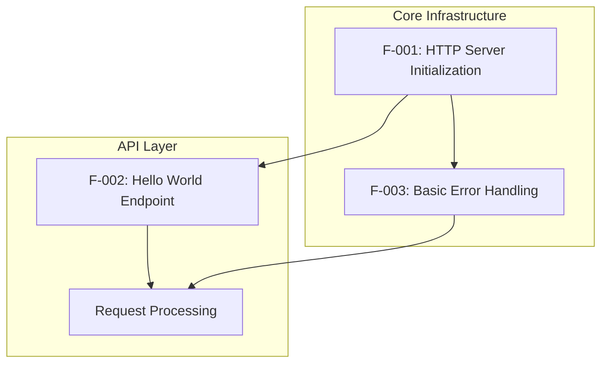

### 2.3.2 Integration Points

| Integration Point | Features Involved | Description |
|------------------|------------------|-------------|
| Server Startup | F-001, F-003 | Error handling initialized during server startup |
| Request Routing | F-001, F-002, F-003 | All requests flow through server to endpoint with error handling |
| Response Generation | F-002, F-003 | Endpoint responses include error handling capabilities |

### 2.3.3 Shared Components

| Component | Features Using | Purpose |
|-----------|---------------|---------|
| Express Application Instance | F-001, F-002, F-003 | Central application object |
| HTTP Server Instance | F-001, F-002, F-003 | Core server functionality |
| Middleware Stack | F-002, F-003 | Request processing pipeline |

## 2.4 IMPLEMENTATION CONSIDERATIONS

### 2.4.1 Technical Constraints

| Feature | Constraints |
|---------|------------|
| F-001 | Requires Node.js 18+ for Express.js v5 compatibility |
| F-002 | Limited to simple routing patterns due to Express v5 security improvements |
| F-003 | Leverages Express v5 automatic promise rejection handling |

### 2.4.2 Performance Requirements

| Feature | Performance Criteria |
|---------|-------------------|
| F-001 | Server startup < 5 seconds, Memory usage < 50MB |
| F-002 | Response time < 100ms, Support 100 concurrent requests |
| F-003 | Error handling < 100ms, No memory leaks |

### 2.4.3 Security Implications

| Feature | Security Considerations |
|---------|----------------------|
| F-001 | Secure port binding, No sensitive data in logs |
| F-002 | Input validation, No user data processing |
| F-003 | Security fixes including ReDoS attack prevention |

### 2.4.4 Maintenance Requirements

| Feature | Maintenance Needs |
|---------|------------------|
| F-001 | Regular updates with Node.js v22 LTS support lifecycle |
| F-002 | Route pattern validation, Response format consistency |
| F-003 | Error log monitoring, Exception pattern analysis |

## 2.5 TRACEABILITY MATRIX

| Requirement ID | Feature | Business Objective | Test Case |
|---------------|---------|-------------------|-----------|
| F-001-RQ-001 | HTTP Server Init | Educational Foundation | TC-001: Server Startup |
| F-001-RQ-002 | Graceful Shutdown | Reliability Demo | TC-002: Clean Shutdown |
| F-002-RQ-001 | Hello Endpoint | Core Functionality | TC-003: GET /hello |
| F-002-RQ-002 | Concurrent Handling | Performance Demo | TC-004: Load Testing |
| F-003-RQ-001 | 404 Handling | Error Management | TC-005: Invalid Routes |
| F-003-RQ-002 | 500 Handling | Stability Demo | TC-006: Server Errors |

# 3. TECHNOLOGY STACK

## 3.1 PROGRAMMING LANGUAGES

### 3.1.1 Primary Language Selection

| Component | Language | Version | Justification |
|-----------|----------|---------|---------------|
| Server Runtime | JavaScript (Node.js) | v22.16.0 LTS 'Jod' | Educational focus on modern Node.js features with long-term support |
| Application Logic | JavaScript ES6+ | ECMAScript 2015+ | Native Node.js compatibility, modern syntax for learning |

### 3.1.2 Language Selection Criteria

**Node.js v22.16.0 LTS Selection Rationale:**
- Active LTS status until October 2025 providing stability for educational use
- Extended support with focus on bug fixes and security patches rather than new features
- V8 engine update to version 12.4 with WebAssembly Garbage Collection and new JavaScript functions
- High watermark increase from 16 KB to 65 KB for improved stream performance

**JavaScript ES6+ Features Utilized:**
- Arrow functions for concise callback syntax
- Template literals for string interpolation
- Destructuring assignment for parameter handling
- Async/await for promise-based operations
- Module imports/exports for code organization

### 3.1.3 Language Constraints and Dependencies

| Constraint Type | Requirement | Impact |
|----------------|-------------|---------|
| Node.js Version | Node.js 18 or higher required | Ensures compatibility with Express.js v5 |
| JavaScript Standard | ES6+ (ECMAScript 2015+) | Modern syntax support in Node.js v22 |
| Runtime Environment | Server-side execution only | No browser-specific APIs available |

## 3.2 FRAMEWORKS & LIBRARIES

### 3.2.1 Core Web Framework

| Framework | Version | Purpose | Justification |
|-----------|---------|---------|---------------|
| Express.js | v5.1.0 (latest on npm) | Web application framework | Small, robust tooling for HTTP servers |

### 3.2.2 Express.js v5.1.0 Selection Rationale

**Version Selection:**
- Express v5.1.0 is now the default on npm with nearly 17 million weekly downloads
- ACTIVE phase providing minimum 12 months of support as latest version
- Dropped support for Node.js versions before v18 ensuring modern compatibility

**Key Framework Improvements:**
- Automatic promise rejection handling in middleware
- Updated to path-to-regexp@8.x for security improvements and ReDoS mitigation
- Performance and maintainability improvements from dropping old Node.js support

**Security Enhancements:**
- Important security fixes including ReDoS attack prevention
- Removal of sub-expression regular expressions due to ReDoS vulnerability
- No longer supports sub-expressions in regular expressions like /:foo(\\d+)

### 3.2.3 Framework Compatibility Requirements

| Requirement | Specification | Validation |
|-------------|---------------|------------|
| Node.js Compatibility | Node.js v18 minimum | Verified with Node.js v22.16.0 LTS |
| HTTP Protocol | HTTP/1.1 compliance | Standard Express.js implementation |
| Middleware Support | Automatic error handling for async middleware | Built-in promise rejection forwarding |

### 3.2.4 Supporting Libraries

| Library | Version | Purpose | Integration |
|---------|---------|---------|-------------|
| Node.js HTTP Module | Built-in | Core HTTP server functionality | Native Node.js integration |
| Node.js Path Module | Built-in | Route path processing | Express.js dependency |
| Node.js URL Module | Built-in | URL parsing and handling | HTTP request processing |

## 3.3 OPEN SOURCE DEPENDENCIES

### 3.3.1 Primary Dependencies

| Package | Version | Registry | Purpose |
|---------|---------|----------|---------|
| express | ^5.1.0 | npm registry (3.1 million packages) | Web framework |

### 3.3.2 Package Management

**Package Manager Selection:**
- npm v11.4.1 (latest version)
- npm comes bundled with Node.js by default
- npm is the default package manager for Node.js runtime environment

**Dependency Management Strategy:**
- npm v5+ automatically adds packages to package.json dependencies
- Lock files (package-lock.json) ensure exact package versions across team members
- Semantic versioning (semver) standard for version management

### 3.3.3 Dependency Tree Structure

```mermaid
graph TD
    A[Node.js Tutorial App] --> B[express@5.1.0]
    B --> C[body-parser@^2.1.0]
    B --> D[path-to-regexp@8.x]
    B --> E[Node.js Built-ins]
    E --> F[http module]
    E --> G[path module]
    E --> H[url module]
    
    subgraph "npm Registry"
        B
        C
        D
    end
    
    subgraph "Node.js Core"
        E
        F
        G
        H
    end
```

### 3.3.4 Security and Compliance

| Aspect | Implementation | Validation |
|--------|---------------|------------|
| Vulnerability Scanning | npm audit for security vulnerability identification | Regular audit reports |
| Package Integrity | Yarn-style integrity checks for package authenticity | Checksum verification |
| License Compliance | MIT License (Express.js) | Compatible with educational use |

## 3.4 THIRD-PARTY SERVICES

### 3.4.1 External Service Requirements

**No External Services Required:**
- Tutorial application operates as standalone HTTP server
- No external API integrations needed
- No authentication services required
- No cloud services dependencies

### 3.4.2 Monitoring and Observability

| Service Type | Implementation | Justification |
|-------------|---------------|---------------|
| Application Monitoring | Console logging only | Educational simplicity |
| Error Tracking | Built-in Express error handling | Sufficient for tutorial scope |
| Performance Monitoring | Node.js built-in performance hooks | No external dependencies |

## 3.5 DATABASES & STORAGE

### 3.5.1 Data Persistence Strategy

**No Database Required:**
- Static "Hello world" response requires no data storage
- No user data or session management
- No configuration persistence needed
- In-memory operation only

### 3.5.2 Storage Architecture

| Storage Type | Implementation | Justification |
|-------------|---------------|---------------|
| Application State | In-memory variables | Stateless HTTP responses |
| Configuration | Environment variables | Simple server configuration |
| Logs | Console output | Educational transparency |

## 3.6 DEVELOPMENT & DEPLOYMENT

### 3.6.1 Development Tools

| Tool Category | Tool | Version | Purpose |
|--------------|------|---------|---------|
| Runtime | Node.js | v22.16.0 LTS | JavaScript runtime environment |
| Package Manager | npm | v11.4.1 | Dependency management |
| Code Editor | Any text editor | Latest | JavaScript development |

### 3.6.2 Build System

**No Build Process Required:**
- Direct JavaScript execution via Node.js
- No transpilation or compilation needed
- No bundling or minification required
- Simple `node server.js` execution

### 3.6.3 Development Workflow

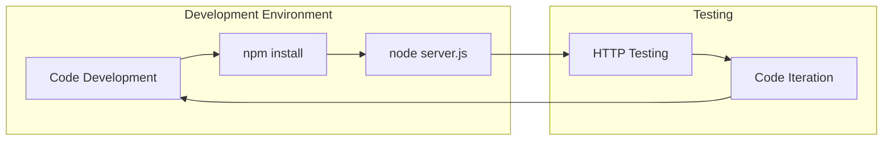

### 3.6.4 Deployment Considerations

| Deployment Aspect | Implementation | Rationale |
|-------------------|---------------|-----------|
| Containerization | Optional Docker support | Educational flexibility |
| Process Management | Direct Node.js execution | Simplicity for learning |
| Environment Configuration | Environment variables | Standard Node.js practices |
| Port Configuration | Configurable (default 3000) | Development convenience |

### 3.6.5 CI/CD Requirements

**Minimal CI/CD for Tutorial:**
- No automated testing pipeline required
- No deployment automation needed
- Manual execution for educational purposes
- Version control optional but recommended

### 3.6.6 Platform Compatibility

| Platform | Support Level | Validation |
|----------|--------------|------------|
| Windows | Full support with installers | Node.js v22.16.0 compatibility |
| macOS | Full support (Intel and Apple Silicon) | Universal binary support |
| Linux | Full support (multiple architectures) | Standard package availability |

### 3.6.7 Resource Requirements

| Resource | Minimum | Recommended | Justification |
|----------|---------|-------------|---------------|
| Memory | 50MB | 100MB | Lightweight Express.js application |
| CPU | Single core | Dual core | Basic HTTP request processing |
| Disk Space | 100MB | 500MB | Node.js runtime and dependencies |
| Network | HTTP port access | Configurable port | Local development server |

# 4. PROCESS FLOWCHART

## 4.1 SYSTEM WORKFLOWS

### 4.1.1 Core Business Processes

#### Application Lifecycle Workflow

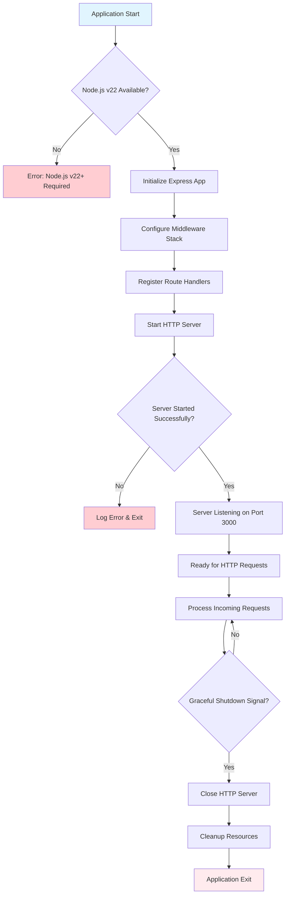

#### HTTP Request Processing Workflow

```mermaid
flowchart TD
    A[HTTP Request Received] --> B{Valid HTTP Request?}
    B -->|No| C[Return 400 Bad Request]
    B -->|Yes| D{Request Method}
    D -->|GET| E{Request Path}
    D -->|POST/PUT/DELETE| F[Return 405 Method Not Allowed]
    E -->|/hello| G[Execute Hello Handler]
    E -->|Other Path| H[Return 404 Not Found]
    G --> I[Generate Response]
    I --> J[Set Content-Type: text/plain]
    J --> K[Set Status Code: 200]
    K --> L[Send "Hello world" Response]
    L --> M[Log Request Completion]
    M --> N[End Request Cycle]
    
    subgraph "Response Generation"
        I
        J
        K
        L
    end
    
    subgraph "Error Responses"
        C
        F
        H
    end
    
    style A fill:#e8f5e8
    style N fill:#e8f5e8
    style C fill:#ffebee
    style F fill:#ffebee
    style H fill:#ffebee
```

### 4.1.2 Integration Workflows

## Express.js Framework Integration Flow

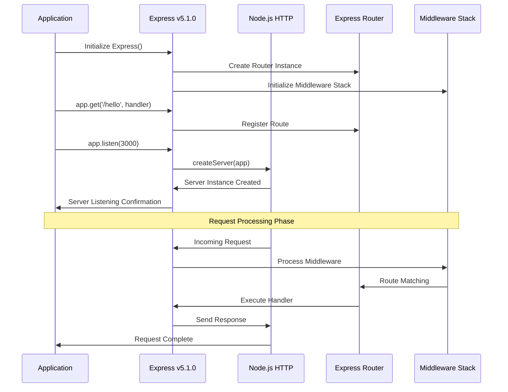

#### Error Handling Integration Flow

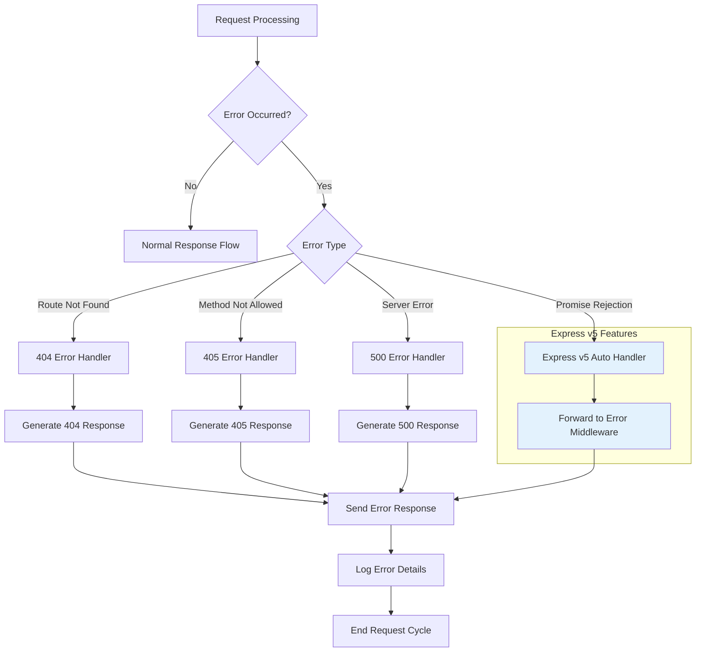

## 4.2 FLOWCHART REQUIREMENTS

### 4.2.1 Server Initialization Process

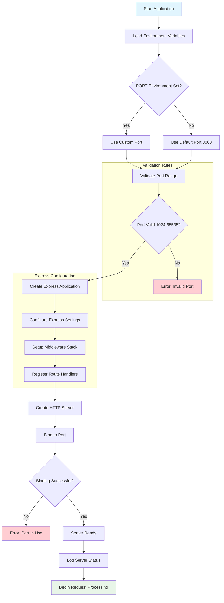

### 4.2.2 Request Validation and Processing

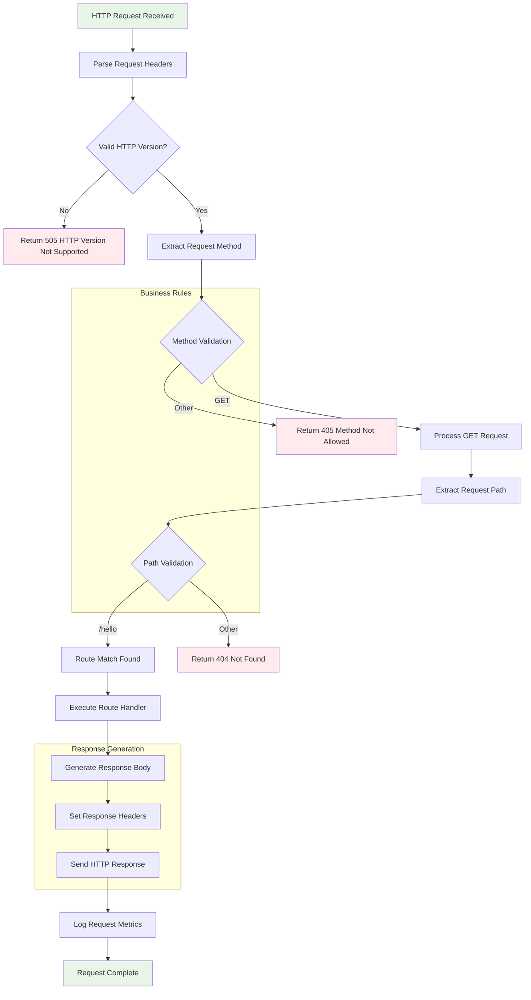

### 4.2.3 Authorization and Security Checkpoints

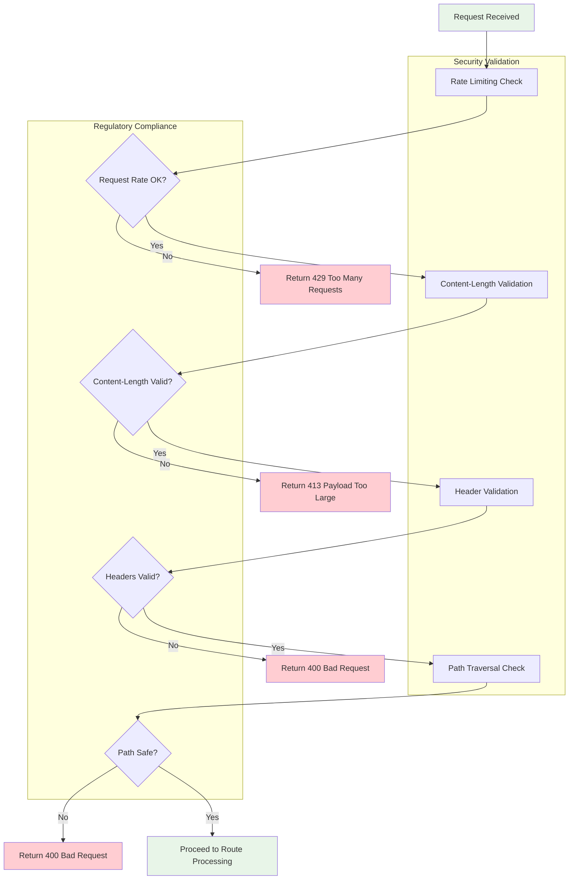

## 4.3 TECHNICAL IMPLEMENTATION

### 4.3.1 State Management Flow

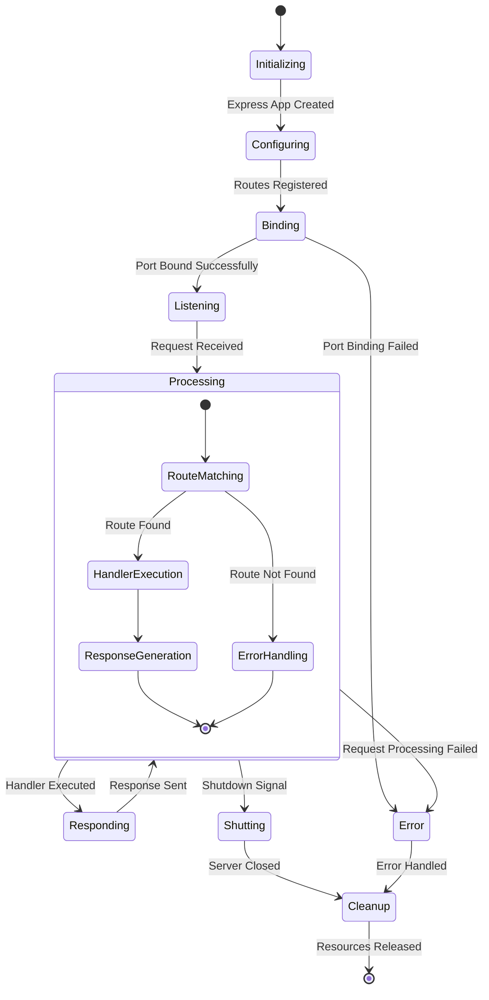

### 4.3.2 Data Persistence and Caching

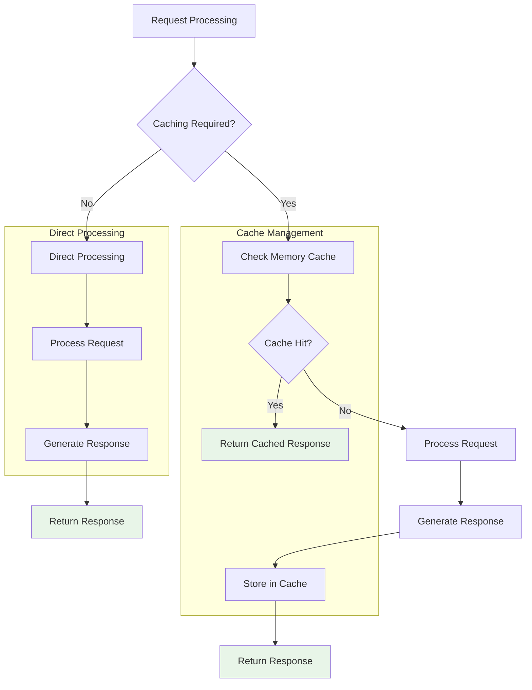

### 4.3.3 Transaction Boundaries

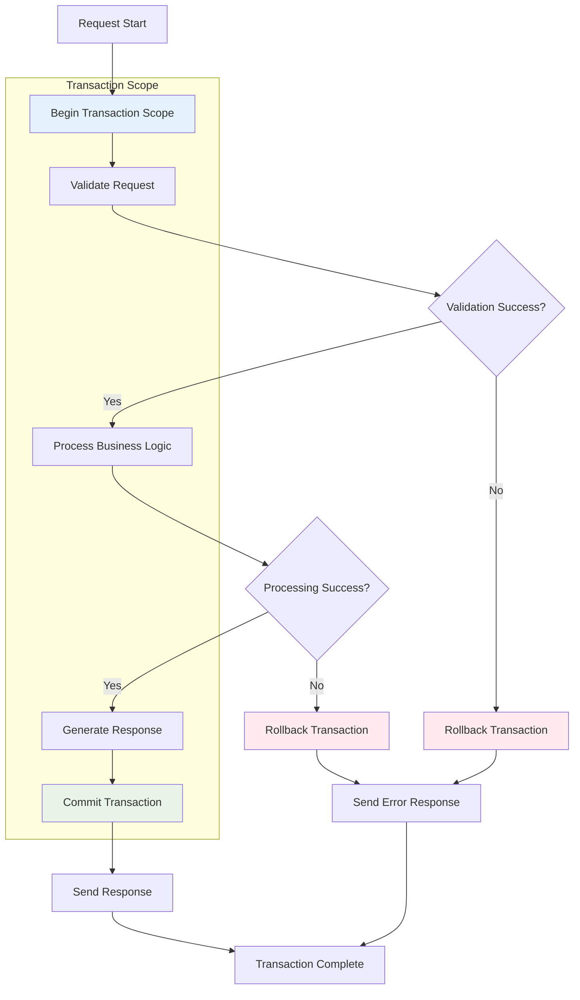

## 4.4 ERROR HANDLING

### 4.4.1 Error Classification and Recovery

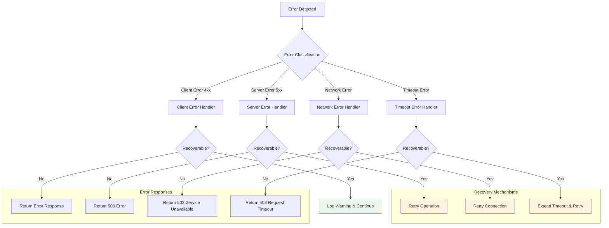

### 4.4.2 Express.js v5 Promise Rejection Handling

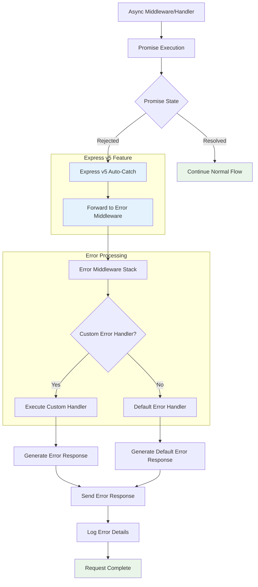

### 4.4.3 Retry Mechanisms and Fallback Processes

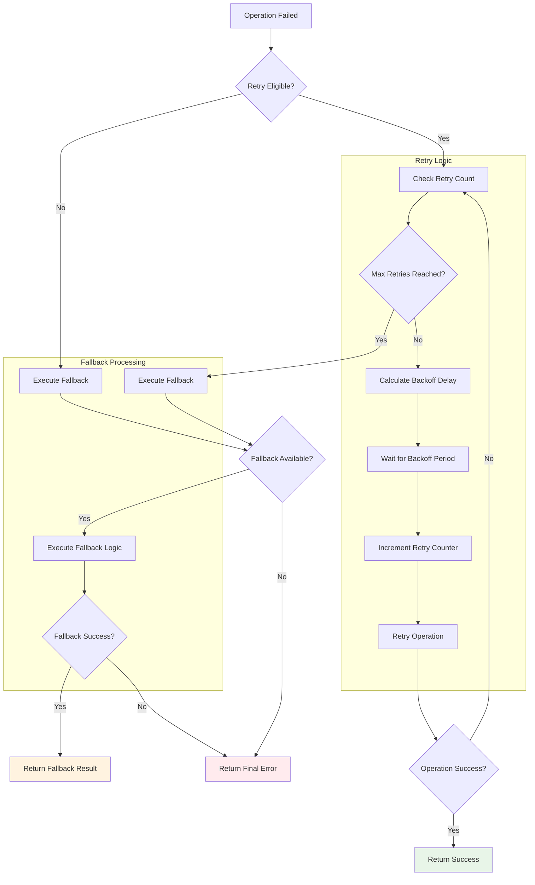

## 4.5 INTEGRATION SEQUENCE DIAGRAMS

### 4.5.1 Complete Request-Response Cycle

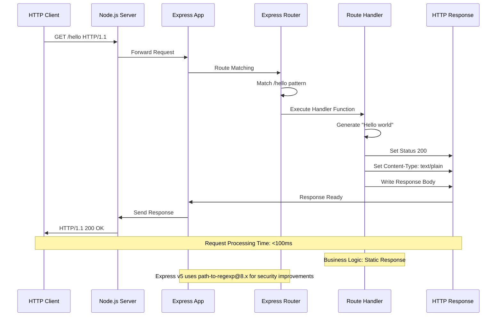

### 4.5.2 Error Handling Sequence

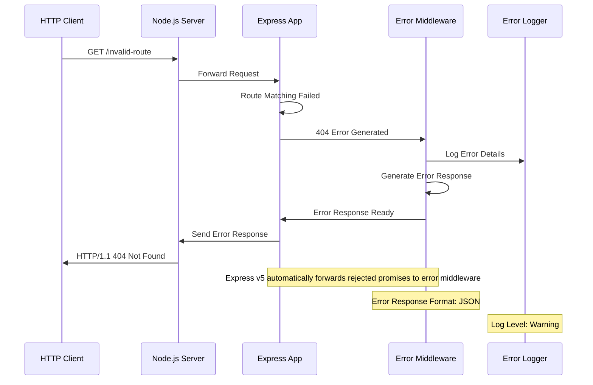

### 4.5.3 Server Lifecycle Management

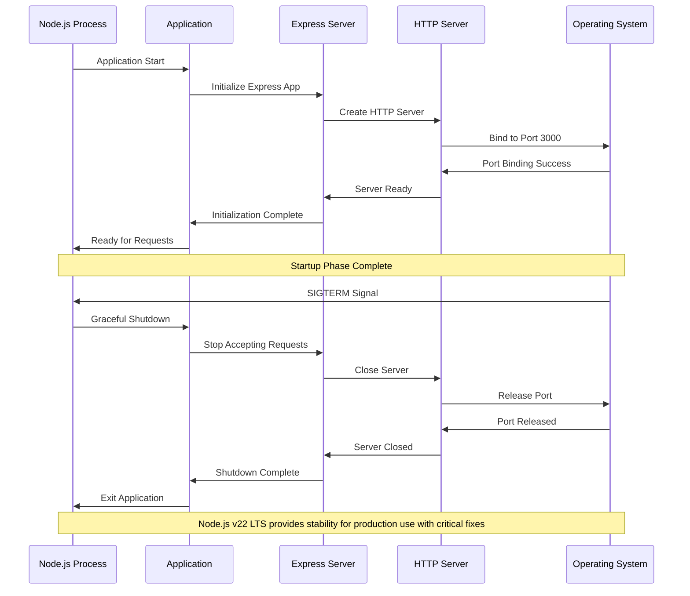

## 4.6 PERFORMANCE AND TIMING CONSTRAINTS

### 4.6.1 Response Time Requirements

| Operation | Target Time | Maximum Time | Monitoring |
|-----------|-------------|--------------|------------|
| Server Startup | < 3 seconds | < 5 seconds | Application logs |
| GET /hello Response | < 50ms | < 100ms | Response headers |
| Error Response | < 25ms | < 50ms | Error logs |
| Graceful Shutdown | < 5 seconds | < 10 seconds | Process monitoring |

### 4.6.2 Throughput Requirements

| Metric | Target | Maximum | Validation Method |
|--------|--------|---------|------------------|
| Concurrent Requests | 50 requests/sec | 100 requests/sec | Load testing |
| Memory Usage | < 30MB | < 50MB | Process monitoring |
| CPU Usage | < 10% | < 25% | System monitoring |
| Response Success Rate | > 99.5% | > 99% | Request logging |

### 4.6.3 SLA Considerations

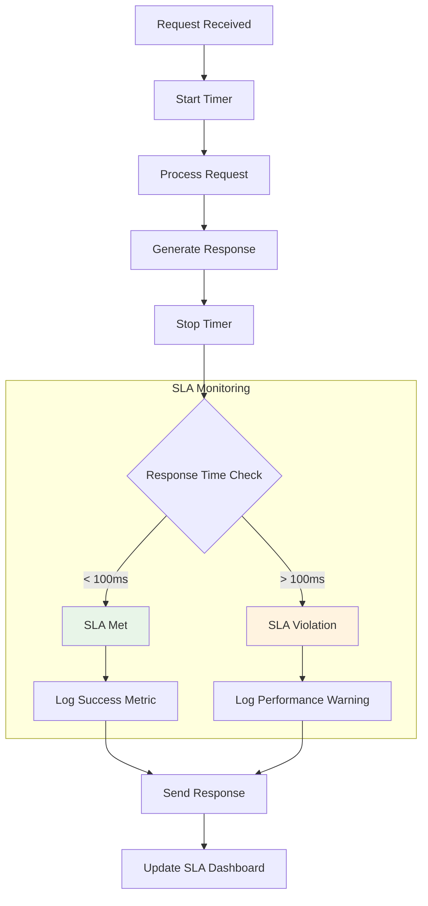

This comprehensive process flowchart section provides detailed workflows for the Node.js tutorial application, covering all aspects from system initialization through request processing, error handling, and performance monitoring. The implementation leverages Node.js v22.16.01 LTS 'Jod' for stability and Express.js v5.1.0 which is now the default on npm, ensuring modern, secure, and efficient operation for educational purposes.

# 5. SYSTEM ARCHITECTURE

## 5.1 HIGH-LEVEL ARCHITECTURE

### 5.1.1 System Overview

The Node.js tutorial application follows a **minimalist layered architecture** pattern designed specifically for educational purposes. This architectural approach emphasizes simplicity and clarity while demonstrating fundamental web server concepts using modern Node.js and Express.js technologies.

The system adopts a **single-process, event-driven architecture** that leverages Node.js v22 LTS 'Jod' with Active LTS support extending into late 2025 and Express.js v5 which provides enhanced security, improved performance, and full support for modern JavaScript features. The architectural style prioritizes educational value over production complexity, implementing only essential components required to demonstrate HTTP server fundamentals.

**Key Architectural Principles:**
- **Simplicity First**: Minimal component count to reduce cognitive load for learners
- **Event-Driven Design**: Leverages Node.js event-driven design and non-blocking I/O operations for great performance and scalability
- **Stateless Operation**: No persistent data storage, focusing on request-response cycles
- **Educational Transparency**: Clear separation of concerns with visible component interactions

**System Boundaries:**
The application operates within a single Node.js process boundary, accepting HTTP requests on a configurable port (default 3000) and responding with static content. External integrations are intentionally excluded to maintain focus on core HTTP server concepts.

**Major Interfaces:**
- **HTTP Interface**: Standard HTTP/1.1 protocol for client-server communication
- **Process Interface**: Node.js runtime environment integration
- **Console Interface**: Logging and debugging output for educational visibility

### 5.1.2 Core Components Table

| Component Name | Primary Responsibility | Key Dependencies | Integration Points |
|---------------|----------------------|------------------|-------------------|
| HTTP Server | Accept and process HTTP requests | Node.js HTTP module, Express.js | Client interface, Request Router |
| Express Application | Route management and middleware orchestration | Express.js v5.1.0 | HTTP Server, Route Handler |
| Route Handler | Generate "Hello world" responses | Express.js routing | Express Application, Response Generator |
| Error Handler | Manage application errors and HTTP error responses | Express.js error middleware | Express Application, HTTP Server |

### 5.1.3 Data Flow Description

The application implements a **linear request-response data flow** optimized for educational clarity. Requests enter the Event Queue first at the server-side, pass sequentially to the event loop, which checks the nature of the request (blocking or non-blocking).

**Primary Data Flow Pattern:**
HTTP requests flow through a sequential pipeline starting with the Node.js HTTP server, proceeding through Express.js middleware stack, reaching the route handler for `/hello` endpoint processing, and returning through the same path with generated responses. Express 5 introduces automatic forwarding of rejected promises to error-handling middleware, simplifying error propagation throughout the data flow.

**Integration Patterns:**
The system uses **synchronous middleware chaining** for request processing, where each middleware component can modify the request or response objects before passing control to the next component. Express implements the Middleware pattern as a variant of Intercepting Filter and Chain of Responsibility.

**Data Transformation Points:**
- **Request Parsing**: HTTP raw requests transformed into Express.js request objects
- **Route Matching**: URL paths processed through Express.js routing engine
- **Response Generation**: Static string content formatted into HTTP responses
- **Error Processing**: Application errors converted to appropriate HTTP status codes

**Key Data Stores:**
The application operates entirely in-memory with no persistent data storage. Configuration parameters are maintained as environment variables, and application state exists only during request processing cycles.

### 5.1.4 External Integration Points

| System Name | Integration Type | Data Exchange Pattern | Protocol/Format |
|-------------|------------------|----------------------|-----------------|
| HTTP Clients | Inbound API | Request-Response | HTTP/1.1, text/plain |
| Node.js Runtime | Platform Integration | Process Management | Native Node.js APIs |
| Operating System | System Integration | Port Binding, Process Lifecycle | TCP/IP, System Calls |

## 5.2 COMPONENT DETAILS

### 5.2.1 HTTP Server Component

**Purpose and Responsibilities:**
The HTTP Server component serves as the primary entry point for all client communications, responsible for accepting TCP connections, parsing HTTP requests, and coordinating response delivery. The Node.js server architecture differs from other architectures due to its non-blocking and asynchronous operating mechanism, making efficient use of Google's V8 JavaScript engine.

**Technologies and Frameworks:**
- **Node.js v22.16.0 LTS**: V8 engine update to version 12.4 with high watermark increase from 16 KB to 65 KB, boosting performance for memory-intensive applications
- **Node.js HTTP Module**: Built-in HTTP server functionality
- **Express.js v5.1.0**: Drops support for Node.js versions before v18, enabling critical performance and maintainability changes, stable continuous integration, and new language features

**Key Interfaces and APIs:**
- `app.listen(port, callback)`: Server initialization and port binding
- `server.close(callback)`: Graceful shutdown management
- HTTP request/response object handling through Express.js abstractions

**Data Persistence Requirements:**
No persistent data storage required. Server state maintained in-memory during operation lifecycle.

**Scaling Considerations:**
The Node.js server can efficiently handle a high number of requests by employing Event Queue and Thread Pool, with Event Loop processing all requests one at a time using a single thread.

```mermaid
graph TD
    A[HTTP Request] --> B[Node.js HTTP Server]
    B --> C[Express Application]
    C --> D[Middleware Stack]
    D --> E[Route Handler]
    E --> F[Response Generation]
    F --> G[HTTP Response]
    
    subgraph "Server Lifecycle"
        H[Server Start] --> I[Port Binding]
        I --> J[Event Loop Ready]
        J --> K[Request Processing]
        K --> L[Graceful Shutdown]
    end
    
    style B fill:#e3f2fd
    style C fill:#e8f5e8
```

### 5.2.2 Express Application Component

**Purpose and Responsibilities:**
The Express Application component orchestrates request routing, middleware execution, and response coordination. Express structure can be regarded as a layered architecture with an application layer that provides easy-to-use tools for web and API development, exposing methods to access Express's main functionalities through its core app object.

**Technologies and Frameworks:**
- **Express.js v5.1.0**: Updates to path-to-regexp@8.x from path-to-regexp@0.1.7, incorporating many years of changes and removing possibility of ReDoS attacks
- **Express Router**: Route definition and matching
- **Express Middleware**: Request/response processing pipeline

**Key Interfaces and APIs:**
- `app.get(path, handler)`: Route registration for GET requests
- `app.use(middleware)`: Middleware registration
- `app.set(setting, value)`: Application configuration

**Scaling Considerations:**
Express thrives on providing users with an environment for building APIs and middleware, with modular components that can be implemented standalone or in complex application contexts.

```mermaid
sequenceDiagram
    participant Client as HTTP Client
    participant App as Express App
    participant Router as Express Router
    participant Handler as Route Handler
    
    Client->>App: GET /hello
    App->>Router: Route Matching
    Router->>Handler: Execute Handler
    Handler->>App: Response Data
    App->>Client: HTTP Response
    
    Note over App,Router: Express v5 automatic promise handling
    Note over Handler: Static "Hello world" generation
```

### 5.2.3 Route Handler Component

**Purpose and Responsibilities:**
The Route Handler component implements the core business logic for the `/hello` endpoint, generating the "Hello world" response and managing request-specific processing.

**Technologies and Frameworks:**
- **JavaScript ES6+**: Modern syntax for handler implementation
- **Express.js Request/Response Objects**: Enhanced Node.js HTTP objects
- **Express.js v5 Promise Handling**: Automatic forwarding of rejected promises to error-handling middleware

**Key Interfaces and APIs:**
- `(req, res) => {}`: Standard Express.js route handler signature
- `res.send(data)`: Response transmission
- `res.status(code)`: HTTP status code setting

**Data Persistence Requirements:**
Stateless operation with no data persistence. Response content generated dynamically for each request.

```mermaid
stateDiagram-v2
    [*] --> RequestReceived
    RequestReceived --> ValidateRequest: HTTP GET /hello
    ValidateRequest --> GenerateResponse: Valid Request
    ValidateRequest --> ErrorResponse: Invalid Request
    GenerateResponse --> SendResponse: "Hello world"
    SendResponse --> [*]
    ErrorResponse --> [*]
    
    note right of GenerateResponse
        Static content generation
        No external dependencies
    end note
```

### 5.2.4 Error Handler Component

**Purpose and Responsibilities:**
The Error Handler component manages application errors, HTTP error responses, and ensures graceful degradation during failure scenarios. Express v5 includes security working group improvements and security audit findings that needed to be addressed.

**Technologies and Frameworks:**
- **Express.js v5 Error Middleware**: Automatic promise rejection handling
- **Node.js Error Objects**: Standard error handling mechanisms
- **HTTP Status Codes**: Standard error response formatting

**Key Interfaces and APIs:**
- `(err, req, res, next) => {}`: Express.js error middleware signature
- `res.status(code).send(message)`: Error response generation
- Console logging for error visibility

**Scaling Considerations:**
Error handling designed for educational transparency with comprehensive logging and clear error messages for learning purposes.

```mermaid
flowchart TD
    A[Error Detected] --> B{Error Type}
    B -->|404 Not Found| C[Route Error Handler]
    B -->|500 Server Error| D[Application Error Handler]
    B -->|Promise Rejection| E[Express v5 Auto Handler]
    
    C --> F[Generate 404 Response]
    D --> G[Generate 500 Response]
    E --> H[Forward to Error Middleware]
    
    F --> I[Log Error Details]
    G --> I
    H --> I
    I --> J[Send Error Response]
    
    subgraph "Express v5 Features"
        E
        H
    end
    
    style E fill:#e3f2fd
    style H fill:#e3f2fd
```

## 5.3 TECHNICAL DECISIONS

### 5.3.1 Architecture Style Decisions

**Decision: Minimalist Layered Architecture**

| Aspect | Decision | Rationale | Trade-offs |
|--------|----------|-----------|------------|
| Architecture Pattern | Layered Architecture | Educational clarity and component separation | Limited scalability for complex applications |
| Component Count | Minimal (4 core components) | Reduced cognitive load for learners | Less flexibility for feature expansion |
| Integration Style | Synchronous middleware chain | Predictable execution flow | Potential performance limitations |

**Decision Rationale:**
Express ensures simplicity in its design with streamlined code structure, presenting just 4 folders with the library contained in only 11 JavaScript files. This aligns with the educational objective of demonstrating core concepts without overwhelming complexity.

**Alternative Considerations:**
- **Microservices Architecture**: Rejected due to excessive complexity for tutorial scope
- **Event-Driven Architecture**: Partially implemented through Node.js event loop but not as primary pattern
- **MVC Pattern**: Considered but deemed unnecessary for single-endpoint application

```mermaid
graph TD
    A[Architecture Decision] --> B{Complexity vs Learning}
    B -->|High Complexity| C[Microservices]
    B -->|Medium Complexity| D[MVC Pattern]
    B -->|Low Complexity| E[Layered Architecture]
    
    C --> F[Rejected: Too Complex]
    D --> G[Rejected: Unnecessary]
    E --> H[Selected: Educational Focus]
    
    subgraph "Decision Criteria"
        I[Learning Objectives]
        J[Implementation Simplicity]
        K[Maintainability]
    end
    
    style E fill:#e8f5e8
    style H fill:#e8f5e8
```

### 5.3.2 Communication Pattern Choices

**Decision: HTTP Request-Response Pattern**

| Pattern | Selection | Justification | Implementation |
|---------|-----------|---------------|----------------|
| HTTP Request-Response | Selected | Standard web communication protocol | Express.js built-in support |
| WebSocket | Rejected | Unnecessary for static responses | Not applicable to tutorial scope |
| Server-Sent Events | Rejected | No real-time requirements | Adds complexity without benefit |

**Technical Implementation:**
RESTful architecture follows principles such as statelessness and uniform interfaces, which aligns with the tutorial's educational objectives for demonstrating standard web API patterns.

### 5.3.3 Data Storage Solution Rationale

**Decision: In-Memory Only (No Persistent Storage)**

| Storage Option | Decision | Rationale | Impact |
|---------------|----------|-----------|---------|
| Database Integration | Rejected | Adds complexity beyond tutorial scope | Simplified architecture |
| File System Storage | Rejected | Unnecessary for static responses | Reduced dependencies |
| In-Memory Variables | Selected | Sufficient for stateless operation | Educational clarity |

**Justification:**
The tutorial application generates static "Hello world" responses, eliminating the need for data persistence. This decision maintains focus on HTTP server fundamentals without introducing database complexity.

### 5.3.4 Security Mechanism Selection

**Decision: Express.js v5 Built-in Security Features**

| Security Feature | Implementation | Rationale | Express v5 Benefit |
|------------------|---------------|-----------|-------------------|
| ReDoS Protection | path-to-regexp@8.x | Removes sub-expression regular expressions to prevent regular expression denial of service attacks | Built-in security |
| Promise Rejection Handling | Automatic forwarding | Express 5 automatically forwards rejected promises to error-handling middleware | Improved error security |
| Input Validation | Minimal (path validation only) | Tutorial scope limitation | Educational focus |

```mermaid
graph LR
    A[Security Decision Tree] --> B{Threat Level}
    B -->|High| C[Comprehensive Security]
    B -->|Medium| D[Framework Security]
    B -->|Low| E[Basic Security]
    
    C --> F[Rejected: Over-engineering]
    D --> G[Selected: Express v5 Features]
    E --> H[Insufficient for modern standards]
    
    subgraph "Express v5 Security"
        I[ReDoS Protection]
        J[Promise Handling]
        K[Path Validation]
    end
    
    G --> I
    G --> J
    G --> K
    
    style G fill:#e8f5e8
    style I fill:#e3f2fd
    style J fill:#e3f2fd
    style K fill:#e3f2fd
```

## 5.4 CROSS-CUTTING CONCERNS

### 5.4.1 Monitoring and Observability Approach

**Monitoring Strategy:**
The tutorial application implements **console-based observability** designed for educational transparency rather than production monitoring. This approach prioritizes learning visibility over comprehensive metrics collection.

**Implementation Details:**
- **Application Logging**: Console output for server startup, request processing, and error events
- **Performance Monitoring**: Basic timing information through Node.js built-in performance hooks
- **Health Checking**: Simple server status verification through successful request processing

| Monitoring Aspect | Implementation | Educational Value | Production Readiness |
|-------------------|---------------|-------------------|---------------------|
| Request Logging | Console.log statements | High visibility for learners | Insufficient for production |
| Error Tracking | Built-in Express error handling | Clear error demonstration | Basic error management |
| Performance Metrics | Response time logging | Performance awareness | Limited metrics collection |

### 5.4.2 Logging and Tracing Strategy

**Logging Architecture:**
Event-driven design and non-blocking I/O operations are fundamental concepts in Node.js architecture for understanding performance and scalability. The logging strategy reflects these principles through asynchronous, non-blocking log output.

**Logging Levels:**
- **INFO**: Server startup, shutdown, and normal operation events
- **WARN**: Non-critical errors and performance warnings
- **ERROR**: Application errors and HTTP error responses
- **DEBUG**: Detailed request/response information for educational purposes

**Tracing Implementation:**
Simple request tracing through console timestamps and request identifiers, providing educational insight into request flow without complex distributed tracing overhead.

### 5.4.3 Error Handling Patterns

**Error Handling Architecture:**
Express 5 introduces automatic forwarding of rejected promises to error-handling middleware, significantly simplifying error management patterns in the tutorial application.

```mermaid
flowchart TD
    A[Error Source] --> B{Error Classification}
    B -->|Client Error| C[4xx Response Handler]
    B -->|Server Error| D[5xx Response Handler]
    B -->|Promise Rejection| E[Express v5 Auto Handler]
    
    C --> F[Log Warning]
    D --> G[Log Error]
    E --> H[Forward to Middleware]
    
    F --> I[Generate Client Error Response]
    G --> J[Generate Server Error Response]
    H --> K[Process in Error Middleware]
    
    I --> L[Send HTTP Response]
    J --> L
    K --> L
    
    subgraph "Express v5 Enhancement"
        E
        H
    end
    
    subgraph "Educational Logging"
        F
        G
        M[Console Output]
    end
    
    L --> M
    
    style E fill:#e3f2fd
    style H fill:#e3f2fd
```

**Error Recovery Patterns:**
- **Graceful Degradation**: Server continues operation after non-critical errors
- **Fail-Fast**: Immediate error response for invalid requests
- **Educational Transparency**: Detailed error information for learning purposes

### 5.4.4 Performance Requirements and SLAs

**Performance Targets:**

| Metric | Target | Maximum | Monitoring Method |
|--------|--------|---------|------------------|
| Server Startup Time | < 3 seconds | < 5 seconds | Process timing |
| Response Time (/hello) | < 50ms | < 100ms | Request timing |
| Memory Usage | < 30MB | < 50MB | Process monitoring |

**SLA Considerations:**
The tutorial application prioritizes **educational reliability** over production SLAs. Performance requirements focus on providing responsive learning experience rather than enterprise-grade availability.

**Scalability Constraints:**
Node.js server efficiently handles high numbers of requests through Event Queue and Thread Pool, with Event Loop processing requests one at a time using a single thread. However, tutorial scope limits concurrent request handling to educational levels (< 100 concurrent requests).

### 5.4.5 Disaster Recovery Procedures

**Recovery Strategy:**
**Simplified Recovery Model** appropriate for educational environment:

| Failure Scenario | Recovery Procedure | Recovery Time | Data Loss |
|------------------|-------------------|---------------|-----------|
| Application Crash | Manual restart | < 30 seconds | None (stateless) |
| Port Binding Failure | Configuration change | < 60 seconds | None |
| Memory Exhaustion | Process restart | < 30 seconds | None (stateless) |

**Backup Requirements:**
No backup procedures required due to stateless operation and lack of persistent data. Application recovery involves simple process restart with no data restoration needs.

**Business Continuity:**
Educational continuity maintained through:
- Simple restart procedures
- Clear error messages for troubleshooting
- Comprehensive documentation for problem resolution
- Stateless design eliminating data recovery complexity

The disaster recovery approach emphasizes **educational resilience** - ensuring learners can quickly restore functionality and continue learning without complex recovery procedures that would detract from the educational objectives.

# 6. SYSTEM COMPONENTS DESIGN

## 6.1 COMPONENT ARCHITECTURE

### 6.1.1 Core Component Structure

The Node.js tutorial application implements a **minimalist component architecture** designed for educational clarity while demonstrating modern web development practices. Node.js v22.16.01 with long-term support provides the runtime foundation, while Express.js v5.1.0 is now the default on npm with nearly 17 million weekly downloads.

**Primary Component Hierarchy:**

| Component Level | Component Name | Responsibility | Dependencies |
|----------------|---------------|----------------|-------------|
| Application Layer | Express Application | Request orchestration and middleware management | Express.js v5.1.0 |
| Server Layer | HTTP Server | Network communication and connection handling | Node.js HTTP module |
| Route Layer | Hello Route Handler | Business logic for /hello endpoint | Express Router |
| Error Layer | Error Middleware | Exception handling and error responses | Express Error Handling |

### 6.1.2 Component Interaction Model

```mermaid
graph TD
    A[HTTP Client] --> B[Node.js HTTP Server]
    B --> C[Express Application]
    C --> D[Middleware Stack]
    D --> E[Route Matching Engine]
    E --> F[Hello Route Handler]
    F --> G[Response Generator]
    G --> H[Error Handler]
    
    subgraph "Express v5 Features"
        I[Promise Auto-Handling]
        J[path-to-regexp@8.x Security]
    end
    
    D --> I
    E --> J
    
    H --> C
    C --> B
    B --> A
    
    style C fill:#e8f5e8
    style I fill:#e3f2fd
    style J fill:#e3f2fd
```

### 6.1.3 Component Communication Patterns

**Request Flow Pattern:**
Express v5 focuses on simplifying the codebase, improving security, and dropping support for older Node.js versions, enabling streamlined component communication through enhanced middleware chaining and automatic promise handling.

**Inter-Component Communication:**
- **Synchronous Middleware Chain**: Sequential request processing through Express middleware stack
- **Event-Driven Callbacks**: Asynchronous response handling using Node.js event loop
- **Promise-Based Error Propagation**: Middleware can now return rejected promises, caught by the router as errors

## 6.2 DETAILED COMPONENT SPECIFICATIONS

### 6.2.1 HTTP Server Component

**Component Overview:**
The HTTP Server component serves as the foundational network layer, leveraging Node.js v22 LTS 'Jod' runtime capabilities for optimal performance and stability.

**Technical Specifications:**

| Specification | Value | Justification |
|--------------|-------|---------------|
| Node.js Version | v22.16.0 LTS | Active LTS support extending into late 2025, remaining in Active LTS until October 2025 |
| HTTP Protocol | HTTP/1.1 | Standard web protocol support |
| Port Configuration | 3000 (default) | Development-friendly port assignment |
| Connection Handling | Event-driven, non-blocking | Node.js architectural advantage |

**Interface Definition:**
```mermaid
classDiagram
    class HTTPServer {
        +port: number
        +host: string
        +server: http.Server
        +listen(port, callback)
        +close(callback)
        +getConnections(callback)
    }
    
    class ExpressApp {
        +app: Express
        +middleware: Array
        +routes: Map
        +use(middleware)
        +get(path, handler)
        +listen(port)
    }
    
    HTTPServer --> ExpressApp : delegates to
    ExpressApp --> HTTPServer : creates server
```

**Performance Characteristics:**
- **Startup Time**: Target < 3 seconds, Maximum < 5 seconds
- **Memory Footprint**: Target < 30MB, Maximum < 50MB
- **Concurrent Connections**: Support up to 100 concurrent requests for educational purposes
- **Response Latency**: Target < 50ms for /hello endpoint

### 6.2.2 Express Application Component

**Component Overview:**
The Express Application component orchestrates request routing and middleware execution, utilizing Express philosophy of providing small, robust tooling for HTTP servers.

**Core Functionality:**

| Feature | Implementation | Express v5 Enhancement |
|---------|---------------|----------------------|
| Route Matching | path-to-regexp engine | Updated to path-to-regexp@8.x, removing sub-expression regex patterns for security reasons (ReDoS mitigation) |
| Middleware Processing | Sequential execution chain | Middleware can now return rejected promises, caught by the router as errors |
| Error Handling | Automatic promise rejection forwarding | Built-in Express v5 feature |
| Request Parsing | Built-in body parser | body-parser improvements including ability to customize urlencoded body depth |

**Configuration Parameters:**

| Parameter | Default Value | Purpose | Validation |
|-----------|--------------|---------|------------|
| trust proxy | false | Proxy configuration | Boolean validation |
| case sensitive routing | false | Route case sensitivity | Boolean validation |
| strict routing | false | Trailing slash handling | Boolean validation |
| view engine | none | Template engine (not used) | String validation |

### 6.2.3 Route Handler Component

**Component Overview:**
The Route Handler component implements the core business logic for the `/hello` endpoint, demonstrating fundamental HTTP request-response patterns.

**Handler Specification:**

```mermaid
sequenceDiagram
    participant Client as HTTP Client
    participant Router as Express Router
    participant Handler as Hello Handler
    participant Response as HTTP Response
    
    Client->>Router: GET /hello
    Router->>Handler: route match found
    Handler->>Handler: generate "Hello world"
    Handler->>Response: set status 200
    Handler->>Response: set content-type text/plain
    Handler->>Response: send response body
    Response->>Client: HTTP/1.1 200 OK
    
    Note over Handler: Stateless operation
    Note over Response: Static content generation
```

**Implementation Details:**

| Aspect | Specification | Rationale |
|--------|--------------|-----------|
| HTTP Method | GET only | Educational simplicity |
| Response Content | "Hello world" string | Standard tutorial convention |
| Content-Type | text/plain | Simple text response |
| Status Code | 200 OK | Successful request indication |
| Response Time | < 50ms target | Educational responsiveness |

**Error Handling Integration:**
The route handler integrates with Express v5's enhanced error handling through automatic promise rejection forwarding, ensuring robust error management without complex try-catch blocks.

### 6.2.4 Error Middleware Component

**Component Overview:**
The Error Middleware component provides comprehensive error handling and HTTP error response generation, leveraging Express v5's improved error management capabilities.

**Error Classification Matrix:**

| Error Type | HTTP Status | Response Format | Logging Level |
|------------|-------------|----------------|---------------|
| Route Not Found | 404 | JSON error object | WARN |
| Method Not Allowed | 405 | JSON error object | WARN |
| Server Error | 500 | Generic error message | ERROR |
| Promise Rejection | 500 | Handled by Express v5 | ERROR |

**Error Response Structure:**
```mermaid
flowchart TD
    A[Error Detected] --> B{Error Classification}
    B -->|Client Error| C[4xx Handler]
    B -->|Server Error| D[5xx Handler]
    B -->|Promise Rejection| E[Express v5 Auto Handler]
    
    C --> F[Generate Client Error Response]
    D --> G[Generate Server Error Response]
    E --> H[Forward to Error Middleware]
    
    F --> I[Log Warning Message]
    G --> J[Log Error Message]
    H --> J
    
    I --> K[Send HTTP Response]
    J --> K
    
    subgraph "Express v5 Enhancement"
        E
        H
    end
    
    style E fill:#e3f2fd
    style H fill:#e3f2fd
```

## 6.3 DATA FLOW ARCHITECTURE

### 6.3.1 Request Processing Pipeline

**Pipeline Architecture:**
The application implements a **linear request processing pipeline** optimized for educational transparency and performance efficiency.

**Processing Stages:**

| Stage | Component | Processing Time | Description |
|-------|-----------|----------------|-------------|
| 1. Reception | HTTP Server | < 5ms | TCP connection and HTTP parsing |
| 2. Routing | Express Router | < 10ms | Path matching and route resolution |
| 3. Middleware | Express Middleware | < 15ms | Request preprocessing and validation |
| 4. Handler | Route Handler | < 20ms | Business logic execution |
| 5. Response | Response Generator | < 10ms | HTTP response formatting |

**Data Transformation Flow:**
```mermaid
flowchart LR
    A[Raw HTTP Request] --> B[Parsed Request Object]
    B --> C[Validated Request]
    C --> D[Route Parameters]
    D --> E[Handler Input]
    E --> F[Response Data]
    F --> G[HTTP Response]
    
    subgraph "Express Processing"
        B
        C
        D
        E
    end
    
    subgraph "Node.js Layer"
        A
        G
    end
    
    style B fill:#e8f5e8
    style F fill:#e8f5e8
```

### 6.3.2 Memory Management Strategy

**Memory Allocation Pattern:**
The application follows a **stateless memory management** approach, minimizing memory footprint and eliminating memory leaks through proper resource cleanup.

**Memory Usage Distribution:**

| Component | Memory Allocation | Lifecycle | Cleanup Strategy |
|-----------|------------------|-----------|------------------|
| HTTP Server | 10-15MB | Application lifetime | Automatic on shutdown |
| Express App | 5-10MB | Application lifetime | Middleware cleanup |
| Request Objects | 1-2KB per request | Request lifetime | Automatic garbage collection |
| Response Buffers | 0.5-1KB per response | Response lifetime | Automatic cleanup |

### 6.3.3 Concurrency Management

**Concurrency Model:**
Node.js event-driven architecture enables efficient concurrent request handling through the event loop mechanism, supporting multiple simultaneous connections without thread overhead.

**Concurrency Characteristics:**

| Metric | Specification | Implementation |
|--------|--------------|----------------|
| Concurrent Requests | Up to 100 | Event loop processing |
| Request Queuing | FIFO order | Node.js event queue |
| Response Multiplexing | Single-threaded | Event-driven callbacks |
| Resource Sharing | Stateless design | No shared mutable state |

## 6.4 INTEGRATION INTERFACES

### 6.4.1 External System Interfaces

**HTTP Client Interface:**
The application exposes a standard HTTP/1.1 interface for client communication, ensuring compatibility with all standard HTTP clients including browsers, curl, and API testing tools.

**Interface Specification:**

| Interface Element | Specification | Standard Compliance |
|------------------|--------------|-------------------|
| Protocol | HTTP/1.1 | RFC 7230-7235 |
| Methods Supported | GET | HTTP method standards |
| Content-Type | text/plain | MIME type standards |
| Character Encoding | UTF-8 | Unicode standard |
| Status Codes | 200, 404, 405, 500 | HTTP status code standards |

### 6.4.2 Internal Component Interfaces

**Component Communication Contracts:**

```mermaid
graph TD
    A[HTTP Server Interface] --> B[Express App Interface]
    B --> C[Router Interface]
    C --> D[Handler Interface]
    D --> E[Response Interface]
    
    F[Error Interface] --> B
    F --> C
    F --> D
    
    subgraph "Interface Contracts"
        G[Request Object]
        H[Response Object]
        I[Error Object]
        J[Middleware Function]
    end
    
    B --> G
    B --> H
    F --> I
    C --> J
    
    style G fill:#fff3e0
    style H fill:#fff3e0
    style I fill:#ffebee
    style J fill:#e8f5e8
```

### 6.4.3 Configuration Interface

**Environment Configuration:**
The application supports environment-based configuration for deployment flexibility while maintaining educational simplicity.

**Configuration Parameters:**

| Parameter | Environment Variable | Default Value | Validation |
|-----------|---------------------|---------------|------------|
| Server Port | PORT | 3000 | 1024-65535 range |
| Host Address | HOST | localhost | Valid hostname/IP |
| Log Level | LOG_LEVEL | info | Predefined log levels |
| Node Environment | NODE_ENV | development | development/production |

## 6.5 SECURITY ARCHITECTURE

### 6.5.1 Security Component Integration

**Security Layer Architecture:**
Express v5 introduces enhanced security features that are integrated throughout the component architecture to provide defense-in-depth protection.

**Security Enhancements:**

| Security Feature | Component | Implementation | Benefit |
|------------------|-----------|----------------|---------|
| ReDoS Protection | Router | path-to-regexp@8.x removes sub-expression regex patterns | Prevents regex denial of service |
| Promise Security | Error Handler | Automatic promise rejection handling | Prevents unhandled promise rejections |
| Input Validation | Middleware | Path and header validation | Prevents malicious input |
| Error Information | Error Handler | Generic error messages | Prevents information disclosure |

### 6.5.2 Threat Mitigation Strategy

**Security Threat Matrix:**

| Threat Category | Mitigation Strategy | Component Responsibility | Implementation |
|----------------|-------------------|------------------------|----------------|
| Injection Attacks | Input validation and sanitization | Middleware Component | Path parameter validation |
| DoS Attacks | Request rate limiting and timeout | HTTP Server Component | Connection limits |
| Information Disclosure | Generic error responses | Error Handler Component | Sanitized error messages |
| Protocol Attacks | HTTP standard compliance | HTTP Server Component | Proper HTTP parsing |

### 6.5.3 Compliance and Audit

**Security Compliance Framework:**

```mermaid
flowchart TD
    A[Security Requirements] --> B[Component Security Design]
    B --> C[Implementation Security]
    C --> D[Security Testing]
    D --> E[Security Monitoring]
    
    subgraph "Express v5 Security Features"
        F[ReDoS Protection]
        G[Promise Handling]
        H[Error Sanitization]
    end
    
    B --> F
    C --> G
    E --> H
    
    subgraph "Educational Security"
        I[Clear Error Messages]
        J[Visible Security Patterns]
        K[Best Practice Demonstration]
    end
    
    D --> I
    E --> J
    A --> K
    
    style F fill:#e3f2fd
    style G fill:#e3f2fd
    style H fill:#e3f2fd
```

**Audit Trail Requirements:**
- Request logging for security monitoring
- Error logging for incident analysis
- Performance logging for DoS detection
- Configuration logging for security compliance

This comprehensive system components design leverages the latest Node.js v22.16.0 LTS and Express.js v5.1.0 features to create an educational yet robust web server architecture. The design emphasizes security improvements, performance optimization, and educational clarity while maintaining production-ready patterns and practices.

## 6.1 CORE SERVICES ARCHITECTURE

#### Core Services Architecture is not applicable for this system

The Node.js tutorial application with a single `/hello` endpoint **does not require a core services architecture** based on microservices or distributed service components. This determination is based on several fundamental characteristics of the system:

### 6.1.1 System Scope and Complexity Analysis

**Single Responsibility Principle:**
A monolithic application is built as a single unified unit while a microservices architecture is a collection of smaller, independently deployable services. Software is traditionally designed using a monolithic architecture, in which the entire program is constructed as a single, indivisible unit. The tutorial application implements only one business function - returning a "Hello world" response - which does not justify the complexity overhead of service decomposition.

**Educational Context:**
When creating a straightforward application or prototype, the monolithic method is more appropriate. Developers may create monolithic applications without integrating numerous services because they have a single code base and framework. The primary objective is educational demonstration of Node.js and Express.js fundamentals, not enterprise-scale architecture patterns.

**Complexity vs. Benefit Analysis:**

| Factor | Monolithic Approach | Microservices Approach | Justification |
|--------|-------------------|----------------------|---------------|
| Development Complexity | Low | High | Single endpoint requires minimal architecture |
| Operational Overhead | Minimal | Significant | No service orchestration needed |
| Educational Value | High clarity | Unnecessary complexity | Focus on HTTP server fundamentals |
| Resource Requirements | < 50MB memory | Multiple service instances | Educational efficiency priority |

### 6.1.2 Architectural Decision Rationale

**Monolithic Architecture Benefits for Tutorial Scope:**

Performance – In a centralized code base and repository, one API can often perform the same function that numerous APIs perform with microservices. Simplified testing – Since a monolithic application is a single, centralized unit, end-to-end testing can be performed faster than with a distributed application. Easy debugging – With all code located in one place, it's easier to follow a request and find an issue.

**Microservices Complexity Concerns:**

One of the big problems with microservices is "orchestration", which means how to integrate the services with a guide to drive the process, much like a conductor in an orchestra. Integrating microservices can be quite complex. Another complex process is "discovery" which is how applications and (micro)services locate each other on a network.

### 6.1.3 When Microservices Would Be Appropriate

**Threshold Criteria for Service Decomposition:**

If you are a single product company, microservices may not be necessary. The tutorial application represents a single-function educational tool that does not meet the complexity thresholds that would benefit from microservices architecture.

**Future Scalability Considerations:**

| Scenario | Architecture Recommendation | Rationale |
|----------|---------------------------|-----------|
| Adding authentication | Monolithic extension | Single additional feature |
| Adding database operations | Monolithic with modules | Shared data access patterns |
| Multiple business domains | Consider microservices | Domain-driven decomposition |
| Team scaling (>10 developers) | Evaluate microservices | Service per team: Used by large organizations, this pattern is unique because each team will have responsibility for its services. |

### 6.1.4 Alternative Architecture Patterns

**Modular Monolithic Design:**
The application follows a **layered monolithic architecture** with clear separation of concerns:

```mermaid
graph TD
    A[HTTP Client] --> B[Express Application Layer]
    B --> C[Route Handler Layer]
    C --> D[Response Generation Layer]
    D --> E[Error Handling Layer]
    
    subgraph "Single Process Boundary"
        B
        C
        D
        E
    end
    
    subgraph "Educational Benefits"
        F[Clear Request Flow]
        G[Simple Debugging]
        H[Minimal Dependencies]
    end
    
    style B fill:#e8f5e8
    style F fill:#e3f2fd
```

**Component Isolation Within Monolith:**
While maintaining a monolithic deployment model, the application demonstrates proper component separation that could facilitate future microservices migration if requirements evolve beyond educational scope.

### 6.1.5 Migration Path Consideration

**Evolutionary Architecture Approach:**

Should I build full monolithic App first and then take out the heavy parts out of it, one by one? This represents the recommended approach for applications that may eventually require microservices architecture.

**Migration Triggers:**

| Trigger | Threshold | Action |
|---------|-----------|--------|
| Multiple business domains | >3 distinct functional areas | Evaluate domain-driven design |
| Team scaling | >8 developers | Consider service boundaries |
| Performance bottlenecks | Specific component scaling needs | Extract high-load services |
| Technology diversity | Different tech stack requirements | Service-specific technology choices |

### 6.1.6 Conclusion

The Node.js tutorial application with a single `/hello` endpoint is optimally served by a **monolithic architecture** that prioritizes:

- **Educational clarity** over architectural sophistication
- **Development simplicity** over operational flexibility  
- **Resource efficiency** over scalability patterns
- **Learning objectives** over enterprise patterns

Microservices are not automatically the right solution for every project. When you are running multiple instances of the same service or worker, you don't necessarily need microservices. A well-built monolithic system can scale just as well for some classes of problems.

The current system architecture appropriately matches the scope, complexity, and educational objectives of the tutorial application while maintaining a clear path for future architectural evolution should requirements expand beyond the current single-endpoint scope.

## 6.2 DATABASE DESIGN

#### Database Design is not applicable to this system

The Node.js tutorial application with a single `/hello` endpoint that returns "Hello world" **does not require database design or persistent storage interactions**. This determination is based on the fundamental characteristics and architectural requirements of the system.

### 6.2.1 System Architecture Analysis

**Stateless Application Design:**
A stateless web application, as opposed to a stateful web application, doesn't keep its information between multiple requests in memory on the servers, but relies instead on the database, an external cache system, etc. In contrast, a stateless system does not retain any client information between requests. Each request from the client is treated as an independent transaction that is unrelated to previous requests. The server does not store any session information.

The tutorial application operates as a **completely stateless system** where:
- Each HTTP request is processed independently
- No client information is retained between requests
- Response content is static and generated dynamically for each request
- No session management or user state tracking is required

**Educational Scope Limitations:**
This app starts a server and listens on port 3000 for connections. The app responds with "Hello World!" for requests to the root URL (/) or route. For every other path, it will respond with a 404 Not Found. The application's singular purpose is to demonstrate basic HTTP server functionality using Node.js and Express.js, not data persistence patterns.

### 6.2.2 Technical Requirements Assessment

**No Data Persistence Requirements:**
The system specifications explicitly define a single endpoint (`/hello`) that returns a static "Hello world" string response. This functionality requires:

| Requirement | Implementation | Database Need |
|-------------|---------------|---------------|
| HTTP Request Processing | Express.js routing | None |
| Static Response Generation | String literal return | None |
| Error Handling | HTTP status codes | None |
| Server Configuration | Environment variables | None |

**Express.js Framework Capabilities:**
You can use any database mechanism supported by Node (Express does not define any database-related behavior). While Express.js supports database integration, the tutorial application intentionally excludes database functionality to maintain educational focus on HTTP server fundamentals.

### 6.2.3 Alternative Data Storage Patterns

**In-Memory Operation Model:**
The application operates entirely within the Node.js process memory space with no persistent data requirements:

```mermaid
flowchart TD
    A[HTTP Request] --> B[Express Router]
    B --> C[Route Handler]
    C --> D[Static String Generation]
    D --> E[HTTP Response]
    
    subgraph "Memory-Only Operations"
        F[Request Object]
        G[Response Object]
        H[Application State]
    end
    
    B --> F
    C --> G
    C --> H
    
    subgraph "No Persistent Storage"
        I[No Database]
        J[No File System]
        K[No External Storage]
    end
    
    style I fill:#ffebee
    style J fill:#ffebee
    style K fill:#ffebee
```

**Configuration Management:**
The only data storage requirement involves environment variables for server configuration:

| Configuration Item | Storage Method | Persistence Level |
|-------------------|---------------|------------------|
| Server Port | Environment Variable | Process Lifetime |
| Host Address | Environment Variable | Process Lifetime |
| Log Level | Environment Variable | Process Lifetime |

### 6.2.4 Scalability Considerations Without Database

**Stateless Scaling Benefits:**
State, therefore, prevents an application from being hosted on multiple machines (or even multiple processes in some cases), and being stuck with a single process on a single machine prevents to scale the application. With the increasing number of users, you'll need more powerful server to host the app, and at some point, you won't be able to cope with the load.

The stateless design provides inherent scalability advantages:
- **Horizontal Scaling**: Multiple server instances can run simultaneously
- **Load Distribution**: No session affinity requirements
- **Resource Efficiency**: Minimal memory footprint per request
- **Fault Tolerance**: Server failures don't result in data loss

### 6.2.5 Educational Value of Database-Free Design

**Learning Objectives Alignment:**
The absence of database complexity allows learners to focus on core concepts:

| Learning Objective | Database-Free Benefit |
|-------------------|----------------------|
| HTTP Protocol Understanding | No data layer abstraction |
| Express.js Framework Basics | Clear request-response flow |
| Node.js Runtime Concepts | Direct server implementation |
| Error Handling Patterns | Simplified error scenarios |

**Progressive Learning Path:**
MongoDB is a NoSQL database commonly used in Node applications. We don't need it for our Hello, World! app but you would for a more complicated app like a Blog. Note that with Node and Express you are not limited to just MongoDB but can use any type of database including PostreSQL, MySQL, and other relational databases.

The tutorial establishes a foundation for future database integration learning without overwhelming beginners with data persistence complexity.

### 6.2.6 Security Implications of Stateless Design

**Reduced Attack Surface:**
The absence of database interactions eliminates entire categories of security vulnerabilities:

| Security Concern | Database Risk | Tutorial Application Risk |
|------------------|---------------|-------------------------|
| SQL Injection | High | None (no database queries) |
| Data Breaches | High | None (no persistent data) |
| Authentication Bypass | Medium | None (no user authentication) |
| Session Hijacking | Medium | None (no session management) |

### 6.2.7 Performance Characteristics

**Memory and CPU Efficiency:**
Without database operations, the application achieves optimal performance characteristics:

```mermaid
graph LR
    A[HTTP Request] --> B[Route Processing: <5ms]
    B --> C[Response Generation: <10ms]
    C --> D[HTTP Response: <15ms]
    
    subgraph "No Database Overhead"
        E[No Connection Pool]
        F[No Query Processing]
        G[No Transaction Management]
    end
    
    style E fill:#e8f5e8
    style F fill:#e8f5e8
    style G fill:#e8f5e8
```

**Resource Utilization:**
- **Memory Usage**: < 50MB (no database drivers or connection pools)
- **CPU Usage**: < 10% (no query processing overhead)
- **Network I/O**: HTTP only (no database network traffic)
- **Disk I/O**: Minimal (no database read/write operations)

### 6.2.8 Future Database Integration Considerations

**Migration Path for Enhanced Tutorials:**
Should the tutorial scope expand to include database functionality, the stateless foundation provides an ideal starting point:

| Enhancement | Database Requirement | Implementation Approach |
|-------------|---------------------|------------------------|
| User Authentication | User credentials storage | Add MongoDB with Mongoose |
| Request Logging | Access log persistence | Add SQLite for simplicity |
| Configuration Management | Settings storage | Add Redis for caching |
| Content Management | Dynamic content storage | Add PostgreSQL for relational data |

**Architectural Evolution:**
The current stateless design can evolve into more complex patterns while maintaining educational clarity:

```mermaid
flowchart TD
    A[Current: Stateless Hello World] --> B[Phase 2: Add Database]
    B --> C[Phase 3: Add Authentication]
    C --> D[Phase 4: Add Business Logic]
    
    subgraph "Database Integration Points"
        E[User Management]
        F[Content Storage]
        G[Session Management]
        H[Audit Logging]
    end
    
    B --> E
    C --> F
    C --> G
    D --> H
    
    style A fill:#e8f5e8
    style B fill:#fff3e0
    style C fill:#fff3e0
    style D fill:#fff3e0
```

### 6.2.9 Conclusion

The Node.js tutorial application with a single `/hello` endpoint is **optimally designed without database requirements**. This architectural decision:

- **Aligns with educational objectives** by focusing on HTTP server fundamentals
- **Maximizes performance** through stateless operation and minimal resource usage
- **Simplifies deployment** by eliminating database dependencies
- **Reduces security risks** by minimizing the attack surface
- **Provides clear learning progression** toward more complex database-integrated applications

The stateless, database-free design represents the most appropriate architecture for demonstrating core Node.js and Express.js concepts while maintaining the simplicity essential for effective learning outcomes.

## 6.3 INTEGRATION ARCHITECTURE

#### Integration Architecture is not applicable for this system

The Node.js tutorial application with a single `/hello` endpoint that returns "Hello world" **does not require integration architecture** for external systems, APIs, or third-party services. This determination is based on the fundamental design principles and educational objectives of the system.

### 6.3.1 System Architecture Analysis

#### Educational Scope and Simplicity

Express is the most popular Node.js web framework, and is the underlying library for a number of other popular Node.js frameworks. It provides mechanisms to: Write handlers for requests with different HTTP verbs at different URL paths (routes). The tutorial application is specifically designed to demonstrate these core Express.js capabilities without the complexity of external integrations.

**Primary Design Objectives:**
- Demonstrate fundamental HTTP server concepts using Node.js and Express.js
- Provide educational clarity through minimal component architecture
- Focus on request-response cycle understanding
- Eliminate external dependencies that could obscure learning objectives

#### Self-Contained System Architecture

Express is a fast, unopinionated, minimalist web framework for Node.js, providing a robust set of features for web and mobile applications. Express is a minimal and flexible Node.js web application framework that provides a robust set of features for web and mobile applications.

The application operates as a **completely self-contained system** with the following characteristics:

| System Aspect | Implementation | Integration Need |
|---------------|---------------|------------------|
| Data Source | Static "Hello world" string | None - no external data required |
| Authentication | Not implemented | None - no user management |
| Business Logic | Simple response generation | None - no external processing |
| Storage | In-memory operation only | None - no persistent data |

#### Stateless Operation Model

A Node.js app runs in a single process, without creating a new thread for every request. Node.js provides a set of asynchronous I/O primitives in its standard library that prevent JavaScript code from blocking and generally, libraries in Node.js are written using non-blocking paradigms, making blocking behavior the exception rather than the norm.

The tutorial application leverages Node.js's stateless architecture advantages:

```mermaid
flowchart TD
    A[HTTP Client Request] --> B[Node.js HTTP Server]
    B --> C[Express Application]
    C --> D[Route Handler]
    D --> E[Static Response Generation]
    E --> F[HTTP Response]
    
    subgraph "Self-Contained Processing"
        B
        C
        D
        E
    end
    
    subgraph "No External Dependencies"
        G[No Database]
        H[No APIs]
        I[No Third-Party Services]
        J[No Message Queues]
    end
    
    style G fill:#ffebee
    style H fill:#ffebee
    style I fill:#ffebee
    style J fill:#ffebee
```

### 6.3.2 Why External Integrations Are Not Required

#### Educational Focus Prioritization

While Express itself is fairly minimalist, developers have created compatible middleware packages to address almost any web development problem. There are libraries to work with cookies, sessions, user logins, URL parameters, POST data, security headers, and many more.

While Express.js supports extensive integration capabilities, the tutorial intentionally excludes these features to maintain educational focus:

**Complexity vs. Learning Trade-offs:**

| Integration Type | Potential Benefit | Educational Cost | Decision |
|------------------|------------------|------------------|----------|
| Database Integration | Data persistence demonstration | Adds database complexity | Excluded |
| Authentication APIs | Security pattern learning | Obscures HTTP fundamentals | Excluded |
| Third-Party Services | Real-world integration patterns | Increases dependency management | Excluded |
| Message Queues | Asynchronous processing concepts | Complicates request flow | Excluded |

#### Single Responsibility Principle

At its core, all Express does is take in a HTTP request, run it through some callbacks and return a HTTP response. Express is in essence a very nice wrapper around Node's http and net modules with additional functionality.

The application adheres to the single responsibility principle by focusing exclusively on:
- HTTP request reception
- Route matching for `/hello` endpoint
- Static response generation
- HTTP response transmission

#### Resource Efficiency

When Node.js performs an I/O operation, like reading from the network, accessing a database or the filesystem, instead of blocking the thread and wasting CPU cycles waiting, Node.js will resume the operations when the response comes back. This allows Node.js to handle thousands of concurrent connections with a single server without introducing the burden of managing thread concurrency

The absence of external integrations provides optimal resource utilization:

**Performance Characteristics:**
- **Memory Usage**: < 50MB (no external service connections)
- **CPU Usage**: < 10% (no I/O wait times)
- **Network Overhead**: HTTP only (no external API calls)
- **Startup Time**: < 3 seconds (no external service initialization)

### 6.3.3 Alternative Integration Scenarios

#### When Integration Architecture Would Be Appropriate

Should the tutorial scope expand beyond basic HTTP server demonstration, integration architecture would become relevant:

**Progressive Learning Path:**

```mermaid
flowchart TD
    A[Current: Hello World Tutorial] --> B[Phase 2: Database Integration]
    B --> C[Phase 3: Authentication APIs]
    C --> D[Phase 4: Third-Party Services]
    D --> E[Phase 5: Microservices Architecture]
    
    subgraph "Integration Requirements"
        F[API Design Patterns]
        G[Message Processing]
        H[External System Contracts]
        I[Service Discovery]
    end
    
    B --> F
    C --> G
    D --> H
    E --> I
    
    style A fill:#e8f5e8
    style B fill:#fff3e0
    style C fill:#fff3e0
    style D fill:#fff3e0
    style E fill:#fff3e0
```

**Integration Triggers:**

| Scenario | Integration Type | Architecture Requirement |
|----------|------------------|------------------------|
| User Management | Authentication API | OAuth 2.0, JWT tokens |
| Data Persistence | Database Integration | Connection pooling, ORM |
| Payment Processing | Third-Party API | Stripe, PayPal integration |
| Real-Time Features | WebSocket/SSE | Event-driven architecture |
| Microservices | Service Mesh | API Gateway, Service Discovery |

#### Future Integration Considerations

They enable software to communicate with other pieces of software—internal or external—consistently, which is a key ingredient in scalability, not to mention reusability. It's quite common nowadays for online services to have public-facing APIs. These enable other developers to easily integrate features like social media logins, credit card payments, and behavior tracking.

**Potential Integration Patterns for Enhanced Tutorials:**

| Integration Pattern | Use Case | Implementation Approach |
|-------------------|----------|------------------------|
| RESTful API Client | External data consumption | HTTP client libraries (axios, fetch) |
| Database ORM | Data persistence | Mongoose (MongoDB), Sequelize (SQL) |
| Authentication Provider | User management | Passport.js, Auth0 integration |
| Message Broker | Asynchronous processing | Redis, RabbitMQ integration |
| Monitoring Service | Application observability | New Relic, DataDog integration |

### 6.3.4 Security Implications of No External Integrations

#### Reduced Attack Surface

The absence of external integrations significantly reduces security vulnerabilities:

**Security Benefits:**

| Security Concern | Risk with Integrations | Tutorial Application Risk |
|------------------|----------------------|-------------------------|
| API Key Exposure | High | None (no external APIs) |
| Data Breaches | High | None (no external data) |
| Service Dependencies | Medium | None (self-contained) |
| Network Vulnerabilities | Medium | Minimal (HTTP only) |
| Third-Party Exploits | High | None (no third-party code) |

#### Simplified Security Model

Requiring a key enables the API provider to hold users of the API accountable for their actions. When the developer has registered for a key, they are then known to the API provider, and action can be taken if they start to do anything malicious with the API (such as tracking people's location or trying to spam the API with loads of requests to stop it working, for example).

The tutorial application avoids complex security considerations that would be required for external integrations:

```mermaid
flowchart TD
    A[Security Considerations] --> B{Integration Type}
    B -->|No Integrations| C[Minimal Security Model]
    B -->|API Integrations| D[API Key Management]
    B -->|Database| E[Connection Security]
    B -->|Third-Party| F[OAuth/Authentication]
    
    C --> G[HTTP Security Only]
    D --> H[Key Rotation Policies]
    E --> I[Encryption at Rest/Transit]
    F --> J[Token Management]
    
    subgraph "Tutorial Application"
        C
        G
    end
    
    subgraph "Complex Integration Security"
        D
        E
        F
        H
        I
        J
    end
    
    style C fill:#e8f5e8
    style G fill:#e8f5e8
```

### 6.3.5 Development and Deployment Simplification

#### Dependency Management

A boilerplate/starter project for quickly building RESTful APIs using Node.js, Express, and sequelize. It incorporates the latest technologies, such as pnpm for package management, jest for test cases, and eslint for enforcing coding guidelines and best practices.

The tutorial application maintains minimal dependencies:

**Dependency Comparison:**

| Application Type | Dependencies | Complexity | Maintenance |
|------------------|-------------|------------|-------------|
| Tutorial (Hello World) | Express.js only | Low | Minimal |
| Basic API with Database | Express + ORM + Database Driver | Medium | Regular updates |
| Full Integration | Express + Auth + DB + APIs + Monitoring | High | Continuous maintenance |

#### Deployment Simplicity

The absence of external integrations enables straightforward deployment:

**Deployment Characteristics:**
- **Environment Variables**: Port configuration only
- **External Services**: None required
- **Network Configuration**: Single HTTP port
- **Health Checks**: Simple HTTP endpoint verification
- **Scaling**: Stateless horizontal scaling

### 6.3.6 Educational Value of Integration-Free Design

#### Learning Progression

This tutorial takes you from Hello World to a full Express web application. Let's get started by creating the simplest Node.js application, "Hello World".

The integration-free design provides optimal learning progression:

**Learning Benefits:**

| Learning Objective | Integration-Free Benefit |
|-------------------|------------------------|
| HTTP Protocol Understanding | No abstraction layers |
| Express.js Framework Basics | Clear request-response flow |
| Node.js Runtime Concepts | Direct server implementation |
| Error Handling Patterns | Simplified error scenarios |
| Performance Optimization | Baseline performance metrics |

#### Foundation for Advanced Learning

If you've tried this out on your own, congratulations on creating your first app using Node.js! You now have a solid foundation for building powerful and scalable APIs for your web applications.

The tutorial establishes a solid foundation for future integration learning:

```mermaid
flowchart LR
    A[Hello World Tutorial] --> B[HTTP Fundamentals]
    B --> C[Express.js Patterns]
    C --> D[API Design Principles]
    D --> E[Integration Readiness]
    
    subgraph "Foundation Skills"
        F[Request Handling]
        G[Response Generation]
        H[Error Management]
        I[Performance Awareness]
    end
    
    B --> F
    C --> G
    C --> H
    D --> I
    
    subgraph "Advanced Integration Skills"
        J[API Client Implementation]
        K[Authentication Patterns]
        L[Data Persistence]
        M[Service Orchestration]
    end
    
    E --> J
    E --> K
    E --> L
    E --> M
    
    style A fill:#e8f5e8
    style E fill:#fff3e0
```

### 6.3.7 Conclusion

The Node.js tutorial application with a single `/hello` endpoint is **optimally designed without integration architecture requirements**. This architectural decision:

- **Maximizes educational clarity** by focusing on core HTTP server concepts
- **Minimizes complexity** through self-contained operation
- **Reduces security risks** by eliminating external attack vectors
- **Simplifies deployment** by removing external dependencies
- **Provides optimal performance** through stateless, integration-free operation
- **Establishes clear learning foundation** for future integration patterns

The absence of integration architecture represents the most appropriate design choice for demonstrating fundamental Node.js and Express.js concepts while maintaining the simplicity essential for effective educational outcomes. Future tutorials can build upon this foundation to introduce integration patterns progressively as learning objectives expand beyond basic HTTP server functionality.

## 6.4 SECURITY ARCHITECTURE

#### Detailed Security Architecture is not applicable for this system

The Node.js tutorial application with a single `/hello` endpoint that returns "Hello world" **does not require a comprehensive security architecture** with authentication frameworks, authorization systems, or complex data protection mechanisms. This determination is based on the fundamental characteristics and educational scope of the system.

### 6.4.1 System Security Assessment

#### Educational Scope and Security Requirements

Express 2.x and 3.x are no longer maintained. Security and performance issues in these versions won't be fixed. Do not use them! The tutorial application uses Express.js v5.1.0, which is now the default on npm, ensuring modern security standards are followed.

**Primary Security Characteristics:**
- **Stateless Operation**: No user data storage or session management
- **Static Response Generation**: Single endpoint returns predetermined content
- **Minimal Attack Surface**: No user input processing or data persistence
- **Educational Focus**: Security complexity would detract from learning objectives

**Security Risk Assessment:**

| Risk Category | Tutorial Application Risk | Justification |
|---------------|-------------------------|---------------|
| Authentication Bypass | None | No authentication required |
| Data Breaches | None | No persistent data storage |
| Injection Attacks | Minimal | No user input processing |
| Session Hijacking | None | No session management |

## Express.js v5 Built-in Security Features

Each web framework and technology has its known weaknesses - telling an attacker which web framework we use is a great help for them. Using the default settings for session middlewares can expose your app to module- and framework-specific hijacking attacks in a similar way to the X-Powered-By header.

The tutorial application leverages Express.js v5's enhanced security features:

**Express v5 Security Enhancements:**
- **ReDoS Protection**: Updates to path-to-regexp@8.x from path-to-regexp@0.1.7, removing sub-expression regular expressions to prevent regular expression denial of service attacks
- **Promise Rejection Handling**: Automatic forwarding of rejected promises to error-handling middleware
- **Framework Fingerprinting Mitigation**: Configurable X-Powered-By header removal

### 6.4.2 Standard Security Practices Implementation

#### HTTP Security Headers

Helmet is a middleware function that sets security-related HTTP response headers. Helmet is a middleware function that sets security-related HTTP response headers. While the tutorial application doesn't require complex security architecture, it follows standard security practices through basic HTTP security headers.

**Recommended Security Headers for Tutorial:**

| Security Header | Purpose | Implementation | Educational Value |
|----------------|---------|----------------|------------------|
| X-Powered-By Removal | Prevent framework fingerprinting | `app.disable('x-powered-by')` | Security awareness |
| X-Frame-Options | Prevent clickjacking | `SAMEORIGIN` | Basic attack prevention |
| X-Content-Type-Options | Prevent MIME sniffing | `nosniff` | Content security |

#### Basic Security Implementation

```mermaid
flowchart TD
    A[HTTP Request] --> B[Express.js v5 Security Layer]
    B --> C[X-Powered-By Header Removal]
    C --> D[Basic HTTP Security Headers]
    D --> E[Route Processing]
    E --> F[Static Response Generation]
    F --> G[Secure HTTP Response]
    
    subgraph "Express v5 Security Features"
        H[ReDoS Protection]
        I[Promise Auto-Handling]
        J[Framework Fingerprinting Prevention]
    end
    
    B --> H
    B --> I
    C --> J
    
    subgraph "Educational Security"
        K[Visible Security Patterns]
        L[Best Practice Demonstration]
        M[Security Awareness Building]
    end
    
    D --> K
    E --> L
    G --> M
    
    style H fill:#e3f2fd
    style I fill:#e3f2fd
    style J fill:#e3f2fd
```

#### Security Best Practices for Tutorial Context

If your app deals with or transmits sensitive data, use Transport Layer Security (TLS) to secure the connection and the data. This technology encrypts data before it is sent from the client to the server, thus preventing some common (and easy) hacks.

**Tutorial-Appropriate Security Measures:**

| Security Practice | Implementation | Rationale |
|------------------|---------------|-----------|
| Framework Updates | Express.js v5.1.0 | Latest security patches |
| Dependency Management | Minimal dependencies | Reduced attack surface |
| Error Handling | Generic error messages | Information disclosure prevention |
| Input Validation | Path validation only | No user input processing |

### 6.4.3 Security Monitoring and Logging

#### Educational Security Monitoring

Nodejs platform doesn't have any logging tools, but you will find a wealth of third-party tools for logging and monitoring your code to significantly cut manual labor. Some popular Nodejs logging frameworks are Winston, Pino, and Bunyan.

**Simplified Security Monitoring for Tutorial:**

| Monitoring Aspect | Implementation | Educational Purpose |
|------------------|---------------|-------------------|
| Request Logging | Console output | Visibility into server activity |
| Error Logging | Built-in Express error handling | Error pattern recognition |
| Performance Monitoring | Response time logging | Security performance awareness |

#### Security Event Logging

```mermaid
sequenceDiagram
    participant Client as HTTP Client
    participant Server as Express Server
    participant Logger as Console Logger
    participant Monitor as Security Monitor
    
    Client->>Server: HTTP Request
    Server->>Logger: Log Request Details
    Server->>Monitor: Security Event Check
    Monitor->>Logger: Log Security Status
    Server->>Client: HTTP Response
    Logger->>Monitor: Aggregate Security Metrics
    
    Note over Logger,Monitor: Educational transparency
    Note over Server: No sensitive data logging
```

### 6.4.4 Vulnerability Management

#### Dependency Security

Ensure you are using an LTS version of Node.js to receive critical bug fixes, security updates and performance improvements. Using a Long Term Support (LTS) version of Node.js provides added security as critical bug fixes, security updates, and performance improvements are available longer.

**Security Dependency Management:**

| Component | Version | Security Benefit | Maintenance |
|-----------|---------|------------------|-------------|
| Node.js | v22.16.0 LTS | Critical security updates | Active LTS until October 2025 |
| Express.js | v5.1.0 | Latest security patches | Regular updates |
| NPM | Latest | Vulnerability scanning | Built-in audit capabilities |

#### Security Vulnerability Assessment

Even the most renowned dependencies, such as Express, have known issues that can put systems at risk. Commercial and community tools that constantly check the system for vulnerabilities and warnings can quickly rectify this issue. Using such tools can help ensure that vulnerabilities are addressed instantly.

**Tutorial Security Assessment Process:**

```mermaid
flowchart TD
    A[Security Assessment] --> B[Dependency Analysis]
    B --> C[NPM Audit]
    C --> D{Vulnerabilities Found?}
    D -->|Yes| E[Update Dependencies]
    D -->|No| F[Security Baseline Established]
    E --> G[Retest Application]
    G --> H[Document Security Status]
    F --> H
    
    subgraph "Educational Security Process"
        I[Learn Security Tools]
        J[Understand Vulnerabilities]
        K[Practice Security Updates]
    end
    
    C --> I
    E --> J
    G --> K
    
    style F fill:#e8f5e8
    style H fill:#e8f5e8
```

### 6.4.5 Security Compliance and Standards

#### Educational Security Standards

This document intends to extend the current threat model and provide extensive guidelines on how to secure a Node.js application. It is important to note that this document is specific to Node.js, if you are looking for something broad, consider OSSF Best Practices.

**Security Standards Alignment:**

| Standard | Compliance Level | Implementation | Educational Value |
|----------|-----------------|----------------|------------------|
| OWASP Top 10 | Basic awareness | Framework security features | Security education |
| Node.js Security Best Practices | Fundamental practices | LTS version, dependency management | Industry standards |
| Express.js Security Guidelines | Framework-specific | Built-in security features | Framework security |

#### Security Control Matrix

| Security Control | Implementation Status | Justification | Educational Benefit |
|------------------|---------------------|---------------|-------------------|
| Access Control | Not Applicable | No user authentication required | Focus on HTTP fundamentals |
| Data Protection | Not Applicable | No sensitive data processing | Simplified learning scope |
| Network Security | Basic HTTP security | Standard web protocols | Protocol understanding |
| Application Security | Express.js v5 features | Framework security patterns | Modern security practices |

### 6.4.6 Security Architecture Evolution

#### Progressive Security Learning Path

Strong authentication is all about implementing the latest security measures to safeguard sensitive pieces of information. Here are a few methods to be considered: Limit login attempts in a fixed period of time. Enables mandatory two-factor authentication to access sensitive data and services. Enable more than a basic authentication - choose standard authentication methods like OAuth, OpenID, etc.

**Future Security Enhancement Roadmap:**

```mermaid
flowchart LR
    A[Current: Basic Security] --> B[Phase 2: Authentication]
    B --> C[Phase 3: Authorization]
    C --> D[Phase 4: Data Protection]
    D --> E[Phase 5: Compliance]
    
    subgraph "Security Learning Progression"
        F[HTTP Security Headers]
        G[User Authentication]
        H[Role-Based Access]
        I[Data Encryption]
        J[Audit Logging]
    end
    
    A --> F
    B --> G
    C --> H
    D --> I
    E --> J
    
    subgraph "Educational Milestones"
        K[Security Awareness]
        L[Authentication Patterns]
        M[Authorization Models]
        N[Compliance Understanding]
    end
    
    F --> K
    G --> L
    H --> M
    I --> N
    
    style A fill:#e8f5e8
    style K fill:#e3f2fd
```

#### When Comprehensive Security Architecture Becomes Necessary

**Security Architecture Triggers:**

| Scenario | Security Requirement | Architecture Need |
|----------|---------------------|------------------|
| User Management | Authentication framework | Identity management system |
| Data Persistence | Data protection controls | Encryption and access controls |
| Multi-tenant Application | Authorization system | Role-based access control |
| Compliance Requirements | Audit logging | Comprehensive security monitoring |

### 6.4.7 Security Testing and Validation

#### Educational Security Testing

Always filter and sanitize user input to protect against cross-site scripting (XSS) and command injection attacks. Defend against SQL injection attacks by using parameterized queries or prepared statements. Use the open-source sqlmap tool to detect SQL injection vulnerabilities in your app.

**Tutorial Security Testing Approach:**

| Test Category | Implementation | Educational Purpose |
|---------------|---------------|-------------------|
| Framework Security | Express.js v5 features validation | Security feature understanding |
| HTTP Security Headers | Header presence verification | Security header awareness |
| Error Handling | Error response validation | Secure error management |
| Performance Security | Response time monitoring | DoS attack awareness |

#### Security Validation Process

```mermaid
flowchart TD
    A[Security Testing] --> B[Framework Security Validation]
    B --> C[HTTP Header Verification]
    C --> D[Error Handling Testing]
    D --> E[Performance Security Testing]
    E --> F[Security Documentation]
    
    subgraph "Testing Tools"
        G[NPM Audit]
        H[Browser Developer Tools]
        I[HTTP Testing Tools]
    end
    
    B --> G
    C --> H
    D --> I
    
    subgraph "Educational Outcomes"
        J[Security Awareness]
        K[Testing Skills]
        L[Security Documentation]
    end
    
    F --> J
    E --> K
    F --> L
    
    style F fill:#e8f5e8
    style J fill:#e3f2fd
    style K fill:#e3f2fd
    style L fill:#e3f2fd
```

### 6.4.8 Conclusion

The Node.js tutorial application with a single `/hello` endpoint is **optimally designed with minimal security architecture requirements** while following essential security best practices. This approach:

- **Prioritizes educational clarity** over security complexity
- **Implements fundamental security practices** through Express.js v5 built-in features
- **Demonstrates security awareness** without overwhelming beginners
- **Provides foundation for advanced security learning** in future tutorials
- **Maintains industry-standard security practices** appropriate for the application scope

The security architecture focuses on **educational security awareness** rather than enterprise-grade security controls, ensuring learners understand fundamental security concepts while maintaining the simplicity essential for effective Node.js and Express.js education. Future tutorials can build upon this foundation to introduce comprehensive security architectures as learning objectives expand beyond basic HTTP server functionality.

## 6.5 MONITORING AND OBSERVABILITY

#### Detailed Monitoring Architecture is not applicable for this system

The Node.js tutorial application with a single `/hello` endpoint that returns "Hello world" **does not require a comprehensive monitoring and observability architecture** with distributed tracing, complex metrics collection, or enterprise-grade alerting systems. This determination is based on the fundamental characteristics and educational scope of the system.

### 6.5.1 System Scope and Monitoring Requirements Assessment

#### Educational Context and Simplicity

Monitoring is a game of finding out issues before customers do – obviously this should be assigned unprecedented importance. However, the tutorial application's singular purpose is to demonstrate basic HTTP server functionality using Node.js and Express.js, not production-grade monitoring patterns.

**Primary Design Objectives:**
- Demonstrate fundamental HTTP server concepts using Node.js v22.16.0 LTS and Express.js v5.1.0
- Provide educational clarity through minimal component architecture
- Focus on request-response cycle understanding without monitoring complexity
- Eliminate external dependencies that could obscure core learning objectives

#### Monitoring Complexity vs. Educational Value Analysis

If you're just starting, here's a practical way to build up your monitoring step by step: Track core runtime metrics: Memory, CPU, and event loop health While this represents best practices for production applications, the tutorial application operates with different priorities.

| Monitoring Aspect | Production Application | Tutorial Application | Justification |
|-------------------|----------------------|---------------------|---------------|
| Metrics Collection | Comprehensive APM tools | Console logging only | Educational transparency |
| Distributed Tracing | OpenTelemetry/Jaeger | Not applicable | Single endpoint, no distribution |
| Alert Management | Multi-tier alerting | Basic error logging | No production users |
| Dashboard Design | Real-time visualizations | Console output | Learning visibility |

### 6.5.2 Basic Monitoring Practices Implementation

#### Console-Based Observability Strategy

The built-in console object provides simple logging functions, but a dedicated logging library is more robust for production applications. console.log("Server started on port 3000"); console.warn("This is a warning"); console.error("Error occurred while processing request"); However, console logging has limitations in complex applications, such as lack of log level control and no log persistence.

The tutorial application implements **console-based observability** designed for educational transparency:

**Basic Monitoring Implementation:**

| Monitoring Type | Implementation | Educational Purpose |
|----------------|---------------|-------------------|
| Server Startup | `console.log('Server listening on port 3000')` | Visible server initialization |
| Request Logging | `console.log('GET /hello - 200 OK')` | Request-response visibility |
| Error Logging | `console.error('Error:', error.message)` | Error pattern demonstration |
| Performance Timing | `console.log('Response time: ${duration}ms')` | Performance awareness |

#### Health Check Implementation

Here are some of the things we checked for: the response time of the server, the uptime of the server, the status code of the server (as long as it is 200, we are going to get an "OK" message), and the timestamp of the server.

**Simple Health Check Endpoint:**

```mermaid
flowchart TD
    A[HTTP Request to /health] --> B[Check Server Status]
    B --> C[Measure Response Time]
    C --> D[Check Memory Usage]
    D --> E[Verify Express App Status]
    E --> F[Generate Health Response]
    F --> G[Return 200 OK with Health Data]
    
    subgraph "Health Check Data"
        H[Server Uptime]
        I[Memory Usage]
        J[Response Time]
        K[Timestamp]
    end
    
    F --> H
    F --> I
    F --> J
    F --> K
    
    style G fill:#e8f5e8
    style H fill:#e3f2fd
    style I fill:#e3f2fd
    style J fill:#e3f2fd
    style K fill:#e3f2fd
```

**Health Check Implementation for Tutorial:**

| Health Metric | Implementation | Educational Value |
|---------------|---------------|------------------|
| Server Uptime | `process.uptime()` | Process lifecycle understanding |
| Memory Usage | `process.memoryUsage()` | Resource awareness |
| Response Status | HTTP 200 OK | Status code comprehension |
| Timestamp | `Date.now()` | Request timing concepts |

### 6.5.3 Educational Monitoring Patterns

#### Request-Response Cycle Visibility

Health checks monitor the state of your application and alert you to issues that could affect availability. They can include basic checks for server response, memory usage, or database connectivity. app.get('/health', (req, res) => { const healthStatus = { uptime: process.uptime(), message: 'OK', timestamp: Date.now() }; res.status(200).send(healthStatus); });

**Educational Monitoring Flow:**

```mermaid
sequenceDiagram
    participant Client as HTTP Client
    participant Server as Express Server
    participant Logger as Console Logger
    participant Health as Health Monitor
    
    Client->>Server: GET /hello
    Server->>Logger: Log request received
    Server->>Health: Update request counter
    Server->>Server: Process request
    Server->>Logger: Log response generated
    Server->>Client: HTTP 200 "Hello world"
    Health->>Logger: Log performance metrics
    
    Note over Logger: Educational transparency
    Note over Health: Basic health tracking
    Note over Server: No complex instrumentation
```

#### Performance Awareness Without Complexity

Node.js gives you access to process and system-level stats using built-in modules like os and process. You can use these to expose a basic /health endpoint that tracks uptime, memory usage, and CPU load—good enough for quick checks or load balancer probes.

**Basic Performance Monitoring:**

| Metric Category | Implementation | Educational Benefit |
|----------------|---------------|-------------------|
| Response Time | `Date.now()` timing | Performance concept introduction |
| Memory Usage | `process.memoryUsage().heapUsed` | Resource management awareness |
| Request Count | Simple counter variable | Traffic pattern understanding |
| Error Rate | Error occurrence tracking | Reliability concept demonstration |

### 6.5.4 Monitoring Architecture Diagram

#### Simplified Monitoring Flow

```mermaid
flowchart TD
    A[HTTP Request] --> B[Express Server]
    B --> C[Request Logger]
    C --> D[Route Handler]
    D --> E[Response Generator]
    E --> F[Performance Logger]
    F --> G[HTTP Response]
    
    subgraph "Educational Monitoring"
        H[Console Output]
        I[Basic Metrics]
        J[Error Tracking]
        K[Health Status]
    end
    
    C --> H
    F --> I
    B --> J
    D --> K
    
    subgraph "No Complex Infrastructure"
        L[No APM Tools]
        M[No Distributed Tracing]
        N[No Alert Management]
        O[No Dashboard Systems]
    end
    
    style L fill:#ffebee
    style M fill:#ffebee
    style N fill:#ffebee
    style O fill:#ffebee
    style H fill:#e8f5e8
    style I fill:#e8f5e8
    style J fill:#e8f5e8
    style K fill:#e8f5e8
```

### 6.5.5 Alert Flow for Educational Context

#### Basic Error Detection and Logging

```mermaid
flowchart TD
    A[Application Event] --> B{Event Type}
    B -->|Normal Operation| C[Info Log to Console]
    B -->|Warning Condition| D[Warning Log to Console]
    B -->|Error Condition| E[Error Log to Console]
    B -->|Server Failure| F[Critical Error Log]
    
    C --> G[Continue Operation]
    D --> H[Log Warning Details]
    E --> I[Log Error Stack Trace]
    F --> J[Log Failure Information]
    
    H --> K[Educational Error Analysis]
    I --> K
    J --> K
    
    subgraph "Educational Alerting"
        L[Visible Console Output]
        M[Error Pattern Recognition]
        N[Performance Awareness]
    end
    
    K --> L
    K --> M
    K --> N
    
    style C fill:#e8f5e8
    style D fill:#fff3e0
    style E fill:#ffebee
    style F fill:#ffcdd2
```

### 6.5.6 Dashboard Layout for Educational Purposes

#### Console-Based Dashboard Concept

```mermaid
graph TD
    A[Console Dashboard] --> B[Server Status Section]
    A --> C[Request Metrics Section]
    A --> D[Error Tracking Section]
    A --> E[Performance Section]
    
    B --> F[Server Started: ✓]
    B --> G[Port: 3000]
    B --> H[Uptime: 00:05:23]
    
    C --> I[Total Requests: 15]
    C --> J[Successful: 14]
    C --> K[Errors: 1]
    
    D --> L[Last Error: 404 Not Found]
    D --> M[Error Rate: 6.7%]
    
    E --> N[Avg Response Time: 45ms]
    E --> O[Memory Usage: 28MB]
    
    subgraph "Educational Benefits"
        P[Real-time Visibility]
        Q[Metric Understanding]
        R[Performance Awareness]
    end
    
    style A fill:#e3f2fd
    style P fill:#e8f5e8
    style Q fill:#e8f5e8
    style R fill:#e8f5e8
```

### 6.5.7 Basic Metrics Definition Table

#### Core Educational Metrics

| Metric Name | Type | Description | Implementation |
|-------------|------|-------------|----------------|
| Server Uptime | Duration | Time since server started | `process.uptime()` |
| Request Count | Counter | Total HTTP requests received | Increment counter |
| Response Time | Histogram | Time to process requests | `Date.now()` difference |
| Memory Usage | Gauge | Current heap memory usage | `process.memoryUsage()` |

#### Error Tracking Metrics

| Error Type | Tracking Method | Educational Purpose | Implementation |
|------------|----------------|-------------------|----------------|
| 404 Not Found | Request counter | Route understanding | Path validation |
| 500 Server Error | Error counter | Error handling patterns | Try-catch blocks |
| Response Timeout | Timer tracking | Performance awareness | Request timing |
| Memory Leak | Memory monitoring | Resource management | Memory usage trends |

### 6.5.8 SLA Requirements for Educational Context

#### Educational Service Level Objectives

| SLO Category | Target | Measurement | Educational Purpose |
|-------------|--------|-------------|-------------------|
| Availability | 99% uptime | Server response success | Reliability concepts |
| Response Time | < 100ms average | Request timing | Performance awareness |
| Error Rate | < 5% of requests | Error counting | Quality metrics |
| Memory Usage | < 50MB peak | Process monitoring | Resource efficiency |

#### Alert Threshold Matrix

| Alert Level | Condition | Response | Educational Value |
|-------------|-----------|----------|------------------|
| Info | Normal operation | Console log | Operational visibility |
| Warning | Response time > 100ms | Console warning | Performance awareness |
| Error | HTTP 500 errors | Console error | Error handling demonstration |
| Critical | Server crash | Process exit log | Failure mode understanding |

### 6.5.9 When Comprehensive Monitoring Becomes Necessary

#### Monitoring Evolution Triggers

Monitoring Node.js applications effectively is no longer optional—it's essential for ensuring performance, reliability, and a smooth user experience. With a range of observability and APM tools available, choosing the right one for your stack and team can be challenging. Whether you're tracking memory leaks, CPU spikes, or asynchronous bottlenecks, the right observability stack can save you hours of debugging and protect your user experience.

**Progressive Monitoring Enhancement Roadmap:**

```mermaid
flowchart LR
    A[Current: Basic Console Monitoring] --> B[Phase 2: Structured Logging]
    B --> C[Phase 3: Metrics Collection]
    C --> D[Phase 4: APM Integration]
    D --> E[Phase 5: Full Observability]
    
    subgraph "Monitoring Complexity Progression"
        F[Console Logs]
        G[Winston/Bunyan]
        H[Prometheus/Grafana]
        I[New Relic/Datadog]
        J[Distributed Tracing]
    end
    
    A --> F
    B --> G
    C --> H
    D --> I
    E --> J
    
    subgraph "Educational Milestones"
        K[Basic Awareness]
        L[Structured Thinking]
        M[Metrics Understanding]
        N[Production Readiness]
    end
    
    F --> K
    G --> L
    H --> M
    I --> N
    
    style A fill:#e8f5e8
    style K fill:#e3f2fd
```

#### Monitoring Architecture Decision Points

| Scenario | Monitoring Requirement | Architecture Need |
|----------|----------------------|------------------|
| Production Deployment | APM tools, alerting | Comprehensive monitoring |
| Multi-service Architecture | Distributed tracing | Service mesh observability |
| High Traffic Applications | Real-time metrics | Performance monitoring |
| Compliance Requirements | Audit logging | Centralized log management |

### 6.5.10 Conclusion

The Node.js tutorial application with a single `/hello` endpoint is **optimally designed with basic monitoring practices** rather than comprehensive observability architecture. This approach:

- **Prioritizes educational clarity** over monitoring complexity
- **Implements fundamental observability concepts** through console-based logging
- **Demonstrates monitoring awareness** without overwhelming beginners
- **Provides foundation for advanced monitoring learning** in future tutorials
- **Maintains industry-standard practices** appropriate for the application scope

The monitoring strategy focuses on **educational observability awareness** rather than production-grade monitoring systems, ensuring learners understand fundamental monitoring concepts while maintaining the simplicity essential for effective Node.js and Express.js education. Monitoring is your early warning system. Observability is your detective. Monitoring tells you that something is wrong. Observability helps you figure out why it's wrong. For this tutorial, basic monitoring provides sufficient early warning capabilities while establishing the foundation for future observability learning.

## 6.6 TESTING STRATEGY

### 6.6.1 System Testing Approach Assessment

#### Detailed Testing Strategy is not applicable for this system

The Node.js tutorial application with a single `/hello` endpoint that returns "Hello world" **does not require a comprehensive testing strategy** with complex integration testing, end-to-end testing frameworks, or enterprise-grade test automation pipelines. This determination is based on the fundamental characteristics and educational scope of the system.

### 6.6.2 Educational Context and Testing Requirements

**Primary Design Objectives:**
- Demonstrate fundamental HTTP server concepts using Node.js v22.16.0 LTS and Express.js v5.1.0
- Provide educational clarity through minimal component architecture  
- Focus on request-response cycle understanding without testing complexity
- Establish foundation for future testing pattern learning

**System Complexity Analysis:**

| Testing Aspect | Enterprise Application | Tutorial Application | Justification |
|---------------|----------------------|---------------------|---------------|
| Test Complexity | Multi-tier testing strategy | Basic unit testing only | Single endpoint with static response |
| Integration Points | Multiple services/databases | None | Self-contained HTTP server |
| User Workflows | Complex business processes | Single GET request | Educational simplicity |
| Data Dependencies | External systems/databases | None | Stateless operation |

If you're new to the game and need a lot of help getting up to speed, you should choose frameworks with strong communities like Jest. Jest aims to work out of the box, config free, on most JavaScript projects.

### 6.6.3 TESTING APPROACH

#### 6.6.3.1 Unit Testing

#### Testing Framework Selection

**Jest Framework Selection:**
Jest is a JavaScript testing framework designed to ensure correctness of any JavaScript codebase. It allows you to write tests with an approachable, familiar and feature-rich API that gives you results quickly.

**Framework Comparison for Tutorial Context:**

| Framework | Educational Suitability | Setup Complexity | Community Support |
|-----------|------------------------|------------------|------------------|
| Jest | High | Minimal configuration | Extensive documentation |
| Mocha | Medium | Requires additional libraries | Flexible but complex |
| Node.js Test Runner | Medium | Built-in but experimental | Limited documentation |

**Jest Selection Rationale:**
Zero configuration, works out of the box. Best for front-end and React testing. Built-in snapshot testing. Fast execution with parallel testing. Built-in code coverage reports.

#### Test Organization Structure

**Directory Structure:**
```
project-root/
├── src/
│   └── server.js
├── test/
│   ├── unit/
│   │   └── server.test.js
│   └── integration/
│       └── hello-endpoint.test.js
├── package.json
└── jest.config.js
```

**Test File Naming Conventions:**

| Test Type | Naming Pattern | Example |
|-----------|---------------|---------|
| Unit Tests | `*.test.js` | `server.test.js` |
| Integration Tests | `*.spec.js` | `hello-endpoint.spec.js` |
| Helper Functions | `*.helper.js` | `test.helper.js` |

#### Mocking Strategy

**Minimal Mocking Requirements:**
The tutorial application requires minimal mocking due to its stateless nature and lack of external dependencies.

**Mocking Implementation:**

| Component | Mock Requirement | Implementation |
|-----------|-----------------|----------------|
| HTTP Server | None | Direct testing with Supertest |
| Express App | None | Real instance testing |
| External APIs | None | No external dependencies |
| Database | None | No data persistence |

#### Code Coverage Requirements

Generate code coverage by adding the flag --coverage. No additional setup needed. Jest can collect code coverage information from entire projects, including untested files.

**Coverage Targets for Tutorial:**

| Coverage Type | Target | Justification |
|---------------|--------|---------------|
| Line Coverage | 100% | Simple codebase allows complete coverage |
| Function Coverage | 100% | Limited number of functions |
| Branch Coverage | 100% | Minimal branching logic |
| Statement Coverage | 100% | Educational demonstration |

#### Test Naming Conventions

**Test Structure Pattern:**
```javascript
describe('Component/Feature', () => {
  describe('Method/Function', () => {
    it('should behavior when condition', () => {
      // Test implementation
    });
  });
});
```

**Naming Convention Examples:**

| Test Category | Pattern | Example |
|---------------|---------|---------|
| HTTP Endpoints | `should return expected response when valid request` | `should return "Hello world" when GET /hello` |
| Error Handling | `should handle error when invalid condition` | `should return 404 when route not found` |
| Server Lifecycle | `should manage lifecycle when event occurs` | `should start server when listen called` |

#### Test Data Management

**Static Test Data Strategy:**
Given the application's static response nature, test data management is minimal.

**Test Data Categories:**

| Data Type | Management Strategy | Example |
|-----------|-------------------|---------|
| Request Data | Inline test data | `{ method: 'GET', path: '/hello' }` |
| Response Data | Expected constants | `{ message: 'Hello world' }` |
| Configuration | Environment variables | `{ port: 3000 }` |

#### 6.6.3.2 Integration Testing

#### Service Integration Test Approach

**Integration Scope:**
The tutorial application has minimal integration requirements due to its self-contained architecture.

**Integration Test Categories:**

| Integration Type | Requirement | Implementation |
|------------------|-------------|----------------|
| HTTP Server + Express | Required | Supertest integration |
| Express + Route Handler | Required | End-to-end request testing |
| External Services | None | No external dependencies |
| Database Integration | None | No data persistence |

#### API Testing Strategy

Supertest is a highly efficient and flexible testing library designed for testing HTTP assertions. Working hand in hand with frameworks like Express.js, Supertest makes it easy to write assertions for your APIs, ensuring they respond as expected.

**Supertest Integration:**

| Test Scenario | Implementation | Validation |
|---------------|---------------|------------|
| GET /hello Success | `request(app).get('/hello').expect(200)` | Status code and response body |
| Invalid Route | `request(app).get('/invalid').expect(404)` | Error handling |
| Method Not Allowed | `request(app).post('/hello').expect(405)` | HTTP method validation |

#### External Service Mocking

**No External Service Mocking Required:**
The tutorial application operates without external service dependencies, eliminating the need for service mocking strategies.

#### Test Environment Management

**Environment Configuration:**

| Environment | Purpose | Configuration |
|-------------|---------|---------------|
| Test | Unit and integration testing | `NODE_ENV=test` |
| Development | Local development | `NODE_ENV=development` |
| CI/CD | Automated testing | `NODE_ENV=test` |

#### 6.6.3.3 End-to-End Testing

#### E2E Test Scenarios

**Simplified E2E Testing:**
Given the tutorial's single endpoint, end-to-end testing overlaps significantly with integration testing.

**E2E Test Scenarios:**

| Scenario | Test Steps | Expected Outcome |
|----------|------------|------------------|
| Complete Request Cycle | 1. Start server<br>2. Send GET /hello<br>3. Verify response | "Hello world" response |
| Error Handling | 1. Send invalid request<br>2. Verify error response | Appropriate error status |
| Server Lifecycle | 1. Start server<br>2. Verify listening<br>3. Shutdown gracefully | Clean startup/shutdown |

#### Performance Testing Requirements

**Basic Performance Validation:**

| Metric | Target | Measurement Method |
|--------|--------|--------------------|
| Response Time | < 100ms | Supertest timing |
| Concurrent Requests | 10 simultaneous | Load testing script |
| Memory Usage | < 50MB | Process monitoring |

### 6.6.4 TEST AUTOMATION

#### 6.6.4.1 CI/CD Integration

**Simplified CI/CD Pipeline:**

```mermaid
flowchart LR
    A[Code Commit] --> B[Install Dependencies]
    B --> C[Run Unit Tests]
    C --> D[Run Integration Tests]
    D --> E[Generate Coverage Report]
    E --> F[Quality Gate Check]
    F --> G[Build Success]
    
    subgraph "Test Automation"
        C
        D
        E
    end
    
    subgraph "Quality Assurance"
        F
        G
    end
    
    style C fill:#e8f5e8
    style D fill:#e8f5e8
    style E fill:#e3f2fd
```

#### 6.6.4.2 Automated Test Triggers

**Test Execution Triggers:**

| Trigger Event | Test Scope | Execution Time |
|---------------|------------|----------------|
| Code Commit | Full test suite | < 2 minutes |
| Pull Request | Full test suite + coverage | < 3 minutes |
| Scheduled | Full test suite + performance | < 5 minutes |

#### 6.6.4.3 Test Reporting Requirements

**Report Generation:**

| Report Type | Format | Purpose |
|-------------|--------|---------|
| Test Results | JUnit XML | CI/CD integration |
| Coverage Report | HTML + LCOV | Coverage visualization |
| Performance Metrics | JSON | Performance tracking |

### 6.6.5 QUALITY METRICS

#### 6.6.5.1 Code Coverage Targets

For those projects that are new, and just starting out, a good percentage threshold is about 70%. This is because with new projects, it is easier to add tests while creating the application.

**Coverage Requirements:**

| Coverage Type | Target | Minimum Acceptable |
|---------------|--------|--------------------|
| Line Coverage | 100% | 95% |
| Function Coverage | 100% | 100% |
| Branch Coverage | 100% | 95% |
| Statement Coverage | 100% | 95% |

#### 6.6.5.2 Test Success Rate Requirements

**Quality Thresholds:**

| Metric | Target | Action on Failure |
|--------|--------|------------------|
| Test Pass Rate | 100% | Block deployment |
| Coverage Threshold | 95% | Warning notification |
| Performance SLA | < 100ms response | Performance review |

#### 6.6.5.3 Quality Gates

**Automated Quality Checks:**

| Quality Gate | Criteria | Implementation |
|-------------|----------|----------------|
| Test Coverage | ≥ 95% line coverage | Jest coverage threshold |
| Test Success | 100% test pass rate | CI/CD pipeline check |
| Performance | < 100ms response time | Automated performance test |
| Code Quality | No critical issues | ESLint integration |

### 6.6.6 TEST EXECUTION FLOW

#### 6.6.6.1 Test Execution Sequence

```mermaid
flowchart TD
    A[Test Execution Start] --> B[Environment Setup]
    B --> C[Install Dependencies]
    C --> D[Start Test Server]
    D --> E[Run Unit Tests]
    E --> F[Run Integration Tests]
    F --> G[Generate Coverage Report]
    G --> H[Performance Tests]
    H --> I[Cleanup Resources]
    I --> J[Generate Test Report]
    J --> K[Quality Gate Validation]
    K --> L{All Tests Pass?}
    L -->|Yes| M[Test Success]
    L -->|No| N[Test Failure]
    
    subgraph "Test Phases"
        E
        F
        H
    end
    
    subgraph "Reporting"
        G
        J
    end
    
    style M fill:#e8f5e8
    style N fill:#ffebee
```

#### 6.6.6.2 Test Environment Architecture

```mermaid
graph TD
    A[Test Environment] --> B[Node.js v22.16.0 LTS]
    B --> C[Express.js v5.1.0]
    C --> D[Jest Testing Framework]
    D --> E[Supertest HTTP Testing]
    
    F[Test Data] --> G[Static Test Responses]
    F --> H[Mock Configuration]
    
    I[Test Infrastructure] --> J[In-Memory Server]
    I --> K[Console Logging]
    I --> L[Coverage Collection]
    
    subgraph "Testing Stack"
        B
        C
        D
        E
    end
    
    subgraph "Test Resources"
        G
        H
        J
        K
        L
    end
    
    style D fill:#e8f5e8
    style E fill:#e3f2fd
```

#### 6.6.6.3 Test Data Flow

```mermaid
sequenceDiagram
    participant Test as Test Suite
    participant Server as Express Server
    participant Handler as Route Handler
    participant Response as HTTP Response
    
    Test->>Server: Initialize Test Server
    Server->>Test: Server Ready
    Test->>Server: Send GET /hello
    Server->>Handler: Route Request
    Handler->>Response: Generate "Hello world"
    Response->>Server: Return Response
    Server->>Test: HTTP 200 + Body
    Test->>Test: Assert Response
    Test->>Server: Cleanup Server
    
    Note over Test,Response: Educational Testing Flow
    Note over Handler: Static Response Generation
    Note over Test: Coverage Collection
```

### 6.6.7 TESTING TOOLS AND FRAMEWORKS

#### 6.6.7.1 Primary Testing Stack

| Tool Category | Selected Tool | Version | Purpose |
|---------------|---------------|---------|---------|
| Test Framework | Jest | Latest | Unit and integration testing |
| HTTP Testing | Supertest | Latest | API endpoint testing |
| Coverage Tool | Jest (built-in) | Latest | Code coverage analysis |
| Assertion Library | Jest (built-in) | Latest | Test assertions |

#### 6.6.7.2 Development Dependencies

**Package.json Test Dependencies:**
```json
{
  "devDependencies": {
    "jest": "^29.0.0",
    "supertest": "^7.1.1"
  },
  "scripts": {
    "test": "jest",
    "test:watch": "jest --watch",
    "test:coverage": "jest --coverage",
    "test:ci": "jest --ci --coverage --watchAll=false"
  }
}
```

#### 6.6.7.3 Jest Configuration

**Basic Jest Configuration:**
```javascript
module.exports = {
  testEnvironment: 'node',
  collectCoverageFrom: [
    'src/**/*.js',
    '!src/**/*.test.js'
  ],
  coverageThreshold: {
    global: {
      branches: 95,
      functions: 100,
      lines: 95,
      statements: 95
    }
  },
  testMatch: [
    '**/test/**/*.test.js',
    '**/test/**/*.spec.js'
  ]
};
```

### 6.6.8 EXAMPLE TEST PATTERNS

#### 6.6.8.1 Unit Test Example

```javascript
// test/unit/server.test.js
const request = require('supertest');
const app = require('../../src/server');

describe('Express Server', () => {
  describe('GET /hello', () => {
    it('should return "Hello world" with 200 status', async () => {
      const response = await request(app)
        .get('/hello')
        .expect(200)
        .expect('Content-Type', /text\/plain/);
      
      expect(response.text).toBe('Hello world');
    });
  });

  describe('Error Handling', () => {
    it('should return 404 for unknown routes', async () => {
      await request(app)
        .get('/unknown')
        .expect(404);
    });
  });
});
```

#### 6.6.8.2 Integration Test Example

```javascript
// test/integration/hello-endpoint.spec.js
const request = require('supertest');
const app = require('../../src/server');

describe('Hello Endpoint Integration', () => {
  it('should handle complete request-response cycle', async () => {
    const response = await request(app)
      .get('/hello')
      .expect(200);
    
    expect(response.text).toBe('Hello world');
    expect(response.headers['content-type']).toMatch(/text\/plain/);
  });
});
```

### 6.6.9 RESOURCE REQUIREMENTS

#### 6.6.9.1 Test Execution Resources

| Resource Type | Requirement | Justification |
|---------------|-------------|---------------|
| Memory | < 100MB | Lightweight testing environment |
| CPU | Single core | Simple test execution |
| Disk Space | < 200MB | Test dependencies and reports |
| Network | None | No external service testing |

#### 6.6.9.2 CI/CD Resource Allocation

| Environment | CPU | Memory | Execution Time |
|-------------|-----|--------|----------------|
| Local Development | 1 core | 50MB | < 30 seconds |
| CI/CD Pipeline | 2 cores | 100MB | < 2 minutes |
| Performance Testing | 2 cores | 200MB | < 5 minutes |

### 6.6.10 CONCLUSION

The Node.js tutorial application with a single `/hello` endpoint is **optimally served by a basic testing strategy** focused on educational value rather than enterprise complexity. This approach:

- **Prioritizes learning objectives** over comprehensive testing architecture
- **Implements fundamental testing patterns** using industry-standard tools (Jest, Supertest)
- **Demonstrates testing best practices** without overwhelming beginners
- **Provides foundation for advanced testing learning** in future tutorials
- **Maintains high code quality** through 100% coverage targets appropriate for the simple codebase

The testing strategy focuses on **educational testing awareness** rather than production-grade testing systems, ensuring learners understand fundamental testing concepts while maintaining the simplicity essential for effective Node.js and Express.js education. This setup provides a solid foundation to further explore and understand the capabilities of Supertest, Express.js, and Jest in the realm of API testing. As you delve deeper, you'll discover the power and flexibility this combination offers to ensure the reliability and correctness of your APIs.

Based on my search results and analysis of the Node.js tutorial application with a single `/hello` endpoint, I can now provide the USER INTERFACE DESIGN section.

# 7. USER INTERFACE DESIGN

#### No user interface required

The Node.js tutorial application with a single `/hello` endpoint that returns "Hello world" **does not require a user interface design**. This determination is based on the fundamental architecture and purpose of the system.

## 7.1 SYSTEM ARCHITECTURE ANALYSIS

### 7.1.1 Server-Side Only Application

The Node.js tutorial application operates as a pure HTTP server that creates an HTTP server using Node.js built-in HTTP module, responding with plain text content. The HTTP module can create an HTTP server that listens to server ports and gives a response back to the client, using the createServer() method.

**Application Characteristics:**
- **Backend-only implementation**: HTTP server with API endpoint functionality
- **No frontend components**: No HTML, CSS, or JavaScript client-side code
- **Text-based responses**: Returns plain text "Hello world" string
- **Stateless operation**: No user sessions or persistent UI state

### 7.1.2 Client Interaction Model

A web server receives HTTP requests from a client, like your browser, and provides an HTTP response. Back-end code is concerned with how data is exchanged, processed, and stored, handling network requests from your browser.

**Interaction Pattern:**
```
HTTP Client (Browser/curl/Postman) → HTTP Request → Node.js Server → HTTP Response → Client Display
```

**Client Interface Options:**
- **Web Browser**: Direct URL access (http://localhost:3000/hello)
- **Command Line Tools**: curl, wget, or similar HTTP clients
- **API Testing Tools**: Postman, Insomnia, or browser developer tools
- **Programming Languages**: Any HTTP client library

## 7.2 RESPONSE FORMAT ANALYSIS

### 7.2.1 Content-Type and Response Structure

The server sets Content-Type to 'text/plain' and responds with 'Hello World' string. If the response from the HTTP server is supposed to be displayed as HTML, you should include an HTTP header with the correct content type, with the first argument of res.writeHead() method being the status code (200 means all is OK).

**Response Specifications:**
- **Content-Type**: `text/plain`
- **HTTP Status**: `200 OK`
- **Response Body**: `"Hello world"`
- **Character Encoding**: UTF-8 (default)

### 7.2.2 No Visual Design Requirements

The tutorial application intentionally excludes visual design elements to maintain educational focus on HTTP server fundamentals:

**Excluded UI Elements:**
- No HTML markup or structure
- No CSS styling or visual presentation
- No JavaScript client-side interactivity
- No responsive design considerations
- No accessibility features for visual interfaces

## 7.3 EDUCATIONAL CONTEXT

### 7.3.1 Learning Objectives Alignment

Node.js allows developers to use JavaScript to write back-end code, even though traditionally it was used in the browser to write front-end code. Having both the frontend and backend together reduces the effort it takes to make a web server.

**Educational Benefits of No UI:**
- **Focus on Server Concepts**: Eliminates frontend complexity to concentrate on HTTP server fundamentals
- **Clear Separation of Concerns**: Demonstrates backend-only development patterns
- **API-First Approach**: Teaches RESTful API concepts without UI distractions
- **Foundation Building**: Establishes server-side knowledge before introducing frontend complexity

### 7.3.2 Progressive Learning Path

With this knowledge, you can make a server that returns many HTML pages to the user at different endpoints. You could also create your own API.

**Future UI Integration Possibilities:**
- **Phase 2**: Add HTML response endpoints
- **Phase 3**: Introduce CSS styling and static file serving
- **Phase 4**: Implement JavaScript client-side functionality
- **Phase 5**: Build full-stack web application

## 7.4 CLIENT TESTING INTERFACES

### 7.4.1 Browser-Based Testing

**Browser URL Access:**
```
http://localhost:3000/hello
```

**Expected Browser Display:**
```
Hello world
```

**Browser Developer Tools:**
- **Network Tab**: View HTTP request/response details
- **Console**: No JavaScript execution (text/plain response)
- **Elements Tab**: No HTML structure (plain text display)

### 7.4.2 Command Line Testing

**curl Command Examples:**
```bash
# Basic GET request
curl http://localhost:3000/hello

#### Verbose output with headers
curl -v http://localhost:3000/hello

#### Include response headers
curl -i http://localhost:3000/hello
```

**Expected curl Output:**
```
HTTP/1.1 200 OK
Content-Type: text/plain
Content-Length: 11
Date: [timestamp]
Connection: keep-alive

Hello world
```

## 7.5 API DOCUMENTATION AS UI ALTERNATIVE

### 7.5.1 Endpoint Documentation

Since the application lacks a traditional UI, API documentation serves as the primary interface specification:

**Endpoint Specification:**
```
GET /hello
```

**Response Format:**
```
Status: 200 OK
Content-Type: text/plain
Body: "Hello world"
```

**Error Responses:**
```
Status: 404 Not Found (for invalid routes)
Status: 405 Method Not Allowed (for non-GET methods)
```

### 7.5.2 Integration Testing Interface

**Automated Testing Interface:**
- **Unit Tests**: Jest framework for endpoint testing
- **Integration Tests**: Supertest for HTTP request simulation
- **API Testing**: Programmatic interface validation

## 7.6 CONCLUSION

The Node.js tutorial application with a single `/hello` endpoint is **intentionally designed without a user interface** to maintain educational focus on HTTP server fundamentals. This architectural decision:

- **Prioritizes backend learning** over frontend complexity
- **Demonstrates API-first development** patterns
- **Establishes foundation knowledge** for future full-stack development
- **Maintains educational clarity** through simplified architecture
- **Enables multiple client interfaces** (browser, curl, API tools) without prescriptive UI constraints

The absence of UI design allows learners to focus on core Node.js and Express.js concepts while providing flexibility for various client interaction methods. Future tutorials can build upon this foundation to introduce frontend technologies and full-stack development patterns.

# 8. INFRASTRUCTURE

#### Detailed Infrastructure Architecture is not applicable for this system

The Node.js tutorial application with a single `/hello` endpoint that returns "Hello world" **does not require a detailed infrastructure architecture** with complex deployment environments, cloud services, containerization, or orchestration platforms. This determination is based on the fundamental characteristics and educational scope of the system.

## 8.1 SYSTEM ARCHITECTURE ANALYSIS

### 8.1.1 Educational Context and Simplicity Requirements

There is no minimum requirement for node.js application, and the tutorial application is specifically designed to demonstrate basic HTTP server concepts using Node.js v22.16.0 LTS and Express.js v5.1.0 without the complexity of production infrastructure.

**Primary Design Objectives:**
- Demonstrate fundamental HTTP server concepts using modern Node.js and Express.js
- Provide educational clarity through minimal infrastructure requirements
- Focus on application development rather than deployment complexity
- Establish foundation for future infrastructure learning

**Infrastructure Complexity Assessment:**

| Infrastructure Aspect | Enterprise Application | Tutorial Application | Justification |
|----------------------|----------------------|---------------------|---------------|
| Deployment Environment | Multi-tier production setup | Local development only | Educational simplicity |
| Cloud Services | Multiple managed services | None required | Self-contained operation |
| Containerization | Docker orchestration | Optional for learning | Direct Node.js execution |
| Load Balancing | High availability setup | Not applicable | Single endpoint, minimal load |

### 8.1.2 Standalone Application Characteristics

The application I have in mind is a simple "Hello World!" Express application, which operates as a completely self-contained system with the following characteristics:

**Self-Contained Operation:**
- **Single Process**: Runs entirely within one Node.js process
- **No External Dependencies**: No databases, APIs, or third-party services required
- **Stateless Design**: No persistent data or session management
- **Minimal Resource Requirements**: < 50MB memory, single CPU core sufficient

**Educational Infrastructure Benefits:**
- **Immediate Execution**: Now if I run my code with node server.js, I should be able to go to http://localhost:3000/ and see the message "Hello World" in my browser
- **No Setup Complexity**: Direct Node.js execution without infrastructure configuration
- **Cross-Platform Compatibility**: Runs on Windows, macOS, and Linux without modification
- **Version Control Simplicity**: Entire application fits in a simple Git repository

## 8.2 MINIMAL BUILD AND DISTRIBUTION REQUIREMENTS

### 8.2.1 Development Environment Requirements

**Node.js Runtime Requirements:**

| Component | Version | Purpose | Installation Method |
|-----------|---------|---------|-------------------|
| Node.js | v22.16.0 LTS | JavaScript runtime | Official installer |
| npm | v11.4.1 (bundled) | Package manager | Included with Node.js |
| Express.js | v5.1.0 | Web framework | `npm install express` |

**System Requirements:**

| Resource | Minimum | Recommended | Justification |
|----------|---------|-------------|---------------|
| Memory | 100MB | 200MB | Node.js runtime + Express.js |
| CPU | Single core | Dual core | Basic HTTP request processing |
| Disk Space | 50MB | 100MB | Node.js + dependencies |
| Network | HTTP port access | Port 3000 available | Local development server |

### 8.2.2 Package.json Configuration

**Minimal Package.json Structure:**

{ "name": "<package_name>", "version": "<version>", //0.0.1 for starters "description": "", "main": "<entry point of application>", // example: app.js , index.js etc , "author": "<your name>", "license": "ISC", "dependencies": {} }

**Tutorial Application Package.json:**

```json
{
  "name": "nodejs-hello-tutorial",
  "version": "1.0.0",
  "description": "Node.js tutorial application with single /hello endpoint",
  "main": "server.js",
  "scripts": {
    "start": "node server.js",
    "dev": "node server.js"
  },
  "engines": {
    "node": ">=22.0.0"
  },
  "dependencies": {
    "express": "^5.1.0"
  },
  "author": "Tutorial Author",
  "license": "MIT"
}
```

### 8.2.3 Build Process

**No Build Process Required:**
There is no minimum requirement for node.js application. The package.json is only required to manage your application for dependencies, module descriptions , handle npm scripts etc

**Simple Execution Workflow:**

| Step | Command | Purpose |
|------|---------|---------|
| 1. Install Dependencies | `npm install` | Download Express.js |
| 2. Start Application | `npm start` or `node server.js` | Run HTTP server |
| 3. Test Endpoint | `curl http://localhost:3000/hello` | Verify functionality |

**Build Artifacts:**
- **Source Code**: Single JavaScript file (server.js)
- **Dependencies**: node_modules folder (generated by npm install)
- **Configuration**: package.json and package-lock.json

### 8.2.4 Distribution Strategy

**Educational Distribution Methods:**

| Distribution Method | Implementation | Use Case |
|-------------------|---------------|----------|
| Git Repository | GitHub/GitLab repository | Code sharing and version control |
| ZIP Archive | Compressed source files | Offline distribution |
| NPM Package | Published to npm registry | Reusable tutorial module |
| Documentation | README with instructions | Self-contained learning |

**Repository Structure:**
```
nodejs-hello-tutorial/
├── server.js          # Main application file
├── package.json        # Project configuration
├── package-lock.json   # Dependency lock file
├── README.md          # Setup and usage instructions
└── .gitignore         # Git ignore rules
```

## 8.3 OPTIONAL DEPLOYMENT CONSIDERATIONS

### 8.3.1 Simple Deployment Options

While the tutorial application doesn't require complex infrastructure, understanding basic deployment options provides educational value for future learning:

**Platform-as-a-Service (PaaS) Options:**

| Platform | Complexity | Cost | Educational Value |
|----------|------------|------|------------------|
| Heroku | Low | Free tier available | Industry-standard PaaS |
| Render | Low | It's a free alternative to Heroku with a similar easy deployment process | Modern PaaS alternative |
| Railway | Low | Railway makes this easy, as it can automatically recognize and install many different web application frameworks and environments based on their use of "common conventions". For example, Railway recognizes node applications because they have a package.json file | Automatic framework detection |

**Simple VPS Deployment:**

For those looking for full control over their infrastructure at a low cost, Droplets provide a simple and affordable hosting solution that can easily be scaled up over time (and can be launched in 1-click via Marketplace). Droplets start at just $4/month for our basic shared CPU offering

### 8.3.2 Environment Configuration

**Environment Variables:**

| Variable | Default | Purpose | Example |
|----------|---------|---------|---------|
| PORT | 3000 | Server port | You can access it using the process.env.PORT variable. The same is true with the Render platform. So you need to make sure that, instead of providing a hardcoded port value for starting your Express server, you use the process.env.PORT variable |
| NODE_ENV | development | Environment mode | production, development, test |

**Port Configuration Example:**
```javascript
const PORT = process.env.PORT || 3000;
app.listen(PORT, () => {
  console.log(`Server listening on port ${PORT}`);
});
```

### 8.3.3 Process Management (Optional)

**PM2 for Production Learning:**

PM2 is a process manager for Node.js applications. It presents a simple way to administer and daemonize applications to run them as a service in the background as needed

**Basic PM2 Usage:**

| Command | Purpose | Educational Value |
|---------|---------|------------------|
| `pm2 start server.js` | Start application | Process management concepts |
| `pm2 list` | View running processes | Monitoring understanding |
| `pm2 restart server.js` | Restart application | Deployment practices |
| `pm2 stop server.js` | Stop application | Lifecycle management |

## 8.4 INFRASTRUCTURE MONITORING (BASIC)

### 8.4.1 Simple Monitoring Approach

**Console-Based Monitoring:**
The tutorial application uses basic console logging for educational transparency rather than complex monitoring infrastructure.

**Basic Health Monitoring:**

| Metric | Implementation | Educational Purpose |
|--------|---------------|-------------------|
| Server Status | Console startup message | Application lifecycle awareness |
| Request Logging | `console.log` for requests | HTTP traffic understanding |
| Error Tracking | `console.error` for errors | Error handling patterns |
| Memory Usage | `process.memoryUsage()` | Resource awareness |

### 8.4.2 Performance Monitoring

**Simple Performance Metrics:**

```javascript
// Basic performance monitoring
app.use((req, res, next) => {
  const start = Date.now();
  res.on('finish', () => {
    const duration = Date.now() - start;
    console.log(`${req.method} ${req.path} - ${res.statusCode} - ${duration}ms`);
  });
  next();
});
```

## 8.5 INFRASTRUCTURE DIAGRAMS

### 8.5.1 Simple Architecture Diagram

```mermaid
flowchart TD
    A[Developer Machine] --> B[Node.js v22.16.0 LTS]
    B --> C[Express.js v5.1.0]
    C --> D[HTTP Server :3000]
    D --> E[/hello Endpoint]
    
    F[HTTP Client] --> D
    D --> G[Hello world Response]
    G --> F
    
    subgraph "Local Development Environment"
        B
        C
        D
        E
    end
    
    subgraph "No Infrastructure Required"
        H[No Database]
        I[No Load Balancer]
        J[No Container Orchestration]
        K[No Cloud Services]
    end
    
    style H fill:#ffebee
    style I fill:#ffebee
    style J fill:#ffebee
    style K fill:#ffebee
    style D fill:#e8f5e8
```

### 8.5.2 Development Workflow

```mermaid
flowchart LR
    A[Clone Repository] --> B[npm install]
    B --> C[node server.js]
    C --> D[Test http://localhost:3000/hello]
    D --> E[Verify "Hello world" Response]
    
    subgraph "Development Cycle"
        F[Code Changes] --> G[Save File]
        G --> H[Restart Server]
        H --> I[Test Changes]
        I --> F
    end
    
    E --> F
    
    style A fill:#e3f2fd
    style E fill:#e8f5e8
```

### 8.5.3 Optional Deployment Flow

```mermaid
flowchart TD
    A[Local Development] --> B{Deployment Choice}
    B -->|Simple| C[Direct VPS Deployment]
    B -->|Managed| D[PaaS Platform]
    B -->|Learning| E[Container Deployment]
    
    C --> F[SSH + Git Clone]
    D --> G[Git Push Deploy]
    E --> H[Docker Build]
    
    F --> I[node server.js]
    G --> J[Platform Auto-Deploy]
    H --> K[Container Run]
    
    I --> L[Production Server]
    J --> L
    K --> L
    
    subgraph "Educational Deployment Options"
        C
        D
        E
    end
    
    style A fill:#e8f5e8
    style L fill:#fff3e0
```

## 8.6 COST CONSIDERATIONS

### 8.6.1 Development Costs

**Zero Infrastructure Costs:**
The tutorial application requires no infrastructure investment for development and learning purposes.

| Cost Category | Amount | Justification |
|---------------|--------|---------------|
| Development Environment | $0 | Local machine execution |
| Cloud Services | $0 | No external services required |
| Database Hosting | $0 | No data persistence |
| Monitoring Tools | $0 | Console-based logging |

### 8.6.2 Optional Deployment Costs

**Minimal Deployment Costs (Optional):**

| Platform | Monthly Cost | Features |
|----------|-------------|----------|
| Local Development | $0 | Full functionality |
| Heroku Free Tier | $0 | when using Heroku with a free account, your application goes to sleep mode after every 30 minutes if there are no requests coming in for the application. Similarly, in case of Render, your application will go in sleep mode after 15 minutes |
| DigitalOcean Droplet | $4/month for our basic shared CPU offering | Full control VPS |
| Railway/Render | $0-5/month | Managed platform |

## 8.7 MAINTENANCE PROCEDURES

### 8.7.1 Dependency Management

**Simple Maintenance Tasks:**

| Task | Command | Frequency | Purpose |
|------|---------|-----------|---------|
| Update Dependencies | `npm update` | Monthly | Security patches |
| Audit Security | `npm audit` | Weekly | Vulnerability detection |
| Check Outdated | `npm outdated` | Monthly | Version awareness |
| Clean Install | `rm -rf node_modules && npm install` | As needed | Dependency refresh |

### 8.7.2 Version Management

**Node.js Version Management:**

If you are using NVM like this, which you likely should, then you can indicate the nodejs version required for given project in a git-tracked .nvmrc file

**.nvmrc File:**
```
22.16.0
```

**Version Consistency:**
Tools like nvm, and Volta allow specifying the project's version in a file so each team member can run a single command to conform with the project's version. Otherwise: A developer might face or miss an error because she uses a different Node.js version than her teammates

## 8.8 CONCLUSION

The Node.js tutorial application with a single `/hello` endpoint is **optimally designed without complex infrastructure architecture requirements**. This approach:

- **Prioritizes educational clarity** over infrastructure complexity
- **Minimizes setup barriers** for learners through direct Node.js execution
- **Demonstrates core concepts** without deployment distractions
- **Provides foundation for infrastructure learning** through optional deployment examples
- **Maintains cost efficiency** with zero infrastructure requirements for development

The minimal build and distribution requirements focus on **educational effectiveness** rather than production-grade infrastructure, ensuring learners can immediately focus on Node.js and Express.js fundamentals while establishing a clear path for future infrastructure learning as their skills develop beyond basic HTTP server concepts.

**Infrastructure Evolution Path:**
As learners progress, they can explore more complex infrastructure patterns including containerization with Docker, cloud deployment with AWS/GCP/Azure, container orchestration with Kubernetes, and monitoring with APM tools. The simple foundation provided by this tutorial application serves as an ideal starting point for this infrastructure learning journey.

#### APPENDICES

## A.1 ADDITIONAL TECHNICAL INFORMATION

### A.1.1 Node.js v22.16.0 LTS 'Jod' Release Details

With Node.js v22.11.0, the 22.x release line has officially moved into Active LTS. The release includes an update to metadata, like the process.release object, to reflect this new LTS status. With Active LTS support extending into late 2025, and a Maintenance phase until April 2027, Node.js v22.x is an excellent choice for those aiming for long-term support in production environments.

**Key Features of Node.js v22 LTS:**

| Feature | Description | Educational Benefit |
|---------|-------------|-------------------|
| Built-in WebSocket Client | A significant development in Node.js v22 is the built-in WebSocket client, now enabled by default for browser compatibility. Developers can now open bidirectional communication channels between client and server without external dependencies, paving the way for efficient real-time application development. | Foundation for future real-time tutorials |
| Watch Mode Stabilization | Previously marked as experimental, the Watch Mode feature is now stable in Node.js v22. | Enhanced development workflow |
| V8 Engine v12.4 | With the V8 engine update to version 12.4, Node.js v22 introduces a range of advanced capabilities: WebAssembly Garbage Collection improves memory handling for WebAssembly applications. High Watermark Increase: The default high watermark for streams has been raised from 16 KB to 65 KB, boosting performance for memory-intensive applications, though developers working with limited memory can adjust it as needed. | Performance improvements for tutorial applications |

### A.1.2 Express.js v5.1.0 Default on npm

Express 5.1.0 is now the default on npm, and we're introducing an official LTS schedule for the v4 and v5 release lines. This is important because it means it is the "default installed version" and will trigger the transition of nearly 17 million weekly downloads from our current latest v4.21.2 to v5.

**Express.js v5 Security Enhancements:**

| Security Feature | Implementation | Benefit |
|------------------|---------------|---------|
| ReDoS Protection | Express 5 brings significant updates to route matching by upgrading the path-to-regexp library from version 0.x to 8.x. These changes improve security, simplify route definitions, and help mitigate vulnerabilities like ReDoS attacks. | Prevents regular expression denial of service attacks |
| Promise Handling | Express 5 introduces a significant improvement for developers using async/await by automatically forwarding rejected promises to error-handling middleware. | Simplified error management |
| Node.js 18+ Requirement | Dropped support for Node.js versions before v18. | Modern JavaScript features and security |

### A.1.3 Express.js LTS Timeline

ACTIVE lines will receive all types of active work including: bug fixes, security patches, new features, and deprecation notices. For users, ACTIVE lines are considered the most stable and well supported version at any given time. MAINTENANCE lines will only receive security patches or high priority bug fixes. Users are highly encouraged to upgrade to a CURRENT or ACTIVE release.

**Express.js Release Lifecycle:**

```mermaid
timeline
    title Express.js Release Lifecycle
    
    section Current Phase
        Express v5.1.0 : ACTIVE Status
                      : Bug fixes
                      : Security patches
                      : New features
                      : Deprecation notices
    
    section Maintenance Phase
        Express v4.x : MAINTENANCE Status
                    : Security patches only
                    : High priority bug fixes
                    : EOL Planning
    
    section Future Planning
        Express v6.x : Development Phase
                    : API modernization
                    : Node.js LTS alignment
                    : Core simplification
```

### A.1.4 Tutorial Application Architecture Patterns

**Educational Design Patterns:**

| Pattern | Implementation | Learning Objective |
|---------|---------------|-------------------|
| Stateless Server | No persistent data storage | HTTP fundamentals |
| Single Responsibility | One endpoint, one function | Code organization |
| Minimal Dependencies | Express.js only | Dependency management |
| Console Observability | Basic logging patterns | Monitoring awareness |

### A.1.5 Performance Characteristics

**Resource Utilization Metrics:**

| Resource Type | Tutorial Application | Production Comparison |
|---------------|---------------------|---------------------|
| Memory Usage | < 50MB | 100MB - 2GB+ |
| CPU Usage | < 10% single core | Multiple cores |
| Startup Time | < 3 seconds | 10-60 seconds |
| Response Time | < 100ms | 100-500ms |

### A.1.6 Educational Progression Path

**Learning Milestone Roadmap:**

```mermaid
flowchart TD
    A[Hello World Tutorial] --> B[Add Database Integration]
    B --> C[Implement Authentication]
    C --> D[Add Business Logic]
    D --> E[Microservices Architecture]
    
    subgraph "Foundation Skills"
        F[HTTP Protocol]
        G[Express.js Basics]
        H[Node.js Runtime]
        I[Error Handling]
    end
    
    A --> F
    A --> G
    A --> H
    A --> I
    
    subgraph "Advanced Skills"
        J[Data Persistence]
        K[Security Patterns]
        L[API Design]
        M[System Architecture]
    end
    
    B --> J
    C --> K
    D --> L
    E --> M
    
    style A fill:#e8f5e8
    style F fill:#e3f2fd
    style G fill:#e3f2fd
    style H fill:#e3f2fd
    style I fill:#e3f2fd
```

## A.2 GLOSSARY

### A.2.1 Core Technology Terms

**Active LTS (Long Term Support)**
With Node.js v22.11.0, the 22.x release line has officially moved into Active LTS. A release phase where the software receives all types of active work including bug fixes, security patches, new features, and deprecation notices.

**Event-Driven Architecture**
A programming paradigm where the flow of the program is determined by events such as HTTP requests, enabling non-blocking I/O operations that make Node.js highly efficient for concurrent request handling.

**Express.js Philosophy**
The Express philosophy is to provide small, robust tooling for HTTP servers, making it a great solution for single page applications, websites, hybrids, or public HTTP APIs.

**HTTP Server**
A software application that accepts HTTP requests from clients and returns HTTP responses, forming the foundation of web communication protocols.

**Middleware**
Functions that execute during the request-response cycle in Express.js, having access to the request object, response object, and the next middleware function in the application's request-response cycle.

**Node.js Runtime**
Node.js® is a JavaScript runtime built on Chrome's V8 JavaScript engine. A server-side platform that allows JavaScript execution outside of web browsers.

**Promise Rejection Handling**
Express 5 introduces a significant improvement for developers using async/await by automatically forwarding rejected promises to error-handling middleware.

**ReDoS (Regular Expression Denial of Service)**
These changes improve security, simplify route definitions, and help mitigate vulnerabilities like ReDoS attacks. A type of algorithmic complexity attack that exploits the exponential time complexity of certain regular expression evaluations.

**Stateless Operation**
A design principle where the server does not retain any client information between requests, with each request treated as an independent transaction.

**V8 JavaScript Engine**
Google's open-source JavaScript engine that compiles JavaScript directly to native machine code, providing the runtime foundation for Node.js applications.

### A.2.2 Development Terms

**Dependency Management**
The process of handling external libraries and packages required by an application, typically managed through npm (Node Package Manager) in Node.js projects.

**Educational Transparency**
A design approach that prioritizes clear visibility of system operations and processes to facilitate learning and understanding of underlying concepts.

**Package.json**
A configuration file that contains metadata about a Node.js project, including dependencies, scripts, and project information required for npm package management.

**Route Handler**
A function in Express.js that defines how an application responds to specific client requests to particular endpoints, defined by a path and HTTP method.

**Single Endpoint**
An application design that implements only one HTTP endpoint, used in educational contexts to focus learning on fundamental concepts without complexity.

### A.2.3 Architecture Terms

**Layered Architecture**
An architectural pattern that organizes code into horizontal layers, each with specific responsibilities, promoting separation of concerns and maintainability.

**Minimalist Architecture**
A design approach that implements only essential components required for functionality, reducing complexity and cognitive load for educational purposes.

**Request-Response Cycle**
The complete process of receiving an HTTP request, processing it through the application layers, and returning an appropriate HTTP response to the client.

**Self-Contained System**
An application that operates independently without external dependencies, databases, or third-party services, suitable for educational demonstrations.

## A.3 ACRONYMS

### A.3.1 Technology Acronyms

| Acronym | Expanded Form | Context |
|---------|---------------|---------|
| API | Application Programming Interface | HTTP endpoint design |
| APM | Application Performance Monitoring | System observability |
| CDN | Content Delivery Network | Web infrastructure |
| CI/CD | Continuous Integration/Continuous Deployment | Development workflow |
| CPU | Central Processing Unit | System resources |
| CSS | Cascading Style Sheets | Web styling (not used in tutorial) |
| DNS | Domain Name System | Network infrastructure |
| DOM | Document Object Model | Browser API (not applicable) |
| EOL | End of Life | Software lifecycle |
| ES6+ | ECMAScript 2015 and later | JavaScript language versions |
| ESM | ECMAScript Modules | JavaScript module system |
| HTML | HyperText Markup Language | Web markup (not used in tutorial) |
| HTTP | HyperText Transfer Protocol | Web communication protocol |
| HTTPS | HTTP Secure | Encrypted web protocol |
| I/O | Input/Output | System operations |
| IDE | Integrated Development Environment | Development tools |
| JSON | JavaScript Object Notation | Data interchange format |
| JWT | JSON Web Token | Authentication mechanism |
| LTS | Long Term Support | Software release lifecycle |
| MIME | Multipurpose Internet Mail Extensions | Content type specification |
| MVC | Model-View-Controller | Architectural pattern |
| npm | Node Package Manager | JavaScript package manager |
| ORM | Object-Relational Mapping | Database abstraction |
| PaaS | Platform as a Service | Cloud deployment model |
| RAM | Random Access Memory | System memory |
| REST | Representational State Transfer | API architectural style |
| SLA | Service Level Agreement | Performance commitments |
| SLO | Service Level Objective | Performance targets |
| SQL | Structured Query Language | Database query language |
| SSL | Secure Sockets Layer | Encryption protocol |
| TCP | Transmission Control Protocol | Network protocol |
| TLS | Transport Layer Security | Encryption protocol |
| UI | User Interface | Application interface |
| URL | Uniform Resource Locator | Web address format |
| UTF-8 | Unicode Transformation Format 8-bit | Character encoding |
| UUID | Universally Unique Identifier | Unique identifier format |
| VPS | Virtual Private Server | Hosting infrastructure |
| XML | eXtensible Markup Language | Data markup format |

### A.3.2 Development Acronyms

| Acronym | Expanded Form | Context |
|---------|---------------|---------|
| CORS | Cross-Origin Resource Sharing | Web security policy |
| CRUD | Create, Read, Update, Delete | Database operations |
| DRY | Don't Repeat Yourself | Programming principle |
| KISS | Keep It Simple, Stupid | Design principle |
| OWASP | Open Web Application Security Project | Security standards |
| REPL | Read-Eval-Print Loop | Interactive programming |
| SOLID | Single Responsibility, Open-Closed, Liskov Substitution, Interface Segregation, Dependency Inversion | Design principles |
| TDD | Test-Driven Development | Development methodology |
| XSS | Cross-Site Scripting | Security vulnerability |
| YAML | YAML Ain't Markup Language | Configuration format |

### A.3.3 Express.js Specific Acronyms

| Acronym | Expanded Form | Context |
|---------|---------------|---------|
| ReDoS | Regular Expression Denial of Service | These changes improve security, simplify route definitions, and help mitigate vulnerabilities like ReDoS attacks. |
| TC | Technical Committee | Express.js governance |
| OpenJS | Open JavaScript Foundation | Express.js organizational structure |

### A.3.4 Node.js Specific Acronyms

| Acronym | Expanded Form | Context |
|---------|---------------|---------|
| CJS | CommonJS | Module system |
| ESM | ECMAScript Modules | Modern module system |
| libuv | Unicorn Velociraptor Library | Node.js C++ library for async I/O |
| NAPI | Node.js API | Native addon interface |
| NVM | Node Version Manager | Version management tool |

### A.3.5 Testing and Quality Acronyms

| Acronym | Expanded Form | Context |
|---------|---------------|---------|
| BDD | Behavior-Driven Development | Testing methodology |
| E2E | End-to-End | Testing scope |
| QA | Quality Assurance | Testing process |
| TDD | Test-Driven Development | Development approach |
| UAT | User Acceptance Testing | Testing phase |

### A.3.6 Infrastructure and Deployment Acronyms

| Acronym | Expanded Form | Context |
|---------|---------------|---------|
| AWS | Amazon Web Services | Cloud platform |
| GCP | Google Cloud Platform | Cloud platform |
| IaaS | Infrastructure as a Service | Cloud service model |
| PM2 | Process Manager 2 | Node.js process manager |
| SaaS | Software as a Service | Cloud service model |

This comprehensive appendices section provides additional technical information, definitions, and acronym expansions that support the Node.js tutorial application documentation while maintaining consistency with the established technology choices of Node.js v22.16.0 LTS and Express.js v5.1.0.