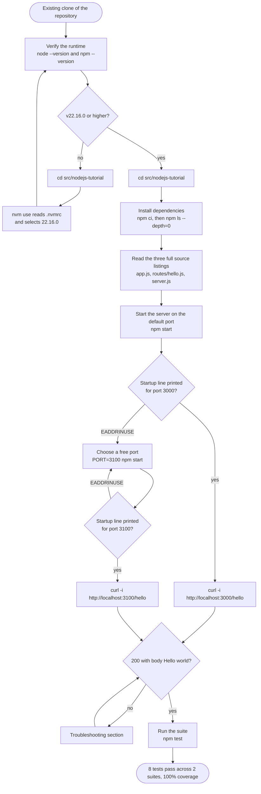
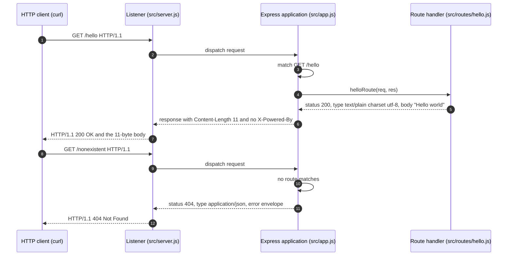
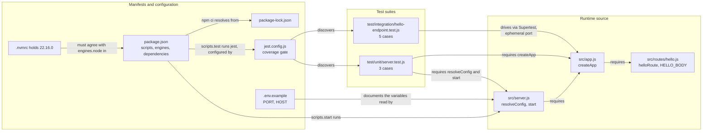

# Node.js Hello World Tutorial

A beginner-facing Node.js tutorial project that exposes exactly one HTTP endpoint — `GET /hello` — which answers any calling HTTP client with the eleven-byte plain-text body `Hello world`. It is built on Node.js 22.16.0 and Express 5.1.0, verified by eight Jest and Supertest test cases at 100% coverage, and it is deliberately small: three source modules, two test suites, one route and no second endpoint.

**A parallel tutorial, not a replacement.** This project sits *beside* the Python/Flask application this repository delivers under `src/backend/`, as an additive teaching artifact. It is not a reversal of the migration recorded in the repository's root `README.md:995-997` — "v2.0.0 - Migration to Python 3.12+ and Flask 3.1.1 from Node.js/Express.js" — and it changes nothing under `src/backend/`, which continues to serve its own `/hello` endpoint in its own shape. The two tutorials teach the same idea in two runtimes, and the section [API Documentation](#api-documentation) states exactly where their responses differ and why.

Everything below has been run and observed on Node.js 22.16.0. Every command is followed by the output that distinguishes success from failure, and the two outputs most often mistaken for errors — npm's deprecation warnings and the missing-`.env` notice — are called out where they appear.

## Table of Contents

- [Overview](#overview)
- [Prerequisites](#prerequisites)
- [Installation](#installation)
- [Project Structure](#project-structure)
- [Usage](#usage)
- [API Documentation](#api-documentation)
- [How It Works](#how-it-works)
- [Testing](#testing)
- [Troubleshooting](#troubleshooting)
- [Next Steps](#next-steps)
- [Contributing](#contributing)
- [License](#license)
- [Additional Resources](#additional-resources)

## Overview

This project is the smallest complete Node.js web service that is still worth testing: one route, one response, and the tooling that proves the response is what the documentation says it is. Nothing here is a sketch — the three source modules below are the files the test suite runs against, and the five code listings in [Project Structure](#project-structure) are extracted from those files rather than written alongside them.

### The path from a clean clone to a verified response

The whole route through this tutorial, with the two failures a reader actually hits marked as branches:



Read it from the top: verify the runtime, enter the project, install, read the source, run it, call it, test it. The only two detours are a runtime older than the pin, which `nvm use` resolves, and a port already held by something else, which `PORT=3100 npm start` resolves. [How It Works](#how-it-works) returns to this diagram alongside two others that open up the request path and the module wiring.

### Learning Objectives

By working through this tutorial you will be able to:

- **Understand how Node.js serves HTTP** — see where the runtime's listener ends and your own code begins, and what "the process is listening" actually means.
- **Register a route with Express** — bind one HTTP method and one literal path to one handler function, and know what Express does with every request that does not match it.
- **Return a plain-text response with an explicit media type** — set the status code, the `Content-Type` and the body deliberately rather than relying on whatever a framework would otherwise guess.
- **Separate an application from its listener, and know why** — the arrangement looks like over-engineering in a one-route service until you test it; [Project Structure](#project-structure) explains what it buys.
- **Test an HTTP endpoint in process with Supertest** — assert a real response without starting a server or claiming a port.
- **Read a coverage report** — recognise the four metrics Jest prints, and understand why a coverage gate can fail a run in which every single test passed.

### Technology Stack

**Runtime Environment:**

- **Node.js 22.16.0** — the version this project pins in `.nvmrc`. Node.js 22 is the "Jod" release line, now in **Maintenance LTS**, which reaches end of life on **30 April 2027**. Maintenance means security and critical fixes only: the line is supported, but it is no longer the newest one.
- **npm 10.9.2** — the package manager bundled with Node.js 22.16.0, used to install dependencies, run the scripts and audit the tree. Note that `CONTRIBUTING.md:91` and `.github/PULL_REQUEST_TEMPLATE.md:134` both state that npm v11.4.1 accompanies this runtime; the version actually bundled — and the one this project's `engines` floor is set from — is 10.9.2.

The manifest declares `"node": ">=22.16.0"` rather than an exact pin (`src/nodejs-tutorial/package.json:6-9`), following the wording at `.github/ISSUE_TEMPLATE/feature_request.md:106` — "Compatible with Node.js v22.16.0 LTS or higher". A reader on Node.js 24 (the Active LTS line) or 26 (Current) therefore installs and runs this project without editing anything.

**Web Framework:**

- **Express 5.1.0** — supplies the routing table, the response helpers and the implicit `HEAD` registration this project relies on (`src/nodejs-tutorial/package.json:16-18`). Express 5 requires Node.js 18 or newer, so the runtime above satisfies it comfortably.

**Testing Framework:**

- **Jest 29.7.0** — test runner, assertion library and coverage instrumentation, configured by `jest.config.js` (`src/nodejs-tutorial/package.json:19-22`).
- **Supertest 7.2.2** — issues real HTTP requests against the exported application without a listening server, binding it to an ephemeral port of its own for each request.

**If you are following an older Express guide**, be aware that Express 5 renamed members that tutorials written for Express 4 still use: `app.del` became `app.delete`, `res.sendfile` became `res.sendFile`, and wildcard routes must now be named — `/*splat` rather than a bare `*`. None of that affects a single literal route like `/hello`, so nothing in this tutorial depends on the distinction; it is named here only so that an older example does not mislead you.

### Project Features

- **One endpoint, `GET /hello`** — the only route registered anywhere in the project (`src/nodejs-tutorial/src/app.js:43`). There is no `/health` route and no root `/` route, because the project's brief names one endpoint.
- **A plain-text response** — `Hello world` as eleven bytes of `text/plain; charset=utf-8`, with no trailing newline and no JSON envelope around it.
- **A JSON 404 envelope** — every unmatched request receives a machine-readable `{"status":404,"message":"Not Found","path":…,"timestamp":…}` instead of Express's default HTML error page (`src/nodejs-tutorial/src/app.js:51-58`).
- **`X-Powered-By` suppressed** — the response header that names the framework is disabled (`src/nodejs-tutorial/src/app.js:36`), and a test asserts its absence.
- **Eight test cases across two suites at 100% coverage** — five integration cases assert the endpoint contract, three unit cases cover the configuration and the listener, and the coverage gate is enforced on every run.
- **Two environment variables, both documented** — `PORT` and `HOST`, with their defaults declared as constants in the source (`src/nodejs-tutorial/src/server.js:5-6`) and mirrored in `.env.example`. Nothing else in the project reads the environment.

## Prerequisites

### System Requirements

| Component | Minimum Version | Pinned / Recommended | Purpose |
|-----------|-----------------|----------------------|---------|
| **Node.js** | v22.16.0 | `22.16.0`, pinned in `.nvmrc` | JavaScript runtime that executes the server |
| **npm** | v10.9.2 | Bundled with Node.js 22.16.0 | Installs dependencies and runs the four project scripts |
| **cURL** | any | any recent build | Calls the endpoint from a terminal |
| **Disk space** | ~60MB | 100MB | `node_modules` for the three declared dependencies and their tree |

`curl` is used throughout this tutorial because it shows the whole response — status line, headers and body — in one place. **Any HTTP client will do**: a browser, an editor's HTTP panel, `wget`, Postman or a `fetch` call from another program all receive the same eleven bytes. Nothing about this service is browser-specific; it has no user interface.

### Installation Links

- **Node.js Official**: [https://nodejs.org/](https://nodejs.org/) — installers and archives for every platform, including the 22.x line this project pins.
- **nvm (Node Version Manager)**: [https://github.com/nvm-sh/nvm](https://github.com/nvm-sh/nvm) — installs and switches between Node.js versions, and reads this project's `.nvmrc` for you. Recommended if the runtime you already have is older than the pin.

### Verification Commands

Check your environment before installing anything. Steps 1 and 2 run from anywhere — you do not need to be inside the project yet.

**Step 1 (required) — check the runtime:**

```bash
node --version
```

```text
v22.16.0
```

A pass is `v22.16.0` or any higher version: 22.16.0 is the floor, not an exact requirement. If the number is lower — or if the command reports `command not found` — install Node.js from the link above, or use `nvm use` as described below.

**Step 2 (required) — check the package manager:**

```bash
npm --version
```

```text
10.9.2
```

A pass is `10.9.2` or higher. npm ships with Node.js, so installing the runtime installs the package manager too; you do not install it separately.

**Step 4 (optional) — select the pinned runtime with nvm.** Run this only if step 1 reported a version below the floor. It must run inside the project directory, so do [step 3](#1-enter-the-project-directory) first:

```bash
nvm use
```

```text
Found '/path/to/src/nodejs-tutorial/.nvmrc' with version <22.16.0>
Now using node v22.16.0 (npm v10.9.2)
```

`nvm use` with no argument reads `.nvmrc`, which holds the single line `22.16.0`, and switches the current shell to that version. If nvm reports that the version is not installed, `nvm install` — again with no argument — installs exactly the pinned version first.

*(Steps are numbered to match the [full command inventory](#verification-checklist) at the end of the Testing section, which lists all eighteen commands in order with the status of each. Step 3 is `cd src/nodejs-tutorial`, the first command in [Installation](#installation).)*

### What `engines` does, and what it does not

`src/nodejs-tutorial/package.json:6-9` declares the floors this project expects — `"node": ">=22.16.0"` and `"npm": ">=10.9.2"` — in an `engines` object that [Project Structure](#project-structure) reproduces in full alongside the scripts that follow it.

That declaration is worth reading carefully, because it promises less than it appears to. **`engines` produces a warning, not a rejection.** On a runtime below the declared range, and with no `.npmrc` present, `npm ci` prints a warning whose first line reads

```text
npm warn EBADENGINE Unsupported engine
```

and then **exits 0**: the install proceeds and the dependencies land on disk. The remediation is the `nvm use` above, which changes the runtime rather than arguing with the manifest, and the version pin plus this documented warning is the whole mechanism. [Troubleshooting](#troubleshooting) case 2 shows the warning in full and walks through the fix.

npm does have a setting that makes the check fatal — `engine-strict=true` in an `.npmrc`, which turns the warning into `npm error code EBADENGINE` with exit 1 — and **this project deliberately ships no `.npmrc`**. That filename is ignored repository-wide at `.gitignore:77`, a security-motivated default given that an npmrc can carry a registry auth token, and overriding a sensible ignore rule to police a version check is the wrong trade for a tutorial. Do not create one: check the runtime with the command above instead.

The same region of the manifest declares the four scripts this tutorial uses — `start`, `test`, `test:coverage` and `test:ci` (`src/nodejs-tutorial/package.json:10-15`). [Usage](#usage) documents each one and when to reach for it.

## Installation

**This tutorial starts from a clone you already have.** There is no `git clone` step: the only clone URL this repository publishes, at the root `README.md:102`, is a placeholder that does not resolve, so cloning instructions here would send you nowhere. If you are reading this file, you have the repository — open a terminal at its root and continue.

### 1. Enter the project directory

**Required.** From the repository root:

```bash
cd src/nodejs-tutorial
```

**Every command from here on runs in this directory**, with one exception: the `curl` invocations in [API Documentation](#api-documentation) address the server over HTTP, so they work from any directory, and indeed from any machine that can reach the port.

If you skipped it earlier, this is also where the optional `nvm use` from [Verification Commands](#verification-commands) belongs — it reads `.nvmrc` from the current directory, so it only works once you are inside the project.

### 2. Install dependencies

**Required.** Install the exact dependency tree the lockfile records:

```bash
npm ci
```

**Why `npm ci` and not `npm install`?** Because the lockfile is committed. `npm ci` installs precisely the tree `package-lock.json` records and **fails rather than quietly resolving a different one**, which is what makes the versions this tutorial names true on your machine as well as on the machine it was written on. `npm install` is free to update the lockfile to satisfy the ranges in the manifest, which is the right behaviour when you are deliberately adding a dependency — see [Next Steps](#next-steps) — and the wrong behaviour when you want to reproduce a known-good tree. `npm ci` is also the command `CONTRIBUTING.md:153-154` already verifies for this project.

Representative output:

```text
npm warn deprecated inflight@1.0.6: This module is not supported, and leaks memory. Do not use it. Check out lru-cache if you want a good and tested way to coalesce async requests by a key value, which is much more comprehensive and powerful.
npm warn deprecated glob@7.2.3: Old versions of glob are not supported, and contain widely publicized security vulnerabilities, which have been fixed in the current version. Please update. Support for old versions may be purchased (at exorbitant rates) by contacting i@izs.me

added 347 packages, and audited 348 packages in 1s

62 packages are looking for funding
  run `npm fund` for details

found 0 vulnerabilities
```

**That block is representative output, not a pass condition.** Read it as an illustration of the shape of a successful install, and judge the install by two invariants instead: **`npm ci` exits 0**, and the next step prints the three pinned versions. The package count can legitimately differ, because the lockfile carries packages that only install on some operating systems — `fsevents`, for macOS file watching, is the usual example. The elapsed time depends on your machine, your network and whether npm's cache is warm. And the exact wording of a registry deprecation notice is not frozen by a lockfile, so those two sentences may be reworded upstream at any time.

**The two `npm warn deprecated` lines are expected, and they are not a failure.** Neither package is a dependency of this project. Both arrive transitively through **Jest 29.7.0**, which still depends on `glob@7.2.3` and, through it, on `inflight@1.0.6`. You cannot remove them without changing Jest's own dependency tree, and this project pins the Jest version its repository documents (`.github/ISSUE_TEMPLATE/feature_request.md:129`). `found 0 vulnerabilities` on the line below them is npm's own verdict on the same tree — a deprecation notice is advice about a package's future, not a security finding. [Troubleshooting](#troubleshooting) case 3 says the same thing in one sentence, for a reader who arrives there in a hurry.

### 3. Verify the installed versions

**Required.** List what actually landed on disk, top level only:

```bash
npm ls --depth=0
```

```text
nodejs-hello-world-tutorial@1.0.0 /path/to/src/nodejs-tutorial
├── express@5.1.0
├── jest@29.7.0
└── supertest@7.2.2
```

Three dependencies, each at the exact version the manifest pins (`src/nodejs-tutorial/package.json:16-22`): Express is the runtime dependency, Jest and Supertest are development dependencies. The first line names the package and the absolute path of the directory you are in, so it will show your own path rather than the placeholder above. Together with `npm ci`'s exit code, this is the whole install invariant — if those three lines match, the install is correct regardless of how many packages npm reported.

### 4. Environment setup (optional)

**Optional.** The project runs on its defaults with no configuration at all. If you would rather keep your settings in a file than type them on the command line, copy the committed template:

```bash
cp .env.example .env
```

`.env.example` is that template, and it is deliberately short: it declares the only two variables this project reads, `PORT` and `HOST` (`src/nodejs-tutorial/.env.example:39,47`), each with a comment naming its default and the line of source that reads it. It is committed on purpose — the repository ignores every other `.env`-shaped filename, and `.gitignore:24` carries a single negation so that this one template can be tracked while a real `.env` of yours stays out of version control through `.gitignore:16` and `.gitignore:22`.

The copy is loaded by the runtime itself, not by a library: the `start` script runs `node --env-file-if-exists=.env src/server.js` (`src/nodejs-tutorial/package.json:11`), and that flag reads `.env` when it exists and shrugs when it does not. There is no `dotenv` dependency in this project, and no module parses configuration files. Measured on Node.js 22.16.0: with `PORT=4200` in a copied `.env`, the process reports `Server listening on: http://localhost:4200` and writes nothing to standard error.

Values you pass on the command line take precedence in practice — `PORT=3100 npm start` wins over a `.env` that says `3000` — because a variable already present in the process environment is not overwritten by the flag.

## Project Structure

Eleven committed files, and nothing generated among them:

```text
src/nodejs-tutorial/
├── package.json                      manifest: name, engines, the four scripts, three dependencies
├── package-lock.json                 the exact resolved tree, committed so npm ci is reproducible
├── .nvmrc                            one line: 22.16.0 — the runtime pin nvm use reads
├── jest.config.js                    Jest configuration: environment, coverage gate, test patterns
├── .env.example                      environment template: PORT and HOST with their defaults
├── README.md                         this tutorial
├── src/
│   ├── server.js                     the listener: resolveConfig, start, and the bootstrap guard
│   ├── app.js                        the factory: createApp builds the application and its routes
│   └── routes/
│       └── hello.js                  the route handler for GET /hello, and the HELLO_BODY constant
└── test/
    ├── unit/
    │   └── server.test.js            3 cases: the factory, the configuration, the listener
    └── integration/
        └── hello-endpoint.test.js    5 cases: the endpoint contract and both error paths
```

Two details of that tree are easy to misread. The test root is the **singular `test/`**, not `tests/`; `src/nodejs-tutorial/jest.config.js:24-27` discovers `**/test/**/*.test.js`, so a directory named `tests/` would simply not be found. And `src/` holds only the three modules listed — there is no `middleware/` and no `utils/` directory, even though `CONTRIBUTING.md:492-505` sketches both for a larger version of this project, and no `routes/health.js`, which the same sketch marks "(future)".

Two more directories appear once you have installed and tested — `node_modules/` and `coverage/` — and neither is committed: `.gitignore:55` and `.gitignore:149` ignore them, at this nesting depth as well as at the repository root.

Two files in the tree are described here rather than reproduced. `package-lock.json` is a machine-written record of the resolved dependency tree, 168KB of it, and reading it teaches nothing that `npm ls --depth=0` does not teach in three lines; what matters is that it is committed, because that is what makes `npm ci` reproducible. `.nvmrc` holds the single line `22.16.0` and nothing else.

### The three modules, and why there are three

The project's behaviour is split across `src/server.js`, `src/app.js` and `src/routes/hello.js`. For one route returning eleven bytes, that will look like over-engineering — so here is what each module owns, and what the split actually buys.

Throughout this tutorial, three words are used in one sense each: **the application** is the Express object, **the listener** is the `http.Server` that holds the port, and **the factory** is the function that returns a fresh application.

#### The route handler: `src/routes/hello.js`

The smallest piece first. This module is one constant and one function.

<!-- listing: src/routes/hello.js -->
```javascript
/**
 * Route handler for the tutorial's single endpoint, GET /hello.
 *
 * Demonstrates the smallest useful Express route: a synchronous function that
 * receives the request and response objects, sets the status and the media
 * type, and sends a plain-text body. The handler is exported rather than
 * registered here, so src/app.js owns the routing table while this module owns
 * only the response - which is what lets the endpoint contract be tested
 * without starting a server.
 *
 * The module deliberately requires nothing. A route handler only ever touches
 * the objects Express hands it, so it needs neither the framework itself nor
 * any configuration; src/server.js is the one module that reads the
 * environment.
 */

// The response payload, declared once so that the handler and the tutorial
// quote the same eleven bytes: capital H, lower-case w, one space, no
// punctuation and no trailing newline. The integration test asserts the
// literal rather than this constant, so editing it fails the suite visibly
// instead of drifting away from the documentation.
const HELLO_BODY = 'Hello world';

/**
 * Sends the plain-text body 'Hello world' with status 200.
 *
 * Two calls do all the work. .type('text/plain') resolves through Express's
 * mime lookup to the full 'text/plain; charset=utf-8' header, and .send()
 * derives Content-Length from the body it is given, so neither header is
 * written by hand here. Express answers HEAD /hello from this same handler
 * with identical headers and an empty body, which is why no second route is
 * registered for it.
 *
 * @param {express.Request} req Incoming request. Unused: this response never
 *   varies, but Express passes the request to every handler.
 * @param {express.Response} res Response used to send the payload.
 * @returns {void}
 */
function helloRoute(req, res) {
  res.status(200).type('text/plain').send(HELLO_BODY);
}

// CommonJS export boundary: these two names are what another module receives
// when it requires this file, so src/app.js can destructure the handler and
// the payload keeps a single published home rather than a copy wherever it is
// mentioned.
module.exports = { helloRoute, HELLO_BODY };
```

Three things in it are worth naming for a reader new to Node.js.

**`module.exports` is the module's boundary.** Node.js modules in this project use CommonJS: a file is private until it assigns to `module.exports`, and whatever it assigns there is exactly what another file receives. Line 47 publishes two names, so `src/app.js` can pull out the handler by name. The counterpart is `require`, which appears in the next two modules: `require('./routes/hello')` returns that same object. Notice what is *not* here — this module requires nothing at all, because a route handler only ever touches the request and response objects Express hands it.

**The body is a constant, declared once** (`src/nodejs-tutorial/src/routes/hello.js:22`). `HELLO_BODY` holds `Hello world`: capital `H`, lower-case `w`, one space, no punctuation, no trailing newline. Express's own canonical example sends `Hello World!` instead, with a capital `W` and an exclamation mark, and the two are not interchangeable — this project's contract is the eleven-byte form.

**Two chained calls do all the work** (`src/nodejs-tutorial/src/routes/hello.js:40`). `res.status(200)` sets the status code; `.type('text/plain')` resolves through Express's mime lookup to the full `text/plain; charset=utf-8` header; `.send(HELLO_BODY)` writes the body and derives `Content-Length` from its length. Neither header is written by hand, and both are asserted by the test suite.

#### The factory: `src/app.js`

This module owns the routing table — and owns nothing else.

<!-- listing: src/app.js -->
```javascript
'use strict';

/**
 * Express application factory for the Node.js Hello World tutorial.
 *
 * This module owns the routing table and nothing else: it wires the single
 * GET /hello route to its handler, suppresses the header that identifies the
 * framework, and terminates every unmatched request with a JSON 404 envelope.
 * It deliberately never opens a socket and never reads the environment -
 * src/server.js resolves the configuration and binds the listener.
 */

// Express 5.1.0 supplies the routing table and the response helpers, and the
// route handler lives in its own module. Those are the only two requires this
// file needs: the project ships no middleware, utility or configuration
// module, so there is nothing else to pull in.
const express = require('express');
const { helloRoute } = require('./routes/hello');

/**
 * Creates and configures the Express application for this tutorial.
 *
 * The application is returned without a listening socket: binding a port is
 * server.js's job. That separation is what lets the integration suite drive
 * this application in process, on a port Supertest chooses, and it is why a
 * factory is exported rather than a ready-made application constant - every
 * caller, each test included, receives a fresh instance with no shared state.
 *
 * @returns {express.Application} the configured Express application
 */
function createApp() {
  const app = express();

  // Express advertises itself in an X-Powered-By response header by default.
  // Express.js v5 security enhancement - prevents framework fingerprinting.
  app.disable('x-powered-by');

  // The project's only route. Express registers HEAD /hello alongside GET, so
  // a HEAD request is answered from this same handler with identical headers
  // and an empty body, without a second registration. Registering with
  // app.get rather than app.use is what keeps every other method on this path
  // falling through to the 404 handler below.
  app.get('/hello', helloRoute);

  // Terminal 404 handler, registered last on purpose: Express runs middleware
  // in registration order, so this only runs when no route above matched. It
  // always responds and never calls next(), which is what replaces Express's
  // own HTML error page with the envelope the tutorial documents. The keys are
  // declared in the order the documented body shows them, because
  // JSON.stringify preserves insertion order.
  app.use((req, res) => {
    res.status(404).json({
      status: 404,
      message: 'Not Found',
      path: req.path,
      timestamp: new Date().toISOString()
    });
  });

  return app;
}

// CommonJS module boundary: createApp is the single published symbol, required
// by name from src/server.js and from both test suites.
module.exports = { createApp };
```

**Why a factory rather than a ready-made application?** `createApp()` is a function that returns a new application each time it is called (`src/nodejs-tutorial/src/app.js:31-61`). A module could instead build one application at load time and export that object, and every caller in the process would then share it — including every test file, which would share whatever state a previous test had left on it. A factory gives each caller a fresh, independent instance, which is why the test suites can build their own without coordinating.

**Middleware ordering is the one rule to internalise.** Express runs whatever you register in the order you register it, and the first thing that responds ends the request. Line 43 registers the route; lines 51-58 register a handler with `app.use` and no path, which therefore matches *everything*. Because it is registered **last**, it only ever runs when no route above it matched — which is precisely the definition of a 404. Move it above line 43 and it would swallow `GET /hello` too. It always responds and never calls `next()`, which is what replaces Express's default HTML error page with the JSON envelope [API Documentation](#api-documentation) specifies.

**`app.get`, not `app.use`, for the route.** `CONTRIBUTING.md:363` sketches this registration as `app.use('/hello', helloRoute)`, which would answer *every* method on that path. The delivered code uses `app.get` (`src/nodejs-tutorial/src/app.js:43`), which registers `GET` — and, for free, `HEAD` — and lets `POST`, `PUT`, `PATCH`, `DELETE` and `OPTIONS` fall through to the 404 handler. That difference is exactly what makes the error behaviour in [Error Responses](#error-responses) correct rather than accidental.

**No socket, ever.** Nothing in this file calls `listen`. The application it returns is, in Node.js terms, just a function of `(req, res)` — the same shape `http.createServer` wants. Holding a port is somebody else's job.

#### The listener: `src/server.js`

The entry module: the file `npm start` actually runs.

<!-- listing: src/server.js -->
```javascript
'use strict';

const { createApp } = require('./app');

const DEFAULT_PORT = 3000;
const DEFAULT_HOST = 'localhost';
/** Resolves the listening configuration; the only reader of process.env here. */
function resolveConfig(env = process.env) {
  return {
    port: Number.parseInt(env.PORT, 10) || DEFAULT_PORT,
    host: env.HOST || DEFAULT_HOST
  };
}

// Entry module for the Node.js Hello World tutorial. It does three things and
// nothing else: resolve the listening configuration, bind the HTTP listener,
// and bootstrap itself when this file is the one Node was started with. The
// application itself - the routing table and the responses - lives in
// src/app.js, which never opens a socket; that split is what lets the
// integration suite drive the application in process on a port Supertest
// chooses, and it is the layout the project's module naming prescribes.
//
// The declarations above are kept inside thirteen lines deliberately. The
// environment template and the tutorial cite the default constants at lines
// 5-6 and the two process.env reads at lines 10-11, so a conventional
// multi-line header comment here would silently break those citations; the
// longer explanation belongs from this point down instead.
//
// resolveConfig holds both defaults in one place and is the single point in
// the whole project that touches process.env. Number.parseInt yields NaN for
// an absent or non-numeric PORT and NaN is falsy, so one || fallback covers
// both cases; HOST is already a string and needs only an empty-value
// fallback. Taking the environment as a parameter - defaulting to the real
// process.env - is what lets the unit suite assert the documented defaults
// and the PORT/HOST overrides without mutating the process it runs in, while
// `PORT=3100 npm start` still works unchanged. A .env file, when a reader
// creates one, is read by the runtime through the --env-file-if-exists flag in
// package.json's start script, so no module here parses it and no dotenv
// dependency is declared.

/**
 * Starts the HTTP listener for the given application.
 *
 * Both arguments are required on purpose. Declaring them as default
 * parameters - start(app = createApp(), config = resolveConfig()) - would add
 * branches that no test executes, and jest.config.js gates branch coverage at
 * 95%, so `npm test` would fail on a clean clone.
 *
 * The listener's callback writes one line to stdout and interpolates the
 * config this function was handed rather than server.address(), so the message
 * a reader compares against the tutorial always names the host and port they
 * asked for. With the defaults it reads, character for character,
 * `Server listening on: http://localhost:3000`. That line is the only output
 * this project produces: no startup banner, no timestamp and no request
 * logging. The http.Server is returned so that a caller - the unit suite, in
 * practice - can close it again.
 *
 * @param {import('express').Application} app - application from createApp()
 * @param {{port: number, host: string}} config - resolved listening config
 * @returns {import('http').Server} the listening HTTP server
 */
function start(app, config) {
  return app.listen(config.port, config.host, () => {
    console.log(`Server listening on: http://${config.host}:${config.port}`);
  });
}

// CommonJS module boundary. The two functions are what the unit suite drives;
// the two constants are published so that a test, or a reader, can assert the
// documented defaults against the source of truth rather than against a copy
// of the numbers.
module.exports = { resolveConfig, start, DEFAULT_PORT, DEFAULT_HOST };

// Bootstrap. require.main is the module Node was started with, so this guard
// is true for `node src/server.js` - what `npm start` runs - and false when
// Jest or any other module requires this file, which is why requiring it
// never opens a socket. The two factory calls sit here at the call site, not
// in start's parameter list, for the coverage reason noted above. Stop the
// process with Ctrl+C: no SIGTERM or SIGINT handler is installed, because
// draining keep-alive connections needs a policy and a timeout that a
// single-endpoint tutorial deliberately leaves to its Next Steps.
/* istanbul ignore next */
if (require.main === module) {
  start(createApp(), resolveConfig());
}
```

**One module reads the environment.** `resolveConfig` (`src/nodejs-tutorial/src/server.js:8-13`) is the only place in the project that touches `process.env`, and it holds both defaults in one place: `DEFAULT_PORT` and `DEFAULT_HOST` at lines 5-6, read as `env.PORT` and `env.HOST` at lines 10-11. It takes the environment as a parameter that defaults to the real `process.env`, which lets a test pass in a made-up environment without mutating the process it runs in.

**`start` takes both arguments explicitly, and that is deliberate** (`src/nodejs-tutorial/src/server.js:62-66`). Written the other way round — `function start(app = createApp(), config = resolveConfig())` — those default parameters would be branches that no test ever executes, because every caller supplies both. Jest's coverage gate requires 95% branch coverage, so `npm test` would fail on a clean clone with nothing actually wrong. Moving the two calls to the call site on line 84 removes the branches, and it is the clearer form for a reader anyway: you can see what the listener is given.

**`require.main === module` is the bootstrap guard** (`src/nodejs-tutorial/src/server.js:83-85`). `require.main` is the module Node.js was started with. When you run `node src/server.js`, this file *is* that module, the comparison is true, and the listener starts. When Jest — or any other file — `require`s this module, `require.main` is something else, the comparison is false, and nothing binds a port. That is what "executed directly" means, and it is why importing this file in a test is harmless. The `/* istanbul ignore next */` comment on line 82 tells the coverage instrumentation to skip a block that can never run under Jest, by construction.

**One line of output, and nothing else** (`src/nodejs-tutorial/src/server.js:64`). The listener's callback prints `Server listening on: http://localhost:3000` with the defaults, and the process prints nothing further: no banner, no timestamp, no request log. [Usage](#usage) shows the line and explains why it is one line rather than the six `CONTRIBUTING.md:172-177` describes.

### What the split buys: testing without a port

Here is the payoff, and it is the least obvious thing in the project.

Because `src/app.js` returns an application that has never opened a socket, the integration suite can drive that application **in process**. Supertest accepts either a listening `http.Server` **or** an unbound request handler; handed the latter, it binds it to an **ephemeral port of its own** — a port the operating system picks, for the duration of that one request — and closes it afterwards. So `request(app).get('/hello')` issues a real HTTP request, over a real socket, against the real application, without this project ever naming a port in a test.

Note the direction of that argument: exporting the application without calling `listen` is *an arrangement that keeps the tests free of a fixed port*, not a condition Supertest imposes. Supertest would work perfectly well against a server you had already started. The arrangement is what means no test can collide with a server you left running in another terminal, nor with anything else on your machine that happens to hold port 3000.

The split is also the layout this repository's contributor guide prescribes: `CONTRIBUTING.md:493-496` names exactly these three modules — "app.js — Main Express application factory", "server.js — HTTP server initialization" and "routes/hello.js — Hello endpoint route handler". The one deviation is the directory they live in: that document roots them at `src/backend/`, which in this repository is occupied by the Python/Flask application, so this project takes the same module names under its own root.

### The manifest: `package.json`

Two of the manifest's blocks are worth reading in full — the floors the project expects, and the commands it publishes:

<!-- listing: package.json#engines-and-scripts -->
```json
  "engines": {
    "node": ">=22.16.0",
    "npm": ">=10.9.2"
  },
  "scripts": {
    "start": "node --env-file-if-exists=.env src/server.js",
    "test": "jest",
    "test:coverage": "jest --coverage",
    "test:ci": "jest --ci --runInBand --coverage"
  },
```

[Prerequisites](#prerequisites) covers what `engines` does and does not enforce. [Usage](#usage) documents each of the four scripts, what it runs and when you would reach for it. The remaining manifest fields are unremarkable: `name`, `version`, `description`, `main` pointing at `src/server.js`, the three pinned dependencies, `"license": "MIT"` and `"private": true`.

## Usage

### Starting the server

**Required.** From `src/nodejs-tutorial`:

```bash
npm start
```

The process writes exactly one line to standard output:

```text
Server listening on: http://localhost:3000
```

That is the whole startup output. Copy the URL, or read the port off it, and the server is ready.

Unless you created a `.env` in [Installation step 4](#4-environment-setup-optional), one further line goes to **standard error**:

```text
.env not found. Continuing without it.
```

That line is informational and comes from the runtime, not from this project's code: it is what `node --env-file-if-exists=.env` says when the file is absent. The server has started normally, on the defaults. [Troubleshooting](#troubleshooting) case 4 covers it in one place; it is mentioned here only because you will see it the very first time you run the command.

**Why one line and not six.** `CONTRIBUTING.md:172-177` documents a six-line startup banner for this project: a `🚀 Server Successfully Started!` headline, a `====` rule, an ISO timestamp, then `🌐 Server listening on: http://localhost:3000` at `:175`, `📡 Host: localhost` at `:176` and `🔌 Port: 3000` at `:177`. This project deliberately emits only the substantive line, without the emoji prefix and without the banner. The host and the port are already in the URL, so the last two lines would repeat it; a timestamp on a tutorial process you started five seconds ago is noise; and one plain line is something you can compare against this document character for character. If you have read that banner elsewhere in the repository, this is the difference, stated rather than glossed.

### Stopping the server

**Required, when you are finished.** `npm start` runs in the **foreground**: the terminal stays occupied and the process keeps printing there. Stop it with

```text
Ctrl+C
```

in that same terminal, matching the convention `CONTRIBUTING.md:190` uses. The process exits immediately and releases the port. That also means you need a **second terminal** for the `curl` calls in [API Documentation](#api-documentation) — or you can stop the server first and run the test suite, which needs no server at all.

No `SIGTERM` or `SIGINT` handler is installed, so `Ctrl+C` is an abrupt stop rather than a graceful drain. [Next Steps](#next-steps) explains why a tutorial defers that and what a production service would do instead.

### Configuration

Two environment variables, and only two:

| Variable | Default | Read at |
|----------|---------|---------|
| `PORT` | `3000` | `src/nodejs-tutorial/src/server.js:10`, default constant at `:5` |
| `HOST` | `localhost` | `src/nodejs-tutorial/src/server.js:11`, default constant at `:6` |

**No other environment variable is read anywhere in this project.** `resolveConfig` is the only function that touches `process.env`, and those two lines are the only places it reads from it — so the table above is the complete configuration surface, not a summary of it.

`PORT` is parsed with `Number.parseInt(env.PORT, 10)` and falls back to `3000` whenever the result is not a number: an unset variable and a value like `not-a-number` both yield `NaN`, which is falsy, so a single fallback covers both. `HOST` is already a string and needs only an empty-value fallback. The default host is loopback on purpose — `localhost` means the service is reachable from your own machine and nowhere else, so a tutorial server is never exposed on a network without an explicit decision.

Override either variable for a single run by prefixing the command, the form `CONTRIBUTING.md:259` uses:

```bash
# Step 7 (optional): pick a different port, e.g. when 3000 is already in use
PORT=3100 npm start
```

```text
Server listening on: http://localhost:3100
```

```bash
# Listen on every interface rather than loopback only
HOST=0.0.0.0 npm start
```

```text
Server listening on: http://0.0.0.0:3000
```

Both variables can be set at once (`PORT=3100 HOST=0.0.0.0 npm start`), and a prefixed value wins over a value in your `.env` — measured on Node.js 22.16.0. If you prefer a file to a prefix, put the same two keys in `.env` as described in [Installation step 4](#4-environment-setup-optional).

A prefix applies to one command only, which is inconvenient when the `curl` calls that follow need the same port. Export it instead and every later command in that terminal picks it up — this is step 7 of the [command inventory](#verification-checklist), and it is optional:

```bash
export PORT=3100
```

From then on `npm start` listens on 3100 and `curl -i http://localhost:${PORT:-3000}/hello` addresses it, with no further editing.

If the port you asked for is already held by another process, Node.js reports `EADDRINUSE` and the process exits without listening; [Troubleshooting](#troubleshooting) case 1 is that failure and its remedy.

### npm scripts

All four scripts the manifest declares (`src/nodejs-tutorial/package.json:10-15`):

| Script | Runs | Use it when |
|--------|------|-------------|
| `npm start` | `node --env-file-if-exists=.env src/server.js` | running the server locally |
| `npm test` | `jest` | running the suite — it already prints coverage |
| `npm run test:coverage` | `jest --coverage` | an explicit alias for the same reports as `npm test` |
| `npm run test:ci` | `jest --ci --runInBand --coverage` | pipelines: no snapshot writing, suites run serially |

One honest note about `test:coverage`, because the name implies a difference that is not there. `jest.config.js` sets `collectCoverage: true` and `coverageReporters: ['text', 'lcov', 'html']` (`src/nodejs-tutorial/jest.config.js:31-32`), so **plain `npm test` already prints the coverage table and already writes the `lcov` and `html` reports** into `coverage/`. `npm run test:coverage` passes `--coverage` explicitly and produces exactly the same reports, not additional ones. It exists because `CONTRIBUTING.md:209` verifies this project by that script name, and it is kept so that the name a contributor reads about is a name that works.

`test:ci` is the one script that behaves differently: `--ci` stops Jest writing new snapshots (this project has none, so that is a guarantee rather than a change) and `--runInBand` runs the suites serially in a single process instead of in parallel workers, which is the form `CONTRIBUTING.md:1103` names for pre-merge validation and the friendlier one on a loaded machine.

## API Documentation

The service has one endpoint. Everything below was measured against the running server on Node.js 22.16.0, and every attribute is asserted by the test suite unless it is explicitly labelled a framework default. The [request lifecycle diagram](#the-request-lifecycle) shows the path each of these responses takes through the three modules.

### Endpoints

#### GET /hello

Returns the plain-text greeting `Hello world`.

| Attribute | Value |
|-----------|-------|
| Method and path | `GET /hello` |
| Success status | `200` |
| Response body | `Hello world` — exactly eleven bytes: capital `H`, lower-case `w`, one space, no punctuation, **no trailing newline** |
| Content-Type | `text/plain; charset=utf-8` |
| Deliberate headers | `Content-Length: 11`; `X-Powered-By` **suppressed** |
| Framework defaults | `ETag` (weak), `Date`, `Connection`, `Keep-Alive` — Express and Node.js defaults, **not** choices this project made |
| `HEAD /hello` | `200`, the same `Content-Type` and `Content-Length: 11`, and an empty body. Express registers `HEAD` implicitly for every `GET` route, so this is correct HTTP semantics arriving for free rather than a second route |
| Handler | `src/nodejs-tutorial/src/routes/hello.js:39-41`, registered at `src/nodejs-tutorial/src/app.js:43` |

**Request:**

```http
GET /hello HTTP/1.1
Host: localhost:3000
```

**Response:**

```http
HTTP/1.1 200 OK
Content-Type: text/plain; charset=utf-8
Content-Length: 11

Hello world
```

**Response Headers:**

- `Content-Type`: `text/plain; charset=utf-8` — set by the handler, asserted by the suite
- `Content-Length`: `11` — derived by Express from the body, asserted by the suite
- `X-Powered-By`: **absent** — suppressed deliberately, and its absence is asserted by the suite
- `ETag`, `Date`, `Connection`, `Keep-Alive` — Express and Node.js defaults, not asserted anywhere

**cURL Example** — step 9 of the [command inventory](#verification-checklist), required. Run it in a second terminal while the server is running:

```bash
curl -i http://localhost:3000/hello
```

The full response, exactly as observed:

```text
$ curl -i http://localhost:3000/hello
HTTP/1.1 200 OK
Content-Type: text/plain; charset=utf-8
Content-Length: 11
ETag: W/"b-e1AsOh9IyGCa4hLN+2Od7jlnP14"
Date: <RFC 7231 date>
Connection: keep-alive
Keep-Alive: timeout=5

Hello world
```

**Five things in that block are the acceptance criteria**, and they are the five the test suite asserts:

1. the status is `200`;
2. `Content-Type` is `text/plain; charset=utf-8`;
3. `Content-Length` is `11`;
4. the body is exactly `Hello world`, with no trailing newline;
5. there is **no `X-Powered-By` header** anywhere in the response.

`ETag`, `Date`, `Connection` and `Keep-Alive` are shown for realism only. Their values vary by runtime, by client and by the second, and **nothing in this project asserts them** — an `ETag` computed from a different body hash or a `Date` from your own clock is not a failure.

If you started the server on another port, substitute it: `curl -i http://localhost:${PORT:-3000}/hello` works whether or not you exported `PORT` in step 7.

**Confirming there is no trailing newline** — step 10, required. Counting bytes is the only way to see the difference, because a terminal renders `Hello world` and `Hello world\n` almost identically:

```bash
curl -s http://localhost:3000/hello | wc -c
```

```text
11
```

Eleven, not twelve. `curl -s` suppresses the progress meter and prints the body alone; `wc -c` counts bytes. A twelfth byte would mean a newline had crept into the response.

#### Why the response is plain text and not JSON

If you have already met this repository's other `/hello` endpoint, you will expect a JSON object, so this deserves an explicit answer.

The brief for this project asked for an endpoint "that returns \"Hello world\" to the calling HTTP client". Those quotation marks delimit a payload in English prose — they introduce no object, no key and no field. A JSON reading would have required inventing a key name that nobody asked for. The Node.js-specific contract this repository already records agrees: `CONTRIBUTING.md:594` asserts a `Content-Type` matching `text/plain`, `CONTRIBUTING.md:597-598` asserts the bare string `Hello world` with a length of `11`, `CONTRIBUTING.md:183-184` documents the verification as `curl http://localhost:3000/hello` with "Expected response: Hello world", and the repository's root `README.md:287-304` publishes the same plain-text form with `Content-Length: 11`.

**How this differs from the delivered Flask endpoint.** The Python application under `src/backend/` answers `GET /hello` with a three-key JSON envelope built by `jsonify()` — `message`, `timestamp` and `status` (`src/backend/app.py:367-411`) — together with an `X-API-Version: 1.0` header and a suite of security headers, and its test suite asserts exactly that shape (`src/backend/tests/test_app.py:111-164`). That is that project's contract and this document passes no judgement on it: it is out of scope here and continues to return what it returns. For completeness, `src/backend/README.md:250-258` publishes a third description again — `application/json` with `Content-Length: 27` and the body `{"message": "Hello world"}` — so the repository's existing descriptions of `/hello` do not fully agree with one another. None of those three forms is this project's contract. This project's contract is the table above.

### Error Responses

Everything this service does not recognise gets the same JSON envelope, produced by the terminal handler at `src/nodejs-tutorial/src/app.js:51-58`.

#### 404 Not Found

**Unknown path** — step 11, required:

```bash
curl -i http://localhost:3000/nonexistent
```

```text
$ curl -i http://localhost:3000/nonexistent
HTTP/1.1 404 Not Found
Content-Type: application/json; charset=utf-8
Content-Length: 97
ETag: <weak ETag of the envelope>
Date: <RFC 7231 date>
Connection: keep-alive
Keep-Alive: timeout=5

{"status":404,"message":"Not Found","path":"/nonexistent","timestamp":"2026-01-01T00:00:00.000Z"}
```

Four fields, in that order: `status` repeats the HTTP status as a number, `message` is the fixed string `Not Found`, `path` echoes the path that was requested, and `timestamp` is generated per request as an ISO 8601 string — so your own value will differ, and `Content-Length` varies with the length of the path you asked for.

**What reaches this handler.** All of the following, each one measured:

- every method on an unknown path — `GET`, `HEAD`, `POST`, `PUT`, `PATCH`, `DELETE` and `OPTIONS` alike;
- `POST`, `PUT`, `PATCH`, `DELETE` and `OPTIONS` on `/hello`, because only `GET` (and therefore `HEAD`) is registered there.

**`POST /hello` returns `404`, not `405`** — step 12, required:

```bash
curl -i -X POST http://localhost:3000/hello
```

```text
HTTP/1.1 404 Not Found
Content-Type: application/json; charset=utf-8
Content-Length: 91

{"status":404,"message":"Not Found","path":"/hello","timestamp":"2026-01-01T00:00:00.000Z"}
```

A reader who expects `405 Method Not Allowed` is applying a rule Express does not follow: **Express 5 does not synthesise a Method Not Allowed response** when only `GET` is registered on a path. The request simply matches no route and falls through. This project does not add a method gate to manufacture a `405`, because that would be behaviour invented for the tutorial rather than behaviour the framework gives you, and one of the eight test cases pins the `404` so the distinction cannot drift.

**One exception to the body.** A `HEAD` request to an unknown path reaches the same handler and receives the `404` status and the `application/json; charset=utf-8` media type, but **HTTP forbids a body on a `HEAD` response** — so the envelope is computed, its length is reported in `Content-Length`, and the bytes are then suppressed. That is the runtime enforcing the protocol, not a special case in this code.

**A well-formed `HEAD` on the real route** — step 13, required — behaves as the contract table promises:

```bash
curl -I http://localhost:3000/hello
```

```text
HTTP/1.1 200 OK
Content-Type: text/plain; charset=utf-8
Content-Length: 11
ETag: W/"b-e1AsOh9IyGCa4hLN+2Od7jlnP14"
Date: <RFC 7231 date>
Connection: keep-alive
Keep-Alive: timeout=5
```

Same status, same headers, no body. `curl -I` sends `HEAD` rather than `GET`, which is why nothing follows the blank line.

### Security Features

This project makes exactly one deliberate security-relevant choice, and it is worth understanding both what it does and what it does not do.

**`X-Powered-By` is suppressed.** Express advertises itself in an `X-Powered-By: Express` response header by default. Line 36 of `src/nodejs-tutorial/src/app.js` turns that off with `app.disable('x-powered-by')`, which `CONTRIBUTING.md:329` annotates as an "Express.js v5 security enhancement - prevents framework fingerprinting" — that is, it stops the response telling a scanner which framework and therefore which published vulnerabilities to try. It is a small measure, not a defence, and its value here is mostly that you can see it: `CONTRIBUTING.md:602` asserts the header's absence, so suppression is part of this project's published contract rather than an extra, and the integration suite asserts it on every run.

**What is deliberately absent.** The Flask application under `src/backend/` emits `X-Content-Type-Options`, `X-Frame-Options` and related headers, and documents a CORS configuration as well. None of that is carried over here, on purpose. Those headers instruct a *browser* about content sniffing, framing and cross-origin access; this project has no browser client, no user interface and no cross-origin caller, and it serves eleven bytes of plain text on loopback. Adding four headers that a reader of a beginner tutorial could not explain would work against the point of the tutorial, and pretending they hardened anything here would be worse. `X-Powered-By` is the single exception because the repository's own contract for *this* project asserts it.

If you extend this project into something that a browser will load — see [Next Steps](#next-steps) — that calculus changes, and a middleware layer that sets those headers is the conventional answer.

## How It Works

Three diagrams, each answering a different question: what happens to one request, what route you take through this tutorial, and how the files fit together. Every node names the file it stands for, so a diagram cannot quietly drift away from the source — it would become visibly wrong instead.

### The request lifecycle

This is the question a beginner actually has: what happens between typing `curl` and seeing text? Both paths are here — the one that matches the route, and the one that does not.



Read the success path first, steps 1 to 7. The listener — the `http.Server` that `npm start` created — accepts the connection and hands the parsed request to the application; the application walks its routing table in registration order, finds that `GET /hello` matches, and calls the handler; the handler sets the status, the media type and the body; Express fills in `Content-Length` and omits `X-Powered-By`; and the listener writes the bytes back. Nothing in that path is asynchronous in this project, and nothing waits on anything.

The second path, steps 8 to 12, is the same journey with one difference: no route matches, so the walk reaches the terminal handler registered last, which responds with the 404 envelope rather than calling `next()`. That is why an unknown path and an unregistered method produce identical output — they are the same code path, arrived at from two directions. [Error Responses](#error-responses) lists exactly which requests take it.

### The learner path

The flowchart at [the head of this tutorial](#the-path-from-a-clean-clone-to-a-verified-response) is the third diagram in this set, placed there rather than here because it is most useful before you start rather than after. Return to it whenever you lose your place: it names the command that advances each step and both of the detours that a first run can take.

### Module wiring

This is the diagram that makes the application-and-listener split legible. It shows what requires what, which modules each suite reaches, and what each manifest governs.



Three things are worth noticing in that picture.

**The dependency chain runs one way only.** `src/server.js` requires `src/app.js`, which requires `src/routes/hello.js`, and nothing points back. The route handler knows nothing about the application; the application knows nothing about ports. That is what lets you read the three files in the order [Project Structure](#project-structure) presents them, from the leaf inwards, without holding anything in your head.

**The two suites enter the project at different depths.** The unit suite requires `src/server.js` and `src/app.js` directly and asserts what those functions return. The integration suite touches only `src/app.js` — via Supertest, on an ephemeral port — and asserts what the *HTTP response* looks like. Neither suite ever requires the other's target, and neither starts the server that `npm start` starts.

**The manifests govern rather than execute.** `package.json` names the entry point and the runner; `package-lock.json` fixes what `npm ci` resolves; `.nvmrc` pins the runtime and must agree with `engines.node` — the pin is the floor of the range, which is what makes them consistent by construction; `jest.config.js` decides which files are tests and how much coverage is enough; and `.env.example` documents the two variables `src/server.js` reads. None of them contains behaviour, which is why a mistake in one shows up as a tooling error rather than a wrong response.

## Testing

### Running the suite

**Required.** The suite needs no running server — stop yours with `Ctrl+C` first if you like, or leave it running; it makes no difference:

```bash
npm test
```

Representative output, with the per-case list Jest prints under `verbose: true` trimmed to its tail:

```text
------------|---------|----------|---------|---------|-------------------
File        | % Stmts | % Branch | % Funcs | % Lines | Uncovered Line #s
------------|---------|----------|---------|---------|-------------------
All files   |     100 |      100 |     100 |     100 |
 src        |     100 |      100 |     100 |     100 |
  app.js    |     100 |      100 |     100 |     100 |
  server.js |     100 |      100 |     100 |     100 |
 src/routes |     100 |      100 |     100 |     100 |
  hello.js  |     100 |      100 |     100 |     100 |
------------|---------|----------|---------|---------|-------------------
Test Suites: 2 passed, 2 total
Tests:       8 passed, 8 total
Snapshots:   0 total
Time:        0.5 s
Ran all test suites.
```

Two suites, eight tests, and 100% on all four coverage metrics — the same result `CONTRIBUTING.md:203-204` documents for this project, which is why you can compare your own run against it line for line. The process exits `0`.

Above that summary, Jest prints a `PASS` line for each suite followed by every case name. **Do not expect a fixed order** between the two `PASS` lines: Jest schedules suites by file size and by how long they took last time, so the integration suite may well print before the unit suite, which is the reverse of the order `CONTRIBUTING.md:200-201` shows. Both orders are correct, and neither says anything about the result.

The elapsed time is representative, not a criterion. The invariants are the counts, the coverage figures and the exit code.

### What the eight cases prove

The two test modules are not reproduced here — you do not need to retype a test to learn from it — but every case is listed, so you can see what each one pins down.

**`test/integration/hello-endpoint.test.js`** — five cases, each driving the exported application through Supertest:

| # | Case | What it proves |
|---|------|----------------|
| 1 | `GET /hello` returns `200`, the response text is exactly `Hello world`, and its length is `11` | the payload itself, byte for byte, including the absence of a trailing newline |
| 2 | `GET /hello` returns a `Content-Type` matching `text/plain`, sets `content-length` to `'11'`, and does **not** set `x-powered-by` | the header contract, including that suppression took effect |
| 3 | `HEAD /hello` returns `200` with the same `Content-Type` and `Content-Length` and an empty body | that `HEAD` is served correctly from the implicit registration Express adds alongside `GET` |
| 4 | `GET /nonexistent` returns `404` with `application/json` and a body carrying `status: 404`, `message: 'Not Found'`, the request `path` and a `timestamp` | the terminal 404 handler, and the shape of the envelope |
| 5 | `POST /hello` returns `404` | that Express 5 does not synthesise a `405`, and that this project has not added one |

**`test/unit/server.test.js`** — three cases, covering what an HTTP request cannot reach:

| # | Case | What it proves |
|---|------|----------------|
| 6 | `createApp()` returns a request handler and binds no port | the property the integration suite depends on: the application is a `(req, res)` function with no socket of its own |
| 7 | `resolveConfig` yields the documented defaults `3000` and `localhost`, and honours `PORT` and `HOST` overrides | that the configuration surface behaves as [Configuration](#configuration) documents it, including the fallback for a non-numeric `PORT` |
| 8 | `start` binds a listening server on an ephemeral port, emits the startup line, and closes cleanly | the listener, and that the startup line is printed exactly once with no banner around it |

Case 1 asserts the body against a *literal* rather than against the `HELLO_BODY` constant. That is deliberate: editing the constant then fails the suite visibly, instead of silently moving the code away from this document.

### How Supertest reaches the application without a running server

This is the least obvious mechanism in the project, and it is worth a paragraph of its own.

`createApp()` returns an application that has never opened a socket. Supertest takes that unbound request handler, **binds it to an ephemeral port of its own** — one the operating system assigns, for the duration of a single request — issues a real HTTP request against it, exposes the response for assertion, and closes the port again. So the five integration cases exercise real HTTP, over a real socket, against the real application, and yet no port number appears anywhere in the suite.

Two consequences follow. The suite cannot collide with a server you left running on port 3000, or with anything else on your machine. And the suite cannot be affected by your `PORT` or `HOST` settings, because it never asks for a port at all — case 8, the one case that does start a listener, asks for port `0`, which is the conventional way to say "any free port" to the operating system.

### Coverage

Coverage is collected on every run, not only when you ask for it, and it is **gated**. The thresholds live in `jest.config.js`:

<!-- listing: jest.config.js#coverage-threshold -->
```javascript
  coverageThreshold: {
    global: {
      branches: 95,
      functions: 100,
      lines: 95,
      statements: 95
    }
  },
```

That block is adopted verbatim from `CONTRIBUTING.md:529-535`: branches 95, functions 100, lines 95, statements 95. The measured result across the three source modules is **100% statements, 100% branches, 100% functions and 100% lines**, with the process exiting `0` — so the project clears its own gate with room to spare. Reaching 100 while gating at 95 honours both figures the repository states: the 100% target at `CONTRIBUTING.md:211-212` and `CONTRIBUTING.md:644-649`, and the machine-enforced minimum at `:529-535`.

**A green test list is not the same as a passing run.** Because the thresholds are enforced, `npm test` **exits non-zero when coverage falls short even though every test passed** — Jest prints something like `Jest: "global" coverage threshold for branches (95%) not met: 80%` after a list of ticks. If you add code to `src/` without a test that reaches it, that is the failure you will see, and the fix is a test rather than a lower threshold. It is also why `src/nodejs-tutorial/src/server.js:62` takes its arguments explicitly rather than as defaults, as [Project Structure](#project-structure) explains.

Two reports are written alongside the table, because `coverageReporters` asks for them (`src/nodejs-tutorial/jest.config.js:32`): `coverage/lcov.info` for tooling, and `coverage/lcov-report/index.html` to open in a browser. The `coverage/` directory is ignored by version control at `.gitignore:149`, so there is nothing to clean up before committing.

### Verifying this document against the source

The commands above prove the *code* behaves. They prove nothing about whether this *document* still matches the code — a stale code fence and a working project coexist perfectly happily. That check is separate, and it is mechanical.

Each of the five code listings in this file is preceded by an HTML comment naming what it reproduces, of the form `<!-- listing: src/app.js -->`. This script extracts each listing from this README and compares it against the file it claims to reproduce. **Step 16 of the inventory below, required.** Run it from `src/nodejs-tutorial`:

```bash
FENCE='^[`][`][`]'
extract() {
  awk -v id="$1" -v fence="$FENCE" '
    $0 == "<!-- listing: " id " -->" { seen = 1; next }
    seen && $0 ~ fence { if (inblk) exit; inblk = 1; next }
    inblk { print }
  ' "$2"
}

for f in src/app.js src/routes/hello.js src/server.js; do
  extract "$f" README.md | diff - "$f" > /dev/null && echo "OK $f" || echo "DRIFT $f"
done

for id in package.json#engines-and-scripts jest.config.js#coverage-threshold; do
  blk=$(extract "$id" README.md)
  python3 -c 'import sys; print(("OK " if sys.argv[1].rstrip("\n") in open(sys.argv[2]).read() else "DRIFT ") + sys.argv[2])' \
    "$blk" "${id%%#*}"
done
```

```text
OK src/app.js
OK src/routes/hello.js
OK src/server.js
OK package.json
OK jest.config.js
```

Five `OK` lines and no `DRIFT` is a pass. The three full listings are compared for equality; the two excerpts are checked for verbatim contiguous containment, which is the same guarantee over a bounded region of the file. A `DRIFT` line is a documentation defect even when every test passes.

### Performance, stated honestly

The repository states two performance targets for this endpoint: `<100ms` per response (`.github/PULL_REQUEST_TEMPLATE.md:459`, and a test sketch at `CONTRIBUTING.md:605-617`) and `<50MB` of memory (`.github/PULL_REQUEST_TEMPLATE.md:462`). **Those are repository targets, not properties this project guarantees.** Neither is asserted by a test here and neither is measured by any harness this project ships, for three reasons: a wall-clock assertion is a flake source on a shared or loaded machine; a ninth test case would break the eight-test output the repository documents; and neither figure can be established credibly without building a benchmark, which is not part of this tutorial.

Note in particular that **Jest's per-case durations under `verbose: true` are not evidence** for either figure. A case duration includes framework startup, Supertest's own bind and teardown, and assertion overhead; it does not measure how long the endpoint took to respond.

For orientation only, one run on one machine produced: a first request of 6.05 ms, subsequent requests between 0.665 ms and 0.787 ms over five consecutive calls, and a resident set size of 61.3 MB at startup rising to 63.0 MB after serving requests. Read those as a single observation, not as a specification — they will differ on your machine. The memory figure is **above** the repository's `<50MB` target, and it is recorded here rather than omitted so that a reader who measures the same thing knows it was seen and accepted rather than missed. Whether that gap is inherent to a Node.js and Express process or reducible is not something one observation can settle, and this document does not claim either way.

### Verification Checklist

Every command this tutorial uses, in order, with its status and what counts as a pass. Steps 1 and 2 run anywhere; step 3 enters the project directory and **every later step runs there**, except the `curl` calls, which address the server over HTTP and are directory-independent. From step 8 onward the commands are written with `${PORT:-3000}`, so if you exported a different port in step 7 the rest of the run follows it.

| # | Command | Status | Pass condition |
|---|---------|--------|----------------|
| 1 | `node --version` | required | prints a version satisfying `>=22.16.0`; if not, do step 3, then step 4, and return here |
| 2 | `npm --version` | required | prints a version satisfying `>=10.9.2` |
| 3 | `cd src/nodejs-tutorial` | required | run from the repository root; the working directory for every step below |
| 4 | `nvm use` | optional | only if step 1 failed; selects the `.nvmrc` pin `22.16.0` |
| 5 | `npm ci` | required | **exit code 0** |
| 6 | `npm ls --depth=0` | required | lists exactly `express@5.1.0`, `jest@29.7.0`, `supertest@7.2.2` |
| 7 | `export PORT=3100` | optional | only if step 8 reports `EADDRINUSE`; any free port will do, and `3100` is bound by nothing in this repository |
| 8 | `npm start` | required | stdout contains `Server listening on: http://localhost:${PORT:-3000}`. Runs in the **foreground** — leave it running and use a second terminal for steps 9 to 13 |
| 9 | `curl -i http://localhost:${PORT:-3000}/hello` | required | the five acceptance criteria in [API Documentation](#api-documentation) |
| 10 | `curl -s http://localhost:${PORT:-3000}/hello \| wc -c` | required | prints `11`, confirming the body carries no trailing newline |
| 11 | `curl -i http://localhost:${PORT:-3000}/nonexistent` | required | `404`, `application/json; charset=utf-8`, the envelope with `path` `/nonexistent` |
| 12 | `curl -i -X POST http://localhost:${PORT:-3000}/hello` | required | `404` with the same envelope shape — no `405` is synthesised |
| 13 | `curl -I http://localhost:${PORT:-3000}/hello` | required | `200` with the same `Content-Type` and `Content-Length: 11`, and no body |
| 14 | `Ctrl+C` in the server terminal | required | the process exits and the port is released |
| 15 | `npm test` | required | `Test Suites: 2 passed, 2 total`, `Tests: 8 passed, 8 total`, 100% on all four coverage metrics, **exit code 0** |
| 16 | the listing check in [Verifying this document](#verifying-this-document-against-the-source) | required | five `OK` lines and no `DRIFT` |
| 17 | `npm run test:coverage` / `npm run test:ci` | optional | the same assertions as step 15; see [npm scripts](#npm-scripts) for what each does and does not add |
| 18 | `npm audit` | optional | exit code 0 with no advisory at `high` or `critical` severity — measured here as `found 0 vulnerabilities` |

Step 18, optional, is the dependency check `CONTRIBUTING.md:162` names:

```bash
npm audit
```

```text
found 0 vulnerabilities
```

Every command in that table is either one of the four scripts `src/nodejs-tutorial/package.json:10-15` declares or a command this tutorial spells out in full. There is nothing else to run, and nothing here depends on a tool the [Prerequisites](#prerequisites) do not name.

## Troubleshooting

Five things go wrong in practice. The first two are real failures; the last three are outputs that look like failures and are not.

### 1. `EADDRINUSE` — port 3000 is already in use

**Symptom.** `npm start` exits instead of listening, with a stack trace whose first line reads:

```text
Error: listen EADDRINUSE: address already in use 127.0.0.1:3000
```

further down reporting `code: 'EADDRINUSE'`. The address is printed as `127.0.0.1` because that is what `localhost` resolves to.

**Cause.** Another process already holds the port. In this repository that is a likely event rather than a remote one: port 3000 is exposed by the container image at `infrastructure/docker/Dockerfile:120`, published by `infrastructure/docker/docker-compose.yml:86`, and `src/backend/README.md:209,221` documents the Flask server on the same port. If you have the container stack up, or the Python application running, you will meet this on your very first `npm start`.

**Fix.** Start on a different port:

```bash
PORT=3100 npm start
```

```text
Server listening on: http://localhost:3100
```

Port `3100` is not bound or reserved by anything in this repository, so it is a safe first choice — and every later step follows it if you export it as step 7 of the [Verification Checklist](#verification-checklist) rather than prefixing a single command. Any other free port works just as well.

**Or free port 3000.** If you would rather reclaim it, the diagnostics `CONTRIBUTING.md:254-256` gives still apply:

```bash
lsof -ti:3000 | xargs kill      # macOS/Linux
netstat -ano | findstr :3000    # Windows: find the PID, then stop that process
```

Stop the Docker stack the same way you started it if that is what holds the port.

**Why keep 3000 as the default at all?** Three reasons. The collision only exists while the container stack or the Flask server is actually running, which is not the state a reader of this tutorial is usually in. 3000 is both the canonical Express convention and the port `CONTRIBUTING.md:175-177` documents for this project, so choosing anything else would put the tutorial at odds with its own specification. And the failure is loud, immediate and fully recoverable — one environment variable resolves it — which makes it a better default than a surprising port that nobody expects.

### 2. The runtime is older than the pin

**Symptom.** `node --version` prints something below `v22.16.0`, and `npm ci` prints a warning rather than refusing:

```text
npm warn EBADENGINE Unsupported engine {
npm warn EBADENGINE   package: 'nodejs-hello-world-tutorial@1.0.0',
npm warn EBADENGINE   required: { node: '>=22.16.0', npm: '>=10.9.2' },
npm warn EBADENGINE   current: { node: 'v20.x.x', npm: '10.x.x' }
npm warn EBADENGINE }
```

and then **exits 0**. The install completes. This surprises people, so say it plainly: `engines` is advisory by default, and nothing in this project blocks an old runtime — see [What `engines` does](#what-engines-does-and-what-it-does-not) for why no `.npmrc` is shipped to change that.

**Consequence.** The dependencies install, but the code may not behave. Express 5 needs Node.js 18 or newer, and this project's `start` script passes `--env-file-if-exists`, a flag older runtimes do not recognise — on a runtime without it, `npm start` fails with `bad option`.

**Fix.** Switch the runtime rather than editing the manifest, from inside `src/nodejs-tutorial`:

```bash
nvm use
```

```text
Now using node v22.16.0 (npm v10.9.2)
```

`nvm use` with no argument reads `.nvmrc`. If nvm says the version is not installed, run `nvm install` — also with no argument — and then `nvm use` again. If you do not use nvm, install Node.js 22.16.0 or any later release from [nodejs.org](https://nodejs.org/); the `>=` range means a newer LTS line is fine.

### 3. `npm ci` prints two deprecation warnings

**Symptom.** Two `npm warn deprecated` lines, for `inflight@1.0.6` and `glob@7.2.3`, during install.

**This is expected and it is not a failure.** Neither package is a dependency of this project; both arrive transitively through Jest 29.7.0, and neither can be removed without changing Jest's own tree. The `found 0 vulnerabilities` line that follows is npm's security verdict on the same tree — a deprecation notice is advice about a package's future, not a vulnerability. Check `npm ci`'s exit code and the output of `npm ls --depth=0` instead, as [Installation](#installation) explains.

### 4. `.env not found. Continuing without it.`

**Symptom.** That single line appears on standard error every time you run `npm start`.

**This is informational.** It is emitted by the runtime's `--env-file-if-exists=.env` flag, not by this project's code, and it means exactly what it says: there was no `.env` file, so the defaults apply and the server started normally. Confirm that by reading the line above it on standard output — `Server listening on: http://localhost:3000` — and by calling the endpoint.

**To silence it**, create the file:

```bash
cp .env.example .env
```

The notice disappears on the next start. Nothing else changes: the template declares the same defaults the code already uses.

### 5. `MODULE_NOT_FOUND` — starting before installing

**Symptom.** `npm start` fails immediately with:

```text
Error: Cannot find module 'express'
Require stack:
- /path/to/src/nodejs-tutorial/src/app.js
- /path/to/src/nodejs-tutorial/src/server.js
```

and, further down, `code: 'MODULE_NOT_FOUND'`.

**Cause.** `node_modules` is absent or incomplete — almost always because [Installation step 2](#2-install-dependencies) was skipped, or because the command was run from the wrong directory. The require stack in the message is the chain that failed: `src/server.js` required `src/app.js`, which required `express`, which is not on disk.

**Fix.** Install, from inside `src/nodejs-tutorial`:

```bash
npm ci
```

Then verify with `npm ls --depth=0`, which must print the three pinned versions. If `npm ci` itself complains that there is no `package-lock.json`, you are in the wrong directory — `pwd` should end in `src/nodejs-tutorial`.

## Next Steps

You now have a service you can start, call and test. Five directions extend it, roughly in order of how much they teach per line of code:

**Add a second route.** Create `src/routes/<name>.js` on the model of `src/routes/hello.js`, export the handler, and register it in `src/app.js` **above** the terminal 404 handler — that ordering is the whole lesson. Then add a test case for it: the coverage gate will fail the run if you do not, which is exactly the feedback you want.

**Log requests.** A middleware registered before the route — `app.use((req, res, next) => { …; next(); })` — sees every request and must call `next()` to let the route run. This project prints nothing per request on purpose, so that the one line `npm start` produces stays comparable with this document; a real service logs, and Express middleware is where that goes.

**Handle shutdown gracefully.** This project installs **no `SIGTERM` or `SIGINT` handler**, so `Ctrl+C` kills the process outright. That is a deliberate deferral rather than an oversight: an HTTP listener does hold state — keep-alive connections that a client may be about to reuse — so a production service stops accepting new connections, drains the open ones, and exits. Doing that properly means choosing a drain policy, a timeout, and what to do when the timeout expires, which is three decisions more than a single-endpoint tutorial can justify. `server.close()` and a `process.on('SIGTERM', …)` handler are where to start; `start` already returns the listener, so you have the handle you need.

**Containerise it.** A small `Dockerfile` on a `node:22-alpine` base, `npm ci --omit=dev`, and `CMD ["node", "src/server.js"]` is enough. Note that this repository's existing container assets under `infrastructure/docker/` belong to the Python application and publish port 3000 — see [Troubleshooting](#troubleshooting) case 1 before you run both.

**Deploy it.** Deliberately not covered here: this tutorial's purpose is one endpoint on your own machine, and a deployment chapter would be longer than everything above it. Whatever platform you choose will want the process to read `PORT` from the environment, which this project already does (`src/nodejs-tutorial/src/server.js:10`), and to listen on `0.0.0.0` rather than loopback, which `HOST=0.0.0.0` gives you.

When any of those needs a package this project does not have, that is the moment for `npm install`:

```bash
npm install <package>
```

Unlike `npm ci`, `npm install` resolves the manifest afresh and **updates `package-lock.json`** to record what it chose — which is exactly right when you are adding a dependency deliberately, and exactly wrong when you are trying to reproduce a known tree. Commit the changed lockfile alongside the changed manifest.

## Contributing

Contributions to this repository follow `CONTRIBUTING.md` at the repository root: it covers the review process, the coding conventions this project's source already follows — CommonJS `require` over ES module syntax, `const` and `let` rather than `var`, a `createApp()` factory — the commit message format, and the pull request checklist.

**One caveat before you follow it literally.** That document predates this project: its setup instructions direct a contributor to `cd src/backend` (`CONTRIBUTING.md:151`) and root the module layout there (`CONTRIBUTING.md:492-505`), which in this repository is the Python application's directory. Where its paths, directories or startup commands differ from this tutorial's, **the paths and commands in this README govern** for anything under `src/nodejs-tutorial/`. Its process guidance — how to branch, how to describe a change, what reviewers look for — applies unchanged.

If you change any file this tutorial documents, re-run the two checks that keep the two in step: `npm test`, for the behaviour, and the [listing check](#verifying-this-document-against-the-source), for the code fences in this file.

## License

**MIT.** This project is published under the MIT License, matching the `"license": "MIT"` field in its manifest (`src/nodejs-tutorial/package.json:23`).

**Permitted:** commercial use, modification, distribution and private use. **Limitations:** no liability and no warranty. **Conditions:** the licence and copyright notice must be included in copies.

There is intentionally no link to a licence file here: this repository does not currently contain a `LICENSE` file at its root, so a link would be broken on the day it was written. The manifest field above and this section are this project's licence statement.

## Additional Resources

- **Node.js Documentation**: [https://nodejs.org/docs/latest-v22.x/api/](https://nodejs.org/docs/latest-v22.x/api/) — the API reference for the 22.x line this project pins, including the `--env-file-if-exists` flag and the `http` module the listener is built on.
- **Express Documentation**: [https://expressjs.com/](https://expressjs.com/) — routing, middleware and the response helpers used in `src/routes/hello.js`, with a migration guide covering the Express 4 to 5 changes named in [Technology Stack](#technology-stack).
- **Jest Documentation**: [https://jestjs.io/](https://jestjs.io/) — the runner, the assertion API and the configuration options in `jest.config.js`, including coverage thresholds.
- **Supertest**: [https://github.com/ladjs/supertest](https://github.com/ladjs/supertest) — the library the integration suite uses, and the reference for the request and assertion chain it builds.
- **Repository contribution guide**: [`CONTRIBUTING.md`](../../CONTRIBUTING.md) — read with the caveat in [Contributing](#contributing).
