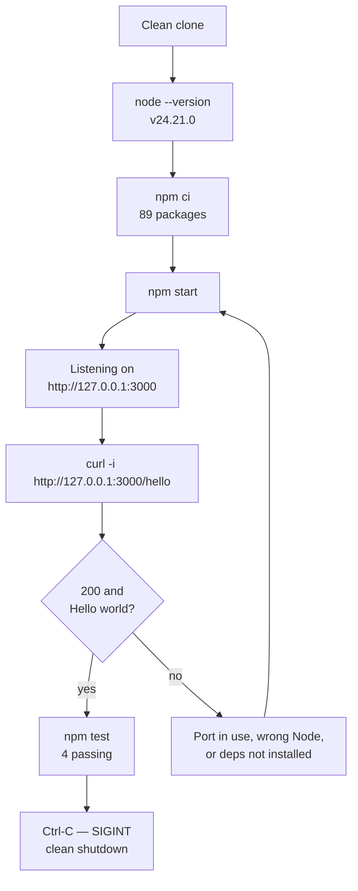

# Node.js `/hello` tutorial

A complete, runnable Node.js service whose only route answers `GET /hello`
with the eleven-byte plain-text body `Hello world`. Follow the sections below
in order from a clean clone and you reach that response without editing a
single file — nothing here has to be scaffolded, generated or filled in.

## What this teaches

- **One endpoint.** `GET /hello` returns `Hello world` as plain text, and
  there is no second route. The full contract — status, headers, byte count,
  and every other method and path — lives in
  [the API reference](docs/api-reference.md), which is its single authority.
- **One pinned runtime.** Node 24.21.0, recorded in `.nvmrc` and constrained
  by `engines.node` in `package.json`, so every command below behaves the
  same way for every reader.
- **A three-module shape.** `src/routes/hello.js` registers the route,
  `src/app.js` assembles the application, and `src/server.js` binds the
  socket. Keeping the listener out of the application is what lets the test
  suite drive the application object directly, with no port involved. Every
  module is explained line by line in
  [the annotated walkthrough](docs/walkthrough.md).

The path through this document, and the one branch in it:



Two steps depart from the official Express starter sequence, and both
departures are deliberate. The runtime check comes **first**, because a
mismatched Node version is the failure a learner hits before anything else.
And `npm init` is replaced by a committed manifest plus `npm ci`, because
this project is delivered rather than scaffolded.

## Related projects

This repository holds two tutorials, one per runtime, and they are siblings:

- **This Node.js tutorial**, at `src/nodejs-tutorial/`, answering `/hello`
  with plain text.
- **The Python Flask tutorial**, at `src/backend/`, answering `/hello` with
  JSON.

This tutorial is **additive**. It does not supersede or replace the Flask
tutorial, which stays exactly as it was, and neither project reads the
other's code. The documents that cover the repository as a whole are the
[repository README](../../README.md) and the
[contribution guide](../../CONTRIBUTING.md).

Both projects answer the same path, so the difference between them is worth
stating outright rather than leaving to be discovered:

| Aspect | This tutorial | Flask tutorial |
| --- | --- | --- |
| Media type | `text/plain; charset=utf-8` | `application/json` |
| Body | the bare greeting | a JSON envelope |
| Body size | 11 bytes, no trailing newline | 86 bytes via the factory |

The Flask envelope, in which `Hello world` is only the value of one field:

```json
{"message":"Hello world","status":"success","timestamp":"<ISO8601>"}
```

Its handler builds that dictionary in the source order `message`,
`timestamp`, `status` and hands it to `jsonify()`, which sorts the keys — so
the order shown above is the wire order rather than the source order
[src/backend/app.py:367-411]. The handler then sets
`Content-Type: application/json` explicitly [src/backend/app.py:403].

A byte count for that envelope has to name the startup mode it describes:
**86 bytes**, including a trailing newline, through the `create_app(...)`
application factory, which is the path Gunicorn and the Flask test suite
take — but **99 bytes** under a direct `python app.py`, where debug
pretty-printing inserts a space after each separator.

The divergence is resolved by scope, not by compromise. This tutorial
implements the plain reading of its own requirement, that quoting a bare
string means the response bytes *are* that string, and the Flask application
keeps its JSON envelope untouched.

## Prerequisites

Node **24.21.0** and the npm **11.19.0** bundled with it. Nothing else to
install and nothing to configure: no global packages, no database and no
container.

The version is pinned twice, and the two declarations do different jobs. The
exact string lives in `.nvmrc`, which a version manager reads to *select* a
runtime, while `engines.node` in `package.json` declares the supported range
`>=24.21.0 <25` and only makes npm *warn* on a mismatch. Neither is a hard
gate, which is why the check below is the step to rely on.

**Confirm the runtime and the pin:**

```bash
node --version
npm --version
cat .nvmrc
```

**Expected output:**

```text
v24.21.0
11.19.0
24.21.0
```

That post-condition — `node --version` reporting `v24.21.0` — is what this
tutorial asserts, not the route you took to reach it. `nvm` is one acceptable
route; the official Node.js installer, a distribution package and the release
tarball are equally acceptable, and none of them is a dependency of this
project.

**Installing and selecting the runtime with `nvm`:**

```bash
nvm install 24.21.0
nvm use 24.21.0
```

**Output, recorded when this version was first installed:**

```text
Downloading and installing node v24.21.0...
Downloading https://nodejs.org/dist/v24.21.0/node-v24.21.0-linux-x64.tar.xz...
######################################################################## 100.0%
Computing checksum with sha256sum
Checksums matched!
Now using node v24.21.0 (npm v11.19.0)
Creating default alias: default -> 24.21.0 (-> v24.21.0 *)
```

The download progress bar is animated in a terminal and is **elided above to
its final line**; every other line is stable. The `nvm` in use reported
version `0.40.3`.

Run from this directory with no argument, `nvm use` reads the committed pin
instead of taking a version on the command line, which is the whole reason
`.nvmrc` is committed.

**Command:**

```bash
nvm use
```

**Expected output:**

```text
Found '<checkout>/src/nodejs-tutorial/.nvmrc' with version <24.21.0>
Now using node v24.21.0 (npm v11.19.0)
```

The absolute path varies with where the repository is checked out; the two
reported lines do not.

## Install

Run this, and every command after it, from `src/nodejs-tutorial/`.

**Command:**

```bash
npm ci
```

**Expected output:**

```text
added 88 packages, and audited 89 packages in 360ms

31 packages are looking for funding
  run `npm fund` for details

found 0 vulnerabilities
```

The elapsed time varies between runs; every other line is stable. npm also
prints a blank line before its own output, which is elided from every
transcript in this document.

`npm ci` rather than `npm install`, because `package-lock.json` is committed.
`npm ci` installs that locked tree exactly — 88 packages added, and 89
audited once the project itself is counted — so your install is the same tree
every transcript here was captured against. `npm install` is free to resolve
something newer and to rewrite the lockfile, which is the opposite of what a
reproducible tutorial wants.

Two packages are declared, both at exact versions: `express` 5.2.1 as a
runtime dependency, and `supertest` 7.2.2 for the tests. There is
deliberately no Jest, nodemon, dotenv or assertion library;
[the walkthrough](docs/walkthrough.md) names the Node built-in that replaces
each one.

## Run

**Command:**

```bash
npm start
```

**Expected output:**

```text
> nodejs-hello-tutorial@1.0.0 start
> node src/server.js

Listening on http://127.0.0.1:3000 (GET /hello)
```

The first two lines are npm echoing the script it is about to run. The third
is the only line this application ever writes to stdout, and it is
interpolated from the host and port actually bound, so it stays truthful when
either is overridden.

`npm start` is a **foreground process that never returns on its own** — it
serves until you stop it. Verify from a second terminal, and use the Stop
section below to shut it down.

**The watch-mode alternative:**

```bash
npm run dev
```

**Expected output:**

```text
> nodejs-hello-tutorial@1.0.0 dev
> node --watch src/server.js

Listening on http://127.0.0.1:3000 (GET /hello)
```

`npm run dev` runs `node --watch src/server.js`, which restarts the process
whenever a source file changes. It serves identically — a request made while
it is watching returns the same `200` — and it is equally long-running.

## Verify

With the server running, from a second terminal:

**Command:**

```bash
curl -i http://127.0.0.1:3000/hello
```

**Output with headers:**

```text
HTTP/1.1 200 OK
Content-Type: text/plain; charset=utf-8
Content-Length: 11
ETag: W/"b-e1AsOh9IyGCa4hLN+2Od7jlnP14"
Date: Mon, 14 Sep 2026 17:41:16 GMT
Connection: keep-alive
Keep-Alive: timeout=5

Hello world
```

That is the response this whole tutorial exists to produce. Three of its
lines are observations of this particular `curl` invocation rather than
contract guarantees: `Date` changes on every request, and
`Connection: keep-alive` with `Keep-Alive: timeout=5` appear because `curl`
negotiates keep-alive by default — a client that sends `Connection: close`
receives `Connection: close` back and no `Keep-Alive` header at all.

**No `curl` available?** Open `http://127.0.0.1:3000/hello` in any browser.
The body is plain text, so the browser shows `Hello world` and nothing else.

The transcript above is the only place this tutorial's response is reproduced
outside its reference document. For the byte-exactness proof, each response
header explained, the not-found behaviour, `HEAD`, `OPTIONS`, conditional
requests and the complete method-and-path matrix, read
[the API reference](docs/api-reference.md): it is the single authority for all
of that, and this README deliberately does not paraphrase it.

## Test

Neither test command needs a running server. The suite drives the application
object returned by `createApp()` through `supertest`, which manages the
transport itself, so the tests pass whether or not anything is listening.

**Command:**

```bash
npm test
```

**Expected output:**

```text
> nodejs-hello-tutorial@1.0.0 test
> node --test

✔ GET /hello responds 200 (12.648239ms)
✔ GET /hello body is exactly "Hello world" (2.280692ms)
✔ GET /hello Content-Type is text/plain; charset=utf-8 (1.897243ms)
✔ unknown path responds 404 (1.933915ms)
ℹ tests 4
ℹ suites 0
ℹ pass 4
ℹ fail 0
ℹ cancelled 0
ℹ skipped 0
ℹ todo 0
ℹ duration_ms 126.82559
```

The four test names and the `tests 4`, `pass 4` and `fail 0` counts are
stable. Every duration, per test and total, varies between runs: the numbers
above come from one recorded run and are not values to match. What each
assertion proves is spelled out in
[the walkthrough](docs/walkthrough.md).

**With a coverage report:**

```bash
npm run test:coverage
```

This prints the same four test lines and the same summary, then appends:

**Expected output:**

```text
ℹ start of coverage report
ℹ -----------------------------------------------------------
ℹ file       | line % | branch % | funcs % | uncovered lines
ℹ -----------------------------------------------------------
ℹ src        |        |          |         | 
ℹ  app.js    | 100.00 |   100.00 |  100.00 | 
ℹ  routes    |        |          |         | 
ℹ   hello.js | 100.00 |   100.00 |  100.00 | 
ℹ -----------------------------------------------------------
ℹ all files  | 100.00 |   100.00 |  100.00 | 
ℹ -----------------------------------------------------------
ℹ end of coverage report
```

Two properties of that report deserve naming. The flag behind it,
`--experimental-test-coverage`, is **marked experimental by Node**, so its
output is informative rather than a stable interface. And `src/server.js` is
**absent from the table** by design: the suite exercises the application
object and never a listening socket, so the file that binds the socket is
never loaded.

## Stop

Press `Ctrl-C` in the terminal running the server. That sends `SIGINT`, which
`src/server.js` handles by dropping idle keep-alive connections, closing the
server once in-flight requests have drained, and exiting with status `0`. An
automated run that signals the process with `kill` sends `SIGTERM` instead
and reaches the same handler, which reports whichever signal arrived.

**Expected output on the server's terminal:**

```text
SIGINT received: closing server
```

**Confirm the port has been released:**

```bash
curl -s -m 3 -i http://127.0.0.1:3000/hello || echo "(exit $?)"
```

**Expected output:**

```text
(exit 7)
```

Exit status `7` is `curl`'s connection-refused code, so nothing is listening
there any more.

## Configuration

| Variable | Default | Effect |
| --- | --- | --- |
| `PORT` | `3000` | TCP port bound; read once in `src/server.js` |
| `HOST` | `127.0.0.1` | Interface bound — loopback, so off the network |

Both variables are optional, so every command in this document works with
nothing set at all. `PORT` chooses the TCP port the HTTP server binds, and
`HOST` chooses the network interface it binds: the default `127.0.0.1` is the
loopback interface, which keeps this tutorial server unreachable from the
network deliberately rather than incidentally. Each is read exactly once, in
`src/server.js`.

To change one for a single run, export it in front of the script:

```bash
PORT=3001 npm start
```

**Neither `npm start` nor `npm run dev` passes `--env-file`**, so neither
reads `.env` or `.env.example`; both see only variables already exported in
the shell. `.env.example` is a **reference and export template**: it records
the two variables and their defaults, and nothing loads it implicitly.

To load that template explicitly, use Node's own loader, which is what
replaces a `dotenv` dependency here.

**Command:**

```bash
node --env-file=.env.example \
  -e "console.log('PORT='+process.env.PORT, 'HOST='+process.env.HOST)"
```

**Expected output:**

```text
PORT=3000 HOST=127.0.0.1
```

The same loader works for the server itself, as
`node --env-file=.env.example src/server.js` — the `dotenv`-free form a
learner arriving from older Node material will be looking for.

## Project structure

```text
src/nodejs-tutorial/
├── README.md            this file: install, run, verify, test, stop
├── package.json         engines.node, four scripts, two exact deps
├── package-lock.json    lockfileVersion 3, the tree npm ci installs
├── .nvmrc               24.21.0, the version a version manager selects
├── .env.example         PORT and HOST, each annotated with its default
├── src/
│   ├── server.js        binds HOST and PORT, logs the URL, handles signals
│   ├── app.js           assembles the app, mounts the router, 404 handler
│   └── routes/
│       └── hello.js     the GET /hello handler and the body constant
├── test/
│   └── hello.test.js    four assertions against the published contract
└── docs/
    ├── api-reference.md the endpoint contract, in full
    └── walkthrough.md   the annotated tour of the code above
```

Eleven files, and that is the entire project.

Every command this document publishes resolves either to npm itself or to one
of four scripts in `package.json`:

| Script | Command it runs |
| --- | --- |
| `npm start` | `node src/server.js` |
| `npm run dev` | `node --watch src/server.js` |
| `npm test` | `node --test` |
| `npm run test:coverage` | `node --test --experimental-test-coverage` |

## Troubleshooting

Four failure modes, each reproduced on Node 24.21.0 rather than imagined.

### Port 3000 is already in use

The first thing to rule out is a real collision inside this repository: the
Flask development container publishes host port 3000
[infrastructure/docker/docker-compose.yml:86], so running that container and
this tutorial at the same time contends for one port.

The escape is an environment variable, and `PORT=<n> npm start` is the form
every port override in this tutorial uses.

**First fallback:**

```bash
PORT=3001 npm start
```

**Expected output:**

```text
Listening on http://127.0.0.1:3001 (GET /hello)
```

A request to `http://127.0.0.1:3001/hello` then returns the same `200`; point
`curl` at whichever port you chose.

**Second fallback**, needed because the Flask production container publishes
host port 3001 [infrastructure/docker/docker-compose.yml:231]:

```bash
PORT=3100 npm start
```

### The active Node version is wrong

`.nvmrc` and `engines.node` both name 24.21.0, but neither enforces it: npm's
default behaviour on an engine mismatch is a **warning**, not a failure.

**What a mismatch looks like during install:**

```text
npm warn EBADENGINE Unsupported engine {
npm warn EBADENGINE   package: 'nodejs-hello-tutorial@1.0.0',
npm warn EBADENGINE   required: { node: '>=24.21.0 <25' },
npm warn EBADENGINE   current: { node: 'v22.23.2', npm: '11.18.0' }
npm warn EBADENGINE }
```

The `current` line reports whichever runtime is active — `v22.23.2` in that
recorded run — and the install still succeeds, which is exactly why the
warning is easy to scroll past. Return to the Prerequisites section, select
24.21.0, and confirm it with `node --version` before running anything else.

### Dependencies are not installed

**Symptom:**

```text
Error: Cannot find module 'express'
Require stack:
- <checkout>/src/nodejs-tutorial/src/app.js
- <checkout>/src/nodejs-tutorial/src/server.js
```

`npm start` fails this way whenever `node_modules` is absent, which is the
state of every fresh clone, because the dependency tree is not committed. The
fix is the Install section's single command, `npm ci`. The require stack names
the two files that were loading when the lookup failed, and those absolute
paths vary with the checkout location.

### `node --test` fails when given a directory

The `test` script is exactly `node --test`, with no path argument, and that is
deliberate. A bare `node --test` discovers every `.js`, `.cjs` and `.mjs` file
inside a directory named `test`, whether or not the filename matches a
test-naming convention. Adding what looks like a tidying argument breaks it:
`node --test test/` and `node --test test` both fail, because the directory is
resolved as an entry module.

**Output, with the stack trace elided:**

```text
Error: Cannot find module '<checkout>/src/nodejs-tutorial/test'
    code: 'MODULE_NOT_FOUND'
✖ test
ℹ tests 1
ℹ pass 0
ℹ fail 1
```

The command exits `1`. Bare `node --test` works, and so does an explicit file
path such as `node --test test/hello.test.js`.

## Where to go next

- [The API reference](docs/api-reference.md) — the endpoint contract in full:
  every response header explained, the not-found, `HEAD`, `OPTIONS` and
  conditional responses, and the statement that there is no authentication.
- [The annotated walkthrough](docs/walkthrough.md) — the code behind that
  contract, module by module, what each of the four assertions proves, and
  which Node built-in stands in for Jest, nodemon and dotenv.
- [The repository README](../../README.md) — the Flask tutorial this project
  sits beside, and the repository's own documentation.
- [The contribution guide](../../CONTRIBUTING.md) — how to work on either
  tutorial in this repository.

## Licence

This tutorial is covered by the repository's licence rather than issuing one
of its own, so nothing here adds a new legal claim. The authoritative grant is
the full MIT licence text in the [repository README](../../README.md), at
[README.md:934-956], which carries the copyright line, the permission grant
and the warranty disclaimer in full.
