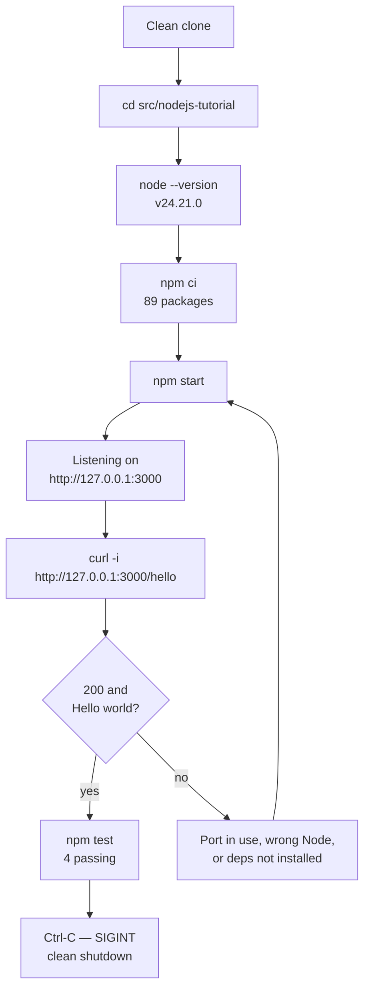

# Node.js `/hello` tutorial

A complete, runnable Node.js service with exactly one route, `/hello`. Its
HTTP contract — method, status, body, media type and byte counts — is fixed
in exactly one place, [the API reference](docs/api-reference.md), and this
document links to it rather than restating it. Follow the sections below in
order from a clean clone and you reach a verified response without editing a
single file — nothing here has to be scaffolded, generated or filled in.

## What this teaches

- **One endpoint.** The service answers one route, and there is no second
  one. What that route returns, and what every other method and path
  receives, is documented in [the API reference](docs/api-reference.md), the
  single authority for the contract. This document publishes exactly one
  complete response transcript, in Verify below, because a learner has to
  see expected output beside the command; it is evidence of one run rather
  than a second statement of the contract.
- **One pinned runtime.** Node 24.21.0, recorded as the exact string in
  `.nvmrc` [src/nodejs-tutorial/.nvmrc:1] and constrained by the
  `engines.node` range in the manifest
  [src/nodejs-tutorial/package.json:8-10], so every command below behaves
  the same way for every reader.
- **A three-module shape.** `src/routes/hello.js` registers the route
  [src/nodejs-tutorial/src/routes/hello.js:28], `src/app.js` assembles the
  application [src/nodejs-tutorial/src/app.js:31], and `src/server.js` binds
  the socket [src/nodejs-tutorial/src/server.js:274-277].
  Keeping the listener out of the application is what lets the test suite
  drive the application object directly, with no pre-started server and no
  fixed port — `supertest` starts a transient listener on an ephemeral one.
  Every module is explained line by line in
  [the annotated walkthrough](docs/walkthrough.md).

The path through this document, and the one branch in it:



Two steps depart from the official Express starter sequence, and both
departures are deliberate. The runtime check comes **first**, because a
mismatched Node version is the failure a learner hits before anything else.
And `npm init` is replaced by a committed manifest plus `npm ci`, because
this project is delivered rather than scaffolded.

**Working directory: the commands in this document are run from
`src/nodejs-tutorial/`** — the directory holding this file — unless the step
says otherwise. Two do say otherwise, and they are the only two: the initial
`cd` below is issued from the root of the clone, and `node --version` and
`npm --version` report the same result wherever you stand. Everything that
reads a project file or runs an npm script — `cat .nvmrc`, `nvm use`,
`npm ci`, `npm start`, `npm test` — depends on being in this directory and
fails outside it, which is why entering it is the first step of the flow
above and the first step of Prerequisites.

## Related projects

This repository holds two tutorials, one per runtime, and they are siblings:

- **This Node.js tutorial**, at `src/nodejs-tutorial/`, answering `/hello`
  with plain text.
- **The Python Flask tutorial**, at `src/backend/`, answering `/hello` with
  JSON.

This tutorial is **additive**. It does not supersede or replace the Flask
tutorial: the Flask **application remains behaviourally unchanged** — no
Python source, test or configuration file was touched to make room for this
project — and neither project reads the other's code. Its *documentation* was
corrected alongside this tutorial, in the repository README and in
`src/backend/README.md`, so that each project's `/hello` is described by the
contract it actually serves. The documents that cover the repository as a
whole are the [repository README](../../README.md) and the
[contribution guide](../../CONTRIBUTING.md).

Both projects answer the same path, so the difference between them is worth
stating outright rather than leaving to be discovered. The table contrasts
two contracts and is authoritative for neither: this tutorial's side is
fixed by [the API reference](docs/api-reference.md), and the Flask side by
the repository README:

| Aspect | This tutorial | Flask tutorial |
| --- | --- | --- |
| Media type | `text/plain; charset=utf-8` | `application/json` |
| Body | the bare greeting | a JSON envelope |
| Body size | 11 bytes, no trailing newline | 86 bytes via the factory |

The Flask envelope, in which `Hello world` is only the value of one field:

```json
{"message":"Hello world","status":"success","timestamp":"<ISO8601>"}
```

Its handler builds that dictionary in the source order `message`,
`timestamp`, `status` and hands it to `jsonify()`, which sorts the keys — so
the order shown above is the wire order rather than the source order
[src/backend/app.py:367-411]. The handler then sets
`Content-Type: application/json` explicitly [src/backend/app.py:403].

A byte count for that envelope has to name the startup mode it describes:
**86 bytes**, including a trailing newline, through the `create_app(...)`
application factory, which is the path Gunicorn and the Flask test suite
take — but **99 bytes** under a direct `python app.py`, where debug
pretty-printing inserts a space after each separator.

The divergence is resolved by scope, not by compromise. This tutorial
implements the plain reading of its own requirement, that quoting a bare
string means the response bytes *are* that string, and the Flask application
keeps its JSON envelope untouched.

## Prerequisites

Node **24.21.0** and the npm **11.19.0** bundled with it. Nothing else to
install and nothing to configure: no global packages, no database and no
container.

**First, enter the tutorial directory** — from the root of a clean clone:

```bash
cd src/nodejs-tutorial
pwd
```

**Expected output:**

```text
<checkout>/src/nodejs-tutorial
```

`cd` prints nothing itself, so `pwd` is there to show where you landed; the
`<checkout>` part is wherever you cloned the repository. Every command from
here on is run in this directory, and the ones that reach for a project file
or an npm script — `cat .nvmrc`, `nvm use`, `npm ci`, `npm start`,
`npm test` — require it.

The version is pinned twice, and the two declarations do different jobs. The
exact string lives in `.nvmrc` [src/nodejs-tutorial/.nvmrc:1], which a
version manager reads to *select* a runtime, while `engines.node` in
`package.json` declares the supported range `>=24.21.0 <25`
[src/nodejs-tutorial/package.json:8-10] and only makes npm *warn* on a
mismatch. Neither is a hard gate, which is why the check below is the step to
rely on.

**Confirm the runtime and the pin:**

```bash
node --version
npm --version
cat .nvmrc
```

**Expected output:**

```text
v24.21.0
11.19.0
24.21.0
```

That post-condition — `node --version` reporting `v24.21.0` — is what this
tutorial asserts, not the route you took to reach it. `nvm` is one acceptable
route; the official Node.js installer, a distribution package and the release
tarball are equally acceptable, and none of them is a dependency of this
project.

**Installing and selecting the runtime with `nvm`:**

```bash
nvm install 24.21.0
nvm use 24.21.0
```

**Output, recorded when this version was first installed:**

```text
Downloading and installing node v24.21.0...
Downloading https://nodejs.org/dist/v24.21.0/node-v24.21.0-linux-x64.tar.xz...
######################################################################## 100.0%
Computing checksum with sha256sum
Checksums matched!
Now using node v24.21.0 (npm v11.19.0)
Creating default alias: default -> 24.21.0 (-> v24.21.0 *)
```

The download progress bar is animated in a terminal and is **elided above to
its final line**; every other line is stable. The `nvm` in use reported
version `0.40.3`.

Run from this directory with no argument, `nvm use` reads the committed pin
instead of taking a version on the command line, which is the whole reason
`.nvmrc` is committed.

**Command:**

```bash
nvm use
```

**Expected output:**

```text
Found '<checkout>/src/nodejs-tutorial/.nvmrc' with version <24.21.0>
Now using node v24.21.0 (npm v11.19.0)
```

The absolute path varies with where the repository is checked out; the two
reported lines do not.

## Install

Still in `src/nodejs-tutorial/`, the directory Prerequisites entered.

**Command:**

```bash
npm ci
```

**Expected output:**

```text
added 88 packages, and audited 89 packages in 360ms

31 packages are looking for funding
  run `npm fund` for details

found 0 vulnerabilities
```

The elapsed time varies between runs; every other line is stable. npm also
prints a blank line before its own output, which is elided from every
transcript in this document.

`npm ci` rather than `npm install`, because `package-lock.json` is committed
at `lockfileVersion` 3 [src/nodejs-tutorial/package-lock.json:4]. `npm ci`
installs that locked tree exactly — 88 packages added, and 89 audited once
the project itself is counted — so your install is the same tree every
transcript here was captured against. `npm install` is free to resolve
something newer and to rewrite the lockfile, which is the opposite of what a
reproducible tutorial wants.

Two packages are declared, both at exact versions
[src/nodejs-tutorial/package.json:17-22]: `express` 5.2.1 as a runtime
dependency, and `supertest` 7.2.2 for the tests. There is deliberately no
Jest, nodemon, dotenv or *third-party* assertion package — assertions come
from Node's own `node:assert/strict`, which ships with the runtime
[src/nodejs-tutorial/test/hello.test.js:29];
[the walkthrough](docs/walkthrough.md) names the Node built-in that replaces
each of the others.

## Run

**Command:**

```bash
npm start
```

**Expected output:**

```text
> nodejs-hello-tutorial@1.0.0 start
> node src/server.js

Listening on http://127.0.0.1:3000 (GET /hello)
```

The first two lines are npm echoing the script it is about to run, which for
`start` is `node src/server.js` [src/nodejs-tutorial/package.json:12]. The
third line is the only output this application produces at startup — there is
no banner and no per-request logging — and it is printed only once the socket
is bound, interpolated from the host and port actually bound, which the
listener itself reports rather than the values it was handed
[src/nodejs-tutorial/src/server.js:243-268], so it stays truthful when either
is overridden. One further line is written later, when the server shuts down;
the Stop section below publishes it.

`npm start` is a **foreground process that never returns on its own** — it
serves until you stop it. Verify from a second terminal, and use the Stop
section below to shut it down.

**The watch-mode alternative:**

```bash
npm run dev
```

**Expected output:**

```text
> nodejs-hello-tutorial@1.0.0 dev
> node --watch src/server.js

Listening on http://127.0.0.1:3000 (GET /hello)
```

`npm run dev` runs `node --watch src/server.js`
[src/nodejs-tutorial/package.json:13], which restarts the process whenever a
source file changes. It serves identically — a request made while it is
watching returns the same `200` — and it is equally long-running.

## Verify

With the server running, from a second terminal:

**Command:**

```bash
curl -i http://127.0.0.1:3000/hello
```

**Output with headers:**

```text
HTTP/1.1 200 OK
Content-Type: text/plain; charset=utf-8
Content-Length: 11
ETag: W/"b-e1AsOh9IyGCa4hLN+2Od7jlnP14"
Date: Mon, 14 Sep 2026 17:41:16 GMT
Connection: keep-alive
Keep-Alive: timeout=5

Hello world
```

That is the response this whole tutorial exists to produce. Three of its
lines are observations of this particular `curl` invocation rather than
contract guarantees: `Date` changes on every request, and
`Connection: keep-alive` with `Keep-Alive: timeout=5` appear because `curl`
negotiates keep-alive by default — a client that sends `Connection: close`
receives `Connection: close` back and no `Keep-Alive` header at all.

**No `curl` available?** Open `http://127.0.0.1:3000/hello` in any browser.
The body is plain text, so the browser shows `Hello world` and nothing else.

The transcript above is the only place this tutorial's response is reproduced
outside its reference document. For the byte-exactness proof, each response
header explained, the not-found behaviour, `HEAD`, `OPTIONS`, conditional
requests and the complete method-and-path matrix, read
[the API reference](docs/api-reference.md): it is the single authority for all
of that, and this README deliberately does not paraphrase it.

## Test

Neither test command needs a running server. The suite drives the application
object returned by `createApp()` [src/nodejs-tutorial/src/app.js:31] through
`supertest` [src/nodejs-tutorial/test/hello.test.js:30-31], which manages the
transport itself, so the tests pass whether or not anything is listening.

The `test` script is exactly `node --test`
[src/nodejs-tutorial/package.json:14].

**Command:**

```bash
npm test
```

**Expected output:**

```text
> nodejs-hello-tutorial@1.0.0 test
> node --test

✔ GET /hello responds 200 (12.648239ms)
✔ GET /hello body is exactly "Hello world" (2.280692ms)
✔ GET /hello Content-Type is text/plain; charset=utf-8 (1.897243ms)
✔ unknown path responds 404 (1.933915ms)
ℹ tests 4
ℹ suites 0
ℹ pass 4
ℹ fail 0
ℹ cancelled 0
ℹ skipped 0
ℹ todo 0
ℹ duration_ms 126.82559
```

The four test names and the `tests 4`, `pass 4` and `fail 0` counts are
stable. Every duration, per test and total, varies between runs: the numbers
above come from one recorded run and are not values to match. Four tests run,
and the body test carries two assertions — the string itself and its byte
length — so the file holds five in total; what each one proves is spelled out
in [the walkthrough](docs/walkthrough.md).

**With a coverage report** — this script is
`node --test --experimental-test-coverage`
[src/nodejs-tutorial/package.json:15], and it runs the same four tests,
prints the same summary, and then appends the coverage report:

```bash
npm run test:coverage
```

**Expected output**, the whole captured run:

```text
> nodejs-hello-tutorial@1.0.0 test:coverage
> node --test --experimental-test-coverage

✔ GET /hello responds 200 (15.685295ms)
✔ GET /hello body is exactly "Hello world" (2.270652ms)
✔ GET /hello Content-Type is text/plain; charset=utf-8 (5.609208ms)
✔ unknown path responds 404 (1.890802ms)
ℹ tests 4
ℹ suites 0
ℹ pass 4
ℹ fail 0
ℹ cancelled 0
ℹ skipped 0
ℹ todo 0
ℹ duration_ms 153.863878
ℹ start of coverage report
ℹ -----------------------------------------------------------
ℹ file       | line % | branch % | funcs % | uncovered lines
ℹ -----------------------------------------------------------
ℹ src        |        |          |         |
ℹ  app.js    | 100.00 |   100.00 |  100.00 |
ℹ  routes    |        |          |         |
ℹ   hello.js | 100.00 |   100.00 |  100.00 |
ℹ -----------------------------------------------------------
ℹ all files  | 100.00 |   100.00 |  100.00 |
ℹ -----------------------------------------------------------
ℹ end of coverage report
```

The stable lines are the same as for `npm test` — the four test names,
`tests 4`, `pass 4`, `fail 0` — plus every figure in the coverage table; the
durations again vary, and this transcript comes from its own run rather than
the one above. One typographic change is made to the report: Node pads each
row out to the width of the `uncovered lines` column, so the captured lines
end in spaces after the final `|`. Those trailing spaces are **stripped
here**, because a committed line ending in whitespace fails this
repository's whitespace check; nothing else in the report is altered.

Two properties of that report deserve naming. The flag behind it,
`--experimental-test-coverage`, is **marked experimental by Node**, so its
output is informative rather than a stable interface. And `src/server.js` is
**absent from the table** by design: the suite requires `../src/app` and
drives what `createApp()` returns
[src/nodejs-tutorial/src/app.js:23-26], so the module that binds this
service's own socket is never loaded.

## Stop

Press `Ctrl-C` in the terminal running the server. That sends `SIGINT`, which
`src/server.js` handles in one shutdown routine
[src/nodejs-tutorial/src/server.js:304-393]: it stops accepting new
connections and closes the server once the in-flight requests have drained.
Idle keep-alive connections need no separate handling, because `close()`
reaps them itself on this runtime.

The wait is **bounded at ten seconds**. If a request is still in flight when
that grace period expires, the remaining connections are closed outright and
the shutdown is recorded as forced; pressing `Ctrl-C` a second time does the
same thing immediately, because whoever sent the first signal is plainly no
longer waiting. Either way the process is never killed from inside — nothing
in the file calls `process.exit`. It sets an exit status and lets the drained
event loop end the process on its own: `0` when the drain completed inside
the grace period and no listener failure was reported earlier in the run, and
`1` otherwise.

An automated run that signals the process with `kill` sends `SIGTERM` instead
and reaches that same routine, because both signals are registered against it
[src/nodejs-tutorial/src/server.js:395-396]; the line it writes reports
whichever signal arrived.

**Expected output on the server's terminal:**

```text
SIGINT received: closing server
```

**Confirm the port has been released:**

```bash
curl -s -m 3 -i http://127.0.0.1:3000/hello || echo "(exit $?)"
```

**Expected output:**

```text
(exit 7)
```

Exit status `7` is `curl`'s connection-refused code, so nothing is listening
there any more.

## Configuration

| Variable | Default | Effect |
| --- | --- | --- |
| `PORT` | `3000` | TCP port bound; read once in `src/server.js` |
| `HOST` | `127.0.0.1` | Interface bound — loopback, so off the network |

Both variables are optional, so every command in this document works with
nothing set at all. `PORT` chooses the TCP port the HTTP server binds and is
resolved by `resolvePort()` [src/nodejs-tutorial/src/server.js:122-144];
`HOST` chooses the network interface it binds and is resolved by
`resolveHost()` [src/nodejs-tutorial/src/server.js:152-171]. The default
`127.0.0.1` is the loopback interface, which keeps this tutorial server
unreachable from the network deliberately rather than incidentally.

Each variable is read exactly once — `process.env.PORT` at
[src/nodejs-tutorial/src/server.js:123] and `process.env.HOST` at
[src/nodejs-tutorial/src/server.js:153] — and each default is a named
constant in that same file, `DEFAULT_PORT`
[src/nodejs-tutorial/src/server.js:43] and `DEFAULT_HOST`
[src/nodejs-tutorial/src/server.js:33], which its resolver applies when the
variable is blank or unset. Neither default is a value loaded from a file.

An override is checked before anything is bound, so a value the server cannot
use costs no socket. `PORT` accepts one whole number from 1024 to 65535:
a value that is not digits over its whole length, or that falls outside that
range — `abc`, `3.5`, `0`, `80`, `70000` — is **refused rather than bound**.
The process writes one message naming the variable, the value and the rule to
standard error, exits with status `1`, and does *not* fall back to `3000`.
`HOST` is refused the same way when it carries whitespace or control
characters.

To change one for a single run, export it in front of the script —
`PORT=<n> npm start` is the form every port override in this tutorial uses.
The concrete fallback ports, and the captured output of running on one, are
in [Troubleshooting](#port-3000-is-already-in-use) below, which is where this
tutorial keeps them.

**Neither `npm start` nor `npm run dev` passes `--env-file`**, so neither
reads `.env` or `.env.example`; both see only variables already exported in
the shell. `.env.example` is a **reference and export template**: it records
the two variables and their defaults
[src/nodejs-tutorial/.env.example:40], [src/nodejs-tutorial/.env.example:71],
and nothing loads it implicitly.

To load that template explicitly, use Node's own loader, which is what
replaces a `dotenv` dependency here.

**Command:**

```bash
node --env-file=.env.example \
  -e "console.log('PORT='+process.env.PORT, 'HOST='+process.env.HOST)"
```

**Expected output:**

```text
PORT=3000 HOST=127.0.0.1
```

The same loader works for the server itself — the `dotenv`-free form a
learner arriving from older Node material will be looking for.

**Command:**

```bash
node --env-file=.env.example src/server.js
```

**Expected output:**

```text
Listening on http://127.0.0.1:3000 (GET /hello)
```

That is one line, not three, because this invocation bypasses npm and so
there is no script echo to print. It is also the same line `npm start`
prints, and for a reason worth noticing: the template records the values the
code already defaults to, so loading it changes nothing visible. The
`-e` check above is what actually demonstrates that the file was read; this
command demonstrates that the server accepts it and serves normally, which a
request to `http://127.0.0.1:3000/hello` then confirms with the same `200`.

## Project structure

```text
src/nodejs-tutorial/
├── README.md            this file: install, run, verify, test, stop
├── package.json         engines.node, four scripts, two exact deps
├── package-lock.json    lockfileVersion 3, the tree npm ci installs
├── .nvmrc               24.21.0, the version a version manager selects
├── .env.example         PORT and HOST, each annotated with its default
├── src/
│   ├── server.js        binds HOST and PORT, logs the URL, handles signals
│   ├── app.js           assembles the app, mounts the router, 404 handler
│   └── routes/
│       └── hello.js     the GET /hello handler and the body constant
├── test/
│   └── hello.test.js    four tests against the published contract
└── docs/
    ├── api-reference.md the endpoint contract, in full
    └── walkthrough.md   the annotated tour of the code above
```

Eleven files, and that is the entire project.

Every **npm invocation** this document publishes is either npm itself or one
of the four scripts the manifest declares
[src/nodejs-tutorial/package.json:11-16]:

| Script | Command it runs |
| --- | --- |
| `npm start` | `node src/server.js` |
| `npm run dev` | `node --watch src/server.js` |
| `npm test` | `node --test` |
| `npm run test:coverage` | `node --test --experimental-test-coverage` |

The rest of the commands here come from outside the manifest and are not
scripts: `node` and `npm` themselves belong to the runtime installed in
Prerequisites, `nvm` is the optional version manager shown there as one
installation route among several, and `cd`, `pwd`, `cat` and `curl` are
ordinary shell and command-line tools. Of those, `curl` is the only one this
tutorial treats as possibly absent, which is why Verify offers a browser as
the alternative.

## Troubleshooting

Four failure modes, each reproduced against this tutorial rather than
imagined. Three were reproduced on the pinned Node 24.21.0; the fourth is the
wrong-runtime warning, which by definition has to be produced by a runtime
that is *not* 24.21.0, and its transcript names the one that produced it.

### Port 3000 is already in use

The first thing to rule out is a real collision inside this repository: the
Flask development container publishes host port 3000
[infrastructure/docker/docker-compose.yml:86], so running that container and
this tutorial at the same time contends for one port.

The escape is an environment variable, and `PORT=<n> npm start` is the form
every port override in this tutorial uses.

**First fallback:**

```bash
PORT=3001 npm start
```

**Expected output:**

```text
Listening on http://127.0.0.1:3001 (GET /hello)
```

A request to `http://127.0.0.1:3001/hello` then returns the same `200`; point
`curl` at whichever port you chose.

**Second fallback**, needed because the Flask production container publishes
host port 3001 [infrastructure/docker/docker-compose.yml:231]:

```bash
PORT=3100 npm start
```

**Expected output:**

```text
Listening on http://127.0.0.1:3100 (GET /hello)
```

Both fallback transcripts show the application line only, with npm's
two-line script echo elided exactly as the Run section describes. The line is
interpolated from the port actually bound, so it is the confirmation that the
override took effect — and a request to that port returns the same `200`.

### The active Node version is wrong

`.nvmrc` and `engines.node` both name 24.21.0
[src/nodejs-tutorial/package.json:8-10], but neither enforces it: npm's
default behaviour on an engine mismatch is a **warning**, not a failure.

**What a mismatch looks like during install**, captured on Node 22.23.2 with
npm 11.18.0 — the mismatching runtime the warning is about, which is why this
one transcript is not from 24.21.0:

```text
npm warn EBADENGINE Unsupported engine {
npm warn EBADENGINE   package: 'nodejs-hello-tutorial@1.0.0',
npm warn EBADENGINE   required: { node: '>=24.21.0 <25' },
npm warn EBADENGINE   current: { node: 'v22.23.2', npm: '11.18.0' }
npm warn EBADENGINE }
```

The `current` line reports whichever runtime is active — `v22.23.2` in that
recorded run — and the install still succeeds, which is exactly why the
warning is easy to scroll past. Return to the Prerequisites section, select
24.21.0, and confirm it with `node --version` before running anything else.

### Dependencies are not installed

**Symptom:**

```text
Error: Cannot find module 'express'
Require stack:
- <checkout>/src/nodejs-tutorial/src/app.js
- <checkout>/src/nodejs-tutorial/src/server.js
```

`npm start` fails this way whenever `node_modules` is absent, which is the
state of every fresh clone, because the dependency tree is not committed. The
fix is the Install section's single command, `npm ci`. The require stack names
the two files that were loading when the lookup failed, and those absolute
paths vary with the checkout location.

### `node --test` fails when given a directory

The `test` script is exactly `node --test`
[src/nodejs-tutorial/package.json:14], with no path argument, and that is
deliberate. A bare `node --test` discovers every `.js`, `.cjs` and `.mjs` file
inside a directory named `test`, whether or not the filename matches a
test-naming convention. Adding what looks like a tidying argument breaks it:
`node --test test/` and `node --test test` both fail, because the directory is
resolved as an entry module.

**Output, with the stack trace elided:**

```text
Error: Cannot find module '<checkout>/src/nodejs-tutorial/test'
    code: 'MODULE_NOT_FOUND'
✖ test
ℹ tests 1
ℹ pass 0
ℹ fail 1
```

The command exits `1`. Bare `node --test` works, and so does an explicit file
path such as `node --test test/hello.test.js`.

## Where to go next

- [The API reference](docs/api-reference.md) — the endpoint contract in full:
  every response header explained, the not-found, `HEAD`, `OPTIONS` and
  conditional responses, and the statement that there is no authentication.
- [The annotated walkthrough](docs/walkthrough.md) — the code behind that
  contract, module by module, what each of the four tests proves, and which
  Node built-in stands in for Jest, nodemon and dotenv.
- [The repository README](../../README.md) — the Flask tutorial this project
  sits beside, and the repository's own documentation.
- [The contribution guide](../../CONTRIBUTING.md) — how to work on either
  tutorial in this repository.

## Licence

This tutorial is covered by the repository's licence rather than issuing one
of its own, so nothing here adds a new legal claim. The authoritative grant
is the full MIT licence text in the repository README, under its
[License section](../../README.md#license) at [README.md:1102-1124], which
carries the copyright line, the permission grant and the warranty disclaimer
in full.
