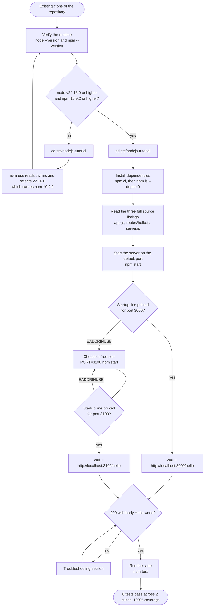
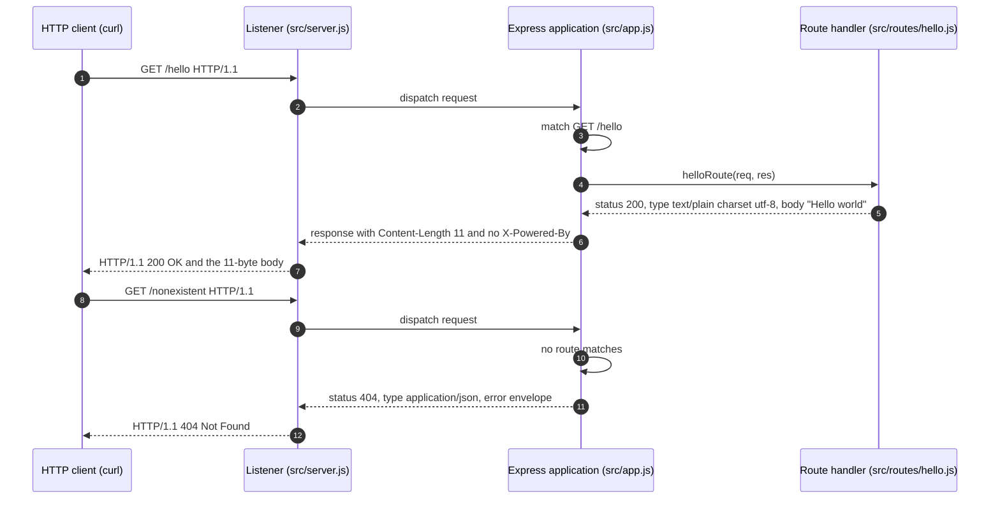
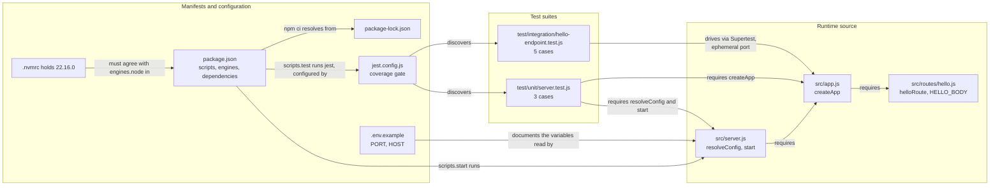

# Node.js Hello World Tutorial

A beginner-facing Node.js tutorial project that exposes exactly one HTTP endpoint — `GET /hello` — which answers any calling HTTP client with the eleven-byte plain-text body `Hello world` (`src/nodejs-tutorial/src/routes/hello.js:15,29`). It is built on Node.js 22.16.0 — the version pinned at `src/nodejs-tutorial/.nvmrc:1` — with Express 5.1.0 (`src/nodejs-tutorial/package.json:17`).

Eight test cases across two Jest suites verify it: five in `src/nodejs-tutorial/test/integration/hello-endpoint.test.js:37,54,74,97,139` and three in `src/nodejs-tutorial/test/unit/server.test.js:29,68,151`, measured against the coverage gate at `src/nodejs-tutorial/jest.config.js:14-21`. It is deliberately small: three source modules and two test suites — the five files `git ls-files src/nodejs-tutorial/src src/nodejs-tutorial/test` lists — with one route and no second endpoint, which `grep -rnE "^\s*app\.(get|post|put|patch|delete|all)\(" src/` establishes by returning the single line `src/nodejs-tutorial/src/app.js:29`.

**A parallel tutorial, not a replacement.** This project sits *beside* the Python/Flask application this repository delivers under `src/backend/`, as an additive teaching artifact. It is not a reversal of the migration recorded in the repository's root `README.md:1002` — "v2.0.0 - Migration to Python 3.12+ and Flask 3.1.1 from Node.js/Express.js", the first entry under that file's `### Version History` heading at `README.md:1000` — and it changes nothing under `src/backend/`, which continues to serve its own `/hello` endpoint in its own shape. The two tutorials teach the same idea in two runtimes, and the section [API Documentation](#api-documentation) states exactly where their responses differ and why.

Everything below has been run and observed on the pinned runtime, Node.js 22.16.0 with npm 10.9.2. **Every command is followed by what tells you it worked** — the output it prints, or, for the three commands that print nothing at all on success (`cd` in [Installation step 1](#1-enter-the-project-directory), `cp` in [step 4](#4-environment-setup-optional) and `export` in [Configuration](#configuration)), the observable effect and the pass condition instead. The [Verification Checklist](#verification-checklist) states that pass condition for all eighteen commands in one table, and reproduced output that varies from machine to machine is labelled representative where it appears. The two outputs most often mistaken for errors — npm's deprecation warnings and the missing-`.env` notice — are called out where they appear.

## Table of Contents

- [Overview](#overview)
- [Prerequisites](#prerequisites)
- [Installation](#installation)
- [Project Structure](#project-structure)
- [Usage](#usage)
- [API Documentation](#api-documentation)
- [How It Works](#how-it-works)
- [Testing](#testing)
- [Troubleshooting](#troubleshooting)
- [Next Steps](#next-steps)
- [Contributing](#contributing)
- [License](#license)
- [Additional Resources](#additional-resources)

## Overview

This project is the smallest complete Node.js web service that is still worth testing: one route, one response, and the tooling that proves the response is what the documentation says it is. Nothing here is a sketch — the three source modules below are the files the suites actually load and the coverage report measures (`src/nodejs-tutorial/jest.config.js:7-11`), and the five code listings in [Project Structure](#project-structure) are extracted from those files rather than written alongside them, which the required drift check in [Verifying this document](#verifying-this-document-against-the-source) re-proves on demand.

### The path from a clean clone to a verified response

The whole route through this tutorial, with the two failures a reader actually hits marked as branches:



Read it from the top: verify the runtime, enter the project, install, read the source, run it, call it, test it. The only two detours are a runtime older than the pin, which `nvm use` resolves, and a port already held by something else, which `PORT=3100 npm start` resolves. [How It Works](#how-it-works) returns to this diagram alongside two others that open up the request path and the module wiring.

### Learning Objectives

By working through this tutorial you will be able to:

- **Understand how Node.js serves HTTP** — see where the runtime's listener ends and your own code begins, and what "the process is listening" actually means.
- **Register a route with Express** — bind one HTTP method and one literal path to one handler function, and know what Express does with every request that does not match it.
- **Return a plain-text response with an explicit media type** — set the status code, the `Content-Type` and the body deliberately rather than relying on whatever a framework would otherwise guess.
- **Separate an application from its listener, and know why** — the arrangement looks like over-engineering in a one-route service until you test it; [Project Structure](#project-structure) explains what it buys.
- **Test an HTTP endpoint in process with Supertest** — assert a real response without starting a server or claiming a port.
- **Read a coverage report** — recognise the four metrics Jest prints, and understand why a coverage gate can fail a run in which every single test passed.

### Technology Stack

**Runtime Environment:**

- **Node.js 22.16.0** — the version this project pins, on the single line of `src/nodejs-tutorial/.nvmrc:1`. Node.js 22 is the "Jod" release line, now in **Maintenance LTS**, which reaches end of life on **30 April 2027**; the codename, the phase and that date are published in the project's own release schedule, [Node.js Previous Releases](https://nodejs.org/en/about/previous-releases), which is the authority to re-check rather than this paragraph. Maintenance means security and critical fixes only: the line is supported, but it is no longer the newest one — Node.js 24 is the Active LTS line and 26 is Current. **22.16.0 is the pin because it is the only Node.js version this repository itself names.** The repository's own `.gitignore:3` heads that file "Node.js v22.16.0 LTS with Express.js v5.1.0", and `.github/ISSUE_TEMPLATE/feature_request.md:106` states the runtime constraint as "Compatible with Node.js v22.16.0 LTS or higher" — so pinning anything else would put the delivered project at odds with the documents that describe it, and the pin follows them rather than picking a version of its own. That figure is a **floor rather than a ceiling**: the manifest declares a `>=` range, so a later 22.x, or a newer LTS line entirely, satisfies it with nothing in this project edited. **Take the newest release available to you when you have the choice.** A runtime is a program with published vulnerabilities like any other, and each later patch of the 22.x line carries security fixes that 22.16.0, an earlier release of it, does not — so `node --version` printing something above the pin is a pass here rather than a mismatch, and it is the better place to be. The pin names the floor this project is documented against; it is not a recommendation to stay on it.
- **npm 10.9.2** — the package manager that installs the dependencies, runs the four scripts and audits the tree, and the floor this project declares at `src/nodejs-tutorial/package.json:8`. **That floor is exactly the npm the pinned runtime ships with, so installing Node.js satisfies it for you** — npm lives inside the Node.js distribution rather than beside it, and the same [release listing](https://nodejs.org/en/about/previous-releases) names the npm bundled with each Node.js release. The figure was taken by **measurement rather than from a document**: `npm --version` on a freshly installed 22.16.0 prints `10.9.2`. That distinction earns its place here, because the documents disagree with the runtime — `CONTRIBUTING.md:91` and `.github/PULL_REQUEST_TEMPLATE.md:134` both state that npm v11.4.1 accompanies this runtime, no 22.x release bundles that version, and a floor written at 11.4.1 would reject the very runtime this project pins. So there is no separate npm installation step anywhere in this tutorial: step 2 below is a check, and the runtime switch of step 4 is the only thing that ever changes the answer. One property of the audit is worth knowing while you are here: `npm audit` reports on the three dependencies this manifest declares, not on the program performing the install.

The manifest declares `"node": ">=22.16.0"` rather than an exact pin (`src/nodejs-tutorial/package.json:6-9`), which is the wording at `.github/ISSUE_TEMPLATE/feature_request.md:106` — "Compatible with Node.js v22.16.0 LTS **or higher**" — restated as a range npm can check. A reader on Node.js 24 (the Active LTS line) or 26 (Current) therefore installs and runs this project without editing anything; a reader on a runtime older than the pin is *below* the floor, and [Troubleshooting](#troubleshooting) case 2 shows exactly what that looks like and how to move.

**Web Framework:**

- **Express 5.1.0** — supplies the routing table, the response helpers and the implicit `HEAD` registration this project relies on (`src/nodejs-tutorial/package.json:16-18`). Express 5 declares its own floor as Node.js 18 or newer — `"engines": { "node": ">= 18" }`, recorded for the resolved package at `src/nodejs-tutorial/package-lock.json:2035-2037` — so the runtime above satisfies it comfortably.

**Testing Framework:**

- **Jest 29.7.0** — test runner, assertion library and coverage instrumentation (`src/nodejs-tutorial/package.json:19-22`), configured by `src/nodejs-tutorial/jest.config.js` and documented in [Testing](#testing).
- **Supertest 7.2.2** — issues real HTTP requests against the exported application without a listening server. It accepts either a listening `http.Server` or an unbound request handler and binds the latter to an ephemeral port of its own for each request, which is the mechanism [How Supertest reaches the application](#how-supertest-reaches-the-application-without-a-running-server) explains; the suite that relies on it says the same thing in its own header comment (`src/nodejs-tutorial/test/integration/hello-endpoint.test.js:6-10`), and the library's reference is the [Supertest repository](https://github.com/ladjs/supertest).

**If you are following an older Express guide**, be aware that Express 5 renamed members that tutorials written for Express 4 still use: `app.del` became `app.delete`, `res.sendfile` became `res.sendFile`, and wildcard routes must now be named — `/*splat` rather than a bare `*`. Each of those is listed in the framework's own [Migrating to Express 5](https://expressjs.com/en/guide/migrating-5.html) guide. None of that affects a single literal route like `/hello`, so nothing in this tutorial depends on the distinction; it is named here only so that an older example does not mislead you.

### Project Features

- **One endpoint, `GET /hello`** — the only route registered anywhere in the project (`src/nodejs-tutorial/src/app.js:29`). There is no `/health` route and no root `/` route, because the project's brief names one endpoint: `grep -rnE "^\s*app\.(get|post|put|patch|delete|all)\(" src/` returns that one line and nothing else, and the only other registration in the file is the pathless terminal handler at `src/nodejs-tutorial/src/app.js:37`.
- **A plain-text response** — `Hello world` as eleven bytes of `text/plain; charset=utf-8`, with no trailing newline and no JSON envelope around it. The payload is declared once, as a constant at `src/nodejs-tutorial/src/routes/hello.js:15`, and sent by the single chained call at `src/nodejs-tutorial/src/routes/hello.js:29`.
- **A JSON 404 envelope** — every unmatched request receives a machine-readable `{"status":404,"message":"Not Found","path":…,"timestamp":…}` instead of Express's default HTML error page (`src/nodejs-tutorial/src/app.js:37-44`), with one exception on the wire: an unmatched `HEAD` request receives that status and those headers but no body, because HTTP forbids a body on a `HEAD` response.
- **`X-Powered-By` suppressed** — the response header that names the framework is disabled (`src/nodejs-tutorial/src/app.js:22`), and a test asserts its absence.
- **Eight test cases across two suites at 100% coverage** — five integration cases assert the endpoint contract (`src/nodejs-tutorial/test/integration/hello-endpoint.test.js:37,54,74,97,139`), three unit cases cover the factory, the configuration and the listener (`src/nodejs-tutorial/test/unit/server.test.js:29,68,151`), and the coverage gate at `src/nodejs-tutorial/jest.config.js:14-21` is enforced on every run because `collectCoverage` is set at `src/nodejs-tutorial/jest.config.js:30`.
- **Two environment variables, both documented** — `PORT` and `HOST`, with their defaults declared as constants in the source (`src/nodejs-tutorial/src/server.js:5-6`) and mirrored in `src/nodejs-tutorial/.env.example:17,33`. No other module under `src/` reads the environment at runtime: `grep -rn "process\.env" src/` returns exactly one line — `src/nodejs-tutorial/src/server.js:8`, the default parameter of `resolveConfig`.

## Prerequisites

### System Requirements

| Component | Minimum Version | Pinned / Recommended | Purpose |
|-----------|-----------------|----------------------|---------|
| **Node.js** | v22.16.0 | `22.16.0`, pinned in `.nvmrc` | JavaScript runtime that executes the server |
| **npm** | v10.9.2 | `10.9.2`, the copy bundled with Node.js 22.16.0 — nothing to install separately | Installs dependencies and runs the four project scripts |
| **cURL** | any | any recent build | Calls the endpoint from a terminal |
| **POSIX shell** | any | bash 5.x or zsh | Runs every command fence in this tutorial, including the prefix form `PORT=3100 npm start`, `export PORT=3100`, the `${PORT:-3000}` expansion in the `curl` steps, and the `curl … \| wc -c` pipeline |
| **`cp`** | any | GNU coreutils, BSD or Git Bash | Copies the environment template in [Installation step 4](#4-environment-setup-optional) |
| **`wc`** | any | GNU coreutils, BSD or Git Bash | Counts the eleven response bytes in step 10 of the [verification checklist](#verification-checklist) |
| **nvm** *(optional)* | any | any recent build, from the link below | Selects the pinned runtime with `nvm use`, needed only if the Node.js you already have is older than the floor above |
| **Disk space** | ~60MB | 100MB | `node_modules` for the three declared dependencies and their tree |

Where those figures come from: the runtime and package-manager floors are the `engines` values at `src/nodejs-tutorial/package.json:7-8`, and the pin is the single line of `src/nodejs-tutorial/.nvmrc:1`. The disk figures are headroom over a measured tree rather than a measurement themselves — `du -sh node_modules`, run after [step 5](#2-install-dependencies), reported `44M` here, so the `~60MB` minimum leaves room for a differently resolved tree or a filesystem with larger blocks, and `100MB` leaves room for `coverage/` as well. Measure your own with that command instead of trusting the column.

`curl` is used throughout this tutorial because it shows the whole response — status line, headers and body — in one place. **Any HTTP client will do**: a browser, an editor's HTTP panel, `wget`, Postman or a `fetch` call from another program all receive the same eleven bytes. Nothing about this service is browser-specific; it has no user interface.

**Every command fence in this tutorial is a POSIX shell command**, and every output reproduced in this document was captured under bash on Linux — the only platform this tutorial was exercised on. Almost all of those commands are `node`, `npm` and `curl` invocations that behave the same in any shell; the shell itself matters in exactly four places, and they are the four the table above names: the prefix-assignment override `PORT=3100 npm start`, the exported form `export PORT=3100`, the `${PORT:-3000}` expansion that carries an exported port through the `curl` steps, and the `curl … | wc -c` pipeline that counts the response bytes. One step needs no shell at all beyond a way to launch it: the document check at step 16 of the [verification checklist](#verification-checklist) is a `node --eval` program, so it runs on the runtime this table already requires and needs no `awk`, no `diff` and no Python.

On **Windows**, the path with nothing to translate is a POSIX shell — **Git Bash**, which ships with Git for Windows, or a **WSL** distribution — since either one provides the shell together with `cp` and `wc`, and every fence then runs exactly as printed. If you would rather stay in **PowerShell**, use `$env:PORT=3100; npm start` for the prefix form, `$env:PORT=3100` for the export, and `Copy-Item .env.example .env` for the optional template copy. Two of the four have no direct PowerShell form: `${PORT:-3000}` means "the value of `PORT`, or `3000` when it is unset", so in PowerShell set `$env:PORT` first and write `$env:PORT` — or simply type the port number into the URL; and PowerShell has no `wc`, so run the byte-count step in Git Bash or WSL. Those PowerShell forms are the equivalents to use rather than measurements — the outputs in this document were all taken on bash.

The table above covers every tool the eighteen commands of the [verification checklist](#verification-checklist) need. [Troubleshooting](#troubleshooting) additionally offers a few optional, platform-specific diagnostics for inspecting a busy port; each names its own tool and platform where it appears, and none of them is required to complete this tutorial — the port remedy in the required flow is `PORT=3100 npm start`, which needs nothing beyond the shell and npm.

### Installation Links

- **Node.js Official**: [https://nodejs.org/](https://nodejs.org/) — installers and archives for every platform, including the 22.x line this project pins.
- **nvm (Node Version Manager)**: [https://github.com/nvm-sh/nvm](https://github.com/nvm-sh/nvm) — installs and switches between Node.js versions, and reads this project's `.nvmrc` for you. Recommended if the runtime you already have is older than the pin.

### Verification Commands

Check your environment before installing anything. Steps 1 and 2 run from anywhere — you do not need to be inside the project yet.

**Step 1 (required) — check the runtime:**

```bash
node --version
```

```text
v22.16.0
```

A pass is `v22.16.0` or any higher version: 22.16.0 is the floor, not an exact requirement, because the manifest declares the range `">=22.16.0"` rather than a fixed version (`src/nodejs-tutorial/package.json:7`). If the number is lower, or if the command reports `command not found`, install Node.js from the link above, or use `nvm use` as described below.

**Step 2 (required) — check the package manager:**

```bash
npm --version
```

```text
10.9.2
```

A pass is `10.9.2` or higher — the floor declared at `src/nodejs-tutorial/package.json:8` — and **installing the pinned runtime passes this check for you**. npm ships inside the Node.js distribution, as the release listing cited in [Technology Stack](#technology-stack) records per release, and the copy inside Node.js 22.16.0 is npm `10.9.2`: the floor is that measured version rather than a figure set above it, so there is no separate npm to install and no upgrade step in this tutorial. A higher npm passes too — the floor is a minimum, not an exact version. If the number is *below* `10.9.2`, the runtime you are on is almost certainly older than the pin as well, because the two arrive together: repair the runtime with step 4's `nvm use`, or an install from the link above, and this check follows it. A separate `npm notice New major version of npm available!` line is informational and not a failure: any npm at or above the floor satisfies the project.

**Step 4 (optional) — select the pinned runtime with nvm.** If step 1 reported a version below the floor, `nvm use` is the remedy, and it is the one check that cannot run here: it reads `.nvmrc` from the current directory, so it works only once you are inside the project. It is therefore shown where it can actually be run, in [Installation step 1](#1-enter-the-project-directory), immediately after step 3's `cd` — do step 3, then step 4 there, and return to step 1 above to confirm the version.

*(Steps are numbered to match the [full command inventory](#verification-checklist) at the end of the Testing section, which lists all eighteen commands in order with the status of each. Step 3 is `cd src/nodejs-tutorial`, the first command in [Installation](#installation).)*

### What `engines` does, and what it does not

`src/nodejs-tutorial/package.json:6-9` declares the floors this project expects — `"node": ">=22.16.0"` and `"npm": ">=10.9.2"` — in an `engines` object that [Project Structure](#project-structure) reproduces in full alongside the scripts that follow it.

That declaration is worth reading carefully, because it promises less than it appears to. **`engines` produces a warning, not a rejection.** On a runtime below the declared range, and with no `.npmrc` present, `npm ci` prints a warning whose first line reads

```text
npm warn EBADENGINE Unsupported engine
```

and then **exits 0**: the install proceeds and the dependencies land on disk. That is npm's documented behaviour rather than a quirk of this project — npm's reference for the `engines` field records that it only warns unless `engine-strict` is set ([package.json reference](https://docs.npmjs.com/cli/v11/configuring-npm/package-json)). The remediation is to change the tools rather than argue with the manifest: the `nvm use` of step 4, shown in [Installation step 1](#1-enter-the-project-directory), which reads `.nvmrc` and settles both floors at once, since the npm inside the pinned runtime *is* the declared npm floor — the version pin, the declared floors and this documented warning are the whole mechanism, and **the warning is the only thing that will tell you an install ran below the declared floor**. [Troubleshooting](#troubleshooting) case 2 shows the warning in full, naming both floors, and walks through the fix.

npm does have a setting that makes the check fatal — `engine-strict=true` in an `.npmrc`, which turns the warning into `npm error code EBADENGINE` with exit 1, and which npm documents in its [config reference](https://docs.npmjs.com/cli/v11/using-npm/config) — and **this project deliberately ships no `.npmrc`**: neither `ls -a` in this directory nor `git ls-files | grep npmrc` finds one, anywhere in the repository. That filename is ignored repository-wide at `.gitignore:77`, a security-motivated default given that an npmrc can carry a registry auth token, and overriding a sensible ignore rule to police a version check is the wrong trade for a tutorial. Do not create one: check the runtime with the command above instead.

The same region of the manifest declares the four scripts this tutorial uses — `start`, `test`, `test:coverage` and `test:ci` (`src/nodejs-tutorial/package.json:10-15`). [Usage](#usage) documents each one and when to reach for it.

## Installation

**This tutorial starts from a clone you already have.** There is no `git clone` step, because **this repository publishes no canonical clone URL a reader can use**. The URLs that do appear are placeholders: the root `README.md:102` clones `https://github.com/tutorial/python-flask-tutorial.git` for the Python application this repository grew from, and `CONTRIBUTING.md:133` and `:137` give a fork-and-upstream pair, `https://github.com/YOUR-USERNAME/nodejs-hello-tutorial.git` and `https://github.com/tutorial/nodejs-hello-tutorial.git`, the first of which you are expected to substitute your own account into. None of the three is a URL you can clone: the fork URL is a template rather than an address, and neither of the others resolves to a public repository — `git ls-remote` on each fails instead of listing refs. Cloning instructions here would therefore send you nowhere. If you are reading this file, you have the repository — open a terminal at its root and continue.

### 1. Enter the project directory

**Required.** From the repository root:

```bash
cd src/nodejs-tutorial
```

**Every command from here on runs in this directory**, with one exception: the `curl` invocations in [API Documentation](#api-documentation) address the server over HTTP, so they work from any directory, and indeed from any machine that can reach the port.

**Step 4 (optional) — select the pinned runtime with nvm.** Run this only if step 1 of [Verification Commands](#verification-commands) reported a runtime below the floor. It is step 4 of the [full command inventory](#verification-checklist), and it appears here rather than there because it reads `.nvmrc` from the current directory — so it only works once you are inside the project:

```bash
nvm use
```

```text
Found '/path/to/src/nodejs-tutorial/.nvmrc' with version <22.16.0>
Now using node v22.16.0 (npm v10.9.2)
```

`nvm use` with no argument reads `.nvmrc`, which holds the single line `22.16.0`, and switches the current shell to that version. If nvm reports that the version is not installed, `nvm install` — again with no argument — installs exactly the pinned version first. The npm version nvm names in parentheses is whichever copy lives in that runtime's own directory, `10.9.2` on a freshly installed 22.16.0, and that **meets** this project's npm floor — so this one switch settles both floors at once and there is no second command to run, for the reason [Technology Stack](#technology-stack) gives. Re-run `node --version` and `npm --version` to confirm both, then continue below.

### 2. Install dependencies

**Required.** Install the exact dependency tree the lockfile records:

```bash
npm ci
```

**Why `npm ci` and not `npm install`?** Because the lockfile is committed — `src/nodejs-tutorial/package-lock.json:4` declares `"lockfileVersion": 3` and the file records the whole resolved tree. `npm ci` installs precisely that tree and **fails rather than quietly resolving a different one**; npm's own reference for the command states both halves of that contract — it requires an existing lockfile and errors if the lockfile and `package.json` disagree ([npm-ci documentation](https://docs.npmjs.com/cli/v11/commands/npm-ci)). That is what makes the versions this tutorial names true on your machine as well as on the machine it was written on. `npm install` is free to update the lockfile to satisfy the ranges in the manifest, which is the right behaviour when you are deliberately adding a dependency — see [Next Steps](#next-steps) — and the wrong behaviour when you want to reproduce a known-good tree. `npm ci` is also the command `CONTRIBUTING.md:153-154` already verifies for this project.

Representative output:

```text
npm warn deprecated inflight@1.0.6: This module is not supported, and leaks memory. Do not use it. Check out lru-cache if you want a good and tested way to coalesce async requests by a key value, which is much more comprehensive and powerful.
npm warn deprecated glob@7.2.3: Old versions of glob are not supported, and contain widely publicized security vulnerabilities, which have been fixed in the current version. Please update. Support for old versions may be purchased (at exorbitant rates) by contacting i@izs.me

added 347 packages, and audited 348 packages in 1s

62 packages are looking for funding
  run `npm fund` for details

found 0 vulnerabilities
```

**That block is representative output, not a pass condition.** Read it as an illustration of the shape of a successful install, and judge the install by two invariants instead: **`npm ci` exits 0**, and the next step prints the three pinned versions. The package count can legitimately differ, because the lockfile carries packages that only install on some operating systems — `fsevents`, for macOS file watching, is the usual example. The elapsed time depends on your machine, your network and whether npm's cache is warm. And the exact wording of a registry deprecation notice is not frozen by a lockfile, so those two sentences may be reworded upstream at any time.

**The two `npm warn deprecated` lines are expected, and they are not a failure.** Neither package is a dependency of this project — the manifest declares three, at `src/nodejs-tutorial/package.json:16-22`. Both arrive transitively through **Jest 29.7.0**: `@jest/reporters` requires `glob@^7.1.3` (`src/nodejs-tutorial/package-lock.json:689,706`), the lockfile resolves that to `glob@7.2.3` with its deprecation notice recorded in place (`src/nodejs-tutorial/package-lock.json:2302-2306`), and `glob` in turn requires `inflight@^1.0.4` (`:2311`), resolved to the equally deprecated `inflight@1.0.6` (`:2476-2480`). Both entries are marked `"dev": true`, so neither reaches a production install. You can re-derive the chain on your own machine with `npm ls glob` and `npm ls inflight`. You cannot remove them without changing Jest's own dependency tree, and this project pins the Jest version its repository documents (`.github/ISSUE_TEMPLATE/feature_request.md:129`). `found 0 vulnerabilities` on the line below them is npm's own verdict on the same tree — a deprecation notice is advice about a package's future, not a security finding. [Troubleshooting](#troubleshooting) case 3 says the same thing in one sentence, for a reader who arrives there in a hurry.

### 3. Verify the installed versions

**Required.** List what actually landed on disk, top level only:

```bash
npm ls --depth=0
```

```text
nodejs-hello-world-tutorial@1.0.0 /path/to/src/nodejs-tutorial
├── express@5.1.0
├── jest@29.7.0
└── supertest@7.2.2
```

Three dependencies, each at the exact version the manifest pins (`src/nodejs-tutorial/package.json:16-22`): Express is the runtime dependency, Jest and Supertest are development dependencies. The first line names the package and the absolute path of the directory you are in, so it will show your own path rather than the placeholder above. Together with `npm ci`'s exit code, this is the whole install invariant — if those three lines match, the install is correct regardless of how many packages npm reported.

### 4. Environment setup (optional)

**Optional.** The project runs on its defaults with no configuration at all. If you would rather keep your settings in a file than type them on the command line, copy the committed template:

```bash
cp .env.example .env
```

`cp` prints nothing on success. The observable effect is that `.env` now exists — `ls .env` lists it — and the next `npm start` no longer writes the missing-`.env` notice to standard error.

In PowerShell the same copy is `Copy-Item .env.example .env`; [System Requirements](#system-requirements) lists every command in this tutorial whose form differs outside a POSIX shell.

`.env.example` is that template, and it is deliberately short: it declares the only two variables this project reads, `PORT` and `HOST` (`src/nodejs-tutorial/.env.example:17,33`), each with a comment naming its default and the line of source that reads it. It is committed on purpose — the repository ignores every other `.env`-shaped filename, and `.gitignore:24` carries a single negation so that this one template can be tracked while a real `.env` of yours stays out of version control through `.gitignore:16` and `.gitignore:22`.

The copy is loaded by the runtime itself, not by a library: the `start` script runs `node --env-file-if-exists=.env src/server.js` (`src/nodejs-tutorial/package.json:11`), and that flag reads `.env` when it exists and shrugs when it does not — the behaviour Node.js documents for `--env-file-if-exists` in its [CLI reference for the 22.x line](https://nodejs.org/docs/latest-v22.x/api/cli.html#--env-file-if-existsfile). There is no `dotenv` dependency in this project (`src/nodejs-tutorial/package.json:16-22` declares three packages, none of them a configuration loader), and no module parses configuration files — `src/nodejs-tutorial/src/server.js:8-13` reads the already-populated `process.env` and nothing else.

You can confirm the loading on your own machine rather than take it on trust: put one line in `.env` and start the server. The redirection below **replaces** whatever `.env` holds, so run it on a copy you do not mind losing — `cp .env.example .env` restores the template afterwards.

```bash
printf 'PORT=4200\n' > .env
npm start
```

```text
Server listening on: http://localhost:4200
```

The port comes from the file, nothing at all is written to standard error because the file now exists, and `curl -s http://localhost:4200/hello` answers `Hello world` from the new port. Stop the server with `Ctrl+C` and delete the file with `rm .env` if you would rather stay on the defaults.

Values you pass on the command line take precedence over that file — `PORT=3100 npm start` wins over a `.env` that says `3000` — because the flag does not overwrite a variable already present in the process environment, which is the precedence Node.js documents for `--env-file` in the same [CLI reference](https://nodejs.org/docs/latest-v22.x/api/cli.html#--env-filefile). Run the two commands back to back on the `.env` above and read the port off each startup line to see it.

## Project Structure

Eleven committed files — the eleven `git ls-files src/nodejs-tutorial` lists, of which ten are written by hand and one, `package-lock.json`, is generated by npm and committed on purpose, which is what makes `npm ci` reproducible. The generated artefacts that are *not* committed are directories rather than files, and they appear only after you install and test; the two notes under the tree say which, and why:

```text
src/nodejs-tutorial/
├── package.json                      manifest: name, engines, the four scripts, three dependencies
├── package-lock.json                 the exact resolved tree, committed so npm ci is reproducible
├── .nvmrc                            one line: 22.16.0 — the runtime pin nvm use reads
├── jest.config.js                    Jest configuration: environment, coverage gate, test patterns
├── .env.example                      environment template: PORT and HOST with their defaults
├── README.md                         this tutorial
├── src/
│   ├── server.js                     the listener: resolveConfig, start, and the bootstrap guard
│   ├── app.js                        the factory: createApp builds the application and its routes
│   └── routes/
│       └── hello.js                  the route handler for GET /hello, and the HELLO_BODY constant
└── test/
    ├── unit/
    │   └── server.test.js            3 cases: the factory, the configuration, the listener
    └── integration/
        └── hello-endpoint.test.js    5 cases: the endpoint contract and both error paths
```

Two details of that tree are easy to misread. The test root is the **singular `test/`**, not `tests/`; `src/nodejs-tutorial/jest.config.js:24-27` discovers `**/test/**/*.test.js`, so a directory named `tests/` would simply not be found. And `src/` holds only the three modules listed — `ls src/ src/routes/` prints `app.js`, `routes`, `server.js` and then `hello.js`, so there is no `middleware/` and no `utils/` directory, even though `CONTRIBUTING.md:492-505` sketches both for a larger version of this project, and no `routes/health.js`, which the same sketch marks "(future)".

Two more directories appear once you have installed and tested — `node_modules/` and `coverage/` — and neither is committed: `.gitignore:55` and `.gitignore:149` ignore them, at this nesting depth as well as at the repository root.

Two files in the tree are described here rather than reproduced. `package-lock.json` is npm's machine-written record of the resolved dependency tree: `"lockfileVersion": 3` at `src/nodejs-tutorial/package-lock.json:4`, 349 package entries, and 168,689 bytes as committed — figures your own clone re-derives with `wc -c package-lock.json` and `node -e "console.log(Object.keys(require('./package-lock.json').packages).length)"`. Reading it teaches nothing that `npm ls --depth=0` does not teach in three lines; what matters is that it is committed, because that is what makes `npm ci` reproducible. `.nvmrc` holds the single line `22.16.0` (`src/nodejs-tutorial/.nvmrc:1`) and nothing else.

### The three modules, and why there are three

The project's behaviour is split across `src/server.js`, `src/app.js` and `src/routes/hello.js`. For one route returning eleven bytes, that will look like over-engineering — so here is what each module owns, and what the split actually buys.

Throughout this tutorial, three words are used in one sense each: **the application** is the Express object, **the listener** is the `http.Server` that holds the port, and **the factory** is the function that returns a fresh application.

#### The route handler: `src/routes/hello.js`

The smallest piece first. This module is one constant and one function.

<!-- listing: src/routes/hello.js -->
```javascript
'use strict';

/**
 * Route handler for GET /hello, the tutorial's single endpoint.
 *
 * Registration lives in src/app.js, so this module owns only the reply and
 * needs no imports: a handler touches just the objects Express hands it.
 */

// The response payload, declared once so that the handler and the tutorial
// quote the same eleven bytes: capital H, lower-case w, one space, no
// punctuation and no trailing newline. The integration test asserts the
// literal rather than this constant, so editing it fails the suite visibly
// instead of drifting away from the documentation.
const HELLO_BODY = 'Hello world';

/**
 * Sends the plain-text body 'Hello world' with status 200.
 *
 * Express supplies both headers: .type('text/plain') resolves to
 * 'text/plain; charset=utf-8' and .send() derives Content-Length from the
 * body. HEAD /hello runs this same handler, so it needs no route of its own.
 *
 * @param {express.Request} req Incoming request; unused, the reply is fixed.
 * @param {express.Response} res Response used to send the payload.
 * @returns {void}
 */
function helloRoute(req, res) {
  res.status(200).type('text/plain').send(HELLO_BODY);
}

module.exports = { helloRoute, HELLO_BODY };
```

Three things in it are worth naming for a reader new to Node.js.

**`module.exports` is the module's boundary.** Node.js modules in this project use CommonJS: a file is private until it assigns to `module.exports`, and whatever it assigns there is exactly what another file receives. Line 32 of this module publishes two names (`src/nodejs-tutorial/src/routes/hello.js:32`), so `src/app.js` can pull out the handler by name. The counterpart is `require`, which appears in the next two modules: `require('./routes/hello')` (`src/nodejs-tutorial/src/app.js:4`) returns that same object. Notice what is *not* here — this module requires nothing at all, which you can check rather than believe: `grep -c "require(" src/routes/hello.js` reports `0`. A route handler only ever touches the request and response objects Express hands it.

**The body is a constant, declared once** (`src/nodejs-tutorial/src/routes/hello.js:15`). `HELLO_BODY` holds `Hello world`: capital `H`, lower-case `w`, one space, no punctuation, no trailing newline. Express's own canonical example sends `Hello World!` instead, with a capital `W` and an exclamation mark, and the two are not interchangeable — this project's contract is the eleven-byte form.

**Three chained calls do all the work** (`src/nodejs-tutorial/src/routes/hello.js:29`). `res.status(200)` sets the status code; `.type('text/plain')` sets `Content-Type`, which Express normalises so that a text type carries `charset=utf-8`; `.send(HELLO_BODY)` writes the body and derives `Content-Length` from its length. Neither header is written by hand, and both are asserted by the test suite.

#### The factory: `src/app.js`

This module owns the routing table — and owns nothing else.

<!-- listing: src/app.js -->
```javascript
'use strict';

const express = require('express');
const { helloRoute } = require('./routes/hello');

/**
 * Creates and configures the Express application for this tutorial.
 *
 * The application is returned without a listening socket: binding a port is
 * server.js's job. That separation is what lets the integration suite drive
 * this application in process, on a port Supertest chooses, and it is why a
 * factory is exported rather than a ready-made application constant - every
 * caller, each test included, receives a fresh instance with no shared state.
 *
 * @returns {express.Application} the configured Express application
 */
function createApp() {
  const app = express();

  // Express advertises itself in an X-Powered-By response header by default;
  // disabling that header prevents framework fingerprinting.
  app.disable('x-powered-by');

  // The project's only route. Express registers HEAD /hello alongside GET, so
  // a HEAD request is answered from this same handler with identical headers
  // and an empty body, without a second registration. Registering with
  // app.get rather than app.use is what keeps every other method on this path
  // falling through to the 404 handler below.
  app.get('/hello', helloRoute);

  // Terminal 404 handler, registered last on purpose: Express runs middleware
  // in registration order, so this only runs when no route above matched. It
  // always responds and never calls next(), which is what replaces Express's
  // own HTML error page with the envelope the tutorial documents. The keys are
  // declared in the order the documented body shows them, because
  // JSON.stringify preserves insertion order.
  app.use((req, res) => {
    res.status(404).json({
      status: 404,
      message: 'Not Found',
      path: req.path,
      timestamp: new Date().toISOString()
    });
  });

  return app;
}

module.exports = { createApp };
```

**Why a factory rather than a ready-made application?** `createApp()` is a function that returns a new application each time it is called (`src/nodejs-tutorial/src/app.js:17-47`). A module could instead build one application at load time and export that object, and every caller in the process would then share it — including every test file, which would share whatever state a previous test had left on it. A factory gives each caller a fresh, independent instance, which is why the test suites can build their own without coordinating.

**Middleware ordering is the one rule to internalise.** Express runs whatever you register in the order you register it, and the first thing that responds ends the request. Line 29 registers the route; lines 37-44 register a handler with `app.use` and no path, which therefore matches *everything*. Because it is registered **last**, it only ever runs when no route above it matched — which is precisely the definition of a 404. Move it above line 29 and it would swallow `GET /hello` too. It always responds and never calls `next()`, which is what replaces Express's default HTML error page with the JSON envelope [API Documentation](#api-documentation) specifies.

**`app.get`, not `app.use`, for the route.** `CONTRIBUTING.md:363` sketches this registration as `app.use('/hello', helloRoute)`, which would answer *every* method on that path. The delivered code uses `app.get` (`src/nodejs-tutorial/src/app.js:29`), which registers `GET` — and, for free, `HEAD` — and lets `POST`, `PUT`, `PATCH`, `DELETE` and `OPTIONS` fall through to the 404 handler. That difference is exactly what makes the error behaviour in [Error Responses](#error-responses) correct rather than accidental.

**No socket, ever.** Nothing in this file calls `listen`: `grep -c "\.listen(" src/app.js` reports `0`, and the only mention of the word is in the comment at `src/nodejs-tutorial/src/app.js:9`. The application it returns is, in Node.js terms, just a function of `(req, res)` — the same shape `http.createServer` wants — which is the property the unit suite asserts at `src/nodejs-tutorial/test/unit/server.test.js:64-65`. Holding a port is somebody else's job.

#### The listener: `src/server.js`

The entry module: the file `npm start` actually runs. It does three things and nothing else — it resolves the listening configuration from the environment, it binds the HTTP listener, and it bootstraps itself when Node.js was started with this file. The application it binds — the routing table and the responses — lives in `src/app.js` and never opens a socket, which is what lets the suites drive that same application in process, so everything in this section is about the socket rather than about the routes.

<!-- listing: src/server.js -->
```javascript
'use strict';

const { createApp } = require('./app');

const DEFAULT_PORT = 3000;
const DEFAULT_HOST = 'localhost';

function resolveConfig(env = process.env) {
  return {
    port: Number.parseInt(env.PORT, 10) || DEFAULT_PORT,
    host: env.HOST || DEFAULT_HOST
  };
}

/**
 * Starts the HTTP listener for the given application and writes the one line
 * of startup output this project produces.
 *
 * This is the only function here that opens a socket. The application
 * createApp() builds is a plain (req, res) request handler that never listens,
 * so the port and the host arrive from this side, already resolved - which is
 * what lets the integration suite drive that same application in process, on
 * a port Supertest chooses.
 *
 * Both arguments are required rather than defaulted, because default
 * parameters would add branches no test executes and jest.config.js gates
 * branch coverage at 95%.
 *
 * Express 5 registers this callback with server.once('error', done) as well as
 * passing it to the socket, so a failed bind arrives as an Error argument;
 * rethrowing it leaves the diagnostic rather than a success URL for a server
 * that never bound. The server is returned so a caller can close it again.
 *
 * @param {import('express').Application} app - application from createApp()
 * @param {{port: number, host: string}} config - resolved listening config
 * @returns {import('http').Server} the listening HTTP server
 */
function start(app, config) {
  return app.listen(config.port, config.host, (error) => {
    if (error) {
      throw error;
    }

    console.log(`Server listening on: http://${config.host}:${config.port}`);
  });
}

module.exports = { resolveConfig, start, DEFAULT_PORT, DEFAULT_HOST };

// Bootstrap. require.main is the module Node was started with, so this guard
// holds when this file is the one run - `npm start` runs
// `node --env-file-if-exists=.env src/server.js` - and not when Jest or any
// other module requires it, which is why a require opens no socket. This is
// also where the real environment is read: resolveConfig() is called with no
// argument, so its default parameter supplies it, and a .env file a reader
// created has already been loaded into it by the runtime through that flag
// rather than by a dependency. Stop the process with Ctrl+C: this file installs
// no SIGTERM or SIGINT handler, because draining keep-alive connections needs
// a policy and a timeout that a single-endpoint tutorial leaves to its Next
// Steps.
/* istanbul ignore next */
if (require.main === module) {
  start(createApp(), resolveConfig());
}
```

**One module reads the environment.** `resolveConfig` (`src/nodejs-tutorial/src/server.js:8-13`) is the only place in the project's runtime code — the only module under `src/` — that touches `process.env`, which a bounded search over the source tree shows, since `grep -rn "process\.env" src/` returns exactly one line — `src/nodejs-tutorial/src/server.js:8`, this function's own default parameter — and it holds both defaults in one place: `DEFAULT_PORT` and `DEFAULT_HOST` at lines 5-6, read as `env.PORT` and `env.HOST` at lines 10-11. It takes the environment as a parameter that defaults to the real `process.env`, which lets a test pass in a made-up environment without mutating the process it runs in.

**The parse is deliberately plain, and the default is what keeps it safe.** `PORT` is read with `Number.parseInt(env.PORT, 10)` and `HOST` is taken exactly as it arrives (`src/nodejs-tutorial/src/server.js:10-11`); each falls back to its constant when the environment gives it nothing usable — an absent, empty or non-numeric `PORT`, and an absent or empty `HOST`. There is no validator here, and no second output of any kind: those four lines are the whole of the configuration surface. Two consequences are better named than discovered. `Number.parseInt` reads as far as it understands and then stops, so `PORT=3100junk` resolves to `3100`, and a number it does read but the operating system cannot bind — `70000` — reaches `app.listen` and fails there with the runtime's own `RangeError`, rather than being quietly replaced. And nothing inspects `HOST`, so whatever you set is handed to `app.listen` and resolved by the operating system: `HOST=0` binds, and the wildcard `0.0.0.0` is what it resolves to. What limits that is the *default* rather than a check, and the limit is narrower than it sounds: with `HOST` unset the listener stays on loopback, so setting `HOST` at all is the step that can widen it — and whatever you set is then bound as given, including a value that does not look like an address. [Configuration](#configuration) sets out both variables value by value, with the exposure warning that belongs with `0.0.0.0` and `::` and why a host such as `0` falls under it.

**One test writes to the real environment, and says why.** That is the single exception to the claim that `resolveConfig` is the only thing here touching the environment, and it is deliberate: `src/nodejs-tutorial/test/unit/server.test.js:129-148` saves `process.env.PORT` and `process.env.HOST`, sets them to `'4200'` and `'127.0.0.1'`, calls `resolveConfig()` **with no argument**, and restores both in a `finally` block — deleting a key that was absent rather than assigning `undefined`, since `undefined` would be stored as the string `'undefined'`. That call is the only no-argument call **Jest** executes, which is why it is needed. Ordinary startup makes one too — the bootstrap calls `resolveConfig()` without an argument (`src/nodejs-tutorial/src/server.js:63`), which is how `npm start` picks up the real environment — but that line sits behind the `require.main === module` guard and never runs under Jest, so the suite would otherwise leave the `env = process.env` default parameter as an unexecuted branch and `jest.config.js`'s 95% branch gate would fail the whole run while every test still reported green. So the claim to hold onto is about runtime code: nothing the server does in production reads the environment anywhere else, and the only code that sets it is a test that puts it back.

**`start` takes both arguments explicitly, and that is deliberate** (`src/nodejs-tutorial/src/server.js:38-46`). Written the other way round — `function start(app = createApp(), config = resolveConfig())` — those default parameters would be branches that no test ever executes, because every caller supplies both. Jest's coverage gate requires 95% branch coverage, so `npm test` would fail on a clean clone with nothing actually wrong. Moving the two calls to the call site on line 63 removes the branches, and it is the clearer form for a reader anyway: you can see what the listener is given.

**`require.main === module` is the bootstrap guard** (`src/nodejs-tutorial/src/server.js:62-64`). `require.main` is the module Node.js was started with. When you run this file — `npm start` runs `node --env-file-if-exists=.env src/server.js` (`src/nodejs-tutorial/package.json:11`) — this file *is* that module, the comparison is true, and the listener starts. When Jest — or any other file — `require`s this module, `require.main` is something else, the comparison is false, and nothing binds a port. That is what "executed directly" means, and it is why importing this file in a test is harmless. The `/* istanbul ignore next */` comment on line 61 tells the coverage instrumentation to skip a block that can never run under Jest, by construction.

**One line of output on an ordinary start, and nothing else** (`src/nodejs-tutorial/src/server.js:44`). The listener's callback prints `Server listening on: http://localhost:3000` with the defaults, and the process prints nothing further: no banner, no timestamp, no request log, no diagnostic of its own. That is checkable rather than asserted — `grep -rn "console\.\|process\.stdout\|process\.stderr" src/` returns exactly one line, that `console.log`, and it is the whole of this project's output. [Usage](#usage) shows the line and explains why it is one line rather than the six `CONTRIBUTING.md:172-177` describes.

### What the split buys: testing without a port

Here is the payoff, and it is the least obvious thing in the project.

Because `src/app.js` returns an application that has never opened a socket, the integration suite can drive that application **in process** (`src/nodejs-tutorial/test/integration/hello-endpoint.test.js:20,29`). Supertest accepts either a listening `http.Server` **or** an unbound request handler, as the [Supertest repository](https://github.com/ladjs/supertest) documents; handed the latter, it binds it to an **ephemeral port of its own** — a port the operating system picks, for the duration of that one request — and closes it afterwards. So `request(app).get('/hello')` issues a real HTTP request, over a real socket, against the real application, without this project ever naming a port in a test: `grep -c "3000" test/integration/hello-endpoint.test.js` reports `0`.

Note the direction of that argument: exporting the application without calling `listen` is *an arrangement that keeps the tests free of a fixed port*, not a condition Supertest imposes. Supertest would work perfectly well against a server you had already started — its accepted argument types are the evidence, and the same suite header records the choice at `src/nodejs-tutorial/test/integration/hello-endpoint.test.js:6-10`. The arrangement is what means no test can collide with a server you left running in another terminal, nor with anything else on your machine that happens to hold port 3000.

The split is also the layout this repository's contributor guide prescribes: `CONTRIBUTING.md:493-496` names exactly these three modules — "app.js — Main Express application factory", "server.js — HTTP server initialization" and "routes/hello.js — Hello endpoint route handler". The one deviation is the directory they live in: that document roots them at `src/backend/`, which in this repository is occupied by the Python/Flask application, so this project takes the same module names under its own root.

### The manifest: `package.json`

Two of the manifest's blocks are worth reading in full — the floors the project expects, and the commands it publishes:

<!-- listing: package.json#engines-and-scripts -->
```json
  "engines": {
    "node": ">=22.16.0",
    "npm": ">=10.9.2"
  },
  "scripts": {
    "start": "node --env-file-if-exists=.env src/server.js",
    "test": "jest",
    "test:coverage": "jest --coverage",
    "test:ci": "jest --ci --runInBand --coverage"
  },
```

[Prerequisites](#prerequisites) covers what `engines` does and does not enforce. [Usage](#usage) documents each of the four scripts, what it runs and when you would reach for it. The remaining manifest fields are unremarkable: `name`, `version`, `description` and `main` pointing at `src/server.js` (`src/nodejs-tutorial/package.json:2-5`), the three pinned dependencies (`:16-22`), `"license": "MIT"` (`:23`) and `"private": true` (`:24`), which keeps a tutorial package from being published by accident.

## Usage

### Starting the server

**Required.** From `src/nodejs-tutorial`:

```bash
npm start
```

The process writes exactly one line to standard output:

```text
Server listening on: http://localhost:3000
```

That is the whole startup output. Copy the URL, or read the port off it, and the server is ready.

Unless you created a `.env` in [Installation step 4](#4-environment-setup-optional), one further line goes to **standard error**:

```text
.env not found. Continuing without it.
```

That line is informational and comes from the runtime, not from this project's code: it is what `node --env-file-if-exists=.env` says when the file is absent — the flag the `start` script passes at `src/nodejs-tutorial/package.json:11`, documented in the [Node.js 22.x CLI reference](https://nodejs.org/docs/latest-v22.x/api/cli.html#--env-file-if-existsfile). This project's own code writes nothing to standard error at all — its single output statement is the `console.log` at `src/nodejs-tutorial/src/server.js:44`, as [Project Structure](#project-structure) shows by measurement. So the notice above is the runtime's, the server has started normally, and it is on the defaults. [Troubleshooting](#troubleshooting) case 4 covers it in one place; it is mentioned here only because you will see it the very first time you run the command.

**Why one line and not six.** `CONTRIBUTING.md:172-177` documents a six-line startup banner for this project: a `🚀 Server Successfully Started!` headline, a `====` rule, an ISO timestamp, then `🌐 Server listening on: http://localhost:3000` at `:175`, `📡 Host: localhost` at `:176` and `🔌 Port: 3000` at `:177`. This project deliberately emits only the substantive line, without the emoji prefix and without the banner. The host and the port are already in the URL, so the last two lines would repeat it; a timestamp on a tutorial process you started five seconds ago is noise; and one plain line is something you can compare against this document character for character. If you have read that banner elsewhere in the repository, this is the difference, stated rather than glossed.

### Stopping the server

**Required, when you are finished.** `npm start` runs in the **foreground**: the terminal stays occupied until the process exits, and whatever the process writes stays attached to that terminal — the one startup line you have already seen, plus the informational `.env` notice on standard error, and nothing per request (`src/nodejs-tutorial/src/server.js:44`). A quiet terminal is the normal state of a running server here, not a sign that it stopped. Stop it with

```text
Ctrl+C
```

in that same terminal, matching the convention `CONTRIBUTING.md:190` uses. The process exits immediately and releases the port. That also means you need a **second terminal** for the `curl` calls in [API Documentation](#api-documentation) — or you can stop the server first and run the test suite, which needs no server at all.

No `SIGTERM` or `SIGINT` handler is installed, so `Ctrl+C` is an abrupt stop rather than a graceful drain. [Next Steps](#next-steps) explains why a tutorial defers that and what a production service would do instead.

### Configuration

Two environment variables, and only two:

| Variable | Default | Read at |
|----------|---------|---------|
| `PORT` | `3000` | `src/nodejs-tutorial/src/server.js:10`, default constant at `:5` |
| `HOST` | `localhost` | `src/nodejs-tutorial/src/server.js:11`, default constant at `:6` |

**No other environment variable is read anywhere in this project.** `resolveConfig` is the only function in the project's runtime code that touches `process.env`, and those two lines are the only places it reads from it — so the table above is the complete configuration surface, not a summary of it. The one place outside `src/` that touches the same two keys is the unit suite, which sets and then restores them to exercise the function's default parameter; [Project Structure](#project-structure) records that case and the coverage reason for it.

**Each value is used as the source reads it.** `resolveConfig` parses `PORT` and passes `HOST` straight through; nothing else inspects either one, so the fallbacks below are the whole of the safety net. What that means in practice: while `HOST` is unset the loopback default keeps the service off the network, and once `HOST` is set nothing here narrows or refuses it — a value that does not look like an address, `0` among them, is bound as the operating system reads it.

`PORT` is read with `Number.parseInt(env.PORT, 10)` (`src/nodejs-tutorial/src/server.js:10`), and the port resolves to the default `3000` whenever that parse yields nothing usable: `PORT` unset, `PORT=` empty, `PORT=not-a-number` — `Number.parseInt` returns `NaN` — and `PORT=0`, which parses to `0`. Falling back on `0` is deliberate rather than accidental: to the operating system `0` means "any free port", and a configured value asking for an unpredictable port is less useful than the documented default, so the default wins. Two properties of this parse are worth knowing before you rely on it. It is **prefix-tolerant** — it reads as far as it understands and then stops — so `PORT=3100junk` listens on `3100` and `PORT=1e3` listens on `1`. And it does not range-check, so a number outside `1`–`65535` is passed on rather than replaced: `PORT=70000 npm start` exits non-zero with the runtime's own `RangeError [ERR_SOCKET_BAD_PORT]: options.port should be >= 0 and < 65536`, which is a loud failure rather than a silent move to a port you did not ask for. The defaults and the `3100` override are asserted at `src/nodejs-tutorial/test/unit/server.test.js:78-79,89`, the three fallbacks at `:99,103,107`, and the prefix tolerance at `:117`.

`HOST` is taken exactly as the environment supplies it (`src/nodejs-tutorial/src/server.js:11`), and only an unset or empty value falls back to `localhost` (`src/nodejs-tutorial/test/unit/server.test.js:78-79,89,99`). Nothing checks the string, so **whatever you set is what the operating system is asked to resolve**. That cuts both ways: `127.0.0.1`, `::1`, the wildcards `0.0.0.0` and `::`, and a DNS name such as `db.internal` all behave as you would expect — and so does a value that does not look like an address at all. `HOST=0` is the instructive case:

```bash
# 0 is not refused: the operating system reads it as the wildcard
HOST=0 npm start
```

```text
Server listening on: http://0:3000
```

The URL echoes what you set, but the socket is on **every interface**. `0`, `0x0` and `0000` are all legacy spellings of `0.0.0.0`, and `server.address()` on that listener reports `0.0.0.0` — so `HOST=0` carries exactly the exposure the warning below describes while looking like a typo. That is the reason to set `HOST` deliberately: the project will bind what you give it.

The default is loopback so that none of this matters until you set `HOST` — `localhost` means the service is reachable from your own machine and nowhere else. Setting `HOST` is therefore the step that can expose the service, and it is one the project does not second-guess: the wildcards and the legacy spellings of them above widen the listener exactly as described, whether or not that is what you meant. So treat any `HOST` you set as deliberate, and re-read the warning below before you start the server on a network you share.

Override either variable for a single run by prefixing the command, the form `CONTRIBUTING.md:259` uses:

```bash
# Step 7 (optional): pick a different port, e.g. when 3000 is already in use
PORT=3100 npm start
```

```text
Server listening on: http://localhost:3100
```

PowerShell has no prefix-assignment form, so there the same run is two statements on one line — `$env:PORT=3100; npm start` — as [System Requirements](#system-requirements) records.

```bash
# Listen on every interface rather than loopback only - read the warning below
HOST=0.0.0.0 npm start
```

```text
Server listening on: http://0.0.0.0:3000
```

**Warning: `HOST=0.0.0.0` publishes this service beyond your machine.** The wildcard — `0.0.0.0`, or `::` for IPv6 — binds **every** interface, so the endpoint becomes reachable by every host your machine firewall and your network admit: other machines on the same LAN or Wi-Fi, other containers on the same Docker network, and, on a cloud instance whose security group allows the port, the public Internet. What any of them would reach has **no authentication, no authorisation and no rate limiting**, because a single-endpoint teaching project has none of those — [Security Features](#security-features) sets out exactly what this project does and does not do. So four things before you use it: run it only on a network you trust; check what your firewall or security-group rules actually admit on this port rather than assuming they block it; never expose this tutorial directly to the public Internet; and put `HOST` back to `localhost` — dropping the prefix is enough — as soon as you no longer need the wider bind. Reach for the wildcard when something genuinely has to call the service from elsewhere, such as another container or a phone on the same network. For learning on your own machine the default loopback bind is both sufficient and safer, which is why it is the default.

Both variables can be set at once (`PORT=3100 HOST=0.0.0.0 npm start`), and a prefixed value wins over a value in your `.env`, because the runtime's env-file flag does not overwrite a variable already present in the process environment ([Node.js 22.x CLI reference](https://nodejs.org/docs/latest-v22.x/api/cli.html#--env-filefile)); [Installation step 4](#4-environment-setup-optional) gives the two commands that show it on your own machine. If you prefer a file to a prefix, put the same two keys in `.env` as described there.

A prefix applies to one command only, which is inconvenient when the `curl` calls that follow need the same port. Export it instead and every later command in that terminal picks it up — this is step 7 of the [command inventory](#verification-checklist), and it is optional:

```bash
export PORT=3100
```

From then on `npm start` listens on 3100 and `curl -i http://localhost:${PORT:-3000}/hello` addresses it, with no further editing.

In PowerShell that export is `$env:PORT=3100`; the `${PORT:-3000}` expansion in every later command has no direct equivalent there, so write `$env:PORT` once the variable is set, or type the port number into the URL — the substitutions [System Requirements](#system-requirements) names.

If the port you asked for is already held by another process, Node.js reports `EADDRINUSE` and the process exits without listening; [Troubleshooting](#troubleshooting) case 1 is that failure and its remedy.

### npm scripts

All four scripts the manifest declares (`src/nodejs-tutorial/package.json:10-15`):

| Script | Runs | Use it when |
|--------|------|-------------|
| `npm start` | `node --env-file-if-exists=.env src/server.js` | running the server locally |
| `npm test` | `jest` | running the suite — it already prints coverage |
| `npm run test:coverage` | `jest --coverage` | an explicit alias for the same reports as `npm test` |
| `npm run test:ci` | `jest --ci --runInBand --coverage` | pipelines: no snapshot writing, suites run serially |

One honest note about `test:coverage`, because the name implies a difference that is not there. `jest.config.js` sets `collectCoverage: true` and `coverageReporters: ['text', 'lcov', 'html']` (`src/nodejs-tutorial/jest.config.js:30-31`), so **plain `npm test` already prints the coverage table and already writes the `lcov` and `html` reports** into `coverage/`. `npm run test:coverage` passes `--coverage` explicitly and produces exactly the same reports, not additional ones. It exists because `CONTRIBUTING.md:209` verifies this project by that script name, and it is kept so that the name a contributor reads about is a name that works.

`test:ci` is the one script that behaves differently (`src/nodejs-tutorial/package.json:14`): `--ci` stops Jest writing new snapshots (this project has none, so that is a guarantee rather than a change) and `--runInBand` runs the suites serially in a single process instead of in parallel workers — both flags as the runner's own [CLI reference](https://jestjs.io/docs/cli) defines them. It is the form `CONTRIBUTING.md:1103` names for pre-merge validation and the friendlier one on a loaded machine.

## API Documentation

The service has one endpoint. Every value below was measured against the running server on Node.js 22.16.0 — that is where the numbers and header lines come from. Measured and asserted are not the same thing, and this section keeps them apart: where a test case pins an attribute, the text says so at that attribute and says what the assertion actually checks, and [What the eight cases prove](#what-the-eight-cases-prove) is the complete list of what the suite enforces. Everything not marked as asserted is observed behaviour that no test would catch changing. The [request lifecycle diagram](#the-request-lifecycle) shows the path each of these responses takes through the three modules.

### Endpoints

#### GET /hello

Returns the plain-text greeting `Hello world`.

| Attribute | Value |
|-----------|-------|
| Method and path | `GET /hello` |
| Success status | `200` |
| Response body | `Hello world` — exactly eleven bytes: capital `H`, lower-case `w`, one space, no punctuation, **no trailing newline** |
| Content-Type | `text/plain; charset=utf-8` |
| Deliberate headers | `Content-Length: 11`; `X-Powered-By` **suppressed** |
| Framework defaults | `ETag` (weak), `Date`, `Connection`, `Keep-Alive` — Express and Node.js defaults, **not** choices this project made |
| `HEAD /hello` | `200`, the same `Content-Type` and `Content-Length: 11`, and an empty body. Express registers `HEAD` implicitly for every `GET` route, so this is correct HTTP semantics arriving for free rather than a second route |
| Handler | `src/nodejs-tutorial/src/routes/hello.js:28-30`, registered at `src/nodejs-tutorial/src/app.js:29` |

**Request** — shown on the default port; the `Host` header carries whichever port the server was started on:

```http
GET /hello HTTP/1.1
Host: localhost:3000
```

**Response:**

```http
HTTP/1.1 200 OK
Content-Type: text/plain; charset=utf-8
Content-Length: 11

Hello world
```

**Response Headers:**

- `Content-Type`: `text/plain; charset=utf-8` — set by the handler at `src/nodejs-tutorial/src/routes/hello.js:29`, where `.type('text/plain')` sets the header and Express normalises it so that a text type carries `charset=utf-8`. The suite asserts the media type as a `text/plain` match rather than the header in full (`src/nodejs-tutorial/test/integration/hello-endpoint.test.js:54`), so the `charset=utf-8` parameter is measured here rather than asserted
- `Content-Length`: `11` — derived by Express from the body, and asserted by the suite as the string `'11'` in the same case (`src/nodejs-tutorial/test/integration/hello-endpoint.test.js:54`)
- `X-Powered-By`: **absent** — suppressed deliberately at `src/nodejs-tutorial/src/app.js:22`, and its absence is asserted in the same case (`src/nodejs-tutorial/test/integration/hello-endpoint.test.js:54`)
- `ETag`, `Date`, `Connection`, `Keep-Alive` — Express and Node.js defaults, named nowhere in either suite: `grep -rn "ETag\|Date:\|Keep-Alive" test/` returns nothing

**cURL Example** — step 9 of the [command inventory](#verification-checklist), required. Run it in a second terminal while the server is running:

```bash
curl -i "http://localhost:${PORT:-3000}/hello"
```

`${PORT:-3000}` is the shell's own default-value form: it expands to whatever you exported in step 7 and falls back to `3000` when you exported nothing, so this one command addresses your server whichever port it took. Every required `curl` below is written the same way, and none of them needs editing if you had to move off port 3000.

The full response as observed on one run, with a single normalisation — the `Date` value is shown as a placeholder rather than the timestamp that run printed, because it changes with every request:

```text
$ curl -i "http://localhost:${PORT:-3000}/hello"
HTTP/1.1 200 OK
Content-Type: text/plain; charset=utf-8
Content-Length: 11
ETag: W/"b-e1AsOh9IyGCa4hLN+2Od7jlnP14"
Date: <RFC 7231 date>
Connection: keep-alive
Keep-Alive: timeout=5

Hello world
```

**Five things in that block are the acceptance criteria:**

1. the status is `200`;
2. `Content-Type` is `text/plain; charset=utf-8`;
3. `Content-Length` is `11`;
4. the body is exactly `Hello world`, with no trailing newline;
5. there is **no `X-Powered-By` header** anywhere in the response.

**How much of that the suite actually guards.** Four of the five are pinned by the integration suite as written: the status `200`, `Content-Length` as the string `'11'`, the body as exactly `Hello world` at eleven characters, and the absence of any `X-Powered-By` header. Criterion 2 is guarded less tightly than it reads — the suite asserts `Content-Type` against a `text/plain` match, so a handler that dropped the `charset` parameter would still pass it. The charset is part of the contract and part of what was measured; the way to confirm it is the `curl -i` above, which prints the header in full.

`ETag`, `Date`, `Connection` and `Keep-Alive` are shown for realism only. Their values vary by runtime, by client and by the second, and **nothing in this project asserts them** — an `ETag` computed from a different body hash or a `Date` from your own clock is not a failure.

**Confirming there is no trailing newline** — step 10, required. Counting bytes is the only way to see the difference, because a terminal renders `Hello world` and `Hello world\n` almost identically. Paste the whole block — it is one compound command, and Bash runs it as a unit:

```bash
(
  set -o pipefail
  curl -sS --fail-with-body "http://localhost:${PORT:-3000}/hello" | wc -c
  status=$?
  echo "exit status: $status"
  exit "$status"
)
```

```text
11
exit status: 0
```

**A pass is both lines: the count `11` and the status `0`.** Eleven, not twelve — a twelfth byte would mean a newline had crept into the response.

Every part of that block is load-bearing, because a bare `curl … | wc -c` cannot tell you that it failed:

- `set -o pipefail` makes the pipeline report the first command that fails instead of the last. Without it a pipeline reports only `wc`'s status, and `wc` succeeds at counting nothing: against a port with no server the unguarded form prints `0` and still exits `0`, which reads as "zero bytes measured" when it means "nothing was measured". Measured on this project: `curl -s http://localhost:3999/hello | wc -c` → `0`, pipeline status `0`.
- `-sS` keeps `curl` quiet about progress but **not** about errors. Plain `-s` silences the diagnostic too, which is what makes the failure above look like a result. With `-sS` the same dead port prints `curl: (7) Failed to connect to localhost port 3999` on standard error, alongside a `0` and — with `pipefail` — a status of `7`.
- `--fail-with-body` makes an HTTP error status a failure rather than a payload: if the server answered `404` instead of `200`, `curl` still prints the body but exits `22`, so the check reports a problem instead of counting the error envelope's bytes.
- `status=$?` captures the pipeline's status on the line after it, before any other command can overwrite `$?`, and `echo` prints it.
- The enclosing `( … )` runs the whole check in a **subshell**, so `set -o pipefail` applies to this check alone: whatever your own shell had that option set to, it still has afterwards. The closing `exit "$status"` ends only that subshell, never your terminal, and it makes the block's own exit status the pipeline's — so the check fails detectably when saved to a script and run, instead of merely printing a number that something else has to read.

`set -o pipefail` is a Bash option, and zsh and ksh have it too. In a shell that does not have it, **drop the pipeline rather than working around it** — `curl` will report the byte count itself, so the status you read is `curl`'s own with nothing in front of it:

```bash
curl -sS --fail-with-body -o /dev/null -w "%{size_download}\n" "http://localhost:${PORT:-3000}/hello"
```

```text
11
```

The count is the same eleven, and the exit status needs no unmasking: against a dead port this form prints `0`, writes `curl: (7) Failed to connect to localhost port 3999` to standard error and exits `7`; against `/nonexistent` on a running server it prints `97` — the size of the 404 envelope — and exits `22`. That is exactly the failure detection the `pipefail` block buys, with no pipeline to mediate it. And `-o /dev/null` discards the body instead of writing it anywhere, so **nothing is created on disk**: no file to truncate, no fixed name to collide with, nothing to clean up afterwards.

**If you do want the body on disk**, let `mktemp` name the file instead of writing a fixed name into the working directory — `( tmp=$(mktemp) && trap 'rm -f "$tmp"' EXIT && curl -sS --fail-with-body --output "$tmp" "http://localhost:${PORT:-3000}/hello" && wc -c < "$tmp" )`, which prints `11` and removes the file as the subshell exits, on the failing paths as well as the passing one. A fixed name is the thing to avoid: in a shared or group-writable directory it truncates whatever already answers to that name, and if what answers to it is a symlink somebody else planted, the write follows the link to its target.

#### Why the response is plain text and not JSON

If you have already met this repository's other `/hello` endpoint, you will expect a JSON object, so this deserves an explicit answer.

The brief for this project asked for an endpoint "that returns \"Hello world\" to the calling HTTP client". Those quotation marks delimit a payload in English prose — they introduce no object, no key and no field. A JSON reading would have required inventing a key name that nobody asked for. The Node.js-specific contract this repository already records agrees: `CONTRIBUTING.md:594` asserts a `Content-Type` matching `text/plain`, `CONTRIBUTING.md:597-598` asserts the bare string `Hello world` with a length of `11`, `CONTRIBUTING.md:183-184` documents the verification as `curl http://localhost:3000/hello` with "Expected response: Hello world", and the repository's root `README.md:287-304` publishes the same plain-text form with `Content-Length: 11`.

**How this differs from the delivered Flask endpoint.** The Python application under `src/backend/` answers `GET /hello` with a three-key JSON envelope built by `jsonify()` — `message`, `timestamp` and `status` (`src/backend/app.py:367-411`) — together with an `X-API-Version: 1.0` header and a suite of security headers, and its test suite asserts exactly that shape (`src/backend/tests/test_app.py:111-164`). That is that project's contract and this document passes no judgement on it: it is out of scope here and continues to return what it returns. For completeness, `src/backend/README.md:250-258` publishes a third description again — `application/json` with `Content-Length: 27` and the body `{"message": "Hello world"}` — so the repository's existing descriptions of `/hello` do not fully agree with one another. None of those three forms is this project's contract. This project's contract is the table above.

### Error Responses

Everything this service does not recognise is answered by the same terminal handler at `src/nodejs-tutorial/src/app.js:37-44`, which builds the same JSON envelope every time. One case differs on the wire rather than in the handler: an unmatched `HEAD` request gets the `404` status and the envelope's headers, and the body is suppressed before it is sent — [One exception to the body](#404-not-found) below is that case in full.

#### 404 Not Found

**Unknown path** — step 11, required:

```bash
curl -i "http://localhost:${PORT:-3000}/nonexistent"
```

```text
$ curl -i "http://localhost:${PORT:-3000}/nonexistent"
HTTP/1.1 404 Not Found
Content-Type: application/json; charset=utf-8
Content-Length: 97
ETag: <weak ETag of the envelope>
Date: <RFC 7231 date>
Connection: keep-alive
Keep-Alive: timeout=5

{"status":404,"message":"Not Found","path":"/nonexistent","timestamp":"2026-01-01T00:00:00.000Z"}
```

Four fields, in that order: `status` repeats the HTTP status as a number, `message` is the fixed string `Not Found`, `path` echoes the path that was requested, and `timestamp` is generated per request as an ISO 8601 string. The `Date`, `ETag` and `timestamp` values in that block are placeholders for one reason — each changes between runs — so your own values will differ, and `Content-Length` varies with the path you asked for: the envelope is 85 bytes plus the path, which is `97` for `/nonexistent` and `91` for `/hello`.

**What the suite guards here.** The integration case for this response pins the `404` status, an `application/json` media-type match, and the three fixed fields `status`, `message` and `path`. Because `timestamp` is generated per request, the case does not pin its value; it asserts the shape instead, requiring the field to be a string that matches the canonical UTC ISO 8601 pattern, parses as a date, and round-trips through `toISOString()` unchanged (`src/nodejs-tutorial/test/integration/hello-endpoint.test.js:116,123,129,136`). The field order and the exact `Content-Length` are measured, not asserted.

**What reaches this handler.** All of the following:

- every method on an unknown path — `GET`, `HEAD`, `POST`, `PUT`, `PATCH`, `DELETE` and `OPTIONS` alike;
- `POST`, `PUT`, `PATCH`, `DELETE` and `OPTIONS` on `/hello`, because only `GET` (and therefore `HEAD`) is registered there.

That list is structural rather than enumerated by trial: the handler is registered with `app.use` and no path at `src/nodejs-tutorial/src/app.js:37`, so it filters neither path nor method, and the only registration above it is the single `GET` at `:29`. One of the eight cases pins the `POST` instance of it (`src/nodejs-tutorial/test/integration/hello-endpoint.test.js:139`), and you can confirm any other method for yourself against a running server — `curl -s -o /dev/null -w "%{http_code} %{content_type}\n" -X PUT http://localhost:${PORT:-3000}/hello` prints `404 application/json; charset=utf-8`, as do `PATCH`, `DELETE` and `OPTIONS`.

**`POST /hello` returns `404`, not `405`** — step 12, required:

```bash
curl -i -X POST "http://localhost:${PORT:-3000}/hello"
```

```text
HTTP/1.1 404 Not Found
Content-Type: application/json; charset=utf-8
Content-Length: 91

{"status":404,"message":"Not Found","path":"/hello","timestamp":"2026-01-01T00:00:00.000Z"}
```

A reader who expects `405 Method Not Allowed` is applying a rule Express does not follow: **Express 5 does not synthesise a Method Not Allowed response** when only `GET` is registered on a path. The request simply matches no route and falls through. This project does not add a method gate to manufacture a `405`, because that would be behaviour invented for the tutorial rather than behaviour the framework gives you, and one of the eight test cases pins the `404` so the distinction cannot drift (`src/nodejs-tutorial/test/integration/hello-endpoint.test.js:139`).

**One exception to the body.** A `HEAD` request to an unknown path reaches the same handler and receives the `404` status and the `application/json; charset=utf-8` media type, but **HTTP forbids a body on a `HEAD` response** — so the envelope is computed, its length is reported in `Content-Length`, and the bytes are then suppressed. That is the runtime enforcing the protocol, not a special case in this code.

**A well-formed `HEAD` on the real route** — step 13, required — behaves as the contract table promises:

```bash
curl -I "http://localhost:${PORT:-3000}/hello"
```

```text
HTTP/1.1 200 OK
Content-Type: text/plain; charset=utf-8
Content-Length: 11
ETag: W/"b-e1AsOh9IyGCa4hLN+2Od7jlnP14"
Date: <RFC 7231 date>
Connection: keep-alive
Keep-Alive: timeout=5
```

Same status, same headers, no body. `curl -I` sends `HEAD` rather than `GET`, which is why nothing follows the blank line.

### Security Features

This project makes exactly one deliberate security-relevant choice **about its response headers**, and it is worth understanding both what it does and what it does not do. It is not the project's only security-relevant decision — binding to `localhost` by default keeps the listener off the network until you widen it yourself, and that default is the whole of the protection: `HOST` is bound as the environment supplies it (`src/nodejs-tutorial/src/server.js:11`), so nothing here refuses a wide value on your behalf — [Configuration](#configuration) sets out what each value does, including that `HOST=0` resolves to the wildcard, and carries the exposure warning that belongs with it, a real `.env` stays out of the repository while only the template is committed ([Environment setup](#4-environment-setup-optional)), and the project ships no `.npmrc` because that filename is ignored as a credential-bearing file ([What `engines` does](#what-engines-does-and-what-it-does-not)) — but it is the only one that shows up in a response.

**`X-Powered-By` is suppressed.** Express advertises itself in an `X-Powered-By: Express` response header by default. Line 22 of `src/nodejs-tutorial/src/app.js` turns that off with `app.disable('x-powered-by')` — the same call `CONTRIBUTING.md:329` makes, under the annotation one line above it at `CONTRIBUTING.md:328`: "Express.js v5 security enhancement - prevents framework fingerprinting". That is, it stops the response telling a scanner which framework and therefore which published vulnerabilities to try. It is a small measure, not a defence, and its value here is mostly that you can see it: `CONTRIBUTING.md:602` asserts the header's absence, so suppression is part of this project's published contract rather than an extra, and the integration suite asserts it on every run.

**What is deliberately absent.** The Flask application under `src/backend/` emits `X-Content-Type-Options`, `X-Frame-Options` and related headers, and documents a CORS configuration as well. None of that is carried over here, on purpose. Those headers instruct a *browser* about content sniffing, framing and cross-origin access, and **this project delivers no browser user interface** — no page, no script, no stylesheet, no form — so there is nothing rendered here for them to protect. Be clear about what that does and does not say: a browser is a perfectly good client for `GET /hello`, and typing the URL into one returns the same eleven bytes as `curl`; binding to `localhost` limits which hosts can reach the port, not what kind of client calls it or what origin a request claims to come from. The headers are absent because there is no delivered UI to defend, not because a browser or a cross-origin request could not arrive. Adding four headers that a reader of a beginner tutorial could not explain would work against the point of the tutorial, and pretending they hardened anything here would be worse. `X-Powered-By` is the single exception because the repository's own contract for *this* project asserts it.

If you extend this project into something that a browser will load — see [Next Steps](#next-steps) — that calculus changes, and a middleware layer that sets those headers is the conventional answer.

## How It Works

Three diagrams, each answering a different question: what happens to one request, what route you take through this tutorial, and how the files fit together. Where a node stands for part of this project, it is labelled with the file it stands for — every participant of the request-lifecycle diagram except the calling client, and every node of the module-wiring diagram, whose three subgraph titles group those nodes rather than naming files of their own — so those two diagrams cannot quietly drift away from the source; they would become visibly wrong instead. The learner-path flowchart is the exception, and deliberately so: its nodes are the commands you run and the states you reach, not files.

### The request lifecycle

This is the question a beginner actually has: what happens between typing `curl` and seeing text? Both paths are here — the one that matches the route, and the one that does not.



Read the success path first, steps 1 to 7. The listener — the `http.Server` that `npm start` created — accepts the connection and hands the parsed request to the application; the application walks its routing table in registration order, finds that `GET /hello` matches, and calls the handler; the handler sets the status, the media type and the body; Express fills in `Content-Length` and omits `X-Powered-By`; and the listener writes the bytes back.

**What is synchronous here, and what is not.** The part of that path this project wrote is synchronous: the route handler is a plain function that returns after one chained call (`src/nodejs-tutorial/src/routes/hello.js:28-30`), the terminal 404 handler is the same shape (`src/nodejs-tutorial/src/app.js:37-44`), and neither declares `async`, awaits anything, registers a callback or reads from disk or a network — `grep -rn "async\|await\|Promise" src/` returns nothing at all. Everything *around* it is asynchronous, because that is how Node.js serves HTTP at all: accepting the connection, parsing the request, and writing the response are event-loop I/O, and binding the listener is asynchronous too — which is why the unit suite waits for the bind to complete before it asserts (`src/nodejs-tutorial/test/unit/server.test.js:213-219`). So the useful statement is narrower than "nothing waits": no *application* code in this project waits, so a request is never held up by work of ours, and there is no ordering subtlety in the handler for a reader to reason about.

The second path, steps 8 to 12, is the same journey with one difference: no route matches, so the walk reaches the terminal handler registered last, which responds with the 404 envelope rather than calling `next()`. That is why an unknown path and an unregistered method produce identical output — they are the same code path, arrived at from two directions. [Error Responses](#error-responses) lists exactly which requests take it.

### The learner path

The flowchart at [the head of this tutorial](#the-path-from-a-clean-clone-to-a-verified-response) is the third diagram in this set, placed there rather than here because it is most useful before you start rather than after. Return to it whenever you lose your place: it names the command that advances each step and both of the detours that a first run can take.

### Module wiring

This is the diagram that makes the application-and-listener split legible. It shows what requires what, which modules each suite reaches, and what each manifest governs.



Three things are worth noticing in that picture.

**The dependency chain runs one way only.** `src/server.js` requires `src/app.js` (`src/nodejs-tutorial/src/server.js:3`), which requires `express` and `src/routes/hello.js` (`src/nodejs-tutorial/src/app.js:3-4`), and nothing points back — the route module requires nothing at all, as `grep -c "require(" src/routes/hello.js` reporting `0` shows. The route handler knows nothing about the application; the application knows nothing about ports. That is what lets you read the three files in the order [Project Structure](#project-structure) presents them, from the leaf inwards, without holding anything in your head.

**The two suites enter the project at different depths, and they share one module.** Both of them require `src/app.js`: the unit suite pulls in `createApp` alongside the listener functions (`src/nodejs-tutorial/test/unit/server.test.js:15-21`), and the integration suite requires `createApp` and nothing else of ours (`src/nodejs-tutorial/test/integration/hello-endpoint.test.js:20`) — which is why the diagram draws an arrow from each suite to `src/app.js`. What differs is the layer each one asserts at, not the module it loads. The unit suite calls the exported functions directly and asserts what they *return*: that the factory hands back a request handler with no socket of its own (`src/nodejs-tutorial/test/unit/server.test.js:29`), that `resolveConfig` resolves the documented defaults, the overrides and the values that fall back to them (`:68`), and that `start` binds, logs once and closes (`:151`). The integration suite never looks at a return value; it drives the application through Supertest on an ephemeral port and asserts what the *HTTP response* looks like. Only `src/server.js` is reached by one suite alone — the unit suite is its only caller, so anything in it those three cases miss is covered nowhere, which is the point its header comment makes at `src/nodejs-tutorial/test/unit/server.test.js:8-12`. And neither suite starts the server that `npm start` starts: the bootstrap guard at `src/nodejs-tutorial/src/server.js:61-64` keeps a `require` from binding a port.

**The manifests govern rather than execute.** `package.json` names the entry point (`src/nodejs-tutorial/package.json:5`) and the four scripts that run the runner (`:10-15`); `package-lock.json` fixes what `npm ci` resolves (`src/nodejs-tutorial/package-lock.json:4`); `.nvmrc` pins the runtime (`src/nodejs-tutorial/.nvmrc:1`) and must agree with `engines.node` (`src/nodejs-tutorial/package.json:7`) — the pin is the floor of the range, which is what makes them consistent by construction; `jest.config.js` decides which files are tests (`src/nodejs-tutorial/jest.config.js:24-27`) and how much coverage is enough (`:14-21`); and `.env.example` documents the two variables `src/server.js` reads (`src/nodejs-tutorial/.env.example:17,33`, read at `src/nodejs-tutorial/src/server.js:10-11`). None of them contains behaviour, which is why a mistake in one shows up as a tooling error rather than a wrong response.

## Testing

### Running the suite

**Required.** The suite needs no running server — stop yours with `Ctrl+C` first if you like, or leave it running; it makes no difference:

```bash
npm test
```

Representative output, with the per-case list Jest prints under `verbose: true` trimmed to its tail:

```text
------------|---------|----------|---------|---------|-------------------
File        | % Stmts | % Branch | % Funcs | % Lines | Uncovered Line #s
------------|---------|----------|---------|---------|-------------------
All files   |     100 |      100 |     100 |     100 |
 src        |     100 |      100 |     100 |     100 |
  app.js    |     100 |      100 |     100 |     100 |
  server.js |     100 |      100 |     100 |     100 |
 src/routes |     100 |      100 |     100 |     100 |
  hello.js  |     100 |      100 |     100 |     100 |
------------|---------|----------|---------|---------|-------------------
Test Suites: 2 passed, 2 total
Tests:       8 passed, 8 total
Snapshots:   0 total
Time:        0.5 s
Ran all test suites.
```

Two suites, eight tests, and 100% on all four coverage metrics — the same result `CONTRIBUTING.md:203-204` documents for this project. **Compare five things, not the whole block**, because the rest of it legitimately varies from run to run:

| Compare | Expected |
|---------|----------|
| `Test Suites:` | `2 passed, 2 total` |
| `Tests:` | `8 passed, 8 total` |
| `Snapshots:` | `0 total` |
| The four coverage columns, on every row | `100` |
| The process exit code, read straight after the run from your shell's exit-status variable (`echo $?` in bash or zsh) | `0` |

Above that summary, Jest prints a `PASS` line for each suite followed by every case name. **Do not expect a fixed order** between the two `PASS` lines. The order is not part of the contract: Jest hands the discovered files to a pluggable test sequencer — by default `@jest/test-sequencer`, which the `testSequencer` option documents ([Jest configuration reference](https://jestjs.io/docs/configuration#testsequencer-string)) — and that sequencer, not the runner, decides which suite goes first. So the integration suite may well print before the unit suite, which is the reverse of the order `CONTRIBUTING.md:200-201` shows. Both orders are correct, and neither says anything about the result.

The elapsed time on the `Time:` line varies with your machine and with Jest's cache, and the `Uncovered Line #s` column stays empty only while coverage is complete. Neither is a criterion; the five rows above are.

### What the eight cases prove

The two test modules are not reproduced here — you do not need to retype a test to learn from it — but every case is listed, so you can see what each one pins down.

**`src/nodejs-tutorial/test/integration/hello-endpoint.test.js`** — five cases, each driving the exported application through Supertest. The last column is the line that opens the case in that file, so you can read the assertions themselves rather than this summary of them:

| # | Case | What it proves | Opens at |
|---|------|----------------|----------|
| 1 | `GET /hello` returns `200`, the response text is exactly `Hello world`, and its length is `11` | the payload itself, byte for byte, including the absence of a trailing newline | `:37` |
| 2 | `GET /hello` returns a `Content-Type` matching `text/plain`, sets `content-length` to `'11'`, and does **not** set `x-powered-by` | the header contract, including that suppression took effect | `:54` |
| 3 | `HEAD /hello` returns `200` with the same `Content-Type` and `Content-Length` and an empty body | that `HEAD` is served correctly from the implicit registration Express adds alongside `GET` | `:74` |
| 4 | `GET /nonexistent` returns `404` with `application/json` and a body carrying `status: 404`, `message: 'Not Found'`, the request `path` and a `timestamp` | the terminal 404 handler, and the shape of the envelope | `:97` |
| 5 | `POST /hello` returns `404` | that Express 5 does not synthesise a `405`, and that this project has not added one | `:139` |

**`src/nodejs-tutorial/test/unit/server.test.js`** — three cases, covering what an HTTP request cannot reach:

| # | Case | What it proves | Opens at |
|---|------|----------------|----------|
| 6 | `createApp()` returns a request handler and binds no port | the property the integration suite depends on: the application is a `(req, res)` function with no socket of its own | `:29` |
| 7 | `resolveConfig` yields the documented defaults `3000` and `localhost`, honours the `PORT` and `HOST` overrides, and falls back to the defaults for every value the parse cannot use | that the configuration surface behaves as [Configuration](#configuration) documents it: the two defaults asserted against both the literals and the constants, the `PORT`/`HOST` overrides, the fallbacks for an absent, empty, non-numeric or zero `PORT` and an empty `HOST`, the prefix tolerance of `Number.parseInt`, and the no-argument call that reads the real environment | `:68` |
| 8 | `start` binds a listening server on an ephemeral port, emits the startup line, and closes cleanly | the listener, and that the startup line is printed exactly once with no banner around it | `:151` |

Case 1 asserts the body against a *literal* rather than against the `HELLO_BODY` constant (`src/nodejs-tutorial/test/integration/hello-endpoint.test.js:46,51`, with the reason recorded in the comment at `:15-19`). That is deliberate: editing the constant then fails the suite visibly, instead of silently moving the code away from this document.

### How Supertest reaches the application without a running server

This is the least obvious mechanism in the project, and it is worth a paragraph of its own.

`createApp()` returns an application that has never opened a socket (`src/nodejs-tutorial/src/app.js:17-47`). Supertest takes that unbound request handler — passed to it as `request(app)` throughout the suite, from the instance built at `src/nodejs-tutorial/test/integration/hello-endpoint.test.js:29` — and **binds it to an ephemeral port of its own**: one the operating system assigns, for the duration of a single request. It then issues a real HTTP request against it, exposes the response for assertion, and closes the port again, as the [Supertest repository](https://github.com/ladjs/supertest) describes. So the five integration cases exercise real HTTP, over a real socket, against the real application, and yet no port number appears anywhere in the suite — `grep -c "3000" test/integration/hello-endpoint.test.js` reports `0`.

Two consequences follow. The suite cannot collide with a server you left running on port 3000, or with anything else on your machine. And the suite cannot be affected by your `PORT` or `HOST` settings, because it never asks for a port at all — case 8, the one case that does start a listener, asks for port `0` (`src/nodejs-tutorial/test/unit/server.test.js:158`), which is the conventional way to say "any free port" to the operating system.

### Coverage

Coverage is collected on every run, not only when you ask for it (`collectCoverage: true` at `src/nodejs-tutorial/jest.config.js:30`, over the files `collectCoverageFrom` names at `:7-11`), and it is **gated**. The thresholds live in `src/nodejs-tutorial/jest.config.js:14-21`:

<!-- listing: jest.config.js#coverage-threshold -->
```javascript
  coverageThreshold: {
    global: {
      branches: 95,
      functions: 100,
      lines: 95,
      statements: 95
    }
  },
```

That block is adopted verbatim from `CONTRIBUTING.md:529-535`: branches 95, functions 100, lines 95, statements 95. The result across the three source modules is **100% statements, 100% branches, 100% functions and 100% lines**, with the process exiting `0` — so the project clears its own gate with room to spare. That is not a figure to take on trust: `npm test` re-measures it on your machine and prints the table reproduced above, which is step 15 of the [Verification Checklist](#verification-checklist). Reaching 100 while gating at 95 honours both figures the repository states: the 100% target at `CONTRIBUTING.md:211-212` and `CONTRIBUTING.md:644-649`, and the machine-enforced minimum at `:529-535`.

**A green test list is not the same as a passing run.** Because the thresholds are enforced, `npm test` **exits non-zero when coverage falls short even though every test passed** — Jest prints something like `Jest: "global" coverage threshold for branches (95%) not met: 80%` after a list of ticks. If you add code to `src/` without a test that reaches it, that is the failure you will see, and the fix is a test rather than a lower threshold. It is also why `src/nodejs-tutorial/src/server.js:38` takes its arguments explicitly rather than as defaults, as [Project Structure](#project-structure) explains.

Two reports are written alongside the table, because `coverageReporters` asks for them (`src/nodejs-tutorial/jest.config.js:31`): `coverage/lcov.info` for tooling, and `coverage/lcov-report/index.html` to open in a browser. The `coverage/` directory is ignored by version control at `.gitignore:149`, so there is nothing to clean up before committing.

### Verifying this document against the source

The commands above prove the *code* behaves. They prove nothing about whether this *document* still matches the code — a stale code fence and a working project coexist perfectly happily. That check is separate, and it is mechanical.

Each of the five code listings in this file is preceded by an HTML comment naming what it reproduces, of the form `<!-- listing: src/app.js -->`. The check below extracts each listing from this README and compares it against the file it claims to reproduce, then reports the result through its **exit status** as well as its output, so a script or a pre-merge hook can act on it rather than read it. It is a single `node --eval` program: it runs on the Node.js runtime [Prerequisites](#prerequisites) already requires and needs no `awk`, no `diff` and no Python. **Step 16 of the inventory below, required.** Run it from `src/nodejs-tutorial`:

```bash
node --eval '
const fs = require("node:fs");
const TICK = "\x60";
// The one fence convention this README uses, and all that the two patterns
// below match: an unindented run of three or more backticks whose info
// string holds no backtick opens a block, and only a bare run at least as
// long closes it. Anything else between the two is content. Indented fences
// and tilde fences, which a Markdown renderer also accepts, are not
// recognised here, and no line of this file uses either form.
const OPENER = new RegExp("^(" + TICK + "{3,})([^" + TICK + "]*)$");
const CLOSER = new RegExp("^(" + TICK + "{3,})[ \t]*$");
// The five listings this document reproduces: id, and whether the fence is the
// whole file or a contiguous excerpt of it.
const LISTINGS = [
  ["src/app.js", "full"],
  ["src/routes/hello.js", "full"],
  ["src/server.js", "full"],
  ["package.json#engines-and-scripts", "excerpt"],
  ["jest.config.js#coverage-threshold", "excerpt"]
];
const read = (path) => { try { return fs.readFileSync(path, "utf8"); } catch { return null; } };
// Split a source file into lines. A file that ends in a newline splits to a
// final empty element, and dropping that element is what makes the array
// comparable with a fenced block, which carries no trailing newline of its own
// because the slice further down stops before the closing fence line. That pop
// is the only normalisation anywhere in this check: no whitespace trimming and
// no line-ending translation.
const linesOf = (text) => {
  const out = text.split("\n");
  if (out.length > 1 && out[out.length - 1] === "") out.pop();
  return out;
};
const readme = read("README.md");
if (readme === null) {
  console.error("cannot read README.md: run this command from src/nodejs-tutorial");
  process.exit(2);
}
const doc = readme.split("\n");
let failures = 0;
// Pair every fence in the document first, so each listing is read from a block
// with a known opening and closing line rather than from the next line that
// merely starts with backticks.
const closeOf = new Map();
let open = -1;
let delim = 0;
doc.forEach((line, i) => {
  const opener = OPENER.exec(line);
  const closer = CLOSER.exec(line);
  if (open === -1) {
    if (opener !== null) { open = i; delim = opener[1].length; }
  } else if (closer !== null && closer[1].length >= delim) {
    closeOf.set(open, i);
    open = -1;
  }
});
if (open !== -1) {
  closeOf.set(open, -1);
  failures += 1;
  console.log("DRIFT README.md: the code fence opened at line " + (open + 1) + " is never closed");
}
for (const [id, kind] of LISTINGS) {
  const file = id.split("#")[0];
  const marker = "<!-- listing: " + id + " -->";
  const found = doc.reduce((at, line, i) => (line === marker ? at.concat(i) : at), []);
  const source = read(file);
  const opensAt = found.length === 1 ? found[0] + 1 : -1;
  const closesAt = closeOf.has(opensAt) ? closeOf.get(opensAt) : -2;
  const after = closesAt >= 0 ? doc[closesAt + 1] : undefined;
  const block = closesAt >= 0 ? doc.slice(opensAt + 1, closesAt) : [];
  let drift = "";
  if (found.length !== 1) drift = "expected exactly one marker line, found " + found.length;
  else if (source === null) drift = "cannot read the file this listing claims to reproduce";
  else if (closesAt === -2) drift = "no fenced block opens on the line after the marker";
  else if (closesAt === -1) drift = "the fenced block after the marker is never closed";
  else if (after !== undefined && (OPENER.test(after) || CLOSER.test(after))) drift = "a stray fence line follows the closing fence";
  else if (block.length === 0) drift = "the fence is empty";
  else if (kind === "full") {
    const want = linesOf(source);
    if (block.length !== want.length || block.some((line, i) => line !== want[i])) drift = "fence does not reproduce the file exactly";
  } else if (block[block.length - 1] === "") drift = "fence ends with a blank line, which no listing fence may carry";
  else {
    const want = linesOf(source);
    if (!want.some((_, i) => block.every((line, j) => want[i + j] === line))) drift = "fence is not a verbatim contiguous excerpt of the file";
  }
  if (drift === "") console.log("OK " + file);
  else { failures += 1; console.log("DRIFT " + file + ": " + drift); }
}
// The exit status is what makes this a gate rather than a report: 0 only when
// every listing matched, 1 on any drift, 2 when the check could not run.
if (failures > 0) {
  console.error("listing check FAILED: " + failures + " DRIFT line(s) above");
  process.exit(1);
}
'
```

```text
OK src/app.js
OK src/routes/hello.js
OK src/server.js
OK package.json
OK jest.config.js
```

Five `OK` lines and **exit code 0** is the pass condition, and the exit code is the half of it a machine can check: the program exits `0` only when all five listings matched. Any drift exits **1**, after printing a `DRIFT <path>: <reason>` line that names what went wrong — a marker missing or duplicated, no fenced block opening on the line after the marker, a block that is never closed, a stray fence line left after the closing one, an empty fence, a source file that cannot be read, or content that does not match. A run that could not check anything at all exits **2**, which is what you get when there is no `README.md` in the working directory to read; from the repository root, where a different `README.md` does exist, the check instead reports five `DRIFT` lines and exits `1`, because that file carries none of the listing markers. Either way a wrong working directory fails loudly rather than passing quietly.

The three full listings are compared for equality; the two excerpts are checked for verbatim contiguous containment, which is the same guarantee over a bounded region of the file. The only normalisation is on the source side, and it is one line of the program: a file that ends in a newline splits into a final empty element, and dropping that element is what makes the result comparable with a fenced block, which carries no trailing newline of its own because the extraction stops at the line before the closing fence. Nothing else is normalised — no whitespace trimming and no line-ending translation. It is also why **an excerpt fence may not end with a blank line**: a blank line before a closing fence is padding an author added for looks, and once extracted it is indistinguishable from a blank line belonging to the file, so the check names it — `DRIFT jest.config.js: fence ends with a blank line, which no listing fence may carry` — instead of comparing it as content. The same stray line in one of the three full listings is caught by the equality comparison instead, as `fence does not reproduce the file exactly`.

Before comparing anything, the program pairs the fences of this document by the one fence convention this document uses, rather than treating the next line that happens to begin with backticks as a boundary. An opening fence is an **unindented** run of three or more backticks whose info string — `bash`, `javascript`, `text` — carries no backtick of its own, and only a bare run **at least as long** closes it: a four-backtick fence is not closed by three, and a line like ` ```javascript ` opens a block rather than closing one. Each listing is then read from the block that opens on the line immediately after its marker, and a fence line left sitting directly after that block's closing fence is reported rather than ignored, because it silently opens another block and swallows the prose that follows. Those three cases are the ones a prefix match gets wrong, and each of them is a fence that renders differently from what it looks like in the source. What the program deliberately does **not** recognise is the rest of Markdown's fence grammar: an indented fence, or one opened with tildes instead of backticks, is read as ordinary content. No line of this file opens a fence either way — every fence here starts in the first column with backticks — so the blocks this program pairs are the same blocks a renderer shows, and the narrower rule is sufficient rather than merely convenient. Keeping every fence in that one form is what holds those two readings in agreement: a fence written with indentation or tildes would be a block to a renderer and content to this check, which is a disagreement no `DRIFT` line would announce. A `DRIFT` line is a documentation defect even when every test passes.

### Performance, stated honestly

The repository states two performance targets for this endpoint: `<100ms` per response (`.github/PULL_REQUEST_TEMPLATE.md:459`, and a test sketch at `CONTRIBUTING.md:605-617`) and `<50MB` of memory (`.github/PULL_REQUEST_TEMPLATE.md:462`). **Those are repository targets, not properties this project guarantees.** Neither is asserted by a test here and neither is measured by any harness this project ships, for three reasons: a wall-clock assertion is a flake source on a shared or loaded machine; a ninth test case would break the eight-test output the repository documents; and neither figure can be established credibly without building a benchmark, which is not part of this tutorial.

Note in particular that **Jest's per-case durations under `verbose: true` are not evidence** for either figure. A case duration includes framework startup, Supertest's own bind and teardown, and assertion overhead; it does not measure how long the endpoint took to respond.

**Measure it yourself rather than trust a figure in a document** — both readings below are optional, and each is one command you can run on your own machine, which is the only way a performance number means anything. With the server running, time a request end to end (`curl` is the client [Prerequisites](#prerequisites) already names):

```bash
curl -s -o /dev/null -w "%{time_total}\n" http://localhost:${PORT:-3000}/hello
```

Five consecutive runs of that command, on the machine this section was written on, printed:

```text
0.004166
0.000791
0.000522
0.000344
0.000449
```

The figure is whole seconds with microsecond resolution, so `0.000522` is 0.52 ms. Note the shape rather than the values: the **first** request after a fresh start is typically the slowest — its route and response path are being executed for the first time — and later requests settle roughly an order of magnitude below it.

For the memory reading, bind the real application on an ephemeral port in a throwaway process, then print its resident set size before and after it serves one request:

```bash
node -e "const {createApp}=require('./src/app');const s=createApp().listen(0,'localhost',async()=>{console.log('at startup: '+Math.round(process.memoryUsage().rss/1048576)+' MB');await fetch('http://localhost:'+s.address().port+'/hello');console.log('after one request: '+Math.round(process.memoryUsage().rss/1048576)+' MB');s.close();});"
```

```text
at startup: 57 MB
after one request: 62 MB
```

Both blocks show what the commands printed here, **not a specification**: response time depends on your machine and its load, and resident set size depends on the runtime build, the operating system's accounting and how much of the process's memory is shared. Expect your own numbers to differ, sometimes substantially.

One of those numbers is worth stating plainly rather than leaving for you to notice: the resident set size is **above** the repository's `<50MB` target, both before and after a request is served, and it stayed above it on every reading that command produced here. That is recorded here rather than omitted so that a reader who measures the same thing knows it was seen and accepted rather than missed. Whether the gap is inherent to a Node.js and Express process or reducible is not something these readings can settle, and this document does not claim either way.

### Verification Checklist

Every command this tutorial uses, in order, with its status and what counts as a pass. Steps 1 and 2 run anywhere; step 3 enters the project directory and **every later step runs there**, except the `curl` calls, which address the server over HTTP and are directory-independent. From step 8 onward the commands are written with `${PORT:-3000}`, so if you exported a different port in step 7 the rest of the run follows it.

| # | Command | Status | Pass condition |
|---|---------|--------|----------------|
| 1 | `node --version` | required | prints a version satisfying `>=22.16.0`; if not, do step 3, then step 4, and return here |
| 2 | `npm --version` | required | prints a version satisfying `>=10.9.2`. That floor is the npm bundled with the pinned runtime, so a pass on step 1 by way of step 4 carries this step with it; if not, do step 3, then step 4, and return here |
| 3 | `cd src/nodejs-tutorial` | required | run from the repository root; prints nothing, and the observable effect is the working directory for every step below — `pwd` ends in `src/nodejs-tutorial`, and `ls package.json` lists the manifest |
| 4 | `nvm use` | optional | only if step 1 failed; selects the `.nvmrc` pin `22.16.0` |
| 5 | `npm ci` | required | **exit code 0** |
| 6 | `npm ls --depth=0` | required | lists exactly `express@5.1.0`, `jest@29.7.0`, `supertest@7.2.2` |
| 7 | `export PORT=3100` | optional | only if step 8 reports `EADDRINUSE`; prints nothing, and the observable effect is that later commands in the same terminal resolve `${PORT:-3000}` to `3100`. Any free port will do; nothing in this repository binds or publishes `3100` — `git grep -c 3100 -- ':/'` searches every tracked file in the repository from wherever you run it (and so skips `node_modules/`), and it reports matches in three files, all of them this project's own text: `.env.example`, `README.md` and `test/unit/server.test.js`. The ports the repository actually publishes are `3000` (`infrastructure/docker/Dockerfile:120`, `infrastructure/docker/docker-compose.yml:86`) and `5678` (`infrastructure/docker/Dockerfile:171`) |
| 8 | `npm start` | required | stdout contains `Server listening on: http://localhost:${PORT:-3000}`. Runs in the **foreground** — leave it running and use a second terminal for steps 9 to 13 |
| 9 | `curl -i "http://localhost:${PORT:-3000}/hello"` | required | the five acceptance criteria in [API Documentation](#api-documentation) |
| 10 | the `pipefail` subshell block in [API Documentation](#api-documentation), around `curl -sS --fail-with-body "http://localhost:${PORT:-3000}/hello" \| wc -c` | required | prints `11` **and** `exit status: 0`, and the block itself exits with the pipeline's status — confirming both that the body carries no trailing newline and that it was actually fetched |
| 11 | `curl -i "http://localhost:${PORT:-3000}/nonexistent"` | required | `404`, `application/json; charset=utf-8`, the envelope with `path` `/nonexistent` |
| 12 | `curl -i -X POST "http://localhost:${PORT:-3000}/hello"` | required | `404` with the same envelope shape — no `405` is synthesised |
| 13 | `curl -I "http://localhost:${PORT:-3000}/hello"` | required | `200` with the same `Content-Type` and `Content-Length: 11`, and no body |
| 14 | `Ctrl+C` in the server terminal | required | the process exits and the port is released |
| 15 | `npm test` | required | `Test Suites: 2 passed, 2 total`, `Tests: 8 passed, 8 total`, 100% on all four coverage metrics, **exit code 0** |
| 16 | the listing check in [Verifying this document](#verifying-this-document-against-the-source) | required | five `OK` lines, no `DRIFT`, and **exit code 0** |
| 17 | `npm run test:coverage` / `npm run test:ci` | optional | the same assertions as step 15; see [npm scripts](#npm-scripts) for what each does and does not add |
| 18 | `npm audit` | optional | exit code 0 with no advisory at `high` or `critical` severity — measured here as `found 0 vulnerabilities` |

Step 18, optional, is the dependency check `CONTRIBUTING.md:162` names:

```bash
npm audit
```

```text
found 0 vulnerabilities
```

Every command in that table is either one of the four scripts `src/nodejs-tutorial/package.json:10-15` declares or a command this tutorial spells out in full. There is nothing else to run, and every tool those commands need — a POSIX shell, `node`, `npm`, `curl`, `wc`, and `nvm` for the optional step 4 — is declared in [System Requirements](#system-requirements), which also gives the Windows form of each command whose syntax differs there.

## Troubleshooting

Five things come up in practice, and they fall into two kinds. **Cases 1, 2 and 5 are real failures**: the server does not start, or it installs on a runtime and a package manager below the floors the manifest declares, and each one needs the fix stated with it. **Cases 3 and 4 are expected informational output** — text that reads like a failure and is not, with nothing to repair.

### 1. `EADDRINUSE` — port 3000 is already in use

**Symptom.** `npm start` exits instead of listening, with a stack trace whose first line reads — the address here is representative:

```text
Error: listen EADDRINUSE: address already in use 127.0.0.1:3000
```

further down reporting `code: 'EADDRINUSE'`. Two things in that line are what identify this failure: the code `EADDRINUSE`, and the port you tried to bind. The address printed in front of the port is not fixed — it is whatever your machine resolved the host to, which may be `127.0.0.1`, the IPv6 form `::1`, or the `HOST` you set — so read the code and the port rather than matching the address against the line above.

**Cause.** Another process already holds the port. In this repository that is a likely event rather than a remote one: port 3000 is exposed by the container image at `infrastructure/docker/Dockerfile:120`, published by `infrastructure/docker/docker-compose.yml:86`, and `src/backend/README.md:209,221` documents the Flask server on the same port. If you have the container stack up, or the Python application running, you will meet this on your very first `npm start`.

**Fix.** Start on a different port:

```bash
PORT=3100 npm start
```

```text
Server listening on: http://localhost:3100
```

Port `3100` is not bound or reserved by anything in this repository, so it is a safe first choice — and every later step follows it if you export it as step 7 of the [Verification Checklist](#verification-checklist) rather than prefixing a single command. Any other free port works just as well.

**Or free port 3000 — identify the listener before you stop anything.** If you would rather reclaim the port, start from a read-only query. The diagnostic idea is the one `CONTRIBUTING.md:254-256` gives, with the identification step it leaves out: that document pipes the query straight into `kill`, which signals every PID the query returns without your ever seeing what they are, and on a developer machine that can stop a process with no connection to this tutorial.

```bash
lsof -iTCP:3000 -sTCP:LISTEN -P -n    # macOS/Linux: COMMAND, PID and USER of the listener
netstat -ano | findstr :3000          # Windows: the PID is the last column of the LISTENING row
```

Neither command changes anything; both name the process holding the port. Read the `COMMAND` and `USER` columns — on Windows, confirm the number with `tasklist /FI "PID eq CONFIRMED_PID"`, substituting the digits from the `LISTENING` row for `CONFIRMED_PID`, which is a placeholder throughout this case and never a variable a shell or `cmd` expands — and you will know whether the listener is the container stack, the Flask application, an `npm start` you left running in another terminal, or something unrelated that you should leave alone. **No PID appears anywhere in this case as a literal**, deliberately: a PID printed in a document is a PID from somebody else's machine, and on yours that number belongs to an unrelated process.

**Then stop it the way it was started.** If it is a server you started, `Ctrl+C` in its own terminal, as [Stopping the server](#stopping-the-server) describes. Stop the Docker stack the same way you started it if that is what holds the port. Going through the owning application releases the port without signalling anything you have not identified, and it is the option to exhaust first.

**Only as a last resort, stop that one confirmed process.** The block below is **inert as printed**: `CONFIRMED_PID` is empty, so pasting it signals nothing at all. Fill in the digits the query above printed, and it then refuses three ways before it signals anything. It needs `lsof` and `grep`, so it is the macOS/Linux form; the Windows path is the prose below it.

```bash
(
CONFIRMED_PID=          # paste the digits the query above printed - never a guess, never a pipeline
case "$CONFIRMED_PID" in
  ""|0|*[!0-9]*) echo "refusing: CONFIRMED_PID must be the digits the query above printed, nothing else"; exit 1;;
esac
command -v lsof >/dev/null 2>&1 ||
  { echo "refusing: no lsof here, so ownership cannot be re-confirmed - use PORT=3100 npm start instead"; exit 1; }
lsof -t -iTCP:3000 -sTCP:LISTEN | grep -qx "$CONFIRMED_PID" ||
  { echo "refusing: PID $CONFIRMED_PID does not hold port 3000 now"; exit 1; }
kill -TERM "$CONFIRMED_PID"   # SIGTERM to that one re-confirmed process, and to nothing else
)
```

Pasted exactly as printed, it takes the first refusal and stops there — which is the check that the block is inert rather than merely described as such:

```text
refusing: CONFIRMED_PID must be the digits the query above printed, nothing else
```

and it exits `1`. A run that does signal prints **nothing** and exits `0`; the evidence it worked is the server terminal reporting that it stopped, and the `lsof` query above printing no row for the port any more.

**Each of the three refusals is fail-closed, and the third is the one that matters most.** An empty, non-numeric or zero `CONFIRMED_PID` is refused before anything runs: digits are all `kill` may ever receive here, `0` is refused by name because `kill` reads it as *every process in your process group*, and a value carrying a `-` is refused because `kill` would read it as an option or as a negative process-group id. There is no portable way to end that argument list instead — `dash`, which is `/bin/sh` on several Linux distributions, rejects `kill -TERM -- "$CONFIRMED_PID"` with `kill: Illegal number: -` and exits `2` — so the guard, rather than a `--` delimiter, is what makes the value safe to pass. A missing `lsof` is refused rather than worked around, because without it the next check cannot run. And the `lsof … | grep -qx` line **re-confirms ownership in the moment before signalling**: the PID you read a minute ago may have exited and had its number reused by something else, and this closes that window — if the PID does not hold the port *now*, nothing is signalled. The enclosing `( … )` keeps all of it in a subshell, so `CONFIRMED_PID` never enters your own shell and each `exit 1` ends only the check.

**On Windows, do the same two steps by hand**, in that order and with no command printed here to paste: read the PID from the last column of the `LISTENING` row that `netstat -ano | findstr :3000` prints, confirm it with the `tasklist /FI "PID eq CONFIRMED_PID"` filter named above, and only then run `taskkill /PID` on that same confirmed number. `tasklist` is the confirmation step `netstat` leaves out, and `taskkill` on a number you have not just confirmed is the mistake this whole case exists to prevent.

**Nothing here should signal a PID you have not read for yourself.** If the listener turns out to be something you would rather not disturb, or you cannot tell what it is, the `PORT=3100 npm start` above sidesteps the question entirely: nothing has to be stopped for this tutorial to work.

**Why keep 3000 as the default at all?** Three reasons. The collision only exists while the container stack or the Flask server is actually running, which is not the state a reader of this tutorial is usually in. 3000 is both the canonical Express convention — the framework's own [Hello world example](https://expressjs.com/en/starter/hello-world.html) declares `const port = 3000` — and the port `CONTRIBUTING.md:175-177` documents for this project, so choosing anything else would put the tutorial at odds with its own specification. And the failure is loud, immediate and fully recoverable — one environment variable resolves it — which makes it a better default than a surprising port that nobody expects.

### 2. The runtime or npm is older than the declared floors

**Symptom.** `node --version` prints something below `v22.16.0`, or `npm --version` prints something below `10.9.2`, and `npm ci` prints a warning rather than refusing. Because npm arrives inside the runtime, a runtime below the pin normally puts you below both floors at once — on Node.js 20.19.5, which bundles npm 10.8.2, the warning names both:

```text
npm warn EBADENGINE Unsupported engine {
npm warn EBADENGINE   package: 'nodejs-hello-world-tutorial@1.0.0',
npm warn EBADENGINE   required: { node: '>=22.16.0', npm: '>=10.9.2' },
npm warn EBADENGINE   current: { node: 'v20.19.5', npm: '10.8.2' }
npm warn EBADENGINE }
```

npm then **exits 0**. The install completes. This surprises people, so say it plainly: `engines` is advisory by default, and nothing in this project blocks an old runtime or an old package manager — see [What `engines` does](#what-engines-does-and-what-it-does-not) for why no `.npmrc` is shipped to change that. The warning is the only notice you get, so read it rather than scrolling past it.

**Consequence, for the runtime.** The dependencies install, but the code may not behave. Express 5 needs Node.js 18 or newer (`src/nodejs-tutorial/package-lock.json:2035-2037`), and this project's `start` script passes `--env-file-if-exists` (`src/nodejs-tutorial/package.json:11`), a flag older runtimes do not recognise — on a runtime without it, `npm start` fails with `bad option`.

**Consequence, for npm.** Almost always, none of its own: npm ships inside Node.js rather than beside it, so an npm below `10.9.2` means a Node.js below the pin, and the two move together. Repair the runtime and the package manager comes with it — which is why the single fix below covers both floors.

**Fix, for the runtime.** Switch it rather than editing the manifest, from inside `src/nodejs-tutorial`:

```bash
nvm use
```

```text
Found '/path/to/src/nodejs-tutorial/.nvmrc' with version <22.16.0>
Now using node v22.16.0 (npm v10.9.2)
```

`nvm use` with no argument reads `.nvmrc`. If nvm says the version is not installed, run `nvm install` — also with no argument — and then `nvm use` again. If you do not use nvm, install Node.js 22.16.0 or any later release from [nodejs.org](https://nodejs.org/); the `>=` range means a newer LTS line is fine.

The npm named in the parentheses arrives with that runtime and is itself the declared npm floor, so this one command clears both. **The pass condition is the pair of versions** — `node --version` prints `v22.16.0` or higher and `npm --version` prints `10.9.2` or higher — and the confirmation is a re-run of `npm ci` that prints no `EBADENGINE` block at all. A later runtime is fine, since the floors are minimums; if you move to one, let its own bundled npm come with it rather than installing a package manager separately.

### 3. `npm ci` prints two deprecation warnings

**Symptom.** Two `npm warn deprecated` lines, for `inflight@1.0.6` and `glob@7.2.3`, during install.

**This is expected and it is not a failure.** Neither package is a dependency of this project; both arrive transitively through Jest 29.7.0, and neither can be removed without changing Jest's own tree. The `found 0 vulnerabilities` line that follows is npm's security verdict on the same tree — a deprecation notice is advice about a package's future, not a vulnerability. Check `npm ci`'s exit code and the output of `npm ls --depth=0` instead, as [Installation](#installation) explains.

### 4. `.env not found. Continuing without it.`

**Symptom.** That single line appears on standard error every time you run `npm start`.

**This is informational.** It is emitted by the runtime's `--env-file-if-exists=.env` flag, not by this project's code, and it means exactly what it says: there was no `.env` file, so the defaults apply and the server started normally. Confirm that by reading the line above it on standard output — `Server listening on: http://localhost:3000` — and by calling the endpoint.

**To silence it**, create the file:

```bash
cp .env.example .env
```

The notice disappears on the next start. Nothing else changes: the template declares the same defaults the code already uses.

### 5. `MODULE_NOT_FOUND` — starting before installing

**Symptom.** `npm start` fails immediately with:

```text
Error: Cannot find module 'express'
Require stack:
- /path/to/src/nodejs-tutorial/src/app.js
- /path/to/src/nodejs-tutorial/src/server.js
```

and, further down, `code: 'MODULE_NOT_FOUND'`.

**Cause.** `node_modules` is absent or incomplete — almost always because [Installation step 2](#2-install-dependencies) was skipped, or because `npm ci` did not finish. That is the whole of it: CommonJS resolves a bare package name from the **requiring file's** own directory upward, not from the directory you typed the command in, so `express` is looked for in `src/nodejs-tutorial/node_modules` because `src/app.js` is the file that required it. The require stack in the message is the chain that failed: `src/server.js` required `src/app.js`, which required `express`, which is not on disk.

**Fix.** Install, from inside `src/nodejs-tutorial`:

```bash
npm ci
```

Then verify with `npm ls --depth=0`, which must print the three pinned versions.

**Running from the wrong directory is a separate failure, and it looks nothing like this one.** It stops npm before any module is resolved, so there is no require stack to read. From a directory with no manifest, `npm start` reports `npm error code ENOENT` with `npm error enoent Could not read package.json`; from a directory whose manifest declares no `start` script it reports `npm error Missing script: "start"`; and `npm ci` there answers `npm error code EUSAGE` — "The `npm ci` command can only install with an existing package-lock.json". Any of those three means you are somewhere else, not that a dependency is missing: `pwd` should end in `src/nodejs-tutorial`.

## Next Steps

You now have a service you can start, call and test. Five directions extend it, roughly in order of how much they teach per line of code:

**Add a second route.** Create `src/routes/<name>.js` on the model of `src/routes/hello.js`, export the handler, and register it in `src/app.js` **above** the terminal 404 handler — that ordering is the whole lesson. Then add a test case for it: the coverage gate will fail the run if you do not, which is exactly the feedback you want.

**Log requests.** A middleware registered before the route — `app.use((req, res, next) => { …; next(); })` — sees every request and must call `next()` to let the route run. This project prints nothing per request on purpose, so that the one line `npm start` produces stays comparable with this document; a real service logs, and Express middleware is where that goes.

**Handle shutdown gracefully.** This project installs **no `SIGTERM` or `SIGINT` handler** — `grep -rn "SIGTERM\|SIGINT" src/` finds only the comment that says so, at `src/nodejs-tutorial/src/server.js:58` — so `Ctrl+C` kills the process outright. That is a deliberate deferral rather than an oversight: an HTTP listener does hold state — keep-alive connections that a client may be about to reuse — so a production service stops accepting new connections, drains the open ones, and exits. Doing that properly means choosing a drain policy, a timeout, and what to do when the timeout expires, which is three decisions more than a single-endpoint tutorial can justify. `server.close()` and a `process.on('SIGTERM', …)` handler are where to start; `start` already returns the listener, so you have the handle you need.

**Containerise it.** A small `Dockerfile`, `npm ci --omit=dev` and `CMD ["node", "src/server.js"]` is enough for the build — but **pin the base image to an exact version and a digest**, never to a floating tag such as `node:22-alpine`. A tag is a mutable pointer: the same `Dockerfile` can build on different executable layers next month with nothing in the repository having changed and nothing in a diff to show for it. Pinning is the remedy [Docker's own build best practices](https://docs.docker.com/build/building/best-practices/) give for exactly that. The version to pin is the one this project already pins for the runtime, in the single line of `src/nodejs-tutorial/.nvmrc:1` — read it from there rather than retyping it — and the digest is whatever the registry serves for that tag when you look, giving the form `node:<version>-alpine@sha256:<digest>`. This reads the digest straight from the registry without pulling the image, run from `src/nodejs-tutorial`:

```bash
docker buildx imagetools inspect "node:$(cat .nvmrc)-alpine" --format "{{.Manifest.Digest}}"
```

```text
sha256:41e4389f3d988d2ed55392df4db1420ad048ae53324a8e2b7c6d19508288107e
```

**That digest is representative output and not a value to copy** — it is what the registry served for that tag on the day this paragraph was written, and the entire point is that you read the current one yourself and write it into your own `Dockerfile`.

**Confirm the publisher in the same breath.** The same command without `--format` prints the reference it resolved: a Docker Official Image answers under `docker.io/library/node`, not under a user namespace whose name merely resembles it, and it lists one manifest per platform, each carrying the `com.docker.official-images.bashbrew.arch` annotation that the Official Images build system adds. `--format "{{json .Provenance}}"` on the same reference returns a SLSA provenance document per platform, which records how the image was built rather than asking you to assume it.

**Then refresh the pin deliberately, because a digest freezes the security fixes too.** Once pinned, your build stops picking up rebuilds published under that tag, so the digest has to be re-read — on whatever cadence you review dependencies, or by an updater that does it for you, which is something both [Dependabot](https://docs.github.com/en/code-security/concepts/supply-chain-security/dependabot-version-updates) and [Renovate](https://docs.renovatebot.com/docker/) maintain for Docker digests. Each refresh then lands as a commit, which is the property a floating tag denies you: every change of base layer is visible in the repository history.

All of that is guidance for a `Dockerfile` you write. **This project ships none** — `ls Dockerfile`, run in `src/nodejs-tutorial`, reports `No such file or directory` — and a container image is out of scope here. Note too that this repository's existing container assets under `infrastructure/docker/` belong to the Python application and publish port 3000 — see [Troubleshooting](#troubleshooting) case 1 before you run both.

**Deploy it.** Deliberately not covered here: this tutorial's purpose is one endpoint on your own machine, and a deployment chapter would be longer than everything above it. Whatever platform you choose will want the process to read `PORT` from the environment, which this project already does (`src/nodejs-tutorial/src/server.js:10`), and to listen on `0.0.0.0` rather than loopback, which `HOST=0.0.0.0` gives you — with the exposure that implies, so read the [warning in Configuration](#configuration) first and treat authentication and a reverse proxy in front of the service as part of the deployment work rather than as extras.

When any of those needs a package this project does not have, that is the moment for `npm install` — and the moment to establish *what* you are installing, because the command resolves a name in a public registry and then runs code from whatever it resolved. `PACKAGE_NAME` and `VERSION` below are placeholders and not a package: replace them with the name of the one you are adding, exactly as the registry publishes it, and with the version you have chosen. The name is written as a bare word rather than in angle brackets because a shell reads `<package>` as input redirection and fails before npm runs at all.

**First look the package up, rather than installing it to find out.** [`npm view`](https://docs.npmjs.com/cli/v10/commands/npm-view) reads registry metadata and downloads and executes nothing. Do it in two passes: this one asks who publishes the package and what its release history looks like, and the second — once you have chosen a version — asks what that exact release contains.

```bash
npm view PACKAGE_NAME name repository.url maintainers dist-tags time
```

With the placeholder left as printed it fails closed, which is what every command in this section does until you substitute a real name:

```text
npm error code E404
npm error 404 Not Found - GET https://registry.npmjs.org/PACKAGE_NAME - Not found
npm error 404
npm error 404  'PACKAGE_NAME@*' is not in this registry.
```

— exiting `1`, with a few more lines suggesting other install sources. With a real name it prints the five fields instead, and each answers one question. `name` is the registry's spelling: compare it character by character against the package's own documentation, because one transposed letter is a **different package that anyone may publish**, and that is how a typo or a copied-in recommendation installs something nobody vouched for. `repository.url` and `maintainers` say who publishes it, and both should match the project you believe you are installing. `dist-tags` says what `latest` resolves to today, which is what an unversioned install would take.

`time` is the publication history in full, and it is the field worth reading slowly: it prints `created`, then `modified`, then **one line for each published version** in the order they were published — 289 of those for Express, which makes the whole query a 333-line answer, so expect to page through it. What you are assessing is the shape of that history rather than any single date. A package `created` days ago, a name with one version and nothing behind it, a long silence followed by a sudden burst of releases, or a first publication that post-dates a change in the `maintainers` list above are each a reason to go back to the project's own site and confirm you have the right name before going further. When you want only the two endpoints of that history, `npm view PACKAGE_NAME time.created time.modified` prints them as two lines.

**Then read the exact release you are about to install, not whatever `latest` points at.** Everything above is package-level metadata, and an unversioned query answers for the default-tag release — which need not be the one you install. The difference is real rather than theoretical: this project's own `express@5.1.0` lists four maintainers where the package-level query lists five. So once you have chosen `VERSION`, ask again with the version attached:

```bash
npm view PACKAGE_NAME@VERSION name version repository.url maintainers scripts
```

Left as printed this one fails closed too, naming the version it could not find:

```text
npm error 404  'PACKAGE_NAME@VERSION' is not in this registry.
```

`version` echoing back what you asked for is the confirmation that the release exists and that you have not mistyped it; `repository.url` and `maintainers` are worth re-reading here because they are the values recorded for *that* release; and `scripts` is the field the next paragraph is about.

**Read the `scripts` field in particular** — the one from the version-qualified query, since those are the hooks that will actually run. npm runs a package's lifecycle scripts as part of installing it — `preinstall`, `install` and `postinstall` among them, as [npm scripts](https://docs.npmjs.com/cli/v10/using-npm/scripts) documents — so an install hook runs with your privileges, in your working directory, before any code of your own. When you are only evaluating a package and its hooks are not something you need, `npm install --ignore-scripts PACKAGE_NAME@VERSION` fetches the files without running them; a package that genuinely needs its hooks may then not work, which is the trade that flag makes.

**Then install the version you reviewed, rather than whatever `latest` resolves to next week:**

```bash
npm install --save-exact PACKAGE_NAME@VERSION
```

```text
npm error 404  'PACKAGE_NAME@VERSION' is not in this registry.
```

Unresolved placeholders fail here exactly as they did above — same `E404`, same exit `1`, and **the manifest is left untouched**. `--save-exact` is what records the version you chose as an exact string in `package.json` instead of a `^` range that a later install may widen, which is the convention this project's own dependencies already follow: they are written without a range operator (`src/nodejs-tutorial/package.json:16-22`).

Unlike `npm ci`, `npm install` resolves the manifest afresh and **updates `package-lock.json`** to record what it chose — the difference npm's own references for [npm-install](https://docs.npmjs.com/cli/v10/commands/npm-install) and [npm-ci](https://docs.npmjs.com/cli/v10/commands/npm-ci) draw between them. That is exactly right when you are adding a dependency deliberately, and exactly wrong when you are trying to reproduce a known tree. Commit the changed lockfile alongside the changed manifest — and read both diffs first: `git diff package.json package-lock.json` is where the transitive packages you did not name appear, and it is the last point at which reviewing what you are adopting is cheaper than reverting it.

## Contributing

Contributions to this repository follow `CONTRIBUTING.md` at the repository root: it covers the review process, the coding conventions this project's source already follows — CommonJS `require` over ES module syntax, `const` and `let` rather than `var`, a `createApp()` factory — the commit message format, and the pull request checklist.

**One caveat before you follow it literally.** That document predates this project: its setup instructions direct a contributor to `cd src/backend` (`CONTRIBUTING.md:151`) and root the module layout there (`CONTRIBUTING.md:492-505`), which in this repository is the Python application's directory. Where its paths, directories or startup commands differ from this tutorial's, **the paths and commands in this README govern** for anything under `src/nodejs-tutorial/`. Its process guidance — how to branch, how to describe a change, what reviewers look for — applies unchanged.

If you change any file this tutorial documents, re-run the two checks that keep the two in step: `npm test`, for the behaviour, and the [listing check](#verifying-this-document-against-the-source), for the code fences in this file.

## License

**MIT.** This project is published under the MIT License, matching the `"license": "MIT"` field in its manifest (`src/nodejs-tutorial/package.json:23`).

**Permitted:** commercial use, modification, distribution and private use. **Limitations:** no liability and no warranty. **Conditions:** the licence and copyright notice must be included in copies. That summary is of the licence text itself, published by the Open Source Initiative as [The MIT License](https://opensource.org/license/mit) — it grants use, copying, modification, merging, publication, distribution, sublicensing and sale, requires the copyright and permission notice in all copies, and disclaims warranty and liability.

There is intentionally no link to a licence file here: this repository does not currently contain a `LICENSE` file at its root — `ls LICENSE LICENSE.md`, run from the repository root, reports no such file for either name — so a link would be broken on the day it was written. The manifest field above and this section are this project's licence statement.

## Additional Resources

- **Node.js Documentation**: [https://nodejs.org/docs/latest-v22.x/api/](https://nodejs.org/docs/latest-v22.x/api/) — the API reference for the 22.x line this project pins, including the `--env-file-if-exists` flag and the `http` module the listener is built on.
- **Express Documentation**: [https://expressjs.com/](https://expressjs.com/) — routing, middleware and the response helpers used in `src/routes/hello.js`, with a migration guide covering the Express 4 to 5 changes named in [Technology Stack](#technology-stack).
- **Jest Documentation**: [https://jestjs.io/](https://jestjs.io/) — the runner, the assertion API and the configuration options in `jest.config.js`, including coverage thresholds.
- **Supertest**: [https://github.com/ladjs/supertest](https://github.com/ladjs/supertest) — the library the integration suite uses, and the reference for the request and assertion chain it builds.
- **Repository contribution guide**: [`CONTRIBUTING.md`](../../CONTRIBUTING.md) — read with the caveat in [Contributing](#contributing).
