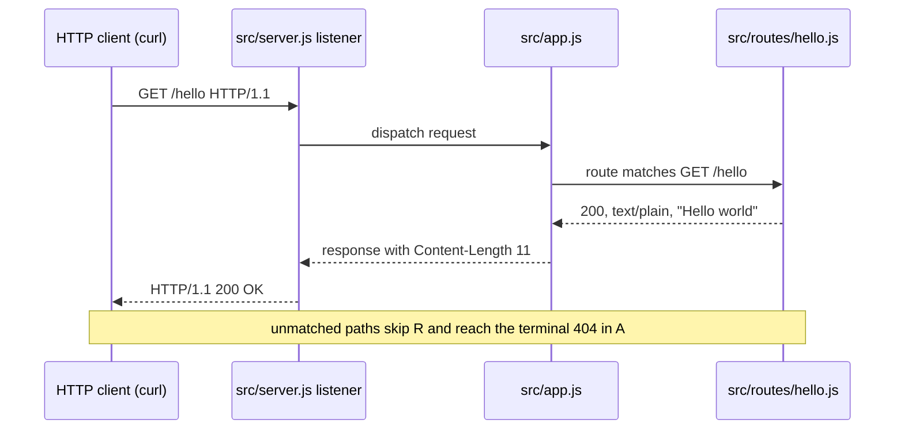
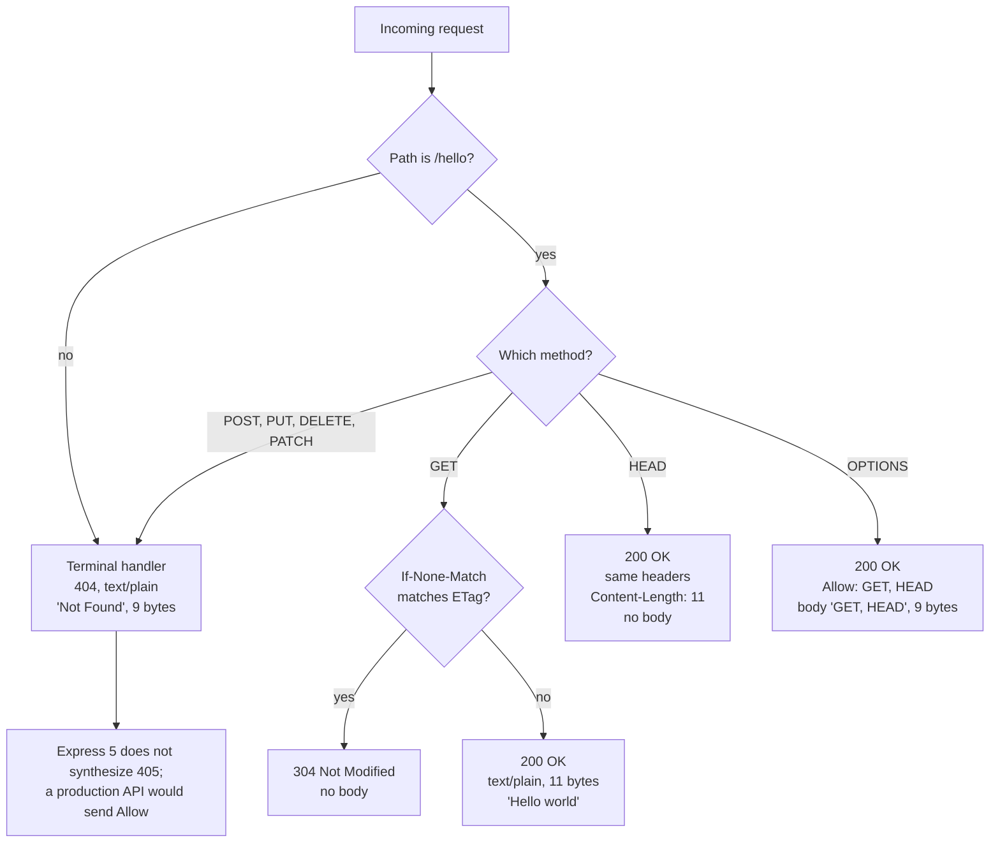

# `GET /hello` API reference

This document is the single authority for the HTTP contract of the Node.js
tutorial service. Every value it publishes as a transcript was captured from a
running server on Node 24.21.0 rather than written from expectation. The
matrix rows marked *inferred* are the deliberate exception and are excluded
from that claim: they carry no transcript, and the legend beside the matrix
states how each of them is known instead. The code behind the contract is
explained in [the annotated walkthrough](walkthrough.md).

## Overview

The service publishes exactly **one endpoint**, `GET /hello`. It answers with
the eleven-byte plain-text body `Hello world`, and there is nothing else to
call: no second route, no health check, no API versioning, and no
authentication on any path or method. The route is registered once
[src/nodejs-tutorial/src/routes/hello.js:28], and the application that mounts
it is assembled by the `createApp()` factory
[src/nodejs-tutorial/src/app.js:31].

Three behaviours come from Express rather than from the tutorial's own code,
and all three are documented here because a reference that listed only `GET`
and a not-found fall-through would be wrong about them:

- `HEAD /hello`, which Express derives from the registered `GET` route.
- `OPTIONS /hello`, which Express answers itself, with the method list it
  derives from that same route.
- The default weak `ETag`, which makes a conditional request answer `304`.

## The `GET /hello` contract

### The successful representation

These values are the representation `GET /hello` returns, and the derived
`HEAD /hello` returns the same headers without the body. They are not the
values of every `200`: the automatic `OPTIONS` answer is a `200` too, and it
carries a different media type, a different length and a different body. The
`404` and `304` responses differ again. The matrix further down sets each case
out.

| Field | Value |
| --- | --- |
| Method and path | `GET /hello`, plus the derived `HEAD /hello` |
| Success status | `200` |
| Response body | `Hello world` — 11 bytes, no trailing newline |
| `Content-Type` | `text/plain; charset=utf-8` |
| `Content-Length` | `11` |
| `ETag` | `W/"b-e1AsOh9IyGCa4hLN+2Od7jlnP14"` |
| `X-Powered-By` | Absent on every response |

The `ETag` is a deterministic weak hash of the fixed body, so it is the same
on every run of the unmodified service. `X-Powered-By` is absent because it is
disabled immediately after the application is created
[src/nodejs-tutorial/src/app.js:37]. `HEAD /hello` returns no body while still
advertising `Content-Length: 11`.

**The body has exactly one interior space.** The request this tutorial answers
was written with a double space, but that space sat *outside* the quoted
string. The verified `Content-Length: 11` settles the question:
`H-e-l-l-o-SPACE-w-o-r-l-d` is eleven bytes, where a doubled interior space
would be twelve. The string has a single definition in the codebase, the
`HELLO_BODY` constant [src/nodejs-tutorial/src/routes/hello.js:19].

### Service-wide properties

These hold regardless of which response is returned.

| Property | Value |
| --- | --- |
| Bound host and port | `127.0.0.1:3000` by default |
| Overrides | `HOST` and `PORT`, read from the environment |
| Authentication | None, on any path or method |
| Versioning | None — no version prefix and no version header |

The two defaults are literals in the server entry point — the `DEFAULT_HOST`
constant [src/nodejs-tutorial/src/server.js:33] and the `DEFAULT_PORT`
constant [src/nodejs-tutorial/src/server.js:43]; every command documented in
this tutorial uses them unchanged. Loopback binding is deliberate, so the
tutorial server is not reachable from the network.

An override is validated before anything is bound, so not every value is
accepted: blank or unset takes the default, a `PORT` must be a whole number
from 1024 to 65535 [src/nodejs-tutorial/src/server.js:122-144], and a `HOST`
must contain no whitespace and no control characters
[src/nodejs-tutorial/src/server.js:152-171]. A value that breaks either rule
is refused with one line on standard error and an exit status of `1`, and no
socket is opened at all — so the responses documented here are served only on
a binding the entry point accepted.

### The complete method and path matrix

The `Evidence` column records how each row is known, and the two values mean
different things:

- **executed** — a transcript captured from a running server is published
  below for that row.
- **inferred** — no transcript is published for that row and no automated
  assertion covers it. It is known from the source and from Express's own
  routing: a request that matches no route reaches the same terminal
  not-found handler [src/nodejs-tutorial/src/app.js:50-55] that produced the
  executed `404` transcripts, and a `HEAD` response never carries a body.

What the automated suite proves is narrower than either column. The four
tests in `test/hello.test.js` pin the status, the body bytes and the media
type of `GET /hello`, and the status, body, byte count and media type of one
unmatched `GET` [src/nodejs-tutorial/test/hello.test.js:37-102]. They assert
nothing about the other methods and nothing about the `HEAD`, `OPTIONS` or
conditional-`304` behaviours. Everything beyond those two paths rests on the
captured transcripts below or, for the inferred rows, on the source reasoning
above.

| Request | Response | Evidence |
| --- | --- | --- |
| `GET /hello` | 200, 11-byte `Hello world` | executed |
| `HEAD /hello` | 200, same headers, no body | executed |
| `GET /hello`, matching `If-None-Match` | 304, no body | executed |
| `OPTIONS /hello` | 200, `Allow: GET, HEAD` | executed |
| `POST /hello` | 404, 9-byte `Not Found` | executed |
| `PUT`/`DELETE`/`PATCH` on `/hello` | 404, exactly as `POST` | inferred |
| `GET`, unmatched path | 404, 9-byte `Not Found` | executed |
| `OPTIONS`, unmatched path | 404, no `Allow` | inferred |
| `HEAD`, unmatched path | 404 headers, no body | inferred |

Each compressed cell is expanded by the section that carries its transcript.
In full: every `404` row carries `text/plain; charset=utf-8` with
`Content-Length: 9`, and all of them send the nine-byte body `Not Found`
except one — `HEAD` on an unmatched path advertises that same length and sends
no body at all, because a `HEAD` response never carries one. The `304` row
carries no body, no `Content-Type` and no `Content-Length`; and the `OPTIONS`
row carries `Content-Type: text/plain` with no charset parameter, plus
`X-Content-Type-Options: nosniff` and a nine-byte body. `OPTIONS` on an
unmatched path has no matched route and therefore no method list for Express
to answer with, so it receives the ordinary `404`.

### Transport-dependent observations

Three header lines appear in the transcripts below that are **not** part of
the contract. They are observations of the specific `curl` invocation that
produced each transcript, and no test asserts them:

- `Date` varies with every request.
- `Connection: keep-alive` and `Keep-Alive: timeout=5` appear because `curl`
  negotiates keep-alive by default. A client sending `Connection: close`
  receives `Connection: close` and no `Keep-Alive` header at all — verified
  against the same server that produced the transcripts.

Every other line in each transcript is a contract value this document fixes.

## Request example

The endpoint needs no headers beyond `Host`; `Accept` is shown because a
learner reading a raw request will expect it.

```http
GET /hello HTTP/1.1
Host: 127.0.0.1:3000
Accept: text/plain
```

The host is written `127.0.0.1` here and everywhere else in this tutorial,
matching the `DEFAULT_HOST` literal in the server entry point
[src/nodejs-tutorial/src/server.js:33].

## The 200 response

**Command:**

```bash
curl -i http://127.0.0.1:3000/hello
```

**Output with headers:**

```text
HTTP/1.1 200 OK
Content-Type: text/plain; charset=utf-8
Content-Length: 11
ETag: W/"b-e1AsOh9IyGCa4hLN+2Od7jlnP14"
Date: Mon, 14 Sep 2026 17:02:47 GMT
Connection: keep-alive
Keep-Alive: timeout=5

Hello world
```

The `Date` value above varies per request, and the two keep-alive lines are
the `curl`-negotiated observations described earlier. The rest is fixed: the
status, the media type, the eleven-byte length, the `ETag`, and the body.

## Unknown paths and other methods

Every request the single route does not match reaches the terminal handler
registered last in the application [src/nodejs-tutorial/src/app.js:50-55].
That handler answers `404` with a nine-byte `text/plain` body, and that `404`
is the only response the tutorial's own code produces besides the `200` on
`GET /hello`. The service returns two more that no handler here writes: the
automatic `OPTIONS` answer and the conditional `304`, both supplied by Express
and both documented in their own sections below.

### The unmatched-path 404

**Command:**

```bash
curl -i http://127.0.0.1:3000/unknown
```

**Output with headers:**

```text
HTTP/1.1 404 Not Found
Content-Type: text/plain; charset=utf-8
Content-Length: 9
ETag: W/"9-0gXL1ngzMqISxa6S1zx3F4wtLyg"
Date: Mon, 14 Sep 2026 17:02:47 GMT
Connection: keep-alive
Keep-Alive: timeout=5

Not Found
```

### `POST /hello`, byte-identical to that 404

**Command:**

```bash
curl -i -X POST http://127.0.0.1:3000/hello
```

**Output with headers:**

```text
HTTP/1.1 404 Not Found
Content-Type: text/plain; charset=utf-8
Content-Length: 9
ETag: W/"9-0gXL1ngzMqISxa6S1zx3F4wtLyg"
Date: Mon, 14 Sep 2026 17:02:47 GMT
Connection: keep-alive
Keep-Alive: timeout=5

Not Found
```

This response is byte-identical to the unmatched-path `404` above, **its
`ETag` included**. That identity is the evidence that Express 5 does not
synthesize a `405` for an unsupported method on a matched path: the request
simply falls through the route and reaches the same terminal handler, which
cannot tell the two cases apart.

### The `HEAD /hello` response

**Command:**

```bash
curl -I http://127.0.0.1:3000/hello
```

**Output with headers:**

```text
HTTP/1.1 200 OK
Content-Type: text/plain; charset=utf-8
Content-Length: 11
ETag: W/"b-e1AsOh9IyGCa4hLN+2Od7jlnP14"
Date: Mon, 14 Sep 2026 17:02:47 GMT
Connection: keep-alive
Keep-Alive: timeout=5
```

`Content-Length: 11` is advertised while no body is sent, which is correct for
`HEAD`: the headers describe the representation a `GET` would return. The
route module registers no `HEAD` handler at all
[src/nodejs-tutorial/src/routes/hello.js:28] — Express derives this response
from the `GET` route.

## The `OPTIONS /hello` response

**Command:**

```bash
curl -i -X OPTIONS http://127.0.0.1:3000/hello
```

**Output with headers:**

```text
HTTP/1.1 200 OK
Allow: GET, HEAD
Content-Length: 9
Content-Type: text/plain
X-Content-Type-Options: nosniff
Date: Mon, 14 Sep 2026 17:02:47 GMT
Connection: keep-alive
Keep-Alive: timeout=5

GET, HEAD
```

Two details of this response are easy to miss and both matter. Its
`Content-Type` carries **no charset parameter**, unlike every other response
that sends a `Content-Type` at all: the `200` and the `404` both spell out
`charset=utf-8`, and the `304` sends no `Content-Type` to compare with. And
the nine-byte body *is* the allowed-method list itself, the same string as the
`Allow` header.

Neither source module registers `OPTIONS` or defines an `Allow` header. Both
come from Express, which derives the method list from the single registered
`GET` route — that is why the list is `GET, HEAD` and not just `GET`. The
response is kept rather than suppressed, because it is correct HTTP behaviour
and it shows a learner that Express answers more than the one route they
wrote. On an **unmatched** path, however, no route matches, so Express has no
method list to answer with and the request receives the ordinary `404`.

## Conditional requests

Express computes a default weak `ETag` over the response body, and the
tutorial keeps it [src/nodejs-tutorial/src/routes/hello.js:36]. Because the
body never changes, the `ETag` is stable, which makes a conditional request a
demonstrable lesson rather than an unexplained header: send the `ETag` back in
an `If-None-Match` header and the server answers `304 Not Modified` instead of
resending the body.

**Command:**

```bash
curl -i -H 'If-None-Match: W/"b-e1AsOh9IyGCa4hLN+2Od7jlnP14"' http://127.0.0.1:3000/hello
```

**Output with headers:**

```text
HTTP/1.1 304 Not Modified
ETag: W/"b-e1AsOh9IyGCa4hLN+2Od7jlnP14"
Date: Mon, 14 Sep 2026 17:02:47 GMT
Connection: keep-alive
Keep-Alive: timeout=5
```

A `304` carries no body, and it carries neither `Content-Type` nor
`Content-Length` — the client already holds the representation those headers
would describe. A stale or absent `If-None-Match` produces the ordinary `200`
with the full body.

## The request path

A request crosses three modules and comes back the same way. The listener owns
the socket, the application owns the dispatch, and the route module owns the
response.



Only the route module decides the body; `Content-Length` and the `ETag` are
derived from that body by Express as the response passes back out. What each
module does, line by line, is the subject of
[the annotated walkthrough](walkthrough.md).

## How a request is resolved

This is the diagram that makes the absence of a `405` comprehensible rather
than surprising: the path is matched first, and a request to `/hello` with an
unsupported method leaves the route unmatched, so it lands in exactly the same
terminal handler as a request to a path that does not exist.



Two branches of that diagram are not the tutorial's code. The `OPTIONS` answer
is produced by **Express, not by the route module**, and so is the `HEAD`
response; the tutorial registers a single `GET` handler and nothing else
[src/nodejs-tutorial/src/routes/hello.js:28].

The `405` a production API would return in place of the fall-through is
**deliberately omitted** here, not overlooked. The Flask application in this
same repository does return it: its handler builds the `405` envelope, hands
it to `jsonify()` and sets the status [src/backend/app.py:535-547], and then
sets `response.headers['Allow']` from the framework's own method list
[src/backend/app.py:550-552]. The tutorial keeps Express 5's real behaviour
and documents it truthfully instead of adding a handler that would make the
two projects look alike when they are not.

## Response headers explained

- `Content-Type`: `text/plain; charset=utf-8` — the media type of the body,
  expanded by Express from the short form `text/plain` passed by the handler
  [src/nodejs-tutorial/src/routes/hello.js:36]. The `OPTIONS` response is the
  one exception: Express sets `text/plain` there with no charset parameter.
- `Content-Length`: `11` — the response body length in bytes, derived by
  Express from the body the handler sent. It is `9` on the `404` and on the
  `OPTIONS` response, and absent on the `304`.
- `ETag`: `W/"b-e1AsOh9IyGCa4hLN+2Od7jlnP14"` — Express's default weak
  validator, a deterministic hash of the body. Stable across runs because the
  body never changes, which is what makes the conditional request above
  reproducible.
- `X-Content-Type-Options`: `nosniff` — sent by Express on the `OPTIONS`
  response only, and not by the tutorial's code.
- `X-Powered-By`: *disabled* — Express would advertise itself with this header
  on every response; it is switched off once, during assembly
  [src/nodejs-tutorial/src/app.js:37], so it appears on no response at all.

### Security headers, and the production alternative

Between them, the list above, the `Allow` header on the automatic `OPTIONS`
answer and the transport lines noted earlier account for every header this
service sends. Reading that set the other way round is the point of this
subsection: the security headers a production service is expected to send are
**absent** here. There is no `Strict-Transport-Security`, no
`Content-Security-Policy`, no `X-Frame-Options`, no `Referrer-Policy`, and no
`X-Content-Type-Options` on the `200` or on the `404` — the `nosniff` header
listed above is sent by Express on the `OPTIONS` answer and nowhere else. The
application registers no security-header middleware at all
[src/nodejs-tutorial/src/app.js:31-58].

That omission is deliberate, for the same reason the `405` is: the tutorial
serves one public, read-only greeting on the loopback interface, and every
middleware layer it does not have is one fewer construct between a learner and
the route. It is **not** a pattern to carry into a production service. The
production alternative is a dedicated security-header middleware mounted ahead
of the routes — `helmet` is the package Express's own production
best-practices guidance recommends for exactly this, and it sets that family
of headers from a single `app.use()` call. The Flask application in this
repository does the same job by hand: it names `X-Content-Type-Options`,
`X-Frame-Options`, `X-XSS-Protection`, `Referrer-Policy`,
`Content-Security-Policy` and `X-Permitted-Cross-Domain-Policies`, then
applies every one of them to each outgoing response
[src/backend/app.py:240-251].

Naming that alternative changes nothing above it. The headers this service
sends are the headers the transcripts show, and adding the middleware would
add headers no transcript here records.

### Optional byte-exactness confirmation

This check is **optional** and no step of the tutorial depends on it. It is
included because it is the only way to see, rather than infer, that the body
carries no trailing newline.

**Command:**

```bash
curl -s http://127.0.0.1:3000/hello | wc -c
curl -s http://127.0.0.1:3000/hello | od -c
```

**Output:**

```text
11
0000000   H   e   l   l   o       w   o   r   l   d
0000013
```

`od` prints offsets in octal, and `0000013` is octal for 11 — the end offset
equals the byte count, so there is no twelfth byte and therefore no trailing
newline. The single space between `o` and `w` is the body's one interior
space.

## Authentication

**There is none.** No credentials, tokens, API keys, cookies or signed headers
are required on any path or method, and none are checked: the application
registers no authentication middleware
[src/nodejs-tutorial/src/app.js:31-58]. A bare `curl` with no headers beyond
`Host` receives the full `200` response, which is what every transcript above
shows. Nothing about this is a recommendation for a real service; it is the
consequence of a tutorial that serves one public, read-only greeting.

## How this differs from the Flask `/hello`

This repository serves `/hello` twice: from this tutorial, and from the Python
Flask application under `src/backend/`. The two contracts are different, and
this document describes only the tutorial's.

| Aspect | This tutorial | Flask application |
| --- | --- | --- |
| Media type | `text/plain; charset=utf-8` | `application/json` |
| Body size | 11 bytes | 86 bytes |
| Body shape | the bare string | `message`/`status`/`timestamp` |
| Unsupported method | `404`, no `Allow` | `405` with `Allow` |

The Flask handler builds a dictionary of `message`, `timestamp` and `status`,
passes it to `jsonify()`, and sets `Content-Type: application/json` together
with `X-API-Version: 1.0` [src/backend/app.py:367-411]. Through its
application factory the body is compact JSON of 86 bytes including a trailing
newline, in which `Hello world` is only the value of the `message` field —
whereas the tutorial's eleven bytes *are* the greeting.

The divergence is resolved by scope, not by compromise. The tutorial
implements the plain reading of its own requirement, that the response bytes
are the quoted string — which is also the contract this repository's
contribution guide had published for the endpoint before any implementation
existed to serve it. That guide no longer states the contract itself: its
`API Documentation Format` section points here for it, and documents the
endpoint by linking rather than by restating
[CONTRIBUTING.md:1980-2016]. The Flask application keeps its JSON envelope
untouched. Documenting the difference explicitly is what keeps either project
from asserting a contract its own application does not serve.
